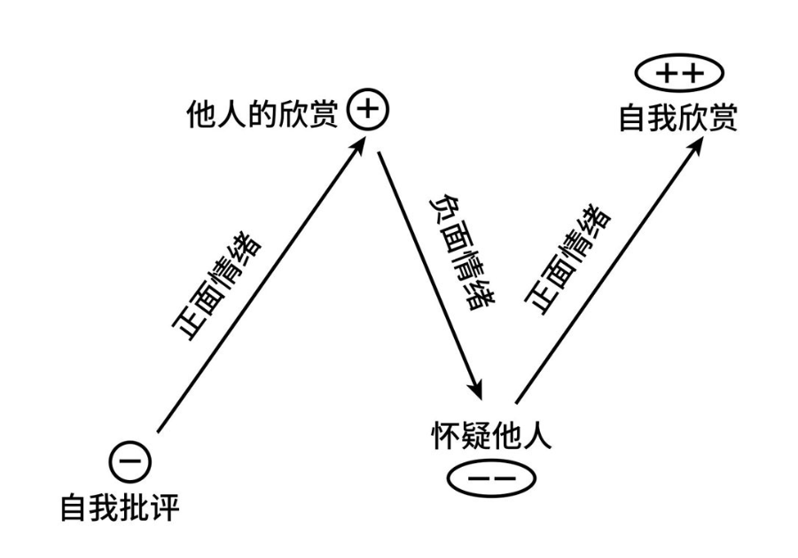

# 0501. 完整故事

The Full Story

前一章用广角视角纵览了故事的八个阶段，让我们能够将故事划分为主要构成部分进行剖析。如果你想更快掌握故事的核心，不妨选一个你钟爱的故事，分析它的八个阶段，隐藏在深处的故事普遍形式就会自行浮现。

本章用特写视角深入研究这八个阶段和它们的不同形式，让你练好手艺打造自己的故事。讲故事的人就像作曲家一样，也要掌握不同的乐器。多个声部渐渐增强，最终和谐融入彼此。

## 01. 第一阶段：目标受众

### 基本原则：意味深长的情绪感染

虚构作品的创作者，不管是小说家、舞台剧作家还是影视编剧，通常都能够想象出他的故事面对的是哪类消费者。好的故事创作者在职业生涯中会逐渐培养出敏锐的直觉，知道他们理想的目标读者 / 目标观众是谁，同时也对作品将会引发的情感效应胸有成竹。喜剧作家的目标是观众的笑声；爱情故事的作者希望作品让人潸然泪下；动作片创作者追求兴奋和刺激；包含复杂心理活动的故事旨在引发同样心绪万千的情感共鸣。专业的创作者最终评价作品质量的时候不是基于作品对自己的影响，而是基于他想在受众心中引起的共鸣实现了多少。

不过，对于市场营销的故事创作者而言，定义目标受众要更困难一些。关于这种目标明确的故事的第一阶段，有许多维度的研究，我们将在下一章中更深入地进行了解。

## 02. 第二阶段：主题

### 基本原则：平衡

贫瘠的土地上无法生长出有力量的故事。故事的背景设定必须经过巧妙的构思。一旦目标受众进入视野，故事创作者就要从头开始打造他们的故事，从故事的基石开始一步步进行准备。

故事的主题包含三个主要元素：社会背景、主要人物以及核心价值。生活为故事创作者提供了无限的可能性。

独一无二的原创性是点亮非凡故事的火花。但这种火花并不是在创作者无所事事地做白日梦的时候闪现的。只有当创作者脚踏实地地做好基础工作，耐心搭建故事世界，从零开始进行设定的时候，火花才会在他的想象中迸发。

因此，搭建故事世界是关键的第二步。站得住脚的选择能够显著提高成功的概率，而疲软无力的选择会引发后续的塌方，把紧随其后的五个阶段葬送在这个阶段。最软弱的选择是在普遍与特殊之间选择前者。

创作者都希望自己的故事畅销，影响最广泛的受众，因此他们总会保守选择一体适用的万全之策，而不是独一无二的世界。遗憾的是，这样的决策不仅无法扩大潜在受众群体，反而会适得其反。

由特殊推向普遍是最适合人类思维方式的模式，而不是反其道而行之。用「一件家具」这个词来举例。想想看，读到这个词的时候，你头脑中只会有一个模模糊糊的形象。它限制了你的想象，不会促使你产生更多想法，因为你的思维没有获得任何指向特殊的推动力。但如果我说「一个有血红色皮垫的公爵靠背椅」，你的脑海中会马上闪现出一个清晰的图像。你的想象力本能地由特殊推向普遍，自动把这把椅子归类在头脑中的「家具」类目中。这个原则适用于故事世界中的方方面面，不管是物理层面还是社会层面。

因此，这阶段的原则如下：设定越具体越特别，故事的适用性就越广。

故事创作者必须以最终目的作为出发点，确定每个元素，随后对这些元素进行深入研究，得到若干独特的选择，最终把这些不同方向精确地整合到一起。创作者由此得到一个独特的故事世界，为最终创作出一流作品打下良好基石。

### 1. 时间

故事的设定涉及时间的两个维度：位置和跨度。

1. 时间中的位置。大部分故事发生在此时此刻，在这个当代社会中，其他则设定于历史上的某个阶段或是假想的未来，还有一些发生在不受时间限制的幻想世界中。

2. 时间的跨度。故事跨度指的是故事中的人物经历的时间，而不是指讲这个故事所需的时长。故事的时长短至几秒钟的 YouTube 视频，长至上百小时的多季长篇电视剧集。然而除了少数个例之外，故事内的时间跨度远远长于故事本身的时长。

### 2. 空间

两个维度构建了故事的空间：物理，即故事的横向景观及上面的每个物体；社会，即社会权力金字塔的纵向层级制度，以及上下移动的可能性。

1. 物理位置。许多故事，特别是舞台剧或情景喜剧，通常发生在单一的封闭空间内。比如家庭成员在客厅内争论到底该去哪里度假，地板上放着摊开的地图。而另一方面，大部分银幕或者书本中发生的故事地点总在改变，譬如一家人在私家车道上整理行李准备出发，随后在沙滩上野餐，在海景餐厅共进晚餐等等。

2. 社会位置。物理设定中包含着社会设定，人口统计学的因素定义了人物形象，比如年龄、性别、职业和种族。更重要的是这组人物置身其中的文化是什么。文化首先由价值观界定，价值观包括理想和现实两部分，也就是公民相信他们该怎样做，以及在实际中他们是怎样做的。

### 3. 核心价值

物理和社会维度让故事在时空当中立起来，但这只是两个维度。只有当创作者以价值标准的形式增加第三个要素，设定才能三维立体。

正如在第三章中我们提到的，在日常对话中，如果提到某一个体或机构有自己的「价值标准」，我们指的是真实、爱、慷慨、勤奋、忠诚等诸如此类的正面品质。但对于故事创作者而言，他在故事中注入的价值观不能是单一的，而应该是正 / 反负荷二元对立的，如真实 / 谎言，爱 / 恨，慷慨 / 自私，勤奋 / 懒惰，忠诚 / 背叛，生 / 死，勇敢 / 懦弱，希望 / 绝望，意义 / 虚无，成熟 / 幼稚，正义 / 不公…… 这个清单上包含了人类经验中一切能够推动情感力量在正负两端之间来回游走的品性。

一个故事可以包含任意数量、种类和组合的价值观念，但是它的内容紧密围绕一组不可替代的二元对立价值，即故事的核心价值。这一价值标准决定了故事最根本的意义和情感。

假设这个故事的核心价值是爱 / 恨。赋予事件意义的是主人公如何由爱至恨、因恨生爱的过程以及背后的原因。当故事在正负力量之间来回摇摆的时候，故事中的人物和故事受众的情感会自然流淌。

但如果故事创作者把笔下人物生活中的爱 / 恨替换为道德 / 不道德，那么这一核心价值的变动就会把他的作品从爱情故事发展为救赎故事，从而赋予它全新的意义和情感。

如果犯罪故事的核心价值从正义 / 不公转变为生 / 死，那么它就会转变为动作故事，同样会引发新的情感和新的意义。如果家庭故事不再聚焦于团聚 / 分裂的价值，转而强调某个子女的成熟 / 不成熟，故事类型就会从家庭剧彻底变成青春片。核心价值是故事跳动的心脏，决定了故事的特殊意义和独特的情感影响。

### 4. 核心角色

我们最好把人物设计想象成有行星和卫星的太阳系，太阳（故事的核心人物，也就是主角 / 英雄）在中心燃烧，彗星（配角）围绕太阳运行。明星角色通常是单个人物，但也可以是双雄（如《末路狂花》）、团队（如《无耻混蛋》）、机构（如《传染病》中的疾病防治中心），甚至作为一个庞大集体挣扎生存的全人类（如《世界之战》）。

如果这个角色由两个或以上的人物担纲，那么他们通常作为一个人行动：这个集体中的所有人追求的是同一个东西，在追寻的过程中共同受难或者共同受益。不管其中一个人遭遇了什么，是正面还是负面，集体中的所有人都会受到影响。

核心角色不一定需要让人同情，但一定要让人感同身受。两者的不同之处在于：让人同情意味着「讨人喜欢」，一个让目标受众想要当朋友、家庭成员或者邻居的亲切同伴。而「感同身受」意味着「像我一样」，即核心人物和目标受众共同拥有的与生俱来的特点。

让人同情可有可无，而感同身受必不可少，原因如下：观众的参与度取决于行为背后的身份认同感。不管角色多有吸引力，多让人同情，观众绝不会仅仅因为对方个性迷人就产生共鸣。相反，只有当观众下意识地分辨出角色自内而外自然流露出的人性光辉时，观众才会基于移情作用，和角色产生心理连接。而角色的这一品质成为故事的善意核心。

### 5. 善意核心

从故事出现的那一刻开始，受众本能地立刻开始审视包裹着价值观的故事全局，寻找一个移情的入口，进入故事的情感之门。他们区别出正负、好坏、正确与错误、有价值与没有价值的事物，寻找着善意核心。因为在每个人的内心深处，都本能地自认为是好人。

我们都知道自己绝非完美无瑕，可能还需要道德上的审慎，但是当我们衡量内在的正负力量之时，我们感觉总体来说我们是好的，或者至少是正确的。就连罪大恶极的人都觉得自己的所作所为是有正当理由的，不信你去问问看。因此，所有人类，不管有没有人性，都在故事世界中寻求着正面的光辉，进而产生共鸣。

理想情况下，故事创作者会把这个善意核心置于主角身上。这个核心角色内心散发出正面的人性光辉，从而抓住受众的个人情感。这种移情作用也是镜像故事的出发点，关于这一点我们将在第六章中进一步展开。

请注意，善意核心原则不代表故作多情或者盲目乐观。就像太甜的糖会让牙齿痛一样，太甜蜜的世界让人觉得不真实。[1]

### 6. 生活始于平衡

故事开始前，它的物理设定、社会设定、核心价值及核心角色都处于平衡之中。主角当然也会有日常的起伏，这很正常，谁没有呢？但是他对自身存在的合理性拥有绝对的主权。直到发生了……

## 03. 第三阶段：激励事件

### 基本原则：失衡

定义：激励事件打破主角的生活平衡，将故事的核心价值正向或者反向扭转，但毋庸置疑地推至失常状态。这个转折点是后续事件的起始，推动主角采取行动。

激励事件既可以是宏大的社会事件，也可以是悄然发生的内在事件，无论是国家层面的领袖变更，还是主人公自己改变主意都可以。它可以是偶然（中彩票），也可以是决定（辞职创业），可以造成正面转变（升职），也可以造成负面转变（破产）。它通常在一开始转向正面（如主角爱上了一个好男人），然后由正转负（却发现对方已婚）。

从激励事件开始，核心价值随着故事发展，在两极之间动态摇摆。在故事领域，「动态」的含义不仅意味着「活跃」或「有力」。它代表故事事件内在价值正负两极的轮转造成的持续变化发展。

从受众的角度来看，激励事件有四个效果：

首先，它能够抓住注意力。正如我们先前指出的，改变对人类的思维模式有天然的吸引力。激励事件对主角人生的突然颠覆让观众的兴趣聚焦于此。

其次，激励事件提出了最戏剧化的问题：「事情的结果将会如何？」这个关键问题就像强力心理胶水一样。回想一下，你耐着性子看完了多少糟糕的故事，只是因为这个问题一直纠缠不休：「这破玩意儿最后到底怎样了？」

再次，对关键问题的好奇和对主角的感同身受融合在一起，形成了故事最诱人的魅力：悬念。悬念将观众的兴趣深化为情感投入。主观认同和客观上想知道发生了什么这两个心理动因将故事的力量放大了十倍。

第四，就在观众看到主角生活失衡的那个瞬间，他 / 她的想象中会形成一个画面，观众知道他们在故事结束之前一定会看到这个场景。听了一辈子故事，观众知道一旦激励事件爆发，负面力量会持续阻挠主角的行为，直到他终于和危机面对面，在某种程度上这也是敌对力量最集中的时刻。

这个决定性的对峙时刻有时候被称为「必要场景」。因为观众已经有了这样的想象和预期，讲故事的人有责任把这个场景展现出来，否则就太无理了。

## 04. 第四阶段：欲望对象

### 基本原则：未被满足的需求

当某个事件迫使你的生活失去平衡，你最想要的是什么？任何一个人最想要的是什么？生存的主权。激励事件将生活推至失衡状态，激发人类自然的欲望 —— 夺回控制权，找回平衡。

这一初始事件令主角察觉到，他所站立的位置遭遇了突如其来的、重大甚至很可能是危险的倾斜。欲望对象由此产生，他感觉只有得到欲望对象，他的生活之船才能重归平稳。欲望对象可以是具体的，比如加薪、创新产品、合适的恋人，也可以是情境，比如升职、离婚、复仇，甚至可以是观念上的，比如对自己的深刻洞察、更高的事业目标或者终身信念。几乎没有任何故事的欲望对象是完全一样的，理想情况下，欲望对象应当独一无二，专属于它的故事背景。

然而有一点是相同的，所有故事都戏剧性地展现了人类最基本的挣扎 —— 为混沌的生活赋予秩序，让失衡重归平衡。

我们用风险来衡量欲望对象的价值。风险越大，欲望对象的价值就越高。什么样的事物让你愿意付出时间？什么样的事物让你愿意冒生命风险？什么样的事物让你愿意以灵魂交换？最诱人的欲望对象有最高的价签。事物的价值越高，观众的感情投入越深。相反，看着一个角色追求没什么价值的东西则是无聊的同义词。

故事塑造了角色时时刻刻的挣扎，但是生活的复杂性却如同一座充满欲望和需求的蜿蜒迷宫。讲故事最终成为融合与组织的艺术，将欲望的洪流融合成一系列瞄准单一欲望对象的事件。

让角色奋力寻回生活平衡的欲望对象由他生活的文化背景决定。文化理想决定了引导主角的前景欲望（他应当想要什么）和背景欲望（他不能想要什么）。

我们每个人都会不断察觉到自我和生命中遇到的其他人之间的关系，比如我们在交通中的安全，侍者给我们领的座位，我们在同事中的层级位置…… 这仅仅是三个我们在社会中遇到的例子。我们对与朋友、家人和爱人之间的亲密关系非常敏感。同时我们还了解内心最深处的自我以及身体、精神、情感和道德的幸福状况。更重要的是，我们深知自己在时间长河中的位置，包括过去的经历、现在的状态和未来的憧憬。复杂交错的关系创造了前景和背景的欲望 —— 生活的必需和禁忌。

这些欲望不仅构筑了角色的生活现状，同时也调节着他的行为。背景欲望构成抑制之网，限定了每个角色在每个场景中的行动范围。对稳定的追求约束着角色的行为，限制他在得到欲望对象的过程中不该说什么、不该做什么。

然而主角的欲望对象不应当和他的动机混为一谈。欲望回答的是「什么」：他主观上想要得到什么？潜意识里在寻求什么？而动机回答的是「为什么」：为什么这个人物想要得到这个？为什么他想得到特定的欲望对象？

人类动机的根源往往可以追溯至孩童时期，因此通常是非理性的。讲故事的人想对人物动机挖掘到多深完全取决于他自己，有些人偏好于此，有些人则置之不理。

查尔斯·达尔文、德拉诺·罗斯福、毕加索等等这些历史人物的传记作者用大段篇幅描述养育的细节，想记录下激励这些名人取得伟大成就的童年经历。

与之相反，莎士比亚从不讨论动机。他不告诉我们为什么雄心勃勃的麦克白被内疚折磨，为什么嫉妒吞噬了名将奥赛罗，为什么愚蠢的李尔王会相信年迈的时候女儿们会照顾自己。这些悲剧的灵魂只是做出那些迷人的举动，让我们屏住呼吸。

## 05. 第五阶段：第一个行动

### 基本原则：策略选择

欲望需要行为。为了找回生活平衡，核心人物必须采取行动。当他这样做的时候，他采取的行动和得到的反馈推动他接近或远离欲望对象。这一正向 / 负向动态将故事推至高潮。故事创作者若想创造出独特并且吸引人的行为，就必须善于观察人类行为和其背后的原则。比如下述两个原则：

### 原则一：异质策略

每个人从此刻到下一刻的行动基于他对概率的预判，即他认为采取下一步行动之后可能会发生什么。每个人对可能发生之事的感觉源自他过去每个日日夜夜的全部经验。过去的生活经历给了他独一无二的视角，让他判断出世界在物理、社会、个人、内在四个维度是如何运转的，或者说理应如何运转。因此，从一个瞬间到另一个瞬间，无论是深思熟虑还是本能反应，人在直觉引导下采取大概率会引发周围人事物的正面反馈的行动。

为了接近当下的欲望和长期愿望，人们从个人策略的箭囊中选取战略性的行为。由于每个人都是独一无二的，每个人对行动的预判也不尽相同。因此，他的策略选择（包括具体言辞、姿态、表情等等）也是独一无二的。

换言之，所有的行为都反映出某个独特立场。每个人的基因和经验的结合体都无可替代，有多少人生存在世界上，就有多少种对真实世界的独特观念。正是无穷的异质策略激发了故事创作者的灵感，让他们构思出独特人物。那些最巧妙的故事中的主人公通常具有前所未见的迷人举动。

### 原则二：风险规避

进化论设定了一切生物的基因：尽可能地保存生命，直到耗尽最后一个卡路里；尽可能地追求所有必要的欲望，但规避不必要的风险。因此，人性作为大自然的一部分，在追求想得到的事物的过程中，总是在可选择范围内保守地采取最低限度的必要行为。

不然人有什么动机采取相反的策略呢？如果有更便捷更安全的选择，为什么要浪费多余精力或者冒不必要的风险呢？没有人会这样做，因为它违背自然规律。

因此，风险规避原则是这样的：角色只会做必要之事，不会多做，也不会少做。他会在自己认为能够找回生活平衡的策略中，去保守地选择最低限度的有效行为，但是请一定记住，对于什么是多，什么是少，什么是刚刚好的判断因人而异，并且人和人的判断之间差异巨大。每天，每刻，我们通常会正确地做出选择。我们 99% 的行为产生的影响都在预料之中。我们招手叫车，出租车应声而停；我们用谷歌查问题，维基百科给出答案；我们给朋友打电话，对方会很高兴听到我们的声音。我们采取行动，而这个行动导致的结果通常和我们想象的一样，于是我们继续过日子。这就是生活。但是这绝对不是故事。

为了给观众创造出意义深远的情感体验，故事创作者必须摒弃所有空洞的瞬间、所有细枝末节和陈词滥调，全心全意地拥抱那些带来价值改变的事件，且只专注于这些事件。

若想制造改变价值的事件，故事创作者应当令核心人物对概率的预判与现实产生必然的对立。概率指的是我们在做出行动之前认为会发生的事；而必然指的是当我们已经采取行动之后，实际造成的结果。当核心人物的第一个行动（基于他对概率的主观判断）和故事世界中的第一个反馈（基于现实中的客观必然）产生碰撞时，受到威胁的价值观向相反方向移动。

## 06. 第六阶段：第一个反馈

### 基本原则：悖反期望

第一个反馈背后蕴涵着许多影响因素和影响力量，下面我们将逐一进行分析：

### 1. 悖反期望

当角色所处的世界给出的反馈和他预期的反应截然不同，并且 / 或者更加强烈的时候，这种对期望的悖反造成巨大的震惊，紧随而来的是更深刻的洞察。主角认为会发生的结果和实际产生的结果之间的冲突出乎他的意料，从而劈开了他对现实的认知。他注视着主观期望和客观结果之间的裂痕，突然间顿悟，瞥见了他的世界的真实面貌，以及之前未曾预见的对抗力量如何挡在他面前。

「对抗力量」这个词不一定等同于「反派角色」。反派角色存在于特定的故事类型中，如果大反派被放在恰当的位置上，可以形成绝佳的敌手，比如《终结者》中的形象。然而「对抗力量」本身指的是在物质或情境层面的冲突中出现的多种多样的障碍。

当出乎意料甚至截然相反的阻碍违背了主人公的期望之时，这一阻碍将他拉向与欲望对象相反的方向。主人公现在才意识到，得到他想要的东西可没那么简单。对抗力量有可能来自下述四个现实层面中的任何一个，也可以是多个维度的组合：物理层面、社会层面、个人层面和内在层面。每个层面都可能潜伏着许多障碍。

1. 物理层面的阻碍：事件、空间以及自然和人类世界中的物体产生的巨大力量。比如没有足够时间完成某件事、距离想得到的东西太遥远、大到龙卷风小到病毒的种种自然界骚乱、阴暗危险的城市小巷、突然发动不了的该死的破车等等。奇幻类型的作品为这些现实的力量增加了超自然的魔力，产生令人啧啧称奇的多样性和无限想象空间。

2. 社会层面的阻碍：组织机构和其中的个人产生的力量。社会层面的阻碍包括政府及国际、全国或地方的法律系统、企业、宗教机构、学校、医院、军方甚至慈善机构。任何地方的机构都会形成权力金字塔：金字塔顶端的人掌握巨大权力，底端的人权力几近于零，二者之间的人群有些许权力。怎样得到或失去权力？如何在金字塔中向上或向下移动？影响社会等级变动的有许多因素 —— 教育、个性、意志力以及更常见的 —— 运气。

3. 个人层面的阻碍：家庭、朋友及爱人之间的亲密关系通常充满问题，由此产生的喜悦与痛苦的力量。从性爱到离婚，从赠与礼物到为财产争执，这些都属于个人层面的阻碍。

4. 内在层面的阻碍：意识和潜意识的欲望产生矛盾时，人物身体、情感和理智内在的对立力量。当回忆背叛了你，身体出了问题，或者当情感淹没理智的时候，你要如何应对？比如，人物的焦虑会让他衡量成功的内在气压计在高压和低压之间来回摇摆，尽管从表面上看他的事业并没有任何改变。

### 2. 转折点

转变一场戏意味着改变它的价值负荷。「转折点」这个词代表意料之外的敌对力量违背了期望，推动价值由正到负或者由负到正的那个珍贵瞬间。转折点引发改变只有两种途径：一是通过人物的直接行动及其后续反馈，二是通过揭示秘密或未知事实及其引发的反应。

理想情况下，每场戏都会以上述两种途径之一围绕转折点改变方向。不符合这个标准的场景则是非事件，即没有行动改变。如果太多非事件连续出现，故事就会坍塌，陷入枯燥乏味的境地。相反，持续渐进的改变会像钳子一样牢牢钳住我们的注意力。

转折点同时融入了生活的理性与情感两个方面。为了理解这种孪生效应，我们需要对这两个方面分别进行分析。

### 3. 转折点的理性效应

本质上，期望悖反是意料之外的原因引发的结果。因此，转折点让受众的脑海中浮现许多问题，比如：「为什么事件会有这些意外转变？为什么主角没有预见到？为什么我自己也没有预见到？什么原因造成了这一惊人的转折？」

转折点在现实中戳破了一个洞，观众的好奇心促使他们想用信息来填补这个缺口。他们在脑海中快速回溯之前的场景和图像，寻找之前错漏的原因，想要揭开「为什么」之谜。答案早已在故事的设定中埋下了伏笔。当观众看到隐藏的真相的那一刻，会顿悟：「就是这样，现在我懂了！」这种洞察为观众带来喜悦和启发。

以《点球成金》为例：当球队总经理比利·比恩向首席球探和球队经理介绍赛伯计量学计划的时候，他以为员工会像他一样对这个项目的潜力兴奋不已。转折点：另两个人一听到这个计划就表示反对，拒绝执行计划，并且不惜一切手段对抗这个新策略。看到这里，我们不禁讶异地扬一扬眉毛，琢磨这是为什么。然后我们突然意识到，棒球运动毕竟是 19 世纪的发明，业内那些老员工按照传统方法工作并且比赛了一辈子，绝不会轻易拥抱 21 世纪的新方法。

碰了钉子之后，比利的策略推动故事向新的方向移动，磕磕碰碰地进入现代，从而推动电影达到正向高潮。在这个过程中，《点球成金》以对棒球历史的洞见、现代棒球方法及人物内心深处的真相作为对观众付出注意力的回报。

就像亚里士多德告诉我们的那样，观众最大的愉悦在于自行发现，而不是被动接受。当故事技巧化地把它的意义包裹在戏剧性之中的时候，观众不会感觉到精神压力，却会对世界和人心产生更深刻的理解。

### 4. 转折点的情感效应

感情始于对刺激的反射。当景象、声音、味觉和触觉对感官产生刺激的时候，理智会立刻开始分析它们的意义，判断它们是正面的还是负面的，比如有益 / 伤害，熟悉 / 陌生，美好 / 丑陋，支持我 / 针对我，诸如此类。

这一理性判断过程依赖于对改变的预判。如果生存环境是中立不变的，理智就会无视环境，专注于眼前的诸多人物。但是当环境产生改变的时候，认知会突然跳出来警告我们变化会威胁生存，这是动物本能。

一旦理性判断出变化对我们有利还是不利，特定的腺体开始工作，把混合物注入血液中。我们经历的这种化学物质的注入就是情感。正如我们在第三章中提到的，在最基础的层面，我们的感觉只有两种 —— 愉悦和痛苦，但是二者都有不同程度和不同复杂性的变体。这就是为什么不同的人对同样的刺激会产生截然不同的反应。这也解释了为什么同一个人会对刺激物产生两种对立的解读，从而体会到「复杂情感」。

因此，情感是变化的副产品。当理智察觉到由负到正的改变时，它会释放出带来愉悦感的物质；如果理智判定这种改变是由正到负的，则会释放痛苦。

把这种现象应用到讲故事当中，就可以给设计转折点提供灵感。例如：

#### 多芬的「真美行动」

《广告时代》提名「真美行动」为本世纪最佳五个广告营销活动之一。奥美的市场调研人员在研究中发现，只有 2% 的女性认为自己是美丽的，而 98% 女性认为自己有许多瑕疵，其中大部分都过于低估自己。所以联合利华在 2004 年发起了「真美行动」，目的在于说服女性相信自己的自然美。

2013 年，雨果·维嘉创作了名为「多芬真美素描」的视频。[2] 故事聚焦于一组自愿参与奇怪实验的女性：她们同意让素描艺术家为她们画像，实验要求艺术家不能看到她们，只能根据她们对自己的描述进行创作。这个勇敢的行为立刻引起了观众的共鸣。

当艺术家完成第一组素描作品的时候，他又重新画了第二组作品，第二次是根据陌生人对这些女性的描述进行创作。两组作品并列放在一起的时候，根据陌生人的观察画出的素描人像明显比这些女性对自己的苛刻描述更动人，也更接近真实。当参加实验的女性看到作品的时候，两幅肖像的差异让她们热泪盈眶。

### 5. 情感动态

上述图表展示了「多芬真美素描」的情感动态轨迹。它的转折点在核心价值观的「自我批评」和「自我欣赏」两极之间来回摆动。

故事是这样的：每位参与盲绘素描实验的女性都会用相对不吸引人的词汇描述自己（激励事件）。这些自我批评的举动扰乱了她们生活的平衡，将她们的情感状态从中性转变为负面。

随后，当女性看到根据陌生人的印象创作的赞美性的素描时，动态转向正面。她们露出愉悦的笑容（第一个行动）。这个转折点将故事从自我批评（负面）推向他人的欣赏（正面）。

但当女性的目光在两幅矛盾的肖像画之间来回移动的时候，她们对他人的正面意见产生了负面反应，进入自我怀疑（危机）。她可以信任陌生人吗？到底应该相信谁？相信自己，还是其他人？这个转折点将女性从他人的欣赏（正面）转向怀疑他人（双重负面），进而唤起观众相应的负面情绪。

想信任他人的愿望和自我怀疑的内在障碍进行斗争（第二个行动），直到人性中美好的一面胜出，说服主角选择用他人的视角看待自我（第二个反馈）。故事在自我欣赏的双倍正电荷中达到高潮。在这一决定性转变中，观众跟随女性战胜自我批评的过程，体验到同样的正面情感。

所有精彩的故事都向我们展现了生活是如何改变的，以及为什么会改变。如前所述，改变带来的副作用是情感。然而这些感觉只会在转变过程中表露出来。当故事从正到负移动时，观众产生悲观沉重的情感；当故事由负到正移动时，光明积极的情感充斥着他们的心灵。当转变完成之时，情感迅速消散，准备进入新的状态。想要抓住并保持这种情感参与度，故事的价值必须不断地动态变化。如果没有变化，再激昂有力、令人愉快的事件都会变成毫无感情可言的无聊叙述：「然后…… 然后…… 然后……」

## 07. 第七阶段：危机下的抉择

### 基本原则：洞察

主角通过动作和转折点不断追求欲望对象，直到接近故事结局的某一时刻，他人生中面对的最集中的冲突力量封锁住他的道路。这就是观众一直等待的那个必要场景。在这个危机时刻，主角已经想尽所有可能的办法，只有一个例外。他需要做出重大的决定，在一系列可能的行动中选择仅剩的那个策略，为了把生活拉回正轨进行最后一搏。

### 选择的本质

决策有两种：明确的选择，和两难之中的选择；前者容易，后者艰难。

明确的选择通常面对的是一正一负两个选项，本质上它已经自行为你做出了选择，因此容易。明确的选择遵循自然最重要的法则：永远选择有利的那个选项。

一切生物都本能地懂得主宰能量和生命延续的两个定律。若想得到所求事物：如果有更简单的途径，就不要多做冗余之事；如果有更安全的方法，就不要多承担不必要的风险。将这两个定律合并在一起，自然法则就会变成：面对一个非正即负的选择时，永远要选择有利的、正确的、好的选项，而不是负面的、错误的、坏的选项。

然而在实际应用时，人类很少做出完全理性的决策。自然法则受制于观点，以及伴随观点形成的主观甚至非理性的偏见。

基于这一点，我们既理解每个人都会做出有利选择，即他主观认为的有利选择，也看到了邪恶如海啸一样席卷世界。对此，我们只能抱持着对人性的敬畏做出让步。大脑能够将一切合理化，为了维系自己的生存，它会变不利为有利。

两难处境同样有两种，并且都是艰难的选择。因为我们面临的选择是在两个有利选项中择其一，或是在两个不利选项中择其一，也就是通常说的「两利相权取其重」和「两害相权取其轻」。

在第一种两难处境中，主角必须在两个合意的方向中选择一个。二者都是他想要的，但是条件只允许他选择其一。在第二种两难处境中，她必须在两个不合意的方向中做出选择。她一个都不想要，但是环境逼迫她做出选择。两难选择的艰难导致选择前的焦虑和选择中的风险。不管主人公做出何种选择，他都必须付出代价，以一种价值的丧失作为得到另一种价值的代价。[3]

在虚构作品中，当主人公遇到两难选择时，危机决策给主人公带来极大压力。但正如我们在下一章中将要了解的，在市场营销者讲述的目的型故事中，主角的高潮选择必须与压力无关。

## 08. 第八阶段：高潮反馈

### 基本原则：闭幕

主人公的战略起作用了。在故事的高潮，主人公的最终行动引发的反馈正是他希望的。故事的世界将主人公的欲望对象送交给他，他得到了他所需要的，生活回归到比故事开始时更完美的平衡状态。一切问题都得到了解答，一切情感都得到了满足，故事拉上帷幕。

### 递进原则

如果故事事件超过了上面描述的单一转折点，成为标准长度（电影或戏剧的标准为一至两个多小时）甚至长篇故事（如 500 页的小说或多季电视剧），那么故事的叙述将根据递进原则来塑造。

在多个转折点的案例中，故事向高潮和人物需求得到满足逐步推进，一系列转折点驱动主角远离（负）或接近（正）欲望对象。在标准长度或者长篇故事的动态中，不同层次的对抗力量的力度和集中度增强，从而加大了故事的深度和广度。使情况变得复杂的因素越来越强，促使主角更深入地挖掘自己的意志力，以及心理、情感和生理三个层面的能力，为了找回生活的平衡付出更多努力。

场景在故事价值观的正负两极之间动态移动，同时围绕渐进变化并且充满冲突的风险形成弧光。在追寻欲望对象的过程中，主角失去的越来越多。随着角色的挣扎逐渐递进，敌对力量也逐渐累积，制造出更大的危险。对主角内在能力的要求越来越高，主角面对的抉择也越来越困难。故事沿着这样的路线推进，最终达到高潮。

AMC 出品的 86 集电视剧《绝命毒师》在全球范围内享有盛誉，让我们来看一看它如何成为上述宏大结构的范例。

故事的第一个小时内，主角沃尔特·怀特（一个从不吸烟的男人）发现自己罹患晚期肺癌。能够为家庭提供支撑的日子所剩无几，他利用自己出众的技术知识创立了一家公司，制作比竞争对手更精炼的产品。面对靠不住的合作伙伴和残忍的竞争对手，这并不是一项容易的任务。

原料短缺和供应链封锁这两个问题一直困扰着沃尔特。此外还有一切企业家都要面对的麻烦：政府监管。在沃尔特的故事中，他要应付的是美国缉毒局。

和所有白手起家的人一样，沃尔特周围的人在他的聪明才智面前觉得受到威胁，又无法理解他的愿景。

在打造商业帝国的过程中，沃尔特的个人生活也遭遇了重大挫折。他既要应对妻子的背弃，又要和身为缉毒局特工的妹夫斗智斗勇。越来越大的风险考验着他的意志力；而越来越可心的回报驱使他继续向前。这一季的高潮是沃尔特为家人提供了慷慨的生活保障，救了搭档的命，并一举摧毁了最强劲的敌人。

下一章中，我们将故事的八个阶段应用于目的型故事。后面几章将利用故事的驱动力加速实现市场营销的诸多使命。

## 参考资料

[1] 正如西蒙·巴伦 - 科恩和保罗·布鲁姆在他们论战性的著作《零度移情作用》（巴伦 - 科恩）和《反移情》（布鲁姆）中推论的，同感依据程度不同，范围包括同情、怜悯、慈悲到全心全意的认同。

[2] www.storynomics.com/resources/dove.

[3] 丹尼尔·卡内曼、阿莫斯·特韦尔斯基（1979）：《前景理论：关于危机下人类决策的分析》, 发表于《计量经济学杂志》总第 47 期，1979 年第 2 期；巴里·施瓦茨：《选择悖论：为什么多即是少》（纽约：哈珀出版社，2004）。
