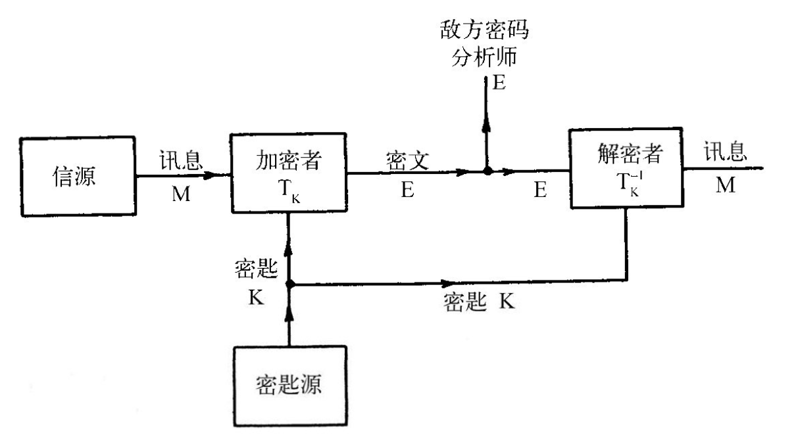
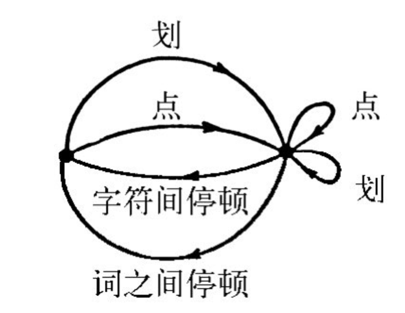
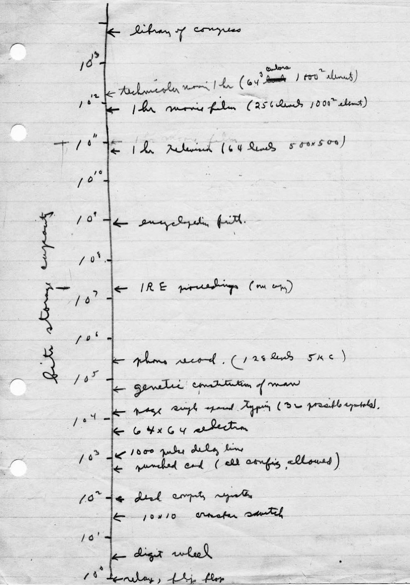

#07 信息论 —— 我想要的不过只是一颗寻常的大脑

建立一套有关信息及其处理的理论，有点儿像建造一条横贯大陆的铁路。你可以从东海岸出发，先试着理解信息是如何处理的，然后向西迈进。或者你也可以从西海岸出发，先试着理解信息到底是什么，然后向东深入。我们希望的是，两条铁轨能在中间会合。

—— 乔恩·巴怀斯（1986)©

1943 年初，正值第二次世界大战如火如荼之时，两位志趣相投的思想家，克劳德·香农和阿兰·图灵，经常会在贝尔实验室的食堂共进午餐，但他们对彼此的工作都守口如瓶，因为那事关机密。© 两人都在从事密码分析工作，甚至连图灵来到贝尔实验室这件事都涉及机密。他是搭乘「伊丽莎白女王号」，辗转躲过德军的 U 型潜艇方才来到美国。而之所以能够躲过劫难，还要归功于他之前在布莱切利庄园成功破解了德军用来进行机要通信的密码 —— 恩尼格玛（Enigma)，该密码也用在了潜艇的通信上。当时香农正致力于 X 系统（SIGSALY) 的工作，该系统是用来加密在五角大楼的罗斯福与在战争办公室的丘吉尔之间的语音通话。它先对模拟语音信号每秒采样五十次 (即「量化」或「数字化」），然后对采样信号应用一个随机密匙，这个密匙与工程师们很熟悉的电路噪声十分相似。香农并不设计这套系统，他的任务是从理论上分析该系统，并希望证明它不可破解。他成功地做到了这一点。后世的人们清楚地认识到，正是大西洋两岸这些人的通力合作才使密码学从一门艺术变成了一门科学。但在当时，密码制作者和密码破解者却无法对此开怀畅谈。

既然密码这个话题不能拿到台面上讨论，图灵就给香农看了一篇他在七年前写的论文《论可计算数》，其中讨论了一种理想计算机器的力量和局限。他们谈论的另一个话题则是双方都感兴趣的，即机器是否可能学会思考。香农提议可以把「文化的东西」，比如音乐，也灌输进电子大脑中。双方的讨论有时会变得十分激烈，图灵曾有一次在大庭广众之下高声反驳说：「不，我对建造一颗强大的大脑不感兴趣，我想要的不过只是一颗寻常的大脑，跟美国电报电话公司董事长的脑袋瓜差不多即可。」© 在 1943 年讨论什么思考机器似乎有点大言不惭，毕竟晶体管和电子计算机都还没有出现。不过，香农和图灵所交流的愿景与电子学无关，而只与逻辑学有关。

机器能思考吗？这个问题出现的历史相对较短，且看上去有点奇怪 —— 说奇怪，是因为机器结结实实就是一堆物质啊。查尔斯·巴贝奇和爱达·洛夫莱斯差不多是最早研究这个问题的人，但他们早已被人遗忘。而现在，阿兰·图灵迈出了前所未闻的一步：他首先设想了一种机器，它在思维领域具备无与伦比的力量；然后他证明了，这样的机器不能做什么。他的机器在当时并未变成现实（不过现如今，它巳是无处不在），这只是一个思想实验。

与机器能做什么的问题密切相关的是另一个问题，即什么样的任务是机械的（这个旧词被赋予了新的重要性）。既然机器可以演奏音乐、捕捉图像、瞄准高射炮、连接电话通话、控制组装线，还可以进行数学计算，「机械的」一词已然显得不那么贬义。不过在当时，也只有那些胆小而迷信的人才会想象机器有朝一日会变得有创造力、独到、自主，毕竟这些特性与「机械的」一词的通常意涵（自动的、被动的、循规蹈矩的）大相径庭。哲学家们发现这个词很有用。在他们看来，一个既涉及智能又可被称为机械的例子是算法：这个新术语表示的是某种古已有之的东西（体现在如菜谱、指令集、分步步骤等当中），只是现在它要求人们的正式承认。巴贝奇和洛夫莱斯与算法打了那么久交道，却没有给它加以命名。而算法在 20 世纪被赋予了一个核心位置，也正是从此开始的。

1936 年，当图灵将他关于可计算数的论文呈交给他的教授时，他是剑桥大学国王学院的研究员，两年前刚从那里本科毕业。这篇论文的完整标题以一个华丽的德语单词收尾：《论可计算数及其在判定性问题上的应用》（OnComputableNumbers,withanApplicationtotheEntscheidungsproblem)。所谓「判定性问题」(Entscheidungsproblem) 是大卫·希尔伯特在 1928 年国际数学家大会上提出来的。身为可能是他那个时代最具影响力的数学家，与罗素、怀特海一样，希尔伯特也满怀热情地致力于为全部数学奠定一个坚实的逻辑基础。他曾宣称：「在数学里，没有‘我们将来也不知道’©。」当然，数学里有很多未解之题，其中一些还很著名，如费马大定理和哥德巴赫猜想 —— 这些命题看上去是成立的，但尚未得到证明。© 大多数人认为，这些命题只是暂时尚未得到证明。他们假设，或者说相信，任何数学真理都能被证实，只是时间早晚而已。

判定性问题问的就是，能否找到一个严格的、分步的算法，通过它，给定一种演绎推理的形式语言，人们就可以自动化地进行证明。这呼应了莱布尼茨的梦想，即通过一系列机械的规则来表示所有有效的推理过程。虽然希尔伯特是以问题的形式提出，但他是个乐观主义者。他认为或者说希望，自己已经知道答案了。也正是在这数学和逻辑学命运的关键时刻，哥德尔提出了他的不完全性定理。至少表面上看，哥德尔的研究彻底打破了希尔伯特的乐观主义，就像之前对罗素所做的。但实际上，哥德尔并没有回答判定性问题。希尔伯特曾区分了三个问题：

数学是完全的吗？

数学是一致的吗？

数学是可判定的吗？

哥德尔证明了，数学不可能既是完全的，又是一致的，但他并没有明确地回答第三个问题，至少没有针对全部数学给出明确答案。这样，即便某个特定的、封闭的形式逻辑体系必然包含一些从体系内部既不能证实也不能证伪的命题，但它还是可能由一个可以说是外部的裁判（如该体系外的逻辑或规则）加以判定。© 阿兰·图灵，当时只有二十二岁，他对于大部分的相关文献都不熟悉，工作也喜欢独来独往，有时他的教授甚至都担心他会变得「习惯于孤独」。© 在论文中，他提出了一个（表面上看）完全不同的问题：所有的数都是可计算的吗？这是个出人意料的问题，毕竟几乎没有什么人考虑过不可计算的数。大多数人所使用或考虑的数，根据定义都是可计算的。有理数是可计算的，因为它们可以表示成两个整数的商：alb。代数数是可计算的，因为它们是多项式方程的解。一些超越数，如著名的 π 和 e，也是可计算的，人们事实上一直都在计算它们。对此，图灵提出了一个看似温和的命题：有些数可命名、可定义，却是不可计算的。

那这句话是什么意思？图灵将可计算数定义为，其小数表达式可在有限步骤内计算出来。他说：「这样定义的合理性，在于人类记忆是有限的这一事实。」© 图灵同时把计算定义为一个机械的过程，一种算法。人类在解决问题时常常会借助直觉、想象或灵光一闪 —— 这些乍看上去可以说是非机械的计算，但深究起来或许又只是步骤被隐藏起来的机械计算罢了。图灵需要把这些只可意会不可言传的东西去除。因此，他问了一个直截了当的问题：要是机器，它会怎样做？「根据我的定义，如果一个数的小数表达式可以被机器写出来，那么它就是可计算的。」

但在当时，没有一台真实的机器可供参考。从事计算工作的依然是「计算员」，几乎所有的计算工作仍旧是在纸面上运算完成的。不过，图灵确实想到了一台信息处理机器可以作为起点，那就是打字机。早在他十一岁还在上寄宿学校时，他就曾想过要发明一台打字机。他在给父母的信中写道：「你看，这些有趣的圆圈一面刻出字母的形状，从圆圈 ® 开始，排列在一个印台四周，这样压下去就可以印出一个字母，不过图上没有把字母全部画出来。」© 当然，打字机不是自动的，与其说它是台机器，还不如说它是个工具。它不会往页面上倾吐一连串文字，相反，是纸在一格格移动位置，然后字锤在上面敲出一个个字符。基于这样的模型，图灵想象出了另一种至纯至简的机器。也正因为这样一部机器只存在于想象当中，所以无需考虑图纸设计、技术规格或专利申请等环节的细节问题。与巴贝奇一样，图灵的机器也是用来计算数，只是他不必担心各种技术限制，因为他根本就没有打算去建造这部机器。

图灵列出了他的机器必备的很少几个组件：纸带、符号和状态。这些组件需要一一加以定义。

纸带之于图灵机，就如同纸张之于打字机。不过，打字机利用了纸张的两个维度，而图灵机只利用了它的一个维度 —— 纸带是一长条纸，并被分成了一个个的方格。图灵写道：「在初等算术中，人们有时会用到纸张的二维特性，但这种做法是可以回避的。并且我认为，人们将会认识到，纸张的二维特性对计算来说并不是必不可少的。」© 图灵机的纸带被想象成无限长的，也就是说，它取之不尽，用之不竭。但在任意给定时刻，在「机器内」的只有一个方格。纸带（或机器）可以左右移动至前后方格。

符号可以写在纸带上，每个方格写一个。那么可以使用多少个符号呢？这个问题需要费些思量，尤其是如果限定只能使用有限个符号（如果允许无限个符号，那么符号之间的差异将会任意小）。但这个限定并不会有太大影响，因为「总是可以用符号序列来代替单个符号」。图灵发现，至少在欧洲语言里，一个由众多字母拼成的单词是被视为单个符号（相反，汉字则「试图使用可枚举的无限个符号」）。如果 17 和 999999999999 被视为单个符号的话，那么阿拉伯数字将有无限个，但图灵更愿意把它们视为复合符号。事实上，为了符合机器的极简主义精神，他选择了最简单的两个符号：二进制记号，0 和 1。符号不仅可以写入纸带，还可以读出 —— 图灵当时使用的是「扫描」一词。在现实中，当时显然还没有出现可以把纸面上的符号扫描进机器中的技术，但等效的东西却早已有之，如用在制表机上的打孔卡片。图灵还设定了另一个限制：机器每次只能「感知」（使用这样拟人化的用语也是别无选择）一个符号，也就是在机器内的方格上的那个符号。

状态则要费更多笔墨解释。图灵使用了「格局」（configumtkm) 一词，并指出，不同的格局对应的是不同的「思维状态」。图灵机具有有限多个状态。在任何给定状态下，机器会根据当前符号的不同，执行一个或多个操作。例如，在状态下，机器可能会在当前符号为 1 时右移一格，在当前符号为 0 时左移一格，在当前符号为空时则打印 1。在状态 b 下，机器可能会擦除当前符号。而在状态 c 下，机器可能会在当前符号为 0 或 1 时右移，否则就停机。执行完每组操作后，机器将具有一个新的状态，而它与先前状态可能相同也可能不同。给定一个计算，它所使用的各个状态都存放在一张表中，但至于如何物理地管理这张表则无关紧要。这张状态表其实就是机器的指令集。

这就是全部了。

图灵实际上是在对他的机器编程，尽管他没有使用这个术语。利用这些基本操作（移动、打印、擦除、变更状态，以及停机）就可以构建出更复杂的过程，并可以反复调用这些过程，如「复制符号序列、比较序列、擦除给定形式的所有符号等」。虽然机器一次只能看到一个符号，但实际上它可以利用部分纸带来暂时存储信息。用图灵的话来说，「另外一些 [符号] 则仅是临时笔记，以‘帮助记忆’」。而无穷无尽的纸带为此提供了无限的记录空间。就这样，图灵机可以完成所有算术运算。图灵演示了如何将两个数相加，也就是，写下了运算所需的状态表。他还演示了怎样让机器（无穷无尽地）打印出 π 的二进制表示。他花了很多时间探索这部机器能做什么以及实现某些具体任务的方法。最终他证明了，这部机器能做人类在计算数时所能做的一切工作，这其中不需要任何知识或直觉。任何可计算的，这部机器都可以计算。

接下来就是最后的准备工作。如果把图灵机简化到只剩下一张有限的状态表以及一个有限的输入集，那么图灵机本身就可以用数来表示。每一张可能的状态表，配以表示初始输入的纸带，表示了不同的机器。而每部这样的机器可以用一个特定的数来描述（这个数描述了其状态表和初始输入）。图灵给他的机器编码，就如同哥德尔给他的符号逻辑语言编码一样。如此这般，数据和指令之间的区分就被消除了：说到底，它们都不过是数而已。每个可计算数，必定对应着一个机器编号。

图灵最终（还是在脑子里）制造了一种机器，它可以模拟其他任何可能的图灵机 —— 任何一部数字计算机。他把这部机器称为 U，取自「通用的」(universal) 一词，这个说法也被数学家一直沿用至今。通用图灵机接受机器编号作为输入，也就是说，它可以从纸带上读取对其他机器的描述（这个数描述了其算法和输入）。无论一部数字计算机变得如何复杂，对它的描述都可以被编码后写入纸带，并由 U 读取。如果一个问题可以使用一部数字计算机来解决，也就是说，它能被编码成一组符号并通过一个算法来解决，那么这个问题也可以使用通用图灵机来解决。

现在显微镜把镜头对准了自身。通用图灵机开始检验每一个数，看它是否对应一个可计算的算法。有一些被证明是可计算的，还有一些被证明是不可计算的。但还存在第三种可能，这让图灵非常感兴趣。有那么一些算法会抗拒检查，自行其是，让机器一直计算下去，永不停机，也不明显地出现重复，只留下一旁的观察者始终纳闷它是否会停机。

现如今，图灵 1936 年对于停机问题的证明已经成为一个艰深难懂的杰作，其中充斥着递归定义、用以表示其他符号的符号、用以表示数（状态表、算法，乃至机器）的数。他的证明看上去是这样子的：我们假设存在这样一个过程，也就是说，我们可以发明一台机器 D，当提供了任一机器 M 的标准描述，它能够检测这个标准描述。如果 M 是循环机，则用符号 u 标记这个标准描述；如果 M 是非循环机，则用符号 s 标记这个标准描述。

结合机器 D 和 U，我们可以构造机器 H 来计算序列 β'。机器 D 需要一条纸带。我们假设它使用了「F - 格」所有符号之外的「E - 格」，并在最后得出结论时，擦除机器 D 所做的所有中间工作……

我们可以进一步证明，不存在这样的机器 E，当给它提供了任意一台机器 M 的标准描述时，它可以判断 M 是否曾经打印过给定的符号（比如 0）。

很少人能跟得上图灵的思路。© 尽管这看上去像悖论（其实这就是悖论），但图灵的确证明了有些数是不可计算的。（事实上，绝大多数的数都是不可计算的。）同时，由于每个数都对应着一个编码后的数学和逻辑学命题，因而图灵已经回答了希尔伯特的问题，即「命题是否都是可判定的」。他证明了判定性问题有答案，且这个答案是否定的。一个不可计算的数，实际上就是一个不可判定的命题。

就这样，借助一台新奇、抽象、完全想象的机器，图灵得出了与哥德尔相似的证明和结论。不仅如此，他还更进一步，给出了一个形式体系的一般定义：任何用于生成公式的机械的流程，本质上都是一台图灵机。因此，任何形式体系中必然存在不可判定的命题。数学是不可判定的，其不完全性来源自不可计算性。

当数被拿来编码机器的行为时，悖论就会再次现身。这涉及不可避免的递归纠缠：被计算的实体与进行计算的实体纠缠到了一起，带来种种恶果。正如后来侯世达所说的，「整个事情依赖于这位停机检察官自己在看着自己 [在看着自己（……）预测自己的行为时预测自己的行为] 预测自己的行为时预测自己的行为」。© 物理学同样新近遇到了类似的难题：海森堡的不确定性原理。图灵在听说这个原理后，采用自指的说法对此进行了表述：「过去我们一直假定，在科学中，只要知道宇宙在某一时刻的全部状态，我们就能把宇宙所有的未来状态都预测出来…… 但更为现代的科学却认为，当我们面对原子和电子时，我们无法知道它们的全部确切状态，因为我们所用的仪器本身就是由原子和电子构成的。」© 从巴贝奇的差分机到图灵的通用机，一个是笨重的庞然大物，一个是优雅的抽象虚构，两者相隔了一个世纪。图灵从没打算成为一个循规蹈矩的机器操作员，就像多年以后数学家和逻辑学家赫伯特·恩德滕所描述的那种「勤勉努力的办事员，遵照着给他的指令，在供应充足的纸张上做着运算」。© 相反，一如爱达·洛夫莱斯，图灵是个程序员。他将自己想象成一台计算机，关注自己思维过程中一步步的逻辑，并将这些心智过程加以提炼萃取，得出其最小的组分，也就是信息处理的原子。

图灵和香农都在使用编码，只是图灵是把指令编码成数，将十进制数编码成 0 和 1，而香农是对基因、染色体、继电器和开关编码。他们的灵思巧智都应用在了如何将一类事物映射到另一类事物（例如，代数函数与机器指令，逻辑运算符与电路），也就是找出两类事物之间严格的对应关系上。在他们心智的武器库中，符号运算以及映射的思想占据着举足轻重的地位。当然，这种编码转换不是为了遮蔽事实，相反是为了揭示事实：比如说，借此可以发现苹果和橘子归根结底是等价的，或即便不等价，也是可相互替代的。但很快，两人便都被战争引入了当时如日中天的密码学领域。

图灵的母亲常问他，他的数学有什么用。对此早在 1936 年，他就曾在给母亲的信中透露，自己已经找到了当时正在研究的可计算数的一种可能应用：「它回答了‘最一般的编码或密码是什么样的’问题，并且（自然而然）使得我可以构造许多特殊的、有趣的密码。」© 他又补充道：「我猜我能以大价钱把这些密码卖给政府，但我相当怀疑这样做是否道德。」图灵机的确能够制作密码，不过英国政府当时面对的却是另外一个难题。随着战争阴影的逼近，解读拦截到的德军电报和无线电情报的任务，便落到了对外称为「政府编码与密码学校」（GC&CS）的密码破解机构肩上。该机构原本隶属于海军部，后来转移到了外交部，最早的成员包括语言学家、办事员和打字员，但没有数学家。1938 年夏，图灵应召进入该学校，并在次年随学校从伦敦撤到了伯明翰郡的布莱切利庄园。这时他的同事中还有了几位国际象棋和填字游戏冠军。很显然，古典语言学对于现在的密码分析工作已经力不从心了。

一台缴获的恩尼格玛密码机德国的密码系统名为恩尼格玛，是一种多码加密装置。密码机有手提箱大小，里面有多个转子，外面则有键盘和信号灯。这个密码系统源自著名的维吉尼亚密码，它曾号称是不可破译的密码，直到 1854 年被查尔斯·巴贝奇所破解。巴贝奇所用的数学方式为政府编码与密码学校的早期工作提供了帮助。同样提供了帮助的是波兰密码学家，他们在战前曾成功破解过德军早期的恩尼格玛密码系统。在「八号营房」，图灵从理论入手，最终不仅从数学上，还从物理上解决了这个难题。

这意味着要建造一台机器，用来逆推恩尼格玛加密过的数据。图灵的首台机器只是个使用假想纸带的虚幻之物，但这台绰号「炸弹」（Bombe）的机器却是个体积将近三立方米的庞然大物，里面藏着重达一吨的电线以及油腻腻的金属零件，它们有效地将恩尼格玛密码机的转子映射成了电路。这项在布莱切利庄园取得的科学成就，在战争期间及之后的三十年里一直都是机密，但它对战争结局的影响甚至要超过曼哈顿计划制造出的真正炸弹。到了战争后期，图灵的「炸弹」每天要破解数以千计的敌军情报，这样的信息处理规模是史无前例的。

尽管在贝尔实验室一起用餐时，图灵和香农都丝毫没有提及这方面的内容，但他们的确间接地谈到了图灵对于如何度量这些东西的一个构想。布莱切利庄园的分析师会对汇聚到此的各种讯息（有些难以确定，有些又互相矛盾）进行权衡，以便评估它们当中包含一定事实的概率，比如恩尼格玛的某种编码设置或潜艇的可能位置等。图灵感到这其中有些东西需要在数学上加以度量。不过，他关注的不是传统意义上的概率，用比值比（如 3 比 2）或一个 0 到 1 的数（如 0.6，或 60%) 来表示。他更在意的是引致概率变化的数据：影响概率的因子，有点类似于皮尔士的证据权重。他发现使用对数标度比较方便，这样乘法运算就会变成加法运算。他还为此发明了一个新单位，叫做「班」（ban)®。班是以 10 为底，因此，1 班意味着使某一事实成立的可能性增大十倍所需的证据权重。对于粒度更小的度量需求，还可以使用分班和厘班。

与此同时，香农也在沿着类似的轨迹进行着摸索。在纽约西村的贝尔实验室旧总部，香农发展出了一套密码学理论，也使得自己曾向万内瓦尔·布什吐露的梦想（研究传递信息的一般系统的某些基本属性）变得更为清晰。在整个战争期间，他同时在从事多项任务。因此，他要向对应的上司汇报相应的工作，而对别的事情守口如瓶。保密是当时的命令。对于图灵正试图借助实际拦截和物理硬件进行破解的一些密码系统，香农则是在纯数学领域对其进行了分析。例如，其中一个具体问题是，当「敌方知道我方在使用维吉尼亚密码」© 时，该系统的安全性有多高。（实际上，当时德国人就在采用这样一套密码系统，而英国人则是知道对方在使用这套系统的敌方。）香农试图找出涉及（用他的话说）「离散信息」的密码系统的一般数学结构和属性。这意味着它们处理的是从有限集中选取的符号序列，主要是字母表中的字母，但也可以是某种语言中的单词，或甚至是「量化后的语音」，也就是声音信号被分解成不同幅度的组块。为了隐藏这些离散信息，讯息发送者需要通过某种系统化的过程，把正确的符号替换成错误的符号，而讯息接收者知道该过程使用的密钥，从而可以借此反推整个替换过程。因此，即便敌方知道了所用的加密过程，只要密钥没有泄露，整套安全系统仍然有效。

密码破解者面对的是一串看上去毫无意义的数据流，而他们想要做的是从中找出真正的信号。香农指出：「在密码分析师看来，密码系统与有噪通信系统几乎没有什么不同。」©（这份题为《密码学的数学理论》的报告在 1945 年完成后，随即被列为机密文件。）数据流故意被弄得看上去像是随机的。当然，事实上绝非如此，否则其中的信号也会丢失。密码必须将像日常语言这种符合一定模式的东西，转换成表面看来无规律可循的东西。但即便如此，还是会有模式隐藏其中。为了对加密替换过程进行分析和归类，香农必须更深入地理解语言的模式，找到一条学者们（如语言学家）从未尝试过的道路：当时的语言学家已经开始把注意力放到了语言的结构上，试图从语言含糊不清而又连绵不断的形状和声音中找出其结构。语言学家爱德华·萨丕尔曾把语言的底层语音模式称为语言的「符号原子」。他在 1921 年写道：「单只语音并不是语言的实质性事实；语言的实质性事实毋宁说在于思维的分类、形式模式…… 语言，作为一种结构来看，它的内面是思维的模具。」© 思维的模具，这个说法很精致。不过，香农需要找到比这更有形、更易数的方式来描述语言。

在香农看来，模式就等同于冗余。在日常语言中，冗余可以辅助理解。可在密码分析中，冗余就是密码的阿略琉斯之踵。那么冗余又在哪里呢？在英语中，一个简单的例子是，紧跟在字母 q 后面的字母 u 就是冗余，即便把它去掉也不会有影响。「或者说，几乎总是冗余。要不是英语中还有极少的外来词，如 Qin（秦）或 Qatar（卡塔尔），它就完全成了冗余。」在字母 q 之后，大家都预期后面会是字母 u。这里面不存在什么意外，它也就没有贡献什么信息。紧跟在字母 t 后面的字母 h 也有一定的冗余度，因为它是最可能在此出现的字母。香农认为，每一种语言都有一定的统计结构，以及相应一定的冗余度。我们可以用 D 来表示冗余度（这是香农的提法）。「在某种意义上，D 度量了某种语言的文本在不损失任何信息的前提下能够缩减多少篇幅。」

香农估计，英语的冗余度大约是百分之五十。© 当时还没有计算机可以处理海量文本，所以他并不是很确定，但他的估计被证明是正确的。常规的英语段落可以缩減一半的篇幅而不损失息。（试想第 1 章中提到的例子，Ifucnrdths.)。对于早期最简单的替换密码，这种冗余是其首当其冲的弱点。爱伦·坡知道，如果一份密文中的字母 z 比所有其他字母都多，那么字母 z 可能替換的就是字母 e，因为 e 是英语中出现频率最高的字母。同样，一旦字母被破解了，字母 u 就手到擒来。密码破解者还会寻找反复出现的模式，因为它们可能对应着常用单词或常见字母组合，比如 the、and 或 - tion。为了进一步改进这种频度分析，密码破解者需要对字母的出现频率有更深入的了解，当年阿尔弗雷德·韦尔或塞缪尔·摩尔斯通过查看印刷工人的铅字盘得出的结论毕竟太过粗略。而在另一方面，密码制作者也设计了更为聪明的加密过程来克服这个缺点。他们通过不断变化替换的字母表，使得每个字母都存在多种可能的替换。这么一来，那些明显的、可辨识的模式就不见了。然而，只要密文还带有一丝模式的痕迹，无论它是某种形式、某种序列，还是某种统计规律性，那么在理论上，数学家就能找到突破口。

当时所有的密码系统都有一个共同点，那就是它们都要使用密钥。密钥可能是一个单词、一个短语、一整本书或甚至更复杂的东西。但不管是什么，它都是发送者和接收者都知道的一个字符的来源，是除了讯息之外双方所共享的知识。在德军的恩尼格玛密码系统中，其密钥是密码机的硬件设置，且设置每天都会变换。在布莱切利庄园的分析师必须每天分析经过全新方式替换后的文本的模式，重新找出对方所用的密匙。© 而与此同时，香农则开始从最宏观、最一般和最理论的视角审视这个问题。这时，一个密码系统可以看作由以下几个部分构成：有限数量（虽然数目可能很大）的可能讯息、有限数量的可能密文，以及用于两者相互转换的有限数量的密钥，每个密钥都有相应的出现概率。以下是香农的示意图：

敌方密码分析师和解密者都试图得到同一个目标物：讯息。而香农借助数学和概率的语言，就把讯息的概念彻底从它的物理细节中抽象了出来。声音、波形等贝尔实验室的工程师通常要操心的事情，在香农的理论里变得无关紧要。讯息被看作一种选择，从一个集合中选择其中一个可选元素。在保罗·里维尔骑马报讯那晚，旧北区教堂上可选讯息的数量是二。而现如今，这个数量已经大到难以计数 —— 不过对它仍然能够进行统计分析。在对布莱切利庄园进行的类似工作毫不知情的情况下，香农构建起了一整套代数方法、定理和证明，使得密码学家首次拥有了一种严谨的手段，可以评估任意一套密码系统的安全性。香农也借此确立了密码学的许多科学原理。其中他证明了，完美密码是可能的 ——「完美」一词在这里的意思是，即便被敌方截获了无限长的讯息，它对密码破解也不会有更多帮助（「无论敌人截获了多少材料，他们的处境并不会比先前有所改善」©)。但有得必有失，香农同样证明了，完美密码的要求太过苛刻，导致它根本没什么实际用途。在完美密码中，所有密钥的出现概率必须相等，这样生成的实际上是一串随机的字符流，同时每个密钥只能使用一次，而且最糟糕的是，每个密钥都必须与整条讯息一样长。

也是在这篇机密报告中，几乎是不经意的，香农使用了一个自己之前从未用过的说法：「信息论」。

要想为信息建立理论，香农首先要做的是去除其「意义」。这里的引号是香农自己的做法。他曾不无兴奋地提出：「对于信息论的研究而言，讯息的‘意义’基本上无关。」© 而香农之所以这样主张，是为了使自己的研究变得清晰明确：他需要把握住基础的「信息」概念。香农写道：「这里的‘信息’，虽然与这个词的日常意义有关，但不应该与其相混淆。」与之前的奈奎斯特和哈特利一样，香农也希望排除其中的「心理因素」，而集中注意在「物理」层面。然而，如果信息被剥除了语义内容，那么剩下的又是什么呢？对此，有几个可能的回答，而它们乍听之下都有点似非而是。信息是不确定性，是出人意料，是困难程度，是熵。

1. 「信息与不确定性密切相关。」反过来，不确定性可以通过统计可能讯息的数量加以度量。如果仅有一条可能讯息，那么这其中就不存在不确定性，因而也就不包含信息了。

2. 有一些讯息出现的可能性比其他讯息要大，而信息意味着出人意料。出人意料其实讲的是概率。比如在英语中，如果紧跟在字母 t 之后的是字母 h, 那么这其中的信息量就不大，因为字母 h 在此出现的概率相对较高。 

3. 「其中重要的是，将讯息从一点传送到另一点的困难程度。」这或许听上去有点同义反复，就像用移动物体所需的力来定义质量一样。不过换个角度看，质量的确可以用这种方式定义。

4. 信息是熵。这是各个说法当中最奇怪也最强大的一个：熵的概念早已有之，在研究热量和能量的热力学中，它被用来度量系统的无序程度。但对于这个概念，一直以来人们的理解有限。

在火控系统与密码学方面的工作之外，香农在整个战争期间都在苦苦思考这些隐隐约约的设想。他独自一人住在纽约格林尼治村的公寓里，与同事也几乎没有交往，因为他们都已经搬到了新泽西的新总部，而他却选择留在西街的旧办公楼。他不需要向别人解释自己在干什么，毕竟他在从事战争工作。这些工作也使他可以缓期服兵役，并且缓期一直延续到了战争结束后。贝尔实验室一直以来是清一色的男性世界，但在战争期间，计算部门尤其迫切需要称职的职员。由此，女性开始被招募进实验室，成长于纽约斯塔滕岛的贝蒂·摩尔（BettyMoore）就是其中的一员。在她看来，计算部门就像是为数学部门服务的打印池。一年后，她进人了微波研究组，在原纳贝斯克饼干公司的厂房工作，与实验室的旧办公楼隔街相对。微波研究组在二楼设计真空管，然后在一楼组装，克劳德·香农偶尔会过来闲逛。他和贝蒂在 1948 年开始约会，随后在 1949 年初结婚。也就是在那时，他成了人人都在谈论的科学家。

当时很少有图书馆订阅了《贝尔系统技术期刊》。因此，研究人员是靠口口相传的传统方式听说了《通信的数学理论》，也是靠直接写信给作者的传统方式才拿到了论文复印件。许多科学家会使用一种专门用于此类请求的特制明信片，于是越来越多这样的明信片便纷至沓来。并非人人都能读懂他的论文。对于许多工程师来说，论文中的数学内容太深了；而对于数学家来说，他们则对论文中的工程学背景缺乏了解。不过，时任洛克菲勒基金会自然科学部主任的沃伦·韦弗已经认识到了论文的意义。他告诉基金会的主席，香农之于通信理论的贡献，就如同「吉布斯之于物理化学」。© 在战争期间，韦弗曾领导了政府的应用数学研究，对于火控项目以及电子计算机器的初期研究都很熟悉。1949 年，韦弗在《科学美国人》杂志发表了一篇不是很技术化的赞誉文章，介绍了香农的理论。随后在同一年，香农的论文和韦弗的文章被集结成书，以《通信的数学理论》（The Mathematical Theory of Communication）为题出版，这时其中原来带有谦逊意味的不定冠词被换成了更自负的定冠词。贝尔实验室的工程师约翰·罗宾逊·皮尔斯，见证了晶体管和香农论文的同期问世历程，用他的话来说，后者的「出现犹如颗炸弹，而且还有点像是颗延时炸弹」。© 

外行人可能会认为，通信的基本问题是使自己的意图被人理解，是传递意义，但香农描绘的场景却大为不同：通信的基本问题是，在一点精确地或近似地复现在另一点所选取的讯息。©「点」是个经过精心选择的措词，它意味着，讯息的信源和信宿可以在空间或时间上相分隔，而且信息的储存，比如唱片，也可算是一种通信。同时，讯息并不是创造出来的，而是选取出来的。一条讯息就是一个选择，它可能是从一副牌里选出一张牌、从一千个三位数中选出一个数，又或是从一个确定的码本中选出一组词。当然，香农无法完全对意义视而不见，所以他在给意义赋予一个科学家的定义后，客气地把它请出了门：

这些讯息往往都带有意义，也就是说，根据某种体系，它们指向或关联了特定的物理或概念实体。但通信的这些语义因素，与其工程学问题无关。

然而，正如韦弗努力试图解释的，这不是一种狭隘的通信概念，恰恰相反，这样的概念包罗万象：「不仅涵盖了口语和书面语，还有音乐、图像艺术、戏剧、芭蕾，乃至事实上所有的人类行为。」其实还包括非人类：机器就没有讯息要传递吗？

香农的通信模型可以用一张简单的图来示意。这张图在本质上与他在那篇机密的密码学论文中提出的图是一样的，当然这并非巧合。

一个通信系统必须包含以下要素：

1. 信源是指产生讯息的人或机器。这里的讯息可以简单如一个字符序列，就像在电报或电传中的情形；也可以表达成时间及其他变量的数学函数，比如 f(x, y, t)。香农指出，在彩色电视这个复杂情形中，讯息就是由三维连续统定义的三个函数表示的。

2.  发送器「对讯息执行某种操作」（也就是，对讯息编码）以得到适当的信号。电话机将声压转换成模拟电流，电报将字符编码成点、划和停顿。更复杂的讯息可能会经过采样、压缩、量化和交错等操作。

3. 信道：「传输信号所使用的媒介。」

4. 接收器执行发送器的逆操作，对讯息解码，或从信号中提取出讯息。

5. 信宿是位于另一端的「人（或物）」。

以曰常交谈为例，信源、发送器、信道、接收器和信宿分别对应的是，说话者的大脑、说话者的声带、空气、听话者的耳朵和听话者的大脑。

在香农的示意图中，还有一个方格与其他要素同样显著，那就是噪声，毕竟这对工程师来说避无可避。这涵盖了一切会削弱信号的东西，有些事先可预测，有些则不可预测，比如多余的附加信号、明显的错误、随机干扰、静电、天电、干涉、失真等。香农将种种各不相同的通信系统大致分成了三类，一类是连续的。一类是离散的，还有一类是混合的。在离散系统中，讯息和信号由分立的个体符号组成，比如字符、数字或点划。但除了电报，当时的电气工程师每天面对的大多是连续系统，其中的讯息和信号是被视为连续函数。如果要想在一个信道上传递更多信息，工程师通常的做法是，增大信源的输出功率。不过，这个方法在远距离通信中会失效，因为一次又一次地放大信号，只会导致噪声的逐渐积累。

香农避免这个问题的办法是，把信号视为一串离散符号。这时，讯息发送者可以不通过增大信源的输出功率，而是通过使用额外的符号用于纠错，以此来克服噪声的干扰。这就像非洲的鼓手在进行远距离沟通时，他并不是更用力地去击鼓，而是为自己的言语增加额外的字词。香农认为，离散的情形在数学上更为基本。此外，他还考虑到了一点：把讯息视为离散的，这不仅可以应用在传统通信领域，还可以应用于另一个新兴的小众的领域，计算机器理论。

因此，他首先分析起了电报。精确说来，电报使用的并不只有点、划两个符号。在实际操作中，电报员使用了点（一个单位时间的「电路闭合」和一个单位时间的「电路断开」）、划（三个单位时间的电路闭合和一个单位时间的电路断开），以及两种停顿：字符间停顿（一般是三个单位时间的电路断开）和词之间停顿（六个单位时间的电路断开）。这四个符号的出现位置和出现概率并不均等。比如，一个停顿后面肯定不会跟另一个停顿，而点、划可以跟在任何符号后面。对此，香农用状态一词加以表述。所以电报有两种状态：其一，一个停顿在前，这时接下来只允许出现点或划，然后状态发生转变；其二，任何符号都允许出现，并且状态只在遇到停顿时才发生转变。香农把这表示成了下图：

词之间停顿这套系统要远比简单的二元编码系统复杂，但香农还是在论文中推导得出了该系统信息内容和信道容量的正确方程。随后，他把注意力放到了讯息所使用语言的统计结构及其产生的效应上。正是由于语言中存在这种结构（字母 e 的出现频率比 q 高、字母组合 th 的出现频率比 xp 高，诸如此类），我们得以借此节省所需的时间或信道容量。

这在电报中已经得到了有限的应用。人们用最短的序列，一个点，来代表英语中最常见的字母 E，而用更长的点划序列来代表较罕见的字母 Q、X 和 Z。这种思想也在某些行业码本中被进一步发扬光大。它们用四五个字母的代码组表示一些常用的字词和短语，从而大幅节省了平均时间。而现如今标准化的问候和祝福电报更将这种做法推到了把一两句话编码成一串相对简短的数字的程度。© 为了揭示讯息的统计结构，香农借鉴了物理学中研究随机过程所用的方法论和术语。（物理学中随机过程的实例，小的如布朗运动，大的则如恒星动力学。香农就在论文中引用了天体物理学家钱德拉塞卡 1943 年发表在《现代物理学评论》上的经典论文。©）随机过程既不是决定论的（下一事件能被确定地计算出来），也不是完全随机的（下一事件完全不受约束），而是受一组概率支配。每个事件的概率，不仅取决于系统当前的状态，还可能取决于它此前的历史。如果把事件换成符号，那么像英语或汉语这样的自然的书面语言，就可以看成一个随机过程。量化后的语音或电视信号，也是一个随机过程。

然后香农对统计结构进行了更深入的研究。他考察了一条讯息可能会对接下来一个符号的出现概率产生多大影响。一种可能是没有影响，也就是说，每个符号各有其出现概率，但它不依赖于之前出现的内容。这是一阶的情形。在二阶的情形中，每个符号的出现概率仅依赖于前一个符号，但与更前面的符号无关。这么一来，每个双字符组合也各有其出现概率，比如在英语中，双字母组合 th 的出现概率就比 xp 高。三阶的情形对应三字符组合，依此类推。此外，在普通文本中，在单词的层面上进行考察，显然要比在字母层面上进行考察更适合，并且这时许多新的统计事实会产生影响。比如，在「黄色」一词之后的位置，有些单词的出现概率较高，而有些则几近于零。同样，在单词 an 后面，以辅音字母开头的单词的出现概率就极小。假如一个单词以字母 u 结尾，那么这个单词很可能是 you。而连续出现两个相同字母时，它们通常会是 ll、ee、ss 或 oo。另外，这样的结构还可以跨越很长的长度：在一条包含「母牛」一词的讯息中，即便后面间隔了许多其他字符，再次出现「母牛」一词的概率仍然相对较高。在香农看来，一条讯息就像一个动力系统，它的未来走向会受到过去历史的影响。

为了说明各阶结构之间的差异，香农写出了（实际上是计算出了）英语文本的一系列「近似」。他使用了一个包含二十七个字母的字母表，即二十六个拉丁字母再加上词之间的空格，然后借助一张随机数表，生成了一系列字符串。（他使用的是剑桥大学出版社刚出版的一份随机数表，其中收录了十万个随机数字，定价仅三先令九便士，而且「保证排列的随机性」。©）虽然随机数是现成的，但计算出这些字符串依然需要花很多力气。它们的样子看上去这样的：

- 零阶近似——冗全随机的字符，其中不存在结构或依赖。

- XFOML RXKHRJFFJUJ ZLPWCFWKCYJ FFJEYVKCQSGHYDQPAAMKBZAACIBZLHJQD.

- 一阶近似 —— 每个字符与其他字符不存在依赖关系，各自的出现频率取在英语中的出现频率：字母 e 和 t 出现得较多，而 z 和 j 较少，且单词长度看起来也较接近现实。

- OCRO HLI RGWR NIMIELWIS EU LL NBNESEBYA TH EEI ALHENHTTPAOOBTTVA NAH BRL.

- 二阶近似 —— 不仅单个字母，双字母组合的出现频率也符合英语的情况。（香农从密码破解者所用的表格中，找到了所需的统计数据。英语中最常出现的双字母组合是 th，大致每千个单词出现 168 次，紧跟其后的是 he、an、re 和 er。还有相当数量的双字母组合的出现频率为零。）

- ON IE ANTSOUTINYS ARE T INCTORE ST BE S DEAMY ACHIN D ILONASIVETUCOOWE AT TEASONARE FUSO TIZIN ANDY TOBE SEACE CTISBE.

- 三阶近似 —— 三字母组合也符合英语的情况。

- IN NO IST LAT WHEY CRATICT FROURE BIRS GROCID PONDENOME OFDEMONSTURES OF THE REPTAGIN IS REGOACTIONA OF CRE.

- 一阶单词近似。

- REPRESENTING AND SPEEDILY IS AN GOOD APT OR COME CAN DIFFERENTNATURAL HERE HE THE A IN CAME THE TO OF TO EXPERT GRAY COME TOFURNISHES THE LINE MESSAGE HAD BE THESE

- 二阶单词近似——双单词组合以英语中期望的频率出现，所以不会出现上例中「AIN」或「TOOF」的情况。

- THE HEAD AND IN FRONTAL ATTACK ON AN ENGLISH WRITER THAT THECHARACTER OF THIS POINT IS THEREFORE ANOTHER METHOD FOR THELETTERS THAT THE TIME OF WHO EVER TOLD THE PROBLEM FOR ANUNEXPECTED.

这一系列字符串「看起来」像英语的程度越来越高。或者换用不那么主观的说法，打字员盲打这些字符串的速度会越来越快 —— 这也反过来说明了，人们已经下意识地把语言的统计结构内化了。

如果有充足的时间，香农还可以实现更高阶的近似，只是其中所需的工作量会变得异常繁重。但这已经足以说明问题，即可以把一条讯息看成一个随机过程的结果，其中这个过程借助一组离散的概率生成了一系列事件。香农接下去要考虑的是，这个过程生成的信息量或信息生成的速率又是多少。假设每个可能事件的出现概率已知 (用 p2, p2, p3, ... , pn 表示），香农希望找到一种方式，度量「在生成一系列事件的过程 + 所涉及的‘选择’有多少，或者对于结果我们有多么不确定」。© 这样，他将信息的量度（用 H (pl/p2/p3/pn) 表示）定义为了不确定性的量度。可能事件的出现概率可能相等，也可能不相等，但一般来说，选择越多意味着不确定性越高 —— 信息越多。一个选择可能可以分解成若干前后相继、各有其概率的选择，这时这些概率需要能够可加。比如，某个双字符组合的出现概率，就是其中两个符号各自出现概率的加权总和。在各可能事件的出现概率相等的情况下，每个符号传达的信息量就是可能符号的数目的对数，也就是奈奎斯特和哈特利提出的公式：

    H=nlogs

而对于更接近现实的出现概率不相等的情况，香农提出了一个优雅的方法，解决信息的量度是概率的函数的问题，即对概率取对数后（以 2 为底最为方便）进行加权求和。这计算的是讯息不可能性的对数的均值，也就是意外程度的量度：

    H=-Σpi log2pi

其中 pi 是可能讯息的出现概率。香农指出，我们会一再得见到这个形式:「作为信息、选择和不确定性的量度，这个形式的量将在信息论中占据核心地位。」的确如此，H 无处不在，而它通常被称为讯息的熵、香农熵，或干脆，信息。

这时需要一个新的单位。香农说：「如果以 2 为底，相应结果的单位可以称为二进制数字（binarydigit)，或简称为比特（bit)。」© 作为信息最小的可能取值，1 比特代表掷硬币猜正反面时的不确定程度。掷硬币的结果有两种可能，且出现概率相等：在这里，p1 和 p2 都等于 0.5，而 0.5 以 2 为底的对数值是 -1，因此，H 的值是 1 比特。而从包含 32 个字符的字母表中随机挑选的一个字符，它的信息量就要多一些：5 比特，具体来说，这是因为可能讯息的数目为 32，而 32 以 2 为底的对数值是 5。由 1000 个这类字符组成的字符串则包含 5000 比特的信息 —— 这不只是简单的乘法，也是因为信息量表示的是不确定程度，也就是可能选择的数目：1000 个从包含 32 个字符的字母表中随机选出的字符，可能组成的讯息数目为 32^1000，而这个数以 2 为底的对数值是 5000。

也正在是这里，自然语言的统计结构又重新发挥了作用。如果巳知这条千字讯息是英语文本，那么可能讯息的数目就会减少，而且是大为减少。在统计结构的长度不超过八个字母的情况下，香农估计，英语内在的冗余度约为 50%，讯息中每个字母所含的信息量大致只有 2.3 比特，到不了 5 比特。如果考虑更大范围的统计效应，扩展到句和段落的层面，香农估计的冗余度进一步升高到了约 75%—— 不过他也警告，随着长度增加，这种估算会「波动得更剧烈，不确定性更大，且更严重地依赖于所涉及的文本类型」。© 香农使用了一种度量冗余度的新方法，那就是对人类受试者进行心理学测试。虽然这是种粗略的经验观察，但这种方法「充分利用了一个事实，即每个语言使用者天然都拥有对于所用语言的统计特征的丰富知识」。

由于熟悉单词、习语、套话和语法，所以他能在校对时自动补上遗漏或错误的字母，或在对话中自动补全未说完的短语。

这里的「他」或许应该改成「她」，因为实际上他的测试对象正是自己的妻子贝蒂。他从书架上抽出一本书（根据文字可知这是雷蒙德·钱德勒的短篇侦探小说集《简单的谋杀艺术》），随机指向一个短小段落，要贝蒂逐个猜段落里的字母。如果猜错了，他会告诉她正确答案，并让她接下去继续猜。当然，她知道的内容越多，猜对的几率就越大。在猜过「A SMALL OBLONG READING LAMP ON THE」后，她猜错了第一个字母。但得知这个字母是 D 以后，她毫不费力地猜对了接下去三个字母。© 香农注意到：「不出所料，错误最常出现在单词和音节的开头处，因为思路在这些地方有更多分岔的可能。」

以这种方式来量化可预测性和冗余度，其实是以另一种方式度量信息内容。如果一个字母能根据先前的内容猜出来，那么它就是冗余的；既然它是冗余的，那么它就没有提供新的信息。如果英语的冗余度是 75%，那么一条包含一千个字母的英语讯息所承载的信息量，就只有由一千个随机选择的字母所构成的讯息的 25%。尽管这听上去像是悖论，但随机讯息的确承载了更多的信息量。这也意味着，自然语言的文本可以被更有效地编码，以便于传输或存储。

为此，香农展示了这么一种适用于无噪信道的算术编码实现，这个算法充分利用了不同符号之间的概率差异。他还在论文中得出了一系列惊人的基本结论。其中一项发现是关于信道容量的一个公式，信道容量是任何信道的信息传输速率的上限（现在也直接被称为香农限）。他的另一项发现是，只要信息传输速率没有超出该上限，那么总是存在一种纠错编码方案，可以克服任何程度的噪声，使得错误概率任意小。虽然发送者可能需要越来越多的比特用来纠错，并使传输速率越来越慢，但讯息最终总能完成传送。不过，香农并未指出如何设计这样的编码方案，只是证明了这种方案是可能的，因而也开辟了后来计算机科学一个新的分支。香农的同事罗伯特·费诺（RobertFano) 在多年后回忆道：「使得错误概率任意小？从没有人这样想过。我不知道他是如何得到了这个洞见，而他又是如何使自己相信这件事是可能的。但现如今，几乎所有的现代通信理论都是基于他的这项工作。」© 无论是消除冗佘以提升效率，还是增加冗余以纠正错误，编码方案的设计都要依赖于针对语言统计结构的知识。信息与概率密不可分。1 比特，从根本上说，就是一次掷硬币。

如果说掷硬币的两种可能是表示 1 比特的一种方式，那么香农也提供了一个更实用的硬件例子：一个具有两个稳态的设备，如继电器或双稳态触发器电路，可以储存 1 比特信息。N 个此类设备就可以存储 N 比特，因为可能状态的总数为 2^n，而 log2(2^N)=N。

香农曾见过此类设备被组合在一起，比如继电器阵列，它们可以储存数百、乃至数千比特的信息。这个数目在当时看来巳然很巨大了。在论文即将完成时，有一天香农闲逛到了同事威廉·肖克莱（WilliamShockley) 的办公室。当时肖克莱三十多岁，正带领着固态物理学组，忙于寻找可取代真空管的固态设备。在肖克莱的桌上，有个很小的原型产品，一片半导体晶体。肖克莱告诉香农：「这是一个固态放大器。」© 当时，这东西还没起名。

1949 年夏的一天（那时《通信的数学理论》单行本还尚未出版），香农用铅笔在一张笔记本活页上，自上而下画了一条竖线，并在旁边依次写下了 10 的幂，从 10^0 到 10^13。他将这条坐标轴命名为「比特存储容量」。© 然后，他开始列举一些可用来「储存」信息的东西。机械加法机上的数轮，只能储存十个十进制数字，也就是 3 比特多一点。在 10^3 下方，香农写上了「打孔卡片」（所有可能配置）。在 10^4 处，他安放的是「单行距打字的页面」（32 种可能符号）。而在 10^5 附近，他写下了不同寻常的东西：「人类的基因构成」。这种科学思考在当时可谓史无前例，要知道詹姆斯·杜威·沃森（JamesD.Watson) 那时 21 岁，还只是印第安纳大学动物学系的学生，而 DNA 结构的发现还要再等上几年。这是首次有人提出，基因组是个信息仓库，并可用比特来度量。不过，香农的猜测太保守了，低了起码四个数量级。当时他认为「留声机唱片」（128 级）都能存储更多信息，达到了约 300000 比特。在 10^7 级别的是一本厚厚的专业期刊《无线电工程师学会学报》，在 10^9 级别的则是《不列颠百科全书》。香农估计，一小时的电视节目大约有 10^11 比特信息，而一小时的「彩色电影」就要超过 10^12 比特。最后，就在表示 10^14 的铅笔标记之下，香农写下了他所能想到的最大的信息仓库：美国国会图书馆。

