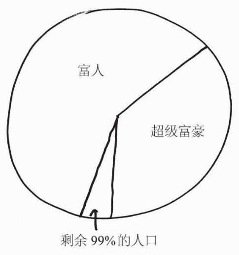

# 0501. 比盘子还大的饼状图

即使在分析一些相对简单、看似争议不大的问题时，计算比例的方法也可能会误导我们。

经济学家迈克尔·斯宾塞（Michael Spence）与桑戴尔·赫施瓦约（Sandile Hlatshwayo）在一篇论文中描绘了美国就业增长态势的美好图景。一直以来，人们自信地认为美国是一个工业化大国，工厂在夜以继日地生产全世界急需的各种产品。但是，目前的现实却大不一样。1990~2008 年，美国经济实际创造了 2 730 万个就业岗位，其中，有 2 670 万个「98%」来自非贸易部门，即政府、医疗、零售与饮食服务等领域，这些领域的工作不可外包，产品也不可销往海外。

98% 这个数字很好地反映了美国近代工业的发展史，因此，《经济学人》（Economist）杂志、比尔·克林顿（Bill Clinton）的新书等各类出版物纷纷加以引用。但是，我们必须搞清楚这个数字的确切含义。98% 与 100% 非常接近，那么，这项研究是不是说明美国经济体中的就业增长几乎全部集中在非贸易部门呢？

似乎的确如此。实际上，这个结论并不完全正确。1990~2008 年，贸易部门新增的就业岗位仅为 62 万个，而且，就实际情况而言，这还不是最糟糕的结果，因为在这段时间内，贸易部门的就业岗位甚至一度面临不增反降的危险。2000~2008 年，贸易部门的就业岗位有所减少，缩水了大约 300 万个，而非贸易部门则新增 700 万个就业岗位。在 400 万个新增岗位中，非贸易部门贡献了 700 万个，占总数的 175%。

因此，我们必须牢记下面这条箴言：在数字有可能是负值时，不要讨论它们的百分比。

也许有人会认为我小心过头了。负数也是数字，与其他数字一样，可以进行乘法与除法的运算。实际上，这个问题并不像我们一开始想的那样无足轻重。数学领域的前辈们甚至不清楚负数到底是不是数字，因为负数表示的数量意义与正数不完全相同。卡尔达诺、韦达（Francois Viete）等 16 世纪伟大的代数学家们，就负数与负数的乘积是否为正数的问题争论不休，他们都认为从一致性角度来看负数与负数的乘积必须是正数，但这到底是已经证明的事实还是仅仅针对这套符号系统的权宜之计，他们在这个问题上的观点大相径庭。卡尔达诺在解方程时，如果得到的根中有一个负数，他就习惯性地把这个讨厌的根称作「假根」（fi cta）。

针对这个问题，文艺复兴时期的意大利数学家们给出了各种各样的证明过程，在我们看来，有的证明与他们的宗教理论一样深奥难懂，而且相关性不强。但是，他们的有些观点却不无道理：如果把负数与百分比等代数运算相结合，就会让人类的直觉无所适从。如果你们违背我送给你们的这条箴言，各种稀奇古怪的不一致现象就会纷至沓来。

我举个例子来说明这个问题。假设我开了一家咖啡店，但是咖啡卖得并不好。上个月，我在咖啡销售方面亏损了 500 元。不过，我有先见之明，我的咖啡店还销售点心和 CD「光盘」，这两种业务则分别为我赚了 750 元。

总的算来，我这个月赚了 1 000 元，其中 75% 的盈利来自点心销售。因此，点心销售似乎是目前的主要赢利项目，而且几乎所有的利润都是销售羊角面包赚来的。但是，我也可以认为，利润的 75% 来自 CD 销售。假如我在咖啡销售方面的亏损增加了 1 000 元，我的总利润就是零，点心销售在盈利中所占的比例就是无穷大。[1] 75% 似乎意味着「几乎全部」，但是如果考虑的是可能为正值也可能为负值的数字，例如利润，那么这个百分比所代表的含义可能会发生翻天覆地的变化。

我们在学习只能取正值的数字「例如开支、收入或人口」时，不会出现上述问题。如果 75% 的美国人都认为保罗·麦卡特尼（Paul McCartney）是甲壳虫乐队中最可爱的成员，就不可能会有 75% 的美国人会选择林戈·斯塔尔（Ringo Starr）。林戈、乔治（George）[2] 与约翰（John）只能分享剩余的 25% 的支持率。

我们从就业数据中也能发现此类现象。如果斯宾塞与赫施瓦约说：金融与保险业创造了 60 万个就业机会，在整个贸易部门创造的所有就业机会中所占的比例约为 100%，可不可以呢？可以，但是他们并没有这样说，这是因为他们不希望大家错误地以为，在那段时间里，美国经济的其他领域没有取得增长。大家可能仍然记得，自 1990 年至今，美国经济中至少还有一个领域增加了大量就业机会——那个被命名为「计算机系统设计与相关服务」的领域，凭一己之力，新增了 100 多万个就业岗位，就业人数是最初的三倍之多。金融与计算机领域新增的就业机会，远多于整个贸易部门创造的 62 万个新岗位，但是超出的部分与制造业显著减少的岗位数相互抵消了。在将正数与负数放到一起处理时，稍不留意，就会形成错误的认识，以为贸易部门的新增岗位全都是金融业做出的贡献。

对于斯宾塞与赫施瓦约在论文中提出的观点，我们并没有充分的理由表示反对。的确，数百个行业的总就业增长率有可能是负数，但是在一个相当长的时期里，在经济环境正常的情况下，则极有可能是一个正数。毕竟，人口一直在增长，只要不发生大灾难，就业机会就会随之增加。

然而，有些人在分析中使用百分比时却不那么小心。2011 年 6 月，威斯康星州的共和党人发布了一则新闻，大肆吹捧州长斯科特·沃克尔（Scott Walker）创造了就业增长的新纪录。当时，美国经济从整体看延续了上个月的糟糕局面，全国仅增加了 1.8 万个就业岗位，而威斯康星州的就业增长却表现出好得多的势头，净增 9 500 个就业机会。这则新闻宣称：“我们发现，全美 6 月的就业增长，有超过 50% 要归功于我们威斯康星州。”共和党的政客们对这个观点津津乐道并四处宣传，议员吉姆·森森布莱纳（Jim Sensenbrenner）就曾在密尔沃基的一个郊区说：“上周发布的人力资源报告指出，全美新增 1.8 万个就业机会，其中的一半来自威斯康星州。这说明我们在这里的努力已经取得了效果。”

这个例子充分说明，如果以百分比的方式报道净增就业机会等既可能是正值也可能是负值的数字，就会陷入尴尬的境地。威斯康星州增加了 9 500 个就业机会，这当然是好事，但是，与此同时，邻近的明尼苏达州在民主党人、州长马克·代顿（Mark Dayton）的领导下，创造了超过 1.3 万个新增岗位，得克萨斯州、加利福尼亚州、密歇根州和马萨诸塞州的增长幅度也超过威斯康星州。的确，威斯康星州这个月取得了不错的就业成绩，但是它所做出的贡献，并不像共和党在新闻中暗示的那样，等于其余各州新增就业机会的总和。原来，其中的奥秘在于，其他各州减少的就业机会几乎正好抵消了威斯康星州、马萨诸塞州、得克萨斯州等地的新增就业岗位。也正因为如此，威斯康星州州长才有可能宣称该州为全美的就业增长做出了一半的贡献。如果明尼苏达州州长愿意，他也可以宣布全美新增就业机会中的 70% 要归功于他们州。两位州长的说法从技术上讲正确无误，但是从根本上讲却极易误导人。

接下来，我再以史蒂文·拉特勒（Steven Rattner）在《纽约时报》（New York Times）上发表的专栏文章为例。该文引用了经济学家托马斯·皮凯蒂（Thomas Piketty）和伊曼纽尔·赛斯（Emmanuel Saez）的研究成果，认为美国人从当前的经济复苏中获取的好处并不均衡。

新的统计数据表明，富人与其他人在财富上的差距越发地令人吃惊，我们急需解决这个问题。即使在一个对于收入不均衡已经习以为常的国家，这样的发现也让人震惊。

2010 年，美国经济仍然处于恢复阶段。在 2009 年的 2 880 亿美元国民收入基础上的新增收入中，有高达 93%「比例之高令人瞠目」的部分被前 1% 的纳税人收入囊中，而这些人当中收入最低的也有 35.2 万美元入账……2010 年，在排除通胀因素之后，收入排名为后 99% 的美国人的人均新增收入，只有微薄的 80 美元。而收入排名前 1% 的人的平均收入是 1 019 089 美元，增加了 11.6%。

这篇文章还给出了一个构思巧妙的信息图，将收入增加部分的构成做了进一步细分：37% 的新增收入为前 0.01% 的超级富豪所有，56% 属于前 1% 中的其他富人，而剩余 99% 的人则只能分享少得可怜的 7%。我们可以利用这些数据制作一个简单的饼状图：

接下来，我们把这幅饼状图再细分一次，考虑前 10% 中去掉前 1% 后剩余人口的收入增长情况。这个部分包含家庭医生、非精英律师、工程师与中高级管理人员，他们占多大比例呢？皮凯蒂与赛斯非常热心，在网上分享了他们收集的数据，我们可以从中找到这个问题的答案。我们发现，这个答案有点儿奇怪。2009 年，这部分美国人的平均收入约为 15.9 万美元；2010 年，他们的人均收入有所增加，略高于 16.1 万美元。尽管这个增幅与前 1% 的富人的新增收入相比显得有些寒酸，却为 2010~2011 年全美收入增长总额做出了 17% 的贡献。

饼状图中，在前 1% 的人口所占 93% 的份额的基础上再加上 17%，你会发现，饼状图无法表示了，因为饼比盘子还大。

93% 与 17% 相加的和超过 100%，怎么可能呢？其实很好理解，因为在 2011 年收入排名后 90% 的人口中，有的人经济状况有所好转，有的则没有起色，他们的总体平均收入实际上比 2010 年还要低。当混合到一起时，由于负数的存在，使用百分比的方法就会出错。

在皮凯蒂–赛斯数据中，我们会一次又一次地发现同样的问题。1992 年，收入排名前 1% 的人的新增收入占全美收入增长总额的 131%！这个数字当然会给人留下深刻的印象，但是同时这个数字也表明，百分比的含义与我们惯常的理解并不完全一致——我们无法让 131% 在饼状图中表示出来。1982~1983 年，美国再一次从经济衰退中恢复过来，国民新增收入总额中的 91% 应归功于收入排名前 10% 但不包括前 1% 的那部分人。这个数字是不是意味着比较富裕的职业人士抓住了经济恢复的良机，而中产阶层与非常富裕的人群则被他们甩在身后了？并非如此，前 1% 的超富阶层也取得了令人满意的进展，贡献了国民新增收入总额的 63%。对于收入排名前 10% 的人而言，经济形势一片光明，但是排名后 90% 的人口却节节败退，收入没有增加。

这些研究都没有否认经济复苏的曙光照射到美国富人身上的时间要稍早于中产阶层，但是，对美国经济形势的分析却有失偏颇。研究似乎表明，经济复苏仅使 1% 的人受益，而其余美国人都饱受折磨，但真实情况并非如此。排名前 10% 但没进入前 1% 的美国人（坦率地讲，很多《纽约时报》专栏评论的读者也包含在内），收入也很高，收入增加的幅度是饼状图所示的 7% 的两倍还多。前景一片黯淡、看不到一点儿希望的是剩余 90% 的人口。

即使所涉及的数字碰巧都是正数，人们仍然有可能曲解百分比。2012 年 4 月，民意测验结果显示，米特·罗姆尼（Mitt Romney）在女性选民中的支持率很低，于是他的竞选团队发表了一项声明：“奥巴马政府导致美国女性陷入了非常艰辛的境地。在奥巴马总统的领导下，苦苦挣扎、四处找工作的女性人数是有史以来最多的，失业人口中有 92.3% 的人是女性。”

从演讲的角度来看，这则声明毫无破绽。据美国劳工统计局的相关数据，2009 年 1 月美国的总就业人口为 13 356.1 万，而 2012 年 3 月仅为 13 282.1 万，减少了 74 万。在女性人口中，这两年的就业人数分别是 6 612.2 万和 6 543.9 万，因此与奥巴马入主白宫的 2009 年 1 月相比，2012 年 3 月的女性就业人数减少了 68.3 万。拿这个数字与第一个数字相除，就会得到 92% 这个数字。看起来，奥巴马总统似乎一直在四处奔走，劝说所有的企业解雇所有的女性员工。

这样的算法并不正确。这些数字都是岗位损失净值，而且我们也不知道在这三年时间里，增加与减少的工作岗位分别有多少，我们只知道这两者的差是 74 万。岗位损失净值有时是正值，有时则是负值，因此单纯地计算百分比有可能会出问题。假设罗姆尼竞选团队从 2009 年 2 月 [3] 才开始统计美国失业人口，结果会怎么样呢？2009 年 2 月，美国经济没有任何好转，总就业人口跌至 13 283.7 万。到 2012 年 3 月，美国的岗位损失净值为 1.6 万，女性减少的工作机会为 48.4 万「不过，这个数字的绝大部分被男性岗位的增加数抵消了」。由此可见，罗姆尼团队错失了一个良机。如果他们在奥巴马就任总统满一个月后，即从 2009 年 2 月开始计算美国女性的就业情况，他们就可以理直气壮地指出，在奥巴马任期内，女性损失的工作岗位数在岗位减少总数中占 3 000%！

但是，稍有头脑的选民都能看出来，这样的百分比应该是不正确的。

那么，从奥巴马宣誓就职到 2012 年 3 月这段时间里，男性与女性就业人口到底发生了哪些变化呢？这需要分成两个时间段来看。2009.1~2010.2，由于受到经济衰退及其余波的影响，男性与女性的就业形势急转直下。

2009.1~2010.2 月：

男性岗位损失净值：297.1 万

女性岗位损失净值：154.6 万

第二阶段是后衰退期，就业情况开始逐渐好转。

2010.2~2012.3 月：

男性岗位增加净值：271.4 万

女性岗位增加净值：86.3 万

在就业情况急剧恶化时期，男性面临的就业形势十分严峻，损失的工作岗位数几乎是女性的两倍。而在经济恢复期，男性得到的新工作机会占新增岗位总数的 75%。综合考虑这两个时期，男性的就业人数几乎持平。但是，如果认为当前面临糟糕经济形势的只有女性，那么这样的观点非常不明智。

《华盛顿邮报》对罗姆尼团队提出的 92.3% 这个数字给出的评价是「真实但是不正确」。罗姆尼的支持者们对这个评价大加嘲讽，而我认为这个评价不仅没有问题，还告诉我们使用统计数字时应当注意的一些深层次问题。毫无疑问，这个数字是正确的，用女性岗位损失净值除以岗位损失总净值，就会得到 92.3%。

但是，这样的「真实性」没有多大意义。如果奥巴马团队发表声明：“有人指控，多年来罗姆尼操控着一个在哥伦比亚与盐湖城之间贩卖可卡因的贩毒团伙，而罗姆尼本人也从来没有否认这项指控。”其效果就与这个数字的影响力相仿。

这则声明也是 100% 真实的，但它的目的是给人们留下一个不正确的印象。因此，「真实但是不正确」这个评价完全公平合理。这是一个错误问题的正确答案，从某种意义上讲，它的影响比单纯的计算错误更为恶劣。我们往往以为所谓谨慎的定量分析，就是我们用计算器完成某个计算，但是，我们必须先弄清楚计算的对象，然后才能使用计算器进行计算。

我认为这样的错误应归咎于数学应用题，人们之所以对数学与现实之间关系的认识严重失真，数学应用题难辞其咎。“鲍比有 300 颗弹子，他把 30% 的弹子给了詹尼，他给吉米的弹子是给詹尼的一半，他还剩多少颗弹子？”这个问题看上去是现实世界中发生的问题，但其实就是一个代数问题，只不过有了一层并不高明的伪装而已。这道应用题与子弹没有一点儿关系，我们也可以这样说：在计算器里输入「300–0.30×300–0.30×300÷2=」，然后抄写答案！

但是，现实世界中的问题与数学应用题完全不同。现实问题应该是：「经济衰退及其余波是否对职场女性的影响尤为显著？如果是，它在多大程度上是由奥巴马政府的各项政策造成的？」而计算器上根本找不到这样的按键。为了给出合乎情理的答案，我们不仅需要知道一些数字，还需要回答多个问题。在某个经济衰退期内，表示男性、女性工作岗位减少情况的曲线是什么形状？从工作岗位减少的情况看，本次经济衰退是否显著不同？与男性相比，女性从事的哪些工作比例失衡？奥巴马的哪些决定对这个经济领域产生了影响？我们必须先把这些问题转变成算式，然后才可以用计算器计算。等到使用计算器时，真正需要思考的问题应该已经解决了。用一个数除以另一个数只是单纯的计算，考虑清楚用什么除以什么才是真正的数学问题。

[1] 除非得到世界公认的数学家的指导，否则绝对不要把零用作除数。

[2] 实际上，甲壳虫乐队中最可爱的是乔治。

[3] 格伦·柯斯勒（Glenn Kessler）撰文分析了罗姆尼在 2012 年 4 月 10 日《华盛顿邮报》（Washington Post）上刊登的竞选广告，本书借鉴了柯斯勒的分析结果。