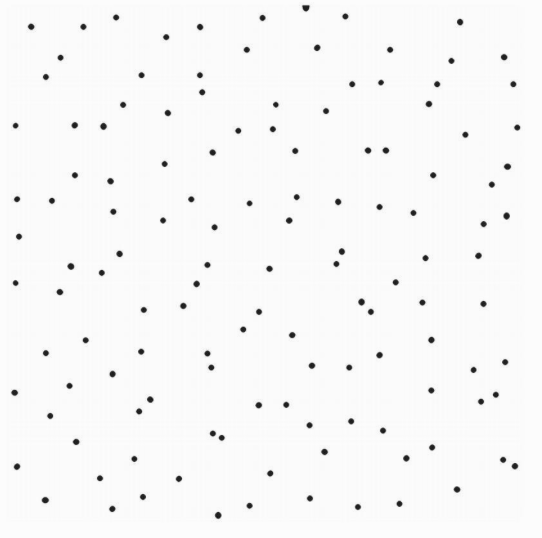

# 0801. 美丽又神秘的随机性

在进行显著性检验时，甚至在进行由费舍尔提出并被继任者们不断完善的复杂运算之前，我们会遇到一个非常棘手的哲学难题。在第二个步骤的开头，即当我们「假定零假设为真」时，这个难题便会悄然而至。

在大多数情况下，例如在检验避孕药的副作用、莎士比亚的头韵修辞法、《托拉》能预测未来等问题时，我们需要证明的是零假设不成立。做出一个与我们的预期目标相反的假设，从逻辑上讲，似乎有循环论证的嫌疑。

关于这个问题，我们其实无须担心，它是始于亚里士多德并经过时间检验的论证方法，叫作反证法或归谬法。反证法是数学领域的柔道，为了证明某个命题不正确，先假设该命题为真，然后借力打力，通过一个「过肩摔」来完成证明。如果结果是错误的 [1]，那么该假设必然是假命题，其思路为：

- 假定假设 H 为真；

- 根据 H，某个事实 F 不成立；

- 但 F 是成立的；

- 因此，H 不成立。

假如有人冲着我们惊呼：2012 年，哥伦比亚特区有 200 名儿童遭遇枪击身亡。这就是一个假设，但是可能难以核实。如果假定该假设是正确的，那么在 2012 年，哥伦比亚特区的杀人犯总数就不可能少于 200 人。但是，那一年的杀人犯总数是 88 人，少于 200 人。因此，这个假设肯定是错误的，而且这个论证过程中没有任何循环论证的成分。试探性地「假定」一个假设为真，也就是建立一个与事实相反的虚拟世界，使 H 成立，然后观察 H 在现实的作用下轰然坍塌。

从这种表述来看，反证法几乎毫无价值，从某种意义上讲也的确如此。但是，更准确地说，反证法是一种推理工具，我们对这种工具的使用已经得心应手，以至于我们都忘记了它的强大作用。实际上，毕达哥拉斯在证明 2 的平方根是无理数时，借助的就是这种非常简单的反证法。这个证明方法完全颠覆了传统，令人震惊的同时也让人们对它的始作俑者爱恨交加。它的证明过程十分简单、精炼，即使全部写出来也用不了多少篇幅。

假定 H：2 的平方根是有理数。

即可表示成分数 m/n 的形式，其中 m、n 是整数。我们还可以写出最简分数的形式，也就是说，如果分子与分母有公因数，就同时除以该公因数，分数保持不变。既然 5/7 的形式更为简单，我们就没有理由把这个分数写成 10/14 的形式。因此，该假设可以下述方式重新表述：

假定 H：2 的平方根等于 m/n，其中 m 与 n 为没有公因数的整数。

也就是说，m 与 n 不可能同时为偶数。如果两者同时为偶数，就说明它们有公因数 2，此时，跟化简 10/14 这个分数一样，我们可以把分子与分母同时除以 2，该分数保持不变。简言之，分子与分母同为偶数的分数不是最简分数。因此，F（m 与 n 同为偶数）是不成立的。

既然 √2=m/n，等式两边同时平方，我们可以得到 2=m^2/n^2，即 m^2=2n^2。因此，m^2 是一个偶数，从而说明 m 是偶数。一个数字是偶数的条件是该数字可以写成整数与 2 的乘积的形式，因此，我们可以把 m 写成 2k 的形式，k 为整数（事实上，我们就是用这种形式来表示偶数的），即 2n^2=m^2=(2k)^2。等式两边同除以 2，得到 n^2=2k^2。

上述代数运算有什么意义呢？其实就是证明 n^2 是 k^2 的 2 倍，因此 n^2 是一个偶数。如果 n^2 是偶数，n 就与 m 一样，也是一个偶数，这说明 F 是一个真命题！通过假定 H 为真，我们得到一个错误的甚至是荒谬的结果：F 既是真命题，又是假命题。因此，H 必然是错误的，也就是说，2 的平方根不是有理数。通过假定 2 的平方根是有理数，我们成功地证明它并不是有理数。这个方法的确很奇怪，但却行之有效。

我们可以把零假设显著性检验视为一种模糊的反证法：

- 假定零假设 H 为真；

- 根据 H，得到某个结果 O 的可能性非常小（比如，低于费舍尔设定的 0.05 这个临界值）;

- 但 O 是可以观察到的事实；

- 因此，H 成立的可能性非常小。

换句话说，这不是归谬法，而是「归为不可能法」（reductio ad unlikely）。

这方面的一个经典例子来自于 18 世纪的天文学家、牧师约翰·米歇尔（John Michell），他是最先将统计学方法应用于天体研究的学者之一。几乎所有的文明都观察到，在金牛座的一个角落有一个昏暗的星团。纳瓦霍人把这个星团称作「Dilyehe」，意指「闪亮的图形」；毛利人把它称作「Matariki」，即「神的眼睛」；在古罗马人的眼中，它是一串葡萄；日本人认为它是「Subaru」（现在，大家知道「斯巴鲁」的标志为什么是 6 颗星了吧）；美国人则把它叫作「Pleiades」（昴星团）。

几个世纪以来，人们一直在观察昴星团，关于它的神话传说不断，但是都无法回答最基本的科学问题：昴星团真的是一个星团吗？这些星球彼此间是否存在无法测算的距离，而从地球看过去，它们却正好排列在同一个方向上？在我们的视觉框架中随机分布的光点会呈现出下图所示的情形：

是否可以看到有些光点集中在一起？这样的情况并没有出乎我们的意料，因为总会有一些星球正好位于另外一些星球的上方。如何断定昴星团中的星球排列没有出现上述情况呢？GVT 指出：状态非常稳定的组织后卫的投篮命中率不会有明显的变化，但有时也会连中 5 球。同样，星球的排列也可能出现类似的巧合。

如果昴星团的星球排列如下图所示：

这些星球没有明显地簇拥成团，这种情况反而说明它们并不是随机分布的。在裸眼看来，这幅图似乎「随机程度更高」，但事实并非如此，它说明这些光点有拒绝排列在一起的倾向性。

因此，尽管上述星球看上去明显构成一个星团，但是我们不应该认为它们在太空中的距离真的很近。反之，如果天空中一组星球间的距离非常接近，我们就应该认为这不一定是偶然现象。米歇尔指出，如果星球在太空中随机分布，那么有 6 颗星球均匀排列、肉眼看上去与昴星团相似的概率非常小。根据他的计算，这个概率大约为 1/500 000。但是，昴星团的那些星球就在天空中紧密地簇拥在一起，像一串葡萄一样。米歇尔断言，只有傻瓜才会相信这是一种偶然现象。

费舍尔对米歇尔的研究成果表示认同，并明确指出米歇尔的论证方法与经典反证法两者之间的相似之处：

从逻辑上讲，该结论的可靠程度等同于一个简单析取（disjunction）：要么极不可能的事情真的发生了，要么随机分布理论是不正确的。

米歇尔给出的证明令人信服，他得出的结论也是正确的：昴星团不是一种巧合现象，而真的是一个星团，但该星团是由数百颗年轻的恒星构成的，而不是仅仅包含肉眼可见的那 6 颗星。我们还可以观察到很多与昴星团类似的星团，在这些星团中，恒星紧密地簇拥在一起，密集程度之高远远超过运气使然的范围。这样的事实充分说明，这些恒星并不是随机分布的，而是太空中某种真实的物理作用把这些恒星聚拢到了一起。

但问题在于，归为不可能法与亚里士多德提出的反证法有一个不同点：从总体上看，归为不可能法不合乎逻辑。在应用该方法时，我们有时会得到荒谬的结论。长期担任梅奥医学中心统计部门领导的约瑟夫·柏克森（Joseph Berkson）认为某个方法不可靠时，就会大声质疑它（并四处宣扬他的疑虑）。他曾经举了一个非常著名的例子，用它来证明归为不可能法有缺陷。假定有 50 个实验对象，他们都是人（H），你发现其中一个是白化病人（O）。由于白化病人极为稀少，两万人中患有此病的人通常不超过 1 个。因此，如果 H 是正确的，那么在这 50 名实验对象中发现一名白化病人的概率非常小，不足 1/400[2]，即 0.002 5。所以，在 H 的条件下观察到 O 的概率（p值）远小于 0.05。

因此，根据统计学理论，我们非常确定 H 是不正确的，也就是说实验对象不全是人。

人们经常会把「可能性极小」理解成「基本不可能」，而且，「基本」一词的影响力会越来越小，并最终淡出人们的考虑范围。但是，「不可能」与「可能性极小」是不同的概念，两者的意思相去甚远。不可能的事情绝不会发生，而可能性极小的事件并不少见。这就意味着我们在根据可能性极小的观察结果进行推理时，由于受到归为不可能法的影响，会采取一种不可靠的逻辑立场。因此，北卡罗来纳的彩票游戏在一周之内出现同一组号码（4、21、23、34、39）两次中奖的情况时，引起一片质疑之声，很多人怀疑其中有猫腻。其实，每组号码出现的概率都是一样的。星期二的中奖号码为 4、21、23、34、39，星期四为 16、17、18、22、39，这与同一组号码两次中奖一样，是可能性极小的事件，概率都为三千亿分之一。事实上，对于星期二与星期四这两天的中奖号码而言，出现任意一种结果的概率都是三千亿分之一。如果我们坚持认为可能性极小的结果足以说明彩票的公平性值得怀疑，那么，我们一辈子都会不停地给彩票委员会发邮件，因为无论中奖号码是什么，我们都会质疑它们。千万别干这样的傻事。

## 8.1 关于素数的猜想

米歇尔洞察到，即使那些恒星都是随机分布的，我们用肉眼观察时，也有可能以为它们构成了一个个星团。这样的现象并不只是出现在天体研究中，在悬疑剧《数字追凶》（Numb3rs）中也起到了关键作用。在发生一连串可怕的袭击事件之后，警察用大头针在地图上标注出犯罪地点，但是这些地点没有形成任何组群关系。由此可见，罪犯不是彼此毫无关联的多名精神病人，而是一名狡猾的连环杀手，有意识地选择不同的地点实施犯罪。根据剧情安排，这部电视剧应该讲述警察破案的故事，但是其中对数学知识的应用也非常完美，没有任何错误。

随机数据中的组群现象，为我们深入研究那些没有任何随机性的现实问题（例如素数的特性）提供了新思路。2013 年，新罕布什尔州大学一位深受学生欢迎的数学讲师「汤姆」张益唐（Yitang Zhang），宣布他成功地证明了关于素数分布的「有界距离」猜想，令理论数学界震惊不已。张益唐在北京大学就读时成绩斐然，但在 20 世纪 80 年代赴美国攻读博士之后却未取得任何成果。自 2001 年以来，他没有发表过一篇论文，还一度在地铁站卖三明治，可以说与学术性数学研究彻底脱节了。后来，他的一位从北京来到美国的老同学找到他，帮他在新罕布什尔州大学获得了一个非终身讲师的职位。从这些境遇来看，张益唐已经江郎才尽了。因此，在他成功证明了一个令若干数论大腕铩羽而归的定理，并将结果以论文形式发表出来的时候，人们都颇感意外。

但是，人们并没有因为该猜想是正确的这个事实而感到吃惊。数学家在人们眼中都是不苟言笑的死理性派，在有定论之前不会相信任何事实。其实，这样的认识是不准确的。早在张益唐完成他的研究之前，我们就认为有界距离的猜想是正确的，我们也都相信孪生素数猜想，尽管这个猜想还有待证明。这是为什么呢？

我们先从这两个猜想的内容说起。素数都是大于 1 的数，但不能是小于自身且大于 1 的两个数字的乘积。因此，7 是素数，但 9 不是素数，因为 9 可以被 3 整除。排在前几位的素数为 2、3、5、7、11 与 13。

所有的正数在用素数的乘积表示时只有一种表示方法。例如，60 包含两个 2、一个 3 和一个 5，因为 60=2×2×3×5。（正是出于这个原因，我们认为 1 不是素数，尽管之前有数学家认为 1 是素数。如果把 1 视为素数，60 可以表示成 2×2×3×5、1×2×2×3×5 与1×1×2×2×3×5 等形式，就会破坏唯一性。）那么素数自身是什么情况呢？这个规则同样适用。例如，13 这个素数就是一个单一素数（即 13 自身）的乘积。那么 1 呢？我们已经将 1 从素数中剔除，1 又如何用素数的乘积表示呢？答案很简单：1 是零个素数的乘积。

有人会对此提出疑问：“用零个素数的乘积表示的数为什么是 1 而不是 0 呢？”下面这个解释有点儿复杂：我们先求出某些素数（例如 2 与 3）的乘积，然后用所有作为乘数的素数来除这个乘积，得到的应该是零个素数的乘积。6 被 2×3 除的结果是 1，而不是 0。（此外，零个数字的和的确是 0。）

素数是数论的「原子」，是构成所有数字且不可整除的基本存在。因为这个特点，从数论形成以来，人们一直在深入地研究素数。数论中最先得到证明的定理之一就是欧几里得定理。欧几里得定理告诉我们，无论我们把数轴延伸得多长，素数都是无穷多的。

数学家们总在不断进取，他们绝不会止步于一个简单的无穷性论断，这是因为无穷性也各不相同。2 的幂数有无穷多个，但是在数轴上表示出来时却显得非常稀少。在前 1 000 个数字中，2 的幂数只有 10 个：1，2，4，8，16，32，64，128，256，512。

偶数的个数也是无穷的，但它们在数轴上却极为常见：前 1 000 个数字中正好有 500 个偶数。很明显，在前 N 个数字中，大约有 N/2 个偶数。

研究表明，素数的个数处于中游水平，比 2 的幂数更为常见，但是比偶数少。在前 N 个数字中，大约有 N/logN 个素数，这就是素数定理。19 世纪末，数论学家雅克·阿达玛（Jacques Hadamard）与德·拉·瓦莱·普森（Charles-Jean de la Va l lée Pou s sin）完成了该定理的证明。

我注意到几乎没有人了解「对数」这个概念，因此在这里稍加说明。正数 N 的对数记作 logN，表示数字 N 的位数。

等一等，真的如此吗？

这个说法不完全对。我们把数字的位数称作「假对数」（fake logarithm，简称 fl ogarithm），这非常接近于对数的真实含义，可以帮助我们了解对数在上述语境中的意思。假对数（也是对数）是一种增长很慢的函数：1 000 的假对数是 4，100 万是 1 000 的 1 000 倍，其假对数是 7，而 10 亿的假对数不过是 10。[3]

## 8.2 素数是不是随机数？

素数定理指出，在前 N 个整数中，其中大约有 1/logN 的整数为素数。而且，随着数字变大，素数会越来越稀少，但是减少的速度很慢。与 10 位的随机数相比，20 位的随机数是素数的概率要小一半。

人们自然会猜想：某个类型的数字越常见，该类型数字的间距就越小。在看到一个偶数之后，再向前不超过两个数字就会看到下一个偶数。事实上，偶数之间的距离总是正好等于 2。而 2 的幂数则有所不同，相邻两个 2 的幂数之间的距离呈指数级增长，在沿着该数列向前时，彼此间的距离只会越来越大，而绝不会变小。例如，在 16 之后，两个 2 的幂数之间的距离再也不会小于或等于 15。

这两种情况都易于理解，但是相邻素数之间的距离问题理解起来则难得多，即使在张益唐取得突破之后，仍有很多问题没有解决。

不过，由于我们可以把素数看成随机数，这个视角对我们有显著的帮助，因此我们知道会得到什么样的结果。这个视角之所以有用，原因在于这是一个大错特错的视角。素数并不是随机数，素数的所有特点都不是我们可以随意判定的，也不是碰巧如此。但是，实际情况恰好相反：我们认为素数是宇宙的某个无法改变的特征，然后把它刻录成金唱片向星际空间播放，向外星人证明我们不是傻瓜。

素数不是随机数，但从很多方面看它们似乎就是随机数。例如，我们用 3 除一个随机整数，余数是 0、1 或者 2，而且三种情况出现的频次完全相同。如果用 3 除一个大的素数，不可能正好除尽，否则，这个所谓的素数如果可以被 3 整除，就说明它根本不是素数。但是，狄利克雷（Dirichlet）提出的一个古老定理认为，余数 1 与余数 2 出现的概率相同，这正好是随机数的一个特点。从「被 3 除的余数」这个角度看，素数很像随机数。

那么，相邻素数之间的距离呢？我们也许会认为，随着数字变大，素数越来越稀少，它们彼此之间的距离也会越来越大。平均地看，情况的确如此。但是，张益唐的证明表明，彼此间的距离不超过 7 000 万的素数对是无穷的。换言之，相邻素数之间的距离在 7 000 万以内的有无穷多例。这就是「有界距离」猜想。

为什么是 7 000 万呢？因为这是张益唐能够证明的极限数字。事实上，他的论文发表之后，引发了一个研究热潮，世界各地的数学家都加入了「博学者计划」——一种狂热的在线数学基布兹（kibbutz）[4]，协同合作，希望在张益唐的研究基础之上，进一步缩小这个有界距离。2013 年 7 月，一个合作团体证明，彼此间的距离不大于 5 414 的素数对有无穷多个。11 月，刚刚在蒙特利尔大学拿到博士学位的詹姆斯·梅纳德（James Maynard）将这个距离缩小到了 600。「博学者计划」迅速将梅纳德的敏锐发现与其他计划参与者的理解加以归纳。在大家看到本书时，这个距离肯定又缩小了。

乍一看，有界距离似乎是一个神奇的现象。如果素数的距离有越来越大的趋势，那么，为什么有那么多对彼此相近的素数呢？素数之间存在某种引力吗？

当然不是这么回事儿。如果我们让数字随意分布，很有可能某些数字两两之间的位置正好非常接近，就像平面上随机分布的点会形成明显的组群一样。

如果素数具有随机数的特点，不难估计我们将准确地观察到张益唐的研究结果，而且我们还有可能观察到很多素数对的相互距离只有 2，如 3 和 5、11 和 13。这样的素数对就是「孪生素数」，但它们的无穷性还是一种推测，有待进一步证明。

（下文是一个简短的计算过程。如果你们看不懂，可以直接从「孪生素数的数量如此庞大……」那一段往下看。）

别忘了，素数定理告诉我们，在前 N 个数字当中，有 N/logN 个数字是素数。如果这些数字是随机分布的，每个数字 n 是素数的概率约为 1/logN，数字 n 与 n+2 同为素数的概率就是 1/logN×1/logN=1/logN^2。我们有可能观察到多少对距离为 2 的孪生素数呢？在我们所研究的范围内，大约有 N 对（n，n+2），每一对数字是孪生素数的概率为（1/logN）^2，因此我们有可能发现 N/（logN）^2 对孪生素数。

但是，这里的随机性并不十分纯粹，会产生一些微弱的影响，不过数论学家知道该如何应对。我们需要关注的重点是，n 为素数与 n+1 为素数，并不是相互独立的两个事件。n 为素数时，n+2 是素数的可能性会加大，因此，如果用 1/logN×1/logN 来表示两者同时成立的概率，就不完全正确。（一种观点认为：如果 n 是素数且大于 2，那么 n 必然是奇数，因此 n+2 也是奇数，于是，n+2 是素数的可能性更大。）哈代与他的终生合作伙伴利托伍德（J. E. Littlewood）一起，在考虑到这些依存关系的前提下，完成了一个更完善的预测，认为孪生素数的数量实际上比 N/（logN）^2大 32%。根据这种更准确的估计，我们可以预测小于 1024 的孪生素数的数量应该为 1 100 000 000 000 左右，而实际数字是 1 177 209 242 304，两者非常接近。

孪生素数的数量如此庞大，不过，这个情况并没有让数论学家感到意外。这不是因为我们认为素数中隐藏着某种神奇的结构，而是因为我们认为这样的神奇结构并不存在，我们猜测素数是随机分布的。如果孪生素数猜想是错误的，孪生素数的存在就是一个奇迹，因为我们需要某种至今为止仍然不为我们所知的力量将这些素数分开。

我们无须过多了解就会发现，有很多数论方面的著名猜想都是这种情况。哥德巴赫猜想就是一个例子，它认为所有大于 2 的偶数都是两个素数的和。如果素数表现得像随机数，哥德巴赫猜想就必然是正确的。认为存在任意长的素数等差数列的猜想也同样如此，本·格林（Ben Green）与陶哲轩（Terry Tao）完成了该猜想的证明，陶哲轩还因此获得了 2004 年的菲尔兹奖。

其中最有名的是费马于 1637 年提出的猜想，该猜想断言方程式 A^n+B^n=C^n 在 A、B、C、n 为正整数且 n 大于 2 时无解。（如果 n 等于 2，该方程式会有很多根，例如：3^2+4^2=5^2。）

当时，大家都坚信费马猜想是正确的，就像我们现在相信孪生素数猜想一样。但是，没有人知道如何证明费马猜想，一直到 20 世纪 90 年代，普林斯顿大学的数学家安德鲁·怀尔斯才取得了突破。我们认为，n 次完全幂已经非常稀少了，要在极为稀少的随机数集中找到两个数字，使两者的 n 次幂和等于第三个数字的 n 次幂，这样的可能性更是接近于零。大多数人甚至认为，广义的费马方程式 A^p+B^q=C^r 在指数 p、q 与 r 足够大时也是无解的。如果在 p、q、r 都大于 3 且 A、B、C 没有相同质因数（素因数）的条件下，有人能证明上述方程无解，达拉斯的一位名叫安德鲁·比尔（Andrew Beal）的银行家就会奖励这个人 100 万美元。我完全相信这个命题是真的，我的理由是：如果完全幂是随机数，这个命题就应该是真命题。但是我认为，要想完成这个命题的证明，我们还必须了解关于数字的一些全新发现。我与多名合作者一起，花了好几年的时间，证明在 p=4、q=2、r>4 的条件下广义的费马方程式无解。为了解决这个问题，我们专门设计了一些新方法。很显然，仅凭这些并不足以完成这个价值百万美元的任务。

尽管有界距离猜想看上去非常简单，但是张益唐的证明却需要运用现代数学的一些非常深奥的定理。张益唐在前辈的研究基础上完成了他的证明：用我们前面提到的第一种方法，即考察多个素数除以 3 所得余数的情况，可以看出素数具有随机数的特征。他证明了素数的随机性具有完全不同的意义，与相互间距离的大小有某种关系。随机数就是随机数！

张益唐的成功，以及当代其他数学家（比如本·格林与陶哲轩）所完成的相关研究，都表明我们最终会建立内容更丰富的随机理论，这样的前景甚至比任何单个的研究成果更加令人兴奋。比如，在我们认为数字表现出杂乱无序的随机性分布特征时，我们有某种方法精确地定义这个说法，尽管这种方法的根源是一些实实在在的数论程序。帮助我们彻底揭开素数所有秘密的有可能是一些新的数学理念，而这些理念又赋予了杂乱无序这个概念新的内涵，这样的前景似乎自相矛盾，却又令人无比陶醉！

[1] 有的人坚持应对这种方法加以区分：如果得出自相矛盾的结果，该证明方法就是反证法；如果仅仅得出错误的结果，这种证明方法就是「拒取式论证法」（modus tollens）。

[2] 根据有效的经验法则，你可以推断出，在样本中寻找白化病人时，每名实验对象可以贡献 1/20 000 的可能性，因此 50 名对象总的贡献为 1/400。这种算法不完全正确，但是在结果非常接近于零「例如本例」的情况下，它通常足够精准。

[3] 读到这里大家就能看懂 logN 的真正定义了。所谓对数，就是使 ex=N 等式成立的数字 x。这里，e 是欧拉数，它的值约等于 2.718 28……。这里我使用了 “e”，而不是 “10”，因为我们准备讨论的对数是自然对数，而不是常用对数（即以 10 为底的对数）。如果你是一位数学专业人士，或者你有 e 手指，你就会经常使用自然对数。

[4] 基布兹是希伯来语「团体」的意思。——译者注