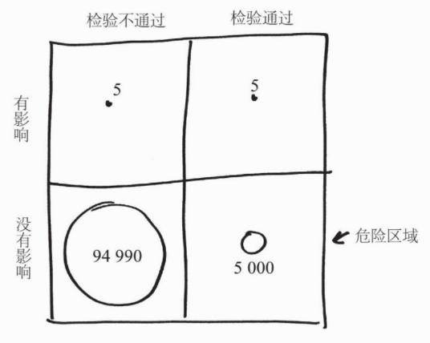
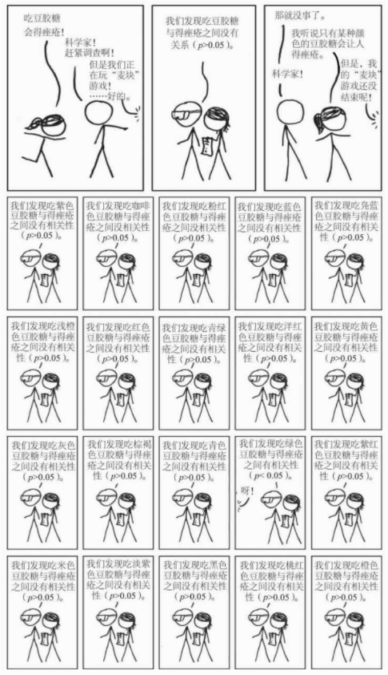
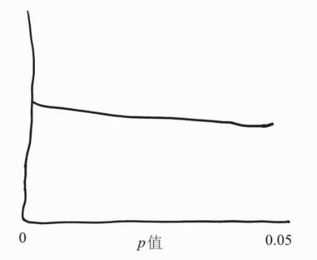
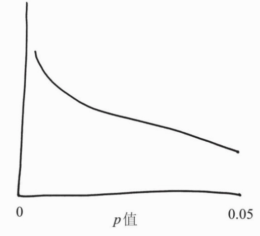
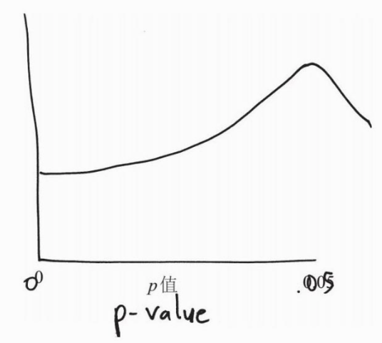

# 0901. 肠卜术与科学研究

统计学家科斯马·沙利兹（Cosma Shalizi）曾经给我讲过一个寓言故事：

假设你是一位肠卜僧，也就是说，你的工作是杀死绵羊，通过研究绵羊的内脏（尤其是肝脏）特征预测未来。当然，你不会因为自己在完成相关仪式时遵循了伊斯特里亚诸神的神谕，就认为自己的预测十分可靠。你还需要找到相关证据，于是，你和你的同事将预测结果提交给《国际肠卜术杂志》（International Journal of Haruspicy），请同行评议，该杂志要求所有预测结果都必须通过显著性检验才能发表。

肠卜僧做预测，尤其是严格基于证据的预测，并不是一件简简单单的差事。一方面，你经常会全身沾满污血；另一方面，你的很多次预测都不会成功。你尝试通过研究绵羊的内脏来预测苹果公司的股价，结果失败了；你试图为民主党在西班牙裔美国人当中的投票支持率构建预测模型，结果没有成功；你预测全球石油的供应情况，也失败了。吹毛求疵的诸神，有时并不明示哪种内脏结构以及哪些咒语可以准确地预测未来。有时候，多位肠卜僧所做的实验是一模一样的，但是 A 成功了，B 却失败了。这样的情况令人沮丧，有时候你甚至想放弃做肠卜僧，转而去读法学院。

但有时候一切又非常顺利，你发现绵羊肝脏的纹路与凸起部位真的可以预测第二年流感爆发的严重程度。这些发现让你觉得自己没有白白地遭遇那些挫折与失败，于是，你默默地感谢神灵，然后把预测结果发表到杂志上。

你可能会发现，每进行大约 20 次实验，就会有一次预测是正确的。

至少我觉得预测正确的概率就这么大。因为我不会像你一样相信肠卜术，我觉得绵羊的内脏不会知道流感爆发的日期，即使两者正好吻合，也纯属巧合。换句话说，只要涉及通过绵羊内脏来预测未来，我都认为零假设是正确的。因此，根据我的经验，肠卜术实验取得成功的可能性非常小。

这种可能性到底有多小呢？按照惯例，统计学显著性检验的标准临界值（p值）也是《国际肠卜术杂志》同意发表预测结果的标准临界值，都是 0.05 或 1/20。别忘了，p 值的定义明确规定，如果某个实验的零假设为真，即使该实验真的取得了具有统计学显著性的结果，其成功的概率也仅为 1/20。如果零假设总是正确，也就是说，如果肠卜术纯粹是一种骗人的把戏，那么在 20 次实验中，只有一次实验的结果能达到发表的标准。

然而，肠卜僧有成百上千个，被开膛破肚的绵羊为数更多，因此，即使预测成功的概率仅为 1/20，这些成功的实验也能提供大量的证明材料，各种不寻常的实验结果也足以填满每期杂志的版面，让人们相信肠卜术是有效的，神的智慧是不容怀疑的。但是，即使某个实验真的预测成功并且获准发表，如果其他肠卜僧尝试做该实验，也通常会遭遇失败。不过，由于在预测结果不具有统计学显著性时，实验结果不会获准发表，因此人们无法通过重复实验去验证它。而且，即使有人发出质疑的声音，专家们也总能指出重复实验过程中的细微差别，作为跟踪研究失败的借口。他们的理由是：我们确信这个实验是有效的，因为我们进行并通过了统计学显著性检验。

现代医学与社会科学不是肠卜术，但是近些年来，一些唱反调的科学家不断发出越来越大的声音，向我们传递一个令人不安的信息：在科学界，可能还有更多「肠卜术」，只不过我们不愿意承认罢了。

发出最大声音的是希腊人约翰·约安尼迪斯（John Ioannidis）。2005 年，这位由中学数学明星蜕变而成的生物研究人员，发表了一篇题为「公开发表的研究成果大多不真实的原因何在」的论文，在临床医学领域引发了一场自我批评的狂风暴雨（随之而来的是一波自我辩解的风潮）。有时，作者为了哗众取宠，往往在论文标题中危言耸听，但这篇论文不属于此列。约安尼迪斯严肃地指出，医学研究和肠卜术一样，找不到任何有实际效果的内容，所有的专科就是一个个「毫无内涵的领域」。他认为：“我们可以证明，得到发表的医学研究成果大多是不真实的。”

约安尼迪斯肯定不愿意大费周折地完成这种「证明」工作，但是这位数学家的确有充分的理由，认为他的这个反传统声明并不是无理取闹。约安尼迪斯认为，我们在医学上尝试使用的介入治疗法大多不会起作用，我们所检测的各种关系大多是子虚乌有。以基因与疾病之间的关系为例。基因序列中有大量基因，其中绝大多数都不会引发癌症、抑郁症或肥胖症等，至少人们没有直接观察到基因会导致人们患此类病症。约安尼迪斯请大家考虑基因对精神分裂症的影响，由于这种疾病有遗传的可能，人们几乎可以肯定是基因在起作用。但是，起作用的基因位于基因序列的什么位置呢？研究人员可能会普遍撒网（毕竟，我们所处的是一个大数据时代），对 10 万种基因（更精确的名词是「遗传性多态现象」）进行检验，以期找出与精神分裂症有关的基因。约安尼迪斯指出，在这些基因中，大约有 10 种真的会对精神分裂症产生影响。

那么，其余的 99 990 种基因呢？这些基因与精神分裂症没有任何关系。但是，其中的 1/20 或者说 5 000 种基因，会顺利通过统计学显著性检验。换句话说，在人们欢呼「天啊，我发现了精神分裂症基因」时，在这些可能获准发表的研究结果中，虚假结果的数量是真实结果的 500 倍。

而且，要得到上述结果，我们还得假定所有真的对精神分裂症有影响的基因顺利通过检验。从前文讨论的莎士比亚与篮球的例子可以看出，如果研究方法的功效不足，真实结果就完全有可能被认定为不具有统计学显著性而被排除在外。如果研究功效不足，真正会产生影响的基因可能会有半数顺利通过显著性检测，也就是说，在所有通过检验的导致精神分裂症的那些基因中，只有 5 种基因会真正致病，而浑水摸鱼、仅凭运气顺利通过检验的基因却有 5 000 种那么多。

在方框图中画圆是直观了解相关情况的一个有效方法。

图中的大小圆圈代表该类型基因的数量。左侧表示阴性检验结果，即没有通过显著性检验的基因；右侧表示阳性检验结果。位于上方的两个格子表示的确对精神分裂症有影响的、为数不多的基因，因此，右上格子中的基因是真阳性（这些基因对精神分裂症有影响，检验结果也表明它们有影响），而左上格子中的基因则表示假阴性结果（这些基因对精神分裂症有影响，但检验结果表明它们没有影响）。下方的两个格子表示对精神分裂症没有影响的基因，大圆圈表示真阴性结果，小圆圈表示假阳性结果。

从图中可以看出，问题产生的原因并不是显著性检验。显著性检验百分之百地完成了它的使命。在对精神分裂症没有影响的基因当中，顺利通过检验的极少，而我们真正感兴趣的那些基因仅有半数在检验中顺利过关。对精神分裂症没有影响的基因在数量上占据优势，因此，尽管相对于表示真阴性的圆圈而言，表示假阳性结果的圆圈不是很大，但是比表示真阳性结果的那个圆圈大得多。

## 9.1 赢家诅咒与文件柜问题

上述糟糕的情形还会进一步加剧。统计功效低下的研究只能找出非常显著的效果，但是我们知道，效果（如果有）有时非常小。换言之，在检验基因的作用时，研究人员有可能认为检验结果不具有统计学显著性，因此将其排除在外；而那些顺利通过检验的结果，要么是假阳性，要么是过度夸大基因作用的真阳性结果。在小型研究比较常见、影响程度通常有限的领域，统计功效低下的风险尤为突出。不久前，心理学领域最重要的杂志之一——《心理科学》（Psychological Science）刊登了一篇论文，指出已婚女性在排卵期时，支持民主党总统候选人米特·罗姆尼的可能性显著提高。在排卵期内接受调查的女性中，有 40.4% 的人表示支持罗姆尼；而在非排卵期接受调查的女性中，只有 23.4% 的人支持他。样本虽小，只有 228 名妇女，但是显著性差异很明显，其 p 值为 0.03，足以顺利通过显著性检验。

其实，显著性差异太大恰恰是问题所在。在支持罗姆尼的已婚女性中，有接近一半的人每个月还有某些时间竟然表示支持奥巴马，这种现象真的可信吗？如果是真的，难道没有任何人注意到吗？

即使排卵期真的会影响已婚女性的政治倾向，这种影响也会比上述研究结果要微弱得多。如果研究规模比较小，那么人们在用 p 值过滤时，往往会排除影响程度较为接近 p 值的结果，因此，上述检验得到的较大显著性差异是有悖常理的。换言之，我们可以有把握地认为，这次研究得出的显著性结果大多甚至全部是噪声。

虽然噪声有可能告诉我们真相，但同样有可能把我们引向相反的方向。因此，尽管这样的结果具有统计学显著性，但不可信，我们仍然不知道真相。

科学家把这个问题称作「赢家诅咒」。有的实验取得了令人信服、广受赞誉的结果，但是人们在重复这些实验时，却常常得到乱七八糟、令人失望的结果。之所以出现这样的情况，赢家诅咒就是一个原因。下面向大家介绍一个有代表性的例子。心理学家克里斯托弗·查布里斯（Christopher Chabris）率领若干科学家，针对基因序列中的 13 种单核苷酸多态性（SNP）进行了研究。在之前的研究中，人们观察发现，这些多态性与智商分数的相关性存在统计学显著性。我们都知道，能否在智商测试中取得高分，在某种程度上是由遗传因素决定的，因此，寻找遗传标记的做法不无道理。查布里斯的团队将这些 SNP 与一些大型数据集（例如，以 1 万人为对象的威斯康星纵向研究）中的智商分数进行了比较研究，结果却发现 SNP 与智商分数之间的相关性都不具有统计学显著性。因此，我们几乎可以肯定，即使这种相关性真的存在，也是很微弱的，连大型测试都无法检验到。当前，基因学家认为，智商分数可能并不集中取决于为数不多的几种「聪明」的基因，而是众多遗传因素集腋成裘的结果。也就是说，如果我们试图从 SNP 中寻觅具有统计学显著性的遗传效果，我们也会有所发现，只不过成功的概率与肠卜僧差不多，只有 1/20。

连约安尼迪斯也不相信公开发表的论文只有 1/1 000 的正确率。大多数人研究基因序列时都不是漫无目的的，他们检验的往往是之前被认为是正确的研究结果，因此在前文的方框图中，位于底层那一排的内容不会明显优于上层一排的内容。但是，重复实验危机依然存在。2012 年，加利福尼亚一家名叫安进的生物技术公司开展了一项计划，科研人员通过重复实验去验证癌症生物特征方面的一些著名的实验结果，总计 53 种。结果，他们只成功验证了其中的 6 种。

为什么呢？这并不是因为基因学家与癌症研究人员都是傻瓜，而是由多种因素造成的。重复实验危机反映了一个事实：科学研究的道路上困难重重，我们的大多数观点都是错误的，即使在第一轮检验中侥幸胜出的观点也大多是错误的。

但是，科学界的一些做法加剧了这种危机的危害性，而这些做法其实是可以改正的。一方面，我们在论文发表这方面出了问题。我们以下文所示的 xkcd 漫画 [1] 为例。假定我们在了解基因与我们研究的某种疾病之间是否存在相关性时，测试了 20 个遗传标记，并发现只有一个测试结果的 p 值小于 0.05，如果我们是数学研究的老手，我们就会知道，在所有的遗传标记都不起作用时，我们的成功率正好是 1/20。此时，我们会对歪曲报道的新闻标题嗤之以鼻，而这正是漫画家创作这幅漫画的真实意图所在。

如果我们测试的是同一种基因或者绿色豆胶糖，而且 20 次测试中只有一次得到了具有统计学显著性的结果，我们就更加确定这个结果不值一提。

但是，如果 20 组研究人员分别在 20 个实验室里针对绿色豆胶糖进行了共计 20 次测试，结果会怎么样呢？有 19 个实验室不会得出具有统计学显著性的测试结果，他们也不会据此发表论文。这是毫无疑问的，谁会把「吃绿色豆胶糖与得痤疮之间没有相关性」作为重大发现公开发表呢？第 20 个实验室里的研究人员比较幸运，得出了一个具有统计学显著性的测试结果，原因是他们的运气好，但他们并不知道自己的成功得益于运气。在他们看来，他们对「绿色豆胶糖会诱发痤疮」这个理论只进行了一次检验，而且检验结果是有统计学显著性的。

如果我们完全根据公开发表的论文来决定吃哪种颜色的豆胶糖，就会犯错误，而且它与美军在计算从德国返航的飞机身上有多少个弹孔时所犯的错误性质一样。亚伯拉罕·瓦尔德说过，如果想了解真实情况，还需要考虑那些没有返航的飞机。

这就是所谓的「文件柜问题」：由于大众传播受到统计学显著性临界值的影响，导致某个科学领域对某个假设的证据形成了严重歪曲的观点。而我们已经为这个问题赋予了另外一个名字，即「巴尔的摩股票经纪人问题」。那位极其兴奋地准备新闻发布会，并打算宣布「绿色染料」16 号与皮肤病有相关性的幸运的研究人员，与那位将毕生积蓄交给不诚实的经纪人、想法天真的投资人一样，都受到了「文件柜问题」的影响。那位投资人与那位研究人员一样，只看到了碰巧过关的那一次实验结果，却没有看到更多的实验以失败告终。

但是，两者之间有一个重大的不同，那就是科研活动中没有居心不良的骗子，也没有无辜的受害者。如果科学界将失败的实验都装进「文件柜」，它就是在自欺欺人。

上述结果都是以相关科研人员不弄虚作假为前提的。但是，这样的条件并不总能得到满足。还记得让圣经密码编码者陷入困境的回旋余地问题吗？科研人员唯恐遭到淘汰，他们面临的发表论文的压力很大，因此在面临回旋余地的诱惑时可能会受到影响。如果分析得到的 p 值为 0.06，这些结果就不具有统计学显著性。但是，把多年的心血锁进文件柜，是需要极强的意志力的。是啊，对于研究者来说，看到这些数字难道一点儿都不别扭吗？也许这就是个异常值，或许我们可以把数据表的某一行删除吧。年龄方面的数据得到控制了吗？室外天气方面的数据得到控制了吗？年龄数据与室外天气数据都得到控制了吗？如果我们找出各种理由，修改与研究结果直接相关的统计数据，我们常常可以把 p 值由 0.06 降至 0.04。乌里·西蒙逊（Uri Simonsohn）是宾夕法尼亚大学的一位教授，他是重复实验研究的开创者，他把这些做法称作「p值操控」。通常，p 值操控并不像我说的那样粗暴，而且一般都不是恶意行为。在操控 p 值时，人们坚信自己的假设是正确的，那些圣经密码编码者们就是这样。此时，人们很容易找到理由，认为自己得出可以发表的研究结果是正确的，甚至还会后悔一开始的时候没有朝这个方向努力。

但是，大家都知道这种做法并不正确。科学家发现至今仍然有人在这样做，他们把这种做法描述成「对数据进行严刑拷打，直到它们招供才罢手」。因此，所谓的具有统计学显著性的实验结果，不过是通过操控数据去迎合自己的预期罢了。

美军无法检查坠毁在德国境内的飞机遭受了哪些打击，同样，对锁在文件柜中没有发表的那些论文，我们也查看不到，因此，操控 p 值的程度难以估计。但是，我们可以向亚伯拉罕·瓦尔德学习，对无法直接测算的数据进行推断。

我们还是以《国际肠卜术杂志》为例。如果我们仔细阅读该杂志发表的所有论文，然后把所有的 p 值都记录下来，我们会发现什么问题呢？记住，在这个例子中，零假设永远正确，因为肠卜术是不起作用的。因此，有 5% 的实验结果的 p≤0.05，4% 的 p≤0.04，3% 的 p≤0.03，以此类推。换句话说，p 值在 0.04-0.05 之间的实验，与 p 值在 0.03-0.04 之间，以及 p 值在 0.02-0.03 之间……的实验，数量相当。如果把所有论文的 p 值绘制成图，我们就会得到下图所示的水平的曲线。

如果我们阅读的是一份实事求是的杂志，情况会怎么样呢？在我们检验的众多实验结果中，有很多的确是真实有效的，因此，这些实验结果的 p 值小于 0.05 的可能性更大。在这种情况下，p 值曲线应该向下倾斜。

不过，现实情况并不完全如此。统计调查人员发现，在政治科学、经济学、心理学及社会学等多个领域里，p 值曲线在接近 0.05 这个临界值时会明显向上倾斜。

这就是 p 值操控造成的。这种情况说明，大量本来位于 p=0.05 这个临界值之上而无法发表的实验结果，经过对数据的坑蒙拐骗、威逼利诱甚至严刑逼供之后，变成了令人满意的结果。这对急需发表论文的科研人员而言是好事，但对于科学研究来说则是噩耗。

如果作者不愿意「折磨」他的数据，或者经过「逼供」之后，p 值仍顽固地停留在 0.05 这道红线之上，又会怎么样呢？科研人员仍然有变通的办法，他们会精心编排出各种说辞，竭力为不具有统计学显著性的实验结果辩解。他们会说他们的实验结果“几乎具有统计学显著性”“有显著性倾向”“接近于显著性”“处于显著性的边缘”，甚至会煽情地说这个结果「在显著性边缘徘徊」。[2] 对于研究人员处心积虑想出的这些词句，我们当然可以大加嘲弄，但是，我们憎恶的应该是这项活动，而不是这样做的人，因为这种冰火两重天的情况是论文发表门槛导致的。用 0.05 设置一个生死界线，是在基本范畴的问题上犯错误，把连续变量（我们有多少证据可以证明这种药物有疗效，这种基因可以决定智商分数，排卵期的女性倾向于支持民主党总统候选人）当作二进制变量（对或者错）来处理。也就是说，我们应该允许科研人员报告不具有统计学显著性的研究结果。

在某些情境中，科研人员必须报告不具有统计学显著性的研究结果。2012 年，美国最高法院的一项判决意见被全票通过。这个判决意见是，Zicam 感冒药的制造商 Matrixx 必须做出明确告知，某些人在服用该药物后会丧失嗅觉。该项判决意见的起草人索尼亚·索托马约尔（Sonia Sotomayor）认为，虽然丧失嗅觉的研究没有通过显著性检验，但是在向公司投资人提供的所有信息中应该包含此项内容。p 值较弱的实验结果也许只能起很小的证明作用，但是总比没有好。p 值较强的实验结果可能有更大的证明作用，但是我们已经知道，它不一定是真实的。

毕竟，0.05 这个 p 值并没有什么特别之处，它只是主观选择的一个临界值，是费舍尔确定的一种习惯做法。当然，传统做法有其积极意义，一个被广泛接受的临界值，可以帮助大家理解显著性一词的含义。我读过美国传统基金会的罗伯特·芮克特（Robert Rector）与柯克·约翰逊（Kirk Johnson）合写的一篇论文。他们在论文中抱怨，一些科研人员宣扬了一个错误的观点，认为禁欲宣誓对青少年患性疾病的比例大小没有影响。事实上，研究发现，在宣誓新婚夜之前不发生性行为的青少年中，患性疾病的比例略低于样本中的其他青少年，但是两者之间的差异不具有统计学显著性。因此，基金会研究人员认为，可以证明禁欲宣誓起作用的证据并不多，但也不是绝对没有。

与此同时，芮克特与约翰逊在他们合写的另一篇论文中，却指出人种与贫困问题之间的相关性不具有统计学显著性。他们认为：“如果一个变量不具有统计学显著性，就说明该变量的功效系数无法通过统计学方法明显辨识，换言之，这个变量没有任何效果。”然而，证明禁欲宣誓有效的方法，对于证明人种影响应该同样适用。因此，传统做法的价值就在于它对研究人员的约束作用，防止他们受到诱惑，随心所欲地决定哪些结果有效或者哪些结果无效。

但是，人们在长期遵循传统做法之后，很容易把它误当作现实世界真实存在的规律。试想，如果我们用这样的方法来评估经济状况，会怎么样。经济学家对「经济衰退」有一个严格的定义，与统计学显著性的定义一样，也要依赖于某些主观确定的临界值。人们不会说「我不关心失业率、住房工程、学生贷款总额或者联邦预算赤字；如果不是经济衰退，我们就无须讨论」它们，说这些话的人都是在胡说八道。批评家（他们的人数正逐年增加，批评声也甚嚣尘上）说，科学界的很多做法与这些说法相似，都荒谬至极。

## 9.2 显著性检验是调查员，不是审判员

很明显，把「p<0.05」等同于「对」，以及把「p>0.05」等同于「错」，这两种做法都是不对的。人们凭直觉认为归为不可能法是一种有效的方法，事实也的确如此。但是，在挖掘数据背后隐藏的科学真理时，它并不能充当行为准则。

那么，我们还有什么别的选择呢？如果我们做过实验，就会知道科学真理不会凭空出现或敲锣打鼓地找上门。从海量的数据中做出有效的推理，并不是一件轻而易举的事。

一个常用的简单办法，就是在显著性检验的基础上报告「置信区间」（confidence interval）。报告置信区间的做法需要我们稍稍拓宽概念范围，不仅考虑零假设，还要考虑一系列其他假设。假设我们开了一家网店，销售手工锯齿剪刀。因为我们是现代人（除非我们是制作手工锯齿剪刀的人），所以我们设计了一个 A–B 测试，让一半用户看到网站的当前版本（A），让另一半看到改进版（B）。在改进版页面点击「立刻购买」，人们会看到剪刀唱歌、跳舞的动画。我们发现 B 的销售额上升了 10%，为此我们兴奋不已。但是，如果我们有丰富的促销经验，我们可能会担心：销售额上升会不会仅仅是偶然现象呢？于是我们计算了一下 p 值，结果发现，如果网站改版没有促销效果（即零假设是正确的），那么取得这个销售佳绩的概率仅为 0.03%。[3]

我们难道要就此打住吗？如果我打算雇用一名大学生，在所有网站页面上添加剪刀跳舞的动画，我就会想了解这种方法是否奏效，同时，我还想了解它到底有多大效果。我看到的这种效果是否与我的假设相一致，也就是说，从长远看，这种方法是否只能让销售额提高 5% 呢？在这个假设前提下，我们可能会发现，出现 10% 的增长率的概率会大大增加。换言之，归为不可能法并不认为网站改版会使销售额提高 5% 这个假设是错误的。另一方面，我们或许会这样想：网站改版其实能把剪刀的销售额提升 25%，但是由于运气不佳，销售目标并没有完全实现。于是，我们又计算了一下 p 值，结果为 0.01。这个可能性太低了，所以我们不会再提出这个假设。

置信区间指的是，一系列顺利通过归为不可能法检验的假设与我们实际观察结果之间一致程度的合理范围。在本例中，置信区间的范围有可能是 +3%~+17%。零假设规定的 0 并没有包含在内，这一事实正好说明，10% 这个结果具有统计学显著性。

但是，置信区间的意义不只是这些。当置信区间是[+3%，+17%]时，我们可以肯定这种效果是存在的，但并不代表效果非常显著。另一方面，置信区间是[+9%，+11%]时，则表明可信程度高得多——这种效果不仅肯定存在，而且很显著。

即使实验结果不具有统计学显著性，即置信区间中包含 0，我们也能从中得出很多信息。如果置信区间是[–0.5%，0.5%]，则说明实验结果之所以不具有统计学显著性，是因为我们有充分的证据证明介入手段没有任何效果。如果置信区间是[–20%，20%]，实验结果不具有统计学显著性的原因则在于我们不了解介入手段是否有效果，或者不清楚介入手段取得了积极效果还是消极效果。当从统计学显著性这个角度考虑时，这两种结果非常相似，但是在我们考虑下一步安排时，它们却会给出截然不同的建议。

科学界普遍认为耶日·内曼（Jerzy Neyman）是置信区间的创始人。内曼是波兰人，被公认为早期统计学领域的大人物之一。与亚伯拉罕·瓦尔德一样，内曼最初在东欧从事理论数学研究，后来把家搬到了西方，开始从事当时还是新鲜事物的数学统计研究。20 世纪 20 年代末，内曼开始与伊冈·皮尔逊（Egon Pearson）合作。伊冈·皮尔逊继承了父亲卡尔·皮尔逊（Karl Pearson）在伦敦的学术地位，和父亲一样，他与费舍尔也互相仇视。费舍尔很难相处，喜欢与人争斗，就连费舍尔的女儿也评价道：“父亲从小就不懂得人情世故。”在费舍尔看来，内曼与皮尔逊是他的强劲对手，双方之间的冲突持续了几十年之久。

他们在科研上的分歧，几乎全部表现在内曼与皮尔逊用以解决和推断问题的方法上。[4] 对于是否要根据证据推断出真相这个问题，内曼与皮尔逊的回答是不要提出这样的问题。这个回答的确令人吃惊。内曼与皮尔逊认为，统计学的目的不是告诉我们应该相信什么，而是告诉我们应该做什么。统计学的任务是做出决策，而不是回答任何问题。显著性检验仅仅是一个规则，告诉相关负责人是否批准某种药物投放市场，是否推行人们提议的经济改革，或者是否改版网站页面。

内曼和皮尔逊认为「科学不是以发现真理为目标」，这种哲学观乍一看非常疯狂，但是它与我们在其他领域奉行的理念存在某些共通之处。刑事审讯的目的是什么？我们可能会天真地回答：是确认嫌疑人是否真的犯了被指控的罪行。但是，这样的答案显然是错误的。取证规则禁止陪审团采信以不正当手段获取的证据，即使该证据有助于确认被告是无辜的还是真的犯了罪。所以，法庭的理念不是追求真理，而是维护正义。我们制定了规则之后就必须遵守，我们认定被告有罪，并不是指他犯了所指控的罪行，而是指法庭依据这些规则公正地宣布他有罪。无论我们选择哪些规则，都会让某些罪犯逍遥法外，而让一些没有过错的人蒙冤入狱。第一种结果出现得越少，第二种结果出现的可能性就越大。因此，我们在制定这些规则时，应该尽可能地让它们在处理这个重要的平衡问题方面取得最佳效果。

对于内曼与皮尔逊而言，科学研究不是法庭。如果某种药物没有顺利通过显著性检验，我们不会说「我们确信该药物没有疗效」，而会说「检验表明该药物没有疗效」，并拒绝给它发放生产许可证。同样，如果没有合理的证据证明被告到过犯罪现场，即使法庭里所有人都认为他有罪，他也会被当庭释放。

然而，费舍尔完全不同意他们的观点。在他看来，内曼与皮尔逊浑身散发着理论数学的恶臭，苛刻地追求理性主义，却将所有与科研方法有相似之处的东西都弃之如敝屣。大多数法官都不会将明显无罪的被告送上绞刑架，即使规则有这样的要求。而从事科学研究的人，大多对遵守一系列严格规则的做法不感兴趣，也不愿意在零假设实际上是正确的情况下自欺欺人地形成某种理论，他们会把这种卑劣行为带来的满足感拒之门外。1951 年，费舍尔在致希克（W. E. Hick）的信中写道：

得知你因为以内曼与皮尔逊等为代表的显著性检验而忐忑不安，对此我感到些许遗憾。这些装腔作势的检验毫无价值而言，我和我在世界各地的学生根本不会使用这种检验方法。如果你希望了解具体原因，那么我告诉你，这种检验方法大错特错，它没有从研究人员的视角来解决问题，也没有以有理有据的知识为根基。一直以来，人们都在使用这种方法检验各种猜想以及自相矛盾的研究结果，尽管所检验的猜想与研究结果的数量时多时少，但从未间断。检验的目的是为「我是否应该关注」这个问题提供一个可信度高的答案。这个问题当然也可以（为了使思考过程尽善尽美，也应该）表述成：“该假设是否被推翻了？如果被推翻了，那么根据这些研究结果，其显著性程度有多高？”我之所以确信可以使用这种表述形式，唯一的原因是：真正的研究人员已经知道如何回答，内曼与皮尔逊的拥趸（我想他们必定徒劳无功）试图单凭数学方法来解决的那些问题了。

费舍尔当然也知道顺利通过显著性检验与发现真理并不是一回事儿。1926 年，他在著作中提到了一种内涵更丰富、迭代次数更多的检验方法，「科学事实被判定为经受住了实验的检验，必须满足一个前提条件：只要实验设计合理，每次得到的结果几乎都能表现出一定程度的显著性」。

他所说的不是「有一次成功地表现出」，而是「几乎都能表现出」。具有统计学显著性的发现会为我们提供线索，指明研究方向。显著性检验是调查员，而不是审判员。一篇介绍诸如「甲导致乙」或者「丙阻止丁」等重大发现的文章，在结尾部分总会毫无新意地引用某位事先并没有参与该项研究的资深科研人员的评价，内容大多是「该发现极有价值，应该加大研究力度」之类的陈词滥调，在读到这样的文章时，我们知道是怎么回事吗？我们认为这些必不可少的评价其实空洞无物，因此跳过不读，这又是怎么回事呢？

我告诉你们答案吧。科研人员每次都会写下这样的句子，原因是这些句子非常重要，而且是真实的。令人感兴趣、具有明显统计学显著性的发现不是科研过程的终结，它意味着科研活动才刚刚开始。如果某位科研人员有了一个重大、新奇的发现，其他实验室的研究人员应该对这个现象及其变量反复进行检验，以确认该结果到底是昙花一现的侥幸成功，还是真的达到了费舍尔「几乎都能表现出」的标准。如果某个结果经过多次实验都无法得到验证，科学界就会满怀歉意地拒绝承认它。重复实验程序是科学的免疫系统，对大量研究结果进行检验，摒弃达不到标准的研究结果。

这是我们应该追求的理想做法，但是，在实际操作中，科学的免疫作用受到了抑制。当然，有些实验难以重复。如果我们的研究内容是检验 4 岁儿童延迟满足的能力，以及这项能力与该儿童 30 年后的生活状况之间的相关性，那么我们无法轻易地通过重复实验验证这项研究结果。

但是，即使可以通过重复实验验证的研究结果，也很少得到重复实验的验证。所有杂志都希望发表重大发现，有哪家愿意发表重复一年前的实验且得出相同结果的论文呢？更糟糕的是，如果做了重复实验却没有得出具有统计学显著性的结果，那么这篇论文会面临什么样的命运呢？为了保证科研体系的正常运行，这些实验结果也应该向公众公开，但它们却被锁进了文件柜。

不过，文化并不是一成不变的。约安尼迪斯、西蒙逊等改革派大声疾呼，告诫人们科学研究正面临着沦落为大规模肠卜术的风险。呼吁的对象不仅限于科学界，还延伸至全体大众，使人们产生了新的危机感。2013 年，美国心理科学协会宣布，他们愿意发表一种叫作「重复实验报告」的新类型论文。这类报告的目的是通过重复实验验证被广泛引用的研究结果，在处理程序上与普通论文有很大的不同：在研究开始之前，必须就重复实验的结果提出发表申请。如果重复实验的结果支持原发现，就是个好消息；如果两者不一致，那也没关系，照样可以公开发表，让整个学术界都能完整地了解该项研究结果的重复实验情况。另外一个科研项目——「多实验室计划」（Many Labs project），旨在通过重复实验验证心理学方面的著名成果。2013 年 11 月，该计划的第一批重复实验结果产生了，在接受重复实验验证的 13 项研究结果中，有 10 项验证成功，这让心理学家们感到欢欣鼓舞。

当然，在重复实验的最后阶段，必须做出判断和制定标准。费舍尔说的「几乎都能表现出」中的「几乎」到底有什么含义呢？如果我们随随便便就为这个概念赋予一个临界值（比如，如果某个结果在超过 90% 的实验中具有统计学显著性，则该结果为真），我们就有可能再次陷入麻烦。

费舍尔认为，设置一条一成不变的红线的做法是不妥当的，费舍尔不相信理论数学的形式主义。1956 年，已经进入垂暮之年的费舍尔指出：“事实上，科研人员不会设置一个固定的显著性程度，然后年复一年，无论情况如何变化，都依据这个红线推翻各个假设。相反，他们会在证据的启示下，结合自己的想法，认真考虑每一个具体案例。”

在后文，我们将讨论如何使「证据的启示」变得更加具体。

[1] xkcd 漫画是由兰德尔·门罗（Randall Munroe）绘制的网络漫画。作者给它的定位是「关于浪漫、讽刺、数学和语言的网络漫画」。

[2] 所有这些例子都选自健康心理学家马修·汉金斯（Matthew Hankins）的博客。汉金斯对于非显著性实验结果颇有研究，他的博客中收集了大量诸如此类的说辞。

[3] 所有数字都是我杜撰的。原因之一在于，真实的置信区间计算非常复杂，限于篇幅，我做了这样的处理。

[4] 这个说法有过分简单化的嫌疑。费舍尔、内曼与皮尔逊的寿命及创作生涯都比较长，在几十年的时间内，他们的观点与立场不断改变。我在简单描述他们在哲学观上的分歧时，忽略了他们思想中的很多重要组成部分。他们之间最突出的分歧是：相较于皮尔逊，内曼更加坚定地认为统计学的第一要务是决策。