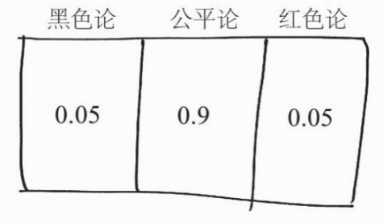
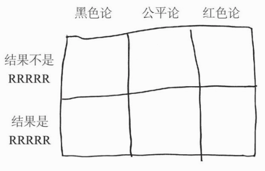
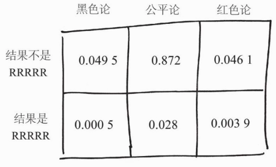
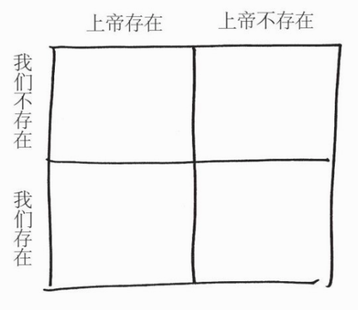
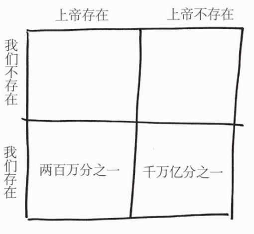
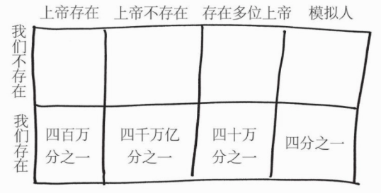

# 1001. 大数据与精准预测

在很多人眼里，大数据时代非常可怕，原因之一是：大数据时代隐晦地表明，如果有足够多的数据，算法（algorithm）的推理能力将超过人类。所有超能力都令人害怕：可以变形的存在令人害怕，能死而复生的存在令人害怕，推理能力超过人类的存在也令人害怕。令人害怕的事还有：塔吉特公司的客户营销分析小组建立的一个统计学模型，基于采购数据，能准确地推断出其中一个顾客（哦，对不起，应该是「客户」）怀孕了，推断的依据是明尼苏达州的这位少女购买的商品比较神秘，其中无香味的护肤液、矿物质补充剂以及棉球的数量有所增加。于是，塔吉特开始向这位少女派送婴儿服装优惠券，这一举动令女孩的父亲大为惊愕。作为人类，他的推理能力太弱，他还不知道自己的女儿怀孕了。生活在这个世界上，谷歌、脸谱网、智能手机甚至塔吉特公司，甚至比我们的父母更加了解我们，一想到这些，就不由得让人惴惴不安。

3『上面的例子，在万维钢的专栏，「人人说谎」那个专题里看到过。（2020-11-21）』

不过，我们也许应该少花点儿时间考虑那些能力超强的算法，而应该多花点儿时间考虑那些蹩脚的算法。一方面，算法的结果可能是正确的，也可能非常蹩脚。的确，通过算法，硅谷的经营手段一年比一年老练，收集的数据越来越多，作用也越来越大。有人预测，未来谷歌会对我们了如指掌。通过归纳和分析数以百万计的微观察结果（在点击这个链接前他犹豫了多长时间，他的谷歌眼镜在那个上面停留了多长时间），中心备件库可以预测我们的喜好、欲望、行动，更重要的是，它还可以预测我们可能想购买什么，或者可能说服我们购买什么。

这种情况有可能发生，也有可能不会发生。在研究很多数学问题时，得到的数据越多，越能提高研究结果的准确度，而且准确度提高的幅度在很大程度上是可以预见的。如果要预测小行星的运行轨迹，我们需要测算它的速度与位置，还需要测算宇宙中其他天体的万有引力。相关数据越多、越精确，预测的准确度越高。

但是，有的预测就像天气预报一样，难度极大。在这种情况下，大量精确的数据以及可以迅速处理这些数据的算法可以一展它们的身手。1950 年，早期的计算机「埃尼阿克」（ENIAC）需要花 24 个小时才能模拟出未来 24 个小时的天气，这是太空时代计算机在数据运算能力方面取得的令人叹为观止的成绩。2008 年，人们用诺基亚 6300 手机重新进行了这项计算，耗时还不到 1 秒钟。现在，天气预报不仅更新更快，预报时效更长，也更准确。2010 年普通的 5 天天气预报与 1986 年的三天天气预报相比，准确度不分伯仲。

随着数据收集能力的不断增强，我们想当然地认为预测水平也会越来越高：美国国家气象频道总部的服务器机房总有一天可以更精准地模拟整个大气层，如果想了解下个月的天气情况，我们只需要在运行模拟程序时将时间往前推进一点儿就可以了。

这不会成为现实。大气中的能量从非常小的区域迅速蔓延至全球大部分地区，所需的时间非常短，因此，某时某地的一个微不足道的变化可能会在随后几天里造成显著不同的结果。用技术术语来表述，就是天气情况是混沌无序的。事实上，爱德华·洛伦兹（Edward Lorenz）第一次提出「混沌」这个数学概念时，就是受到了天气预报的启发。洛伦兹说：「一位气象学家认为，如果该理论是正确的，海鸥的一次振翅就足以永久地改变天气变化的趋势。关于这个说法的争论还没有平息，但是近期的大多数证据似乎都支持这个说法。」

无论我们收集多少数据，天气预报的时效都是一个严格的限制条件。洛伦兹认为，这个时效大约是两周时间。到目前为止，尽管全世界的气象学家都在全神贯注地研究这个问题，但是我们仍然没有理由怀疑这个限制条件。

2『涨知识了，预测天气预报的准确性有一个时间限制，2 周，更本质的东西是有关「混沌」的，做一张任意卡片。』——已完成

人类的行为更像小行星，还是与天气情况更类似呢？这当然取决于我们讨论的是人类哪个方面的行为。至少在某个方面，人类行为应该比天气更加难以预测。我们已经为天气建立了一个效果极佳的数学预测模型，尽管天气内在的混沌特性最终必将胜出，但在获取更多的数据之后，我们借助这个数学模型，仍有可能提高短期天气预报的准确性。而关于人类行为，我们还没有这样的预测模型，而且可能永远都不会有，所以预测人类行为的难度要大得多。

2006 年，在线娱乐公司奈飞（Netflix）举行了一个奖金额高达 100 万美元的竞赛，让全世界的参赛者编写一个向顾客推荐影片的算法，而且效果要胜过奈飞公司自己研发的产品。活动有效期不是很长，因为奈飞公司规定，只要有人第一个编写出推荐效果比奈飞产品优越 10% 的算法，他就是赢家。

1-3『这个例子之前又看见过，当时是为了阐述创新需要两个相差比较大的学科间的碰撞。（2020-11-21）』

参与竞赛的人收到一个巨大的文件，其中包含 100 万个匿名的影片评级，涉及 17 700 部电影，来自近 50 万名奈飞用户。编程的难点在于预测用户会如何评价自己没看过的影片。参赛者手里有大量数据，都与他们准备预测的顾客行为有直接相关性。但是，这种预测的难度非常大，直到三年后才有人获胜，而且还是几个小组联合起来，将各自近乎完美的算法程序结合到一起，才勉强达到要求。但是，在这项竞赛尚未结束时，奈飞公司的业务已经从邮寄电影 DVD（数字多功能光盘）转变为向顾客提供在线流媒体影片服务，影片推荐效果不佳也不再是一个大问题了。如果我们曾经接受过奈飞（或者亚马逊、脸谱网等尝试基于所收集的客户信息向客户推荐产品的网站）的服务，就会知道这些推荐的效果仍然非常差。如果在用户的档案资料中添加更多的数据流，推荐效果也许会有所提升，当然，也有可能不会提升。

然而，在收集数据的公司看来，情况并不像以上描述的那么糟糕。如果塔吉特仅凭跟踪你的会员积分卡的使用情况，就能够百分之百地确定你怀孕了，对他们来说这当然是个好消息。可是，他们做不到。然而，如果能够把猜测你是否怀孕的准确度提高 10%，这就是个好消息。谷歌的情况也是一样，他们无须了解我们到底想要购买什么产品，只要他们的想法优于他们的竞争对手即可。公司的利润通常并不是很丰厚，客户行为预测的准确度提高 10%，在我们看来并不是什么了不起的事，但对公司而言则可能意味着大笔利润。在那次大赛期间，我找到了奈飞公司负责影片推荐业务的副总裁吉姆·班尼特（Jim Bennett），问他为什么会提供那么一大笔奖金。他告诉我，我应该问的问题是奖金为什么那么少。推荐效果提高 10%，尽管这个数字看起来很小，但是公司很快就能赚回那 100 万美元奖金，而且比再拍摄一部《速度与激情》（Fast and Furious）还要快。

## 10.1 脸谱网能预测出谁会成为恐怖分子吗？

因此，如果公司可以获取大量数据，但在了解客户情况这方面仍然没有多大作为，他们应该考虑什么问题呢？也许他们可以考虑一下这个问题。假设脸谱网有一个团队，决定想出一个办法，预测用户中谁有可能参与针对美国的恐怖活动。从数学的角度看，这跟判断奈飞用户是否有可能喜欢看电影《十三罗汉》（Ocean’s Thirteen）这个问题的区别不大。脸谱网通常知道用户的真实姓名与地址，因此他们可以利用相关记录，为一系列已经被认定犯有恐怖主义罪行或者支持恐怖组织的人建立档案。然后，他们可以使用数学知识统计恐怖分子每天完成状态更新的次数与普通人相比是更多还是更少，抑或基本相同。在他们的信息更新中，是否某些词语出现的频率更高？他们通常喜欢或不喜欢的乐队、组织或产品有哪些？将用户的所有这类信息加以归纳，就可以为每个用户打分，分数代表脸谱网对用户与恐怖组织有联系或者将会产生联系的概率做出的评估。这项活动与塔吉特公司依据顾客采购的护肤乳与矿物质补充剂推断出她可能是孕妇的做法，基本没有什么区别。

但是，两者之间有一个重要的不同点：怀孕是一种常见现象，而恐怖主义则非常少见。几乎在所有情况下，特定用户是恐怖分子的概率都会非常小。因此，无论脸谱网的算法是否能预测出谁将实施恐怖袭击，都不可能成为《少数派报告》（Minority Report）中描述的预防犯罪中心。但是，我们可以考虑一种中庸的情况，比如，脸谱网可以在某置信区间内列出一份包含 10 万名用户的名单，并指出：「其中每个用户是恐怖分子或者恐怖主义支持者的概率，是脸谱网普通用户的两倍。」

如果你发现你的一位邻居的名字出现在这份名单中，你会怎么做？会给美国联邦调查局打电话吗？在打电话之前，你最好画一个方框图。


图中表示的是脸谱网两亿名美国用户的情况。上面的两格表示有可能是恐怖分子的用户，下面的两格表示不是恐怖分子的用户。在美国，所有的恐怖主义基层组织肯定都非常小。假设我们非常多疑，那么我们可以认为联邦调查局应该密切监视的恐怖分子嫌疑人有 1 万个，占脸谱网美国用户数的 1/20 000。

方框图左右两侧的区分是由脸谱网做出的，左侧是参与恐怖主义活动可能性较大的 10 万人。脸谱网认为自己的算法非常准确，所以根据该算法筛选出来的用户是恐怖分子的概率为普通用户的两倍。我们相信脸谱网说的是真的，也就是说，在这 10 万人中，有 1/10 000的人（即 10 人）是恐怖分子，剩余的 99 990 人则不是恐怖分子。

如果 1 万名恐怖分子嫌疑人中有 10 人位于左上部，那么右上部就有 9 990 人。同样，在脸谱网用户中有 199 990 000 名非恐怖分子，其中有 99 990 人被该算法加上了标记，因此位于左下部，那么在右下部还剩 199 890 010 人。把 4 个分区的人数相加，得数为两亿人，也就是脸谱网的全部美国用户。

你的那位邻居就位于这 4 个分区中的某一个。但是，他到底在哪个分区里呢？我们只知道他在左侧，这是因为脸谱网把他标记为有可能是恐怖分子的人。我们需要注意一个问题：在位于图左侧两个分区的人当中，几乎没有人是恐怖分子。事实上，那位邻居不是恐怖分子的概率为 99.99%。

从某种意义上说，这与避孕药引发恐慌的例子差不多。一旦上了脸谱网的名单，是恐怖分子的概率就会加倍，这令人害怕。但是，最初的概率非常小，即使加倍之后，仍然非常小。我们还可以换一种方式来看这个问题。思考一下：如果某个人其实不是恐怖分子嫌疑人，那么他错误地出现在脸谱网名单中的概率有多大？这个问题更清楚地反映出不确定性推理可能导致的困惑与风险。

1『再再一次看到这个思维，碰到概率翻倍的情况是，首先问一句，它的初始概率是多少，很小很小的概率即使翻了个倍，也还是很小很小的。（2020-11-21）』

结合此图，这个问题就变成：如果我们位于图的下部区域，那么我们在左侧分区的概率有多大？这很容易计算。图的下部区域中有 199 990 000 人，其中，只有 99 990 人在左侧。因此，脸谱网算法将无辜的人标记为恐怖分子嫌疑人的概率为 99 990/199 990 000，即约 0.05%。这个结果没有错。脸谱网把一个非恐怖分子错误地认定为恐怖分子的概率不到 1/2 000！现在，再看到你的那位邻居时，你会怎么想呢？

显著性检验可以为我们提供明确的答案。零假设为「你的邻居不是恐怖分子」，在这个假设条件下，你的邻居遵纪守法，他出现在脸谱网黑名单上的概率约为 0.05%，远低于 1/20 这个统计学显著性的临界值。换言之，按照当代大多数科学研究普遍采用的规则，我们有理由认为零假设是不正确的，从而认定你的邻居就是一个恐怖分子，尽管他不是恐怖分子的概率为 99.99%。

一方面，遵纪守法的人几乎不可能被该算法列入黑名单。另一方面，算法指向的人几乎都是遵纪守法的人。这似乎相互矛盾，但其实不然，真实情况就是这样的。如果我们屏气凝神，仔细观察方框图，我们就不会犯错。下面我来告诉大家问题的症结所在。其实，我们提出了两个问题，这两个问题看似没有区别，但其实并不相同。

问题1：如果某人不是恐怖分子，那么他出现在脸谱网黑名单上的概率是多少？

问题2：如果某人出现在脸谱网黑名单上，那么他不是恐怖分子的概率是多少？

这两个问题有不同的答案，因此它们不是同一个问题。我们已经知道，第一个问题的答案约为 1/2 000，第二个问题的答案是 99.99%，而我们真正想知道的是第二个问题的答案。这两个问题所考虑的量被称作「条件概率」（conditional probability），即「如果 Y，则 X 的概率为……」让我们搞不清楚的是，「如果 Y，则 X 的概率为……」与「如果 X，则 Y 的概率为……」是不同的。

1『哈哈，看到这里就知道，下面作者要说「贝叶斯定律」了。（2020-11-21）』

是不是有点儿熟悉的感觉啊？这正是我们在归为不可能法上面临的问题。p 值是解决问题的关键，它指的是如果零假设是正确的，那么所观察到的实验结果发生的概率。但是，我们想知道的其实是另一个条件概率：如果我们观察到某种实验结果，则零假设正确的概率是多少？

我们把第二个概率与第一个概率弄混淆了，这正是错误出现的原因。这不是科学研究特有的现象，而是随处可见。公诉人转向陪审团宣布：「无辜人的 DNA（脱氧核糖核酸）与犯罪现场发现的 DNA 样本匹配的概率只有五百万分之一，是的，五百万分之一。」此时，他回答的是问题 1，即无辜的人是罪犯的概率是多少？但是，陪审团的工作是回答问题 2，即被告其实是无辜的概率是多少？关于这个问题，DNA 无法回答。

脸谱网黑名单的例子清楚地说明我们为什么不仅需要关注好的算法和蹩脚的算法，还要考虑更多的问题。如果你怀孕了，而且塔吉特公司知道你怀孕了，这种情况会令人不安。但是，如果你不是恐怖分子，而脸谱网却认为你是恐怖分子，这样的情况更糟糕、更令人不安。

你也许认为，脸谱网绝不会编造恐怖分子嫌疑人（或者逃税人、恋童癖者）名单，即使他们真的有这样的名单，也不会公之于众。他们为什么要这样做？难道能从中赚钱吗？也许是的。但是，美国国家安全局可不会管人们有没有登录脸谱网，他们肯定会收集美国境内所有人的数据。黑名单这样的东西肯定存在，除非你认为他们记录海量的通话数据，目的是为了告诉电话公司哪些地方需要增设信号塔。大数据没有魔力，不可能告诉联邦调查局谁是恐怖分子、谁不是恐怖分子。但是，给某些人加上标记，认为他们更加危险和「值得关注」，然后生成一个黑名单，这些工作并不需要魔力。这份名单上的绝大多数人与恐怖主义没有任何关系，你有多大信心认为自己不在这份名单上呢？

2『贝叶斯定理及其应用，做一张主题卡片。』——已完成

## 10.2 心灵感应研究与贝叶斯推理

为什么会有恐怖分子黑名单这种明显自相矛盾的东西呢？显著性检验的方法看似有理有据，但为什么在这种情况下的效果那么糟糕呢？原因在于，显著性检验考虑的是脸谱网标记的用户占所有用户的比例，却完全忽略了恐怖分子所占的比例。如果你想判断自己的邻居是否为恐怖分子，必须注意一个重要的「先验信息」（prior information）：绝大多数人都不是恐怖分子。忽略这个信息，就会陷入危险的境地。费舍尔说过，我们必须「在证据的启示之下」，也就是根据已知信息评估每一个假设。

但是，我们又是怎么做的呢？说到这里，不由得让人想起无线电心理学的故事。

1937 年，心灵感应风靡一时。心理学家莱茵（J. B. Rhine）在他的专著《心灵新前沿》（New Frontiers of the Mind）中介绍了他在杜克大学完成的 ESP [1] 实验。这本书非常畅销，并成为「月读俱乐部」的推荐图书之一。在这本书的影响下，通灵成了美国各地鸡尾酒会上的热门话题。1930 年，畅销书《屠场》（The Jungle）的作者厄普顿·辛克莱（Upton Sinclair）再接再厉，又出版了《心灵电波》（Mental Radio）。在这本书中，辛克莱讲了他与妻子玛丽进行心灵感应的故事。由于该书讨论的是主流现象，因此爱因斯坦为它的德语版撰写了序言。爱因斯坦在序言中没有明确表示认同心灵感应，但他建议心理学家「应当认真读读」辛克莱的这本书。

大众媒体自然要在这一潮流中凑个热闹。1937 年 9 月 5 日，奇尼斯无线电公司与莱茵合作开展了一项只有借助他们刚开发的新通信技术才可能完成的实验。主持人 5 次转动轮盘赌的转轮，一群自称有心灵感应能力的人站在旁边。每转动一次，小球要么停留在黑色区域，要么停留在红色区域，而有心灵感应能力的那些人则把全部心神集中在小球停留的区域，然后利用自己的「传播渠道」向全美国发送信号。主持人恳求电台听众利用他们的心灵感应能力获取这些信号，然后寄信把他们接收到的颜色信息告诉无线电台。主持人第一次发出请求时，超过 4 万名听众做出了响应，在之后的节目中，虽然新鲜劲儿已过，但奇尼斯公司每周仍然能收到数千个回应。这个测试心灵感应能力的实验是大数据的一个雏形，其规模是莱茵在杜克大学办公室里针对实验对象的逐个研究无法企及的。

尽管实验的最终结果不利于心灵感应，但是心理学家发现，从听众那里收集到的大量数据却有完全不同的用途。听众努力地再现 5 次转动转轮产生的红、黑（下文分别以 R 与 B 表示）颜色序列，一共有 32 种可能：

```
BBBBB BBRBBBRBBBBRRBB

BBBBRBBRBRBRBBRBRRBR

BBBRBBBRRBBRBRBBRRRB

BBBRRBBRRRBRBRRBRRRR

RBBBBRBRBBRRBBBRRRBB

RBBBRRBRBRRRBBRRRRBR

RBBRBRBRRBRRBRBRRRRB

RBBRRRBRRRRRBRRRRRRR
```

由于每次转动转轮之后小球停在红色或黑色区域的概率相同，因此上述序列出现的概率也相同。由于所有听众其实都没有接收到任何心灵感应信号，我们可以因此认为听众选择这 32 种序列的概率也是相同的吗？其实不然。事实上，听众的选择并不均匀。BBRBR、BRRBR 这类序列出现的次数远远超过预期，RBRBR 这类序列出现的次数则低于预期，而 RRRRR 几乎没有出现过。

对于这样的结果，你可能并不会感到吃惊。与 BBRBR 相比，RRRRR 给人的感觉并不像一个随机序列，尽管在我们转动转轮时，出现这两种结果的概率是相同的。这到底是怎么回事呢？「一个序列的出现次数少于另一个序列」的说法，是什么意思呢？

我再举一个例子。大家迅速想一个 1-20 之间的数字。你选择的是 17 吗？

没错，这一招不一定每次都灵。但是，如果我们让人们在 1-20 之间选一个数字，17 是最常被选到的数字。如果我们让人们在 0-9 之间选一个数字，他们最常选的是 7。在随机选择时，末尾是 0 和 5 的数字出现的次数远低于我们的预期，也就是说，在人们心目中，这些数字的随机程度似乎比较低。这个想法导致了一个出乎意料的结果：那些心灵感应实验的参与者试图给出 R、B 随机序列，但是结果明显不具有随机性。同样，这些人在随机选择数字时，往往也会偏离随机性。

2009 年，时任伊朗总统的马哈茂德·艾哈迈迪内贾德（Mahmoud Ahmadinejad）在总统选举中以较大优势获胜。很多人指责有人暗中操控选票，但是，由于伊朗政府几乎不允许任何独立监督，所以很难得到检验计票合法性的机会。哥伦比亚大学的两名研究生柏恩德·比伯（Bernd Beber）与亚历山大·斯卡科（Alexandra Scacco）想出了一个好办法。他们利用数字本身作为揭穿选举造假的证据，让官方的计票结果自证，这个办法奏效了。首先，他们研究了 4 名主要候选人各自在伊朗 29 个省得到的官方总选票数，一共得出了 116 个数字。如果这些票数没有造假，那么这些数字的末位数只能是随机数，也就是说，它们应该平均分布在 0、1、2、3、4、5、6、7、8 和 9 这些数字中，每个数字出现的概率为 10%。

但是，这次伊朗总统选举的计票结果并没有表现出这个特点，末位数中 7 出现的次数过多，几乎是正常概率的两倍。这个特征表明，这些数字并不是随机生成的数字，而是人们刻意伪造的随机数字。当然，仅凭这一点还不能证明有人操纵了这次选举，但这是指向这个结论的一个证据。

在我们探索和认识世界的过程中，各种理论一直在互相竞争，所以我们会不断根据观察结果来调整我们的判断，以致推理活动从无间断。对于某些理论（例如，「明天太阳仍然会升起」，「手一松，东西就会掉落」），我们深信不疑，这种信任几乎不可动摇；而对于其他理论（例如，「如果今天我锻炼，晚上就会睡得很好」，「根本就不存在心灵感应这类东西」），信任度则低一些。无论是司空见惯还是难得一见的事物，我们都有各种与之相关的理论。至于用以证明或驳斥这些理论的证据，其置信度也有高有低。

关于轮盘赌，我们认可的权威理论认为它是一种非常公平的游戏，小球停在红色或黑色区域的概率是相同的。但是，也有理论认为转轮偏向于某个颜色。[2] 我们化繁为简，假设一共有三种关于轮盘赌的理论。1）红色论：转轮偏向于红色，小球停在红色区域的次数占比为 60%。2）公平论：转轮是公平的，小球停在红色区域与黑色区域的次数相同。3）黑色论：转轮偏向于黑色，小球停在黑色区域的次数占比为 60%。

这三种理论的置信度分别是多少呢？除非另有证据，否则我们很可能会认为轮盘赌是公平的。我们或许会认为公平论正确的概率为 90%，黑色论与红色论正确的概率分别只有 5%。像分析脸谱网黑名单一样，我们也可以为轮盘赌绘制方框图。



图中的数字用术语来表示的话，是「先验概率」（priori probability），即认为某个理论正确的概率。不同的人有可能得出不同的先验概率：怀疑论中坚分子认为三个理论的先验概率都是 1/3，而有些人充分信任轮盘赌转轮制造商的节操，认为红色论与黑色论的先验概率只有 1%。

但是，这些先验概率不是一成不变的。如果我们找到了某理论优于另一理论的证据（例如，小球连续 5 次停在红色区域中），不同理论的置信度就会发生改变。那么，这个规律在本例中会起到什么作用呢？解决这个问题的最佳办法就是计算更多的条件概率，绘制更大的方框图。我们转动转轮 5 次，得到 RRRRR 的概率是多少呢？答案取决于哪种理论是正确的。在公平论正确时，每次转动转轮后小球停在红色区域的概率为 1/2，因此，得到 RRRRR 这个结果的概率为：

```
1/2×1/2×1/2×1/2×1/2=1/32=3.125%
```

换言之，得到 RRRRR 与得到其他 31 种颜色序列的概率完全相同。如果黑色论是正确的，小球停在红色区域的概率为 40%，即 0.4，那么，得到 RRRRR 结果的概率为：

```
0.4×0.4×0.4×0.4×0.4=1.024%
```

如果红色论是正确的，小球停在红色区域的概率为 60%，那么，得到 RRRRR 结果的概率为：

```
0.6×0.6×0.6×0.6×0.6= 7.76%
```

接下来，我们把图中的三个部分扩充为 6 个部分。



这幅图中的三列分别对应黑色论、公平论与红色论。但是，我们这次把每列分成了两个方框，一个方框表示得到了 RRRRR 的结果，另一个方框表示没有得到 RRRRR 的结果。我们已经完成了各种数学计算，知道应该在方框中填入哪些数字。例如，公平论的先验概率为 0.9，这个先验概率的 3.125%，即 0.9×0.031 25（0.028 1），应该填入「公平论正确且小球 5 次停留的区域为 RRRRR」的方框中，剩下的 0.871 9 则填入「公平论正确但停留区域不是 RRRRR」的方框中。在表示公平论的这一列中，两个方框内数字的和仍然是 0.9。

红色论的先验概率是 0.05，因此，「红色论正确且结果为 RRRRR」的先验概率是 0.05×7.76%，即 0.003 9；而「红色论正确但结果不是 RRRRR」的方框中的数字是 0.046 1。黑色论的先验概率也是 0.05。但是，黑色论与 RRRRR 这个结果之间的关系很不友好，因此，「黑色论正确且结果为 RRRRR」的概率仅为 0.05×1.024%，即 0.000 5。



请注意，6 个方框中的数字总和是 1。这是必须满足的条件，因为这 6 个方框代表的是所有可能的情况。如果我们转动转轮并且真的得到了 RRRRR 的结果，那么这些理论会有什么变化呢？假如这种情况真的出现了，对红色论而言就是好消息，但对黑色论而言则是坏消息。小球连续 5 次停在红色区域，这种情况位于方框图的下排，黑色论、公平论与红色论的先验概率分别为 0.000 5、0.028 和 0.003 9。换句话说，在这种情况下，公平论与红色论的先验概率比率大约是 7∶1，红色论与黑色论的先验概率比率大约是 8∶1。

如果希望把这些比率关系转化为概率，我们需要记住的就是三个概率的和必须是 1。下排三个方框中的数字和约为 0.032 5，在不改变比率关系的前提下，要使三个概率的和等于 1，我们可以用每个数字除以 0.032 5。于是，我们得到：1）黑色论正确的概率是 1.5%；2）公平论正确的概率是 86.5%；3）红色论正确的概率是 12%。

由此可见，红色论的置信度增加了一倍多，而黑色论的置信度几乎消失殆尽。置信度的这种变化是十分恰当的，小球连续 5 次停在红色区域，我们对转轮受到人为操纵的怀疑当然会增加。


上述「用 0.032 5 除所有数字」的步骤似乎有使用特殊手段的嫌疑，事实上，这个步骤没有什么问题。如果我们的直觉无法立即接受这个做法，我们还有另一种讨人喜欢的办法。假设有 1 万个轮盘赌转轮，分别置于 1 万个房间之中，每个转轮由一个人操作。你也是操作者之一，但你不知道自己操作的是哪一个转轮，也不了解该转轮的真实属性。这种情况可以通过以下方式建模：假设在这 1 万个转轮中，有 500 个转轮偏向黑色区域，有 500 个偏向红色区域，还有 9 000 个是公平的。

依据上述概率进行计算，你可以预测出大约有 281 个公平的转轮、39 个偏向红色区域的转轮、5 个偏向黑色区域的转轮会得到 RRRRR 这一结果。因此，当你得到 RRRRR 的结果时，你仍然不知道自己在哪个房间中，但是你已经大幅缩小了范围：你所在的房间应该是小球连续 5 次停在红色区域的那 325 个房间中的一个。在所有这些房间中，有 281 间（约占 86.5%）中是公平的转轮，有 39 间（约占 12%）中是偏向红色区域的转轮，只有 5 间（约占 1.5%）中是偏向黑色区域的转轮。

停在红色区域的球越多，你就会越倾向于红色论（同时黑色论的置信度会降低）。如果你连续 10 次（而不是 5 次）看到小球停在红色区域，通过类似的计算，你会将红色论正确的概率提升至 25%。

上述计算步骤的目的是向我们展示，在连续 5 次看到小球停在红色区域之后，公平论、红色论、黑色论的置信度的变化情况，也就是所谓的「后验概率」（posterior probability）。先验概率描述的是看到相关证据之前的置信度，而后验概率描述的是看到相关证据之后的置信度。我们所做的工作叫作「贝叶斯推理」（Bayesian inference），因为由先验概率到后验概率的中间桥梁是一个叫作「贝叶斯定理」（Bayes’s Theorem）的概率公式。该定理的代数表达式非常简单，我随时可以写给大家看，但在这里就免了。这是因为，如果我们习惯于机械地应用公式，而不考虑周围的环境，有时我们就很难理解眼前的形势。在这里，我们需要知道的已经全部包括在前文的方框图中了。[3]

后验概率不仅受到所发现的证据的影响，还会受到先验概率的影响。如果某人是怀疑论中坚分子，他会在一开始时就受到先验概率的影响，认为黑色论、公平论、红色论正确的概率都是 1/3。但在连续 5 次看到小球停在红色区域之后，他又会受到后验概率的影响，认为红色论正确的概率为 65%。对于一个信念坚定的人来说，如果一开始时他就认为红色论正确的概率仅为 1%，那么，即使连续 5 次看到小球停在红色区域，他也会认为红色论正确的概率仅为 2.5%。

在贝叶斯推理的框架中，人们在看到证据后，某种理论的置信度不仅取决于证据的内容，还取决于一开始时的置信度。

这个特点似乎会引起麻烦，科学不应该是客观的吗？我们可能以为，理论的置信度仅仅取决于证据，而不是我们一开始时的偏见。如果实验证据表明某种药物的改进型产品减缓了某些癌症的生长速度，而且这些证据具有统计学显著性，我们很可能就会相信这种新药真的有效。但是，如果我们让病人置身于巨石阵的塑料模型中，并且取得了同样的疗效，我们会不会心有不甘地承认，这些远古时期形成的巨石阵真的能抑制人体中肿瘤的生长呢？我们可能不会这样想，因为这个想法太疯狂了。我们更有可能认为，也许是因为巨石阵运气好。对于这两种情况，我们有多种先验概率，结果，我们在解释证据时却采用了不同的先验概率，尽管证据是一样的。

脸谱网筛选恐怖分子的算法以及我们对邻居是否是恐怖分子的判断，也是这种情况。邻居的名字出现在脸谱网的黑名单上，并不能证明他就是恐怖分子嫌疑人。大多数人都不是恐怖分子，因此该假设的先验概率应该非常小，在这种情况下，即使找到相关证据，后验概率仍然非常小，所以我们不用担心（至少不应该担心）。

1『大赞，不仅取决于证据的内容，还取决于一开始的「先验概率」。而且跟前面脸谱网筛选恐怖分子的案例，一下子串起来了，哈哈。（2020-11-21）』

单纯地依靠零假设显著性检验的做法，严重违背了贝叶斯推理的精神。严格地讲，这种做法会让人认为抗癌药物与巨石阵塑料模型有相同的疗效。费舍尔的统计学观会不会因此受到打击呢？事实恰好相反。费舍尔说过：「科研人员不会设一个固定的显著性临界值，然后年复一年，无论情况如何变化，都依据这条红线去推翻各种假设。相反，他们会在证据的启示下，结合自己的想法，认真考虑每一个具体案例。」这句话的意思是，科学推理不能（至少不应该）过于机械，推理时必须随时考虑先前的想法与置信度。

我并不是说费舍尔完全遵循了贝叶斯的统计学思想。在我们看来，费舍尔的这番话涵盖了一度不为人所接受，但如今已成为主流的一系列统计学行为与思想，其中包括贝叶斯定理。但是，费舍尔并不是主张将先前的置信度与新证据简单地放到一起考虑。贝叶斯定理对推理方法产生了广泛的影响，例如教会机器根据人们输入的大量数据来学习，但这些方法并不适用于回答是或否的问题。对于是或否的问题，人们常常借助费舍尔的方法做出判断。事实上，信奉贝叶斯定理的统计学家通常对显著性检验不屑一顾，他们对「该新药是否有疗效」之类的问题不感兴趣，他们更关注如何建立一个预测模型，以便更准确地判断该药物的不同剂量在针对不同人群时可以取得什么样的疗效。即便真的用到假设，他们对假设（例如，「新药的疗效胜过现有药物」）是否正确这个问题的关注度也没有那么高；而费舍尔则不同，在他看来，只有在随机过程正在进行的情况下，才可以使用概率这种表达方式。

说到这里，我们已经站在了哲学海洋的岸边了。对于这些哲学难题，本书会点到为止。

既然我们把贝叶斯定理称作定理，就表明它是不容置疑的，并且我们已经使用数学证据完成了相关证明。这种认识既对也不对，它涉及一个难题：「概率」到底指什么？如果我们说红色论正确的概率为 5%，我们可能是指，在全世界范围内其实有大量轮盘赌的转轮，其中正好有 1/20 的转轮偏向红色区域，小球停在红色区域的概率为 3/5。而且，我们看到的任何轮盘赌的转轮，都是从这些转轮中随机选取的。如果是这样，贝叶斯定理就与上一章讨论的大数定理一样，都是千真万确的。大数定理认为，在本例所设定的条件下，在得出 RRRRR 这个结果的轮盘赌的转轮中，有 12% 的转轮是偏向红色区域的。

当认为红色论正确的概率为 5% 时，我们想说明的不是偏向红色区域的轮盘赌转轮在全球范围内的分布情况（这个问题我们怎么可能搞清楚呢），而是我们的一种心理状态。5% 是「眼前这个转轮偏向红色区域」这种说法的置信度。

顺便说一句，费舍尔就是从这里开始与其他人分道扬镳的。约翰·梅纳德·凯恩斯（John Maynard Keynes）在《概率论》（Treatise on Probability）中指出，概率「测量的是人们结合已知证据后赋予命题的合理置信度」。费舍尔对这个观点提出了严厉的批评，他的最后几句话很好地概括了他的看法：「如果美国数学系的学生认为凯恩斯先生在该书最后一章中的观点是权威观点并加以接受，他们就会在应用数学最有前景的分支领域中误入歧途，有的人会讨厌这些研究，大多数人则会变得愚昧无知。」

对于那些愿意接受概率就是置信度这种观点的人而言，贝叶斯定理不仅可以被看作一个数学方程式，还是一种偏重于数值的规则，它告诉我们如何结合新的观察结果修正我们赋予事物的置信度。当然，我们可以选择是否遵从这个规则。贝叶斯定理采用了一种新颖且更具一般性的形式，自然会引发更激烈的争议。坚信贝叶斯定理的人认为，对于所有事物，我们至少应该在有限的认知范围内根据严格的贝氏计算法来确定置信度，而其他人则认为贝氏规则更近似于一种宽松的定性指导原则。

出现 RBRRB 与 RRRRR 这两个结果的可能性都非常小，而且概率相同，但是在人们看来，前者是随机结果，后者则不是，这是为什么呢？贝叶斯的统计学观足以解释其原因。当看到 RRRRR 这个结果时，我们就会更加相信一个理论（即转轮做过手脚，小球会停在红色区域），对于这个理论，我们已经赋予了某个先验概率。但是，如果出现的结果是 RBRRB 呢？我们可以假设有这样一个人：

对于轮盘赌的转轮，他通常不带任何偏见，对于「转轮中藏有可以产生 RBRRB 这个结果的鲁布·戈德堡机械装置」这种想法，他会赋予一个中庸的概率。为什么不可以这样想呢？如果这样的一个人看到 RBRRB 这个结果，他会更加坚定自己的想法。

但是，在真实世界中，当轮盘赌的转轮真的产生 RBRRB 这个结果时，人们是不会这样想的。我们的有些想法合乎逻辑但非常荒谬，对于这样的想法，我们不会全盘接受。先验概率不是一视同仁，而是有所取舍的。在心理上，有的想法会得到明显的重视，而对于 RBRRB 这一类结果，我们赋予它们的先验概率几乎接近于零。那么，什么样的想法会受到我们的青睐呢？相较于复杂想法以及以完全陌生的现象为基础的想法，我们往往更喜欢简单的想法和那些通过类比我们所熟知的事物而产生的想法。这种喜好似乎是一种不公平的偏见，但是，如果没有任何偏见，我们就有可能整天都处于震惊的状态。理查德·费曼（Richard Feynman）有一段非常有名的话，描述的正是这种心理状态。

大家知道吗，今晚我遇到了一件非常奇怪的事。就在我来这儿的路上，当我从停车场经过时，一件令人难以置信的事情发生了，我看到一辆车的车牌号为 ARW357。大家想一想，我们州有好几百万个车牌号，今天晚上我看到这个车牌号的概率是多少？这太让人吃惊了！

如果大家服用过美国最流行的某种打法律「擦边球」的精神药物，就会知道一视同仁的先验概率会给我们带来什么样的感觉。服用了那种药物之后，所有刺激都会让我们觉得意义深刻，无论这种刺激是多么平常。每种体验都会激起我们的兴趣，让我们欲罢不能。这样的精神状态非常有趣，但无助于我们做出正确的推理。

贝叶斯的观点可以解释费曼当时并没有真的感到吃惊的原因：对于「某种宇宙力量驱使他看到 ARW357 这个车牌号」的假设，他赋予了一个非常小的先验概率。他的观点还可以解释为什么小球连续 5 次停在红色区域会让人们觉得其「随机程度小于」RBRRB 这个结果：因为前者会触发某个想法（即红色论），所以我们赋予这个想法的先验概率并不是非常小，但是后者没有这种作用。而且，末位数为 0 的数字的随机程度似乎小于末位数是 7 的数字，原因是前者会使我们产生这样的想法：我们看到的这个数字不是精确的统计数字，而是粗略估计得出的结果。

贝叶斯推理框架还可以帮助我们解决前文中遇到的难题。当彩票游戏连续两次开出「4、21、23、34、39」这个中奖号码时，我们感到非常吃惊，并且会心存疑虑。但是，如果某一天开出的中奖号码为「4、21、23、34、39」，另一天开出的中奖号码为「16、17、18、22、39」，对此我们丝毫不会觉得奇怪。这两种情况出现的可能性都很小，但为什么我们的反应却大相径庭呢？我们的思想深处隐藏着某种想法，认为很有可能出于某种神秘的原因，彩票游戏才会在很短的时间内两次开出同一组中奖号码。我们可能会认为彩票游戏的主管部门从中做了手脚，或者某种青睐同步性的宇宙力量发生了作用，但是这些都不重要。我们真诚地认为，同一组中奖号码重复出现的先验概率只有 1/100 000。但是，与我们赋予「4、21、23、34、39」和「16、17、18、22、39」这两组中奖号码的先验概率相比，1/100 000 仍然要大得多。认为不同的中奖号码是作弊产物的想法十分疯狂，而我们没有喝醉酒，头脑非常清醒，因此，我们不会把它当回事儿。

即使我们真的在一定程度上相信某个疯狂的想法，也无须担心。当我们得到的证据与这个想法不一致时，我们赋予这个疯狂想法的置信度就会下降，直到与其他人差不多。除非这种疯狂的想法经过精心的设计可以躲过这个筛选程序，阴谋论就是这样起作用的。

假设你深信的一位朋友说，波士顿马拉松爆炸案是联邦政府监守自盗的产物，目的是让更多公众支持美国国家安全局窃听个人电话（我随便说说而已，大家千万别当真）。我们把这个定义为 T 理论。由于你信任这位朋友，因此你一开始就为这个理论赋予了一个较大的先验概率，比如说 0.1。但是，随后我们获取了其他信息，诸如，警察已经锁定嫌犯的位置，侥幸活命的嫌犯供认不讳等。如果 T 为真，这些信息为真的可能性就会非常小，因此，每一条信息都会使 T 的置信度逐渐降低，直到我们不再相信它。

因此，朋友不会直接把 T 理论告诉我们，而会先告诉我们 U 理论，即政府与媒体都参与了这个阴谋，比如，报纸与有线电视网散播了爆炸案是穆斯林极端分子制造的假消息。一开始时，T+U 结合体的先验概率更小。从本质上讲，这个结合体比 T 更令人难以置信，因为它要求我们同时相信 T 和 U 理论。但是，随着证据逐渐增多，这些证据往往只能削弱 T 的置信度，而 T+U 结合体却不受任何影响。[4] 焦哈尔·察尔纳耶夫（Dzhokar Tsarhaev）招供了？对啊，我们本来就猜到联邦法院会这么说，因此美国司法部肯定参与了这次事件！U 理论就像 T 理论的保护层，使新证据无法触及 T，更不能推翻 T。荒诞不经但却非常成功的理论大多有这种共性，这些理论有厚厚的保护层，这些保护层又与很多可观察到的结果并不矛盾，因此很难被打破。在信息的生态系统中，它们就是有多种耐药性的「大肠杆菌」。

## 10.3 戴帽子的猫与学校里最不讲卫生的人

大学时，我的一个朋友在新学年开始的时候，总想着向大一新生推销 T 恤，赚些零花钱。当时，人们可以从丝网印刷店以每件 4 美元的价格大量购买 T 恤，并以每件 10 美元的价格在校园里出售。在 20 世纪 90 年代，模仿《戴帽子的猫》（The Cat in the Hat）中的那只猫，戴着帽子参加派对成为一种流行时尚。我的朋友花了 800 美元，在 200 件 T 恤上印刷了戴帽子的猫喝啤酒的图案，那批 T 恤很受欢迎。

朋友只是具备企业家的头脑，但还算不上一位优秀的企业家。其实，应该说他不是很勤快。在卖了 80 件 T 恤把最初的投资收回之后，他就不愿意继续在校园里兜售了，剩下的 T 恤被装进箱子塞到了床底下。一周之后，到了该洗衣服的日子了。但我的这位朋友很懒，根本不想洗衣服。这时候，他想起床底下还有一箱干净的、印有戴帽子的猫喝啤酒图案的新 T 恤。于是，他拿出一件穿在身上。第二天，他又穿上一件新 T 恤。就这样，日子一天天地过去了。周围的人都认为他是学校里最不讲卫生的人，因为他总穿着那件 T 恤。实际上，他是学校里最讲卫生的人，因为他每天都会穿一件刚从床底下拿出来的干净的新 T 恤。这种状况真令人啼笑皆非。

我们在做推理时要以这个故事为戒：面对大量理论，我们必须小心翼翼。二次方程式的根可能不止一个，同样，同一个观察结果有可能产生多种理论，以偏概全的推理会让我们误入歧途。接下来，我们再来讨论一下宇宙的创造者这个问题。支持「神创论」的最著名推理就是所谓的「宇宙设计论证」。简单地说，它的表现形式是：「天啊！只要看看我们周围的世界就知道了。世间万物多么复杂，令人惊叹！难道你以为单凭运气与物理定律就能把这些东西拼凑到一起吗？」

如果想正式一点儿，那么我们可以借用自由主义神学家威廉·佩利（William Paley）于 1802 年出版的《自然神学》（Natural Theology; or, Evidences of the Existence and Attributes of the Deity， Collected from the Appearances of Nature）一书中的表述：

假设我在穿过一片荒漠时踩到一块石头，你问我：这块石头怎么会在那个地方呢？我可能会回答：我的理解跟你不一样，我认为它一直在那里。或许你很难证明我的回答是荒诞不经的。但是，假设我在地上看到一块表，你问我这块表怎么会在那里，我之前的回答「我认为它一直在那里」，可能就不成立了。毫无疑问，这块表是人制造出来的，某时某地，工匠（们）设计了表的构造和用途，并制造了这块表。

如果佩利关于表的推理是正确的，那么麻雀、人眼或者人脑的创造是不是难度更大呢？佩利的这本书取得了巨大的成功，在 15 年时间里再版了 15 次。达尔文在大学时期阅读了这本书，他说：「佩利的《自然神学》是我最欣赏的一本书，我对它非常熟悉达到了倒背如流的程度。」佩利的推理经过修改之后，成为现代智慧设计运动的基石。

当然，这也是一种经典的归为不可能法：1）如果没有上帝，就不可能产生人类这样复杂的生物；2）人类已经产生；因此，上帝不可能不存在。

这与圣经密码编码者使用的推理方法非常相似。后者的推理方法为，如果《托拉》不是上帝写的，其中隐藏的拉比的生卒日期就不可能那么准确！可能大家已经听得厌烦了，但是归为不可能法有时真的不能发挥应有的作用。如果一定要以数值的形式来表达神创论的置信度，我们可以再画一幅方框图。

第一个难点是先验概率，要搞清楚这个问题并不容易。关于轮盘赌的转轮，我们之前需要回答的问题是：在转动转轮之前，我们认为转轮被动过手脚的可能性有多大？现在，我们面临的问题则变成：如果不知道宇宙、地球甚至我们自己是否存在，那么我们认为上帝存在的可能性有多大？



在通常情况下，这个问题会让我们陷入绝望境地，转而求助于「无差别原则」（principle of indifference）。这个名称十分恰当，因为要假装不知道自己是否存在，我们没有任何原则可循，只能平均分配先验概率，也就是说，「上帝存在」与「上帝不存在」的先验概率都是 50%。

如果「上帝不存在」的理论是正确的，那么人类这种复杂存在的出现肯定纯属偶然，也许在过程中会受到自然选择的影响。设计论者过去和现在都认为人类的产生是一个可能性非常小的事件。我们在这里假定一些数值，比如这个概率为百亿分之一。于是，我们在方框图下排右列的方框中填入百亿分之一的 50%，即两百亿分之一。

如果「上帝存在」的理论是正确的呢？上帝有很多事可做，在有相关证据之前，我们无法知道创造万物的上帝是否愿意创造人类或者其他有思想的存在，但有一点是毫无疑问的：既然被奉为上帝，他就有能力轻而易举地创造出智慧生命。如果上帝存在，那么他愿意创造出人类这种生物的概率也许是百万分之一吧。于是，我们得到下面这幅方框图：



讨论到这里，可以考虑「我们存在」这个问题了。这个事实位于方框图的下排，从中我们可以清楚地看到，「上帝存在」方框中的数字远大于「上帝不存在」方框中的数字。（前者是后者的一万亿倍！）这就是佩利推理的实质，贝叶斯推理称之为「设计论」。驳斥设计论的证据有很多而且非常充分，同时还有两百亿册书提出了「你们应该像我们一样做一个理性的无神论者」的主张。因此，我在这里还是继续讨论与数学推理关系最密切的例子——「学校里最讲卫生的人」。

我们可能都知道夏洛克·福尔摩斯（Sherlock Holmes）关于推理的一些说法，其中最著名的不是《福尔摩斯与华生》（Elementary）中的那句「非常简单」，而是「我的座右铭是：如果你将不可能排除在外，那么剩下的，无论可能性多么小，都必然是事实」。

这句话听起来很酷、很合理，而且无可辩驳吧？但是，这句话并不全面。福尔摩斯应该这样说：「我的座右铭是：如果你将不可能排除在外，那么剩下的，无论可能性多么小，都必然是事实，除非它是你没有考虑到的那个假设。」

这句话虽然没有原话那么简练，但是更加准确。人们之所以认为我的那位朋友是学校里最不讲卫生的人，是因为他们只考虑了两个假设：1）「讲卫生」论：我的那位朋友跟其他正常人一样，轮换着穿 T 恤，穿过一轮之后洗干净，再穿一轮。2）「不讲卫生」论：我的那位朋友是天天穿同一件 T 恤的邋遢鬼。

我们现在可以为这两个假设赋予先验概率。根据我对大学生活的回忆，为「不讲卫生」论赋予 10% 的先验概率较为合适。事实上，先验概率是多少都无关紧要，因为在周围人的眼中，我的那位朋友每天都穿同一件 T 恤，「讲卫生」论已经被否定了。这就是「如果你把不可能排除在外……」的结果。但是，福尔摩斯们，请注意：正确的解释，也就是「懒惰企业家」论，并没有出现在假设清单上。

这个问题也给设计论带来了很多麻烦。如果我们仅仅承认「上帝不存在」与「上帝存在」这两个假设，那么我们很可能会把生命世界的复杂结构看成支持后者的证据。但是，假设不止两个。比如，认为世界是由一个委员会在争论不休中匆匆忙忙搭建而成的「多位上帝」论，很多文化都支持这个想法。不可否认，自然界的某些方面（说到这里，我想到了大熊猫）更有可能是折中方案的产物，而不是全知全能的上帝的杰作。如果我们现在为「上帝存在」和「存在多位上帝」赋予相同的先验概率，（既然遵循无差别原则，我们为什么不这样做呢？）那么根据贝叶斯推理，「存在多位上帝」的置信度将超过「上帝存在」。

2『上帝存不存在的推理，做一张任意卡片。』——已完成

除此之外，没有其他假设了吗？关于人类起源，有无数种猜想。还有些人坚持「模拟人」论，认为我们其实根本不是人，而是在其他人建立的超级计算机上运行的模拟程序。这个理论似乎过于荒诞，但是很多人——其中最著名的当属牛津大学的哲学家尼克·博斯特罗姆（Nick Bostrom）——真的相信它，而且根据贝叶斯推理，我们很难找到不相信它的理由。当下，人们对于构建模拟程序乐此不疲，如果人类不灭绝，这方面的科研活动将只增不减，到最后，即使这些模拟程序中的某些有意识的存在认为自己是人，我们也不会觉得荒诞。

如果「模拟人」论是正确的，即宇宙是更真实的世界中的人构建的模拟程序，那么宇宙中本来就有人的可能性会非常大，因为「人」是人们最喜欢模拟的对象！我会把「技术先进的人创造了模拟世界中的（模拟）人」这个观点视为「近乎确定」（在本例中，我们假定它等同于「绝对确定」）。如果我们为这 4 个假设各赋予 1/4 的先验概率，就会得到下面的方框图。



考虑到我们真的存在，这个事实位于方框图下排，因此，「模拟人」论几乎拥有所有的先验概率。虽然人类的存在是上帝存在的证据，但是，在证明「我们的世界是更聪明的人编程的产物」这个理论时效果更好。主张「科学创造」论的人认为，我们在教室里证明上帝存在这个理论时，不能以《圣经》支持该观点作为理由（这个论据从本质上讲是不合适的），而应该用理性推理的方法，证明在「上帝不存在」这个假设前提下人类存在的可能性非常小。

但是，如果严格遵照这种方法，在给十年级的学生上课时，我们就只能告诉他们：「有些人已经证明，如果没有外部力量的介入而仅凭自然选择，那么像地球生物圈这样复杂的事物存在的可能性将非常小。第一种假设是，我们根本不是物理存在，而是拥有我们无法想象的先进技术的某些人正在运行的计算机模拟程序的产物，他们运行这些程序的具体目的尚不可知。第二种假设是，我们有可能是由一群神灵创造的，这些神灵与古希腊人崇拜的诸神类似。第三种假设是，宇宙是由上帝独自创造的，但是这个假设的支持率可能最低。」

大家认为学校董事会会喜欢这种教学方法吗？我还是直截了当地告诉大家我的观点吧。我认为佩利关于上帝存在的推理不是很有力，同样，我也不认为我们都是「模拟人」这个理论令人信服。有些人认为，这些论断表明我们已经到达定量推理的极限了，我觉得这种担心很有道理。我们习惯用数字来表示某个事物的不确定性，这种做法是有依据的。

天气预报员播报说：「明天的降水概率为 20%。」他的意思是，过去有很多天的天气状况与今天相似，因此明天下雨的概率为 20%。但是，如果我们说「宇宙是上帝创造的概率为 20%」，这句话的意思是什么呢？它不可能是指所有宇宙中的 20% 是由上帝创造的，而剩下的则是突然冒出来的。事实上，关于如何用数字来解释此类终极问题的不确定性，我还没有发现什么可靠的方法。尽管我钟爱数字，但我仍然认为人们应该坚持「我不相信上帝」「我相信上帝」「我不确定」这些观点。尽管我青睐贝叶斯推理，但我同样认为人们最好不要超出定量分析的极限，盲目地相信或者随意地抛弃某种观点。在这类问题上，数学应该保持沉默。

如果大家不愿意接受我的观点，不妨听听布莱士·帕斯卡（Blaise Pascal）的话。这位 17 世纪的数学家、哲学家在《思想录》（Pensées）中说：「上帝要么存在，要么不存在。但是，我们到底应该相信哪种观点呢？在这个问题上，推理得不出任何答案。」帕斯卡对这个问题的论述不仅限于此，下一章我们会接着介绍他的思想。在此之前，我们先说说彩票吧。

[1] ESP（Extra Sensory Perception），意为超感官知觉，是心灵感应、透视力、触知力和预知力的总称。——译者注

[2] 不可否认，由于轮盘赌转轮上的红色区域与黑色区域交替出现，所以该理论的说服力不是很强。但是，对于一个不在眼前的转轮，我们可能会推测，小球停在红色区域的次数比黑色区域多。

[3] 在现实情况中，我们肯定不能仅仅考虑三个理论。我们还应该考虑因为转轮被动过手脚而使小球停在红色区域的概率为 55%、65%、100% 或者 93.756% 等各种理论。可能的理论不止三个，而是无穷多个，因此，科学家进行贝叶斯计算时，还要考虑无穷大与无穷小量，求积分而不仅仅是简单地求和。但是，这些都只是技术难题，从本质上讲，并不比我们在书中完成的计算深奥。

[4] 更准确地说，这些证据往往会削弱 T 的置信度，但是不会让人们怀疑 U。