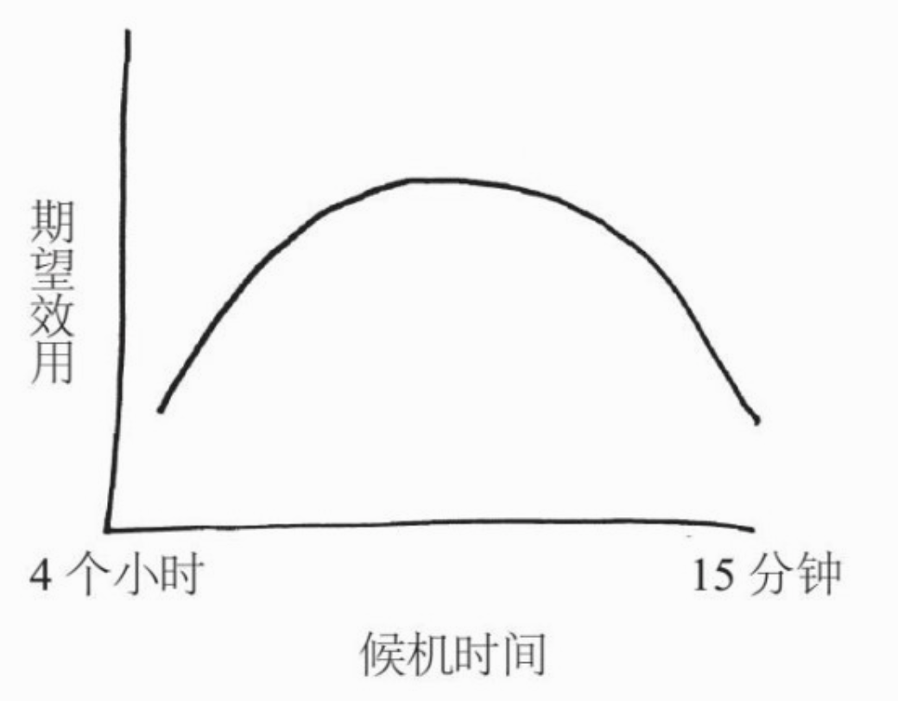
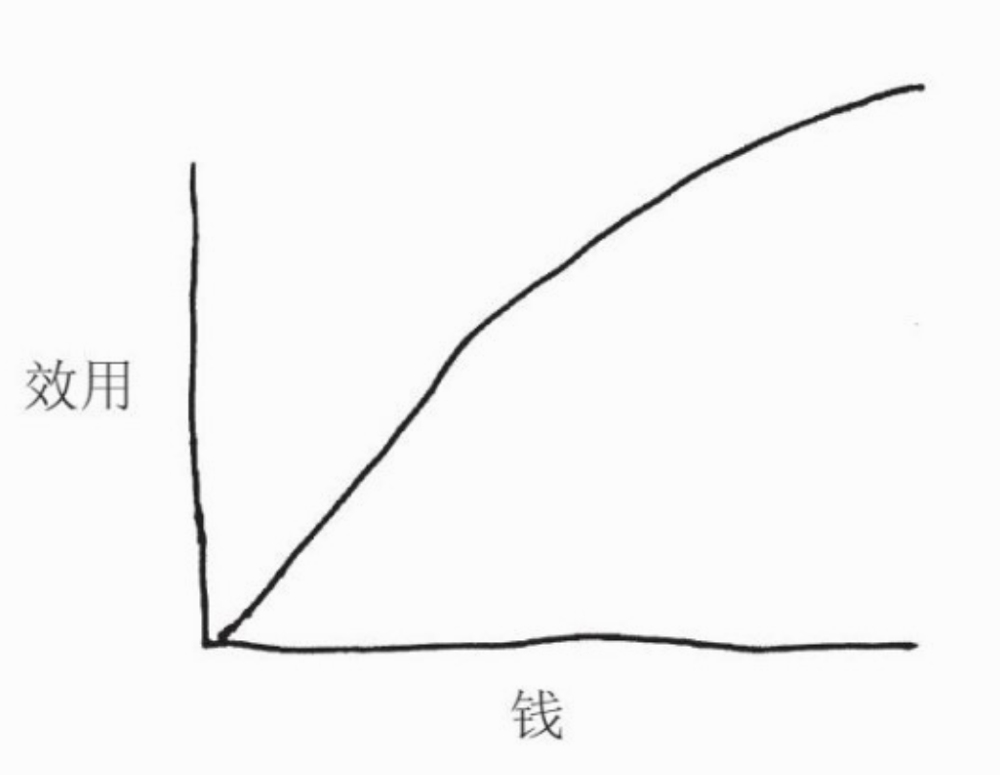
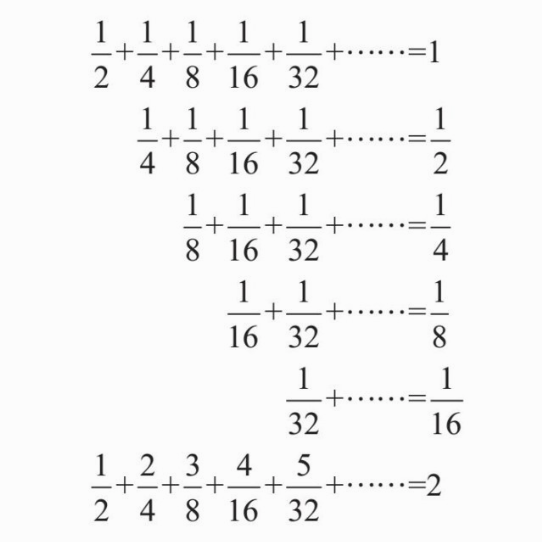
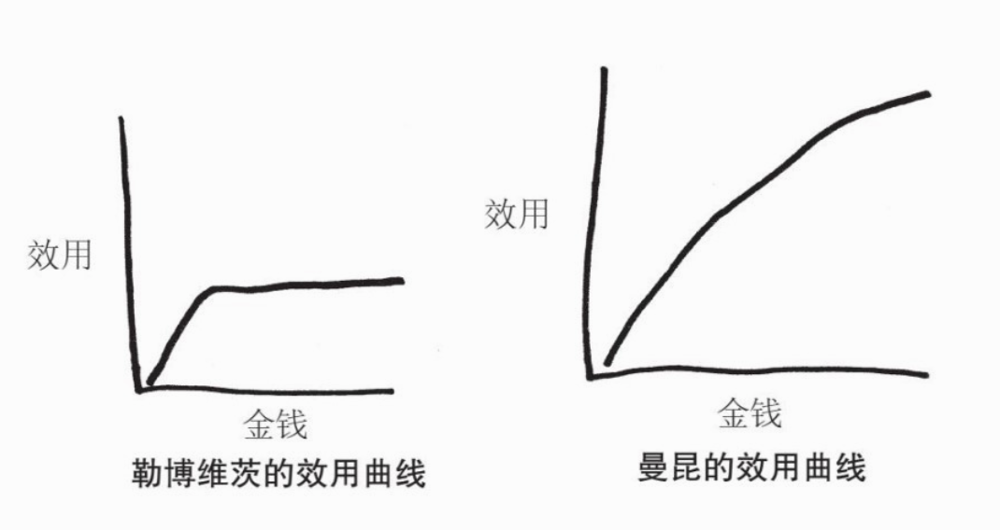

# 1201. 效用理论、风险与不确定性

1982 年的诺贝尔经济学奖得主乔治·施蒂格勒（George Stigler）说过：「如果你从来没有误过飞机，那只能说明你浪费在机场的时间太多。」如果最近刚好误过一次飞机，我们肯定会认为这个说法违背了我们的直觉。当我滞留在芝加哥奥黑尔机场啃着难吃的售价 12 美元的可萨鸡肉卷时，我发现自己在经济学方面的判断力实在不怎么样。尽管施蒂格勒的说法非常奇怪，期望值却表明他是对的，至少对于经常乘坐飞机的人而言是这样。我们把这个问题简单化，只考虑三种方案：1）提前 2 小时到达机场，误机概率为 2%。2）提前 1.5 小时到达机场，误机概率为 5%。3）提前 1 小时到达机场，误机概率为 15%。

当然，误机所造成的损失在很大程度上取决于当时的情境。是错过了去哥伦比亚特区的飞机，然后改乘下一个航班，还是准备参加某位亲友于第二天上午 10 点举行的婚礼却没赶上当天最后一班飞机，两者不可同日而语。在彩票游戏中，彩票的损失是以美元来计算的。而对于误机造成的损失，我们只能用时间成本来衡量，因此，确定性比彩票的损失低很多。两者都令人生气，但是没有一种被普遍认可的通货可以明确地计量生气的程度。

至少，我们还没办法用纸币来计量生气的程度。但是，我们必须做出决策，经济学家也希望找到适合的方法来计量生气的程度。根据经济学标准理论，人们在理性情况下做出的决策都将发挥最大效用（utility）。生活中的所有事物都有效用，美元、蛋糕等人们喜好的事物，其效用为正值，而磕破脚指头、误机等令人不舒服的事，其效用则为负值。甚至有人希望使用某个叫作「效用度」的标准单位来计量效用。打个比方，假设在家一小时的效用为一个效用度，那么提前两个小时赶到机场的成本就是两个效用度，而提前一个小时的成本仅为一个效用度。误机的后果显然比浪费一小时更糟糕，如果我们认为误机的成本等同于浪费 6 个小时，成本就是 6 个效用度。

用效用度来表示效用之后，我们就可以计算出上述三个方案的期望值。


平均来看，方案2的损失最小，尽管这个方案的误机概率不是很小。的确，滞留在机场是令人不悦的事，但是，误机概率本来就不大，为了进一步降低这种概率，每次都在候机室多等半个小时，这种做法真的可取吗？

也许有人认为它是可取的，这些人非常讨厌误机，在他们眼里误机的成本不是 6 个效用度，而是 20 个。如果是这样，上述计算结果就会发生变化，于是保守性的方案1成为首选，其期望值为：

```
–2+2%×（–20）= –2.4个效用度
```

但是，这个计算结果只是改变了平衡点的位置，并不意味着施蒂格勒说错了。如果我们提前 3 个小时到机场，可能会进一步降低误机概率。但是，即使这种做法可以让我们不误机，其成本也至少为 3 个效用度，比方案1更差。我们可以用下图来表示在机场等候的时间与期望效用之间的关系。



这幅图也是拉弗曲线。如果在飞机起飞前 15 分钟到达机场，误机概率就会非常大，其期望效用为负值。反之，如果到得太早，也会让你损失很多效用度。最优方案应该在两者之间，取决于误机与浪费时间在我们心目中孰轻孰重。但是，最优方案的误机概率一定为正值，虽然可能性很小，但绝不等于零。如果从未误过航班，那么我们可能位于最佳方案左边很远的地方。施蒂格勒说，我们应该增加误机次数以节省效用度。

当然，这种计算必然带有主观性。对所有人而言，在机场多等一个小时造成的损失可能并不相同。（我就特别讨厌机场提供的那些可萨鸡肉卷。）因此，不能指望这个理论准确地告诉我们到达机场的最佳时间，或者误机的合理次数。最终得出的是定性结果，而不是定量结果。我不知道你们理想的误机概率是多少，我只知道这个概率肯定不是零。

在这里要提醒大家的是，实际上，接近于零的概率与真的等于零的概率是很难区分的。对于一位满世界飞的经济学家而言，接受 1% 的误机风险就意味着每年要误机一次。而对于大多数人来说，这么低的风险也许意味着一辈子都不会误机，因此，1% 的风险对于我们来说是比较合适的，总能赶上飞机并不意味着我们做出了错误的选择。同样，我们也不能以施蒂格勒的论断作为理由，认为「如果开车时没有达到汽车允许的最快速度，就意味着开得太慢」。施蒂格勒的意思是，如果汽车没有因为速度过快而报废的风险，则意味着车速太慢。这个观点虽然没有多少意义，但却是正确的。没有任何风险的唯一办法就是不开车。

施蒂格勒式的论断适用于各类问题，以政府的浪费行为为例。每个月，我们都会看到一些报道，要么有一位政府工作人员钻了制度的空子，为自己牟取了高额退休金，要么是某位市政工程的承包商虚报价格却没有受到惩罚，要么是某个政府部门在完成其历史使命之后，由于政府的惰性或者受到强力庇护而没有被撤销，仍然在消耗着财政支出。2013 年 6 月 24 日，《华尔街日报》的「华盛顿社电」博客描述了这种行为的典型表现。

社会保障部的检察官在星期一时说，该部门为 1546 名据核实已经死亡的美国人支付了 3100 万美元的退休金。

该检察官说，在政府数据库中有这些人的死亡信息，表明社会保障部应该知道他们已经过世，不应继续为他们发放退休金。该检察官的这番言论有可能使社会保障部陷入更糟糕的境况。

我们为什么听任这类事件持续发生呢？答案很简单：与提前赶到机场一样，杜绝浪费行为也需要付出代价。履行义务与保持警惕都是有意义的行为，但是杜绝所有浪费行为，与把误机概率从非常低降到零一样，其成本超过收益。博客作者（曾经的数学竞赛选手）尼古拉斯·比尤德罗特（Nicholas Beaudrot）认为，3100 万美元在社会保障部每年发放的补贴款中占 0.004%。换言之，该部门在了解退休金发放对象是否死亡这方面已经做得非常好了。在有了这样优秀的表现之后，再去消除为数不多的错误，成本可能会非常高。因此，我们不应该问「政府为什么要浪费纳税人的钱」，正确的问题是「政府浪费纳税人的钱以多少为宜」。用施蒂格勒的话说：「如果我们的政府没有浪费行为，那只能说明他们在反浪费方面花了太多的时间。」

## 1201. 帕斯卡的赌注与无穷多的快乐

帕斯卡是最早清楚地理解期望值概念的人之一。1654 年，赌徒安托万·贡博（Antoine Gombaud）提出的一些问题让帕斯卡百思不得其解，为此他花了半年时间同费马通过书信进行探讨。他希望了解，从长远看哪些赌博游戏在多次参与后可能获利，哪些则可能亏本；用现代术语来阐述就是，哪些赌博游戏的期望值为正，哪些为负。人们普遍认为，帕斯卡与费马之间的信件往来代表了概率论的产生过程。

1654 年 11 月 23 日夜，帕斯卡产生了一种强烈又神秘的感觉，作为一名虔诚基督教信徒的他，尽最大努力把这种感觉记录下来。

熊熊火焰

亚伯拉罕的神，以撒的神，雅各的神，

他不是哲学家的神，也不是学者们的神……

我一直在远离他，躲避他，拒绝他，诋毁他，

但我再也不能继续远离他了！

我只能用《福音书》里的方法来面对他。

心情愉快地彻底摈弃（尘世），

虔诚地归顺我的指引人，耶稣基督。

尘世一天的劳作，换来的是持久的愉悦。

珍藏版羊皮纸手稿

资料来源：Bibliothèque Nationale de France，Paris

帕斯卡把这页手稿缝到自己外套的衬里中，一直到他去世。在经历了「熊熊火焰」之夜后，帕斯卡基本不再从事数学研究，而把全部智慧投入到宗教研究之中。1660 年，他的老朋友费马致信给他，提议面谈，但是帕斯卡回复道：

与你开诚布公地讨论几何学，对我来说是最好的学术活动。但是，与此同时，我发现几何学毫无用处，在我看来，几何学家与心灵手巧的工匠几乎没有区别……我现在的研究与几何学思维方式相去甚远，我已经快忘记几何学是什么了。

两年之后，帕斯卡就去世了，年仅 39 岁，他留下了一些准备结集出版、捍卫基督教的笔记与简短随笔。在他去世 8 年之后，这本书才得以出版，就是《思想录》。这部伟大的著作里有大量的警句格言，内容深奥。书中用简短的语句记录了帕斯卡种种灵光一现的想法，还带有编号：

199.我们可以想象有一群人镣铐加身，都被判处了死刑。每天他们之中都有一些人会在其他人的眼前被处死，而那些暂时活着的人则从被处死者身上看到了自己的命运，等着被押上刑场。他们面面相觑，眼睛里充满悲伤，看不到一点儿希望。这就是人类境况的缩影。

209.你被主人宠爱就不再是奴隶了吗？奴隶啊，你确实是交了好运，你的主人宠爱你，但他很快也会鞭打你。

《思想录》中最知名的是第 233 条想法，帕斯卡把它命名为「无限–无物」，但是现在人们普遍叫它「帕斯卡的赌注」（Pascal’s wager）。

我们在前面讨论过，帕斯卡认为逻辑推理是无法解答上帝是否存在这个问题的，「‘上帝要么存在，要么不存在’。但是，我们到底应该相信哪一种呢？在这个问题上，推理得不出任何答案。」不过，帕斯卡没有就此止步。他指出，信仰问题其实也是一种赌博游戏，它的风险很大，但是人们别无选择，只能参与。至于对赌注的分析，以及对明智与愚蠢做法的区分，帕斯卡的理解比地球上其他人都更加深刻，他毕竟没有完全忘记他的数学研究。

那么，帕斯卡到底是怎么计算信仰上帝的期望值的呢？答案就在他的玄妙发现中：

尘世一天的劳作，换来的是持久的愉悦。

显而易见，帕斯卡是在计算信仰上帝的成本与收益。即使在欣喜若狂地与救世主交流时，帕斯卡也没有忘记数学！

为了计算帕斯卡赌注的期望值，我们仍然需要使用上帝存在的概率。我们暂且假设自己执迷不悟，为上帝存在这个假设仅赋予 5% 的概率。如果我们相信上帝存在，并且我们的信仰是正确的，那么回报将是「持久的愉悦」，用经济学家的话说，就是无穷大的效用度。如果我们相信上帝存在，结果却发现这种信仰是错误的（这是被赋予了 95% 的置信度的结果），我们就得为之付出代价。由于我们不仅要花时间去做礼拜，我们在追求救赎时放弃的那些不道德的乐趣也会构成机会成本，因此，我们付出的代价要超出「一天的劳作」。不过，这种代价仍然有一个固定值，我们假设它为 100 个效用度。

那么，信仰上帝的期望值就是：

	5%×∞+95%×（–100）

虽然 5% 这个数值非常小，但却能带来无穷大的愉悦，因此，无论信仰上帝所需的有限成本多大，在无穷大的愉悦面前都不值一提。

我们已经讨论过，为「上帝存在」这样的想法赋予概率数值是一种风险很大的做法，而且我们也不清楚这样的赋值是否有意义。不过，无论这个概率是 5% 还是其他数值，都不会有任何影响。无穷大的愉悦，其 1% 仍然是无穷大的愉悦，是信仰上帝的有限成本无法比拟的。概率为 0.1% 或者 0.000 001% 时，情况同样如此。更重要的是，上帝存在的概率不是零，这一点我们必须承认吧？如果果真如此，上述期望值的计算就是无可辩驳的，值得我们信任。信仰上帝的期望值不仅为正值，而且是一个无穷大的正值。

但是，帕斯卡的论证存在严重缺陷，其中最大的问题应该是他没有考虑所有可能的假设，也就是我们在第 10 章讨论的「戴帽子的猫」的问题。帕斯卡的假设只有两个：

第一，上帝是真实存在的，而且会奖赏那些信仰他的人；

第二，上帝不存在。

但是，如果有某位神一直在诅咒基督教徒呢？这样的神也是有可能存在的。单凭这个可能性，我们就可以驳斥帕斯卡的论断：如果信仰基督教，我们就有可能得到无穷大的愉悦，但是也有可能遭受无穷大的痛苦，而且我们没有任何公正合理的办法可以计算出出现这两种结果的相对概率。这样，我们就又回到了原点，推理已经无能为力了。

伏尔泰提出了一个不同的反对理由。我们知道，伏尔泰对赌博并不反感，因此，我们以为他有可能会支持帕斯卡的赌注论。而且，伏尔泰崇尚数学，对牛顿的崇拜几乎达到了极致的程度（他曾经把牛顿称作「我愿意为之献出生命的神」），与数学家沙特莱侯爵夫人也有多年浪漫的感情纠葛。但是，作为思想家，帕斯卡与伏尔泰分属不同类别，两人在性情与哲学观方面都存在巨大的差别。活泼开朗的伏尔泰无法容忍帕斯卡郁闷、内省与神秘的个性。伏尔泰为帕斯卡起了个「极端遁世者」的别名，还专门写了一篇很长的随笔，逐条批驳后者悲观厌世的《思想录》。他眼中的帕斯卡，就是一个与聪明人格格不入的书呆子形象。

至于帕斯卡的赌注论，伏尔泰认为「有点儿不合适，也有点儿愚蠢，因为赌博关注的是金钱的得失，与严肃的信仰相互排斥」。更重要的是，伏尔泰认为：「出于利益考虑而相信某个事物，并不能证明该事物确实存在。」伏尔泰倾向于不严谨的设计论：看看周围的世界，它是多么神奇，因此，上帝是存在的。证毕！

事实上，帕斯卡的赌注论非常新潮，而伏尔泰并没有抓住重点。与魏茨滕等圣经密码编码者、阿布斯诺特以及同时代支持智慧设计论的人不同，伏尔泰认为帕斯卡根本没有给出上帝存在的证据（帕斯卡的确没有给出这方面的证据），而是提出了一个上帝存在的理由，这个理由是从效用的角度给出的，与合理性无关。从某种意义上讲，伏尔泰认为我们在第 9 章讨论的内曼及皮尔逊等人的观点是可信的，同这两个人一样，伏尔泰也怀疑我们面前的证据未必能帮助我们准确地判断真伪。不过，我们只能接受这些证据，然后为下一步的行动做出决策。帕斯卡的目标不是让我们相信上帝存在，而是让我们相信信仰上帝会为我们带来好处，因此，我们最好加入基督教，虔诚地遵从教规、教义，经过潜移默化直至我们真的相信上帝存在。我觉得华莱士在《无尽的玩笑》（Infi nite Jest）中对帕斯卡推理的描述十分精彩，不知道大家能否在现代作品中找到更加精彩的描述？

对于那些因为戒酒失败而感到绝望的人，人们会在他们清醒时鼓励他们，而鼓励的方式无外乎让他们求助于他们并不理解或者并不相信的一些口号，诸如「放轻松」「放下这个问题吧」「一天一天地努力」之类的空话。这些口号就属于「欲求成功，先假想成功」（这句话本身也是人们经常引用的口号）。在承诺仪式上，每个站起来发言的人首先会说自己喜欢喝酒，而且无论他是否真的喜欢，他都会这样说。然后他会说，今天他头脑清醒，对此他心存感激，能够跟大家一起出席承诺仪式，他感到十分高兴。虽然他可能根本没有感激之心，也可能根本不高兴，但他还是会这样说。人们鼓励我们说诸如此类的话，直到我们真的相信这些。如果我们问某个态度严肃、头脑清醒的人，我们什么时候才不需要在这些该死的集会上做这些傻事，他就会换上一张令人讨厌的笑脸，然后告诉我们，如果哪一天我们喜欢上这些该死的集会，我们就不用再做这些傻事了。

## 1202. 圣彼得堡悖论与期望效用理论

在就无法明确其经济价值的事物（例如被浪费的时间、不愉快的聚餐等）做出决策时，效用度是一个非常有效的计量工具。其实，在就那些经济价值十分明确的事物（例如美元）做出决策时，我们也需要讨论它们的效用度。

概率论在其发展早期就发现了这个道理，同很多重要的观点一样，它也是以难题的形式进入人们的视野。1738 年，丹尼尔·伯努利（Daniel Bernoulli）在论文「对一种风险测量新理论的阐述」（Exposition on a New Theory of the Measurement of Risk）中描述了一个著名的难题：

彼得正在抛硬币，他会反复做这个动作，直到落地时硬币的正面朝上。如果第一次抛投得到正面，他会给保罗一个达科特（ducat）[1]；第二次抛投得到正面，给两个达科特；第三次给 4 个；第四次给 8 个。也就是说，抛投的次数每增加一次，彼得给保罗的钱就会翻一番。

显然，这种游戏规则对保罗来说非常有吸引力，他应该愿意下赌注。但是，赌注该怎么定呢？根据我们的彩票研究，自然需要计算保罗从彼得处赢钱的期望值。第一次硬币落地时，正面朝上的概率是 1/2，此时，保罗得到一个达科特。如果彼得第一次抛投的结果是反面朝上，第二次是正面朝上，这种情况发生的概率为 1/4，此时保罗得到两个达科特。保罗要赢得 4 个达科特的话，彼得必须前两次抛投的结果都是反面朝上，而第三次抛投的结果是正面朝上，出现这种情况的概率是 1/8。上述过程不断重复并累加，那么保罗赢钱的期望值为：

	1/2×1+1/4×2+1/8×4+1/16×8+1/32×16+……

	=1/2+1/2+1/2+1/2+……

这是一个发散级数，其得数不是一个固定值。加项越多，和越大，而且会不断增加，直至突破有限量的界限。这个结果似乎表明，保罗应该极力争取参与该游戏的权利，无论付出多少达科特都心甘情愿。

这看上去很傻，的确如此！不过，在数学推理告诉我们某个结论似乎很傻时，数学家们不会立刻弃之如敝屣，而是寻找数学推理或者直觉出错的地方。这个难题是丹尼尔·伯努利的堂兄尼古拉斯·伯努利在大约 30 年前提出来的，人们称之为「圣彼得堡悖论」（St. Petersburg paradox）。

这个悖论难住了当时的多名概率学家，他们一直没有找到一个令人满意的答案。后来，丹尼尔·伯努利成功地解决了这个难题，他给出的答案非常有说服力，具有里程碑意义，它为经济学衡量不确定性的价值奠定了基础。伯努利指出，这个悖论的关键问题在于，认为一个达科特的效用就一定是一个达科特。有钱人手中的一个达科特，跟农民手中的一个达科特，两者的效用并不相同。这个道理是显而易见的，因为这两个人对他们手中金币的关心程度是不同的。而且，2 000 个达科特的效用并不等于 1 000 个达科特的 2 倍，而是略少于后者的 2 倍。这是因为，如果某个人已经拥有了 1 000 个达科特，再给他 1 000 个达科特的话，这笔钱给他带来的效用，就比它给身无分文的人带来的效用小。达科特的数量加倍，不能理解为效用加倍。并不是所有的线都是直线，表现金钱与效用之间关系的那条线就不是直线。



伯努利认为，效用的增长方式与对数相似，因此，第 k 次的奖金为 2k 个达科特，它的效用是 k 个效用度。别忘了，我们可以大致把对数理解为数字的位数。伯努利的理论认为，有钱人衡量他们手中那一堆美元的价值时，考虑的是「美元」前面那个数字的位数。也就是说，拥有 10 亿美元的人比拥有 1 亿美元的人富裕，拥有 1 亿美元的人比拥有 1000 万美元的人富裕，两种情况下的效用差是相当的。

根据伯努利的理论，圣彼得堡悖论的期望效用应该为：

1/2×1+1/4×2+1/8×3+1/16×4 +……

于是，该悖论就迎刃而解了。这个算式的和不再是无限大，而且数值也不是很大。我们可以利用下述方法，完美地计算其准确得数。



第一行算式 1/2+1/4+1/8+……的值等于 1，这就是我们在第 2 章讨论过的芝诺悖论算式。

第二行算式与第一行相同，只不过每一项都要被 2 除，因此它的得数是第一行的一半，即 1/2。

同理，第三行算式中的每一项都是第二行的 1/2，它的得数也必然是第二行的 1/2，即 1/4。

以此类推，各行算式得数的和是 1+1/2+1/4+1/8+……，它比芝诺悖论算式的值大 1，即等于 2。

但是，如果我们不是按行求和，而是按列求和，结果会怎么样呢？我在数家中立体声音响面板上的小洞时，无论横着数还是竖着数，都不会改变结果。同样，和就是和，也不会改变。[2] 在第一列中，只有 1/2 这一个数字；第二列有两个 1/4，即 1/4×2；第三列有三个 1/8，即 1/8×3，以此类推。按列求和构成的级数就是伯努利用来解决圣彼得堡悖论时使用的求和算式，得数与倒三角形中各行算式得数的和相同，也等于 2。因此，保罗应该下的赌注，就是两个效用度在他的个人效用曲线上所对应的达科特的个数。

对于效用曲线的形状，我们只知道它会随着钱的数量增加而向下弯曲，除此之外便一无所知。虽然当代经济学家与心理学家不断设计出越来越复杂的实验，但是，仍然无法准确地了解这条曲线的属性。（「现在，可以的话，请把头放在功能性核磁共振成像仪中，找一个舒适的位置。我马上让你看 6 张扑克牌，上面有 6 种方案，请按照吸引力由大到小的顺序排序。然后，不介意的话，请你保持这个姿势，我让我的博士后从你的口中取出唾液样本……好吗？」）

我们知道，对于不同情景中不同的人来说，金钱的效用也是不同的，所以，普适性的效用曲线根本不存在。这个事实非常重要，让我们在准备扩大经济行为的应用范围时做到（或者说应该做到）三思而后行。2008 年，我们在第 1 章提过的对里根政府的经济政策略有溢美之词的哈佛大学经济学家曼昆，在一篇被人们疯狂转载的博客中解释说，如果实行奥巴马提议的增加所得税的政策，就会挫伤他的工作积极性。毕竟，曼昆已经在效用与金钱之间取得了某种平衡，一个小时的薪酬带给他的效用与一个小时无法陪孩子的效用正好相互抵消。如果每个小时的薪酬有所减少，那么对于曼昆而言，这种交换就不值得，因此他会减少工作时间，使自己的收入水平下降，直到他认为陪孩子一个小时的效用与一个小时的薪酬再次持平。里根从明星的立场看待经济政策，他认为在税率上调之后，明星们就会减少拍片数量，曼昆的观点与他一致。

但是，并不是所有人都与曼昆持相同的观点。更重要的是，人们心目中的效用曲线并不一样。讽刺作家弗兰·勒博维茨（Fran Lebowitz）讲过一个她年轻时在曼哈顿开出租车的故事。她说，每个月一开始她都会出车，但是一旦挣的钱足够支付房租和饮食开支，她就再也不出车了，这个月剩下的时间都会被她用于写作。对勒博维茨而言，超过某个限度之后，金钱带来的效用就基本为零了。因此，她的效用曲线看上去与曼昆的大不相同。在挣够房租之后，她的效用曲线就变成水平的了。如果所得税上升，对弗兰·勒博维茨会有什么影响呢？她不仅不会减少工作量，反而会延长工作时间，只有这样才能让她的收入足够支付房租和填饱肚子。



伯努利并不是唯一一个定义效用，并知道效用与金钱之间属于非线性关系的人，在他之前，至少有两位研究人员也取得了同样的成果：一个是日内瓦的加布里埃尔·克莱姆，另一个是与克莱姆通信的那位年轻人，也就是研究投针问题的布封。布封对概率的兴趣并不局限于那些客厅游戏，在晚年时期，他回忆起第一次接触令人头疼的圣彼得堡悖论时说：「这个问题困扰我很长时间，我一直没有找出症结所在。我发现，数学计算与普通常识在这个问题上相互冲突，除非我们从道德方面加以考虑。我把这个想法告诉克莱姆先生之后，他说我的想法没错，他还通过一个类似的方法解决了这个问题。」

布封的结论可以映射出伯努利的观点，而且布封对效用曲线的非线性特征的认识尤为深刻。

我们不能单凭金钱的数量估算其效用，因为金钱只是财富的一种符号。如果金钱就是财富，即财富带来的幸福与好处和金钱的数量成正比，那么我们有理由依据金钱的数量来估算其效用。但是，人们从金钱中得到的效用未必与金钱的数量成正比。对于有钱人而言，一笔 10 万埃居的收入带来的愉悦感并不会是 1 万埃居带来的愉悦感的 10 倍。而且，金钱的数量一旦超过某个界限，就几乎丧失了所有效用，不能使人们的愉悦感进一步提升。发现一座金山的人，未必比发现 1 立方英寻 [3] 金块的人更幸福。

期望效用理论简单易懂，可以帮助人们从多种选择中挑选出期望效用最高的那一个，因此它具有极强的吸引力。该理论还成功地捕捉到人类决策方法的很多特征，因此，一直以来都是社会学家在定量研究中使用的核心工具之一。1814 年，皮尔·西蒙·拉普拉斯（Pierre-Simon Laplace）在他的著作《概率论》（A Philosophical Essay on Probabilities）的最后一页指出：「我们发现，概率论归根结底就是一种普通常识，只不过表现为‘微积分’这种形式。在我们做出某些选择或者某个决策时，概率论算无遗策，我们总可以借助它找出最有利的方案。」

这段话再次验证了一个观点：数学就是常识的衍生物。

但是，期望效用理论也不是万能的，它的复杂性再次引出了一个令人头疼的难题。这一次提出这个难题的是丹尼尔·埃尔斯伯格（Daniel Ellsberg），后来，埃尔斯伯格因为向媒体泄露五角大楼文件而为世人所知。（数学界的眼光有时比较狭隘，因此，在提到埃尔斯伯格时，有人说：「在他出政治问题之前，他还是做了一些非常重要的工作的。」这样的说法一点儿也不奇怪。）

1961 年，距离他后来暴露于公众视野还有 10 年的时间，埃尔斯伯格是兰德公司一位优秀的年轻分析师，是美国政府的核战争决策顾问，就如何防止或限制核战争等提供咨询意见。同时，他还在哈佛大学攻读经济学博士学位。无论是作为决策顾问还是作为博士研究生，他都需要深入思考人类在面临未知情况时的决策过程。当时，期望效用理论在决策数学领域拥有至高无上的地位。冯·诺依曼与摩根斯特恩在他们合作完成的《博弈论与经济行为》(The Theory of Games and Economic Behavior)一书中写道，所有遵从某些规则或公理的人，在做出选择时似乎总希望使效用函数最大化。后来，与亚伯拉罕·瓦尔德同在战时统计研究小组的伦纳德·萨维奇对这个观点加以补充完善，指出这些公理就是在当时不确定条件下的行为标准。

如今，博弈论与期望效用理论仍然在人们及国家之间的谈判活动中发挥着重要作用。不过，这两种理论的重要性在「冷战」高潮期的兰德公司里被发挥到了极致，五角大楼非常重视冯·诺依曼与摩根斯特恩的著作，组织相关人员认真分析书中的内容。当时，兰德公司的研究人员正在研究人类生活中的某种基本活动：选择与竞争。从事博弈论研究的人，都获得了丰厚的奖金。

埃尔斯伯格这位年轻的超级明星特别热衷于打破常规。在以全班第三名的成绩从哈佛大学毕业之后，他加入了海军陆战队，当了三年步兵，这一举动让他的学术界同行大吃一惊。1959 年，埃尔斯伯格作为「哈佛年轻学者」，在波士顿公立图书馆做了一个外交政策战略方面的报告，探讨阿道夫·希特勒（Adolf Hitler）在地缘政治战术方面的效率问题，并提出了一个有名的论断：「他是一位值得我们研究的地缘政治战术大师，从他身上我们可以了解到借助暴力手段希望实现以及能够实现的目标。」（埃尔斯伯格一直强调，他并不推荐美国采用希特勒式的外交战略，而只想心平气和地研究这些战略的有效性。他的话也许是真的，但是我相信人们听后肯定会非常愤怒。）

因此，埃尔斯伯格不满足于只接受主流观点。事实上，从写作本科毕业论文开始，他就一直在挑博弈论基础理论的错误。他在兰德公司设计的一个实验非常有名，现在人们称其为「埃尔斯伯格悖论」（Ellsberg’s Paradox）。

假设一只瓮中装有 90 个小球，其中有 30 个红球，至于其他小球，我们只知道它们有的是黑色的，有的是黄色的。埃尔斯伯格规定了下列 4 种下注方式：

红球：如果从瓮中拿出的小球是红色的，我们会得到 100 美元；否则，什么也得不到。

黑球：如果从瓮中拿出的小球是黑色的，我们会得到 100 美元；否则，什么也得不到。

非红球：如果从瓮中拿出的小球是黑色或者黄色的，我们会得到 100 美元，否则，什么也得不到。

非黑球：如果从瓮中拿出的小球是红色或者黄色的，我们会得到 100 美元，否则，什么也得不到。

在红球与黑球中，我们应该选择哪一种呢？非红球与非黑球相比，选择哪一种更有利呢？

埃尔斯伯格让实验对象做出选择，询问他们倾向于哪一种下注方案。结果，他发现实验对象大多选择红球，而不是黑球。对于红球，我们知道会有 1/3 的概率得到 100 美元；而对于黑球，我们不知道它的期望值是多少。对于非红球与非黑球，埃尔斯伯格发现实验对象更倾向于选择非红球，因为有 2/3 的概率赢钱。

现在，假设我们面临更复杂的选择：必须选择两个下注方案，而且不是任意选择，只能选择「红球与非红球」或者「黑球与非黑球」。既然我们觉得红球的胜算大于黑球，非红球的胜算大于非黑球，那么我们认为「红球与非红球」的选择优于「黑球与非黑球」，似乎是有道理的。

但是，问题出现了。选择「红球与非红球」意味着我们肯定能得到 100 美元，选择「黑球与非黑球」也是如此！如果两者毫无区别，为什么我们会觉得一个优于另一个呢？

对于支持期望效用理论的人而言，埃尔斯伯格的实验结果似乎非常奇怪。每种下注方案都肯定有一定数量的效用度，如果红球的效用大于黑球，非红球的效用大于非黑球，那么「红球与非红球」的效用肯定大于「黑球与非黑球」，但实际上两者是相等的。如果我们选择相信期望效用理论，那么我们必然会认为参与埃尔斯伯格实验的那些人在选择上出错了。他们要么不善于计算，要么因为注意力不集中而没有听清问题，要么是疯子。由于埃尔斯伯格询问的实验对象都是知名的经济学家与决策论研究人员，因此这个结果就演变成了现在摆在人们面前的这个难题。

埃尔斯伯格认为，这个悖论的答案非常简单：期望效用理论是不正确的。

后来，唐纳德·拉姆斯菲尔德说，有的未知信息是已知的，有的未知信息是未知的，应该用不同的方法去处理它们。红球属于「已知的未知信息」（known unknown），因为我们并不知道会拿到哪种颜色的球，但是当我们希望拿到这种颜色的球时，我们可以定量分析成功的概率。而黑球则不同，对于玩家来说它属于「未知的未知信息」（unknown unknown），因为我们不仅不确定可以拿到黑球，而且根本无法计算出拿到黑球的概率。在决策理论文献中，前者被称为「风险」（risk），后者则被称作「不确定性」（uncertainty）。风险可以进行定量分析，但是对于不确定性，埃尔斯伯格认为无法使用形式主义的数学分析方法，至少不可以使用兰德公司青睐的那种数学分析方法。

效用理论具有令人难以置信的效用，它可以处理这两种未知信息。在很多情境中，例如彩票游戏，我们面对的疑团是各种风险，其发生概率非常明确；但是在更多情况下，展现在我们眼前的却是「未知的未知信息」，不过这类未知信息的作用并不是很大。我们可以看到，在数学方法特有的推动作用下，关于这类信息的研究正在向科学领域靠拢。伯努利与冯·诺依曼等数学家构建了形式主义，为探究这些到目前为止人们缺乏了解的领域指明方向。像埃尔斯伯格这样数学思维敏捷的科学家则刻苦钻研，以期了解其中的局限性，在可能的时候提出完善与改进的措施；如果无法改进，他们就会发出措辞严厉的警告。

埃尔斯伯格的论文不像技术性很强的经济学论文，其文风生动活泼。在结尾段落，他评价了他的实验对象：「依据贝叶斯推理或者萨维奇公理做出的预测是错误的，根据这些预测做出的选择也是不正确的。他们蓄意违背公理，毫无歉意，而且他们似乎认为这是明智的行为。显然，他们错了，难道不是吗？」

「冷战」时期，决策论与博弈论在华盛顿与兰德公司备受推崇。当时人们认为，既然原子弹在上一次世界大战中帮助我们取得了胜利，决策论与博弈论这两个科研工具也会帮助我们打赢下一次世界大战。这两个工具在应用方面可能的确存在某种局限性，尤其当无先例可循而无法估算概率（比如人类遭受核打击瞬间化为放射性灰尘的概率）时更是如此，这个特点至少在埃尔斯伯格看来会有点儿麻烦。是不是数学上的分歧导致埃尔斯伯格对军事机构心存疑虑呢？

[1] 达科特是古时在大部分欧洲国家流通的金币。——译者注

[2] 请注意，根据这种直觉推理求无穷级数的和是非常冒险的做法。在本例中，这个方法是可行的，但是在求更复杂的无穷级数的和时，尤其当各项有正有负时，常常会导致严重的错误。

[3] 1立方英寻≈6.118立方米。——编者注
