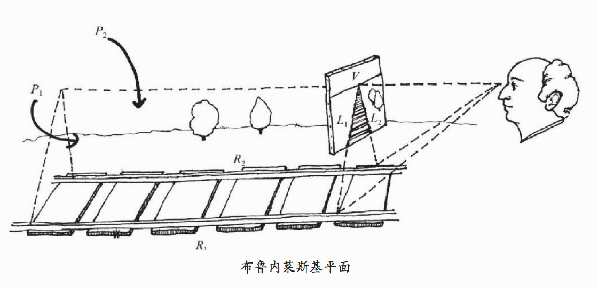
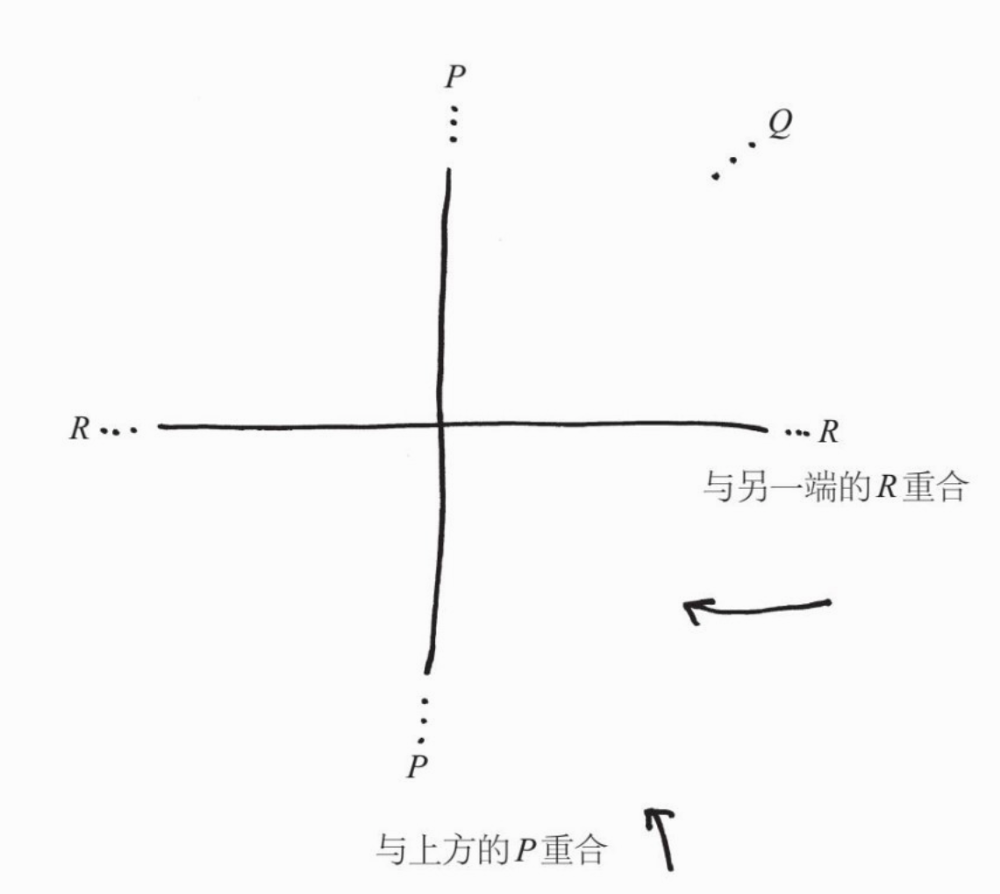
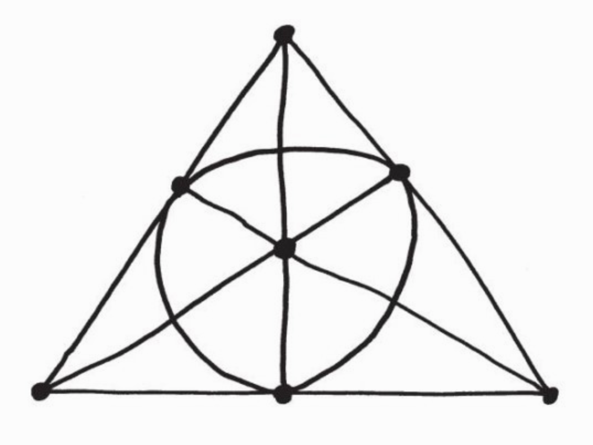
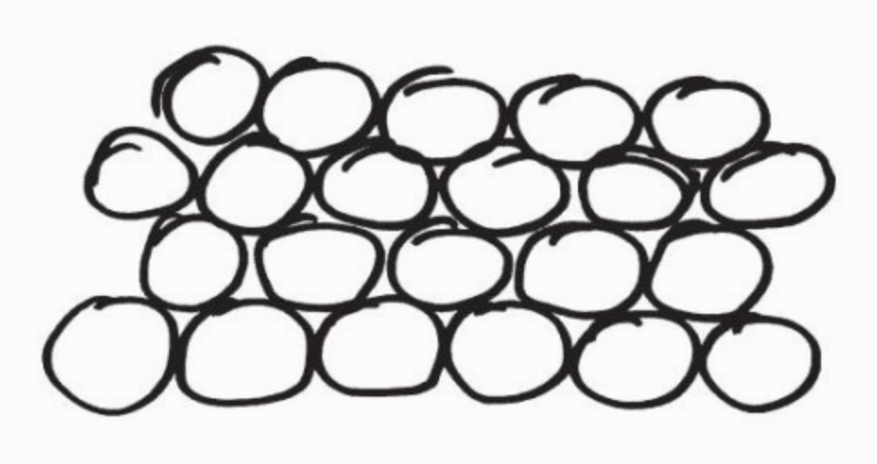

# 1301. 祝你下一张彩票中大奖！

效用这个概念有助于我们了解「Cash WinFall」彩票游戏的令人疑惑之处。杰拉德·塞尔比博彩团队购买大量彩票的方法是，利用电脑上的「快速选号器」（Quic Pic），随机选取彩票号码。而哈维的「随机策略」团队则是自己动手选号，这就意味着他们需要手工填写几十万张彩票，然后逐一输入便利店的计算机中。后者的工作量很大，而且极其枯燥乏味。

中奖号码完全是随机产生的，因此每张彩票的中奖概率是相同的。总体来讲，塞尔比利用快速选号器选出的 10 万组彩票号码，与哈维及卢玉然自己手动选号产生的 10 万组号码，为各自团队赢得的奖金应该一样多。从效用的角度来看，「随机策略」团队的大量艰辛工作并没有得到额外的回报，这是为什么呢？我们考虑一个与其性质相同但更简单的例子。给你 5 万美元，或者让你各有 50% 的机会输掉 10 万美元和赢得 20 万美元，我们会选择哪一种方案呢？第二种方案的期望值为：

```
1/2×(-100 000) + 1/2×200 000 = 50 000 美元
```

结果与第一种方案相同，因此我们可以认为这两种方案没有多大区别。如果多次选择第二种方案，那么几乎可以肯定，你赢得 20 万美元与输掉 10 万美元的次数会各占一半。假设输赢交替出现，那么两次之后，你会赢 20 万美元、输 10 万美元，净赚 10 万美元；4 次之后净赚 20 万美元；6 次之后净赚 30 万美元，以此类推。平均每次的利润是 5 万美元，这与第一种方案的结果一模一样。

现在，假设你不是经济学教科书应用题中的人物，而是一个手头没有 10 万美元的真实的人。那么，在第一次赌输之后，赌注登记人（假设这个赌注登记人是一个身材魁梧、脾气暴躁、力大无比的光头佬）找你要钱时，你可不可以告诉他：「请稍等，根据期望值计算结果，我继续玩下去就很可能有钱给你了？」尽管从数学角度讲确实如此，但在现实生活中这显然是行不通的。如果你是一个真实世界中的人，你应该选择第一种方案。

上述推理过程可以依据期望效用理论清楚地表现出来。如果我有一家资金无穷多的公司，损失 10 万美元可能没什么大不了的（假设它的价值为 –100 个效用度），而赢得 20 万美元会给我带来 200 个效用度。在这种情况下，美元与效用度之间呈现出完美的线性关系，1 个效用度就代表 1 000 美元。

但是，如果我是一个积蓄不多的人，计算方式就会截然不同。赢取 20 万美元对公司来说意义不大，但却会改变我的生活，因此，它对我的价值更大，比如，它值 400 个效用度。但是，因为输掉 10 万美元不会让我的银行账户见底，于是我吞下了脾气暴躁的光头佬抛出的诱饵，结果输掉了赌注。这不仅很糟糕，还可能会对我造成严重的伤害。我们可以给这个结果赋予  –1 000 个效用度，此时，第二种方案的期望效用为：

```
1/2××(-1000) + 1/2×400 = –300
```

期望效用为负值，意味着我不仅没有拿到唾手可得的 5 万美元，而且还要承受更糟糕的结果。50% 的一败涂地的后果是我们根本无法承受的，如果没有赢大钱的希望，我们是不会选择第二种方案的。

以上，我们运用数学方法证明了一个我们已知的法则：钱越多，你所能承受的风险也越大。第二种方案就像冒险的股票投资一样，收益的期望值为正值。如果你多次进行此类投资，可能某几次会输钱，但是从长远看，你将会成为赢家。有钱人有足够的资金储备，可以承受偶尔失利造成的损失，并且通过继续投资，最终变得更有钱。

即使资产不足以承受损失，冒险的投资行为也并非完全不可为，前提条件是你得有备用计划。如果某个市场行为有 99% 的概率赚 100 万美元，有 1% 的概率赔 5 000 万美元，那么你是否会采取行动呢？这个市场行为的期望值为正值，似乎是一个很好的投资策略。但是，一想到有遭受巨额损失的风险，而且小概率事件特别难以把握，你也有可能会畏缩不前。专业人士把这种行为称作「火中取栗」，在大多数情况下，可能会小赚一笔，但是稍有疏忽就会倾家荡产。

你到底应该怎么做呢？一种战略是拆借大笔资金，确保金融资产达到所冒风险的 100 倍。这样，你很有可能赚取 1 亿美元。（太棒了！）如果惹祸上身，亏损 50 亿美元，那怎么办呢？千万不要出现这个结果，因为我们生活在牵一发而动全身的世界，全球经济就像由锈蚀的钉子与腐烂的绳子搭建而成的摇摇欲坠的巨型树屋，一个部位出现大面积坍塌，整个树屋就很可能会轰然倒塌。因此，美国联邦储备委员会做了精心部署，以防此类情况发生。老话说得好：「如果你欠了 100 万美元，那是你自己的问题；但是，如果你欠了 50 亿美元，那就是政府的问题了。」

这个金融战略极具讽刺意味，但却十分有效。根据罗杰·罗文斯坦（Roger Lowenstein）在其著作《营救华尔街》（When Genius Failed）中的翔实记载，20 世纪 90 年代，这个战略为长期资本管理公司做出了贡献。此外，在 2008 年金融危机中，一些公司也依靠这个战略存活下来，甚至实现了赢利。从目前看，局面不会发生重大变化，因此，这个战略仍然会继续起作用。[1]

1『能想出这个战略的人也确实 NB，欠小钱的时候你是孙子，但欠大钱的时候你就是爷了，哈哈。（2020-11-20）』

人与金融公司不同。大多数人，即使是有钱人，也不喜欢采取不确定性的行为。有钱的投资人可能会心情愉快地选择期望效用为 5 万美元、有 50% 的概率获利的第二种方案，但是他们可能更愿意选择第一种方案，直接拿走那 5 万美元。与之相关的专业术语叫作「方差」（variance），表示某个决策结果的分布范围以及出现极端结果的可能性。如果两个方案的期望经济价值相同，那么大多数人，特别是流动资产有限的人，会倾向于选择方差较小的方案。因此，尽管从长远看，股票的回报率更高，但有的人却选择投资收益稳定的市政公债。投资股票的方差比较大，有可能获利更多，但也有可能损失更多。

无论你是否承认，如何处理方差问题都是理财的一大难点。正是因为考虑到方差问题，你才会通过共同基金进行多元化投资。如果把所有的钱都投到石油与天然气股票上，一旦能源领域遭受大的冲击，所有资金就会付诸东流。但是，如果在天然气与技术股票中各投一半的钱，一类股票与另一类股票不可能同时发生数额较大的买进卖出交易，这种投资组合的方差就比较小。你希望把鸡蛋放到尽可能多的篮子中，所以，你把积蓄委托给大型指数化证券投资基金，因为它们的投资无处不在。波顿·马尔基尔的《漫步华尔街》（A Random Walk down Wall Street），就很青睐这种投资策略，它的业绩一般，但却非常稳健。如果拿退休基金狂赌一把，会有什么结果呢？

股票的价值会增长，至少从长远看是这样的。换言之，投资股票市场的收益期望值是正值。对于收益期望值为负值的赌博行为而言，微积分计算的结果往往会令人抓狂。人们对肯定亏损的行为的憎恶程度，不亚于他们对肯定赢利的行为的渴望程度。在后一种情况中，你会青睐大方差，而不会追求小方差。所以在轮盘赌游戏中，人们不会气定神闲地走上前，然后在每个号码上押下一枚筹码。要送钱给庄家的话，无须采取这种复杂的行为。

那么，这些跟「Cash WinFall」彩票有什么关系呢？我们在前面说过，无论我们选择哪些号码，10 万张彩票价值的期望值都不会改变。但是，方差的情况就不同了。假设我决定大幅增加赌注，但是采用不同的方式——购买 10 万张号码组合相同的彩票。

如果这组号码在开奖时与大奖号码有 4 个数字相同，我就非常幸运地成为 10 万张「6 中 4」彩票的持有人，我会把 140 万美元的奖金悉数收入囊中，利润率为非常可观的 600%。但是，如果这组号码没有中奖，我花费 20 万美元买的彩票就成了一堆废纸。这是大方差的赌法，遭遇大额损失的概率很大，获利的概率很小，但是一旦获利，就可以大赚一笔。因此，「别把所有的钱都押在同一组号码上」这条建议非常好，分散下注的效果要好得多。塞尔比团队用快速选号器随机选取号码，也是这个道理吗？

两者并不完全相同。首先，尽管塞尔比没有把所有钱都押在同一组号码上，但是他经常一号多投。乍一看，这种做法似乎非常奇怪。在最活跃的时候，每次开奖前他会购买 30 万张彩票，让计算机在接近 1 000 万组号码中随机选取。既然他购买的号码组合在总数中仅占 3%，为什么他还要一号多投呢？

有这样一个老掉牙的打赌方法：让出席派对的宾客们赌房间中是否有两个人的生日在同一天。派对的规模不能太小，比如说 30 个人。30 个生日在 365 个可选日期中所占的比例并不是很大，因此我们可能会认为其中有两个人生日正好在同一天的可能性非常小。但是我们需要考虑的相关量并不是人数，而是人们可以组成多少个两人组合。不难算出，30 个人可以组成 435 个不同的两人组合，每个组合中的两个人生日在同一天的概率是 1/365，因此，在这个规模的派对上，很有可能有两个人的生日在同一天，这样的两人组合甚至会有两组。事实上，在 30 个人中，有两个人的生日在同一天的概率超过 70%，这已经非常高了。如果从 1 000 万组备选号码中随机选取 30 万组号码，同一组号码被购买两次的概率非常接近于 1。如果要求我准确地说出这个概率，我宁愿说「这是一种必然」，也不愿意去数「99.9%」的小数点后面到底有多少个 9。

2『根据方差的大小做方案的选择，做一张任意卡片。』——已完成

而且，不同的地方不仅仅在于号码重复。我们采用一如既往的做法，让数字变得很小，以便更直观地了解其中的区别。假设抽奖时仅有 7 个球，彩票中心从中选取 3 个构成头奖号码组合。这样，我们一共有 35 种可能的头奖号码组合，对应从集合「1、2、3、4、5、6、7」中选择 3 个数字的 35 种方法。我们把这 35 个号码按照数字顺序排列如下：

```
123 124 125 126 127

134 135 136 137

145 146 147

156 157

167

234 235 236 237245 246 247

256 257

267

345 346 347356 357

367

456 457

467

567
```

假设杰拉德·塞尔比来到便利店，利用快速选号器随机购买了 7 张彩票，那么他中大奖的概率会非常小。但是，在这种彩票游戏中，只要押中 3 个数字中的两个，也能中奖。猜中 3 个数字中的两个是很容易的。每次都说「猜中 3 个数字中的两个」非常麻烦，因此我们把这种情况简称为「二等奖」。例如，如果大奖号码是 1、4、7，含有一个 1、一个 4 以及 7 以外的其他数字的 4 张彩票就都中了二等奖。除了这 4 张彩票以外，还有 4 张彩票猜中了 1、7，以及 4 张彩票中了 4、7。因此，在全部 35 张彩票中，有 12 张中了二等奖，中奖概率超过 1/3。这说明杰拉德·塞尔比购买的 7 张彩票中可能至少有两张中了二等奖。我们可以准确地计算出塞尔比的中奖情况：

```
没中二等奖的概率是 5.3%;

只有一张彩票中二等奖的概率是 19.3%;

有两张彩票中二等奖的概率是 30.3%;

有 3 张彩票中二等奖的概率是 26.3%；

有 4 张彩票中二等奖的概率是 13.7%;

有 5 张彩票中二等奖的概率是 4.3%;

有 6 张彩票中二等奖的概率是 0.7%;

所有 7 张彩票全部中二等奖的概率是 0.1%。
```

因此，中二等奖的彩票数量的期望值为：

```
5.3%×0+19.3%×1+30.3%×2+26.3%×3+13.7%×4+4.3%×5+0.7%×6+0.1%×7=2.4
```

詹姆斯·哈维在购买彩票时没有使用快速选号器，而是手动选择了 7 张彩票。这 7 个号码组合为：

```
124

135

167

257

347

236

456
```

如果大奖号码为 1、3、7，哈维就中了 3 个二等奖：135、167 和 347。如果大奖号码是 3、5、6 呢？哈维还是中了 3 个二等奖：135、236 和 456。以此类推，我们很快就会发现他选的这些号码组合有一个非常值得关注的特性：他要么中了大奖，要么正好中了 3 个二等奖。7 张彩票中有一张中大奖的概率是 1/5，即 20%。因此，他的中奖情况为：1）没中二等奖的概率为 20%；2）有 3 张彩票中二等奖的概率为 80%。

哈维中二等奖的彩票数量期望值为：

```
20%×0+80%×3=2.4
```

结果与塞尔比的相同，这是必然的，但是其方差却比塞尔比的小得多。由于哈维对自己能中二等奖的彩票数量比较确定，因此他的投资组合对潜在合伙人的吸引力非常大。特别需要注意的是，如果哈维没有中3个二等奖，他就会中大奖。这说明哈维的策略可以保证他的彩票中奖金额比较可观，而这是塞尔比等使用快速选号器的玩家做不到的。自己选号可以在保证中奖概率的同时规避风险，但其前提条件是选对号码。

怎样才能选对号码呢？这可是一个价值连城的问题啊！（至少这一次是真的。）你可以尝试用计算机来完成这项工作。哈维和他的合伙人都是麻省理工学院的学生，他们不费力气就能写出几十个代码行。为什么不编写一个程序，把「Cash WinFall」彩票的所有号码组合都筛选一遍，找出方差最小的选号策略呢？

这样的程序肯定不难编写，但问题是，在编写的程序处理完这些数据的冰山一角之前，宇宙中的所有物质与能量可能早已进入热寂状态了。从现代计算机的性能来看，30 万并不是一个非常大的数字，但是，计划编写的程序处理的对象不是 30 万组彩票号码，而是从 1 000 万组「Cash WinFall」彩票号码中选取 30 万组可能构成的集合。那么，一共有多少种可能的集合呢？这个数字大于 30 万，大于现存于世或者曾经存在的次原子微粒的数量，而且大得多，是我们闻所未闻的数字。

摆在我们面前的是在计算机科学中被称作「组合爆炸」（the combinatorial explosion）的可怕现象。如果你希望在美国 50 个州中为自己的公司选择最有利的驻地，这个目的不难实现，你只需要比较这 50 个州就可以了。但是，如果你希望找出穿行这 50 个州而且效率最高的路线，也就是所谓的「旅行商问题」（traveling salesman problem），就会发生组合爆炸，你所面临的困难将完全不在之前的数量级上，可供选择的路线一共有 30 千那由他（vigintillion）[2] 条。

这下，组合爆炸真的发生了！因此，我们必须另辟蹊径，找到可以减小方差的选号方法。如果我告诉大家，人们借助平面几何知识解决了这个难题，你们相信吗？

## 1301. 平行线也可以相交

平行线永不相交，这是平行线的基本特征。但是，平行线有时似乎也会相交。想象一条铁道在一览无余的平地上向前延伸，你的视线也跟着向前移动，这时你会发现，随着距离地平线越来越近，那两根铁轨似乎逐渐融为一体（如果希望在头脑中形成一幅生动逼真的画面，我们可以一边听着乡村音乐一边想象，这样效果会更好），这就是「透视现象」（phenomenon of perspective）。我们的视野是二维的，如果我们希望在这个二维视野中描绘三维世界，那么有些东西必然会丢失。

最早发现这个现象的人是画家，他们不仅需要了解事物真实的形态及其在人们眼中的形态，还需要了解两者之间的不同之处。在意大利文艺复兴初期，画家知道了透视这个概念，视觉表现方式从此发生改变，欧洲的画作再也不像孩子们在冰箱门上的涂鸦之作，人们看一眼就知道他们画的是什么。

艺术史学家就菲利波·布鲁内莱斯基（Filippo Brunelleschi）等佛罗伦萨的艺术家到底是如何形成透视这种现代绘画理论的问题，进行过上百次争论。本书对这个问题就不再赘述了，我们现在可以确定的是，这个突破性进展使人们将数学与光学方面的新认识应用到对美的追求上。

比如，人们意识到影像是光线照在物体上反射后进入人眼形成的。这一认知在现代人看来非常浅显，但当时的人却不是很清楚。以柏拉图为代表的众多古代科学家认为，视觉与发源于眼球的某种火焰有关，这个观点至少可以追溯至可罗顿的阿尔克迈翁（Alcmaeon），阿尔克迈翁是我们在第 2 章里讨论过的怪异的毕达哥拉斯的信徒之一。他认为眼睛肯定能发光，否则「光幻视」（phosphene）的光源是什么？所谓光幻视，就是闭上眼睛，然后用手挤压眼球，就能看到有金星闪现。详细地提出反射光视觉理论的人，是 11 世纪的开罗数学家海塞姆（Haytham）。海塞姆的光学著作《光学书》（Kitab alManazir）被翻译成拉丁语，并且很快就被希望更系统地了解视觉与所见物体之间关系的哲学家及艺术家奉为圭臬。该书的主要观点是，画布上的 P 代表三维空间中的直线。根据欧几里得的几何学原理，我们知道经过两个定点的直线只有一条。因此，P 与眼睛之间可以形成一条直线，这条直线上的所有点在画中的位置就是 P。

现在，假设你是布鲁内莱斯基，正站在开阔的大草原上，在眼前的画布上画那条铁道。铁道有两条铁轨，我们分别称之为 R1 和 R2，每条铁轨呈现在画布上就是一条直线。画布上的点与空间中的直线相对应，同样，画布上的直线对应一个平面。与 R1 相对应的平面 P1 是由铁轨 R1 上所有点与眼睛的连线构成的。同样，与 R2 相对应的平面 P2 是眼睛与 R2 上各点的连线构成的。这两个平面与画布分别相交于一条直线，我们把这两条直线分别叫作 L1 和 L2。



布鲁内莱斯基平面

两条铁轨相互平行，但那两个平面并不是平行平面，这是为什么呢？因为这两个平面在你的眼中相交，而平行平面是永远不会相交的。但是，不平行的平面必然相交，它们的交线是一条直线。

在本例中，交线是一条水平线，从眼睛开始，沿着与铁轨平行的方向延伸。由于这条交线是水平的，因此不会与大草原相交，而是向着地平线延伸，但是永远不会与地面接触。好了，好戏就要上演了。这条交线与画布相交，交点为 V。由于 V 位于平面 P1 上，因此必然位于 P1 与画布的交线 L1 上。由于 V 也位于 P2 上，因此必然位于 L2 上。换言之，V 就是画作中铁轨在画布上的交点。

事实上，大草原上所有与铁轨平行的直路在画布上看起来都像经过 V 的直线。V 就是所谓的「消失点」（vanishing point），即与铁道平行的所有直线在画作中必然经过的点。每一对平行轨道都能在画布上形成某个消失点，消失点的位置取决于平行线的延伸方向。（唯一例外的是平行于画布的各对直线，例如铁轨之间的枕木，它们在画作中看上去仍然是相互平行的。）

布鲁内莱斯基在上述分析中完成的概念转换是射影几何学的核心内容。看到风景画中的点，我们就会想到通过我们眼睛的直线。乍一看，似乎仅仅是语义上的区别；地面上的各点可以而且只能形成一条通过该点与我们眼睛的直线，因此，我们想到的是点或者直线，会有什么不同呢？两者的区别就在于，通过我们眼睛的直线比地面上的点多，因为水平直线并不与地面相交。这些水平直线对应画布上的消失点，也就是铁轨相交的位置。你可能会把这样的直线看成沿铁道延伸方向的地面上一个无穷远的点，数学家把这样的点叫作「无穷远点」（point at infi nity）。如果你把欧几里得几何学中的平面复制到无穷远点，就会得到「射影平面」（projective plane），参见下图。



射影平面

大多数射影平面看上去与你熟悉的规整、平坦的平面非常相似，但是，射影平面上有很多无穷远点。每个无穷远点都代表平面中直线延伸的一个方向，上图中，P 对应垂直方向，你应该把它看成沿纵轴向上无限延伸，同时还沿着该纵轴向下无限延伸。在射影平面中，纵轴的两端在无穷远点重合，因此，它表现为圆，而不是直线。同样，Q 是位于东北方向（同时也位于西南方向）上的无穷远点，R 是位于横轴末端的点，或者说是横轴两端的端点。如果向右移动无穷远的距离，到达 R 之后继续移动，此时你会发现你仍然在向右移动，但却是从画的左边向中心位置靠近。

从一个方向离开，却从相反方向回来，温斯顿·丘吉尔（Winston Churchill）年轻时曾对这个奇特的现象备感着迷，他回忆自己毕生在数学方面的唯一一次顿悟时说：

有一次，我突然对数学有了感觉，以前无法理解的难题在我面前迎刃而解。我看到一个数字在经过无穷点之后，符合由正号变成负号。我当时的感觉，就像人们看到金星凌日现象，甚至是伦敦市长就任时的游行盛况那样激动不已。我彻底明白了其中的道理，知道这种改变必然发生的原因。就跟从政一样，各个步骤之间存在某种必然的联系。不过，当时我已经吃过晚饭了，所以没有做进一步的研究。

事实上，R 不仅是横轴的端点，还是所有水平直线的终点。如果两条不同的直线都是水平的，那么它们相互平行。但是，在射影几何学中，它们却会在无穷远点处相交。很多人认为《无尽的玩笑》一书的结尾非常突兀，因此，1996 年，有人在采访华莱士时问他，他是不是因为「在写这本书时感到厌烦了」，所以不想写结尾？华莱士有点儿不耐烦地说：「我认为这本书是有结尾的。平行线都有可能趋于相交，因此，读者可以在正常框架之外设计一个结尾。如果你想不到这种趋于相交的现象，也不会设计结尾，那么对你来说，这本书就是一部失败的作品。」

射影平面有用绘图方式难以表现的缺陷，但是也有让人们更乐于接受几何学原理的优点。在欧几里得几何学的平面中，两个不同的点可以确定唯一的直线，两条不同的直线可以产生唯一的交点，但是这两条直线不能是平行线，否则它们不会相交。在数学上，我们愿意接受各种规则，不喜欢例外情况。在射影平面上，我们可以认为两条直线相交于一点，而不需要考虑任何例外情况，因为平行线也会相交。

例如，任意两条垂直线都会相交于 P，而任意两条从东北向西南方向延伸的直线都会相交于 Q。两个点确定一条直线，两条直线确定一个相交点，无须任何附加条件。经典平面几何学不可能有这样完美的对称性，也不可能这样简练。在人们尝试解决利用画布描绘三维世界这个实际问题的过程中，射影几何学应运而生，这并不是一种巧合。历史反复证明，数学的简洁与实际效用紧密相关。有时，科学家发现了某个理论，就把它交给数学家，让后者研究这个理论为什么如此简洁；还有些时候，数学家建立了某个简洁的理论，然后交由科学家研究该理论的实际价值。

射影平面的一个好处是促生了具象绘画，还有一个好处是选对彩票号码。

射影几何学与彩票中奖。射影几何学有两个公理：1）公理1：经过两点有且只有一条直线。2）公理2：两条直线有且只有一个交点。

数学家发现一种射影平面可以满足上述两个公理之后，自然会想是不是还有更多的射影平面也满足这两个公理。研究发现，这样的射影平面非常多，而且大小不一。最小的射影平面是以其创建者法诺（Gino Fano）的名字命名的，叫作「法诺平面」（Fano plane）。法诺是 19 世纪末期最先对有限维射影几何学认真展开研究的数学家之一，法诺平面的大致情形如下图所示。



这个射影平面真的非常小，只包含 7 个点。其中的「直线」，即图中的线条，也非常短小，每条只包含 3 个点。一共有 7 条这样的直线，其中 6 条看起来像直线，另外一条则与圆相似。尽管这个射影平面形状奇特，但它与布鲁内莱斯基平面一样，满足公理 1 和公理 2。

值得赞赏的是，法诺使用了现代研究经常使用的方法，用哈代的话说就是「下定义的习惯」，从而避免了「射影平面到底是什么」这个无法回答的问题，代之以「哪些现象具有射影平面的特点」。法诺的原话是这样的：作为研究的基础，我们假设有任意数量、任意属性的实体，我们简称其为「点」，但是这个名称与它们的属性无关。

对于法诺及其信徒而言，直线「看起来像」直线、圆、野鸭还是其他任何东西并不重要，重要的是这些直线遵从欧几里得及其后来者关于直线的定义。只要它的特性与射影平面相似，我们就认为它是射影平面。有人认为，这种行为会把数学与现实割裂开来，应当予以抵制。但是，这种观点过于保守了。

研究发现，我们运用几何学方法思考那些看起来不像欧几里得空间的物体，甚至理直气壮地把它们称作「几何体」，这种大胆的做法，在我们理解相对时空几何学时，发挥了非常重要的作用。时至今日，我们在展望互联网前景时还会使用广义的几何学理论。几何学理论的变化更大，如果欧几里得重生，估计他也无法辨认，这就是数学了不起的地方。我们所定义的一系列概念，如果是正确的，即使它们被用到远远超出当初构建情境的更大范围中，也不会有问题。

我们再次以法诺平面为例，只不过把平面中的点用 1 至 7 这 7 个数字一一加以标记。是不是感觉很熟悉呢？如果我们用其中的 3 个点代表这些直线，并把全部 7 条直线列出来，就会得到：

```
124

135

167

257

347

236

456
```

它们正好是我们在上文中看到的 7 个数字构成的彩票号码组合，也就是可以保证至少获得最低奖金的号码组合。这似乎充满了神秘感，以至于我们会不由自主地想：什么样的人才能想出如此完美的彩票号码组合呢？但是现在，我打开了盒子，让大家看到了其中的奥秘：一个非常简单的几何体。每对数字都会出现在一张彩票上，因为每对点只能出现在一条直线上。它还是欧几里得几何学，虽然我们所说的点与直线已经面目全非，可能连欧几里得本人也辨认不出来。

1-2『平行线也可以相交。射影平面与概念，目前没看明白。做一张反常识片。（2020-11-20）』——已完成

## 13.2 信号与噪声

法诺平面可以教我们怎么买特兰西瓦尼亚彩票才会稳赚不赔，那么马萨诸塞州的「Cash WinFall」彩票该怎么买呢？包含多于 7 个点的有限维射影平面非常多，但可惜的是，它们都不能精准地满足「Cash WinFall」彩票的所有要求。因此，我们需要找到更具一般性的射影平面。结果，不是文艺复兴时期的绘画或者欧几里得几何学，而是信息论出人意料地给出了答案。假设我希望给一颗卫星发出一条重要的信息，例如「打开右推进器」。卫星不会讲英语，因此，我实际上发出的是 0 与 1 构成的序列，计算机科学家把 0、1 称作「比特」（bit）。

```
1110101……
```

上面这条信息似乎干净利落，没有歧义。但是在现实生活中，通信渠道却充满了各种噪声。卫星在接收到你发送的信息时，可能同时会接收到宇宙射线，导致信息中的一个比特被篡改了，于是卫星收到的信息变成：

```
1010101……
```

这条信息看上去似乎变化不大，但是，如果它把「右推进器」篡改成了「左推进器」，这颗卫星就可能陷入大麻烦。卫星造价昂贵，因此，我们肯定希望避免此类情况发生。在吵闹的派对上与朋友交谈时，为了不让嘈杂声淹没我们的声音，我们可能会不断重复自己的话，直到朋友听清楚为止。这个方法对卫星同样有效，在发前面那条信息时，我们可以把每个比特重复一遍，用 00 代替 0，用 11 代替 1：

```
11 11 11 00 11 00 11……
```

此时，如果宇宙射线篡改了其中的第二个比特，卫星就会收到：

```
10 11 11 00 11 00 11……
```

卫星知道每个信息片段要么是 00 要么 11，而「10」是一个危险信号，表明信息传输出了问题。但是，到底是哪里出错了呢？卫星很难回答这个问题，它不知道噪声到底篡改了信号的哪个部分，也不知道原始信息的开头部分是 00 还是 11。这个问题不难解决，我们只需要将所有比特发三遍即可：

```
111 111 111 000 111 000 111……
```

被篡改之后的信息变成：

```
101 111 111 000 111 000 111……
```

这条信息不会对卫星造成任何损坏，因为卫星知道第一个片段中的三个比特应该是 000 或者 111，而 101 意味着信息传输有问题。如果原始信息是 000，宇宙射线必须篡改两个比特才会得到 101 这个结果。宇宙射线篡改信息的发生概率极低，一下篡改两个比特的可能性非常小。所以，卫星有足够的把握来处理这个问题：如果这三个比特中有两个是 1，那么原始信息很有可能是 111。

1『信息论里，通过增加冗余度来降低出错率，这个思路真精妙，香农确实 NB。（2020-11-20）』

上文介绍的是「错误校正码」（error-correcting code）的一个范例。错误校正码是一种通信协议，可以帮助接收方消除信号中噪声所导致的错误。信息论的几乎所有概念都来自克劳德·香农（Claude Shannon）于 1948 年发表的里程碑性质的论文——「通信的数学原理」（A Mathematical Theory of Communication）。

「通信的数学原理」这个题目是不是有炒作的嫌疑啊？难道通信这种人类的基本活动也可以变成冷冰冰的数字与公式吗？在这里，我要温馨提示或者强烈建议大家：只要有人声称借助数学方法可以解释、征服或者彻底了解这样或那样的事物，我们都不可以盲目相信。

然而，由于数学技术手段越来越广博、越来越丰富，数学家不断找到各种方法处理传统观点认为不属于数学领域的那些问题，因此，数学史就是一部扩张史。概率论现在听起来稀松平常，但人们一度认为这是自不量力的表现，因为数学研究的是各种必然性与事实，而不是随机性与可能性之类的问题。在帕斯卡、伯努利等学者为偶然性的作用机制创建了数学定理之后，一切都发生了翻天覆地的变化。「无穷大理论？我没听说过这个概念」，在 19 世纪格奥尔格·康托尔（Georg Cantor）发表他的研究成果之前，就像神学与科学相互冲突一样，概率论与数学也是格格不入的。但是现在，对于康托尔提出的那些无穷级数，我们已经非常了解，足以教授数学专业一年级的学生了。（当然，学生们第一次接触这些概念时的确会大吃一惊。）

这些数学上的形式主义在描述某个现象时，不会表现其所有细节，而且它们也没有这种打算。例如，概率论对某些随机性问题就无能为力。在某些人看来，超出数学研究范围的问题才是最有意思的问题。但是，在当今社会，如果思考可能性问题时根本不使用概率论，那肯定是错误的。如果大家不相信，可以问一问詹姆斯·哈维。当然，如果问那些把钱输给哈维的人，效果会更好，因为他们的体会更深。

是否有与意识、社会或者美学相关的数学理论呢？毫无疑问，人们正在做这方面的尝试，但是到目前为止，进展仍然非常有限。如果有人宣称他们取得了突破，那么我们应该本能地不相信他们，但是我们也应该认识到，他们有可能真的取得了某些重要突破。

起初，人们觉得错误校正码可能并不是一个革命性的数学成果。在嘈杂的派对上，我们重复自己说的话，就可以解决问题。但是，这种解决方案是需要成本的。如果我们在发送信息时，把每个比特都发三遍，这条信息的长度就会是原始信息的三倍。对于派对上的交流而言，这可能不会有任何影响，但是，如果我们想让卫星在一秒钟之内打开右推进器，就有可能出问题。香农在他的那篇关于信息论的论文中指出，时至今日，工程师们仍然面临着一个基础性难题：信号抗噪声干扰的能力越强，传输这条信息的速度就会越慢，如何在两者之间取得平衡呢？噪声的出现，为传输渠道在固定时间内精准传送的信息长度设置了上限，香农把这个限度称作通信渠道的信息传输能力。水管可以输送的水量是有限的，同样，通信渠道的信息传输能力也是有限的。

「重复三遍」的通信协议会把通信渠道的信息传输能力降至 1/3，而我们在矫正错误时并不一定需要承担这么大的损失。我们有更好的办法，香农非常了解这个办法，因为这个办法是他在贝尔实验室的同事理查德·海明（Richard Hamming）提出来的。

海明是位年轻的数学家，很早就加入了「曼哈顿计划」。他有贝尔实验室重达 10 吨的第五代机械继电器式计算机的低级使用权，只能在周末时使用这台计算机运行他编写的程序。但是，这台计算机有个问题，只要发生机械故障，海明的计算就只能中止，直到星期一上午才有人重新启动这台机器。这让海明非常恼火，要知道，生气是技术进步的一个重要激励因素。海明想，如果这台机器可以自己纠正错误，永远不会死机，情况不就能大大改观吗？由此，他想到了一个办法。跟卫星信息传输一样，人们在这台计算机上输入的内容可以看成是一连串的 0 与 1。至于这两个数字是数据流中的比特、继电器的开关状态还是纸带上的小孔（当时技术水平下的数据界面），人们根本不关心。海明采取的第一个步骤是将信息分割成一个个代码块，每个代码块由三个数字组成，比如：

```
111 010 101……
```

「海明码」（Hamming code）是一种把三位数的代码块转换成 7 位数的代码块的规则，其密码本为：

```
000 → 0000000

001 → 0010111

010 → 0101011

011 → 0111100

101 → 1011010

110 → 1100110

100 → 1001101

111 → 1110001
```

经过编码之后，上述信息就会变成：

```
1110001 0101011 1011010……
```

这些 7 位数的代码块叫作「代码字」（code word），海明码只允许有这 8 个代码字。如果接收到的信息中的代码块不是其中之一，就可以肯定有地方出错了。比如，如果接收到 1010001，我们就会知道它肯定不正确，因为 1010001 不是代码字。此外，我们接收到的这条信息与代码字 1110001 只有一个地方不同，而其他代码字与我们实际看到的错误信息都不可能如此接近，因此，我们可以很有把握地猜测对方想要传输给我们的代码字是 1110001，也就是说，原始信息中与之对应的三位数代码块应该是 111。

可能有人认为我们太幸运了。如果接收到的信息与两个代码字都非常接近，我们该怎么办呢？我们的判断就不会那么有把握了吧？但是，这种情况不会发生，我会告诉大家原因。我们现在回过头去研究法诺平面上的那些直线：

```
124

135

167

257

347

236

456
```

我们把这些直线输入计算机时，该怎么描述它们呢？计算机可以识别的语言只有 0 与 1，因此，我们必须把每一条直线都转换成一连串的 0 与 1，其中，在 n 处的 0 表示「n 位于该直线上」，而在 n 处的 1 则表示「n 不在该直线上」。比如，第一行的 124 可以写成 0010111，第二行的 135 可以写成 0101011。我们发现，这两个代码块都是海明码的代码字。实际上，海明码中的 7 个非零代码字正好对应法诺平面上的 7 条直线。因此，海明码（还包括特兰西瓦尼亚彩票的最佳号码组合）与法诺平面是完全相同的数学研究对象，只不过改头换面了！

这就是海明码隐藏得很深的几何特性。代码字是法诺平面上可以构成直线的 3 个点的组合，只要原始的代码字不是 0000000，代码块的小变动就等同于在直线上增减一个点，而接收到的错误信息则对应两个点或者 4 个点。如果我们接收到两个点，我们就会知道如何找到丢失的点，它肯定是连接这两个点的唯一直线上的第三个点。如果我们接收到 4 个点，构成了「直线加一个点」的信息，该怎么办呢？此时，我们可以推断正确的信息应该是由可以形成直线的 3 个点组成的。

思维缜密的人立刻会问：我们怎么知道只有 3 个点符合条件呢？为了便于理解，我们给这 4 个点分别命名为 A、B、C、D。如果 A、B、C 位于一条直线上，那么发送方想要发送的肯定是 A、B、C 构成的信息。但是，如果 A、C、D 也位于一条直线上呢？别担心，这是不可能的，因为包含 A、B、C 的直线与包含 A、C、D 的直线有 A、C 两个公共点，但是「公理2」规定，两条直线只能相交于一个点。换言之，由于几何公理的作用，海明码具有与「重复三次」相同的校正错误的魔力。如果信息在传输过程中被篡改了一个比特，那么接收方肯定可以判断出发送方想要发送的信息。而且，我们无须花费 3 倍的传输时间，这种新方法在传输信息时，每 3 个比特的原始信息仅需花费 7 个比特的传输量，两者之间的比为 `1∶2.33`，效率更高。

海明码及随后出现的功能更加强大的错误校正码，推动了信息工程学的发展。构建有重重保护和双重检查模式的系统以确保信息传输无误，已经不再是人们追求的目标。海明与香农的研究足以将错误发生的频率降至非常低的程度，无论有什么样的噪声，灵活机动的错误校正码都可以消除它们造成的影响。火星轨道飞船「水手9号」在把火星表面的照片发回地球时使用的阿达玛码，就是具有这种效果的错误校正码。光盘在编码时采用的是里德所罗门码，即使光盘上有擦痕也不会有多大影响。（1990 年之后出生的读者，如果对光盘不太了解，可以想一想闪盘驱动器的情况。在这些驱动器中，人们为了防止数据损毁，使用了与里德所罗门码类似的博斯–乔赫里–霍克文黑姆码。）银行的汇款路线号码由一种叫作「检验和」（checksum）的简单编码构成。这种编码不是错误校正码，而是与「每个比特重复两遍」的信息协议比较相似的错误检测码。如果一个数字输入错误，执行汇款交易的计算机可能无法知道我们真正想要输入的数字是几，但是它至少知道出了问题，从而避免我们把钱汇到错误的银行账户中。

我们不清楚海明是否全盘了解他的这项新技术的适用范围，但是在他准备发表这项研究成果时，他发现贝尔实验室的老板精于此道。专利部一定要等到申请了专利之后才同意我发表这个成果……我不相信一堆数学公式也能申请专利。我告诉他们，这是不可能的。但是他们说：「看我们的吧。」他们成功了。从此以后，我知道我对专利法的理解太肤浅了，因为我觉得某些东西应该不能申请专利（或者为这些东西申请专利是不道德的），但他们却常常能成功地申请到专利权。

数学前进的步伐比专利办公室快。瑞士数学家、物理学家马塞尔·戈利（Marcel Golay）从香农那里听说了海明的想法之后，发明了大量的新编码。但他不知道海明本人已经开发了很多相同的编码并且申请了专利，他发表了自己的编码，导致双方就这项荣誉的归属权产生了纠纷，直到现在尚无定论。贝尔实验室得到了这项专利权，但是，依据 1956 年一个反垄断协议的条款，他们失去了有偿授权的权利。

海明码为什么能够奏效呢？要理解这个问题，我们必须反过来思考：在什么情况下，海明码无法发挥作用？别忘了，最让错误校正码头疼的问题是，一个代码块与两个代码字都非常接近。收到这串令人讨厌的比特之后，接收方会无所适从，因为没有任何基于既定规则的方法可以帮助他们判断原始信息中包含的到底是哪一个代码字。

我们似乎使用了比喻这种修辞格，因为代码块和代码字都没有固定位置，为什么我们可以说一个代码块「接近」另一个代码字呢？海明在信息论概念方面的伟大贡献之一，就是强调这个说法不仅仅是比喻，甚至不需要冠上「比喻」之名。他为距离赋予了一个新的含义，现在人们称之为「海明距离」（Hamming distance）。海明距离在年轻的信息数学中的意义，同欧几里得和毕达哥拉斯心目中的海明距离在平面几何中的意义没有任何不同。

海明给出的定义非常简单：两个代码块的海明距离就是把一个代码块变成另一个代码块时需要改变的比特数。比如，代码字 0010111 与 0101011 的间距是 4，因为要把第一个代码字变成第二个代码字，我们需要改变排在第二、第三、第四和第五位的比特。

海明用 8 个代码字构建的海明码之所以能取得非常好的效果，是因为任何包含 7 个比特的代码块与两个不同代码字之间的海明距离不可能都小于 1。否则，这两个代码字彼此之间的海明距离就会小于 2。但是，两个代码字之间仅有两个比特不同的情况是不存在的。事实上，任意两个代码字的海明距离至少是 4。我们可以把代码字想象成被束缚在原子核周围的电子，或者电梯中性格孤僻的人。他们都位于一个狭窄的空间中，并且尽可能地保持彼此之间的距离。

经受得住噪声干扰的所有通信方式都是以这个原则为基础的，我们日常使用的语言就是这样。如果我把「language」（语言）写成了「lanvuage」，你们肯定知道我想要说什么，因为在英语中没有其他单词与「lanvuage」仅有一个字母不同。但是，如果你写的是一些比较短的单词，例如，「dog」（狗）、「cog」（齿轮）、「bog」（沼泽）和「log」（木材），前面的推理方法就不管用了，因为这些事物在英语中出现的频率都不少，如果噪声掩盖了第一个字母的发音，你就不大可能知道对方到底说的是哪一个单词。但是，即使在这种情况下，你仍然可以借助语境修正错误。咬人的很可能是「dog」，你可能是从「log」上面掉下来的，等等。

我们有可能提高语言的效率，但是，如果我们真的这样做，就会破坏香农发现的那种严格的平衡性。很多书呆子和（或者）有数学信仰的人曾历经艰辛，创造了可以准确传递信息的简洁语言，这种语言没有英语等语言中存在的冗长、同义和歧义等问题。

1906 年，牧师爱德华·鲍威尔·福斯特（Edward Powell Foster）创造了一门叫作「罗欧语」（Ro）的人造语言。他的目的是弃用英语的海量词汇，代之以可根据逻辑由读音推导出语义的单词。麦尔威·杜威（Melvil Dewey）的「杜威图书十进制分类法」虽然把公立图书馆的书架管理得井井有条，但该分类法就像罗欧语一样严格死板，因此，杜威热衷于罗欧语这个事实可能并不令人吃惊。罗欧语的确非常简洁，英语中很多比较长的单词，例如「ingredient」（配料），在罗欧语中就简短得多，写作「cegab」。但是，简洁也是要付出代价的，罗欧语失去了错误校正这个英语与生俱来的特点。电梯里空间狭小，人多拥挤，因此乘客并没有多少个人空间，也就是说，罗欧语中的每个单词都会与其他很多单词相近，很容易发生混淆。罗欧语表示「颜色」的单词是「bofab」，如果换一个字母，把它变成「bogab」，就会得到表示「声音」的单词。「bokab」的意思是「电」，而「bolab」的意思是「味道」。更糟糕的是，罗欧语的逻辑结构导致发音相近的单词也具有相近的意思，导致我们几乎无法根据上下文的语境来判断到底是哪个词。「bofoc」「bofof」「bofog」「bofol」的意思分别是「红」「黄」「绿」「蓝」，用相近的发音来表示相似的事物有一定道理，但是，也会导致人们在嘈杂的派对上无法使用罗欧语谈论颜色，「对不起，我没有听清楚，你说的是 bofoc 还是 bofog?」

与之相反，某些现代人造语言走到了另一个极端，过度使用了海明与香农提出的那些原则。当代最成功的人造语言之一——「逻辑语」（Lojban），严格规定所有的基本词根（或者叫作「ginsu」）都不允许有相近的发音。

海明的「距离」观与法诺的哲学观一脉相承，他认为，如果一个量与距离有相似的特点，那么这个量也可以被称作「距离」。很显然，海明并没有就此止步。在欧几里得几何学中，与给定中心点的距离小于或等于 1 的点集叫作圆；在维度大于 2 时，叫作球体。因此，我们把与某个代码字的海明距离不超过 1 的代码块的集合叫作「海明球体」，该代码字位于海明球体的中心。要想具有错误校正能力，编码中的所有代码块（如果真的要用几何学来类比，就是所有的点）与两个不同代码字的海明距离就不能都小于或等于 1，换言之，我们要求以不同的代码字为中心的海明球体不能有交叉点。

因此，在构建错误校正码时，与经典几何学一样，也需要解决「球体填充」（sphere packing）的难题，即如何把一堆大小相同的球体填充到狭小的空间中，使它们尽可能地紧密排列而且所有球体互不重叠。换一个更简洁的说法：盒子中可以装多少个橙子？

球体填充问题由来已久，比错误校正码出现的时间要早得多，甚至可以追溯至天文学家约翰尼斯·开普勒（Johannes Kepler）的时代。1611 年，开普勒写了《关于六角雪花》（Strena Seu De Nive Sexangula）的小册子。尽管这个书名非常具象化，但是开普勒在书中思考的却是天然形状的起源这个大问题。雪花与蜂巢为什么是六边形，而苹果的种子却是五五排列呢？现在，与我们关系最密切的此类问题是：为什么石榴的种子通常有 12 个面呢？

下面是开普勒的解释：石榴希望在果实中装入尽可能多的种子，也就是说，它在尝试解决球体填充问题。如果我们认为大自然总能找到解决问题的最佳途径，石榴就应该是球体填充的范例。开普勒认为，下面的结构是最紧密的球体填充方式。从平面图来看，第一层的种子应该是以下图所示的规则、整齐的方式排列在一起的。



第二层与第一层相同，不过每颗种子都非常巧妙地置身于由位于下一层的 3 颗种子所构成的三角形的狭小空间中。然后，以同样的方式添加其他层。我们需要注意的是：每层有一半的间隙要用于盛放上一层的「球体」。因此，在填充每一层时，我们需要选择在哪些间隙中填充这些球体。

最常见的选择方案叫作「面心立方晶格」（face-centered cubic lattice），该方案有一个非常好的特性：每层球体的位置正好位于自该层起下方第三层球体的正上方。开普勒认为，这是球体填充最紧密的方法。在面心立方晶格中，每个球体正好接触 12 个球体。开普勒猜想，石榴种子在逐渐长大的过程中，每颗种子会挤压与之相邻的 12 颗种子，因此接触点附近的表面会变平，最终形成他观察到的十二面形。

我不知道开普勒的石榴论是否正确，但是，几百年来，他的「面心立方晶格是最紧密的球体填充方式」的论断，一直为数学界津津乐道。开普勒没有提供任何证明，很显然，在他看来，面心立方晶格理论是不可能被推翻的。一代代的食品杂货商都与开普勒的观点一致，他们在堆放橙子时一直采用面心立方晶格这种方法，而从来不考虑这是不是最佳做法。

不过，苛求的数学家希望能找到铁证，而且，他们关心的不仅限于圆与球体。进入理论数学的研究领域之后，我们自然会超出圆与球体的范畴，研究维度超过三维的所谓超球体填充问题。

射影几何学的研究成果拓展了错误校正码理论的视野，那么高维的球体填充问题也会推动编码理论的发展吗？这一次的情况与人们的初衷几乎背道而驰，人们深入研究编码理论取得的突出成果，反过来对解决球体填充问题起到了推动作用。20 世纪 60 年代，约翰·里奇（John Leech）利用戈利发明的一种编码，构建了一种紧密程度令人叹为观止的 24 维球体填充方法，人们称之为「里奇晶格」（Leech lattice）。在里奇晶格这个拥挤的空间里，每个 24 维球体同时接触 196 560 个其他球体。我们仍然不知道这种填充方法是不是最紧密的 24 维球体填充法，但是，2003 年，微软研究院的亨利·科恩（Henry Cohn）与阿比纳夫·库玛（Abhinav Kumar）证明，如果存在更紧密的晶格，那么这种晶格的与里奇晶格的紧密程度的比值最多为：

```
1.000 000 000 000 000 000 000 000 000 001 65
```

也就是说，两者非常接近。你无须关心 24 维球体以及如何将它们排列在一起的问题，但是，你必须知道，像里奇晶格这种令人惊叹的数学对象肯定有非常重要的价值。事实证明，里奇晶格具有大量奇特的对称性。1968 年，杰出的群理论学家约翰·康威在接触到里奇晶格之后，经过 12 个小时的计算，用了很多张纸，才找出了其所有的对称性。后来，这些对称性成了有限对称群的一般理论的组成部分，这些一般理论是代数学家在 20 世纪大部分时间里潜心研究的内容。

至于古老的三维橙子问题，研究证明开普勒说的没错，他的填充法的确是最佳方法。但是，直到大约 400 年之后，托马斯·黑尔斯（Thomas Hales）才于 1998 年完成了证明。黑尔斯当时在密歇根大学任教，他将这个问题简化为只有几千种排列方式的球体，然后借助计算机处理大量计算步骤，才完成了这个艰难的证明。数学界对于艰难的证明早就习以为常了，对于他们而言这不是问题。人们很快就发现并验证了黑尔斯的证明过程的准确性，但是，计算机完成的大量计算则难以验证。我们可以从头到尾详细检查证明过程，但是计算机程序与证明过程不同。即使人们可以检查每个代码行，又如何才能确定这些代码运行起来没有问题呢？

数学家普遍认可了黑尔斯的证明，但是黑尔斯本人却面临着一个问题。当初，证明过程对计算机的依赖让他感到有些不安，现在，虽然开普勒猜想的证明工作顺利完成了，但他依然无法释怀。于是，黑尔斯离开了让他一举成名的几何学领域，投身到对证明过程进行验证的研究中，他希望未来的数学与我们现在看到的有很大不同。他认为，无论是借助计算机还是使用纸笔完成的数学证明，都已经变得十分复杂，而且各个证明过程相互依赖，以至于我们再也没有充分的理由相信这些证明过程是正确的。康维尔对里奇晶格的分析成为「有限单群分类」的一个重要组成部分，有限单群分类这个研究项目目前已经完成，其成果表现为几百名作者撰写的几百篇论文，这些论文的篇幅总计超过 1 万页。据说，到目前为止还没有人能够理解其全部内容。那么，我们如何才能确定这些内容都是正确的呢？

黑尔斯认为，我们别无选择，只能另起炉灶，在可以借助计算机验证的前提下重新整合大量的数学资料。黑尔斯曾经为证明过程是否站得住脚而头疼不已，他认为，如果用于验证证明过程的编码本身便于验证（黑尔斯有充分的理由认为这个目标是可以实现的），我们就可以一劳永逸地摆脱类似的争议。然后呢？也许就是要求计算机在完全不需要人类介入的情况下可以独立完成证明过程，甚至具有思维能力。

如果这一切真的发生了，是不是意味着数学将会寿终正寝？的确如此，如果计算机在思维能力方面赶超人类，然后像某些偏激的未来主义者预测的那样，把人类当作奴隶、牲畜或者宠物，那么，数学真的会和所有东西一起灭亡。毕竟，几十年来，人们一直在利用计算机辅助数学研究。有很多种曾经被视为「研究」的计算活动，在现代人的心目中已经与 10 位数的求和一样不再具有创造性，也不值得称道了。只要笔记本电脑可以完成的工作，再也不能算作数学研究了。但是，数学家并没有因此失业。就像动作片的主角跑得比爆炸引起的大火蔓延的速度要快一样，数学家也总能领先于计算机影响力不断扩展的速度。

如果未来的机器智能真的可以接管大部分我们现在视为研究的工作，会怎么样呢？我们会重新分类，把那些研究工作划拨到「计算」的项目之下。而人类利用善于做定量研究的头脑所完成的全部工作，都会被称作「数学研究」。

虽然海明码的效果相当不错，但是人们想百尺竿头更进一步，毕竟海明码的效率还可以进一步提高。早在穿孔纸带与机械式继电器时代，计算机就已经可以完美地处理几乎所有 7 位数的代码块了。海明码似乎过于谨慎了，我们肯定可以减少向信息中添加的保护代码位数，香农的著名定理证明我们确实可以做到这一点。

比如，香农认为，如果错误的发生概率为每 1 000 位数的代码中出现一个错误，那么在应用某些编码进行处理后，信息的长度仅比编码前增加了 1.2%。这些编码还不是最好的，如果逐渐增加基础代码块的长度，我们发现某些编码在达到一定的处理速度的同时，还能满足我们对信息可靠程度的任何要求。

那么，香农是如何发明这些优质编码的呢？答案是，这些编码并不是他发明的。我们在遇到像海明码这样的复杂结构时，往往会下意识地认为错误校正码真的非常特别，在设计时它们肯定会被反复修改，直到每对代码字都小心翼翼地保持彼此间的距离，而且能确保其他对代码字不得其门而入。香农的聪明才智表现在，他看出这是一个彻头彻尾的错误认识。错误校正码根本没有任何特别之处，香农成功地证明（一旦知道需要证明的内容，证明过程本身并不是特别难）几乎所有的代码字集都有错误校正的功能。换言之，没有经过任何设计的完全随机的编码也极有可能是一种错误校正码。

毫不夸张地说，这至少是一个令人震惊的新发现。假设我们接受了一个建造气垫船的任务，难道我们的第一选择是把一堆引擎零部件和橡皮管随意地扔到地上，然后指望它们能自动组装成漂浮在水面上的气垫船吗？

1986 年，时隔 40 年之后，海明仍然对香农的证明过程敬佩不已，他说：

香农最杰出的特点之一就是他的勇气。想想他提出的主要定理，他的勇气便可见一斑。他希望发明一种编码，因为无从下手，他就写了一个随机编码。这时，他想到了一个问题：「普通的随机编码有什么作用？」他认为普通编码具有完美的随机性，因此肯定具有较高的使用价值。如果没有无与伦比的勇气，怎么会有这么大胆的想法呢？勇气是伟大科学家必备的特质，这些科学家在极度困难的情况下也会昂首阔步向前进，并不断地思考。

如果随机编码也有可能是错误校正码，那么海明码还有什么存在的意义呢？既然香农也认为随机编码有可能具有矫正错误的功能，那么我们为什么不随意选择代码字呢？这是因为这个做法会导致一个问题：编码光在理论上具有矫正错误的功能是不够的，关键是它在实践中是否能够矫正错误。如果香农编码的代码块的位数为 50，代码块的总数就是 50 个 0、1 构成的不同代码块的总数，即 250 个，这个数字略大于 1 000 兆。卫星接收到的信号应该是（或者至少接近于）这些代码块中的一个，但是代码块一共有 1 000 兆个，它接收到的到底是哪一个代码块呢？如果我们必须从这 1 000 兆个代码块中逐一甄别，就太麻烦了，因为这又是一个组合爆炸问题。因此，我们必须再次采取一种平衡的策略。像海明码这种条理清晰的编码往往更易于解码，但是事实证明，这些非常特别的编码，其效率通常比不上香农研究的那些随机编码。时至今日，几十年过去了，数学家一直在结构性与随机性这两个概念之间进退维谷，在绞尽脑汁地发明各种编码时，既希望其有足够的随机性，可以快速处理数据，又希望其有充分的结构性，以便降低解码的难度。

海明码在特兰西瓦尼亚彩票游戏中可以大显身手，但是在「Cash WinFall」彩票游戏中却一无是处。这是因为特兰西瓦尼亚彩票只有 7 个数字，而马萨诸塞州的彩票却有 46 个数字，后者需要更强大的编码。我能找到的最适合「Cash WinFall」彩票的编码就是莱斯特大学的丹尼斯顿（Denniston）于 1976 年发明的，这套编码真是太完美了。

丹尼斯顿列出了一个号码组合清单，其中包含 285 384 个号码组合，都是由 48 个备选数字中的 6 个构成的。排在清单前几位的号码组合为：


前两组号码有 4 个数字相同，即 2、3、4 和 48。但是，我们在这 285 384 组号码中不可能找到有 5 个数字相同的两组号码，这正是丹尼斯顿清单的神奇之处。在前文中，我们把法诺平面转变成编码，同样，我们也可以把丹尼斯顿清单转变成编码：把每组彩票号码转换成由 0 和 1 构成的 48 位数的代码块，在与彩票号码中数字相对应的位置填上 0，其他位置填上 1。因此，上面的第一组号码就会变成下面这个代码块：

```
000011101111111111111111111111111111111111111110
```

由于每两组号码的 6 个数字中不可能有 5 个相同，因此，这套编码与海明码一样，每两个代码块的间距都会大于或等于 4。这个结论，请大家自行验证。也就是说，任意 5 个数字的组合在丹尼斯顿的彩票号码清单中至多出现一次。它的好处不仅限于此，事实上，任意 5 个数字的组合在丹尼斯顿的彩票号码清单中都会出现但只有一次。

由此可以想象，丹尼斯顿列举这个清单时必须非常小心。丹尼斯顿在他的论文中给出了一个用「算法语言」（ALGOL）编写的计算机程序，可以验证他的清单的确具有他所说的神奇特点。在 20 世纪 70 年代，这是非常高调的姿态。此外，他还强调，在人机合作方面，计算机的作用应严格从属于他本人所发挥的作用：「虽然我建议大家可以使用计算机验证我的研究结果，但是我要明确地告诉大家，在得出这些结果的过程中我没有使用计算机。」

「Cash WinFall」彩票游戏有 46 个数字，要使用丹尼斯顿系统的话，我们需要稍稍破坏后者的完美对称性，剔除其中包含 47 或者 48 的所有号码组合。这样，剩下的号码组合仍然有 217 833 个。如果我们从藏在床底下的钱中拿出 435 666 美元买这些号码组合，结果会怎样呢？

彩票中心会开出 6 个数字，比如 4、7、10、11、34、46。如果这个号码组合不可思议地与你选的某组号码完全匹配，你就中了大奖。不过，即使没中大奖，你仍然有可能猜中 6 个数字中的 5 个，赢得让你满意的奖金。你买的彩票中有没有一组含有 4、7、10、11、34？丹尼斯顿列举的那些号码组合中的确有一组这样的号码，除非这组号码是 4、7、10、11、34、47 或者 4、7、10、11、34、48，导致你没法选用，否则，你绝不会与奖金失之交臂。

如果开出的是另外 5 个号码，比如 4、7、10、11、46，结果会怎么样呢？上一次你的运气不好，因为丹尼斯顿清单中有一组号码是 4、7、10、11、34、47，因此，4、7、10、11、46、47 这组号码就不可能出现在丹尼斯顿清单上，否则清单上就会有两组号码有 5 个数字相同。换句话说，如果 47 这个讨厌的数字让我们错失了一次获得「6 中 5」奖金的机会，那么它只有这一次捣乱的机会，数字 48 的情况与之相同。因此，一共有 6 个号码组合可能会赢得「6 中 5」奖项：

你买的彩票肯定至少包含其中 4 组号码。因此，如果我们购买了 217 833 组丹尼斯顿号码，我们就会有：

```
2% 的概率中大奖；

72% 的概率赢得 6 个「6中5」奖项；

24% 的概率赢得 5 个「6中5」奖项；

2% 的概率赢得 4 个「6中5」奖项。
```

我们把这种情况与塞尔比通过快速选号器随机选号的结果进行比较。塞尔比的选号策略有一个比较小的概率会被「6 中 5」奖项完全拒之门外，这个概率为 0.3%。更糟糕的是，只中一个该奖项的概率为 2%，中两个的概率为 6%，中三个的概率为 11%，中 4 个的概率为 15%。因此，丹尼斯顿策略可以保证的收益在这里被风险所取代。当然，风险也有好的一面。塞尔比团队赢得 6 个以上该奖项的概率为 32%，而根据丹尼斯顿策略选号时，中该奖项的数量不可能超过 6 个。塞尔比的彩票期望值与丹尼斯顿的彩票期望值，乃至所有人的彩票期望值相同，但是，丹尼斯顿策略可以让玩家免受风险的影响。要规避博彩活动的风险，仅凭购买数十万张彩票是不够的，还必须选择正确的号码。

「随机策略」团队费时费力地手工填写数十万张彩票，是不是出于这个原因呢？他们是不是利用丹尼斯顿在纯粹的理论数学研究中发明的系统，毫无风险地从彩票中心圈钱牟利呢？在探究这个问题时，我遭遇了一次挫折。我成功地与卢玉然取得了联系，但他并不清楚这些号码是如何选择的。他只是告诉我，他们大学宿舍里有一位「关键先生」，全权负责选号事务。我不确定这个人是否使用了丹尼斯顿系统或者诸如此类的系统，但是我认为，如果他没有使用这类系统，就太可惜了。

## 13.3 非理性行为为什么会存在？

到目前为止，我们已经不厌其烦地证明了一个结论：从奖金期望值的角度看，买彩票几乎在所有情况下都是错误的选择；即使在某些罕见的个案中，彩票的奖金期望值高于其售价，我们也必须非常小心，才能从彩票中尽可能多的获得期望效用。

这个结论让拥有数学思维的经济学家，很难解释彩票销售非常火爆的事实。200 多年前，这个事实也让亚当·斯密困惑不已。埃尔斯伯格研究的是人们针对未知概率或者无法预测的概率做决策的情况，而购买彩票并不包含在内，因为所有人都已经被告知彩票的中奖概率非常小。人们在做决策时往往会追求效用最大化，这个原则是经济学家开展研究的基础，在为包括经营决策与爱情决策在内的所有行为建模时，给他们提供了有效的帮助。但是，这些行为并不包括弹力球游戏。就像毕达哥拉斯的门徒无法接受三角形的斜边长度是无理数一样，某些经济学家也无法接受弹力球游戏这种非理性的行为。弹力球游戏不适合他们的所有模型，但却是一种真实存在的事物。

经济学家比毕达哥拉斯的门徒更懂得变通。在有人告诉他们坏消息时，他们不会勃然大怒，把送信人扔进大海淹死，而是对模型做出修正，以适应这种现实。我们的老朋友米尔顿·弗里德曼与伦纳德·萨维奇给出的一个解释得到了普遍认可。他们认为，彩票玩家遵循的是一种不规则的效用曲线，该曲线表明人们在买彩票时考虑的是阶级地位，而不是数量多少。如果你是中产阶级，每周在彩票上投入 5 美元并且没有中奖，那么这个决策会让你损失一点儿钱，但是不会改变你的阶级地位。而且，尽管你损失了一点儿钱，但是这个效用与零非常接近。不过，一旦中奖，就会让你步入一个新的社会阶层。我们可以使用「临终」模型来考虑这个问题：你都快要死了，如果因为买彩票而导致你临死时的钱变少了，你还会在乎吗？你可能一点儿都不在乎。如果中了弹力球游戏的大奖之后，你可以在 35 岁退休，尽情享受生活，比如去圣卢卡斯海角潜水，那么你会为之心动吗？是的，你肯定非常向往它。

丹尼尔·卡尼曼（Daniel Kahnemann）与阿莫斯·特沃斯基在偏离经典理论的方向上走得更远。他们认为，一般来说，人们不仅仅是在丹尼尔·埃尔斯伯格把一只瓮放到他们面前时才会背弃效用曲线，而是在大多数情况下都会这样做。他们提出的「前景理论」（prospect theory）现在被视为行为经济学的基础理论，后来卡尼曼还因此获得了诺贝尔经济学奖。该理论的目的是，以尽可能逼真的模型展现人们实际的行为方式，而不是运用抽象的理性去推测他们应该采取的行为方式。卡尼曼–特沃斯基理论认为，人们对小概率事件的重视程度，往往超过冯·诺依曼公理认为我们应当赋予它们的重视程度；因此，大奖的诱惑力会大于我们根据期望效用理论计算得出的结果。

但是，我们甚至根本不需要费力地开展理论研究，就可以给出一个最简单的解释：无论输赢，买彩票都可以给我们带来一些乐趣。与加勒比度假之旅或者参加通宵舞会的乐趣不同，这种乐趣也许只值一两美元吧。我们有理由不相信它（例如，玩家自己往往认为中奖的前景是他们买彩票的首要原因），但是它的确可以很好地解释人们买彩票的行为。

经济学家不是物理学家，效用与能量也不同。效用无法储存，相互作用的结果有可能使双方都获得更多的效用，这是乐观的自由市场论者的彩票观。彩票不是递减税，而是一个游戏。人们向政府支付一小笔钱，参与政府廉价提供的几分钟娱乐活动，政府也因此获得维持公立图书馆、街道照明所需要的资金。有贸易往来的两个国家在交易之后都会成为赢家，彩票也是一样的道理。

因此，如果你觉得弹力球游戏好玩，就尽管去玩吧，无须考虑数学问题！

这个观点肯定也有问题。我们还是以帕斯卡为例，介绍一种典型的、悲观的博彩观：

这个人一辈子小赌不断，每天如此，从来不知疲倦。如果每天上午给他一笔钱——他每天可能赢多少钱就给他多少钱，条件是他不得再赌，这会让他感到非常痛苦。也许有人会说，他赌博的目的是找乐子，而不是赢钱。但是，如果让他参与赌博游戏，但不允许他下注，他就不会感到兴奋，而是觉得无聊。因此，他追求的不仅仅是乐趣，闲适安逸、没有激情的乐趣只会让他觉得索然无味。他之所以感到兴奋，是因为他以为自己感到快乐的原因，是赌博可以让他赢得不下注就无法得到的东西。其实，这不过是一种自欺欺人的幻想。

帕斯卡认为以赌博为乐是可鄙的，沉迷其中会带来伤害。支持彩票的人还会拿脱氧麻黄碱作为论据，认为脱氧麻黄碱经销商与客户形成了一种双赢的关系，这跟彩票发行方与玩家的关系十分相似。

如果我们不考虑这些赌博上瘾的人，而是考虑其他人，情况会怎么样呢？

经营一家商场或者有偿提供服务，这些与买彩票的行为不同，前者的成功从一定程度上讲是可控的。但是，两者又有一些相同的地方。对于大多数人而言，经营企业是胜算不高的赌博。哪怕我们相信自己出售的烧烤汁非常美味可口，我们的第三方应用程序是一种颠覆性创新，或者我们准备采用的经营方法冷酷无情到近乎犯罪的程度，我们遭遇失败的可能性也会远远大于取得成功的可能性，这是由企业经营的本质决定的。如果经营企业，我们将会面临三种结果：1）一是赚大钱，这个概率非常非常小；2）二是捉襟见肘、勉强维持生计，这个概率比较大；3）三是亏本倒闭，这个概率最大。

对很大一部分潜在的企业家而言，如果对这些数据加以处理，就像买彩票一样，收益期望值也小于零。普通企业家（与普通彩票玩家一样）会过高地估计自己获得成功的概率。即使在存活下来的企业中，企业主挣的钱通常也不会很多，如果他们去某个公司上班、领薪水，绝大多数情况下收入会更高。

但是，因为人们没有采取更明智的行动，而是纷纷开办企业，结果社会获得了好处——我们需要饭店、理发师、智能手机游戏。企业经营真的是「傻瓜缴纳的税金」吗？如果我们真的这样认为，那就大错特错了。

原因之一是我们对企业主的尊重程度高于赌徒，我们在判断一种行为是否理性时，很难不受到道德观念的影响。还有一个原因（也是更重要的原因）是，企业经营的效用与购买彩票的效用一样，不仅仅是通过收益期望值来衡量的。实现梦想的行为本身，甚至这方面的尝试，就是一种回报。

詹姆斯·哈维和卢玉然就做出了这样的决定。在「Cash WinFall」彩票被叫停之后，他们搬到了西部，在硅谷创建了公司经营网上聊天系统业务。（哈维在个人资料页面半遮半掩地把「非传统性投资策略」列为自己的兴趣爱好。）在我撰写本书时，他们正在四处寻找风险投资，他们也许能如愿以偿吧。但是，即使他们铩羽而归，我相信他们也很快会卷土重来，他们才不会考虑什么收益期望值呢。祝愿他们购买的下一张「彩票」中大奖！

[1] 当然，我们有充分的理由认为，银行界肯定有人知道他们的投资很可能会失败，而且肯定有人在这个方面撒谎了。问题的关键在于，即使银行家都非常正直，在巨大的诱惑面前，他们也有可能采取非常愚蠢的冒险行为，最终的损失却由公众来承担。

[2] 1千那由他=1063。——编者注