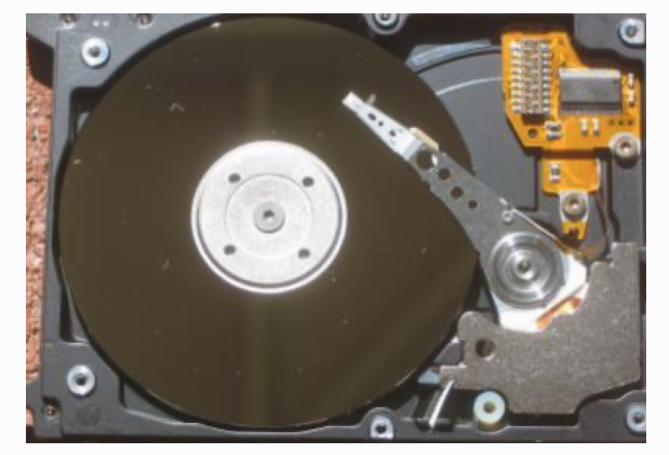

# 01 计算机里有什么

让我们开始讨论硬件，先大略看看计算机里面都有些什么东西。这个问题可以从两方面来看：逻辑上或者说功能上的组成，即每一部分是什么、做什么、怎样做、之间如何连接；以及物理上的结构，即每一部分长什么样子、如何建造起来的。本章的目标是了解计算机里有什么，大致弄清每一部分做什么，并能识别出各种首字母缩写和数字的含义。

回想一下你自己的计算机。许多读者可能会有 PC 机，上面运行着来自于微软公司的某个版本的 Windows 操作系统。PC 这个名字是个人计算机（Personal Computer）的缩写，或者说源自于 1981 年 IBM 开始卖的那种 PC。还有些人可能有苹果 Mac 机，上面运行某个版本的 Mac OS X 操作系统。更专用的设备，比如手机和平板电脑，也是强大的计算机。这些计算机看起来很不一样，用起来也感觉不一样，但这仅仅是表象，其实根本没区别。为什么这么说呢？

可以拿汽车来打个大致的比方。在功能构成上，这一百多年来的汽车都是一样的。每辆汽车都有个发动机，通过燃烧某种燃料来驱动发动机运转，这样车就能开了；都有个方向盘，这样司机（也许可以比作软件）就能操纵车的方向；还有储存燃料的地方，以及留给乘客和行李的位置。但是这一个多世纪以来汽车在物理构成上却变化巨大：造车的材料日新月异，行驶越来越快，越来越安全，可靠性和舒适性与过去不可同日而语。我的第一辆车是一部饱经风霜的 1959 款大众甲壳虫，跟法拉利比起来有天壤之别，但不论是载着我和买来的杂货从附近商店回家，还是穿越整个国家，它们都能各尽其职。就这个意义来说，它们在功能方面是一样的。（不过要申明一点，我没坐过法拉利，更不要说自己拥有一辆了，所以我只是在猜测它有没有放杂货的地方。）

计算机也是一样的道理。当今的计算机在逻辑结构上和 20 世纪 50 年代的非常相似，但是物理指标的进步却远甚于汽车。当今的计算机和 50 年前的比起来，体积更小，价格更廉，运行更快，也更可靠，有些字面上的指标甚至提高了百万倍。计算机如此普及，其根本原因就在于此。

一件东西的功能表现与物理特性之间的区别，也就是说它能做什么与它是怎样建造起来的（或者说内部的工作方式）之间的区分，是很重要的。就计算机而言，「它是如何建造出来的」这个问题的答案在以惊人的速度变化着，「它运行起来有多快」也是如此，但是「它能做什么」的答案却没什么变化。后面将会反复提到这两方面的区别。

有时我会在第一堂课时在班级里作个调查，看多少人有 PC 机，多少人有 Mac 机。在新千年的头几年，PC 对 Mac 一直稳定在 10 对 1 的比例，但几年后形势突变，到现在 Mac 已经占了全班同学机器的四分之三还要多。尽管就全世界范围而言仍然是 PC 占统治地位，我班里的这种变化肯定不是典型情况，但变化确实是存在的。

那么，两者的比例严重失调是因为一种机型比另一种更好吗？如果是的话，那又是在什么方面发生了惊人的变化，才导致在这么短时间里就形势大变呢？我询问过学生他们认为哪种机型更好，以及他们是根据什么客观标准作出这种判断的。在购买计算机的时候，你是根据什么选择了现在拥有的机型呢？

价格当然是一个原因。PC 的价格更便宜些，这是多家供应商在市场上激烈竞争的结果。有各种各样的 PC 硬件外设、数量众多的 PC 软件，关于 PC 的各种专业知识也更容易获取。（这可以看作是经济学里网络效应的实例：使用某种东西的人越多，对其中每个人来说这种东西也就越有用，两者之间基本成正比关系。）

而对选择 Mac 的人来说，他们自认为 Mac 在可靠性、质量和美学设计上更胜一筹，还有人强调「到手就能用」，甚至还包含几分对 PC 的恐惧和厌恶。这些因素让他们愿意付出更多的钱。

争论一直在进行，谁也说服不了谁。但是由此引发了一些有价值的问题，让人们思考这两种计算机的差别在哪里，共同之处又是什么。

## 1.1 逻辑构造

如果我们画一张抽象图展示计算机内部有什么，也就是它逻辑上或者功能上的体系结构，那么 Mac 和 PC 的结构都是如下图所示：一个处理器（CPU）、一些主存储器（内存）、一些大容量存储器（磁盘）和各种各样的其他部件，一组叫做总线的线缆把所有这些连接起来，在各部件之间传输信息。

计算机的基本组成，包括处理器、存放指令和数据的存储器以及输入输出设备，在 60 多年前就已经是标准了。这种体系结构通常称为冯·诺依曼体系结构，以约翰·冯·诺依曼的名字命名。他在 1946 年与阿瑟·勃克斯、赫尔曼·戈德斯坦共同撰写的论文《电子计算仪器逻辑设计的初步讨论》中描述了这种体系结构。尽管目前人们对于以冯·诺依曼来命名这种体系结构是否掩盖了其他人的贡献尚有争议，但这篇论文条理清晰，见解深刻，即便在今天也值得一读。例如，论文的第一句就指出：「为了让这台完整的设备成为通用的计算机器，它必须包含某些主要元件用于运算、存储数据、控制以及连接操作人员。」翻译成现在的术语就是，CPU 提供运算和控制功能，内存和磁盘用于存储数据，键盘、鼠标和显示器用于连接操作人员。

### 1.1.1 CPU

如果我们说计算机有大脑的话，处理器，或者叫中央处理单元（缩写为 CPU）就是计算机的大脑。处理器进行运算，来回搬运数据，并控制着一切别的操作。CPU 有一张指令表，它可以执行的操作是有限的，但执行起来速度异常之快，高达每秒钟几十亿次。它可以根据先前的计算结果决定接下来执行什么指令，所以在很大程度上，它可以主宰自己的命运。这一点很重要，我们将在第 3 章花更多篇幅详述。

如果你去商店或者上网购买计算机，你将会发现上面提到的大多数部件都会跟着一串神秘的缩写和同样神秘的数字。比如你可能看到对 CPU 的描述是「英特尔双核酷睿 2.1 GHz」。这是什么意思呢？这款 CPU 是英特尔制造的，一片封装的内部实际上有两个 CPU。在这句话里，「核」的意思就是处理器。

2.1 GHz 看起来更有趣。CPU 的速度大体上是以每秒钟执行的操作数量、指令数量或更小的动作数量来度量的。CPU 使用一个跟心跳或者钟表嘀嗒类似的内部时钟来控制基本操作的节拍，度量 CPU 速度的指标之一就是看这个内部时钟每秒振动多少次。每秒钟心跳一次或者嘀嗒一次就是 1 赫兹，记为 1 Hz。这个单位名称是为了纪念德国工程师海因里希·赫兹，他在 1888 年发现了产生电磁辐射的方法，由此直接导致无线电广播和其他无线系统的诞生。广播电台发射的广播信号频率为兆赫（百万赫兹），比如 102.3 MHz。现在的计算机通常运行在十亿赫兹的数量级上，也就是吉赫，记为 GHz。我的笔记本电脑有一片很普通的 2.1 GHz 处理器，它每秒钟跳动 21 亿次。人类的心跳大约是 1 赫兹，也就是每天大约跳 10 万次，每年将近 3 千万次，于是我的心脏要花 70 年才能赶上这个 CPU 在一秒钟里跳动的次数。

这是我们第一次遇到像兆、吉这样的数字前缀，这些前缀在计算中普遍使用。兆是 100 万，或者说 10 的 6 次方；吉是 10 亿，或者说 10 的 9 次方。我们马上就会遇到更多的计量单位，在书后的术语表里则有一份完整列表。

### 1.1.2 RAM

主存储器，也就是随机访问存储器（缩写为 RAM，即内存 ），里面保存了处理器和计算机的其他部件正在活跃使用的信息；CPU 可以改变内存里的内容。内存里不仅保存了 CPU 正在处理的数据，还保存了让 CPU 如何处理数据所需运行的指令。这一点至关重要：通过把不同的指令加载进内存，就可以让计算机做不同的计算。这样，存储程序型计算机就成为通用的设备：同一台计算机，只要在内存里放上适当的指令，就可以运行文字处理程序、制作数据表格、上网浏览、收发电子邮件、计算纳税款，还可以播放电影。存储程序这个理念的重要性怎么强调都不为过。

内存是计算机运行的时候存储信息的地方。运行中的程序，比如 Word、iTunes 或浏览器，它们的指令就放在内存里；这些程序操作的数据，比如屏幕上显示的照片、正在编辑的文档、正在播放的音乐等，也是放在内存里的；而 Windows、Mac OS X 或其他操作系统，也就是能让你在同一时间运行多个应用程序的幕后功臣，它们运行时的指令还是放在内存里。到第 6 章的时候我们会讲到操作系统。

内存之所以被称为「随机访问」，是因为 CPU 能以同样的速度快速访问其中任何地方的信息。以任何顺序随机访问不同位置时，速度不会受到任何影响。与之相比，老式录像带的访问方式则称为「顺序访问」，比如想观看电影尾声的时候只能从头开始慢悠悠地「快进」，跳过前面的内容。

内存是易失性的，也就是掉电之后里面的内容会消失，当前活跃的信息就都丢掉了。所以要养成小心谨慎的好习惯，经常保存正在做的工作，尤其是在台式机上，不小心踢掉电源线可不是闹着玩的。

你计算机上的内存大小是有限的。表示容量的单位是字节。一字节大小的内存，可以放入单个字符（比如 W 或者 @），可以放入一个整数比如 42，还可以放入大数值的一部分。第 2 章会展示内存或者计算机其他部件中的信息是如何表示的，因为这是计算的一个基础问题，但在此之前，你可以把内存想象成一大堆完全一样的小盒子，上面从 1 开始编号到一二十亿，每个盒子里可以放进一小片信息。

内存的容量有多大？我正在用的这台笔记本电脑，内存有 20 亿个字节，或者说 2 吉字节，也就是 2 GB。有很多人还认为这么些内存太小了点。原因是，虽然所有程序同时开起来的时候，内存再多也不够用，但是内存越大，可供发挥的空间就越大，而这往往也可以说成是计算得越快。如果你想要计算机运行更快的话，多买内存看起来是最佳策略。

### 1.1.3 磁盘和大容量存储器

内存的容量很大，但还是有限的，并且掉电之后内容会消失。大容量存储器则能在掉电后仍保存着里面的信息。最常见的大容量级存储是磁盘，有时也称为硬盘或硬驱。磁盘能保存的信息比内存大得多，并且是非易失性的，也就是说，磁盘上的信息不论通电还是断电都一直在那里。于是数据、指令和其他信息都长期保存在磁盘上，仅在需要时临时读入内存。磁盘空间比内存便宜 100 倍，只是访问起来要慢得多。

磁盘保存信息的方法是对旋转的金属盘片表面的磁性材料上的微小区间进行不同方向的磁化。计算机工作时的嗡嗡声和咔嗒声就是磁盘把磁头移向盘片表面正确位置时发出来的。你可以在下图里看到标准笔记本电脑硬盘的盘片表面和磁头。盘片的直径是 2.5 英寸（6.25 厘米）。

有些计算机配备了固态盘（SSD），使用闪存代替了旋转的机械部件。闪存也是非易失性的，信息保存为电路里的电荷，每一个电路元件上的电荷不需要加电就可以保持其状态。里面保存的电荷可以通过测试来读取其中的值，也可以擦掉后用新的值覆盖写入。目前闪存仍然比同容量的传统硬盘贵，但是速度快、轻便、可靠并且节电，在手机、相机等设备中广泛使用，将来可能会取代机械硬盘。

当今一块典型的笔记本电脑硬盘能保存几百吉字节的信息，而插在 USB 插座上的外部硬盘容量则达到了太字节（TB）的数量级。（「太」这个前缀表示 1 万亿，或者说 10 的 12 次方。随着硬盘容量的增长，我们以后会越来越多地见到这个单位。）

1 太字节有多大呢？或者退而求其次，1 吉字节有多大呢？按照最常用的表示文字的方法，1 字节可以保存字母文字中的一个字符。《傲慢与偏见》英文原版印在纸上有大约 250 页，包含大约 55 万个字符，所以在 1 GB 空间里能保存将近 2000 份副本。更可能的情况是，我只保存一份副本，然后再存点儿音乐。MP3 音乐每分钟大约占 1 MB，那么从我最喜爱的那些 CD 里挑出一张《简·奥斯汀的歌本》转成 MP3 保存进去，大约占了 60 MB，剩下的空间还可以再放进长达 15 小时的音乐。1995 年，BBC 出品了詹妮弗·艾莉和柯林·费斯主演的《傲慢与偏见》电影，DVD 版是两张碟片，容量不到 10 GB，可以在 1 TB 的硬盘里放 100 多次。

硬盘是用来展示逻辑结构和物理实现之区别的好例子。在 Windows 下运行资源管理器或者在 Mac OS X 下运行 Finder，可以看到硬盘里的内容组织为层次分明的文件夹和文件，但真正的数据是完全存放在旋转的机械装置、没有活动部件的集成电路或者其他存储设备里的。计算机里装的究竟是哪种「磁盘」其实无关紧要，事实上是硬盘里的硬件电路和操作系统里称为文件系统的重要软件一起创建了这种有组织的结构。在第 6 章我们会详谈这个问题。

这种逻辑结构跟人的思维相当匹配，或者更合适的说法是，到如今我们已经完全习惯了这种组织方式，所以别的存储设备也提供了同样的组织方式，哪怕是它们使用了完全不同的物理方法来实现存储。比如说，CD-ROM 或者 DVD 使用了看起来跟硬盘上的文件系统一样的方式来储存信息；USB 设备、数码相机和可插存储卡等其他小玩意也都这样；就连现在已经完全淘汰的老古董软盘，在逻辑层次上看起来也完全一样。

### 1.1.4 其他设备

各种各样其他设备也都发挥着特别的作用。有的让用户提供输入，比如鼠标、键盘和触摸屏；有的为用户提供输出，比如显示器、打印机、扬声器；网络部件，比如以太网或者无线网则用来和别的计算机通信。

在体系结构示意图里，这些设备看上去是通过一组线缆连接在一起的。借用电气工程的术语，这组线缆称为总线。实际上，计算机内部有好几组总线，每组总线都具有适合其功能的特性。比如 CPU 和内存之间的总线，线路短，传输快，但是价格贵；而连接到耳机插孔的总线，线路长，传输慢，但是价格便宜。有些总线在机箱外也露出了一部分，比如无所不在的通用串行总线，也就是把外设插入计算机所用的 USB 总线。

稍后我会在特定的语境下再次提及这些其他设备，现在我不会在这上面花太多时间。我们来列一下连接在计算机上或者从属于它的设备：鼠标、键盘、触摸板和触摸屏、显示器、打印机、扫描仪、游戏操纵器、音乐播放器、耳机、扬声器、话筒、相机、电话、与其他计算机的连接…… 这个列表还可以继续扩充。所有这些设备，跟处理器、内存和硬盘走着同样的进化路线：它们的物理属性一直朝着性能更强、规格更小、价钱更低这几个方向突飞猛进。

这些设备中，有的正在往一体化的方向融合，这种融合的进展非常值得关注。现在的手机也能当作手表、照相机和录像机、音乐和电影播放器、游戏主机、条码阅读器和导航仪来用，以至于拿手机来跟人通话倒成了偶尔才使用的功能。手机其实和笔记本有着同样的体系结构，只是由于尺寸和电源等约束而表现出较大区别。手机没有硬盘，但是有非易失性的闪存，这样它就能够在关机时仍保存电话本、应用程序和其他信息。手机能连接的外部设备没那么多，但还是可能有蓝牙、耳机和外部话筒插孔和 USB 接口等。

在我写这本书的时候，平板电脑的时代正在开启。像 iPad 以及它的各种竞争对手，很可能会占据另一片重要的天空。这些玩意也是计算机，也有一样的体系结构和相似的部件。

## 1.2 物理构造

我把自己翻箱倒柜找出来的这几十年间的古董硬件设备拆开拿到班上，传给学生，让他们观察计算机的五脏六腑。由于计算机里面的很多东西都抽象成了逻辑结构，所以能实际观察和触摸硬盘、集成电路芯片、制造芯片所用的晶圆等东西对于学习计算机是很有用的，而观察一些设备的进化史也很有趣。比如现在的笔记本电脑硬盘跟 10 年前的没什么区别，只是容量增大了 10 倍或者 100 倍，但从外表根本看不出来。

另一方面，承载计算机部件的电路板却能看出明显的发展。部件的数量在减少，因为更多的电路被做到了内部，布线更加精细，电路的引脚比起 20 年前多了很多，也密集了很多。下图展示了一块 20 世纪 90 年代后期的台式机电路板，CPU、内存等部件安装或者插入到电路板上，通过反面的印刷线路连接起来（图上正面看不到）。

计算机里的电子线路是由大量基本元件搭建起来的，但基本元件的类型却只有很少几种。其中最重要的一种是逻辑门电路，用来根据一个或两个输入值计算一个输出值，也就是用输入的电压或电流信号来控制输出的电压或电流信号。只要把足够多的门电路用正确的方式连接起来，就能执行任何计算。查尔斯·佩措尔德的《编码》是介绍这方面知识的好书，还有一些网站用图形动画的方式演示逻辑电路如何进行数学运算和其他计算。

当今最重要的电路元件是晶体管，是 1947 年由约翰·巴丁、瓦尔特·布拉顿和威廉·肖克利在贝尔实验室发明的，他们因此获得了 1956 年的诺贝尔物理学奖。在计算机里面，晶体管基本上就是个开关，也就是用电压控制电流通断的设备。任何复杂系统都可以构建在这么简单的基础之上。

门电路过去是用分立元件搭建的。制造 ENIAC 的时候，用的是跟灯泡差不多大小的电子管，而 20 世纪 60 年代的计算机则用的是铅笔上橡皮头那么大的单独的晶体管。下图展示了第一颗晶体管的仿制品（左边）、电子管和封装起来的 CPU 芯片。电子管大约 10 厘米长，CPU 实际的电路部分是在中间，大约 1 平方厘米。图上这么大的现代 CPU 芯片里则可以集成上亿颗晶体管。

如今的逻辑门电路是创建在集成电路上的。集成电路（integrated circuits）缩写为 IC，通常也称为芯片或微芯片。集成电路在一个平面里（很薄的硅片）包含了电路板的所有部件和布线，通过一系列复杂的光学和化学流程制造出来，这样就得到了没有分立元件也没有传统布线的电路。因此，集成电路比分立部件的电路小得多也可靠得多。芯片是在直径 12 英寸（30 厘米）的晶圆上批量制造的，然后把晶圆切割成独立的芯片，单独包装。芯片通常安装在比它大很多的封装壳上，用几十到几百条引脚连接到系统的其他部分。下图展示了一片封装起来的集成电路。实际的电路部分在中心，大约 1 平方厘米。

集成电路是用硅制造的，由于这个原因，集成电路产业的发源地加州旧金山南部就有了个外号叫硅谷。现在，这名字已经成为那一带所有高科技产业的统称，并且引起了几十个其他地方的效仿，比如纽约有硅巷、英国剑桥有硅沼等。

集成电路是 1958 年由罗伯特·诺伊斯和杰克·基尔比各自独立发明的。诺伊斯在 1990 年逝世，基尔比则在 2000 年因此获得了诺贝尔物理学奖。集成电路是数字电子设备的主角，但其他技术也发挥了作用，包括硬盘中的磁存储、CD 和 DVD 中的激光、光纤网络中的激光等。过去 50 年里，所有这一切都在尺寸、容量和价格方面发生了惊人的改进。

## 1.3 摩尔定律

1965 年的时候，戈登·摩尔，也就是后来的 Intel 公司联合创始人及长期 CEO，发表了一篇文章《在集成电路里填入更多部件》。他注意到，随着技术的发展，在给定大小的集成电路内部可以制造的设备（主要是晶体管）数量大约每年翻一番。后来他又把这个速率修正为两年，另外有些人则认为是 18 个月。由于计算能力大体上可以用晶体管数量来代表，这就意味着计算能力只要两年或更短时间就能翻倍，也就是说，20 年下来可以翻十番，集成度提高 2 的 10 次方也就是大约 1000 倍，经过 40 年则可以提高 100 万倍或更多。

这种指数式增长，也就是通常说的摩尔定律，已经持续了 50 年，于是当今集成电路里的晶体管数量早已超过了 1965 年那时候的 100 万倍。巨大的量变引发了质变。摩尔定律的实际图表，尤其是处理器芯片的数据，显示出晶体管数量从 20 世纪 70 年代早期 Intel 8008 CPU 的几千个晶体管，已经发展到现在廉价家用笔记本电脑的处理器的上亿个。

用来描述电路规模的基本数值是集成电路里的特征尺寸（即其中的最小尺寸），比如导线的宽度。在过去的很多年里，这个数值在稳步缩减。我在 1980 年设计的第一片集成电路（也是我设计的唯一一片）用的是 3.5 微米的特征尺寸；如今的很多集成电路，特征尺寸是 32 纳米，也就是 32 米的 10 亿分之一，下一步将会是 22 纳米（「纳」表示 10 亿分之一，或者说 10 的 - 9 次方，纳米缩写为 nm）。对比一下，一张纸的厚度或者一根头发的粗细是 100 微米，即十分之一毫米。（「微」是百万分之一，或者说 10 的 - 6 次方，「毫」是千分之一，或者说 10 的 - 3 次方。）

集成电路的设计和制造是相当复杂的业务，竞争异常激烈。而且制造运行（生产线）也很昂贵，新建的工厂可以轻而易举花掉几十亿美元。如果一个公司的技术和资金跟不上，就会在竞争中严重处于劣势。如果一个国家没有这样的资源，就要为了这些技术依赖外国，存在严重的战略问题。

到某个阶段，摩尔定律会失效。以前曾多次有人断定摩尔定律的极限已到来，但后来又发现了突破极限的方法。然而现在，我们已经到了这样的阶段：有的电路里仅包含极少数原子，这么小的结构已经很难控制。CPU 速度已经不再每两年翻一番（部分原因是芯片越快散热越多），但是内存容量仍然在按这个规律翻倍。与此同时，现在的处理器在一片芯片里可以有多颗 CPU。

比较一下今天的个人电脑和 1981 年最初的 IBM PC，对比是惊人的：第一代 PC 的处理器主频是 4.77 MHz，现在一片 2.3 GHz CPU 的时钟频率快了大约 500 倍；第一代 PC 有 64 千字节内存（「千」缩写为 K），现在一台 4 GB 内存的计算机大约是它的 6 万倍；第一代 PC 至多有 750 KB 软盘，没有硬盘，现在机器的磁盘空间则增加了 100 万倍；第一代 PC 的显示器是 11 英寸的，只能在黑色背景上显示 24 行 80 列的绿色字符，而我写这本书的时候所用的 24 英寸显示器能显示 1600 万颜色；在 1981 年，买一台配备了 64 KB 内存、160 KB 单软驱的 PC 要花 3000 美元，相当于 30 年后的 5000-10000 美元，而现在买一台 2 GHz 处理器、4 GB 内存、400 GB 硬盘的笔记本电脑只要花几百美元。

20 世纪计算机科学的伟大发现之一是，现在的数字计算机、最初的 PC 以及再往前体积更大、计算能力更弱的老式计算机器，它们在逻辑或者功能上的特性是完全一样的。如果我们不考虑速度、存储容量这些因素，这些计算机可以做完全一样的计算。在第 3 章，我们将进一步探讨这个问题。

