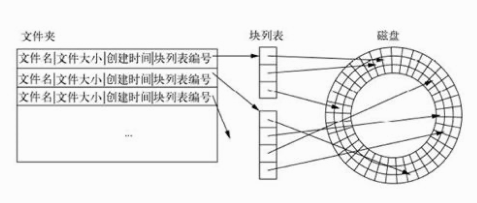

# 06 软件系统

本章我们来介绍两种主要的软件：操作系统和应用程序。操作系统是软件中的基础层，它负责管理计算机硬件，并为其他被称作应用程序的程序运行提供支持。

在你使用的电脑中，无论是家里、学校里还是办公室里的个人电脑，都会装有各种各样的程序，比如浏览器、文字处理器、音乐播放器、DVD 播放器、所得税计算器（:)）、病毒扫描程序、大量的游戏，还有帮你搜索文件或查看目录的小工具。

这些程序有一个专业的叫法，即应用程序（application）。典出何处？或许出自「这个程序是计算机在完成某个任务方面的应用」吧。虽然有点啰嗦，但在称呼那些相对独立且专注于某项任务的程序时，它却是一个标准术语。这个词过去只在计算机程序员的圈子里流行，但随着苹果公司（销售在 iPhone 和 iPad 上运行的应用程序的）App Store 的迅速走红，其简写形式「应用」（app）俨然成了时尚文化的一个基本元素。

刚买的新电脑通常都会预装大量这种程序。而随着时间推移，你还会不断购买或从网上下载新程序。对我们这些用户来说，应用非常重要，而且从不同的技术角度来看，它们还具备很多有意思的性质。本章会先介绍几个例子，然后再具体讨论一下浏览器。浏览器是一个很有代表性的例子，大家都很熟悉，但它仍然会给我们带来一些惊喜，特别是它与操作系统已经呈现出分庭抗礼的态势。

闲话少叙，言归正传。还是从为应用程序运行提供支持的程序 —— 操作系统开始讲起吧。

## 6.1 操作系统

20 世纪 50 年代初，还没有应用程序与操作系统之分。计算机的能力非常有限，每次只能运行一个程序，这个程序会接管整台机器。而程序员要使用计算机，运行自己的程序，必须事先预约时间段（身份低微的学生只能预约在半夜）。随着计算机变得越来越复杂，再靠非专业人员使用它们效率就会很低。于是，操作计算机的工作就交给了专业操作员。计算机操作员的任务就是把程序输入计算机，然后把计算结果送交相应的程序员。操作系统最初就是为了代替人工操作员完成上述工作才诞生的。

硬件不断发展，控制它们的操作系统也日益完善。而随着硬件越来越强大、越来越复杂，就有必要集中更多的资源来控制它们。第一批广泛使用的操作系统诞生于 20 世纪 50 年代末、60 年代初。这些操作系统通常是由硬件厂商提供的，IBM 和 Univac 都推出过自己的操作系统。后来，就连小一点的公司像 Digital Equipment 和 Data General 也都开发过自有操作系统。

操作系统也是很多大学和业界实验室的研究目标。MIT（麻省理工学院）作为这方面的先驱，在 1961 年开发了一个名为 CTSS（Compatible Time-Sharing System，兼容分时系统）的系统，该系统比同时代与之竞争的其他产品都先进得多，用起来的感觉也非常好。1969 年，贝尔实验室的肯·汤普森（Ken Thompson）和丹尼斯·里奇（Dennis Ritchie），结合他们对 CTSS 以及更完善但却不那么成功的 Multics 系统的第一手经验，开始着手开发 Unix。今天，除了微软开发的那些操作系统之外，大多数操作系统要么源自当初贝尔实验室的 Unix 系统，要么是与 Unix 兼容但独立分发的 Linux 版本。里奇和汤普森因为开发了 Unix 而一起荣获 1983 年图灵奖。

现代的计算机确实是一个复杂的「怪物」。它由很多部件组成，包括处理器、内存、磁盘、显示器、网卡，等等。为了有效地使用这些部件，需要同时运行多个程序，其中一些程序等着某些事件发生（如网页下载），另一些程序则必须实时作出响应（跟踪鼠标移动或在你玩游戏的时候刷新显示器），还有一些会干扰其他程序（启动新程序时需要在已经很拥挤的 RAM 中再腾出空地儿来）。简直就是一片混乱。

要管理如此复杂的局面，唯一的办法就是用程序来管理程序，这也是让计算机自己帮自己的又一个例子。这么一个程序就叫作操作系统。家用和商用计算机中最常见的操作系统是微软开发的各种版本的 Windows。我们日常见到的计算机 90% 都是由 Windows 管理的。苹果电脑运行的是 Mac OS X，它是一种 Unix 变体，也是在消费领域中仅次于 Windows 的第二大操作系统。而很多做幕后工作的计算机（当然也有一些直接面向用户的计算机）运行的是 Unix 或 Linux。手机中也有操作系统，它们是精简版 Windows、Unix、Linux 或其他特殊系统。例如，iPhone 和 iPad 运行的 iOS 就源自 Mac OS X，而我的 Android 手机、电视机、TiVo、亚马逊 Kindle 和巴诺 Nook 运行的都是 Linux 操作系统。我甚至可以登录自己的 Android 手机，在上面运行标准的 Unix 命令。

操作系统控制和分配计算机资源。首先，它负责管理 CPU，调度和协调当前运行的程序。它控制 CPU 在任意时刻执行的程序，包括应用程序和后台进程（如杀毒软件和检查更新的程序）。它会将一个暂时等待的程序（比如等待用户在上面单击的对话框）挂起。它会阻止个别程序多占资源。如果一个程序占用 CPU 时间太多，操作系统会强行将其中断以便其他任务得以正常执行。

操作系统通常都需要管理数十个同时运行的进程或任务。其中有些是由用户启动的程序，但大多数还是一般用户看不到的系统任务。在 Mac OS X 上通过 Activity Monitor，或在 Windows 上通过任务管理器，可以看到系统当前都运行有哪些程序。下图是我正在用的 Mac 中 Activity Monitor 界面的一小部分：

在上面的截图中，进程是按照它们使用的 RAM 多寡排序的。Firefox 在最上面，但几个 Chrome 进程加一块占用的内存也差不多。没有进程使用过多的 CPU。

其次，操作系统管理 RAM。它把程序加载到内存中以便执行指令。如果 RAM 空间不足，装不下所有程序，它就会将某些程序暂时挪到磁盘上，等有了空间之后再挪回来。它确保不同的程序相互分离、互不干扰，即一个程序不能访问分配给另一个程序或操作系统自身的内存。这样做既是为了保持清晰，同时也是一种安全措施，谁也不想让一个流氓程序或错误百出的程序到处乱窜。（Windows 中常见的「蓝屏死机」现象就是因为这种保护做得不到位造成的。）

为了有效利用 RAM，必须事先进行周密设计。一种思路是在必要时把程序的一部分加载到 RAM，而在程序处于非活动状态时再把它转存回磁盘，这个过程称为交换（swapping）。程序编写得就好像整台计算机都归它自己使用一样，而且也不必考虑 RAM 的限制。这样就大大简化了编程工作。另一方面，操作系统必须支持这种「假象」，方法就是在内存地址转换硬件的帮助下，不断地换入换出程序块，让程序认为它一直都在访问真实内存中的真实地址。这种机制被称为虚拟内存（virtual memory）。所谓「虚拟」，意思就是营造一种假象，而实际上这些内存并不存在。

第三，操作系统管理存储在磁盘上的信息。文件系统是操作系统中的一个主要组成部分，负责提供我们在计算机中都见过的那种文件夹和文件般的分层机制。本章后面还会再讨论文件系统，因为其中值得展开讨论的地方实在太多了。

最后，操作系统管理和协调外接设备的活动。它维护屏幕上的多个窗口，确保每个窗口都能显示正确的信息，而且在这些窗口被移动、缩放或隐藏后再次显示时，都能准确地恢复原貌。它把键盘和鼠标的输入送往需要这些输入的程序。它处理通过有线或无线网络连接进进出出的流量。它将数据发送给打印机和 DVD 刻录机，从扫描仪取得数据。

请注意，我说过操作系统也是程序。它跟我们在上一章讲到的其他程序一样，都是用同一类编程语言编写的，最常用的是 C 和 C++。早期的操作系统很小，因为工作比较简单。最早的操作系统每次只运行一个程序，所以程序交换量很小。没有太多内存可供分配（最多也就几百 KB）也决定了内存管理很简单。而且也没有太多外部设备需要管理，跟今天的外设比起来显然要少得多。今天的操作系统已经非常庞大（动辄包含数百万行代码）非常复杂了，因为它们的任务本身就非常复杂。

就以 Unix 操作系统第 6 版为例，它是今天很多操作系统（不包括 Windows）的鼻祖。它在 1975 年的时候是一个包含 9000 行 C 代码的汇编程序，两个人（肯·汤普森和丹尼斯·里奇）就可以把它写出来。如今的 Windows 7 拥有大约 1 亿行代码，Linux 的代码也超过了 1000 万行，它们都是几千人历经几十年工作的成果。当然，就这么直接拿来比也不太合适，毕竟现在的计算机要复杂得多，而且今天的环境和设备也要复杂得多。操作系统包含的组件同样也有差别。

既然操作系统也是程序，那么从理论上说你也可以写出自己的操作系统来。事实上，Linux 最早就是由芬兰大学生李纳斯·托沃兹（Linus Torvalds）在 1991 年写出来的，他当时的想法就是从头编写一个自己的 Unix 版本。他在互联网上发布了自己写的一个简陋程序，邀请别人试用和帮忙。自那时起，Linux 就逐渐成为软件业中一支重要的力量，很多大大小小的公司都在使用。上一章提到过，Linux 是开源软件。今天，Linux 除了核心的全职开发人员之外，还有数千名志愿者参与开发，而托沃兹负责总体把控和最终裁决。

你可以在自己的计算机中运行不同的操作系统，不一定是买来时就安装好的那一种。比如，在原来运行 Windows 的电脑上就可以运行 Linux。你可以在磁盘上存储多个操作系统，并在启动电脑时决定运行哪一个。通过苹果的 Boot Camp 可以体验这种「选择启动」功能，它能让你的 Mac 启动时运行 Windows 而非 Mac OS X。

我们甚至可以在一个操作系统的控制下运行另一个虚拟操作系统。使用 VMware、Parallels 和（开源的）Xen 等虚拟操作系统软件，可以在一台 Mac OS X 主机上运行另一个客户操作系统，比如 Windows 或 Linux。主机操作系统会拦截客户操作系统的请求，代替它执行那些需要具备操作系统级权限才能执行的操作，如访问文件系统或网络。主机在执行完操作后，将结果返回给客户机。在主机和客户机系统都是为相同硬件编译的情况下，客户系统大多数时候都得到硬件的全速支持，响应的及时性给人感觉就像在裸机上运行一样。

下图是一个虚拟操作系统在主机操作系统上运行的示意图。对主机操作系统而言，客户机操作系统就是一个普通的应用程序。


虚拟操作系统引发了一些有趣的所有权问题。如果某公司在一台实际的计算机上运行大量的虚拟 Windows 实例，它需要从微软购买多少 Windows 许可证？从技术上讲，只要买一个就可以。但微软的 Windows 许可中限制了可以合法运行的虚拟实例数，超过这个数目就得额外掏钱。

这里有必要说一说「虚拟」这个词的另一种用法。一个模拟计算机的程序，无论它模拟的是真实的计算机还是想象中的计算机（比如本书前面提到的玩具计算机），经常也被称为虚拟机。换句话说，计算机只以软件形式存在，而这种软件的行为就如同硬件一般。这种虚拟机很常见。浏览器都有一个虚拟机用于解释 JavaScript 程序，所有 Java 程序也都是通过虚拟机来解释的，而每台 Android 手机上同样有一个类似的 Java 虚拟机。

## 6.2 操作系统怎么工作

CPU 的结构是经过特殊设计的。计算机加电后，CPU 会开始执行存放在非易失性存储器中的一些指令。这些指令继而从一小块闪存中读出足以运行某些设备的代码。这些代码在运行过程中再从磁盘、CD、USB 存储器或网络连接的既定位置读出更多指令。这些指令再继续读取更多指令，直到加载了足够完成有效工作的代码为止。这个准备开始的过程叫做启动（booting），源自拉着靴带（bootstrap）给自己穿上靴子的典故。具体细节可能不同，但基本思想是一样的，即少量指令足以找到更多指令，后者依次再找到更多的指令。

计算机启动过程中通常还要检查硬件，以便知道有哪些设备接入了计算机，比如有无打印机或者无线设备。还会检查内存和其他组件，以确保它们都可以正常工作。启动过程还会为接入的设备加载软件（驱动程序），以便操作系统能够使用这些设备。上述过程都需要时间，而我们从开机到计算机能用的这段时间内通常都会等得不耐烦。尽管计算机比过去快了不知多少倍，但在启动上仍然要花一两分钟时间，的确够让人泄气的。

操作系统运行起来之后，它就会转而执行一个简单循环，依次把控制权交给准备运行或需要关注的每个应用程序。如果我在字处理程序中输入眼下这些字的时候，顺便收了一下邮件，又到网上逛了逛，同时还在后台播放音乐，那么操作系统会让 CPU 依次处理这些进程，并根据需要在它们之间切换。每个程序会得到一段极短的时间，在程序请求系统服务后或者分配给它的时间用完时结束。

操作系统会响应各种事件，比如音乐结束、邮件或网页到达，或者用户按下了键盘上的按键。对这些事件，操作系统都会作出必要的处理，通常是把相应的事件转发给相关的应用程序。如果我重新排列屏幕上的窗口，操作系统会告诉显示器把窗口放在什么地方，并告诉每个应用程序它们各自窗口的哪一部分可见，以便重新绘制窗口。如果我选择「文件> 退出」或单击窗口右上角的「×」按钮退出应用程序，系统会通知应用程序它马上要「死」了，以便它赶紧「安排后事」（比如，弹出对话框询问用户「您想保存这个文件吗？」）。然后，操作系统会回收该程序占用的所有资源，并告诉那些窗口得见天日的其他程序，必须重绘各自的窗口了。

### 6.2.1 系统调用

操作系统提供了硬件和其他软件之间的接口。有了这个接口，硬件就好像能听懂人的话了，而程序员编程因此就会变得简单。用这个圈子里的行话说，操作系统提供了一个平台，在这平台上可以构建应用程序。

操作系统为应用程序定义了一组操作（也叫服务），比如将数据存储至文件或者从文件中取出数据、建立网络连接、获取键盘输入、报告鼠标移动和按钮点击、绘制屏幕，等等。

操作系统以标准化的或者说大家协商一致的方式提供这些服务，而应用程序通过执行一种特殊的指令来请求这些服务，并将控制权移交给操作系统中特定的地址。操作系统根据请求完成计算，然后再将控制权和结果返回给应用程序。操作系统的这些「入口」被称为系统调用（system call），而对这些系统调用的详细说明实际上恰恰解释了操作系统能做什么。系统调用可以直接拿操作系统内部的代码作为入口，也可以是对某个（为相应服务而准备的）库函数的调用。但多数情况下，即便是程序员也不用关心上述区别。正因为如此，谁也说不清楚到底有多少个系统调用，但通常一两百个总是有的。

### 6.2.2 设备驱动程序

这一节我们讲一讲操作系统中的另一个部件 —— 设备驱动程序。设备驱动程序是一种沟通操作系统与特定硬件设备（如打印机和鼠标）的程序。驱动程序的代码知道怎么让特殊的设备履行自己的职责，比如从特定的鼠标得到移动和按钮信息、让磁盘通过旋转的磁表面读取和写入信息、让打印机在纸上留下记号、让特定的无线网卡发送和接收无线电信号。

就说打印机吧。操作系统只会发出标准的请求，比如「在这个位置上打印这段文本」、「绘制这幅图像」、「移到下一页」、「描述你的能力」、「报告你的状态」，等等。而且，还是以适合所有打印机的标准方式发出这些请求。然而，打印机的能力是有差别的，比如支不支持彩色打印、双面打印，或者不同纸张大小。打印机专属的驱动程序，要负责把操作系统请求转换为特定设备完成相应任务必需的指令。一句话，就是操作系统发送通用的请求，而具体的设备驱动程序负责在各自硬件上落实、执行请求。

驱动程序把操作系统与特定设备独有的性质隔离开来（任何设备，比如各种键盘，都有一些操作系统要用到的基本性质和操作），操作系统通过驱动程序的接口以统一的方式访问相应设备，从而方便在设备之间切换。

通用的操作系统都包含很多驱动程序。例如，Windows 为满足各种潜在用户的需要，在发行时就已经带有各种各样的设备驱动程序。每个设备的制造商都有自己的网站，提供新版本或更新的驱动程序下载。

启动过程中有一个环节就是把当前可用设备的驱动程序加载到运行的系统中。可用的设备越多，加载要花的时间就越长。新设备随时有可能出现。在把外部磁盘插入 USB 插槽后，Windows 会检测到这个新设备，（根据设备驱动程序接口的某个部分）确认它是一个磁盘，然后加载 USB 磁盘驱动程序与这个磁盘通信。Mac OS X 操作系统也一样。一般来说，没有必要不断升级新的驱动程序，因为所有设备的接口都是标准化的，操作系统本身已经包含了必要的代码，而驱动设备的特殊程序也已经包含在设备自身的处理器中。

下面这幅图展示了操作系统、系统调用、驱动程序和应用程序之间的关系。


## 6.3 其他操作系统

随着各种电子元器件越做越小，价格越来越便宜，一台设备所能集成的电子元器件数量也越来越多。于是，很多设备都具有了很强大的处理能力和很充足的内存空间。正因如此，要说一部数码相机是「一台带镜头的计算机」也不为过。随着处理能力和内存容量的增加，相机的功能也越来越强大。手机不也一样嘛！当然啦，手机和相机现在都已经合二为一了。今天，随便一部手机上的相机所拥有的像素解析度，都远远超出了早期的数码相机。没错，镜头的品质得单说。

总之，这些设备俨然与主流通用计算机一般无二。它们都有强劲的处理器、大容量的内存，以及一些外围设备（比如数码相机上的镜头和显示屏）。它们的用户界面极其精美。它们可以通过网络连接与其他系统通信 （手机使用电话网络和 Wi-Fi，游戏机手柄使用红外线和蓝牙），不少还提供 USB 接口，以支持移动硬盘的临时接入。

随着这种趋势的不断演进，选择市面上现成的操作系统要比自己从头写一个来得更实际。除非用途特殊，否则在 Linux 基础上改一改是成本最低的，关键是 Linux 非常稳定、容易修改、方便移植，而且免费。相对而言，自己开发一个专有系统，或者取得某个商业系统的许可，都会引入巨大开销。当然，改造 Linux 的缺点在于必须把改造后的操作系统部分代码按照 GPL 许可发布，由此可能引发如何保护设备中知识产权的问题。不过，从 Kindle 和 TiVo 的案例来看，似乎也没有什么不能解决的。

## 6.4 文件系统

文件系统是操作系统的一个组成部分，它能够让硬盘、CD 和 DVD、移动存储设备，以及其他各种存储器等物理存储媒体，变成看起来像是由文件和文件夹组成的层次结构。我们常说计算机有逻辑组织和物理实现两大概念，文件系统就是这两大概念的集中体现。文件系统能够在各种不同的设备上组织和存储信息，但操作系统则为所有这些设备都提供相同的接口。文件系统存储信息的方式以及存储多久，最终甚至会衍生出一些法律问题来。所以说，研究文件系统的另一个目的，就是要理解为什么「删除文件」并不代表其内容会永远消失。

几乎所有人都用过 Windows 的资源管理器或者 Mac OS X 的 Finder，这两个工具都能列出自最顶层（比如 Windows 中的 C 盘）开始的文件系统的层次结构。在这个层次结构里，一个文件夹（folder）可以包含其他文件夹和文件。换句话说，点开一个文件夹，就可以看到更多文件夹和文件。（Unix 系统则一直使用目录（directory）而不是文件夹的概念。）这里的文件夹是一个组织结构的概念，而实际的文档内容、图片、音乐、电子表格、网页等，则保存在文件中。在计算机中，所有这些信息都存储在文件系统内，只要用鼠标点击几下就可以找到。文件系统中不光存储数据，还存储着可以执行的程序（比如浏览器）、代码库、设备驱动程序，以及构成操作系统自身的文件。这些文件的数量大得惊人，就说我这个普普通通的 MacBook 吧，其中存储的文件已经超过了九十万个。

文件系统管理所有这些信息，方便其他程序和操作系统的其他部件读写这些信息。它统筹安排所有的读写操作，确保这些操作有效进行，且不会相互干扰。它记录数据的物理位置，确保它们各就各位，不会让你的电子邮件意外地窜到你的电子表格或纳税申报单里面去。在支持多用户的系统中，还要保证信息的隐私权和安全性，不能让一个用户在未经允许的情况下访问另一个用户的文件。另外，可能还需要限制每个用户有权使用的硬盘空间，也就是所谓的配额管理。

在最低级的层次上，文件系统服务是通过系统调用来提供的。程序员通常要借助代码库来使用这些系统调用，以简化编程过程中常见的文件处理操作。

### 6.4.1 磁盘文件系统

无论什么样的存储设备，在文件系统中一律只表现为文件夹和文件。从这一点来说，文件系统是把物理实现抽象为逻辑组织的绝佳范例。但它又是怎么做到的呢？

一块 100GB 的硬盘可以存储 1000 亿字节的数据，但这块硬盘上的软件可能会将其看成 1 亿个 1000 字节大的块。（现实中，块的大小应该是 2 的幂，而且每个块还会更大。这里使用十进制是为了便于说明其中的关系。）这样，一个 2500 字节大的文件（比如一封普通的邮件），就需要 3 个这样的块来存储。因为 2 个块存不下，而 3 个块有富余。文件系统不会在同一个块内存储不同文件的信息，因而就免不了有一些浪费。因为存储每个文件的最后一个块不会完全用完（在我们举的这个例子中，最后一个块就会闲置 500 字节）。考虑到简化记录工作所节省的工作量，这点代价还是值得的，更何况磁盘存储器已经那么便宜了。

这个文件所在的文件夹条目中会包含文件的名字、2500 字节的文件大小、创建或修改时间，以及其他细节信息（权限、类型等，取决于操作系统）。所有这些信息都可以通过资源管理器或者 Finder 看到。

这个文件夹条目中还会包含文件在磁盘上的位置信息，也就是 1 亿个块中的哪 3 个块存储着这个文件。管理这些位置信息的方法有很多种。比如，文件夹条目可以包含一组块编号，也可以引用一个自身包含一组块编号的块，或者只包含第一个块的编号，第一个块又包含第二个块的编号，依此类推。下面这幅示意图展示了文件夹引用块列表的大致情况：



存储同一个文件的块在磁盘上不一定连续。事实上，这些块一般都不挨着，至少存储大文件的块是这样的。兆字节级别的文件需要占用上千个块，这些块通常会分散在磁盘的各个地方。尽管从这幅图中看不出来，但文件夹及块列表本身也存储在块中。

文件夹也是一个文件，只不过这个文件中包含着文件夹和文件的位置信息。由于涉及文件内容和组织的信息必须精准、一致，所以文件系统保留了自己管理和维护文件夹内容的权限。用户和软件只能请求文件系统来间接地修改文件夹内容。

没错，文件夹也是文件。从存储方式上讲，它们跟文件没有任何区别。只不过文件系统会全权负责管理文件夹内容，任何应用软件都不能直接修改该内容。除此之外，它们都保存在硬盘上的块中，由相同的机制进行管理。

在应用程序要访问已有的某个文件时，文件系统必须从其顶级层次开始搜索该文件，在相应文件夹里查找文件路径中的每一部分。举个例子，假设要在 Mac 中查找 /Users/bwk/book/book.txt。文件系统首先要在其顶层搜索 Users，然后在该文件夹里搜索 bwk，接着在找到的文件夹里搜索 book，最后再在找到的文件夹里搜索 book.txt。在 Windows 中，这个文件的路径可能是 C:\My Documents\book\book.txt，但搜索过程相似。这是一种化整为零的思路。也就是说，路径中的层次会逐步缩小要搜索的文件或文件夹的范围，同时把其他不相干的部分过滤掉。正因为如此，不同层次中的文件可以使用相同的名字，唯一的要求是完整的路径必须独一无二。实践中，应用程序和操作系统会记住当前的文件夹，因而文件系统不必每次都从顶层开始搜索。而为了加快处理速度，系统还可能会缓存频繁用到的文件夹。

应用程序在创建新文件时会向文件系统发送请求，文件系统会在相应的文件夹中增加一个新条目，包含文件名、日期等项，还有文件大小为零（因为还没有为这个新文件分配磁盘块）。接下来，应用程序要向文件中写入某些数据时（比如向一封邮件中写几句话），文件系统会找到足够多的当前没有使用的或者「空闲」的块来保存相应内容，并把数据复制过去。然后把这些块插入到文件夹的块列表中，最后返回给应用程序。

不难想象，文件系统还要维护一个磁盘上当前未被使用（也就是还没有成为某些文件一部分）的块的列表。每当应用程序请求新磁盘块，它就可以从这些空闲的块中拿出一些来满足请求。这个空闲块的列表同样也保存在文件系统的块中，但只能由操作系统访问，应用是访问不到的。

### 6.4.2 删除文件

删除文件时，过程恰好相反：文件占用的块会回到空闲列表，而文件夹中该文件的条目会被清除，结果就好像文件被删除了一样。

现实中的情况并不完全如此，而是加入了一些有意思的比喻。当你在 Windows 和 Mac OS X 中删除一个文件时，这个文件会跑到「回收站」或「垃圾桶」里去。「回收站」和「垃圾桶」不过是另外一个文件夹，但具备某些常规文件夹所不具备的属性。正因为如此，才成其为「回收站」嘛。删除文件时，相应的文件夹条目将从当前文件夹被复制到名叫「回收站」或「垃圾桶」的文件夹里，然后会清除掉原来的文件夹条目。但是，这个文件占用的块以及其中的内容没有丝毫变化！从「回收站」里还原文件的过程正好相反，就是把相应条目恢复到它原来所在的文件夹中。

「清空回收站」倒是跟我们本节一开始描述的过程很相似。此时「回收站」或「垃圾桶」里的文件夹条目会被清除，相应的块会真正再添加到空闲块列表中。不管是明确地执行这个操作，还是文件系统因为空闲空间过少而在后台静默地清空，这个过程都将实实在在地发生。

假设是你明确地执行清空操作。那么这个操作首先清除「回收站」文件夹中的条目，然后把其中文件占用的块回写到空闲块列表。但是，这些文件的内容并没有被删除。换句话说，原始文件占用的每个块中的所有字节都会原封不动地呆在原地。除非相应的块从空闲块列表中被「除名」并奉送给某个应用程序，否则这些字节不会被新内容覆盖。

这意味着什么呢？意味着你认为已经删除的信息实际上还保存在硬盘上。如果有人知道怎么读取它们，仍然可以把它们读出来。任何可以不通过文件系统而能够逐块读取硬盘的程序，都可以看到那些被「删除」的内容。

显然，这样有一个潜在的好处。就是在硬盘出问题的情况下，还有可能恢复其中的信息，尽管文件系统可能已经一团糟了。可是不能保证数据真正被删除也有问题。假如你想删除的文件里包含隐私，甚至一些见不得人的东西，你肯定希望它们被删除后永远销声匿迹。对精于此道的坏蛋或者执法机关的专家来说，恢复磁盘中的内容只是小菜一碟。因此，假如你在文件中记录了自己穷凶极恶的想法，或者在妄想症支配下写了很多胡话，那最好使用能够把这些信息从空闲块中彻底擦干净的程序。比如 Mac 中的「安全擦除」选项在释放磁盘块之前，会先用随机生成的比特重写其中的内容。

现实当中的你还应该知道更加保险的做法。因为即使用新信息重写了原有内容，一名训练有素的敌人仍旧可以凭借他掌握的大量资源发现蛛丝马迹。军事级的文件擦除会用随机的 1 和 0 对要释放的块进行多遍重写。更为保险的做法是把整块硬盘放到强磁场里进行消磁。而最保险的做法则是物理上销毁硬盘，这也是保证其中内容彻底销声匿迹的唯一可靠方法。如果你的磁盘一直都在执行自动备份（就像我在上班时使用的计算机一样），或者你的文件保存在网络文件系统中而不是本地硬盘上，那么这些招数恐怕也都不灵光了。

文件夹条目本身也存在类似的问题。删除一个文件时，文件系统会让相应文件夹条目不再指向有效的文件。为此，它可能只会把一个表示「本条目不再使用」的比特位设置为 1。这样在将来需要恢复该文件的原始信息，包括所有未被重新分配的块的内容时，只要把这个比特位重置为 0 就可以了。事实上，1980 年代微软 MS-DOS 中的文件恢复系统采用的就是这种办法。对于待释放的空闲条目，该系统会把相应文件名的第一个字符设置为一个特殊值。这样，如果用户很快又要恢复文件，那么实现起来会简单很多。

知道了文件在被创建人删除后还可能存在很长时间，有助于我们理解一些法律程序，比如当事人坦白和文档保全的意义。在法庭上，这种案例屡见不鲜。有时候，一封陈年邮件就可能影响对被告的量刑，至少会让犯罪嫌疑人的陈述露出马脚。如果这些记录只存在于纸面上，那么徒手将其撕碎就能轻易销毁证据。但数字化记录是会扩散的，还可能通过移动硬盘等媒体藏匿于很多地方。（维基解密 2010 年得到的大批机密外交文件就保存在很多张 CD 中。）明智的人都应该时刻注意自己在邮件里的措辞，甚至应该注意通过计算机发表的任何言论。

### 6.4.3 其他文件系统

刚才我们讨论的是硬盘驱动器（包括移动硬盘）上的常规文件系统。我们大多数的信息都保存在这些硬盘上，而且我们对它们也非常熟悉。不过，这个文件系统也同样适用于其他媒体。

例如，已经退出历史舞台的软盘，在逻辑上具有同样的层次结构，但细节上有所不同。CD-ROM 和 DVD 同样以文件系统的方式提供访问界面，同样由不同层次的文件夹和文件组成，只不过一般为只读，不能写。固态硬盘通过闪存来模拟常规硬盘，但重量更轻，耗电更省。

USB 闪存盘和 SD（Secure Digital，安全数字式）闪存卡已经无处不在。把它们插入到一台 Windows 计算机中，它们就会像一块新硬盘一样。通过资源管理器可以查看其中的内容，并像在普通硬盘上一样执行读写操作。唯一的区别就是它们容量小一些，有时候速度可能也慢一些。

如果把它们插到一台 Mac 上，它们同样表现为分层的文件系统，可以通过 Finder 浏览，文件也可以拷来拷去。把它们插到 Unix 或 Linux 计算机上也一样，它们还是表现为文件系统。让这些硬件在不同操作系统中看起来具有同样的文件系统和同样的文件夹/文件结构的是软件。但在内部，文件组织采用的可能是微软的 FAT 系统，其他文件系统也都模仿该系统。但我们不需要去理会这个，这种抽象是非常完美的。（顺便说一句，FAT 是 File Allocation Table 的简写，即「文件分配表」，不是「肥胖」的意思。所以大家可别误以为微软的实现不好。）

我的第一台数码相机都把照片存在自己内部的文件系统中。为了拷照片，必须用数据线把相机连接到计算机。而我现在这台相机使用的是 SD 闪存卡（就是上面图里的那张），把这张卡从相机里拔出来插到计算机上，就可以上传照片。不仅上传速度比以前快得多，而且也让我摆脱了以前相机厂商开发的那些难用至极的滥软件。熟悉而统一的界面代替了笨拙而专有的方法。显而易见，相机厂商也会因此省不少事，至少不用再为自己的产品开发专门的文件传输软件了。

值得一提的是，同样的思想也体现在网络文件系统上。在学校和公司里，把文件保存到服务器上是非常常见的做法。借助相应的软件，我们访问其他计算机上的文件系统时，就如同访问本地的硬盘一样。同样只要使用资源管理器、Finder 或者其他软件就可以。远端的文件系统可能与本地相同（比如两台 Windows 计算机），也可能不同（比如其中一台是 Mac 或 Linux 计算机）。但与闪存设备一样，软件把它们的差异隐藏了起来，我们看到的永远是与自己本地计算机中常规文件系统一样的界面。

网络文件系统经常用于备份，当然也可以作为主文件存储系统。必要时，可以把旧文件复制到便于存档的媒体上，保存到其他地方，以免发生火灾等事故时毁坏重要资料。有些磁盘系统会依赖一种叫 RAID（Redundant Array Of Independent Disks，独立磁盘冗余阵列）的技术，把数据和错误校验码分别写到多个磁盘上，以便某个磁盘损坏时能够从其他磁盘恢复数据。当然，这种系统也会增加彻底销毁数据的难度。

## 6.5 应用程序

「应用程序」是一种统称，表示所有在操作系统平台上完成某种任务的软件或程序。应用程序可大可小，可以只完成特定的任务，也可以囊括大量功能。可以是花钱买的，也可以是免费送的。它的代码可以高度保密，也可以开放源码，甚至没有任何限制。

或许可以把应用程序分成两类。一类是小型独立的应用，通常只帮用户做一件事；另一类是大型软件，包含非常多的操作，比如 Word、iTunes 或 Photoshop。

最简单的应用程序是啥样的？好吧，我们以 Unix 中的 date 程序为例，它的作用就是打印当前日期和时间：

    $ date Thu Sep 22 19:44:07 EDT 2011

date 程序在所有类 Unix 系统中的行为完全一样。不信？你可以在 Mac 里打开 Terminal（终端）窗口试一试。date 的代码很少，因为它是构建在相应系统调用和库函数基础上的。系统调用为它提供了以内部格式表示的日期和时间，库函数帮它转换格式并打印出来。以下就是实现它的 C 代码，你看短不短：

```
#include <stdio.h> 
#include <time.h> 
int main() { 
time_t t = time(0); 
printf("%s", ctime(&t)); 
return 0; 
}
```

Unix 系统有一个列出目录中文件和文件夹的命令，它是 Windows 资源管理器和 Mac OS X Finder 的纯文本版。对文件执行复制、移动等操作的程序，在 Finder 和资源管理器中也都有对应的图形用户界面版。同样，这些程序也使用系统调用来提供文件夹包含内容的基本信息，也依赖于库函数去读、写、格式化和显示信息。

Word 之类的应用程序比浏览文件系统的程序要大得多。但很明显，Word 一定包含某种类似的文件系统程序，以便用户能够打开文件、读取文件内容和保存文档。Word 也包含非常完善的算法，随着文本变化持续更新显示界面的算法就是一例。它还提供精心设计的用户界面，用于显示信息和让用户调整字号、字体、颜色、布局等的各种选项。对这种程序而言，用户界面是至关重要的一部分。Word 以及其他具有巨大商业价值的大型程序都经历了不断改进和功能完善。我还真不知道 Word 有多少行代码，但要说它有几百万行 C 和 C++ 代码应该一点都不奇怪。

另一个大型、免费，有时候甚至是开源的应用程序是浏览器。从某种角度说，浏览器的复杂度甚至更高。只要上过网，你就至少使用过下列浏览器之一：Firefox、Safari、Internet Explorer、Chrome、Opera。相信不少读者也像我一样，用过其中不止一个。第 10 章我们会更详细地介绍 Web 和浏览器如何获取信息。这里我们只关注它是一个多大、多复杂的程序。

从外部来看，浏览器会向 Web 服务器发送请求，从那里取得信息后再把它们显示出来。那它复杂在哪里呢？

首先，浏览器必须处理异步事件。所谓异步事件，就是在非预定时间发生、没有特定次序的事件。举个例子，你点击一个链接，浏览器就会发送一个对相应页面的请求。但发送完请求后，它不能就那么一直等着。它还得准备响应你的其他操作，比如滚动当前页面，或者在你点击「后退」按钮或另外一个链接时中断之前的请求，不管请求的页面是否已经到达。在你调整窗口大小时，它必须不断更新窗口中的内容，或许就因为你在等待新页面期间没事儿干，于是就会随手来回缩放起窗口来。如果页面中包含音频和视频，那它还要负责控制它们。编写异步系统一直是非常困难的，而浏览器就涉及很多异步操作。

浏览器必须支持很多种内容，包括静态文本和具有互动性的程序（可以动态改变网页中包含的内容）。对某些内容的支持可以委托给辅助程序（这是处理 PDF 文档和电影的标准做法），但浏览器本身必须提供相应的机制，以便启动这些辅助程序，为它们发送和接收数据以及请求，还要控制它们。

浏览器必须管理多个标签页或窗口，每个标签页和窗口都可能需要执行前述操作。它要为每个标签页和窗口单独保留一份历史记录，还要保存书签、收藏夹等数据库。它要支持访问本地文件系统，以便上传和下载文件。

浏览器自身还是一个平台，要提供不同层次的扩展接口。比如，要支持 Flash 和 Silverlight 插件、JavaScript 和 Java 虚拟机，以及 Firefox、Safari 和 Chrome 所支持的那些扩展程序。

浏览器既然包含那么多实现复杂功能的代码，其自身以及它所支持的插件、扩展程序免不了会存在一些漏洞，面临被攻击的风险。另外，一些无知、愚昧，甚至白痴用户（本书读者自然不在此列），由于不理解浏览器的原理，不知道可能存在的风险，也会导致浏览器遭受攻击。总之，做浏览器开发确实不容易。

如果现在再回头读一读本节内容，你会不会想到些什么？没错，现在的浏览器非常像操作系统。它要管理资源、控制同时发生的活动，它向多个地方请求和保存资源，并且为其他程序运行提供了一个平台。

多年来的实践表明，把浏览器当成操作系统是可行的。换句话说，浏览器本身就是一个独立的系统，与什么操作系统在控制底层硬件无关。大概十几年前，这种想法已经浮出水面，但当时还存在很多实际的困难。今天，这种可能性已经触手可及。大量服务都可以只通过浏览器界面来访问了（邮件是最明显的例子），而这个趋势还在继续。谷歌已经发布了一个浏览器操作系统，叫 Chrome OS。这个操作系统完全依赖于 Web 服务。为此，谷歌还推出了运行 Chrome OS 的计算机 Chromebook。第 11 章讨论云计算的时候，我们还会再探讨这个话题。

## 6.6 软件分层

与计算领域的很多其他东西一样，软件也是分层组织的。类似于地质学中的分层，软件中的不同层次可以隔离不同的关注点。在程序员的世界里，分层是解决复杂问题的一个核心思想。

通俗地讲，计算机的最底层是硬件。硬件，除了总线支持在系统运行期间添加和删除设备之外，其他方面几乎可以看成不可变的。

再往上就是所谓的操作系统层了。为了突出其核心地位，通常把这一层称为内核（kernel）。操作系统介于硬件和应用程序之间。无论底层是什么硬件，操作系统都要负责隐藏其特殊性，向应用程序提供统一的接口或界面，这个接口或界面不因硬件的种种差别而变化。在接口设计得当的情况下，同一个操作系统的接口完全可以适用于众多制造商生产的不同类型的 CPU。

Unix 操作系统的接口就是这样的。Unix 可以在各种处理器之上运行，但在任何处理器上都能提供相同的核心服务。事实上，操作系统就是一种通用的商品，底层的硬件除了价格和性能之外，其他方面都影响不大。而且，上层的软件也不依赖于它。把为一种处理器编写的程序移植到另一种处理器上，无非就是小心谨慎地用合适的编译器再编译一遍而已。当然，程序与硬件结合得越紧密，这种转换工作就越难做。无论如何，这种转换对很多程序来说都是可行的。举个大规模转换的例子，苹果公司在 2005 年到 2006 年，用了不到一年时间，就把它们的软件从 IBM 的 PowerPC 处理器转换到了 Intel 处理器上。

对 Windows 来说，问题就没有那么简单了。从 1978 年的 Intel 8086 CPU 开始，Windows 的开发就与 Intel 架构紧密结合，包括后来 Intel 发布的每一款 CPU。（处理器系列一般称为「x86」，是因为 Intel 的处理器很多年都以「86」这个编号结尾，包括 80286、80386、80486 等。）Windows 与 Intel 的结合是如此紧密，以至于这样的系统一度被世人称作「Wintel」。

操作系统再往上的一层是函数库。函数库提供通用的服务，这样一来，程序员就不必各自重复实现这些功能。有些库比较靠近底层，能够完成一些基本功能（完成数学计算，比如开方和求对数，或者像前面 date 命令一样计算日期和时间）。另外一些库的功能更强大（涉及加密、图形处理、压缩等）。图形用户界面上的组件，包括菜单、按钮、复选框、滚动条、选项卡面板等等，都需要编写很多代码。为此，只要把这些代码封装成函数库，任何人就都可以使用它们，而且还能保证统一的行为和外观。这就是为什么大多数 Windows 应用（至少它们的基本图形组件）看起来那么相似的原因。同样的情况在 Mac 上更是如此。如果所有软件开发商都重新发明、重新实现这些功能，那不仅会浪费大量资源，而且五花八门的界面也会让用户感到无所适从。

如前所述，典型的应用程序会使用函数库和操作系统服务，把它们集成到一起实现某种功能。不过，库函数与系统调用之间的区别并不十分明显。某个特定的服务可以作为系统调用实现，也可以借助使用了系统调用的库函数来实现。

有时候，内核、函数库和应用程序之间并不像我说的那么泾渭分明。毕竟，编写及连接软件组件的方式多种多样。例如，内核可以提供少量服务，而依赖上层的库来完成大部分工作。或者，它也可以自己承担大部分任务，而较少地依赖于库。操作系统与应用程序之间并没有清晰的界限。

那该如何区分它们呢？一个简单（但可能不够完美）的方法，就是把任何确保 A 应用程序不会干扰 B 应用程序的代码看成是操作系统的职能。比如，内存管理、文件系统、设备管理和 CPU 管理，这些都是操作系统的职能。内存管理需要决定在程序运行的时候把它们放到内存的什么位置，文件系统需要决定把信息保存到磁盘上的什么位置，设备管理需要确保两个应用程序不会同时占用打印机，也不能在没有协商的情况下就向显示器输出内容。最核心的还是 CPU 管理，因为这是操作系统履行前述各项职能的前提条件。

浏览器不属于操作系统，因为你可以运行任意浏览器，甚至同时运行多个浏览器，都不会干扰共享资源或者控制流程。

听起来好像是可以做到泾渭分明似的，但要是较起真来，比如打起官司来，那可就难说了。美国司法部从 1994 年开始（到 2011 年结束的）对微软的反垄断诉讼，就涉及微软的 Internet Explorer 浏览器到底是操作系统的一部分，还是一个独立应用程序的问题。如果浏览器是操作系统的一部分（按照微软的主张），那么要求微软删除 IE 就是不合理的，而微软要求用户使用 IE 的做法就是正当的。如果浏览器是一个独立的应用程序，那么微软就涉嫌以非法手段强迫用户在非必要情况下使用 IE。当然，这个官司本身要复杂得多，但如何界定浏览器的归属问题确实非常重要。最终诉讼的结果是，法院认定浏览器是一个独立的应用程序，不属于操作系统。用法官托马斯·杰克逊（Thomas Jackson）的话说：「Web 浏览器和操作系统是相互独立的产品。」

