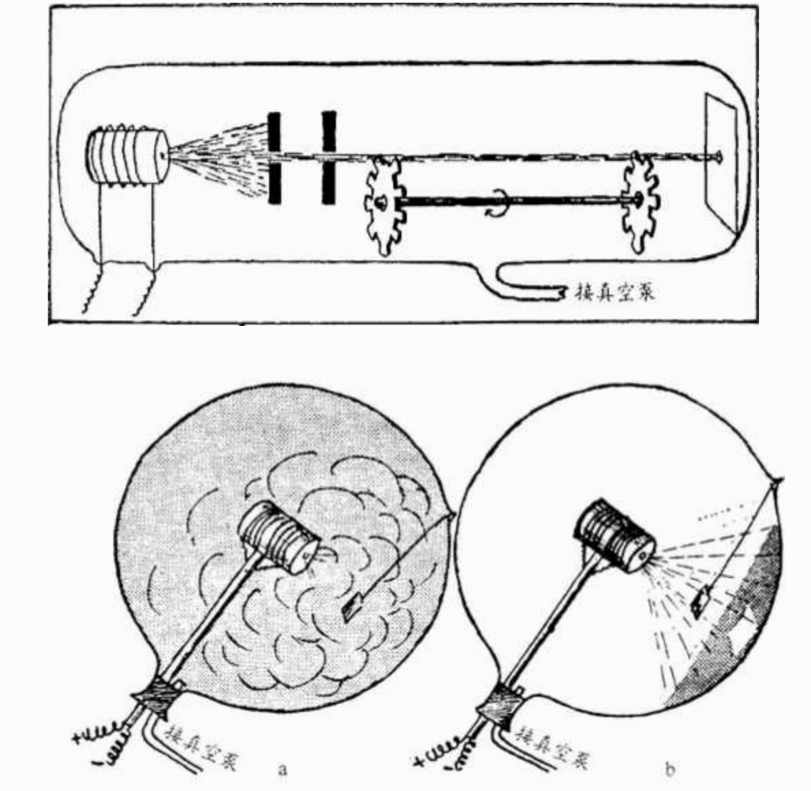
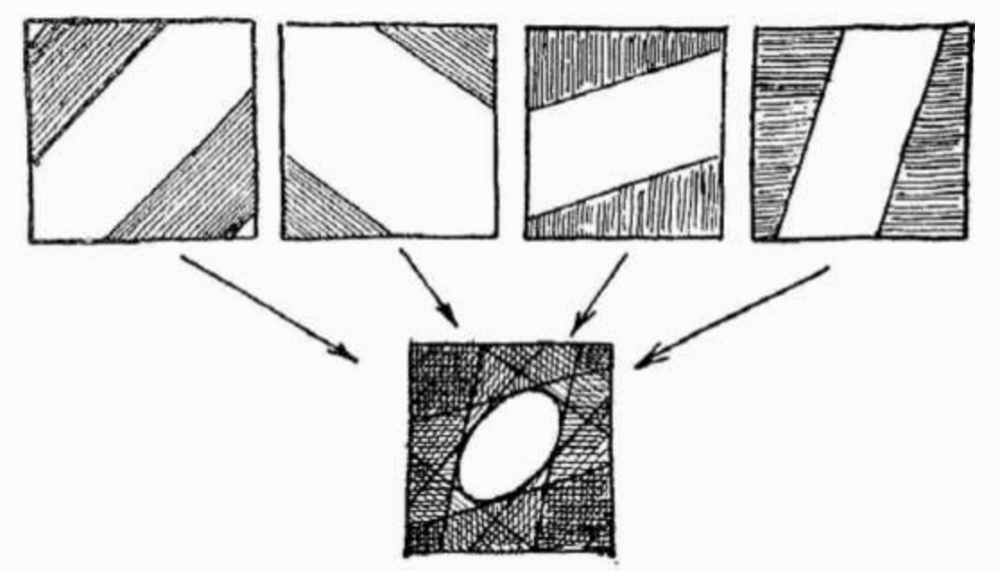

第三部分 微观世界

# 0601. 下降的阶梯

## 6.1 古希腊人的观念

人们在分析各种物体的性质时，总是先从「不大不小」的熟悉物体入手，然后一步步进入其内部结构，以寻求人眼所看不到的物质性质的最终源泉。现在，就让我们来分析一下端到餐桌上来的蛤蝌杂烩。这倒不是由于这道菜味道鲜美、营养丰富，而是由于它可以做为混合物的一个恰当的例子。用肉眼就可以看出，它是由好多种不同成分混杂在一起的：蛤喇片，洋葱瓣，番茄块，芹菜段，土豆丁，胡椒粒，肥肉末，还有盐和水，一古脑儿搅在一起。

日常生活中我们所见到的大部分物质，特别是有机物，一般都是混合物，尽管往往要用显微镜才能确认。比如，用低倍放大镜就能看出，牛奶是由均匀的白色液体和悬浮在其中的小滴奶油所组成的乳状液。

在显微镜下可以看到，土壤是一种精细的混合物，其中含有石灰石、黏土、石英、铁的氧化物、其他矿物质、盐类以及各种动植物体腐烂而成的有机物质，如果把一块普通的花岗岩表面打磨光，就立即可以看出，这块石头是由三种不同物质（石英、长石和云母）的小晶粒牢固结合在一起组成的。

在我们对物质的细微结构进行研究的这座下降的阶梯上，混合物只是第一位，或者说是楼梯口。紧接着，我们可以对混合物中每一种纯净物质的成分进行研究。

对于真正的纯净物质，如一段铜丝、一杯水或室内的空气+（悬浮的灰尘不算在内），用显微镜观察时看不出有任何不同组成的迹象，它们好像是完全一致的。的确，铜线等所有真正的固体（玻璃之类的非结晶体除外）在高倍放大下都显示出所谓微晶结构。在纯净物质中，我们看到的所有晶体都是同一种类型的一一铜丝中都是铜晶体，铝锅上都是铝晶体，食盐里只能看到氯化钠晶体。使用一种专门技术（慢结晶），我们可以把食盐、铜、铝或随便哪一种纯净物质的体积任意增大，而在这样得到的「单晶」中，每一小块都和其他部分一样均匀，正如水或玻璃一样。

*作者这里有一个疏忽。空气并不是纯净物质，而是氮气、氧气等多种气体的混合物。__译者

靠肉眼所见，或者凭借最好的显微镜所示，我们能否假设这些均匀的物质无论被放大多少倍都不变样呢？换句话说，能否相信一块铜、一粒盐、一滴水无论减成多么少，它们所具有的性质也不会改变呢？它们是否永远能分割为具有同样性质的更小部分？

第一个提出并试图解答这个问题的人，是约 2300 年前生活在雅典的希腊哲学家德谟克利特（Democritus)。他的答案是否定的。他更倾向于认为，任何一种东西，不管看起来多么均勻，总是由大量（究竟大到什么程度，他可不晓得）很小的（到底小到什么程度，他也不清楚）粒子组成的。他把这种粒子叫做「原子」，意思就是「不可分割者」。各种物质中原子的数目不同，但各种物质性质的不同只是表观的，而不是实在的。火的原子和水的原子是一样的，只是表现不同而已。所有的物质都是由同样的固定不变的原子所组成。

与德谟克利特同时代的人恩培多克勒（Empedocles）则持有不同的观点。他认为有若干种不同的原子，它们按不同比例渗杂起来，就构成了各种物质。

恩培多克勒基于当时处于萌芽阶段的化学知识，提出了四种原子，以对应当时被认为是最基本的四种物质：土，水，空气和火。

按照这套论点，土壤是由紧排在一起的土原子和水原子组成的；排列得越好，土质就越好。生长在土壤里的植物把土原子和水原子与太阳光中的火原子结合，形成木头的分子。当水逸去后，木头就成了干柴。燃烧干柴，就把木头分成原来的火原子和土原子。

火原子从火焰里跑掉，土原子留下来就是灰烬。

用这种说法来解释植物的生长和木头的燃烧，在科学处于婴儿阶段的时期，倒显得颇为合乎逻辑。不过，这种解释确实是错的。我们现在知道，植物生长所需要的大部分物质，并不像古代人或许多现代人如果没有人讲给他们听的话所认为的那样来自土壤，而是来自空气。土壤除作为支承物和保存植物所需水分的水库外，只提供一小部分供生长用的盐类。要想培养出一株大玉米，只要有顶针那么大的一块土壤就够了。

实际情况是这样的：空气是氮气和氧气的混合物（不像古人所想像的那样是一种简单的元素），另外还含有一定数量由氧原子和碳原子所组成的二氧化碳分子。在阳光的作用下，植物的绿叶吸收了大气中的二氧化碳；二氧化碳与根系提供的水分反应，生成各种物质，以构成植物本身。生成物中还有氧气，其中一部分氧气回到大气中，这就是「屋里养花草，空气变得好」的原因。

当木头燃烧时，木头分子再和空气中的氧结合，重新变成二氧化碳和水蒸气从火焰中散出。

至于「火原子」这种曾被古人认为能够进入植物的物质结构之中的东西，实际上并不存在。太阳光只提供能量，以破坏二氧化碳分子，形成供生成植物消化的气体养料。而且，既然火原子不存在，火焰也就显然不是火原子的「逸散」，而是一股炽热的气体物质，由于在燃烧过程中释放能量而变为可见之物。

我们再用一个例子说明对化学变化的看法在古代和现代的这种不同。你一定知道，各种金属是由不同的矿石在鼓风炉的高温中熔炼出来的。各种矿石粗看起来往往和普通石头差不多，因此，难怪古代科学家们认为矿石也和其他石头一样，是由同一种土原子组成的。

当把一块铁矿石放在烈火中时，就得到与普通石头完全不同的东西一种有光泽的坚硬物质，可用来制造好的刀子和矛头。他们对此所做的最简单的解释，是说金属是土与火结合而成的。换句话说，土原子与火原子结合成金属分子。

为了将这个概念应用于所有金属，他们解释说：不同性质的金属，如铁、铜、金，是由不同比例的土原子与火原子组成的。闪闪发光的黄金比暗黑的铁含有更多的火，这不是很明显的吗！

不过，如果真是这样的话。为什么不往铁里再加些火，或干脆不如往铜里加火，让它们变成贵重的黄金呢？中世纪那些讲求实际的炼金术士们想到了这一点，力图把贱金属变成「人造黄金」，结果，他们在烟气缭绕的炉火旁不知耗去了多少年华。

从他们的观点来看，他们所做的事情就和现代化学家在发明一种生产人造橡胶方法时所做的事情一样有道理。他们的理论与实践的虚妄之处，在于他们认为黄金和其他金属不是基本物质，而是合成物质。可是把话说回来，如果不通过尝试，又怎能知道哪种东西是基本的还是合成的呢？如果没有这些先驱化学家们进行化铁铜为金银的徒劳尝试，我们可能永远不会晓得金属是基本的化学物质，而含金属的矿石是金属原子和氧原子结合成的化合物（化学上如今称为金属氧化物）。

铁矿石在鼓风炉的呼呼火焰中变成了金属铁，这并不是古代炼金术士们所认为的不同原子（土原子和火原子）的结合，恰恰相反，这是不同原子分开（即从铁的氧化物分子中取走氧原子）的结果。铁器在潮湿空气中表面生成的锈，也并不是铁在分解过程中失去火原子后剩下来的土原子，而是铁原子与水或空气中的氧原子结合成铁的氧化物分子。

从上面的讨论，我们可以清楚地看出，古代科学家们关于物质的内部结构以及化学变化的本质的概念，基本上是正确的，他们的错误出在没能认准哪些东西是基本物质。事实上，恩培多克勒所列出的四种物质没有一种是基本的：空气是几种不同气体的混合物，水分子是由氢、氧两种原子组成的，土的组成很复杂，包含有许许多多不同的成分，最后，火原子根本就不存在。

实际情况是这样的：自然界中有 92 种不同的化学元素，也就是 92 种原子，而不是四种。其中如氧、碳、铁、硅（大部分岩石的主要成分）等元素大量地在地球上存在，并为人们所熟悉；另一些则很稀少，如镨、镝、镧之类，你可能从来还没有听说过哩。

除这些天然元素之外，现代科学还人工制成了一些全新的化学元素，我们在本书后面还要谈到它们。其中有一种叫做钚，它注定了要在原子能的释放上起重要作用（不管是用于战争或和平利用）。这 92 种基本原子以不同比例相结合，就组成了无穷无尽的各种复杂的化学物质，例如黄油和奶油，骨头和木头，食油和石油，草药和炸药，等等，等等。有一些化合物名字又长又难念，恐怕很多人连听也没有听说过，但化学家们则必须熟知它们。目前，有关原子间无穷尽的组合情况、化合物的制备方法及性质的化学手册，正在一卷接一卷地问世呢。

## 02. 原子有多大？

德谟克利特和恩培多克勒在讲到原子的存在时，已经模模糊糊地意识到，从哲学观点来看，物质是不可能无限制地分割下去的。它们早晚总要达到一个不能再分的基本单元。

现代的化学家在提到原子时，就要明确得多了。因为要理解化学的基本定律，就绝对需要了解有关基本的原子和它们在复杂分子中组合的性质。按照化学的基本定律。不同的元素只按严格的质量比例结合，这个比例显然就反映了这些元素的原子间的质量关系。

因此，化学家们得出结论说，氧原子、铝原子、铁原子的质量分别为氢原子质量的 16 倍、27 倍和 56 倍。但是，原子的真正质量是多少克，人们并不清楚。不过，各种原子的相对原子质量（即原子量）是化学中最基本的数据，而真正的质量有多少克这一点，倒根本不会影响到化学定律和化学方法的内容和应用，因此在化学上是无足轻重的。

*在本章后面可以看到，火原子的概念在光量子理论中得到了部分的恢复。

*2001 年国际原子量表中公布的人类已探明的元素数量达 115 种，其中自然元素 94 种，人造元素 21 种。

然而，物理学家在研究原子时，他首先就要问：原子的真实大小有多少厘米？它重多少克？在一定量的物质中含有多少分子或原子？有没有什么办法来观察、计数和操纵单个分子和原子？

估算原子和分子的大小的方法有许多种，最简单的一种非常容易进行，如果德谟克利特和恩培多克勒当时想到这个方法，也能把它付诸实现，根本用不着现代化的实验仪器。既然一种物质，譬如铜。它的最小组成单位是原子，那就显然不能把它弄得比一个原子的直径还薄。因此，我们可以试着把铜拉长，直到它成为一根由单个原子组成的长链；或者把它锻扁，成为只有一层原子的铜箔。

不过，用这样的办法加工铜或其他固体简直是无法实现的，它们一定会在中途断裂。但把液体，如水面上的一层薄油膜，展成一张单原子「地毯」却是很容易的。在这种情况下，分子「个体」和「个体」之间只在水平方向相连，而不能在竖直方向相叠。读者们只要耐心加小心，自己就能够做这项实验，测出几个简单的数据，求出油分子的大小来。

取一个浅而长的容器（图43），把它完全水平地放在桌子上或地板上。往里加水直到边缘；容器上横搭一根金属线，让它和水面相接触。若向金属线的任意一侧加入一小滴某种纯油，油就会布满金属线那一侧的整个水面。现在沿容器边缘向另一侧移动金属线，油层就会随线的移动而越散越薄，直到变成厚度等于单个油分子直径的一层。在这以后，如果再移动金属线，这层完整的油膜就会破裂，露出底下的水来。已知滴入的油量，再得出油膜不至破裂的最大面积，单个油分子的直径就很容易算出来了。

图43 水面上的薄油膜在伸展到一定程度后就会裂开

做这项实验时，你会注意到另外一个有趣的现象。当把油滴在水面上的时候，你首先会看到油面上的虹彩。你大概很熟悉这种虹彩，因为在港口附近的水面上经常可见到它。这是光线在油层上下两个界面上的反射光互相干涉的结果；不同的颜色是由于油层在扩散过程中各处厚度不均匀所造成的。如果你多等一会儿，让油层铺勻，整个油面就只有一种颜色了。随着油层的变薄，颜色逐渐由红变黄，由黄到绿，由绿转蓝，再由蓝至紫，与光线波长的减小相一致。再伸展下去，油面的颜色就完全消失了。

这不是因为油层不存在，而是油层的厚度已比可见光中最短的波长还要小，它的颜色已超出我们的视阈。不过，油面和水面还是能够分清的，因为从这层极薄液体的上下表面所反射的光互相干涉的结果，光的强度会减小，所以，即便色彩消失了，油面还是因为显得较为「昏暗」，可以与水面区分开来。

实际进行一下这项实验，你将发现，1 立方毫米的油可以覆盖大约 1 平方米的水面：再把油膜进一步拉开，就要露出水面了。

那么，油膜在破裂前能有多大的厚度呢？设想有一个边长 1 毫米的立方体，里面装上油（1 立方毫米），那么油面有 1 平方毫米。为了把 1 立方毫米的油摊开在 1 平方米的面积上，原来 1 平方毫米的油面必须扩大 100 万倍（从 1 平方毫米到 1 平方米）。因此，原立方体的髙度也须减少 100 万倍，以保持体积不变。这就是油膜厚度的极限，即油分子的真实大小。这个数值为 1nm。由于一个油分子中包含有若干个原子，所以原子还要小一些。

## 03. 分子束

还有一个能演示物质具有分子结构的有趣方法。这个方法可以在研究气体或蒸汽通过小孔涌向四周真空时实现。

拿一个陶土制的小圆筒，一端钻有一个小洞，外侧绕上电阻丝，这就做成了一个小电炉。现在，把这个电炉放进一个高真空的大玻璃泡里。如果在圆筒里放入一些低熔点金属。如钠或钾，那里面就会充满金属蒸气；它们会从小洞钻出来。一旦撞到冷的玻璃壁上，就会附着在上面。观察玻璃壁上各处所形成的镜子一样的金属薄膜的情况，就可以清楚地看出物质从电炉里跑出来以后的运动状况。

再进一步研究，我们还会看到，在炉温不同的情况下，泡壁上金属膜的样子也不同。当炉温很高时，内部的金属蒸气密度很大，所见到的现象很像通常所见到的从蒸汽机或茶壶里逸出的水蒸气，这时从小洞里出来的金属蒸气向各个方向扩散（图44a），充满了整个玻璃泡，并基本上均匀地沉积在整个内壁上。

但在温度较低时，炉内的蒸气密度也较低，这时，现象就完全两样了。从小洞里逸出的物质不再向四面八方扩散，绝大部分都沉积在对着电炉开口的玻璃壁上，好像它们是沿着直线前进的。如果在开口的前面放一个小物体（图44b)，现象就更加明显了；物体后面的玻璃壁上不会形成沉积，这块空白的轮廓会和障碍物形状完全一样。

如果我们认识到，金属蒸气就是在空间各个方向上互相冲撞着的大量分离的分子，那么，蒸气密度大小不同时所发生的差异就很好理解了。

当密度大时，从小开口冲出的气流就像从失火剧场的门内挤出来的一股疯狂的人流，它们在门口外的大街上四散跑开时还在互相冲撞着；另一方面，密度小时的气流相当于从门里一次只出来一个人的情况。因此，它们能够走直路，而不会互相妨碍。

这种从炉内小口排出的低密度物质流称为「分子束」，是由大量紧挨在一起共同飞越空间的独立原子组成的。这种分子束对研究单个分子的性质非常有用。例如，它可用来测量热运动的速度。

研究这种分子束速度的装置是美国物理学家斯特恩（OttoStern）最先发明的，它简直和斐佐测定光速的仪器一样（见图31)。它包括同轴的两个齿轮，只有以某种速度旋转时才能让分子束通过（图45)。

斯特恩用一片隔板来接受一束很细的分子束，从而得知分子运动的速度一般都是很大的（钠原子在 200℃ 时为每秒 1.5 公里），并随气体温度的升高而加大，这就直接证明了热的动理说。按照这种理论，物体热量的增加正好就是物体分子无规运动的加剧。

图45 

## 04. 原子摄影术

上面这个例子几乎不容置疑地证实了原子假说的正确性。不过，到底是「眼见为实」才好。因此，最确凿的证据莫过于用眼睛看到分子和原子这些小单位了。这已由英国物理学家布拉格（WilliamLawrenceBragg）在不久前用他所发展的晶体内分子和原子摄像法实现了。

不要以为给原子拍照是件容易的事，因为在给这么小的物体照相时，如果所用的照明光线的波长比被拍摄物体的尺寸大，照片就会模糊得一塌糊涂。你总不能用刷墙的排笔来画工笔画吧！

和微小的显微组织打过交道的生物学家都很明白这种困难，因为细菌的大小（约0.0001厘米）和可见光的波长相仿。如果要使细菌呈现出清晰的像，就得用紫外线给细菌摄影，才能获得较好的结果。但是分子的尺寸及其在晶格中的间隔是如此之小（0.00000001厘米），无论是可见光还是紫外线都无法充当画具。如果想要看到单个原子，非用波长比可见光短几千倍的射线——X光一一不可。

但这么一来，又会遇到一个似乎无法克服的困难：X 光可以穿透物体而不发生折射，因此，无论是放大镜还是显微镜，都不会使 X 光聚焦。这种性质再加上 X 光的强大穿透力，在医学上当然是很有用的，因为 X 光如果在穿透人体时发生折射，就会把 X 光底片弄成一片模糊。但就是这个性质，似乎又排除了得到任何一张放大的 X 光照片的可能性！

乍一看，似乎形势甚为无望。可是布拉格想出了一个解决困难的巧妙办法。这个办法是建立在阿贝*所提出的显微镜的数学理论上的。阿贝认为，显微镜所成的像可以看作是大量单独图样的叠加，而这每一个单独图样又是一幅在视场内成一定角度的平行暗带。从图 46 所给出的一个简单例子可以看出，一个位于黑暗背景中央的明亮椭圆可以由四个单独的暗带图样叠加而成。

按照阿贝的理论，显微镜的聚焦过程可以分为三个步骤：

① 把原图像分解成大量的单独暗带图样；

② 把每一个图样分别放大；

③ 把得到的图样叠加在一起，以获得放大了的图像。

这个过程与用几块单色板印制彩色图片的方法很有些类似。单独看每一块单色板时，可能看不出上面究竟是些什么东西，但如果正确地叠印出来，整幅画面就呈现出来了，既清楚，又明确。

能够自动完成上述三个步骤的 X 光透镜是没有的，这就使我们不得不分步来进行：先从各个不同角度对晶体拍摄大量单独的 X 光暗带图样，然后再正确地叠印在同一张感光片上。这就和有 X 光透镜是一样的；只不过用透镜只须一瞬间就能做到的，现在却得由一位熟练的实验人员忙上若干小时。正因为如此，布拉格的方法只能用来拍摄晶体的照片，不能拍摄液体和气体的照片。因为晶体的分子总是呆在原地，而液体和气体的分子却在不停地狂乱奔腾。

图 46

应用布拉格的方法，虽然不能「咔嚓」一下就得到照片，但合成的照片却也同样完美。这就好像在由于技术原因而不能在一由六个碳原子构成的碳环，以及与它们连接的另外六个碳原子都在照片上清楚地显现出来了。较轻的氢原子感光微弱，几乎看不出来。

哪怕是最最多疑的人，在亲眼看到这样的照片以后，也该会同意分子和原子确确实实是存在的了吧！

*阿贝（1840-1905年），德国科学家。——译者