# 0701. 现代炼金术

## 01. 基本粒子

我们已经知道，各种化学元素的原子有相当复杂的力学系统， 原子由一个中心核及许多绕核旋转的电子组成。那么，我们当然 还要问下去：这些原子核究竞是物质结构的最基本的单位呢，还 是可以继续分割成更小、更简单的部分呢？能不能把这92种不同 的原子减少为几种真正简单的微粒呢？

早在上一世纪中叶，就有一位英国化学家波路特（William Prout)出自进行简化的愿望，提出不同元素的原子本质上相同， 它们都是以不同程度*集中"起来的氢原子这个假设。他的根据 是：用化学方法所确定的各元素的原子量，几乎都是氢元素原子 量的整倍数。因此波路特认为，既然氧原子比氢原子重16倍，那 它一定是聚集在一起的16个氢原子；原子量为127的碘原子一定 是127个氢原子的组合，等等。

但在当时，化学上的发现并不支持这个大胆的假设。对原子 量进行的精确测量表明，大多数元素的原子量只是接近于整数， 有一些则根本不接近。（例如，氯的原子量为35.5。）这些看起来同 波路特的假设直接相矛盾的事实当时把它否定了。因此，直到他 去世，他也不知道自己是何等正确。

直到1919年，这个假设才又靠英国物理学家阿斯顿（Aston) 的发现而重见天日。阿斯顿指出，普通的氯是由两种氯元素掺杂 在一起的，它们的化学性质完全相同，只是原子量不同，一种为 35, —种为37。化学家所测定的非整数原子量35.5只是它们掺杂

在一起后的平均值t

对各种化学元素的进一步研究揭示了一个令人霞惊的事实： 大部分元素都是由化学性质完全相同、而重量不同的若干成分组 成的混和物。于是，人们给它们起了个名字，叫做同位素，意思是 在元素周期表中占据同一位置的元素。事实证明，各种同位素的 质量总是氢原子质量的整倍数，这就赋与波路特那被遗忘了的假 设以新的生命。我们在前面看到过，原子的质量主要集中在原子 核上，因此，波路特的假设就能用现代语言改写成：不同种类的原 子核是由不同数量的氢原子核组成的。氢核因在物质结构中起重 要的作用而得到一个专名——「质子'

不过，对上面的叙述还应该作一项重要的修改。以氧原子为例， 它在元素的排列中居第八位，它的原子有8个电子，它的原子核也 应带8个正电荷。但是，氧原子的重量是氢原子的16倍。因此， 如果我们假设氧原子核由8个质子组成，那么，电荷数是对的，但 质量不符（均为8);如果假设它有16个质子，那质量是对了，但 电荷数错了（均为16)。

显然，要摆脱这个困难，只有假设在这些复杂的原子核的质 子中，有一些失去了原有的正电荷，成了中性的粒子。

关于这种我们现在称之为「中子」的无电荷质子，卢瑟福早 在1920年就提到过它的存在，不过到十二年后它才由实验所证实。 这里需要注意，不要把质子和中子看成两种截然不同的粒子，而 要把它们当作处在两种不同带电状态下的同一种粒子一一 「核 子」。事实上，我们已经知道，质子可以失去正电荷而转化成中 子，中子也能获得正电荷而转化成质子。

把中子引进原子核里，刚才提到的困难就得到了解决。为了 解释氧原子核重16个单位，但只有8个电荷单位这一事实，可假

:®_较重氣元素的成分占25%,较轻的占75_%。_平均原子量为 0.25X37 + 0.75X35 = 35.5。

这正是早期化学家所发现的数值。

设它由8个质子和8个中子组成。重量为127单位的碘，它的原子 序数为53,所以就应有53个质子，74个中子。重元素铀（原子量 为238,原子序数为92)的原子核里有92个质子，146个中子零', 这样，波路特的大胆假说在提出后历经一个世纪才得到了应 得的光荣确认。现在，我们可以说，无穷无尽的各种物质都不过是 两类基本物质的不同结合罢了。这两类物质是：①核子，它是物质 的基本粒子，既可带有一个正电荷，也可不带电；②电子，带负电 的自由电荷（图57)。

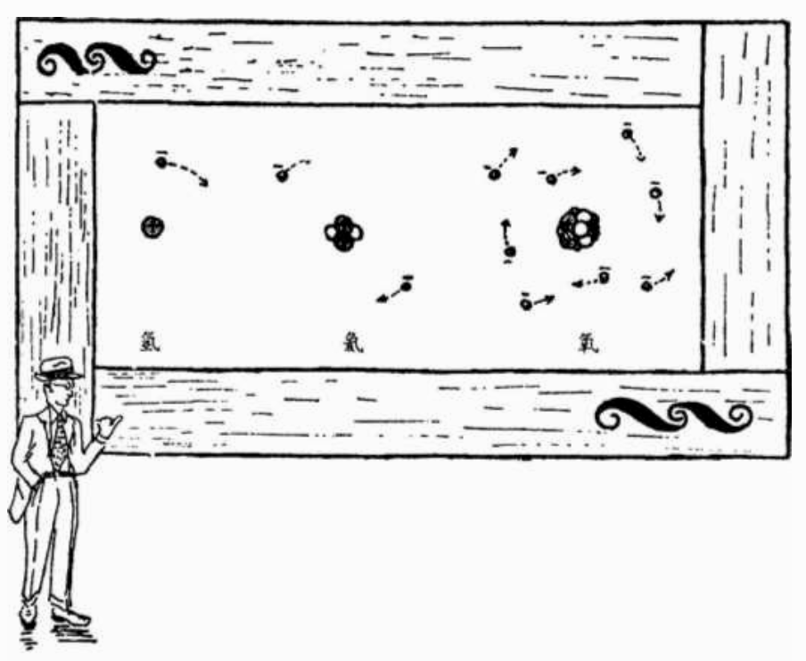

图 57

下面有几张引自《万物炮制大全》的配方。我们可以从中看 到，在宇宙这间大厨房里，每一道菜是如何用核子和电子烹调出 来的。

水把8个中性核子和8个带电核子聚在一起当作核心，外面

：®看一下原子量表，就会发现，周期表前一部分的元素，其原子量为原子序数的两 倍，也就是说，这些元素的原子核内有等量的质子和中子；在重元素中，原子量增加得更 为迅速，这表明在这些元素的原子核内，中子数多于质子数。

再加上8个电子，这就是氧原子。用这样的方法制备一大批氧原 子。把一个带电核子搭配上一个电子，这就是氢原子。照氧原子数 目的两倍做出氢原子来。按2:1的比例将氢原子和氧原子组合成水 分子，把它们置于杯内，保持冷却状态。这就是水。

食盐以12个中性核子和11个带电核子为中心，外加11个 电子，这就是钠原子。以18个或20个中性核子和17个带电核子 为中心，都外加17个电子，这就是氯原子的两种同位素。照这样 的方法制备同等数目的钠、氯原子后，按照国际象棋盘那样的格 式在立体空间中摆开。这就是食盐的正规晶体。

TNT*由6个中性核子和6个带电核子组成核，外添6个电 子做成碳原子。由7个中性核子和7个带电核子组成核，外添7个 电子做成氮原子。再按照水的配方制备氧原子和氢原子。把6个碳 原子连成一个环，环外再接上第7个。在碳环的3个原子中，每个 各连上一个氮原子，而每个氮原子再接上一对氧原子。给那个碳 环外的第7个碳原子加上3个氢原子；碳环中剩下的两个碳原子也 各连上一个氢原子。把这样组成的分子有规则地排列起来，成为 小粒晶体。再把晶粒压在一起。不过要小心操作，因为这种结构不 稳定，有极大的爆炸性。

尽管我们已经看到，中子、质子和带负电的电子构成了我们 所想得到的一切物质的必要组成材料，但是这份基本粒子名单还 显得不那么完全。事实上，如果有带负电的自由电子，为什么不能 有带正电的自由电子，即正电子呢？

同样，如果作为物质基本成分的中子可以获得正电荷而成为 质子，难道它就不能获得负电荷而变成负质子吗？

回答是：正电子确实存在，它除了带电符号与一般带负电的 电子相反外，各方面都与负电子一样。负质子也有可能存在，不过 尚未被实验所证实

*学名三硝基甲苯，俗称黄色火药，也音译成「梯思梯」。__译者

*负质子的存在已于1956年由实验证实。一一译者

正电子和负质子在我们这个世界上的数量不如负电子和正质 子多的原因，在于这两类粒子是互相「敌对」的。大家知道，一 正一负的两个电荷碰到一起会自相抵消。两类电子就是正与负两 种电荷。因此，不能指望它们会存在于空间的同一处。事实上，如 果正电子与负电子相遇，它们的电荷立即互相抵消，两个电子也 不成其为独立粒子了。此时，两个电子一起灭亡一一这在物理学 上称作「湮没」 一一并在电子相遇点导致强烈电磁辐射（7射线） 的产生，辐射的能量与原电子的能量相等。按照物理学的基本定 律，能量既不能创造，又不能消灭，我们这里遇到的现象，只不过 是自由电荷的静电能变成了辐射波的电动能。这种正负电子相遇 的现象被玻恩（Max Born)描述为「狂热的婚姻而较为悲 观的布朗（T.B. Brown)则称之为「双双自杀一。图58a表示了 这种相遇的情况。

两个符号相反的电子的「湮没」过程有它的逆过程一一 「电 子对的产生」，这就是一个正电子和一个负电子由强烈的y射线产 生。我们说「由」，是因为这一对电子是靠消耗了y射线的能量而产 生的。事实上，为形成一对电子所消耗的辐射能量，正好等于一个 电子对在湮没过程中释放出的能最。电子对的产生是在入射辐射 从原子核近旁经过时发生的图58b表示了这个过程。我们早就 知道，硬橡胶棒和毛皮摩擦时两种物体各自带上相反的电荷，这 也是一个说明两种相反的电荷可以从根本没有电荷之处产生的例 子。不过，这也没有什么值得大惊小怪的。如果我们有足够多的能 量，我们就能随意制造出电子来。不过要明白一点，由于湮没现象, 它们很快又会消失，同时把原来耗掉的能量如数交回。

有一个有趣的产生电子对的例子，叫做「宇宙线簇射」，它是

①参阅 M. Born, Atomic physics ( G. E. Stechers & Co., New York, 1935〉。

②参阅 T. B. Brown, Moderm Physics (John wiley & Sons, New York, 1940)®

③看来，电子对的产生得到了原子核周围电场的‘帮助。不过从原则上来讲，电子对的 形成也可以在完全空虚无物的空间内产生。

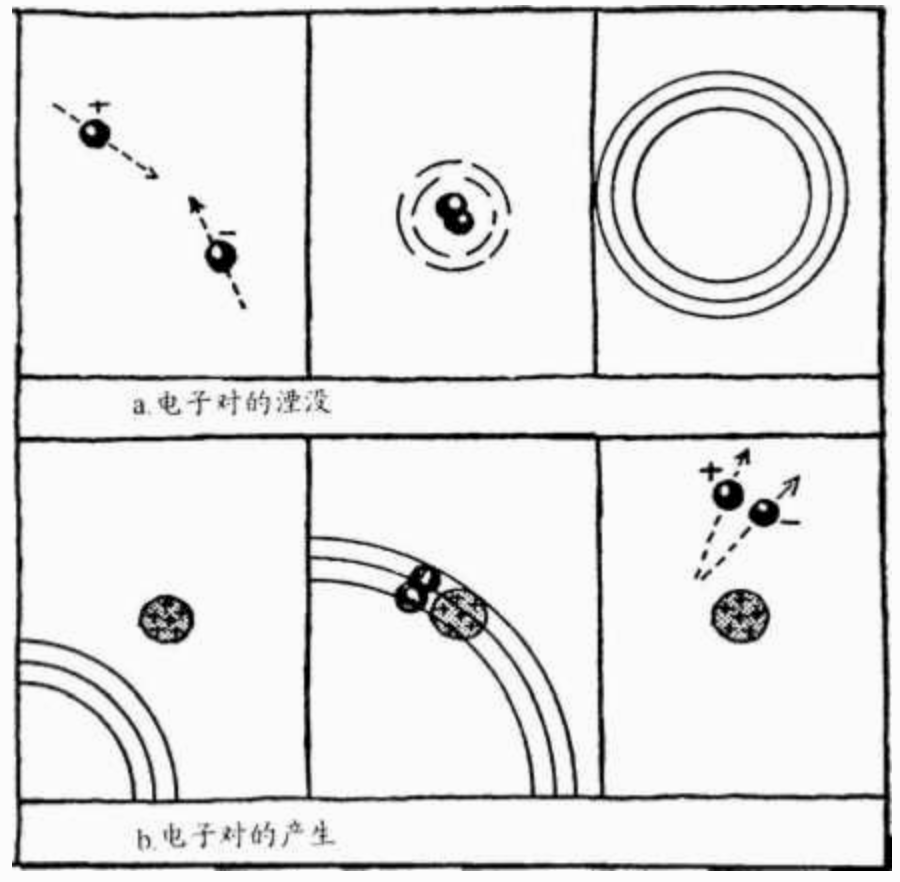

图58

两个电子「湮没」而产生电磁波的过程，以及 电磁波经过原子核附近时「产生」 一对电子的过程简图

从星际空间射到大气层来的高能粒子所引发的。这种在宇宙的广 袤空间里向四面八方飞窜的粒子流究竟从何而来，至今仍然是科 学上的一个未解之谜I不过我们已经弄清当电子以极惊人的速度 轰击大气层上层时发生了些什么。这种髙速的原初电子在大气层 原子的原子核附近穿过时，原有能量逐渐减小，变成7射线放出（图 59)。这种辐射导致大量电子对的产生。新生的正、负电子也同原 初电子一道前进。这些次级电子的能量也相当高，也会辐射出y 射线，从而产生数量更多的新电子对。这个连续的倍增过程在大 气层中重复发生，所以，当原初电子最终抵达海平面时，是由一群 正负各半的电子陪伴着的。不消说，这种高速电子在穿进其

这种高能粒子的速度达到光速的99.99 999 999 999 99%»对它的来源只能进行 最模糊的（不过倒也是显得最可信的）猜测，即认为它可能是由宇宙间巨大的气体尘埃 云（星云）的极高电势加速产生的。不妨设想星云积累电荷的过程类似于地球大气层中 雷电云积存电荷的过程，不过前者的电势差要大得多。

图59宇宙射线族射的起因

他大物体时也会发生簇射，不过由于物体的密度较高，相应的分 支过程要迅速得多（见后面图版）。

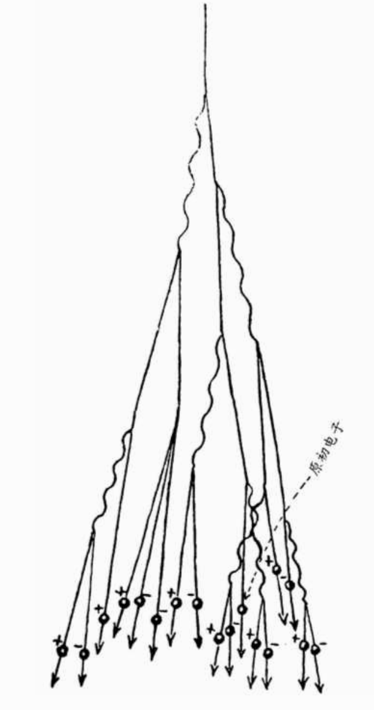

现在让我们来谈谈负质子可能存在的问题。可以设想，这种 粒子是中子获得一个负电荷或者失去一个正电荷（两者的意思是 一样的）而变成的。不难理解。这种负质子也和正电子一样，是 不会在我们这个物质世界中长久存在的。事实上，它们将立即被 附近的带正电原子核所吸引和吸收，大概还会转化为中子。因此， 即使这种负质子确实作为基本粒子的对称粒子而存在，它也是不容易被发现的。要知道，正电子的发现是在普通负电子的概念进 入科学后又过了将近半个世纪才发生的事呢！如果确实有负质子 存在，我们就可以设想存在着所谓反原子和反分子。它们的原子 核由中子（和一般物质中的一样）和负质子组成，外面围绕着正 电子。这些「反原子」的性质和普通原子的性质完全相同，所以 你根本看不出水与「反水」、奶油与「反奶油」等东西有什么不 同一一除非把普通物质和「反物质」凑到一起。如果这两种相反 的物质相遇，两种相反的电子就会立即发生湮没，两种相反的质 子也会立即中和，这两种物质就会以超过原子弹的程度猛烈爆炸。 因此，如果果真的存在着由反物质构成的星系，那么，从我们这个星 系扔去一块普通的石头，或者从那里飞来一块石头，在它们着陆时 都会立即成为一颗原子弹。

有关反原子的奇想，到这里就算告一段落吧。现在我们来考 虑另一类基本粒子。这种粒子也是颇不寻常的，而且在各类可进 行观测的物理过程中都有它的份。它叫做「中微子」，是「走后 门」进入物理学领域的；尽管各个方面都有人大喊大叫地反对它， 它却在基本粒子家族中占据了一把牢固的交椅，它是如何被发现 的，以及它是怎样被认识的，这是现代科学中最为令人振奋的故 事之一^

中微子的存在是用数学家所谓「反证法」发现的。这个令人 振奋的发现不是始于人们觉察到多了什么东西，而是由于人们发 现少了某种东西。究竟少了什么呢？答案是：少了一些能量。按照 物理学最古老而最稳固的定律，能量既不能创造，也不能消灭。那 么，如果本应存在的能量找不到了，这就表明，一定有个小偷或一 群小偷把能量拐跑了。于是，一伙热衷于秩序、喜欢起名字的科学 侦探就给这些偷能贼起了个名字，叫做「中微子」，尽管他们还没 有看到它们的影子哩！

这个故事叙述得有点太快了。现在还是回到这桩大「窃能案」 上来。我们已经知道，每个原子的原子核约有一半核子带正电

(质子)，其余呈中性（中子）。如果给原子核增添一个或数个中子 和质子义从而改变质子和中子间相对的数量平衡，就会发生电荷 的调整。如果中子过多，就会有一些中子释放出负电子而变为质 子；如果质子过多，就会有一些质子射出正电子而变为中子。这两

图60负y?衰变和正y?衰变的示意图。为清 楚起见，所有的核子都画在一个平而上

个过程表示在图60中。这种原子核内的电荷调整叫做衰变，放 出的电子叫做粒子。由于核子的转变是个确定的过程，就一定会 释放出定量的能量，并由电子带出来。因此，我们预料，从同一物 质放射出来的P粒子，都应该有相同的速度。然而，观测表明，P 衰变的情况与这种预测直接相矛盾。事实上，我们发现释放出来 的电子具有从零到某一上限的不同动能。既没有发现其他粒子， 也没有其他辐射可以使能量达到平衡。这样一来，衰变中的「窃 能案」可就严重了。曾经有人竟一度认为，我们面临着著名的能 量守恒定律不再成立的第一个实验证据，这对于整套物理理论的 精巧建筑真是极大的灾难。不过，还有一种可能：也许丢失的能量

m这可用轰击原子核的方法做到，本章后面将讲述这种方法。

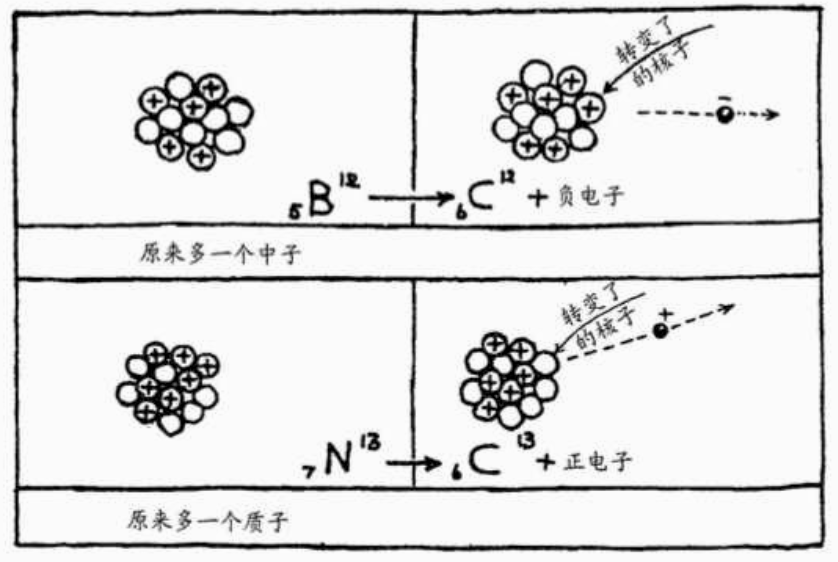

是被某种我们的观测方法无法察觉的新粒子带走的。泡利（Wolf­gang Pauli) 提出一种理论。他假设这种偷窃能量的「巴格达窃贼」 是不带电荷、质量不大于电子质量的微粒，叫做中微子。事实上， 根据已知的髙速粒子与物质相互作用的事实，我们可以断定，这 种不带电的轻粒子不能为现有的一切物理仪器所察觉，它可以不 费吹灰之力地在任何物质中穿过极远的距离。对于可见光来说， 只消薄薄一层金属膜即可把它完全挡住；穿透力很强的X光和y 射线在穿过几英寸厚的铅块后，强度也会显著减低；而一束中微 子可以悠哉游哉地穿过几光年厚的铅！无怪乎用任何方法也观测 不出中微子，只能靠它们所造成的能量赤字来发现它们！

中微子一旦离开原子核，就再也无法捕捉到它了。可是，我们 有办法间接地观测到它离开原子核时所引起的效应。当你用步枪 射击时，枪身会向后坐而顶撞你的肩膀；大炮在发射重型炮弹时， 炮身也会向后坐。力学上的这种反冲效应也应该在原子核发射高 速粒子时发生。事实上，我们确实发现，原子核在衰变时，会在 与电子运动相反的方向上获得一定的速度。但是事实证明。它有 一个特点：无论电子射出的速度是髙是低，原子核的反冲速度总 是一样（图61)。这可就有点奇怪了，因为我们本来认为，一个快 速的抛射体所产生的反冲会比慢速抛射体强烈。这个谜的解答在 于，原子核在射出电子时，总是陪送一个中微子，以保持应有的能 量平衡。如果电子速度大、带的能量多，中微子的速度就慢一些、 能量小一些，反之亦然。这样，原子核就会在两个微粒的共同作用 下，保持较大的反冲。如果这个效应还不足以证明中微子的存在， 恐怕就没有什么能够证明它啦！

现在，让我们把前面讲过的内容总结一下，提出一个物质结 构的基本粒子表，并指出它们之间的关系。

首先要列入的是物质的基本粒子一一核子。目前所知道的核子 或者是中性的，或者是带正电的；但也可能有带负电的核子存在。

其次是电子。它们是自由电荷，或带正电，或带负电。

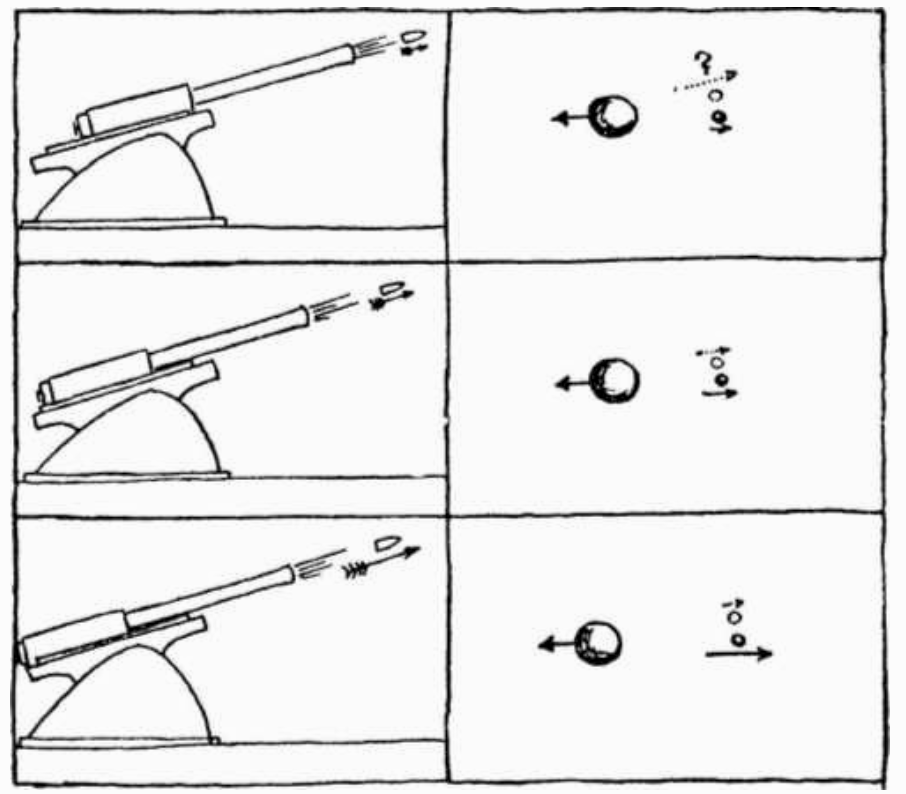

图61大炮和核物理的反冲问题

还有神秘的中微子。它不带电荷，大概是比电子轻得多的。

最后还有电磁波。它们在空间中传播电磁力。

物理世界的所有这些基本成分是互相依赖，并以各种方式结 合的。中子可变成质子并发射出负电子和中微子（中子^质子 +负电子+中微子）；质子又可发射出正电子和中微子而回复为中 子（质子一">中子+正电子+中微子）。符号相反的两个电子可转 变为电磁辐射（正电子+负电子►辐射），也可反过来由辐射产 生（辐射一~►正电子+负电子）。最后，中微子可以与电子相结 合，成为不稳定的粒子，在宇宙射线中出现。这种微粒称做介子 (中微子+正电子一"》正介子：中微子+负电子一"^负介子；中微 子+正电子+负电子►中性介子）。也有人把介子称为「重电 子」，但这种叫法不太恰当。

结合在一起的中微子和电子带有大量的内能，因此，结合体的 质量比这两种粒子各自的质量之和大100倍左右。

图62是组成宇宙中各种物质的基本粒子的概图。

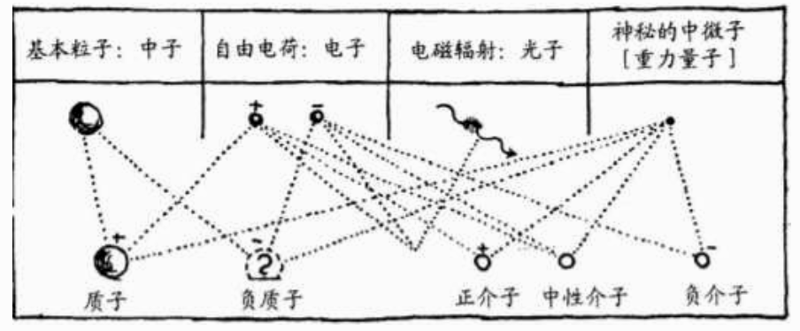

图62现代物理学中的基本粒子及其各种组合

大家可能会问：「这一回到头了吗？ 」 「凭什么认为核子、电子 和中微子真是基本粒子，不能再分成更小的微粒子呢？只不过在 半个世纪以前，人们不还是认为原子是不可分的吗？而今天的原 子表现出多么复杂的结构啊！」对这个问题，我们得这样回答：现 在确实无法预测物质结构科学的发展前景，不过我们有比较充足 的理由可以相信，这些粒子的确就是物质的不可再分的基本单位。 理由是：各种原来被认为不可分的原子表现出彼此不同的、极为 复杂的化学性质、光学性质和其他性质，而现代物理学中基本粒 子的性质是极为简单的，简单得可与几何点的性质相比。还有，同 古典物理中为数不少的「不可分原子」相比，我们现在只有三种 不同的实体：核子、电子和中微子。而且，无论我们如何希望、怎 么努力把万物还原为最简单的形式，总不能把万物化成一无所有 吧！所以看来我们对物质组成的探讨已经刨到根、摸到底了气

## 02. 原子的心脏

我们既然对构成物质的基本粒子的本性和性质已有全面的了解

©这是作者撰写本书时科学界的普遍看法。但是，在作者于1%8年去世以后，有越来 越多的实验证据表明，核子（中子和质子）并不是真正的基本粒子，而是由一种名叫夸克 的组成部分构成的合成物。夸克共有6种，人们按其性质的不同把它们命名为下夸克（d)、 上夸克（u)、奇夸克（s)、粲夸克（c)、底夸克（b)和顶夸克（t)。中子是由两个下夸 克和一个上夸克组成（u, d, d),质子则含有两个上夸克和一个下夸克（u, u, d)。因 此，请读者记住，现在核子巳不再被认为是基本粒子和基本物质，本书后文出现这种说法 时，就不再一一加注说明。一一校者

解，现在就可以再来仔细研究一下原子的心脏一一原子核。原子 的外层结构在某种程度上可比作一个缩小的行星系统，但原子核 本身却全然是另一种情景了。首先有一点是很清楚的：使原子核 本身保持为一个整体的力不可能是静电力，因为原子核内有一半 粒子（中子）不带电，另一半（质子）带正电，因而会互相排斥。 如果一群粒子间只存在斥力，怎么能存在稳定的粒子群呢！

因此，为了理解原子核的各个组成部分保持在一起的原因， 必须设想它们之间存在着另一种力，它是一种吸引力，既作用在 不带电的粒子之间，也作用在带电的粒子之间，与粒子本身的种 类无关。这种使它们聚集在一起的力通常被称为「内聚力」。这种 力在其他地方也能遇到，例如在一般液体中就存在内聚力，这种 力阻止各个分子向四面八方分散。

在原子核内部，各个核子间就存在这种内聚力。这样，原子核 本身非但不致在质子间静电斥力的作用下分裂开来，而且这许多 核子还能像罐头盒里的沙丁鱼一样紧紧挨在一起，相比之下，处 于原子核外各原子壳层上的电子却有足够的空间进行运动。本书 作者最先提出这样一种看法：可以认为原子核内物质的结构方式 是与普通液体相类似的。原于核也像一般液体一样有表面张力。 大家想必还记得，表面张力这一重要现象在液体中是这样产生的： 位于液体内部的粒子被相邻的粒子向各个方向以相等的力拉牵， 而位于表面的粒子只受到指向液体内部的拉力（图63)。

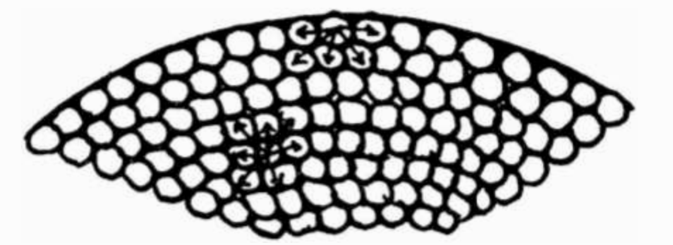

图63液体的表面张力的解释

这种张力使不受外力作用的一切液滴具有保持球形的倾向， 因为在体积相同的一切几何形体当中，球体的表面积最小。因此,

可以得出结论说，不同元素的原子核可以简单地看作由同一类 •核液体*组成的大小不同的液滴。不过可不要忘记，虽然定性地 说，这种核液体与一般液体很相像，但定量地说，两者却大不相 同，因为核液体的密度比水的密度大

240 000 000 000 000

倍，表面张力也比水大

1 000 000 000 000 000 000

倍。为了便于理解，可用下面的例子说明。如果有一个用金属丝弯 成的倒U字形框架，大小约二英寸见方，下边横搭一根直丝，如 图64画出的样子。现在给框内充入一层肥皂膜，这层膜的表面张 力会把横丝向上拉。在丝下悬一小重物，可以把这个张力平衡掉。 如果这层膜是普通的肥皂水，它在厚度为0.01毫米时自重1/4克， 能支持3/4克的重物。

假如我们有办法制成一层核液体薄膜，并把它张在这副框架上， 这层膜的重量就会有5千万吨（相当于1千艘海轮)，横丝上则能悬 挂1万亿吨的东西，这相当于火星的第二个卫星「火卫二」的重量！ 要在核液体里吹出这样一个泡来，得有多强壮的肺脏才行啊！

在把原子核看成小液滴时，一定不要忽略它们是带电的这一 要点，因为有一半核子是质子。因此，核内存在着相反的两种力： 一种是把各个核子约束在一起的表面张力，一种是核内各带电部 分间倾向于把原子核分成好几块的斥力。这就是原子核「不稳定」的 首要原因。如果表面张力占优势，原子核就不会自行分裂，而两个 这样的原子核在互相接触时，就会像普通的两滴液体那样具有聚 合在一起（聚变）的趋势。

与此相反，如果排斥的电力抢了上风，原子核就会有自行分 裂为两块或多块髙速飞离的碎块的趋势。这种分裂过程通常称为 「裂变」。

玻尔和威勒（John archibald wheeler)在1939年对不同元素 原子核的表面张力和静电斥力的平衡问题进行了精密的计算，他

图64

们得出一个极重要的结论：元素周期表中前一半元素（到银为止） 是表面张力占优势，而重元素则是斥力居上风。因此，所有比银重 的元素在原则上都是不稳定的，当受到来自外部的足够强烈的轰 击时，就会裂开为两块或多块，并释放出相当多的内部核能（图 65b)。与此相反，当总重量不超过银原子的两个轻原子核相接近

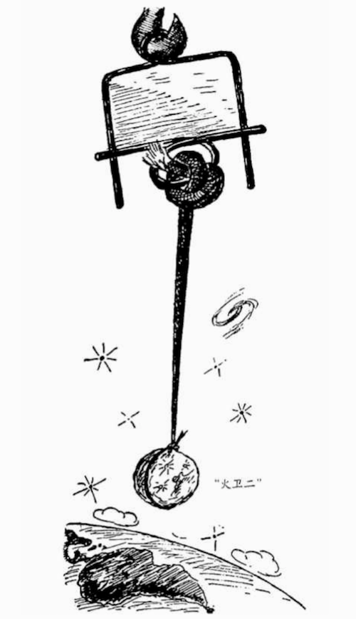

图65

时，就有自行发生聚变的希望（图65a)。

不过我们要记住，两个轻原子核的聚变也好，一个重原子核 的裂变也好，除非我们施加影响，一般是不会发生的。事实上，要 使轻原子核发生聚变，我们就得克服两个原子核之间的静电斥力， 才能使它们靠近；而要强令一个重原子核进行裂变，就必须强烈 地轰击它，使它进行大幅度的振动。

这一类必须有起始的激发才能导致某一物理过程的状态，在 科学上叫做亚稳态。立在悬崖顶上的岩石、一盒火柴、炸弹里的TNT 火药，都是物质处于亚稳态的例子。在这每一个例子中，都有大 量的能量在等待得到释放。但是不踢岩石，岩石不会滚下；不划或 不加热火柴，火柴不会燃着；不用雷管给TNT引爆，炸药不会爆炸。 在我们生活的这个世界上，除了银块®外都是潜在的核爆炸物质。

m应该记住，银的原子核是既不聚变也不裂变的。

但是，我们并没有被炸得粉身碎骨，就是因为核反应的发生是极端 困难的，说得更科学一点，是因为需要用极大的激发能才能使原 子核发生变化。

在核能的领域内：我们所处的地位（更确切地说，是不久前 所处的地位）很像这样一个爱斯基摩人。这个爱斯基摩人生活在 零摄氏度以下的环境中，接触到的唯一固体是冰，唯一液体是酒 精。这样，他不会知道火为何物，因为用两块冰进行摩擦是不能生 出火来的；他也只把酒精看成令人愉快的饮料，因为他无法把它 升温到燃点。

现在，当人类由最近的发明，得知原子内部蕴藏着极大的能 量可供释放时，他们的惊讶多么像这个不知火为何物的爱斯基摩 人第一次看到酒精灯时的心情啊！

一旦克服了使核反应开始进行的困难，所引起的一切麻烦就 都大大地得到补偿了。例如，数量相等的氧原子和碳原子按照

这个化学方程化合时,每1克混合好的氧和碳会放出920卡•热量。 如果把这种化学结合（分子的聚合，图66a)换成原子核的聚合 (图66b)，即

9

这时，每克混合物放出的能量达到14 000 000 000卡之多，比前者 大1500万倍。

同样，一克复杂的TNT分子在分解成水分子、一氧化碳分子、 二氧化碳分子和氮气（分子裂变）时，约释放1 000卡热量；而同 样重量的物质，如汞，在核裂变时会释放

10 000 000 000 卡热量。

但是，千万别忘了，化学反应在几百度的温度下就很容易进 行，而相应的核转变却往往在达到几百万度时还未引发哩！正是

m卡是度量热能的热量单拉，1克水升高it；所需的能量为1卡„

图66

这种引发核反应的困难。说明了整个宇宙眼下还不会有在一声巨 爆中变成一大块纯银的危险，因此大家尽管放心好了。

## 03. 轰击原子

原子量的整数值为原子核构造的复杂性提供了有力的论据， 不过这种复杂性只有用能够把原子核破裂成两块或更多几块的直 接实验，才能最后加以证实。

第一次表明有可能使原子碎裂的迹象，是1896年法国科学家 贝克勒耳（Edmond Alexandre Becquerel)所发现的放射性。事实表 明，位于周期表尽头的元素，如铀和钍，能自行发出穿透性很强的 辐射（与一般X射线相似）的原因，在于这些原子在进行缓慢的 自发衰变。人们对这个发现做了精细的研究，很快得出这样的结 论：重原子在衰变中自行分裂成两个大不相同的部分：①叫做《 粒子的小块，它是氦的原子核；②原有原子核的剩余部分，它又是 子元素的原子核。当铀原子核碎裂时，放出《粒子，产生的子元 素称为铀Xn它的内部经历重新调整电荷的过程后，放出两个自

由的负电荷（普通电子），变为比原来的铀原子轻四个单位的铀同 位素。紧接着又是一系列的《粒子发射和电荷调整，直到变为稳 定的铅原子，才不再进行衰变。

这种交替发射《粒子和电子的嬗变可发生在另外两族放射性 物质上，它们是以重元素钍为首的钍系和以锕开始的锕系。这三 族元素都进行一系列衰变，最后成为三种铅同位素。

我们在上一节讲过，元素周期表中后一半元素的原子核是不 稳定的，因为在它们原子核内倾向于分离的静电力超过了把核约 束在一起的表面张力。细心的读者把这一条和自发放射衰变的情 况对比一下，就会觉得诧异：既然所有比银重的元素都是不稳定 的，为什么只在最重的几种元素（如铀、镭、钍）上才观察到自 发衰变呢？这是因为虽然所有比银重的元素在理论上都可以看作 是放射性元素，并且它们也确实都在渐渐地衰变成轻元素，不过 在大多数情况下，自发衰变进行得非常缓慢，以致无法发现这种 过程。一些大家熟悉的元素，如碘、金、汞、铅等等，它们的原子 在一个世纪中说不定只分裂一两个。这可太慢了，用任何灵敏的 物理仪器都无法记录下来。只有最重的元素，由于它们自发分裂 的趋势很强，才能产生能够观测出的放射性来p。这种相对的嬗变 率还决定了不稳定原子核的分裂方式。例如，铀的原子就可能以 几种方式裂开：或者是分裂成两块相等的部分，或者是三块相等的 部分，或者是许多块大小不等的部分。不过，最容易发生的是分成 一个《粒子和一个剩余的子核。根据观察，铀原子核自行裂成两块 相等部分的机会要比放射出一个《粒子的机会低数百万倍。所以， 在一克铀中，每一秒内都有上万个原子核进行放射a粒子的分裂， 而要观测到一次分成两块相等部分的裂变，却要等上几分钟呢！

放射现象的发现，不容置疑地证明了原子核结构的复杂性， 也打开了人工产生（或激发）核嬗变的道路。它使我们想到，如

m以铀为例，1克铀中每秒钟有几千个原子进行分裂.

果重元素特别是那些不稳定的重元素能够自行衰变，那么，我们 能否用足够强有力的高速粒子去轰击那些稳定的原子核，使它们 发生分裂呢？

上述过程可用反应式表述如下；

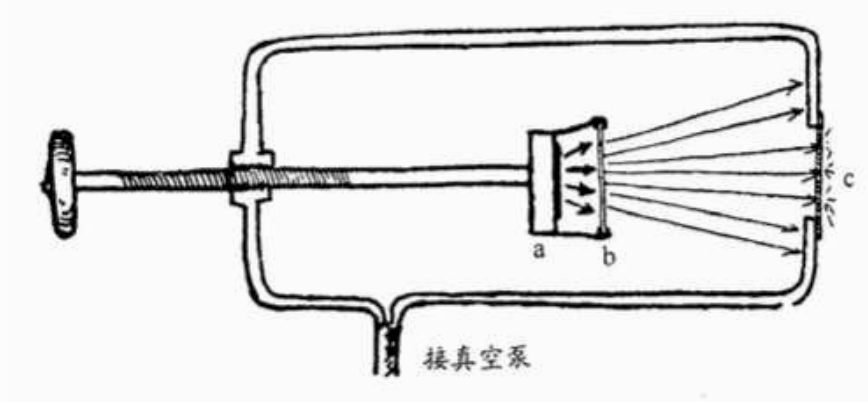

卢瑟福就抱着这样的想法，决定让各种通常是稳定的元素遭 受不稳定放射性元素在分裂时放出的核碎块（《粒子）的轰击。 他在1929年为此项实验首次采用的仪器（图67),与当今某几个 物理实验室中轰击原子的巨大仪器相比，真是简单到了极点。它 包括一个圆筒形真空容器，一端有一扇窗，上面涂有一薄层荧光 物质当作屏幕（c)。粒子轰击源是沉积在金属片上的一薄层放射 性物质（a),待轰击的靶子（这个实验用的是铝）做成箔状，放 在离轰击源一段距离之处（b)。铝箔靶被安放得恰好能使所有入 射《粒子都会嵌在上面。因此，如果轰击没有导致靶子产生次级 核碎块的话，荧光屏是不会发亮的。

把一切装置安装就绪之后，卢瑟福就借助于显微镜观察屏幕。 他看到屏上绝不是一片黑暗，整个屏幕上都闪烁着万万千千的跳 动亮点！每个亮点都是质子撞在屏上所产生的，而每个质子又是 入射《粒子从靶子上的铝原子里撞出的「一块碎片」。因此，元素的 人工嬗变就从理论上的可能性变成了科学上的既成事实％

在卢瑟福做了这个经典实验之后的几十年内，元素的人工嬗 变已发展成为物理学中最大和最重要的分支之一。无论是在产生 供轰击用的高速粒子的方法上，还是在对结果的观测上，都取得 了极大进展。

在观测粒子撞击原子核所发生的情况时，最理想的仪器是一 种能够直接用眼睛观看的云室（因为它是威耳逊发明的，又称威 耳逊云室）。图68是云室简图。它的工作原理基于这样一个事实： 高速运动的带电粒子，在穿过空气或其他气体时，会使沿路的气 体原子发生一定程度的变形。它们在粒子的强电场作用下。会失 去一个或数个电子而成为离子。这种状态不会长久持续下去。粒 子一过，离子很快又重新俘获电子而恢复原伏。不过。如果在这种 发生了电离的气体中含有饱和的水蒸气，它们就会以离子为核心 形成微小的水滴一一这是水蒸气的性质，它能附着在离子、灰尘 等东西上一一结果沿粒子的路径会出现一道细细的雾珠。换句话 说，任何带电粒子在气体中运动的径迹就变成了可见的，如同一 架拖着尾烟的飞机。

图68威耳逊云室原理图

从制作工艺来看，云室是件简单的仪器，它主要包括一个金

属圆筒（A)，筒上盖有一块玻璃盖子（B)，内装一个可上下移动 的活塞（C)(移动部件图中未画出）。玻璃盖子和活塞工作面之 间充有空气（或视具体需要改充其他气体）和一定量的水蒸气。 当一些粒子从窗口（E)进入云室时，让活塞骤然下降，活塞上部 的气体就会冷却，水蒸气则会形成细微的水珠，沿粒子径迹凝结成 一缕雾丝。由于受到从边窗（D)射入的强光照射，以及活塞面黑 色背景的衬托，雾迹清晰可见，并可用与活塞连动的照相机（F)自 动拍摄下来。这架简单的装置，能使我们获得有关核轰击的极完美 的照片，因此，它已成为现代物理学中最有用的仪器之一。

自然，我们也希望能设计出一种在强电场中加速各种带电粒 子（离子）以形成强大粒子束的方法。这样不但能省去稀少而昂 贵的放射性物质，还能增加其他类型的粒子（如质子），并且粒子 的动能也比一般放射性衰变中所放出的粒子大。在各种产生强大 高速粒子束的仪器中，最重要的有静电发生器、迥旋加速器和直 线加速器。图69、图70和图71分别简述了它们的作用原理。

使用上述加速器产生的各种强大的粒子束，并引导它们去轰击 用各种物质作成的靶子，可以产生一系列核嬗变，并用云室拍摄 下来，这样，研究起来很方便。后面的图版m, iv就是几张核嬗变 的照片。

剑桥大学的布莱克特（Patrick Maynard Sturt Blackett)拍摄了 第一张这种照片。他拍摄的是一束衰变中产生的《粒子通过充氮 的云室#。首先可以看出，所有的径迹都有确定的长度，这是因为 粒子在飞过气体时，逐渐失去自己的动能，最后归于静止。粒子径 迹的长度有两种，这是因为有两种不同能量的《粒子（粒子源是 钍的两种同位素ThC和ThC'的混合物）。大家还能注意到，《粒 子的径迹基本上是笔直的，只是在尾部、即粒子快要失去全部

①核反应式如下：

(本书未刊载这幅照片X

图69静电发生器的原理

基础物理学告诉我们，传递给一个金属导体球的电荷会分布在外表面 上。因此，我们可以在空心金属球上开一个小洞，把带有少量电荷的 小导体一次又一次地伸进筒内与球的内表面接触，从而使它的电压达 到任意数值。在实际应用中，我们使用的是一根由小洞伸进球内的 传送带，由它把一个小感应起电器产生的电荷携入球内

初始能量时，才容易由氮原子的非正面碰撞造成明显的偏折。但 是，在这张星状的粒子图中，有一道径迹很特殊，它有一个特 殊的分叉，分叉的一支细而长，一支粗而短。这表明它是粒子 和氮原子面对面碰撞的结果。细而长的径迹是被撞出的质子，粗 而短的则是被撞到一旁的氮原子。因为看不到其他径迹，这就说高速粒子的出o

图70

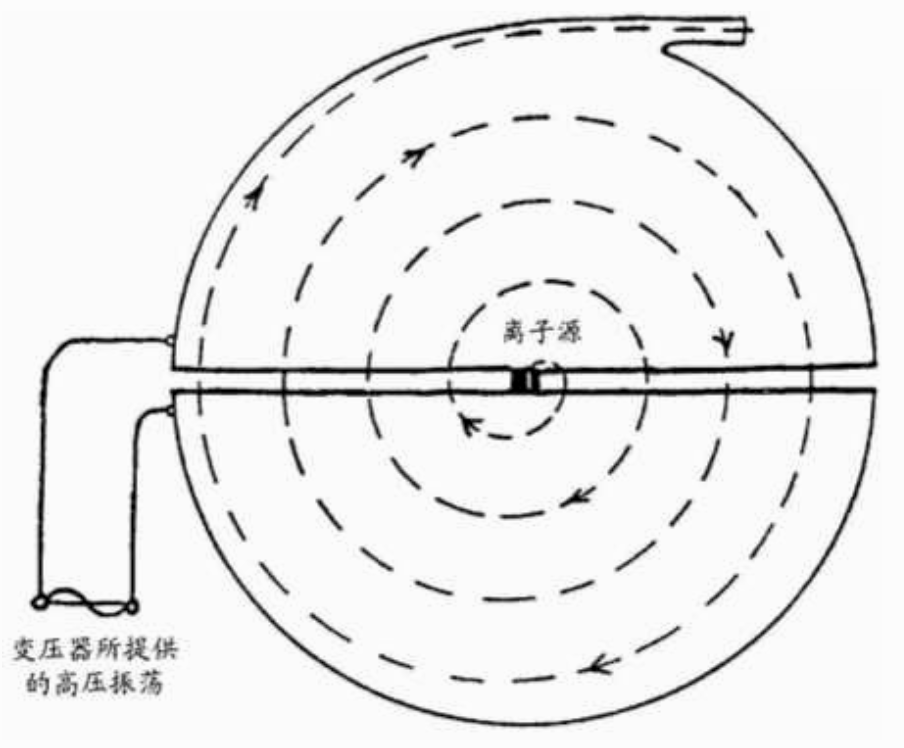

回旋加速器的原理 回旋加速器主要包括两个放在强磁场中的半圆形金属盒（磁场方向和纸面垂 直）。两个盒与变压器的两端分别相连，因此，它们交替带有正电和负电。从 中央的离子流射出的离子在磁场中沿半圆形路径前进，并在从一个盒体进入 另一个盒体的中途受到加速。离子越走越迅速，描绘出一条向外扩展的螺线， 最后以极髙的速度冲出

图71

直线加速器原理 这套装置包括长度逐渐增大的一套圆筒，它们由变压器交替充以正电和负电。 离子在从一个圆筒进入另一个圆筒的途中被这相邻两筒间的电势差加速，因此 能量逐渐增大。由于速度同能量的平方根成正比，所以，如果把筒长按整数的 平方根的比例设计，离子就会保持与交变电场同相。把这套装置设计得足够长， 就能把离子加速到任意大的速度

明，肇事的粒子已经附在氮原子核上一起运动了。

在后面图版上，我们能看到人工加速的质子与硼核碰撞的效

应。高速质子束从加速器出口（照片中央的黑影）射到外面的硼 片上，从而使原子核的碎块沿各个方向穿过空气飞去。从照片上 可看到一个有趣之处，就是碎块的径迹是以三个为一组（照片上 可看到两组，其中一组还以箭头标出），这是由于硼原子被质子击 中时，会裂成3个相等的部分®,

另一张照片图段ma摄下的是高速氘核（由一个质子和一个中子 形成的重氢原子核）和靶上的另一个氘核相碰撞的情景K.

照片中，较长的径迹属于质子（核），较短的则属于三倍 重的氢核（也称氖核）。

中子和质子一样，是构成各种原子核的主要成分。如果没有 中子参与反应的云室照片，那是很不完全的。

但是，不要指望在云室中看到中子的径迹，因为中子是不带 电的，所以，这匹原子物理学中的「黑马」 *在行进途中不会造成 电离。不过，当你看到从猎人枪口冒出一股轻烟，又看到从天上栽 下一只鸭子，你就晓得有一颗子弹飞出过，尽管你看不到它。同 样，在你观看图版me这一云室照片时，你看到一个氮原子分裂成 氦核（向下的一支）和硼核（向上的一支），就一定会意识到这个 氮核一定是被一个看不见的粒子从左面狠狠地撞了一下。事实正 是如此，我们在云室左边的壁上放置了镭和铍的混合物，这正是 快中子源'

只要把中子源和氮原子分裂的地点这两个点连接起来，就是

：©核反应式为：

核反应式为：

* **黑马」的原意为跑马比赛中无人注意而突然取胜的马，本文用以比喻不易被发 现的中子=译者

这个过程的核反应式可以表示如下：

(a)中子的产生：

(b)中子轰击氮原子：

表示中子运动路径的直线了。

图版IV是铀核的裂变照片，它是包基尔德（Boggild)、勃劳斯 特劳姆（Brostrom)和娄瑞参（Lauritsen)拍摄的。从一张敷有一 层铀的铝箔上，沿相反方向飞出两块裂变产物。当然，在这张照片 上是显示不出引发这次裂变的中子和裂变所产生的中子的。

使用加速粒子轰击原子核的方法，我们可以得到无穷无尽 的各种核嬗变，不过现在我们应该转到更重要的问题上来，即 看看这种轰击的效率如何。要知道，图版m和IV所示的只是单 个原子分裂的情况。如果要把1克硼完全转变为氦，就要把所 有55 000 000 000 000 000 000 000个硼原子都击碎。目前最强大的 加速器每秒钟能产生1 000 000 000 000 000个粒子。即使每个粒子 都击碎一个硼核，那也得把这台加速器开动5500万秒，也就是差 不多两年才行。

然而，实际上的效率要比这低得多。通常在几千个髙速粒子 当中，只能指望有一个命中靶上的原子核而造成裂变。这个极低 的效率是由于原子核外的电子能够减慢入射带电粒子的通过速度 的缘故。电子壳层受轰击的截面积要比原子核受轰击的截面积大 得多，我们又显然不能把每个粒子都瞄准原子核，因此，粒子要在 穿过许多原子的电子壳层后，才有直接命中某一个原子核的机会。 图72说明了这种局面。在图上，原子核用黑色小圆点表示，电子 壳层用阴影线表示。原子与原子核的直径之比约为10 000:1,因此 它们受轰击面积的比值为100 000 000:1。我们还知道，带电粒子在 穿过一个原子的电子壳层后，能量要减少万分之一左右。这样，它 在穿过1万个电子壳层后就会停下来。由这些数据不难看出，在1 万个粒子中，只有1个有可能在能量消耗光之前撞到某个原子核 上。考虑到带电粒子给靶子上的原子以摧垮性打击的效率是如此 之低，要使1克硼完全嬗变，恐怕至少也得把一台最先进的加速器 开动两万年！

## 04. 核子学

往往有这么一些词，看起来似乎不那么恰当，但却颇有实用 价值。「核子学」就是这样的一个。因此，我们不妨采用这个词。 正如「电子学」讲的是自由电子束的广泛实际应用一样，「核子 学」也应理解成对核能量的大规模释放进行实际应用的科学。上 一节中我们已经看到，各种化学元素（除去银以外）的原子核内 都蕴藏着巨大的内能：对轻元素来讲，内能可在聚变时放出；对重 元素来讲，则在裂变时放出。我们又看到，用人工加速的粒子轰击 原子核这个方法，尽管在研究核嬗变的理论上极为重要，但由于 效率极低，派不上实际用场。

不过，这种低效率主要是由于粒子和质子是带电粒子，它 们在穿过原子时会失去能量，又不易逼近被轰击的靶原子核。我 们当然会想到，如果用不带电的中子来轰击，大概会好一些。然 而，这还是不好办！因为中子可以轻而易举地进入原子核内，它们 在自然界中就不以自由状态存在；即使凭借人工方法，用一个入 射粒子从某个原子核里「踢」出一个中子来（如铍靶在粒子轰 击下产生中子)，它也会很快地又被其他原子核重新俘获。

这样，要想产生强大的中子束，就得从某种元素的原子核里 把中子一个一个地踢出来。这样做，岂不是又回到低效率的带电 粒子这一条老路上去了吗？

图 72

然而，有一个跳出这种恶性循环的方法：如果能用中子踢出 中子，而且踢出不止一个，中子就会像兔子繁衍（参见图97),或 者像细菌繁殖一样地增加起来。不久，由一个中子所产生的后代 就会多到足以向一大块物质中的每一个原子核进攻的程度。

自从人们发现了这样一种使中子增长的核反应后，核物理学 就空前繁荣起来，并从作为研究物质最隐秘性质的纯科学这座清 静的象牙塔中走了出来，投进了报纸标题、狂热政论和发展军事 工程的旋涡。凡是看报纸的人，没有不知道铀核裂变可以放出核 能一一通常称为原子能一一这种能量的。铀的裂变是哈恩（Otto Hahn)和斯特拉斯曼（Fritz Strassman)在1938年末发现的。但 是，不要认为由裂变生成的两个大小差不多相等的重核本身能使 核反应进行下去。事实上，这两部分核块都带有许多电荷（各带 铀核原电荷的一半左右），因此不可能接近其他原子核；它们将在 邻近原子的电子层作用下迅速失去自己的能量而归于静止，并不 能引起下一步裂变。

铀的裂变之所以能一跃成为极重要的过程，是由于人们发现 了铀核碎片在速度减慢后会放出中子，从而使核反应能自行维持 下去（图73)。

裂变的这种特殊的缓发效应的发生原因，在于重原子核在裂 开时会像断裂成两节的弹簧一样处于剧烈的振动状态中。这种振 动不足以导致二次裂变（即碎片再一次双分），却完全有可能抛出 几个基本粒子来。要注意：我们所说的每个碎块放射出一个中子， 这只是个平均数字；有的碎块能产生两个或三个中子，有的则一 个也不产生。当然，裂变时碎块所能产生的中子数有赖于振动强 度，而这个强度又取决于裂变时释放的总能量。我们知道，这个能 量的大小是随原子核重量的增大而增加的。因此，我们可以预料 到，裂变所产生的中子数随周期表中原子序数的增大而增多。例 如，金核裂变（由于所需的激发能太髙，至今尚未实验成功）所 产生的中子数，大概会少于每块一个，铀则为每块一个（即每次

裂变过程的各个阶段

裂变产生两个)，更重的元素（如钚），应多于每块一个。

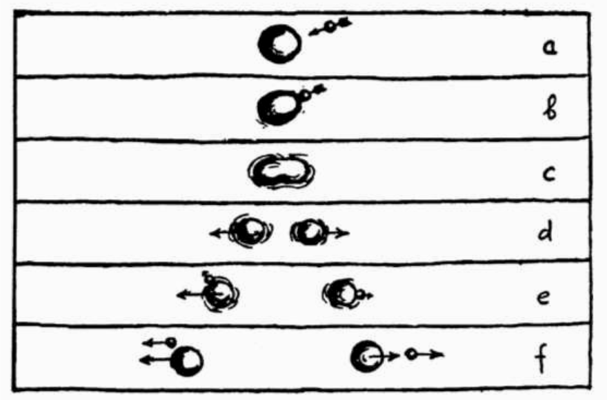

图73

如果有100个中子进入某种物质。为了能够满足中子的连续增 殖，这100个中子显然应产生出多于100个中子。至于能否达到这 一状况，要看中子使这种原子核裂变的效率有多大，也要看一个 中子在造成一次裂变时所产生的新中子有多少。应该记住，尽管 中子比带电粒子有高得多的轰击效率，但也不会达到百分之百。 事实上，总有一些高速中子在和某个原子相撞时，只交给它一部 分动能，然后带着剩余的动能跑掉。这一来，粒子的动能将分散消 耗在几个原子核上，而没有一个发生裂变。

根据原子核结构理论，可以归结出这样一点：中子的裂变率 随裂变物质原子量的递增而提髙，对于周期表末尾的元素，裂变 率接近百分之百。

现在，我们给出两个中子数的例子，一个是有利于中子增多 的，一个是不利的：①快中子对某元素的裂变率为35%，裂变产 生的平均中子数为1.64。这时，如果有100个中子，就能引起35

m这些数值只是为了举例而给出的，并非某一种元素的真实数据。

次裂变，产生35X1.6 = 56个第二代中子。显然，中子数目会逐代 下降，每一代都减少将近一半。②另一种较重元素，裂变率升至 65%,裂变产生的平均中子数为2.2。此时，如有100个中子，就 会导致65次裂变，放出的中子总数为65X2.2 = 143个。每产生新 的一代，中子数就增加约50%,不用多久，就会产生出足以轰击 核样品中每一个原子核的中子来。这种反应，我们称为分支链式 反应；能产生这种反应的物质，我们叫做裂变物质。

对于发生渐进性分支链式反应的必要条件作细心的实验观测 和深入的理论研究以后，可得出结论说，在天然元素中，只有一种 原子核可能发生这种反应。这就是铀的轻同位素铀235。

图74在一块球形的裂变物质中发生的链式反应尽管有许多中子从表面 上跑掉了，但每一代的中子数仍会不断增加，最后导致爆炸

但是，铀235在自然界中并不单独存在，它总是和大量较重的 非裂变同位素铀238混在一起（铀235占0.7%，铀238占 99.3%),这就会像湿木柴中的水分妨碍木柴的燃烧一样影响到铀

图75

a.用扩散法分离同位素。含有两种同位素的气体被抽入泵室的左半部，并透过 中央的隔板扩散到另一边。由于较轻的分子扩散得快一些，在右半部的气体中 会富集袖235; b.用磁场法分离同位素。原子束在强磁场中穿过，较轻的同位 素被偏转得多一些。为了提高粒子束的强度，必须选用较宽的缝隙，因此铀235 和铀238两束粒子会部分地重叠，得到的只是部分的分离

所有这些方法都有一个缺点：由于这两种同位素的质量相差

的分支链式反应。不过，正因为有这种不活泼的同位素与铀235掺 杂在一起，才使得这种高裂变性的铀235至今仍然存在，否则，它 们早就会由于链式反应而迅速毁掉了。因此，如果打算利用铀235 的能量，那么，就得先把铀235和铀238分离开来，或者是研究出 不让较重的铀238捣蛋的办法。这两类方法都是释放原子能这个课 题的研究对象，并且都得到了成功的解决。由于本书不打算过多 地涉及这类技术性问题，所以我们只在这里简单地讲一讲。

要直接分离铀的两种同位素是个相当困难的技术问题。它们 的化学性质完全相同，因此，一般的化工方法是无能为力的。这两 种原子只在质量上稍有不同一一两者相差1.3%,这就为我们提供 了靠原子质量的不同来解决问题的扩散法、离心法、电磁场偏转 法等。图75a和b示出了两种主要分离方法的原理图，并附有简短 说明。

甚小。因而分离过程不能一步完成。需要多次反复进行，才能使轻的同位素一步步富集。这样，经过相当多次重复后，可得到很纯的 铀235产品。

更聪明的方法是使用所谓减速剂，人为地减小天然铀中重同 位素的影响，从而使链式反应能够进行。在了解这个方法之前，我 们先得知道，铀的重同位素对链式反应的破坏作用，在于它吸收 了铀235裂变时产生的大部分中子，从而破坏了链式反应的进行。 因此，如果我们能设法使中子在碰到铀235的原子核之前不致被铀 238原子核所俘获，裂变就能继续进行下去，问题也就解决了。不 过，铀238比铀235约多140倍，不让铀238得到大部分中子，岂 不是想入非非！然而，在这个问题上，另一件事实帮了忙。这就是 铀的两种同位素「俘获中子的能力」随中子运动速度的不同而不 同。对于裂变时所产生的快中子，两者的俘获能力相同。因此，每 有一个中子轰击到铀235的原子核，就有140个中子被铀238所俘 获。对于中等速度的中子来说，铀238的俘获能力甚至比铀235还 要强。不过，重要的一点是：当中子速度很低时，铀235能比铀 238俘获到多得多的中子。因此，如果我们能使裂变产生的髙速中 子在与下一个铀原子核（238或235)相遇之前先大大减速，那 么，铀235的数量虽少，却会比铀238有更多的机会来俘获中子。

我们把天然铀的小颗粒，掺在某种能使中子减速而本身又不 会俘获大量中子的物质（减速剂）里面，就可得到减速装置。最 好的减速剂是重水 ' 碳、铍盐。从图76可以看出，这样一个散 布在减速剂中的铀颗粒「堆」是如何工作的疆。

我们说过，铀的轻同位素铀235 (只占天然铀的0.7%)是唯 一能维持逐步发展的链式反应、并放出巨大该能的天然裂变物质。 但这并不等于说，我们不能人工制造出性质与铀235相同、而在自 然界中并不存在的元素来。事实上，利用裂变物质在链式反应中

*即由氢的同位素氘_与氧化合成的水，其分子式为d2o。一一译者 ①至于有关铀堆的更详尽的讨论，请阅读专论原子能的书刊。

图76这张画看起来倒很像是一张生物的细胞图，事实上，它所表示的是嵌 在减速剂（小原子）中的一团团铀原子（大原子)。在左面的一团铀原子中 有一个发生了裂变，产生的两个中子进入减速剂，并在与它们的原子的一系 列碰揸过程中逐渐减慢速度。当这些中子到达另一团铀原子时，已被减速到 相当程度，这样就能被铀235的原子核俘获，因为铀235俘获慢中子的效宰比

铀238髙

所产生的大量中子，我们可以把原来不能发生裂变的原子核变为 可以裂变的原子核。

第一个这种例子，就是上述由铀和减速剂混合成的反应堆。 我们已经看到，在使用减速剂以后，铀238俘获中子的能力会减小 到足以让铀235进行链式反应的程度。然而，还是会有一些铀238 的原子核俘获到中子。这一来又会发生什么情形呢？

铀238的核在俘获一个中子后，当然就马上变成更重的同位素 铀239。不过，这个新生子核的寿命不长，它会相继放出两个电 子，变成原子序数为94的新元素的原子。这种人造新元素叫做钚 (Pu-239),它比铀235还容易发生裂变。如果我们把铀238换成另

一种天然放射性元素钍（Th-232),它在俘获中子和释放两个电子

后，就变成另一种人造裂变元素轴233。

因此，从天然裂变元素铀235开始，进行循环反应，理论上和

实际上都可能将全部天然铀和钍变成裂变物质，成为富集的核能 源。

最后，让我们大致计算一下，可供人类用于和平发展或自我 毁灭的战争中的总能量有多少。计算表明，所有天然铀矿中的铀 235所蕴藏的核能，如果全部释放出来，可以供全世界的工业使用 数年；如果考虑到铀238转变成钚的情况，时间就会加长到几个世 纪。再考虑到蕴藏量四倍于铀的钍（转变为铀233),至少就可用 一两千年。这足以使任何「原子能匮乏」论不能立足了。

而且，即使所有这些核能源都被用光，并且也不再发现新的 铀矿和钍矿，后代人也还是能从普通岩石里获得核能。事实上，铀 和钍也跟其他元素一样，都少量地存在于一切普通物质中。例如， 每吨花岗岩中含铀4克，含钍12克。乍一看来，这未免太少了。 但不妨往下算一算：1公斤裂变物质所蕴藏的核能相当于2万吨 TNT炸药爆炸时或2万吨汽油燃烧时放出的能量。因此，1吨花岗 岩中的这16克铀和钍，就相当于320吨普通燃料。这就足以补偿 复杂的分离步骤所会带来的一切麻烦了一一特别是在当我们面临 富矿源趋于枯竭的时候。

物理学家们在征服了铀、钍之类的重元素裂变时所释放的能 量后，又盯上了与此相反的过程一一核聚变，即两个轻元素的原 子聚合成一个重原子核，同时释放出大量能量的过程。在第十一 章里，大家会看到，太阳的能量就来自因氢核进行猛烈的热碰撞 而合成较重的氦核这种聚变反应。为了实现这种所谓热核反应， 以供人类应用，最适用的聚变物质是重氢，即氘。氘在水里以少量 存在。氘核含有一个质子和一个中子。当两个氘核相撞时，会发生 下面两个反应当中的一个：

为了实现这种变化，氘必须处于几亿度的高温下。

第一个实现核聚变的装置是氢弹，它用原子弹来引发氘的聚 变。不过，更复杂的问题是如何实现可为和平目的提供大量能量

的受控热核反应。要克服主要的困难 约束极热的气体 可

利用强磁场使氘核不与容器壁接触（否则容器会熔化和蒸发！）， 并把它们约束在中心的热区内。