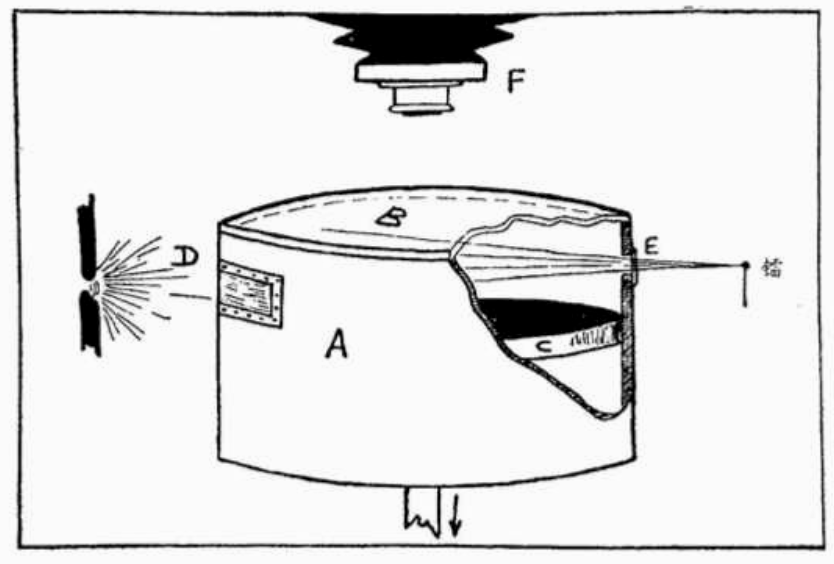
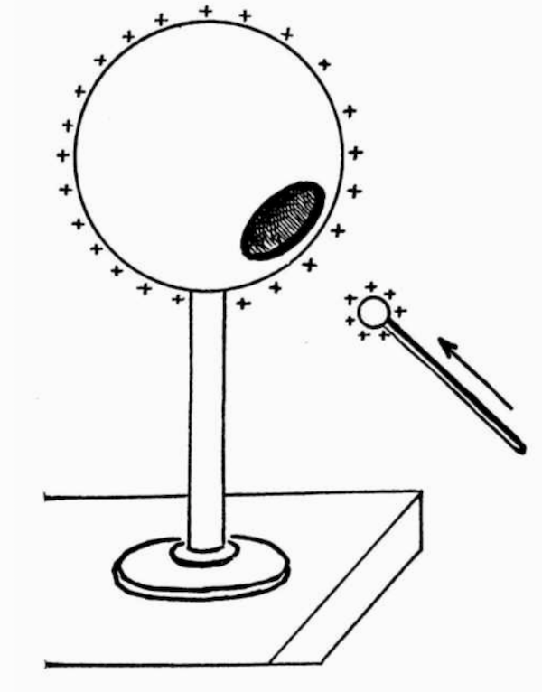
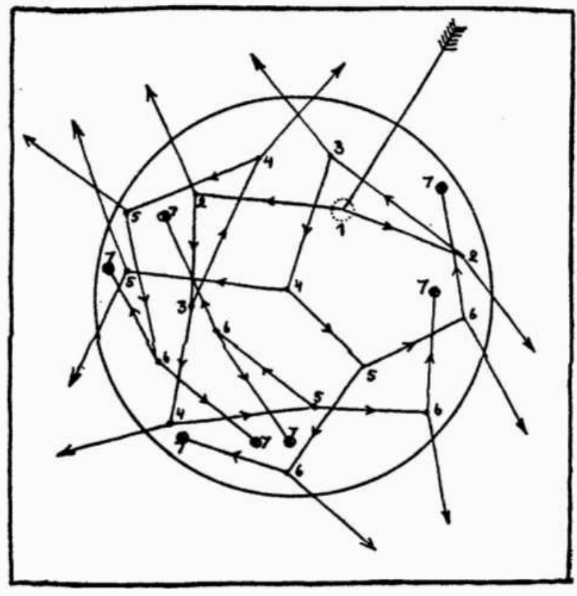
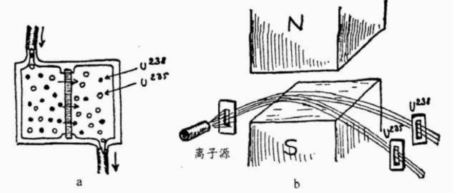
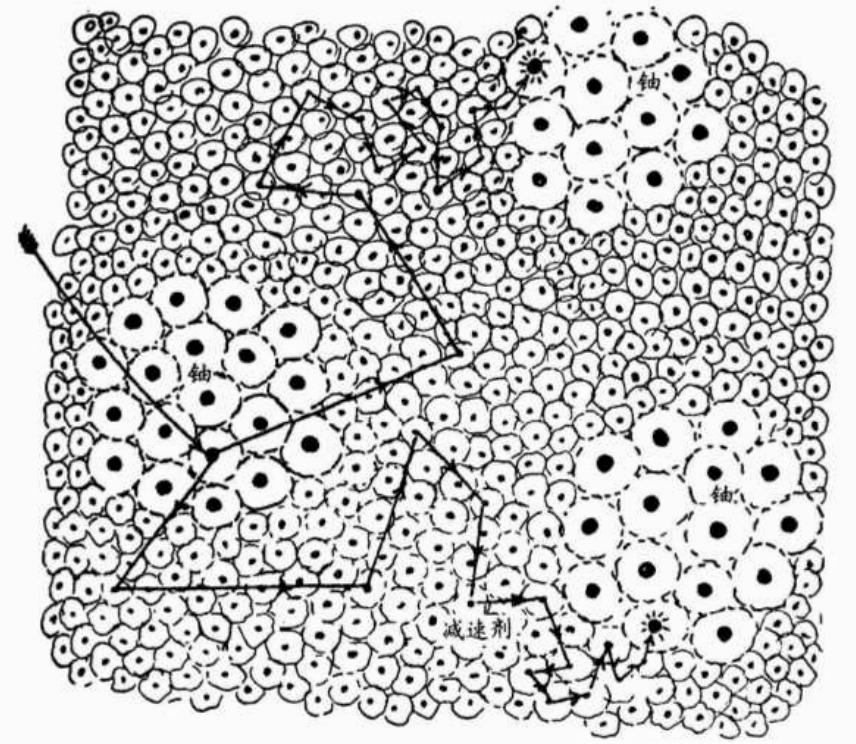

# 第七章 现代炼金术

## 03. 轰击原子

原子量的整数值为原子核构造的复杂性提供了有力的论据， 不过这种复杂性只有用能够把原子核破裂成两块或更多几块的直 接实验，才能最后加以证实。

第一次表明有可能使原子碎裂的迹象，是1896年法国科学家 贝克勒耳（Edmond Alexandre Becquerel)所发现的放射性。事实表 明，位于周期表尽头的元素，如铀和钍，能自行发出穿透性很强的 辐射（与一般X射线相似）的原因，在于这些原子在进行缓慢的 自发衰变。人们对这个发现做了精细的研究，很快得出这样的结 论：重原子在衰变中自行分裂成两个大不相同的部分：①叫做《 粒子的小块，它是氦的原子核；②原有原子核的剩余部分，它又是 子元素的原子核。当铀原子核碎裂时，放出《粒子，产生的子元 素称为铀Xn它的内部经历重新调整电荷的过程后，放出两个自

由的负电荷（普通电子），变为比原来的铀原子轻四个单位的铀同 位素。紧接着又是一系列的《粒子发射和电荷调整，直到变为稳 定的铅原子，才不再进行衰变。

这种交替发射《粒子和电子的嬗变可发生在另外两族放射性 物质上，它们是以重元素钍为首的钍系和以锕开始的锕系。这三 族元素都进行一系列衰变，最后成为三种铅同位素。

我们在上一节讲过，元素周期表中后一半元素的原子核是不 稳定的，因为在它们原子核内倾向于分离的静电力超过了把核约 束在一起的表面张力。细心的读者把这一条和自发放射衰变的情 况对比一下，就会觉得诧异：既然所有比银重的元素都是不稳定 的，为什么只在最重的几种元素（如铀、镭、钍）上才观察到自 发衰变呢？这是因为虽然所有比银重的元素在理论上都可以看作 是放射性元素，并且它们也确实都在渐渐地衰变成轻元素，不过 在大多数情况下，自发衰变进行得非常缓慢，以致无法发现这种 过程。一些大家熟悉的元素，如碘、金、汞、铅等等，它们的原子 在一个世纪中说不定只分裂一两个。这可太慢了，用任何灵敏的 物理仪器都无法记录下来。只有最重的元素，由于它们自发分裂 的趋势很强，才能产生能够观测出的放射性来p。这种相对的嬗变 率还决定了不稳定原子核的分裂方式。例如，铀的原子就可能以 几种方式裂开：或者是分裂成两块相等的部分，或者是三块相等的 部分，或者是许多块大小不等的部分。不过，最容易发生的是分成 一个《粒子和一个剩余的子核。根据观察，铀原子核自行裂成两块 相等部分的机会要比放射出一个《粒子的机会低数百万倍。所以， 在一克铀中，每一秒内都有上万个原子核进行放射a粒子的分裂， 而要观测到一次分成两块相等部分的裂变，却要等上几分钟呢！

放射现象的发现，不容置疑地证明了原子核结构的复杂性， 也打开了人工产生（或激发）核嬗变的道路。它使我们想到，如

m以铀为例，1克铀中每秒钟有几千个原子进行分裂.

果重元素特别是那些不稳定的重元素能够自行衰变，那么，我们 能否用足够强有力的高速粒子去轰击那些稳定的原子核，使它们 发生分裂呢？

上述过程可用反应式表述如下；

卢瑟福就抱着这样的想法，决定让各种通常是稳定的元素遭 受不稳定放射性元素在分裂时放出的核碎块（《粒子）的轰击。 他在1929年为此项实验首次采用的仪器（图67),与当今某几个 物理实验室中轰击原子的巨大仪器相比，真是简单到了极点。它 包括一个圆筒形真空容器，一端有一扇窗，上面涂有一薄层荧光 物质当作屏幕（c)。粒子轰击源是沉积在金属片上的一薄层放射 性物质（a),待轰击的靶子（这个实验用的是铝）做成箔状，放 在离轰击源一段距离之处（b)。铝箔靶被安放得恰好能使所有入 射《粒子都会嵌在上面。因此，如果轰击没有导致靶子产生次级 核碎块的话，荧光屏是不会发亮的。

把一切装置安装就绪之后，卢瑟福就借助于显微镜观察屏幕。 他看到屏上绝不是一片黑暗，整个屏幕上都闪烁着万万千千的跳 动亮点！每个亮点都是质子撞在屏上所产生的，而每个质子又是 入射《粒子从靶子上的铝原子里撞出的「一块碎片」。因此，元素的 人工嬗变就从理论上的可能性变成了科学上的既成事实％

在卢瑟福做了这个经典实验之后的几十年内，元素的人工嬗 变已发展成为物理学中最大和最重要的分支之一。无论是在产生 供轰击用的高速粒子的方法上，还是在对结果的观测上，都取得 了极大进展。

在观测粒子撞击原子核所发生的情况时，最理想的仪器是一 种能够直接用眼睛观看的云室（因为它是威耳逊发明的，又称威 耳逊云室）。图68是云室简图。它的工作原理基于这样一个事实： 高速运动的带电粒子，在穿过空气或其他气体时，会使沿路的气 体原子发生一定程度的变形。它们在粒子的强电场作用下。会失 去一个或数个电子而成为离子。这种状态不会长久持续下去。粒 子一过，离子很快又重新俘获电子而恢复原伏。不过。如果在这种 发生了电离的气体中含有饱和的水蒸气，它们就会以离子为核心 形成微小的水滴一一这是水蒸气的性质，它能附着在离子、灰尘 等东西上一一结果沿粒子的路径会出现一道细细的雾珠。换句话 说，任何带电粒子在气体中运动的径迹就变成了可见的，如同一 架拖着尾烟的飞机。

图68威耳逊云室原理图

从制作工艺来看，云室是件简单的仪器，它主要包括一个金

属圆筒（A)，筒上盖有一块玻璃盖子（B)，内装一个可上下移动 的活塞（C)(移动部件图中未画出）。玻璃盖子和活塞工作面之 间充有空气（或视具体需要改充其他气体）和一定量的水蒸气。 当一些粒子从窗口（E)进入云室时，让活塞骤然下降，活塞上部 的气体就会冷却，水蒸气则会形成细微的水珠，沿粒子径迹凝结成 一缕雾丝。由于受到从边窗（D)射入的强光照射，以及活塞面黑 色背景的衬托，雾迹清晰可见，并可用与活塞连动的照相机（F)自 动拍摄下来。这架简单的装置，能使我们获得有关核轰击的极完美 的照片，因此，它已成为现代物理学中最有用的仪器之一。

自然，我们也希望能设计出一种在强电场中加速各种带电粒 子（离子）以形成强大粒子束的方法。这样不但能省去稀少而昂 贵的放射性物质，还能增加其他类型的粒子（如质子），并且粒子 的动能也比一般放射性衰变中所放出的粒子大。在各种产生强大 高速粒子束的仪器中，最重要的有静电发生器、迥旋加速器和直 线加速器。图69、图70和图71分别简述了它们的作用原理。

使用上述加速器产生的各种强大的粒子束，并引导它们去轰击 用各种物质作成的靶子，可以产生一系列核嬗变，并用云室拍摄 下来，这样，研究起来很方便。后面的图版m, iv就是几张核嬗变 的照片。

剑桥大学的布莱克特（Patrick Maynard Sturt Blackett)拍摄了 第一张这种照片。他拍摄的是一束衰变中产生的《粒子通过充氮 的云室#。首先可以看出，所有的径迹都有确定的长度，这是因为 粒子在飞过气体时，逐渐失去自己的动能，最后归于静止。粒子径 迹的长度有两种，这是因为有两种不同能量的《粒子（粒子源是 钍的两种同位素ThC和ThC'的混合物）。大家还能注意到，《粒 子的径迹基本上是笔直的，只是在尾部、即粒子快要失去全部

①核反应式如下：

(本书未刊载这幅照片X

图69静电发生器的原理

基础物理学告诉我们，传递给一个金属导体球的电荷会分布在外表面 上。因此，我们可以在空心金属球上开一个小洞，把带有少量电荷的 小导体一次又一次地伸进筒内与球的内表面接触，从而使它的电压达 到任意数值。在实际应用中，我们使用的是一根由小洞伸进球内的 传送带，由它把一个小感应起电器产生的电荷携入球内

初始能量时，才容易由氮原子的非正面碰撞造成明显的偏折。但 是，在这张星状的粒子图中，有一道径迹很特殊，它有一个特 殊的分叉，分叉的一支细而长，一支粗而短。这表明它是粒子 和氮原子面对面碰撞的结果。细而长的径迹是被撞出的质子，粗 而短的则是被撞到一旁的氮原子。因为看不到其他径迹，这就说高速粒子的出o

图70

回旋加速器的原理 回旋加速器主要包括两个放在强磁场中的半圆形金属盒（磁场方向和纸面垂 直）。两个盒与变压器的两端分别相连，因此，它们交替带有正电和负电。从 中央的离子流射出的离子在磁场中沿半圆形路径前进，并在从一个盒体进入 另一个盒体的中途受到加速。离子越走越迅速，描绘出一条向外扩展的螺线， 最后以极髙的速度冲出

图71

直线加速器原理 这套装置包括长度逐渐增大的一套圆筒，它们由变压器交替充以正电和负电。 离子在从一个圆筒进入另一个圆筒的途中被这相邻两筒间的电势差加速，因此 能量逐渐增大。由于速度同能量的平方根成正比，所以，如果把筒长按整数的 平方根的比例设计，离子就会保持与交变电场同相。把这套装置设计得足够长， 就能把离子加速到任意大的速度

明，肇事的粒子已经附在氮原子核上一起运动了。

在后面图版上，我们能看到人工加速的质子与硼核碰撞的效

应。高速质子束从加速器出口（照片中央的黑影）射到外面的硼 片上，从而使原子核的碎块沿各个方向穿过空气飞去。从照片上 可看到一个有趣之处，就是碎块的径迹是以三个为一组（照片上 可看到两组，其中一组还以箭头标出），这是由于硼原子被质子击 中时，会裂成3个相等的部分®,

另一张照片图段ma摄下的是高速氘核（由一个质子和一个中子 形成的重氢原子核）和靶上的另一个氘核相碰撞的情景K.

照片中，较长的径迹属于质子（核），较短的则属于三倍 重的氢核（也称氖核）。

中子和质子一样，是构成各种原子核的主要成分。如果没有 中子参与反应的云室照片，那是很不完全的。

但是，不要指望在云室中看到中子的径迹，因为中子是不带 电的，所以，这匹原子物理学中的「黑马」 *在行进途中不会造成 电离。不过，当你看到从猎人枪口冒出一股轻烟，又看到从天上栽 下一只鸭子，你就晓得有一颗子弹飞出过，尽管你看不到它。同 样，在你观看图版me这一云室照片时，你看到一个氮原子分裂成 氦核（向下的一支）和硼核（向上的一支），就一定会意识到这个 氮核一定是被一个看不见的粒子从左面狠狠地撞了一下。事实正 是如此，我们在云室左边的壁上放置了镭和铍的混合物，这正是 快中子源'

只要把中子源和氮原子分裂的地点这两个点连接起来，就是

：©核反应式为：

核反应式为：

* **黑马」的原意为跑马比赛中无人注意而突然取胜的马，本文用以比喻不易被发 现的中子=译者

这个过程的核反应式可以表示如下：

(a)中子的产生：

(b)中子轰击氮原子：

表示中子运动路径的直线了。

图版IV是铀核的裂变照片，它是包基尔德（Boggild)、勃劳斯 特劳姆（Brostrom)和娄瑞参（Lauritsen)拍摄的。从一张敷有一 层铀的铝箔上，沿相反方向飞出两块裂变产物。当然，在这张照片 上是显示不出引发这次裂变的中子和裂变所产生的中子的。

使用加速粒子轰击原子核的方法，我们可以得到无穷无尽 的各种核嬗变，不过现在我们应该转到更重要的问题上来，即 看看这种轰击的效率如何。要知道，图版m和IV所示的只是单 个原子分裂的情况。如果要把1克硼完全转变为氦，就要把所 有55 000 000 000 000 000 000 000个硼原子都击碎。目前最强大的 加速器每秒钟能产生1 000 000 000 000 000个粒子。即使每个粒子 都击碎一个硼核，那也得把这台加速器开动5500万秒，也就是差 不多两年才行。

然而，实际上的效率要比这低得多。通常在几千个髙速粒子 当中，只能指望有一个命中靶上的原子核而造成裂变。这个极低 的效率是由于原子核外的电子能够减慢入射带电粒子的通过速度 的缘故。电子壳层受轰击的截面积要比原子核受轰击的截面积大 得多，我们又显然不能把每个粒子都瞄准原子核，因此，粒子要在 穿过许多原子的电子壳层后，才有直接命中某一个原子核的机会。 图72说明了这种局面。在图上，原子核用黑色小圆点表示，电子 壳层用阴影线表示。原子与原子核的直径之比约为10 000:1,因此 它们受轰击面积的比值为100 000 000:1。我们还知道，带电粒子在 穿过一个原子的电子壳层后，能量要减少万分之一左右。这样，它 在穿过1万个电子壳层后就会停下来。由这些数据不难看出，在1 万个粒子中，只有1个有可能在能量消耗光之前撞到某个原子核 上。考虑到带电粒子给靶子上的原子以摧垮性打击的效率是如此 之低，要使1克硼完全嬗变，恐怕至少也得把一台最先进的加速器 开动两万年！

## 04. 核子学

往往有这么一些词，看起来似乎不那么恰当，但却颇有实用 价值。「核子学」就是这样的一个。因此，我们不妨采用这个词。 正如「电子学」讲的是自由电子束的广泛实际应用一样，「核子 学」也应理解成对核能量的大规模释放进行实际应用的科学。上 一节中我们已经看到，各种化学元素（除去银以外）的原子核内 都蕴藏着巨大的内能：对轻元素来讲，内能可在聚变时放出；对重 元素来讲，则在裂变时放出。我们又看到，用人工加速的粒子轰击 原子核这个方法，尽管在研究核嬗变的理论上极为重要，但由于 效率极低，派不上实际用场。

不过，这种低效率主要是由于粒子和质子是带电粒子，它 们在穿过原子时会失去能量，又不易逼近被轰击的靶原子核。我 们当然会想到，如果用不带电的中子来轰击，大概会好一些。然 而，这还是不好办！因为中子可以轻而易举地进入原子核内，它们 在自然界中就不以自由状态存在；即使凭借人工方法，用一个入 射粒子从某个原子核里「踢」出一个中子来（如铍靶在粒子轰 击下产生中子)，它也会很快地又被其他原子核重新俘获。

这样，要想产生强大的中子束，就得从某种元素的原子核里 把中子一个一个地踢出来。这样做，岂不是又回到低效率的带电 粒子这一条老路上去了吗？

图 72

然而，有一个跳出这种恶性循环的方法：如果能用中子踢出 中子，而且踢出不止一个，中子就会像兔子繁衍（参见图97),或 者像细菌繁殖一样地增加起来。不久，由一个中子所产生的后代 就会多到足以向一大块物质中的每一个原子核进攻的程度。

自从人们发现了这样一种使中子增长的核反应后，核物理学 就空前繁荣起来，并从作为研究物质最隐秘性质的纯科学这座清 静的象牙塔中走了出来，投进了报纸标题、狂热政论和发展军事 工程的旋涡。凡是看报纸的人，没有不知道铀核裂变可以放出核 能一一通常称为原子能一一这种能量的。铀的裂变是哈恩（Otto Hahn)和斯特拉斯曼（Fritz Strassman)在1938年末发现的。但 是，不要认为由裂变生成的两个大小差不多相等的重核本身能使 核反应进行下去。事实上，这两部分核块都带有许多电荷（各带 铀核原电荷的一半左右），因此不可能接近其他原子核；它们将在 邻近原子的电子层作用下迅速失去自己的能量而归于静止，并不 能引起下一步裂变。

铀的裂变之所以能一跃成为极重要的过程，是由于人们发现 了铀核碎片在速度减慢后会放出中子，从而使核反应能自行维持 下去（图73)。

裂变的这种特殊的缓发效应的发生原因，在于重原子核在裂 开时会像断裂成两节的弹簧一样处于剧烈的振动状态中。这种振 动不足以导致二次裂变（即碎片再一次双分），却完全有可能抛出 几个基本粒子来。要注意：我们所说的每个碎块放射出一个中子， 这只是个平均数字；有的碎块能产生两个或三个中子，有的则一 个也不产生。当然，裂变时碎块所能产生的中子数有赖于振动强 度，而这个强度又取决于裂变时释放的总能量。我们知道，这个能 量的大小是随原子核重量的增大而增加的。因此，我们可以预料 到，裂变所产生的中子数随周期表中原子序数的增大而增多。例 如，金核裂变（由于所需的激发能太髙，至今尚未实验成功）所 产生的中子数，大概会少于每块一个，铀则为每块一个（即每次

裂变过程的各个阶段

裂变产生两个)，更重的元素（如钚），应多于每块一个。

图73

如果有100个中子进入某种物质。为了能够满足中子的连续增 殖，这100个中子显然应产生出多于100个中子。至于能否达到这 一状况，要看中子使这种原子核裂变的效率有多大，也要看一个 中子在造成一次裂变时所产生的新中子有多少。应该记住，尽管 中子比带电粒子有高得多的轰击效率，但也不会达到百分之百。 事实上，总有一些高速中子在和某个原子相撞时，只交给它一部 分动能，然后带着剩余的动能跑掉。这一来，粒子的动能将分散消 耗在几个原子核上，而没有一个发生裂变。

根据原子核结构理论，可以归结出这样一点：中子的裂变率 随裂变物质原子量的递增而提髙，对于周期表末尾的元素，裂变 率接近百分之百。

现在，我们给出两个中子数的例子，一个是有利于中子增多 的，一个是不利的：①快中子对某元素的裂变率为35%，裂变产 生的平均中子数为1.64。这时，如果有100个中子，就能引起35

m这些数值只是为了举例而给出的，并非某一种元素的真实数据。

次裂变，产生35X1.6 = 56个第二代中子。显然，中子数目会逐代 下降，每一代都减少将近一半。②另一种较重元素，裂变率升至 65%,裂变产生的平均中子数为2.2。此时，如有100个中子，就 会导致65次裂变，放出的中子总数为65X2.2 = 143个。每产生新 的一代，中子数就增加约50%,不用多久，就会产生出足以轰击 核样品中每一个原子核的中子来。这种反应，我们称为分支链式 反应；能产生这种反应的物质，我们叫做裂变物质。

对于发生渐进性分支链式反应的必要条件作细心的实验观测 和深入的理论研究以后，可得出结论说，在天然元素中，只有一种 原子核可能发生这种反应。这就是铀的轻同位素铀235。

图74在一块球形的裂变物质中发生的链式反应尽管有许多中子从表面 上跑掉了，但每一代的中子数仍会不断增加，最后导致爆炸

但是，铀235在自然界中并不单独存在，它总是和大量较重的 非裂变同位素铀238混在一起（铀235占0.7%，铀238占 99.3%),这就会像湿木柴中的水分妨碍木柴的燃烧一样影响到铀

图75

a.用扩散法分离同位素。含有两种同位素的气体被抽入泵室的左半部，并透过 中央的隔板扩散到另一边。由于较轻的分子扩散得快一些，在右半部的气体中 会富集袖235; b.用磁场法分离同位素。原子束在强磁场中穿过，较轻的同位 素被偏转得多一些。为了提高粒子束的强度，必须选用较宽的缝隙，因此铀235 和铀238两束粒子会部分地重叠，得到的只是部分的分离

所有这些方法都有一个缺点：由于这两种同位素的质量相差

的分支链式反应。不过，正因为有这种不活泼的同位素与铀235掺 杂在一起，才使得这种高裂变性的铀235至今仍然存在，否则，它 们早就会由于链式反应而迅速毁掉了。因此，如果打算利用铀235 的能量，那么，就得先把铀235和铀238分离开来，或者是研究出 不让较重的铀238捣蛋的办法。这两类方法都是释放原子能这个课 题的研究对象，并且都得到了成功的解决。由于本书不打算过多 地涉及这类技术性问题，所以我们只在这里简单地讲一讲。

要直接分离铀的两种同位素是个相当困难的技术问题。它们 的化学性质完全相同，因此，一般的化工方法是无能为力的。这两 种原子只在质量上稍有不同一一两者相差1.3%,这就为我们提供 了靠原子质量的不同来解决问题的扩散法、离心法、电磁场偏转 法等。图75a和b示出了两种主要分离方法的原理图，并附有简短 说明。

甚小。因而分离过程不能一步完成。需要多次反复进行，才能使轻的同位素一步步富集。这样，经过相当多次重复后，可得到很纯的 铀235产品。

更聪明的方法是使用所谓减速剂，人为地减小天然铀中重同 位素的影响，从而使链式反应能够进行。在了解这个方法之前，我 们先得知道，铀的重同位素对链式反应的破坏作用，在于它吸收 了铀235裂变时产生的大部分中子，从而破坏了链式反应的进行。 因此，如果我们能设法使中子在碰到铀235的原子核之前不致被铀 238原子核所俘获，裂变就能继续进行下去，问题也就解决了。不 过，铀238比铀235约多140倍，不让铀238得到大部分中子，岂 不是想入非非！然而，在这个问题上，另一件事实帮了忙。这就是 铀的两种同位素「俘获中子的能力」随中子运动速度的不同而不 同。对于裂变时所产生的快中子，两者的俘获能力相同。因此，每 有一个中子轰击到铀235的原子核，就有140个中子被铀238所俘 获。对于中等速度的中子来说，铀238的俘获能力甚至比铀235还 要强。不过，重要的一点是：当中子速度很低时，铀235能比铀 238俘获到多得多的中子。因此，如果我们能使裂变产生的髙速中 子在与下一个铀原子核（238或235)相遇之前先大大减速，那 么，铀235的数量虽少，却会比铀238有更多的机会来俘获中子。

我们把天然铀的小颗粒，掺在某种能使中子减速而本身又不 会俘获大量中子的物质（减速剂）里面，就可得到减速装置。最 好的减速剂是重水 ' 碳、铍盐。从图76可以看出，这样一个散 布在减速剂中的铀颗粒「堆」是如何工作的疆。

我们说过，铀的轻同位素铀235 (只占天然铀的0.7%)是唯 一能维持逐步发展的链式反应、并放出巨大该能的天然裂变物质。 但这并不等于说，我们不能人工制造出性质与铀235相同、而在自 然界中并不存在的元素来。事实上，利用裂变物质在链式反应中

*即由氢的同位素氘_与氧化合成的水，其分子式为d2o。一一译者 ①至于有关铀堆的更详尽的讨论，请阅读专论原子能的书刊。

图76这张画看起来倒很像是一张生物的细胞图，事实上，它所表示的是嵌 在减速剂（小原子）中的一团团铀原子（大原子)。在左面的一团铀原子中 有一个发生了裂变，产生的两个中子进入减速剂，并在与它们的原子的一系 列碰揸过程中逐渐减慢速度。当这些中子到达另一团铀原子时，已被减速到 相当程度，这样就能被铀235的原子核俘获，因为铀235俘获慢中子的效宰比

铀238髙

所产生的大量中子，我们可以把原来不能发生裂变的原子核变为 可以裂变的原子核。

第一个这种例子，就是上述由铀和减速剂混合成的反应堆。 我们已经看到，在使用减速剂以后，铀238俘获中子的能力会减小 到足以让铀235进行链式反应的程度。然而，还是会有一些铀238 的原子核俘获到中子。这一来又会发生什么情形呢？

铀238的核在俘获一个中子后，当然就马上变成更重的同位素 铀239。不过，这个新生子核的寿命不长，它会相继放出两个电 子，变成原子序数为94的新元素的原子。这种人造新元素叫做钚 (Pu-239),它比铀235还容易发生裂变。如果我们把铀238换成另

一种天然放射性元素钍（Th-232),它在俘获中子和释放两个电子

后，就变成另一种人造裂变元素轴233。

因此，从天然裂变元素铀235开始，进行循环反应，理论上和

实际上都可能将全部天然铀和钍变成裂变物质，成为富集的核能 源。

最后，让我们大致计算一下，可供人类用于和平发展或自我 毁灭的战争中的总能量有多少。计算表明，所有天然铀矿中的铀 235所蕴藏的核能，如果全部释放出来，可以供全世界的工业使用 数年；如果考虑到铀238转变成钚的情况，时间就会加长到几个世 纪。再考虑到蕴藏量四倍于铀的钍（转变为铀233),至少就可用 一两千年。这足以使任何「原子能匮乏」论不能立足了。

而且，即使所有这些核能源都被用光，并且也不再发现新的 铀矿和钍矿，后代人也还是能从普通岩石里获得核能。事实上，铀 和钍也跟其他元素一样，都少量地存在于一切普通物质中。例如， 每吨花岗岩中含铀4克，含钍12克。乍一看来，这未免太少了。 但不妨往下算一算：1公斤裂变物质所蕴藏的核能相当于2万吨 TNT炸药爆炸时或2万吨汽油燃烧时放出的能量。因此，1吨花岗 岩中的这16克铀和钍，就相当于320吨普通燃料。这就足以补偿 复杂的分离步骤所会带来的一切麻烦了一一特别是在当我们面临 富矿源趋于枯竭的时候。

物理学家们在征服了铀、钍之类的重元素裂变时所释放的能 量后，又盯上了与此相反的过程一一核聚变，即两个轻元素的原 子聚合成一个重原子核，同时释放出大量能量的过程。在第十一 章里，大家会看到，太阳的能量就来自因氢核进行猛烈的热碰撞 而合成较重的氦核这种聚变反应。为了实现这种所谓热核反应， 以供人类应用，最适用的聚变物质是重氢，即氘。氘在水里以少量 存在。氘核含有一个质子和一个中子。当两个氘核相撞时，会发生 下面两个反应当中的一个：

为了实现这种变化，氘必须处于几亿度的高温下。

第一个实现核聚变的装置是氢弹，它用原子弹来引发氘的聚 变。不过，更复杂的问题是如何实现可为和平目的提供大量能量

的受控热核反应。要克服主要的困难 约束极热的气体 可

利用强磁场使氘核不与容器壁接触（否则容器会熔化和蒸发！）， 并把它们约束在中心的热区内。