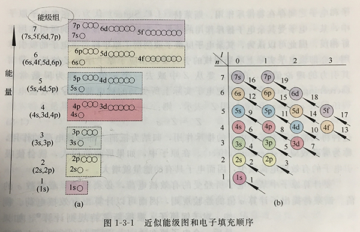
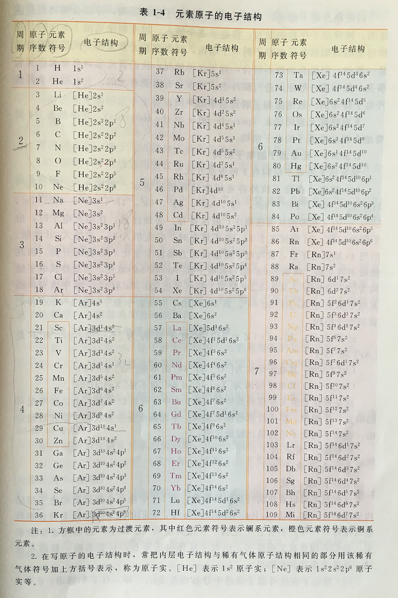

第一部分 物质结构和存在形态

## 0101. 原子结构

1、原子是由原子核和电子组成的。

在化学反应中，原子核并不发生变化，而只是核外电子的运动状态发生变化，对核外电子状态描述最早的是波尔理论。

2、每一元素原子都有自己特定的现状光谱，发出特定颜色的光。

现代照明利用钠原子发出 589nm 的黄光，制成高压钠灯，高效节能，光亮可见度高，透雾能力强，已代替传统的钨丝灯用于道路、桥梁、机场等照明。

3、微观粒子运动的主要特点是量子化和波粒二象性。

波粒二象性即光具有波动和粒子双重性质，光的干涉、衍射等现象说明光具有波动性，光电效应、原子光谱说明光具有粒子性。

4、测不准原理。

反应微粒具有波动性，不服从经典力学规律，不能同时测量到其速度和位置，速度「能量」测准的话位置就测不准了。

5、原子核外的电子运动状态可以用波函数「波动性」来描述，波函数可以通过解量子力学的基本方程薛定谔方程求得。

6、四个量子数的概念。

求解薛定谔方程「描述原子核外电子的运动」需确定确定 3 个量子数 n，l，m，还需要一个来描述电子自旋的自旋量子数 ms。

1）主量子数 n，决定电子在核外出现概率最大区域离核的平均距离，1234567，也可用代号 KLMNOPQ 表示，n=1 时平均距离最近，能量最低。

2）角量子数 l，电子运动在离核距离等同的区域内，也就是 n 值相同，电子云的形状不同能量还稍微有些差距，l 就是描述电子云的形状的。

l 值可以取从 0 到 n-1 之间的正整数，l 值 01234 对应的l符号为 spdfg，s 电子云呈球形对称；p 电子云呈哑铃形；d 电子云呈花瓣形。

当 n 值相同 l 值不同时，同一电子层又形成了若干电子亚层；s 亚层离核最近，能量最低。

3）磁量子数 m，是描述电子云在空间上沿不同的方向伸展，磁量子数 m 取从 +l 到 -l 包括 0 在内的正整数。l 确定后 m 有「2l+1」个。

把 nlm 都确定的电子运动状态称为原子轨道，s 只有 1 个原子轨道，p 亚层有 3 个原子轨道，d 亚层有 5 个原子轨道，f 亚层有 7 个原子轨道。

空间的取向不同并不影响电子的能量，所以 l 相同的几个原子轨道能量是等同，这样的轨道称为等价轨道或简并轨道；电子的 n=1 有 1 个原子轨道，n=2 有 4 个原子轨道，n=3 有 9 个原子轨道，n=4 有 16 个原子轨道。

4）自旋量子数 ms，原子中的电子不仅绕核旋转还绕着本身的轴做自旋运动。ms 只有 2 个值，+1/2 和 -1/2。

4 个量子数全了才能说明一个电子的运动状态。比如对原子中的某一电子来说，如果指出 n=2，可以是 s 电子，也可以是 p 电子，如果指出 l=1，则是 p 电子，但 p 电子有 3 种不同的空间伸展方向，需指出 m 值，最后必须指出其自旋方向。

7、多电子原子的能级。

氢原子只有一个电子，其能量只取决于主量子数 n，与角量子数无关；多电子原子中，由于电子间的相互排斥作用，使得主电子数相同的各轨道产生分裂，主量子数相同各个轨道的能量不再相等，所以多电子原子中各个轨道的能量不仅取决于 n，还和 l 有关。

8、轨道能级的判断。

用该轨道的「n+0.7l」值来做判断，值越小能级越低；4s 和 3d 两个状态的值分别为 4 和 4.4，所以 4s 的能级小于 3d，ns 能级均低于 (n-1)d 的能级，这种 n 值大的亚层能量反而比 n 值小的低的现象称为能级交错；分为了 7 个能级组，可以看 P23 页的能级图。

1『这里的 7 个能级组，一定要能随意默写出来，反复记忆。（2021-01-11）』

9、原子核外电子排布遵循的 3 个原则。

1) 能量最低原理，填充电子时，电子先进能级图里能量最低的原子轨道里。

2) 泡利不相容原理，同一个原子中，不可能有 2 个电子具有相同的 4 个量子数，可自旋 ms 不同，即同一轨道最多能容纳 2 个自旋方向不同的电子；n 代表层号，那么该层电子的最大容量为 2n^2。

3) 洪特规则，同一亚层的各个轨道「等价轨道」上，电子的排布将尽可能分占不同的轨道，并且自旋方向相同，也叫最多等价轨道规则。

10、元素的性质主要取决于外层电子。

11、电离能 I 的概念。

从元素中移去电子必须消耗能量以克服核电荷的吸引力；元素的气态原子在基态时失去一个电子成为一价正离子所消耗的能量称为第一电离能 I1；电离能反应了原子失去电子的难易，电离能越大原子失去电子时吸收能量越多，也就是越难。

12、电子亲和能 EA 的概念。

原子得到电子就要释放能量；元素的气态原子在基态时得到一个电子成为一价气态负离子所放出的能量称为电子亲和能 EA，当负一价离子获得电子时，要克服负电子之间的排斥力，因此需要吸收能量；非金属原子的第一电子亲和能总是负值，而金属原子的电子亲和能一般为较小的负值或正值。

同一周期中以卤素的电子亲和能的负值最大；碱土金属电子亲和能因它们的半径大，且具有 ns2 外电子层结构，不易结合电子；氮原子的电子亲和能为 6.75KJ/mol 是比较特殊的，因其 2s22p3 外电子层结构比较稳定，得电子的能量较小，且氮原子半径小，电子间排斥大，所以吸收能量仅仅略大于放出的能量。同理，卤素中电子亲和能负数最大的是氯而不是氟，这还是因为 F 原子的半径小，进入的电子受到原有电子较强的排斥力，为此消耗较多能量所致。查了下，硼、碳、氮、氧、氟的半径都比较小。

13、电负性 X 的概念。

电负性是原子在分子中吸引电子的能力；鲍林指定氟的电负性为 4.0，并根据热化学数据比较各元素原子吸引电子的能力，得到其他元素的电负性，X 越大说明原子在分子中吸引电子的能力越强。

14、元素的金属性和非金属性的概念。

元素的金属性是指其原子失去电子而变成正离子的性质，元素的非金属性是指其原子得到电子变成负离子的性质；元素的原子越容易失去电子，金属性越强，越容易获得电子非金属性就越强。

元素电负性数值越大，原子在分子中吸引电子的能力越大，所以非金属性也越大；一般来说非金属的电负性大于 2，金属的电负性小于 2。

15、氧化值和价电子的概念。

元素的氧化值表示化合物中各个原子所带的电荷数，该电荷数是假设把化合物中的成键电子都指定归于电负性最大的原子而求得。

元素参加化学反应时，原子常失去或获得电子以使其最外层电子层结构达到 2、8、18 个电子的稳定结构；在化学反应中，参与化学键形成的电子称为价电子；元素的氧化值决定于价电子的数目，而价电子的数目则决定于原子的外电子层结构。

## 0102. 分子结构和分子间力

1、分子是反应的基本单元。

分子是由原子组成的，分子是保持物质基本化学性质的最小微粒，并且又是参与化学反应的基本单元。

2、分子结构的因素。

分子的性质取决于分子的化学组成和分子结构，分子结构通常包含 2 个内容，一个是分子中直接相邻的原子之间的强相互作用力，也就是化学键；另一个是分子中的原子在空间的排列，即空间构型。

3、分子间力。

相邻的分子间存在着的较弱的相互作用，也称为范德华力。气体分子凝集成液体或固体，主要就是靠这种作用力。分子间力对物质的熔点、沸点、熔化热、汽化热、溶解度以及粘度等物理性质起着重要的作用。

4、分子形成的几个理论。

1）离子键理论。不同原子之间相互化合时，都有达到稀有气体稳定状态时的倾向，首先形成正、负离子，然后通过静电吸引形成化合物，该理论只能说明离子型化合物如氯化钠等的形成。

2）共价键理论。分子的形成是又相同的原子间共享电子对的结果。共价键理论的基本要点有 2 个：

a) 自旋方向相反的未成对电子互相配对可以形成共价键。若 A、B 两个原子各有 1 个未成对的电子，则可形成 AB 共价单键；若 A、B 两个原子各有 2 个或 3 个未成对的电子，则可则可形成 AB 共价双键和三键；若 A 原子有 2 个未成对电子，B 原子有 1 个，则 A 与 2 个 B 形成 AB2 分子。这就决定了共价键的饱和性。

b) 在形成共价键时原子轨道总是尽可能地达到最大限度的重叠使体系能量最低。这就决定了共价键的方向性。

共价键理论可以说明一些简单分子的内部结构，但有些不行，比如 CH4，C原子只有 2 个未成对电子的。杂化轨道理论可以更好地解释分子的实际空间构型和稳定性。

3）杂化轨道理论。杂化的概念是从电子具有波动性的角度出发的，在形成分子时，中心原子的若干不同类型、能量相近的原子轨道经过混杂平均化，重新分配能量和调整空间方向组成数目相同、能量相等的新的原子轨道。

孤立的原子轨道本身并不杂化，只有当原子相互结合的过程中需要发生原子轨道的最大重叠，才会使原子内原来的轨道发生杂化以发挥出更强的成键能力。

杂化理论的基本要点有：a）同一原子中能量相近的原子轨道杂化；b）杂化时，一般使成对电子激发到空轨道而成单个电子，其所需能量完全由成键时放出的能量予以补偿；c）一定数目的原子轨道杂化后可得数目相同、能量相等的各杂化轨道；

5、共价键的类型 `σπ`。

共价键的形成是由原子接近时它们的原子轨道相互重叠的结果，根据轨道重叠的方式及重叠部分的对称性划分为不同的类型，最常见的是 σ 键和 π 键。

σ 键原子轨道重叠方式是沿键轴方向相对重叠，原子轨道的重叠部位是在两原子核之间的键轴处，原子轨道重叠程度大，键的强度较大，化学活泼性不活泼；π 键原子轨道重叠方式是沿键轴方向平行重叠，原子轨道的重叠部位是在键轴上方和下方，键轴处为 0，原子轨道重叠程度小，键的强度较小，化学活泼性活泼。

共价单键为 σ 键，而在共价双键和三键中，除了 σ 键外还有 π 键；当 2 个原子间形成重键时，最多只能形成一个 σ 键。

6、键矩的概念。

就是化学键的偶极矩，是共价键极性的量度。当两个原子形成化学键时，共用电子对偏向电负性较大的一方而形成极性共价键。键矩的定义是元素所带部分电荷的电量乘以核间距「键长」，单位是库·米(C·m)，是一个矢量，方向从正到负。键矩的大小与成键 2 原子的电负性差值有关，对同核双原子形成的共价键，键矩为 0，是非极性共价键。

7、分子层面上，分子的极性和偶极矩。

任何分子都是带正电荷的核和带负电荷的电子组成的。有的分子正、负电荷中心不重合，这样分子就产生了极性，分子极性的大小常用偶极矩来衡量。

分子的偶极矩是分子中所有键矩的总和。双原子分子只有一个化学键，分子的偶极矩等于键矩，多原子分子的偶极矩主要决定于分子的组成和构型，几何构型对称「平面三角形、正四面体」的多原子分子，其偶极矩为 0，不对称的不为 0。

## 0103. 固体结构和固体的性能

固体分为晶体和非晶体：晶体是有整齐规则的几何外形、各向异性、有固定的熔点；非晶体，没有整齐规则的几何外形、各向同性、没有固定的熔点，非晶体中最具有代表性的是玻璃。

## 0104. 物质的聚集状态

1、聚集状态的概念。

当粒子的热运动与相互作用的相对强弱程度不同时，物质便呈现出不同的聚集状态。

对于气体，分子热运动很强，因而分子能够克服相互吸引力，在盛装它们的容器中运动，能够充满容器的整个空间。对于液体和固体，它们的分子热运动较弱，分子间强烈的相互作用力足以克服热运动的影响，而使分子或离子聚集在一起。

2、等离子体。

物质的聚集状态随外界条件的改变而变化。实际上，在特定的条件下，物质还能以第四种聚集状态，等离子体的状态存在。

如果对气体加热或者放电，当吸收的能量足以破坏分子中原子核和电子的结合时，气体就会发生电离，把带电离子密度达到一定数值时的电离气体称为等离子体。

3、气体。

5.1.1 理想气体

理想气体的简化微观模型：气体分子大小本身可以忽略不计；分子在没有接触时相互没有作用力，分子间的碰撞是完全弹性的碰撞；对于低压气体，其分子间的间距很大，相互作用极其微弱，分子本身的大小相对于气体的体积可以忽略不计；

阿伏伽德罗常量；一般计算时取 6.022×10^23，它的正式的定义是 0.012kg C12 中包含的 C12 的原子的数量；历史上，将 C12 选为参考物质是因为它的原子量可以测量得相当精确。

现在此常量与物质的量紧密相关，摩尔作为物质的量的国际单位制基本单位，被定义为所含的基本单元数为阿伏伽德罗常量(NA)。其中基本单元可以是任何一种物质（如分子、原子或离子）。

密度=pM/RT，此式表明在相同的温度压力下，密度与摩尔质量成正比，气体的摩尔质量越大就越重；氢气的摩尔质量是 2，空气的是 29，那么氢气的密度大约是空气的 1/14。

5.1.2 气体分子运动论

5.1.3 实际气体

压缩因子：压缩因子有大于 1 也有小于 1 的原因，实际气体本身有体积导致减少了可被压缩的空间，使实际气体比理想气体更难压缩，这个因素导致了压缩因子大于 1；实际气体又有相互作用力，导致实际气体比理想气体更容易压缩，这个因素导致了压缩因子小于 1。

范德华方程：状态方程有很多，基本可以分为 2 大类，其中一类是直接针对实际气体偏离理想气体的根本原因，从分子本身大小和分子间相互吸引力这些物质的本性出发，对理想气体状态方程进行修正，在这类方程中最著名的就是范德华方程；方程中吸引力的修正是内压，分子大小的修正是已占体积。

4、液体。

液体分子主要是在不固定的平衡位置附近进行着微小的振动，另一方面，液体中的分子是密集在一起的，其分子间吸引力的数量级大致与固体的相当。

液体的蒸汽压：就是液体的饱和蒸汽压，取决于物质的本身以及温度。这么一个概念，一定的温度下当液体的蒸发速率和蒸气的凝结速率相等平衡的时候，即相平衡时，此时的蒸气是饱和蒸气，饱和蒸气的压力就是该温度下该液体的饱和蒸气压；从这个角度来理解沸点，饱和蒸气压随温度的升高而升高，当饱和蒸气压等于外压的时候，液体就沸腾了，即沸点，那么外压越高的话沸点也就越高了。

5.2.2 溶液

溶液的概念：一种物质以分子或离子的状态均匀地分散在其他物质中得到的分散系统称为溶液；含量少的是溶质、含量多的是溶剂；以水为溶剂的就是水溶液，简称溶液；溶液有非电解质溶液和电解质溶液。

稀溶液的依数性：以难挥发性非电解质为溶质的溶液，相对于纯溶剂有 4 个共同的性质；蒸气压降低、沸点升高、凝固点降低以及渗透压。

蒸气压降低。溶液的饱和蒸气压比纯溶剂的小，由于溶质是难挥发的，溶液的蒸汽压实际上就是溶液中溶剂的蒸气压，从蒸汽压的初始概念上来说，由于溶质的加入，溶剂分子的浓度降低了，溶液的部分表面也被难挥发的溶质分子所占据，导致单位时间内从单位液体表面逸出的溶剂分子减少了。

一个典型的例子就是拉乌尔定律，溶液的饱和蒸汽压等于同温度下纯溶剂的饱和蒸汽压与溶液中溶剂的摩尔分数之积；换个说法，压降等于同温度下纯溶剂的饱和蒸汽压与溶液中溶质的摩尔分数之积。

沸点升高。从饱和蒸汽压等于外压时的温度即沸点这个角度来看，同样的外压下，只有温度升高使溶液的饱和蒸汽压升高到跟纯溶剂饱和蒸气压同一个高度才达到沸腾。

凝固点降低。凝固点的概念，纯溶剂的凝固点是指纯溶剂固体的蒸汽压等于纯溶剂饱和蒸汽压时的温度；溶液的凝固点是指纯溶剂固体的蒸汽压等于溶液中溶剂的饱和蒸汽压时的温度。

一个典型的例子就是，冬天为了防止汽车水箱里的水冻结，通常预先在水中加入少量的乙二醇、甘油等物质，这样可以降低水的凝固点。

渗透压。半透膜的概念，是一种只允许一些物质透过而不允许另一些物质透过的天然或人造薄膜，例如动物的膀胱、植物的细胞壁；渗透压的概念说明，用半透膜将容器中纯水和蔗糖溶液隔开，水就从纯水侧往溶液侧转移导致溶液侧的液面上升，要阻止这种渗透的话必须对溶液附加一个压力，这个压力即为渗透压；渗透压等于 cRT，c 为稀溶液的物质的量浓度，R 是通用气体常数，T 是热力学温度；海水的渗透压一般在 3MPa 左右。

5.3 相图

相图的概念：把纯物质处于相平衡时的温度、压力之间的关系用图表示就是相图。

相图中的面，即相区，自由度是 2，温度和压力，左上角是固相，右上角为液相，下方是气相；相图中的线，即两相平衡时温度和压力的关系，自由度是 1，温度或压力；相图中的点，即三相平衡点，自由度是 0，温度和压力是定值。