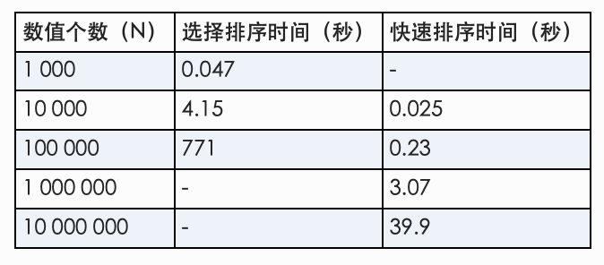

# 04 算法

什么是软件？一个通俗的比喻是做菜用的菜谱。菜谱会列出做某个菜所需的原材料、烹饪步骤以及预期结果。类似地，程序也要描述待操作的数据，讲清楚要对数据做什么，以及产出什么结果。不过，菜谱与任何程序都不能比，因为它含糊，容易产生歧义。所以这个比喻并不是非常恰当。比如，我家那本《烹饪的快乐》（Joy of Cooking）在说到打鸡蛋时，说要「放在一个小碗里：1 个鸡蛋」，但没说必须先把蛋磕开，把壳去掉。

用纳税申报表来作比喻更准确一些：这些表格极其详尽地说明了你应该做什么（从第 29 行减去第 30 行。如果结果是 0 或更小，则输入 0。给第 31 行乘上 25%，……）。虽然这个比喻也不完美，但与菜谱相比，纳税申报表在说明计算过程方面更胜一筹：数学计算必不可少，数据从一个位置被复制到另一个位置，后续的计算取决于之前计算的结果。

对于纳税来说，这个过程应该是完整的，无论什么情况下都应该得出一个结果，即应纳税额。应该是毫无疑义的，只要开始的数据相同，任何人都应该得到相同的最终结果。而且应该在有限的时间内完成。从我个人经验来看，这几条都是理想化的，因为术语并不总是很明了，计算说明也比税务机关的说法含糊很多，而且要使用什么数据经常也不好确定。

算法，就是保证特定计算过程正确执行的一系列步骤，它是计算机科学中的菜谱或纳税申报表，只不过编制得更仔细、更准确、更清楚。算法的每一步都表达为一种基本操作，其含义都是完全确定的，如「两个数相加」。任何事物都没有歧义，输入数据的性质也是既定的。所有可能的情况都会涵盖，而算法绝不会遇到一种它不知道接下来该做什么的情况。（计算机科学家有时候也不免书生气，因此通常会给算法多加一个限定条件：任何算法最终必须停止。根据这个标准，经典的洗发水使用说明「起泡、冲洗、重复」就不能说是算法了。）

设计、分析和实现高效的算法是学院派计算机科学的工作核心，而在现实世界中也有很多算法意义重大。我没有打算滴水不漏地解释或说明各种算法，但我想让大家了解相关的思想，即详尽地描述一系列操作步骤，不管执行这些步骤的实体有没有智能或创造力，都能对这些步骤是什么意思以及如何执行做到毫无疑义。另外，我还想谈一谈算法的效率，也就是计算时间与要处理的数据量之间存在什么关系。为此，我会分析几个常见且容易理解的基本算法。

虽然不必把本章中的每一句话或者偶尔出现的公式都搞明白，但其中的思想还是值得读者深入研究的。

## 4.1 线性算法

假设我们想找出谁是房间里个子最高的人。我们可以四下里看看，然后猜一猜会是谁。然而，算法则必须精确地列出每一个步骤，从而让不会说话的计算机都能遵照执行。最基本的做法就是依次询问每个人的身高，并记住到目前为止谁最高。于是，我们可能会问「约翰，你多高？玛丽，你呢？」等等。如果我们第一个问的是约翰，那么当时他是最高的。如果玛丽更高，则现在她是最高的人，否则，约翰仍然最高。无论如何，我们都会接着问第三个人。在问完每个人之后，我们就会知道究竟谁最高以及到底有多高。类似的方法还可以找出最有钱的人，或者名字在字母表中最靠前的人，或者谁的生日最接近年底，谁在 5 月出生，以及谁叫克里斯。

会遇到一些复杂的情况。比如如何处理重复的数据，或者说要是有两三个人的身高一样怎么办？我们可以决定只记录第一个人、只记录最后一个人，或者随机记录其中某一个人，再或者记录他们所有人。请注意，找出同样身高的所有人是比较困难的。因为必须记住所有这些人的名字，不问完最后一个人，我们是无法知道这些信息的。这个例子涉及数据结构，即如何表示计算过程中所需的信息。数据结构对很多算法而言都是非常重要的，但在这里我们不会谈太多。

怎么计算所有人的平均身高？可以询问每个人的身高，每问完一个就加一个（或许可以使用玩具程序来进行累计），最后用累计和除以人数。假设一张纸上写着 N 个人的身高，那这个例子更像「算法」的表达方式如下：

```
把累计和 sum 设置为 0 
对这张纸上的每一个身高值 height 
    把 height 加到 sum 上 
平均身高等于 sum/N
```

但是，如果让计算机来做这件事，就必须多加小心。例如，要考虑到假如纸上没有身高值怎么办？这对人来说不是问题，因为我们知道这意味着什么也不用做。但对计算机来说，我们必须告诉它如何测试这种情况，出现这种情况该怎么办。假如不事先测试，那它就会尝试用零去除 sum，而这个操作是未定义的。算法和计算机必须处理所有可能的情况。如果你看到过「0 美元 00 美分」的支票，或者收到过尚欠余额为 0 元的账单，那就是因为计算机系统没有全面测试所有可能的情况。

如果我们事先不知道有多少个数据项怎么办（这种情况很常见）？那就得重写算法，让它在累计和的同时计算有多少项。

```
把累计和 sum 设置为 0 
把项数 N 设置为 0 
只要有剩下的身高值要处理 
    把下一个 height 加到 sum 上 
    给 N 加 1 
如果 N 大于 0 
    平均身高是 sum/N 
否则 
    就说没有给出身高值
```

这是避免出现除数为零的问题一种方式，即明确地测试极端情况。

算法的一个关键属性是其效率有多高 —— 对于给定的数据量，它们的处理速度是快还是慢，要花多长时间？对于上面给出的例子，计算机要执行多少步，或者需要花的时间有多长，与它必须处理的数据量成正比：如果房间里的人多出一倍，就要多花一倍时间才能找到最高的人，或者才能计算出平均身高；如果人数是现在的十倍，就要花十倍的时间。如果计算时间与数据量成正比或叫线性比例，那该算法就叫做线性时间算法或线性算法。以数据量为横坐标，以时间为纵坐标画一条线，得到的将是一条向右上方延伸的直线。我们平时遇到的大多数算法都是线性的，因为它们对某些数据所执行的基本操作是相同的，数据越多工作量也会同比例增加。

线性算法的基本形式都一样。可能需要进行一些初始化，如把累计和的初值设置为 0，或者把最大的身高值设置为一个较小的值。然后依次检查每一项，对它完成一次简单的计算，如计数、与上一个值比较，或进行简单的变换。最后，可能需要再做一些计算，如计算平均值、打印累计和或最大的身高值。如果对每一项执行操作所花的时间相同，那么总时间与数据项数就是呈正比的关系。

## 4.2 二分搜索

那我们还可以做得更好一些吗？假设我们面前有一大堆打印出来的人名和电话号码，或者一沓名片。如果名字并没有特定的顺序，而我们想找到迈克·史密斯（Mike Smith）的号码，那就必须一个名字一个名字地找，直至找到他的名字为止（或者没找到，因为根本就没有这个人）。如果名字是以字母顺序排列的，我们就可以做得更好。

想想我们是怎么从老式的电话簿中查人名的。首先，我们会从接近中间的地方开始查。如果要找的名字比中间页上的名字在字母表中靠前，那后半本就不用看了，直接翻到前半本的中间（整本电话簿的四分之一处）；否则，前半本就不用看了，直接翻到后半本的中间（整本电话簿的四分之三处）。由于名字按字母顺序排列，每一步我们都知道接下来到哪一半里去找。最终，我们一定会找到那个名字，或者可以断定电话簿里根本就没有这个人。

这个搜索算法被称为二分搜索，因为每次检查或比较都会把数据项一分为二，而其中一半今后就不会再理会了。这其实也是常见的分而治之策略的一个应用。它的速度有多快？每一步都会舍弃一半数据项，因此所需要的步数就等于在处理最后一项之前，最初的项数被 2 除开的次数。

假设最初有 1024 个名字（这个数容易计算）。一次比较，就可以舍弃 512 个。再比较一次，还剩 256 个，然后是 128 个、64 个、32 个，接着是 16 个、8 个、4 个、2 个，最后剩下 1 个。总共比较了 10 次。显然，2^10 等于 1024 并非巧合。比较次数作为 2 的指数就能得到最初的数，而从 1 到 2 到 4…… 到 1024，每次都是乘以 2。

如果你还记得学校里讲过的对数（没有多少人会记得 —— 谁还记得？），那你应该知道一个数的对数就是底数（这里是 2）要得到该数需要自乘的次数。1024（以 2 为底）的对数等于 10，就是因为 2^10 等于 1024。对于我们而言，这里的对数就是要把一个数变成 1，反复除以 2 的次数；或者让 2 反复自乘，得到那个数所需的次数。本书不需要考虑精度或者小数，近似的数字和整数值足矣，纯粹是一种简化。

二分搜索的关键是数据量的增长只会带来工作量的微小增长。如果有 1000 个名字按字母顺序排列，那为了找到其中一个必须检查 10 个名字。如果有 2000 个名字，也只要检查 11 个名字，因为看完第一个名字立即就能舍弃 2000 个中的 1000 个，而这又回到了从 1000 个中查找的情形（检查 10 次）。如果有 1 000 000 个名字，也就是 1000 的 1000 倍，那么前 10 次测试就能减少到 1000，另外 10 次测试即可减少到 1，总共 20 次测试。1 000 000 是 106，约等于 2^20，因此 1 000 000（以 2 为底）的对数约等于 20。

由此，你就可以知道，在包含 10 亿个名字的名录（全地球的电话簿）中找 1 个名字，也只需要 30 次比较，因为 10 亿约等于 2^30。这就是为什么我们说数据量的增长只会带来工作量的微小增长 —— 数据量增长到 1000 倍，只需要多比较 10 次。

我们来验证一下，假设我要从一本旧的哈佛通讯录中找到我的朋友 Harry Lewis，这本 224 页的通讯录中有大约 20 000 个人名。我首先翻到 112 页，看到了 Lawrence。Lewis 在它后面，所以我又翻到 168 页，即 112 页和 224 页中间，找到了 Rivera。Lewis 在它前面，于是我翻到 140 页（112 页和 168 页中间），看到了 Morita。再向前翻到 126 页（112 页和 140 页中间）找到 Mark。随后是 119 页（Little）、115 页（Leitner）、117 页（Li），最后翻到 116 页。这一页大约有 90 个名字，在同一页上又经过 7 次比较，我从几十位 Lewis 中找到了 Harry。这个实验总共比较了 14 次，跟我们预期差不多，因为 20 000 介于 214（16 384）和 215（32 768）之间。

分而治之在现实当中也广泛应用于很多比赛的淘汰赛。比赛开始一般都有很多的选手，比如温布尔登网球公开赛男子单打比赛一开始有 128 位选手，每轮比赛都会淘汰一半，最后一轮剩下两个人，决出一名冠军。这并非巧合，128 是 2 的幂（2^7），所以温布尔登网球公开赛要打七轮。甚至可以想象举办一次全球规模的淘汰赛，即便有 70 亿个参赛者，也只要 33 轮就可以决出冠军。（如果你还记得第 2 章讨论过的 2 和 10 的幂，通过心算也很容易验证这一点）。

## 4.3 排序

不过，得先把这些名字按照字母顺序排列起来呀，怎么做到呢？如果没有这个先行步骤，就不能使用二分搜索。这就引出了另一种基本算法 —— 排序，把数据按顺序排好，后续搜索才能更快。

假设我们要把一些名字按照字母顺序排好，以便后面更有效地使用二分搜索。那么可以使用一个叫选择排序的算法，因为它会不断从未经排序的名字中选择下一个名字。这个算法的技巧，就是前面讨论的找出房间里最高的那个人所用的技巧。

好，让我们就把下面这 16 个熟悉的名字按字母顺序排列一下：

    Intel Facebook Zillow Yahoo Picasa Twitter Verizon Bing Apple Google Microsoft Sony PayPal Skype IBM Ebay

首先是 Intel，它是到目前为止按字母排序后的第一个名字。Facebook 在字母表中更靠前，所以它暂时又成为第一个。Zillow 不靠前，而且直到 Bing 才取代 Facebook，但 Bing 随后又被 Apple 取代。我们接着比对其余名字，没发现一个位于 Apple 之前的，因此 Apple 是这个序列中真正的第一个，当前的结果如下：

    Apple Intel Facebook Zillow Yahoo Picasa Twitter Verizon Bing Google Microsoft Sony PayPal Skype IBM Ebay

现在，重复上述过程，找到第二个名字，从 Intel 开始 ——Intel 是未排序名字中的第一个名字。同样，Facebook 取而代之，然后是 Bing 成为第一个元素。第二遍之后的结果如下：

    Apple Bing Intel Facebook Zillow Yahoo Picasa Twitter Verizon Google Microsoft Sony PayPal Skype IBM Ebay

最终，通过这个算法得到了完全排好的名字列表。

选择排序的工作量有多大？它每次都会遍历剩余的数据项，每次都会找到字母顺序中的下一个名字。对于 16 个名字的排序，查找第一个名字要检查 16 个名字，查找第二个名字需要 15 步，查找第三个名字需要 14 步，依此类推，加起来总共要检查 16+15+14+...+3+2+1 个名字。当然，我们也可能很幸运，发现这些名字已经都按字母排好序了。但研究算法的计算机科学家可都是悲观主义者，他们假设的是最坏的情况（即这些名字都是按照字母顺序的反序排列的）。

检查名字的遍数与最初的数据项数成正比（我们例子中的数据项有 16 个，可以用一般化的 N 表示）。而每一遍要处理的项数都比前一遍少一项，所以选择排序算法一般化的工作量是：

    N + ( N - 1) + ( N - 2) + ( N - 3) + ... + 2 + 1

这个序列加起来等于 N×(N+1)/2（最简单的办法是把两头的项成对地加起来），也就是 N^2/2+N/2。忽略除数 2，可见选择排序的工作量与 N^2+N 成正比。随着 N 不断增大，N^2 最终会大得让 N 也可以忽略不计（例如，如果 N 是 1000，则 N^2 就是 1 000 000）。因此，结果就是工作量近似地与 N^2 即 N 的平方成正比，而这个增长率叫做二次增长。二次增长不如线性增长，事实上，差得很远。要排序的数据项增加到原来的 2 倍，时间会增加到原来的 4 倍；数据项增加到 10 倍，时间会增加到 100 倍；数据项增加到 1000 倍，时间会增加到 1 000 000 倍！这可不太好。

幸运的是，有办法让排序更快一些。我们简单地介绍一种巧妙的方法 —— 快速排序（Quicksort），这个算法是英国计算机科学家托尼·霍尔在 1962 年前后发明的（霍尔获得了 1980 年的图灵奖，获奖理由是包括快速排序在内的多项贡献）。快速排序也是分而治之的一个绝佳示例。

同样，下面还是那些未经排序的名字：

    Intel Facebook Zillow Yahoo Picasa Twitter Verizon Bing Apple Google Microsoft Sony PayPal Skype IBM Ebay

要使用快速排序算法给这些名字排序，首先要遍历一次所有名字，把介于 A 到 M 之间的名字放到一组里，把介于 N 到 Z 之间的名字放到另一组里。这样就把所有名字分成了两个组，每个组里包含一半名字（假设这些名字的分布不会很不均匀）。在我们的例子中，这两个组分别包含 8 个名字：

    Intel Facebook Bing Apple Google Microsoft IBM Ebay Zillow Yahoo Picasa Twitter Verizon Sony PayPal Skype

现在，遍历 A-M 组，把 A 到 F 分成一组，G 到 M 分成另一组；遍历 N-Z 组，把 N-S 分成一组，T-Z 分成一组。到现在为止，遍历了所有名字两次，分成了四个组，每个组包含四分之一的名字：

    Facebook Bing Apple Ebay 
    Intel Google Microsoft IBM 
    Picasa Sony PayPal Skype 
    Zillow Yahoo Twitter Verizon

接下来再遍历每个组，把 A-F 分为 ABC 和 DEF，把 G-M 分成 GHIJ 和 KLM；同样，对 N-S 和 T-Z 也如法炮制。这样，就有了 8 个组，每组差不多有 2 个名字：

    Bing Apple 
    Facebook Ebay 
    Intel Google IBM 
    Microsoft 
    Picasa PayPal 
    Sony Skype 
    Twitter Verizon 
    Zillow Yahoo

当然，到最后我们不仅仅要看名字的第一个字母，比如要把 IBM 排到 Intel 前面，把 Skype 排到 Sony 前面，就得继续比较第二个字母。但就这样多排一两遍，即可以得到 16 个组，每组 1 个名字，而且所有名字都按字母顺序排好了。

整个过程的工作量有多大？每一遍排序都要检查 16 个名字。假设每次分割都很完美，则每一遍分成的组分别会包含 8、4、2、1 个名字。而遍数就是 16 反复除以 2 直到等于 1 为止除过的次数。结果就是以 2 为底 16 的对数，也就是 4。因此，排序 16 个名字的工作量就是 16log216。在遍历 4 遍数据的情况下，快速排序总共需要 64 次操作，而选择排序则需要 136 次。

该算法可以对任何数据进行排序，但只有在每次都能把数据项分割成大小相等的组时，它才是最有效的。对于真实的数据，快速排序必须猜测数据的中位值，以便每次都能分割出相同大小的组。好在，只要对少量数据项进行采样，就可以估计出这个值。一般来说（忽略某些细节上的差别），快速排序在对 N 个数据项排序时，要执行 NlogN 次操作，即工作量与 NlogN 成正比。这与线性增长比要差一些，但还不算太坏，在 N 特别大的情况下，它比二次增长即 N^2 增长可以好太多了。

为此我做了个实验，随机生成了 1000 万个 9 位数，用于模拟美国的社会保障号，记录了不同规模的分组排序下所花的时间，测试了选择排序（N^2 即二次增长）和快速排序（NlogN）。下表中的短划线表示没有做该项测试。



精确测量运行时间很短的程序并不容易，因此这些测试数据的误差可能比较大。但无论如何，还是可以（粗略地）看到快速排序意料之中的 NlogN 式的时间增长，同时也能看到尽管选择排序的效率难以与之匹敌，但在 10 000 个数据项以内时还是可以接受的；而且，在每个数量级上，选择排序都被快速排序毫无悬念地抛在了后头。

另外也要注意，在对 100 000 个数值进行排序时，选择排序的时间是对 10 000 的数值进行排序时的近 200 倍，而不是我们期望的 100 倍。几乎可以肯定，这是缓存效应 —— 由于这些数据并没有全部保存在缓存中，所以排序变慢了。

## 4.4 难题与复杂性

刚才，我们对算法的「复杂性」或运行时间进行了简单的剖析。一个极端是 logN，即二分搜索的复杂性，它表示随着数据量的增加，工作量的增长非常缓慢。最常见的情况是线性增长，或者说简单的 N，此时工作量与数据量是成正比的。然后是快速排序的 NlogN，比 N 差（增长快），但在 N 非常大的情况下仍然特别实用。还有就是 N^2，或者二次增长，增长速度太快了，既让人无法忍受又不切实际。

除了这些之外，还有其他很多种复杂性，有的容易理解（例如三次增长，即 N^3，比二次增长还差，但道理相同），有的则很难懂，只有少数专业人士才会研究。但有一个还是非常值得了解一下，因为它在现实当中很常见，而且从复杂性上说特别糟糕，这就是所谓的指数级增长，用数学方法表示是 2^N（与 N^2 可不一样）。指数级算法的工作量增长极快：增加一个数据项，工作量就会翻一番。从某种意义上讲，指数级算法与 logN 算法是两个极端，后者数据项翻一番，工作量才增加一步。

什么情况下会用到指数级算法呢？那就是除了一个一个地尝试所有可能性，没有更好的办法的情况。谢天谢地，指数级算法总算是有点用武之地的。有些算法，特别是密码学中的算法，都是让特定计算任务具有指数级难度的。对于这样的算法，只要选择了足够大的 N，其他人在不知道某个秘密捷径的情况下，是不可能通过计算直接解决问题的。第 10 章还会再介绍密码学。

现在你只要知道有些问题容易解决，而有些问题则要难得多就可以了。实际上，关于解决问题的难易程度，也可以表达得更加精确一些。所谓「容易」的问题，都具有「多项式」级复杂性。换句话说，解决这些问题的时间可以用 N^2 这样的多项式来表示，其中指数可以大于 2，但都是可能被解决的。（忘了什么是多项式啦？不要紧，多项式在这里就是指一个变量的整数次幂，比如 N^2 或 N^3。）计算机科学家称这类问题为「P」（即「Polynomial」，多项式），因为它们可在多项式时间内解决。

现实中大量的问题或者说很多实际的问题似乎都需要指数级算法来解决，也就是说，我们还不知道对这类问题有没有多项式算法。这类问题被称为「NP」问题。NP 问题的特点是，它可以快速验证某个解决方案是否正确，但要想迅速找到一个解决方案却很难。NP 的意思是「非确定性多项式」（nondeterministic polynomial），这个术语大概的意思是：这些问题可以用一个算法在多项式时间内靠猜测来解决，而且该算法必须每次都能猜中。在现实生活中，没有什么能幸运到始终都做出正确的选择，所以这只是理论上的一种设想而已。

很多 NP 问题都会牵扯大量技术细节，三言两语也解释不清楚。不过倒是有一个问题很好解释，乍一看还挺有意思的，而且其实际应用也比较广。

这就是「旅行推销员问题」（Traveling Salesman Problem）。一个推销员必须从他居住的城市出发，到其他几个城市去推销，然后再回家。目标是每个城市只到一次（不能重复），而且走过的总距离最短。这个问题跟最短校车或者垃圾车路线有异曲同工之妙。很早以前我在研究这个问题的时候，其原理经常被应用于设计电路板上孔洞的位置，或者部署船只到墨西哥湾的特定地点采集水样。

旅行推销员问题已经被仔细推敲了 50 多年，尽管能用它来解决的问题更加多样化了，但解决方案的核心依然是从所有路径中更巧妙地找出最短路径。同样，有许多的其他问题，尽管类型不同，形式各异，也都面临同样的命运：我们没有什么好办法有效地解决它们。

对于研究算法的人来说，这个现实令人沮丧。我们不知道到底是这些问题本质上就很难解决呢，还是因为人类不够聪明，所以至今都没有找到更好的解决办法。当然，不管怎么说，人们更愿意相信它们「本质上就很难解决」。

1970 年，斯蒂芬·库克（Stephen Cook）证明了一个非同小可的数学结论，就是说所有这些问题其实都是等价的，只要我们找到一个多项式时间算法（复杂性类似 N^2）解决其中一个问题，那我们据此就能找到所有问题的多项式时间算法。库克因此获得了 1982 年的图灵奖。

美国克雷数学研究所（Clay Mathematics Institute）公布了 7 个悬而未决的问题，解决其中一个就可以获得 100 万美元奖金。而问题之一是：P 是否等于 NP？换句话说，这些难题到底跟那些简单的问题是不是一类？（7 个问题中的另一个，可以追溯到 20 世纪初的「庞加莱猜想」，已经被俄罗斯数学家格里戈里·佩雷尔曼解决，奖金已经在 2010 年发放。所以，现在还剩下 6 个待解决的问题 —— 为了防止别人捷足先登，解题要趁早噢～）

对于这种复杂性，有几个地方需要特别注意。虽然 P=NP 问题很重要，但它更多的是一个理论问题，而不是一个实际问题。正如计算机科学家所说的，复杂性结果就是「最坏的」结果，有些问题的实例可能需要投入全部时间和精力，但并不是所有实例都那么难解决。这些问题也具有「渐近」的特点，也就是说，只有 N 值特别大的情况下才值得考虑。在现实生活中，或许大多数问题都能找到简单的解决办法，或许从实用角度看，近似的结果也是完全可以接受的，或许 N 很小，考虑不考虑渐近问题根本无关紧要。

举例来说，如果你只需要对几十或者几百个数据项进行排序，那选择排序可能就足够快了，尽管其复杂性是二次方的，而且与快速排序的 NlogN 相比是每况愈下。如果你只需造访五六个城市，要尝试所有可能的路线不是什么难事儿，但如果是 60 个城市，就有点不可行了，而 600 个城市也这么做根本就是不可能的。最后，在大多数情况下，一个近似的解决方案可能就足够好了，完全没有必要追求所谓的绝对最佳方案。而能够给出合理近似答案的算法可能要多少有多少，其中很多可能还更切合实际。

另一方面，一些重要的应用，如加密系统，则完全是建立在某个特定的问题确实极难解决的基础之上的。因此，你若能发现出一种攻击方法，无论其有多么不切实际，也都是意义非凡的。

## 4.5 小结

重塑人们对「我们能计算多快」的认识，多年来一直是计算机科学研究的主题。而用数据量来表示运行时间/次数（如 N 、logN 、N^2 或 NlogN ），则是这一领域研究成果的集中体现。它不去纠结于这台计算机是不是比那一台更快，或者你是不是一个比我更优秀的程序员之类的问题，而是抓住了程序或算法背后的复杂性。正因为如此，才非常合适比较或推断出某些计算是否可行。（一个问题固有的复杂性和解决这个问题的算法的复杂性并不是一个概念。比如，排序是一个 NlogN 问题，但快速排序是一个 NlogN 算法，而选择排序则是一个 N^2 算法。）

算法和复杂性的研究是计算机科学的一个重要组成部分，既有理论也有实践。我们感兴趣的是哪些问题可以计算，哪些不可以，以及如何在无需更多内存的情况下计算得更快（或者是同样速度下使用更少的内存）。我们期待全新的、更好的计算方法。快速排序就是一个典型的例子，尽管它已经出现很多年了。

现实生活中，有许多重要的算法比我们这里介绍的简单的搜索和排序更专业更复杂。例如，压缩算法旨在让声音（MP3）、图片（JPEG）和电影（MPEG）占用更少的存储空间。错误检测和校正算法也很重要。数据在存储和传输（例如通过嘈杂的无线信道）过程中可能会受到损害；控制数据冗余的算法可以检测甚至纠正某些错误。在第 9 章介绍通信网络的时候，我们还会继续讨论这个话题。

密码学高度依赖于算法，它需要发送只让好人看懂而不能让坏人破解的加密消息。我们将在第 10 章讨论密码学，因为它与通过计算机交换私密信息紧密相关。

对于必应和谷歌等搜索引擎而言，算法同样至关重要。从原理上讲，搜索引擎所做的大量工作都很简单，无非是收集网页、组织信息，使其便于搜索，所不同之处在于数据规模极大。如果每天有数十亿次查询，要搜索数十亿个网页，那么即使 NlogN 的复杂性也是无法接受的。为了跟上日益增长的 Web 数据量，满足我们通过它进行搜索的需求，人们在改进算法和编程方面投入了大量聪明才智，以确保搜索引擎能够足够快。我们将在第 11 章里更详细地讨论搜索引擎。

