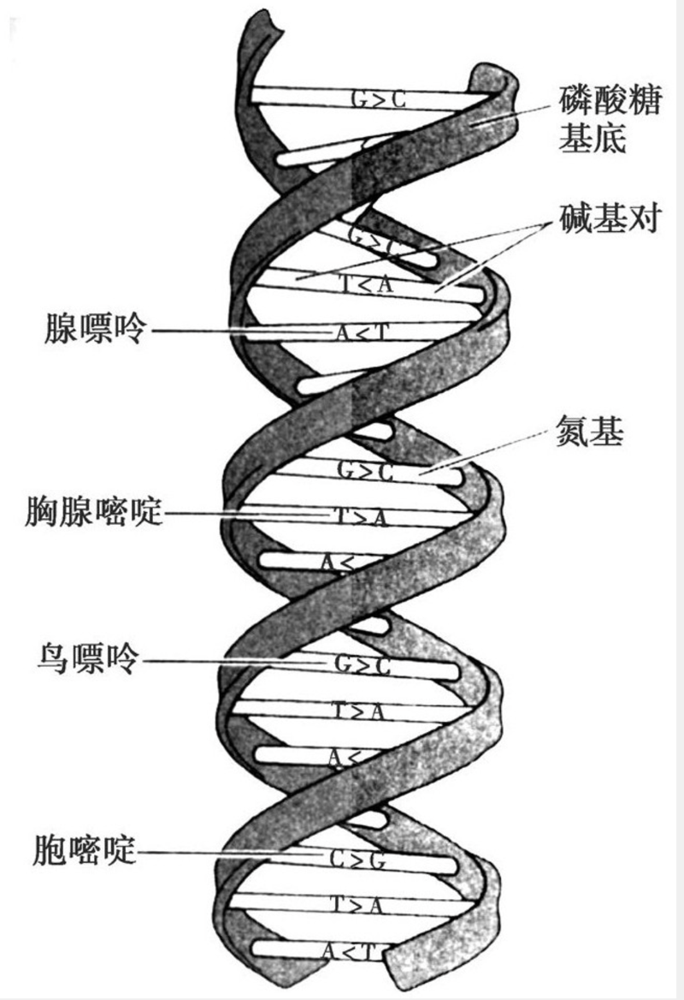

# 0601. 遗传学概要

近几十年来，分子生物学的进展已经改变了大多数生物学家对于进化的认识，并且对现代综合形成了挑战。在第 18 章我将阐释其中一些结果，并介绍它们对遗传学和进化理论的影响。为了进行后面其他部分的讨论，这一章将简要介绍一些遗传学的基础知识。如果你对遗传学很熟悉，可以跳过这一章。

人们在 19 世纪早期发现所有生物都是由微小的细胞组成。在 19 世纪晚期又发现细胞的细胞核中有狭长的大分子，这种分子被称为染色体（因为它们很容易在实验中被染色），但是当时并不知道它们的功能。当时还发现细胞可以分裂成两个同样的细胞，从而复制自身，这个过程被称为有丝分裂，分裂过程中染色体会进行复制。我们身体中许多细胞每过几小时就会分裂一次 —— 这是身体发育、修复和日常维持的必要过程。

减数分裂也在同时期被发现，二倍体生物在产生卵子和精子时就是减数分裂。大部分哺乳动物都是二倍体生物，其他很多生物也是，它们的染色体（除了精子和卵子这些生殖细胞）都是成对出现（人类有 23 对）。减数分裂时，二倍体细胞会分裂成四个生殖细胞，每个生殖细胞的染色体数量为原细胞的一半。原细胞中每对染色体会断开，然后重组成新生殖细胞中的染色体。受精时，两个生殖细胞中的染色体会结合到一起，从而产生染色体数量正常的细胞。这样子代的染色体就是父母染色体的混合。这是有性生殖生物变异的主要来源。无性生殖的生物，后代与父代几乎一样。这确实很复杂，也难怪生物学家们花了很长时间才弄清是怎么回事。但这还只是开始。

1902 年，孟德尔的工作被重新发现后第二年，萨顿（Walter Sutton）首先提出染色体可能是遗传物质的载体。萨顿猜想染色体是由与孟德尔提出的因子相对应的单元（基因）组成，并且用减数分裂对孟德尔遗传学进行了解释。几年后，摩根（Thomas Hunt Morgan）用遗传学家的宠儿 —— 果妮 —— 做实验，证实了萨顿的猜想。不过，基因的分子结构以及它们如何产生出生物的生理性状仍然是个谜。到 20 世纪 20 年代末，化学家发现了核糖核酸（RNA）和脱氧核糖核酸（DNA），但是发现它们与基因的关联还要再过几年。

接着又发现染色体中含有 DNA，有些人开始怀疑 DNA 就是遗传物质。另一些人则认为细胞核中的蛋白质才是遗传物质。当然后来发现 DNA 才是正确答案，20 世纪 40 年代中期最终通过实验证明了这一点。但是还是有一些大的挑战。DNA 到底是怎样决定生物性状的？比如说高株和矮株？细胞有丝分裂时 DNA 又是如何复制？作为自然选择基础的变异为何会发生在 DNA 层面上？ 

此后 10 年，这些问题都大致得到了解决。最大的突破发生在 1953 年，沃森（James Watson）和克里克（Francis Crick）发现，DNA 的结构是双螺旋。20 世纪 60 年代初，几位科学家一起成功破解了遗传密码 —— DNA 如何编码构成蛋白质的氨基酸。孟德尔无法知道基因的分子结构，但认识到了基因的存在，而现在基因终于可以用编码特定蛋白质的 DNA 片段进行定义了。很快又发现了编码如何被细胞转化为蛋白质，DNA 如何复制自身，以及复制错误、突变和性重组如何引起变异。遗传学研究从此被引爆，此后迅速发展，直至现在。

生物的所有性状 —— 表型 —— 几乎都是源自细胞中蛋白质的特性及其相互作用。蛋白质是由氨基酸组成的长链分子。你身体中每个细胞都有几乎一样的完整 DNA 序列，DNA 序列由核苷酸连在一起组成。核苷酸含有称为碱基的化合物，碱基有四种形式，（缩写为）A、C、G、T。人类的 DNA 序列实际上是由 A、C、G、T 分子对组成的双线。

化学势使得 A 总是与 T 配对，C 则与 G 配对。序列经常用两行符号（碱基对）表示，例如： 

```
TCCGATT......
AGGCTAA......
```

在 DNA 分子中，双线相互缠绕，形成一条双螺旋（图 6.1）。基因就是由 DNA 的序列片段组成。大致上，一个基因对应于一个特定的蛋白质。基因编码了构成蛋白质的氨基酸。氨基酸的编码方式就是遗传密码。这个编码对地球上的所有生物几乎都是一样的。三个碱基对应一种氨基酸。例如 AAG 就对应苯基丙氨酸，CAC 则对应缬氨酸。这种三联体被称为密码子。

基因又是如何构造蛋白质的呢？每个细胞都有一套复杂的分子机制来进行这个工作。第一步是转录（图 6.2），这一步是在细胞核中进行。一种被称为核糖核酸聚合酶的活性蛋白会从双螺旋的一边松开一小段 DNA。然后这种酶会用 DNA 的一边产生出信使 RNA 分子（mRNA），mRNA 逐字复制 DNA 片段。实际上是反拷贝：如果基因上为 C，mRNA 上则对应为 G，如果基因上为 A，mRNA 上就对应为 U（mRNA 版本的 T）。通过反复制又可以重构出原来的序列。



图 6.1 DNA 的双螺旋结构，美国国家人类基因组研究所，基因研究组语音词汇

这个转录过程一直持续到基因完全转录成 mRNA。第二步是翻译（图 6.3），这是在细胞质中进行。新产生的 mRNA 序列从细胞核进入细胞质，在这里细胞质结构核糖体将 mRNA 上的密码子逐个读出。在核糖体中，各个密码子会与转运 RNA 分子（tRNA）上的反密码子结合。反密码子是由互补碱基组成。例如，在图 6.3 中，被转录的 mRNA 密码子是 UAG，反密码子则是互补碱基 AUC。如图 6.3 所示，tRNA 分子上的反密码子会与 mRNA 的密码子相连。而 tRNA 分子的反密码子则会组合成相应的氨基酸（密码子 AUC 实际就是异亮氨酸的编码）。侯世达将 tRNA 比喻为「细胞的闪存卡」。[86]


图 6.2 DNA 转录为信使 RNA。注意 DNA 中是符号 T，RNA 中则是符号 U


图 6.3 信使 RNA 转译成氨基酸

核糖体将氨基酸从 tRNA 分子上分离下来并将它们合成为蛋白质。一旦遇到终止密码子，核糖体就会收到停止信号，然后将蛋白质释放到细胞质，让它们去执行自己的功能。基因的转录和翻译就称为基因表达。所有这一切都在亿万个细胞中不断进行。神奇的是这一切所需的能量非常少 —— 如果你坐着看电视，所有亚细胞层面的活动每小时消耗的能量不会超过 418 焦。这是因为这些过程依靠的是分子的随机运动和大量的碰撞，只需从「环境热源」（比如你温暖的房间）中获取能量就够了。碱基的配对特性，A 配 T，C 配 G，也是 DNA 复制的关键。在有丝分裂开始时，酶会将 DNA 的双螺旋解开。然后其他酶会读取两条 DNA 上的核苷酸，并将新的核苷酸附到上面（在细胞中新的核苷酸会不断被制造出来），A 连到 T，C 连到 G。这样，DNA 就被复制成了两个新的 DNA 双螺旋，每个新细胞都得到一份完整的 DNA 拷贝。细胞中有许多机制保证复制正常进行，

但是偶尔也会发生错误（碱基配对错误，大约 1000 亿个核苷酸产生一次），从而导致变异。值得注意的是，这其中含有绝妙的自指特性：所有这些决定 DNA 的转录、翻译和复制的复杂细胞机制 —— mRNA、tRNA、核糖体、聚合酶，等等 —— 本身都编码在 DNA 中。就像侯世达说的：「DNA 中包含其本身的解码者的编码！」它也包含合成核苷酸的所有蛋白质的编码，而核苷酸是构造 DNA 的材料。

如果图灵还活着，看到这种自指特性肯定会非常高兴。20 世纪 60 年代中期，遗传学家们为研究这个极度复杂的系统进行了卓绝的努力，最终理解了上面这些基本过程。这些努力也导致了对分子层面进化的新理解。1962 年，克里克、沃森和生物学家威尔金斯（Maurice Wilkins）因为揭示了 DNA 的结构分享了诺贝尔生物与医学奖。1968 年，科拉纳（Har Gobind Korana）、霍利（Robert Holley）和尼伦伯格（Marshall Nirenberg）因为破解了遗传密码获得了同一奖项。至此，进化和遗传的主要秘密似乎基本都被发现了。然而，在第 18 章我们将看到，它的复杂程度实际上远远超出了所有人的想象。