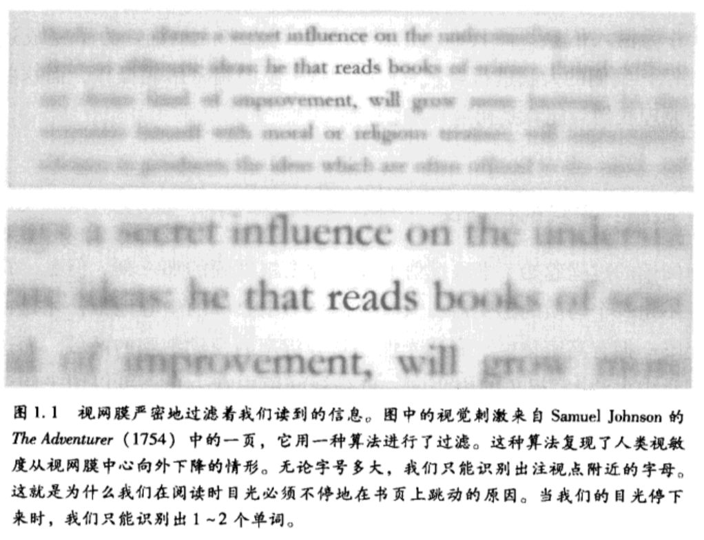
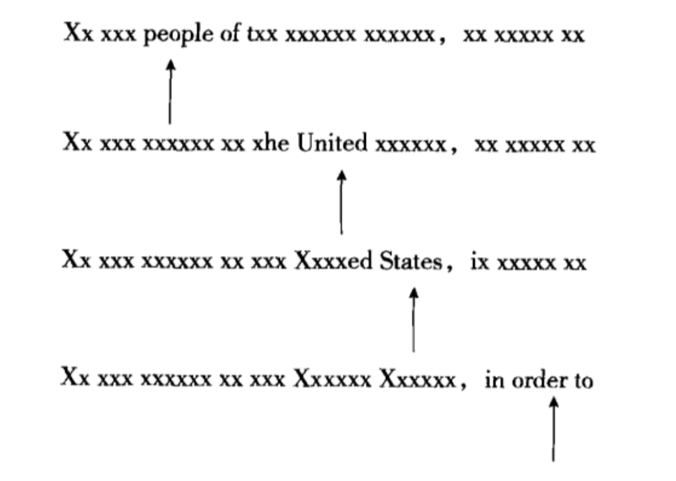
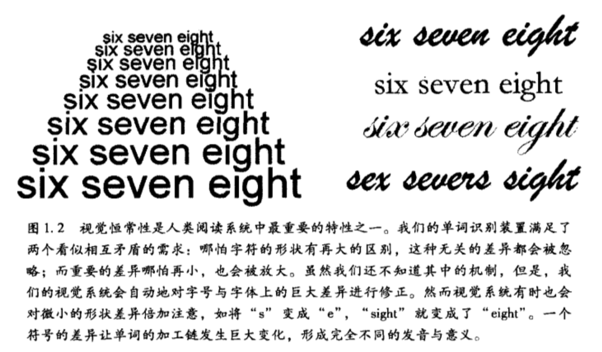
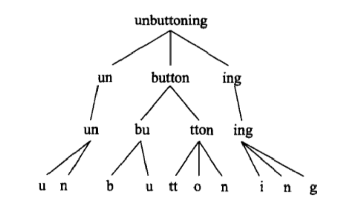
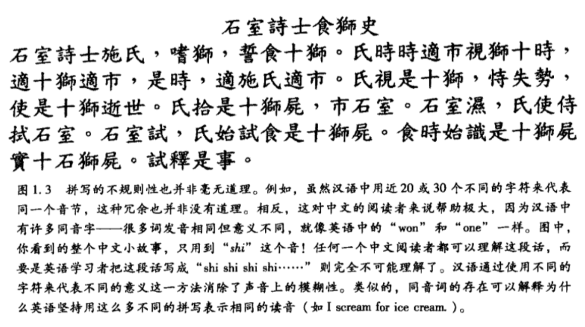
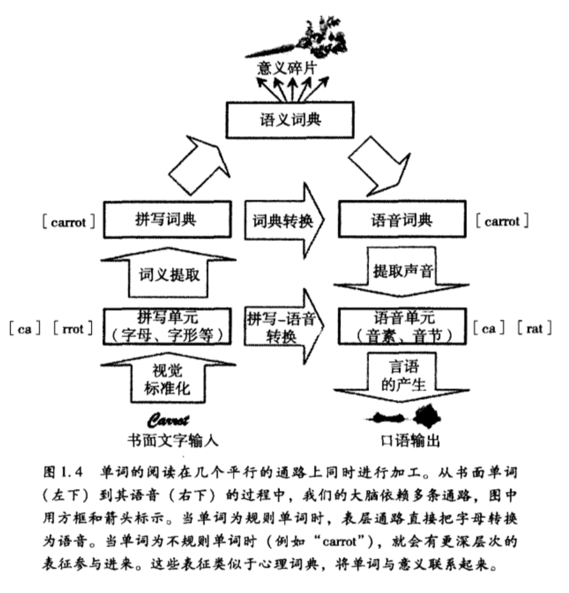
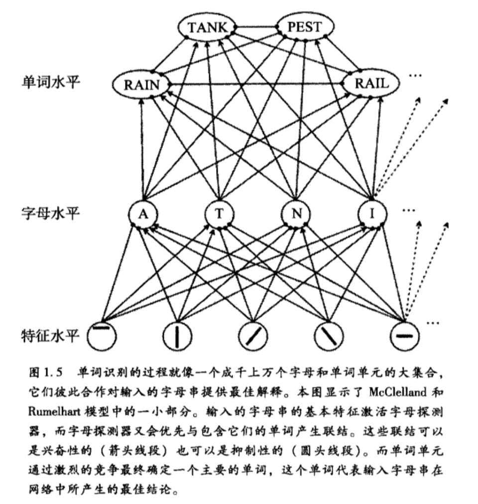

# 0101. 我们如何阅读？

我们从眼睛开始对书面文字进行加工。只有眼睛中央的块称为中央凹 [1] 的区域才具有足够的分辨率，让我们能看清小小的铅字。因此，我们的目光必须在书页上不断地扫视。目光停下来时，我们只能认出 1-2 个单词。而每一个单词又会被视网膜神经元分割成无数的片断，只有这些片断重新整合为一体时才能真正辨认出单词。我们的视觉系统会逐步地提取字形音节、前缀、后缀和词根。最终，两条平行的加加工通路开始运作：语音通路将字母转化为语音；而语义通路则从心理词典中提取词义。

文字的存在是一种沉默的存在，它们沉默着，直到有人将它们读出。只有当智慧的眼睛与石板上的刻痕相遇的刹那，文字才真正地拥有了生命。一切的文字都仰仗读者慷慨的朗读。——Alberto Manguel，《阅读史》（The History of Reading)

初看起来，阅读简直就是魔术：我们的目光停留在一个词上，而我们的大脑毫不费力地提取出词的意义与发音。但请不要被这种表面现象迷惑，这个过程绝不简单。一个单词进入我们的视网膜时会被分割成千百万个视觉碎片，而每一个碎片都被不同的感光细胞所识别。由于这样的信息输入方式，我们面临的真正挑战在于如何将碎片组合起来使我们可以知道看到了哪些字母，还要找出这些字母出现的顺序，从而最终识别出这个单词。

在过去的 30 年中，认知心理学在分析阅读的机制方面进行了研究。研究的目标是解开单词视觉识别的「算法」之迷一一熟练的阅读者采用了怎样的一系列加工过程来识别书面文字。心理学家们把阅读当做计算机科学上的问题来研究。每一个读者就像一个带有两个摄像头的机器人，双眼和视网膜就相当于摄像头。而我们所看到的文字就像呈现在摄像头中的图画。起初，这些文字只是一堆光影的混杂，不能直接被理解为语言学符号。我们必须以一种可以理解的方式对这些视觉信息进行重新编码，才能提取正确的发音、字词和意义。于是，我们必须利用一种解码的算法，或者说一种类似自动文字识别软件的处理机制，这种机制将一页纸上的一堆像素作为输人信息，而其输出信息则是识别出来的单词。为了完成这「壮举」，我们的大脑进行着一系列我们看不见的精密解码操作，而这些操作的原理我们只能算是初窥其秘。

[1] 中央凹，是视网膜中视觉最敏锐的区域。以人为例，在视神经盘侧 3.5 m 处，有一个黄色小区，称黄斑，其中央的凹陷，就是中央凹。——译者注

## 1.1 眼睛：糟糕的扫描仪

阅读的过程起始于书页反射的光子撞击视网膜的那一刻。但是，视网膜并不是一个匀质的感受器。只有我们称为中央凹的中心地带，オ是视网膜上唯一拥有高密集度、高感光性、高分辨率的视觉细胞的区域。而这占到视觉中大约 15° 视角的中央凹，也是视网膜中唯一真正可以用来阅读的区域。如果因为某种原因中央凹得不到视觉输入，例如因为视网膜损伤或中风破坏了视觉皮层的中心区，或用实验的方法选择性地阻挡了中央凹的视觉输入，阅读就不可能完成了。

正因为需要用中央凹去看文字，所以我们的目光在阅读的时候需要不断地移动。我们必须通过移动注视点，用视觉中最敏感的区域来「扫描」文本，因为只有这一区域的分辨率足够高，能够识别文字。然而，我们的目光并不是连续地在书页上移动。恰恰相反，目光总是一小步一小步地移动，我们称之为眼跳（Saccade）。其实此刻在阅读本书的时候，你的眼睛也正在做着每秒钟 4-5 次的跳动，不断地将新的信息输人你的中央凹。

2『眼跳，每秒 4-5 次，做一张信息卡片。』

即使是在中央凹上，视觉信息在不同的地方精细程度也会有所不同。在视网膜及其后面的丘脑及脑皮层的视觉处理区域中，视野中每一部分所拥有的细胞数随着其与注视中心的距离变大而越来越少。这使得视敏度逐步下降。视敏度在视野中心最佳，向视野的外同平稳地下降。我们有一种错党，认为眼前世界的每一点有着相同的精确度，就好像是用一个均匀的像素阵列拍下的照片一样。然而与相机不同，我们的眼睛只对正落于注视中心的那一点有最精细的感觉。而这一点的周围则越来越模糊（图 1.1)。

也许你会认为在这样的条件下，决定我们阅读难易的因素是印刷字体的大小：小字比大字更难辨识。然而奇怪的是，事实并非如此。因为字越大，所占据的视网膜空间面积就越大。因此，当我们用大字号印出一个单词时，单词就会被挤到视网膜的边缘，而这个区域不论字有多大，辨认起来都力不从心。易于辨认和难以辦认的两个因素几乎完全相互抵消，所以个字体加大的单词和一个字体缩小的单词从视网膜感觉精度的角度来说本质上并没有什么区别。当然，前提条件是这个单词不能太小，至少大于人眼中央凹所能精细分辨的极限。而对视觉减退的人来说，例如老年人，把字印大一点还是很有道理的。

正因为人眼的这种运作方式，我们的视觉能力只依赖于单词中有多少个字母，而不依赖于这个单词占据了我们视网膜上多大的空间。实际上从绝对距离上来说，我们的眼跳幅度总是不断变化的，而如果用字母数量来计量时，每次眼跳又都是等距的。当我们的脑作好移动目光的准备时，它会依照字母大小来调整距离，以使我们的注视中心每次都前进大约 7-9 个字母的距离。这个距离出人意料地小，大约相当于我们注视一次所能处理的信息量。

为了证明我们一次只能看清书本上很小的一块区域，George W. Mcconkie 和 Keith Rayner 研究出一套实验方法，我喜欢称之为「笛卡儿魔鬼」（Cartesian devil）。笛卡儿（Rene Descartes）在他的《第一哲学沉思集》（Metaphysical Meditation. S）中想象出一个玩弄我们感官的邪恶魔鬼：

因此我要假定控制我的感官的并非至善的神，那真理之源泉，而是一个邪恶的魔鬼，他强大、阴险，用尽一切手段来欺骗我；我要假定天、地、色、形、音及一切外物无非梦幻光影，皆为此恶魔欺骗我之陷阱。我将认为自己无手、无眼、无肉、无血，无一切观感，然而错信我拥有此等一切。

正如电影《黑客帝国》（The Matriax）中的超级电脑一样，笛卡儿所描绘的邪恶天才利用精细的人造信号冲击我们的大脑，为我们制造出一个伪现实，一个真实的幻境，一个看不透真相的虚拟布景。Mcconkie 和 Rayner 的理论则相对温和得多，他们设计了一种电脑屏幕上的「移动窗口」，可以让人产生看到全部文字的幻觉。他们的方法是给一个志愿者戴上特制的眼动捕捉装置，并实时地改变屏幕上的显示。这个装置可通过编程的方法让电脑屏幕上只显示注视中心左右两側的寥寥几个字符，而整页文字的其他地方都用一串串的「x」来代替：

眼睛一动，电脑就会偷偷地改变屏幕显示。其目的只显示志愿者此刻注视点周围的字母，而把其他的地方都变成一串串「x」：

利用这一装置，Mcconkie 和 Rayner 向世人展示了一个充满争议的惊人发现：志愿者根本没有发现这种实验操纵。只要注视点中心的两边呈现的字母足够多，阅读者就不会看穿这个把戏，还以为自己看到的是一页正常完整的文本。这种让人称奇的视而不见现象之所以出现，是因为文本变化时眼睛恰好处在最高速的运动状态。这种换词的手法之所以难以觉察，就是因为换词的瞬间，视网膜上的图像会因运动而模糊。而目光一停，一切看起来又都正常了：在中央凹，我们看到了想看的字母，至于视野的其他区域，也就是外围区，反正在阅读中也派不上用场。如此一来，Mcconkie 和 Rayner 的实验向我们证明，人类只能对视觉输入信息中的一小部分进行有意识地处理。如果电脑程序在我们注视点的左側留下 4 个字母，右侧留下 15 个字母，我们的阅读速度将不会受到影响。简单来说，我们每次只能从书页上提取少得可怜的信息。笛卡儿的邪恶魔鬼只需要让我们看到 20 个字母，就能让我们误以为自己在读《圣经》或《美国宪法》了！

20 个字母，事实上 20 个都已经多说了。我们每一次眼跳只能辦别出 10-12 个字母：注视点左侧的 3-4 个以及右侧的 7-8 个。在这个区域以外，我们基本上识别不出单词，而只能感知到有无空格。

2『 20 个字母的这个信息，做一张信息卡片。』

空格可以为我们提供关于单词长度的线索，从而帮助我们作好眼跳的准备，并确保我们的目光落到下一个单词的中心。至于我们从眼前的这个单词中到底能提取出多少信息，研究者们还存在着争议，也许我们只看到了一个单词的前几个字母。然而，学者们一致认为，眼动的方向使得我们的视觉广度产生了不对称性。

在西方国家，视觉广度更加偏向于右侧，而对于使用阿拉伯语或希伯来语的阅读者来说，由于阅读时是从右向左扫视，他们视觉广度的不对称性则表现为向左偏移。对其他书写系统来说，例如字符密度较大的中文，眼跳的距离更短，视觉广度也会相应地缩小。根据不同的语言以及文本，每一位读者都会相应地调整他对文本区域进行视觉探索时所采用的策略。

利用同样的方法，我们还可以估计出识别与编码每个单词所需要的时间。我们可以利用电脑程序，让屏幕上的所有字母在一定时间后变成「x」，包括中央凹的字母。通过这样的实验，我们发现呈现时间为 50 毫秒时，我们的阅读速度还可以基本保持正常。这并不意味着阅读所用到的所有思维过程都可以在这 1/20 秒内完成。在后面我们就会看到，在单词呈现之后，一系列的思维过程需要对其持续加工大约半秒。不过最初视觉信息的获取可以在很短的时间内完成。

总而言之，我们的眼睛给阅读行为施加了很多限制。视觉感受器的结构决定了阅读时我们的目光必须每 0.2-0.3 秒就跳跃一次，这样才能够对整个书页进行扫描。而阅读也只不过是把一系列对单个词的「抓拍」，通过思维过程重新组合起来的过程。有时，一些小的语法词，像「the」「it」和「is」在阅读中可以跳过，但几乎所有名词和动词这样的内容词，我们都必须至少注视一次。这些限制是我们视觉系统中固有的一部分，无法通过训练加以改善。

我们当然可以通过训练来优化眼动的模式，然而大多数每分钟能读 400-500 个单词的优秀阅读者，其眼动方式已经没有太大提升空间了。考虑到视网膜的构造，我们很可能没法提升阅读速度。有一个简单的演示可以证明眼动是限制阅读速度的罪魁祸首。

如果我们逐词逐字地呈现一句话，让每一个单词都精确地落在目光中心，也就意味着不需要眼动，此时，熟练的阅读者可以以惊人的速度阅读平均每分钟 1000 个单词，而最优秀的阅读者甚至可以达到每分钟 1600 个单词，差不多每一个单词只需 40 毫秒，这是正常阅读者阅读速度的 3-4 倍！这种方法称为快速序列视觉呈现法（Rapid Sequential Visual Presentation, RSVP）。使用这种方法时，对单词的识别与理解还是让人满意的，也就是说，阅读的这些核心加工步骤所需的时间并没有明显地对阅读速度产生限制。或许在屏幕文字逐渐取代书本的将来，这种视觉呈现模式将成为阅读的新趋势。

无论如何，只要文字还是一行行地写在纸上，我们通过注视来获取信息的方式就一定会减慢我们的阅读速度，形成一道不可跨跃的屏障。正因为如此，我们在看到那些声称可以让你的阅读速度达到每分钟 1000 个单词的阅读法的广告时，就一定要持怀疑的态度了。当然，我们一定可以通过某种方式，在一定程度上扩展我们的视觉广度，以减少我们每一行所需的眼跳数量，或者也可能学会在阅读时不回跳，就是说不回头去看已经读过的单词。然而，眼睛的生理极限不可能跨越，除非你愿意跳过一些单词，并承受因此而误解文意的风险。Woody Allen 对这种情况的描述相当精彩：「我参加了一个快速阅读训练班，学会了如何在 20 分钟内读完《战争与和平》（War and Peace）。不过我留下的唯一印象是，这本书跟俄国有关。」

## 1.2 寻找恒常性

你认识字吗，鲁宾？认识，我认识印刷的字，但是我从来认不出手写字。——莫里哀，《乔治·唐丹》（Moliere, Georges Dandin)

阅读给我们出了一道视觉难题。无论单词以何种面貌出现，即不论它们是印刷还是手写，大写还是小写，用的是大号字还是小号字，我们都必须识别它们。这就是心理学家们所说的恒常性难题：我们必须从成千上万种可能的字母变型中找出单词唯一不变的属性：字母顺序。

之所以说视觉恒常性是一个难题，是因为单词并不总是处于同一位置、有着同一种字体或同样的大小。如果这些属性都固定，我们只需简单地看一下视网膜上哪些细胞处于激活状态，哪些处于非激活状态，就可以对所见单词解码了，这就像用一串像素来定义一幅黑白的图片一样。然而现实是，依写法的不同，同一个单词可能对应着成百上千种不同的视网膜图像（图 1.2)。因此，阅读的最初几个步骤，就必须对这些繁杂多变的表现形式进行修正。

有几种线索告诉我们，大脑具有应对这个视觉恒常性难题的高效的解决办法。当我们把报纸拿在眼前合适距离处时，我们既可以读标题也可以读分类广告。单词的大小可以变化 50 倍之巨，而我们的阅读速度却不受影响。就像我们可以从 2 英尺和 30 码处识别出同一张脸或同一个物体一样，我们的视觉系统对大小的变化有很高的耐受性。

另一种形式的恒常性，即大小恒常性，让我们可以不受单词在纸页上位置的影响。当我们的目光扫过纸张时，视网膜的中心通常落于单词的中心略偏左一点。然而，我们的这种准确度往往差强人意，有时目光也会移动到单词的第一个或最后一个字母，但这并不影响我们对单词的识别。如果字母的大小相应地增大以补偿视网膜分辨率的下降，我们甚至可以依靠外周视野来阅读。因此，大小恒常性是与空间位置的无关性并存的。

最后，单词识别还与字符形状基本无关。在文字处理软件无所不在的今天，软件使得普通大众掌握了这些原先只限于少数专业排字工才能掌握的技术。现在人人都知道一套一套的字符是用「字体」（Font）来区分的（Font 这个词源于排字印刷时代，那时，印刷之前人们必须在铸造车间中用铅来铸字）。每一种字体都拥有两类字符，即大写字符和小写字符（英文称大小写为 case。原本 case 是指一种扁平的盒子，里面分成很多区域来编排铅字；而「upper case」专门用来放大写字母，其他的字符放在「lower case」中）。

最后，我们还可以选择字体的「重量」（即粗体还是正常字体）以及字体的倾斜，即斜体（斜体称为 italics，因其最早是在意大利发明的），还有是否加下划线，或者将这些选项组合起来。然而，这些精准计量的字体变化跟手写体的无穷变化比起来，只能算是小巫见大巫了。手写体显然让文字的变化性与不确定性又都上了一个合阶。

在面对这些变化时，我们的视觉系统到底是如何学会对字母的不同形式进行分类的？在某种程度上，这仍然是一个迷。然而我们可以用比较简单的方法来解决部分难题。例如元音「o」由于其独特的闭合形状而很容易识别，它的字号、大小写和字体都难不倒我们。因此，做一个针对「o」的视觉探测器并不十分困难。然而，其他字母就很困难了。比如说字母虽然我们看起来 r、R、r 和 R 显然代表了同一个字母但仔细审视这个问题，我们就会发现这种思维联结是多么随意。

例如，如果我们硬要用「e」这个形状作「R」的小写形式也不是不可以的。所以这种奇异的文化现象只能用历史的偶然性来解释了。于是，我们学习阅读的时候，不但要将字母映射到语言的发音上，还要学会同一个字母可能会写成完全不相关的不同形状。我们将会看到，我们之所以有能力完成这样的事情，很有可能是因为我们的大脑拥有一些抽象字母探测器，也就是说有一些神经元可以识别不同形态的字母。实验证明，只要少量的训练，我们就可以用正常的速度来阅读大小写字母相间的一句话：

Decode, At An Essentlally NORMAL SPEED, ENTIRE Sentences WHOSE LETTERS Have Been Printed ALTERNATELY IN uppercase and In OWERCASE.

在 Mcconkie 和 Rayner 的「邪恶天オ」般的电脑上，这种字母大小写的变化也可以在每一次眼跳时进行切换，而读者竟然完全不知情！在我们的日常阅读经验中，我们从来不会看到一个单词用大小写相间的写法来呈现，然而我们对字母进行规则化的加工过程相当高效，使我们可以轻松应对这种大小写转换。

这些实验还证明，单词的整体形状在阅读中并不起作用。我们之所以可以立刻识别出「words」、「WORDS」和「Words」，是因为我们的视觉系统并不关注单词的轮席，也不关注字母的高矮变化：视觉系统只关注单词中含有哪些字母。很明显，我们识别单词的能力并不依赖于对单词整体形状的分析。

## 1.3 将差异放大

虽然我们的视觉系统可以有效地将与阅读无关的视觉差异过滤掉，例如「R」与「r」之间的差异，但是如果一味地认为这是抛弃信息、简化形状的观点也是不对的。相反，很多时候，对于那些可以区分两个相近单词的微小差别，我们的视觉系统必须加以保留甚至放大。

我们来看看这两个单词：「eight」和「sight」。我们可以马上从大脑中提取出它们不同的意义和发音，而只有我们非常仔细地观察时，才可以发现这两个单词之间的差异只是几个像素而已。我们的视觉系统对「eight」和「sight」之间的差异非常敏感，并将这种差异放大，使我们将视觉输人传送到语义空间中完全不同的地方。同时，视觉系统又对其他一些更明显的差异几乎视而不见，如「eight」和「EIGHT」之间的差别。

正如视觉系统对大小写不敏感一样，这种格外注意重要细节的能力是长年训练形成的。同一个阅读者，可以马上看出字母「e」和「o」之间的区别，同时认为「a」和「a」之间没有区别；但他可能不会注意到希伯来文字母 π 和 π 之间的巨大差异，而这个差异对希伯来文的阅读者来说却显而易见。

## 1.4 每一个单词就是一棵树

我们的视觉系统使用一种组织严密的方式来应对单词识别中的恒常性问题。

我们将在第二章中详细了解到，进入大脑视觉区的神经活动将一步步地被整理成有意义的分类。非常相似的形状，例如「eight」和「sight」，将通过一系列越来越精细的过滤过程被逐渐区分开，并附着到心理词典中的不同词条上去。所谓的心理词典是一个虚拟的词典，它记录着我们看到过的每一个单词。

相反，像「eight」和「EIGHT」这样视觉特征显著不同的图形，开始在初级视觉皮层由不同的神经元加工，但在不断重新编码的过程中，它们逐渐变得几乎不可分辨。特征探测器在「i」与「I」之间找到相同点，也有更加抽象的探测器将「e」与「E」归为同一个字母的两种不同形式。不论最初的差异有多大，阅读者的视觉系统最终将对字符串「eight」和「EIGHT」的本质进行编码，而忽略它们的具体形状。视觉系统把这两个字符串送到了思维中相同的「地址」，所产生的抽象代码让大脑的其他部分可以进一步提取这个单词的发音和词义。

这种「地址」是什么样的？有一些模型认为，大脑使用了一种无结构的列表，列表中只是提供了 E-I-G-H-T 这一字母序列。也有的模型认为，大脑使用了一种非常抽象、非常传统的编码方式，与随机密码表相似，例如 1296 是「eight」，而 3452 是「sight」。然而，当代的研究所支持的是另外一些假设。很可能每一个书面单词都由一个树形结构进行编码，在有些结构中字母被划分到稍大一些的单元，而些单元则按照音节与单词进行分组一一就像人体可以划分成上肢、下肢、躯干和头，而每一个部分又可以进一步划分为更简单的单元。

例如，可以看一下我们是怎样将「unbuttoning」这个单词分解成相应的小单元的。我们必须先将前缀「un」和我们所熟悉的后缀「ing」（也可以把它看做由语法产生的结尾）拿掉。这两个词级都用来修饰这个单词的中心元素，也就是词根「button」，即词中有词。而这三个要素又可以统称为「词素」（morpheme），即具有意义的最小单位。

在这个水平上，每一个单词都是以词素的组合为特征的。通过将单词分解为词素的过程甚至可以帮助我们理解从来没有见过的单词，例如「reunbutton」或「deglochization」（我们能看出这个单词的意思与「glowing」这个动作相反，虽然没人知道 gloching 是什么意思）。有一些语言，例如土耳其语和芬兰语，可以用词素组成超级长单词，这些单词可以承载的信息与整个英文句子一样多。在这些语言中（在英语里也一样），词素分解对于从视觉到意义的转换过程尤为重要。

很多实验数据表明，我们的视觉系统可以非常迅速地甚至完全无意识地从单词中识别出词素。例如，如果我们让「departure」这个单词在电脑上闪而过，再呈现「depart」这个单词时，你就能更快地读出来。这是因为呈现单词「departure」对于词素「depart」进行了预热，从而使你提取起来更容易了。

心理学家称之为「启动」（priming）效应，即阅读一个单词的时候对其他相关单词产生启动，就像是为水泵灌水一样。重要的是，这种启动效应并不仅仅依赖于视觉相似性：看起来差异很大但却拥有相同词素的词，像「can」和「could」也可以相互产生启动；而那些看起来相像，却没有共同词素的单词，像「aspire」和「aspirin」则不会相互启动。启动并不需要两个单词之间在意义水平上有相似性，例如「hard」和「hardly」，或「depart」和「department」也可以相互启动，虽然它们的意义基本上是无关的。

将词分解为词素这一过程，对于我们的阅读系统似乎非常重要，我们有时甚至会去猜测单词的分解方法。我们的阅读系统将「department」分解为「deoart」和「ment」，以方便后续的加工过程来计算出这一单词的意义。这种机制并不完美一一一个无精打采（listless）的人并不是一个正在等待领取杂货清单（grocery list）的人，而你与室友同住一间公寓（apartment）也并不意味着你们将很快分开住（live apart）。不过不要介意，这种解析错误会在单词分解的其他加工过程中得到修正。

如果我们进一步地分解「unbuttoning」这个单词，我们就会发现词素「button」本身并不是一个不可分割的整体。它由「bʌ」和「ton」两个音节组成，而这两个音节又可以分解为单个辅音和元音：「b」「ʌ」「t」「o」「n」。

这里，我们又看到另一个对我们的阅读系统至关重要的单位：音素，即与目标语言中某个音产生映射关系的字母或几个字母。注意，在我们的例子中，双字母「t」与单独的语音 t 产生映射关系。实际上，由音素到语音的映射过程并不总是直接的。在很多语言中，音素可以由一组字母构成。英语中就包含了特别多的复杂音素，例如「ough」、「oi」和「au」。

我们的视觉系统学会了如何将这些字母组合看做真实的单位，以至于我们已经不再深究它们究竟是由什么字母组成的了。我们用一个小实验来证明这个观点。请观察下面一组单词，并标出包含「a」的单词。

rage

metal

people

coat

ease

meat

你有没有感觉到，在最后的 3 个单词「coat」、「please」以及「meat」上，你的速度稍稍地减慢了？他们都包含字母「a」，但是「a」嵌在一个复杂音素中，而这个音素的发音又不像「a」的发音。如果我们仅仅利用字母探测器来探测「a」的存在，将单词划分成音素并没有意义。然而我们实际的反应清楚地表明，我们的大脑加工并不是在单字母水平就止步不前了。我们的视觉系统会自动地将字母重新划分为更为高级的音素，这让我们对类似「ea」的组合中是否真的含有「a」的判断更加困难了。

接着，音素将被自动地组合为音节（syllable）。这里也有一个小例子来证明这一过程。你将看到 5 个字母的单词，有一些字母用了粗体，有些用了正常字体。将注意力集中于中间的字母，试着辦别它是粗体还是正常字体：

你有没有觉得第一组比第二组稍微难一点？在第一组中，粗体字符并不代表音节的边界例如「RIDER」，「D」是粗体而其所在音节的其他字母都是正常字体。我们的思维倾向于将组成一个音节的字母组合到起，这与 D 这个粗体对字母产生的分组形成了冲突，导致我们的反应明显地变慢了。这个现象说明，我们的视觉系统会不由自主地将单词划分为它的基本组成单元，即使我们并不希望这样。

关于单词的这些组成成分，现在还是一个很热的研究课题。看起来，我们对单词的分析存在不同的层次：最底层是单个的字母，然后是一对字母或称字母对（bigram），这是一个重要的单元，后面我们还会讲到。然后是音素，再是音节、词素，最后才是单词。最终，视觉加工将单词解析成层级结构，即树形结构，其树枝由不同大小的单元组成，而叶子则是字母。

单词串就这样被简化到极致，去掉了不相关的字体、大小写、字号信息，分解为基本要素，在大脑的其他部位对它们进行后续的声音和意义的加工。

## 1.5 沉默之声

书写，是一种为眼睛绘制单词和言语的天才艺术。

——Georges de Brebeuf（法国诗人，1617-1661)

当 Augustine 拜访米兰主教 Ambrose 时，他发现了一个值得写入回忆录的奇怪现象：

当（Ambrose）阅读时，他的眼睛扫过书页，他的心找出文字的意义，但他的声音却未发出，他的舌头也静止不动。谁都可以随意地接近他，而客人们一般也不用通报。所以我们来拜访他时，经常可以看到他这样静默地阅读着，因为他从不读出声来。

在 17 世纪中叶，西班牙塞维利亚的神学家也感叹「字母有一种魔力，向我们无声地传递不在场者的言语」。在那个时代，通常的做法是将拉丁文大声地读出来。阅读时发出声音是一种社会习惯，但同时也是一种现实的需要：因为当时人们面对的情况是，单词堆在一起，没有空格，而人们对拉丁语又不熟悉，因此大部分的读者都必须像小孩子读书一样边看边嘟囔。这就是为什么 Ambrose 安静的阅读方式让人这么惊奇，而对我们来说无声阅读已经是一种人人熟悉的经验：我们可以在不发出声音的情况下阅读。

我们的思维是否可以从书写的文字直达语义，而不需要经过发音？还是我们无意识地将字母转换成声音，然后才由声音通达语义？

对于这个问题一直有很多争论。在 30 多年的时间中，这种阅读通路的组织形式问题所引发的讨论使心理学界划分成不同的阵营。一些研究者认为从文字到语音的转换是必经的一步。他们认为，书面语言只不过是口语的一种副产品，因此我们必须通过语音通路（phonological route）将单词读出来，才有可能明白文字的意义。而其他研究者则认为，语音编码只是阅读初学者的特点。对于更成熟的阅读者来说，阅读的效率体现在直接的词义通路（lexi cal route）上，这一通路直接将字母串转换成意义。

现在，基本达成共识：对成人来说，两条通路都存在，而且它们是同时运作的。我们都可以直接提取单词的意义，而省掉先发音再理解的麻烦。然而，即使是熟练的阅读者也会利用单词的声音，虽然他们并没有意识到这点。这并不是说我们必须真的将单词读出来一一我们不必运动双唇，甚至不必产生准备运动双唇的意向。然而，在更深的层次上，我们会自动地提取出单词发音的信息。语义通路与语音通路并行运作，并相互支持。

我们有充足的证据证明我们在阅读时自动获取语音。例如，可以设想下，我们要从一个字符串的列表中找出哪一些单词是真正的英文单词，哪一些不是。注意，你只需要确定这些字母是否可以组成一个英文单词。列表如下：

rabbit

bountery

culdolt

money

mon

karpin

nee

你可能会在看到一些读起来像真单词的单词时有所犹豫，例如看到读音像「demon」、「carpet」和「kne」的单词。这种干扰效应可以通过反应时清晰地测量出来。它表明我们将每一个字符串都转化成与真实单词比较相像的语音，虽然这一加工过程与我们所要求的实验任务相悖。到我们在读一个新单词的时候，在脑中将单词转化为语音尤为重要一一例如「Kalashnikov」（卡拉什尼科夫冲锋枪）这个单词。一开始，我们并不能直接提取它的意义，因为我们并没见过这样拼写的单词。我们所能做的就是将其转化为读音，然后才能发现这个读音模式是可以识别的，并且通过这一过程来理解这个新单词。

因此，当我们遇到一个新词时，发音往往是我们唯一的对策。同样，在我们阅读那些拼错了的单词时，发音也样重要。试想一下 Edgar Allen Poe 的冷僻小说《奇怪的天使》（The Angel of the Odd）。在这篇小说中，一个奇怪的角色神秘地侵人了故事中「我」的公寓，「一个没什么特点的人，不过也不能说完全无法形容，」带着一口浓得像伦敦迷雾一样的德国口音：

---

「请问，你是谁？」我正色道，虽然还带着些许疑惑，「你怎么进来的？你想说什么？」

「饿砸养晶爱的，」那人说，「扑管泥德师。资于饯相说西嘛，俄想说西嘛酒说西嘛。资于俄师碎，嘎嘎，俄酒师来样泥自技看一看饿师碎的…看饿！饿师离七天使！」

"Az vor ow I comd ere, "replied the figure, dat iz none of your pizzness; and as vor vat I be talking about, I be talk apout vat I tink proper,: and as vor who I be, vy dat is de very ting I comd here for to let you zee for yourzelf. Look at me! Zee! I am te Angel ov te Odd

「确实够离奇的。」我鼓起勇气说道，「不过我一直觉得天使是应该有翅膀的。」

「吃旁！」他非常愤怒地大叫，「饿妖吃旁干西嘛？田哪泥一为饿师一只寄嘛？」

"Te wing! "he cried, highly incensed, vat I pe do mit te wing? Mein Gott! Do you take me vor a chicken?

---

在读这段文字时，我们回归到了一种早已被遗忘的阅读模式，即我们孩提时代的阅读模式：我们使用了语音通路，或者说我们通过缓慢地将完全生疏的字母串转化为读音，从而神奇地读懂了这些文字，好像有人在对我们轻声朗读一样。

那么，那些日常的单词呢？就是那些我们已经看过成千上万次的单词呢？我们并不觉得我们需要通过脑海中发声的方式来对其进行解码。然而，一些聪明的心理学测试让我们知道我们仍然会在无意识水平上激活这些单词的语音。

例如，假设你需要指出下面哪些单词表示人体的组成部分。这些都是非常熟悉的单词，因此你可以专注于它们的意义而忽略它们的发音。来试一下：

knee

table

lea

ane

bucket

are

也许你有一种对「hare」做「是」反应的冲动，因为它的发音与我们身体的一部分（hair）相似。众多的实验表明，我们在遇到与目标分类中的某个词发音相近的词时，反应会变慢，错误也会变多。如果我们没有事先提取出这些单词的语音，我们想不出还有什么理由会让我们注意到发音的相似性。要解释这种错误，我们只能认为存在一个内部的语音转换过程。我们的大脑忍不住要把「h-a-r-e」这几个字母转化为内部语言然后才将它与意义联结起来一一而在这个过程中，有时我们会发现这个字符串与另一个常见单词发音相似，这时就会产生错误。

当然，这种不完美的大脑设计也让我们可以享受生活中最有趣的东西之：双关语，或者按幽默家 Richard Lederer 所说的「文字的偷悦」。如果没有这种字母一声音转换的天赋，我们就无法对 Mae West 的自述露出会心的笑，也不会理解柯南·道尔（Conan Doyle，《福尔摩斯历险记》的作者）的姻兄的揶揄：「There's no police like Holmes.」。没有 Augustine 所说的「静默的声音」，下面这个「淫秽的」的双关语就难搏得我们一笑了。

一个仰幕者跟林肯总统说：「请允许我引见我的一家。我妻子淫（般）夫人。我女儿，淫（般）小姐。我儿子，淫（般）少爷。」

「天啊！」总统说。

支持大脑自动进行单词声音提取的更多证据来自阈下启动（subliminal priming）。假设我先让「LATE」这个单词在你眼前闪过，然后马上给你呈现「mate」，并让你尽快地读出来。我们故意让单词的大小写不同，以避免出现低层次的视觉相似性。

然而，当第一个单词的声音和拼写与第二个单词相似时，就像这个例子中那样，我们就可以观察到单词命名速度大幅提升，比两个没有关系的单词（如先 BOWL 后 mate）要快得多。这种加速效果中，一部分显然只与单词拼写的相似性相关。虽然这两个字母串的读音非常不同，但是先闪过「MATH」后，「mate」的识别变快了。

重要的是，当两个单词的发音存在共同点时，这种加速效应更加明显（如先「LATE」后「mate」），而这种以语音为基础的启动效应即使在拼写完全不同时也会起作用（如先「EICHT」后「mate」）。

这样看来，我们似乎自动地提取了语音。但是正如你所料，拼写与语音并不是在同一时刻进行编码的。我们的脑观看一个单词大约 20~30 毫秒就可以激活单词的拼写，而要转换成语音，则还需要再多 40 毫秒，这一点从语音启动出现的时间上就可以得到证实。

由此看出，这些简单的实验为我们勾勒出阅读者脑中一系列成功的加工阶段，从视网膜上的印记直到转化为字母与声音。任何一个熟练的阅读者都可以无意识地、毫不费力地将字符串转化为语音。

## 1.6 声音的局限性

在阅读中，内隐地提取出书面文字的发音是自动的过程，然而这种转换也许并非不可或缺。字母到语音的转换通常缓慢而低效。因此我们的大脑经常会试着通过另一条更加直接的平行通路来提取单词的意义，将字母串与我们心理词典中的条目直接联系起来。

为了对直接的词义通路有更直接的感受，我们可以设想一个只能在脑海中读出文字的阅读者所面临的窘境。对他来说，要区分同音单词是根本不可能的，例如「maid」和「made」，「raise」和「raze」，「board」和「bored」，或者「muscles」和「mussels」。纯粹依赖声音的话，他也许就会以为连环杀手讨厌玉米地 D，或者认为 1 克拉的钻石是某种黄色的奇怪形状。实际上我们能够轻易地区分这些音同词不同的情况，这表明我们并不是非要把它们读出来一还有另一条通路来帮助我们消除模糊性，然后直达词义。

纯粹以语音为基础的阅读理论还有另一个问题：从拼写到读音的过程并不是一条畅通无阻的高速公路。如果没有其他因素的作用，我们往往不可能单单从字母的顺序上来找到单词的发音。

例如「blood」这个词，看起来它显然应该读成 blud，并与「bud」或「mud」这类的单词押韵。但我们怎么知道呢？为什么「blood」不跟「food」或「good」同韵？为什么它的发音一点也不像「bloom」或「bloomer」？

即使是相同的词根，发音也有可能不同，像「sign」和「signature」。有一些单词更特别，我们根本看不出它包含的字母与它的发音有任何关联（如「colonel」、「yacht」、「thought」...）。在这些情况下，我们如果不事先了解这个单词，就无法得知它的发音。

英语中不规则发音的现象俯拾皆是。实际上，书面语与口语之间的鸿沟已经存在了几个世纪，莎士比亚的《空爱一场》（Lave's Labour's Lost）即是佐证。剧中的书呆子 Holofernes 说道：

我痛恨这种荒唐的妄人，这种乖僻而苛刻的家伙；这种破坏正字法的罪人：明明是 doubt，好吧，他却说 dout；明明是 d, e, b, t, debt，他偏要读作 d, e, t, det；他把 calf 读成了 cauf，half 读成了 hauf；neighbour 变成 nebour；neigh 的音缩作 ne。这简直是 abhominable，可是他说起来又是 abbominable 了：此类错误读音令人发狂。

英语确实是一种让人憎恨的不规则语言。George Bemard Shaw 曾指出，「fish」这个词的发音，也可以用「ghoti」拼出，只要取「enough」中的「gh」，「women」中的「o」和「lotion」中的「ti」就可以！Shaw 痛恨英语的这种不规则性，他甚至在遗嘱中为一项竞赛提供了支持，竞赛的目标就是发明一种称为「Shavian」的完全合理的字母表。不幸的是，这项活动从来没有真正成功过，可能因为这种字母表与现有的拼写系统都相距甚远。

当然，肖伯纳的例子有点极端：没有人会真的把「ghoti」读成 fsh，因为字母「g」放在单词的开头时永远读 g。同样，尽管有莎士比亚的存在，但是在今天的英语中，「al'」在词尾时总是发音为 g，例如「calf」和「half」。在特定的上下文中，我们通常可以看出一些更高级的规律，可以让字母到语音的映射更加简化。但即使是这样，例外仍然数发音不胜数「has」和「was」，「tough」和「dough」、「four」和「tour」，「header」和「reader」、「choir」和「chair」、「friend」和「fiend」。

对于大多数发音不规则的单词来说，发音的提取不像是单词理解的基础，而更像是单词理解的产物：只有我们识别出「dough」这个单词，才可以提取它的发音。

## 1.7 英语拼写系统中所隐藏的逻辑

也许我们会奇怪，为什么英语会坚持使用这样一个复杂的拼写系统？实际上，意大利语就不会面临与我们一样的问题。意大利语的拼写是透明的：每一个字母与独立的发音形成映射关系，几乎没有例外。正因如此，意大利人学习阅读只需要几个月的时间。这给他们带来了巨大的好处：意大利儿童的阅读能力比学习英语的儿童高出几年的水平，而且他们每周也不需要在听写和拼读上花大量的时间。除此之外，我们后面也要讨论到，阅读障碍问题对他们来说也小得多。也许我们应该向意大利人学习，烧掉英语字典，设计一个全新的拼写系统，让 3 岁的孩子也可以轻松阅读。

毫无疑问，英语的拼写可以简化。不过这些奇怪的拼写有着丰富的历史积淀。今天的学生应该哀叹黑斯廷一战，因为此战所带来的法语与英语的混合是形成这种让人头痛的语言的罪魁祸首，例如「c」被用作代表 s 的发音（例如「cinder」）。几个世纪以来学术的保守主义，有时近乎迁腐，已经将英语字典僵化。有些「好意」的学者硬要引入一些荒谬的拼写，如「island」中的「s」，而文艺复兴的错误在于试图恢复拉丁词源「insula」。最糟糕的是，拼写并没有随着口语的自然演变而随之演进。外来词的引入以及英语发音的自然转变在我们的拼写方式和口头表达方式之间制造了巨大的鸿沟，让学英语的孩子平白多受了很多年的学习之苦。简而言之，理性思考让我们认识到从根本上简化英语拼写势在必行。

虽然如此，在对语言做任何改革之前，全面了解我们文字系统中隐含的逻辑非常重要。拼写中的不规则现象并不仅仅是约定俗成的，它们也来源于语言的结构和大脑的结构。两条阅读通路，不管是从拼写到读音还是从拼写到意义，对我们书写系统的限制都是复杂而无法协调的。英语、意大利语、法语和汉语之间的语言学差异，使得不可能有一种拼写方案可以满足所有这些语言。因此，英语中这些让人憎恨的不规则性似乎是不可避免的。虽然我们急需拼写上的改革，但这一改革必须先与大量的限制条件作斗争。

首先，我们还不清楚英语是不是像意大利语一样，每个字母对应一个读音，而且每个字母都对应一个固定的读音。这不是一件简单的事情，因为英语中所包含的读音数比意大利语要多。根据说话者以及计算方法的不同，英语中音素的数量在 40~45 个之间，而意大利语音素只有 30 个。英语的元音与双元音特别多：有 6 个简单元音（如「bat」、「bet」、「bit」、「but」、「god」和「pot」），还有 5 个长元音（如「beef」、「boot」、「bird」、「bard」和「boat」）以及至少 7 个双元音（如「bay」、「boy」、「toe」、「cou」、「beer」、「bear」）。

如果每一个发音都有对应的书写符号，我们就必须发明新的字母，这又增加了孩子们学习的负担。我们可以考虑增加音标符号的办法，如 a、6 或 u（此处打字打不出来）。然而，如果我们认为有一种通用的字母表可以用来书写世界上的所有语言，则未免太理想化了。这样的拼写系统确实存在：它被称为国际音标，在语音学和语言学的专业出版物中起了重要的作用。然而，这种拼写系统实在太复杂，用在日常生活中效果并不好。国际音标有 170 个字符，其中有一些特别复杂（如 B、6、6、或 n）。即使是专业人员，如果不借助字典，也很难读得非常流利。

为了避免学习过多的符号形状，拥有很多音素的语言，例如英语和法语，都必须作出妥协。这些语言或者使用山这样的特殊字符，或者使用「oo」或「oy」这样的字母组合，来表示特定的元音或辅音。这些特殊现象是某些语言所特有的，并非无端出现的装饰品：它们在阅读的「思维经济性」上起到了关键作用，任何一种拼写改革都必须考虑到它们的存在。

虽然我们没法简单地让一个字母形状代表一个读音，也许我们可以反过来尝试一下。如果我们能够系统地用固定的字母来代表每一个读音那么就可以避免很多拼写错误。

例如，如果我们在写 f 这个读音的时候可以不必考虑是写「f」还是「ph」，那么事情就变得简单多了。毫无疑问，我们可以轻松地去除这种多余的、耗费了我们大好童年时光的拼写规则。实际上，这正是美国小心翼翼的拼写改革所走的方向，他们把不规则的英式拼写「behaviour」和「analyse」简化成了美式拼写「behavior」和「analyze」。沿着这个思路，我们还可以进一步向前。作为熟练的阅读者，我们不再关注拼写中的特殊现象。甚至像「x」这样一个简单的字母都没有存在的必要，因为它代表了 ks 这两个音素，而这个读音已经有自己的拼写方法了。

在土耳其，人们把出租车叫「taksi」。这个国家在一年之中（1928-1929) 采用罗马字母表彻底简化了拼写，并且教会了 300 万人如何阅读，为拼写改革的可行性提供了最好的例证。

不过我们还是要非常小心。我认为任何一种激进的拼写改革，如果把建立一种一对一的「语音-文本」转换作为目标，都注定会失败，因为拼写的作用并不仅仅是为声音提供一种忠实的文本转换。Voltaire 说过「书写是声音的绘画：越相似越好」，这种说法虽然优美，却是错误的。书面文本并不是一种高保真录音。它的目标并不是把我们说的话原封不动地复制出来，而是在抽象水平上对声音进行编码，以使读者可以快速地提取意义。

为了论证这个观点，我们可以试想一下，纯粹的语音型书写系统会是什么样子——Voltaire 可能会认为这是一种理想的书写系统。我们在说话的时候，单词的发音会因为它周围单词的不同而产生变化。假如拼写是为了反映那些说话者通常不会注意到的笨拙的语言学现象，如所谓的协同发音（coarticulation）、同化（assimilation）和音节重划（resyllabification），那就会非常糟糕。这样的话，同一个单词由于上下文的不同拼写也就不同。

例如，我们是不是要用不同的书写方式来表示复数的不同发音呢？我们是不是要把「cab driver」拼写成「cap driver」，因为 b 这个发音在 d 之前时通常发音类似 p？极端的情况下，我们是不是要把说话者的口音考虑进去（Do you take me vor a shicken？）。这太荒唐了（absurd，是的，我们说这个单词的时候发的是 P 这个音）。书写的首要目标是尽可能有效地传递信息而任何一种没有创造性的对声音的转录都会偏离这个目标。

英语的拼写往往看重的是词根的透明度，而牺牲了读音的规则性。例如「Insane」和「Insanity」这两个单词，在意义上关系密切，如果我们非要因为发音的一点差异就把它们拼写得不同，那就太傻了。类似的，因为 column「autumn」或「condemn」这些单词派生出了「columnist」、「autumnal」和「condemnation」，在这些单词中保留不发音的「n」也是符合逻辑的。

这种凸显意义的拼写方式，至少也可以部分地解释英语为什么用很多不同的方式来拼写同一个读音。英语单词比较紧凑，并且多用单音节词因此，经常出现同音异义单词（如「eye」和「I」，「you」和「ewe」）如果用语音来记录这些单词，则无法将它们区分开来。拼写习惯正是在这种限制下发展起来的。音同而拼法不同会使听写变得复杂，但是却给阅读带来方便，因为读者可以快速地掌握词义。

学生们也许会抱怨我们对同个语音 u 有那么多种不同的拼法，像「two」、「too」、「to」或「stew」，但是他们应该明白这些附加的规则对于我们的阅读速度至关重要。没有它们，任何书面文字都会变成难以理解的字谜。多亏了这些拼写习惯，书面英语可以直接得出意义。任何一种拼写改革都必须保持这种语音与意义之间的微妙平衡，因为这种平衡反映了一个更深层次的、更严谨的现象：我们大脑的两条阅读通路。

## 1.8 透明的拼写是一场不可能实现的梦

在全世界范围内还在进行着语音阅读与意义阅读的争论。每一个书写系统都必须以某种方式解决这一问题。根据语言的不同，最佳的折中方式也不同。如果英语拼写像意大利语或德语一样简单的话，那事情就简单多了。然而意大利语和德语这类语言之所以可以这么简单地进行语音到书写的转换，是受益于其本身的特点。

例如，意大利语以及德语中，单词通常比较长，往往由多个音节所组成。语法的一致性在共振元音上得到很好的体现。因此，很少出现同音异义词。于是，完全有规律的读音是可行的。意大利语和德语拥有透明的拼写系统，几乎每一个字母都与唯一的读音相对应。

汉语则位于这一连续体的另一个极端。绝大多数汉语单词只有 1~2 个音节，因为总共只有 1239 种音节（如果不算声调的话只有 410 种），每个音节都有数十种不同的意义（图 1.3)。因此，完全表音的书写系统对于汉语来说是没有用的，每一种书写的理解方式有数百种之多！这就是为什么汉语中成千上万个汉字几乎都可以组成单词或词素表达意义的基本单位。汉语的书写系统同时也依赖于几百个语音标号，来进一步说明一个特定的字根如何发音，以便读者更容易推断出它所表示的单词是什么。

例如「妈」这个字，意思是「母亲」，发音为 ma，由一个词素「女」（表示女人）加上一个音素符号「马」（ma）组成。因此，与人们通常所认为的不同，即使是汉语，也不是完全的象形文字（象形文字是指文字符号代表概念），它同样不是一种语标（logographic，语标文字中的符号代表单个单词）文字，而是一种「词素-音节」（morphosyllabic）混合的文字系统，其中一些符号代表词义，另一些符号代表发音。（23）

当然，学习阅读汉语比学习意大利语难得多。学习汉语时必须学会上千个符号，而学习其他语言只要几十个就够了。因此，汉语与意大利语分踞书写易读性这一维度的两个极端，而英语和法语则分别占据了中间的某个位置。在英语和法语中，单词通常都比较短小，因此同音异义词的出现频率相对较高（如「nigh」、「write」、「rite」）。为了适应这些限制，英语和法语的拼写规则中包含着表音与表意的单词——这给书写者带来了困难，却方便了阅读者。

简而言之，我们才开始理解那些约束英语拼写系统的限制条件。我们最终能够对英语的拼写进行改革吗？在这个问题上，我个人的观点是场彻底的改革不可避免。这是我们对子孙的义务，他们已经在这场残戏忍的游戏中耗费了太多时间。此外，还有一些孩子可能永远无法摆脱阅读障碍的阴影，一辈子都被其所累，或者只是因为他们出生在低层家庭或多语言家庭。这些儿童是陈旧拼写系统的真正受害者。我希望我们的下一代将会因为手机与网络的使用，而非常熟悉简化的拼写，这样，他们不会再把拼写改革当成一种禁忌的话题，从而聚集足够的意愿来理性地看待这一问题。然而，我们不可能通过简单地颁布一条法令，强制采用语音拼写系统来解决这个问题。英语永远不可能像意大利语一样简单。规则化拼写的梦想可望而不可即，正如在欧洲流传已久的一本小册子中所说的：

欧盟委员会宣布：将英语作为欧洲人沟通的首选语言已经达成共识，而不是另一种备选语言一一德语。作为协议的一部分，英国政府承认英语的拼写有改进的空间，并同意进行一项为期 5 年的计划，发展所谓的欧洲英语（Euro English），简称欧语（Euro）。

在第 1 年，我们将弃用清辅音「c」而用「s」取而代之。公务员们听到这个消息一定很高兴。同时，爆破音「c」将被「k」取代。这不仅可以减少混淆，而且打字机上也可以少ー个字母了。

在第 2 年我们将讨厌的「ph」换成「f」时，大众会热情高涨。这将使「fo bogra」（photograph）这个单词缩短 20%。

In the first year, s Will be used instead of the soft C. Sertainly, sivil servants will resieve this news with joy. Also, the hard“c”will be replaced with "k.” Not only Will this klear up konfusion, but typewriters kan have one less letter. There will be growing publik enthusiasm in the sekond year, when the troublesome“ph”will be replaced by“f。”This will make words like“fotograf”20 per sent shorter.

第 3 年，大众对这种新拼写方式的接受程度将会提高到一个新的阶段，使我们可以进行一些更加复杂的改变。政府将鼓励去掉双写字母，因为这降低了拼写的准确率。同时，大家也一致认为，英语中大量不发音的「e」非常令人讨厌，所以它们也必须去掉。

In the third year, publik akseptanse of the new spelling kan be expekted to reach the stage where more komplikated changes are possible. Governments will enkorage the removal of double letters, which have always ben a deterent to akurate speling. Also, al wil agre that the horible mes of silent e s in the languag is disgrasful, and they would go.

到第 4 年，人们会乐于接受用「2」代替「th」，用代替这样的改变。

By the fourth year, peopl wil be reseptiv to steps such as replacing th”by“z”and“w”by“v。”During ze fifz year, ze unesesary o kan be drop from vords kontaining ou and similar changes vud of kors be aplid to ozer kombinations of leters.

在第 5 年中，多余的「o」可以从那些包含「ou」的单词中去掉，当然也可以对其他字母组合采取同样的做法。

5 年过去后，我们的书写风格将非常合理。我们将不再有麻烦和困难，人们之间更容易相互理解了。

After zis fifz yer, ve vil hav a reli sensibl riten styl. Zer vil be no mor trubls or difikultis and evrivun vil find it ezi tu understand ech ozer.

我们的梦想终将得以实现！

Ze drem vil finali kum tru!

## 1.9 阅读的两条通路

在继续我们的探讨之前，我想总结一下到目前为止我们所提到过的内容。所有的书写系统都在精确表音与快速表意之间摇摆。这种困境直接反映在阅读者的大脑中。当我们阅读时，两条信息加工通路同时存在并相互补充。当单词非常规则，或很不常见，或是完全是新的时，我们倾向于利用「语音通路」进行加工。我们先将字母串解码，然后将其转换为读音，最后尝试提取这种读音模式的意义（如果它有意义的话）。相反，当我们看到很常见的或是发音很特殊的单词时，我们采用直接通路进行阅读加工，先识别单词并提取意义，然后再利用词义信息去提取它的发音（图 1.4)。

存在这两条通路的最好证明来自脑损伤及其对人的心理所造成的影响的研究。一些患者会由于中风或脑损伤而失去快速提取字母发音信息的能力。显然他们的「拼写-读音」转换通路严重受损。

虽然他们在脑损伤之前可以正常阅读，但在损伤之后，他们的阅读表现为一种称为深层阅读障碍或称语音阅读障碍综合征（phonological dyslexia）的症状。虽然他们的拼写能力完全没问题，但是他们再也不能大声读出不常见的单词（如「sex tant」）。此外，在遇到新词或自造的词（如「repartition」或「calbonter」）的时候，他们会很无助。然而，让人惊奇的是，他们仍然可以理解高频词，而且基本上可以大声读出一些不规则的常见词，如「eyes」、「door」或「women」」。他们偶尔会将一个词与另一个词混淆。

例如，深层阅读障碍患者可能把「ham」读成「meat」，或「painter」读成「artist」。这些错误的性质表明，患者基本上保留了对单词意义的提取。如果患者没有理解（或至少部分地理解）他想要读出的单词，那么他根本就不可能提取出这个单词的正确意义。尽管深层阅读障碍症患者已经基本失去对这些字母的读音进行加工的能力，但是他们似乎可以识别书面文字。看起来如同一条阅读通路（从视觉到声音）被阻断了，而信息仍然能够通过另一条通路（从视觉到意义）进行加工。

而与之相反的情况也有过记载。这一次，患者所患的是另一种综合征，称为表层阅读障碍，他们无法直接提取意义，而是通过慢慢地阅读文本，读出所有单词。在这种情况下，「默读」的局限性就显而易见了。表层阅读障碍患者仍然可以阅读发音规则的单词，如「banana」，甚至可以读出新词，如「chicopar」，但是他们却几乎无法读出不规则的单词。他们通常会通过盲目的语音转换来读出其标准发音。

例如，有一个患者将「enough」读成 inog，然后他发晢说从来没听过这种奇怪的单词。很明显，该患者从视觉到心理词典的直接通路被阻断了，但从字母到语音的转换却仍然可以正常运作。

这两类患者的对比证实我们拥有两条完全不同的阅读通路，但同时也证明，不论哪一条通路单独存在，都无法让人读出所有的单词。从字母到单词及其意义的直接通路，可以让我们读出大部分常见单词，但是这条通路无法应对罕见的或全新的单词，因为我们的心理词典中没有存储这些单词。从字母到语音再到意义的间接通路，则无法应对像「women」这样的不规则单词，以及像「too」这样的同声异义词，但是这条通路在我们学习新单词时起着不可替代的作用。

当我们阅读时，两条通路总是互相合作，每一条通路都对单词的准确发音起重要的作用。利用简单的「拼写-语音」转换规则，单词的大多数音素可以通过字母组合推断出来，而有时候，我们则需要借助更高水平的词汇和语义来处理模棱两可的问题。

通常，儿童的这两条通路间的合作并不协调。有些儿童非常依赖直接通路，他们尝试对单词进行猜测，通常会把目标单词读成同义词（如把「house」读成「home」）。另一些儿童则哼哼呀呀地读出一句话，然后从组成单词的字母中艰难地拼凑出近似的读音，却无法从这些似是而非的读音中猜出意义。儿童需要多年的阅读练习，才能像熟练的成人阅读者那样，将这两条通路紧密结合为一个整体。

目前大部分阅读模型都认为，流畅的阅读依赖于两条阅读通路间的密切合作，每条通路所发挥的作用取决于所读的单词（认识的或不认识的常见的或不常见的、规则的或不规则的）以及阅读任务（出声阅读还是文字理解），在 20 世纪 80 年代和 90 年代，一些研究者试图用单通路的阅读系统来解释这些阅读现象。

当时，神经网络模型的出现引发了人们的热烈追捧。一些研究者把神经网络看成通用的学习机器，认为它们可以在不需预先设定好认知结构的情况下，学会各种技能。他们认为阅读的习得模型可以用字母输人与语音输出之间的联系来建构，而中间的那些联结则由个强大的学习规则来完善。

研究者们希望找到一个网络，既可以模拟正常阅读，又可以模拟那些与阅读相关的疾病，且又不需要假定我们有多条皮层加工通路。这些网络在当时代表了一种了不起的进步，特别是在拼写到语音转换模型的建构上，然而今天的大多数研究者却认为这样的方法是不够的。

在我看来，在没有将大脑的结构研究透彻以前，我们是无法建构阅读模型的，因为阅读依赖于平行的、且存在部分冗余的多条通路。近年来，虽然所有模型仍然依靠神经网络模拟，但都包含了「多条阅读通路」这一核心思想。实际上，我们在本书后面探讨大脑的阅读机制问题时将会看到，大脑结构的一个核心特征就是其「多条平行通路」的组织形式。因此，甚至双通路模型都可能低估了阅读神经系统的真正复杂程度。将阅读加工划分为两条通路，一条拼写到语音的通路和一条语义通路，只不过是一个实用的粗略估计而已。

## 1.10 心理词典

如果只讨论将字形转化为音素的表层通路，认为阅读的思维活动遵从一系列简单的过程的想法就是符合实际的。只要将英语中的几百个字形和它们发音之间的映射存储在脑中即可。然而，当我们讨论另一条深层通路如何识别数千个常见的单词时，就需要更大的存储。

认知心理学家将其比喻为一个词典，或者叫做「心理词典」（mental lexicon）。毫无疑问，我们应当把心理词典看做是复数形式，因为我们的大脑实际上存储了单词的多种不同信息。对于熟练的阅读者来说，我们每个人都拥有英语拼写的心理词典，其中列出了我们以往所认识的所有单词的书写形式。这种正字法记忆很可能是以一种树形的层级来存储的，按照字母、字素、音节、词素的顺序。

例如，「carrot」一词所对应的条目，应该类似「ca」+「rot」。但是，我们同时还有另外一个「语音词典」，即记录单词发音的心理词典，例如「carrot」一词的发音为 carat。我们同时还有一个语法存储器，它告诉我们「carrot」是一个名词，它的复数是规则变化的等。最后，每一个单词还会与数十种语义特征相联系，以表明它的意义：「carrot」是指一种可食用的蔬菜，长形，呈特殊的橘黄色等。当我们的脑提取相关信息时，这些心理词典就一本一本地被翻开了。我们可以这么说：我们的思维中存在着一个由数卷参考书组成的参考库，既有拼写指南，又有发音手册和百科词典。

我们心理词典中的词条数目庞大。实际上，人类的词汇知识往往被大大低估了。有人说，Racine 和 Corneille 在写戏剧时只用到 1000~2000 个单词，我曾经听过一些原本知识很渊博的人为这个大家普遍接受的观点进行辩护。

有传言说，一种叫做基础英语的高度简化版英语，只包含 850 个单词，但却能让我们有效地表达自己的思想；还有一些人佯称，一些城市中心的青少年的词汇量已经缩减到 500 个单词！所有这些观点都是错误的。我们曾对普通人的平均词汇量作过准确的估计，结果是其往往能够达到数万之多。标准词典大约有 10000 个词条，而我们通过抽样的方法发现，任何一个说英语的人都认识其中的大约 40000-50000 个单词一还不包括复合词。

另外，每个人还认识大约同样数量的专有名词、缩写词（如 CIA、FBI）、商标（如 Nike、Coca-Cola）以及外来词，把这些加起来，我们每个人的心理词典可能包含了大约 50000~10000 个词条。这些估计值进一步证明大脑的非凡能力。任何一个读者都能轻易地从至少 50000 个备选单词中找到合适的词义，这一过程只需要花费零点几秒，而它所依赖的只不过是投射到视网膜上的几道光线而已。

## 1.11 魔鬼的集会

关于词义提取的几个模型实现了在类似于神经系统所创造的条件下对人类阅读系统的行为进行模拟。其中，每一个模型都几乎是 Oliver Sel fridge 在 1959 年提出的几个观念的基础上发展而来的。Selfridge 提出，我们的心理词典的工作方式就像魔鬼的巨型集会，或者叫「万鬼殿」（pan demonium）。这个形象的比喻把心理词典描述为一个由上万个魔鬼围成的巨大半圆，而上万的魔鬼们都在彼此竞争。每个魔鬼都只对一个单词有反应，而且必须在这个单词被喊到的时候大叫，以便让大家知道这是他的单词。每当一个字母串出现在视网膜上时，所有的魔鬼都同时仔细地观察它。那些认为是自己的词可能出现了的魔鬼就会大叫起来。因此，当「scream」这个单词出现时，负责这个单词的魔鬼就会大叫，但是他的邻座，那个对「cream」进行编码的魔鬼也会大叫。「Scream 还是「cream」？短暂的竞争之后，代表「cream」的魔鬼不得不放弃——但是很明显，他的对手从刺激字母串「s-c-r-e-a-m」中得到了更强的支持。至此，这个单词就被识别出来了，并且可以进入系统的后续加工。

在这个简单的比喻背后，隐藏着阅读过程中神经系统是如何工作的几个重要观点。

1. 海量的平行加工：所有的魔鬼都同时工作。因此，我们不需要按顺序检查所有的 50000 个单词。如果是序列查找的话，这一过程的时间就会随着心理词典的大小而变化。而「万鬼殿」的平行加エ方式则让我们的加工速度有了实质性的收益。

2. 简单性：每一个魔鬼都完成一项基本任务，检查刺激字母与自己的目标单词的匹配度。因此，「万鬼殿」模型不会陷入假想的小人儿的陷阱中去，不会出现大众心理学中所谓的在我们脑中「驾驶」我们的小人儿。（如果有这么个小人儿，那么他的大脑又是谁来控制的呢？一个更小的人吗？）从这个方面来看，「万鬼殿」模型可比哲学家 Dan Dennett 的名言：

	我们从构思（scheme）中丢弃了小人儿的幻想，而改用一大群这样的傻瓜来做这项工作。

3. 竞争与健壮性（robustness）：魔鬼为了代表正确的单词这一权利而互相争斗。这种竟争过程给了我们灵活性与健壮性。「万鬼殿」会根据当前任务的复杂程度而进行调整。当没有其他竟争者存在时，即使是一个罕见的、而且拼错了的单词（如 astrolabe）也可以被快速辨认出来一一那个代表这个单词的魔鬼即使在一开始喊得很小声，也总能以轻松的优势压倒所有的竟争者。然而，如果出现的刺激是一个像「lead」这样的单词，很多魔鬼都会被激活起来（那些代表「bead」、「head」、「read」、「lean leaf」、「lend」的魔鬼），在「lead」的魔鬼胜出之前，众魔鬼将经历激烈的斗争。

所有这些特征的简化形式都与我们神经系统的主要特征相吻合。人类的大脑大约由 1000 亿（10^11) 个细胞组成，简直就是一个巨大并行计算系统的原型，所有的神经元都同时进行运算。这些神经元之间称为突触的联结，为它们从外界的感觉刺激中带来计算的依据。此外，还会有一些抑制性突触，即当一个神经元的源头放电时，其他神经元的放电就会受到抑制。

加拿大的神经生理学家 Donald Hebb 将这一结果形容为「细胞集合」网络，指不断竞争的神经元之间的联合。正是由于这个原因，无怪乎 Self-ridge 的「万鬼殿」模型为那么多有关神经系统的理论模型带来了灵感，其中也包括第一个阅读神经网络模型。图 1.5 显示了最早的这类模型，该模型由 Jay Mcclelland 和 David Rumelhart 在 1981 年提出。到这个模型包括了 3 个神经元式的单元所组成的层级。

1. 在最低层，输入单元对投射到视网膜上的线段敏感。

2. 位于中层的是字母探测单元，在出现某个字母时放电。

3. 最顶层的单元对整个单词进行编码。

所有这些单元都被千丝万缕的联结紧密地联系在一起。这种巨大的联结使得这一网络的运作变成了一场复杂的政治博弈，字母或单词或者彼此支持，或者彼此批判，或者彼此消灭。仔细观察这张图表，你就可以看到，既存在以箭头线段代表的兴奋性联结，又存在以圆头线段代表的抑制性联结。它们的职责是争取每个魔鬼的投票。每一个输入探测器都对某特定的特征进行编码（如竖直线），然后将刺激信息传递给所有包含这特征的字母一一为了简单起见，我们可以说每一个视觉神经元都对这些字母是否存在进行「投票」。

同样，在下一个层级上，字母探测器依据每个单词对应的单元所受的刺激共同选出某些单词。例如，「A」和「N」的出现，可以支持「RAIN「和「TANK」这两个单词，而对单词「RAI」只有部分支持，对单词「PEST」则不产生任何支持。

抑制在最佳备选词的筛选中也发挥作用。由于抑制性联结的存在，每个字母都可以给那些不包含它们的单词投反对票。例如，对「N」进行编码的单元会通过抑制的方式给「RAIL」这个单词投反对票。此外，互相之间存在竟争的单词会互相抑制。因此，我们认为一个单词是「RAIN」就不会同时认为它是「RAIL」，反之亦然。

最后，自上而下的联结也是必要的，即单词与其组成字母的联结。我们可以把这一过程比喻为参议院，单词在参议院中代表了字母的语音，并且会反过来支持选举出参议院的那些字母。双向的联结创造了一种稳定的合作关系，可以避免偶然出现的遗漏字母影响单词的识别。

例如，如果单词「crocodile」中的「o」不见了，「o」相邻字母们仍然会选举出「dile」一词，而这个单词又会反过来支持单词的中间「o」的存在，虽然书写时把它漏掉了。最终，为了支持这种将单词、字母、特征联系起来的巨量的统计学约束，我们需要上百万个的联结。

还有其他的一些微妙的特性也使得整个网络得以顺利运行。例如，每个单词所对应的单元的放电阈限可能会不同。常见单词的阈限比不常见单词的國限低，在拥有等量的自下而上的支持时，常见单词贏的机会更大。最近的一些模型还把对字母位置的细致编码纳入模型之中。所产生的网络运作模式非常复杂，已经无法完全用数学的语言来描述了。我们必须借助电脑模拟的方法才能知道系统识别出正确单词所需要的时间以及它出错的频率。

## 1.12 并行的阅读

认知科学家们之所以愿意大费周章地研究出这些复杂的阅读模型，是因为这些模型给出的预测结果与实证结果相当吻合。这些由 Selfridge 的「万鬼殿」得到灵感的模型不仅可以再现那些关于阅读速度和阅读错误的经典实验结果，它们还引领我们发现微妙的新现象，这些新现象构成人类阅读行为的核心特征。

如果要你设计一款书面文字的识别软件，不管你选择哪一种方案，你的程序可能会随着单词的变长而变慢。例如，一种很自然的方式是让软件从左到右一个一个地处理每一个字母。正因为信息的加工是序列化的，我们可以预期，一个含有 6 个字母的单词所需要的时间应该是一个含有 3 个字母单词的 2 倍。在任何一种序列化模型中，识别时间的增加与字母的数量直接相关。

从这个例子中我们会惊讶地发现，人脑中并不存在这种阅读时间与字母数量的关系。对熟练的成人阅读者来说，阅读一个单词的时间基本上与单词长度无关。只要单词不超过 6 个或 7 个字母，那么不管单词有多长，单词的识别时间将基本恒定。购显然，这表明，大脑利用了一种并行的字母处理机制，能够同时处理所有字母。这种实证结果与我们的「扫描仪」比喻产生了分歧，但它却正好印证了「万鬼殿」的假设，即不同层级（特征、字母、单词）的数百万个专门化的加工器同时并行地运作。

## 13. 主动的字母解码

我们再深入探讨一下这个计算机比喻。在传统的计算机程序中，信息的处理通常是通过一系列步骤来完成的，不论是最简单的还是最抽象的处理过程都是如此。通常符合逻辑的做法是从识别单个字母的子程序开始，然后另一个子程序将它们组成字形，最后，第三个子程序检查可能是哪个单词。

然而，像这样的程序通常来说容错能力非常低。第一阶段的任何失败都常常会导致整个认知过程的彻底瓦解。实际上，即使是我们现在购买扫描仪时所附赠的最好的自动文字识别软件，也仍然对图像质量的下降非常敏感一一即使只是扫描窗口上一点点的灰尘，也会使一页人类阅读起来毫无障碍的文字变成电脑「无法识别」的乱码。

与电脑不一样，我们的视觉系统善于解决那些模棱两可的问题。你可以做一个小实验，自己读一下下面的句子。

在你不知道的情况下，你的眼睛毫不费力地跨越了一系列的障碍，这些障碍完全可以难倒传统的电脑程序。你是否注意到，在单词「bee」中，那个重复的字母实际上是「c」？实际上，在拼写「nectar」这个单词时我也用了两个形状非常相似的字母「c」，但是你的视觉系统把第一个「c」当做「e」，而把第二个当做「c」。「savour」这个单词更糟糕和「o」一模一样，「v」和「u」也没有差别！上下文帮我们解决了这种不确定性：因为「soul」这个字母串在英文中没有意义，而如果把它理解为动词「savour」的话，整个句子意思就通顺了。

简而言之，这些可以让当今的任何软件都为难的不确定性，对人类阅读者来说可能根本无法察党。这种对模糊的容忍性与传统计算机软件相冲突，然而却非常符合「万鬼殿」假设的框架，因为字母、字形与单词可以通过大量冗余的联结而互相支持。字母、单词与上下文的配合，使得大脑中的阅读机器非常强大。

Alberto Manguel 说得很对：是阅读者赋予了文字以意义——他的「有能之眼」给那些本来僵死的字母带来了生命。字母与单词的识别是一种主动的、自上而下的解码过程，通过这一过程，大脑在视觉信息中加入了新的信息。

心理学家们发现，这种主动的解码过程在词优效应（word superiority effect）[1] 中得到了很好的体现。在 Gerald Reicher 的经典实验中，实验要求成年阅读者从两个可能出现的字母（如 D 或 T）中找出其中哪一个在电脑屏幕上短暂地出现过。

通过调整难度，使被试只能偶尔给出正确答案。在一些试次中，字母单独呈现。在另一些试次中，同样的字母（D 或 T）在其他字母组成的单词中出现（如 HEAD 或 HEAT）。注意，其他的字母并没有带来有用的信息。因为两种情况下所出现的开头字母串「HEA」都是一样的，被试只能根据最后一个字母做出判断。然而，非常奇怪的是，相比字母单独呈现的情况，有其他字母出现时被试的成绩要好得多！也就是说，在有上下文的情况下，字母识别水平得到了巨大的提高。看起来，由单词层级所提供的额外支持为输入信息扫清了干扰。即使在新词中插入一个字母（GERD 或 CERT），甚至是插入一个看起来像单词的辅音字母串（如 SPRD 或 SPRT），词优效应依然存在，而如果字母串由随机的字母组成（GQSD 或 GQST），这个效应就消失了。

这一现象又一次让严格线性的信息处理模型无法解释，因为对这些模型来说，必须先识别单个字母才能将字母组合成更大的单元。相对的，Reicher 的词优效应为我们视觉单词识别中的冗余联结和并行加工提供了支持。即使我们将注意力集中于单个字母上，我们也会自动地从这个字母所在的上下文中获益。当这种上下文语境是一个单词或单词的一部分时，我们可以进行更多层级的编码（字形、音节和词素），而来自这些层级的「选票」，为这些字母识别单元提供了支持，从而加快了对字母的识别。很多阅读模型对 Reicher 效应的解释是，字母与单词在双向加工过程中的交互作用：那些较高层级的字素和单词探测单元协同工作，更倾向于识别那些与输入字母串的理解一致的字母。我们看见什么，取决于我们认为自己看见了什么。

[1] 词优效应是指，同出现在非词（即一串无关的字母，如 orwk）中相比，当一个字母（如 k）出现在真词（如 work）中时，我们对它的识别更快、更准确。一一译者注

## 14. 阅读中的协作与竞争

计算机模型将人类的阅读者比作一台简单的扫描仪，显然是不够的。单词的解码并不是一个严格按照序列化的方式进行的，阅读一个单词所需要的时间与单词中含有多少个字母无关。所以，我们再次回到「万鬼殿」模型，将单词识别看成是魔鬼集会的成果。集会达成重要决策所需要的时间，也就是「汇聚时间」，并不依赖于他们所讨论的「动议」本身的内容，而是取决于这个动议引发的争论有多激烈。如果所有的参议员都同意，即使是一项再复杂的法律也可以不用进行太多讨论而很快通过。相反，即使只是法律中的一个小细节，如果其触及到敏感问题，则可能引发很长时间的争论才能达成一致。

对于人类阅读的研究表明，阅读者的大脑活动就像一个思维的参议院。单词的识别需要多个大脑系统的协同活动，得出对视觉输入信息的确切解释。因此，我们阅读一个单词所需要的时间主要取决于这个单词在我们的大脑结构中引发了哪些冲突与联合。

多年以来，实验心理学家们已经发现在单词加工的所有水平上都有可能出现冲突。例如，在词汇水平，我们已经知道单词可以与它们的「邻居」竞争，或者说与那些只有一个字母之差的单词竞争。例如单词「hare」有很多邻居，如「bare」、「care」、「dare」、「fare」、「mare」、「pare」、「rare」、「here」、「hire」、「hale」、「hate」、「have」、「hard」、「harm」、「hart」，而「idea」这个单词则像一个孤独的隐者一样没有邻居。实验表明，单词邻居的数目，特别是邻居的相对词频，对单词的识别速度产生重要的影响。

很多时候，有一些邻居是好事。一个单词的邻居越多，我们就能越快地断定它属于英文单词。由于邻居的存在，相比于「idea」而言，单词「hare」就是更典型的英语单词。而密集的邻居也可以提供更好的学习机会。我们有更多的机会去学会那些以「are」结尾的单词是如何发音的，而要学会以「dea」结尾的单词的发音则只有一个机会。因此举目无亲的「idea」在视觉和语音两个水平上的编码都要略逊一筹。

但是邻居太多也会造成干扰和烦恼。通常，我们要理解或者读出一个单词，我们需要明确地将它和所有邻居区分开一一如果邻居们更常见，且在词汇竟争中表现得更有优势的话，这一加工过程就会变得特别缓慢而且困难。因此，要识别出「hare」这个单词就相对慢一些，因为它与很多非常常见的单词如「have」和「hard」间存在竞争。们我们的心理词典就像一个竞争激烈的竞技场，高频词比低频邻居更占优势。

竞争也存在于拼写到声音的转换通路。例如，要读出「beach」这个词就比读「black」耗时更长。在「beach」中，输入的字母串必须被分解成复杂的字素「ea」和「ch」，而它们的读音与单字母的「e」、「a」、「c」或「「h」的读音完全不同。

另ー方面「black」这个词由于其字母与语音的直接映射关系，读起来更加容易。实验心理学家可以很容易地证明这种字母水平与字素水平之间的潜在冲突。在识别由复杂字素组成的单词时，会产生一个短暂的无意识竟争，虽然这一竞争会很快结束，但是相对于「black」这样更透明的单词，这种竞争会引起明显的反应延迟。

值得注意的是，这些冲突大部分可以自动解决，不需要我们有意识地干预。当我们的神经系统遇到不确定性时，它的基本策略是对所有的可能性保持开放一一这种策略只有巨大的并行计算系统方能实现，因为它可以同时保留对刺激的多种解释。正是因为有了这种开放式的组织形式，在后续的分析过程中オ可以添加它们自己的证据，直到找到一个整体上让人满意的解决方案。

有时候，只有知道了句子的上下文，我们才有可能理解个单词的意义与发音。思考一下这样一句话：「The road winds through a valey battered by fierce winds。」

实验证明，在这种情形下，单词所有可能的解释都被无意识地激活了，直到上下文将解释方式缩小到一个意义。我们的阅读过程如此高效，以至我们几乎根本无法意识到这种不确定性一除非这种不确定性非常有意思，正如 Dorothy Parker 在错过截稿日期后给她的代理人所发的电报那样：「就跟编辑说我他妈的很忙一反过来说也行。」

## 15. 从行为到脑机制

在这一章中，我们探讨了如何将阅读分解为一系列信息加工阶段。我们从视网膜图像加工到字母识别的恒定性，再到发音、词素的识别，最后直到心理词典中冲突的解决，人类阅读机制的高效让人叹为观止。一瞬间，几乎不费吹灰之力，我们的大脑解决了当代计算机软件技术所无法逾越的困境。对单词中所有字母的并行加工，对于模糊性的处理，迅速地从约有 50000 个词的心理词典中找出一个单词的能力，都说明了我们的大脑对阅读任务的出色适应。

人类阅读的高效加工过程让其产生的机制越发神秘。在不可能由于阅读而产生进化的情况下，我们的大脑究竟是如何适应得如此之好呢？

这种从奇怪的双足行走的灵长类动物转变而成的狩猎采集者的大脑结构，为什么能在短短几千年的时间内调整到如此完美地适应视觉文字识别所带来的挑战呢？

为了阐明这个问题，我们现在将转向对脑中阅读回路的探讨。最近一项惊人的研究发现，大脑皮层中有一个区域专门处理书面文字，就像初级听觉皮层或运动皮层一样，这个文字区存在于所有人的脑中。更令人惊讶的也许是，不论阅读者说英语、日语还是意大利语，这个阅读区域都是相同的。这是否意味着大脑拥有一种通用的阅读机制呢？