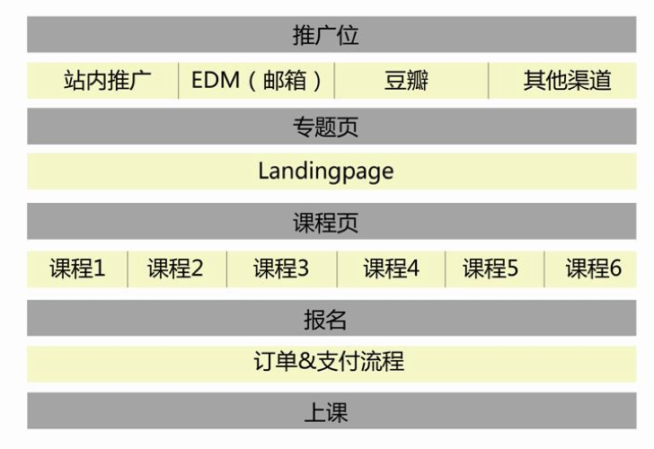
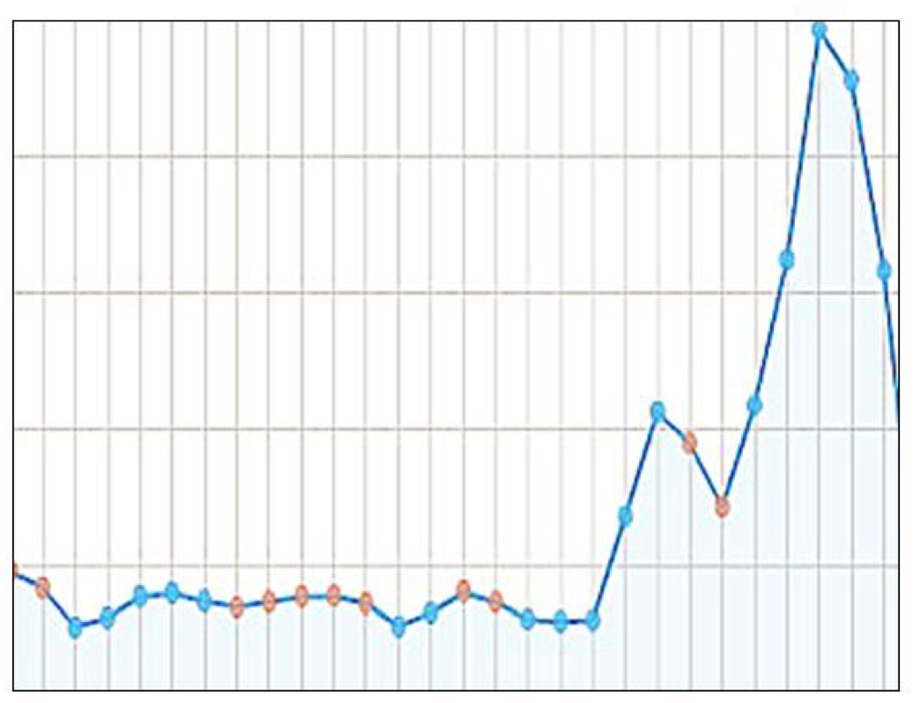

# 第3章 运营的一些核心技能&工作方法

## 3.2 一个运营必须具备的数据分析方法和意识

（一）

上一节，我们聊了关于运营指标的拆解和落地。

这一节，我们来讲讲另一件可能会贯穿你的运营生涯始终的事情——数据在运营工作中的运用。或者，也可以说是如何用数据来指导你的运营工作。

这里要先提一嘴，数据的背后，其实是逻辑和推理。换句话讲，想要让数据可以更好地为你服务，你需要先有好的逻辑和推理分析能力。假如连这一层都做不到，即便你看过了这篇文章并拍案叫绝，很可能也是只得其形，未得其神。

而至于如何评估自己的逻辑能力，我给一个大体的参照：

逻辑能力较强的人语言表达方面往往是有组织的。说话表达往往有框架有条理，思路清晰。比如，在回答问题时他会喜欢用「起因-经过-结果」、「案例-问题-分析原因-解决方法」等框架来进行回答。框架不是为了束缚思维，而是用来整理思路。

在此基础上，一般谈话话题容易跑题万里拉不回来的人，以及经常容易表达上前后自相矛盾难以自圆其说的人逻辑可能都是比较差的。

但，逻辑这个事，也不是不可以练习，只是一定需要投入大量时间。

比如：

尝试给自己建立某种思考框架（如我们前面说过的「案例-问题-原因-解决方案」这样的框架），并尝试在自己所有可能会经历的相关场景中都持续强制自己使用相应框架进行思考和表达，这样持续几个月后，通常是会有些效果的。

此外，也推荐可以参考一下《思考的技术》、《麦肯锡教我的思考方法》、《创新者的思考》、《学会提问》等书，都是我看过关于逻辑和思考方法方面的一些好书。

另外，很多人尤其是文科生在提及数据时往往会觉得比较怵，但数据其实一点也不可怕，只要思路捋清楚了，你会发现数据其实还挺有趣的。在今天的内容里，我就会试着给你呈现一些有趣的例子。

（二）

好了，接下来我们正经聊数据在运营中的作用。

说到数据，阿里的数据系统在整个国内互联网行业应该是最强大的了，很可能可能没有之一。

此前有一位从阿里离职的芮曦同学写过一篇「我在阿里 3 年的运营经验都在这里了」，其中对于数据的价值和运营工作中的具体使用场景，我觉得很多地方讲得是比较到位的。

如果我们需要总结一下的话，简而言之，数据对于运营的价值可能包括了如下几方面。

1、数据可以客观反映出一款产品当前的状态好坏和所处阶段。

比如，三节课定位的用户群主要是互联网行业的产品经理+产品运营，这群人假如有 300 万人，目前我们已经有了 10 万用户，且依靠口碑形成的自增长还比较迅速，那么我们是不是应该去加大一些推广和营销的力度，把推广做得更好一些呢？

又或者，假如我们现在才只有 1 万用户，且课程等产品体验还比较一般，那么其实我们当前的主要核心任务是不是更应该是先节奏慢点儿，踏实把产品体验搞好了再说？

2、假如做完了一件事但效果不好，数据可以告诉你，你的问题出在哪里。

比如，三节课新做了一个围绕着课程推广的活动，但结束了之后发现真正愿意去参加课程的人不是太多，那你是不是该去看看，到底是引流引得不够多，还是课程页面转化率太低，还是整个报名流程有问题？

3、假如你想要实现某个目标，数据可以帮助你找到达成的最佳路径。

这个跟我们前面提到的东西类似，好比你老板让你把销售额提升 5 倍，你是不是得去看看，销售额的提升到底该从哪里来更合适？是搞进来更多流量？还是用心把付费转化率做上去？还是好好提一下客单价？或者老板要的是用户量提升 50 万，你是不是得去看看，这 50 万用户从哪里来更靠谱？多少可以来自于用户口碑和自增长？多少可以来自于网盟？多少可以来自于豆瓣小组新浪微博？

4、极度精细的数据分析可以帮助你通过层层拆分，对用户更了解，也对整个站内的生态更有掌控力。

比如，三节课当前站内有这么多课程，我们是完全可以通过数据得到以下问题的答案的——从课程的层面来看，到底什么样的课程更受大家喜欢？然后，大家听课的习惯是怎样的？是喜欢同一堂课认真听很多遍？还是一堂课只听了 3～5 分钟就走掉了？再然后，一个还没毕业的大学毕业生和一个已经工作了 2～3 年的互联网从业者，虽然同样都是想要学习，但学习习惯和诉求是不是应该是有所不同的？以及，假如我们想要尽其所能地服务好三节课的全部用户，我们是不是可以把这些用户划分为各种不同的类别，然后分别推送给他们不同的课程和学习内容，引导他们去完成各种不同的用户行为？

5、数据当中可能隐藏着一些潜在的能让你把一件事情变得更好的线索和彩蛋，有待于你去发现和挖掘。

好比，在三节课的用户群中，我们要是通过数据的分析发现了这样一个结论——在过去 1 个月内，但凡跑到三节课来报名上课的用户，70% 都是因为看了我们的某篇文章才跑过来的，这时候你觉得你应该做点啥？

毫无疑问，当然是把这篇文章放到首页显眼处，或者放到新用户注册或访问过程中的某个必经节点上，用它去刺激更多的新用户啊！

上述 5 点中，关于 1 的部分，也即如何从宏观上结合产品形态和产品发展趋势判断一款产品所处的阶段，并制定相应的运营策略，我会在后面的第 4 章中再具体来聊。

所以，下面，我们来结合更详细的实例依次聊一下上面提到的 2、3、4、5 四种价值体现。

（三）

先说第一种：假如你做完了一件事但效果不好，这时如何通过数据来界定问题到底出在哪里。

我们来看一个真实的例子：

某 O2O 课程学习平台，注册用户 5 万，模式为用户通过线上付费报名，线下实地上课，日前上线了一个专题，聚合了 6 堂课程进行打包推广，预期每堂课至少报名 40 人以上，但从结果来看，效果不佳。该专题页相关数据如下图所示。

现在，我们想要知道这个专题的具体问题到底出在哪里，请问该怎么做？注意，这里我建议你可以自己先花点时间动动脑子思考一下，有了一些自己的判断和结论后，再继续往下看我的答案会更好。

这里可能需要提到我们之前曾经在「我眼中的 4 个关键性「运营思维」里提到的 4 个「运营思维」其中之一了：流程化思维。也就是说，要先梳理清楚流程，再用流程来反推问题的所在。

比如说，围绕着一个课程专题的运营，其触达到用户的整个流程大体应该是如下图这样的。

于是，我们可以依据这个流程回过去看，到底整个专题的问题出在哪里？比如说，是推广本身不给力？还是推广到专题页的转化率太低？还是专题页的跳出太高，基本没人进入课程？又或者是课程页面到报名的转化率太差？还是说报名后的订单确认和支付流程流失掉了太多的人？

以及，如果我们已经界定清楚了，以上几个大环节中的某一个环节存在问题，比如说，我们已经发现了推广到专题的流量数据太差，那么具体又是什么原因导致的？是因为我们渠到铺设得太少，还是因为渠道执行力度不够？还是推广素材和文案太差？

如果按照以上的思路来对这个专题的数据进行分析，我们可以发现，该专题的问题可能主要出现在以下几方面。

1、专题页的整体 UV 就很差。累计 1000 出头的 UV 对于一个专题来说实在是太可怜了。而具体的原因，可能包括：

1）专题上线时间太匆忙。可以看到，8 月 3 号就要开课的专题 7 月 31 号才上线；

2）专题推广不是特别给力，具体是铺设的渠道不够，还是在特定渠道内没做好执行，这个可能需要进一步具体去看每个渠道的具体流量构成和结合执行情况来进行分析了。

2、专题页的效率普遍较差。一方面是其跳出率超过 40%，另一方面则是从专题页导到单堂课程的 UV 最多也不过 187，仅相当于专题页流量的 10% 左右，这个效率还是低得有些可怕的。

3、从单堂课程的层面来看，课程 3 对用户的吸引力可能比较差（报名和课程页访问都很少），课程 4 的课程详情页或定价等可能有可以优化的空间（访问很多，报名很少），课程 6 则报名转化率还不错，但目测整体在站内得到曝光的机会比较少。

走完了这个例子，是不是感觉数据真的可以帮助我们把问题界定得无比精细，让我们言之有物、目标确凿？

（四）

下面我们再来说数据的第二类价值体现：假如你想达成某个特定目标，如何通过数据来评估和具体化你的最佳达成路径？

这个问题，其实跟上一节里提到的「指标拆解」一脉相承。

我们也来看一个例子：

假如三节课在接下来一个月的目标是要把日均报名上课人次这个指标提升到 20000（当前为 2000），投入预算成本最低的情况下，我们可以怎么做？

拿到这个问题后，我们首先可以依照上一节提到的目标拆解方法对我们的目标进行拆解，于是可得：

	课程报名人次 = 网站流量 × 课程转化率 × 人均报名课程数

然后，既然是要把目标指标提升 10 倍，我们要分别评估一下提升 3 个因子的可能性。

先看网站流量，假定三节课的目标用户主要是 3 岁以内的互联网产品+运营领域的从业者，目标用户共计约 100 万左右，但目前网站日 UV 只有不到 3000，那么以正常逻辑推断，在网站正常日 UV 方面拉升到目标用户的 1/10 左右，也就是 10 万应该都是可以的。但这个流量如果是需要在短期内拉动，肯定是需要投入一些费用的。

再看课程转化率，假使目前网站整体UV/课程报名人数的转化率为 2%，同时又经过分析发现，每天访问课程页面的 UV 为 2000 左右，那么依据经验判断，这已经是一个还算不错的转化率数据了。参考其他同类课程学习类网站的数据，3% 已经是很上等的网站UV/报名数转化率。我们在此暂且认为我们经过流程梳理后，可以在加强站内课程曝光引导、优化课程列表页、详情页等布局及课程文案、优化课程报名流程&体验等环节均做出一定优化，从而实现 3% 的转化率，整体提升 1.5 倍。

最后是人均报名课程数，假使我们发现目前三节课的平均每用户报名课程数量为 2 堂，而站内每月会同时开出 25 堂课，且这 25 堂课间往往都是彼此关联存在逻辑递进关系的。于是我们可以据此判定，人均报名课程数这个因子是存在明显可以提升的空间的。因为三节课目前有两个主要的课程体系，且每个体系课程目前已有 12 堂课，所以我们姑且推断，依靠课程打包、相关课程推荐、站内消息告知、一次性报名多堂课程赠送绝密资料等一系列运营手段，应该可以把单用户人均报名课程数提升到 10 堂课左右，整体提升 5 倍。

好了，因为我们的命题要求是「预算最低」，所以我们的思路一定是优先考虑无预算的指标拉升手段，再考虑有预算的指标拉升手段。那么基于以上的推断，我们应该可以在不做预算投入的情况下做到以下状态：

	课程报名人次 = 网站流量 ×（课程转化率 × 1.5）×（人均报名课程数 × 5）=（课程报名人次 = 网站流量 × 课程转化率 × 人均报名课程数）× 7.5

此时我们发现，如果按照这个推断，课程报名人次这个指标，已经被我们提升了将近 7.5 倍。也就是说，为了达成 10 倍的目标，理论上我们只需要再投入一些预算，把网站流量再提升到原有基础 1.33 倍以上即可有望达成预定目标。

至此，我们的这个最低成本达成目标的运营方案，算是成形。

上述这个不断寻找对目标数据来反复进行推导思考的过程，也希望可以带给你一些启发。

（五）

下面再看数据的第三类价值体现：极度精细的数据分析可以帮助你通过层层深入，对用户更了解，也对整个站内的生态更有掌控力。

还是来看个例子：假如目前所有站内数据可以对我们开放，那么站在运营端，若我们需要对于三节课的用户行为有更加深入精确的理解，从而更好地指导我们的运营工作，我们该以何种思路去对数据进行分析和比对，从而得出一些更有价值的信息？

这里要先引入两个数据分析中的基本概念：维度和度量。

简单来说，度量就是具体的数据指标，它通常表现为某个量化过后的数据值。而维度则是去看待这些指标的不同角度。

举例：

网站的 UV（用户访问数）是一个数据指标，而我们去看待它的时候，可以从日期的维度去看，以便评估一周或一个月内哪几天流量偏高或偏低，是否存在规律；

也可以从 24 小时时间划分的维度去看，以评估每天在不同时间段的流量分布情况是怎样的；还可以从地域的维度去看，了解不同地区的用户访问使用网站的习惯和情况是否存在差异……

理解了这两个词，最终你会发现，所谓数据分析，无非就是界定清楚了你要评估的度量有哪些，然后需要知道你可能有哪些维度去看待这些度量，偶尔可能还需要在不同维度和度量间交叉做一下分析和比对，最后产出结论，把结果用图表等方式呈现出来就好了。

所以，回归到这个例子，我们如果要结合具体的产品形态，对于三节课的用户生态和使用习惯有更加深入的了解，我们或许可以先界定清楚，我们需要去评估的度量有哪些？这个度量需要结合你的核心产品功能来想，因为三节课网站上目前主要的产品功能就是上课学习，以用户可能会在这个网站上发生的核心行为为主线来看，我们要重点关注的是以下三类行为：访问、报名、上课。于是，围绕着上述 3 个行为，我们要重点关注的度量就可能包括了：

网站访问数、注册数、报名课程数、实际上课用户数、视频停留时间、单视频重复播放数。

同时，对于以上的部分度量，我们应该有一个自己预设的合理区间（这个区间需要基于你自己对于行业和用户的了解来进行判断得出，或者是通过持续探索得出），比如说，单课程的实际上课用户数为该课程的报名用户数的 20%～50% 我们可能认为是比较合理的，那么如果该数值高于或低于这个数值，均可视为异常。

然后，接下来的一步，就是我们需要再来逐次围绕着每一个度量来去看看，我们可以有哪些维度去看待它、分析它、评估它。

比如：

拿最简单的课程报名数来举例，我们要评估这个数据的维度可能包括了日期、时间、地区、新老用户等，如果要把这个评估做到极致，我们可能需要从每一个维度依次去评估报名数这个指标的变化，从中发现一些线索或结论。

基本上，这种评估的出口有二：

一是判断数据是否有一些异常需要注意的情况（如果出现异常数据，一定要分析原因）；

二是为了给自己的运营工作找到一些方向性的指导，比如说，我现在要把站内课程月报名数提升 10 倍，我是否可以从用户行为和习惯之间去得到一些具体的启发？且，很多时候，这两个目的是可能合一的。

例如，假如我们看到过去 30 天里的报名数据是如下图所示这样的。

那么我们是否就需要去看一下，在报名数开始激增的那几天里，到底发生了什么？是因为我们有意识地做了一些推广和活动？还是因为上线了新的课程？还是因为发生了什么别的事情？

而，假如你发现，如果相应数据的激增是因为课程信息偶然间被人分享到了某个社区内（比如知乎）并引发了一轮小小的传播，那么接下来你如果想要从运营端做一些事来提升课程报名数这个指标，你是不是就可以有意识地在知乎去做一些事？比如认真分析一下之前的内容为什么能在知乎引发传播，然后把传播点提炼出来，用更适于知乎的形式去进行一轮包装，并想尽办法在知乎再进行新一轮的扩散。

事实上，我个人就曾经亲历过类似的案例，2009 年前后，当时我所供职的一家互联网公司，就曾经因为发现我们的某个产品被用户在人人网分享后带来了过万的 UV，从这一线索入手，我们开始深耕人人网，最后在短时间内给该产品带来了数十倍的数据增长。

另外，这种数据分析的另一个维度，就是依照你的常识对用户进行划分，再去分别看数据+结合用户访谈，了解不同类型的用户，在具体行为习惯上可能会有哪些不同。

比如，因为三节课主要解决的需求是学习，还没有工作经验的大学生和工作了 2 年以上的互联网人，理论上学习习惯肯定是不同的，此时我们就可以分别从数据上去观察这两类人的访问、报名、听课、课后作业包括学习产出和效果等一系列行为上存在多大区分和差异。

当这些问题界定清楚后，事实上你是可以根据用户类型的不同，分别推送给他们不同的服务和引导他们完成不同的用户行为的（比如已工作的上来先做个任务，还是大学生的则先去听两堂入门课），这样精细化的运营可以大大助推你的用户留存和活跃。

最终，假如你手边的数据足够充分，且这种从度量&维度切入的分析做到了极致，理论上你会对整体站内用户的构成、行为习惯和当前产品的主要问题做到了然于胸，也会对站内的整体用户生态更加具有掌控力。

这里再补充两个小说明：

第一，理论上，假如作为一个运营负责人，我们应该对于每一个关键性的用户行为都定期（比如每三个月或每半年）进行全方位、多维度的分析，做到对每一个关键用户行为的用户习惯和当前产品指标中的问题点了然于胸。

但，事实上是绝大部分运营都可能看不到那么全的数据，这里面原因有很多，比如数据后台不完善、没有数据权限等，这时候我们该怎么办？

我的建议是：

1）不管看不看得到，你都要让自己具备这样的分析问题和解决问题的意识+能力；

2）如果某个数据的缺失已经严重影响到了你的工作开展，一定要向老板持续沟通持续要，直到拿到为止；

3）如果只能拿到局部数据，那就先对局部数据进行一些分析和推断，再带着你的一些假设去工作，以工作成果来验证你的假设。再随着业务的发展和要求不断去完善数据需求。

第二，对很多产品来说，往往都是 20% 的重点用户给该产品带来了 80% 的价值。

所以，无论是分析数据还是具体开展运营工作，你也要培养起来这样一个意识：要重点去关注对你最有价值的那部分用户，把你至少 50% 左右的精力用于去关注他们。

比如说，你站内更加活跃的用户，更愿意贡献内容的用户，更愿意参与用户服务和管理的用户，等等。

（六）

承接着上面例子背景，接下来我们可以把最后一个点也一并讲了：

数据当中可能隐藏着一些潜在的能让你把一件事情变得更好的线索和彩蛋，有待于你去发现和挖掘。

关于这件事，基础的逻辑可能是这样的：

第一，你先找出你的产品中，当前可能存在问题的某个关键度量（或称指标）。

第二，对于这个度量进行纵览，从它的构成去看，是否所有用户或我们的所有服务在这个度量上的表现都很差，还是说有一部分用户或服务在该度量上的表现是会显著好于其他用户或服务的。

第三，你可以对于那些表现显著要好的用户和服务在不同维度上进行进一步挖掘，寻找其背后的一些共性用户行为或特征，然后再把这些特征放大到极致。

比如说，上个月三节课站内课程报名量表现不佳，明显走低，按照上面所说的逻辑，我们可以依次来进行如下思考和判定：

1. 把上个月的所有课程的报名数都列出来，然后去观察，是否所有课程的报名量都很差，还是有一些课程的报名会好一些。最终我们发现，其中存在 6 堂课程，它们的报名数普遍高于其他课程 2 倍以上。

2. 我们把报名量很高的这 6 堂课程归类到一起，然后依照各个维度去看一下，它们之间是否存在一些共性？比如，都在某个时间开课，都是某一个品类的课程，都是某位老师的课程，文案都是按照某个模板来写的，或用户在报名这些课程前都接受了某种特定的引导，等等。

3. 最终，假如通过这样的比对，我们可能得出了结论，比如说发现这 6 堂课程使用的都是同一个文案模板，或者用户在报名这 6 堂课程前普遍都看过了我们的某篇文章之类的，那么这时候，我们就已经找到了一个可能能帮助我们把事情变得更好的线索了。

于是，接下来，我们最应该做的事情，可能就是把相应的文案模板复制到其他课程的文案介绍中去，或者引导更多的新用户在报名上课之前都去看一看我们那篇神奇的文章。

讲到这里，本节的内容也就差不多了。我猜，你对于数据与运营间的关系，是能够更具体深入一点儿的。

如果打个比方的话：

但凡打仗想要获胜，你既得有上阵杀敌的本领，又要能够运筹帷幄，找对你的突破口和取胜策略。策略和突破口没找对，很可能任你有万夫不当之勇，仍然无情湮没于人海中；而硬本领不够强，则策略再好，你也根本没有取胜的可能。

这当中，数据对于运营的作用与价值，就是它帮助你找到一块战场上的发力点和突破口。

换句话讲，一个不懂得跟数据打好交道的运营，很可能到了战场上，会是盲目的。

但同时，数据也是一个很庞大的分支，关于各种数据分析的策略、方法、工具之类的，如果真的要放开了去讲，可能又是一本书。

考虑到本书的主题是「运营」，且大多数运营都应该涉及不到那么深和高级的数据分析技巧，我们在这里的目的，可能只是希望你能对数据与运营工作间的关系有一个较完整的理解，以及理解一些基本的数据意识和分析思路，了解真正把运营的精细化要做到极致，数据是需要在其中扮演必不可少的作用的。

关于数据和运营之间的关系，我们就先讲这么多。