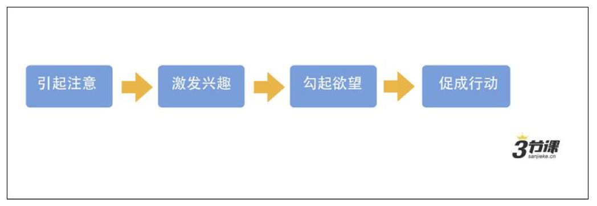
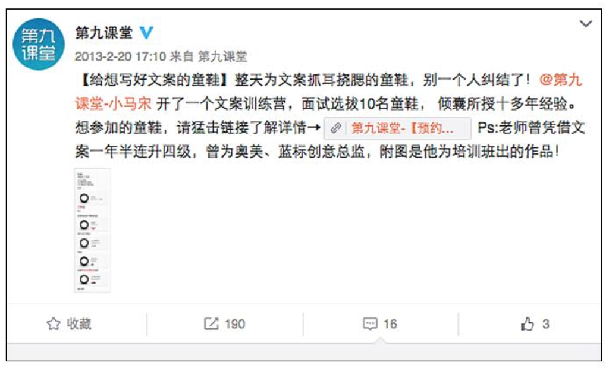
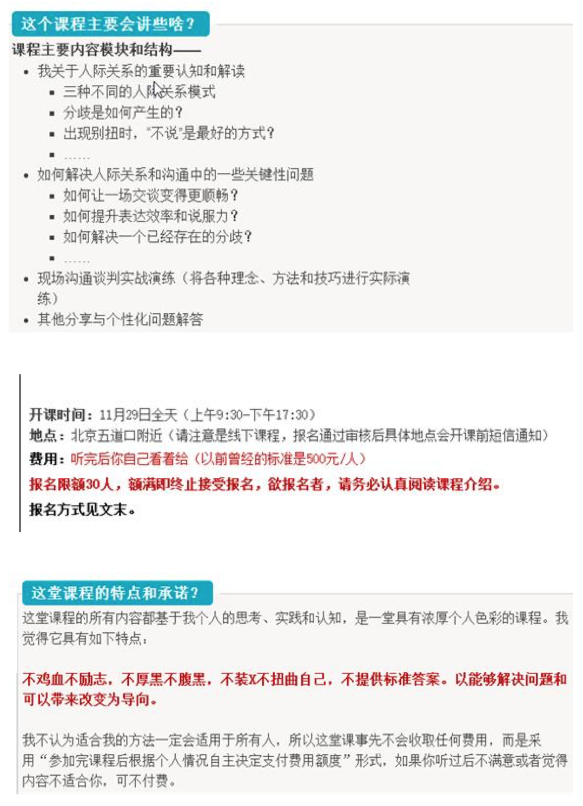
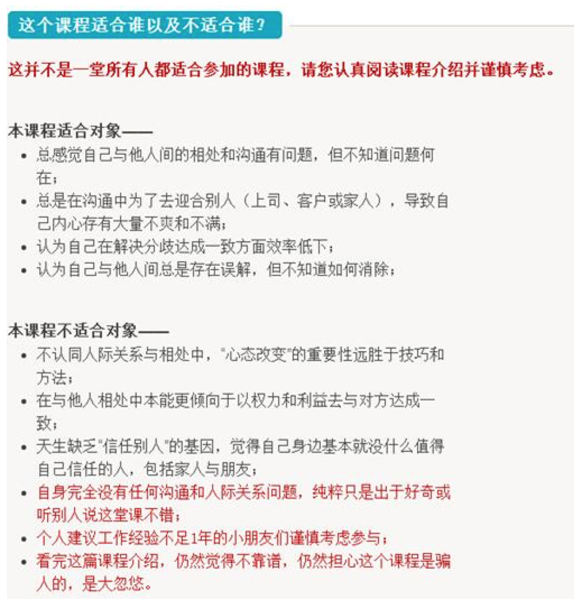
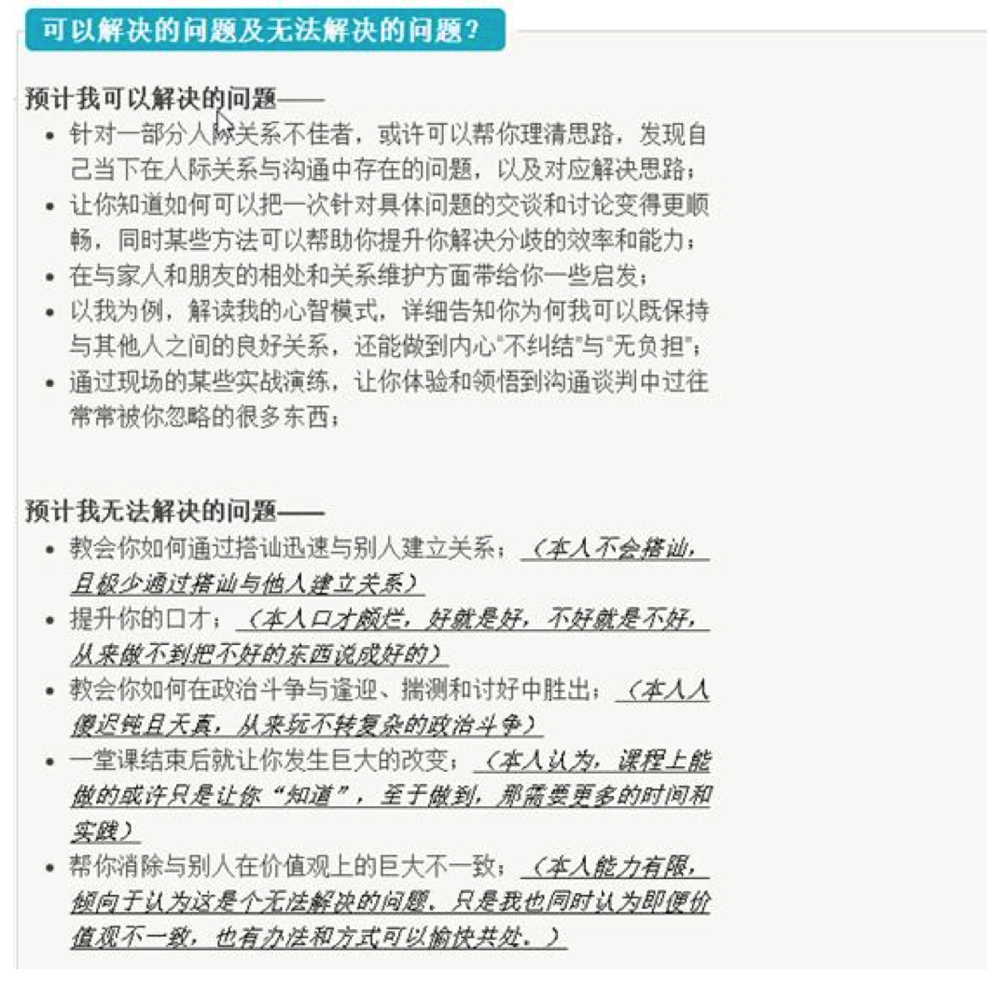
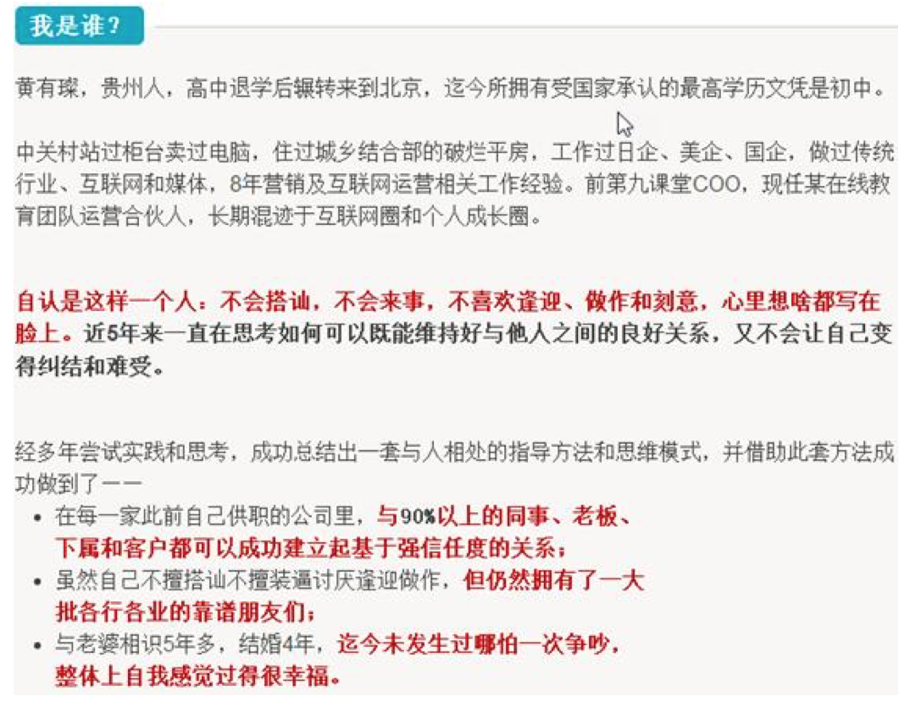
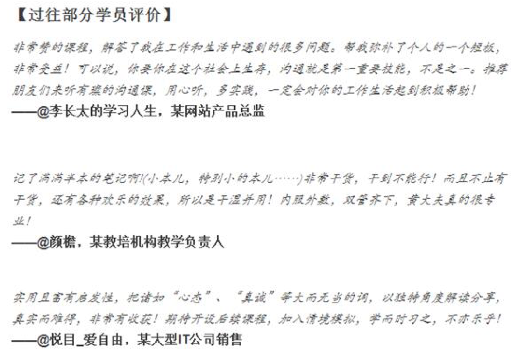
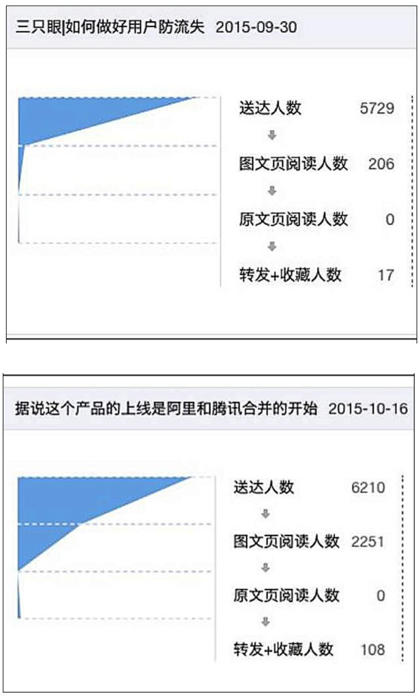

# 第3章 运营的一些核心技能&工作方法

## 3.4 转化型文案的常见写作方法

（一）什么是转化型文案

嗯，我承认我前面讲的内容运营稍微有点儿太硬太干了，本节我们来聊点儿比较好玩的——文案。

且，我们聚焦一点，只聊转化型的文案。

所谓转化型的文案，就是这个文案的目的是特定的，它被写出来的唯一意义，就是要引导用户完成某个特定行为，俗称一次转化。典型的例如，标题的最大意义，就是要能够吸引读者去阅读正文，而商品详情页所展示的文案的最大意义，就是要能够促成用户下单购买。

而在转化型文案中，又分为短文案和中长文案两种。短文案好比一个标题、一个 Banner；中长文案则好比一条微博，一个商品描述，或一篇转化型软文。

短文案和中长文案，在常规性的写作方法和注意事项上是会有所不同的，但类似文案的撰写可能是一个运营甚至也是产品经理的日常工作中接触频次最高的工作。下面我会分别来聊聊。

另外，我们也明确一下，在我的理解中，文案这个事如果你要从 0 提升到 60 分，应该还可以，只要有一些方法，加上勤加练习，不会特别困难。但如果你想要从 60 分做到 90 分以上，则可能很难很难。后者需要长期的积累沉淀和练习，甚至还需要一点天赋。

所以，我在这里，只讲 0 到 60 分的事。它可能不需要你具备多么强的文字功底，而更多的是关于思路和方法。

（二）短文案的写作

短文案的写作，典型的比如标题，我们在此也主要以标题为例。

而，要把短文案写得达到及格分以上，能带来比较好的转化率，其实并不太需要多么高超的写作技巧和华丽的词藻，只需要懂得一点点写作原则，再找到合适的写作切入角度，再用人都能听懂的大白话表达出来，就足够了。

最简单通俗的可以提升短文案转化率的两个原则，是：

第一，傍大款。即，有意识地跟某些明显势能更高、影响力更强的人或事物形成关联，通过他们更高更强的影响力刺激用户的点击访问意愿。这个方法，尤其适用于你要推送的这个东西，其知名度和影响力可能还不足以刺激到用户的时候。

第二，颠覆认知。即，有意识地抛出某些可能会颠覆用户常识性认知，甚至有点儿不可思议的观点或言论，从而引发用户好奇，借此撬动用户的点击访问意愿。

比如说，假如面向的文章内容都是一致的，试着感受一下下面两个例子中，原本的常规型标题和后面的「傍大款」标题与「颠覆认知」型标题对于刺激用户形成点击转化方面会产生的区别大小。

例1：

标题1（常规型）：《火辣健身APP深度产品调研分析报告》

标题2（傍大款型）：《同样的健身APP，它相比Keep到底NB在哪里？》

标题3（颠覆认知型）：《改了两个版本就成功融资1500万元，这款产品是如何做到的？》

例2：

标题1（常规型）：《原创干货：如何从0开始运营一个优秀的微信公号》

标题2（傍大款型）：《这个微信公号，如何在单点上可以比罗辑思维还NB？》

标题3（颠覆认知型）：《5个月，0预算0基础，他们就这样超越了60%的同类微信大号》

怎么样？是不是会觉得傍大款型的标题和颠覆认知的标题显然要比常规型的标题要有力了很多？

然后，我们再来看一个如何挖掘标题写作方向的例子。

我写过一篇分析罗辑思维操盘 Papi 酱 2200 万拍卖会始末的文章，名为「Papi酱2200万拍卖会的始末思考，罗振宇的做局与造势」，假如我们要给这篇文章来取几个转化率可以还不错的标题，我们可以怎么做呢？

首先，这是一篇分析&部分观点输出型的文章。针对这样的内容要挖掘其标题写作方向，我们其实可以发散性地思考一些特定问题，然后在每一个问题方向上，我们都可以通过精细的描述和表达，同时参考借鉴上文提到的「傍大款」和「颠覆认知」两个原则，产出一两个不错的标题，比如：

分析的事情本身够不够刺激？——《一场2200万拍卖会背后的操盘逻辑深度分析》

分析的事情跟谁有关？——《罗振宇和Papi酱，是如何操盘完成一场2200万的拍卖会的？》

是谁来分析的？——《一个10年运营总监眼中，Papi酱2200万拍卖会的操盘逻辑》

是怎么分析的？——《通过6个重要事件+15个关键点，揭示如何成功运作一场2200万的拍卖会》

相关分析和事件可能还跟谁有关？——《最该来学习这场2200万拍卖会的，可能是新浪微博》

理解了这个分析，可能带来什么？——《看懂了这场发布会的操盘逻辑，你才知道为何罗振宇投给Papi酱的1200万一点也不贵》

假如以上均不符合，则可考虑人为强力背书——《这是一篇让罗振宇本人都大呼「牛逼」的罗辑思维操盘案例分析》

嗯，我猜你可能已经会受到点儿启发了。关于短文案，我们就先讲这么多。

（三）中长型文案的写作

下面，我们再来聊一下中长型转化文案的写作。

中长型文案，往往至少一两百字，内容信息量会更大，不比普遍 20 字以内解决问题的短文案，突出重点，能迅速在一两个点上撬动用户兴趣就好。

所以，中长型文案，可能需要讲一点点逻辑和内容结构，通过一点一点的信息外露，逐步把用户的兴趣和欲望烘托勾引起来，并最终形成转化。

这里，围绕着如何能够更好地形成转化，我分享 3 种常见的中长型文案写作方法。

方法1，其实是一种文案写作结构和递进逻辑，参见下图。

简而言之，在一个中长型文案中，我们需要先有一部分内容引起用户的注意，再逐步激发起他的兴趣，勾起其欲望，最后促成用户行动，带来转化。

比如，来看如下图所示的这个例子。

上面这个我的前同事完成的微博文案例子中，「给想写好文案的童鞋」这个开头起到的作用便是「引起注意」，而后面的「整体为文案抓耳挠腮的童鞋……倾囊相授十多年经验」这个部分是「激发兴趣」，到后面「老师曾凭借文案一年半连升四级，曾为奥美、蓝标创意总监」以及老师作品展示的部分，算是进一步勾起用户欲望，而文案中「想参加的童鞋，请猛击链接了解详情」这个部分，则无疑是为了「促成行动」而服务的。

作为一个结构清晰、层次分明、卖点突出的文案，这个文案的转化率是很不错的。

方法2，也是另一种略有不同的文案写作结构，参见下图。

在这种逻辑下，我们往往会以一个故事的方式把用户代入某个情景，然后围绕着这个情景制造出某些关键矛盾，引起用户的好奇，再基于这些矛盾提出关键问题，最后顺水推舟，把问题的解决方案推送给用户。

比如，按照这种逻辑结构，我试着花了 5 分钟给我们三节课另外一位发起人布棉老师的「以用户为中心的产品设计」系列在线课程写了一个转化型的文案，不说多么好，但至少是合格的。你可以感受下。

他叫布棉，

是一名有 10 年经验的产品总监，

也是三节课发起人。

他，曾是一个不靠谱的房地产黑中介。

在 10 年前，

他每天最关心的事情，

就是怎么能多忽悠人租或买几套房子。

（以上部分，代入情景）

8 年前，机缘巧合下，

他成为了一名产品经理。

并自此开始，先后在 5 年时间内成为了：

百度高级产品经理，

赶集网的产品总监，

学而思高级产品总监。

且，他带过的徒弟，已经遍布 BAT。

（以上部分，引起矛盾）

因为他的亲身经历，

他太知道对于很多产品小白来说，

缺乏一套做产品的完整知识体系和工作方法，

是件多么痛苦的事情。

（以上部分，提出问题）（从此往下，都是给出解决方案以及对于解决方案的渲染）

所以，他将自己近 10 年的工作经验，

总结成了一套完整的在线课程——

《以用户为中心的产品设计方法论》

跟其他的很多演讲分享不一样，

这是一套成体系，

花了 3 年多时间打磨，

共近 30 堂课的完整课程。

迄今为止，

这套课程已经获得了近万人一致认可，

并已被百度、京东、学而思等知名互联网公司的近千名产品经理学习过。

就像他说过的：

做产品，要么不做，要么就做第一流的精品。

至于这么棒的课程到底怎么收费？

我们的答案是：

免费，但有门槛。

我们相信，只有这样，

才能既不至于让高昂的费用成为阻碍，

又能让每一个学员都能对待「学习」都更加认真。

我们希望，

可以借此帮到更多认真积极的互联网新人。

该讲的差不多就这些，

至于来不来，你自己看着办。

想来的话，

猛戳「阅读原文」

可以立即报名三节课在线课程。

怎么样？看完这个文案，你是不是真的还多少对这个在线课产生了点儿兴趣？

方法3，中长型转化文案的第三种写作方法，就比较简单了。它的逻辑是：把用户在一个转化行为前可能会面临和思考的所有问题都依次列出来，然后一一对用户进行解答和说服。

比如说，用户在考虑是否报名一堂三节课在线课程时可能会思考如下这些问题：

1. 课程讲什么，能解决什么问题，不能解决什么问题？

2. 跟其他同类课程相比，这个课程有什么特色？

3. 课程的老师是谁？老师有何特点？

4. 课程适合谁来听，不适合谁来听？

5. 课程的时间、地点、地址、费用、报名上课方式？

6. 其他人对这个课程的评价如何？

所以，我们只需要针对这些问题逐一给出解答就好。

比如，我早年在开设一堂主题特别不靠谱的「人际关系与沟通」课程的时候，课程文案是如下图所示这样的。

最终，这个文案的转化效果也是很不错的，就 2 年前我开课的情况而言，这个课程每月一次，期期爆满。

最后，我们再来明确一个转化型文案撰写的核心原则吧，这个原则是：

你只有先帮助用户建立起来认知，才有机会激发用户的兴趣。

换成人话讲，就是你的文案要先确保用户能够看懂，在这个基础上你才能进一步激发用户的转化。否则如果用户连看也看不懂，你可能根本没有机会去激发他的兴趣。

我们来看两个例子。

上图是我们 2015 年 10 月前后，通过三节课的微信公号推送出去的 2 篇文章，你可以看到，同样的推送渠道，仅仅只是标题的差异，这两篇文章之间的阅读量差了整整 10 倍！

所以，一个转化型文案没写好，真的是会带来 10 倍以上的差距的。

其中，第一个名为「三只眼 | 如何做好用户防流失」的标题，核心问题就在于「三只眼」这个概念，用户根本无法认知（其实这是当时我们某小编设定的一个微信公众号栏目名），而当用户无法对你的文案形成认知的时候，大部分人会条件反射式地选择忽略你。

这，就是 10 倍差距的来源。

话说到了这，我猜一定还会有一部分人想要探讨这样一个问题：

对于刻意哗众取宠式或过于夸大式的「标题党」式行为，我们到底该如何看待？不标题党，可能转化率很低，但一旦标题党，又会招来一部分用户的反感，这当中的平衡到底如何把握？

这个问题，我视之为一个运营的伦理性问题，我会把它放到下一节里来跟你一起做一些探讨。