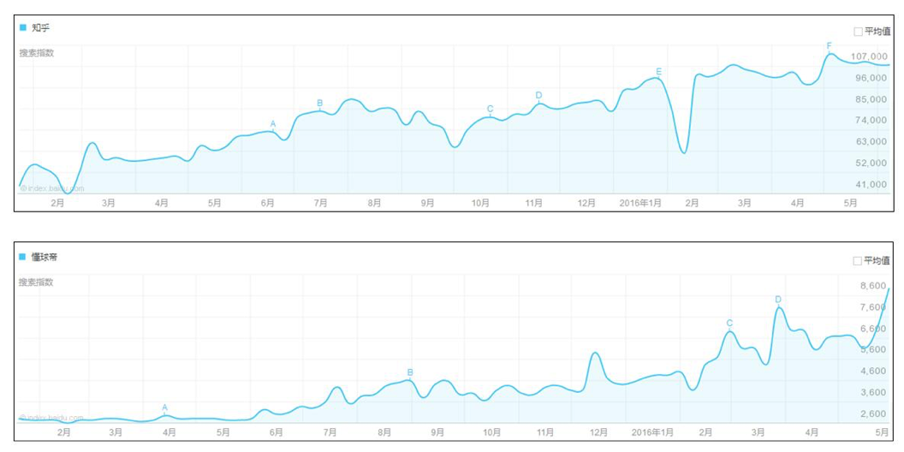

# 第4章 运营的一些宏观规律和逻辑

我们并不是说用户增长不重要，而是一款产品，如果在它自身的核心用户价值点还未明确，产品体验也还不够完善的时候，就要贸然去追求大量的用户增长，这对产品往往是一剂毒药。

一个初中级运营和一个高级运营间最常见的分水岭，也在于前者只能关注执行，后者则具备能力去完成策略制定、更长线的运营方案规划，以及运营操盘。这基本也往往是一个所谓「运营经理」和「运营总监」之间的区别了。

一旦你的产品是「让用户间建立关系」型的产品，就意味着一点，即产品中的相关用户体验你可能是无法完全掌控的，因为它们很大程度上取决于用户会在上面遇到什么样的人，经历什么样的事。

需要强调的是，任何一个好的社区，一定都有某种普世的价值观，这种价值观普遍是利他性且能得到广泛认同的，最终会体现在一些规则上。

## 4.1 运营运营背后的客观规律：从「层次感」到「非线性」

对于任何一个运营人而言，在职业生涯早期，最需要的，一定是一些具体的工作方法和技能，具体到文案怎么写、图表怎么画、如何推进一个项目、如何策划一个活动等。

逻辑很简单，运营本身就关乎大量的执行工作，要是你连基础的工作方法与技能都不具备，那几乎可以肯定，你根本没有能力去谈论其他更加深入的事情。又或者是，即便你谈论其他事情，基本也是很不接地气、空中楼阁式的。

但，假如你只有执行方法和技能，而不具备更高层面的思考判断能力，几乎可以肯定，你最多在大概有了 2～3 年左右的经验后，必然会遇到瓶颈。

要破此结，需要能够跳出运营的「执行」本身，去思考运营工作的「规划」。那么，运营本身是否也存在一些「规律」呢？

所以，在本章中，我们要跳出运营的「执行」和「方法」，就运营本身的「规律」和其背后的一些核心逻辑做一些更高层面的思考。

我猜，如果你正好是一个总是感觉自己在做一大堆杂乱执行，但总也没什么价值产出的运营，又或者你已经搞死了好几款产品却还是找不到任何头绪，本章也许对你会挺有价值的。

我先分享 3 个或许可以称之为是「规律」的东西。

规律一：带着短视的线性思维投入运营工作中，往往很难做好运营。

什么是线性思维？

即：只考虑单一结果导向的思维。

比如说，销售类的工作，无论老板还是员工，都只看销售订单数和销售额。

再比如，推广类工作，我们也只会看你投放了多少钱，拉到了多少个用户。

这也恰恰是传统行业与互联网世界的鸿沟所在：传统行业讲简单粗暴、讲成本收入比，他们更习惯的逻辑是——我在谁面前做了哪些事，他就会愿意给我付钱。这个时候，只要他付给我的钱大于我所付出的成本，我持续找到这样的人以可控的成本让他们愿意给我付钱，商业逻辑即可成立。

这样的逻辑，我称为一维、线性的逻辑。在这样的逻辑下，我做的所有事情，必然需要给我带来某些实际、具体的回报。假如我做了 A，却不能确保给我带来 B 的回报，这样的事我不会考虑。

然而，在互联网世界中，逻辑很可能远非如此简单，需要考虑的结果维度会更多。

比如说，一个互联网产品的商业逻辑很可能是这样的：

1. 我先做了一件事，让 A 愿意持续使用我；（例如，新浪微博最早通过强行指派员工邀请等方式，引入了一部分不大不小的名人使用。）

2. 因为 A 的使用，引来了 B 的关注；（因为名人们的使用，他们的粉丝以及更多的名人开始关注到这个产品，也纷纷开始使用。）

3. 我要做更多的事情把 A 和 B 都持续留在我这里；（通过不断的创造话题、制造互动、事件等手段，用户开始在微博上越来越活跃。）

4. 因为我这里有大量的 A 和 B，此时 C 突然跑了出来，说愿意给我付钱，目的是让 A 和 B 都能够关注他，认识他。（开始出现广告主愿意购买广告，只为了获得在用户面前更多的展示机会。）

所谓「羊毛出在猪身上，狗买单」的逻辑，差不多就是这个意思。

我们之前一再提到，「运营」的层次感要更加丰富，它绝不等同于「推广」，也是这个道理。

在「推广」的思维驱动下，你必然是以相同的成本拉到越多的用户，你越牛。「用户数」会是你矢志不渝的追求。

然而，传统产品销量固然是越多越好，但对一个互联网产品而言，「用户数」真的是应该矢志不渝地去追求的东西吗？

这就引出了下面我将要分享的第二个规律。

规律二：一款产品在其早期过于关注用户增长，甚至出现「爆红」等现象，往往反而会加速其死亡。

我曾经在一家大型的互联网公司内部负责过一款产品，因为公司内部全力支持，各种给资源，所以该产品从早期开始，从来都不缺流量和用户。

并且，老板给大家的 KPI，很长一段时间都是「用户增长」。

然后，这款产品迅速死掉了。

其实，很多产品身上都发生过这样的故事——在产品早期，我们为了加速产品的生长，试着给产品打一针鸡血，注入一剂强心针，然而，如果这一针的时间、力度没有找对，很可能反而是用力过猛，加速了产品的死亡。

就像我们说过的，一直以来，总有一类产品的死亡方式叫作「生于拉新，死于留存」。

在过去几年里，发生过类似故事的最典型的产品，莫过于足记。

下面是两张「足记」这款产品的百度指数图，虽然百度指数不能完全代表该产品的用户活跃度等情况，但大体上相关性还是有一些的，可以权作参考。

这是第一张，足记这款产品在 2015 年 3～4 月之间的百度指数变化图。

而如果我们把时间周期拉得更长一点，你会发现这张图其实是这样的。

仅以上述两张图来看，你会发现，足记的关注度在经历了 2015 年 3 月的爆红之后，几乎呈现一条「死亡曲线」的态势——不可逆转地一路走低，迄今未能翻身，且站在 2016 年看，它能否再次翻身也很难讲。

再来看另一款在 2016 年 2 月爆红过的产品——FaceU，你会发现，它的百度指数曲线，也有类似趋势，从爆红以后，在持续走低。

如果我们把「足记」和「Faceu」的百度指数变化对比一下「知乎」这样比较成熟，比较成功的产品以及「懂球帝」这样快速发展中的产品在 2015～2016 年间的百度指数变化，我们会发现，这个差异要比想象的还要更明显。

所以，有了上面的几个案例对比，你还会在产品早期如此关注用户增长吗？

请注意，我们并不是说用户增长不重要，而是一款产品，如果在它自身的核心用户价值点还未明确，产品体验也还不够完善的时候，就要贸然去追求大量的用户增长，这对产品往往是一剂毒药。

那么早起如果不应关注用户增长，应该关注什么呢？我们下面来讲。

规律三：早期产品的运营，一定要围绕着「口碑」来进行。

这个部分我们要聊的东西，其实侧面解答了上面提到的「规律2」为何是成立的。

一款刚刚上线的早期产品，可能会面临什么情况？

产品体验很烂，产品功能不完善，甚至产品的主要操作都保证不了，这些都是再常见不过的事情。

比如说，百度外卖这样的产品，在其刚刚上线的时候，你觉得你有多大几率每次都能用它订到餐？

假如产品处在这样的背景下，运营要去大量拉入新用户，会出现什么后果？

答案是：找死。

因为，一大群用户进来后，纷纷得不到良好体验，然后他们对你又没什么感情、没什么牵挂，他们一定迅速跑掉，而且跑掉还不算结束，他们很可能还会跑掉后满世界去骂娘，从而带动其他人对你的产品也形成负面认知。

一旦用户变成了这种状态，你几乎再也没有机会把他们拉回到你的产品中来了。

所以，一款产品的早期，核心目的一定不应该是增长和用户规模，而是口碑。

有了口碑，表示现有用户已经充分认可了你，表示你的产品基本体验已经足够完善，也表示你已经拥有了更好的服务能力去服务更大体量的用户了。

最为重要的是，有了口碑，你的新用户获取成本会大大降低。

那么，早期产品的体验如果很糟糕，口碑应该从哪里来？

答案是：运营对于用户的感染力、服务态度、你的产品理念、你的产品迅速改进优化的速度和能力，你在其他方面给这群用户创造的价值（例如总是送给用户一些意外之喜）等。是这一系列事情支撑起了早期产品的口碑。

比如说，大部分人可能都能感觉到，哪怕三节课的线上产品体验在早期并不是很好，我们仍然可以有还不错的口碑。

而这些口碑，其实来自于：

1. 三节课早期的前 1000 多名用户，我们几乎无一例外，都跟他们见过面，有过一对一的交流；

2. 我们几乎每天都会在三节课的全体学员群内与大家进行互动和答疑；

3. 我们早期的网站和产品虽然很烂，但确实每一周都能让用户们看到优化和改进。

只有在你的产品已经拥有了很扎实的口碑后，你才能把「增长」作为你的目标来看待。就像我现在打算开个餐厅，并邀请了一些朋友先来试吃，但假如我做的吃的都还不能赢得我身边朋友们的认可和信赖，我就要开始大规模去对外宣传推广，这时我不仅伤害了我那些一直在给我提各种建议的朋友们，同时也会在宣传推广的过程中遇到更大的障碍和问题。

要把你的早期用户当作你最好的朋友来看待，这其实是个常识。

只是，人们往往都太容易忘记常识。希望你可以更尊重这些平时无华的常识一点。

## 4.2 四种不同阶段的产品及其运营侧重点差异

就像之前说过的，在第 4 章的内容中，我们想要重点思考的，是围绕着一款产品的生与死，运营工作该如何规划，以及背后是否存在一些规律可以遵循。

关于这个话题，其实存在两条主要的线索可以进行探讨：

第一，依据不同的产品发展阶段或当前占据市场份额的大小来判定运营策略和运营规划如何制定；

第二，依据不同的产品形态和业务类型，来判定运营策略和运营规划如何制定。

本节我们先来聊聊上面的「第一」，至于「第二」，我们留给下一节。

其实，从产品自身所处的发展阶段来说，我们是可以把产品分为下述 4 种类型的。

1、探索期产品

特征：上线时间不长，产品还在打磨，需求尚待验证，占据的市场份额很小，基本可以忽略，还无法被大多数人所接受。

典型代表：2011～2012 年间的知乎、2010 年的新浪微博，包括绝大多数上线时间在 8 个月以内的产品。

2、快速增长期产品

特征：需求已得到验证，初步拥有了一定市场份额，市场上同类竞争对手大量出现，需要依靠快速增长迅速占领市场，冲出重围。

典型代表：2016 年上半年的映客、2014 年的滴滴出行、2013 年的陌陌。

3、成熟稳定期产品

特征：市场接近饱和，产品本身已经占据了很稳固的一块市场份额，增长空间已经很小。

典型代表：2016 年的微信、百度地图、美柚、大姨吗等。

4、衰退期产品

特征：替代产品出现，用户开始批量流失，转移到替代产品。

典型代表：2016 年的豆瓣、天涯社区、猫扑等。

正常而言，一个产品从诞生到死亡，会逐次经历如上 4 个阶段，且每个阶段中的关注点会有所不同。

下面我们再逐次来看下，不同阶段的产品，其运营上的表象和关注点，会有哪些不同。

### （一）探索期产品

我们先明确一个基本论点：探索期产品的运营目的不是为了获取大量用户，而是为将来有一天自己能够服务好大量用户做好一切必要的准备。包括：产品功能上的、产品使用体验上的、产品风格和氛围上的、服务能力上的。

此外，我们也可以借 2011～2012 年间的知乎与 2010 年前后的新浪微博，来看看探索期产品的运营方面有何相似之处。

1. 他们都选择了较为封闭、有限制条件的运营方式。无论是知乎还是微博，早期都采用了「邀请码」的机制，以邀请码来控制用户绝对数量的增长。而知乎更是一直在长达 2 年的时间内都保持着邀请码注册的机制。因为邀请码的存在，他们最大限度地保证了早期产品氛围的纯度及可控性。

2. 除了凭借「邀请码」而来的用户外，他们在早期都通过运营邀请了一群有知名度、有影响力的「大V」加入进来使用产品，如知乎上的李开复、雷军，微博上的黄健翔、郑渊洁等，这群大V既成为了早期产品的忠实用户，又凭借自身的影响力持续在给产品带来新的关注。

3. 他们对于早期种子用户都给予了各种「无与伦比」的关怀。如知乎的@张亮（就是创新工场那哥们儿）、@张亮Leo（是的，就是我的好基友，写了《从零开始做运营》的那个胖子），微博上的郑渊洁等，都在知乎和微博发展早期借由自己的积极活跃获得了大量的粉丝关注，放大了自身价值。此外，很多早期知乎和微博的核心用户们与知乎、微博官方间的关系一直都保持着一种很紧密的状态，他们认识众多的知乎、微博官方员工，甚至迄今仍然会经常受邀到知乎办公室做客，参加各种知乎组织的活动等。

至此，我们或许可以总结一下，对于一款探索期的产品而言，常见的运营要点有如下几个。

1. 挑用户。尽力通过各种方式把可能会对你的产品带来伤害的用户（比如那种典型的走到哪儿骂到哪儿的「喷子」型用户），或是你暂不具备能力服务好的用户（典型的如知乎在早期只关注创业、互联网相关话题）在早期拒之门外。

2. 尽可能通过邀请、BD 等各种手段找到一部分「活跃」、在小圈子内「有影响力」的名人领袖型用户成为你的早期种子用户，然后通过服务好他们，让他们愿意自发为你背书，传播你的产品。他们的信任和背书，对于一款早期产品的价值是巨大的。且，对于这样的用户，如果你能服务好一个，很容易就能影响到一群人。

3. 对你的种子用户一定要给予各种额外关注，让他们感受到，在这里做一个用户与在别的地方做一个用户的感受是显著不一样的。这个逻辑其实也很浅显：既然我们已经说了早期产品的体验可能会很烂很不确定，自然需要运营端投入更多的精力去给用户一个愿意留下来的理由。

通常，如果你发现你的产品用户认可度和种子用户活跃度已经很高，用户的增长速度开始显著加速的时候，你可能就已经渡过了探索期。

### （二）快速增长期产品

2016 年上半年的映客、2014 年的滴滴出行、2012 年下半年到 2012 年的陌陌，它们的共同特点就是：开始动用自己可见的一切手段、资源等，尽一切可能迅速占领市场。

至于为什么要开始加速占领市场：一是产品已经准备好了，部分用户对于产品已有认知和接纳，用户教育成本变低；二则是，因为你已经验证完了可行性，这个阶段往往竞品也会大量出现，所以如果你跑得不够快，就很容易被别人干死了。

从它们自身所处的阶段来看，我们也可以看到一些共性：

1. 关于推广层面。各种渠道的铺设，从应用商店推广到效果类广告（如广点通等），往往从这一阶段开始上量。

2. 围绕着产品的各种事件、话题往往在这一阶段层出不穷。如映客现在动辄两三周就会有明星名人直播，如陌陌 2012 年下半年开始给自己贴上的那个「约炮神器」的标签并围绕着这一标签延伸出来的各种话题和传播，再如滴滴出行在 2014 年开始积极联合各大品牌策划跨界营销、事件营销等（如韩红的红包广告）。

3. 往往在这一阶段会通过大规模的补贴等行为迅速拉动用户增长速度，培养用户使用习惯，典型的如滴滴出行在 2014 年几乎持续了整整一年的红包。

4. 这一阶段，面向用户的运营，开始由粗放转为逐渐精细。例如，2014 年的滴滴出行，开始根据地区、时间段等的不同面向不同用户实施不同的补贴策略；再例如，映客上的主播们，到了 2016 年上半年这个阶段，已经开始被分类进行维护和管理了。

总结一下：

对于一款已经渡过探索期，进入快速增长期的产品而言，核心目标就是能够快速获得用户增长，为了尽可能快速地占领市场，在各种推广渠道、方式上，这一阶段产品往往会全面出击，甚至是实施大量补贴等方式，力求尽快占领市场。

另外，这一阶段的运营，会逐渐精细起来，会开始面向不同的用户提供不同的服务，或实施不同的运营手段。

### （三）成熟稳定期产品

所谓「成熟稳定期」的产品，必备前提就是其在相应领域中的用户数增长空间已经很小，产品已经拥有了较为稳定的地位。

对照一下，2016 年上半年的微信、大众点评、美柚、大姨吗等这样的产品，都属于已经进入了「成熟稳定期」的产品。

这个阶段的产品，共同特点往往在于：高度关注用户活跃度，高度关注商业变现路径，同时，面向用户的运营也开始全面精细化。

举例：

这个阶段的微信，你会开始看到更多的朋友圈广告，你会看到微信开始大量接入更多的服务。

这个阶段的大众点评，你会更加频繁地在手机端收到大量 Push，定期收到各种优惠券和官方活动信息。

这个阶段的美柚和大姨吗，你会看到它们的积分体系、活动等开始在产品内部变得越来越强，也会发现它们已经纷纷开始尝试通过电商来开启自己的变现。

上述这些产品，在当下一定也已经开启了对用户的全面精细化运营，比如说，这个时候不同用户登录后在产品中看到、接收到的信息，会是完全不一样的。

总结：

一款成熟稳定期的产品，理论上会进入一个全面的精细运营期——针对不同的产品模块，不同类型的用户，都应该会有专门的运营人员去负责，给用户提供相应服务和讯息。

同时，这一阶段的运营工作，总体上会以品牌形象的树立、用户活跃度和商业变现三大方向为导向。因而运营端的具体工作内容往往包括了：大量品牌传播活动与事件、大量面向特定用户且周期相对固定的活动、各种潜在的商业变现方式尝试及围绕着增加收入的运营。

### （四）衰退期产品

衰退期产品，通常是上一个时代的一方霸主，但很显然，未来已经不是它的了，它以往的用户，开始大量流失，并转移到各类替代产品上。

所以，这类产品的运营重点，往往是老用户的维系和生命周期管理。通过各种手段尽可能减缓老用户流失的速度，同时持续探索新的产品方向，争取能在潜在替代产品发展起来之前，自己先能做出一款良好的替代产品。

但，假如一款产品真的来到了这个阶段，正常而言起死回生的可能性是比较小的。

举例：

豆瓣从 2014 年以来就一直没有停止过自己的焦虑，在不断尝试发布着各种新产品，但其庞大的产品线也一直显得很纠结。

当年 BBS 时代的两大霸主——「号称北猫扑，南天涯」的猫扑和天涯，自 2011 年微博等各类新兴社区逐渐兴起以来，用户也大量流失，至今已淡出主流互联网世界。

总结：

一款衰退期的产品，运营基本只能维持和强化此前的各种常规运营手段以延长自己的生命周期，同时，面向流失用户的召回、承接等可能会成为这个阶段中一块比较重要的运营工作，只是，这样的工作往往成效不会太大。

假如你所负责的不幸正好是这样的产品，我最大的建议就是，能找到空间自己做点儿有产出的事就赶紧做点儿吧，至少将来履历上会好看很多。

好了，到此为止，我们已经通过一些案例，为你展示了不同的产品在其所处的不同阶段，运营工作上的侧重点。对于那些工作年限不长，可能只待过一两家公司，长期关注执行但对于运营工作的规划缺乏认知与思考的同学们，这里的内容应该是可以给到你很多启发的。

下一节，我们会再从产品形态和业务类型出发，来具体聊聊各种不同类型的产品形态和业务类型中，运营的具体工作内容和关注点，甚至包括运营策略上又会存在哪些差异。

## 4.3 如何结合产品业务类型规划运营路径

很多人眼中，运营就是打杂跑腿，琐事缠身，各种出卖体力。

这其实没错，因为至少超过 80% 的运营，其工作状态确实如此。

然而，在很多过来人的眼中，以及很多 CEO、创始人们的眼中，运营的真正价值所在，却绝不是「可以管理好各种琐事，具备强大的执行力」这么简单。

我在本书开篇的「为什么我觉得互联网的下一个时代将是运营驱动的」一节中，已经提到过，运营是一件复杂度远超局外人想象的事情。

具体来说，这种复杂度体现在如下几方面：

1. 一款产品，因其业务类型的差异，其运营过程中核心关注点是不一样的（如，高频使用型产品和低频使用型产品、消费型产品和非消费型产品就完全不同）；

2. 一款产品，因其产品形态的差异，其运营体系的搭建以及其运营通路也是完全不同的（如，工具类产品与社交类产品、内容型产品与平台型产品）；

3. 一款产品，依其发展所处的不同阶段，每一阶段的运营侧重点也千差万别（如，一款成熟型的产品和一款刚上线的早期产品，运营要解决的问题基本也完全不一样）；

4. 即便目标和运营侧重点完全一致，为了实现同一个目的，运营上具体可以采用的手段也是多种多样的（如，为了搞定 10 万新增用户，我可以策划个事件，可以做效果广告投放，也可以发一堆软文……）。

以上几点，基本决定了运营很可能是一个没有标准答案的事情。相反，每一款产品在每一个时间节点上的运营策略如何制定以及工作内容如何规划，都是需要结合很多具体问题来进行思考的。

而在这样没有标准答案的前提下，还要能够给出行之有效的策略，并通过一系列动作和具体手段令其生效，这恰恰是运营所需要面临的最大挑战。

当然，它也往往是「运营」这项工作的有趣之处。正因为这些无处不在的变量，运营才会是个「看似琐碎缺乏技术含量，实则深不见底」的事情。

基本上，一个初中级运营和一个高级运营间最常见的分水岭，也在于前者只能关注执行，后者则具备能力去完成策略制定、更长线的运营方案规划，以及运营操盘。这基本也往往是一个所谓「运营经理」和「运营总监」之间的区别了。

那么，如果要让自己具备类似的策略制定和操盘能力，需要满足哪些前提条件呢？我认为可能有以下几点：

1. 对各类运营手段非常熟悉。从写文案到做传播，从活动策划执行到广告投放，从运营群到管理一个社区，从线下地推到线上的用户维系，它们当中的大部分你都需要能够搞清楚背后的逻辑，以及具备落地执行的能力。

2. 有过一些复杂度较高的运营项目操盘经验。比如说，曾经依靠一个投入了十几个人资源，涉及开发、产品设计、渠道推广、整体传播等各环节的中大型运营活动达成了用户新增几十万的目标。

3. 能够理解一款产品在其不同发展阶段的运营侧重点会有何不同。

4. 能够站在商业模式和业务逻辑的层面上，理解不同业务类型、不同商业模式的产品，其运营上最大的核心突破口和核心要点可能是什么。

5. 能够结合产品形态及产品的核心业务逻辑完成和搭建起来一个足以支撑该业务顺畅运转起来的运营体系。

上述 5 点中，第 1 点和第 2 点需要你自己通过时间去慢慢实践、积累、沉淀和给自己争取创造机会。

第 3 点我们在上一节中已有提到。

这里，我们来重点聊聊第 4 点，即，根据产品不同的业务类型和商业模式，寻找运营上的核心突破口和核心要点。

第 5 点，则且待我们放到下一节来讲。

纵览整个互联网世界，我觉得，绝大部分产品的运营工作如何规划，都可以从三个维度分别来评估，最后再把三个维度下分别评估得出的结论汇总到一起，得出一个指导性的方向。

这三个维度一是商业逻辑，二是典型用户行为频次，三是用户与其他用户间是否会通过你的产品而形成某种关系。

下面我一个个说。

### （一）商业逻辑

普遍来看，各类互联网产品大体存在以下 3 种商业逻辑，而每种商业逻辑反向回来对于运营端的要求又会有所不同。

商业逻辑1：直接面向用户售卖某种商品或服务获得赢利

这样的产品商业逻辑最为直接，它们存在的目的就是为了把某些商品或服务直接销售给用户，并从中获利。

它们当中的典型例如品牌电商网站、各种 O2O 上门服务等。

所以，它的核心在于：是否能找到足够好、足够多的商品，以足够低的成本、足够顺畅地将其售卖出去，并确保整体售卖流程的顺畅程度。

所以按照这个逻辑，为了实现利益最大化，逆推回来，该类产品需要运营端具备的核心能力就是：

1. 商品和货源的选择和拓展能力（即，要有能力找到更优、更多的可售卖商品）；

2. 商品包装和营销能力（即，能否以尽可能低的成本把商品卖出去）；

3. 供应链全程服务能力（即，从用户产生下单行为到最后完成消费的全过程服务能力，其中有可能包括了仓储、配送、服务人员管理等环节）。

例：唯品会、聚美优品、当当网等自营电商，运营端往往会被划分成几个子团队：

1. 品类运营。该团队决定网站内会上线哪些商品分类以及每一阶段主推哪些商品分类，偏策略。

2. 商品运营。该团队主要负责商品的定价、定量、上下架（即决定某段时间内库存中该商品的储备数量，备货太多占据仓储成本，备货太少可能影响销售收入）。

3. 供应链团队。该团队主要负责涉及供应商对接、仓储、进出库、物流、配送等相关的所有环节管理。

4. 营销团队。该团队主要负责定期策划各种大型促销活动和制定相应促销策略，周期性拉动站内销售额上升。每逢类似双十一、6·18 前后，这个团队是最忙的。

商业逻辑2：免费+增值服务

该类产品的商业逻辑是：我为用户免费提供一部分产品或服务，在此基础上通过一部分付费增值服务获得赢利。

这样的产品在互联网世界里是颇为常见的，尤其常见于各类工具类产品（比如我现在在用的印象笔记）。它们往往通过免费提供某种服务从而赢得大量用户，之后再通过提供付费增值服务的方式实现赢利。

所以，其核心在于：是否能获取到足够多的用户，是否能够让用户对产品形成依赖，以及是否可以更顺利地撬动用户为增值服务买单。

同样逆推一下，该类产品需要运营端具备的核心能力是：

1. 免费试用用户的获取能力；

2. 用户的使用习惯和依赖性培养；

3. 用户日常使用行为到付费服务之间的路径搭建；

4. 最终的增值服务或第三方付费服务的售卖。

用户和流量获取涉及的面太多太广，这里先不重点讲，主要讲后面几件事。

关于用户的使用习惯和依赖性培养，又有两种常见方法。一是慢慢引导用户把更多的社交关系、个人记录、数据等逐步沉淀到产品中；二则是通过理念输出、标杆树立等各种方式循循善诱式地完成对用户的教育。

关于用户日常使用行为到付费服务间的路径搭建，重在巧妙的设计和前后关联性。

关于售卖，这个就是各种促销运营手段了，没啥可说的。

这里举一个典型例子，印象笔记这款产品，从 2012 年进入国内开始一直到 2014 年成功成为最大的笔记类应用期间，前后重点做了这么几件事：

1. 初期，不断通过广告片、软文、演讲分享等形式对外传递类似信息：「你需要有一个第二大脑去帮助你把那些需要记忆的东西储存起来，然后把你的大脑主要用于思考，这样你的个人价值才能最大化。」

2. 然后，慢慢找到一群「知识界大V」成为其典型标杆用户，然后不断对外开始传递类似信息——「你看，古典、战隼以及其他 N 多知识界大V们都是这样使用印象笔记的」；「原来屌丝和知识界大V们的核心差别就在于能否善于利用印象笔记这样的知识管理工具为自己服务啊」。

3. 通过官方组织或鼓励民间等各种方式先后发起和组织了N多活动，类似「一起记晨间日记」、「月度目标大挑战」等之类的。

4. 当越来越多的人开始参照大V们把自己的各种资料往印象笔记上放时，大家开始发现了一个问题：一个月几十 MB 的免费存储空间可能不够用啊！此时印象笔记推出了「印象笔记高级账户」，只需每年支付 200 多块，即可享有每月 10GB 的上传存储空间……

5. 围绕着高级账户的售卖，印象笔记前后也做了很多次有助于形成病毒传播的促销活动，例如两人同时购买一人免单、3 人同时完成某个任务可获折扣码之类的。

商业逻辑3：免费+流量or数据变现

逻辑3与逻辑2略有相似，在互联网世界中也是非常常见的。

该类产品的商业逻辑是：通过为用户提供产品或服务，慢慢积累起海量访问流量或数据、然后再基于已有的流量和数据通过引入有付费意愿的第三方实现变现（即售卖流量、售卖数据等）。

与逻辑2相比，逻辑3的主要区别或许在于：最后买单者不是用户，而是第三方。这类产品的典型是社区。

而这一逻辑的核心往往在于：是否能获取到足够多的用户，用户忠诚度是否足够，是否能积累下来可以持续带来新流量的数据或内容，是否可以积累下来付费方愿意为之付费的内容、数据或特定氛围。

继续逆推，则该类产品需要运营端具备的核心能力是：

1. 引导用户发生特定行为、搭建特定氛围的能力；

2. 持续维系住用户形成用户活跃度的能力；

3. 对于内容、数据和现有重点用户资源等的整合能力。

例：知乎作为一个社区的代表，从 2011 年上线以来，其站内的运营始终是围绕着以下几个点来做的：

1. 如何搭建好一个特定的氛围。在这点上，知乎自己也多次表示过，早期引入的数百位核心用户认真、理性的回答风格奠定了知乎的文化基因。此外，知乎也一直在对外以各种方式输出传递着自己的一些理念。

2. 优质内容、数据等的积淀。这个不多说。

3. 核心用户的维系。知乎站内的一些核心大V，至今都跟知乎官方保持着密切的关系，会有人定期与他们进行沟通，并邀请他们参加各类活动。

4. 变现尝试。知乎积累下来的最有价值的东西就是「人」和「内容」，所以知乎的变现也一直在围绕着这两者在进行着，包括但不限于出版、最近刚刚上线的「值乎」、「知乎Live」、知乎产品的品牌广告展示（但品牌会经过挑选，且广告内容必须是与「知识」相关的内容）等。

### （二）典型用户行为频次

所谓典型用户行为频次，就是假如用户接受和认可了你，他使用你最核心的产品功能或服务的频次可能是怎样的。基本上这里也有几种可能：

1. 用户基本使用你的产品功能或核心服务是一次性的；

2. 用户使用你的产品功能或核心服务频次中低，比如数月一次，甚至 1～2 年一次；

3. 用户使用你的产品功能或核心服务频次较高，比如至少每周一次。

这个频次的不一样，尤其会导致我们在关于用户获取方面要关注的重点会发生一些变化。我们也来依次简单分析一下。

1、用户一次性使用

这种类型的典型产品比如某些培训课程（如托福雅思）、或婚庆服务、殡葬服务等。且毫无疑问，该类产品肯定是收费型的产品（用户一次性使用，还免费，那还做个毛）。

因为用户接受并使用该服务的机会基本只有一次，所以该类产品基本不用考虑花太多精力在用户维系方面。相反，该类产品更应该关注的事情，一定是：

1. 获客渠道的铺设和广告投放；

2. 销售转化的有效性；

3. 客单价（就一次挣钱的机会，当然要挣足点儿啊）。

总之，推广上要舍得花钱，只要最终的 ROI 能算平，怎么花都行。

举例，很多托福雅思培训在运营方面会做的事基本是这样的：

1. 在所有顾客会出没的典型场景下投放广告（比如高校、搜索引擎关键字、英语学习论坛等），吸引用户了解自己的培训课程；

2. 精细化运作销售流程，比如用户访问后会有在线人员接受咨询，或者会让用户留下电话，销售人员电话跟进，甚至是引导用户来参加线下公开课，在课后再有一个课程顾问跟进忽悠之类的，为的只是提高销售成单率。因为，来都来了，你要是不在他们这掏钱，必然就到其他地方掏钱去了，且以后就再也不可能回来了；

3. 用尽各种方法（比如打包各种服务，包装得各种逼格高，提升上课环境上课体验，跟其他课程进行对比，甚至连带一部分忽悠啥的）把客单价做高。

2、用户中低频次使用（如数月一次，甚至 1～2 年一次）

这种类型的典型产品比如汽车保养类产品、求职类产品等。

该类产品的特点是：不管用户多喜欢你多认可你，他每次使用完你，基本就走掉了，且距离下次他再使用你时间周期会比较漫长。

所以，该类产品在用户获取方面如果都依靠花钱投放和推广，一定亏死了。

相对而言，更需要的，是能够让用户每次产生相关需求时，都能够最快捷最有效地找到它。

那么，类似求职找工作这样的事，用户在每次产生相关需求时，关于到底使用什么产品是如何决策的呢？

基本上有很大可能取决于如下几点：

1. 我脑海中第一时间出现的在这个领域内的品牌是哪家？

2. 我最近是否听到过身边有人提过或推荐过某款相关产品？

3. 我通过搜索引擎、应用商店等渠道搜索「招聘运营总监」等相关关键字，看看会出来哪些结果？

于是，对于该类型的产品在用户获取方面更应该关注些什么，看起来也就很清晰了吧？

基本上，无外乎：

1. 渠道铺设，占据入口。如搜索引擎、应用商店等地方，该占据的位置一定要占据，且能排得越靠前越好；

2. 品牌传播，占据认知。不断通过活动、事件、媒体报道、PR软文等各种方式面向行业和用户去传播你的品牌，提升大家对于品牌的认知。

3、用户高频次使用（至少每周一次）

这类产品就很多了，比如阅读类产品、社交类产品等，都算。

该类产品的特点往往是：用户从了解你到接受你再到认可你，可能需要一点周期，但一旦他真的接受了你，他就会变得很难再离开你。

另外，该类产品因为用户使用的频次比较高，所以理论上产生口碑效应和病毒营销的概率也最大。

所以，毋庸置疑，这类产品需要关注的重点往往是以下两个：

1. 通过补贴、活动、运营机制、用户引导等各种方式培养用户的使用习惯（如上面提到的印象笔记案例，再如滴滴和各种外卖类应用早期不断给用户发红包，都是为了培养使用习惯）；

2. 在用户获取方面，更应该思考如何通过运营机制或运营手段撬动现有用户的力量，打通几个「分享」的场景，形成病毒传播和增长（如滴滴和外卖类应用的「红包」，如各种美图类应用的「变妆」H5小游戏、美妆比赛等）。

### （三）用户间是否通过产品结成某种关系

在互联网世界里，有一部分产品是那种单向服务式的产品，即用户单向接受该产品的服务，典型的比如各类日历、便签、航班查询这样的工具。

但还有一类产品，扮演的是一个「连接器」的角色，其最终实现的状态，是很多不同类型的用户之间，最终通过它建立了某种关系。

这样的产品，包括淘宝这样的电商平台，包括知乎这样的社区，包括探探这样的社交软件，都算。

而，一旦你的产品是这种「让用户间建立关系」型的产品，就意味着一点，即产品中的相关用户体验你可能是无法完全掌控的，因为它们很大程度上取决于用户会在上面遇到什么样的人，经历什么样的事。

因而，假如你是这种类型的产品，则你的运营工作规划中又需要包含必不可少的两块：

其一，这样的产品往往会特别注重氛围的打造，发展也会比较慢。且早期的用户会极度重要，你需要与早期用户间保持极其密切的关系，且需要让他们极度认可你的理念。这方面，知乎是典型，不细说了。

其二，这样的产品，你一定需要花费很大的经历来逐渐建立和完善起来一些规则、边界和约束条件。最终，你是通过这样的一些规则来最大程度保障用户的体验，并且给用户在站内的行为规范指明了方向。

这些规则，典型的比如发黄图必删号，接到投诉三次 T 走，不得辱骂、诋毁他人等。

并且，每一个相关规则的建立，最好都建立在一些真实发生的事件、案例上，并最好在公布前广泛寻求用户的意见，这样会让这个过程变得更加顺畅。

到此为止，本节讲完。

我感觉，这可能是本书中最具有技术含量的一节了。当然了，要消化起来应该也是需要点基础的，如果你是一个新人，感觉有地方看不懂比较难理解，我觉得这是正常的，可以不用太纠结，好好修炼外功内力就好。：）