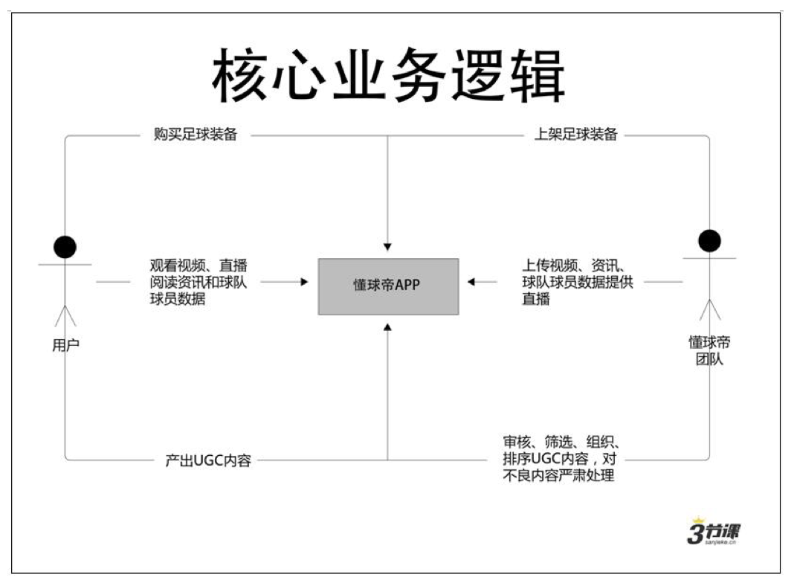
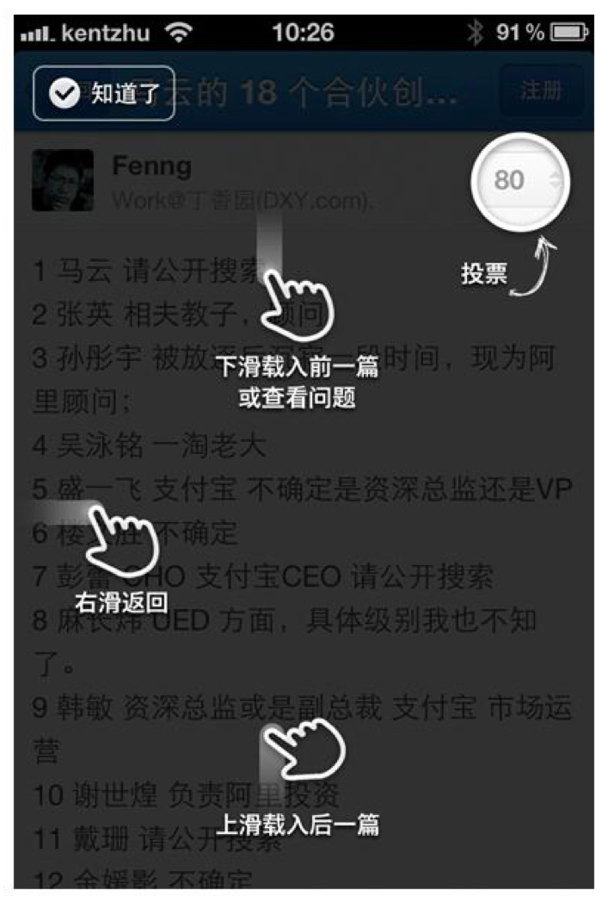
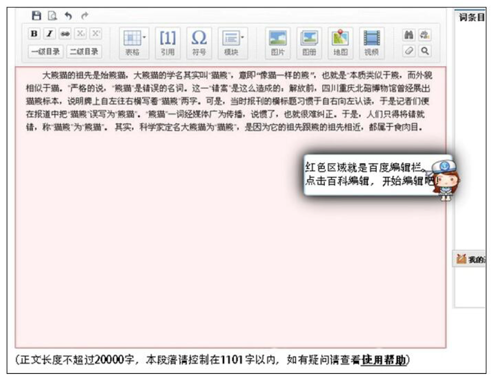
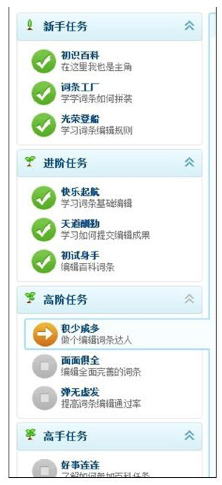

# 第4章 运营的一些宏观规律和逻辑

## 4.4 如何搭建一款成熟产品的运营体系？

这一节，我们来聊聊如何基于产品逻辑来搭建一个靠谱、稳定的运营体系。

我们说过了，运营工作有两个导向，一是拉新，二是用户维系。

理论上讲，一款产品在其诞生之初的最早一个阶段，是需要进行大量探索的，这时候的运营工作可能会没那么有序，分工也没那么明确，更多的是杂乱和见机行事。

但渡过了最初没那么有序的探索阶段后，你需要关注和完成的运营工作就会开始越来越多起来。这时候，你往往就慢慢需要把自己的运营工作变得更加有序、有条理。包括，拉新和用户维系上到底该怎么做，都需要界定得更加精细。

这个时候，你就开始需要一个「运营体系」，把你和你的团队需要在运营端做的事情梳理得更加清晰明确，以此来确保你的产品可以健康地发展。尤其是你的产品已经有了大几十万甚至上百万以上量级的用户以后。

类比一下，运营体系和产品发展间的关系，就好比前者是在打地基，后者则是往上盖高楼，地基打得有多扎实决定了往上这房子能盖多高。

而对于一款互联网产品，其运营体系的搭建可能会围绕着如下几个维度来进行思考，并完成具体运营工作的规划：

1. 需要有一些基础动作可以保证产品主要业务的顺畅运转；

2. 在 1 的基础上，重点关注开源、节流，围绕着开源和节流要形成一些固定动作；

3. 界定清楚产品内部是否存在某些关键性的用户行为，通过梳理用户引导流程、运营机制等确保这一用户行为的发生几率；

4. 核心用户的界定和维系机制建立；

5. 阶段性通过活动、事件、营销等手段扩大产品知名度、实现用户增长。

是不是感觉有点听不懂？莫急，我们来一个个讲。

### （一）保证基础业务的顺畅运转

任何一款产品，其核心业务逻辑和流程一定是特定的，而在其核心业务流程中的某些环节，往往是需要运营介入才能保证产品运转的。比如说，某门户网站，若无编辑每天更新维护，则它将成为一个「死」的网站。

所以在运营端而言，排在第一位的工作，就是要通过一系列运营工作保证该产品可以顺畅地运行起来，变成一款「活」的产品。

为了找出这部分工作内容都有哪些，你需要：

1. 梳理出一款产品的主业务流程；

2. 结合该流程进行思考——为了保证该核心业务流程能够运转起来（即起码用户过来可以顺畅体验完你的服务全过程），需要运营端至少完成哪些工作？

举例，下图是我们梳理出来的「懂球帝」APP的产品主业务流程图。

基于上图所示的业务流程，如果要确保「懂球帝」APP 的顺畅运转，需要运营端做好的主要基础工作可能包括：

1. 保质保量地按时上传发布各类内容资讯、更新各类数据、榜单等；

2. 做好用户 UGC 内容的审核、筛选、组织和处理；

3. 按时发布各类足球装备并做好营销、客服等方面的相关工作，确保用户可以在线顺畅完成购买。

而这些基础工作可能还需要考虑一下用户的使用习惯和期望。比如说，对于新闻、资讯类的内容，用户可能会每天都看，且总是希望可以看到最新的内容，那你的相应发布更新频次就需要尽可能高一些，更新时间更紧凑一些。

基本上，这一部分的工作内容是属于那种「有了它你不一定会变得更牛，但如果连它都没有，那你一定会死」性质的。

### （二）尽量把产品的「开源」和「节流」变成一些固定动作

一款渡过了探索期的产品，在保障好上面所说第一点的基础上，总是需要考虑要搭建起来我们稳定的用户增长来源和可控的用户留存策略的。

一旦这两根支柱可以相对稳固下来，可以保证你站内的有效用户和有价值的用户一定会变得越来越多。

关于用户增长，很多人脑子里都会第一时间冒出来「狠狠砸钱做广告买用户」或者是「策划个超级牛的活动来带动用户暴增」之类的，但要知道，钱不是时时都可以砸的，超级牛的活动点子往往也是可遇而不可求的，所以相对于寄希望于这种「一波流」式的手段保证你的用户增长，不如先好好考虑如何能构建起来一些稳定的用户增长路径。

举例，如懂球帝这样的APP，在没有额外重大事件发生的前提下，其稳定的用户增长可能来源于：

1. 其优质内容的用户自发对外分享、传播所带来；

2. 其优质内容的有意识对外传播所带来。例如，专门有两个小编把懂球帝发布的某些深度技术文或懂球帝社区内的趣事定期发布到其他相关论坛、社区等；

3. 搜索引擎、应用商店等入口带来的自然增长；

4. 保证每次发生足球类新闻（如各种重大赛事，这类事情在足球世界里是「常规性」的），懂球帝的报道速度和解读角度总是可以做到与其他人不同，从而每次都能带来一波稳定增长；

因而，为了让懂球帝的「开源」变得相对稳定和持续，我们应该先围绕着以上几点确保一些常规性运营工作的执行。比如：

1. 结合用户场景，设计合理的分享流程，尽一切可能优化你的文案；

2. 可能需要专门有一个人负责优质内容的外推，包括寻找优质渠道、建立合作关系、常规性的内容外发和外部渠道维护等；

3. 专门花工夫做好 SEO、应用商店 ASO 等工作，并在此后不断优化；

4. 组建专门的新闻资讯更新报道团队，建立报道机制。定期策划深度解读类内容，确保资讯报道速度和解读角度的独特性。

以上，是关于「开源」。

而除了开源之外，同样需要思考的，则是「节流」。

所谓「节流」，就是尽量降低用户流失的可能性，确保尽可能多的用户都能够体验到你产品的核心功能，并愿意留下来。这里可能涉及要做的事如下。

1、梳理出流失行为比较高发的节点。

比如说，你发现 30% 的用户可能都是注册过后基本就再也没有访问过了，发现 20% 左右的用户大约在第一次使用过后半年前后的时间内出现流失，以及发现又有15%左右的用户都是在使用过某功能后就再也没有访问过你的产品了，则「注册过后」、「注册后半年前后」以及「使用某个功能过后」都是你的流失高发节点。

围绕着找到的相应的流失节点，你可能需要先把所有流失用户的数据拉出来，再从他们身上去寻找一些共性行为特征，这里可能需要用到一些数据分析方法和思路，有兴趣的话可参考一下此前的运营与数据的相关内容。

2、结合用户访谈、用户行为数据分析等各种手段定义出用户流失的原因。

比如，注册后即流失很可能是因为用户没看懂产品是干吗的，也没有引导，不知道怎么用。

3、针对每个节点下用户流失的原因，定义出一系列手段用于降低流失的可能性，包括但不限于特殊福利折扣，优化流程、引导文案、设置用户流失预警机制，等等。

例如，滴滴出行在其 2014 年下半年疯狂增长的时候，我印象中就有采用过新用户首次打车免单的手段来降低注册过后的用户流失。

再例如，如果你发现 80% 以上的已流失用户在流失前都会发生某种特定行为（如访问频次从每 2 天一次下降到每周一次），那么你就可以设立相应的流失预警机制了，让系统在有人出现类似情况时提醒你，又或者是依靠机制给予该用户特别关照（例如此时推送两个萌妹纸或帅欧巴让其认识之类的），以此降低用户流失的可能性。

以上，是关于一款产品的「开源」和「节流」方面，如何通过一些可以固定下来的手段和机制确保其稳定性的思考思路。

需要明确的是，上述这部分工作，只要渡过了探索期，方向相对明确且已有一定用户体量的产品才需要思考。

如果你还处于探索期，一切都不确定，方向随时可能改变，唯有尽快完成产品的探索和种子用户的积累才是正道，反而没什么必要去思考这种一板一眼的事。

### （三）确保「最关键用户行为」的发生几率

任何一款产品，往往都存在一个「最为关键的用户行为」，它往往是围绕着产品的核心功能和服务的，这个行为的发生频率可能直接决定了你的产品价值，也可能直接决定了用户对你的认可程度。甚至是，一个新用户，只有发生了这一行为，才更有可能深度体验到你的产品价值。

比如说，滴滴出行的「关键用户行为」就是打车；百度外卖的关键用户行为是下单订外卖；新浪微博的关键用户行为是关注他人（因为不先关注点人，就意味着你在微博上啥也看不到）和发微博；等等。

一旦界定出来了这样的关键行为，你必须通过梳理用户引导流程、梳理运营机制、新手任务等各种手段确保这一行为的发生几率。

当然，可能在产品的不同阶段，你需要去引导用户发生和学会的行为是不一样的，例如知乎，早期一定需要先尽量引导用户去关注其他优质回答者（只有这样你才能在自己的首页中看到高质量内容）和去进行回答，而后期站内内容充足后，则可能引导用户更好地去消费内容。

下图是知乎在 2016 年年初上线的某版本附带的用户引导，可以参考。

再例如，百度百科曾经有一段时间的新手任务和新手成长体系大体是这样的。

### （四）核心用户的界定和维系机制的建立

就像我们提到的，对于大部分产品，一定都存在着「20% 的用户创造了 80% 价值」的情况。

所以，如果需要确保你的产品可以持续良性运转，一定还存在必不可少的一环，就是找到你的核心用户，并维系好他们。

这里可能又包含两个分支：

1. 满足了什么条件的用户就可以被界定为核心用户？

2. 我们如何对一个核心用户进行更好的维系？

以知乎为例，假定关注粉丝数超过 2000，在 3 个月内回答问题数量超过 20 个，且其中超过 500 个赞以上的回答不少于 3 个，即可被界定为核心用户，那首先你需要先设定一个机制，让但凡站内出现这样的人，你就必须第一时间知晓，并与之取得联系。

然后，假如知乎对于核心用户的维系包括了如下几点：

1.  拉入「知乎大V」群，帮助结识更多知乎名人；

2. 定期邮寄各类大小礼品；

3. 邀请参加各类知乎官方线下活动，与知乎团队深度交流；

4. 获得各类知乎新产品的优先体验资格（如值乎、专栏等）；

5. 优先获得协助出书、专栏建设辅导等服务；

6. 邀请参与知乎社区建设讨论；

7. 获得知乎官方的站内内容优先推荐权。

那么，你需要做的就是确保这些事情当中的每一件都可以顺畅发生，并与之保持密切互动和交流。

### （五）阶段性通过活动、事件、营销等实现用户增长

如果说，上面提到的「开源」部分的思考是属于确保产品稳定的自增长能力，那么对于一款已经渡过了探索期的产品而言，你也一定还需要一些手段，来为你阶段性地提升产品的知名度，批量获取到新用户。

这一部分常见的运营手段可能包括活动、推广投放和事件策划等（尤其是与自己产品特征和目标用户相契合的事件节点，一定要好好抓住）。

前面已经讲过的懂球帝教科书般的案例就是一个很典型的例子，这部分就不展开细讲了。

## 4.5 理解社区/社群的典型运营路径和逻辑

这一节，我们准备把社区/社群类产品的运营单独拿出来聊聊。

之所以要把社区和社群的运营单独拿出来说，是因为在所有的运营分支中，社区或社群的运营会是比较独特的，它们的运营都需要同时考虑「关系」和「内容」，其生长和壮大也存在一套自己较为独特的逻辑。

由于在线上用来承载社区或社群的产品形态要么就是论坛/问答式的社区产品，要么就是如微信、QQ 等通信应用中的群组，为了便于理解，我会以假想自己创建一个简单的社区或群组为例来进行说明。

一个社区/社群从无到有到成熟起来，我认为其成长路径里有这么几个关键节点：1）创建和初始化；2）信任感与价值确立；3）去中心化，社区成员之间关系网的构建；4）社区的「自生长」。

下面容我依照如上的4个关键节点，分开逐一来讲。

第一，创建和初始化。

对于一个社区/社群的初始化而言，最为重要的事，就是找到一个主题。对于一个社区或社群而言，它一定是基于某个特定主题而存在的，而成员间的交流和互动往往也会围绕着这个主题而展开。

对于社区/社群而言，一个好的主题要么可以带来某种特别的感觉（比如有趣和共鸣），要么可以带来明确的价值认知，即让用户知道他在这里可以得到什么和应该怎么参与。

我们以创建一个群组为例，体会一下你看到一个叫作「勒布朗詹姆斯」的群和一个叫作「每天一张LBJ高清酷图」的群时的区别。再体会一下一个叫作「新浪员工交流」的群和一个叫作「一入新浪深似海，从此节操是路人」的群的区别。

另一点需要强调的是，任何一个好的社区，一定都有某种普世的价值观，这种价值观普遍是利他性且能得到广泛认同的，最终会体现在一些规则上。例如，很多活跃数十年而不衰的网站论坛，都会通过规则要求用户们认真回帖感谢他人。在初始阶段，社区的创建者和管理员们必须要以身作则地去普及和传递这样的价值观。

初始用户的获取常见的是拉身边的熟人，或者基于社区的定位做一些较精准渠道上的推广宣传，这一部分就不展开太多了。

第二，信任感与价值确立。

这是几乎所有社区/社群运营者都需要去突破的一环。

在最初加入一个群组时，除非群主自身有极大影响力（如某些大V名人），否则，几乎所有用户在加入伊始的心态都会是「先看看这里有什么再说」，能否打破这种观望心态，在社区与用户间建立起信任感，让用户对社区产生明确价值诉求和依赖，决定了这个社区能否走向活跃。

信任感通常产生于社区提供了超出用户期待的服务和回报之时，例如某明星的粉丝们本来只是想加入一个粉丝社区进来看看，结果真的见到了明星本人过来跟他们互动；例如加入某个运营学习群的朋友们本来只是想看看，结果发现群主每天在群里发的各种干货真的让他们很受用，甚至有一天真的自己通过应用群主分享的干货完成了某个超牛的小项目；再例如加入了一个行业交流群本来只是不明觉历，结果发现这个群里真的每天都有很多牛人大神在群内各种喷，让自己眼花缭乱，大开眼界。

直白点讲，这一过程就是从「不确定在这里可以得到什么」到明确知道「这里可以给我提供什么价值」的过程。这一步产生后，那些原本只是观望的用户会开始愿意在社区内去更多产生行为，例如发言提问和吐槽。

当然，任何事情都有正反两面，有了信任感和价值后，用户也会开始对社区有期望，正所谓「爱之深、恨之切」，假设他们的期望持续得不到满足，这些用户们是可能会愤怒甚至倒戈的。

第三，社区的去中心化。

截止到第二步为止，这个社区/社群的人际关系网络都仍应该是一个高度以社区创办者、管理员或明星用户为中心的状态，它意味着较大的风险——社区的存活与发展，将取决于少数的几个人。一旦这几个人不堪重负又或者是明星用户离开，社区很可能将毁于一旦，事实上，这样的场景在很多社区的发展史上曾反复出现过。

要解此结，需要去中心化，把一个高度中心化的网络变成一个几乎无中心化的网络。

二者的区别，我通过以下两张图来说明。

在以上两图中可以一目了然地看到，图 a 中的网络完全依赖于节点 A，如果节点 A 消失或崩溃，整个网络将会完全消失。而在图 b 中，A 即便仍然是一个重要的中心节点，但由其他节点之间的联系已被充分建立起来，即便把 A 从网络中拿走，整个网络也仍然可以保持较高的紧密度，继续存在下去。甚至是，即便出现多个节点崩溃，这个网络也仍然还可以存在。

基本上，这也就是社区到了这个时候要进行「去中心化」的原因所在。

去中心化的常见套路又有两种。

一是培养和发掘追随者。假设你的社区是拥有一个能够被大家所认可的普世价值观的，并且已经与用户群体间建立起信任感，通常这个时期会逐渐冒出来一些认可你价值观和理念的积极分子，他们对于社区存有较强的热情和投入感。你需要去观察、鼓励和发掘他们来帮你在社区中去做很多事，甚至，过往本来是创建者们扮演的一些重要角色（如精神领袖、话题发起者等），需要大胆地由这些追随者们来完成替代，当原本的一个中心变成了多个中心时，社区的生命力和可持续性都会同时得到加强。

二则是通过引导，帮助社区内的用户间建立起关系。社区的本质是由众多个体构成的一个信息关系网络，而 QQ 群、豆瓣小组、论坛等都只是这个网络的载体而已，就像上面的图 a 和图 b 所展示的，只有组织中的众多个体彼此间产生连接时，一个社区才能真正成型。如果你去观察，你会发现所有活跃的 QQ 群或微信群里，用户间的关系都会是很多元化的，并且，这种关系会随着时间的推移沉淀到具体的产品形态中。

促成用户建立关系的方式，大面上主要有依靠讨论互动和依靠共同行为两种，此处也不再展开做过多叙述。

第四，社区的「自生长」。

当社区中的多元化关系链被建立起来后，一个社区就具备了「自生长」的能力，这个时候你会发现自己对社区已无法完全掌控，会有很多事件、话题和关系在社区内自然发生，这也是作为社区运营人员最希望看到社区内出现和发生的状态。

到了这个阶段，运营人员最应该做的，就是基于社区的共同价值观为社区的行为言论划出一条边界，又或者制定出某些游戏规则，在规则内，大家可以完全自由地讨论和互动，但一旦触碰到规则，则应该坚决封杀。

进入这个阶段的社区，基本已进入成熟状态，此后，考验运营的，一是可以将社区的成熟和活跃状态维持多久，这里需要考虑的基本是：

1. 当大量 UGC 产生后，如何筛选出优质的内容进行二次传播和更精准的推送；

2. 如何梳理出一套基于 UGC 的内容框架和体系，帮助和引导那些零散产生的 UGC 内容可以更整体、更结构化、也更具有黏性一些；

3. 如何做好一些社区内的活动运营，甚至把一些活动变得常规化、事件化。

另外，另一方面要考验运营的，就是如何拓展社区可以承载的话题，通过话题的延展来扩大自己的潜在用户数量。在这方面，知乎的发展是一个典型，最早只聚焦于互联网创业话题的知乎，现在已经接近五花八门、无所不包。

相比起前三个阶段而言，社区成长的这最后一个阶段对于运营人员而言相对会好一些，因为可玩的更多，也不像前三个阶段那样需要背负那种「不成功就要成仁」的压力。

但需要正视的现实是，所有社区和产品一定都有自己的生命周期，这是不可改变的。人们使用社区的需求永远存在，但对于某种产品形态的热情却可能会是周期性的，并且也会随着互联网的发展产生很多新的使用习惯（如Web 2.0 时代诞生了社会化问答网站），所以我们会反复看到很多不同类型的社区型产品在不断出现，甚至，这种产品形态上的迭代还可能会是循环的。

到此为止，我在第四章想要分享的全部内容也就告一段落了，这一章的内容深度和厚度应该都比其他几章更强一些，所以阅读起来，不妨多一些思考和沉淀，尤其可以结合你自己的产品再多有一些思考，可能效果更佳。
