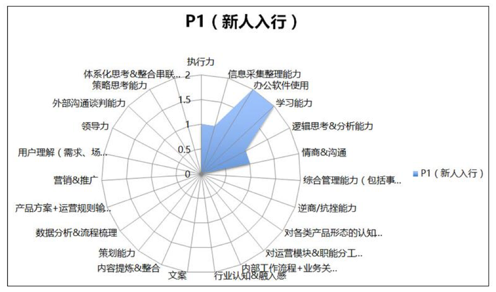
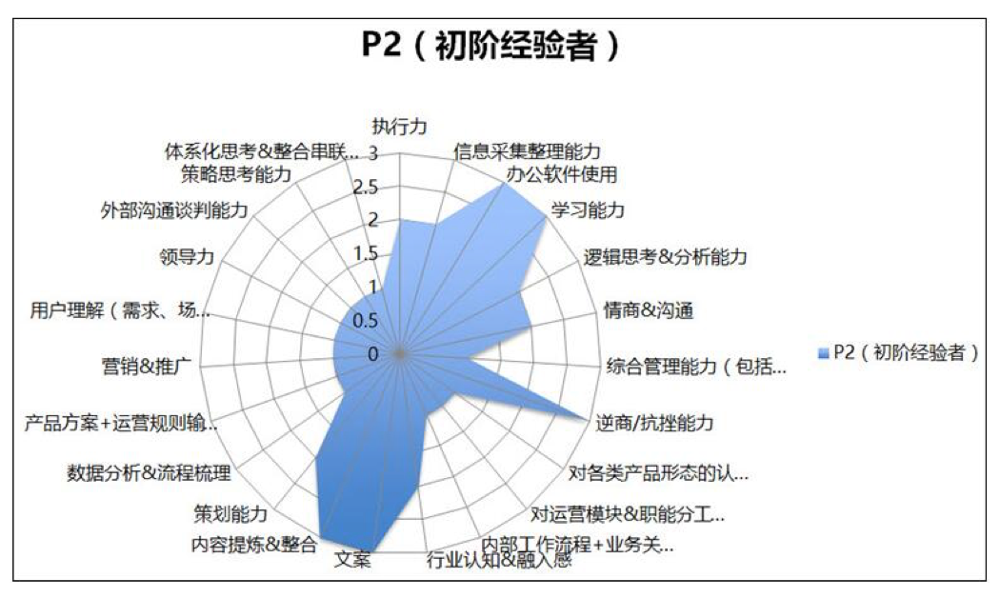
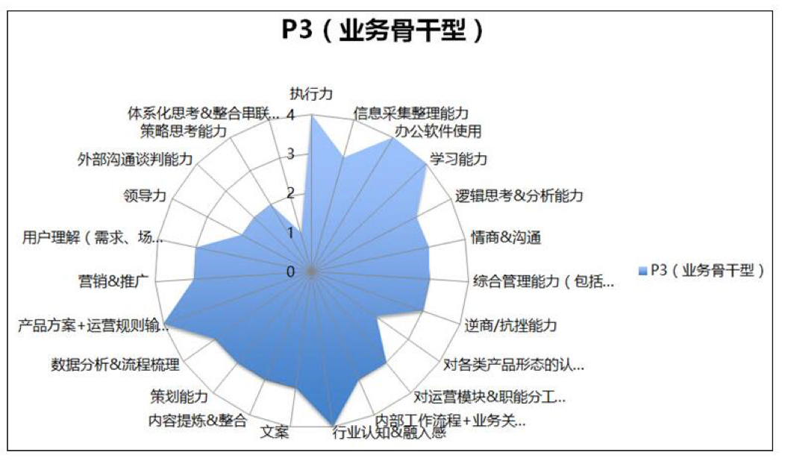
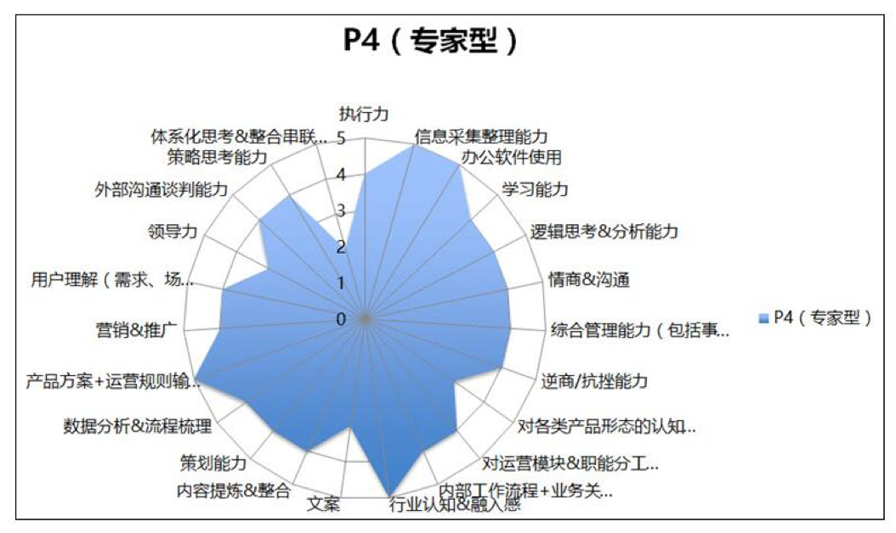
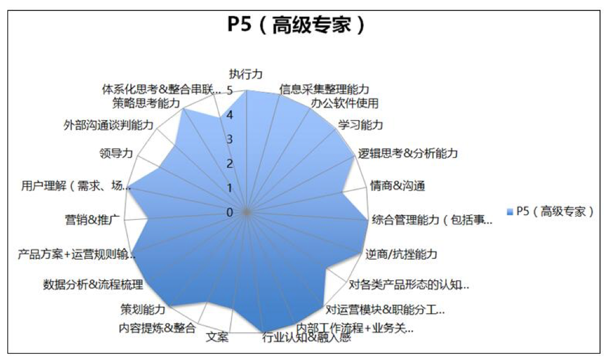

# 第5章 一个运营的职业发展与成长

如果你想要转行或入行成为一名运营，你至少需要拥有一项可以带来具体产出的技能——无论是活动执行、文案撰写还是「搞定人」。如果你还只是一名新人，几乎没有人会因为你说你多么热爱互联网，或者是对于「用户运营」、「内容运营」等你自己其实都还一知半解的概念夸夸其谈就会要你。

一个人的进步和提升往往是受到环境牵引的，你在合适的时候被放到一个合适的环境或事件中去，自然会获得巨大的提升和进步。

如果你已经成为了一个中等以上段位的选手，请一定尽可能让你自己成为一个圈子里的价值传递者或贡献者，而不是单一的观望者又或是价值消耗者。

一个互联网人，可能存在着两条需要提升的能力曲线。在第一条曲线上，你的个体提升只是「点」或「线」的提升，而当你进入第二条曲线的区域时，你的提升，必须要转为「面」的提升。

## 5.1 顶尖运营和普通初级运营的区别到底在哪里？

在整个互联网行业，「运营」一向都很容易被视作一个没有太大前途+苦哈哈的打杂型职能岗位。作为一个做运营的，我对此深有体会。你知道，自从我先后做了周伯通招聘和三节课之后，差不多每周我都会遇到有人跑来问我这样的问题——

有璨老师，我干了两三年运营了，但现在觉得自己在做的事既没有什么技术含量也没什么前途，自身的成长也很慢，你觉得我该怎么办？运营这个岗位的出路到底又在哪里？

但，作为一个已经干了七八年运营的运营老人，我特别想站出来为「运营」讲两句——苦哈哈是真的，但要说运营是个没意思和没前途的职能岗位，我倒是难以苟同。至少，就我个人当下的切身体会而言，运营是一件入门容易但事实上深不见底、需要做很多打杂体力活但实际上极度有趣也极有技术含量的事儿。

至少，这么多年下来，我自己还挺喜欢运营的，也真心觉得运营是个特别有意思的事儿。

所以，这里，我想试图尽量用通俗易懂一点的语言来描述一下运营的「深不见底」、「有趣」和「技术含量」究竟在哪里，以及一个牛哄哄的顶尖运营和一个整天觉得自己的工作枯燥无趣的普通运营之间的区别可能会在什么地方。

要谈论清楚运营的有趣和深不见底，我们必须再一次回到那个老生常谈的问题上——

到底运营是做什么的？

关于这个问题，无数人已经给出过了无数种千奇百怪的回答，包括我自己也曾经以「运营核心要做好的事就是拉新、留存和促活」来给出过答案，但这个答案太过于简单和一维，或许远不足以呈现运营的复杂性。所以这一次，我想换一种方式来进行解读，以更好地铺垫出「顶尖运营和普通运营之间的区别」这个问题的答案。

我想给出的回答是这样的——

在第一章中，我们已经提到了，任何一项业务，都有其必备的三要素——用户、产品和运营。而运营，则是为了帮助产品和用户之间建立和维护好关系，你可能会使用的的一切相关手段和方法，其最终目的是使产品价值和用户价值可以相对最大化。这其中，产品价值和用户价值的体现主要会外化在用户数量、用户活跃度、用户使用时长和商业收入等指标上。

所以，围绕着怎样才可以把「帮助产品和用户间建立和维护好关系」这一件事做得更好，运营需要具备的能力和需要搞清楚的问题很可能包括如下这些：

- 对于各种常规运营手段的认知、熟悉和运用（如文案、内容运营、创意策划、活动、渠道推广）。运营最常需要做的，就是通过以上这些手段中的一种或多种去直接拉升某个具体指标；

- 对于各种非常规运营手段的认知、熟悉和运用（如传播、品宣、PR 公关战），之所以是「非常规」，是因为这些手段对于数据指标和产品价值的拉动往往是间接的，中间有更多复杂的变量和逻辑需要去判断和评估；

- 对于各种不同产品形态以及它们所对应更适合的运营侧重点要有所认知；

- 对于「连接产品和用户」这件事的整体节奏感的感觉和把握（如何时该快，何时该慢，如何衔接）；

- 构建生态的能力。高阶运营一定要干的事之一，就是通过把产品、用户以及具体运营手段之间一些原本看似不相关的零散细碎的节点串联起来，最终围绕着产品价值和用户价值的提升建立起一个可良性循环的生态闭环。

- 建立起运营方对于用户群体的相对影响力和控制力。

而，普通运营和好运营之间的差距，往往也就出现在以上这几点上。我们可以逐个来简单聊聊。

其一，一个顶尖的运营一定是有能力至少通过对于内容的运营（对于内容的选题、策划、聚合和创造等）、创意策划、活动、渠道推广等手段中的一种或多种来获得具体产出的（如显著拉升了某个具体指标），他们知道满足了一些什么条件会更容易受到用户喜欢，也知道主要抓住哪些点能迅速调动起用户的参与意愿和积极性。相反，一个很普通很一般的运营则无法为结果负责，也不知道如何才能更好地调动起用户的参与意愿和积极性，他们往往只能在其中做一些偏纯粹执行的体力活。

其二，一个顶尖的运营对于公关、PR、传播等相对务虚的东西一定是有所理解并具备一定运用能力的，他可以在传播和 PR 上没那么专业，但一定要知道传播、品宣这样的手段大体该如何操作，及其背后的一些用户认知逻辑。这里往往有几个逐次深入的问题需要去考虑清楚——一次传播如何才能做成功做火起来？在火的基础上，怎样才能让一次成功的传播跟你的产品价值和运营之间发生直接的关联，而不是虽然很火，但火完以后什么也没留下？以及最后如果上述两个问题都解决好了，运营端该做些什么来与你这个成功的传播形成配合和联动？

在我看来，一个有高度牛运营对于上述这些问题应该是有认知和操作推动能力的，但一个很普通很一般的运营则会对上面这些问题完全没什么概念。

其三，产品有各种不同的形态，而每一种形态的产品，其运营逻辑和侧重点很可能会是有着巨大差异的。好比工具型产品、媒体型产品和社区社交类产品，其初始阶段的运营方法和运营侧重点很可能会是截然不同的。

作为一个好的牛运营，对于这个问题也应该心中有数，对于各类不同产品的运营侧重点也应该具有更为深入的认知。相反，一个很普通的运营可能对于这个问题会知之甚少，很容易拿着一个自己认为是比较有效的运营手段就要往产品上去生套。

其四，关于节奏感。做任何事情都是需要有节奏的，经营企业和做产品是这样，做运营也是如此。运营服务于产品和用户，而一个产品的用户增长，背后是有一套相对的逻辑和客观规律的。一个顶尖运营应该能够对这样的问题有深刻的理解和认知，反推到自己的产品上时，他应该知道何时该快，何时该慢，什么阶段要主抓什么数据获得什么产出才更合理、更有价值。

而一个比较普通的段位不够的运营，则对于这些东西很模糊，他们的脑海里往往会有类似的简单和一维的认知——「用户数量这种东西，一定是越多越好」。事实上，如果失去了节奏感，无视各种内外部条件因素而一味只寻求用户数量的增加，很可能会是灾难。

其五，就像之前说的，运营往往是由一些零散和支离破碎的事情和节点来构成的。作为一个有大局观的高级运营，应该有能力去梳理出一个框架或体系，把所有这些支离破碎的点逐渐串联起来，最后让这些节点聚合在一起，形成一个可良性循环的生态。好比你觉得要做好一个产品的运营，似乎建几个用户群，做一些精彩的专题，以及定期搞一搞活动给大家派发一些福利，又或者是做点传播和事件营销等都是看似可以去做的事，但最终，很可能如何让这些看起来孤立的各个事件能够产生关联，形成一个整体的联动才是关键，一个优秀的运营，是要能够做好这一点的。

而视野不够的普通初阶运营，则只会专注在某一个零散细碎的点上去孤立地做事和开展工作。

其六，在带动用户与产品之间形成紧密的关联之后，作为一个好的运营，你还要能够建立和保持好你作为官方对于用户群体的影响力和控制力。假如这一点没有做好，你往往可能会渐渐被用户无视，变得很没有存在感且可替代性极强，甚至到了极端时，用户们可能会把你一脚踢开，选择自己去玩。

而为了建立和维持好对用户的影响力和控制力，你往往需要多管齐下，例如，在确保产品价值足以吸引住用户的前提下，你可能需要在价值观层面上让用户建立起高度认同感，也需要与用户间能建立起深厚和多元化的情感联系，甚至还可能需要在用户之间构建起一套可持续生效+可调控的利益分配机制。

优秀的运营能够意识到这一点并试着把它做好，而普通的运营则往往不会有意识地去关注它。

说到这里，你可能会发现，上面提到的这六点，无论哪一点，想要搞明白和能够做精做深，都是一件有趣、复杂和很有挑战的事。如果是要把以上这些都能结合到自己身上融会贯通，则没有个十年八年基本不可能。

所以才会说，运营，是一件入门容易但事实上深不见底、需要做很多打杂体力活而又极度有趣也极有技术含量的事儿。

但，运营虽然复杂和不容易讲清楚，现在的我却认为它是有方法论的。

## 5.2 互联网运营的能力模型与成长路径

这一节，我们分两方面来聊聊一个运营的成长，一是一个运营的能力构成和能力模型，二则是一个运营从入门小白到大神，依次在每个阶段你需要去突破的一些障碍。

如前所说，和产品一样，运营也往往需要是一个杂家。相比起一维的销售和推广来说，运营要干要考虑的事往往要多多了，也复杂多了。

就我和我的朋友们的过往经验来看，一个运营新人从入门时完全搞不懂也讲不清楚什么是运营、该怎么做好运营，到差不多能够搞懂讲清楚运营，能够基本蜕变成一个骨干型的运营人才，平均需要经过 3 年左右的时间。而这中间，一个运营需要不断去提升的能力会是非常多维度的。以至于会有很多运营经常特别困惑：我到底应该去学习些什么才能提升我的段位？

为了让大家对于这个问题可以更加清晰，我会试着给出一个运营从业者的能力构成。

在我的理解里，一个运营的能力构成，满打满算，可能包括了如下图所示这些分支。

而理想情况下，一个运营的成长路径，可能会有如下几个阶段。

P1：纯新人，刚刚入门，小白或半小白状态。

P2：有经验的入门型/成长型从业者，通常 1～3 年经验，已掌握部分专业技能，但对行业、对用户、对业务的理解还比较浅。

P3：业务骨干，通常 3～5 年经验，某方面专业技能突出，对行业、用户、业务的理解逐渐深入，开始从单一的执行者更多转换到策略&计划制定者。

P4：专家，通常 5 年以上经验，可能需要有一定天赋（如情商、逻辑、领导力等）才能到达这一层级，对于产品、业务、用户、行业等的理解都已经比较深入，善于制定策略和推动执行。

P5：高级专家，通常 5～8 年以上经验，综合能力出众。同时，会特别擅长连点成线，把各种细碎的运营事务串联为一个整体。

接下来，我们逐个来看这条路径中不同阶段时一个运营人员的典型能力模型（以最低标准来看），以及每个阶段可能会遇到的主要障碍。

### P1：新人小白

进入本阶段的标志：入行。

进入本阶段的主要障碍：学习能力，执行力，逻辑分析能力。

对新事物不敏感，不具备快速学习能力的人；执行力和行动力差的人；逻辑分析能力很差的人，这三类人哪怕入行，也很难做得好运营。

如何提升：

1. 多学习接触新鲜事物，如试着用 1～2 周时间去学习一门自己之前从来没有概念的知识并试着加以应用；

2. 多发问多思考，多试着自己想清楚这样的一些逻辑题：今年中秋，我预计某学校周边的月饼销量如何？为什么？

3. 通过一切方法磨炼自己的行动力和执行力，如给自己制定某个中短期目标（如看 10 本书，或认识 10 位 BAT 的牛人），然后通过目标拆解和想尽一切办法达成。

### P2：入门型/成长型运营

进入本阶段的标志：

对于某项需要专业技能完成的工作（例如文案，当然未必一定是文案）已经可以具备能力独立完成，对行业、业务、用户从完全无概念，到已经可以有点感觉，信息采集和分析能力有显著提升。

进入本阶段的主要障碍：逆商，对业务、用户等的理解，对于某项专业技能的熟练掌握，对专业知识的积累。

如何提升：

1. 多受虐，还要在反复受虐后试着保持积极乐观（听起来好变态，但的确需要如此）。运营一定需要强大的逆商，尤其很多方案和测试，往往都是九败一胜的。

2. 多接触用户，通过观察、分析数据和用户访谈等方式深入分析和了解用户。

3. 积累专业知识，磨炼专业技能，该学习学习，该实践实践，该总结总结，该拜师拜师，该报班学习报班学习。（硬广乱入：三节课欢迎你）

### P3：骨干型运营

进入本阶段的标志：

对业务对产品开始有更深理解，可以顺畅与其他业务部门及产品对话无障碍，开始可以有效思考一些策略层面的事情。至少对于某项专业技能已经可以专精，同时执行力强大，可以在某一领域内带来别人无法做到的产出。开始有能力对关键数据指标负责，开始可以带领团队完成产出。

进入本阶段的主要障碍：对「用户」群体的控制力和影响力，领导力，策略思考能力，某项硬技能上的出类拔萃，管理能力。

如何提升：

1. 不要局限于自己的工作，多体验多分析相似的甚至不同类型的产品，多接触不同类型的用户，尤其是很多小众的奇葩的用户，会让你对于用户有更深的理解；

2. 学会更多站在业务层面甚至行业层面去思考去分析判断，试着想清楚一个行业的逻辑、同一行业下不同业务的切入点有何差异，是什么带来了这种差异，在这个过程中培养策略意识；

3. 找到自己的特长点，聚焦去积累，直到你可以因为某一点或某些事而被大家刮目相看——比如说，你写出来的文案，转化率就是要比别人写的高3-5倍，或者同样做推广，你可以轻松搞定80%以上的同类型渠道。

### P4：专家型运营

进入本阶段的标志：对于不同类型的用户和不同类型的产品理解越来越深。高度对数据负责，开始能够把更多精力放在策略制定、业务流程优化管理和业务串联整合上，而不是单纯的执行上。

进入本阶段的主要障碍：体系化思考&串联能力，能否形成一套自己的方法论，管理能力，领导力。

如何提升：

1. 多与行业牛人高手交流，学习先进的管理手段和方法；

2. 多试着分解和分析成功的业务流程和体系；

3. 试着让自己完成从「业务精英」到「领导者」的转变；

4. 要学习更多的行业知识和产品运营方法；

5. 要有一套自己的逻辑和理解，能够讲清楚产品、运营、市场、PR、研发等职能之间的关系、差异，以及该如何配合。

### P5：高级专家型运营，综合型人才

进入本阶段的标志：对于行业、产品、业务和用户都有很深的理解，有能力针对不同阶段、不同形态、不同用户类型的产品制定对应的策略，并持续跟进优化。

善于把 N 多细碎的运营工作串联在一起，形成合力。

进入本阶段的主要障碍：大局观，对于行业、业务、用户等的全局性理解，策略制定能力。

如何提升：

1. 多跟顶尖高手们交流请教；

2. 多开拓视野，学会从大格局（如资本面、技术革新、市场动态）等层面去判断和理解事物；

3. 至少参与或负责过2-3款完全不同类型的产品的成长和运营规划。

以上，就是我所理解的运营从业者在不同阶段的典型能力模型，以及成长路径。其中能力模型的部分只是依照我个人的理解给出的一个大体参考，根据每个人或每个行业的不同难免会有差异，仅供参考，也欢迎探讨。

可以看得到，在每个关键的成长阶段，作为一个运营，总会有一些「破局点」。好比对于初级入门成长型的运营选手而言，不管是文案能力的强大，还是数据分析能力的出众，都可以成为你职业发展中的一个「破局点」，让你能够脱颖而出，在运营的职业发展道路上找到一个坚实的立足点。

## 5.3 运营人的「择业」

许久以来，运营同学们的「择业」问题往往也是一个老大难，基本上去了创业公司容易被坑，去了大公司又怕变成一个纯螺丝钉，没什么存在感，一个擅长逻辑和策略的同学去干了用户互动和维系的事情，可能容易手忙脚乱，惹得用户一阵不爽，而一个天生喜欢跟用户打交道的同学要是不慎去做了 B 端用户的运营，可能又会憋屈压抑，难受得要死。

这一节，我想聊一个可能是所有人都会关注的问题——作为一个运营，在不同阶段，到底该选择什么类型的公司，负责什么类型的工作，才会更适合自己，更有助于自己的成长？

我想分别从三个方面来依次聊一聊：

- 从个人特质和工作方向来说，存在哪些具体的运营择业方向（比如偏内容的运营和偏 BD 拓展的运营其实差得还挺远的）？不同方向下的运营往往需要具备哪些能力和特质？这一部分，我希望回答一下大量同学会问到我的「运营好像方向也很多，我到底适合选择哪一个」的问题。

- 不同类型的产品，需要运营重点做好的具体工作都有哪些？这一部分，我希望回答的是「假如我具备 XX 能力，选择去什么样的公司更适合」的问题。

- 最后一部分，我想聊聊一个运营人在求职过程中，有哪些常见的坑。

OK，开聊。

### （一）我适合哪类运营岗位？

我认为，如果按照所从事负责的工作内容性质来划分，互联网行业的运营从业者基本可以被分成以下这么几类。

1、内容生产、维护型的运营

这类岗位，主要的工作内容可能是某个内容板块的维护或特定内容的生产，基本上现在大量的新媒体运营都可以归到此类中去。

这类岗位的核心能力是要对内容敏感，对于什么样的内容容易引发点击、什么样的内容容易带来传播拥有八九不离十的判断，熟悉各种内容发布&内容传播渠道，并且自己至少具备可以做出 70 分以上内容的能力。

倒推回来，如果我要招一个好的内容型运营，我觉得理想中他应该具备这样一些特征：喜欢看书，喜欢混迹各类内容社区，喜欢在各种社区上发表言论和内容，并能够通过内容引发与其他用户间的较强互动，文字功底比较扎实，喜欢各种思考琢磨，且一定要想得深，诸如人生人性这类问题最好没少琢磨过，琢磨过后还能把自己的思考清晰表达出来则最佳。

2、创意策划、创意营销型的运营

这类岗位，主要会涉及的工作内容可能是策划一些活动、事件、小游戏或 H5 的策划执行等，但策划的同时不仅要考虑需要让用户喜欢玩，往往还要能够拉动实际的运营指标增长。

这类岗位的核心能力基本就是创意策划能力，同时要懂传播，熟悉传统媒体的传播逻辑&传播路径，以及社会化媒体中的传播逻辑&传播路径，同时还要熟悉各种常见的线上线下活动形式以及载体（比如同一个活动，在PC端实现和在H5端实现，展现形式可能差很远）。

倒推回来，如果我要招一个好的创意营销型运营，我希望他能够具备如下特征：爱玩，脑洞大，对于新鲜事物敏感，熟悉各种热点事件，往往属于那种有啥新东西出现一定不会错过的人，大量混迹各种线上社区，组织张罗能力比较强，至少张罗过一两次有点意思的活动，至少有一两项发烧级、能玩出点名堂来的兴趣爱好，对于各种经典的文案、营销案例会下意识地去观察和学习分析。

3、渠道推广型的运营

这类岗位，主要涉及的工作内容就是推广，可能会花钱也可能没钱，但无论如何，最后的结果是唯一评价标准。

该类岗位的核心能力是对于各种推广渠道、推广手段的熟悉度和关系亲近程度，以及极强的执行力。

举例，同样做应用商店推广，别人手里只有 30% 的应用商店渠道，但你可以对于 80% 以上的渠道了如指掌，且你清晰地知道每个渠道下有哪些推广资源可以用，成本大概是多少，来的用户大体都是什么类型的，等等，这就是差距所在。

说到特质，一个好的渠道推广型运营往往是强结果导向型的，拥有极强的执行力，能够一个人泰然自若地应对 N 多琐碎的事情，他也应该对于各类渠道推广方式都有所了解和熟悉，即便不太了解的推广方式，也应该基本可以在 2～3 小时内完全搞清楚其逻辑。另外这类运营也往往需要擅长与人打交道，能够短时间内混入一类渠道的推广圈中，当自己缺乏资源时，能够通过主动寻找、求人介绍推荐等各种方式找到匹配的资源。

4、用户互动&维系型的运营

这类岗位，往往涉及的工作是面向某一类或某几类用户的维护。往往关注的是对应类型用户的活跃度。（我个人最早基本就是这一类型的运营。）

该类岗位的基础能力是比较优秀的沟通能力，善于在线上把事情讲清楚，能说服别人及赢得别人的信任，而核心能力则可能是一种「能够很快在线上让别人喜欢你」的能力，再外加上一些比较强的组织张罗能力。

一个优秀的用户互动&维系型的运营，往往自己泡网的时间很长，熟悉各种线上社区和最新热点事件，且在各种群组、社区、论坛中的存在感往往不弱，具备能够成为一个小圈子中心人物的特质。此外，这类运营往往不能太死板，应该是很擅长调戏与被调戏的。

5、销售型的运营

这类运营，往往涉及的工作就是某些特定用户与合作方的拓展了（典型的如各类 O2O 公司的线下商家拓展）。

因而，该岗位的核心能力可能就是销售能力。

优秀的销售型运营，毫无疑问也是强结果导向的，擅长迅速建立关系并取得信任，并熟悉各种商务合作谈判要点和流程。到了后期，这种核心能力可能还会进一步演变发展为资源整合（俗称「做局」）的能力，即是否可以通过一系列设计卷入更多的优质合作资源一起完成某个事件或项目，并最终令所有人受益。

6、强执行、项目推动型的运营

这类运营，往往涉及的工作内容可能是一些常规性、推动执行类的工作（比如站内内容的审核、打标签，站内课程文案的批量更新，某个产品模块如问答的上线推动等）。

该类运营往往涉及的工作是比较杂的，所以其核心能力很可能是执行力以及事务管理、项目管理的能力。

优秀的执行类运营一定是执行力超强、且工作非常有条理的人，他们往往有着雷厉风行的行动力，同时也往往善于使用各类表格、工具等来辅助管理自己的各项事务，你可能经常会在他们的机器上看到各种精细超牛的工作表格。

7、策略型的运营

策略型运营的主要工作往往是根据产品当前所处的阶段和面临的问题，去有针对性地制定某些策略（比如滴滴出行在某个地理区域内的派单策略），并推动落地后持续监测数据，实现用户价值最大化。

该类运营的核心能力，基本就是数据分析&挖掘能力，以及超强的逻辑思维+大局观。

优秀的策略型运营一定有着清晰、强大的逻辑，说话和表达都有十分清晰的条理，并且他们也往往对数据非常敏感，你可能经常会在他们电脑上看到各类数据分析与比对。

当然，行业里有大量的运营，往往所重点负责的工作，是以上这些分支中的多个，以我为例，我认为我现在就主要是 1、2、3、6、7 这 5 种类型的运营。

但，就像上一节里提到的一样，在职业生涯早期的时候，你更需要做的，一定是在上述这些方向分支上找准一个，先好好修炼到自己可以在该领域出类拔萃才是正道。

### （二）我适合哪类产品？

其次，我们来聊一下，不同类型的产品，需要运营重点做好的工作可能会有哪些差异。我们来一个个说。

1、工具类产品

工具类产品的运营可能更重推广渠道铺设、营销事件策划等，基本以增长和对外清晰传递产品价值为主。

例：朝夕日历的增长有很长一段时间都是靠他们那个「早期打卡」的活动拉动的；

再例：快手早期作为一款 Gif 图工具的增长，运营除了做好推广渠道的铺设以外，基本也没做什么事。

2、内容类产品

内容类产品的运营可能更重内容生态的构建、内容质量的提升和内容的持续对外传播，核心逻辑是如何让内容质量更高+如何让我的高质量内容得到更多传播，依靠内容的积累和传播形成拉新。

例：Mono、好奇心日报包括罗辑思维、一条这样的产品，从诞生到现在基本核心都只干了一件事：找到一个独特的内容调性和风格，让自己能够稳定地创造提供这样的内容，并用尽 PR、渠道分发、活动等各种各样的手段，尽一切可能让自己的内容可以被传播得满世界都是。

3、社交类产品

社交类产品的运营可能更重用户的分级运营、相应规则、玩法的制定以及营销事件策划，以玩法驱动用户参与，重点抓住核心用户形成标杆效应，然后再通过海量用户对于某些玩法的参与形成话题、事件，借此拉动产品增长。

例：微信早期的运营，其实重点就是摇一摇、漂流瓶、附近的人这么几个玩法；

再例：对陌陌、探探这样的 APP 来说，很长时间内运营的重点一定都是围绕着那些美女们来展开的，且他们也曾阶段性通过「真心话大冒险」等玩法来促进用户间的互动。

4、社区类产品

社区类产品的运营其实要求最高，需要同时关注用户分级运营、核心用户拓展&维系、社区氛围&文化的构建、社区规则的制定&事件话题等的策划等一系列各种各样的工作，做好一个社区的运营，完全是在构建一个小生态了，生态的成长前期靠种子用户和氛围，后期可能靠持续不断的话题、事件、用户关系等。

例：三节课作为一个自认为是社区基因较强的产品，在早先时通过「做任务拿邀请码」这样的形式很好地保证了第一批用户的质量和整体的站内氛围；

再例：懂球帝的社区板块，需要做好各核心版主们的维系，需要官方自己运营一个板块来作为标杆，需要定期面向全体用户策划一些活动以维系用户的积极性，需要做好社区内内容的审核、过滤和推荐，需要阶段性结合热点事件（如欧洲杯）在社区内不断营造出一些话题事件或话题人物等。

5、平台类产品

平台类产品的运营要求也不低，往往更需要关注重点用户的拓展和运营、运营策略的不断调整与落实。平台类产品的增长前期靠人肉+种子用户运营，中后期靠策略+业务匹配效率。

例：在行的运营，最早一批行家全部是自己重点拓展过来的，且通过官方帮拍照、修饰文案等各种方式完成了冷启动；

再例：滴滴出行作为一款出行平台类产品，其站内的运营策略始终是在不断调整的，先是重点亲近司机和补贴司机，然后重点补贴用户，再然后又补贴司机，到了现在，因为大量司机的加入，司机端的供给已经不那么紧张，于是滴滴现在整体的运营策略又开始转变为对司机的制约更强的方式，例如乘客投诉立即扣钱，评价低于某标准扣钱，降低补贴奖励额度，等等。

6、电商类产品

电商类产品的运营其实更加注重流量建设、老用户维系、品牌建设和营销。

例：京东、淘宝、苏宁等，无一例外，都会持续通过各种「XX节」作为一种集中营销手段来拉动自身站内的用户购买；

再例：韩都衣舍、麦包包这样的独立品牌电商，也基本无一例外，前期都会通过爆款打造+各平台流量吸入（如参加聚划算的活动）的策略来为自己的店铺带来大量流量，此后通过老用户维系慢慢建立用户忠诚度，在此过程中再不断通过 PR、产品包装、活动等各种形式强化自身的品牌形象，直到最后自己可以发展成为一家独立品牌电商。

以上讲完，也许你可以结合自己擅长的技能来评估感受一下，到底什么类型的公司更适合自己。

### （三）我要避开哪些坑？

最后，我们再来聊聊在运营人求职择业的过程中，最常见的几类大坑。

坑1：新人小白没人带

早期完全无甚积累的新人小白，如果去了一个老板完全不懂也不重视运营、甚至还没人带你的地方，可能还挺坑的。

早期还无甚积累的运营新人，最需要的东西，往往是有一块特别具体的事让自己能够积累起来某些技能，且在这个过程中特别需要某些具体的指导。而如果不幸去了一个老板完全不重视运营也不怎么懂运营的地方，很可能会变成一个纯粹打杂的体力活劳动者（当然了，小白们也需要努力为自己创造空间，具体可参考我前面的「为什么 80% 的运营注定了只能打杂」），又或者老板成天劈头盖脸就丢过来一堆不靠谱的 KPI，而你在 KPI 面前只能迷失。

基本上，这种状态要是持续上个 2～3 年，你很容易就荒废掉了。

坑2：一味追求「大公司」的光环而沦为一颗螺丝钉

第二个常见的坑，就是一个已经有了至少 2～3 年工作经验或者有某项特定技能、正在谋求高速发展的运营，去了一个条条框框一大堆，只能让你扮演一颗螺丝钉，给不了你太多发挥空间的地方。

假如你已经是一个有了一些经验、在某方面已经特别擅长的运营，这时候你需要的可能是更大的空间让你能够去负责更重要的项目，让你能够接触到更多的东西，能让你放开手脚去试错去大干一场，等等。

此时，如果一味看重所谓「大公司」的光环和背景，不幸去了 BAT，但却只能按部就班地做个螺丝钉，基本也是一个挺耽误自己时间的事。

坑3：团队不靠谱

另一种比较惨的情况，就是去了一个方向还极度不确定，你也没什么认同感，1 个月一小变、3 个月一大变的地方。

运营很害怕的另一种状况，就是产品方向一直在变，然后你就一直在做方案，再然后……就没有然后了。所以，基本上跟了一个团队或一家公司，半年内要是产品还上不了线，又或者连续更换了三四个方向发现还是没什么希望，可以考虑换地方了。

坑4：靠谱的运营无法扮演重要角色

最后一类关于求职择业常见的坑，就是一个已经至少 3～5 年工作经验的运营，期望能够持续提升自己，但却去了一个运营扮演的角色和话语权天然都不会强的地方。

如果你已经是一个至少 3～5 年工作经验、已经能够独立负责起来一趟事的运营，这时候你的职业生涯再往上走，就一定需要能够在一个团队或一家公司内部扮演更加重要的角色了，如果此时你所在的团队是一个天然运营就无法扮演更重要角色的团队，那么这个团队天然就会成为你的发展瓶颈。

所以，如果你正处在这个阶段，你可能需要思考判断一下了。基本上互联网产品可以粗暴地分成两种类型：弱运营参与型的和强运营参与型的。

前一类产品指的是产品价值的成立或放大无须依赖于运营发挥价值的，典型的如一些工具类或技术驱动类的产品（如地图导航类产品、百度、今日头条）等，这类产品的特征是，只要产品解决方案或产品机制设计得足够好，运营只需要管推广就行了，甚至有时候，推广都不一定需要管……

而后一类产品，则是其产品价值的成立或放大必须依赖于运营在其中扮演关键角色。比如说，懂球帝这样的足球资讯社区，要是没有内容运营天天做内容上专题做更新，基本废了；美团外卖这样的产品，要是没有运营把商家搞进来，把配送订餐响应等一系列流程搞顺畅起来，基本废了；探探这样的社交产品，要是最开始找不到一群漂亮妹子先进来玩起来，也基本废了。

毋庸置疑，上面两类产品，前一类产品身边，运营的戏份天然是弱的，往往只能扮演一些从属性的角色（即产品让干嘛就干嘛）；而后一类产品身边，运营的戏份和重要性则大有不同，他们往往需要深度参与到产品需求的讨论当中去，甚至是，可能会有很多产品机制，就是要为了运营来做的（比如，美团外卖这样的产品面对不同地区的商家，需要调整不同的展示推荐策略和补贴策略）。

所以，如果你已经是一个 3～5 年以上工作经验的运营，希望获得更大的发展和成长空间，我强烈建议你重点考虑去后一类公司，在那里你会有更大的机会和空间成为一名真正可以贯穿各个运营模块、既懂产品又能对运营结果负责的优秀运营。

最后的问题：创业公司 or 大公司？

最后，肯定还有人关注「到底是大公司还是创业团队」的问题，我的建议是：

- 是什么人带你，以及你是不是真心喜欢认可一件事远比去多大规模的公司重要多了；

- 大公司和创业公司能给你的东西可能稍有不同，大公司给你的可能是一些细致的工作习惯（例如会议怎么组织召开，邮件怎么写，跨部门沟通如何做，等等），更加体系化一些的思考（比如我其实就是在进了新浪知道新浪微博的运营是怎么做的之后，突然就觉得自己通透了），可以让你积累到一些资源等，而创业团队则更多能给你的就是一块开放的成长空间（就是老板可以对你不管不问，任你折腾，最后只管你要结果）；

- 相对而言，有自己一技之长，自主工作能力较强（就是指无须指导就能自己想办法产出结果）的人到创业公司成长会更快；

- 即便去了大公司，如果自己在同一个岗位上待了 2 年还是没有任何变化和大的成长，这个就该反思和总结了。

以上，讲完了，欢迎对号入座。