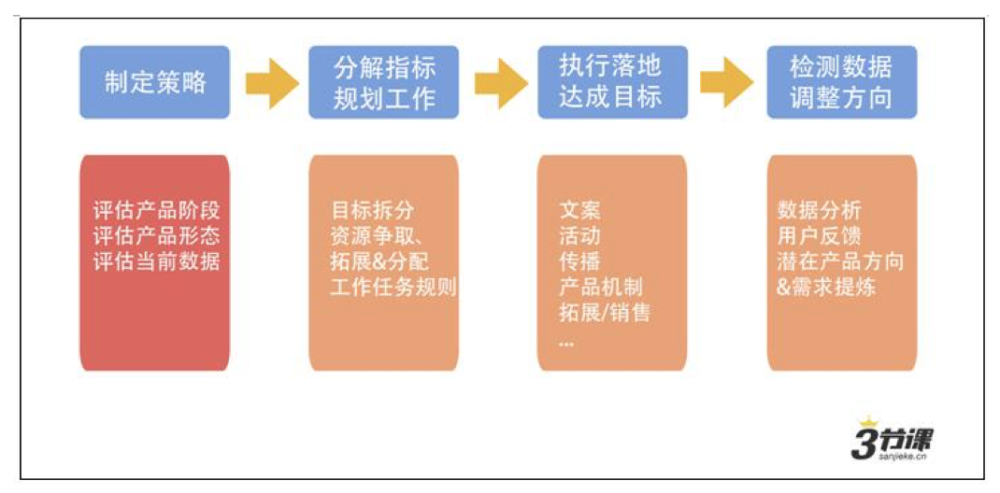
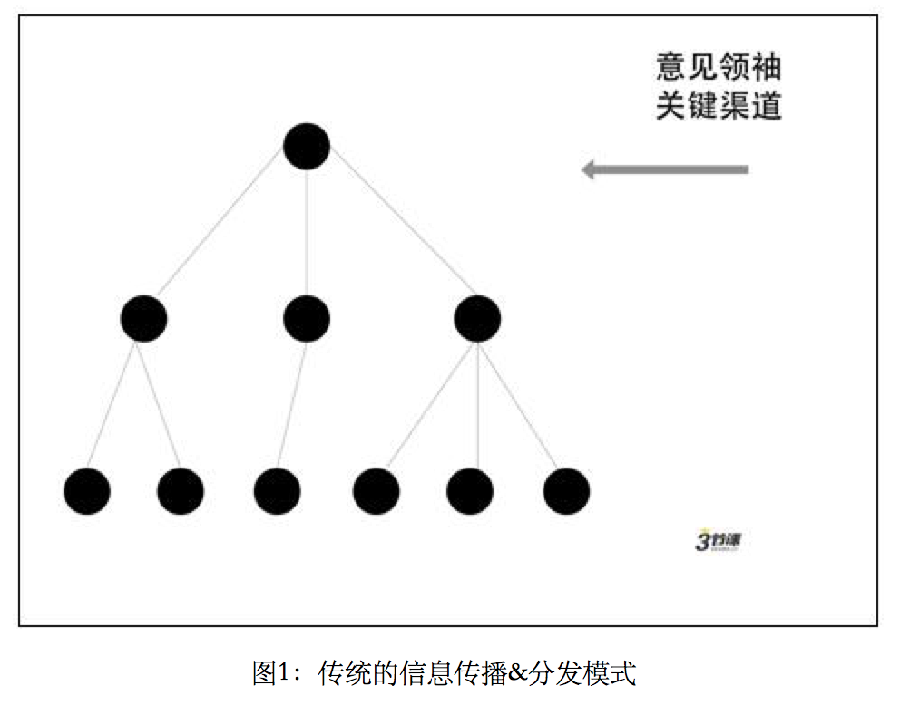
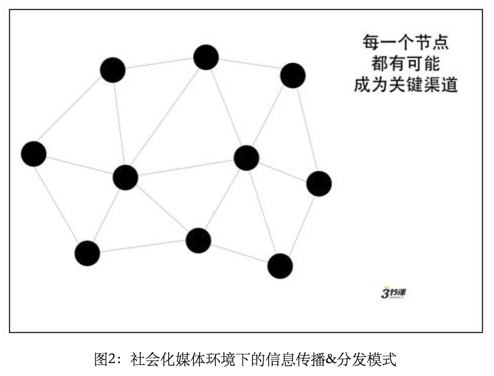
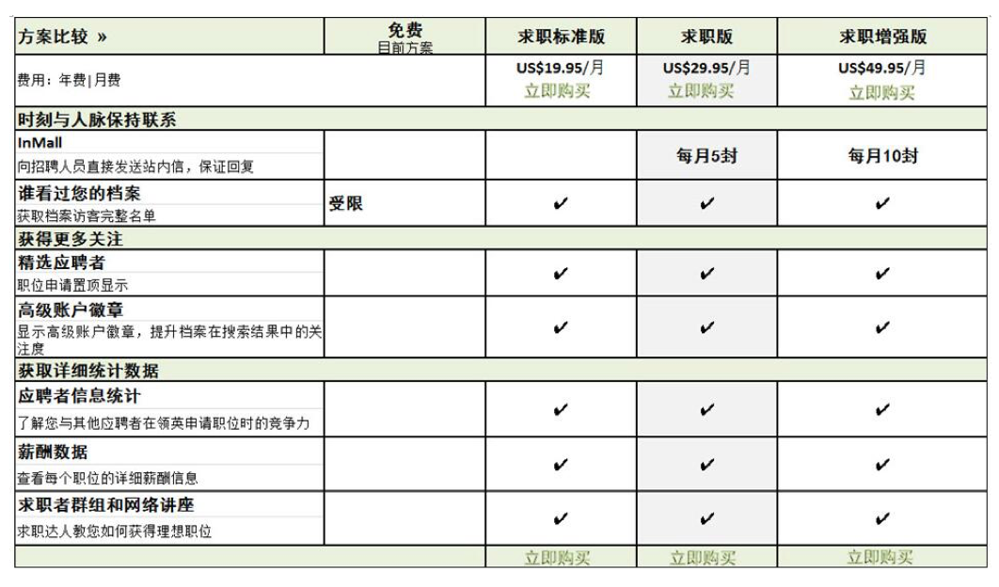
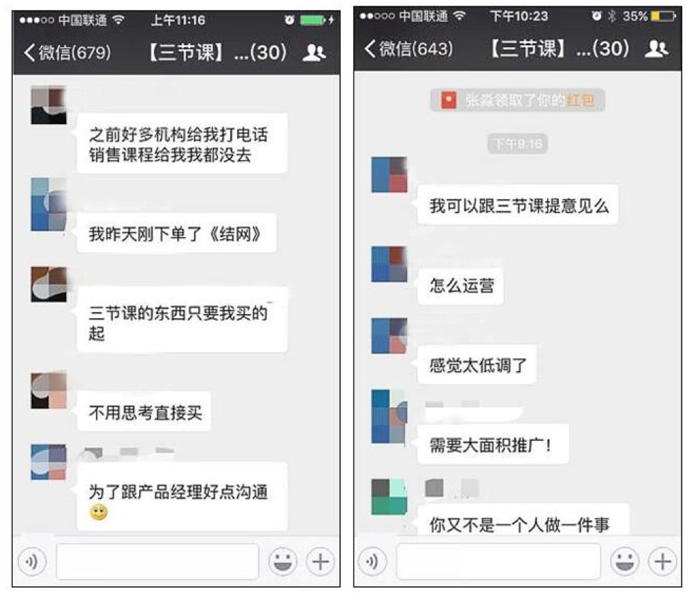

# 0601. 一个运营人的自省与思考

只有懂行业，懂业务，你才能够结合你的产品特色和优势，为你的产品制定出更有效的策略，或者更有针对性地对现有关键业务流程进行优化和调整。

事实上，运营如做人。我一直觉得，围绕着做运营也好，做产品也好，甚至是做其他的事也好，这个世界上总存在两种逻辑。前一种逻辑是「推动」，后一种则是「触动」。

运营绝对不会全是套路，在我眼中，它是一种「如何与你的用户成为彼此可信赖可依靠的朋友」的艺术。

## 6.1 未来十年，互联网行业需要什么样的运营？

就像我在本书的开篇所提到的，我有一个感觉——从 2016 年开始往后的 10 年，运营的价值和作用在整个互联网行业中，权重将会变得越来越大。

这个态势，现在已经有所体现——几乎每一周，我都会收到大量朋友给我发来消息，让我帮他们推荐靠谱的运营，都在抱怨好的运营找不到，甚至像滴滴这样的一线互联网巨头公司也不例外。

这个逻辑其实很简单——过去 10 年，大家都依靠产品体验和技术获胜，所以运营在很多公司内部往往只需做到执行就好。而之前一个时代的互联网公司，要么是没有运营（比如最早的门户网站就是没有「运营」这个概念的），要么就是虽然有运营但地位很低，基本主要是干点体力活（比如发帖、删帖、审核、推广执行等）。

而到了今天，各种新兴产品层出不穷，很多产品的玩法都开始发生翻天覆地的变化，同质化产品也越来越多，产品体验和技术不再那么绝对重要，「运营」的重要性突然开始凸显，CEO 们越来越需要有一个运营团队可以根据市场动态、产品属性和竞争对手制定出不同的运营策略与手段，更好地与用户互动，让自己的产品得到增长与发展。

与此同时，行业内为这一变化做好了准备的运营，却还少之又少。就我们目前在三节课所接触到的同学的情况来看，客观讲，互联网行业内 85% 以上的运营，都还只停留在「单点执行」的阶段，尚无法满足要求。

在这样的背景下，一个可以预见的事情是，未来 2～3 年内，抛开偏执行的初级运营不谈，中高级运营岗的需求将会更大，且他们的薪资也会获得较大幅度的增长。

那么，接下来的一个无法回避的话题必然就是：未来 10 年的互联网，到底更需要什么样的运营？或者说，一个会在市场上被人疯抢的运营，到底应该长啥样？

我觉得有 4 点，依次来说。

### （一）未来十年的互联网更需要「能够懂业务」的运营

2014 年以前的互联网世界，更多是大量在线工具、在线社区、电商和内容资讯平台的世界。

而进入 2014 年的「互联网+」时代之后，互联网开始大量下沉到传统行业中，成为各类传统行业为用户提供服务的重要环节。

在此前的互联网世界里，运营大多只需要关注线上推广、内容维系、线上活动几个既定的板块就好。但此后，人们却渐渐发现，在很多传统行业领域内，在很多与传统行业结合的过程中，互联网并不是必须要扮演一个颠覆式的角色，而是要基于传统行业的业务逻辑，更好更高效地提升整个行业的效率。

典型的，以金融和教育为首，我在与一些朋友们交流时都会发现，所谓的「互联网金融」和「互联网教育」，其本质并不是互联网，而仍然是金融和教育。以教育为例，这个时候的互联网，可能更需要做的事是踏踏实实在教研、教务管理、招生、学习素材组织与呈现、课后社交等中的一个或多个环节来提供服务，改善其效率，而绝对不是一下子基于线上做出来个什么东西就顿时把传统教育颠覆了。

此后 10 年的互联网，将会是跟更多类似「教育」这样的领域结合得更加深度紧密的互联网。在这样的领域内做运营，假如你不懂业务，几乎是不可想象的。

比如说，一个完全不懂教育、不懂教研、不懂传统教培机构和学校运营逻辑的人，基本不可能做好三节课的运营。而一个完全不懂搬家装修行业，不知道每一块的具体利润空间、无法梳理清楚其背后产业链的人，也基本很难负责好 58 到家这类产品的运营。

只有懂行业，懂业务，你才能够结合你的产品特色和优势，为你的产品制定出更有效的策略，或者更有针对性地对现有关键业务流程进行优化和调整。

### （二）未来 10 年的互联网需要更多有宏观视角，能对产品的成长负责的运营

如果你从未独立负责过一款产品的生长，那基本上在运营岗位上，你的思考和眼光天然是会受到一些局限的，比如说，你可能还是更多只会关注老板的 KPI 如何达成。

而一个能够真正「对产品负责」的运营，至少应该围绕着一款产品的生长完整经历过我们下面这张图上的每一个环节，并持续通过自己对于具体运营策略和手段的优化、调整获得过不错的产出。哪怕那个你所负责的产品，事实上只是一个 QQ 群或一个豆瓣小组。

在这个层面上来讲，我建议每一个有心成为一个优秀运营的人，都一定要想方设法给自己创造或寻找到一些「对产品负责」的实践机会，可以是自己经营一个群或一个微信公号，可以是义务去帮一些社群来负责管理维护工作，可以是工作中寻找潜在的独立负责项目的机会，可以是业余时间参与到别人的项目中去，不一而足。

### （三）未来 10 年的互联网需要更多「懂产品」的运营

这里说的懂产品，是指「能基于运营端的实际需要给产品提靠谱需求」且「能够参与到产品讨论中，从运营立场出发来修正产品」。

在一款产品设计和完善的过程中，有一些需求是从产品端出发的，例如产品核心功能模块的设计；而另外一些需求，则是从运营端出发的，目的则是为了更好地辅助产品成长，例如为了把一些专题和内容的制作标准化模块化提升效率的 CMS 系统，例如用户激励体系和积分体系，又或者是一些运营端需要的数据埋点，等等。如果是为了把产品做好，这两类需求其实缺一不可。

但问题是，很多产品经理可能没有参与或负责过运营，所以他们在产品设计和研发的过程中可能不太会考虑运营端的需求，即便会想到，这些需求什么时候需要考虑、要做到什么程度等对他们而言也并不清晰。

这个时候，如果运营是能够懂产品的，能够无障碍地与产品同学进行沟通，从运营端出发来修正一些产品的需求，对产品的发展和成长将会非常有价值。

所以，一个优秀的运营绝对不是只要懂得怎么写软文、怎么搞活动就可以了，他还需要懂些产品，至少他要能够搞得懂「用户、需求、场景」，要能够从具体使用场景出发去与产品同学一起探讨很多需求的成立与否，要懂得一个产品功能从构思到上线的全流程都有哪些环节，要大体知道哪些功能和需求的实现成本是较高的，哪些需求实现起来又会比较方便，等等。

具备了这些，你在一家互联网公司内部的可能性才会变得更加开放，能够参与到更多的核心决策中去。

### （四）未来 10 年的互联网，更需要能够赢得 C 端用户发自内心喜爱的运营

就像我提到过的，近些年来，随着社会化媒体的发展，互联网世界中的信息传播逻辑，正在发生着变化。

这一变化给运营人员带来的直接影响也是巨大的。在 1999 年到 2010 年前后，互联网运营的关注点可能都更加侧重在渠道建设和流量分发上。你做了一个网站，如果建立不起来足够多的友情链接，找不到足够多的网站跟你交换流量，在分类导航网站或上游网站上得不到足够的露出，SEO 做得也一般的话，这个网站估计要活下来还是有点悬的。

而从 2010 年开始至今，因为社交媒体的兴起，一款产品的生命力也越来越变成了：它到底是否能够赢得用户发自内心的认可、喜爱，以及是否能够让用户在社交媒体上愿意与之进行互动。

换句话说，「用户自发」的传播开始越来越取代了「渠道」的作用，成为了一款产品生命力的源泉。

而从现在到未来 10 年内，网络世界中「人」和「用户」的力量，还在持续回归和被放大，包括最近一年「直播」和「网红」们的兴起也是相应的产物。因此，我预计这一趋势还会继续维持。

也因此，未来 10 年的互联网，一个更有价值的运营，一定是更善于与用户进行互动，善于赢得用户认可的运营，比如说，你一定需要擅长通过写作文章赢得用户的青睐，你一定需要擅长能够通过策划制造有趣的活动和事件让用户愿意与你互动，你一定要擅长在社会化媒体中构建起你的影响力，等等。

与之相反，「渠道」的价值，则可能还会有所弱化。

至此，是我关于运营人未来的一些思考，希望它也可以多少引发一些你自己的思考。

另外坦白说，上面这 4 点，听起来都不太容易，如果你要问我，成长成为这样的人难不难，答案是毫无疑问的：超级无敌难。这个过程，绝非一蹴而就。

但它也一定很有趣。这种有趣，我相信你在我本书前面的内容中已经可以感受到了。

这条有趣而又漫长的道路，我曾经在毫无方向的情况下走了 8 年，才算小有所成。我相信未来 10 年，必定会有更多人能比我走得更快，更好。

希望，同为运营人的你我都可以不负未来这很可能属于运营的 10 年。

## 6.2 我的运营观和运营「伦理」

（一）

就在准备写这部分书稿的几天，我正好碰到一个三节课的同学跟我提了这么个问题：

有璨，有时候我真的感觉有点分不清三节课的帖子是套路还是真诚，你说你们做运营的是不是全都是套路？如果成天都生活在套路里，是不是很累？

这个问题，我觉得但凡对于有点儿追求念想的运营从业者而言，到了一定阶段，是一个基本都会面临到的拷问，它直接关系到你的职业信仰和职业价值来源。所以我想专门花一点点篇幅对它来进行一些探讨。

（二）

众所周知，人人都不喜欢一种「被套路」的感觉。所以我们不妨先通过几个例子来看一下，常见的运营「套路」都有哪些。

1、小 A 是某游戏公司的运营，在他的日常工作中，有很大一部分工作是这样的：他会严密监测一些有付费购买游戏道具习惯的用户动向，并在后台操作 N 多个马甲美女号去勾搭这些用户，最终目的只是为了让该用户付费掏钱多买几个道具而已。

2、很多电商网站，为了促进一部分商品的销量，往往都会设计一些「托」型的产品。这些「托产品」的出现，只是为了衬托出该网站真正想推的那款产品是多么超值。

例如，可参考下图的某网站增值服务套餐展示页。

3、某些产品的销售，往往会通过一系列层层嵌套的机制设计和手段带你越走越深，最后乖乖掏钱。比如，某在线课程销售网站，会让你先在网上跟客服人员咨询两句，聊完两句之后让你去做个评估，然后再出现一个美女咨询顾问给你打电话，再然后可能会再让你到线下去听公开课，再然后美女咨询顾问亲自出现在你面前，此时可能还有几个托在旁边争先恐后地交钱，从而通过一系列影响让你最后也乖乖掏钱了。

4、一些推广活动，往往会用很多模糊、边界不清的文案引导来诱导用户产生点击和行为，然而最后的实际结果和用户的预期却大相径庭。例如某电商网站，打着大大的「满 100 送 200」来促使你下单消费，结果下了单之后你才发现，人家送的 200 可能是 10 张 20 块的代金券，且每购物满 200 块才能使用 1 张。

上面这些比较常见的各种「套路」，往往是运营比较容易遭到用户诟病的地方。也因此，互联网圈里常有人半开玩笑半认真地有如下论断：

运营说的话，最不能信了。

运营啊，就是个骗子！！

（三）

然而，要想成为一个运营高手，难道我们就一定要成为一个套路无限的骗子吗？

我觉得未必。

事实上，运营如做人。我一直觉得，围绕着做运营也好，做产品也好，甚至是做其他的事也好，这个世界上总存在两种逻辑。前一种逻辑是「推动」，后一种则是「触动」。

你将我推向一个你已经准备好的地方，这就叫作推动。在这个过程中，只有在推动我时你保持不动，这个行动才是成功的。

比如说：我为了达成一个月销售额 100 万的目标，竭尽所能精心设计了一系列手段，最终目的就是让更多用户愿意给我掏钱，在此过程中，我把「用户掏钱」这个过程视为终点，只要有更多用户完成了掏钱这个动作，我就成功了。这样的基础立场就是一个「推动」的逻辑。

最常见的基于「推动」逻辑在发生的事，就是很多团队内部的「唯 KPI 是从」。

而「触动」，则是完全不同的。只有在双方同时都产生了某种发自内心的原创性回应时，触动才会发生。触动的最根本逻辑是：除非我以触动你作为回应，否则你无法触动我。换句话讲，当你触动了我，你很可能也同时在被我所触动。

比如说，三节课在 2016 年 6 月曾经小范围内测了一个收费的「在线专题课」的项目，我们一度认为这个项目我们给到的用户价值不够好不够高，但当这个项目结束后我们跟大家说「不好意思我们可能很多地方做得不够好，如果大家觉得不爽，我们可以无条件全部退款」的时候，我们在群里发现大家的反馈是如图所示这样的。

这个时候，我相信大部分运营都是会被用户们感动到的。用我们运营妹子的话来说，当时忙了一晚上，半夜 11 点站在家门口突然看到这些话，有种想要泪奔的冲动。而有了这样的经历之后，她开始有更强的意愿和立场一定要做一些对得起这群用户的事，一定尽我们所能给这群用户们提供有价值的学习内容和服务。

基于她这样的立场，反过来用户们又变得对我们更加认可与信任，与三节课之间建立起来了更强的情感关系。

所以，推动的最终目的可能仅仅只在于让对方进入你设计的逻辑和流程中，并最终得到你预期的结果，让你获胜。

而在一个成功的触动中，被触动者与触动者往往可能成为一个整体，他们因为彼此间的一些奇妙的互动而给彼此都创造和带来了很多新的可能性。

在前者的逻辑下，一切都只是达成某个你眼中既定目的的手段与工具。

而在后者的逻辑下，你则可能是要与用户们一起去创造出某个结果，且这个结果可能在开始时并不明确，只有当你与用户们产生了某些有趣的互动后才能慢慢让它清晰起来，直到最后得出答案。

听起来虽然有点悬，但我眼中的好运营，一定是更加懂得基于后者的逻辑和立场来开展工作的。

为此，我又有几个建议。

（四）

几个建议，如下。

第一，你最好能够在与用户的互动中找到一种「不卑不亢」的感觉，即：既不要把用户当上帝，也不要把用户们当作傻子。

我举两个例子。

例1，有一次，一个「用户」在微信加我，姿态较高地问了我几个问题，然后，我回应了他，并截图发了个朋友圈，一堆人过来给我点赞。

例2，有一次，三节课的一个运营妹子跑到一个群去发了一个三节课的广告。然后，我看到以后觉得这个方式有点不太好，说了几句，最后那个群里反而有一大批人成为了我们的死忠支持者。

（五）

第二，你最好不要仅仅只是关注用户是否愿意与你发生关系，而要更关注用户从起初认识你到喜欢你再到最后与你发生关系再到整个过程中的感受与体验。

比如说，一个我们不太有谱的产品在推出去之前，我通常会习惯认真告诉用户，这个东西哪里可能有问题有风险，建议什么人考虑使用以及强烈不建议什么人使用，而不会一味去把它包装得高大上，牛吹得天花乱坠。

甚至是，我也喜欢主动与用户去沟通，我们为什么会推出这样一款产品，背后的想法、理念是什么，希望达成什么目的，等等。

我经常会发现，当一个用户完整地理解了这些东西后，他们是能够给你提出更多建设性意见和反馈的。

（六）

第三，我真心建议每一个运营，最好能够充分理解你的产品逻辑并能够认可它甚至喜欢它之后，再把这个东西去推荐给你的用户。甚至是，推荐之前，你自己已经亲自使用体验过。

就个人而言，我十分相信，一个东西，要是连你自己都说服不了，你在用户面前的说服力肯定也是很差的。

这跟做销售也类似，只有你在卖一个你自己真心认可的产品时，你才最有热情，最有能量，也最能把事情给用户讲清楚。

所以，如果你在负责的产品并不能让你感到一些发自内心的认可，且你的状态也更接近于只是找份工作混日子养家糊口，坦白讲，我绝不认为你在这样的状态下能够成为一个好运营。

（七）

所以，到最后，运营是否全都关乎于「套路」的问题，我的答案是这样的：

运营绝对不会全是套路，在我眼中，它是一种「如何与你的用户成为彼此可信赖可依靠的朋友」的艺术。

在这个维度上看，一个如果只懂得套路的运营，我不认为他能够赢得很多用户的信任，能够成为一名出类拔萃的运营。

当你能够遵循「触动」的逻辑在做事时，很多「套路」就像是我们某个活动上的一些娱乐桥段或是一些小玩笑，可能只是你与你的朋友间的一些调味剂，它们不但不会伤害用户，反而会给你与用户间的关系增添更多的趣味和欢乐。

而一旦你遵循「推动」的逻辑，那套路，就真的是套路了。

发自内心的，我希望更多的运营同学们可以找到这种基于「触动」的逻辑来做一名有趣的运营。

## 6.3 站在运营立场上，我对互联网行业的一些建议和思考

互联网行业需要运营，更需要好运营，这毋庸置疑。

但与此相对的是，不仅仅是运营从业者们对「运营」的认知很模糊，整个互联网行业内，大家对运营的认识也都还处在一种特别不清晰的状态中。

这其实导致了很多问题。比如说，很多公司老板凭直觉觉得自己需要一个很牛的好运营，但到底需要这个人来解决什么问题，这个人应该具备什么样的能力，该在自己现有的团队中扮演何种角色……这样的一些问题，他们一概不清楚。

于是，他们开始满世界去找很牛的优秀运营。直到有一天，他们终于找到了一个感觉上「很牛」的运营，把他请到了公司内，最后却发现，这个人的核心能力跟自己公司的业务需要完全不匹配……（例如一个做 2B 业务、更重渠道的公司找了一个负责社区的运营）。

再比如，很多老板根本不理解运营，但又天天在各种创业故事和竞争对手面前表现得很焦虑，于是，他们经常会把一些创业故事和文章发给自己团队的运营小朋友们，说你看人家这一个活动搞了好几十万粉丝呢，为啥我们不能搞一个？

但是，他们全然不会考虑用户需求和场景间的差异，就好比人家母婴社区或美颜软件做了一个萌娃美女的投票大赛顺理成章，但你一个做互联网金融或在线教育的非要模仿跟进，这事怎么听着怎么别扭。

这导致了，大量运营小朋友都活在焦虑中，每天为了 KPI 疲于奔命，但到头来，无论对于自身的成长还是对于用户所创造提供的价值，都很薄弱。

这样的事其实还挺多。比如很多人发现自己有钱也死活招不到合适的运营，比如很多公司在自己还没想清楚的时候就快速招了一大批运营，然后过几个月发展受挫后又迅速干掉，等等。

我认为，所有这些事情，对于「运营」这个职业的发展、成熟和规范，都不是什么好事。对于互联网这个行业也一样。

而如果想要减少这些情形的出现，不仅需要运营人自身的努力，也需要整个行业能够对「运营」有一些更清晰客观的认知。

此前我书中所有的内容中，我都一直在以一个过来人的身份面对运营从业者们给予很多建议。

这一节，我想换个角度，站在一个运营人的立场上，给当下的互联网行业，以及很多正在为了「找不到好运营」而苦恼的创业者、老板们一点点诚恳的建议。

我要是讲得不对，欢迎留言一起交流。

第一，我真心希望「运营」会被越来越多的公司重视起来，而不再只被视作一个打杂支持的辅助职能。

在过去十年，我们见惯了太多互联网公司内部运营的地位是弱势的，他们被安排各种打杂，各种没有话语权，很多时候都是产品方向定完了，突然有人跑过来说运营的你们来出个方案吧。

总之，有那么一个阶段，运营真的很苦，也很不被重视。

好的地方是，我们都能显著感受到，形势是在发生着变化的。就像书中已经提到的，运营的重要性在企业竞争之间所占据的权重开始变得越来越大，一项业务中需要借助运营去贯穿的部分也开始越来越多，至少近几年内，在很多公司内部运营的地位已经有了显著提高。

但，仍然有很多公司内部，运营的存在是尴尬的，这既阻碍了公司的发展，也无助于运营人的成长。

我希望：可以有更多的公司能够意识到运营的重要性；能够意识到下一个 10 年内，没有运营能力的产品和互联网公司都是很危险的；能够意识到你需要创造机会让运营参与到更多核心决策中去；能够意识到你的产品很多时候都是需要为运营而做；能够意识到只有你愿意开放空间让运营参与到更多核心业务环节和产品意见决策中来的时候，他们才更有可能为你创造更多价值；也能够意识到，要是公司内部根本就不那么重视运营的话，基本上你是不可能拥有这项核心运营能力的。

当然，一定程度上，运营人自己也要争口气，证明你配得上更多的重视。

第二，我真心希望，很多公司可以想清楚自己现存的问题，以及想清楚自己到底需要「什么样」的运营后，再出来招人。包括 HR 和老板们，最好也可以先搞清楚到底「运营」是什么，明确岗位需求后再来招人，可能会更好。

我见过大量运营人的离职是出于这样的情况：公司还没想明白为啥自己需要这么个岗位，就把自己搞过来了，结果却发现自己过来后其实没啥事可以干，然后只能等着被干掉或者自己申请离职。

一旦这样的情况出现，一方面伤害了这个人的职业生涯，另一方面对公司本身也浪费了时间和成本。

就像我们提到的，对运营来说，策略是大于手段的，一个运营的软文写得再牛，活动搞得再有创意，通常也架不住老板产品方向没想明白，或者产品架构、产品规划一团混乱。

所以不要指望你能够招到一个在「具体手段」上很牛的运营，能够帮你解决「思路策略不清」的问题。另外，人也都有自己擅长的事和不擅长的事，很难有一个运营是能够通吃所有行业所有领域的。有些江湖疯传的运营「大神」，可能未必适合你的业务类型。

好比，如果一个当前核心问题是站内用户维系和管理一片混乱的社区类产品找来了一个擅长营销大神，或者一个当前主要问题是推广增长一定要跑得足够快的工具类产品找来了一个社区、社群运营的大牛，又或者一个天天泡豆瓣知乎特别擅长内容的运营被拉去做 K12 产品的运营，基本上更大的可能都是这些大牛们会呆得很憋屈，且这个产品的状态估计也好不了。

第三，我真心希望，可以有更多的公司或团队管理者能够对运营新人们的「成长」更负责一点点。

运营是个特殊的工种。它不像产品和研发那样入行天然有较高的门槛，也不像「销售」那样，是一个不仅入行门槛低，且你往下自己到底该怎么做才能混得更好都已经门儿清了的职业。

相比起来，运营基本上是这样一个职业——入行可以很容易（大不了搬搬砖），但要往上走，成长路径是极度复杂、极度个性化的，且还很可能深不见底。

在这种情况下，一个新近入行的运营小白要是缺乏指导和建议，确实太容易迷失方向，感到未来一片茫然，包括我自己，在职业生涯早期也是一样的，我知道那种状态有多痛苦，而这些新人们，如果能够得到更多明确的指引，也许他们的职业生涯是会大有不同的。

所以，我希望有更多的企业或团队管理者可以基于运营的职业生涯发展考虑，在工作中尽力给予他们更多的建议和努力方向。

比如说，以我为例，每一个我带过的新人，在一段时间内，我都会建议他们先专注积累起来一项自己的核心技能，以及如果他还不知道去如何成长的话，我会给出他在相应方向下该如何练习和进步的具体建议。这些技能，可能是写文案，可能是线下活动的张罗和推进，可能是核心用户的互动和维系，也有可能是做内容。

再比如，我总是会跟我的每一个团队成员去花些时间聊一些如下的问题：

1. 你当前自己的能力范围和瓶颈，可能在哪里？哪些事你是有能力去完成的，哪些事又可能会超出你当前的能力范畴？

2. 你未来一段时间内，是否有清晰的目标或一些预期？（假如没有，我会为你去创造空间多做一些尝试，给你一点点时间去明确自己的方向。）

3. 围绕着你期望达成的那个预期（例如 2 年内要成为一个可以独立带领运营团队的人），你当前还能还缺少哪些核心能力？（例如从来没有从 0 开始推动过一个传播量几十万以上的活动。）

4. 这些核心能力，我可以怎么帮你去积累和获得？

在他们这些问题的答案都相对清晰之后，我会知道，对每一个人，我该给予他们哪些挑战、帮助和指导会是更合适的。

我觉得，对每一个团队成员，既不应让他们长期待在舒适区，也不要直接大跃进式地一把就把他们拖进深水区——那会很容易让他们无助溺水的。

诸如此类的做法，可能会更有助于运营人的成长，有助于让这个行业变得更好。

第四，我知道很多公司招不到运营，也知道很多公司都在挥舞着钞票，以「高薪」为诱饵试图能够迅速找到好的运营。但我对此是悲观的，我给老板们的建议是，不要指望因为「你有钱」就能轻松招到很多好运营，也不要指望单靠「给钱多」这种事情就能帮你吸引到真正的好运营。

我自己有这么一个理解：一个有能力的运营要想能够在工作中变得如鱼得水，能够面对用户散发出巨大能量和热情，可能需要有一个前提，那就是：

他必须对于他当下正在从事的工作充满热情和相信。

若不具备这个前提，哪怕一个运营再牛，他很可能也完全无法为你的公司创造足够的收益。

所以其实如果你真的想要找到一个好运营为你创造足够的价值，我的核心建议是：请先想清楚你在做的事情为何是有意义、有价值、值得人们投入热情和相信的，然后重点通过传递你的想法、产品理念等去赢得他的认可，最后再聊薪水。

一个真正优秀的运营往往骨子里就是一个有趣、有想法有追求的人，他们自身也往往极度渴望去做一些有趣、性感的事情。

与此同时，假如你真的招了一堆运营却无法激发出他们发自内心的工作热情，这样的人其实即便招到了，对你意义也有限。

我就曾经帮我一个做 K12 产品的朋友负责过一段时间的运营工作，但几个月下来，我们发现无论是我还是他，状态都很别扭，而背后核心的原因就是：我并不喜欢 K12 这个领域，甚至内心会有些反感和抵触这个领域内的一些现状和做法。

所以，这种状态下的我，一定无法做好对应的工作。

相反，从 2015 年下半年跟朋友们一起创办三节课以来，我的状态是如鱼得水的，不夸张地讲，创办三节课以来的这段日子，我进入了职业生涯迄今为止生产力最高的一段时间。

背后的核心原因也不复杂：因为我真心喜欢这件事，也相信它背后的价值，所以我可以有更高的热情以一种更加内外一致的状态投入其中，进而威力倍增。

最后，总结一下：

希望更多公司内部可以在实际的工作和管理过程中更加重视「运营」的作用，愿意把「运营」当作一个核心业务部门来看待；

希望公司的老板、高管和 HR 们可以更了解运营一些，尽量避免在招聘、岗位规划的时候就给大量运营从业者们埋下很多「坑」；

希望可以有更多的公司对于运营新人们的职业发展更关注一些，因为运营新人们实在太容易迷失，太容易蹉跎时光；

也希望有更多人可以理解真正优秀的运营，其实是特别渴望找到一款自己认可的产品去做点事情的。要想招到好运营，可能钱并不是关键，关键在于你是否能够让你和你的项目在他们面前变得有趣、有意思、有说服力。

最后的最后，希望互联网这个行业越来越好，可以有越来越多有趣的人在其中做出来更多有趣、性感的事。

这是真心的。