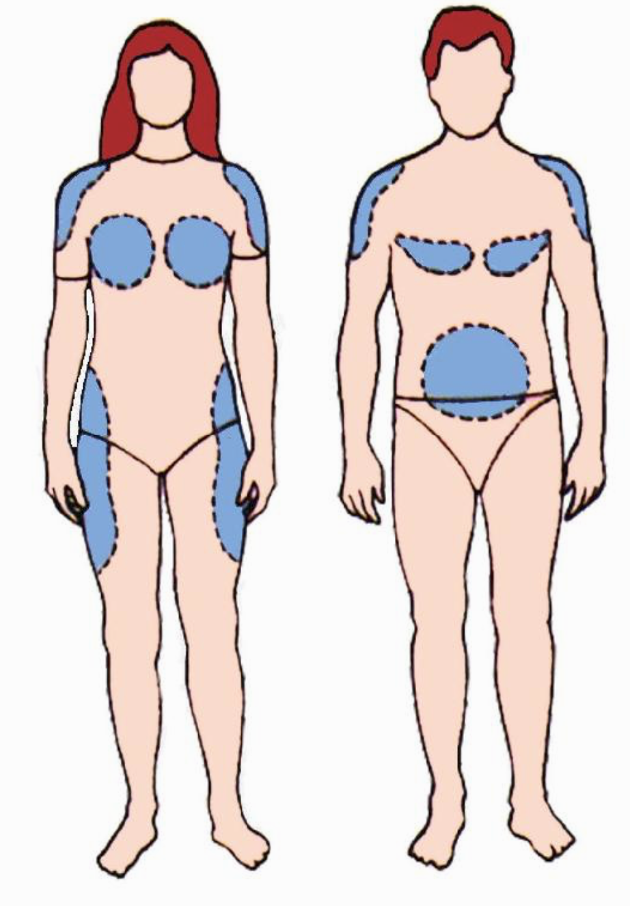
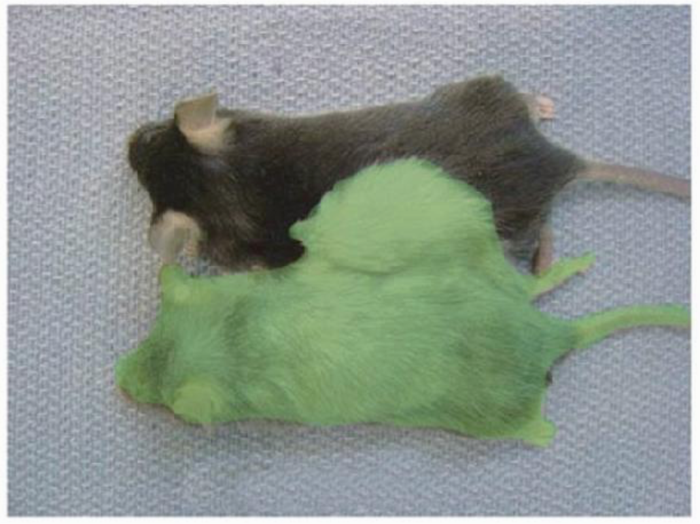
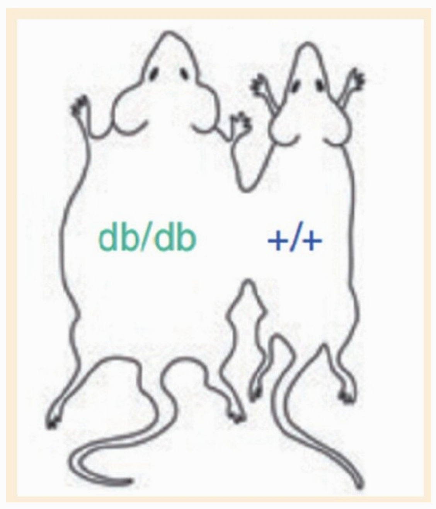
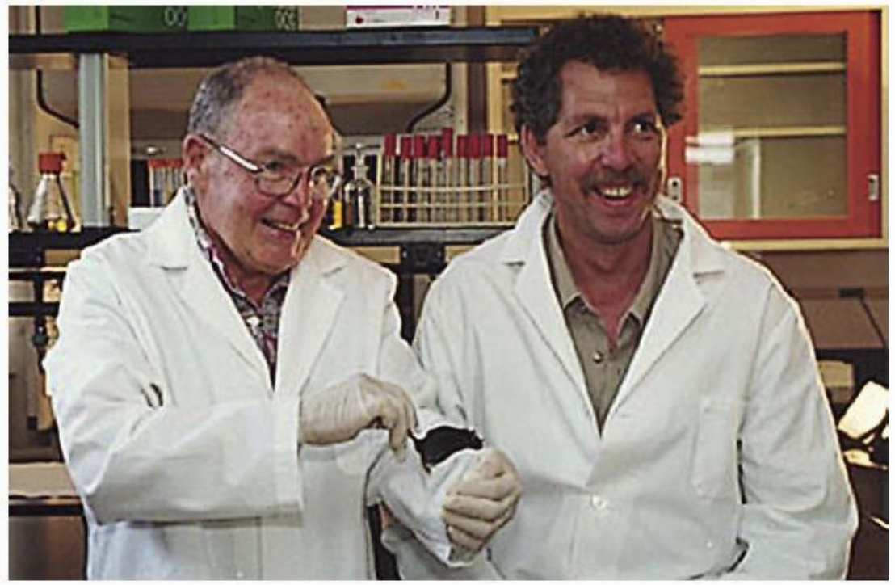
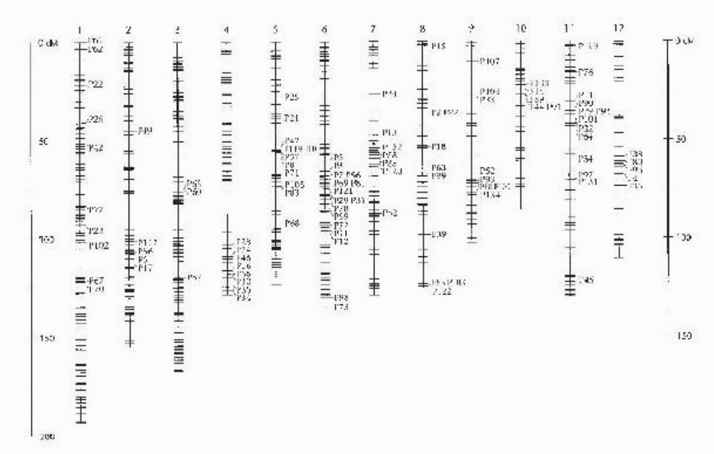
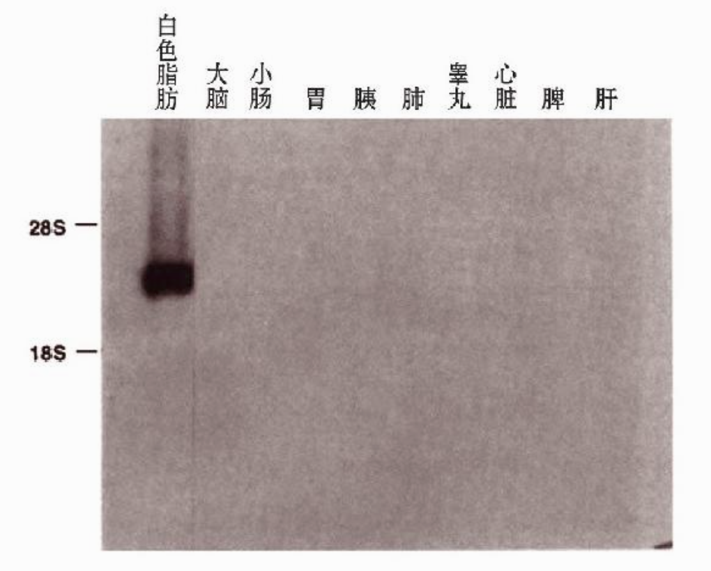
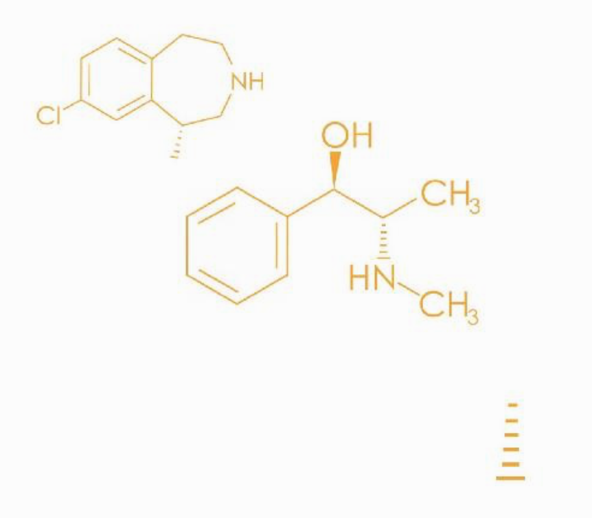

# 0101. 脂肪的秘密

提到脂肪，你首先想到的是什么？是超市冷柜里白花花的肥肉？是自己日渐丰腴的小肚腩？

是，也不是。我们身体里有百分之十几到二十几的体重是白色脂肪组织。这些组织因为富含中性脂肪，肉眼看起来确实是白色的。这些白色的脂肪如果囤积过剩，确实会导致各种困扰现代人的疾病，因此也怨不得我们总觉得它既难看又麻烦。（图1-1）

但是我们的脂肪可绝不仅仅是让人讨厌、让人体型走样的赘肉而已！脂肪组织是我们身体最重要的能量储存场所，为我们每个人的吃喝拉撒说笑跑跳提供能量。而也许更重要的是，看起来单调无趣的脂肪其实非常活跃地影响着我们身体功能的方方面面，从我们的胃口，我们的免疫功能，到我们的情绪和行为。就让我们从这里说起，重新认识自己的脂肪吧。

图1-1　身体脂肪分布示意图，图中蓝色阴影展示的是人体脂肪组织主要的堆积部位。一个有趣的现象是，不同性别的脂肪堆积部位有很大的差异。女性（左）更倾向于堆积在臀部和大腿，而男性（右）更倾向于堆积在腹部。这也就是大家常说的「梨形」和「苹果形」身材。研究表明，后者对于人体健康的危害要远大于前者。

## 1.1 连体的老鼠

白色的脂肪组织为我们的身体储存了大量的能量。而过剩的脂肪存储不光影响我们的体型，还会导致各种让人烦恼的疾病。在这一层人们对脂肪的刻板认知之下，我们身体里的脂肪还有别的什么用处么？

为了好好回答这个问题，就让时光倒转半个世纪，聊聊当年的两只胖老鼠。

那是 20 世纪 60 年代的故事了。

在今天人们的怀想里，那是一个带有点恐惧和迷茫，但仍然充满激情和奇迹的年代。在铁幕和核战争的阴影里，人类的每一步都走得如履薄冰小心翼翼。在世界各地，年轻的人们或是穿着绿军装高举红宝书，或是弹着吉他喊着「Make love no war」（要做爱，不要战争）的口号，把他们的青春和热情挥洒在人潮涌动的街口。那个年代的风云人物，不管是马丁·路德·金还是切·格瓦拉，不管是猫王还是披头士，到今天都还是无数人的精神偶像。

但是如果再过一百年、一千年，乃至到了人类文明的终点回望，20 世纪 60 年代将会真正永垂不朽的，大概还是人类科学技术的新边疆。

得益于两个超级大国的太空竞赛，人类开始蹒跚走出地球母亲的温暖怀抱。1961 年，苏联宇航员尤里·加加林搭乘东方一号飞船飞出地球大气层，成为进入太空的第一个地球人。1969 年，人类更是第一次登陆月球。美国宇航员尼尔·阿姆斯特朗（Neil Armstrong）在月球表面的发言——「这是个人的一小步，却是人类的一大步」（That's one small step for a man, one giant leap for mankind）——尽管从老式的落地收音机里听来断断续续，却还是让万千听众热泪盈眶。

而始于 60 年代的另外一个科学突破，尽管没有像征服太空或者登陆月球那样成为所有目光的焦点，却悄悄开启了人类认识自身的新篇章。

让我们的目光回转到 1969 年夏天，美国缅因州的巴尔港。只有几千常住居民的巴尔港是闻名世界的度假胜地。每到夏季，游轮载着欧洲各地的游客候鸟一样前来，点缀着白浪点点的大西洋。沙滩上满是骑着公路自行车，准备去钓龙虾或是看海豹的旅行者。

而在杰克逊实验室的研究大楼中，一间阴暗闷热的实验室里，一个穿着白大褂的中年人正忙着摆弄手里两只胖乎乎的小黑老鼠。

他叫道格拉斯·科曼（Douglas Coleman），加拿大电气修理工的儿子。

1958 年，科曼从美国威斯康星大学拿到生物化学专业的博士学位，很快在杰克逊实验室找到了一份临时性的研究工作。本计划在巴尔港待上两三年就返回加拿大谋职的科曼爱上了这块地方。他把一生的科学事业都留在了这里，还在这里待到退休和去世。

杰克逊实验室以庞大的小鼠遗传资源闻名于世。从 1929 年建立时开始，杰克逊实验室就致力于发展标准化的小鼠品系和突变体，并依靠向全世界科学家销售他们自己培育的各种奇奇怪怪的小鼠获得收入。

在科曼入职工作前后，杰克逊实验室的科学家们（科曼本人也参与其中）偶然间发现了两种体型异常肥硕的黑色小老鼠，并给它们起名字叫 ob（是肥胖的英文单词 obesity 的缩写，下文简称「肥鼠」）和 db（是糖尿病英文单词 diabetes 的缩写，下文简称「糖鼠」）。两种小鼠的体重可以长到普通老鼠的 3 倍大，长着尺寸惊人的赘肉，并且像人类肥胖症患者一样会出现各种各样的健康问题。

杰克逊实验室的科学家们已经通过反复的杂交实验，确认了肥鼠和糖鼠的肥胖症状是由两个不同的基因突变导致的。两种肥胖小鼠背后的罪魁祸首分别定位在小鼠的第 6 号和第 4 号染色体上。之后，就像杰克逊实验室曾经培育出的大量小鼠品系那样，肥鼠和糖鼠就被细心地培育并面向全世界同行出售。但老实说，似乎没有多少科学同行对它们产生过兴趣，更没有多少人觉得这两种胖老鼠能帮助人们理解人类的脂肪，理解人类肥胖症。

至于冷遇的原因，则有那么一点点历史性的意外。在当时，人们对于肥胖症的主流理解是，这是一种和大脑功能有关的疾病：病人是因为大脑生了病，失去了对食欲的控制，才会不停地吃吃吃，然后发胖。换句话说，当时的科学家们普遍认为，胖子都长了一颗「吃货」的大脑。不少严谨的科学实验证明，大脑里某些特定区域专门负责控制吃东西的多少，特别是我们以后将会讲到的下丘脑。也确实有实验证明，切除下丘脑的动物会暴饮暴食导致肥胖。与此同时，就和今天许多人的误解一样，那时候的科学家们简单地认为脂肪无非是身体用来储存和堆积过剩的能量的地方。换句话说，脂肪和肥胖症看起来似乎有关联，其实在生物学上却是八竿子打不着的两码事：一个仅仅是单调无聊的能量储备，一个关系到控制身心的大脑单元。研究小老鼠们脂肪为什么变多？听起来就没什么意思啊。

但我们的科曼先生显然并没有这么想，否则他就不用满头大汗地折腾这两只胖老鼠了。我们视野里的他，正在做一个叫作「连体老鼠」的实验。简单来说，就是通过外科手术，把两只小老鼠从肩膀到盆腔之间的皮肤连在一起，将两者的血液循环联通，人为制造出类似于人类连体婴儿的现象来。做完手术的老鼠看起来像图1-2中一样。

图1-2　连体老鼠实验图示。科学家可以通过精巧的手术，将两只老鼠的皮肤缝合在一起，从而连通两只老鼠的毛细血管循环

### 1.1.1 连体老鼠实验

这种看起来有点血腥残忍的实验，科学史上可谓功勋彪炳。其实，连体小鼠实验可以用来研究小鼠血液循环系统中的各种物质到底有什么样的功能；一旦进入另一只小鼠的体内，又是否能够影响它的生存和健康。连体小鼠的科学贡献除了我们故事里讲到的科曼先生的发现，特别值得一提的还有关于衰老的研究。

在 20 世纪 50 年代，人们就发现一只年老的老鼠如果和一只年轻老鼠连体，就可以「返老还童」，寿命显著增加，而且不管是毛发的光泽还是身体的健康都明显变好。这提示年轻老鼠的血液里也许有一种（当然也可能是几种）能够延缓甚至是逆转衰老的神奇物质。目前，寻找确认这种神奇物质的工作仍在进行之中。可以想象的是，这种物质如果真的被发现，将具有巨大的潜在临床价值。

顺便插句话，可能大家看到连体小鼠实验的第一反应会是，联通两只小鼠的血管，会不会带来异体排斥？的确，动物体内的免疫系统能够识别外来的物质和细胞，并发动攻击杀灭它们，这也是人体器官移植手术必须警惕的一大麻烦。所幸科曼不需要担心这个问题：发达的小鼠遗传学手段可以保证两只需要连体的小鼠具有近乎完全相同的遗传背景，就像人类同卵双胞胎一样，不需要担心异体排斥的问题。

连体老鼠的手术不容易做。它需要外科医生般稳定的双手。而且即便手术成功，也需要几周的时间耐心照顾和喂养，在老鼠的伤口愈合后才能进行真正的实验观察。科曼也是花了相当一段时间，才从杰克逊实验室的同事那里学来了这门手艺。要知道，对一个习惯了摆弄瓶瓶罐罐的生物化学家来说，这门手艺可真的不容易学会。

科曼要做的是，把一只肥胖的糖鼠和一只体型正常的普通小老鼠，做成连体，像图1-3中这样。

尽管科曼先生肯定不会是个激进的动物福利主义者，但显然他也没有无聊折腾小动物的闲情逸致。他的连体动物实验是为了回答一个萦绕在他脑海里的问题：肥鼠和糖鼠之所以肥胖，是不是因为它们的血液里缺了某种抑制肥胖的物质？这种未知物质也许可以抑制食欲，所以缺了它之后，糖鼠和肥鼠就会拼命进食；这种物质当然也许加速了能量消耗，所以缺了它之后，糖鼠和肥鼠就会整日懒洋洋躺着养膘。不过无论如何，如果这个物质真的存在，那么把一只正常小鼠的血液连进来（当然随之而来的还有正常小鼠血液里那种未知的减肥物质），是不是就可以为肥鼠或者糖鼠减肥了？

图1-3　一只糖鼠（db）和一只正常的老鼠（+）连体了。接下来会发生什么呢？

手术看起来成功了，科曼站起身来长舒了一口气，摘下手套擦擦额头的汗水。接下来就看小老鼠们术后恢复的情况了。

但接下来的几个月，两只老鼠的表现开始没完没了地折磨科曼先生。手术做得越来越干净漂亮。术后恢复期的糖鼠看起来也别无异状，还是没完没了地找吃的。可是相连的那只正常老鼠却似乎从来都不可能从手术中恢复。它一直病怏怏的，食欲也非常差。尽管科曼悉心照料，连体的正常老鼠还是接二连三地在术后一两个月的时间饿死，死的时候骨瘦如柴，惨不忍睹。

换句话说，实验的结果和科曼最初的设想完全相反。糖鼠没有减肥，反而是正常小鼠死掉了。这到底是为什么？

直到这年冬天的某一刻，奇思妙想开始光顾他了。他开始有足够的信心认定自己的手术本身绝对不会出什么问题，那么他看到的现象，不管再离奇，也必须有一个合理的生物学解释。

自己原先的设想是，糖鼠因为缺了一种未知的减肥物质而发胖，一旦它从正常小鼠那里获得这种物质，就应该能够减肥才对。而他看到的现象和自己的设想完全相反，糖鼠没有减肥，反倒是正常老鼠给饿死了！那么会不会自己的设想从根儿上就错了？反倒是糖鼠体内多了一种食欲抑制因子？这样想，倒是可以解释为什么连体的正常老鼠饿死了：因为通过手术，它一下子从连体的糖鼠获得了太多的食欲抑制因子！

但好像还是不对……如果真的如此的话，糖鼠因为带有大量的食欲抑制因子，不光不该胖，还该骨瘦如柴才对啊。除非……除非糖鼠失去了感知和响应这种食欲抑制因子的能力！如果这样的话，再多的食欲抑制因子，也改变不了糖鼠的好胃口。而且事实上，基于在生物学中很常见的补偿机制，糖鼠缺乏了这种感知能力，反而会让身体源源不断地制造出更多的这种食欲抑制因子。这种机制在我们的故事里还会反复地出现，说起来，有点像听力不好的人会习惯性地大嗓门说话，也像丢三落四的学生上考场经常会半强迫地多带几支笔。

好了，思维体操结束。科曼提出了一个新的、看起来很不错的假设：动物的血液里存在一种能够有效抑制食欲的因子。糖鼠缺乏感知这种物质的能力，从而导致暴饮暴食和严重肥胖。而这种物质一旦大量进入正常老鼠体内，就会严重影响食欲，甚至让老鼠活活饿死。同时，科曼还猜测，也许我们提到过的下丘脑正是负责感知和响应这种物质的。这也许就可以解释，为什么切除下丘脑会带来暴饮暴食的症状。

但糖鼠为什么胖，又是怎么胖的，和我们人类有什么关系吗？

这时候我们就需要稍微掉转一下思维方向了。

科曼的假说反过来理解，意味着正常老鼠体内应该存在一种物质，能够抑制食欲，从而将老鼠的能量摄入和脂肪储存控制在一个合理的范围内。鉴于小老鼠和人类在诸多方面的相似性，这个假说「稍微」推广一下，就指向了一个每个人可能都会关心的问题：我们人体内是否存在这种抑制食欲、维持体型的物质？它是什么？把它做成药片，能够帮助我们更好地维持身体的形态和健康吗？

带着可能发现新世界的激动心情，科曼又开始继续他的连体老鼠实验。

折磨完了糖鼠之后，他立刻开始用肥胖程度不遑多让的肥鼠来做连体实验。科曼开始的想法是，既然这两种胖老鼠看起来如此相像，肥鼠和正常老鼠的连体实验可能也会得到类似于糖鼠—正常老鼠连体的结果吧？换句话说，肥鼠大概也应该一切如常，正常老鼠则会饥饿而死？

实验结果让科曼的眼镜碎了一地（没错，科曼确实戴眼镜）。

剧情又一次反转了，肥鼠和正常老鼠连体之后的反应和之前完全相反！这次是正常老鼠一切如常，反而是肥鼠慢慢地开始减肥瘦身了。它的食欲逐渐下降，甚至降低到正常老鼠的水平；像高血糖、高脂肪等恼人的问题也似乎在慢慢消失。

反了，完全反了——

糖鼠和肥鼠都很胖，而且胖的程度相差无几；

在第一个实验里，糖鼠—正常老鼠连体，正常老鼠食欲下降乃至饿死，糖鼠肥胖依旧；

在第二个实验里，肥鼠—正常老鼠连体，正常老鼠却一切正常，反而是肥鼠开始发奋减肥，向正常体态靠拢。

这到底是什么意思啊？科曼一次又一次地追问自己。

还在找眼镜或者抓脑袋的科曼也许没有意识到，命运之神在对他微笑了。如果说糖鼠—正常老鼠的连体实验，以及科曼的第一个假说是顺理成章的科学发现，那么肥鼠—正常老鼠连体给出的相反结果，则是上天赐给科曼先生的一个揭示脂肪奥秘的绝佳机会。

## 1.2 人类的群星闪耀时

老实说，透过科曼先生的文笔和公开演讲来看，他可能谈不上是一个天才——至少不是一般人认为的那种科学怪才或者电脑奇才的形象。在 20 世纪 60—70 年代的天才发现之后，科曼似乎再也没有做出过什么别的惊天动地的科学发现，只是在杰克逊实验室老老实实继续着自己的科学职业。然而我必须得说，那种大众心目中惊才绝艳的天才形象往往并不真实，很可能不过是来自媒体和公众自身对天才的无端想象。所谓天才，在我看来，无非是那些在科学史上的某个瞬间，产生过天外飞仙般的奇思妙想的普通人而已。

奥地利著名作家斯蒂芬·茨威格（Stefan Zweig）写过一本书，名为《人类的群星闪耀时》。在茨威格的眼里，人类历史大多数时候平淡无奇，充满着数不胜数无关紧要的琐事。但是这当中会穿插着人类英雄的闪光瞬间，「像避雷针的尖端集中了整个大气层的电流……决定了一个人的生死，一个民族的存亡，甚至整个人类的命运」。这些瞬间会像星辰一般散射光辉，普照着人类历史的漫漫长夜，指引着人类前进的方向。

当然，在茨威格的书中，他更多的是在歌颂野心勃勃的探险家、挥斥方遒的革命者。但是在我看来，科学家才是真正的人类群星。阿基米德跳出浴缸高呼「我得到了」，赫兹在阴暗的房间里看到两个铜球之间微弱的电火花，达尔文在加拉帕格斯群岛记录下千奇百怪的鸟嘴，几千年来在对人类未知知识边界的探索中，科学家们始终星光闪烁。科曼兴致勃勃地摆弄和观察两只连体小老鼠的时刻，毫无疑问是茨威格所说的「人类的群星」闪耀的时刻。

两个本该高度一致，但实际结果却截然相反的连体老鼠实验，让科曼这个普通人，在这一时刻有了天才的灵光一闪。

在科曼的第一个假设里，糖鼠可能失去了感知某种食欲抑制因子的能力从而发胖。这个假设可以解释为什么连体之后即便是能从正常老鼠那里获得这种因子，糖鼠仍然胡吃海喝。但是这个假设显然不能解释肥鼠的连体实验结果，因为肥鼠这一次成功减肥了！所以无论如何，科曼需要一个新的假设。

与正常小鼠连体的肥鼠能够减肥，首先就说明，和糖鼠不同，肥鼠感知这种食欲抑制因子的能力是没问题的。那么它为啥还那么胖？是不是说明肥鼠的发胖是一件完全不同的事情？虽然看起来都很胖，但是糖鼠和肥鼠是因为完全不同的原因发胖的，压根就不该把它们放在一起研究？

等一等。

好像有一个特别凑巧的可能性啊，科曼想。如果和糖鼠的情况针锋相对，肥鼠恰恰是缺少了合成这种食欲抑制因子的能力呢？

第二个假设好像可以自圆其说：因为缺少了这种食欲抑制因子，肥鼠才会发胖。而一旦连体之后，来自正常老鼠的这种因子就可以有效地帮助肥鼠减肥。

听起来好像不错。可是我的运气有那么好吗？怀疑是科曼的第一反应。要知道，杰克逊实验室的科学家们在过去十多年的时间里偶然发现的两只胖老鼠，居然恰好像锁和钥匙一样共同配合？一个缺乏食欲抑制因子，一个缺乏感知这种因子的能力，从而殊途同归地产生了肥胖的结果？

在抓狂和向命运祈祷之前，让科曼先生继续带我们思考、提问、动手验证吧。这个好运气的设想如果正确的话，那么如果把肥鼠和糖鼠直接连体，我们看到的应该是：

肥鼠会瘦下去，而且会瘦得非常厉害。因为它会从糖鼠那里得到源源不断的、它自身缺乏的那种抑制食欲的物质。而糖鼠，则会毫无反应地继续胖下去，因为它缺乏的是感知和响应这种食欲抑制因子的能力。这种感受能力来自于它的大脑，不能从肥鼠的血液里获得。

在接下来的实验中，科曼完美验证了这个假说。糖鼠和肥鼠连体的结果果然是糖鼠继续发胖而肥鼠迅速减肥。两只看起来长相相似的胖老鼠，连体实验的结果却是如此的泾渭分明！

好运气真的就这么降临到科曼先生的头上了。他可以骄傲地宣称，小鼠身体里一定有两个基因，其中一个能够制造出一种强有力的食欲抑制因子，这种因子进入血液流进大脑，有效地降低了小鼠的胃口。而另一个基因则负责感知和响应这种食欲抑制因子。只要找到这两个基因，我们就能理解食欲和体型的秘密。

在完成了这一系列美妙的实验之后，科曼用了十几年时间，徒劳地利用各种生物化学的方法试图发现这种假想中的食欲抑制因子是什么，但是从未获得成功。

1993 年，62 岁的科曼先生从杰克逊实验室退休，直到这时我们都还不知道科曼先生所猜测的食欲抑制因子是否真的存在，以及它到底是什么。尽管科学界里渐渐已经有更多的声音接受和支持科曼先生的假说，但是直到这个时候，科曼的发现还没有得到过任何值得一提的科学奖励。

但我们也不需要为科曼难过或不平。和大家的想象不同，科曼并不是个像布鲁诺、黎曼或康托那样的寂寞的天才或者愤懑的斗士。相反，科曼先生是个无比热爱生活和家庭的完美好男人。在几十年的工作里，他每天早上 7 点上班，下午 5 点半准时开始和家人的晚餐。他和挚爱一生的夫人贝弗利（Beverly Coleman）一起养育了 3 个儿子，并且每年都会带着全家饱览世界各地美好的风光。62 岁的他之所以准时退休关闭实验室，也并不是被科学界逼得无处容身，而是主动选择了更多陪伴爱人、饱览美景的机会。

不过我们不得不说，命运还是很厚待科曼先生。

1994 年，科曼退休仅仅一年之后，美国洛克菲勒大学的杰弗瑞·弗里德曼（Jeffery Friedman）和他的同事们利用现代遗传学手段，在艰苦漫长的八年探索后找到了科曼先生预言的那种能够抑制食欲和控制体型的蛋白质因子，并命名为「瘦素」（leptin 一词源于希腊语「瘦」）。正如科曼所预测的那样，肥鼠的瘦素基因存在遗传突变，失去了生产瘦素、从而控制自身食欲和体重的能力。瘦素蛋白也正如科曼先生的连体实验所暗示的，可以在血液中流动并深入大脑，从而影响小鼠的胃口。

科曼关于糖鼠的假说也得到了完美的证实和解释。千禧年制药公司（Millennium Pharmaceuticals）的科学家利用表达性克隆的技术找到了瘦素的受体分子，也就是感知瘦素的蛋白质分子。弗里德曼实验室随后证明，在糖鼠体内，瘦素受体基因存在遗传突变而丧失功能，因而失去了感知和响应瘦素的能力。甚至，就像科曼曾经猜测过的那样，瘦素受体蛋白确实高度集中在动物的下丘脑区域！（图1-4）

科曼先生于 2014 年 4 月因恶性皮肤癌去世，享年 82 岁。在瘦素分子被发现后，科曼誉享全球，成为活着的传奇。有人遗憾科曼如果能再长寿几年，将几乎肯定会拿到诺贝尔奖。

不过我想，科曼先生一定不在乎这点小小的遗憾。因为，当他把两只胖老鼠用手术连在一起，并预测一种食欲抑制因子存在的时候，他已经得到了人世间最高的奖赏。就像一个在沙滩拾贝、无意间看到无垠大海的小男孩，那一瞬间的惊喜和快乐，非尘世任何奖赏可及。

图1-4　科曼（左）和弗里德曼合影，两位科学家的接力最终带来了瘦素分子，也带来了人类对脂肪的全新理解。（那只小黑老鼠正在咬科曼先生的手臂！）

## 1.3 魔法王子和瘦素蛋白

杰弗瑞·弗里德曼博士可能是当今世界上最知名的科学家之一，这位美国洛克菲勒大学教授的名字出现在各种各样诺贝尔奖的预测榜单上，并名列前茅。他获得过的知名科学大奖可以用「打」来计数，其中也包括大家耳熟能详的 2009 年邵逸夫奖和 2010 年拉斯克奖。而在科学界之外，弗里德曼先生同样拥有巨大的影响力和众多拥趸。他分别在 1994 年和 1996 年获得过《时代周刊》评选的年度科学人物称号，而他的研究发现——神奇的瘦素分子，更是为数不清的肥胖症患者和梦想苗条身材的男男女女所熟知。

这位每年在世界各地旅行，参与许多教育、科学、药物开发、政策制订等工作的科学家，也已经到了耳顺之年。每当谈起自己六十年的生活和事业，他总还是会用因为激动而有些走音的语调，回忆起那个永难忘怀的高光时刻。

那是 1994 年 5 月 8 日的凌晨 5 点 30 分，结束了大都会夜生活的纽约城其实才刚刚进入梦乡。曼哈顿中城的酒吧里，消磨整夜的光棍汉、投资银行家和大学生们刚刚散去，酒保们拖着疲惫的身体开始清理垃圾、关灯上锁。纵贯曼哈顿岛的 6 号线地铁还是单调地每隔几分钟就穿过来克星敦站，在附近的街道地面都听得到隆隆的震动声，不过车厢里只剩下些宿醉的流浪汉和赶早班的超市收银员。是啊，虽然人们都说纽约城从不入眠，但是周日的早上，总是这里最静谧的时光。

不过在街对面，洛克菲勒大学的一间暗房里，有位皮肤黝黑的中年人还在昏暗的红色灯光下仔细地看着一张胶片。杰弗瑞·弗里德曼先生，尽管已经在三年前荣升这座闻名世界的医学研究机构的终身副教授，却始终保持着亲自参与实验操作的习惯。昨晚（更准确地说，是今天，也就是周日的凌晨 1 点钟）他在实验室里完成了一个实验，并在暗房里冲洗了一张胶片用来显示实验结果。回到家中却无法入睡的弗里德曼决定，干脆在整座城市苏醒前再回一趟实验室，亲眼看看冲洗好的胶片。

「我看到了，我看到了！」几分钟后弗里德曼激动万分地冲出暗室，打电话给自己还没有睡醒的妻子，并且没等到妻子答话就挂掉了电话。然后面对着窗外东河上的皇后桥，笑意舒展开来。（图1-5）

八年前，弗里德曼拿到博士学位，在洛克菲勒大学开始建立自己的实验室。受连体老鼠实验的感染，他决定亲自去验证科曼先生的假说，找到肥鼠体内所缺乏的那种神奇的食欲控制因子。对小鼠遗传分析了如指掌的他没想到，为了这个承诺或者梦想，他和他的同事们要付出怎样的坚持。

八年，两千多个没有休息、没有停顿的日日夜夜，在上千只老鼠身上一次又一次机械重复着烦琐的实验，终于在这个周日的凌晨，让他自己成为在创世纪之后，第一个亲眼看到这个神奇因子的凡人。

图1-5　弗里德曼。图中窗外就是东河上的皇后桥

我们已经讲过，科曼先生根据连体动物实验的结果令人信服地推测，小鼠体内存在一种在血液内流通的、可以抑制食欲的物质，这种物质能够被位于小鼠大脑中的某种物质所感受，从而调节食欲、控制脂肪的存储。而在名为肥鼠和糖鼠的两种小鼠中，这种食欲抑制因子和它的感受器（也就是受体分子）因为遗传突变分别失去了功能，从而导致了严重的肥胖。

彼时分子生物学研究正如火如荼，科学家们自然地想到：只要能够找到肥鼠体内哪个基因产生了缺陷，就能够按图索骥地找到编码这种神奇食欲抑制因子的基因，进而得到我们梦寐以求的这种「苗条」因子。

问题是，当时人们猜测，小老鼠身体里有 30000～50000 个基因，而能把「苗条」基因与其他几万个基因伙伴们区分开的，只有一个特点——缺乏了苗条基因会让肥鼠发胖。关于这个「苗条」因子的别的东西我们一无所知。那怎么从 30000 个基因里，准确找到那个编码食欲抑制因子的基因呢？

这个问题的难度，就像告诉你全城有 30000 个幼儿园年龄的小朋友，你必须去找到其中一个。但是你不知道他的相貌、姓名、种族，唯一知道的是，他有一种神奇的魔法，能让所有的小朋友都幸福快乐。如果把「魔法王子」带离这个城市，全城的小朋友们都会觉得不开心。这样的任务听起来近乎不可能。更要命的是，在弗里德曼设立宏伟目标的那个年代，没有汽车，没有手机，没有各种各样出现在《007》或者《碟中谍》里的神奇装备。他只能靠最原始的方法去寻找这个魔法小王子。

第一个可能的思路是，一个一个地把小朋友逐个带出城，然后派人手盯住剩下的小朋友，看看带出去哪一个的时候，全城剩下的小朋友们都面带愁容。思路没有问题，但是没有技术层面上的可行性。在那个年代，遗传学家们没有能力定点和精确地操纵单个基因，他们能做到的最多是随机地把小鼠三万多个基因一个一个破坏掉。换句话说，他们必须蒙着眼睛抓小朋友，而且还永远不能摘下眼罩来。这样即便抓到了正确的魔法王子，我们还是不知道他的名字和相貌。

那么换个思路。虽然我们不知道魔法王子的姓名、相貌，但是我们可以这样来推测，小朋友们应该有他们喜欢的玩伴。那么我们如果知道魔法王子喜欢和谁在一起做游戏，我们是不是就可以顺藤摸瓜找到他了？听起来也靠谱！这个方法，遗传学上叫作「连锁分析」。

### 1.3.1 关于遗传的几个小知识

大家可能都听说过牛顿三定律。这三条简单的表述构成了经典力学辉煌大厦的基石。而遗传的秘密也隐藏在三条定律中。19 世纪中叶，奥地利神父、生物学家格里高利·孟德尔（Gregor Johann Mendel）通过豌豆杂交实验提出了伟大的遗传学第一和第二定律。

孟德尔发现，黄色种子的豌豆和绿色种子的豌豆杂交之后，产生的后代一律都是黄色种子。而这些杂交后代如果再两两杂交的话，绿色又会重新出现。而且黄色种子和绿色种子的比例非常接近 3:1。基于这种优美简单的杂交结果，孟德尔提出决定种子颜色的「因子」（今天我们叫它「基因」）有显性的黄色和隐性的绿色两种，而每一株豌豆都有两个分别来自父亲和母亲的种子颜色「因子」。

黄/黄豌豆和黄/绿豌豆的种子颜色均为黄，而绿/绿豌豆的种子颜色为绿。因此，黄/黄豌豆和绿/绿豌豆杂交的后代全部是黄/绿，因而种子一律为黄色。黄/绿豌豆杂交的结果，后代则分别为黄/黄，黄/绿，绿/黄，绿/绿。前三者均为黄色，从而出现 3:1 的黄绿比。这就是遗传学第一定律——分离定律的简单解释。

按照第一定律，决定生物性状的遗传因子不会随着杂交而稀释消失，而是顽固地保留在后代中。遗传学第二定律（自由组合定律）进一步扩展了第一定律的发现，指出不同的遗传「因子」，例如种子颜色和种子褶皱，是相互独立地分配进入后代的，彼此没有干扰。

到了 20 世纪初，美国遗传学家托马斯·摩尔根（Thomas Morgan）又利用果蝇的研究提出了遗传学第三定律（连锁与交换定律）。根据第三定律，遗传因子之间并非总是能够完全自由组合，而是存在某种程度的「连锁」。

举例来说，如果来自父亲果蝇的遗传因子是「灰色身体」「长翅膀」，而来自母亲的遗传因子是「黑色身体」「短翅膀」，那么依据自由组合定律，灰/长、灰/短、黑/长、黑/短后代的比例将会是等同的。但是实际情况却是仅仅看到了灰/长和黑/短两种后代。换句话说，灰色身体和长翅膀这两种遗传因子，以及黑色身体和短翅膀这两种遗传因子是不能自由组合、总是一起出现的。这种现象就叫作连锁。两种遗传因子在遗传物质 DNA 上的距离越近，连锁的概率就越高。

格里高利·孟德尔（左）与托马斯·摩尔根（右）

简单说一说这种办法吧。我们都知道，每个人身体里的基因都有两个拷贝，一半来自父亲，一半来自母亲。来自父亲的基因都在长长的「父亲 DNA」上，来自母亲的基因当然就在「母亲 DNA」上。然而从一个受精卵开始的每一次细胞分裂，直至形成人体，父亲和母亲 DNA 会相互缠绕在一起，发生一种叫作「重组」的事情。其结果就是在每次细胞分裂的时候，部分父亲 DNA 上的基因都会被换到母亲 DNA 上（反之亦然），因而两条父亲母亲 DNA 就变得没有那么泾渭分明了。

有趣的是，如果 DNA 链条上两个基因之间的距离很短，那么两者发生交换的概率就会变得非常低，这种现象被叫作「连锁」。所以，如果我们能够在长长的 DNA 链条上首先定位许多分子「路标」（图1-6），然后找到编码食欲抑制因子的基因和哪些「路标」紧密连锁，我们就可以根据分子路标的位置逐渐逼近这个基因的准确位置。从这个技术可能需要在成千上万的老鼠后代中分析「连锁」发生的频率，再根据连锁频率的高低判断其位置。

图1-6　水稻 12 条染色体的 DNA 物理图谱。每条染色体上密密麻麻的横线就是各种分子「路标」的相对位置

现在，我们打算根据玩伴「连锁」原理寻找魔法小朋友了。但是幼儿园的小朋友们其实也是很有原则的，他们每天只和一个小朋友玩，只是不同日子里才会更换玩伴，而魔法王子也不是忠贞不渝地每天只和他的几个好朋友在一起，只不过一年到头里他和好朋友玩的日子相对会更多一些而已。所以，唯一的办法，是忠实记录每天全城小朋友们玩耍的情况，然后分析到底哪个小朋友和哪个小朋友之间关系好，谁和谁之间又不太喜欢一起唱歌跳舞，等等。

听起来好像虽然枯燥，但是也不是很难？但是，我们漏掉了一个至关重要的信息：我们还没问魔法王子喜欢的玩伴有什么特征呢？没有这个信息即便我们分析了所有几万个小朋友怎么交朋友，也还是不知道谁是真正的魔法王子啊。

弗里德曼就遇到了一样的问题。在那个时代，我们对小鼠基因的了解还相当粗浅，老鼠父亲母亲 DNA 上已知的分子「路标」还非常稀疏。即便利用连锁分析把编码食欲抑制因子的基因定位在两个现有的分子「路标」之间，这中间的距离足够让成百上千的基因藏身了。这不行，所以弗里德曼不得不倒退一步，首先在小鼠 DNA 上找到足够多的分子「路标」。这是一项烦琐无聊的工作，同样也需要在成百上千的小鼠后代里找到这些分子「路标」之间的连锁关系以确定其彼此的物理距离（顺便说一句，得到的分子路标的地图，生物学家们叫作物理图谱）。就像为了准确描述魔法小朋友的玩伴，我们需要首先带着放大镜去观察、分析和总结全城小朋友们的特点：他们的衣服颜色有几种；他们有多大比例戴眼镜；他们梳马尾辫还是剪童花头等。

在几年的准备工作之后，弗里德曼终于可以利用自己绘制的精确物理图谱，定位那个深藏不露的食欲抑制因子了。我们寻找魔法王子的工作也到了最关键的时刻：我们已经知道了魔法王子最喜欢一个叫「丫丫」的小女孩，这个小女孩有张小小的脸蛋，一双大大的眼睛，喜欢唱歌，也喜欢甜甜地说「我喜欢你」，我们终于可以出发，到城市里去找 丫丫，然后从特别喜欢和 丫丫 做游戏的小朋友里面找到我们的魔法王子了。

又是几百个日日夜夜，弗里德曼和他的同事们在黑暗中慢慢前行。他们知道，尽管还伸手不见五指，但是他们确实离那个目标越来越近了。

1994 年 5 月 8 日那个周日的凌晨，谜底揭晓。

弗里德曼的实验室已经把编码食欲抑制因子的基因成功定位到小鼠 6 号染色体上大约 65 万个碱基对的狭小范围内，他们同时发现，这段 DNA 里可能藏着 6 个基因。神秘的食欲抑制因子开始慢慢显露它的真容了。

魔法王子找朋友　李可/绘

就在这天凌晨，弗里德曼的实验是为了回答这么一个问题，这 6 个基因到底在老鼠的哪些器官里发挥功能？弗里德曼此时手里的胶片，就是要看看这其中的第一个候选基因 2G7，它到底在哪些组织里出现。

暗室昏暗的灯光下，弗里德曼在刚刚冲洗出来的胶片上看到，2G7 基因在代表脂肪组织的地方出现了非常清晰、优美的信号。（图1-7）

图1-7　发现瘦素基因的胶片。弗里德曼和合作者们用放射性同位素标记的方法显示了 2G7 基因（也就是后来命名的瘦素基因）仅仅在小鼠的脂肪组织富集，而在其他所有组织都不存在。图中黑色的条带就是 2G7 基因在脂肪组织中的表达情况。更准确地说，弗里德曼的实验是为了检测 2G7 基因生产蛋白质分子的中间产物——信使 RNA（messenger RNA）到底出现在哪些组织里。

尽管从逻辑上，2G7 基因出现在脂肪组织里这件事本身，其实什么也说明不了。但是如此纯粹、干净的信息一瞬间让弗里德曼明白这就是他苦苦追寻八年的东西——科曼在 30 年前就预测过的那个食欲抑制因子。想想吧，一个来自脂肪组织的信号分子，如果反过来可以抑制食欲、阻止脂肪组织的继续增多，那将是多么优美简洁的自我调控机制！

从某种程度上，科学家都是美学主义者，都相信自己苦苦追寻的自然奥秘从某种程度上应该是简单、精巧、优雅的。在回答「肥鼠到底缺了什么导致它如此肥胖」的漫漫征途上，第一个映入眼帘的疑似目标就是一个自身产生于脂肪组织的物质，这种巧合，弗里德曼相信是自然的安排，而不仅仅是自己的好运气。

终于，一只诞生于 1950 年的胖老鼠，在 44 年后，帮助我们走出了理解自己的身体、理解脂肪秘密中最关键一步。

之后的发展就像是童话故事：弗里德曼和同事们很快为这种活跃在脂肪组织的物质起名为「瘦素」（leptin一词源于希腊语「瘦」），并且令人信服地证明，缺乏瘦素正是肥鼠发胖的原因。而将瘦素注射到肥鼠的体内，就可以完美地恢复肥鼠的体型。仅仅一年之后，千禧年制药公司的科学家就找到了感知和响应瘦素分子的物质，并命名为瘦素受体，缺乏这种瘦素受体正是糖鼠肥胖的原因。瘦素和它的受体就像锁与钥匙一样共同起作用调节动物的食欲和体重，科曼的肥鼠与糖鼠分别缺少了锁和钥匙，因此在肥胖程度上也非常类似。

而更重要的是，这样的精密系统在人体中也几乎是原封不动地存在着。

## 1.4 重新认识你的脂肪

一场持续了近半个世纪的接力赛跑终于落幕。

自然之手造就了杰克逊实验室的两只胖胖的小老鼠：肥鼠和糖鼠。

科曼先生用精妙无比的连体动物实验说明，动物自身能够分泌一种抑制食欲的物质，这种物质通过血液循环进入下丘脑，并在那里被感知从而发挥功能。

不管是缺乏了这种物质（肥鼠）还是缺乏了感知这种物质的能力（糖鼠），动物都会无法抑制的暴饮暴食和发胖。

在八年漫长的寻找之后，弗里德曼利用连锁分析的方法找到了这种神奇的食欲抑制因子，并把它命名为瘦素。

而揭示瘦素来源的第一个实验就证明，瘦素来自白色脂肪组织。

毫无疑问，看起来单调、无趣甚至有害的脂肪，需要被我们重新认识。它远比我们的刻板印象更生动、更复杂、更有趣，它像一架精密的机器调节着我们身体的代谢平衡。而瘦素可能就是这架机器的中心。

当我们身体内的脂肪堆积过多，瘦素分子水平随之上升，它会告诉我们的大脑现在身体能量充足，不需要再吃太多好吃的东西了。而当身体营养不良、脂肪水平下降以后，瘦素分子水平降低，我们又开始恢复自己的好胃口。通过分泌释放瘦素，脂肪组织能够掌控整个身体的新陈代谢，维持我们身体的理想体重。

以瘦素的发现为开端，人们开始真正重视白色脂肪组织，开始带着更大的热情探究它在能量储存之外的生物学功能。也正因此，在瘦素发现之后十多年中，脂肪众多隐藏的功能被慢慢揭示。

我们开始知道，来自脂肪的瘦素分子除了调节食欲，也会影响我们身体对外来病菌的抵抗，会影响我们身体功能的发育，甚至还会影响生殖能力。而脂肪本身，除了瘦素分子之外，还能分泌许多发挥重要功能的信号分子。在今天的科学视野中，脂肪是一架生机勃勃的生命机器，通过各种途径积极地参与身体的健康和疾病过程中。（图1-8）

图1-8　白色脂肪组织的许多生理功能。通过大量的研究，我们现在知道，看起来单调无趣的白色脂肪组织，有着复杂精密的生理功能。通过分泌包括瘦素在内的众多因子，脂肪组织能够与身体神经系统、免疫系统、内分泌系统等相互作用，影响机体包括代谢、行为、免疫反应在内的方方面面脂肪，确实并不只是一堆油腻腻的无聊物质。

接下来，我们希望回答的问题自然就是，既然脂肪如此重要，能够如此精密地调节我们的食欲，那么我们的胃口和体型为什么有时候还会失去控制？我们为什么还需要担心肥胖？身体里的脂肪太多的话，会对我们的身体带来什么样的影响？科学家们又是怎么尝试控制并解决这些问题的？

