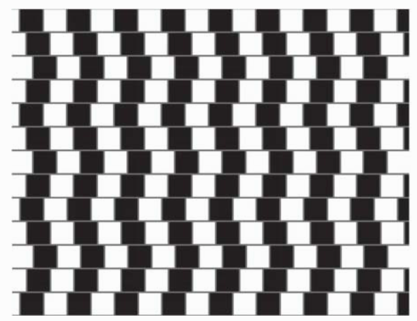
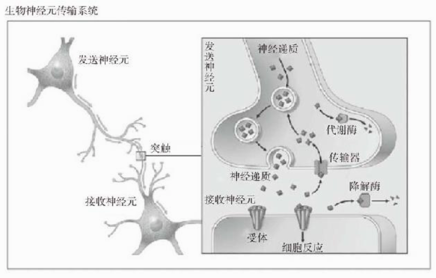
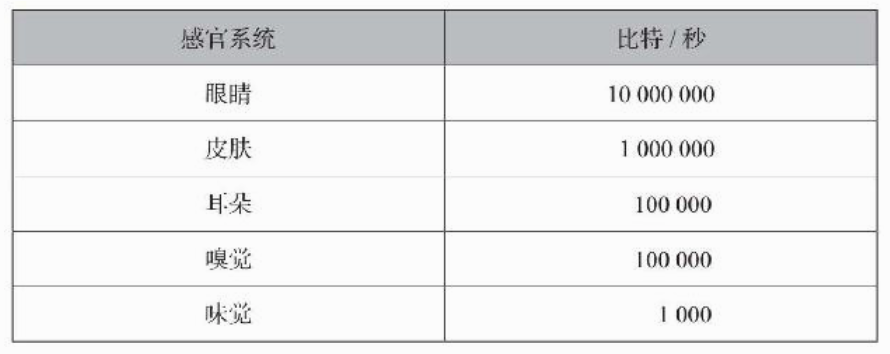
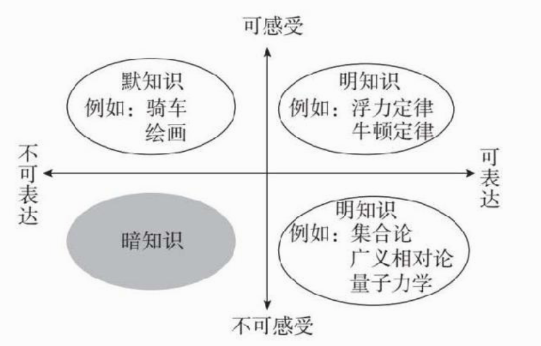

# 0101. 横空出世 —— 暗知识的发现

## 00. 导读

正当人类自以为掌握了关于这个世界的海量知识时，一种能够自我学习的机器给了我们当头一棒：机器发现了一类人类既无法感受，也不能理解的知识。这类知识的发现，逼迫我们重新审视过去所有关于知识的观念。我们回顾了 2500 年来在这个问题上的争论：知识是通过经验得到的还是通过推理得到的？直到大约 70 年前人们才注意到那些「只可意会，不可言传」的默知识的重要性。但这些争论在最新的脑科学研究结果面前都显得肤浅和苍白。

最近几十年的科学研究确认了认知的基础是大脑神经元之间的连接。有了这个基础，我们就很容易理解为什么有些知识无法表达，也才能明白为什么人类无法理解机器刚刚发现的这些暗知识。在此基础上，我们终于可以清晰地区分这样三类知识：人类能掌握的明知识和默知识以及只有机器才能掌握的暗知识。

## 1.1 骄傲的人类

也许是由于几十万年前人类远古祖先某个基因的突变，人们开始可以把一些有固定意思的发音片段组装成一个能表达更复杂意思的发音序列。这些发音片段今天我们叫作「单词」，这个表达特定内容的发音序列今天我们叫作「句子」。这种「组装」能力使人类用有限的单词可以表达几乎无穷多种意思，语言诞生了。

有了语言的复杂表达能力，人类的协作能力开始迅速提高，可以几十人一起围猎大型动物，很快人类就上升到地球生物链的顶端。作为记录语言的符号 —— 文字的发明可以让人类更方便地传播、记录和积累经验。任何一个地方的人类偶然发现的关于生存的知识都会慢慢传播开来。

一万年前，农业起源于今天的埃及、叙利亚和伊拉克的肥沃新月带，这些种植经验在几千年中传遍全世界，随之而来的是人类迅速在地球所有适宜农耕的角落定居繁衍。

随着定居的人类数量的增加，人类的组织开始变得更大更复杂，从亲缘家族到部落，到城邦，再到国家。大规模的复杂组织可以开展大规模的复杂工程，如建设城市、庙宇和大规模灌溉系统。这些大规模工程需要更多的天文和数学知识。世界上几乎所有的古老文明都积累了许多天文知识，但只在希腊半岛诞生了现代科学的奠基石 —— 数学。欧几里得（Euclid，公元前 330-275）在公元前 300 年总结了他前面 100 年中希腊先哲的数学成果，写出了人类历史上最伟大的书之一《几何原本》（Elements）。这本书在中世纪由波斯裔的伊斯兰学者翻译成阿拉伯文，又从阿拉伯传回文艺复兴前的欧洲，直接影响了从哥白尼（Nicolaus Copernicus，1473-1543）到牛顿（Issac Newton，1643-1727）的科学革命。

发轫于 16 世纪的科学革命的本质是什么？是发现更多的知识吗？是创造出更多的工具吗？都不是。科学革命的本质是找到了一个可靠的验证知识的方法。

最能体现科学革命本质的就是天文学家开普勒（Johannes Kepler，1571-1630）发现三定律的过程。最初，在作为主流的托勒密（Ptolemy，90-168）地心说越来越无法解释天体观测数据时，哥白尼提出了日心说，用新的模型解释了大部分过去无法解释的数据。与伽利略（Galileo Galilei，1564-1642）同时代的天文学家第谷·布拉赫（Tycho Brahe，1546-1601）没有接受哥白尼的日心说，他提出了「月亮和行星绕着太阳转，太阳带着它们绕地球转」的「日心—地不动」说。遗憾的是，他倾尽毕生心血观察了 20 年的天文数据，直到去世都始终无法让观测到的数据与自己的模型相吻合。

在第谷去世后，第谷的助手开普勒拿到了他的全部数据，开普勒完全接受了哥白尼的日心说。他为了让数据与日心说完全吻合，把哥白尼的地球公转的圆形轨道修正为椭圆轨道，太阳在椭圆的一个焦点上。这就是开普勒第一定律。他用相同的方法发现了其他两个定律。开普勒三定律不仅完满解释了第谷的所有观测数据，并且能够解释任何新观测到的数据。

这个发现过程有三个步骤：第一，积累足够的观测数据（第谷 20 年的观测数据）；第二，提出一个先验的世界模型（哥白尼的「日心说」）；第三，调整模型的参数直至能够完美拟合已有的数据及新增数据（把圆周轨道调整为椭圆轨道，再调整椭圆轴距以拟合数据）。验证了这个模型有什么用？最大的用处就是可以解释新的数据或做出预测。在这里开普勒三定律就是新发现的知识。发现知识的可靠方法就是不断修改模型使模型与观测数据完全吻合。

上面这三个步骤奠定了现代科学的基本原则，正式吹响了科学革命的号角，直接导致了后来的牛顿万有引力的发现，一直影响到今天。

过去 500 年中人类对世界的认识突飞猛进，今天大到宇宙，小到夸克都似乎尽在人类的掌握之中。人类可以上天、入地、下海，似乎无所不能。人类有了「千里眼」「顺风耳」，甚至开始像「上帝」一样设计新的物种，并企图改变人类进化的进程。人类有理由相信没有什么知识是不能理解的，也没有什么知识是不能被发现的……直到 2016 年 3 月 15 日。

## 1.2 天才的哽咽

2016 年 3 月 15 日，美国谷歌公司的围棋对弈程序 AlphaGo 以五局四胜的成绩战胜世界围棋冠军韩国选手李世石。一时间这个消息轰动世界，全世界有 28 亿人在关注这场比赛，在中国更是引起极大的轰动。人们感觉 AlphaGo 就像从石头缝里蹦出来的孙悟空一样，完全无法理解一台机器如何能够打败世界围棋冠军。围棋历来被认为是人类最复杂的游戏之一。围棋每一步的可能的走法大约有 250 种，下完一盘棋平均要走 150 步，这样可能的走法有 250^150=10^360 种，而宇宙从诞生到现在才 10^17 秒，即使是现在世界上最快的超级计算机，要想把所有走法走一遍，计算时间也要比宇宙年龄都长。即使排除了大部分不可能的走法也是大到无法计算。机器是怎样学会这么复杂的棋艺的？

这场比赛后，世界排名第一的棋手柯洁在网上说：「AlphaGo 胜得了李世石，胜不了我。」而 2017 年 5 月 28 日，棋手柯洁以 0：3 完败AlphaGo，彻底击碎了人类在这种复杂游戏中的尊严。赛后，这位天才少年一度哽咽，在接受采访时柯洁感叹，AlphaGo 太完美，看不到任何胜利的希望。他流着眼泪说：「我们人类下了 2000 年围棋，连门都没入。」中国棋圣聂卫平更是把 AlphaGo 尊称为「阿老师」，他说：「AlphaGo 的着数让我看得如醉如痴，围棋是何等的深奥和神秘。AlphaGo 走的顺序、时机掌握得非常好。它这个水平完全超越了人类，跟它挑战下棋，只能是找死。我们应该让阿老师来教我们下棋。」他还说：「阿老师至少是 20 段，简直是围棋上帝。」

当人们以为这是对弈类程序的高峰时，AlphaGo 的研发团队 DeepMind（谷歌收购的人工智能企业，位于伦敦）团队再度碾轧了人类的认知。2017 年 12 月，DeepMind 团队发布了 AlphaGo Zero（阿尔法围棋零）。AlphaGo Zero 使用了一种叫作「强化学习」的机器学习技术，它只使用了围棋的基本规则，没有使用人类的任何棋谱经验，从零开始通过自我对弈，不断地迭代升级，仅仅自我对弈 3 天后，AlphaGo Zero 就以 100：0 完胜了此前击败世界冠军李世石的 AlphaGo Lee 版本。自我对弈 40 天后，AlphaGo Zero 变得更为强大，超过了此前击败当今围棋第一人柯洁的 AlphaGo Master（大师版），这台机器和训练程序可以横扫其他棋类。经过 4 个小时的训练，打败了最强国际象棋 AIStockfish，2 个小时打败了最强将棋（又称为日本象棋）AIElmo。

AlphaGo Zero 证明了即使在最具有挑战性的某些领域，没有人类以往的经验或指导，不提供基本规则以外的任何领域的知识，仅使用强化学习，仅花费很少的训练时间机器就能够远远超越人类的水平。

## 1.3 机器发现了人类无法理解的知识

AlphaGo Zero 给我们的震撼在于人类 2000 多年来一代代人积累的一项技艺在机器眼里瞬间变得一文不值！为什么会这样？围棋中的可能走法比宇宙中的原子数都多，而人类 2000 多年中高水平对弈非常有限，留下记录的只有几万盘。这个数字和所有可能走法比，就像太平洋里的一个水分子。而 AlphaGo Zero 以强大的计算能力，在很短的时间里探索了大量的人类未曾探索过的走法。人类下棋的路径依赖性很强，人生有限，想成为高手最稳妥的办法是研究前人的残局，而不是自己瞎摸索。但 AlphaGoZero 在下棋时，不仅一开始的决策是随机的，即使到了大师级后，也故意随机挑选一些决策，跳出当前思路去探索更好的走法，新发现的许多制胜走法都是人类从未探索过的，这就是很多走法让聂卫平大呼「看不懂」的原因。

AlphaGo Zero 给我们的震撼在于三个方面：

首先，人类能发现的知识和机器能发现的知识相比，就像几个小脚老太太走过的山路和几百万辆越野车开过的山路。越野车的速度就是计算机和 AI 芯片处理速度，目前继续以指数速度在提高。

其次，和机器可能发现的知识相比，人类知识太简单、太幼稚，机器谈笑风生，比人不知道高到哪里去了。

最后，机器发现的知识不仅完全超出了人类的经验，也超出了人类的理性，成为人类完全无法理解的知识。

2500 年前最有智慧的希腊哲人苏格拉底（Socrates，公元前 469-399）终其一生得出一个结论：「我唯一知道的是我什么都不知道。」他的学生柏拉图（Plato，公元前 427-347）认为我们感官观察到的世界只是真正世界的影子而已。18 世纪伟大的哲学家康德也仰望星空，发出了「我们到底能知道什么」的千古之问。但古代哲人只能模糊地感觉到人类认识的局限。今天，AlphaGo Zero 不仅清晰、具体地把他们的疑虑变成了铁的事实，而且先哲怎么也想不到人类的认识能力是如此有限！

你会质疑说：这不算什么震撼吧，人类早就知道我们已知的很少，未知的很多。但这个下围棋的例子告诉你：已知的是几万盘残局，未知的是 10^360 种可能走法，两者相差几百个数量级！（不是几百倍，是几百个数量级，一个数量级是 10 倍。）

你学过概率和统计，继续不服：我们早就知道组合爆炸。没错，但我们知道未知的组合爆炸里有比人类已经获得的知识高深得多的知识吗？AlphaGo Zero 是第一次活生生地证明了这点。听说过火山爆发和在现场看到的感觉能一样吗？

当然最震撼的就是第三个方面。我们也许知道我们不知道很多，甚至能用逻辑推断出未知知识里有比已知知识更高深的知识，但我们怎么也想不到这些知识是人类根本无法理解的。这是人类历史上第一次遇到这样的问题，我们给自己造了个「上帝」！这件事对哲学和认识论的冲击空前，人类突然不知所措，影响还在发酵，后果不可估量。

「理解」的意思是要么能用感觉把握事物间的关系，要么能用概念把经验表达出来，或者用逻辑把事物间的关系表达出来。无法理解就等于既无法感受又无法表达。

也就是说，机器发现了人类既无法感受也无法表达的知识。用更通俗的话说就是，机器发现了那些既无法「意会」又无法「言传」的知识。

一个无法理解的知识的表现形式是什么样的？如果无法理解又怎么判断它就是知识？当我们想回答上面的问题时，我们发现必须重新审视什么是「知识」。人类过去几千年是怎样获得知识的，获得了什么样的知识？就像每次科学上的重大发现都要迫使我们重新审视过去习以为常的观念一样，今天机器的震撼让我们必须重新审视过去所有关于「知识」的基本理念。

人类获得知识的行为就是认知。过去我们对世界的认识局限主要来自观察能力。在望远镜发现之前，第谷根本无法观测行星运动，当然更谈不上记录数据，也不会有后来的开普勒定律和牛顿万有引力定律。在显微镜发明之前，我们不可能发现微生物，一切关于细胞和基因的发现都无从谈起。今天谁能花 1000 万美元买一台冷冻电镜，谁就可以看到别人看不到的分子晶体结构，就可以经常在《自然》（Nature）杂志上发表文章。随着新的观察仪器的出现和已有观察仪器的改进，我们对世界的认识还会不断深入。

我们对世界认识的第二个局限来自解释能力。所谓解释能力就是发现事物间的因果关系或者相关性并能够表达出来。即使我们能观察到许多现象，如果我们无法解释这些现象则还是无法从这些观察中获得知识。例如第谷虽然有大量观测数据，但终其一生没有找到一个能解释数据的正确模型。又如我们观察到人有语言能力而黑猩猩没有，但不知道为什么，仅仅是知道这个现象而已。

人类几千年来关于知识的争论正是围绕着「观察」还是「解释」展开的。

## 1.4 理性主义和经验主义之争

自从 5000 年前两河流域的苏美尔人发明了人类最早的文字 —— 楔形文字以来，人类一直在记录和积累知识。但直到 2500 年前希腊人才开始系统地研究关于知识的学问。在这个问题上，一直有两大流派：理性主义和经验主义。

第一个开启了理性主义的人是苏格拉底。人类此前的大部分「知识」要么从宗教教义中来，要么从传统习俗中来。人们从生下来就不加怀疑地接受了这些东西。而苏格拉底则要一一审视这些东西。苏格拉底说我们都希望有一个「好」的人生，但到底什么是「好」什么是「坏」呢？不去质疑，不去深究你怎么知道呢？所以深究和道德是不可分割的，不去深究我们身边的世界不仅是无知而且是不道德的，所以他的结论是：一个未经深究的人生根本就不值得过。

他平时没事就跑到大街上拉住人诘问：「什么是正义？」「什么是善？」「什么是美？」每当人们给他个定义时，他都能举出一个反例。他这种深究思辨影响了无数代人。后来当他的学生柏拉图把「人」定义为「没有毛的双足动物」时，当时的另一位哲学家提奥奇尼斯马上拿来一只拔光了毛的鸡说：「大家请看柏拉图的‘人’！」经过一生的深究，苏格拉底得出结论「我唯一知道的是我什么也不知道」。

苏格拉底式思辨震撼了当时的社会，传统势力认为这样会搞乱人心，当政者用「腐蚀青年思想罪」判处他死刑，他最终饮毒酒身亡。他一生全部用来和人辩论，没有留下任何著作。幸亏他的学生柏拉图把老师的辩论编辑成了传世之作《对话录》。正是苏格拉底开启了通过逻辑思辨来验证知识的希腊传统。

如果说是苏格拉底开了理性主义的先河，他的弟子柏拉图就是理性主义集大成的鼻祖。苏格拉底的思辨主要集中在道德哲学领域，探究什么是「公平」和「善」。而柏拉图则对他的先辈毕达哥拉斯（Pythagoras，约公元前 570-495）开创的数学传统深为折服。柏拉图的学说深受数学严格推理的影响。他甚至在他创办的学宫门口挂了个牌子：「不懂几何者不得入内。」

柏拉图学说的核心是「理想原型」。他说，世界上每一条狗都不一样，我们为什么认为它们都是狗？人类心中一定早有一个关于狗的理想原型。我们知道三角形的内角之和等于 180 度，但我们从未见过一个完美的三角形。他认为人类的感官无法触及这些理想原型，我们能感受到的只是这些理想原型的失真拷贝。真实世界就像洞穴外的一匹马，人类就像一群背对着洞口的洞穴人，只能看到这匹马在洞穴壁上的投影。柏拉图奠定了理性主义的两大基础 —— 知识（理想原型）是天生的；感官是不可靠的，并由此推出理性主义的结论：推理而不是观察，才是获取知识的正确方法。

亚里士多德（Aristotle，公元前 384-322）17 岁进入柏拉图的学宫当学生，当时柏拉图已经 60 岁了。亚里士多德在学宫里待了 20 年，直到他的老师柏拉图去世。亚里士多德对老师非常尊敬，但他完全不同意老师的「理想原型」是先天的。他认为每一条狗都带有狗的属性，观察了许多狗之后就会归纳出狗的所有属性。这个「理想原型」完全可以通过后天观察获得，而不需要什么先天的假设。柏拉图酷爱数学，而亚里士多德喜欢到自然中去观察植物和动物。两人的喜好和经历是他们产生分歧的重要原因之一。亚里士多德认为：知识是后天获得的，只有通过感官才能获得知识。正是亚里士多德开了经验主义的先河。

经验主义这一派后世的著名代表人物有英国的洛克（John Locke，1632-1704），贝克莱（George Berkeley，1685-1753）和休谟（David Hume，1711-1776），贝克莱认为人生下来是一张白纸，所有的知识都是通过感官从经验中学来的。但理性主义则认为，经验根本不可靠。英国哲学家罗素（Bertrand Russell，1872-1970）有个著名的「火鸡经验论」。火鸡从生下来每天都看到主人哼着小曲来喂食，于是就根据经验归纳出一个结论：以后每天主人都会这样。这个结论每天都被验证，火鸡对自己的归纳总结越来越自信，直到感恩节的前一天晚上被主人宰杀。理性主义者还问：眼见为实吗？你看看图 1.1 中的横线是水平的还是倾斜的？

图 1.1 视错觉图（图中所有横线都是水平的）

理性主义的后世代表人物则有法国的笛卡儿（Rene Descartes，1596-1650）和德国的莱布尼茨（Gottfried Leibniz，1646-1716）。笛卡儿有句名言「我思，故我在」，我的存在这件事不需要经验，不需要别人教我，我天生知道。莱布尼茨是和牛顿一样的天才，他和牛顿同时发明了微积分，也是二进制的发明人，还发明了世界上第一台手摇计算器。他认为世界上每个事物都包含了定义这个事物的所有特性，其中也包含了和其他事物的关系。从理论上我们可以用推理的方法预测全宇宙任何一点，过去和未来任何时间的状态。

理性主义认为，感官根本不靠谱，最可靠的是理性，基于公理严格推导出来的几何定理永远都不会错。理性主义找出更多的例子来说明人类的最基本的概念是天生的。

例如自然数，我们怎么学会「1」这个概念的？拿了一个苹果告诉你「这是一个苹果」；又给你拿了个橘子告诉你「这是一个橘子」。但苹果是苹果，橘子是橘子，两者没关系，你怎么就能抽象出「1」这个概念来呢？又比如我们可以根据直角三角形的特点推导出勾股定理，又进一步发现世界上居然有无法用分数表达的无理数。这种革命性的发现完全不依赖感觉和经验。小孩一出生就知道这个球不是那个球，这条狗不是那条狗，这个「同一性」是理解世界最基本的概念，没人教他。

我们注意到理性主义有一个隐含的假设，就是因果关系。在莱布尼茨的世界里，一件事会导致另外一件事，所以才有可能推导。经验主义当然不服，休谟就问，一件事发生在另外一件事之后，两者未必有因果关系。譬如我把两个闹钟一个设在 6:00，一个设在 6:01，能说后面的铃声响了是前一个造成的吗？理性主义不仅认为事物间有因果关系，而且认为通过逻辑推理可以得到很多知识。譬如归纳推理：太阳每天早上都会升起。但休谟就质问：你能像证明数学定理一样证明太阳明天会升起吗？不能吧。那能观察吗？明天还没到来显然不能观察，那你凭什么说明天太阳一定升起，我要说明天不一定升起错在哪里了？我们看到休谟挑战的是归纳背后的假设：事物运动规律不变，在这里就是说地球和太阳系的运动不会改变。休谟最后说，物理世界没什么因果，没什么必然，你最多能根据以往的经验告诉我：明天早上太阳还可能升起。

这两派从 17 世纪吵到 18 世纪，这时候在德国偏僻的海德堡出现了一个小个子乡村秀才。他说，你们双方似乎都有道理，我来整合一下看看。他就是哲学史上最有影响力的康德（Immanuel Kant，1724-1804）。康德说，没错，我们当然要通过感官去理解世界。但我们对事物的理解包括这个事物的具体形态和它的抽象概念。譬如眼前这本书，一本书的具体形态千变万化，但「书」这个概念就是指很多页有字的纸装订在一起的一个东西。我们说「面前有这本书」的意思到底是什么？那至少要说现在几月几日几点几分，在某市某区某小区几号楼几号房间的哪个桌子上有这本书，也就是理解一个具体的东西离不开时间和空间的概念。但谁教给你时间和空间了？你妈从小教过你吗？你教过你孩子吗？好像都没有，我们好像天生就懂。所以康德说，你看，必须有这些先天就有的概念你才能理解世界。我们好像天然知道「书」是个「东西」，「东西」是一种不依赖我们的独立存在。谁教给我们「东西」这个概念的？没人，好像又是天生就懂吗？康德整合了经验主义和理性主义，他的一句名言是「没有内容的思维是空洞的，没有概念的感知是盲目的。只有把两者结合我们才能认识世界」。

在 2500 年的辩论中，经验主义当然不会否认数学中通过严格推理得出来的结论的可靠性，理性主义也不得不承认认知物理世界离不开感官。那么这场打了 2500 年的嘴仗到底在争什么呢？问题出在理性主义者企图把数学世界里证明定理这样的绝对可靠性推广到物理世界，也即他们企图找到一个检验知识的普遍的标准，能够适用于所有领域。

数学（例如几何学）是建构在公理之上的一个自洽而完备的系统（至少对自然数和几何是如此）。所谓自洽就是说，在这个系统里只要从公理出发就不会推导出互相矛盾的结论；所谓完备就是说，在这个系统里任何一个命题都是可以证实或证伪的。而亚里士多德时代的自然科学的可靠性判断标准是「观察与模型符合」，即观察到的自然现象和事先假设的模型的预测结果相符合。这种物理真实性的判断标准和数学中的判断标准完全不同。所以经验主义觉得硬要把数学中的可靠性标准搬到自然科学中来不适用，或者说经验主义认为在自然科学领域只能依赖感官。因此这场争论是不对称的：理性主义要从数学攻入自然科学，而经验主义死守自然科学的阵地。两方掰扯不清的另一个原因是谁都不知道感官和认知的本质是什么，或者说知识的本质是什么。双方根据自己的猜测和假设激烈辩论，一直到 20 世纪 50 年代人们对大脑的研究才取得突破。

## 1.5 知识的生物学基础 —— 神经元连接

你会发现，所有认知的基础都是记忆，如果没有记忆的能力，观察、理解、推理、想象等其他所有认知行为都不会存在，甚至不会有情绪。一个患阿尔茨海默病的人，面部甚至逐渐失去表情。人类胎儿在 30 周后就开始了最初的记忆，婴儿从刚生下就能分辨出母亲的声音了。

如果认知的基础是记忆，那么记忆的基础又是什么呢？你仔细想想，记忆其实就是一种关联。你在学「o」这个字母时，是把一个圆圈的图像和一个「欧」的发音关联起来。那这种关联在大脑中是如何形成的呢？

这种关联是通过我们大脑中神经元之间的连接形成的。大脑有大约 1000 亿个神经元，一个神经元可以从许多其他神经元接收电脉冲信号，同时也向其他神经元输出电信号。

如图 1.2 所示，每个神经元都能输出和接收信号。负责输出的一端叫「轴突」，负责接收的一端叫「树突」。每个神经元都有几千个树突，负责从不同的神经元接收信号。同样，每个神经元的输出信号可以传给和它相连的几千个神经元。那么这个最初的信号是从哪里来的呢？通常都来自感觉细胞，如视觉细胞、听觉细胞等。

图 1.2 大脑神经元和突触的结构

图片来源：https://www.researchgate.net/figure/Generic-neurotransmitter-system_fig1_318305870。

那神经元之间是怎么连接的呢？一个神经元的轴突和另外一个神经元的树突之间有 20 纳米（一根头发丝的 1/2000）的小缝隙，这个缝隙叫「突触」。图 1.2 的右半部分就是放大了的突触。它保证了两个神经元各自独立，不会粘在一起。记忆的主要奥秘就藏在这里。在这个连接的地方前一个神经元的电信号会转化成化学物质传递到下个神经元，下个神经元接收到化学物质后又会再转成电信号。不同的突触面积大小不同，化学物质的传递速度和量不同，因而造成有些突触是「貌合神离」，相互之间并没有电信号通过；有些则是「常来常往」，经常有信号通过。

你一定听说过俄国生理学家巴甫洛夫（Ivan Pavlov，1849-1936）的条件反射实验。受到条件反射的启发，加拿大心理学家赫布（Donald Hebb，1904-1985）在 1949 年提出了一个大胆的猜想。他认为当大脑中两个神经元同时受到刺激时，它们之间就会建立起连接，以后其中一个神经元被激发时会通过连接让另一个神经元也被激发。

譬如在巴甫洛夫对狗的实验中，送食物的时候同时摇铃，摇铃刺激了听觉神经元，食物味道刺激了嗅觉神经元并且导致分泌唾液，听觉和视觉神经元同时受到刺激，它们之间就建立了连接，一个神经元的激发会导致另一个神经元的激发。经过多次反复，它们的连接会越来越稳定。以后即使没有送食物，狗只要听到摇铃就像闻到食物一样会分泌唾液。人也是一样，比如说一个小孩被火烫过一次就能把「火」和「疼」联系起来。当小孩看见火时，他大脑中负责接收视觉信号的神经元被激发了，与此同时他的手感觉到烫，于是他大脑中负责接收皮肤感觉细胞的神经元也被激发了。如果看到火和感觉到疼这两件事同时发生，那么这两个神经元细胞就连通了，也就是有信号通过了。下次这个孩子见到火，马上会想到疼，因为当负责看到火的神经元被激发后，马上会把信号传给负责「疼」这种感觉的神经元，就能让小孩想到疼。刺激越强，神经元的连接就越稳固。孩子被火烫过一次手就永远记住了，再也不会去摸火；有些刺激很弱，连接就不稳固，长时间不重复就会断开。例如背英文单词，重复的刺激越多，信号的传递速度就越快。比如一个篮球运动员对飞过来的篮球的反应比普通人快很多，一个空军飞行员对飞机姿势和敌人导弹的反应都比普通人快，这些都是反复训练出来的。所谓赫布猜想，本质上是通过建立神经元之间的连接从而建立起不同事物之间的联系。后来这个猜想被科学家反复证实，就成了现在我们常说的赫布学习定律。

赫布定律揭示了记忆或者说关联的微观机制，启发了好几代计算机科学家，他们开始用电子线路模仿神经元，然后用许多电子神经元搭建越来越大的神经元网络，今天这些神经网络的记忆和关联能力已经远远超过了人类，许多机器的「神迹」大都源于这种超强的记忆和关联能力。在第三章，我们会介绍为什么神经网络的超强记忆和关联能力会转化为不可思议的「超人」能力。

这些在大脑中由神经元的连接形成的关联记忆又可以分为两类：可表达的和不可表达的。

## 1.6 可表达的「明知识」

目前，脑神经科学的最新研究发现，可表达的记忆并不是对应着一组固定神经元的连接，而是大致地对应于散布在大脑皮层各处的一些连接。原因是用来表达的语言和文字只能是体验的概括和近似。这类可以用语言表达或数学公式描述的知识就是人类积累的大量「正式知识」，也可以称为「明知识」。它们记载在书籍、杂志、文章、音频等各种媒体上。

要想把某种关联表达出来，人类唯一的方法是通过语言和符号。

语言和符号表达的第一个前提是要有概念。所谓概念就是某个特定的发音或符号稳定地对应于一个事物或行为。大部分的名词和动词都是这样的概念。

第二个前提是每个概念都不同于其他概念，猫就是猫，狗就是狗，不能把猫叫成狗，或者把狗叫成猫，两者要能区分开。这叫「同一律」。

第三个前提是猫不能同时也不是猫，黑不能同时也是白。这叫「不矛盾律」。

有了这些基本前提，根据已知的事物间的关系我们就可以推导出新的知识或者论证一个决定的合理性。推理、假设、联想，这些本质上都是建立在语言之上的思维活动，没有语言就完全无法思维。所有的正常思维都要借助概念，要遵循「同一律」和「不矛盾律」。

语言是人类和所有动物的最大区别。黑猩猩可以学会很多概念，譬如「我」「吃」和「香蕉」等，但无论实验人员如何训练黑猩猩，它们都无法组合出「我要吃香蕉」这样的句子。人的语言能力的本质是什么？它的生物学基础是什么？语言和自我意识是什么关系？目前这些都还不清楚。但我们知道，人类语言是不精确的，越基本的概念越不容易定义清楚，像「公平」「理性」等。人类语言中有大量含混和歧义的表述，像「今天骑车子差点滑倒，幸亏我一把把把把住了」。

英国哲学家罗素企图把语言建立在精确的逻辑基础之上，他用了几百页纸的篇幅来证明 1+1=2。德国哲学家维特根斯坦（Ludwig Wittgenstein，1889-1951）认为人类有史以来几乎所有的哲学辩论都源于语言的模糊不清，因而没有任何意义。他认为在世界中只有事实有意义，在语言中只有那些能够判断真伪的论断才能反映事实。他的结论是：我们的语言受限，因而我们的世界受限。

为什么语言的表达能力受限？用信息论的方法可以看得很清楚。我们大脑接收的环境信息量有多大？一棵树、一块石头、一条狗都包含几十 MB（兆字节）甚至几十 GB（千兆字节）的数据，我们的感觉接收神经元虽然大大简化了这些信息，但它们向大脑传导的信息量仍然非常大，表 1.1 是各个感觉器官每秒钟能向大脑传递的信息量。

表 1.1 人体各个感官向大脑传送信息的速率

资料来源：https://www.britannica.com/science/information-theory/Physiology。

大脑存储这些信息的方式是神经元之间的连接，大脑在存储时可能进一步简化了这些信息，但它们的信息量仍然远远大于我们语言所能表达的信息量。人类语言的最大限制是我们的舌头每秒钟只能嘟噜那么几下，最多表达几十个比特的意思。（比如读书，我们平均每分钟能读 300 字，每秒读 5 个字 = 40 比特。）这样大脑接收和存储的信息与能用语言表达出来的信息量就有 6 个数量级的差别。也就是说极为丰富的世界只能用极为贫乏的语言表达。许多复杂事物和行为只能用简化了的概念和逻辑表达。这就是人类语言的基本困境。

## 1.7 只可意会的「默知识」

由于舌头翻卷速度严重受限，以神经元连接形式存在大脑中的人类知识只有极少一部分可以被表达出来。而绝大部分知识无法用语言表达，如骑马、打铁、骑自行车、琴棋书画，察言观色、待人接物、判断机会和危险等。这些知识由于无法记录，所以无法传播和积累，更无法被集中。

英籍犹太裔科学家、哲学家波兰尼（Michael Polyani，1891-1976）称这些知识为「默会知识」或者「默知识」。波兰尼举了骑自行车的例子。如果你问每个骑自行车的人是怎么保持不倒的，回答会是「车往哪边倒，就往哪边打车把」。从物理学上可以知道，当朝一个方向打把时会产生一个相反方向的离心力让车子平衡。甚至可以精确计算出车把的转弯半径应该和速度的平方成反比。但哪个骑自行车的人能够知道骑车的速度呢？即使知道谁又能精确地把转弯半径控制在速度平方的反比呢？所有骑自行车的人都是凭身体的平衡感觉左一把右一把地曲折前进。世界上大概没有一个人学骑自行车是看手册学会的，事实上也没有这样的学习手册。大部分技能类的知识都类似。

默知识和明知识主要有以下四点区别：

1、默知识无法用语言和文字描述，因此不容易传播，无法记录和积累，只能靠师傅带徒弟。像大量的传统工艺和技能，如果在一代人的时间里没人学习就会从历史上彻底消失。

2、获取默知识只能靠亲身体验，传播只能靠人与人之间紧密的互动（你第一次骑自行车时你爸在后面扶着）。而这种互动的前提是相互信任（你不敢让陌生人教你骑自行车）。获得默知识必须有反馈回路（骑自行车摔了跤就是姿势错了，不摔跤就是姿势对了）。

3、默知识散布在许多不同人的身上，无法集中，很难整合，要想使用整合的默知识需要一群人紧密协调互动。由于无法言传，所以协调极为困难（比如杂技叠罗汉）。

4、默知识非常个人化。每个人对每件事的感觉都是不同的，由于无法表达，因而无法判断每个人感觉的东西是否相同。

基于对默知识的理解，奥地利经济学家哈耶克（Friedrich Hayek，1899-1992）论证了市场是最有效的资源配置形式。因为市场上的每个人都有自己不可表达的、精微的偏好和细腻的需求，而且没人能够精确完整地知道其他人的偏好和需求，也就是说供需双方实际上无法直接沟通。供需双方最简洁有效的沟通方式就是通过商品的价格。在自由买卖的前提下，市场中每个人只要根据价格信号就可以做出决定。价格可以自动达到一个能够反映供需双方偏好和需求的均衡点。一个价格数字，就把供需双方的无数不可表达的信息囊括其中。这种「沟通」何其简洁，这种「协调」何其有效，这种自发形成的秩序何其自洽。哈耶克根据同样的道理论证了国家或政府永远都无法集中这些不可表达的分散信息。

在机器学习大规模使用之前，人类对于默知识没有系统研究。但现在我们发现机器非常擅长学习默知识。这就给我们提出了三个严肃的问题。

1、默知识在所有知识中占比有多大？

2、默知识在人类社会和生活中有多大用处？

3、如何使用默知识？

第一个问题的简单粗暴的回答是默知识的量远远大于可陈述的明知识。原因是事物的状态很多是难以观察的，更多是不可描述的。人类的描述能力非常有限，只限于表达能力极为有限的一维的语言文字。在所有已经产生的信息中，文字只占极少的比例，大量的信息以图片和视频方式呈现。人类现代每年产生的各种文字大约是 160TB。世界最大的美国国会图书馆有 2000 万册书，几乎涵盖了人类有史以来能够保存下来的各种文字记录，就算每本书有 100 万字，这些书的总信息量也只有 20 TB。而目前用户每分钟上传到 YouTube 的视频是 300 小时，每小时视频算 1GB，每年上传的量就是 157 680TB。如果把每个人手机里的视频都算上，那么视频信息是文字信息的上亿倍。今后这个比例还会不断加大。虽然这些视频或图片都是「信息」，还不是「知识」，但我们也可以想象从视频图片中能提取出的隐藏的相关性的量一定远远大于所有的文字知识。

有了第一个问题的答案，就容易回答第二个问题。很显然，用机器学习从视频和图片中萃取知识是人类认识世界的一个新突破，只要有办法把事物状态用图片或视频记录下来，就有可能从中萃取出知识来。如果视频和图片的信息量是文字的上亿倍，那么我们有理由期待从中萃取出的知识呈爆炸式增长，在社会和生活中起到关键甚至主导作用。

人工智能通过观看大量人类历史上的影视作品，可以归纳提取出影视中的经典桥段，创作出新颖的配乐、台词和预告片，供人类借鉴或使用。2016 年，IBM（国际商业机器公司）的沃森系统为二十世纪福克斯电影公司的科幻电影《摩根》（Morgan）制作了预告片。IBM 的工程师们给沃森看了 100 部恐怖电影预告片，沃森对这些预告片进行了画面、声音、创作构成的分析，并标记上对应的情感。它甚至还分析了人物的语调和背景音乐，以便判断声音与情感的对应关系。在沃森完成学习后，工作人员又将完整的 Morgan 电影导入，沃森迅速挑出了其中 10 个场景组成了一段长达 6 分钟的预告片。在沃森的帮助下，制作预告片的时间由通常的 10 天到 1 个月，缩减到了短短的 24 个小时。同样道理，机器学习可以从海量的生态、生产和社会环境数据中萃取出大量的未曾发现的知识。

第三个问题最有意思。由于机器萃取出的知识是以神经网络参数集形式存在的，对人类来说仍然不可陈述，也很难在人类间传播。但是这些知识却非常容易在机器间传播。一台学会驾驶的汽车可以瞬间「教会」其他 100 万台汽车，只要把自己的参数集复制到其他机器即可。机器间的协同行动也变得非常容易，无非是用一组反馈信号不断地调整参加协同的每台机器的参数。

如果用一句话总结默知识和明知识的差别那就是波兰尼说的：We know more than we can tell（知道的远比能说出来的多）。明知识就像冰山浮出水面的一角，默知识就是水下巨大的冰山。这两类知识也包括那些尚未发现的知识，一旦发现，人类要么可以感受，例如第一个登上珠峰的人能感受到缺氧；要么从理性上可以理解，例如看懂一个新的数学定理的推导过程。

## 1.8 既不可感受也不能表达的「暗知识」

既然可以感受的是默知识，可以表达的是明知识，那么机器刚刚发现的，既无法感受也无法表达的知识就是暗知识。我们用是否能感受作为一个坐标轴，用是否能表达（或描述）作为另一个坐标轴，就可以用图 1.3 把三类知识的定义清晰地表达出来。在这张图里，明知识又被分为两类：第一类是那些既可以感受又可以表达的，例如浮力定律、作用力反作用力定律等。第二类是不可感受可以表达的，如大部分的数学以及完全从数学中推导出来但最后被实验验证了的物理定律，以及相对论和量子力学。

图 1.3 知识的分类

为了理解暗知识的本质，我们必须先搞清楚「知识」与我们今天常用的「信息」和「数据」有什么不同。稍加研究就能发现关于信息、数据和知识的定义有很多并且非常混乱。笔者在下面给出一组符合信息论和脑神经科学研究结果的简单而自洽的定义。

信息是事物可观察的表征，或者说信息是事物的外在表现，即那些可观察到的表现。在我们没有望远镜时，谈论肉眼以外星空里的信息毫无意义。

数据是已经描述出来的部分信息。任何一个物体的信息量都非常大，要想精确地完全描述一块石头，就要把这块石头里所有基本粒子的状态以及它们之间的关系都描述出来，还要把这块石头与周围环境和物体的关系都描述出来。而关于这块石头的数据通常则少得多，例如它的形状、重量、颜色和种类。

知识则是数据在时空中的关系。知识可以是数据与时间的关系，数据与空间的关系。如果把时间和空间看作数据的一部分属性，那么所有的知识就都是数据之间的关系。这些关系表现为某种模式（或者说模式就是一组关系）。对模式的识别就是认知，识别出来的模式就是知识，用模式去预测就是知识的应用。

开普勒的行星运动定律就是那些观测到的数据中呈现的时空关系。牛顿定律的最大贡献可能不在于解释现有行星的运动，而在于发现了海王星。这些数据在时空中的关系只有在极少数的情况下才可以用简洁美妙的数学方程式表达出来。在绝大多数情形下，知识表现为数据间的相关性的集合。这些相关性中只有极少数可以被感觉、被理解，绝大多数都在我们的感觉和理解能力之外。

人类的理解能力由感受能力和表达能力组成。人类的感受能力有限，局限性来自两个方面。

一是只能感受部分外界信息，例如人眼无法看到除可见光之外的大部分电磁波频谱，更无法感受大量的物理、化学、生物和环境信息。

二是人类的感官经验只局限在三维的物理空间和一维空间。对高维的时空人类只能「降维」想象，用三维空间类比。对于数据间的关系，人类凭感觉只能把握一阶的或线性的关系，因为地球的自转是线性的，所以「时间」是线性的。例如当我们看到水管的水流进水桶里时，水面的上升和时间的关系是线性的，我们凭感觉可以预测大概多长时间水桶会满。人类感官对于二阶以上的非线性关系就很难把握。例如当水桶的直径增加 1 倍时，水桶能盛的水会增加 4 倍，这点就和「直觉」不相符。

人类的表达能力只限于那些清晰而简单的关系，例如少数几个变量之间的关系，或者是在数学上可以解析表达的关系（「解析表达」的意思就是变量之间的关系可以用一组方程式表达出来）。当数据中的变量增大时，或当数据间的关系是高阶非线性时，绝大多数情况下这些关系无法用一组方程式描述。所以当数据无法被感受，它们之间的关系又无法用方程解析表达时，这些数据间的关系就掉入了人类感官和数学理解能力之外的暗知识大海。

我们现在可以回答「一个人类无法理解的暗知识的表现形式是什么样的」，暗知识在今天的主要表现形式类似 AlphaGo Zero 里面的「神经网络」的全部参数。在第三章详细介绍神经网络之前，我们暂时把这个神经网络看成一个有许多旋钮的黑盒子。这个黑盒子可以接收信息，可以输出结果。黑盒子可以表达为一个一般的数学函数：Y=fw(X)。这里 Y 是输出结果，fw(X) 是黑盒子本身，X 是输入信息，w 是参数集，就是那些旋钮，也就是暗知识。

我们如何知道这个函数代表了知识，也即这个函数有用？这里的判别方法和现代科学实验的标准一样：实验结果可重复。对 AlphaGo Zero 来说就是每次都能赢；用严格的科学语言来说就是当每次实验条件相同时，实验结果永远可重复。读完第三章，读者就会从细节上清楚暗知识是如何被验证的。

注意，暗知识不是那些人类尚未发现但一经发现就可以理解的知识。比如牛顿虽然没有发现相对论，但如果爱因斯坦穿越时空回去给他讲，他是完全可以理解的。因为理解相对论用到的数学知识如微积分牛顿都有了。即使在微积分产生之前，如果爱因斯坦穿越 2000 年给亚里士多德讲相对论，亚里士多德也能理解，至少能理解狭义相对论背后的物理直觉。但如果给亚里士多德讲量子力学他就不能理解，因为他的生活经验中既没有薛定谔的猫（用来比喻量子力学中的不确定性，一个封闭的盒子里的猫在盒子没打开时同时既是死的也是活的，一旦打开盒子看，猫就只能有一种状态，要么是死要么是活），他的数学水平也无法理解波动方程。那么我们可以说对亚里士多德来说，量子力学就是暗知识。量子力学因为没有经验基础，甚至和经验矛盾，在刚发现的初期，几乎所有的物理学家都大呼「不懂」，至今能够透彻理解的人也极少。甚至连爱因斯坦都不接受不确定性原理。

人类过去积累的明知识呈现出完美的结构，整个数学就建立在几个公理之上，整个物理就建立在几个定律之上，化学可以看成是物理的应用，生物是化学的应用，认知科学是生物学的应用，心理学、社会学、经济学都是这些基础科学的应用组合。这些知识模块之间有清晰的关系。但是机器挖掘出来的暗知识则像一大袋土豆，每个之间都没有什么关系，更准确地说是我们不知道它们之间有什么关系。

我们可以预见一幅未来世界的知识图谱：所有的知识分为两大类界限分明的知识 —— 人类知识和机器知识。人类的知识如果不可陈述则不可记录和传播。但机器发掘出来的知识即使无法陈述和理解也可以记录并能在机器间传播。这些暗知识的表现方式就是一堆看似随机的数字，如一个神经网络的参数集。这些暗知识的传播方式就是通过网络以光速传给其他同类的机器。

暗知识给我们的震撼才刚刚开始。从 2012 年开始的短短几年之内，机器已经创造了下面这些「神迹」：对复杂病因的判断，准确性超过医生；可以惟妙惟肖地模仿大师作画、作曲，甚至进行全新的创作，让人类真假难辨；机器飞行员和人类飞行员模拟空战，百战百胜。

我们在第六章会看到更多这样的例子。人类将进入一个知识大航海时代，我们将每天发现新的大陆和无数金银财宝。我们今天面对的许多问题都像围棋一样有巨大的变量，解决这些问题和围棋一样是在组合爆炸中寻求最优方案，例如全球变暖的预测和预防、癌症的治愈、重要经济社会政策的实施效果、「沙漠风暴」这样的大型军事行动。系统越复杂，变量越多，人类越无法把握，机器学习就越得心应手。无数的机器将不知疲倦地昼夜工作，很快我们就会发现机器新发掘出来的暗知识会迅速积累。和下围棋一样，暗知识的数量和质量都将快速超过我们在某个领域积累了几百年甚至几千年的知识。明知识就像今天的大陆，暗知识就像大海，海平面会迅速升高，明知识很快就会被海水包围成一个个孤岛，最后连珠穆朗玛峰也将被淹没在海水之下。

这场人类认知革命的意义也许会超过印刷术的发明，也许会超过文字的发明，甚至只有人类产生语言可与之相比。请系好安全带，欢迎来到一个你越来越不懂的世界！