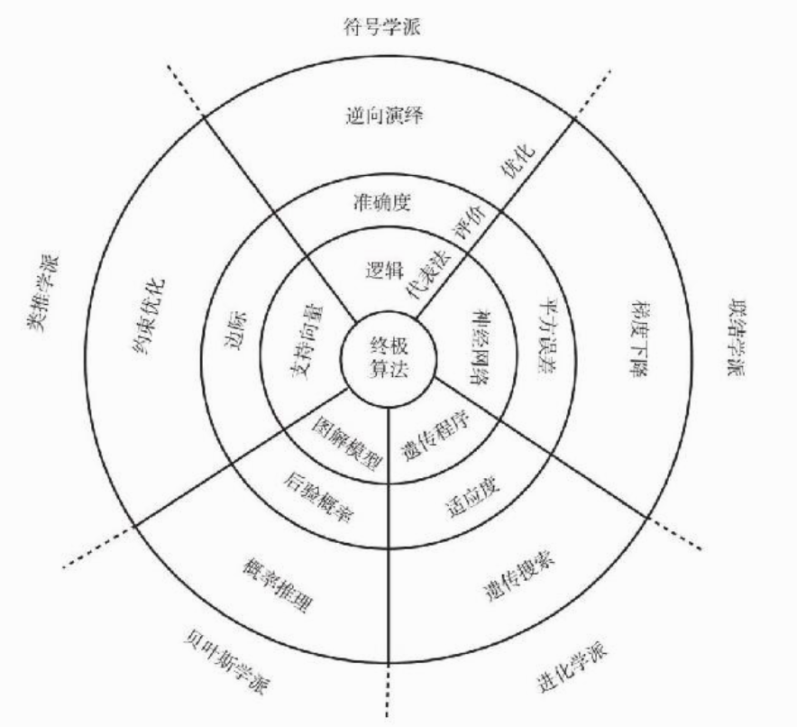
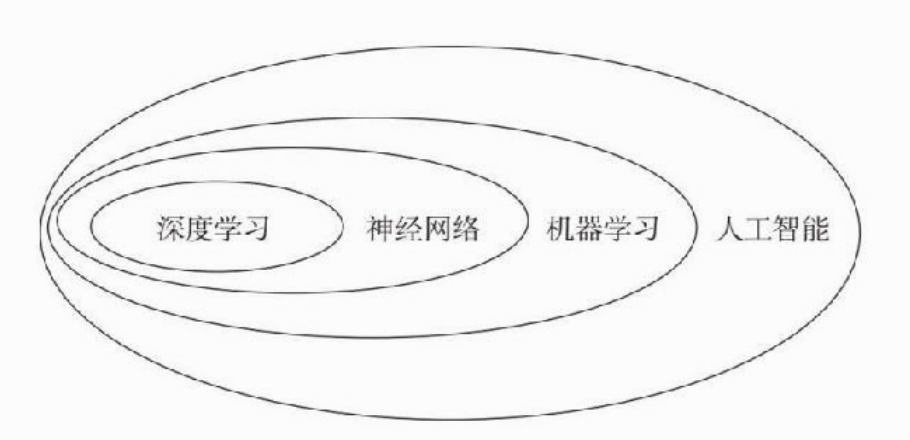

# 0201. 榨取数据 —— 机器能学会的知识

## 00. 导读

在深入探讨机器如何学习暗知识之前，我们先要知道机器也能够自己学习明知识和默知识。在这一章我们介绍机器学习的五大流派的底层逻辑和各自不同的先验模型。虽然现在神经网络如日中天，但其他四大流派也不容忽视。

上一章我们说了人类通过感官和逻辑能掌握明知识和默知识，但人类对暗知识既无法感受也无法理解。现在我们要看看机器能掌握哪些知识，并擅长掌握哪些知识。

## 2.1 机器学习明知识

计算机科学家最早的想法是把自己的明知识，包括能够表达出来的常识和经验放到一个巨大的数据库里，再把常用的判断规则写成计算机程序。这就是在 20 世纪 70 年代兴起并在 20 世纪 80 年代达到高潮的「知识工程」和「专家系统」。

比如一个自动驾驶的「专家系统」就会告诉汽车，「如果红灯亮，就停车，如果转弯时遇到直行，就避让」，依靠事先编好的一条条程序完成自动驾驶。结果你可能想到了，人们无法穷尽所有的路况和场景，这种「专家系统」遇到复杂情况时根本不会处理，因为人没教过。「专家系统」遇到的另一个问题是假设了人类所有的知识都是明知识，完全没有意识到默知识的存在。

一个典型的例子是 20 世纪 80 年代中国的「中医专家系统」。当时计算机专家找到一些知名的老中医，通过访谈记录下他们的「望闻问切」方法和诊断经验，然后编成程序输入到计算机中。在中医眼中每一个病人都是独特的。当他看到一个病人时会根据经验做出一个整体的综合判断。这些经验连老中医自己都说不清道不明，是典型的默知识。所以中医诊断绝不是把舌苔的颜色划分成几种，把脉象分成几十种，然后用查表方式就可以做判断的。「专家系统」既不能给机器输入足够的明知识，更无法把默知识准确地表达出来输入给机器。所以，「专家系统」和「知识工程」在 20 世纪 80 年代之后都偃旗息鼓了。

要想把一个领域内的所有经验和规则全部写出来不仅耗费时间，而且需要集合许多人。即使如此，那些谁也没有经历过的情况还是无法覆盖。电脑的信息处理速度比人脑快得多，那么能不能把大量的各种场景下产生的数据提供给机器，让机器自己去学习呢？这就是现在风行一时的「机器学习」。

今天的机器可以自己学习两大类明知识：用逻辑表达的判断规则和用概率表达的事物间的相关性。

### 2.1.1 符号学派 —— 机器自己摸索出决策逻辑

前面说过，理性主义认为事物间都有因果关系，基于因果关系，通过逻辑论证推理就能得到新知识。在机器学习中这一派被称为符号学派，因为他们认为从逻辑关系中寻找的新知识都可以归结为对符号的演算和操作，就像几何定理的推理一样。这种知识通常可以用一个逻辑决策树来表示。决策树是一个根据事物属性对事物分类的树形结构。

比如冬天医院门诊人满为患，测完体温，主任医生先问「哪里不舒服」，病人说「头疼，咳嗽」，主任医生再听呼吸。感冒、流感、肺炎都可能是这些症状的原因，现在要根据这些症状判断病人到底得了什么病，这种从结果反着找到因果链条的过程就叫「逆向演绎」。

这时候主任医生用的就是一个决策树：体温低于 38.5℃，咳嗽，头痛，可能是普通感冒，回去多喝白开水！体温高于 38.5℃，还剧烈咳嗽呼吸困难，可能是肺炎，咳嗽不厉害就可能是流感。实际情形当然要比这复杂。但原理就是根据观察的症状逐项排除，通过分类找到病因。

这时候门诊新来了实习医生小丽，要在最短时间内学会主任医生的诊断方法。主任医生忙得根本没时间教她，就扔给她一沓过去病人的病历和诊断结果，自己琢磨去！小丽看着几十个病人的各项指标和诊断结果，不知道从哪里下手。这时候刚学了决策树的主治医生小张路过说：我来帮你。咱先随便猜一个主任的判断逻辑，比如先看是否咳嗽，再看是否发烧。把这些病例用这个逻辑推演一遍，如果逻辑的判断结果和主任的诊断结果吻合，咱就算猜中了。如果不吻合，咱就换个逻辑，无非是换些判断准则，比如你可能一开始把体温标准定在了 37.5℃，结果把很多普通感冒给判断成流感了。当你用 39℃ 时，又会把流感判断成普通感冒。几次试验你就找到了 38.5℃ 这个最好的值。最后你找到的逻辑对所有病例的判断都和主任医生的诊断完全吻合。

所以决策树学习就是先找到一个决策树，它对已知数据的分类和已知结果最接近。好的分类模型是每一步都能让下一步的「混杂度」最小。在实际的机器学习中，决策树不是猜出来而是算出来的。通过计算和比较每种分类的混杂度的降低程度，找到每一步都最大限度降低混杂度的过程，就是这个决策树机器学习的过程。所以机器学习决策树的原理是：根据已知结果可以反推出事物间的逻辑关系，再用这些逻辑关系预测新的结果。

在这个例子里的「知识」就是医生的诊断方法，作为明知识被清晰表达为决策逻辑树。而这种计算和比较分类混杂度的方法就是让机器自动学习医生诊断知识的方法。

### 2.1.2 贝叶斯学派 —— 机器从结果推出原因的概率

符号学派认为有因必有果，有果必有因。贝叶斯学派问，因发生果一定发生吗？感冒是发烧的原因之一，但感冒不一定都发烧。贝叶斯学派承认因果，但认为因果之间的联系是不确定的，只是一个概率。

我们的经验中比较熟悉的是当一个原因发生时结果出现的概率，例如你感冒后会发烧的概率，但我们的直觉不太会把握逆概率，即知道结果要求推出原因的概率，也就是要判断发烧是感冒引起的概率。贝叶斯定理就是教我们怎么算这样的概率。

举个例子，某人去医院检查身体时发现艾滋病病毒呈阳性，现在告诉你一个艾滋病人检查结果呈阳性的概率是 99%，也就是只要你是艾滋病人，检查结果基本都是阳性。还告诉你，人群中艾滋病患者大约是 0.3%，但所有人中查出阳性的人有 2%。现在问得艾滋病的概率多大？你的直觉反应可能是，要出大事了！现在我们看看贝叶斯定理怎么说。贝叶斯定理如下：

	P（得艾滋病|检查呈阳性）=P（得艾滋病）×P（检查呈阳性|得艾滋病）/P（检查呈阳性）=99%×0.3%/2%=14.85%。

也就是说即使他检查呈阳性，他得病的概率也不到 15%！这个结果非常违反直觉。原因在哪里呢？在于人群中查呈阳性的概率远大于人群中得艾滋病的概率。这主要是由于检测手段不准确，会「冤枉」很多好人。

所以以后不管谁查出了什么病呈阳性，你要问的第一件事是检查呈阳性和得病的比率有多大，这个比率越大就可以越淡定。所以贝叶斯定理告诉我们的基本道理是：一个结果可能由很多原因造成，要知道一个结果是由哪个原因造成的，一定要先知道这个原因在所有原因中的占比。

一个好的医生知道，要判断病人是否感冒，只看是否发烧这一个症状不够，还要看是否有咳嗽、嗓子痛、流鼻涕、头痛等症状。也就是我们要知道 P（感冒|发烧、咳嗽、嗓子痛、流鼻涕、头痛……）。贝叶斯定理告诉我们计算上面的概率可以通过计算 P（发烧、咳嗽、嗓子痛、头痛……|感冒）获得。

为了简化计算，我们这里假设发烧、咳嗽、嗓子痛、头痛这些症状都是独立的，互相不是原因（很显然这个假设不完全对，很可能嗓子疼是咳嗽引起的），这样 P（发烧、咳嗽、嗓子痛、头痛……|感冒）=P（发烧|感冒）×P（咳嗽|感冒）×P（嗓子痛|感冒）×P（头痛|感冒）×……

这里每一个概率都比较容易得到。这在机器学习里叫作「朴素贝叶斯分类器」。这个分类器广泛应用于垃圾邮件的过滤。我们知道垃圾邮件往往会有「免费、中奖、伟哥、发财」这类词汇，这类词汇就相当于感冒会出现的症状，垃圾邮件就相当于感冒。过滤垃圾邮件变成了判断在出现这些词汇的情况下这封邮件是垃圾邮件的概率，也就是通过统计 P（出现「免费」|垃圾邮件），P（出现「中奖」|垃圾邮件）等的概率，来算出 P（垃圾邮件|出现「免费、中奖、伟哥、发财」……）的概率。

同样的原理还被广泛应用在语音识别上。一个单词有各种各样的发音，语音识别就是听到一个发音判断是某个单词的概率。如果我们把「吃饭」这个词的天南地北男女老少的发音都收集起来，统计出「吃饭」这个词和各种发音的频次，我们听到一个发音「洽碗」时，就可以判断是否在说「吃饭」。为什么说贝叶斯朴素分类器是机器学习呢？因为它是通过采集大量数据统计出每个单词和它们分别对应的发音的频率来判断一个发音是什么单词的。这些数据越多，判断的准确性就越高。

在这个例子里，「知识」是知道当一个结果发生时是哪个原因造成的。这个知识被清晰地表达为一个条件概率。机器通过统计每种原因的占比来算出从结果到原因的概率。

## 2.2 类推学派 —— 机器学习默知识

我们生活中很多经验来自类比。医生一看病人的面部表情和走路姿势就基本能判断出是普通感冒还是流感，因为流感症状比感冒厉害得多。科学上的许多重要发现也是通过类比。当达尔文读到马尔萨斯（Malthus，1766-1834）的《人口论》（Principle of Population）时，被人类社会和自然界的激烈竞争的相似性所触动；玻尔的电子轨道模型直接借鉴了太阳系的模型。

机器学习中用类比方法的这一派叫类推学派，他们的逻辑很简单：第一，两个东西的某些属性相同，它俩就是类似的；第二，如果它们的已知属性相同，那么它们的未知属性也会相同。开好车上班的人可能也会用苹果手机，喜欢看《星球大战》（Star Wars）的人可能也会喜欢看《三体》等。类比的逻辑可以明确表达，但具体的类比常常是默知识。例如老警察一眼就能看出谁是小偷，但不一定说得清楚原因。

在类推学派中最基础的算法叫最近邻法。最近邻法的第一次应用是 1894 年伦敦暴发霍乱，在伦敦的某些城区每 8 个人就会死 1 个，当时的理论是这种疾病是由一种「不良气体」造成的。但这个理论对控制疾病没有用。内科医生约翰·斯诺把伦敦每个霍乱病例都标在地图上，他发现所有的病例都靠近一个公共水泵。最后推断病因是这个水泵的水源污染，当他说服大家不要再用这个水泵的水后，疾病就得到了控制。在这里这些数据的相似点就是和这个水泵的距离。最近邻法还有一个应用就是在网上搜照片，你对高铁上霸座的人很愤慨，你把他的照片上传，网站给你显示出几张和他长得最像的照片，并且有文字，你一看，天哪，还是个在读博士生！同样的道理，很多智能手机都可以自动进行照片分类，把你手机里的人像都自动归类。

在类推学派中，第一件事是要定义「相似度」。相似度可以是身高、收入等连续变量，也可以是买了某一类书的次数的统计变量，也可以是性别这样的离散变量。总之，只有定义了相似度，才能度量一个分类方法是否最优。人可以感受相似度，但无论是人的感官还是大脑都无法量化相似度。人类在做相似度比较时，甚至都不知道自己在比较哪些特征和属性，但机器可以很容易量化这些相似度。所以只要机器抓准了特征和属性，比人的判断还准。

类推算法可以用于跨领域的学习。一个消费品公司的高管到互联网媒体公司不需要从头学起，华尔街雇用很多物理学家来研究交易模型，是因为这些不同领域问题的内在数学结构是类似的。类推算法最重要的是能用类比推导出新知识，就像我们前面提到的达尔文受《人口论》的启发。

虽然机器可以学习明知识和默知识，但它最大的本事是学习暗知识。

## 2.3 机器发现暗知识

暗知识就是那些既无法被人类感受又不能表达出来的知识。也就是说人类本身无法理解和掌握这些知识，但机器却可以。机器有两种方法可以掌握这些知识：模仿人脑和模仿演化。

### 2.3.1 联结学派

联结学派的基本思路就是模仿人脑神经元的工作原理：人类对所有模式的识别和记忆建立在神经元不同的连接组合方式上。或者说一个模式对应着一种神经元的连接组合。联结学派就是目前最火爆的神经网络和深度学习，它在五大学派中占绝对统治地位。目前人工智能的高科技公司中绝大部分是以神经网络为主。第三章我们专门讨论神经网络。

### 2.3.2 进化学派

机器学习中一共有五大学派，最后一个学派是进化学派。他们是激进主义经验派，是彻底的不可知论者。进化学派不仅觉得因果关系是先验模型，甚至觉得类比，神经元连接也都是先入为主的模型。他们认为不管选择什么样的先验模型，都是在上帝面前耍人类的小聪明，世界太复杂，没法找到模型。进化学派的基本思路是模仿自然界的演化：随机的基因变异被环境选择，适者生存。他们的做法就是把一种算法表达成像基因一样的字符串，让不同的算法基因交配，让生出来的儿女算法去处理问题，比爸妈好的留下来配种继续生孙子，比爸妈差的就淘汰。

比如我们要通过进化算法找到最优的垃圾邮件过滤算法。我们先假设凡是垃圾邮件都包含 1 000 个诸如「免费」「中奖」「不转不是中国人」这样的单词或句子。对于每个单词我们可以对邮件施加一些规则，如删除或者怀疑（「怀疑」是进一步看有没有其他垃圾词汇）等。如果规则就这两种，我们可以用一个比特表示：1 删除，0 怀疑。这样要对付有 1 000 个垃圾词的算法就可以表示成 1 000 比特的一个字符串。这个字符串就相当于一个算法的基因。如果我们从一堆随机的 1 000 比特长的字符串开始，测量每个字符串代表的算法的适应度，也即它们过滤垃圾邮件的有效性。把那些表现最好的字符串留下来互相「交配」，产生第二代字符串，继续测试，如此循环，直到一代和下一代的适应度没有进步为止。注意，这里和生物的进化有个本质区别，就是所有的算法都是「长生不老」的。所以老一代里的优秀算法不仅可以和同代的算法竞争，而且可以和儿子、孙子、子子孙孙互相竞争，最后的胜利者不一定都是同一代的算法。

进化算法的问题是「进化」毫无方向感，完全是瞎蒙。在前面的垃圾邮件过滤器例子里，1 000 比特的字符串的所有可能性是 21000，也即 10300，即使用目前世界最快的超级计算机，「进化」到地球爆炸都不可能穷尽所有可能，在有限时间内能探索的空间只是所有可能空间的极少一部分。地球可是用了 40 亿年时间才进化出了现在所有的生物。

图2.1 是美国华盛顿大学佩德罗·多明戈斯（Pedro Domingos）教授总结的一张五大流派「八卦图」。

机器学习中的符号学派、贝叶斯学派、类推学派和联结学派的共同点是根据一些已经发生的事件或结果，建立一个预测模型，反复调整参数使该模型可以拟合已有数据，然后用此模型预测新的事件。不同的是它们各自背后的先验世界模型。符号学派相信事物间都有严密的因果关系，可以用逻辑推导出来；贝叶斯学派认为，因发生，果不一定发生，而是以某个概率发生；类推学派认为，这个世界也许根本没有原因，我们只能观测到结果的相似，如果一只鸟走路像鸭子，叫起来像鸭子，那么它就是只鸭子；联结学派认为，相似只是相关性能被人理解的那层表皮，隐藏的相关性深邃得无法用语言和逻辑表达；最后进化学派认为，什么因果？什么相关？我的世界模型就是没有模型！从零开始，不断试错，问题总能解决！

图2.1 机器学习的五大流派

图片来源：佩德罗·多明戈斯，《终极算法》，中信出版社，2017 年。

现在我们终于可以清理一下满天飞的名词了。我们在媒体上最常听到的是这四个名词：人工智能、机器学习、神经网络、深度学习。这四个词的关系如图 2.2 所示，人工智能是最大的一个圆，圆里面分为两部分：一部分叫人工学习，也就是前面我们讲的专家系统；另一部分叫机器学习，就是机器自己学习。机器学习里面包含神经网络，在神经网络里面还要再分，一个是浅度学习，一个是深度学习。在过去芯片集成度低时，我们只能模仿很少的神经元。现在由于集成度在提高，我们可以模仿很多的神经元，当很多神经元被组成多层的网络时，我们就叫它深度学习。所以人工智能、机器学习、神经网络和深度学习的关系，其实就像一个洋葱一样，一层包裹一层，最外面的是人工智能，往里一点是机器学习，再往里是神经网络，最深层就是深度学习。

所以这四个词有下面的包含关系：人工智能 > 机器学习 > 神经网络 > 深度学习。

图2.2 AI 中四个概念的包含关系

今天我们说到的人工智能，其实就是机器学习里面的神经网络和深度学习。但是在一般的商业讨论中，这四个概念经常是混着用的。