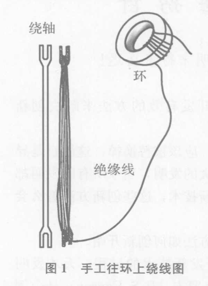
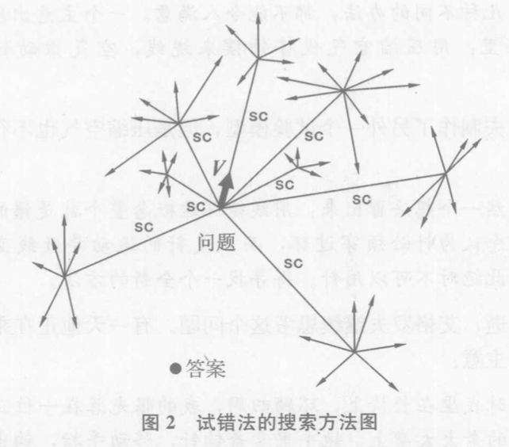

# 0101. 创新技术

Technology of Creativity

个人在黑暗的迷宫中摸索

或许，会找到一些有用的东西或许，会撞得头破血流。

另一个人举着一盞小灯，灯在黑暗中闪烁。

征途中，灯越来越亮，最终变成一盞光芒四射的明灯照耀着万物，一览无余。现在我问你：你的灯在哪里？

—— 门捷列夫

## 1.1 大海捞针

### 1.1.1 

发明家是如何工作的？发明来得多么迟！

创新理论是研究创造性的，目的是开发有效的方法来解决创新问题。

言下之意，现有的创新方法太差劲了，应该被替换掉。这简直是异端邪说！人们用这些陈旧的方法做出了伟大的发明，当今所有的发明都是基于这些方法，每年都产生成千上万的新技术，这些创新方法怎么会是错的呢？

不要匆忙下结论，让我们从考查传统方法如何创新开始。

一般来说，发明家并不想讨论他们开发新技术的过程。天才发明家，《NSE 的秘密》一书的作者 B. S. 艾格罗夫（B. S. Egorov）是个例外，他详细描述了他是如何发明一种绕线装置的。

我们来看看这位发明家的思考过程。

艾格罗夫这样陈述问题：一台大型计算机有几千个细小的环形变压器。每个变压器的中心孔径仅 2 mm，通过这个孔，缠绕比头发丝还要细的线。线的真丝绝缘层容易破碎，因此必须手工绕制。

问题很清楚：如何快速准确地把绝缘细线绕到铁芯上。几年前艾格罗夫成功地解决了一个类似的问题。那个问题是要求电话上的电感线圈实现机械化绕线操作。乍一看，这两个问题很相像：两个问题中都有个环，线必须绕到环上去。只不过在新问题中的小铁环比电话上的电感线圈上的小铁环明显小很多。这一点从根本上改变了问题的性质。

艾格罗夫写道：

我得承认，刚开始这个问题看起来并不复杂，不过，进一步分析后，我的观点改变了：绕线的环直径只有 2 mm，这是非常困难的。

例如，苏联 BESM-2 计算机系统中用的铁磁线圈 K-28 和它尺寸相似：外径 3.1 mm，内径 2.0 mm，壁厚 1.2 mm。BESM-2 的存储装置用的线圈甚至更小。

这些线圈也是用绕轴手工绕线的，绕轴就像一根带线的「针」，线圈和绕轴放大后如图 1 所示。环的截面形状并不重要，可以是正方形、长方形或者圆形。

当然了，如果这个线圈由两个分开的 C 形半圆组成，问题就简单一些。但是，铁磁线圈是通过粉末治金工艺制造出来的：粉末被压缩之后高温烘焙定型任何绕线都不能承受这样的高温高压，因此必须在线圈成型之后才能绕线。

艾格罗夫解释道：绕轴应该多大？绕轴两头的开叉应该多大？我很快明白，在第一个设备上绕线的绕轴不能用在这里，这里的绕轴太小，问题变得复杂。不用绕轴来绕线，能否发现一种全新的绕线概念呢？那会是什么概念？这些问题让我的头脑无法平静下来。

也许，可以用钟摆？我请教过很多朋友，有人提出这样的想法。于是我决定试试用钟摆来解决这个问题。概念很简单，有两个钟摆，线圈位于它们中间。右边的钟摆有一根带线的针，针穿过线圈后，带着线到达左边的钟摆。线圈向上一拉，针带着线从线圈的下面又回到右边的钟摆，如此循环往复。太简单了！没有绕轴也成！

艾格罗夫制作了一个样机模型，但是结果并不令人满意：只有当针到达极限位置时线才能拉紧；线在运动过程中很松弛，造成绕线不均匀。

重新开始，加倍努力！首先我尝试改变钟摆的位置，接着又改变线圈的位置，然后又改变钟摆的摆动。这些都没用，线还是很松。300 多次试验后，我最终得出结论：钟摆不是个好办法。

此时我很清楚，应该寻找一个新概念。但是哪一个呢？我分析了几种不同的办法，都不能令人满意。一个主意出现在我的脑海里：用压缩空气代替钟摆来绕线，空气推动针穿过线圈。

艾格罗夫制作了另外一个试验模型，但是压缩空气也不行，绕线还是松的。

突然一个想法冒出来：用线绕环这概念整个就是错的。这样的概念认为针必须穿过环，而正是针的运动导致线变得松他，因此绝对不可以用针。得寻找一个全新的方法。

时间流逝，艾格罗夫继续思考这个问题。有一天他正在乘火车，突然想到一个主意：

当时我坐在长椅上，环顾四周，我的眼光落在一位正在编织帽子的老太太身上。她手里拿着钩针，移动手指，钩出一个又一个线圈。我盯着她的手，在脑海里重复着她的动作。一个线圈，又一个线圈…钩针不断地移动：不是在老太太的手里，而是在我的机器上。

如果在我的机器上把绕轴和钟摆换成钓针会怎么样？钩针带着线穿过环。弹簧能把线拉紧。我拿出一根针和线，把针变为钩针，尝试着重复老太太一个接一个的手势。简直不能相信，这个简单的钓针，隐藏着绕线机器的秘密！我是不是已经找到了原本看似没有答案的问题的秘密？完全正确！现在线绕得很完美。这正是我搜寻了很久的概念，钩针可以把线紧紧地绕在线圈上。

绕线机器就这样诞生了。

现在，我们能对发明家遵循的创新路径说些什么呢？

首先，寻找答案是随机的，正如心理学家所说的。通过「试错法」终于有个想法冒出来：「如果我们这样做会怎么样？」接着就是对这个想法进行理论和实践的测试。一个不成功的想法，被另一个不成功的想法所代替，然后继续做下去，直到找到成功的答案。

这种方法如图 2 所示。发明家要从「问题」点出发，到达「答案」点，而后者的位置是未知的。发明家沿着某个方向形成一个搜寻概念（图 2 中的 SC），比如「我决定试试钟摆」。对问题的进攻就从这个方向开始，如图 2 的箭头所示：「如果我们这样做会怎样？」后来，发现整个概念明显是错的：「我得出结论，钟摆不是个好办法。」

发明家回到最初的问题，引入一个新的搜寻概念：「一个主意出现在我的脑海里：用压缩空气代替钟摆来绕线。」发明家又开始了一系列新的进攻。

现实中的创新需要的尝试次数，通常比这个图示的例子多得多。艾格罗夫的第一个模型就修改了大约 300 次。使用试错法创新，尝试的次数很多，需要几千次甚至上万次尝试「如果…会怎么样」，才能找到个满意的答案。

试错法还有另一个显著的特征。在图 2 中，一簇箭头指向与答案相反的方向。这并非偶然。通常，最初的尝试并不像表面上看起来那样混乱，发明家从过去的经验出发寻找答案。艾格罗夫发明过电话电感线圈的绕线机器，当他开始解决新问题的时候，他的大脑立刻转向以前的经验：「需要一个绕轴，不过这个绕轴很小，或者一根穿着线的细针也可以。」

几乎所有与针有关的尝试都不成功。如图 2 的惯性向量 V 所示，从问题一开始，V 的初始趋势就背离了答案的方向。当发明家最终放弃用针绕线这个概念后，发明的主要步骤才完成。

本书后面还会更详细地讨论试错法，下面读者可以自己检验一下这种方法。

1 B. S. 艾格罗夫，《NSE 的秘密》，M. 普洛菲兹达特出版者联盟，1961 年。

### 1.1.2 

问题 1

艾格罗夫的发明很好地解决了铁磁线圈绕线的问题，只要环的内径不小于 2 mm。不过，小型电子设备需要的变压器越来越小，线圈也越来越小，跟以前一样，绕线的工作也只能靠手工完成。如何能实现这个过程的自动化？

让我们花点时间，尝试不用任何发明方法论来解决这个问题。问题很清楚。有一个铁磁线圈，比如说内径是 0.5 mm，还有绝缘细线要绕在线圈上。如何实现这个过程的自动化？

线圈圈数依赖于变压器的设计，因此它会改变。环形变压器有几百圈，而计算机的存储器线圈只有两三圈。假设我们需要绕 20 圈线。

我们另外还要考虑两点：首先，这是个实际问题，不能改变问题本身，就是说不能完全去掉铁磁线圈；其次，只要能提高生产率，任何方案都可以，因为计算机的存储器要使用数百万个这样的变压器。

解决这个问题并不需要特殊知识，即使如此，我还是很怀疑，最有经验的发明家只要用试错法就能找到好的解决办法。事实上，我敢肯定，就算读者您有托马斯·爱迪生的天赋，也不能解决这个问题。你知道吗？连爱迪生自己也承认，他完成每个发明平均要花 7 年时间，有三分之一的时间花在寻找方案概念上。

曾经和爱迪生一起工作过的尼古拉·特斯拉（Nicola Tesla）写道：

如果爱迪生要在千草垛里面寻找一根针，他不会浪费任何时间去判断针最可能在什么位置。他会立刻像蜜蜂一样，辛勤地检查每一根稻草，直至找到那根针。他的方法效率很低。他会花费大量的时间和精力，最终还是一无所获，除非他运气好。从一开始他就忙忙碌碌，真是悲哀！因为我们知道，哪怕只用一点点理论知识和少量计算，就能节省至少 30% 的时间。他看不起书本教育，特别是数学知识，而完全相信自己的发明直觉和美国人的常识。

尽管我不相信读者能解决这个变压器的问题，我还是希望你们试试。后面我们会用创新方法论来解决这个问题。然后，你就可以根据自已的经验，把本书描述的算法，与用试错法寻找答案的方法比较一下。

艾格罗夫发明了绕线机器，他是个有天赋的工人，也是个发明家。如果这个问题由一位科学家来解决，会怎么样呢？具备更多的知识能不能提高试错法的效率呢？

前不久，《发明家和创新者》杂志发表了 E. 范丽特尼科夫（E. Veretennikov，技术科学博士）的一篇文章。这是另一个少见的案例，发明家描述了他是如何找到一个新想法的。范丽特尼科夫解决的问题并不复杂，他的高等科学教育也没有让这个案例与众不同。下面是范丽特尼科夫描述的故事。

我们库伊布舍夫工业研究院与库伊布舍夫制造厂合作，后者生产钻井机的螺旋钻头。每个参观过这家工厂组装车间的人，都会问同一个问题：「为什么不用另一种方式组装呢？」

工厂里的景象让人很不舒服。每一根钻柄涂着厚厚的润滑油脂作为黏合剂，油脂使滚珠保持在两个水平面上。如果没有油脂，滚珠会散落一地。两排轴承一放好，就把刀头装在上面。整个过程手工操作，而油脂对人的皮肤有害。除此之外，金属屑会刺伤装配工的手。这项工作很困难，需要很高的技巧。

这种组装很常见，需要将工件定位。各种各样的夹紧装置，锡焊、点焊、胶水和黏性材料，都用来临时定位工件。这种特定的螺旋钻组装工艺，促使我重新考虑如何将滚珠临时定位在钻柄上。

问题看起来是这样的：

组装螺旋钻头，首先要把两排滚珠轴承定位在钴柄表面，每排有 20-30 颗滚珠。很明显手不能抓住所有滚珠，必须找到一种办法，不用油脂也能将滚珠定位在钻柄表面，直到切刀安放在上面。答案必须简单、高效，利于进一步的自动化操作。

我的第一个念头当然是用绳子固定滚珠。立刻，我又想到：「组装完成后怎么去掉绳子呢？」我们可以用薄膜代替绳子，组装后用油来熔化它。这可能是个很好的方案，除了让制造过程变得更复杂这一点。进一步思考之后，我有了更好的方案，可以用其他方式来定位轴承，例如用磁力。

范丽特尼科夫的发明非常出色。只不过这个发明的故事，就像是个坏小说有个好结局。

这个问题很早以前就出现了，当时解决手段也已经存在。遗憾的是，至少到二三十年后发明答案才出现！范丽特尼科夫强调说，到过这个工厂装配车间的每个人，都意识到改进的必要，好像问题在冲着大家喊叫：「请注意我！」解决这个问题非常重要，而且也不那么困难。

但是人们熟视无睹，擦肩而过。

这并非个案。各行各业都需要利用现代科技知识，进行大量的发明创造，但是这些发明从来没有出现过。

让我们看看发明家是如何解决这个问题的。

他的第一个念头：「当然可以用一根绳子。」注意这里强调「当然」。

整个思考过程的出发点，与现存的机制 一一 绳子相关。不可能用金属绳子当接头，他想用普通的绳子。

「绳子」的想法完全制约了发明家的想象力，以至于谁都不想放弃它。下一步还是绳子，这就是「惯性思维」。这次绳子由塑料薄膜制成。分析表明尽管这个概念更加现代，它仍然不是个成功的方案。最后，进步的思考的确得到了正确的方案：必须使用磁力。

这个问题属于这种类型：一旦表述准确，问题就能自动解决。在这里，创造力就是正确表述问题的技能。我们再来一遍：滚珠轴承要定位在钴柄上，并且在切刀头放好之前不能掉下来。换句话说就是，一个金属部件必须临时与另一个金属部件连在一起。

这样陈述问题就足够了，仅有小学六年级水平的人，也有一半能立即解决这个问题：用磁铁。

可以进一步明确这个问题：一个金属部件要与另一个金属部件连在一起，不能用任何其他物质（如油脂），不需要很大的力，只要能补偿部件的自重即可。现在八成的人们能够回答正确。

后面，当我们对发明方法了解更多的时候，就更容易发现解决这个问题的过程中所犯的其他错误。不过至少现在，我们能得出一些结论：

1、发明家的思路从一个已知的概念转移到一个未知的概念。发明家用现有的装置（如金属带）作为原型进行修改，产生了许多不成功的方案。

同样的事情也发生在艾格罗夫身上，「惯性思维」总是误导我们。

2、发明家被迫选择一条完全不同的道路，以便找到正确方案。开始他并不知道这条路，他可以从逻辑上自信地解释他是怎样踏上这条路的：从一个不成功的想法到另一个想法。突然，路到尽头了。没有逻辑的解释，只有毫无意义的自语：「进一步的思考把我引向......」。我们还记得，艾格罗夫不能解释为什么没有早点想出好主意。

3、尽管最终方案很成功，但是发明家的搜寻之路远不是完美的。磁力装配设备早就应该开发出来。这个发明的经济需求，很久以前就出现了，而且那时所需的技术也已经存在。要么是发明家们不想看到这个问题，要么就是他们没有足够认真地对待。发明家们让这个问题停滞不前，这个代价非常高：年复一年又脏又累的手工劳动。

从长期的历史阶段上看，我们发现，发明的出现要受到某些进化规律的制约。比如，蒸汽轮船不能比蒸汽引擎的发明出现得更早，蒸汽引擎不能在经济需求之前出现。不过，创新总是毫无缘由地姗姗来迟：创新的客观条件已经存在，但就是没有创新。

技术进化的逻辑方向，并不意味着发明会自己出现，我们只需守株待兔。产生最有价值的产品 一一 新技术想法的「发明业」，目前仍然使用着传统方法，结果生产率低下，质量也比应该达到的水平差。

有时很难理解为什么不同的发明没有特别早出现。例如，在汽车时代的早期，风扇用来冷却引擎。即使那时每个司机都知道：如果外界环境温度低就不需要冷却引擎；此外过分冷却引擎是有害的，而且耗能也多。但是直到 1951 年才发明了磁力离合器，在外界环境温度低时关闭风扇。「停滞不前」持续了将近半个世纪，我们为此付出沉重的代价：浪费的汽油流成了河。

### 1.1.3 

下面来看看更复杂的问题需要用什么创新技术，我们以望远镜的透镜镜头的发展历史为例。

二次大战之前，列宁格勒的光学仪器商马克苏托夫（D. D. Maksutov）致力于开发教学用的望远镜。他的目标是开发一种简单、便宜、高质量的设备，能够在恶劣的课堂环境中使用。现有的望远镜既复杂又昂贵，需要小心操作，而所有简化望远镜和降低成本的努力，都会导致光学质量的恶化。这两种特征完全不相容，马克苏托夫不能同时把它们结合到一起。

马克苏托夫在他的书《天文光学》中写道：

在撤离列宁格勳期间，我于 1941 年 8 月初发明了透镜望远镜。我离开了列宁格勒，把自己花了半辈子心血准备的校用望远镜生产线留在了那里。我怀疑自己的发明能否成功，仿佛看到了我的「孩子」的悲惨结局。这期间我发现，自己除了思考最感兴趣的这个题目之外无所事事，这对整天忙碌的我来说是很少见的。

我设计的望远镜反射器中，一切都正确吗？不，特别是镀铝的镜子质量下降很快；反射器位于开放的镜筒中，不能在学校的环境中长时间使用。即使护エ只擦一次镜子上的灰尘，它就毁了。能用玻璃罩盖着镜子吗？当然可以，这会保护镜子。用什么材料做玻璃罩呢？普通玻璃便宜，但吸收光线太多。光学玻璃会好很多，但也贵多了。

我如何才能改善这个设计？似乎只有一个答案：在镜筒前面安装一个与镜面平行的保护玻璃窗，这让设计变得更复杂。安装这样一个光学玻璃窗，会显著增加望远镜系统的成本。

发明家思考这个问题好多年了。每次他都要面对这样的现实：普通玻璃不够好，光学玻璃又太贵。有一次乘火车时，马克苏托夫说自己在做白日梦，换句话说，他从自己的「惯性思维」中走出来，审视以前认为不合适的方法。他打开了幻想的翅膀，允许自己想象如下的情形：假设光学玻璃变得非常便宜，就可以用它做反射器的保护窗，来密封望远镜。这会带来什么结果？当然了，首先镜子的寿命会延长。

他继续下去，发现保护玻璃还有另外的好处：

密封的镜筒另有好处：消除了对流的空气。只要在玻璃上钻一个孔，把镜框的连接杆放进去，就可以把对角镜连到玻璃窗上。这样就可以去掉支撑镜子的框架，因为框架会吸收光线，增加额外干扰。

就是在这里，马克苏托夫迈出了发明的第一步。光学玻璃原本有不可避免的缺陷，「但是这没关系，」马克苏托夫说，「我们就用光学玻璃。既然这里必须用玻璃，那么为什么不从中得到其他好处，来作为补偿呢？」

仅仅做这样的陈述已经足够。任何人，即使不是专家，只要了解望远镜的构造，现在都能够找到正确答案。应该在望远镜的入口处放一个平面镜（副镜），这面镜子能把主镜的光线反射到观察者的眼睛。原来支撑副镜的装置吸收了很多光线，现在它能直接连到保护玻璃窗上。

他的思路往前走得更远：为什么不把保护玻璃窗做成透镜的形状，而作成平面盘形呢？这样的话，镀铝的中心区域就可以作为副镜，不仅可以去掉副镜的机械定位装置，而且副镜本身也没了。副镜的功能现在由保护玻璃窗的中心部分实现。

这个设计很好。副镜没有框架，因此偏差也会最小化。但是又出现了另一个担心：这个透镜镜头会导致有害的光学失真吗？可能会，但不是像差，而是同时有正的和反的球面像差。

这里我几乎错过了一个重要发现：透镜可以设计成没有失真的。

请仔细阅读下面几行。发明家克服了两个障碍，第一个障碍是保护玻璃窗只能由昂贵的光学玻璃制成，后来才清楚，玻璃的高成本，可以由它所提供的额外功能补偿，这样就没有必要跳过这个障碍，只要简单地绕过去就行。

现在，发明家碰到了第二个障碍，需要消除透镜造成的失真。现在是使用我们新发现的「补偿」概念的时候了。就让镜头像差留在那儿 一一 它只不过是另一个不可避免的缺陷，我们能够补偿这个缺陷，从中提取有用的东西，而不是去掉它。

这个例子中，试错法的弱点非常明显。起初，方法好像很混乱，其实不然，它有章可循。尝试总是沿着阻力最小的方向进行，毕竟沿着熟悉的方向前进要容易得多。发明家下意识地遵循同样的路径，因此他没有任何机会来发现新东西。跳过障碍只是在重复同样的努力。就像我们刚学到的，其实不必跳过去，只要绕过去就行了。

马克苏托夫继续写道：

我花了几个小时琢磨这些想法，然后我明白了：选择一个引起正向像差的透镜镜头，用它来补偿球面镜或平面镜造成的负向像差。就在此时此刻，我发明了透镜望远镜。

于是第二个障碍同样用补偿的方法克服了。透镜镜头会让光线变形，发明家知道没有必要去对付这种变形。相反，最好能利用这种变形来补偿主反射镜在制造过程中产生的变形。

制造抛物面反射镜既复杂又费力。马克苏托夫的发明让我们可以用易于制造的球面镜取代抛物面镜。最初不可能用球面镜，因为它会造成视觉变形，现在可以用透镜产生的变形来补偿反射镜的变形。光学上不完美的反射镜，和一个不完美的透镜组合在一起，就是一个完美的光学系统！

马克苏托夫写道：

对透镜系统进行理论研究，了解它的优点，这时，我情不自禁地想起了光学工业发展的历史，道路崎岖不平。在反射镜和折射镜提倡者的战斗中，有多少折戟沉沙？不断研究完善制造精确球面的方法浪费了多少精カ？而且又要解决消像差玻璃的问题？制造了多少最终被扔掉的燧石玻璃？还有其他复杂又耗力的玻璃？最后又建了多少昂贵、笨重、不完美的望远镜（以及同样笨重、昂贵的机械装置，和有巨大旋转圆屋顶的建筑物）?

在天文光学发展的初期，如果我们知道了补偿透镜这个简单的概念（它在笛卡儿和牛顿时代就可用了），那么天文光学就会在全新的方向上发展。只需简单地使用一种光学玻璃，就可以开发出消像羞的球面短焦距光学望远镜，而不用考虑它们的属性。[1]

在这个案例中，发明迟到了 250-300 年。这个发明的命运是什么？

在建好望远镜之后，马克苏托夫又决定开发透镜显微镜、双目望远镜，以及其他光学仪器。在光学领域内，马克苏托夫的概念只用于解决与这个问题类似的任务。如果这个问题的领域略有不同，它就没法解决；或者，人们尝试去解决，但会走马克苏托夫的老路：试错法。

这里还有一个这样的发明故事。密切关注其思考过程和答案，两者都惊人地让我们回忆起透镜望远镜的发明。

我突然有一个想法，我认识一个业余潜水员，他戴眼镜好多年了。他在水下戴眼镜时遇到问题，我建议他戴一副有机玻璃面具，照着他的眼镜打磨镜片。这个想法很诱人，尽管不是每个人都能得到这种眼镜。

我突然明白，真正的答案在于水本身。如果面具的平面玻璃做成凸形，水和空气这两种物质的交界面就变成了凹形，会像凹镜一样散射光线。这位潜水员戴的水下眼镜镜片的屈光度（曲率）是 —— 2°-3°，实验表明，这相当于凸面半径为 10-15 cm 的面具。此时我意识到，眼镜和水下视觉毫无关系。水下远距离的物体看起来变形了：大得多，也近得多。如果玻璃的凸面半径是 20-35 cm，那么水造成的放大效应就会消失，水下世界看起来就和它的自然尺寸一样，当然还是近得多。[2]

就像马克苏托夫一样，这个发明家刚开始想把光学镜片附在游泳面具窗上。然后，他推测可以通过把窗口做成凸形，使之变形为透镜，来去掉镜片。不过这个透镜还有其他的功能，它可以消除面具窗上平行玻璃造成的变形。就这样，一个新的技术想法诞生了。

马克苏托夫的发明包含的最重要的想法是：接受以前不可接受的想法，然后补偿它。我敢肯定，在许多还没有解决的问题中，有一些就可以用这种补偿方法来解决，不过补偿法还没有广为人知。透镜望远镜被提到过上百次，但从没有文献说：「这是一个解决不同创新问题的成功方法，它不仅能用于光学行业，也可以应用于其他行业。」

### 1.1.4

迄今为止，我们已经谈了很多单独解决问题的发明家。大型组织有更多可以调配的资源和更有效的创新技术，也许情况会不一样。

航空设计师和运营执行官，欧列格·康斯坦丁诺维奇·安托诺夫（Oleg Konstantinovich Antonov），讲述了下面的故事：

在大型俄罗斯客机 Antey 的设计阶段，在尾翼（飞机尾部，包括垂直尾翼和水平平衡器）的概念上，我们碰到一个非常复杂的问题。简单、高而直的垂直尾翼加上上部的平衡器难于制造，尽管这个想法诱人，而且是由空气动力学实验室推荐的。为了装货，机身被切掉宽 4.4 m、长 17 m 这么一大块，如果尾翼这么高，机身就会像纸袋一样被粉碎和扭曲。

我们不可能分割垂直尾翼，把垂直的圆垫圈装在平衡器的两端，虽然这会大大减少尾翼的致命振动。时间流逝，我们还没有找到可用的尾翼概念。

当代的航空公司有组织地解决共同关心的问题。总设计师在考虑一项目时，通常不是一个人单干，飞机的每个系统都指派给一组有才能的工程师，他们具有本行业任何事情的最新信息。如果某个组一松懈，整个组织的工作节奏就会受到影响。不难想象这句话的成本：“时间流逝，我们还没有找到可用的尾翼概念。

安托诺夫继续写道：

有一次，我半夜睡不着，习惯驱使我开始思考最困扰我的问题。如果水平平衡器的「半个垫圈」由于重量而产生振动，那么「垫圈」应该这样放置，使得其质量负效应变成正效应。因此需要把它们移动到水平平衡器的中心轴前面。

这么简单！

我伸手在床头柜上摸到铅笔和笔记本，在漆黑中画下我新发现的概念。如释重负，我很快就睡着了。

刚开始，安托诺夫就像马克苏托夫一样，想要去掉一个有害因素，但没成功。在马克苏托夫的案例中，有害因素是像差；安托诺夫的有害因素是物体的重量。然而他们的答案概念是一样的：不需要去掉有害因素，只是稍微修改它，让它变得有用。

今天，在一些工程公司里，工程师们可能正在努力去掉一些有害因素。他们不断地碰壁，却没有意识到有扇门已经打开。

现在一点也不难回答本章开始提出的问题，我们需要一个发明的方法论来：

1、让那些停滞、亟待创新方案的问题，立刻受到发明家的关注。

2、高效地解决发明问题。

3、不断应用新发现的方法来解决其他技术问题，把发明家从寻找新方案的辛劳中解脱出来。

1 D. D. 马克苏托夫，《新型反射折射光学透镜系统》，V. XVI，第 124 号刊，L.,1944 年，第 15 页。

2 V. 马斯拉耶夫，《面具-玻璃》，刊于《技术一给少先队员》（苏联），1962 年 7 月刊，第 27 页。

## 1.2 创造性等级

### 1.2.1 

创新是最古老的人类活动。严格地说，我们的祖先变成人的过程，就是从发明最早的工具开始的。从那时起，产生了数百万发明创造。令人吃惊的是，虽然创新的问题越来越复杂，但是解决这些问题的方法却没有任何改进，通常发明家一直用试错法解决问题。

「发明家既没有推理也无远见，甚至没有最起码的耐性。」法国科学家查尔斯·尼科尔（Charles Nicolle）写道，「他既不做调查研究，也不会沿着他那活跃的想象力驰骋。相反，他迫不及待地把自己扔进未知的世界，希望这样就可以征服世界。问题就像隐藏在烟雾中，普通灯光无法穿过烟雾把它照亮，却突然间被闪电照得通明，于是一个新的发明诞生了。这样的活动既没有逻辑也不明智。」[1]

「如果发明活动是一个逻辑和系统过程的结果，那该多好，」美国发明家约翰·拉比诺夫（John Rabinov）说，不幸的是，事实并非如此。发明活动是心理学家称之为「直觉」的产物：灵光乍现，一个隐蔽在人类意识背后的过程。[2]

与尼科尔一样，拉比诺夫也认为发明的过程没有逻辑可言。不过拉比诺夫的观点与尼科尔有所不同，他认为只要专攻问题，最终总能征服它，从而做出一项发明。拉比诺夫描绘了一幅不太乐观但更接近现实的画面。只有不断地钻研问题，并挑选出所有可能的方案，就有可能成功。

还有很多类似的说法，都是些不切实际的胡思乱想。

苏联著名发明家贝贝托（G. Babat）把发明活动比作攀登陡峭的山峰。

你踯躅前行，找到一条羊肠小道。路到尽头，悬崖绝壁，你只好又折回。经历了无数次挫折，你终于到达了最高峰。回首俯望，你才发觉，走过的路混乱而无序。此时你突然注意到，原来有一条阳关大道就在你的身旁。如果早知道有这条路，到达顶峰就会容易得多，也快得多。[3]

贝贝托在这里准确描述了创新过程的本质。混乱无序的探索要付出高昂的代价，你的时间，你的精力。因此并不奇怪人们终于醒悟到，需要开发一种按规则有序探索的过程一就像一张地图，指明通向顶峰的阳关大道。我们需要解决创造性问题的科学：启发法（Heuristics）。

启发法这个词最先出现在希腊数学家亚历山大的著作中，他生活在 3 世纪下半叶。此后很多著名科学家，包括菜布尼兹和笛卡儿，都认为有必要研究创造性思维过程本身。收集到的大量观察结果逐渐证实，存在一些启发法的原则。了解发明过程的信心増加了，然而发明家们直到今天还在继续使用试错法。

为什么 17 个世纪以后，启发法还不能提供有效地解决创新问题的方法呢？从一开始，启发法就确立了广义的目标：找到一些普遍规律，能用在人类活动的所有领域，解决任何创新的难题。古希腊哲学家试图寻找几种「基本元素」来解释各种各样的现象。亚里士多徳教导说，任何物质都是由 5 种元素组成的（火、气、水、土和以太）。于是，人们就用同样的方式提出了创造活动的共同元素。

当然，所有的创新活动的确有一些共性。但如果我们仅限于分析共性元素，就很难超越基本概念。苏联天才科学家恩格曼（Engelmeyer）在这方面成绩斐然。这位科学家用丰富的事实资料，建立了如下的创新过程模型：

第一步：直觉和意愿 => 创建一个想法。

第二步：知识和分析 => 建立概念和计划。

第三步：具体实施 => 发明的工程实施。

一般而言，这个模型没错，每一个创新活动都包括三个步骤：制定个计划（问题陈述）、探索新想法（问题的解决方案）和开发这个想法（工程实施）。但是这个概念太模糊了，对发明家的创新活动没有实际帮助。

事实上，包括恩格曼在内的很多研究人员，并没有把寻找一种真正可用的解决创造性问题的方法论作为一个目标。直到最近，人们还相信当前的「发明业」能满足现有的所有创新需求。只要能最终成功地解决问题，尝试次数的多少无关紧要。「发明业」仍然沿袭祖辈的方法，似乎也能满足世界的需要。这也难怪启发法发展缓慢。

人们从狭隘的专业角度看待创新，这使情况变得更复杂。通常，科技历史学家完全忽略创新过程中的心理作用，而心理学家则不考虑科技进化的客观规律，只对那些著名科学家和发明家的个人创新特质感兴趣。

1926 年，美国心理学家特曼（L. Termen）和考克斯（S. Cox）出版了《300 名天才的早期智力特征研究》。在后来的 25-30 年里，特曼和伊登（M. Eden）研究了 1000 名有天分学生的生活，出版了三卷《天才的遗传研究》。

发明家们不屑于剖析创新的过程。发明家毕竟是少数，很多人陶醉于别人对他出类拔萃光环的奉承。20 世纪初，美国心理学家罗斯曼（Rossman）对很多发明家进行问卷调査，其中一个问题是：「你认为发明能力是天生的，还是可以学到的？」70% 的发明家回答说：「发明是不可能学会的。一个人必须天生就具备成为发明家的能力。」但是，接受调查的人谁也说不清这「天生的能力」是什么。

就在这个调査后不久的 1931 年，罗斯曼出版了《发明家心理学》书。他在书中写道：目前，我们对创新的心理过程还一无所知。我们既不清楚什么样的条件有利于创新，也不清楚发明家个人需要明确具备什么样的素质。

尽管罗斯曼收集了很多有趣的事实，但他还是没有揭示创新的本质。他谦虚的结论也只是描绘了创新过程的大体框架，如下所述：1）识别需求和/或问题。2）分析这些需求和/或问题。3）评估已有的信息。4）归纳出所有可能的方案。5）分析这些方案。6）产生新想法。7）实验和确认新概念。

在凯撒大帝（Julius Caesar）征服高卢人后，他这样把新闻发给罗马：「我到了，我看见了，我征服了。」试想，如果有人根据上述历史，就把军事策略的原则概括为「第一步：到达；第二步：看见；第三步：征服」，那是多么荒谬！罗斯曼的概念与此很类似，只是将创新的基本步骤按照时间的先后罗列起来，也没有按重要性区分不同的步骤。比如，他认为收集信息和构思新想法同等重要。信息可以很容易地从图书馆得到，但人们怎样「产生」一个「健康」而有价值的新想法呢？罗斯曼没有回答这个问题。发明技术仍然是个谜。

1934 年，苏联心理学家 P. 雅各布森（P. Jacobson）出版了他的书《发明家的创造过程》第一卷。通过分析罗斯曼的结论，雅各布森提出了他自己的创新过程新概念，也包括 7 个步骤：

1、知识/创新准备期。

2、寻找需求。

3、任务和/或想法的产生。

4、探索方案。

5、形成创新概念。

6、把概念变成原理图。

7、想法的技术实施和开发。

很容易看出，这个概念有罗斯曼思想的影子。但雅各布森清楚地表达了这样一个想法：有必要揭示技术创新的内在规律，并建立一种科学方法进行创新。他计划在第二卷中阐述这种方法，但遗憾的是他并没有写第二卷，虽然他继续出版其他心理学著作。

20 世纪 30 年代中期，专利图书馆的书架上存放着数百万项专利发明活动变得越来越普遍，人们明显急需一套科学的创新方法论。然而在其后的 20 年里，因为各种各样的原因，并没有「发明技术」的新著作问世。与此同时，过去的模糊而效果不佳的概念作用甚微，而且在科学技术迅猛发展的今天，这些概念更加没用。苏共中央委员会的 24 届全会报道：「把科研成果转换为大规模生产力，是我们最薄弱的环节。」科研成果不是通过创新进入工业界的吗？

[1] 査尔斯·尼科尔，《生物学发明》，巴黎，1932 年，第 5 页。

[2] 约輸·拉宾诺夫，《人们为什么发明》，刊于《发明家与创新者》（苏联）, 1966 年 7 号刊，第 15 页

[3] G. 贝贝托，《通向未知之路》，1962 年，第 581 页

### 1.2.2 

1944 年，美国数学家博亚（D. Poia）解读启发法：「顾名思义，它有一点逻辑的成分，有一些哲学的概念，还有一点心理学，但没有明确定义其研究领域。它经常被泛泛而论，很少详述，实际上现在已经被人遗忘了。」启发法的历史由长期低潮和短期高潮组成。在每一个高潮中，新的希望和术语会丰富启发法。但是不久就能清楚地看到，这些伟大的愿望并没有很快实现。人们发现，在新术语的背后，隐藏的还是陈旧而模糊的思想，于是又一个低潮期开始了。

控制论的出现延迟了启发法的下一个低潮。对变量不断排列组合的方法论，主导了计算机软件技术。这样电脑和人脑之间的类比很流行表面上也令人信服，但实际上它只是强化了创新一定要用试错法的观点。

计算机技术持续发展，直到 20 世纪 50 年代末，人们才明白，即使具备巨型计算机的处理速度，对变量不断排列组合也不能解决创新问题。人们必须重新借助启发法。于是按启发法编程的新想法出现了：不是让计算机排列所有变量，而是根据某种规则预先选择少数变量，这组变量本身应该足以解决问题。

1957 年美国科学家组厄尔（A. Newell）、休（J. Show）和西蒙（G. Simon）发布了名为「通用问题解决法」的启发法程序。这个崭新的术语带有控制论的痕迹，但它的思想很古老，即开发通用的原则来解决创新问题。但这些问题的决定因素很明确，一般只适合证明数学定理。组厄尔尝试用它下象棋，但什么结果也没有，更谈不上解决创新问题了。用这个程序解决问题太难了。

1-3『这里又看到西蒙了，目前个人超级推崇的天才、通才。（2021-09-03）』

后来组厄尔、休和西蒙开发了一套特殊的下棋程序。不过这次他们放弃了传统的启发法搜寻原则，科学家们转向研究棋弈的客观规律。这样，以前成熟的棋弈理论就成为这个程序的核心。

看来他们找到了正确的方向。为了开发启发式的程序，需要以研究领域的客观规律为基础，但是现代启发法没有热忱地接受这个思想。事实上，棋弈的理论早已存在，棋弈规则、总结和指导的书籍也早已存在，而且有大量的研究以前棋局的分析资料。如果这些都不存在，工作将复杂几千倍。首先必须发展出理论，然后根据这个理论开发启发式的程序。这就是当代启发法对发明家而言没有帮助的原因。

[1] D. 博亚，《如何解决问题》，莫斯科，乌奇佩德齐兹（Uchpedgiz）1961 年，第 200 页。

### 1.2.3

罗斯曼和其他研究人员将创新过程分成单独的阶段，没有考虑每个阶段还可以继续分为不同的量化级别。这在创新活动调査中很典型。发明总是作为总体来考虑的，尽管它们实际上代表的是各种截然不同的物体。

我们来比较两个具体的发明：

作者证书第 16584 号：一个开瓶的设备，由柄和爪组成。这项发明的创新在于，可以开启聚乙烯瓶盖。爪做成马蹄形，用内沿紧扣瓶盖。

作者证书第 123209 号：一种放大电磁辐射（紫外线、可见光、红外线以及无线电波）的方法。放大的辐射穿过一种媒介，在辅助辐射或其他方法的帮助下，产生比平衡状态下更集中的原子、其他粒子或其系统。它的工作原理就是将辐射激励到更高的能量等级，从而「放大」电磁辐射。

1『目前看到上面的两个专利，基本思路都是三步走：1）发明的是个什么东西。2）体现了什么功能。3）它的原理是什么。（2021-09-03）』

每一个创新过程都必须遵循同样的步骤：开始、中间和结束。但是，开启塑料瓶塞和研发感应发射器（激光）有数量级上的差异，因此两个发明中新概念的实现机理也明显不同。

我随机询问了 29 个年龄在 12-40 岁的人，在 2-5 min 之内，所有人都能找到一种想法，使开启瓶塞的过程机械化。

下面是这次调查的一个记录，是我和我 12 岁的儿子一起完成的。

作者：我们要构思出一种能开塑料瓶塞的新开瓶器。标准的螺丝刀不够好，开罐头的利刀也不好，我们必须制造一种专门开塑料瓶塞的开瓶器。

儿子：妈妈用厨房的菜刀。

作者：用刀不方便。我们需要一种特殊的开瓶器。

儿子：你可以用剪刀。

作者：为什么剪刀好一些呢？

儿子：刀从一边提起瓶塞，剪刀从两边提起。

作者：我们怎样才能使它更好呢？

儿子：（热情地）我们可以从三边提起瓶塞！（说明，这正是在作者证书第 166584 号中写到的：马蹄形的爪子）

作者：还是需要开发一种特殊的开瓶器。

儿子：能够从三边提起瓶塞的特殊刀片（用手指比划着）把柄装在上面。

为了理解创新过程的技巧，有必要在创新过程的每一个阶段，从多个级别来考虑创造活动。

这就是我们正在做的事情。

表 1 就是创新过程的结构图表。A、B、C、D、E 和 F 代表过程的不同阶段，1、2、3、4 和 5 代表过程的级别。每一阶段可以按照 5 个级别来工作。

后面我们会详细讨论这些级别之间的差异。现在我们定义创新过程的以下特征：

1 级 —— 使用一个已有的物体，不考虑其他物体。

2 级 —— 在几个物体之间选择一个。

3 级 —— 对选出来的物体做部分改变。

4 级 —— 开发一个新物体，或者完全改变选择的物体。

5 级 —— 开发一套全新的复杂系统。

| 级别 | 选择任务（A）| 选择搜寻概念（B）| 收集数据（C） | 寻找想法（D）| 找到想法（E）| 实际实施（F）|
| --- | --- | --- | --- | --- | --- | --- |
| 1 | 使用一个已有的任务 | 使用一个已有的搜寻概念 | 使用已有的数据 | 使用已有的解决方案 | 使用现成的设计 | 按照已有的设计制造 |
| 2 | 在几个任务中选择一个 | 在几个搜寻概念中选择一个 | 从几种来源收集数据 | 从几种想法中选择一个 | 从几个设计中选择一个 | 修改已有的设计然后制造 |
| 3 | 改变初始任务 | 修改适合新任务的搜寻概念 | 修改收集到的适合新任务的数据 | 改变现有的解决方案 | 改变现有设计 | 按照新的设计制造 |
| 4 | 寻找新任务 | 寻找新的搜寻概念 | 收集与新任务相关的数据 | 寻找新解决方案 | 开发新设计 | 用新的方法使用设计 |
| 5 | 寻找新问题 | 寻找新的方法 | 收集与新问题相关的数据 | 寻找新概念（原则） | 开发重新的建设性概念 | 修改实施新概念的所有系统 |

1 级发明

作者证书第 157356 号：高压气体、液态气体或溶解气体的容器保护盖。盖子由塑料制成，有内衬支架来增加强度。这样可以降低成本，节省金属用量。

有一个常见的问题（节省金属用量）。采用一个已有的搜寻概念（用廉价的东西替换金属），最后设计出一个已有的解决方案（塑料盖子）。这个设计太一般：盖子内衬支架，因此不需要研究或调试的过程。

作者证书第 362335 号：抽吸液态金属的虹吸管有一个 U 形管，一个可以透气的陶瓷塞通过管接头连接真空泵，真空泵有一个水平入ロ管。这个装置可以提高抽吸上来的金属纯度，因为虹吸管的制动杆位于容器的沉积物水平面之上。

为防止虹吸管沉入黏稠的沉积物，虹吸管安装了一个制动杆：小任务，小解决方案。[1]

[1] 让我在这里强调一下，我不是说 1 级发明的专利不应该授予证书。对这样低级别专利也有理由进行法律保护。我们在讨论一个不同的主题：从心理学角度讲，这个级别的发明没有什么创造性。

2 级发明

体者证书第 210662 号：一个感应式电磁泵包括泵体、一个感应器和一根导管。这个泵的新颖之处在于，感应器可以沿导管的轴移动。

电磁泵已经存在很长时间了，它由一根管子及上面的环形感应器组成。工作时，管子的一端浸在液态金属中。通常感应器位于液态金属面之上。启动电磁泵，液态金属会被吸到感应器位置的高度。针对这个问题有几种解决方案：

1、在吸管的下端放置一个启动感应器。

2、电磁泵启动前，从上面倒入金属。

3、放低感应器而不是管子。

这里，选择了其中一个答案，可能是最好的一个：启动时放低感应器而不是管子本身。然后提升金属平面到感应器的工作位置。从表 1 可以看出，这是一个 2 级 D 阶段的发明（在几个想法中选择一个）。

3 级发明

体者证书第 163487 号：采用曝光驱动的快门中断光束的方法（例如，制作高速动作图片）。这项发明与众不同的是，在两个玻璃保护片之间的液体中安装一个放电器，在中性条件下玻璃片的表面和光束接。这样快门可以重复使用。

以前快速中断光线的方法是打碎玻璃，快门就是一次性的。改变快门的物理状态，使之具有新的特性，液体快门可以重复使用。这是一个 3 级 D 和 E 阶段的发明。

体者证书第 256956 号：一种去除鱼内脏的方法。这种新方法通过插入一个温度低于 -5℃ 的装置，来冷冻器官，同时又能保鲜。

4 级发明

作者证书第 163559 号：用于现场监控钻土工具状态的方法（例如钻井）。与其他发明不同，该发明使用强烈的气味作为钻孔工具磨损严重的指示器，即将一次性的化学药剂注入钻头。

这是一个 4 级的发明，因为它采用一种控制磨损过程的新方法，而不是修改现有的过程。

体者证书第 187135 号：电机的蒸发式冷却系统。为了去掉电机的分离式冷却系统，新式电机的工作元件与以往不同，工作元件采用多孔的治金粉末制造，治金粉末掺入液态冷却剂操作时，冷却剂蒸发会产生短期、强烈而均匀的制冷作用。

传统的制冷系统从外部产生制冷效果，低效又笨拙。这项发明建议在金属中预先存储制冷剂。

5 级发明

作者证书第 70000 号：制造金属粉末、合金粉末和其他导电物质粉末。这个方法的不同之处在于，用这些材料制造的电极与一个振荡电路相连，这样电火花放电把电极物质打散形成粉末。

这种方法开启了电极放电加工材料的技术之门。

[1] 本书中，作者证书即苏联的专利证书，其他国家的均称专利证书。

### 1.2.4

当然，每个阶段和等级还可以再往下分。但是，等级之间质的区别，比每个等级内的量的区别更重要。

让我用一个类比来解释一下。我们不可能泛泛地研究一种物质，例如水。水有不同的质的级别：冰、液态水和蒸汽。它们的特征和规律各不相同。每个级别内还有区别：4℃ 的水和 99℃ 的水不同，临界温度的蒸汽和临界温度以下的蒸汽也不同。但是，在结构化创新分析的第一步，同一级别内的差别并不起显著作用。

也许读者想了解 1 级发明和 5 级发明之间的关系。

从 1965 年到 1969 年，我研究了 14 类发明，它们分布如下：

| 级别 | 分布比例 |
| --- | --- |
| 1 级 | 32% |
| 2 级 | 45% |
| 3 级 | 19% |
| 4 级 | 小于 4% |
| 5 级 | 小于 0.3% |

因此，79%（1 级和 2 级）的注册专利仅代表一种新的设计。一般而言，每一个工程师都知道如何在 1 级和 2 级上创新，在这些级别的范围内，不需要选择新的任务、新的技术理念，工程师有足够的知识和技能来提供有效的解决方案。而在诸如 5 级的较高级创新，就需要运用新发现。当今的创造发明一般都在 3 级到 5 级的中间子级的范围之内。[1]

[1] 从创新角度，而不是法律角度。

从数量上看，这些还不到所有注册专利的 1/4。但是，正是这些创新给技术带来了质的改变。

D 阶段的不同级别，可以用一般工程师搜寻答案过程中采用试错法的次数来描述：

| 级别 | 试错法的次数 |
| --- | --- |
| 1 级 | 1-10 |
| 2 级 | 10-100|
| 3 级 | 100-1000 |
| 4 级 | 1000-10000 |
| 5 级 | 10000-100000，甚至更多 |

在 5 级发明的高子级上，尝试的次数是无限的，因为找不到潜在答案来解决给定的发明任务。

心理学家可以精确定义 1 级发明和 2 级发明思维过程的机制，因为它们与非创新的思维过程没有什么区别，无非是排列变量，并去掉坏的变量。每去掉一个坏的变量，问题就更加清晰，并可重新表述问题。

在揭示较高级别发明的机制时，传统心理学遇到了挑战。从理论上讲变量的数量很大，但毫无疑问，发明家不可能对每一个变量都进行排列组合。发明家会采取某种方式减少潜在的尝试次数，从 100000 个可能的尝试中，启发性地选择一小部分，比如 100 次尝试。这里，选择的机制具有决定性作用，之后则通常是常规的尝试过程。

启发法（和大部分创造性思维的心理学一样）希望能定义一种机制，将变量从 100000 个降到 100 个。沿此方向的实验和启发法本身一样古老，也一样毫无价值。

基本假设是错误的。没有一种机制能从很大的探索领域（几十万次尝试），转换到一个小而基本的探索领域（100 次尝试）。尽管问题本身可能需要 100000 次试验，但实际上发明家只会尝试 100 次。

这看起来很矛盾，但能解释得通。心理学家只考虑单个人的行为而高级别的问题需要很多人持续努力才能解决。

想象一件宝藏埋在 100000 acre (1 acre = 4046.86 m2) 的地下。历经几代，成百上千的人都在这块地上寻宝，每人挖 200 acre 的范围，有时候地块之间彼此会重叠。逐渐地，哪些地域没必要再挖掘就越来越明显。同时，人们还在继续挖。最后第一千零一个探宝者出现了，他知道哪儿不需要挖，因为他的前辈在此前 50 年的时间里已经挖过了。他另辟蹊径，最终挖出宝藏。这时心理学家出现了：「请告诉我，你怎样能这么几下就找到宝藏？」实际上，答案非常简单，所有「劳而无功」的地方都被其他人在半个世纪里辛辛苦苦地挖过了，新的探索区域就变得很小。

1『所以做工作前，去查相关文献，了解这个领域里前人已经做的工作非常重要。（2021-09-03）』

以此为例，我们来看看发明简易变速器的过程。

变速器是连续变速的传动器。对工业界而言，能够连续调节每分钟转速（r/min）的设备是很重要的。在 20 世纪初，对这种类型变速器的探索就起步了。1945 年，发明家皮罗兹科夫（E.1. Pirozkoy）在巴拉诺夫（G. G. Baranov）博士的指导下，开始解决这个问题。较早的时候，皮罗兹科夫发明过液压变速器（作者证书第 70842 号），这个背景很理想：发明家以前有过相关的工作经验，同时还有科学家的指导。

让我们看看这项工作是如何进行的。以下摘自 1969 年 7 月的《发明家和创新者》：

我们做了认真的调研，分析了国内外大量的文献，详细研究了所有变速器的设计，确认每一种变速器的强项和弱项。这项工作十分艰苦，任务巨大，永无止境。尽管皮罗兹科夫有以前发明成功的经验，但他还是认识到，液压、气压或者电动的变速器，都有一个明显的无法解决的缺陷……很少有变速器专家注意到摩擦型变速器。很多设计都有明显的缺点，例如，「干式」变速器可靠性差，因为一个摩擦面在另一个面上滑动，所以必须把两个接触面紧紧压在一起。在这种情況下，20-30T 的力加在轴和轴承上，很快就把它们毁掉了。

有一点很有趣，我们曾经相信火车的轮子要有齿才有更好的牵引力，否则火车无法移动。对于摩擦型传动器的偏见，可能就是那时候形成的。

......皮罗兹科犬认识到了这一点。如果他能消除这些缺点，或者至少把影响减小到最小，摩擦型变速器将无与伦比。这有可能，因为有个想法既简单又聪明：如果施加在行星齿轮上的力重新分解形成一个闭合的多边形，那么合力为零。在这种情况下，中间体（行星齿轮）将保持平衡，而加在轴和轴承上的压力将得到释放。但是问题是，任何一个变速器的力总在改变位置。这意味着必须找到一种中间体的形状，可以使行星轮保持平衡。这就清楚了，两个截锥体组合成的中间体可以解决这个问题。

这个解决方案来得出人意料。皮罗兹科夫正在出差，远离他每天教学、写报告、做演讲的日常工作。在火车上，一个罕见而愉悦的想法突然闪过，一张新变速器的图纸出现在他眼前。这一切就像爱因斯坦说的，只可意会，不可言传。这是 1952 年，离皮罗兹科夫第一次面对变速器问题，已经过去了艰苦的 7 年。

1-2『又是一个「灵光一现」背后的故事，往往这种灵光一现的前提是之前做了大量的工作，有这些原料才能产生灵光。跟凯库勒发现苯结构式、DNA 双螺旋结果的发现等事件一样。做一张信息数据卡片。（2021-09-03）』—— 已完成

让我们来分析一下这 7 年的工作。

过去的 50 年间，成千上万的人研究过这个完全开放的领域。发明家从经验领域出发，如液压变速器，但探索没有成功。他把研究领域扩展到所有可能的领域，同时收集其他领域的信息。

在构建心理学模型时，实际创新过程的这个重要特性完全消失了如果某位心理学家跟踪研究皮罗兹科夫，他可能只记录皮罗兹科夫的个人探索，而不会考虑其他发明家的探索。同时，通过收集整理领域内其他部分的信息，研究领域的「偏移」得到纠正。如果皮罗兹科夫早 20-30 年研究这个问题，他从其他部分得不到这么多的信息，他的搜寻思路图看起来也许会很不一样。

今天人们对类似情况的评价正好相反。如果一个发明家解决了一个无数前辈解决不了的问题，人们会说他具有超凡的创新能力。人们不会考虑如果没有前辈的努力，解决问题要困难得多：不确定程度增加，试验的次数也增加。尽管这看似荒谬，越多人解决不了的问题，实际上越容易解决。每次不成功的尝试都增加了额外的信息，使人们能更好地理解问题，同时也缩小了探索的区域。

皮罗兹科夫工作的转折点，开始于他对问题进行重新表述。根据他自己的错误信息，以及其他人的错误信息，他没有选择再去改进最为流行的那个原型方向，而是把注意力集中在摩擦型变速器。搜寻领域已经远离了原来的领域，这使得需要 100000 次尝试的领域转变到只需 100 次尝试的小领域。

移动多边形力的想法在纺织业广泛应用。不过，如果开始的时候就把搜寻领域限定在摩擦型变速器上，那么同样的想法很容易被再次发现。

因此，一个合适的策略（我们正在寻找的启发法）应该是找准那个被巫术迷惑的「白雪公主」，想办法唤醒她，还有邻国（行业）里的其他「白雪公主」。现在我们可以看到，一个真正的创新流程图，离启发法指向的流程图相距有多远。

### 1.2.5

让我们退一步看看。

调査表明，一些发明家在解决技术问题之前，并不想了解任何其他的专利信息。他们的主要理由是，专利信息会使他们只寻找一般的解决方案，并使其想象力僵化。

我们来分析一下这个理由。

假如我们需要改进某件具体东西（2 级和 3 级的发明），我们总可以在专利中找到有用的信息。这种情况下，应该在解决问题之前使用专利信息。如果我们需要发明本质上崭新的东西（4 级和 5 级的发明），任务的条件就扩大了，以至于很难找到任何可以用于研究的具体专利信息。

现在让我们看一个具体的例子。

有一种测量河中央深度的方法。一个人游到某点，或者乘船到某点，然后放下一根竿子，或者投下带重物的绳子，就完成了测量。现在要寻找一种新的测量深度的方法，这次是在河岸上测量。这个方法必须简单，设备应该轻巧简便，游人和地质学者都能使用。

本任务的条件决定了不能用从船或筏上测量河的深度的办法来实现这个基本目标。问题出来了：可以应用哪些领域的专利信息？问题的原型也许会在一个与我们搜寻的领域毫不相关的发明里找到。我们可以研究有关水井、蒸汽机、声学以及水电建筑、潜水装备等专利，也许我们还需要其他类别的专利信息，比如浮桥或热水供应系统。

实际上，对应问题的原型在任何类别的专利里都可以找到，特别是对 4 级和 5 级的问题来讲。而现有的专利信息分析系统一般仅限于本专业或者本类别，对需要其他类别专利信息才能解决的高级别发明问题没有任何帮助作用。

### 1.2.6

自古以来，启发法就被认为是普遍适用的。在研究创造性时，心理学家实验不同的猜谜游戏和其他的简单任务，得出结论：创新的机制在任何水平上都是相同的。这就像由折纸船的方法来发展造船技术一样荒谬。

在需要 100000 次尝试的领域和在只需 100 次尝试的领域，使用启发法寻找方案，不可能相同。我们需要两套完全不同的心理学机制。

在迪克森（G. Dickson）的书《系统设计：创新、分析和决策》（米尔出版社，1969 年）里，描述了低级启发式方法。这本书包含一些简单的原则：「牢记心理惯性」、「使用类比方法」、「把自己想象为一件物体（移情法）」，等等。这些方法适用于解决 1 级或者某种程度上的 2 级发明。对于更高级别的发明，这些方法毫无用处，有时甚至是有害的。这一点通过研讨会上解决的问题得到了证实。

如果一个人不知道如何克服思维惯性，「牢记心理惯性」这样的口号对他而言毫无价值。如果有太多可以类比的东西，类比也是徒劳的。

如果技术系统太复杂，移情法只会使事情混淆。

所有的工程师可以学习这个级别的启发法。实际情况是，通过 20 次尝试获得的发明，和采用启发法用 2 次尝试就获得的发明没什么区別。启发法只有在更高级创新活动中才能展示其全部威力，而在低级别的创新中，它并没有什么作用。但是，高级别的启发法并不存在。

这并非偶然。

在进化过程中，人脑适于解决 1 级复杂度的问题，这是自然进化的结果。解决 1 级的问题，人们完全有信心，甚至过度自信。按照科学方法开发的思维机制（包括启发法），对解决 2 级问题有好处。但是对于更高级别的创造性工作，又毫无用处。

自然选择帮助发展并确立了与 1 级创新相关的思维机制。如果一个人天生就有高级别的启发能力，他没有任何优势：事实上只有劣势。

自然没有建立高级别的启发法，因为每个周期需要的时间太长，一个人只能完成一两个 4 级发明，没有足够的时间来累积启发式的经验。

进化有它自己的规律，从不可靠的元素当中发展出可靠的系统。没有一个发明家有能力进行 1000 次尝试。[1] 但是，却有很多需要这么多次尝试的发明。10000 次尝试的区域可以用 1000 个小区域充分覆盖，每个小区域只需 100 次尝试。

所以，启发法应该对高级创新起主要作用，而事实却表明这种方法只在解决少数低级创新问题时有点作用。两项调查结果、发明家们四分之一世纪的个人观察（包括研讨会的结果），以及对调查信息的分析，最后还有我个人的经验，让我绝对相信，高级别的发明并没有采用高级的启发法。相反，人们用解决低级创新的方法来解决高级创新的问题。

发明过程的悲剧就在于，人们在解决高级创新的问题时直在应用仅与解决低级创新有关的方法。

[1] 爱迪生通过大量尝试发现了 4 级问题的解决方案。不过爱迪生不是独自工作，这些尝试是由他的员工和同事组成的庞大组织完成的。

### 1.2.7

从量的角度，不同级别的问题需要不同数量的尝试才能找到解决方案。但为什么一个问题要试 100 次，而另一个问题却要试 1000 倍以上的次数呢？它们之间质的区别是什么？

对一些问题的比较分析，可以回答这个问题。

1 级发明：问题及其答案存在于某个专业领域里（行业的一个具体分支）。

2 级发明：问题及其答案存在于某个行业领域里（如机器制造的问题由同一行业，但不同领域的现有方法解决）。

3 级发明：问题及其答案存在于某个学科领域（如机械问题用机械方法解决）。

4 级发明：问题及其答案存在于问题起源的学科边界之外（如机械问题由化学方法解决）。

5 级发明的较高子级：问题及其答案超出了现代科学的边界（现在首先需要一项新发现，然后根据新的科学数据解决发明问题）。

当出现一个问题时，我们努力的方向先是 1 级，然后 2 级，以此类推。从心理学家的观点看，要在 4 级上开始创新的发明家，是从第一次试验开始的。而实际上，他是从第 n 次实验开始，这个 n 是一个很大的数。

解决 1 级的问题，一个人首先运用日常经验，这正是一个人刚开始不能理解所有级别问题的原因，这和塞克（L. Sekei）实验所显示的结果一样。[1] 由于日常经验和 1 级问题的解决方法之间的差别并不大，因此只需试几次就能把问题搞明白。在实践中解决 1 级问题的「理想」战术碰巧和「现实生活」中的战术一致，在 4 级创新中就不存在这种巧合。

当我们的祖先遇到一头狮子时，问题出现了：「身后是一棵大树，再远一点是座山，附近有个湖。我应该往哪个方向跑呢？」下面是他思考的路线：「跑到湖里去比较容易，但是谁知道呢，也许狮子是个游泳高手。上树怎么样？没有足够时间爬上去，而且经验告诉我，爬树不仅需要时间，还要有人推才行。剩下的就只有山了…赶快跑啊！」

我们每个人每天都在生活中解决这种复杂程度的问题，一代又代，直到今天，我们还在继续解决这类问题。进化使我们发展出这类问题的思考过程机制。

4 级创新问题远比日常生活的情形复杂。回到狮子模型，复杂的创新问题看起来是这样的：「有 500 头野兽，不都是狮子。其中一些有时变成蛇，有时变成麻雀，其余的变成一些不认识的东西。往湖里跑？但是有 100 个湖，每个方向都有很多障碍。除此之外，湖本身的情况也很复杂，有时变得很浅，有时又在流动。同时那些变形的动物也可能变成美洲大鳄鱼，湖对它们来说不成问题。树，就在你的眼前改变高度，变得很矮或者变成巨大的猴面包树。另外，空中还有东西在飞，不是鹰就是八哥。谁也不知道这座山或者其他山的后面是什么。灌木从的后面又是什么呢？这是一种非常困难的情况。但不要着急，我可以在接下来的 5 年里好好分析这种情况。」

现在我们可以非常准确地描述 1 级问题和 4 级问题之间的区别。下面这些具体特征属于 1 级问题即日常生活和实验心理学问题：

1、问题的元素数量少。

2、没有未知元素（很少有那么一两个未知元素）。

3、分析简单 一一 在问题的条件下，需要修改的元素很容易与需要保留不变的元素分开，很容易跟踪元素之间的相互关系。

4、给定解决问题的时间很短。

而 4 级发明问题则不同：

1、它们有大量的元素。

2、有大量未知的元素。

3、很难进行分析（很难分离已知和未知元素），几乎不可能建立个完整的模型来考虑元素之间的所有关系。

4、给定解决问题的时间很长。

在进化过程中，我们的大脑学会了如何为简单问题寻找近似的答案。

不过，人们还没有发展出一种机制，来为复杂问题寻找长期而精确的解决方案。

即使我们准确地知道优秀发明家头脑里的每一个运作，也丝毫不能帮助我们开发与 4 级问题相关的战术。我们可能会发现，发明家解决 4 级问题使用的战术，与解决 1 级问题是一样的。

不可能发现更高级别的启发式方法，因为根本就没有这种方法。我们能够，而且必须开发出这样一套方法。

[1] 赛克，《思维过程心理学》，莫斯科：前进出版社，1965 年，第 355 页

## 1.3 创新的创新方法

1953 年，美国心理学家奥斯本（A. Osborn）试着改进试错法。在用试错法解决问题时，发明家首先想到：如果这样做会怎么样，他对可能出现的结果不进行事前分析，就会不断重复这个过程。有人天生能产生好想法，但不能分析这些想法。相反，有人则善于分析而拙于产生想法。奥斯本决定分开这两个过程，一组只对问题提出想法 一一 不管想法有多荒唐，另一组则只分析想法。

奥斯本把这种方法叫做「头脑风暴」，它并没有消除搜寻的杂乱无章，反而使搜寻更加混乱。我们已经看到，这些尝试在惯性思维上浪费很多时间，它们不仅混乱，而且总会指向错误的方向。因此，回到最初的混乱搜寻，反而倒是一种进步。

头脑风暴的主要规则并不复杂。

1、产生想法的团队由不同领域的人组成。

2、在一分钟内，每个人都能表达任何想法，包括错误、笑话和幻想，不需要提供任何证据。所有的想法都被记录下来。

3、在产生想法的过程中不允许任何形式的批评，不仅包括口头批评，也包括沉默不语，以及怀疑的微笑。团队成员要在「风暴」过程中维持自由、友好的关系。最好能做到一个成员提出想法，其他人扩展这个想法。

4、在分析想法的过程中，即使那些看起来错误的或者没有意义的想法，也应该认真分析。

通常产生想法的团队由 6-9 人组成，头脑风暴过程大约 20min。图 3 显示 3 人（A、B 和 C）组成的头脑风暴讨论会，每人有不同的专长（用三个圆圈表示），因此他们不会像通常那样锁定在惯性思维上。同时，头脑风暴的原则也会刺激更多的想法，甚至是异想天开。团队成员挣脱了自己专长的狭隘领域，能到达创新方案所在地。

图 3 头脑风暴法改善了试错法

图中另外有一个重要的头脑风暴机制：想法的互动和扩展。成员 A 表达了一个想法 1（箭头 1）；成员 C 立即对它作修改，产生了想法 2（箭头 2）；现在成员 A 对他原来想法的认识不一样了，这个想法继续扩展（箭头 3）…...这就形成了一个想法链（1 → 2 → 3 → 4），并指向 2 级发明的答案（解决方案 2）。有时想法继续扩展（5 → 6），也会指向答案的相反方向。

在约翰·迪克森的书《系统设计：发明、分析和决策》中，记录了几个头脑风暴会议。这里摘录其中一个记录，如何分离青番茄和红番茄。

汤姆：我们可以用颜色来筛选，需要一个色彩传感器。

埃德：辐射或者反光特征。青番茄的反光能力更强。

戴维：硬度。我们摁一个番茄 一一 轻轻地碰它。

迪克：导电性。

汤姆：电阻……

戴维：磁性。

迪克：尺寸，青番茄是不是会小一些？

埃徳：重量。红番茄更重一点。

汤姆：尺寸和重量是互相依赖的。

戴维：尺寸和重量能得出密度。

埃徳：比重。红番茄水分多，因此它的比重更接近于水。

戴维：它们会浮起来还是沉下去？

迪克：如果它们能浮起来或者沉下去，也许可以用密度来筛选。

埃德：不一定在水里…可以用其他类型的液体！

我们知道有几种不同类型的头脑风暴。

1、反向头脑风暴：找出机器或技术过程中隐藏的缺陷，这可能导致新的创新任务。

2、个人头脑风暴。

3、关联头脑风暴。

4、两阶段头脑风暴：两个阶段，半小时对问题自由讨论，半小时提出想法。

5、顺序头脑风暴：首先讨论头脑风暴如何表述问题，接着讨论解决方案，然后把每个想法发展成为设计，最后讨论头脑风暴如何生产制造。

过去几年里，人们把头脑风暴的概念用于解决各种项目、设备设计以及不同类型现场测试中的问题。它的成功，不是因为头脑风暴法的任何优点，而是因为传统试错法固有的缺点。如果温度原来是 -100℃，当它升到 50℃ 就感觉像是春暖花开了。

头脑风暴搜寻法的荒谬被它的量化因素补偿了：一个庞大的团队合作解决问题。表面看来头脑风暴非常有效，因为一天之内就解决了问题。不过很难衡量其真正的收益：五十个人花一天，就等于一个人花五十天。加上前期准备的时间，头脑风暴过程常常需要几百人天。头脑风暴如果有任何收益，那就是能减少沿着惯性思维方向的无效尝试次数。

头脑风暴过程在形成新的营销方式时产生了积极的效果，但它在处理那些只能在更高创新级别上解决的复杂问题时，没有什么显著成果这就是头脑风暴过程无法逾越的天花板：2 级发明。

[1] 其他例子请参考吉尔蒂 (V.Gidy）和舒塔克（K. Shtarky）发表在《发明家和创新者》杂志上的文章《需要想法》，1971 年第 5-6 号刊。

有两种方式可以改进头脑风暴过程：让它更专业（我们后面会讨论这个话题）和提高过程本身的效率。「创新方法公共实验室」研究了第二个方向，这个实验室隶属于全苏发明家和创新者中央委员会，他们用已知答案的问题来做研究。在这类结构化的试验中，试验者把自己置于试验的迷宫之上，他可以在迷宫中沿任何方向走动，因此能清楚看到不同的步骤是把我们引向答案，还是引向其他方向。

他们发现了头脑风暴的概念性缺陷。头脑风暴不控制思维过程，这是它的主要缺陷。头脑风暴确实帮助我们克服了惯性思维：思维获得了速度，从一个死角开始移动，但是经常会错过该停下来的点。实验中多次发现，一个成员提出了一个指向正确方向的想法，另一个人接过这个想法继续拓展，照此继续肯定能找到正确的方案。离最后一段路只有几步之遥了，此时有人提出一个全新的想法，想法链就此中断，团队又回到了出发点。

头脑风暴禁止任何批评，但还是避免不了潜在的批评，比如用一个新想法抑制对前一个想法的扩展。

我们组织头脑风暴时禁止潜在的批评，禁止中断想法链的扩展，每个想法都必须发展成一个逻辑结论：

如果我们把船分成两部分怎么样？…我建议把它分成很多个部分艘船由模块组成，或者小颗粒……用粉末…...船由单个分子组成…颗粒云…由单个原子组成？

这个结构已经不再是「头脑风暴」而是「智力闪电」了，它提高了头脑风暴的有效性，但是需要的时间也加长了，会议要持续好几天。

在「智力闪电」中，控制思维过程成为可能，但也不会有很大的区别：与通常一样，搜寻还是简单地把变量排列组合。

### 1.3.1 

有的发明家可能有一个非常诱人的想法：有没有可能为每个问题找到所有可能的变量列表？有了这个列表，就不会错过任何可能性。

编排所有变量的完整列表需要一种特殊的方法。这个方法（或者个类似的方法）叫做「形态学分析」，由著名的美国天文学家兹韦科奇（F. Vikki）于 1942 年创立。

天文学家创建一个创新思维过程的方法论，这听起来很奇怪。事实上，这相当符合逻辑。所有科学体系中，天文学是其中最早面临大型动态系统的：群星和星系，也最早感到需要一些方法来分析这些系统。在 20 世纪初，荷兰天文学家赫茨普龙（Ejnar Hertzsprung）和美国天文物理学家罗素（Henry Norris Russell）开发了「光谱亮度」图。这张图中，一个轴是星星的光谱分类，另一个轴则是它们的亮度。人们发现，星星的每个光谱类对应着确定的亮度。这样，把无穷无尽的星星沿着这条线（主序）排列，它们立即有序可循了。而且，我们对于星星发展的理解，也变得更加有序了：随着星星的年龄增长，其光谱发生变化，它在图中的位置只能沿着主序线移动。

光谱-亮度图（或称赫茨普龙-罗素图）对天文思考产生了巨大的影响（就像德米特里·门捷列夫的化学元素周期表对于化学家的思维产生了巨大影响一样）。在后来几年里，天文学家不断改进这张图，又发现了巨型星和白矮星的光谱线，两三米长的新光谱亮度图很快就做出来了。

1939 年，兹韦科奇分析了这张图的空白区域，得出一个重要发现：他从理论上证明了中子星的存在。3 年后，他得到了一份火箭设计工作，他用上了这个多维图表的方法，称它为形态学。

这种方法的本质，就是建立一个多维表（形态盒），它的参数轴是给定物体组合的主要特征。假如我们要优化潜水员动力背包的设计，可以这样开始搜寻：「如果这样做会怎么样？」例如：「如果我们用电动机和电池会怎么样？」或者，「如果我们用涡轮压缩空气作为能量会怎么样？」或者，「如果我们使用的压缩空气，不来自于涡轮，而是来自于鱼尾形的鳍，会怎么样？」

在排列我们的想法之前，使用形态学方法需要建立一个多维表。例如，把可用的能量（电的、机械的、化学的，等等）作为一个参数轴，运动引擎（电动机、涡轮、不同类型的火箭引擎）作为第二个参数轴，第三个参数轴是可用的推进元素类型（螺旋桨、鳍、火箭，等等）。这个盒子几乎覆盖了所有的组合。

当然，如果有更多更长的参数轴，这个盒子会更加完整。这样，仅仅对于一种火箭引擎，按照兹韦科奇的盒子，就有 11 个参数轴和 36864 种组合！

严格说来，这是形态学的主要弱点。在解决中级难度的发明问题时，可能有几百、几千，甚至上百万种排列组合。

这种方法还有其他缺陷。在构造盒子时，我们无法肯定是否考虑到了所有的参数轴，以及沿着这些轴的所有类别。对参数轴和类别的直觉搜寻代替了对变量的直觉搜寻。这是个进步，因为我们不再排列小变量（因此它们也容易错过），而是排列大元素（参数轴和轴上的类別）。但我们还是会丢掉一些东西，只要我们漏掉一个轴，就会自动损失一大组的变量排列组合。用参数轴和变量来排列组合，即使最细微的情况也会立刻呈现在眼前，与此同时，最有趣的还是隐藏在心理障碍背后的东西。不过，与传统的变量排列过程相比，形态学已经是很大的进步了。

这种方法在解决一般设计问题时最有效，像设计新机器，或者寻找新的概念性方案。例如，设计新的雪上汽车我们可以用表 2 的参数轴和轴上的参数类别，来建立一个形态盒。

表 2 设计雪上汽车的形态盒

| 参数轴 | 参数类别 |
| --- | --- |
| 1. 驱动部件 | 内燃机，汽轮机，电动机，涡轮喷气机，帆（对于雪上汽车还有意义） |
| 2. 推动部件 | 单轮（驾驶员室在轮子里），传统轮子，加肋轮子，椭圆轮子，方形轮子，带汽缸的气动，履带雪上螺旋桨，滑雪橇，振动雪橇，空气螺旋桨，气垫，能行走的引擎（腿），螺旋形的引擎，弹簧片，脉冲式摩擦引擎，雪上喷气引，旋转板，至少还有 15 种以上其他引擎 |
| 3. 车体支撑 | 在引擎上，直接在雪上 |
| 4. 车体类型 | 开放式，封闭式的一个舱体，双体车，两个舱，串联式 |
| 5. 悬梁装置 | 引擎，特殊的吸振器，无悬梁装置 |
| 6. 雪上汽车的控制 | 改变引擎位置，改变推进部件位置，雪舵，空气舵 |
| 7. 提供向后运动 | 反转引擎，反转推进元素，不能反转 |
| 8. 刹车 | 主引擎刹车，辅助引擎刹车，空气刹车，雪刹车 |
| 9. 防止冻结到地面 | 机械的，机械的但需要引擎帮助，电力的，化学的，热的，不能防止 |

我们离覆盖所有可能的轴和类别还差得远呢，现在这个盒子里已经有超过一百万种组合了。我们得承认，形态学方法作为ー种辅助方法，还是有效的。

[1] 如果需要不同的参数轴，请参考利普曼（G. Lipman）和屠格涅夫（G. Turgenev）的《雪上汽车》，莫斯科：知识出版社，1967 年。
 
### 1.3.2

为了更好地管理变量的排列组合，我们可以列一个问题清单或者建议清单，叫做「先导问题」。20 世纪早期，许多作者发表了不同的清单。

在美国，奥斯本开发出来的问题清单最通用。其中有九组问题，例如：「技术系统中可以减少什么？」或者，「技术系统中，有什么可以颠倒过来？」每组问题还有子问题，例如：「我们能减少什么？」这个问题包括子问题：「可不可以浓缩、压缩、稀释，或者微缩、缩短、变窄、分开、分割？」

英国发明家埃拉奥蒂（T. Alorti）的问题清单最有用 [1]，其中一些条目如下所示：

1、能否从生物学、经济学和其他领域做一些异想天开的类比？

2、能否建立变量依赖关系、可能的相互关系和逻辑巧合关系？

3、能否从对这件事一无所知的人那里得到一些看法？

4、能否假想自己就在这种机制里面？

从本质上说，清单中的每个问题都是一个或一系列尝试。当然，清单订立者根据自己的创新经验，在问题清单中选出感受相对强烈的问题。不过，他们并没有研究发明过程的内在机制，就做出了这些选择。

因此，这些清单指出了做什么，却没有指出如何做。例如，如果有很多变量，我们如何设立这些变量，或追踪它们之间可能的相互作用？或者，如何虚拟地进入到机器里面寻找问题的答案，把这一虚拟过程与实际解决问题的过程进行类比？

先导问题法帮助我们在一定程度上减少了心理惯性，但是也就这么大用处了。

[1]《发明家和创新者》，1970 年第 5 号刊。

### 1.3.3

为了改进头脑风暴法，不难看到有下述两种可能。

1、开发的不是一种方法，而是一套不同的方法。

2、这样组织这个过程：使用这套方法的是一组经过特别训练的人，他们在解决问题的过程中，慢慢积累使用这种方法的经验。

基于这个假设，美国研究人员戈登（William Gordon）开发了「综摄法」，并于 1960 年建立了创新公司：综摄公司。

综摄法在希腊文中的意思是不同元素的组合。综摄公司简介上这样定义：「综摄公司里面的团队由来自不同专业的人组成，目的是通过不设限的想象力培训，并组合非兼容的元素，尝试创造性地解决问题。」

综摄公司基于团队的形式来组织头脑风暴。这些团队积累了经验和方法，比临时组合或召集的团队更加有效率。在综摄公司，团队包括了不同领域的专家。培训这些团队的费用，从 20000-200000 美元不等。他们的客户包括通用汽车（GM）、美国国际商用机器公司（IBM）、通用电气（GE）和其他大公司。

解决问题时，综摄团队首先原封不动地接受问题，然后细化问题把它变成所有人都能理解的结构，此时解决问题的过程才真正开始。这个过程的基础是把不熟悉的问题转换成熟悉的问题，然后再回到原来不熟悉的问题。也就是说，综摄法试图系统地从一个新角度看待问题，借此消除心理惯性。为此，综摄法有以下四种类比方式。

1、直接类比（DA）：把给定的主题或多或少与自然界存在的，或者另一个技术领域的类似主题相比较。例如，为了改进油漆家具的过程，直接类比法包括分析岩石、花草和飞禽如何自然地获得颜料，或者彩纸是如何上色的，或者彩电的彩色图像是如何产生的。

2、拟人类比（PA）：也叫做移情法，这里，解决问题的人「变成」了这个系统，想象一下它的感情和感觉。还用上面的例子，可以想象自已是一只白乌鸦，想改变颜色。

3、象征类比（SA）：通用化和抽象化类比，例如轮子的摩擦表面的特性，就是对摩擦轮自身粗糙程度的象征类比。

4、虚拟类比（IA）：把一些假想的小生命引入到问题中，这些小生命能在问题要求的条件下做任何事情。或者说是引入魔力，如看不见的帽子或者会飞的鞋子。

为了改进寻找解决方案的战术，应该记录综摄会议的过程，并进行分析。

综摄法是存在于苏联之外最强大的创新方法。不过这套方法也有局限性，它没有研究技术系统进化的客观规律，它最多只能用在解决 2 级和 3 级的较低子级的问题上。

2『综摄法，做一张术语卡片。（2021-09-07）』—— 已完成

### 1.3.4

提高解决高级创新问题的效率，需要启发式的程序，用目标导向（朝向答案领域）的行动代替简单的变量组合。换句话说，启发式算法能把需要尝试 10 万次的 4 级问题，转变成只要尝试 10 次的 1 级问题。

这个算法不能靠一个发明家，或者一组发明家的经验而开发出来。为了开发可用的启发式算法，需要：

1、定义技术系统发展的客观规律。

2、分析大量的专利信息数据。

3、开发一个解决问题过程的程序，其中每个步骤「有机地」从前步演化而来。

4、在实践应用中不断选择和完善这个程序。

我从 1946 年开始这个工作。我不能说那时我就想开发一种通用的创新方法论，最初的目标要简单得多：找到一些能帮助我个人创新实践的原理。不过在 1946 年，创新变成了次要的事情，显然「创新方法」是最有趣和最重要的问题。普通的创新变成了我的「试验兔子」，用来测试创新算法。

在本书后面的几章里，我们将更详细地学习这个创新方法论的主要方面，以及解决发明性问题的算法。现在我想提醒大家，算法的方法论是把创新的过程当成有序的活动，来更准确地定义和解决技术矛盾。这个思维过程直接指向理想方法，或者理想设备。在寻找解决方案的过程中，所有阶段都用到了这种系统的方法。这个算法还包括消除心理障碍的具体步骤。另外，它还有一个信息系统，由消除技术矛盾的典型原理所构成。

为了开发实际可用的解决发明性问题的方法论，作者推荐的每个章节都需要读者在实践中检验。

关于这个主题的第一篇基础性文章，发表在 1956 年的《心理学题》上，这是一本远离技术领域的杂志，这篇文章也没有引起发明家的注意。直到 1959 年，《共青团真理报》（苏联共青团组织的一本刊物）发表了这个方法论产生的实际效果，这个状况才得以改变。此后，这个方法论的基本概念发表在《发明家和创新者》[1] 杂志上。在接下来的一年里，这本杂志一直在连篇累牍地讨论这个主题。

在这些讨论中，多数参与者都表示相信：这种方法论将成为千万个发明家和技术厂商手中的强大武器。苏联政府的发明和发现专家委员会（The Expert Committee on Inventing and Discovery）批准了这个方法论。

在总结讨论结果时，出版方写道：

今天是科学技术大カ发展的时代，创新是几百万苏联人民都关心的事情。寻找发明性创新的秘密，即开发有用的原则和作方法来改进技术，越来越成为一项生死关的任务。

从 1961 年到 1965 年，我们发表了一系列文章，来帮助发明家使用这个方法论来解决技术问题，同时继续研究从这些发明家们那里得到的经验，从而对这个方法论进行验证和完善。我们在苏联 180 个城市里做了两次创新者的调査，在莫斯科（Moscow）、巴库（Baku）、斯维尔德洛夫斯克（Sverdlovsk）、诺沃西比尔斯克（Novosibirsk）、杜布纳（Dubna）和其他城市举行了创新理论和实践的学术研讨会。在创新方法论的帮助下完成的发明超过了 3000 件。

1968 年，全苏发明家协会（All-union Organization of Inventors  and Innovators, VOIR）的中央委员会，成立了技术创新方法论部门年之后，建立了创新法的社区实验室。这个实验室由许多热心人土共同努力促成，它开发和出版了程序、课本、问题清单和研讨会材料，对教师有组织的培训也开始了。现在，在社区的和公共的创新机构、培养年轻发明家的学校、技术创新大学里，都在传播这个理论及其实践应用。

1971 年，巴库成立了一个技术创新的公共研究所。这个研究所为发明家们培养在不同的技术领域里解决复杂技术问题的能力，其主要课程就是解决发明性问题的算法方法论。首先解决课程中的练习问题，然后再解决现实生活中的问题，通过这种实践来培养应用这种启发式算法的能力。

[1] 阿奇舒勒和夏皮洛的文章《驱逐六翼天使》发表在《发明家和创新者》杂志上，1959 年第 10 号刊。

## 1.4 通过知识而不是数量

跟任何进化一样，技术的进化必须符合辩证法的规律，因此，通用创新理论的基础是辩证法逻辑 —— 在解决技术问题的创新活动中使用辩证法逻辑。但是，逻辑本身还不足以发展出一套可用的方法论，还需要考虑发明家所使用的工具的特性，这个工具就是人的大脑，独一无二。如果创新工作组织得当的话，人类思维活动中更为卓越的因素，如直觉和想象等，会得到充分的发挥。不过，也要考虑到思维过程较为薄弱的方面，比如惯性思维。

最后，任何一个创新理论都应该从经验和实践中收集大量素材，正如有经验的发明家会慢慢发展出适合他自己的解决问题的方法一样。通常这些方法的数量有限，而且只与创新过程的某个阶段有关。但是本书的创新方法论是通过严格筛选最有价值的原则，然后归纳总结出来的。

可以理解，做出一项重要而伟大的发明（在我们的分类中，属于 5 级中较高子级的发明），需要适逢恰当的历史时期，需要适于创新的条件，更需要像说服力、勤劳、勇气以及博学这样卓越的个人能力。创新方法论，不是一个可以自学成才的课程，也不是自己捣鼓就能发明创造的处方，它的目标是科学地组织创新过程。我们在前面的例子里就清楚看到，这种组织有多重要。不过，我想再举一个经常出现在《发明家和创新者》杂志里的例子。

我正为一项发明头大呢，我竭力想弄明白，如何才能实现救生设备放到水中的过程自动化，但什么也没想出来。

有一天，我坐在火车上，无书可看，就想着我的救生设备。这时一个年轻漂亮的女士走过来。「请坐」，我边说边给她让座。她犹豫了一下，谢绝了我，说：「我马上要下车。」

我看着她离开。突然我注意到火车门关闭的方式，这同样的关门方式我见过多少次？现在，我第一次真正注意到：带有活塞的气缸。它太适合我的发明了。

后来我拿到了救生设备的作者证书。

这个故事是为了强调「任何事情都可能发生」的传统理念。现在，请仔细注意，探索答案的过程组织得有多差。像小船一样的救生设备，需要从轮船上放到水里。一般说来，带活塞的气缸是一个属于 1 级发明的简单方案。而且还需要这么多巧合（火车、陌生人、向门一瞥）都碰到一起，才得出这个简单的方案。

有一次评审专利描述时，我被一项名为「潜水靴」的发明惊呆了 [1]。我知道发明姗姗来迟难以避免，但还是难以相信这个例子是如此显而易见。

[1] 第 132499 号专利证书，《发明家与商标》杂志，1960 年第 19 号刊。

发明家写道：

世界上已经有很多潜水靴，通常它们都设计成一种尺寸。因此，对一位潜水员来说可能太大，而对另一位潜水员来说可能又太小。这款新设计克服了这个缺点，它在一个长槽上安装了可以移动的鞋头。螺钉穿过这个槽，把鞋头固定在适合潜水员脚的位置上。

至少在 100 年内，铅制的潜水靴都是一个尺码。在这 100 年内，潜水靴对有些人太大了，对另一些人又太小。100 年里，人们都穿着不舒服的靴子工作，没有人设计出鞋头可调的靴子。

这个发明非常简单，它根本不需要问这样的问题：「如何解决这个题呢？」小学生都能解决它。真是难以理解，为什么这个问题在七八十年前没有得到解决。

人们当然会说，潜水靴是无关紧要的东西。显然，首先，潜水靴并非无关紧要，其次，很多更重要的发明也都姗姗来迟，而且有些是非常迟。在望远镜发明之前 300 年，人们就知道镜片和玻璃了。在这 300 年里，没有人想到通过镜片前的另一个镜片来看东西。也许没有望远镜的需求，但自古以来的军事领袖都需要军事望远镜，可是第一部军事望远镜在 300 年后才发明出来。

为什么？

人们通常认为镜头会扭曲图像。按照「常识」，两个依次放置的镜头会产生两倍的扭曲。这个「心理障碍」妨碍了人们开发望远镜达 300 年之久。不过很难说有哪个发明，比望远镜对人类认识世界具有更伟大和革命性的影响：望远镜向人类展示了遥远的星空，并且把人文信息传送到无穷宇宙；望远镜动摇了宗教的基础，改变了我们生活在一个有限空间里的理念；望远镜的使用极大地促进了科学的发展。很难想象，如果望远镜「及时」出现的话，人类文明还会再进步多少。

下面这段话出自爱因斯坦：

在科学技术发展的历史中，并没有出现多少独立思考和创造性想象的火花。人类需要某种外界刺激让有需求的想法成熟，然后变成现实。在一个想法诞生之前，人类不得不面临与环境的正面冲突。

不幸的是，当代创新实践无可驳地证实了这个苦涩的说法。我们来看看作者证书第 162593 号，关于一个独立的水下电筒。深海潜水员为了避免不由自主地浮上水面，身上必须捆上沉重的铅块。这个发明中的新想法是，用电筒的电池来替换那些铅块。这是一个非常简单而聪明的想法。以前开发电筒时，每一克重量都精打细算，以减少不必要的额外重量，却没有人注意到潜水服本身固有的与功能无关的重量。

利用被动重量，在航空业早已是个人人皆知的原则。早在 20 世纪 40 年代，著名的苏联飞机设计师和制造商伊刘欣（Iliushin），就制造了用屏蔽板承担额外结构功能的飞机，比如充当机肋、机架，等等。

绝大多数的发明，都或多或少地使用了那些已经在其他行业解决问题的原则。

让我们来看两个发明。

作者证书第 112684 号（1958 年）：清洗水中标塔表面的设备。该设备与众不同的是，塔上有个面包圈形的浮子，浮子上装有弹簧驱动的滚子。当浮子随着水的波浪垂直运动时，滚子就清洗塔的表面。

作者证书第 163892 号（1964 年）：一个清除水泵入口处海藻的设备。这个设备与众不同的是，入ロ上套着一个带刃的轭（套筒）。波浪垂直运动时，就能清洗管道。

这两个发明属于不同的专利类型，不过它们的基本想法相同：当面包圈形的浮子（或带刃小轭）随着海浪起伏时，水中的圆筒状结构的塔（或管子）能够被清洗。但是，第二个发明在第一个发明出现 6 年之后才完成。还不知道要多少年后，才有人在另一个结构上再次使用这个想法，当然不一定是圆形的结构。

低级创新过程的组织方法显而易见。对于一组完成的发明而言，它们应用共同的原理，即同一把钥匙，可是，钥匙用完一次就被扔掉了。

下次寻找答案时，又要用试错法从头来过。

更糟糕的是，钥匙也许没有用过就被扔掉了。《发明家与创新者》杂志曾刊登了编辑的一段讽刺性的话。它说，圣彼得堡的发明家佩茨（R. Petz）设计了一种新的气动保护装置，在火车相撞时提供保护，被授予作者证书第 22347 号。于是这位发明家建议，在车头前面安装一个充气的吸震器。编辑在结尾这样评论道：「当然，在第一次猛烈相撞时，无论从实体上还是从寓意上，这项发明都吹破了。」于是这个发明就彻底「爆炸」了。然而，从寓意上讲它经受住了时间的考验，因为其他发明家在这之后同样发现了空气吸震器的想法。

苏联发明家莫勒夫的作者证书第 115000 号，就是关于飞机乘客用的充气式吸震背心。之后不久，美国发明家贝尔的专利第 293165 号，做出了类似的汽车驾驶员的吸震器。后来，法国的火车铁轨也用充气式吸震器来防止货车在运输中受损。最后在德国汉堡进行的实验表明，在起伏不定的海洋环境下，充气的橡胶尼龙袋可以保护船上的货物。

对成上万个作者证书和专利的分析表明，当代大多数创新思路的基础其实就是几条通用原则。

这里有一个例子：支撑采矿坑道的垂直柱子被换成拱形的，以便更好地支撑上面地层的巨大压力。几年之后，同样的原理用在水力发电站：把垂直的大坝设计成拱形的。接着，采矿业把刚性的拱形柱子设计成带有接头的柔性柱子。同样的事情再次发生了，拱形的大坝由刚性设计成了柔性。

挖掘机的铲斗（动力铲）制造业是不同的行业，不过也存在着相同的逻辑。铲斗的前沿原来是直的而且带齿，从外面看，就像一座垂直的水坝。后来，出现了拱形的铲斗。「也许只是一个假设」，我在本书的第版中写道，「下一步，虽然现在还没有，将来会开发出有柔性连接的铲斗」。我的预测是正确的，不久我就看到了作者证书第 284715 号：「装矿石的机器铲斗，有带刀刃的底面、侧面和背面。为减小铲斗承受的剪切力，底面的刀刃由几部分组成，每一部分和底面通过铰链连接。」

接下来的分析表明，通用原理可以横跨不同的行业，一个非常明显的转化趋势就是：由直线到曲线、由平面到曲面、由立方体到球体的设计。

还有其他一些通用原理，每一个原理都产生一系列发明，所有这些基于通用原理的发明都可以申报不同的专利。如何提炼出这些原理及应用这些原理的知识，提高创新的效率，就是我们开发解决发明性问题的理性系统的主要前提条件之一。

### 1.4.1

当人们问，「创新是如何产生的？」他们经常会忘记发明创造并不是静态的。不同历史时期的人，采用不同的方法发明创造。因此，对当代发明家创造能力的描述，不能依据 50 或 100 年以前的发明事实，可是人们经常这么做。我们必须考虑发明诞生以来的光阴流逝，因为在讲发明故事时，从中得到的结论才有助于解决现代的技术问题。

塞利达（N. Sereda）在他的书《工人发明家》中写道：「我们都知道英国发明家贝西默（Henry Bessemer, 1813-1898）并不是一个治金学家，也缺乏大量的重要技术资料。不过他确实根据实验，发现了向转炉里熔化的金属吹入高压空气，能将铸铁炼成钢的方法。1860 年，他因此获得一项专利。在发明家中，不乏那些缺乏必要的理论知识，全靠不断探索的信念和顽强而单调的辛劳而做出发明的人。」[1]

事实上，贝西默自己探索出了一条发明之路。100 年后的今天，同样在冶金行业，再用实验方法来探索新事物就相当不理智了。例如，在治金行业里有个非常狭窄而专业的领域：开发新的热阻合金。关于这点，卡皮查（P. Kapiza）院士说道：

在这个探索中，实验法需要高强度的劳动来收集大量数据，以及对这些数据进行系统化分析和综合利用的复杂过程。形成合金需要大约 100 种成分。假设一种金属或者合金的一个必要属性，如强度、传导性、热阻、弹性等，需要 1 页纸来描述，那么描述一种成分的特性就需要 100 页，描述由两种成分组成的合金就需要 10000 页，三种成分的合金需要 1000000 页。因此用实验法研究有它的自然极限。

事实上，在解决现代技术问题时，如果对所有可能变量进行随机排列，人们花上一辈子的时间也不够。

「多成分的合金」，卡皮继续写道，「可能偶然被发现；但它更可能是被一个有敏锐直觉的天才科学家所发现，就像一个有经验的厨师知道如何做出美味的食物一样。如果世上真有直觉这回事，那么就一定存在某种形式的潜规则。科学的目标就是揭示这些潜规则。」

在贝西默的时代，由于没有其他可用的创新方法，发明家只好采用试错法来实现他的目标，这还依赖于耐心和运气。现在情况变了，通常一个创新问题可以通过结构化的思考过程来解决。现在，起主要作用的是如何正确地组织创新过程，而不是靠拼天数、月数或年数去盲目搜寻。

如果过去发明家的成就全部归功于他的耐心的话，那么一定不要忘记当代发明家能够而且必须以不同的方式工作。今天花很长时间探索一个理念或者方案，是发明家毅力的证据，更是创新过程组织得很差的证据。

[1] 塞利达（N. Sereda），《工人发明家》，（拉脱维亚）里加：菜斯曼出版社 961 年，第 26 页。

[2] 卡皮查（P. Kapiza），《科学的未来》，选自《科学与生活》，1962 年第 3 号刊，第 22 页。

### 1.4.2

创造性和系统化过程完全兼容，突然开窍和灵感乍现都不是它的特点，产生成果才是它的特点。如果创造出某件新东西，那么这个工作就是创造性的，这与试错的次数没有关系。问题必须通过知识解决，而不是通过大量实验解决。

没有人怀疑，创造某种新的化学物质也是创新。但是，无穷无尽的化学物质都是由同样的「典型部件」，即化学元素构成的，人们有可能随便就试出一种新物质来。过去，炼金术士们正是这样做的。人们可以认识这些「典型部件」，即化学元素，还能了解它们之间的反应规律，这正是现代化学所关心的内容。现代化学家已经开发或者正在开发的新物质，比术士们「创造性」发现的硫酸要复杂得多。虽然化学元素和反应规律都是已知的，但是谁又能说这些新物质，比如合成聚合物，不是由一个创新过程产生的呢？

创新是个变化的概念，它的含义也在不断更新。当一种活动被排除在创新活动之外时，其他更复杂的活动就被纳入进来。曾经有一个时期，连简单的算术问题也被认为是创新过程的代表。在 15 世纪，一个科学家同意教一个商人的儿子做加法运算。他在一封保留至今的信中写道，他不会教罗马数字的乘法，他建议把学生送到意大利去，那里可能有会乘法的专家。

创新理论的本质在于：今天被认为是创新的问题，明天在结构化智力过程的新水平上就可以解决，它已经不再是个创新问题了。

从前，把蒸汽引擎和船相结合成为蒸汽船，或者把蒸汽引擎用到轨道车上成为火车，都被认为是最高级的幻想，这些幻想家会在历史上名垂不朽。而现在，即使是原子能动力车的发明家，也没有人想记住他的名字。组合元素的简单原理，曾被认为是创造性的最高境界，现在却只是常识而已。在《发明基础》一书中，记载了一个令爱迪生很尴尬的问题。问题的描述如下：

爱迪生亲自面试每个想在他实验室工作的人，问他们有什么计划，他对他们是否有什么好想法很感兴趣。一次，一个年轻人告诉爱迪生，他有一个不可思议的想法。

「不可思议？」爱迪生问。

年轻人解释说：「我想发明一种万能溶剂。你知道，一种能溶解任何东西的液体。」

「万能溶剂？」爱迪生惊呆了：「请告诉我，你用什么容器装呢？」

年轻人站在那里，陷入困惑的沉默之中。

《少先队真理》杂志把这个问题出给 5-7 年级的在校孩子们，出版方同意让我评审这些答案。在 3000 名参加比赛的「少先队员」中，有 2500 名队员的解答会让爱迪生大吃一惊。

下面是其中一些答案：

溶剂冷冻保存（6 年级学生）。

溶剂以固态保存（6 年级学生）。

让溶剂导电，这样可以像离子一样保存在电磁场中（7 年级学生）。

半个世纪以前，以不同的物理状态来存储万能溶剂，如化学组合的形式或者在电磁场中，会是发明创造的杰作。而今天，学校的孩子们都可以自信地应用这些原理。

创新是否会因此而逐渐消失？新的更复杂的问题不断出现，更新更精练的解决问题的原理也会不断出现。

假设最「可怕的」事情发生了：解决创新问题的过程实现了完全自动化。立刻，新的问题将喷涌而出，这些都是更高级的创新问题。

世界无限，宇宙无垠，人的大脑永远也不会受到失业的威胁。

## 1.5 理想机器

有一种广为流传的天真想法，认为新机器、新装置、新设备的出现，都是「无中生有」的。开始什么也没有，然后一个伟大的发明家来了，开发了一个完全成熟的成品。如果我们相信古代神话，女神雅典娜就是这么出现的。一把利斧一下子劈开了宙斯的头骨，毫发无损的雅典娜全副武装地走出来，拿着长矛和盾牌，站在惊呆了的奥林匹亚众神面前。

不过机器在发明家的头脑里出现的时候，并不是完全「武装好的」。相反，它们诞生的时候很弱小，然后慢慢地从许多发明中汲取力量而成长壮大。

图 4 显示了两百年来螺旋桨推进器的进化。这里，发明家的思路沿着三个方向发展：风车「翅膀」、阿基米德螺旋桨和明轮。每个原型由不同国家的许多发明家共同努力开发出来。三个发明方向（或链）慢慢汇合，最终发展成当代的螺旋桨推进器。

2『螺旋桨是三个方向的发明汇合在一起形成的，做一张信息数据卡片。（2021-09-07）』

任何现代机器（机械装置、技术工艺 一一 实际上，是任何技术系统）的背后，都有几十、数百和成千上万的系列发明。甚至像铅笔这样简单的产品，也成为 20000 件专利和作者证书的主题！

每个发明推动着机器向前发展，在每次发展进步的间歇中，它保持不变。以前这些间歇持续的时间长，导致机器的改进也很慢。从第一个试验模型发展到第一个可实用的系统，要经历几十年。例如，白炽灯的最初想法出现在 19 世纪初，而直到 1840 年，才有了第一次加热金属丝而产生光的试验。但是，又过了 39 年之后，第一次批量生产的灯泡出现。

2『白炽灯的发明从想法到落地批量生产所耗费的时间，做一张信息数据卡片。（2021-09-07）』—— 已完成

在我们这个时代，机器和工具成熟得更快。例如，有人在 1952 年提出了激光的概念，2 年后，就有人开始测试根据这个概念制造的第一台设备；仅仅 5 年之后，激光设备就开始生产了。

机器不断地进化，所以发明家永远也不会缺少问题。然而，他们通常只是偶尔解决这些新问题。

调查显示，发明家和发明问题之间有两种关系。八成的发明家在解决问题之前，似乎一直在等待，直到问题变得非常迫切，才开始工作。这从本质上说，是问题找上了发明家。另外一些发明家则积极主动地寻找尚未解决的问题。他们知道，明天人们对某一特定机器的要求会更高，因此他们寻找潜在的问题，用最现代的技术手段在今天就解决它。

两者有本质上的区别。想象一下平台手推车，你可以推它一下，等它停下后再推一下。不过你也可以用不同的方法：不间断地推它。显然，用第二种方法速度快得多。同样的事情也发生在创新行业中，只要制造流程运作顺畅，没有障碍，发明家就没有动力去谋求改进。后来，瓶颈「突然」出现了，比如说原材料供应中断，直到此时发明家才开始解决这个早该预见到的问题。

长期以来，在消除制造流程的瓶颈时，发明家的人数远远不够。也就是说，只有在紧急情况下，才考虑求助于发明家。

[1] 参见《发明家和创新者》，1946 年第 6 号刊，第 41 页

### 1.5.1

几十年前，几乎在所有行业里，人们断断续续地进行创新。如果一个人在 10-15 年期间做了一两项发明，他就被认为是个发明家。在我们这个时代，技术发展的速度得到极大的提高，创新的需求也在持续地增长，老机器迅速被现代的、更快速的新机器所替代。在这样的条件下，如果一个人只是时不时地创造几个新东西，每 15 年才完成一次发明，他很难被当作一个发明家。毕竟我们不会把一年只唱一次歌的人称为歌手。

如果创新问题很长一个时期オ出现一次，那么在以前的创新过程中得到的经验和技巧就会丧失。这样，在每次开始解决问题的时候，发明家必须重新获取创新技能。相反，持续的创新工作，能丰富发明家的原理「武器库」，同时强他对个人能力的信心。

根据调査数据，可以明显看到，几乎所有积极寻找问题的发明家，在 5-7 年的相对短期内，能完成 15-20 个发明。

发明成为那些创造性思考的工人、技术人员和工程师的第二职业。

### 1.5.2

需要创新的问题从不匮乏。我们需要知识来判断什么问题必须解决，并且把必须解决的问题与能解决或不能解决的问题分开。

通常，发明问题描述如下：

创造一个技术系统实现某种目的。

有时，需要改进一个已存在的系统，而不是创造新系统：

改进这样那样的系统，得到这样那样的结果。

还可能这个问题只陈述了一部分：

做一些改进。（没有规定结果。）

这里目标很明显。例如，减少牵引机的重量这件事情，它的目标就相当清楚。很少见到问题陈述只包含上述各种陈述的后半截，如：「要得到这样那样的结果。」这种情况下，就不清楚技术系统是什么以及什么机器，或者是它的哪一部分需要改进。

发明家拿到的问题，通常已经描述好了。不过，在创新过程的每个阶段，避免在问题描述上犯错误非常重要。因此，发明家绝对不能接受别人编排好的问题陈述。任何正确陈述的问题，可能早就被第一个遇到它的人解决了。

你能想象站在迷宫的死角吗？如果要求你继续寻找出口，就是一件毫无意义的活动。你应该采用不同的方法：首先，返回到初始出发点；然后，向正确的方向前进。不幸的是，问题以这样一种方式陈述：会迫使我们在不知不觉中回到「死角」，而不是初试点。

为了理解怎么会这样，我们来看看发明问题是如何陈述的。

每时每刻，制造厂家都会遇到不同的问题。因此，总工程师、设计师、技术专家和工人们，每天都要面对各种任务，并解决其中的许多技术问题。多数时间，这些任务可以按照惯例，使用已知的工具和原理来解决，而且，这些问题也常常只需要一点点创造性就能解决。这类创新，其创造性在于发现某个行业中已有的技术，把它应用到一个新的具体环境中。换句话说，需要找到一把尺寸大小最接近的钥匙，修改这把钥匙使之适合这把锁。不过，在真正的发明问题所要求的解决方案里，并不存在「最合适」的钥匙。

做一把新钥匙，比修改一把现成的钥匙要容易得多，现成的钥匙用起来很差劲，实际上常常是完全不能用。然而，发明家经常不得不从这把很差劲的钥匙开始工作，为什么会这样呢？

制造过程出现问题时，人们首先使用常规的和广为人知的方法寻找解决方案，不起作用；接着尝试用简单的创新方法解决问题，结果还是一样然后オ会尝试创新，开发一种全新的东西来寻找解决方案。如果此时问题成功解决了，那么至少问题不会列在「无法解决」的问题清单中而束之高阁。

假设什么新东西都没有开发出来。这意味着第一次遇到这个问题的人到达了解决它的死角。于是，他向别的发明家求助，并向他们描述问题。这时存在两种可能：要么问题的陈述完全原汁原味，要么问题的陈述后来成为方案的障碍。绝大多数会是第二种情形。此时出发点是善意的：「我们已经走了一半路，为什么要从头开始呢？」确实已经走过了半距离，有时这个距离还不短。但是，这条走过的路朝向错误的方向。

我们在前面看到，问题的陈述包括两部分：目的（必须达到什么）和手段（必须做什么、改进什么、改变什么）。目的总是陈述得很正确，但是同样的目的可以用不同方法实现。

也许这就是陈述问题时最常犯的错误。正是被问题描述本身的这个特性所误导，发明家总要创造一个新机器（流程、设备、工具，等等）来实现效果。表面上，这好像符合逻辑。机器 M1 产生结果 R-1；现在需要达到结果 R-2，因此需要开发机器 M-2。通常 R-2 比 R-1 好，很显然 M-2 要比 M-1 好。

从形式逻辑上看这是正确的，但是技术发展的逻辑是辩证逻辑。例如，为了达到双倍的结果，并不需要使用双倍的资源。

前些时候有一项设计竟赛，要寻找一个更好的概念，使铁路货车装载货包机械化。手工装货时，工人从货盘上拉出一个货包，扛到货车上，再放到另一个货盘上。货物从仓库运输到货车，这个过程很容易实现机械化，比如可以用传送带。但是，当时还没有可以在货车里堆放货物的那种可移动的小型机器。虽然叉车一下子就能又起堆放 6-8 个货包的货板，但是叉车在货车内很难移动，因此达不到所需要的生产率。

竞赛中，这个问题是这么描述的：我们需要改进传送带和叉车，使货物装载完全自动化。

这个问题陈述得正确吗？

当然不正确。

应用已知的手段，如传送带、叉车等，来解决这个问题的最初尝试，都走进了死角。然后还以这种引向死角的描述再一次地提出问题：改进传送带和叉车问题的条件现在被缩小了。最初的任务是需要一种高效率的流程，把打包的货物装到货车上。但是，主办方用一个狭隘的问题 一一 改进传送带和叉车，代替了这个更广义的任务，从一开始就禁止我们朝这个方向思考。毫无疑问，这个问题不能用这些机器来解决。

为了正确地陈述问题，必须考虑给定技术系统的进化趋势。特别是对于装、卸载过程来说，主要的进化趋势是处理大件货物单元，也就是说一个大件单元包括 50-70 个货包。传送带一次只能处理一个货包，车一次也只能处理 6-10 个货包。如何处理大件货包，这才是正确的问题陈述。

有一个简单的方法可以检查问题的陈述是否正确。对照其他行业相同问题的陈述，特别是那些问题陈述比较准确，或者操作规模更大的行业。例如为了准确地陈述货物运输问题，参照建筑业会有帮助，因为建筑业经常要运输由小的货物单元组成的大件货物单元。

石头和砖块这样的建筑材料，以前都是人工装卸的。后来采用较大的石块和石板，就为这项工作的机械化操作创造了更有利的条件。

一堆货包和一大块石板是一样的。有没有必要把这个大块分成小块，然后用机器把小块送到铁路货车里，在货车里再重新包装成大块？显然，这样的解决方案不符合技术进化的趋势。

因此我们可以得出结论，这个问题的最初陈述前景不妙。同时，我们通过分析搞清楚了应该怎样正确地陈述问题，就是必须把一个大件货包当作一个单元装载到货车里（货包的尺寸由货车门的大小决定），然后摆放在货厢地板上。

不出所料，上面这个陈述就是实际解决问题的最好陈述。这样，装载过程的效率最高，而且机械化成本也最小。带轮子或者气垫的货盘，每个可载 50 个货包，直接滚进敞开门的货车里。

机器的发展有一定的逻辑顺序，而不是随机的。例如，图 5 显示了蒸汽锅炉的发展历程。蒸汽锅炉设计的要求互相矛盾，球形或圆柱形的锅炉有足够的强度承受高的蒸汽压力；不过这样形状的锅炉，热表面积最小，因而降低了蒸汽量。为了满足这些要求，我们保留圆柱形状，但增加了长度。慢慢地，锅炉容器演变成一个管道系统，总的热表面积大大增加。

技术系统进化的主要方向之一，就是改变系统的规模。机器诞生时是「中等大小」，然后沿着两个相反的方向发展：机器的规模增大，或者机器发展成微型系统。这两种趋势在挖掘机的进化中表现得很明显。一般而言，运输和加工的机器变得越来越大，控制和测量设备变得越来越小。

每个机器都朝向一个确定的理想阶段发展，有它自己的「发展路线」。最终，这些路线汇聚于同一个点，就像子午线在极地相交。技术系统（或机器）的所有进化路线的汇聚点，就是「理想机器」。

任何系统，只要它具有如下特征，就是一个标准的理想机器：理想机器的重量、体积和面积，正好和与之产生交互作用（运输、处理等）的物体的重量、体积和面积一样大，而和实际机器的重量、体积和面积也刚好一样或几乎一样。

2『标准的理想机器的定义，做一张术语卡片。（2021-09-07）』—— 已完成

机器本身不是目的，它只是完成某种工作的工具而已。例如，用来运输乘客和货物的直升机，同时「有义务」运载它自己。显然，如果直升机的重量能轻一些（假定其他特性不因此而恶化），它就更理想一些。理想的直升机只有一个乘客舱，不管有没有乘客，直升机都能够以空载的速度飞行。

理想机器的另一个特征是：机器的所有部件以最大的能力做有用功。

机器是用来做功的，而实际上很多机器只是间歇性地工作。另外我们也习惯地认为，只要机器的一部分在工作，虽然其他部分没有工作，这个机器也是在工作。一个运输墙板的机器，在每次运输期间要闲置 40-50min，装货和卸货时只有货车的车体在工作，引擎和底盘则是空闲的。而由几个可分拆的车体组成的货车，在装货和卸货时几乎不浪费时间：当一个车体在卸货时，另一个正往目的地运输，第三个又在建筑工地上正等着装货。

只有将机器带到理想状态（理想度）的趋势，才是进步的和有持久生命力的，例如增大单个技术系统（机器）的趋势。乍看起来，不是很清楚为什么增大尺寸使机器更接近理想状态，其实这个道理很简单：大型机器往往有较小的自身重量（体积、面积）与工作重量（体积、面积）之比。载重 3t 的货车，自重 1.5t，有一半的货车功率浪费在移动它自己；载重 15t 的货车，自重只有 5t，重比大大減少了。正是这样，机器更加接近理想化。从速度上看，情况也是这样，一辆载重 140t 的货车能够在 15s 内卸完沙砾，这比 28 辆载重 5t 的货车快多了。

人们也常常相信，理想机器应该外表美观。这是个严重错误，使发明家产生了难以克服的心理障碍，这种想法使得发明家倾向于寻找那些漂亮雅致的机器方案。这种情况下，新概念可能就不会被考虑。

大家都会同意，好机器一定要像一只美丽的天鹅，但是，这只适用于成熟的机器。「新生的」机器有权利显得笨拙一些，因为重要的是，它们从本质上比那些已经存在的机器更先进。只要满足这个条件，毫无疑问，新机器将来会成长为一只优雅漂亮的天鹅，让它所有的兄弟姐妹黯然失色。

所以，解决问题时，发明家不应该考虑机器将来是否漂亮，不要害怕提供一个外观丑陋然而本质很美的设计。

### 1.5.3

如果用试错法解决问题，要么沿着惯性思维方向搜寻，要么在所有方向上搜寻，这已经很不错了。当发明家解决问题时，他同时还会极大地减小搜寻区域，解决方案一定要使原来的系统达到理想状态。如果反过来，理想机器的参数先确定，发明家就能马上找到最有希望的方向。

当然，有必要为每种情况定义相应的理想机器。发明家想象的理想机器越精确，漏掉搜寻方向的机会就越少。

理想机器就像照亮前进方向的灯塔。发明家在寻找方案时，如果没有灯塔，因为有太多的个人动机，他的思路就会受到影响而发散。「打个比方，」美国心理学家桑迪克（Edward Thorndyke）写道，「在解决智力问题时，我们每个人都会受到来自各个方向的不同趋势的拉拽。在我们的神经系统中，每个神经元激发与它相关联的神经元，而不考虑其他的神经元和整个神经系统的状态，就好像每个神经元试图对整个系统生影响，从而得自身的势力范围一样。」

习惯性的概念占领了发明家的头脑，隔断了通向全新方案的任何方向。这样的条件下，就像巴甫洛夫（Pavlov）写的，僵化和偏见等常见的思维弱点得以茁壮成长。

相反，结构化地搜寻能够将一个人的思维过程有机组织起来，从而提高效率。在特定问题的一个主要方向上集中精力思考，并且把一些次要的想法撇开，这样与问题直接相关的想法就靠答案更近。结果，遇到那些正确想法的可能性大大増加，为新发明的诞生创造了条件。

定向搜寻一点也不排斥直觉。相反，结构化的思维过程能够对大脑的思考进行特殊的调整，这有助于提升直觉的能力。

### 1.5.4

「理想机器」是创新方法论的一个基础概念。许多「难题」之所以难，是因为它们的要求与技术系统进化的中心趋势相矛盾，这些要求就像「空中楼阁」一样水远不可能达到。几乎所有题在陈述主题时都会这样鲜明地说：「开发一个设备来做......」但是多数情况下并不需要开发任何设备，问题的本质是「不用任何东西」，或者几乎「不用任何东西」就能提供需要的功能。理想的解决方案是：机器不存在也能做功，就像机器存在一样。

我们以一个具体的创新问题为例，它刊登在《发明家与创新者》杂志的「寻找发明」那一章。

问题 2

现代农场中，喷水机的喷水量很小。通过増加喷水机的翼展，可以增加喷水量，但同时会增加金属的使用量。

我们能做什么呢？使用塑料可以减轻机翼支架的重量。再考虑一下如何改进「喷水」这个概念，简单的花园喷水头就是水机采用的原理，不过也可以采用许多不同的概念：一喷水管、多层喷淋、粉碎机、涡轮，等等。只要翼展能产生最大面积的喷水量即可。[1]

喷水机是一个带有泵和悬臂翼的拖拉机，喷头安装在悬臂翼上。双悬臂的喷水机 DD-100M 每秒钟可以喷酒 90-100L 水，水的工作压力使水喷酒范围再往外延伸 30m，这样喷酒宽度可达 120m。所以，D-100M 可以沿着相距 120m 的灌溉渠行进。

喷水机很笨重，要使用大量金属。翼的重量与增加长度的三次方成正比，也就是说，如果翼长只增加一半，它的重量会增加到 3.5 倍。因此，翼的长度被限制在 100m 以内。

人们为解决这个问题做了很多尝试。例如，把喷水管悬挂在飞艇上，喷水头由直升机提起来，直升机的螺旋桨由地面泵出的水压推动。还有人建议，在一个塔上安装喷水管，用涡轮引擎来带动旋转。不难注意到这些想法有个共同点：它们都没有把原来的机器带入理想状态。

浇地只需要水，设备只是用来帮助输送水。显然，这个机器越简单紧凑，我们就越接近理想的喷水系统。飞艇、直升机和涡轮引擎只会让设计复杂化，它们无疑指向的是与理想系统相悖的方向。

充气悬臂的自推进机器比上面的想法要好得多，这个设计让机器更接近理想化。悬臂的重量减少了，机器不工作时悬臂能紧凑地折叠起来。遗憾的是，充气悬臂的尺寸增加了，它们的迎风面积也急剧增加，即使是最小的风也会带来问题。

理想的喷水机，应该看起来像是在田地里自行移动的穿孔管，没有拖拉机和支撑架。管子应该比现有机器的支撑架长很多倍，不工作时，管子应该尽可能少占空间。

我们已经相当准确地刻画了理想机器，现在就请你试着寻找一个解决方案。这是一个实际问题，因此不考虑其他的灌溉方法（如地下管线、可移动的管线等）。我们讨论的是一个行走式喷水系统，能在超过 300m 长的田地里移动带孔的轻管，设计越简单越好。

[1]《发明家和创新者》，1964 年第 6 号刊，第 4 页。

[2] 作者证书第 144335 号。

## 1.6 技术予盾

让我们试着用传统的方法来解决喷水装置的问题。

喷水装置的翼展要增加 3 倍。建造一个 300m 的支架，从技术上说是可以做到的。缺点是什么呢？总重量会增加。如果翼展增加 3 倍，支撑架的重量就要变成 27 倍。

一般而言，机器和技术设备有几个重要指标，如重量、尺寸、功率和可靠性等，可以用它们表明机器的效率级别。这些特性之间有一定的相互依赖关系。例如，一个单位的能量要求结构有一定的重量。用行业中已知的方法改进一个特性，将会恶化另外一个特性。

下面是航空业的一个典型例子。

飞机垂直平衡翼的面积增加一倍，飞机振动幅度会降低 50%。可是面积増加，就会导致空气阻カ増加，从而增加飞机对强风的敏感度，这也使飞机变得更重，问题更复杂。

考虑到这些具体条件，设计师选择最有利的一组特性参数进行设计。然而，有得必有失。「在考虑一个解决方案时，」著名的飞机设计师安东诺夫（O. Antonov）说，「所有的技术要求，包括那些也许永远不会写在纸上的要求，我们选择实现其中最重要的一些。最坏的情况下，即使有些东西造不出来，一个允许范围内的变通还是可以接受的。允许范围内的变通，意思是与给定技术条件有偏差，或者说是一个折中方案。假如在设计飞机的时候，满足了货物容量和速度的要求，但没有完全满足跑道长度的要求。于是你开始考虑这三个重要的要求，也许会放松一点对跑道长度的要求，比如 550m 而不是 500m，就能保持其他的优良特性。这是一个彻头彻尾的妥协解决方案。」

克瑞罗夫（A. N. Krilov）院在他的回忆录里叙述了这个故事：

1924 年，苏联科学家（克瑞罗夫）作为苏法委员会的成员，在突尼斯的比塞大港（Bizerta Harbor）参观苏联军舰。这些军舰由一位法国将军凡让格尔（Vrangel）负责导航到港口。苏联和法国的战舰并排停泊在港内，它们基本上是同一时期制造的。战舰的战斗力差别如此之大，委员会主席、舰队司令、法国人布伊（Admiral Bui），不禁大声问克瑞罗夫：「你们的战舰有巨型大炮而我们的简直就是玩具枪！战舰火力的差别怎么会这么大呢？你们是如何做到的？」

克瑞罗夫指着苏联军舰回答说：「司令，请看甲板，除了承载主要负荷的舰艇支架外，船身的其他东西几乎全锈坏了。管道、外売、指挥塔等，每一样都损坏了。再看您的战舰，舰上每一样东西看起来都是新的。当然，我们的战舰已经 6 年没有维修和喷漆了，但这不是关键。您的战舰使用普通钢，设计强度是 7kg/mm2，就像商船一样，服务年限不少于 24 年。我们的战舰支架全部使用高强度钢，设计强度 12kg/mm2，有些地方更高，达到 23kg/mm2。战舰的设计寿命是服役 10-12 年，在最后几年里，战舰就会过时，没有足够的战斗力。从船身上节省下来的大量东西，都用在加大炮的战斗カ上面。您可以看到，在炮战中，我们的战舰还没有进入你们战舰的玩具枪射程范内，就已经摧毁了你们至少 4 艘战舰！」

[1] 丹尼索夫（V. G. Denisov），洛帕提（RN. Lopatin），《飞行员与飞机》，欧博瑞其兹（M. Boringii）1962 年，第 17 页。

[2] 载于《每周》，1965 年第 15 号刊，第 10 页。

「原来如此简单！」布伊司令叫道。

很大程度上，设计师的艺术取决于平衡得失的技能。发明创造的实质，就是发现一种不妥协的方法，或者与现有方案相比，妥协微不足道。

假定需要开发一个可携带的起重机，装在大型货运飞机里，加快装卸货物的速度。这个问题用现有的技术就可以解决，根据起重设备的一般设计原理，以及设计汽车上的轻型起重机的经验，有资质的设计师就能够设计出所需的起重机。

这样做，理所当然会增加飞机压舱物的净重。有得必有失，设计师也就认了，因为他的目标就是所得多一点、所失少点。

当问题有额外的要求 一一 有得没有失，创新的需求就产生了。例如，起重设备必须有足够的功率，同时又不增加飞机的重量。传统的方法不可能解决这个问题，因为即使最好的携带式起重机也很重。我们需要一个全新的方法：创新。

这样普通问题转化成了创新问题，正如这个例子，消除技术矛盾是解决问题的必要条件。

如果不顾所有的技术矛盾，开发一种新机器并不困难，但是这样开发出来的机器无能也无用。

那么，创新一定要消除技术矛盾吗？

这里必须注意发明的两个方面：专利和技术。

专利的定义经常变，很多国家都不同。在任何时候，专利准确地确定了一个边界，在这个边界以内，对工程创新从法律上进行经济利益的保护才有意义。在技术方面，更重要的是要识别出这个创新的核心是什么，这个本质从来没有变过。

从工程角度看，一项创新通常表明全部或部分地克服了一个技术矛盾。

[1] A. N. 克瑞罗夫，《回忆和记录》，军事出版社，1949 年，第 249 页。

矛盾的形成和克服，一直是技术进步的主要特征之一。在分析磨粉机的发展历程时，马克思在《资本论》中写道：

机器的规模和同时工作的部件数量不断增加，需要更大功率的马达……即使到 18 世纪，人们都在试图只用水轮车来驱动两台碎石机和两台粉石机，这样，大的传动齿轮与水力功率的不足互相矛盾。

这是一个技术矛盾的生动例子：试图改进机器的一个特性，却与另一个特性相矛盾。

恩格斯（Friedrich Engels）在《枪的历史》中，举了很多技术矛盾的例子。事实上，整篇文章分析了对枪支的发展历史起决定作用的内部矛盾。例如，恩格斯论证，从发明枪开始，直到后膛填充式枪的诞生，主要的矛盾表现如下：为了加强枪的火力，就要缩短枪管的长度，因为火药是通过枪管装填的，枪管越短就越容易装填；相反，要加强刺刀的威力，枪管就应该更长。在后膛填充式枪中这个矛盾被消除了，既容易填充又增强了刺刀的威力。[1]

[1] 恩格斯，《枪的历史》，选自《科技历史》，1936 年第 5 号刊，第 18 页。

下面列的是不同行业的包含矛盾的问题，这些问题来自于报纸、杂志和书本，不是作者编造出来的。

1、采矿业。

长期以来，为了隔离地下火，采矿工人用砖头、水泥或者木头建造特殊的墙，来形成隔离间。如果坑道里面有瓦斯，建造隔离间就变得非常复杂。在这种情况下，隔离间的每一个缝隙必须是密封的。工人在完成这项工作时始终受到爆炸的威胁，为了安全起见，采矿工人要连续建两个隔离间。第一个临时隔离间匆匆建造，让空气可以通过，同时作为缓冲区，为建造第二个永久隔离间提供保护。这样采矿工人得到了安全，但是他们的工作量却增加了。

2、化工业。

压力增大，化学合成的速度会增加，因此合成容器的生产率也提高了。但同时，压缩一定量气体所消耗的能量也增加。从结构上考虑，有必要限制设备的大小，也就是限制设备的容量。这样，液氨里叠氮酸溶液的可溶性增加，由溶液引起的能量消耗也增加。

3、电子行业。

现代电子行业处于严重的两难境地。一方面，对电子系统的工作特性的要求不断提高，电子系统变得越来越复杂；另一方面，对尺寸、重量和能耗的限制越来越严格。此外，随着系统复杂性的增加，解决可靠性问题的代价也同样程度地增加，甚至更大。

4、无线电技术。

射电望远镜的天线有两个主要性能指标：接收信号的灵敏度和分辨能力。天线的尺寸越大，接收信号的灵敏度越高，能够探測宇宙的深度也就越深。分辨能力是望远镜的「视觉敏锐度」，它表示设备分辨两个角距离很小的辐射源的能力有多大。此外，巨大的「射电眼」要看到天空最大可能的范围，天线必须可以移动。但是，很难移动一副巨大的天线，同时保持它的结构不变，并且保证矫正误差在毫米之内。

在这个矛盾解决以前，望远镜天线设计可以沿两个方向发展：要么很大但不能移动，要么可以移动但相对较小。

5、引擎制造。

内燃机阀和气配系统由往复运动的几个部件组成。如果引擎的转速增加，质量惯性也会增大。为了避免这个问题，工程师将阀门和气配系统做成一体，来降低往复运动部件的质量。然而，这使得燃烧室变得窄而平，增加了传热面积。这里的矛盾是：加转速，并降低阀门位置，将会提高引擎功率，增加经济性，但窄而平的燃烧室抵消了这些好处。

6、农机制造业。

大家熟知的「牵引能力」这个概念，指的是拖拉机的发动机用来做有用功的那部分功率。对于一台特定的拖拉机，它的效率首先取决于车轮或履带的牵引性能，同时与拖拉机的总重量有关。一个大功率但重量轻的拖拉机，在重载下车轮会打转；因此只有一小部分发动机功率在做有用功。拖拉机的重量大，地面牵引性能就好，但发动机的大部分功率消耗在移动拖拉机本身上。设计师们减轻拖拉机的重量，从而增加了承载量。但是在操作中，出现了相反的过程：重量的降低恶化了牵引性能，因而导致「牵引能力」下降。这就是为什么在工作现场，人们在车轮上放置铸铁板，加宽履带和车轮来增加拖拉机重量，而这样完全抹杀了设计师的成果。

7、汽车业。

如果没有新的设计方案，一旦我们增加发动机的功率，发动机的重量和油耗也随之增加。这意味着汽车的车身和底盘必须更结实也更重因而载人空间就变小了。

轮胎的压力小，车轮就软，这样车辆行驶时比较安静：汽车就像小船一样浮在高低不平的道路上。但是轮胎压力的降低会增加路面阻力结果就降低了车速。也可能设计一款汽车，可以紧贴路面行驶以增加稳定性，但它不能在崎岖的山路上行驶。工程师找到了「黄金分割点」，对所有参数权衡比较，得到一个折中方案：牺一个参数而改进其他参数。[1]

[1] 多尔玛托夫斯基（U. Dolmatovski），《我需要汽车》，摩罗达伊亚·加迪 M 业（Molodaia Guardia）1967 年，第 256 页。

8、造船业。

设计游艇的外壳时，需要考虑三个主要要求：1）外壳的形状，使产生的阻力最小；2）最小的摩擦力；3）最大的稳定性。

这些要求互相矛盾。窄长的游艇阻力小，但不稳定，也没有足够的承载能力。増加压舱物的重量可以增加游艇的稳定性，同时也增加了吃水深度，因而摩擦阻力也增大。通过加宽船体可以提高稳定性，同时也导致阻力增加。设计师的任务就是找到「黄金分割点」，即最佳方案，来协调这些矛盾的要求。[2]

[2] 玛海（C. Mahai），《风帆的理论》，载于《物理教育与运动》，1963 年，第 43 页。

9、飞机制造业。

假设总设计师有一个构想，要设计一架飞机来运输又大又重的货物，同时又需要一个快速而方便的装卸货物的系统。为此，机身要宽敞，在停机时离地面越近越好。这样，飞行时低的起落架还容易折叠进机身里。

货物的重量决定了飞机结构的重量，也影响到发动机的功率和使用发动机的数量。如果使用涡轮螺旋桨，它们必须装在机翼上，而机翼要保持在一定的高度使螺旋桨不会碰到地面，为此，停机时机身离地面越高越好。显然机翼应该和机身上部相连。

这才是设计的第一步，就是这样很多不同的要求逐渐决定了未来飞机的「面貌」。小型机场要求飞机有效地起飞和降落，这要求使用大的低压轮胎，以及空气动力特性好的水平机翼。当然在这种情况下不可能得到高速度。为了保留其他一些重要性能，设计师们努力去寻找明智的妥协。

### 1.6.1

原则上讲，一项创新必须有「很大的新意」。但是「很大的新意」是什么意思呢？《创新应用审核方法手册》解释如下：「方案应具有新的、以前未知的特征，对发明的物体（机器、工艺或者物质）提供崭新的属性，并产生正面的效果，其特点在于技术问题的方案具有很大的新意。」这些定义和其他类似的定义，沿用了数十年，结果是人们对其应用的有效性没完没了地争论。这个定义认为，新意也就是存在新属性。那什么是新属性呢？这方面并没有准确的规定。

这表明有新意的地方就有创新。

在实践中，「很大的新意」必然转变为「很大的改变」（相对于原型而言），然后进一步成为「显著的改变」。如果有很多改变，就称为创新；如果只有少量改变，就不是创新。归根结底，「多」与「少」的说法完全取决于个人观点。

但在我们的定义中，存在客观的标准。

创新就是消除技术矛盾。

2『看到核心知识点了，创新就是消除技术矛盾，做一张主题卡片。（2021-09-07）』—— 已完成

显然，运用这个标准，就可以更加客观地检验它的应用。

让我们来看一个具体的例子。

《发明家和创新者》杂志发表了苏联专利专家涅米罗夫斯基（E Nemirovsky）的文章《什么是发明？》，作者在文中描述了亲身经历的一件事。

两个工程师设计了一个设备，输送文件夹到下一道工序。审查这个申请时，专利专家写道，「我想起德国专利中有一个同样的设备。唯一的区别是，我们的发明家把箱子的两边装在比文件夹封页短的地方……我认为这个区别无关紧要，准备拒绝授予他们作者证书。」

这是一个非常典型而且非常经典的使用比较法的例子。专利专家对改进的理由，及其带来的结果不感兴趣，他们只作形式上的比较。专利专家试图找到原型，而这些改变对他来说无足轻重：侧边长度的改变，没什么大不了的。从专家的角度看，无关紧要的改动意味着缺乏「很大的新意」，于是他连眼睛都不眨一下，就正式拒绝了这项专利申请。

[1] 谢菜斯特（1. Shelest），《从翅膀到机翼》，摩罗达伊亚·加迪亚，1969 年，第 479-480 页。

不过这里比较法显然失败了。涅米罗夫斯基继续写道：「但是发明家解释说，按照德国专利的描述，侧面的支撑必须有非常好的刚性，才能消除文件夹的翘曲；而另一方面，如果侧面支撑刚性太强，吸盘就无法把盖子从盒子里取出来。这个矛盾使得包装设备经常出故障。我承认自己犯了一个错误，发明家们最后拿到了作者证书。」在文章的最后，涅米罗夫斯基写下早该用到的词：矛盾。不管新的变化是否显著，重要的是消除了存在的矛盾。

我们再看一个例子。

来自圣彼得堡的工程师金斯伯格（L. Ginsburg）和波斯基（J. Persky）提交了一个专利申请，他们设计了一个有螺旋变压器的电灯模块。「你创造了一个很好的设备，」一位专利官员说道，「但它没有任何地方表现出了很大的新意。」这项申请在圣彼得堡的发明家和创新者联合总会地区办公室再次被审査时，竟然找到了很大的新意。描述如下：

这个电子模块的设计，包括一个高压灯泡和一个电流转换器，需要将灯泡的插座和其他高压触点，与周围低压物体隔离开来，包括变压器本身。迄今为止，传统设计在灯泡插座和变压器之间留出一个大的放电距离，这需要在变压器和高压灯之间放置一个长而耐高压的隔离器。但是在设计这类模块时，重要的是减小而不是增大整个产品的尺寸。

于是，工程师金斯伯格和波斯基建议，稍微扩大螺旋变压器的窗口，把灯泡的插座放在里面，而其他高压元件密封在个阻性的混合体中。这个机智的设计可以去掉隔离器和外面其他高压元件的支撑件，最重要的是整个模块的尺寸减小了。现在采用这样的设计概念，増加了电压却并没有增大模块尺寸。

与专家的争论结果是：「证据表明，作者能够克服上述的矛盾并解决这个题，因为在他们的设计中，变压器不仅是变压器，还起到高压点隔离器的作用。把变压器当作隔离器来使用，就是设计上的新意。」两位发明家被授予了作者证书。

[1] 载于《发明家与创新者》杂志，1961 年第 8 号刊，第 26 页。

如果发明家们能认识到消除技术矛盾才是创新，而专家们学会在专利申请中找到消除这类矛盾的方法，被拒绝的专利申请数量将会大大减少。

有时候，问题中的技术矛盾清晰可见。例如，有些问题如果用传统方法解决，物体的重量就会增加，这让人难以接受。有时候，技术矛盾难以觉察，好像融化到了问题的条件中。但是，作为一个发明家应该牢记，一定要征服技术矛盾。

「我们必须达到这样那样的效果。」这只是问题的一半，发明家还必须看到另一半：「得到这些，但也不失去那些。」

调查显示，有经验的发明家能非常清晰地看到问题中的技术矛盾。圣彼得堡的弗里德曼（P. Fridman）拥有 20 多份发明的作者证书，他写道：我研究现有机器、装置或者系统的难点和矛盾。

考纳斯（Kaunas）的发明家契皮勒（Y, Chepele），精确刻画了发明艺术最重要的特征：必须找到问题中的技术矛盾，然后应用从经验和知识中得来的方法来消除这些矛盾。

回顾自己 30 年的发明生涯，著名的苏联发明家布林诺夫（B. Blinov）写道：我从自己的经验中得出，一个人如果不能学会清晰地看到事物的矛盾，就不可能成为发明家。[1]

[1] 布林诺夫（B. Blinov），《神奇冲动》，摩罗达伊亚·加迪亚，1969 年，第 163 页。

发明家契诺夫（U. Chinoy）拥有 9 份作者证书。当他精通创新法之后，解了一系列以前认为解决不了的问题，又得到了 30 多份作者证书。契诺夫的主要工具之一，就是分析技术矛盾。当契诺夫设计一种大批量生产电缆的机器时，他的第一步就是揭示问题中的技术矛盾：

在设计机器的过程中，情况逐渐变得明朗了，电线的张力阻碍机器产能的增加。因为在电线移动时，电线和扭转机架之间的摩擦増加，导致电缆线拉伸，变得又长又薄，这不可接受，而且电线的张力也増加了。当扭转机架的转速和直径增加时，将电线推向机架的离心力加，结果电线和机架之间的摩擦力也増加。

这就陷入了一个恶性循环。机架直径和扭转速度增加，导致离心力増加，最终导致缆线拉伸得又长又细，这一点不能接受。另一方面，减小机架的直径，扭转速度也増加，而这导致装在机架内的收线轴直径降低，这也是无法接受的，因为这样会降低电缆产品的产量。

这是一个明显的技术矛盾。[1]

[1] 选自「明斯克的创新方法研讨会」资料，由白俄罗斯的热交换 AN 研究院出版，1971 年，第 4-45 页

创新的主要活动通常就是发现技术矛盾。一且发现了技术矛盾，就不难克服。但也可能出现这样的情况，清晰可见的技术盾会吓跑发明家，就像非要把不兼容的东西结合在一起，显而易见，这就是不可能做到的！

契诺夫接着写道：

我们必须在扭转过程中寻找扭转电缆的方法。这意味着收线轴必须从扭转机架上移走，安装在机架以外的静止基座上。

这样，线轴的直径不受限制，电缆的长度也没有限制，而扭转速度也能提高。

塔什千电缆厂（Tashkent Cable Plant）新技术设计部的主管告诚我，发明家和设计师们已经沿着这个方向投入了很多精力。最后他们得出结论，发明这样一个在行进中扭转的设备，就像发明一台永动机一样不可能。但是，我并没有放弃，我能解决这个问题。我决定沿着「创新法」前行。

不要害怕技术矛盾！

以下是一个稍微简单一点的问题，请你试着独立解决。这里，你只需精确地描述技术矛盾即可。

问题 3

当你看到赛车时，它的车轮会立即吸引你的视线。车轮使赛车看起来很威猛，但同时它们也产生额外的空气阻力并降低最高车速。即使是常规汽车的车轮，也用流线型的挡板盖起来。那么为什么赛车车轮不用盖起来呢？

在急转弯的时候，赛车手要不断地观察前轮。对前轮位置的观察，传递了赛车将要驶入方向的第一个信息。现在我们假定车轮被挡板盖起来，赛车手转动方向盘，在看到赛车已经偏离轨道后，他才能观察到汽车所处的方向，这时再对汽车实施校正已经太晚了。这就是公路赛车不装挡板的原因。专门的轨道赛车要装挡板，因为在特殊的轨道上跑，赛车的转动灵活性并不重要。[1]

为解决这个问题，需要精确定义什么是「不能兼容的」，然后回答这个问题：「为了消除这个不能兼容的东西，需要改动什么，在哪里改？」这个问题只和赛车有关，它的解决方案不适用于人们平常驾的汽车。

[1]《科学与生活》，1963 年第 2 号刊，第 57 页。