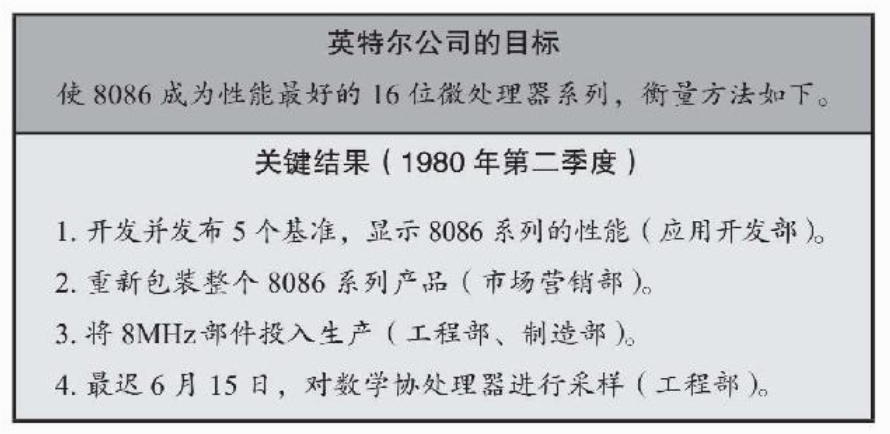
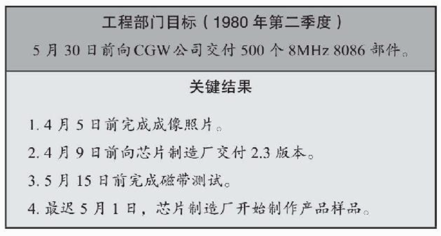
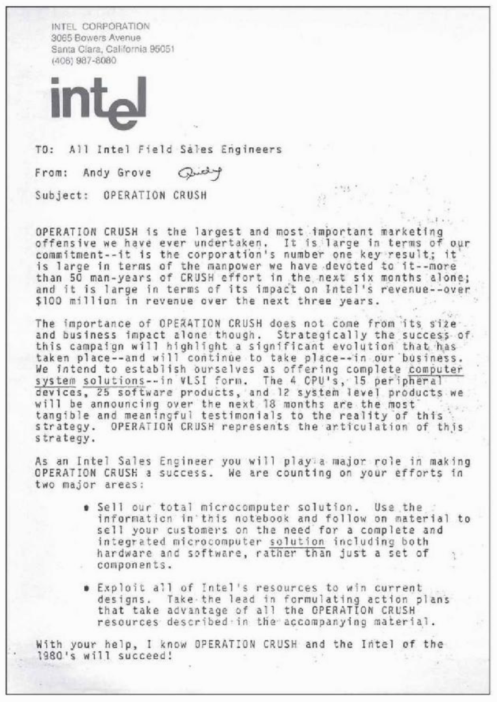

# 0301.「粉碎行动」——英特尔公司的故事

「粉碎行动」——年轻的英特尔公司为生存而战，是关于 OKR 的第一个延伸故事。「粉碎行动」展示了 OKR 的 4 种利器，即聚焦、协同、追踪和延展。最为重要的是，「粉碎行动」展示了这一目标设定系统是如何让多个部门和数千个个体为共同的目标而努力奋斗的。

在我任职的后期，英特尔公司正面临着生死存亡的考验。在安迪·格鲁夫的领导下，高层管理人员在 4 个星期内重新启动了公司的优先事项。OKR 使英特尔公司能够以更为清晰、精准且闪电般的速度执行其作战计划，全体员工齐心协力关注于一个共同的宏伟目标。

早在 1971 年，英特尔公司的工程师——特德·霍夫（Ted Hoff）就发明了第一代微处理器——多功能「计算机单芯片」。1975 年，比尔·盖茨和保罗·艾伦（Paul Allen）编写了第三代英特尔处理器 8080 程序，并由此引发了个人计算机领域的革命。到 1978 年，英特尔公司开发出了第一款高性能的 16 位微处理器 8086，迎合了市场上的庞大需求。但好景不长，8086 处理器很快就被速度更快且更容易实现编程的摩托罗拉 68000 和新贵齐洛格（Zilog）公司的 Z8000 所取代。

1979 年 11 月下旬，一位名叫唐巴克特（Don Buckout）的地区销售经理发出了一篇令人绝望的长达 8 页的电报。他的老板凯西·鲍威尔（Casey Powell）将其发送给了当时的英特尔公司总裁兼首席运营官安迪·格鲁夫。这份电报为英特尔公司敲响了警钟，随即引发了一场轰轰烈烈的公司革命。在不到一周的时间里，英特尔公司高层管理人员开始直面这个坏消息。为了应对竞争威胁，「蓝丝带行动小组」在一周后成立了，旨在筹划英特尔公司的反攻。当时，齐洛格公司算不上很强劲的竞争对手。然而，摩托罗拉作为行业巨头及国际知名品牌，对于英特尔公司来说却是个极大的威胁。吉姆·拉利为即将到来的战争定下了以下基调：

只有一家公司在同我们竞争，那就是摩托罗拉。68000 是我们的对手。如果要给这场战役定个名字，那就是「必须干掉摩托罗拉」。我们必须粉碎这个家伙，我们将会从它的身上轧过去，并确保它再也回不来了。[1]

这成了「粉碎行动」的战斗口号。[2] 这场「战役」是为了重新树立英特尔公司的行业领导者地位。1980 年 1 月，在安迪·格鲁夫的安排下，粉碎小组被派往全球各地的办事处。在第二季度，英特尔公司的销售人员已经全面部署了这一新战略；到第三季度，他们正朝着实现科技史上最大胆的目标之一迈进，那就是赢得 2000 个设计合约（design wins），并且争取让客户们同意把 8086 处理器配置在他们的电器和设备上。到那一年年底，他们击败了敌人，并赢得了最终的胜利。

在这场战役中，英特尔公司没有调整任何一款产品。但是格鲁夫和他的团队改变了游戏规则。他们改进了营销策略，发挥了英特尔公司的优势。他们引导客户明白，相较于短期的实用性而言，长效系统和服务更具价值。他们不再向程序员推销产品，而是开始将目标对象转为客户企业的首席执行官。

格鲁夫举荐了比尔·达维多——当时微型计算机系统部的负责人来指挥这次「粉碎行动」。在其漫长的职业生涯中，比尔以工程师、行业主管、市场营销人员、风险投资者、思想家和作者的多重身份，做出了许多持久的贡献。让我记忆犹新的是，比尔为英特尔公司的 OKR 注入了许多新的理念，比如 a.m.b.（as measured by，强调衡量）。他曾经说：「我们终将实现一定的目标，而目标的实现可以由关键结果来衡量。」比尔的理念使得隐晦的事情对所有人都变得更加明朗。

在 2013 年，在计算机历史博物馆举办的小组讨论会上，「粉碎行动」的老成员回忆了英特尔公司结构化目标设置的重要性，以及如何在「战壕」中应用 OKR。[3]

OKR 在「粉碎行动」中的应用，可参看本书 54–55 页的例子——英特尔公司的目标。这是个极为经典的案例：采用 OKR 的方法，规定具体的时间期限，而且把做什么、如何做都描述得十分清楚。最为重要的是，最终这一方法真的发挥作用了。

正如吉姆·拉利告诉我的：「直到格鲁夫和我坐在一起并解释它为什么重要之前，我一直都对 OKR 持怀疑态度。如果我们告诉每个人，让他们去欧洲的中心地带，有些人可能会去法国，另一些人可能会去德国或意大利，但如果我们真正的目的是让他们都去瑞士，显然上述结果是不理想的。指向不同的方向，最终的合力必然为零。但如果是让所有人都朝着同一个方向奋进，那么就能实现效果的最大化了。这就是格鲁夫给我推荐 OKR 的策略，然后他告诉我，需要把这个方法教给其他人。」

就像比尔·达维多所叙述的那样，OKR 是格鲁夫在「粉粹行动」中的秘密武器。这个武器为一个庞大而多元化的组织的发展增压加速，并以惊人的灵活性推动其快速前进。面对如此团结一致并以目标为驱动力的英特尔，摩托罗拉几乎无计可施。

以下部分为比尔·达维多对该「战役」的回顾。

比尔·达维多：关键结果系统是安迪·格鲁夫塑造行为的有效方式。他一心致力于让英特尔公司变得更加伟大。他从不鼓励员工为外部董事服务，并认为公司应该是员工的生命。公司和员工的 OKR 巩固了上述这一承诺。

当真正处在高层管理职位的时候，其实就是在教学，这也是安迪的做法。英特尔公司在管理系统中成功嵌入了 OKR，这也是一种管理哲学和极其重要的教学系统。我们不断被教导和熏陶：如果以 OKR 作为衡量标准，一切将变得更美好。

在英特尔公司的经理人员例会上，我们和安迪一起拍板决定了公司的最高目标。作为部门经理，我将公司所有的相关关键结果作为我的目标。其后，我的团队会在接下来的一周内围绕这些目标探讨整个季度的工作计划。

正如安迪所强调的，使 OKR 系统强大起来的东西，正是英特尔公司要努力达到的，每个人都需要全力以赴。我们都是获胜团队中的一员，我们都希望能够继续获胜。

对于低层级的员工来说，他们的 OKR 就是他们的全部工作产出，但经理们会有额外的日常管理责任。如果我的目标是种出美丽的玫瑰花丛，那么毫无疑问，「维护绿色的草坪」也是我应该做的。我从未将「四处走走，始终让员工士气高昂」当作一项关键结果。我们总是把需要特别强调的事项写下来，并铭记于心。

1980 年英特尔公司总部，安迪·格鲁夫（左）和比尔·达维多（右）

## 01. 英特尔公司如何应对突发事件

1979 年 12 月，我参加了安迪·格鲁夫主持的一个高管会议，会上充斥着抱怨的声音。我认为，微型计算机系统部门的领导和员工能更好地为 8086 处理器赢得设计合约，我试图推动他们反击并重新获得自信。安迪走过来跟我说「把问题解决掉」，然后「粉碎行动」就成了我的工作。

8086 产品本身并不会带来较大的收益，但它却可以产生广泛的连锁效应。我的部门靠销售设计辅助性服务来获取额外收益，如为使用英特尔微型处理器的客户提供软件开发系统等。尽管业务在近乎疯狂地增长，但我们创造价值的前提是客户选择英特尔的微芯片。一旦 8086 在市场上站稳脚跟，我们就将获得 EPROM（1971 年英特尔公司发明的可编程只读存储器芯片）及外部设备和控制器芯片的合同。总之，最后所产生的连锁销售价值有可能会是最初销售价值的 10 倍。但如果 8086 在市场上消失了，那么我们的一整套销售业务也将不复存在。

所以，我们当时面临的风险是很大的。在英特尔公司作为内存芯片供应商获得极大声誉的同时，行业对手的进攻也接踵而来。就在最近，英特尔公司将 DRAM（使用最广泛、最经济的计算机内存）市场的领先优势拱手让给了一家初创公司，并且似乎无法恢复之前的发展势头；日本公司也在利润丰厚的 EPROM 市场上攻城略地。在这一情势下，微处理器是英特尔公司未来的最大希望，我们必须重返巅峰。我仍然清晰地记得早期报告中的第一张幻灯片。

「粉碎行动」目标：建立一种紧迫感，并启动关键决策和行动计划，以应对威胁生命的竞争挑战。

我们的专门小组于 12 月 4 日星期二召开了会议。会议持续了三天，每天都围绕这一目标商讨好几个小时。这是对我们智力的挑战，就像要解决天大的难题一样。没有时间重建 8086 的优势，我们把大部分时间都花在了探讨如何销售产品和如何重新超越摩托罗拉公司并最终获得竞争优势上。

我认为，我们可以通过创造新的叙事方法来获胜。我们需要说服客户，他们今天选择的微处理器将是他们未来 10 年做出的最重要的决定。当然，摩托罗拉公司可能会说：「我们有一套更简洁的说明书。」但它们却无法同英特尔公司广泛的产品系列和系统性能相抗衡，也无法与英特尔公司出色的技术支持和较低的持有成本相竞争。借助英特尔公司的外部设备，相关产品能够以更快的速度、更低廉的成本进入市场；借助英特尔公司的设计辅助工具，工程师可以更高效地开展工作。

摩托罗拉是一家多元化的大型公司，产品类别从双向无线对讲机跨到袖珍电视机。英特尔公司则是技术领先者，专注于内存芯片、微处理器和操作系统的研发。在出现问题时，客户会给谁打电话？客户会指望和谁并肩作战呢？

我们有很多好的想法，但我们需要把这些想法有效地联系在一起。吉姆·拉利在白板上写道，「发布产品的未来目录」，「为 50 场研讨会制订销售推广计划——与会者将获得一份产品目录」。截至星期五，我们计划动员整个公司的力量。在接下来的星期二，我们通过了一份包括 9 项内容的计划——包括数百万美元的广告支出，这是英特尔公司之前从未做过的事情。在之后的一个星期内，这一计划很快就被传达到一线的销售人员那里，他们迫切地希望签单。毕竟，是他们首先提醒我们出现了危机。

所有的一切都在圣诞节前发生了。

摩托罗拉公司运行得非常好，但他们对于突发事件的反应却同英特尔公司有所不同。当凯西·鲍威尔拍打我们的时候，我们在两周内就做出了反应。然而，当我们发起进攻时，摩托罗拉公司却无法快速反应。摩托罗拉公司的一位经理告诉我说：「在你们发起进攻时，我甚至不能及时地买到一张从芝加哥到亚利桑那州的飞机票。」

英特尔公司擅长制定战略，并将其转化为可实施、可协作的项目。在如上所述包括 9 项内容的计划中，每一部分都可以成为英特尔公司的关键结果指标。下面是英特尔公司 1980 年第二季度推出的「粉碎行动」OKR 和相关工程 OKR。

## 02. 转瞬之间

在早些时候，也就是在第一次「粉碎行动」之后不久，鲍勃·诺伊斯和安迪·格鲁夫在圣何塞的凯悦嘉寓酒店举行了「粉碎行动」启动仪式。他们对英特尔公司管理团队的指示简单明了：「我们要在 16 位微处理器市场上获胜。我们致力于实现这一目标。」安迪告诉了我们必须要做的事情，以及要这样做的原因。直到这些事项有效完成之前，我们都应将其视为优先事项。

有近 100 人参加了这场会议。安迪所说的话，很快就传达到了公司的各个层面。当时的英特尔公司，是一家估值数十亿美元的公司，而决定性的转折就发生在那一瞬间。直到今天，我也从未再见过这样的场景。

从 1980 年1月开始，安迪引领部下开展的「粉碎行动」

英特尔公司

美国加利福尼亚州圣克拉拉市鲍尔斯大街 3065 号邮编：95051

电话：（408）987–8080

致：英特尔公司所有的现场销售工程师

发件人：安迪·格鲁夫

主题：粉碎行动

「粉碎行动」是我们所进行的最宏大、最重要的营销攻势：从我们的承诺来看，它是巨大的——这是公司的首要关键结果；从我们投入的人力来看，这也是巨大的——在接下来的 6 个月里，我们将投入超过 50 人年工作量的努力；它对英特尔公司的收入影响也很大——未来 3 年，公司将获得超过 1 亿美元的收入。

但是，「粉碎行动」之所以重要并不仅仅是因为其规模和业务影响。从战略上看，这次行动的成功将对我们的业务带来革命性的影响，并持续下去。我们将以提供 VLSI（超大规模集成电路）的方式确立我们在计算机系统整体解决方案领域的地位。我们将在未来 18 个月内推出集合 4 个 CPU（中央处理器）、15 个外部设备、25 个软件产品和 12 个系统级产品的整体解决方案，这就是这一战略的现实意义最具体、最有意义的证明。「粉碎行动」清晰地阐释了这一战略。

作为英特尔的销售工程师，你们将在确保这一行动的成功上发挥重大作用。我们需要你们在以下两个方面做出努力。

第一，销售我们的微型计算机解决方案。使用本方案中的信息，并依照说明向客户推销完整集成的微型计算机解决方案（包括硬件和软件），而不仅仅是其中的一组组件。

第二，利用英特尔的所有资源做出最好的产品设计，率先制订行动计划，充分利用材料中提及的「粉碎行动」的资源。

在你的帮助下，我确信「粉碎行动」必将成功，20 世纪 80 年代的英特尔也必将成功！

如果没有关键结果系统，一切都不可能发生。如果没有在圣何塞的会议上提到关键结果系统，很难想象安迪如何能够同时开展所有「粉碎行动」。我数不清曾多少次见到人们走出会议室时喃喃自语道「我要征服这个世界」，然而在 3 个月之后，却没有任何事情发生。能够激励员工，并让他们充满热情，但他们却不知道该如何做，这是很糟糕的。在面临危机时，企业需要一个可以快速推动转型的系统，而这就是 OKR 为英特尔公司所做的，它为管理层提供了快速推动计划实施的有效工具。当员工向我们汇报他们做了什么时，我们有明确的评估标准。

「粉碎行动」是一个完全串联的 OKR 集合，在高层管理者强力推动的同时，下层的员工也会主动参与其中。在安迪所处的层级，甚至是我的层级，我们根本无法获悉赢得这场战役胜利的所有机制。很多内容都必须自下而上地汇集。你可以告诉人们去清理一个烂摊子，但你是否需要告诉他们应该使用哪把扫帚呢？当最高管理层强调「我们必须压制住摩托罗拉」时，基层的员工可能会说：「我们的基准程序很糟糕，我想我会写一些更好的基准程序。」这就是我们的工作方式。

## 03. 更高的目标

英特尔公司已经深陷战斗 6 个月了。作为一名普通员工，我没有任何前线指挥权，但我能够获得自己所需的任何资源，因为整个公司都知道这项计划对安迪有多重要。当英特尔公司把关键结果作为评价标准时，没人有异议。每个人都投入其中，所有人都行动起来。公司根据新出部署重新配置了资源，虽然我当时认为没有预算，但依然全力以赴。

「粉碎行动」最终集合了高层管理人员、整个销售团队、4 个不同的营销部门和 3 个不同区域的部门的力量，它们形成了一个有机的作战团体 [4]。与其他公司的不同之处在于，英特尔公司内部没有多少政治。为了更高的利益和目标，管理者甚至会牺牲自己部门的利益。

比如，微处理器部门正要推出未来的产品目录，有人可能会注意到，「噢，天哪，我们缺少一款外部设备部件」，而这显然会影响到外设产品部门及工程资源的分配。销售团队可能会立即组织研讨会，但他们需要应用工程师、市场营销人员及我所在部门的帮助。公关部可能会为行业刊物上的文章而与公司所有部门争论。这确实是群策群力。

每当我想到「粉碎行动」时，我都无法相信我们赢了这场战役。我想，我们获得的经验就是：公司文化是至关重要的。安迪一直希望员工可以让管理层关注到可能存在的问题。

例如，一位现场工程师跟自己的总经理说：你们这些「火鸡」[5] 并不明白市场的真实情况。

然后，在两个星期之内，公司架构会自上而下重新调整。此举得到了全体员工的一致赞同：「那个工程师说的是对的，我们需要改变。」唐巴克特和凯西·鲍威尔觉得员工可以表达自己的观点而不担心会遭受惩罚，这种想法和文化是至关重要的。因为如果没有这种文化，也就没有「粉碎行动」的成功。

安迪总是习惯做最后总结，在这里，我们也用他的话进行总结。他说：「危机来临时，经营不善的企业可能会被摧毁，但好的企业却能够生存下来并发展壮大。」——这里指的就是「粉碎行动」。到 1986 年，当英特尔公司摒弃内存条业务转而全力投向微处理器产品时，8086 重新占领了 16 位微处理器市场 85% 的份额。新品类 8088 较 8086 价格更为低廉，也有利于实现个人电脑平台的标准化。自从安装在 IBM 公司的第一代个人计算机中以后，8088 获得了市场声誉，并为英特尔公司带来了可观的收益。当下，电脑和汽车中数百亿的微控制器、智能恒温器和血库离心机均全部采用英特尔公司的架构。

正如我们所看到的，没有 OKR 就没有现在的英特尔公司。

[1] Tim Jackson,Inside Intel:The Story ofAn drew Grove and the Rise of the World’s Most Powerful Chip Company(New York:Dutton,1997).

[2] 「粉碎行动」（Operation Crush）一词，是受到丹佛野马橄榄球队在 20 世纪 70 年代后期发起的「橙色粉碎」（Orange Crush）保卫战的启发。

[3] 「Intel Crush Oral History Panel,」Computer History Museum,October 14,2013.

[4] 包括 2000 名员工，其中一半以上直接接受「粉碎行动」小组安排，所有人都随时待命。

[5] 此处指不在一线，没有实际经验，只在办公室里的人。——译者注