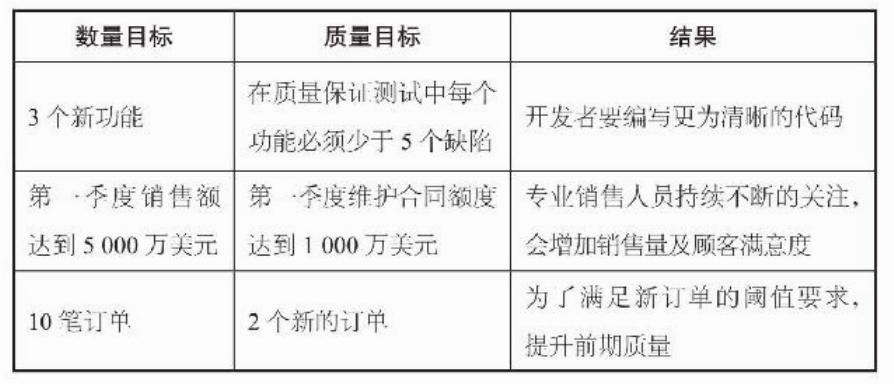
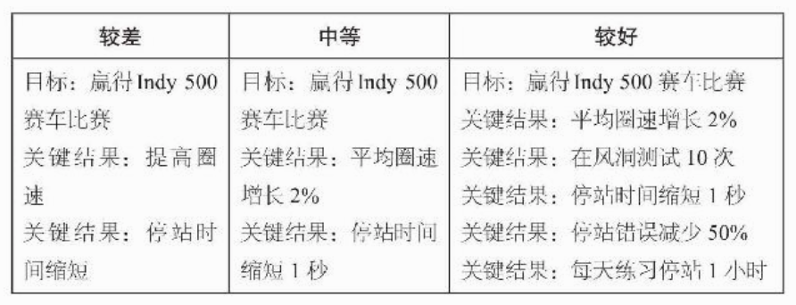

# 0401. 利器1：对优先事项的聚焦和承诺

是我们自己的选择而不是能力，展示了我们是谁。

——J.K.罗琳

衡量一件事情的重要性时，应该先考虑这样的问题：在接下来的 3 个月（6 个月或 12 个月）里，什么是最重要的事？

成功的组织聚焦于少数能够产生实质性差异的举措，并推迟那些不怎么紧迫的事项。高层管理者在言行中对这些选择做出承诺，坚定地维护最高层的 OKR，并给团队提供方向和评价基准。一旦结果开始显现，错误的决策可以及时得到纠正。非决定性或草率放弃的决策，对我们毫无价值。我们在未来一段时间的优先事项是什么？人们应该在哪些方面集中精力？一套有效的目标设定系统始于组织高层的严谨思考，领导者需要投入时间和精力去选择重要的事情。

虽然削减目标清单总是富有挑战性，但却是值得的。正如任何经验丰富的领导者都会告诉你：没有一个人或公司可以「做所有的事情」。通过选择一套 OKR，我们可以突出强调一些事情——这些重要的事情必须按照计划和时间来完成。

## 01. 开始的时候……

对于企业层面的 OKR，责任在高层领导者，他们必须亲自对这一过程做出承诺。

那么应该从哪里开始呢？他们如何决定什么才是真正重要的事情呢？谷歌公司的使命宣言是：整合全球信息，使人人皆可访问并从中受益。

安卓操作系统、谷歌地球、Chrome 浏览器及新推出的改进版 YouTube 搜索引擎，这些产品都有一个共同的属性，那就是发展的动力都来自创始人及其执行团队，他们通过 OKR 明确了自己的聚焦点和承诺。

但是，好的想法不受层次结构的约束。最强大、最活跃的 OKR 往往源自一线员工。里克·克劳（Rick Klau）是 YouTube 的产品经理，负责网站的主页管理。该网站的访问量在全球居于第三位，而问题在于仅有一小部分用户选择登录该网站。从保存视频到频道订阅，YouTube 的一系列重要功能没有被用户使用，其大部分价值实际上被隐藏了，全球数以亿计的用户并没有真正从中受益。与此同时，很多极有价值的数据也就此丧失了价值。为了解决这个问题，里克的团队设计了一套为期 6 个月的 OKR 体系，用来改善网站的登录体验。他们向 YouTube 首席执行官萨拉尔·卡曼加提出了自己的看法，并与谷歌公司首席执行官拉里·佩奇进行了磋商。拉里选择将登录体验的目标提升到谷歌公司层面。但是，有一点是需要特别注意的，那就是截止日期是 3 个月后，而不是之前说的 6 个月后。

里克强调，当 OKR 上升到管理层时，公司的所有焦点都应该集中在企业的管理团队上。「有很多双眼睛在盯着我们！我们不知道如何在 3 个月内做到这一点。但是，我们知道，当公司把我们的工作上升为公司层面的 OKR 时，那就意味着我们的工作成了公司的优先事项。」当一位产品经理的目标得到如此重点的关注时，拉里也向其他团队阐明了一些重要事项——就像「粉碎行动」一样，所有人聚在一起帮助里克的团队取得成功。尽管晚了一周，YouTube 的登录页面团队最终成功地完成了任务。

无论领导者如何选择公司的最高目标，他们都需要为自己设立目标。就像价值观不能通过备忘录来传递一样，结构化的目标设定也不会通过命令的方式深入员工的思想。[1] 正如读者将会在本书第 6 章中所看到的那样，Nuna 公司的员工吉妮·金（Jini Kim）发现，OKR 需要领导者在言行上做出公开承诺才能艰难实现。

当有些首席执行官说「我所有的目标都是团队目标」时，这其实是个十分危险的信号。光会说 OKR 是不够的，还必须有所行动和示范。正如后来执教谷歌公司高管团队的财捷集团（Intuit）首席执行官比尔·坎贝尔所说：「当你是首席执行官或公司创始人的时候……你必须说‘这就是我们正在做的事情’，然后你必须树立榜样。因为如果你不以身作则，没有人会真正在意这一目标。」[2]

## 02. 清晰沟通

为了制定合理的决策，维持团队精神，并取得卓越的成绩，组织中的所有人员都必须清晰地理解公司的最高目标。然而，在每三家公司中就有两家承认它们未能始终如一地围绕公司的最高目标进行有效沟通。[3]

在一项针对 1.1 万名高层管理人员和经理的调查中，大多数人都无法明确地指出自己所在公司的首要目标和优先事项，仅有一半的人可能只能说出其中的某个重要事项。[4] 领导者必须说清楚为什么做某件事，以及怎样做。员工不仅仅需要通过里程碑式的成功来获得动力，他们还渴望理解辛勤工作的意义，同时了解自己的目标与公司使命之间的关联。这一过程不能只是在全体员工季度会议上宣布 OKR 之后就结束。正如领英公司首席执行官杰夫·韦纳（Jeff Weiner）喜欢说的：「当你不厌其烦地多次强调的时候，团队成员可能才真正开始听你说话。」

## 03. 关键结果：关心和支持

目标和关键结果是目标设定的阴阳两面——原则与实践、愿景与执行。其中，目标往往能鼓舞人心且与长远计划有关，而关键结果往往更接地气且是可衡量的。而且，关键结果通常包括很多指标，如收入、增长率、活跃用户、质量、安全、市场份额及客户参与度等。正如彼得·德鲁克所指出的，为了真正实现可靠的进展，管理者「必须能够衡量……针对目标的绩效和结果」。[5]

换句话说，关键结果是拉动目标实现的杠杆和实现目标过程中的一个个节点。如果目标的设定较为科学的话，通常有 3 到 5 个关键结果就足以确保目标的达成。如果目标太多，往往会淡化焦点，对预期的进展形成阻碍。此外，每个关键结果对于个人来说都应该是一项挑战。如果你有足够的信心能够做好这件事，那么你所设立的目标很可能还不够宏大。

## 04. 做什么、如何做和何时做

由于 OKR 会打乱既定的秩序，所以将其融入秩序当中不失为一个较好的选择。有些企业会以一年为周期，将目标设定从个体目标转变为共同目标，或者将目标设定过程从自上而下的方式转变为更具协作性的方式。双线并行可能是目标设定的最佳方式，既有短期的 OKR 来支持年度 OKR 的实现，也有长期的战略规划。请牢记，尽管能够推动实际工作的是短期目标，但年度计划需要依据实际情况来制订，并确保这一计划是可以实施的。

明确时间框架可以进一步突出工作的焦点和承诺。实际上，没有任何东西能够像截止日期那样推动我们前进。要想在全球市场中取胜，企业需要比以往更加灵活。根据我的经验：季度 OKR 的设定最适合与当今快速变化的市场保持同步。以 3 个月为期限可能会防止工作中的拖延症，并带来实际的业绩增长。《高产出管理》是安迪·格鲁夫的领导力圣经，他在该书中指出：

要使反馈有效，就必须在评估活动发生后立即给予反馈。因此，使用 OKR 系统应该在相对较短的时间内设定目标。例如，如果我们每年做一次计划，相应的 OKR 设置应该以季度或月度为时间单位。[6]

OKR 的时间设定没有统一的标准。工程团队可能倾向于选择 6 个星期为一个 OKR 周期，以便保持与产品开发进度同步。相对而言，一个月的周期则可能适合于那些新创立的、正在寻找市场定位的企业。最好的 OKR 节奏，往往与企业所处的行业及企业的文化节奏相适应。

## 05. 匹配关键结果

福特公司的平托车臭名昭著，表明了单一维度的 OKR 的危害。1971 年，消费市场更倾向于日本和德国生产的燃油效率更高的车型，而福特试图利用平托车进行反击，以夺取市场。平托车是一款经济实惠的小型车。为了满足首席执行官李·艾柯卡（Lee Iacocca）较为激进的要求，产品经理跳过了计划及开发阶段的安全检查。例如，新款车型的油箱竟然被安放在并不稳定的后保险杠前面大约 6 英寸（约15厘米）的地方。

平托车极易着火，福特公司的工程师是知道这一点的。但艾柯卡用铁腕政策强制实现了「（保证）平托车重量低于 2000 磅（约907千克）、成本低于 2000 美元」的市场营销目标。

在防撞测试中，测试员们发现「重 1 磅（约0.45千克）、价值 1 美元的塑料部件就可以防止油箱被刺穿」。但由于超出了预设重量和预期成本花费，这个塑料部件最终没能出现在平托车上。公司内部的绿皮书上引注了这款产品的三个设计目的和定位：真正的微型汽车（大小及重量）、维护成本低（购买价格、耗油量、稳定性及保养费）、清晰的产品优越性（外观、舒适度、特征、操控性及性能）。相对而言，安全性并不是它需要重点考量的。[7]

平托车的追尾事故导致了数百人死亡，数千人严重受伤。1978 年，福特公司召回了总价值 150 万美元的平托车及其姊妹车型 Mercury，这是汽车发展史上金额最大的一次召回事件。公司的资产和声誉都因此严重受损。

回顾过去，福特公司并不缺乏目标或关键结果。但它的目标设定过程存在着致命的缺陷：「尽管特定的、具有挑战性的目标可以得到满足（进入市场的速度、燃料效率和成本），但却以牺牲其他重要功能（安全、道德行为和公司声誉）为代价。」[8]

再举一个近期的案例，富国银行目前仍然深陷消费银行业的丑闻之中。银行无情的、单一维度的销售目标致使分行经理竟然因为销售压力而为那些并无需求的客户开设了数以百万计的虚假账户。在一个案例中，一位经理的十几岁的女儿竟然有 24 个账户，经理的丈夫则有 21 个账户。这件事情的后果是：超过 5000 名银行工作人员被解雇，该银行的信用卡和支票账户业务猛跌了一半甚至更多，富国银行的品牌形象也可能永远无法修复。[9]

OKR 越野心勃勃，其忽视重要标准的风险也就越大。正如格鲁夫在《高产出管理》中所写的那样，为了保证质量并推动量化的可交付成果，一种解决方案是将关键结果进行匹配——用以衡量「效应和反效应」。当关键结果聚焦于产出时，格鲁夫指出：

相匹配的关键结果应该强调工作的质量。比如在应付账款中，处理的凭证数量应该与通过审计或供应商发现的错误数量相匹配。再比如，保洁团队负责清洁的区域面积，应该与在该办公楼中拥有办公室的高层管理者对工作质量所做的评估结果相匹配。[10]

表4.1 数量和质量匹配的关键结果

## 06. 完美与优秀

谷歌公司首席执行官桑达尔·皮查伊曾经告诉我，他的团队经常为目标设定过程而深感困扰：「我要花一个半小时的时间来思考 OKR 的唯一一种设定，以便确保我们能专注于做某件对用户来说更好的事情。」

但这仅是片面之词，我来阐述一下伏尔泰（法国哲学家）的观点：不要让完美成为优秀的敌人。[11] 请记住，在 OKR 周期的任何时间点，都可以修改甚至完全抛弃之前的设定。有些时候，「正确」的关键结果会在投入工作后的数周或数月内显现出来。从本质上看，OKR 就是正在进行的工作，它并不是一成不变的。

目标设定也有一些基本的规则：关键结果应该是明确的、具体的、可衡量的，产出和投入的组合（匹配）对其有所帮助。最后，完成所有关键结果的关键和前提是实现目标。如果目标没有实现，那就不是 OKR了。[12]

表4.2 OKR质量评价表

## 07. 少即是多

正如史蒂夫·乔布斯所理解的那样：「创新意味着对 1000 件事说不。」

在大多数情况下，季度 OKR 的理想数量往往介于 3 个到 5 个之间。设立很多目标可能很诱人，但这通常也是错误的。太多的目标可能会模糊我们对重要事物的关注，或者使我们分心去追逐下一个更为闪亮的东西。

减肥宝（MyFitnessPal）是一款健身和健康应用程序，其公司的首席执行官迈克·李（Mike Lee）说：「我们设置了太多的 OKR，试图完成的事情太多了，而且事情的优先级也不够明确。所以我们决定尝试设置更少的 OKR，并确保这些都是我们真正需要的。」

对于个人而言，正如我在英特尔公司所发现的那样，选择性目标设定是防止过度扩张的第一道防线。一旦员工与他们的管理者进行了磋商并致力于本季度的 OKR，那么任何附加目标或关键结果都必须符合既定议程。新目标如何与现有目标叠加起来？是否应该放弃某些东西来为新的任务腾出空间？在高效的 OKR 系统中，自上而下的、「只是做更多」的任务已经过时了。命令需要让位于问题，这个问题就是：什么是最重要的？

当谈到目标设定时，格鲁夫强调「少即是多」：

OKR 系统应该为企业提供最卓越的东西，即「聚焦」。只有当我们将目标的数量保持在很小时，才会真正聚焦于此。每次做出承诺时，都会丧失投身其他事项的机会。当然，这是任何有限资源分配中都不可避免的结果。因此，做计划的人必须有勇气、诚实且遵守纪律。只有这样，才能在放弃某个项目的同时启动新的项目。摇头说「不」和微笑着说「行」一样重要。我们必须意识到关注所有事项和一件都不关注的结果是一样的，并能够践行这个原则。[13]

综上所述，最高层级的目标必须是重要的。OKR 既不是一个什么都要完成的愿望清单，也不是团队日常任务的总和。它们是一系列精心策划的目标，值得特别关注，并将推动人们在此时此地努力前行。同时，它与我们期望实现的更大目标相关联。格鲁夫写道：「这是管理的艺术——管理的艺术在于能够从看似同样重要的选择中选择一个、两个或三个能充分发挥杠杆作用并能让你专注于此的活动」。[14]

或者就像拉里·佩奇所说的那样，成功的组织往往是「最大化利用现有资源，集中精力去打造顶级产品的组织」。换句话说，简洁和聚焦是我们所说的第一利器的核心所在。

[1] Andrew S.Grove,High Output Management(New York:Random House,1983).

[2] 「Lessons from Bill Campbell,Silicon Valley’s Secret Executive Coach,」podcast with Randy Komisar,soundcloud.com,February 2,2016,https://soundcloud.com/venturedpodcast/bill_campbell.

[3] Stacia Sherman Garr,「High-Impact Performance Management:Using Goals to Focus the 21st-Century Workforce,」Bersin by Deloitte,December 2014.

[4] Donald Sull and Rebecca Homkes,「Why Senior Managers Can’t Name Their Firms’Top Priorities,」London Business School,December 7,2015.

[5] Peter F.Drucker,The Practice ofManagement(New York:Harper&Row,1954).

[6] Grove,High Output Management.

[7] Mark Dowie,「Pinto Madness,」Mother Jones,September/October 1977.

[8] Lisa D.Ordóñez,Maurice E.Schweitzer,Adam D.Galinsky,and Max H.Bazerman,「Goals Gone Wild:The Systematic Side Effects of Overprescribing Goal Setting,」Harvard Business School working paper,February 11,2009,www.hbs.edu/faculty/Publication%20Files/09-083.pdf.

[9] Stacy Cowley and Jennifer A.Kingson,「Wells Fargo Says 2Ex-Leaders Owe$75Million More,」New York Times,April 11,2017.

[10] Grove,High Output Management.

[11] 或者就像谢丽尔·桑德伯格所说的：「完成胜于完美。」

[12] 有关 OKR 的更多信息，请参阅本书后面资源部分的《谷歌公司的内部OKR模版》。

[13] I bid.

[14] I bid.