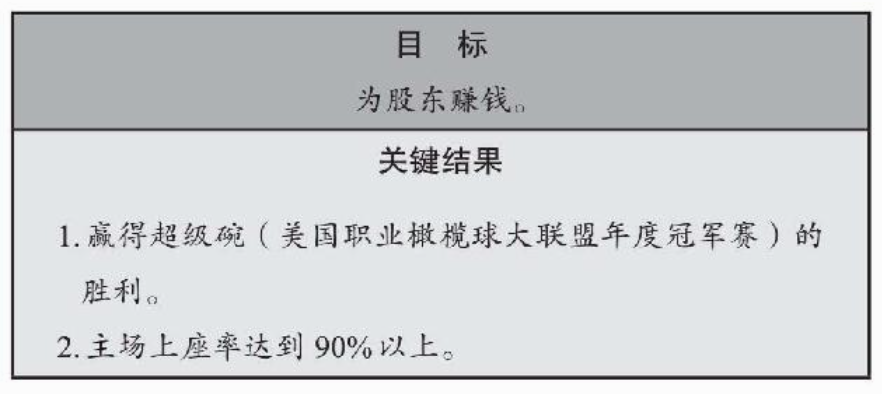
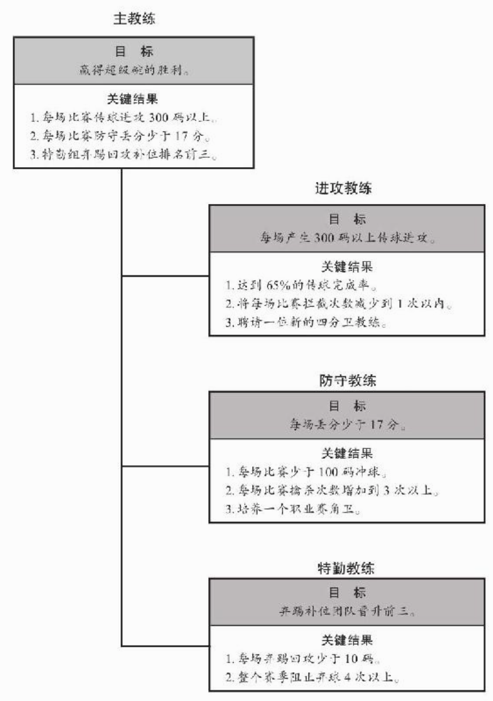
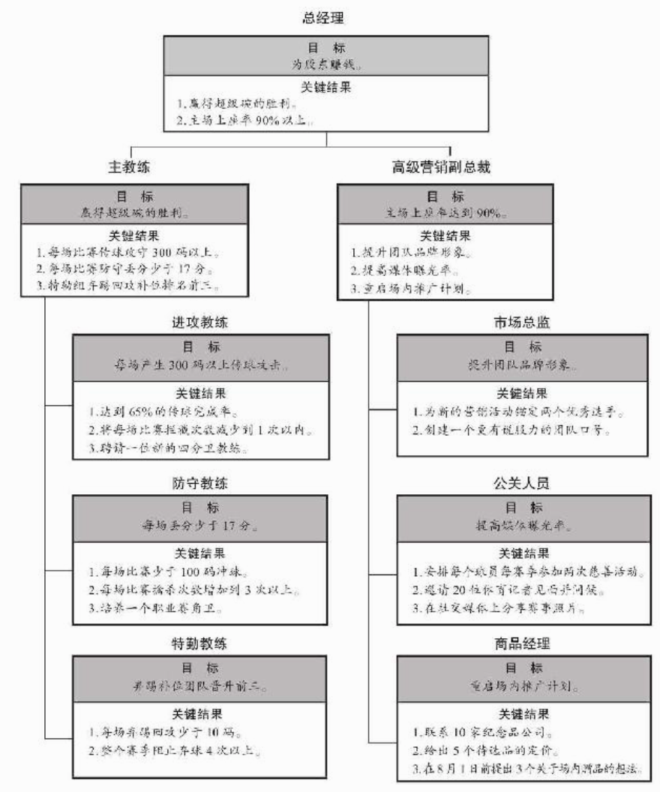

# 0107. 利器2：团队工作的协同和联系

不要雇用聪明人，然后告诉他们去做什么；而是要让他们告诉我们，应该做什么。

—— 史蒂夫·乔布斯

随着社交媒体的突破性成长，透明性已成为组织日常运营的默认设置，这是一条通往卓越的快速通道。然而，对于大多数企业而言，其目标仍然属于不可公开的秘密。很多首席执行官都和云存储公司 Box 的创始人兼首席执行官阿隆·莱维（Aaron Levie）一样感到沮丧。阿隆说：「在任何时候，组织当中都有相当多的一部分人在做着错误的事情。对我们来说，真正的挑战是如何知道这些错误的事情到底是什么。」

有研究表明，与保持隐秘相比，组织中公开的目标往往更容易实现，而只需要简单地按下「开放」按钮就可以全面提升目标达成的可能性。[1] 在最近一项针对数千名美国在职成年人的调查中，有 92% 的人表示：如果同事能够看到他们的进度，他们会更有达成目标的动力。[2]

在 OKR 系统中，即使最基层的员工也可以清晰地看到每个人的目标。从基层员工到首席执行官，大家都可以对目标进行公开批评和纠正。每一个员工都有权参与其中，即使是针对目标制定过程本身所存在的缺陷。精英主义得以在阳光下蓬勃发展。当人们写下「这就是我正在做的事情」时，更容易看出最佳创意来自哪里。很显然，那些升职最快的人，是集中精力做着公司最重要事项的人。组织毒瘤 —— 如猜疑、推诿、政治化等也将在 OKR 系统的作用下失去它们原有的「毒性」。假如销售人员不喜欢最新的营销计划，他们不用私下抱怨，可以直接将自己的看法公之于众。OKR 让目标变得更加客观，而不是非黑即白。

透明性还能在组织中播下合作的种子，促进员工之间的合作。假设员工 A 正在努力达成季度目标，因为他公开记录了自己的进度，同事们都能够随时看到，也就可以知道他什么时候需要帮助。于是，其他人可以在这名员工需要帮助的时候介入，发表评论并提供支持，从而大大提高他的工作效率。与此同时，员工之间的工作关系也进一步加深，甚至还会发生微妙的积极转化。

在大型组织中，通常会有不同的人在无意中做着同一件事，这是人力和物力的巨大浪费。通过清除每个人的目标之间不可见的障碍，OKR 系统将重复多余的任务暴露出来，从而为组织节省大量的时间和金钱。

## 7.1 保持协同

最高目标一旦成功设定，真正的工作就开始了。当目标从计划转向执行时，管理者和员工都必须将自己每天的工作与组织愿景联系起来。这种联系的专业术语就是「协同」。对任何组织来说，协同的价值无论怎么强调都不为过。根据《哈佛商业评论》的研究成果，与普通公司相比，员工高度协同的公司成为业绩最佳者的可能性往往会高出一倍以上。[3]

然而遗憾的是，协同在组织中却非常稀缺。有研究表明：只有 7% 的员工完全理解公司的经营战略，以及企业为了实现共同目标期待他们做什么。[4] 根据一项针对全球首席执行官的调查，缺乏协同是战略制定与执行之间的头号障碍。[5]

加利福尼亚州风险建模公司（RMS）的人力资源负责人阿米莉亚·梅里尔（Amelia Merrill）指出：「我们有很多事情需要去做。我们的员工分布在不同时区的各个办事处，有些员工会各行其是，有些则会协同工作。员工们往往很难明白自己首先应该做什么，每一件事情看起来都很重要，一切似乎都很紧急，但真正需要完成的是什么呢？」[6]

答案就在于聚焦的、透明的 OKR。OKR 将每个人的工作与团队工作、部门项目及整体的组织使命联系起来。人类作为一个「物种」，渴望彼此之间建立起联系。在工作场所中，我们对领导者在做什么及我们的工作如何与之相融，天然地充满了好奇，OKR 则是实现纵向协同的首选工具。

## 7.2 伟大的层级与关联

在过去的商业世界中，工作往往是严格从顶层开始驱动的。按照组织结构路径，目标也是自上而下层层分解传递的。高层管理人员为其部门负责人设定较高层次的目标，部门负责人再将这些目标分解给下一个管理层级，如此层层分解。

虽然这种目标设定方法已经过时，但仍然普遍存在于大多数大型组织中，其优势也是显而易见的。垂直的目标将更低层级的员工圈了进来，保证他们正在处理公司最为关心的问题。在最为理想的情况下，垂直层级还可以营造团结的氛围，让大家都朝着同一个目标努力。

在向谷歌公司和许多其他企业介绍 OKR 时，我常常使用虚拟的橄榄球队作为例子来说明，在使用 OKR 系统时，什么样的工作方式是有效的，什么样的方式又是无效的。

现在，请跟着我们自上而下地看一组垂直层级的 OKR。

## 7.3 沙滩独角兽公司：梦幻橄榄球队

假设我是沙滩独角兽公司的总经理，我有这样一个目标：为股东赚钱。

总经理的 OKR

我的目标有两个关键结果：赢得超级碗的胜利并让主场上座率超过 90%，这就是我为股东赚钱的方式。如果这些关键结果最终实现了，那我就不可能不赢利。因此，这是一个构建良好的 OKR。有了顶层的 OKR 设置，下面就可以沿着组织路径继续努力向前推进了。

作为总经理，我将自己的目标与直接下属 —— 主教练和高级营销副总裁的目标进行了关联，把我的关键结果变成了他们的目标。其中，主教练的目标是赢得超级碗的胜利。为了实现这一目标，他设定了三个关键结果：每场比赛的传球进攻不低于 300 码，每场比赛防守丢分少于 17 分，弃踢补位回攻进入前三。然后，他又将这三个关键结果作为他直接管理的三个最高执行者 —— 进攻教练、防守教练及特勤教练的目标。此后，他们三人也依次制定了属于自己的低一级别的关键结果。

举个例子来说，为了实现每场比赛的传球进攻不低于 300 码，进攻教练可能会聘请一位新的四分卫教练，实现每场 65% 的传球完成率，并将每场比赛拦截次数减少到 1 次以内。这些 OKR 与总经理赢得超级碗胜利的目标是协同一致的。

但我们的目标尚未完成，还需要定义如何实现主场上座率。

与此同时，我的高级营销副总裁依据我的另一个关键结果生成了她自己的目标 —— 使主场上座率达到 90%。为此，她设定了以下三个关键结果：提升团队的品牌形象、提高媒体曝光率，以及重启场内推广计划。这些关键结果又分别作为市场总监、公关人员和商品经理的目标。

教练的 OKR

组织的 OKR

这张图有什么问题吗？这里给出一点提示，那就是高级营销副总裁所设定的关键结果非常糟糕。主教练的关键结果是可以衡量的，但营销副总裁的关键结果无法衡量，既不具体，也没有时间限制。

例如，在提高媒体曝光率中，我们如何定义「提高」？在 ESPN（娱乐与体育节目电视网）有 5 个特别报道？占领《体育画报》（Sports Illustrated）的封面？还是在社交媒体上增加 50% 的粉丝量呢？但是，即使高级营销副总裁提出了更强有力的关键结果，该组织的目标设定方法仍然存在严重缺陷。最重要的目标 —— 让富有的人变得更富有 —— 对总经理来说缺乏内在的激励价值，对团队中在东海岸的「童子军」或在复印机上埋头苦干的公关实习生而言，就更是这样了。

适度的层级和关联往往可以使组织运营更加协同一致，但当所有的目标都沿着组织层次过度关联时，这一过程就有可能退化成一个机械的、纯粹由数字粉饰的活动，会带来 4 个方面的不利影响。

丧失敏捷性。即使是中等规模的企业，也可能存在 6~7 个汇报层级。当基层员工等待上级下达指令时，层层会议就像丛生的杂草，每个目标周期都可能达到几周甚至几个月的时间。紧密关联的组织往往拒绝快速而频繁的目标制定，实施过程太过烦琐会导致季度 OKR 变得不切实际。

缺乏灵活性。由于需要花费如此多的精力来制定各个层次的关联目标，人们很可能不太愿意在周期内对其做出修改。即使是微小的修改，也可能会给下级带来很大的负担 —— 因为他们正在努力保持目标的协同。这样，随着时间的推移，系统就会变得难以维护。

员工被边缘化。严格的层级系统往往会对一线员工的投入和努力视而不见。在一个自上而下的生态系统中，员工在分享与目标相关的问题或有希望的想法时会犹豫不决。

单一维度的联系。当层次和关联都集中在垂直纵向的时候，组织中水平横向联系的效果就会大大降低。

## 7.4 激活基层

幸运的是，我们还有另外一个选择。正因为 OKR 是高度透明的，所以只要各层级在关联过程中不故步自封，那么目标就是可以被共享的。如果一个目标服务于更大的目标，那么它是可以跳过多个级别的。

例如，一个目标可能从首席执行官层直接跳到经理层，或者从一个主管层直接跳到某个员工层，而不是从首席执行官层到副总裁层，再到经理层（然后再到经理的下级）。或者，公司的领导层可能会马上向所有人展示自己的想法，并信心满满地说：「好吧，现在我知道我们要朝哪个方向前进了，我会调整我的目标，与之相适应。」

考虑到谷歌公司拥有数以万计的员工，它的创新文化有可能会被生搬硬套的 OKR 束缚。为此，作为员工行动的前负责人，拉兹洛·博克（Laszlo Bock）在其工作守则中这样写道：

目标可以提升绩效。我们会花很多时间把公司上下的目标进行关联，然而偶尔也有例外的时候……我们有一套基于市场的方法，由于顶层 OKR 是众所周知的，而且团队中每个人的 OKR 也是公开可见的，因此随着时间的推移，目标也会自然地趋于协同一致。这样，那些团队目标与整体目标并不协同的情况就会显得比较突兀了，而且对那些牵涉到每个人的重大举措也很容易进行直接管理。[7]

谷歌公司「20%时间」的工作制度可能是层次和关联原则的典型例外。在谷歌公司，工程师们可以拿出 20% 的工作时间（相当于每周一个工作日的时间），自由从事正式工作以外的项目。正如我们所看到的那样，通过解放这些最敏锐的大脑，谷歌改变了世界。在 2001 年，年轻的保罗·布赫海特（Paul Buchheit）利用 20% 的时间开展了一个代号叫「驯鹿」（Caribou）的项目。这个项目现在被称为 Gmail —— 为用户提供世界领先的基于网络的电子邮件服务。

在现实中，过度的目标协同也可能会在组织中产生强迫性，进而给组织成员带来精神上的伤害。为了避免这一现象的出现，健康的组织往往会鼓励某些目标自下而上地涌现。比如上文中所列举的沙滩独角兽公司的案例，假设该组织的物理治疗师参加了一个运动医学会议，并学习了一种预防伤害的新方法。出于自愿，她制定了一套淡季 OKR 体系，用以实施这种疗法。她的目标也许无法与她的直接上级的 OKR 相协同，但与总经理的首要目标却一定是协同一致的。如果沙滩独角兽的顶级球员们在整个赛季中保持身体健康，那么球队在超级碗中获胜的概率将会大大增加。

与组织中心相比，创新通常更容易发生在组织的边缘。也就是说，OKR 系统最强大的力量往往来自核心管理层之外的洞察力。正如安迪·格鲁夫所说：「在一线作战的人通常会提前感知到即将发生的变化。销售人员往往比管理者更先理解顾客需求的变化，金融分析师通常是最早知道商业变化的人。」[8]

微观管理可能是对管理的误用。显然，OKR 的执行需要一个良好的组织环境，它能让 OKR 在协同和自治、共同目标和创新维度之间实现合理的平衡。彼得·德鲁克指出：「专业化员工需要严格的绩效标准和高层次目标……但如何开展自己的工作应该始终由他自行负责和决定。」[9] 在英特尔公司，格鲁夫对「管理干预」持悲观看法：「下属可能会对上司给予的期望持保留态度，进而在解决自己的问题时表现得不那么主动，转而把这些问题推到他的上司那里。」[10] 该组织的产出会因此而大大减少。

理想的 OKR 系统往往允许员工自主设置部分目标及大部分或全部的关键结果。OKR 能引导组织成员向更高、更远的范围拓展，设定更宏伟的目标并为之付出努力，以便实现更多：「目标越高，绩效越高。」[11] 知道要去哪里的人，往往会更加清楚如何到达目的地。

同样的目标在来源不同的情况下，对同一个人的驱动作用也是有区别的。倘若我们做一件事，在做事方式上不得不服从他人的命令，那么目标对我们的驱动作用可能是相当有限的。例如，医生要求我降低血压，以便参加旧金山马拉松比赛，我可能会心不甘情不愿地接受他的建议。但是如果我是出于自己的意愿要参加比赛，那么我能到达终点线的可能性就大大提高了，尤其是有朋友们和我一起跑的话。

在商业实践中，很少有唯一的正确答案。解放人的思想，并支持他们找到正确答案，这是我们帮助每一个人取得成功的关键。高绩效团队会在自上而下和自下而上两条目标设定路径之间保持创造性张力，努力在协同和相对不那么协同的 OKR 体系之间保持富有创造性的张力，并实现团队的成长和发展。在遇到执行层面的紧急状况时，如果只是需要落实简单的事情，那么组织的指导更多是指令性的。但是，当数字变得强劲而公司变得过于谨慎和保守时，发挥基层员工的创造性和主动性很可能事半功倍。为了适应企业和员工双方的需求波动，领导者对自上而下和自下而上这两种目标设定的选择往往是各占一半。在我看来，这是正确的选择。

## 7.5 跨职能协调

尽管现代化的目标设定已经成功地超越了组织架构，但在组织中依然存在的未被确认的依赖性却是项目绩效下滑的首要原因。这一问题的解决方案，是在组织中实现横向的、跨职能的、点对点和团队对团队的连接。对于具有创新性和相对复杂的问题，孤立的个体与相互联系的群体解决问题的能力是不可相提并论的。产品依赖于工程师，市场依赖于销售人员。但当业务变得越来越复杂，运营活动方案也变得越来越复杂时，相互依赖的部门就更需要一种工具来帮助他们实现协同，一起到达终点。

完善顺畅的联系，往往可以使企业反应更快。为了获得竞争优势，领导者和员工都需要横向联系并打破障碍。正如拉兹洛·博克所指出的，透明的 OKR 系统能够促进这种自由合作，「整个组织的人都能看到正在发生的事情」。[12] 你不用等，就可以让正在设计手机的人与正在进行软件开发的团队立刻携起手来，因为他们可以看到同样的趣事，能帮你解决关于用户界面的问题。

只要目标对所有人而言都是公开可见的，「团队中的每一个小分队」都可以解决他们遇到的任何问题。博克补充道：「如果有人把球打到了场外，你马上就能看到；如果有人一直缺席，你马上就能知道。透明为每个人创造并提供了非常清晰的信号。你开启了良性循环，增强了有效完成工作的能力 —— 而且管理税是零，这太棒了！」

[1] Based on BetterWorks’analysis of 100,000goals.

[2] Wakefield Research,November 2016.

[3] 「How Employee Alignment Boosts the Bottom Line,」Harvard Business Review,June 16,2016.

[4] Robert S.Kaplan and David P.Norton,The Strategy-Focused Organization:How Balanced Scorecard Companies Thrive in the New Business Environment(Boston:Harvard Business School Press,2001).

[5] Donald Sull,「Closing the Gap Between Strategy and Execution,」MIT Sloan Management Review,July 1,2007.

[6] Interview with Amelia Merrill,people strategy leader at RMS.

[7] Laszlo Bock,Work Rules!:Insights from Inside Google That Will Transform How You Live and Lead(New York:Grand Central Publishing,2015).

[8] Andrew S.Grove,Only the Paranoid Survive:How to Identify and Exploit the Crisis Points That Challenge Every Business(New York:Doubleday Business,1996).

[9] Peter Drucker,The Practice of Management(New York:Harper&Row,1954).

[10] Andrew S.Grove,High Output Management(New York:Random House,1983).

[11] Edwin Locke and Gary Latham,「Building a Practically Useful Theory of Goal Setting and Task Motivation:A 35-Year Odyssey,」American Psychologist,September 2002.

[12] Interview with Laszlo Bock,former head of Google’s People Operations.
