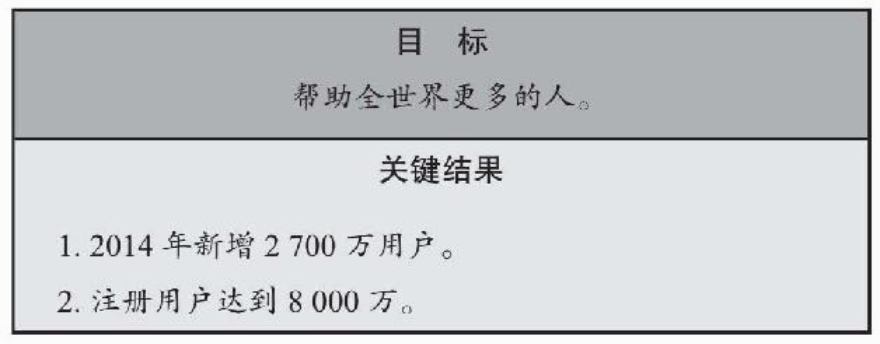

# 0801. 协同：减肥宝的故事

一切都始于一场沙滩婚礼。即将步入婚姻殿堂的迈克·李（Mike Lee）和艾米·李（Amy Lee）想要减肥，一名健身教练给了他们一张详细列出 3000 种食物的营养价值的清单和一张记录卡路里的纸。迈克从 10 岁开始编程，他知道肯定会有更好的方法，所以他想出了一个解决方案，于是就有了「减肥宝」这款手机应用程序。8 年来，迈克和阿尔伯特（Albert）两兄弟用自己的积蓄和个人信用卡维持着这款应用程序的运营。

当前，李氏兄弟正处于一个史诗般运动的中心，这一运动的主旨是追求量化的自我数字保健和个人幸福，而他们的使命则是创造一个健康的地球。2013 年，当 KPCB 公司投资减肥宝时，这款应用程序已经拥有了 4500 万注册用户。如今，它的用户已经超过了 1.2 亿，它已经成功地帮人们减掉了总共 3 亿磅的重量。减肥宝拥有一个包含 1400 万种食物的数据库，加上同 Fitbit 程序及其他几十个应用程序的实时链接，使得追踪具体用户的饮食和锻炼效果变得比以往任何时候都更加容易。

通过呈现过去被隐藏的信息，比如你晨跑消耗的卡路里，减肥宝帮助用户设定并实现了雄心勃勃的个人健康目标。会员可以在该应用程序上选择日常的餐饮和运动安排，这些选择改变了他们的生活方式。作为额外的奖励，这款应用还兼具社交功能，用户可以在上面拥有自己的朋友圈——一群每天为自己加油的人。

OKR 并非相互独立的孤岛。恰好相反，它创建了相互联系的网络，在垂直、水平、对角线等各个方向全方位地连接着组织中最重要的工作。当员工的目标与公司的最高目标保持协同时，OKR 的影响力就会被放大。在 OKR 的指引下，组织可以避免重复甚至是背道而驰的工作。正如李氏两兄弟在创建世界领先的健康和健身应用减肥宝时所发现的那样，紧密的协同对日常工作的进展至关重要，并推动着下一次重大飞跃。

没错，这个故事听起来就像是 OKR 的完美实践。目标设定似乎天生就是为迈克和阿尔伯特而生的——当然并非总是如此容易。后面，读者将会看到，他们也会遇到种种问题。2015 年 2 月，他们的公司以 4.75 亿美元的价格被安德玛（Under Armour）收购了。这一收购，使安德玛这个行业中最大的品牌之一获得了减肥宝在技术上的实力优势。于是，一夜之间，李氏兄弟有了接触世界一流职业运动员的机会，这是数字健身的下一个前沿领域。正如迈克所说：「我们要滑到冰球要去的地方。」

新的业务结构也给目标设定带来了新的挑战，尤其是在目标协同这一点上。迈克和阿尔伯特依靠 OKR 来浏览错综复杂的内部关系。随着减肥宝的发展壮大，OKR 使不断壮大的团队和他们的目标保持协同。

以下是迈克·李在协同方面的亲述。

迈克·李：你的口袋里有一个非常强大的装置，它收集的数据——关于你和你周围的世界——正在爆炸式增长。只需要一点费用或者根本不需要任何成本，你就可以在任何时候拥有一位教练或营养师，甚至是一位医疗顾问。多亏了智能手机，我们可以做出更健康的决定，并引领更健康的生活方式。

减肥宝可以带来更为深刻的意义——我们称之为「清晰时刻」——它始终贴近用户的生活，我亲身体会到了这一点。当我第一次追踪我所吃下的食物时，我知道了每一汤匙蛋黄酱的热量是 90 卡路里，而芥末的热量只有 5 卡路里。从那以后，我再也没有碰过蛋黄酱。小改变汇成大变化，积跬步得以至千里。

在创办减肥宝之前，我曾在数家公司工作过，但没有一家公司使用过正式的目标设定系统。这些公司有年度财务计划、年度营收目标，以及广泛但却缺乏结构化或连续性的战略。它们也都存在着一个共同的弱点：明显缺乏协同性——我不知道其他团队在做什么，也不知道我们应该如何为共同的目标而努力。我们只能尝试用更多的会议来弥补这一缺陷，但这些会议也只是在浪费时间。如果你让两个人划一条船，一个人往东划，一个人往西划，即使他们耗尽了力气，船也只会停在原地打转。

在减肥宝创立之初，我们经常开玩笑说「我们有一张列有 1000 个待办事项的清单」，当我们把最上面的 3 个项目划掉，就会说：「好吧，这是美好的一年。」我们把许多工作都留到了后面，但这是可以的。我们在自己的能力范围之内工作：推出了基于安卓系统、黑莓系统、苹果手机和平板电脑等各种版本的程序。我们一次只处理一个目标，一直到目标完成，然后我们再移到清单上的下一个项目，这中间很少有重叠。

我们的工作程序也并不复杂，但它是高度聚焦、可以衡量的。在这种情况下，当你负责定义公司的战略，而另一个人在负责产品时，你们之间的协同就会很简单。比如，我和我弟弟只需要宣布一个关键目标——在某一个日期之前发布一个用于苹果平板电脑的版本，然后每天交流进展。公司小，程序也就相对简单。不过，我现在希望在得到资助之前就已经提前准备好了 OKR 系统。这样，当机会来临的时候，我们能有更充分的准备来做出更好的选择。

公司成立之后，特别是在基于苹果手机和安卓手机的版本成功推出之后，公司迎来了飞速的成长。一觉醒来，我们发现公司已经拥有了 3500 万个注册用户。我们扩展得太快了，以致再也无法一次只做一件事情了。当同时管理着两个优秀的下属时，平均信息量（熵）就大大地增加了。你想给他们每个人一项宏大而有目的性的任务，他们也都很自然地想要推进这些项目，但很快他们就会脱离队列，向不同的方向冲去。在你了解情况之前，他们很可能正在做两件不同的事情。这时，让他们更努力地工作没有任何帮助和意义。假如两颗钉子没有对齐，即使只有毫厘之差，一锤下去的结果也只能是偏离目标。

虽然阿尔伯特和我知道我们在设定目标时需要更加结构化，但我们不确定该如何往前推进。2013 年，在 KPCB 公司首次对我们公司进行投资之后不久，约翰·杜尔来到我们公司，向我们推广 OKR 系统。他以橄榄球团队作比，引起了我的共鸣。我接受了他的观点，我喜欢 OKR 将主要目标简单化，也喜欢在组织中提炼、延展并层层分解目标。我心想，这就是让我们公司实现协同的方式。

减肥宝联合创始人迈克·李（左）和阿尔伯特·李（右），2012 年

## 01. 跨团队融合

当我们开始实施 OKR 时，远比预期要困难得多。我们之前没有意识到做下面的工作需要花费多少心思：创建正确的公司目标，然后对目标进行分解，再层层建立关联，并激励员工的行为。我们发现，在高层次、战略性思维和更细致的指令沟通之间取得平衡，是很有挑战性的。自从我们获得了 A 轮投资并扩大了领导团队的规模之后，我们工作的领域也就随之扩大了。在推动问责制的过程中，我们为每位领导者都设定了一个宏大的目标。我们也为员工创建了公司的 OKR，但不是直接将员工与我们的 OKR 进行匹配——这么做是不进反退的。有些目标太过狭隘，而有些又太模糊。如果人力资源经理在试图实现产品或收入的高水平目标时遇到困难，我们会为他增设一个顶级目标。很快，我们就有了一大堆的公司 OKR，但是对公司来说，最重要的是什么？我们得到了树木，却失去了森林。

2013 年，当我们公司的人数从 10 人增加到 30 人的时候，我认为生产效率会提高 200%。我低估了规模的扩张减慢效率提升的程度。只有在经过大量培训之后，新工程师才能像最早加入团队的成员一样精通业务；当多个工程师同时开发一个项目时，我们必须建立新的流程来避免互相冲突或重复作业。可以说，在转型成长的过程中，公司的生产力受到了巨大的冲击。

如果静下心来仔细思考一下，协同其实就是帮助人们理解你想要别人做什么。大多数员工都会受到激励，并努力攀登以达到 OKR 系统中的最高目标——假设他们知道在哪里设有梯子的话。随着团队规模的扩大、管理层级的增加，我们又面临了新的问题。

例如，一位产品经理在研究某个应用程序的升级版本；而另一位产品经理则专注于公司的 API（应用程序编程接口）平台，以便确保 Fitbit 这样的第三方软件能够连接到减肥宝上，并将相应的数据写入其中或其他应用程序上；第三位产品经理则在努力解决公司的核心登录体验。这三位产品经理都有着各自的 OKR——到目前为止，都进展得还不错。

但问题是，公司的共享工程师团队被夹在了中间。工程师团队与产品经理的目标并不一致，他们有着自己在基础架构方面的 OKR，就像要确保建筑物「管道畅通和光线明亮」一样。我们认为，他们可以做到这一切——但这是一个很大的错误。他们对自己应该做什么感到困惑，而这些可能会在不经意间发生变化。（有时，往往是产品经理叫嚷得最大声。）由于工程师团队每周都要在不同的项目之间进行轮换，这大大降低了他们的工作效率。在每次中断之后再重新回到特定的产品项目时，他们不得不问自己：如何重新开始？从公司的经营收入来看，升级软件版本的工作尤为紧迫，但开发工作却不得不时断时续。

我感到超级沮丧，我们雇了这么多有才华的人，花了那么多钱，但公司却没能走得更快。市场部的 OKR 是利用个性化电子邮件进行定向推送，这成为公司的重中之重。我们的目标是精心设定的：希望将一定数量的当月活跃用户推到我们的博客中。其中，一个重要的关键结果是通过电子邮件增加点击率。但问题在于，市场营销部门中没有人想到需要通知工程部门，而工程师们也已经设定了他们自己的当季优先事项。没有工程师的支持，这个 OKR 在开始之前就注定要失败了。而且更糟糕的是，直到这个项目死掉，阿尔伯特和我都没有发现它注定会失败——这个项目在一个季度后就下马了。

这次失败给我们敲响了警钟。我们发现：团队之间需要更多的协同。我们的 OKR 系统设计得很好，但在执行方面却出现了短板。当各部门需要互相依赖以获得重要支持时，我们却没能及时明确各部门之间的这种依赖关系。协同有时也像是碰运气，经常需要在规定的期限内完成。我们并不缺少目标，但我们的团队一直在不断地相互背离着。

在接下来的一年，我们试图通过为执行团队定期召开会议来解决这个问题。每个季度，部门的负责人都会提出他们的目标并确认相互之间的依赖关系。在一些最基本的问题得到答案之前，没有人会离会，比如我们是否满足了所有人的需求？团队是否扩张过度？如果是这样，我们如何使他们的目标更贴近现实？

不过，协同并不意味着冗余。在我们公司，每个 OKR 都对应着一个单一主体，其他团队则根据需要进行联合和协同。在我看来，共有 OKR 在很大程度上削弱了问责制。如果一个 OKR 体系的实施失败了，我不希望两个人互相指责。即使两个或两个以上的团队有同样的目标，但他们的关键结果也应该是不同的。

每经历一次 OKR 的设定和执行过程，我们就会向前进步一点点。我们的目标更加精确，关键结果更具有可衡量性，成功的概率就会更高。大概花了两到三个季度的时间，公司才真正掌握了 OKR 的窍门，尤其是关于产品特性，这是一个相对宽泛的目标。预测一个全新市场是不容易的；在实际执行过程中，我们要么疯狂地超越标准，要么疯狂地错过市场，忽上忽下，所以我们对 OKR 进行了相应的修改。我们开始把关键结果锁定在最后期限，而不是收入或预期用户，如「在 2015 年 5 月 1 日前发布减肥宝升级版」。在发布了某个产品特性并得到一些真实数据之后，我们会更准确地评估它的影响和潜在价值。这样，我们在设定下一轮 OKR 时就可以更实际地对产出进行预测和延伸了。

有时，我们会看到团队选择低风险的关键结果，如发送电子邮件或推送通知。目标越是宏大，人们就越趋于保守，这是典型的无意识结果。所以，我们尝试着根据环境来设定目标。在适当的时候，我们会选择增量，但有时我们也会告诉团队：「不要担心月度活跃用户对这个问题的影响。只需要尽自己所能去构建最好的产品特性，我们希望员工能够跨越藩篱。」

## 02. 未确认的依赖和增强

跟随安德玛意味着要去适应一家目标设定模式完全不同的公司。突然间，我有了一位需要与之协同的老板。除此之外，我还有了一个新成立的部门需要去运营：UA 北美健康联盟（Connected Fitness–North America）。我们的任务是利用新兴数字技术来改善健身活动和身体素质。另外，我还需要协同三个应用程序（Map MyFitness、Endonondo 和减肥宝），每一个程序都有不同的文化和工作风格。

随着组织规模的扩大，协同的复杂性会呈现指数级增长。我们如何向 400 个人展示公司想要达到的目标，并帮助彼此进步与相互协同？我们怎么才能够让每个人都朝着同一个方向前进呢？一开始，我发现这很难做到，我几乎无法想象亚马逊公司或苹果公司是如何对此进行管理的。当我们在整个部门引入了 OKR 系统之后，我们公司发生了巨大的变化。

在被收购几周之后，我的老板召开了一个 20 人的场外领导会议，参会人员包括健康联盟的股东们。安德玛有着自己的年度计划安排，各部门负责人都会进行述职，提出他们当年的目标。在减肥宝，我们已经习惯了将时间用来正确地构建目标，因此我们的团队已经做好了准备。

随着会议的进行，阿尔伯特和我惊讶地发现：电子商务团队正指望从我们的应用程序中获得大量流量，数据团队认为我们会提供大量数据，媒体销售团队给我们新的广告收入设定了金额。这三个团队似乎对我们都有预先的期望，而我们对其他团队的要求则一无所知。我们也无法领会他们的目标如何同我们的增长目标相协同，更不用说更大的公司愿景了。无论从哪个角度看，其他团队对我们的依赖都是我们不曾预料到的。于是，又回到了我们曾经经历过的老问题上，我们根本没有办法把所有这些事情做完。

我们花了 18 个月的时间才理清了各部门之间的关系，以便与公司其他部门实现协同。倘若没有 OKR，我们是不可能完成这一任务的。首先，我们必须明确，在开发新软件方面，我们的能力是十分有限的；然后，我们必须澄清自己的核心优势。通过向健康联盟分享我们高层级的 OKR，我可以解释为什么某些项目需要分配这么多时间、我们应该在哪些方面加倍努力以实现公司的最高目标。我说：「我向你们展示我们的 OKR，如果你们看到有什么遗漏，或者认为我们正在做的事情是错误的话，请一定要让我们知道。」

我有点紧张，因为这是一种单向的公开透明，但它奏效了。其他部门开始认识到我们的局限所在，并相应地调整了它们对我们的期望。我们则通过寻找符合跨部门目标的项目来与它们保持协同。

当阿尔伯特接手我们的减肥宝产品团队时，他首先检查了路径图，并指出：「我们需要将目标减少一半，对吗？我们需要把它简化成真正关键的事情。」接着，我们按照以前的方式来评估产品的特性：「如果我们把这部分从本季度的路径图上去掉，会发生什么？会影响用户体验吗？」通常情况下，我们讨论的产品特性都不会产生太大的影响。这不是主观想法，我们有着明确的标准来进行衡量。在那段日子里，我们努力做出更严格、更清晰的选择，而这些选择都源于对 OKR 的管理。

聚焦和协同是同等重要的。2015 年 5 月，在安德玛收购我们 3 个月之后，我们终于推出了升级后的增强订阅版本。如果不是能够看到并承认自己的局限性，我们是无法完成这个目标的。「我们是不能把所有事情都做完的，我们必须做出选择。」我们必须向公司表明：升级软件版本是我们的首要目标，这个目标高于一切。

我们的工作仍在往前推进。在合并之后不久，四个应用程序中的两个在运行跟踪功能中使用了地图，因为双方在开发时没有合作，所以使用了不同的方式与不同的供应商合作。这样一来，除了明显的低效率之外，我们的客户体验也会不一致。但值得赞扬的是，这两个团队都设计了月度检查环节，以避免今后再出现同样的问题。此后不久，我们在整个部门都实施了 OKR。现在，我们都站在同一立场上。每个人都知道我们团队的首要任务，这给了我们拒绝其他事情的自由。

## 03. 对准北极星

尽管已经度过了初创时代，但我们仍然是雄心勃勃的目标设定者。我们仍然坚持透明和问责式的 OKR 价值观。我们在维基网站上发布我们的目标，让公司里的每个人都能看到，并在每周一次的全体会议上讨论这些目标。在最近的一次场外会议上，我向更大范围的领导团队展示了我们的 OKR 过程——他们全盘接受了。一位高管表示：「这是我们开过的最好的场外会议。」随着 OKR 系统成为健康联盟的运营基础，我希望将其作为示范，在整个安德玛内部进行推广。因为组织的规模越大，OKR 系统提供的价值也就越大。

除了使公司内部目标更加一致之外，协同还包含着更深层的含义，那就是始终保持你的目标相对于「北极星」（公司最重要的核心价值）的真实性和正确性。也就是说，你的目标必须对公司的核心价值做出实质性的贡献。健康联盟始终有意地与安德玛「让运动者更强」的使命相协同。同时，我们也奉守了当初的价值观：作为一家公司，如果我们帮助用户成功地实现了他们的健康和健身目标，我们就成功了。作为一个团队，我们仍坚持提出这样的问题：这个特性（或者这个合作）会帮助我们的用户取得成功吗？而这个问题，是阿尔伯特和我最初互相问过对方的问题。

毕竟，是用户自己在努力改变着他们自己的生活。就像一个曾经肥胖的女人 20 年来第一次不需要双手支撑就可以从椅子上站起来一样，这是一个鲜活且清晰的时刻。从某种程度上来说，我们是一家成功的公司，因为我们正在帮助用户实现这样的时刻。只要有可能，我们就会在我们的高层次目标中说明这一点，正如读者从下面这张几年前的 OKR 列表中所看到的那样：

我们所做的每个决定，都需要与我们的愿景保持一致。当我们在客户和业务目标之间进行权衡时，我们会选择与客户保持一致。假如一个目标看起来与我们说的不一致，我们则会给予其额外的关注。在往前推进之前，我们需要确保其与我们的北极星——公司最高目标对准。这就是让我们与客户之间保持联系的原因。事实上，也正是这一点，造就了我们的辉煌。