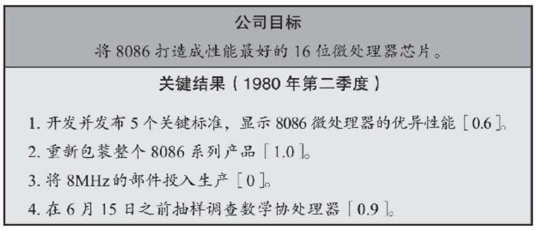

# 0110. 利器3：责任追踪

我们信仰上帝。除了上帝，其他所有人都必须用数据说话。

—— 爱德华·戴明（美国质量管理大师）

OKR 系统有一个优点常常被低估，这就是它的可追踪性，这一特性使得我们可以根据实际情况对 OKR 系统不断进行修改或调整。传统的目标管理体系非常僵化，管理者设定了目标，但是，这些目标不容易调整，还容易被遗忘。相反，OKR 系统是灵活的，就像充满活力、会呼吸的有机体。OKR 系统的生命周期可以分为三个阶段，下面我将逐一介绍它们。

## 10.1 启动

虽然常用的目标管理软件也可以启动并运行一个 OKR 程序，但是它有一个问题 —— 无法扩展。当一家世界 500 强公司试图加速目标制定节奏时，它便遇到了麻烦。这家公司的 8.2 万名员工都尽职尽责地在电子文件夹中记录了年度目标，这意味着每季度 OKR 的变动将使全年产生 32.8 万份文件。从理论上说，这些目标都是公开的，但谁会有耐心去寻找目标之间的联系或一致性呢？如果你共享的目标根本就没有人能看到，那么，这个系统能算是透明的吗？

2014 年，比尔·彭斯（Bill Pence）开始担任美国在线的全球首席技术官。他发现，公司的最高层级目标和各业务部门的目标都是用电子表格来呈现的，并用这些表格进行层层传递。彭斯说：「这些目标从来没有一个统一的平台，就像人没有家一样，因此，目标无法与每天的日常工作联系在一起。」同时，目标没有及时更新，就使得这些目标没有很强的关联性，这也导致计划与现实之间的差距日益扩大。在每个季度末（更糟的是年底），我们就只剩下像「僵尸」一样的 OKR，这纯粹是纸上谈兵，毫无实际意义。

当员工们能真正看到他们的工作是如何为公司的成功做出贡献时，他们才是最投入的。日复一日，年复一年，公司一直在努力寻找可以衡量员工贡献度的有效工具。外在奖励 —— 比如年终奖金，仅仅是对员工们过去所做事情的表彰，这体现的是工作的外部价值。OKR 则不同，它更有影响力，能够让员工们体悟到工作本身的内在价值。

随着结构化目标设置标准的提高，越来越多的组织开始采用功能强大、专业且基于云服务的 OKR 管理软件。一流的 OKR 软件平台包括移动应用、自动更新、分析报告工具、实时警报，以及与 Salesforce、JIRA 和 Zendesk 等软件产品的整合。只需要三四次点击，用户就可以在数字指示板的引导下创建、跟踪、编辑 OKR，以及给他们的 OKR 打分。这些平台使得 OKR 对组织的变革产生了很大的价值，这主要体现在以下几个方面。

1、OKR 系统让每个人的目标更加清晰。用户可以直接访问 OKR 系统中老板、直接主管和整个组织的目标。

2、OKR 系统有利于驱动团队的积极性。当员工知道自己在做正确的事情时，保持积极性和斗志就更容易。

3、OKR 系统有利于提升内部网络效率。透明的平台可以引导个体与有共同职业兴趣的同事一起工作。

4、OKR 系统有利于节省时间、金钱，同时减少挫折。传统的目标设置方法在会议记录、电子邮件、电子文档和幻灯片等事情上浪费了大量时间，有了 OKR 管理平台，所有相关信息都可以在需要的时候就准备就绪。

在美国在线公司，首席执行官蒂姆·阿姆斯特朗曾经认为公司的目标「太过脱节」，比尔·彭斯回忆道：「公司的目标之间毫无联系，上下级目标也没有关联起来，年度目标和员工的日常工作也似乎没有清晰的联系。」2016 年，阿姆斯特朗引进了一个 OKR 专业软件平台，并在公司全面推广。彭斯说，这一举措让公司的目标变得更加透明，且让目标实时、紧密联系起来，有力地促进了公司协调运营。

## 10.2 OKR 导师

要使 OKR 系统有效地发挥作用，整个组织，包括高管团队都需要使用这套系统，没有例外，也不能随意退出。在推广和应用 OKR 系统时，的确会有一些人适应得慢一些，当然，也会有人抗拒，有人以各种借口拖延。为了促使这些人尽快应用 OKR 系统，最好的做法是指定一个或几个人作为 OKR 系统的「导师」。多年来，谷歌产品部门的这一角色由高级副总裁乔纳森·罗森伯格担任。下面是乔纳森发布的一个备忘录，出于保护隐私的原因已经把落后者的名字删除了。

发件人：乔纳森·罗森伯格

时间：2010 年 8 月 5 日，14：59

主题：13 名产品经理没能完成 OKR

正如你们所知，我坚信拥有一套良好的季度 OKR 是谷歌取得成功的关键所在。这就是为什么我会按时给你们发送备忘，提醒你们按时完成任务，以及我为什么要求经理们审查 OKR 以确保我们所有的目标与关键结果都是好的。我尝试过许多种备忘，有些效果很好，有些一般。我最得意的是 2007 年 10 月用「乔纳森的绝望之坑」来给你们制造危机感和 2008 年 7 月为近乎完美的业绩而庆祝。随着时间的推移，我反复使用这种胡萝卜加大棒的方法，直到我们达到近乎 100% 的遵从。耶！

然后我不再发送备忘了，现在让我们看看发生了什么：这个季度，你们当中的几个人没有按时完成你们的任务，还有一些人没有给第二季度 OKR 评分。事实证明，发送什么类型的备忘并不重要，重要的是这一季度我没有给你们发送任何备忘！没有完成的名字已经注明如下（有部分人被判定为通过，比如一些新加入谷歌 AdMob 部门的员工；还有一些人虽然错过了截止日期，但在 7 月完成了目标）。

如今我们面临着众多机会（搜索、广告、展示、YouTube、安卓、电视、移动、社交……），如果你不能想出一个让你每天都充满激情来上班的目标与关键结果，那么一定有什么地方出错了。如果你的情况正是如此，请你来找我。

同时，请你们按时完成 OKR，并给你们上一个季度的 OKR 评分，做好这件事并及时发布，以便你们内网页面的 OKR 链接能正常工作。这不是行政性的繁忙工作，这是确定本季度工作重点并确保我们的团队在一起工作的重要方法。

乔纳森

## 10.3 时时追踪

人们为什么对 Fitbit 公司开发的健身测试程序如此狂热，是因为人们渴望知道自己每天是如何取得进步的，每天都会有一个新的起点，每天都能够看到自己的点滴进步。研究表明，取得可量化的进步相比公众的认可、金钱刺激或实现目标本身，对人更有驱动力。[1]《驱动力》一书的作者丹尼尔·平克（Daniel Pink）非常认同这一观点，他说：

对个体来说，最大的激励因素是「在工作中取得进步」。人们取得进步的时候是他们感到最积极、最投入的时候。[2]

大多数目标管理软件平台使用视觉辅助工具来显示目标和关键结果的进展。与 Fitbit 提供的程序和步骤不同，OKR 系统不需要进行每日跟踪，但是需要定期检查 —— 最好是每周一次，这是防止绩效下降的必要措施。正如彼得·德鲁克所言：

如果没有行动计划，经理人就会成为业务事项的俘虏。随着业务的发展，如果不设置检查点对计划进行检查，经理人就无从知道哪些业务事项是真正重要的，哪些事项仅仅是分散精力的干扰事项。[3]

正如第 4 章所指出的，「写下目标」这一简单行为可以增加你达成目标的可能性；如果你在与同事共享目标的同时，还能够监视目标的进程，那么你的胜算就会更高。这是 OKR 系统两个核心的特征。在美国加州开展的一项研究表明，记录自己的目标并向朋友每周发送进度报告的人，比那些只设定目标而不分享进展情况的人，达成目标的可能性要高出 43%。[4]

适应性是 OKR 系统的核心特征。它们是 OKR 系统的「护栏」，而不是限制目标达成的「锁链」，或者使人看不到目标的「眼罩」。当我们跟踪和审核目标与关键结果时，我们在任何一个时刻都有以下四个选择。

1、继续：如果目标处在绿色区域里，这表示目标处在正常的追踪之中，不需要去调整它。

2、更新：如果目标处在黄色区域里，它提醒我们需要对目标进行「特别注意」了，需要对关键结果或目标进行调整，以适应工作流程或外部环境的变化。为了实现目标，我们可以采取哪些不同的做法？需要修改时间节点吗？我们是否需要暂缓其他的计划来为这个项目配置更多资源？

3、开始：只要有需要，随时都可以重新启动一个新的中期 OKR。

4、停止：如果目标处在红色区域里，这就提示要达成目标已经有很大「风险」了，当前的目标已经没有用了，最好的解决方案可能是放弃。[5]

应用实时指示板的目的是对目标的进度进行量化管理，并标记需要注意的内容。虽然 OKR 系统为很多人提供了一种积极的推动力量，但是它也能阻止我们朝错误的方向越行越远。正如史蒂芬·柯维（Stephen Covey）所指出的：

如果梯子不是靠在正确的墙上，我们所走的每一步都只会让我们更快地到达错误的地方。[6]

当你跟踪你的 OKR 以获得持续的反馈时，你在目标管理方面就不会出现时好时坏的结果，也不会经常出现一些令人惊奇的事情。好消息也好，坏消息也罢，这些就是现实。在这个过程中，「人们可以从失败中学习，继续前进，挫折中也孕育着未来成功的机遇」。[7]

当在学校的信息提醒平台上开发出收费服务和点对点的支付系统时，这个项目完全失败了。「没有人使用它。」布雷特·科普夫说，「显然它没有清晰地解决问题。我们立刻改变了开发目标，建立了一个事件驱动系统，老师在系统中可能会说，‘我下周要去实地考察。你会来吗？你要付款吗？’这改变了一切。它开始被广泛使用并疯狂地成长。」

当一个关键结果或目标变得过时或不切实际时，就要当机立断地结束它。没有必要顽固地坚持一个过时的预测 —— 从你的列表中删除它，然后继续前进。目标是为目的服务的，而不是为其他事项服务的。

这里需要附带说明，当一个目标在 OKR 评估周期结束前被删除时，通知每个与它有关系的人是很重要的。这也给我们带来一点反思：本季度开始时，有什么是我没有预见到的？我能得到什么教训以指导未来？

为了达到最好的效果，下属和管理者每个季度都要对 OKR 进行几次详细的检查，包括报告进展情况、识别障碍、改进关键结果等。在进行一对一检查的基础上，团队和部门还需要定期举行会议，逐一评估共同目标的进展情况。如果一个承诺的 OKR 失败，团队就会制订一个补救计划。在谷歌，团队对 OKR 检查的频率并不固定，而是根据业务需求、预测与执行之间的差距、团队的内部沟通，以及团队的规模和位置等变量的变化而变化。比如，团队成员越分散就越需要更频繁的检查。谷歌公司对 OKR 的检查基准是每月至少进行一次，尽管对目标的讨论时时刻刻都可以进行，但是，正式的会议通常是由董事会组织召开的。

## 10.4 总结：清零与重复

OKR 不会因工作完成而过期。在任何数据驱动的系统中，事后的评估和分析都可以挖掘出巨大的价值。不管是一对一的沟通还是团队会议，这些总结都包括三个部分：客观评估、主观自我评估和反思。

### 10.4.1 客观评估

在给 OKR 评分时，我们会评估已经取得的成绩，并讨论若想以后取得更好的绩效需要采取的不同方式。如果 OKR 得分低，那么就需要重新评估：目标是否仍然值得追求？如果答案是肯定的，需要做出什么改变来实现它？

在最先进的目标管理平台上，OKR 的得分是系统自动生成的，数据是客观的，不需要人工统计。而在自动化程度较低的目标管理平台上，用户可能需要自己计算得分。给一个目标结果打分最简单、最明确的方法是通过计算其相关关键结果的百分比完成率。谷歌使用 0~1.0 分作为计量标准：

0.7~1.0分=绿色（目标完成）[8]

0.4~0.6分=黄色（目标取得了进展，但没有完成）

0~0.3分=红色（目标失败）

英特尔公司也采取了类似的评估模式。你可能还记得「粉碎行动」这一项目的 OKR，英特尔试图通过该行动夺回微处理器市场。以下是安迪·格鲁夫从 1980 年第二季度开始发出的指令，得到了他的执行团队的认可（括号内是在季度末他们取得的成绩）。

这些分数是按照以下方式来确定的。

我们完成了 5 个指标中的 3 个，基准得分为 0.6，在绿色区域的边界线上。

基于 iAPX 这条新产品线，我们重新打包了 8086 产品系列。这个目标完成得非常完美，得分 1.0。

5 月初制定了生产 8MHz 部件的目标，这是一次惨败。由于原料多晶硅的问题，这个目标不得不推迟到 10 月进行，因此这项得分为 0。

至于数学协处理器，我们的目标是在 6 月 15 日之前将 500 个零件发货。我们最后装运了 470 个，得分 0.9，目标得分在绿色区域。

总的来说，在这一个目标上，我们的关键结果平均完成率是 62.5%（即0.625分），这也算是一个不错的结果。英特尔公司董事会认为，尽管这个得分低于预期，但还是可以接受的，因为他们知道管理层设定的目标非常高，且雄心勃勃。通常情况下，我们都知道我们不可能实现所有的目标。如果一个部门 100% 实现了目标，董事会就会认为该部门的目标定得太低了，这样反而会有麻烦。

### 10.4.2 自我评估

在评价 OKR 的绩效时，目标制定者的想法和主观判断可以对客观数据进行一定程度上的提高。在既定的季度，任何一个既定目标的达成都会受到环境的影响，都可能出现「情有可原」的情况。有时，数据不太理想并不代表团队一定不努力，漂亮的数据背后也可能存在人为造假。

假设团队的目标是开发新客户，你个人的关键结果是打 50 个营销电话。最终你给 35 个潜在客户打了电话，获得 70% 的得分，你是成功了还是失败了呢？数据本身并没有给我们提供太多的参考。但是如果你打出的这些电话中有许多都持续了几个小时并成功招募了 8 个新客户，你可能会给自己一个完美的 1.0 分。反过来说，假设你一拖再拖，最后在很短的时间内飞速地打完了 50 个电话，但只签了一个新客户，你可能就只能给自己的绩效打 0.25 分 —— 因为你本来可以更努力。这里需要反思的是，关键结果是否应该是带来了多少新客户，而不只是打了多少个电话？

或者假设你是一名负责公共关系的管理者，你的团队的关键结果是发表三篇在全美有影响的关于自己公司的文章。虽然你只发表了两篇文章，但其中有一篇是《华尔街日报》的封面故事，从数据上来看，你的原始分数只有 0.67%，但你可能会说：「我要给我们团队打 0.9 分或者 1.0 分，因为我们出色地完成了任务。」

表10.1 评分和评估的变量

谷歌鼓励员工对他们的 OKR 进行自我评估，但自我评估结果只是作为参考，并不是最后得分。正如前商业运营高级副总裁夏娜·布朗（Shona Brown）向我解释的那样：「评估的目的不是区别目标结果落在红色、黄色还是绿色区域里，而是通过这种评估让他们看到他们所做的一切如何与公司的总体目标相联系。毕竟，目标和关键结果是为了让每个人都做正确的事情。」

自我评估效果因人而异，有些人对自己要求严格，有的人却刚好相反。无论哪种情况，都需要一个机敏的调解人或团队领导参与并帮助重新校准。最后，和客观数字相比，基于情景的反馈和团队内部的广泛讨论更重要。

OKR 评分明确了工作中哪些是正确的，哪些是错误的，以及团队如何改进，自我评估可以更好地驱动制定下一季度的目标。在这里，没有批评，只有学习。

### 10.4.3 反思

OKR 是以行动为导向的，但是，如果只是不懈努力而没有偶尔停下来反思，这跟永不停止的「仓鼠轮」没有什么分别。在我看来，若想达到令人满意的结果，关键是制定出野心勃勃的目标，并努力实现大部分目标，在适当的时候要停下来对取得的成就进行反思，并不断地重复这个过程。

哈佛商学院的一项研究发现：「如果能与反思相结合，从直接经验中学习就会更有效。也就是说，要有意识地去总结、提炼和阐明关键的经验教训。」美国著名的哲学家、教育家约翰·杜威说得更直接：「我们并不是从经验中学习，而是通过反思经验来学习。」[9]

以下几点是关于 OKR 周期结束时的反思。1）我是否完成了所有的目标？如果是，是什么促成了我的成功？2）如果没有，我遇到了什么障碍？3）如果我要重新写一个完整的目标，需要做什么改变？4）我学到了哪些经验，可以帮助我更有效地制定下一个周期的 OKR？

对 OKR 进行总结，既要回顾过去，又要展望未来。上季度未完成的目标有可能会转移到下一个季度，重新匹配一组全新的关键结果；也有可能这个目标就过时了，抛弃它更为合适。不论怎样，良好的管理判断能力是最重要的。

另外还有一点，在对工作进行彻底评估，找到自己的不足之后，请深呼吸，尽情享受你们的进步。如果条件允许，请和团队一起开个派对来庆祝你们正在从 OKR 中获得强大的力量。事实上，你们已经获得了这种力量。

[1] Teresa Amabile and Steven Kramer,The Progress Principle:Using Small Wins to Ignite Joy,Engagement,and Creativity at Work(Boston:Harvard Business Review Press,2011).

[2] Daniel H.Pink,Drive:The Surprising Truth About What Motivates Us(New York:Riverhead Books,2009).

[3] Peter Drucker,The Effective Executive:The De finitive Guide to Getting the Right Things Done(New York:Harper&Row,1967).

[4] Research by Gail Matthews,Dominican University of California,www.dominican.edu/dominicannews/study-highlights-strategiesfor-achieving-goals.

[5] 通常情况下，这适用于某个关键结果，或者你正在进行的某件事。一个经过深思熟虑的既定目标不太可能在 90 天内崩溃。

[6] Stephen R.Covey,The 7Habits of Highly Effective People(New York:Simon&Schuster,1989).

[7] 「Don’t Be Modest:Decrypting Google,」The Economist,September 27,2014.

[8] 谷歌以 0.7 分作为目标的分界线，反映了员工制定目标时的雄心勃勃（见第12章）。这个门槛并不适用于公司的既定运营目标。对于销售目标或产品发布目标，任何低于 1.0 的分数都会被视为失败。

[9] Giada Di Stefano,Francesca Gino,Gary Pisano,and Bradley Staats,「Learning by Thinking:How Reflection Improves Performance,」Harvard Business School working paper,April 11,2014.
