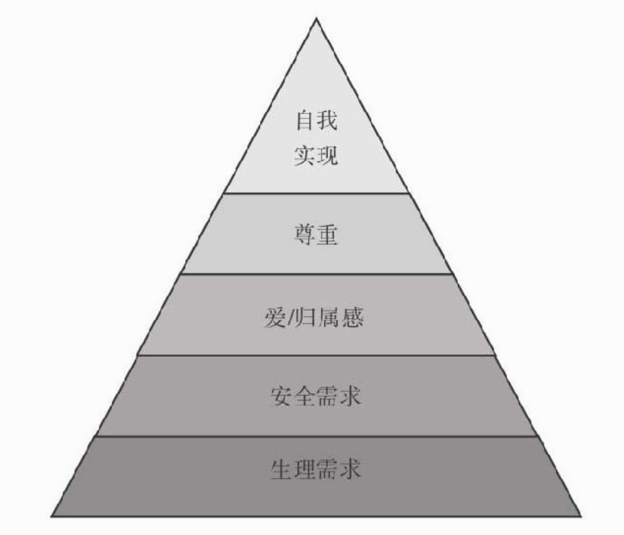

# 0112. 利器4：挑战不可能

最大的风险是什么也不做。

——米勒迪·霍布森

OKR 促使我们远离舒适区，带领我们超越能力的边界，不断向梦想靠近。它能够发掘新的能力，孕育出更多极具创造性的解决方案，同时还能够促进商业模式的革新。如果一家公司想要取得长足发展并持久地保持兴旺发达，突破极限、勇攀高峰的信念是必不可少的。[1] 正如比尔·坎贝尔所说：「如果公司做不到持续创新，他们必将走向灭亡——请注意，我说的是创新而非重复。」[2] 保守的目标设定会阻碍创新。创新就如同氧气，没有它，你就无法呼吸，就无法取胜。

当挑战性目标的选择恰当而明智时，所获得的回报是和风险对等的，甚至远远超过其所需承担的风险。正如吉姆·柯林斯在《从优秀到卓越》中所言，要敢于设定「胆大包天的目标」（Big Hairy Audacious Goals，BHAG），要相信星星之火可以燎原：

BHAG 就是一个胆大包天的目标，也像是一座等待被征服的巨大山峰。它清晰可见，又极具诱惑力，是人们渴望即刻能够「到达」的地方。这个宏伟的目标聚焦了所有人的目光与努力，造就了团队精神，并激发全体员工为了一致的目标而奋勇向前的信念。就像 20 世纪 60 年代，NASA（美国宇航局）的登月计划就是一个充满诱惑又极具挑战性的目标，它极大地激发了人们的想象力与潜能。[3]

埃德温·洛克被誉为结构化目标设定理论之父，他对目标的难易程度与实现程度之间的关系进行了大量实验和实证研究。尽管研究的范围和领域很广泛，但研究结果却出奇一致。洛克写道：

目标设定越具有挑战性，所产生的结果越佳。虽然高难度的目标与其产出结果之间的差距，通常会大于低难度目标与其产出结果之间的差距，但是前者达到的最终结果仍然比后者要好。[4]

研究结果显示，设定具有挑战性目标的员工，不仅会取得更好的绩效，还会提高自我驱动力，以及对工作的投入程度。洛克指出：「设定明确而有挑战性的目标不仅可以提高工作的趣味性，同时也可以帮助人们体会到工作带来的愉悦感。」[5]

2007 年，美国国家工程院邀请包括拉里·佩奇、未来学家雷·库兹韦尔和遗传学家J.克雷格·文特尔在内的一些著名思想家，评估面向 21 世纪的 14 项「挑战性工程」。经过一年的讨论，专家组确定了一系列具有重大意义的挑战性目标，包括从核聚变中产生能量、大脑的逆向工程、防止核恐怖事件、构建安全的网络空间等。想必你也能够清晰地理解这些目标的重要意义。

并非所有挑战性目标都是不同寻常的。有时候，它们就是普通的工作，但是达到了一个非同寻常的水平。不管是从业务范围上，还是从数量规模上，创业者都需要制定挑战性目标。我对创业者的定义是，那些不仅仅思考各种可能性，而且将各种可能性付诸实践的人。[6]

不管是对初创企业，还是市场上的领先企业来说，挑战性目标都有利于塑造创业文化，它迫使人们打破原有的思维局限，让企业经营得更为出色。正如 Edmunds.com 网站的首席数字官菲利普·波特洛夫所说：

我们正试图改变汽车零售业的销售模式，这是一个巨大的挑战，也是一个难得的机遇。OKR 是我们实现「变革一个行业」这个宏大而疯狂目标的唯一途径，这也是为什么 OKR 现在是并将始终是指导我们前行的中枢神经。

实现宏大目标需要依赖于 OKR 系统所产生的巨大力量。专注和承诺是达成目标并实现真正差异化的必备条件。只有透明、协作、目标一致且内在联结度高的组织才能比其他常规组织走得更远、更久。但是，如果缺乏有效追踪，你将如何得知自己何时才能达成挑战性目标呢？

### OKR 的两个「篮子」

谷歌将他们的 OKR 分为两类，一类称为承诺型目标，另一类称为愿景型（或挑战性）目标，二者有着本质的不同。

承诺型目标与谷歌的日常考核指标紧密相连，比如产品发布、预订、招聘、客户。管理层从公司层面来设定目标，员工则从部门层面设定目标。一般来说，这些承诺型目标（如销售目标和收入目标）应在规定的时间内全部完成（100%）。

挑战性目标反映了更宏伟的蓝图、更高的风险，以及更侧重于未来导向。他们可以来自任何层面，旨在调动整个组织的积极性与活力。由挑战性目标的定义就不难看出，它们是极难实现的（平均失败率为40%），但仍然是构成谷歌 OKR 的一部分。

这两个篮子的相对权重与组织文化息息相关。不同组织，甚至同一组织在不同季度都会有所不同。领导者必须思考：未来一年我们要成为什么类型的公司？是迅速而果断地去开拓一个新的市场，还是采取保守稳健的战略去巩固我们现有的市场地位？我们是采取生存第一的保守投资模式，还是进行风险投资以获取高额回报？我们当前的业务到底需要什么？

## 01. 我们需要挑战

安迪·格鲁夫是心理学家亚伯拉罕·马斯洛的粉丝，后者因提出「需求层次理论」而在 20 世纪中期闻名于世。按照马斯洛的理论，人们的需求共分为生理需求、安全需求、爱/归属感、尊重和自我实现等 5 个等级，只有当我们的低级需求得到满足后，我们才会转向更高层次的需求。

对需求层次理论的深刻洞察使格鲁夫逐渐发现：对于一些人而言，即便没有外部激励，他们仍然能够不断进行自我激励，挑战自己的能力边界并努力实现「自我超越」。这样的雇员是经理们梦寐以求的，因为他们从不会止步于自我满足。但是，格鲁夫也明白，并非每个人都是天生的王者。对于其他人来说，挑战性目标有助于实现最大产出：

如果领导者希望自己和下属都能取得最佳绩效，那么，设定挑战性的目标就是非常必要的。[7]

马斯洛的需求层次金字塔

英特尔公司在冒险方面非常值得学习，那里也是我开始体验挑战的魅力和学会勇于试错的地方。在「粉碎行动」中，我们通过发动一场「要么做，要么死」的战役去占领 16 位芯片微处理器市场，这个项目最终的目的是广泛传播 8086 微处理器的优势。对于销售人员，则根据其获得的设计合约数量进行评估。在比尔·达维多的带领下，「粉碎行动」设定了我所见过的最大胆的目标——一年内赢得 1000 个设计合约，这比前一年的销售量高出 50% 之多。英特尔公司微处理器业务总经理戴夫·豪斯回忆了当时发生的事情：

这是在英特尔，因此你必须想方设法实现挑战性目标。我记得吉姆·拉利说过，我们需要赢得 1000 个设计合约。这是一个数字，而且是一个看上去十分巨大的数字。随后，当我们制订计划时，不知为何，这个数字竟变成了 2000。而这一令人震惊的数字最终成为我们的营销目标。[8]

2000 个设计合约意味着每个销售人员每月需要获得一个设计合约。管理层要求我们的现场销售代表将这样一个不受欢迎的芯片微处理器的销量增加 3 倍，而事实上，很多长期客户都已经放弃使用它了。最终，销售人员失败了，并受到了很大的打击，现在这一目标在他们眼中就像是珠穆朗玛峰一样可望而不可即。当我最近问比尔·达维多为何设定如此高的目标时，他回答说：

我之所以选择 2000 这个数字，是因为我认为我们需要一个「凝聚点」，而这个数字恰恰是凝聚力的塑造点。

公司给销售人员制定了激励政策，奖励所有实现目标的员工一次大溪地双人旅行。后来，吉姆·拉利又增加了一项巧妙的规定：如果团队中有一个人没有实现目标，那么他所在的整个团队都会失去这次旅行的机会。刚开始时，业绩严重落后于目标标准，在任务的压力下，团队不得不思考是否应当放宽标准。但是，就在那年夏天，介绍大溪地的全彩小册子神秘地进入每个销售人员的家庭邮箱。于是，到第三季度时，落后者开始感受到了巨大的压力。[9]

年底时，整个计划共获得了 2300 个设计合约，超过了既定的目标。8086 微处理器在市场上占有了绝对优势，英特尔的未来得以保证，而令人振奋的是，几乎整个销售队伍都去了大溪地。而这一切都是因为制定了一个挑战性目标，是它让一切都变得不同。

## 02. 「10倍速」原则

OKR 管理方法给公司的员工带来雄心壮志。如果安迪·格鲁夫是 OKR 过去的终极守护神，那么，拉里·佩奇就是 OKR 今天的大神父。在技术上，谷歌代表无限创新和无止境的发展。在 OKR 领域里，谷歌的名字就代表着指数级增长的目标，或者作家史蒂芬·列维所说的「10倍速」原则。[10]

让我们来看看 Gmail 邮箱的故事。早期，基于网页版的电子邮件系统的主要弊端是存储量太小，通常为 2~4MB。用户不得不删除旧电子邮件以腾出空间给新的电子邮件，邮件存档就像是一个白日梦那样不现实。于是，在 Gmail 的研发过程中，谷歌的领导者认为需要提供 100MB 的存储容量——这是一次巨大的升级。但到了 2004 年，当产品对外发布时，这个 100MB 的目标早已被抛诸脑后，取而代之的是 1GB 的存储容量，是竞争对手的整整 500 倍。用户永久保存电子邮件的梦想得以实现，数字通信也由此发生了划时代的改变。

胆大包天的目标就如同我的朋友般，与我形影不离。Gmail 改进的不仅仅是现有的邮件系统，还彻底改变了这一领域，并迫使竞争对手不得不进行颠覆式的改变来提高自己的能力以便参与这场游戏。在任何组织，这种「10倍速」的思维都是很少见的。拉里·佩奇指出：「大多数人倾向于认为某件事是不可能的，而不是回归现实世界的本源去寻找可能实现它的机会。」[11]

在《连线》杂志的访谈中，史蒂芬·列维对此进行了详细阐述：

正如佩奇所说，10% 的改进意味着你和其他人一样，你们在做着同样的事情。你可能不会失败，但你也绝不会太成功。这就是为什么佩奇期望谷歌的员工能够创造出比竞争对手好 10 倍的产品和服务。这也意味着他不会满足于公司通过提升效率或者技术上的小创新获得适度的增长。要得到「10倍速」的改进，需要对问题进行反思，探索技术上的可能性，并在此过程中感受到乐趣。[12]

在谷歌，按照安迪·格鲁夫原来的标准，雄心勃勃的 OKR 被实现的可能性通常为 60%~70%。换句话说，至少有 30% 的目标在设定时就被认为是达不到的。这样就已经可以认为是成功的了。

谷歌推出的产品 Helpouts 和 Google Answer，都曾遭遇了很大的失败。[13] 设定看似遥不可及的目标，不仅需要想象力，更需要承受失败。在目标行动刚开始启动的阶段，没有一个目标看起来是可能实现的。所有谷歌员工都被迫进行更深刻的思考：我们是不是需要考虑一些激进的高风险行动？需要暂停哪些业务？我们可以在哪里获得资源或找到新的合作伙伴？然而，在目标截止日期来临之前，这些看似不可能的目标中还是有一小部分完全实现了。

「10倍速」思维在行动！埃里克·施密特、拉里·佩奇和谢尔盖·布林与谷歌的第一辆自动驾驶汽车，2011 年

## 03. 挑战性目标的调整

要想获得成功，挑战性目标就不能一成不变，你也不能好高骛远，不考虑实际情况而强行设定高目标。对你的团队而言，过分追求速度和进度反而会导致拔苗助长的结果。在追求高付出、高风险的目标时，员工的认可是至关重要的。领导者必须给员工传达两件事：结果的重要性和结果能够被实现的坚定信念。[14]

很少有企业能够拥有谷歌这样的资源和实力，能够在一个宏大的计划失败后仍然屹立不倒。每个组织都有一定的风险承受能力，这可能会随着时间的推移而发生变化。承担风险的边际能力越大，公司就越有能力扩展其业务规模。例如，无论领导怎样认为，OKR 有 40% 的失败率可能看起来都太冒险、太令人沮丧了。对于高成就者来说，任何不完美都会有损士气。阿米莉亚·梅里尔曾在加利福尼亚州的一家风险管理解决方案公司担任人力资源部门负责人，她说：「在这里，更多的是强调结果而非员工。这里的人习惯去获得 A，他们不会满足于得到 B。不争取达到 100% 的目标在这里行不通，因为他们的文化就是如此，很难改变。」

在减肥宝，迈克·李认为，所有 OKR 都是一个必须承诺完成的目标。他说：「没错，它们也许是困难且苛刻的，但却是需要完全实现的。我会在我认为应该达到的地方设定目标。如果我们能够全部完成，那我会对我们的进展感到非常满意。」这是一个合理的方法，但并非没有缺陷。当目标只完成了 90% 的时候，迈克团队的人是否会觉得惭愧呢？在我看来，更好的做法是领导者将目标设定在一个适度的范围。随着时间的推移，当团队和个人对实现 OKR 的经验都不断得以丰富后，他们设定的关键结果自然会变得更加精确，更加有挑战性。

并没有所谓的完全「正确」的挑战性目标。但请慎重思考：你的团队是如何创造最大价值的？「令人不可思议」的目标是什么样子的？如果你追求卓越，那么这样一个「令人不可思议」的挑战性目标就是一个好的起点，但绝不像安迪·格鲁夫说的那样，是该停下的地方：

你要知道，在我们的工作中，我们必须为自己设定让自己感到不适的极具挑战性的目标，然后我们必须要实现它。随后，我们必须在短暂的庆祝后为自己制定另一套非常难以达到的目标，然后又必须实现它。而实现这些具有挑战性的目标的奖励之一便是，你能够不断获得晋级的机会。[15]

[1] Steve Kerr,「Stretch Goals:The Dark Side of Asking for Miracles,」Fortune,November 13,1995.

[2] Podcast with Randy Komisar,soundcloud.com,February 2,2016.

[3] Jim Collins,Good to Great:Why Some Companies Make the Leap...and Others Don’t(New York:HarperCollins,2001).

[4] Edwin A.Locke,「Toward a Theory of Task Motivation and Incentives,」Organizational Behavior and Human Performance 3,1968.

[5] Edwin A.Locke and Gary P.Latham,「Building a Practically Useful Theory of Goal Setting and Task Motivation:A 35-Year Odyssey,」American Psychologist,September 2002.

[6] 相反，官僚主义者就是只思考各种可能性，但不去实践的人。

[7] Andrew S.Grove,High Output Management(New York:Random House,1983).

[8] 「Intel Crush Oral History Panel,」Computer History Museum,October 14,2013.

[9] William H.Davidow,Marketing High Technology:An Insider’s View(New York:Free Press,1986).

[10] Steven Levy,「Big Ideas:Google’s Larry Page and the Gospel of 10x,」Wired,March 30,2013.

[11] Eric Schmidt and Jonathan Rosenberg,How Google Works(New York:Grand Central Publishing,2014).

[12] Levy,「Big Ideas.」

[13] nterview with Bock.

[14] Locke and Latham,「Building a Practically Use ful Theory of Goal Setting and Task Motivation.」

[15] iOPEC seminar,1992.