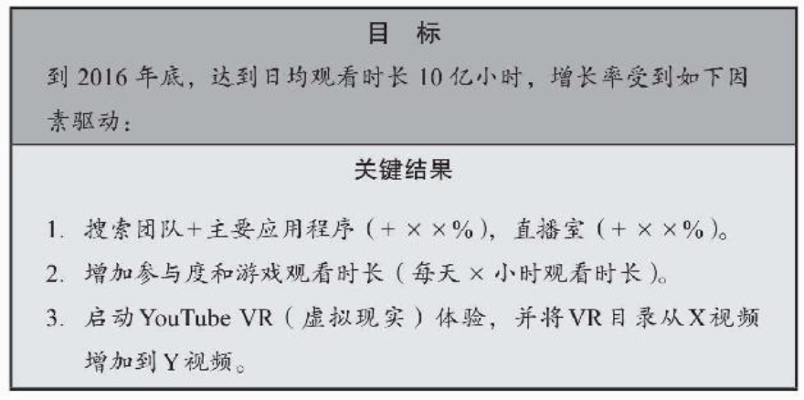

# 0114. 延展：YouTube 的故事

在上一章，我们了解了谷歌公司痴迷于制定挑战性目标的故事，你可能觉得仅有这一个案例不够过瘾，那么，在这一章我们就一起来看看另外一个经典案例故事：YouTube 如何利用 OKR 实现公司用户数的几何级增长？

苏珊·沃西基被《时代》杂志评价为互联网行业最具影响力的女性领导者。[1] 她是谷歌公司第 16 位员工，在公司成立伊始就发挥了核心作用，并且担任过公司的第一任市场经理。1998 年 9 月，谷歌公司刚成立时，苏珊·沃西基就将她在门洛帕克的车库出租给谷歌，作为其第一个办公场地。8 年后，当许多分析人士怀疑 YouTube 能否存活下来的时候，又是苏珊·沃西基坚持说服谷歌董事会收购了 YouTube。事实证明，苏珊是非常有远见的，她早就预料到在线视频最终会取代网络电视而成为主流。

到 2012 年，YouTube 已经占据了市场领先地位，并成为世界上最大的网络视频平台之一。但是，和创业时期相比，它的创新热情已经开始减退。我们知道，热情就像开车，一旦踩了刹车，再提速就会变得十分困难。那时，苏珊已经晋升为主管广告和商业业务的高级副总裁，她对关键词广告的商业模式进行了重新构思，并找到了从相关广告业务中获利的新途径，鉴于此，苏珊帮助谷歌的两大广告业务成功找到了赢利模式。

2014 年，作为 YouTube 的新任首席执行官，她别无选择，接受了一项十分具有挑战性的目标：在 4 年的时间里，实现 YouTube 日均视频播放时间达到 10 亿小时，这是一个「10倍速」的增长目标。然而，苏珊不想不惜一切代价去实现这种增长，而是希望本着对公司和用户负责的态度去实现这种增长。于是苏珊同主管 YouTube 工程的克里斯托斯·古德洛一起停止了他们那时的工作，并通过 OKR 来实现这一宏伟的增长目标。

苏珊·沃西基和她在门洛帕克的车库，这里是谷歌创业开始的地方

挑战性的目标令人振奋，因为它可以通过彻底且能量化的改进计划，来迫使一个老态龙钟的组织恢复紧迫感，激发活力，并从中获得巨大的收益。正是因为使用了 OKR 管理方法，一度让 YouTube 陷入困境的网络视频业务扩展到了如今超过 10 亿用户的规模，其用户占互联网总用户数的 1/3 左右。YouTube 网站可以在 80 多个国家，用超过 70 种语言浏览。它的移动平台比任何有线或广播网络都拥有更多的用户，这些用户的年龄主要集中在 18 到 49 岁。

一切事情的发生都不是偶然的，也不是因为受到了上天的恩泽与眷顾，而是需要遵循并严格执行 OKR 的结构和规则，并在细节上坚持一丝不苟。此外，还需要明确的是：在 YouTube 开始追求其极具挑战性的宏伟目标之前，它必须要弄清楚，只有抓住问题的症结才是实施一切方案的基础。

以下是苏珊·沃西基及其同事古德洛对这一项目的讲述。

苏珊·沃西基：我最初将车库租给拉里和谢尔盖的时候，并非是对谷歌这个公司感兴趣，我仅仅是想收他们的租金而已。后来，我对他们加深了了解，更多地知晓了他们看待和思考问题的方式。当时，我早已有了开办自己公司的想法，但我发现，拉里和谢尔盖更有能力实现它们。不久，我发现如果有一天谷歌搜索不存在了，我将无法完成我的工作。于是我意识到，谷歌已成为我生活中不可或缺的工具，没有它我将无法生活。我想，也许对每个人来说都是这样的吧！

1999 年秋天，当约翰·杜尔与我们谈论 OKR 时，我已经加入谷歌了。那时，谷歌已经搬出了我的车库，我们将公司搬到了山景城湾岸公园大道 2400 号，那里是太阳微系统公司的一所旧工厂，整栋建筑的面积。

可能达到了 4.2 万平方英尺（约3900平方米），然而我们的办公区域不到一半。于是我们就在给其他人预留的另一半办公区举行 OKR 会议。我至今还记得约翰对 OKR 这个概念的解释：「这是一个目标，也是要实现的关键结果。」他还用橄榄球比赛做比喻，来说明 OKR 是如何被贯彻执行的。有一天，在我整理一些文件并对它们进行分类时，发现了约翰当年的演示文稿，这些文稿被制作成胶片，通过老式投影仪来展示。现在看起来，它们已经很老旧了。

拉里和谢尔盖喜欢与思维清晰、知道自己想要表达什么的人交谈。我记得他们与约翰发生了争论，但最终还是采纳了约翰的意见。在此之前，他们从未经营过公司，甚至从未真正就职于任何一家大公司。约翰边向里走边说：「这是一个能够在事业上祝你们一臂之力的方法，它既可量化又可追踪。」对拉里和谢尔盖而言，可量化十分具有吸引力，而且他们必须承认一个事实，那就是英特尔公司使用的就是 OKR 管理方法。英特尔这样一家伟大的公司尚且在使用 OKR 这种方法，与它相比，我们这种初创公司更应该尝试一下。

从谷歌的成长经历来看，我不得不承认，OKR 非常适合初创企业用来构建它的企业文化。特别是在创业伊始、资源匮乏的时期，清晰的方向是至关重要的。这就如同教育小孩一样，小时候不立规矩，等到他们长大后再告诉他们「喏，这就是规矩，你必须要守规矩」，他们是不会听的。条件允许的情况下，最好的方式是一开始就告诉他们你的规则。此外，我还看到许多成熟的公司会通过更换人员和流程来扭转局面。我想说的是，没有哪一家公司会因为太年轻而无法采用 OKR 进行管理，对任何公司而言，任何时候开始采用 OKR 都为时不晚。

OKR 需要有专门的组织为依托，还要有一个领导者来掌控整个过程，并需要一名助理人员具体跟进评分并进行审查。当我受拉里的委托，负责在公司实施 OKR 时，我与他的领导团队进行了 4 个小时的会谈。拉里全方位描述了公司的所有目标，他希望每一位成员都清楚这些目标，并为这些目标的实现保驾护航。尽管在谷歌，对 OKR 的指导意见经常是自上而下的，但是这些意见都经过了团队专家深入而广泛的讨论，关键结果也越来越清晰，即找到我们要走的方向，并告诉我们要怎么走到那里。这些耗时较长的会议使拉里能够强调他所关心的事情，并且还能帮助整个团队降低挫败感，特别是围绕我们的产品和所提供的服务而设定的 OKR。他会说：「告诉我你现在的进度。」然后，他接着问：「为什么你不能把它的完成速度提高一倍？」

尽管谷歌现在非常庞大而且业务多元化，我们很难将所做的每件事情及时传达给每一个地方的每一个人，但我们仍然会在每个季度以特殊的视频广播方式召开一次 OKR 会议。在这个会议上，我们将交流和通报公司的顶级 OKR。在 YouTube 前任首席执行官萨拉尔·卡曼加的全力支持下，我们完成了一项惊人的工作，形成了公司的整个 OKR 列表。萨拉尔有一个绝招，他可以把任何事情联系起来。但通常情况下，我们更倾向于在团队内部进行更详细的讨论。时至今日，你依然可以在谷歌的内网上找到 OKR，这些 OKR 实时更新，任何内部员工都可以访问和查看它们。

## 14.1 当你不能打败他们时……

谷歌视频，即我们的免费视频分享网站，于 2005 年就推出来了，比 YouTube 还早一个月。当我开始运营它时，我们为用户上传的第一个剪辑视频是一个紫色的小玩偶唱着一首荒诞的歌。谢尔盖和我无法理解这样的调子。但我的孩子们听后却嚷嚷着：「再放一遍！」于是音乐重新开始，蓝色的小灯又亮了起来。这激发了我们的灵感 —— 让我们在下一代身上发现了商机 —— 我们可以用一种全新的方式帮助人们编辑并在全球发布小视频。于是，我们为此创造了一个链接接口，并收获了第一个让我们倍感惊喜的点击：两个孩子在宿舍里唱着「后街男孩」乐队的歌，另外一个室友则在学习。我们自己也会上传一些专门制作的视频，然而不得不承认，源自用户的视频好像更受欢迎！

谷歌视频的美中不足之处在于，其上传会延迟，这违反了企业产品研发的基本规则 —— 快速，用户上传的视频无法被及时观看。而在 YouTube 上，用户可以及时观看到自己上传的视频。这是一个很致命的问题。不幸的是，当我们解决了这个问题时，我们已经失去了相当大的市场份额，仅为 YouTube 的 1/3。然而 YouTube 也有它的问题，它的发展受到了资金的制约，需求的激增致使它们迫切需要资金来进行基础设施建设，因此不得不将其出售。

于是，我看到了将两个视频服务业务合并的机会。我利用电子表格计算出可以用 16.5 亿美元的价格收购 YouTube，并证明谷歌能够把这笔钱再赚回来。最后，我说服了拉里和谢尔盖。在收购的最后一刻，YouTube 创始人让我将计算出的数据带到董事会会议上，董事们问了很多问题。最终，虽然他们没有完全根据我对用户年增长率的预期进行出售，却给我们亮了绿灯。而且很有趣的是，YouTube 的用户使用量一直以来都在快速增长。

## 14.2 巨石理论

克里斯托斯·古德洛：2011 年 2 月我加入这个团队，比苏珊加入这个团队还要早 3 年，当时我是从谷歌搜索产品到这里来的，正值 YouTube 的 OKR 开始运作的时候。公司那时拥有 800 名左右的员工，每季度会设定上百条 OKR。每一个团队都会打开一个谷歌文档，然后开始设定目标，他们会为每十个人设定三四十条目标，但目标完成率达不到一半。

我认为有两个原因影响了工程师们设定目标的准确性，一方面他们讨厌放弃自己认为的好想法，另一方面他们习惯性地低估了完成任务所需要花费的时间。我在做搜索产品时曾有过同样的经历，那时我们的工程师常说：「多设定几个目标吧，没有关系，我很聪明，我能完成的必然只多不少！」因此我们需要依靠明确的规则迫使人们将其团队目标清单缩减到 3 至 4 个，别小看这一步，它具有非同寻常的意义。因为这使得我们的 OKR 更加严格，也使得每个人都开始明确知晓什么任务才是符合公司最高利益的，应当被优先执行。当我开始在 YouTube 负责搜索业务后，我将谷歌设定 OKR 的方式运用在 YouTube，OKR 才开始显现出作用。

然后，萨拉尔·卡曼加便将 YouTube 技术方面的日常管理权交给了希希尔·梅赫罗特拉（Shishir Mehrotra），于是希希尔开始带领整个公司关注核心问题。他以「巨石理论」来比喻核心问题的重要性。「巨石理论」是由史蒂芬·柯维提出来的。假设你有几块石头，一堆鹅卵石和一些沙子，你的任务是尽可能地把所有东西都装进一个一加仑的广口瓶中。如果你先放沙子，再放入鹅卵石，那么再想放石头时你会发现瓶子已经没有空间留给它们了。然而，当你先放石头，再放鹅卵石，最后放沙子，你会发现一切如你所愿 —— 沙子将石头之间的缝隙填满了。这就告诉我们要善于抓住主要矛盾，重要的事情要先做，否则有可能永远都没有机会去做了。

那么，何为 YouTube 的巨石呢？人们各自忙于自己的工作，看起来好像是「百花齐放」，但是，没有人关注公司最高级、最重要的 OKR。现在，管理层经常问工程师们：「你们的想法都非常棒！但我们是否能从中提取出本季度或者本年度最大的‘石头’，也就是最重要的议题呢？」在此之后，YouTube 的每个人都能够清晰地知道我们的「石头」，也就是我们的首要任务。就这样，我们所有的石头都能够装入瓶子里了。

这是实现目标飞跃的关键一步，接下来的 4 年里，我一直为之奋斗。

## 14.3 更好的衡量标准

YouTube 已经探索出了赢利模式，但对于如何提高点击率却没有清晰的思路。然而，不管是公司还是我个人都很庆幸的是，谷歌搜索团队的一名工程师早已在这方面走在了我们前面。在一个叫 Sibyl 的团队中，吉姆·麦克法登正在开发一个可以引导观众选择「观看下一个」的推荐系统，也就是列出相关的视频或进行「推荐」。显然，它能够对我们点击率的提高产生巨大的影响。但需要思考的是，点击率的提高是我们真正想要的吗？

正如微软首席执行官萨提亚·纳德拉指出的那样：「在一个计算能力几乎无限的世界里，真正稀缺的商品才会越来越受到人们的关注。」[2]

当用户花更多宝贵的时间来观看 YouTube 视频时，这些视频必须能够给他们带来乐趣。这便会形成一个良性循环：更满意的观看带来更长的观看时间，更多的观看会吸引更多的广告商，从而激励更多的内容创作者进行创作，于是又会吸引更多的观众。

我们真正的收益来源不是观看率或点击率，而是观看时长。这个逻辑是毋庸置疑的，因此，YouTube 需要一个新的核心衡量指标。

## 14.4「观看时长」是最重要的衡量标准

2011 年 9 月，我向我的老板和 YouTube 领导团队发送了一封极具刺激性的电子邮件。邮件的核心思想是「关注观看时长，并且只关注观看时长」。这是一个帮助我们重新思考如何衡量成功的提议：「在许多目标上我们与竞争对手都是一致的，但在目标设定上我们需要增加观看时长。」对于谷歌的许多人来说，这听起来就像是「异端邪说」。谷歌搜索设计的初衷是作为一个中转站帮助用户尽可能快地到达其所希望到达的站点。「最长的观看时间」好像看起来与谷歌的这一使命是背道而驰的。此外，强调「观看时长」对视频而言带来的可能是负面影响，因为无论是对观看用户还是创作者而言，这都是一个很严格的衡量指标。最后，更重要的是，强调增加「观看时长」可能会导致收入下降，至少在初期阶段是这样的。由于 YouTube 广告仅在视频开始前播放，因此，较少的点击率意味着较少的广告，而较少的广告则意味着更少的收入。[3]

我的观点是，谷歌搜索引擎和 YouTube 是两个不同的产品。为了让人们更加鲜明地理解这两个业务的不同，我举了这样一个例子：让用户在 YouTube 输入搜索「如何打领结」，然后，我们提供两个关于这个话题的视频。第一个视频时长为 1 分钟，以快速而精准的方式教你如何打领结；第二个视频时长约 10 分钟，以幽默、风趣又搞笑的方式向你讲述如何打领结。然后，我问我的同事们：哪个视频应该在搜索结果中被置顶？

对于谷歌搜索的员工而言，答案很简单：「当然是第一个。如果有人想到 YouTube 上学打领结，我们当然是要帮他们成功学会打领结啊！」

然而我却说：「我想给他们看第二个视频。」

搜索团队集体抗议，他们质疑：「你为什么要那样做？这些可怜的人只是想把他们的领结绑在一起，然后去参加活动而已！」（他们可能在想：这家伙一定是疯了！）但我的观点是，YouTube 的使命与谷歌搜索从根本上是不同的。

用户能够在 YouTube 上学会绑好领结当然很好，如果这就是他们想要的全部，他们会选择 1 分钟的那个教学视频。但这不是 YouTube 的使命，至少不完全是。我们的使命是让用户参与并互动。根据这个逻辑，用户观看 10 分钟视频中的 7 分钟（甚至是 10 分钟视频的 2 分钟）所获得的快乐要远远高于 1 分钟的教学视频。当他们感到快乐时，我们的目的就达到了，我们也会感到更快乐。

这场争论持续了将近 6 个月，我最终赢得了这场争论。2012 年 3 月 15 日，我们推出了以「观看时长」为衡量标准的优化版本，这个版本基于算法为用户进行推荐，旨在提高用户的参与度和满意度。

## 14.5 制定不可思议的「数字」目标

2012 年 11 月，在洛杉矶举行的 YouTube 年度领袖峰会上，希希尔把我们几个人召集到一起。他表示，他即将宣布一个更大的挑战性目标来启动下一年的工作：日均用户观看时长达到 10 亿小时。

这是一个简单但又很有分量的数字。他问我们：「我们什么时候能完成这一目标？时间框架如何规划？」「日均用户观看时长10亿小时」意味着我们要实现 10 倍速的增长，我们知道这需要花费几年的时间，而不是几个月能做到的。我们认为 2015 年以前完成有点太离谱，而如果到 2017 年完成又有点太慢了。就在希希尔上台演讲之前，我们设定在 2016 年底完成这一目标，为此，我们制定了一项为期四年的 OKR，这四年的目标中包含一系列的年度滚动目标和随季度递增的关键结果。

## 14.6 设置挑战性目标的规则

如果人们不相信挑战性目标是可以实现的，那么它就真的无法实现，这就是设定目标的艺术所在。希希尔是一个非常聪明的管理者，他将我们「胆大包天」的目标分解成一个个小目标。虽然每天 10 亿小时听起来非常恐怖，但它还达不到全世界电视观看时长的 20%。这一背景信息对我们来说很有价值，至少对我来说是一项重要的信息支撑。

我们并不是想任意扩张我们的规模，相反，本来就有比我们规模还大的对手存在着，我们只是想迎头赶上而已。在接下来追逐目标的 4 年中，我们并非机械地坚持「10倍速」增长原则。事实上，为了维护用户的利益，我们甚至会做出一些缩短观看时长的决策。

例如，我们制定了一项政策：叫停「点击诱饵」视频。3 个星期后，这一举动被证明导致观看时长减半。但我们依然坚持这一决策，因为它可以带来更好的用户体验。减少「点击诱饵」，从侧面反映了我们追求的是负责任的增长。3 个月后，这个小组的观看时长已恢复至原有水平，甚至有所增加。一旦「诱饵性」内容变得不易访问，人们就会寻求更令其满意的内容了。

但是，一旦建立了「日均观看时长10亿小时」的宏大目标，我们就会紧紧围绕这一目标开展各项工作，也不会轻易做出任何改变。如果改变可能会减慢我们实现这个目标的进度，那么，我们会仔细估计一下这个变化将在多大程度上影响目标的进度，并且我们一定会在进行改变之前达成内部共识。

## 14.7 加快进度

苏珊：萨拉尔·卡曼加最喜欢的是初创公司，因为他非常擅于将公司引领到下一个发展阶段，他自己也十分享受这种感觉。到 2012 年时，YouTube 已经发展成为一个大型组织，萨拉尔决定继续推动公司向前发展。当时，公司分成了两个派系 —— 业务派和技术派，此时急需有人把他们团结在一起。在领导谷歌关键词广告业务的近 10 年时间里，我得到了很大的锻炼，已经善于应对复杂的系统了。同时，我也非常渴望迎接整合 YouTube 这一极具挑战的任务。

当 YouTube 领导层设定「日均观看时长10亿小时」的目标时，我们中的大多数人认为这是一件不可能完成的事情。他们认为这会破坏互联网的发展模式。但在我看来，这样一个明确又可量化的目标能够恰到好处地激励人们前行，我为他们感到振奋。

2014 年 2 月，当我来此任职时，YouTube 几乎刚完成这个为期 4 年的超级 OKR 的 1/3。也就是说，虽然目标设定得很好，但实现速度不尽如人意。「观看时长」的增长率远低于我们的计划，巨大的压力如乌云般笼罩了我们。虽然谷歌的政策是达到挑战性目标的 70% 就可以了，尽管有时候人们也会彻头彻尾地失败，但没有一个团队在设定 OKR 的时候会说：「70% 就好，达到 70% 我们就算成功啦！」每个人都尽力去实现 100% 的完成率，特别是当目标看起来似乎触手可及的时候。可以肯定地说，YouTube 的任何人都不会满足于 7 亿小时的日均观看时长。

说实话，即便如此，我也并不确定我们会按时达到「日均观看时长10亿小时」这一目标。但是我认为，只要我们的团队能保持团结一致，即便与所要实现的目标之间有一定的差距也是可以接受的。我在谷歌也曾经历过延迟实现目标的情形，其实这会促使我们不断更新我们的关注点，推动目标继续实现。

2007 年，我们推出相关广告收费模式 —— 这是一个季度性的 OKR，我们工作非常努力，全力以赴地实现这个目标，但最终目标的实现还是比预期晚了两天，不过这并没有带来什么不好的后果。

OKR 最棒的地方在于它教会你如何跟踪目标的进度，特别是当你的进度落后时。在谷歌，当我们在每季度中期对 OKR 进行更新时，我们关注的焦点在于如何解决出现的问题并使其回归正轨。更新目标是凝聚团队的大好机会，我对大家说：「现在我希望每个人都可以列出 5 个能够帮助我们更接近最终目标的项目。」这种做法不仅可以促使 OKR 得以继续，同时还可以促进更多积极行为的产生。所以，我并不会在「日均观看时长10亿小时」这一目标截止日期的凌晨钟声敲响前产生过多的压力。

OKR 的负责人克里斯托斯·古德洛则认为，日均 10 亿小时的观看时长已成为他的「白鲸」。就在我加入公司后不久，在我们的「提速」会议上，克里斯托斯向我展示了一套包含 46 张幻灯片的演示文稿来说明他的观点。特别是展示到第五张幻灯片时，他非常明确地强调：我们必须要迎头赶上了。

克里斯托斯·古德洛：我很担心。我们每年都会公布我们的年度目标和重点关注领域。从 2013 年到 2016 年，「日均观看时长10亿小时」这一目标每年都会在报告中呈现，我们也设有清晰的短期目标去实现它。

当我第一次见到苏珊时，我非常感谢她接受了我们提出的「10倍速」增长的目标。然后，我说：「顺便说一句，我们已经落后了。我很有危机感，希望你至少也能感到一点紧迫。当你决定优先考虑什么，以及资源向哪里倾斜时，请始终记住，如果我们什么都不做，我们是不可能实现这个宏伟目标的。」

苏珊：我对目标是否能够达成也有些担心。为了确保我们能够获得保障目标实现的基础设施，我们与谷歌工程师们做了最大的努力。要想把 YouTube 的视频从数据中心传送到用户那里，需要数量巨大的字节，远不是邮件或社交媒体可比拟的（技术术语是「出口带宽」）。我们竭尽所能，保证谷歌有足够的服务器来承载和传输所有这些字节，以便将用户想看的视频传送到他们的手机或笔记本电脑上。

在宣布了「日均观看时长10亿小时」的 OKR 之后，YouTube 的领导团队上演了一场「魅力攻势」，保证我们在 2016 年能承载如此大量数据的带宽。当我接手时，谷歌的服务器组要求重新谈判，似乎是想要求我们支付一笔高昂的费用。我遇到了一个棘手的问题：我刚上任，而且我们那时并没有达到预计的使用量。但是我知道，一旦我们削减我们的服务器使用量，再想恢复就没那么容易了。于是我采用了「拖延策略」，我对那些技艺精湛的工程师们说：「给我们一点时间继续这个计划，从现在开始，3 个月后再看成果。」我当时想，我们需要在知道事情到底会发展成什么样之前，保留当前的服务器使用量。令人欣慰的是，3 个月后，我们获得了更多的流量、更快的增长率，事情也变得容易解决了。

「10亿小时」的 OKR 是 YouTube 的一个重要目标，我非常想支持这一目标的实现。但任何事情都有两面性，我担心如果管理不当，就会导致不利的结果。我的工作是关注细节 —— 那些可能被忽略的细微差别。「日均观看时长」受两个因素驱动：日均活跃观众量（或DAV）及每日人均观看时长。YouTube 在第二个指标方面已经做得很好了，很难再进行突破。我们发现，深化关系比建立新的连接要容易得多。但我们的研究也发现，相对于让现有用户的观看时间提高到两倍，我们在扩大用户数量方面有更好的潜力。更何况，我们需要新用户，我们的广告商也是如此。

## 14.8 相互支持

克里斯托斯：每当你接替新的领导职位时，一切都有待重新评估。当苏珊接管 YouTube 时，她并没有义务去支持「日均观看时长10亿小时」这一 OKR，这是上届管理团队的目标。她本可以站在自己的角度重新提出一个目标，或者更多地以收入为导向，或者继续保留这一目标，同时增加 3 个相同或更高优先级的其他目标。当然，如果她做了这些事情，我们将永远无法按时达到 10 亿小时的日均观看时长，我们的注意力会被分散，且永远也无法实现这一目标。

苏珊接手 YouTube 后，我们开启了一种新的监督与激励方式：我们在公司的目标旁边分别用绿色、黄色和红色的彩色条来标记目标进度，并在彩色条的前方写上每个人的名字。「克里斯托斯」的名字紧紧地挨着「10亿小时」目标，并且在每年、每季度的员工大会上被反复提及。这使得我自己觉得我个人需要对「日均观看时长10亿小时」这一 OKR 负主要责任。

我非常欣赏谷歌鼓励员工设定高风险、有挑战性的目标并允许失败的做法。我知道这已经产生了一些积极的效果。自我们宣布这一「胆大包天」的目标以来，我的团队已经对视频搜索和推荐方式做出了显著改进，我们成为通过 OKR 管理帮助提升 YouTube 在整个谷歌公司的形象和地位的经典案例。公司的士气从未如此高涨，我甚至听到营销人员发自内心且饱含热情地讨论「观看时长」的问题，这是我从未想到的。

即便如此，对于公司和我来说，这个 OKR 都意义非凡。早些时候，我就告诉过希希尔，如果我们未能如期完成我们的四年之约，我会从谷歌辞职 —— 我是很认真的。我知道这听起来有些夸张，但这就是我当时的想法。也许正是这种强烈的责任感成为我坚持下去的动力。

到 2016 年的新年，也就是四年之约最后一年的开始，尽管我们仍在按照计划进行，但却已经是勉强为之了。随之而来的一个暖春，现实又打了我们一个措手不及，人们似乎更愿意将时间花费在拥抱大自然而不是拿着手机刷视频上。我们不断问自己：这些用户会流失吗？直至 7 月底，我们用户的增长率仍远低于我们的年度目标。随之而来的是巨大的压力，我甚至要求我的团队考虑重新规划他们的项目以增加「观看时长」。

到了 9 月，人们结束了休假，我们对搜索和推荐的优化效应开始显现，老用户依旧保持了以往的观看习惯，同时不断有新用户开始加入。「10亿小时」的任务仿佛变成了一场胜利在望的游戏，我们的工程师也开始专注于寻找各种方法，哪怕这些方法只能提高 0.2% 的观看时长。仅仅 2016 年一年，他们就找到了 150 项能够带来这种微小改进的方法，而它们全部都被应用在实现「10亿小时」这一目标上了。

到 10 月上旬的时候，日均观看时长已远远超出了我们的预期。那时，我已胸有成竹，我们就快实现我们的目标了。但我仍坚持每天都要查看「观看时长」统计表，一周七天，天天如此，即使是在休假的时候，甚至是生病的时候。就在那年深秋，一个风和日丽的周一早上，当我又一次拿起数据报表时，我惊喜地发现这个周末我们的观看时间达到了 10 亿小时。令人难以置信的是，我们竟然提前实现了令很多人认为难以企及的挑战性 OKR 目标。

在这之后的一天，成为我近三年来第一次没有查看统计报表的一天！

与此同时，我们这一具有里程碑意义的 OKR 还带来了一些意想不到的收获。通过四年的努力，我们不仅实现了「日均观看时长10亿小时」的目标，之后的「日均观看时长」也一路飙升。挑战性 OKR 具有强大的驱动力，并且你永远也无法预知在这个过程中你会有哪些收获。对我来说，一个重大的收获就是我明白了获得高层领导支持的重要性。

苏珊和其他 YouTube 的领导人对我们设定的目标都很有信心，他们很乐于见到如此有野心却又十分清晰的目标，同时他们也坚信我们会选择正确的方式去实现这些目标。当谷歌搜索团队质疑我们的目标时，谷歌的高层管理团队不但站出来对我们予以支持，还赋予了我们极大的自主权。

苏珊·沃西基庆祝 YouTube 成立十周年，2015 年

## 14.9 学会宏观思考

苏珊：有挑战性的目标可以促使整个组织进行再设计。就我们而言，它激发了整个 YouTube 公司最根本的创造性和主动性。员工们开始讨论：「如果我们要做到这么大，也许我们需要重新设计我们的架构，也许我们需要重新评估我们的存储能力。」它为整个公司打造更加美好的未来注射了一针强心剂，使得每个人都开始学会站在宏观的角度去思考问题。

回首往昔，若不是依靠 OKR 的程序、结构及清晰的挑战性目标，我不敢相信我们能够顺利实现那个四年之约。在一个高速发展的公司中，将每个人团结在一起，为一个共同的目标奋斗是一个不小的挑战。人们需要一个标尺来确定和衡量他们的方向和表现。我们的任务就是找到那个正确的标尺，于是「日均观看时长10亿小时」的目标就成了为技术团队引航的那颗启明星。

但是，没有什么是一成不变的。就如在 2013 年，「观看时长」是衡量 YouTube 用户体验的最佳方式，而现在我们已经开始在寻找其他变量了，比如，视频及照片的网络增量、用户的观看满意度，以及对社会责任的关注等。如果你分别看了两个时长 10 分钟的视频，观看时间是一样的，但是哪个会让你觉得更快乐呢？所以，到这本书出版的时候，我们可能已经找到了一个新的衡量增长的指标。

[1] Belinda Luscombe,「Meet YouTube’s Viewmaster,」Time,August 27,2015.

[2] Satya Nadella,company-ide email to Microsoft employees,June 25,2015.

[3] 尽管这项工作正在进行，但YouTube现在会在视频中间插入一些广告，以符合其新的价值定义。