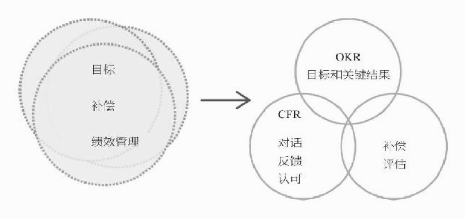

下篇 OKR 引领组织变革

# 0201. 持续性绩效管理：OKR和CFR

交流可以改变个体思维方式，进而改变个体行为方式，最终改变组织行为方式。

——谢丽尔·桑德伯格

年度绩效考核不仅成本高昂、耗时费神，还大多是徒劳无功的。平均每个报告都需要耗费每位管理者约 7.5 个小时的时间。仅有 12% 的人力资源主管认为这个过程在推动商业价值方面「非常有效」，[1] 只有 6% 的人认为值得花时间去做这件事情。[2] 受近因效应、员工排名，以及正态分布曲线的约束和影响，这些年终评估报告无法公平公正地衡量员工的绩效。

领导者们历经苦痛才深刻领悟到的一个教训就是「不要把人数字化」。即便是彼得·德鲁克，这位目标管理的首创者，也认同标准化管理的局限性。在德鲁克看来，管理者的「首要角色」是「自己本身」，管理者需要和他人建立有效的人际关系，激发共同的信心，构建命运共同体。[3] 或者如阿尔伯特·爱因斯坦所言：「并非所有可以用数字计算的东西都是有价值的，也并非所有有价值的东西都可以用数字来衡量。」

为了实现那些遥不可及的目标，我们必须对员工进行更高层次的管理。我们迫切需要升级目前在工作场所中所使用的沟通体系，正如现在使用的基于季度的 OKR 管理法已将年度目标管理法淘汰出局一样，我们也需要一个类似的工具来对过时的绩效管理体系进行革新。简而言之，我们需要一个新的人力资源模式来适应新的工作环境。这一模式就是持续性绩效管理体系，用于取代当前的年度评估体系。持续性绩效管理是通过一种叫作 CFR 的管理工具来实现的：

对话（Conversation）：经理与员工之间真实的、高质量的交流，旨在对绩效提升起到驱动作用。

反馈（Feedback）：同事之间面对面进行双向沟通或通过网络进行交流，以评估工作进展情况并探讨未来的改进方向。

认可（Recognition）：根据个体所做贡献的大小施以对等的表彰。

和 OKR 一样，CFR 在组织的各层级都强调透明、问责、授权和团队合作。CFR 是有效沟通的「刺激物」，它能激发 OKR，并将其送入正确的轨道。CFR 是一个完整的交付系统，用于衡量什么才是最重要的事情，让绩效管理「直击要害」。CFR 完全体现了安迪·格鲁夫创新方法的精髓和力量，也使得 OKR 更加人性化。

最为重要的是，OKR 和 CFR 是相互促进的。道格·邓纳莱恩是 BetterWorks 公司的首席执行官，也是首先将这两种管理工具引入云计算和智能手机的先锋人物，已帮助数以百计的企业实现对绩效目标的有效管理。道格说：

两个工具「联姻」，才有真正的威力。如果会谈的内容仅限于你是否达到了目标，那就失去了它的价值。你需要持续的绩效管理来解决那些关键问题，比如这个目标比你原来设想的更难以实现吗？这是最初的那个正确目标吗？它是激励性的吗？我们是应该对上个季度真正发挥作用的两三项工作加倍投入，还是另外选取一个新的核心工作任务？你需要从全局出发，从整个组织中寻找这些答案。

另外，如果你连目标都没有，那还有什么好谈的呢？你实现了什么？你又是如何实现的呢？依照我的经验，当团队有明确且一致的目标时，他们更有可能感到满足。他们才不会在工作中因感到困惑而进入「神游」状态，他们可以清楚地知道自己所做的事情是如何与组织息息相关，并对组织产生促进作用的。

再举一个足球的例子。假设球门是最终目标，是你想要瞄准的地方，而关键结果就是你需要持续不断运动以到达那里。为了使整个团队良性发展，球员和教练都需要付出更多，为共同的目标贡献自己的力量。CFR 包含了各种各样的互动方式，比如周一利用录像进行事后观摩总结，一周中期开内部小组会交流，队员通过预先的演练进行切磋，以及周末比赛结束后召开一个庆祝会。这些方式可以把整个团队紧密地连接在一起，从一场比赛走向下一场比赛。

## 01. 重塑人力资源管理

好消息是，变化正在逐步开始。在评选的世界 500 强公司中，有 10% 的公司已经放弃了一年一度的绩效评估体系，并且这一数字还在不断增长。而无数的初创公司，也并没有选择那些传统的绩效考核方式，而是拥抱新的绩效管理制度。我们正处在一个需要重塑人力资源管理的重要时刻，一个灵活、敏捷、无等级的工作环境是所有成功企业都必不可少的。

当公司开始用持续沟通和实时反馈来取代传统的年度绩效考核时，或者至少增加一点这些内容，就更有可能在全年取得进步。行为校准和透明化成为日常准则，比如当员工们陷入困境时，他们的经理不会坐以待毙，他们就像消防员奋不顾身地跳入火海那样，立刻就员工所面临的困难与他们进行实时沟通。

这听起来似乎十分简单，但持续的绩效管理确实会提升每个人的绩效水平。它可以帮助员工自下而上地全面提高业绩。它能够很神奇地帮助提升士气与促进自我成长，无论是对领导者还是对员工，都是这样。如果再配合 OKR 基于季度的目标跟踪体系，效果会更加明显。

表15.1 年度绩效管理与持续性绩效管理的区别 [4]

在转型期，许多组织会拓宽其评估标准，比如对能力和团队合作进行评估。也有很多公司采取「两条腿走路」的策略，既使用传统的年度评估方法，同时也使用 CFR。这种新旧思维的平衡对大公司尤其适用，其中一些甚至可能乐意一直这样做下去。其他公司则可能会彻底抛弃传统的基于等级和排名的评估方式，以便更好地提高透明度、促进合作及使用多维度评估标准。

### Pact 的持续性绩效管理

Pact 坐落于华盛顿特区，是一个从事国际贸易与发展的非营利组织，它切身体验了 OKR 与持续性绩效管理之间的协同效应。以下是 Pact 的负责人蒂姆·斯塔法的分享。

我们选择了 OKR，是因为我们对绩效管理过程的需求愈加强烈。因此，当 Pact 选择 OKR 时，我们正式放弃了年度绩效评估方法。我们在经理与雇员之间建立了一系列更为频繁的交流方法来取代它。在内部，我们称之为「推进」。它包括以下四个要素。

1. 雇员与经理每月进行一次关于事情进展的一对一谈话。

2. 对 OKR 进行季度审查。我们会一同坐下来进行沟通：本季度的计划是什么，哪些能做，哪些不能做，为什么会出现这样的状况，以及我们可以做出哪些改变？

3. 我们还会进行一个半年度职业发展座谈。员工们可以陈述他们的职业规划：他们从事过什么岗位的工作，现在在什么岗位，将来想要去什么岗位，以及他们的工作经历和需要组织对他们的规划提供什么支持。

4. 持续而自我驱动的洞察力。我们其实一直被正能量和积极反馈所包围，但由于缺乏正式训练，我们中的许多人无法发现它。比如说你给你的团队做了一个报告，然后有人走过来对你说：「嘿，干得漂亮！」绝大多数人会回应说：「那真是太棒了，谢谢您！」然后转身离去。但我们却希望你能够进一步追问：「谢谢，请问你认为我什么地方做得很棒呢？」我们需要的是获得及时而具体的反馈。

## 02. 「友好」分手

对于那些准备推动和实施持续性绩效管理体系的公司来说，第一步要做的事情就是把薪酬与 OKR 分开，不管是加薪还是奖金都不能直接和 OKR 相关联，因为这是两种不同的对话机制，有着各自的节奏和周期。年度绩效管理是回顾性的评估，通常在年底举行。而持续性绩效管理是领导同员工之间持续跟进的前瞻性对话，通常以五个问题为中心：

你正在做什么？

你做得怎么样？你的 OKR 进展如何？

你的工作有什么阻碍吗？

你需要我提供什么来帮助你实现目标？

你需要什么帮助来实现你的职业目标？

我并不是建议现在就可以或应当完全摒弃年度绩效考核方法。一项定量研究的结论表明：个人报酬的增加可能会消除一个人对目标完成得分的偏见。由于 OKR 能够恰当反映一个人的工作价值，因此它是一个可靠的周期性反馈来源。但是当目标直接与薪酬挂钩时，员工就不会报任何期望了。他们开始有所防备，他们会消极怠工并失去创造更好业绩的动力，随后又会因为缺乏挑战而感到无所事事，而组织才是这种行为的最终受害者。

我们假设员工 A 设定了一个很困难的挑战性目标，她完成了设定目标的 75%，那么她的优异表现是否值得获得 100% 或是 120% 的奖金呢？相比之下，员工 B 达到了他的关键业绩的 90%，但是他的经理知道他并没有竭尽全力，更重要的是，他还缺席了好几个重要的团队会议，那么他应该获得比员工 A 更多的奖金吗？

如果你还想保住员工的士气和自主性，那就干脆利落地说「不」吧！

在谷歌，按照拉兹洛·博克的说法，OKR 只占绩效考核比重的 1/3 甚至更低。他们还可以从跨职能团队的反馈中获得员工的综合信息，对反馈的结果，都会结合具体情况而加以综合考虑。拉兹洛说：「即便是专门的目标设定系统，所设定的目标往往也会有错误或不合理。也许是市场的突然下滑或是客户的突然离职，都会使你不得不从头开始。你需要试着把所有这些因素都考虑在内。」谷歌一向谨慎地将原始目标得分与薪酬决策分离开来。在每个循环之后，他们的 OKR 数据就从系统中清零了！

目前，我们还没有发明出任何一个公式，可以用于准确解释人类复杂的行为，因为对他人的判断都存在主观性，掺杂着个人因素。在今天许多工作场景中，OKR 和薪酬是「好朋友」，它们结伴而行，永不分开，但它们也无须「生活」在一起，这样可能更健康一些。

随着企业管理向持续绩性效管理过渡，OKR 和 CFR 大多变得独立于薪酬和正式评价之外

## 03. 对话

彼得·德鲁克是最早关注到管理者与下属直接对话会带来价值的人，他强调管理者和下属之间的一对一定期会谈对工作改进有很大的价值。依据安迪·格鲁夫的测算，管理者与下属的谈话「将提升下属的工作质量，90 分钟的谈话可以影响下属两周的工作效率」。[5] 为了保持领先地位，安迪在英特尔公司强制执行了这一模式。关于会议的目的，他写道：

对话可以「教学相长」。通过谈论具体的问题和情况，主管向下属传授他所掌握的技能和知识，并提出解决事情的具体方法。同时，下属应向主管详细说明他正在做什么事情，以及他所担心的问题。一对一会议的关键在于：它应该被看作一个以下属为主导的会议，会议的内容和整个基调是由下属决定的，而主管的作用是倾听并做出指导。[6]

主管也应该大力提倡在一对一会议上开诚布公地探讨一些问题，因为这是一个深入了解工作细节和下属工作中所遇到的问题的绝佳机会。他对自己的表现满意吗？他有遭受一些挫折或障碍的困扰吗？他对自己未来要做什么有疑问吗？

格鲁夫的原则是比以往任何时候都更强调及时性，因此他强调利用现代工具来跟踪和协调当下频繁的对话。[8] 有效的一对一会谈源自日常工作，可以根据实际需求进行由周到季度的调整。基于 BetterWorks 对数百家企业经验的总结，管理者和员工之间的对话通常出现在五个关键领域。

1. 目标设定和反思：员工的 OKR 计划是为即将到来的周期设定的，讨论的重点应当是如何将个人目标和关键结果与组织的当务之急进行最有效的结合。

2. 持续进度更新：依托数据对员工工作的实时进度进行快捷监督，并随时待命准备解决问题。[10]

3. 双向辅导：帮助员工发挥他们的潜能，并帮助管理者更上一层楼。

4. 职业发展：帮助员工提升技能，发现成长的机会，并让其看到未来在公司的升职空间。

5. 轻量级的绩效评估：这是一种以组织需求为基准，将上次会议以来的组织投入与员工产出进行总结比较的反馈机制。（如前所述，这一谈话与员工年度薪酬和奖金无关。）

随着职场对话变得越来越不可或缺，经理们的角色由监工转化为指导者、辅导者或是引领者。例如，产品负责人在产品设计决策上摇摆不定，导致产品发布日期面临延期的风险时，在下一次执行团队会议之前，一位资深的首席执行官或辅导者可能就会说：「你能想到在这种环境下如何更果断地做出决策吗？是不是可以列出两个最好的选择，然后说明你更倾向于哪一种？你认为你能做到吗？」如果产品负责人同意的话，就可以形成一个计划。不同于单纯进行消极的指责，辅导者更关注的是未来的改进结果。

## 04. 反馈

谢丽尔·桑德伯格在她的经典之作《向前一步》一书中指出：「反馈是一种基于观察和经验的意见，可以帮助我们了解自己给别人留下的印象。」[12]

为了使 OKR 的价值最大化，必须将反馈融于这个体系之中。因为如果你连自己表现得怎样都不知道，又怎么可能表现得更好呢？

现在的员工都希望能够被「授权」和「激励」，而不是管理者对他们的工作指指点点。他们希望向管理者表达自己的观点，而不是努力工作一年，最后才知道经理对其工作表现的褒贬。他们渴望定期将自己的目标、计划与他人分享，并时刻关注同事工作的进展情况。[13] 公开、透明的 OKR 可以帮助激发他们从不同角度思考问题：这些是我/你/我们应该关注的正确的事情吗？如果我/你/我们完成了它们，会被视为一个巨大的成功吗？你对我/我们怎么才能做得更好有什么建议吗？

反馈可以是非常有建设性的，但前提是它必须足够具体。

负面反馈：「由于你上周的会议组织晚了，才导致了这种一团糟的结果。」

正面反馈：「你的演讲真是太棒了！先是通过开场白吸引了全场的注意力，又用我最喜爱的极具指导性的‘下一步规划’来完美收尾。」

在发展型组织中，反馈通常是由人力资源部门主导和安排的。在更为成熟的组织中，反馈多是不受约束、实时和多方向的，并且多是不分时间、不分地点在组织内以开放式谈话的方式进行的。我们能给优步司机打分（他们也能给我们打分），甚至在点评网站 Yelp 上给评分者打分，那么为什么工作场所不能支持经理和员工之间的双向评价呢？

这是员工与上级之间实现双向交流的宝贵机会，比如他们可以询问管理者需要自己做什么才能取得成功，同时也可以让管理者知道自己需要从他那里获得什么帮助。

就在几年前，员工们还需要通过将匿名纸条放进办公室意见箱的方式为自己发声。而今天，一些领先的公司已经用 24 小时在线且可进行匿名反馈的工具替代了意见箱——从突击式员工调查到匿名社交网络，再到会议及会议组织者评分的应用程序，员工与管理者之间的反馈方式不断多元和丰富了。[14]

双向（或360度）反馈是持续性绩效管理的一个附加手段。它可以是匿名的，也可以是公开的，或是介于两者之间的。反馈旨在帮助员工更好地实现其职业生涯的发展吗？（如果是这样的话，它应当是以私下的方式向个人传播的。）它是为了揭示一个组织的问题吗？（这是 HR 的工作。）也许这些问题都包含在内吧！

通过培养团队之间的联系，双向反馈在跨职能活动中将发挥出极大的价值。随着平行沟通的普及，部门间的团队合作已经成为新的常态。随着 OKR 与 360 度反馈的完美结合，传统的绩效考核方式将很快成为历史。

## 05. 认可

这是 CFR 中最容易被低估的部分，也是最不容易被理解的部分。因为金表贵重，且可以保存长久，传统的认可方式常常把金表当作奖品，这样的时代已经一去不复返了。现代的认可是基于绩效表现和员工横向之间的对比，这有点像「认可众包」，每个人都可以随时认可他人的业绩，也可以随时得到他人的认可。比如，捷蓝航空公司设计了一个由价值驱动的双向认可系统，让领导者开始注意到那些在一线工作的员工，由此让员工满意度双倍提升。

持续性的认可是提高参与度的一个强有力的驱动因素：「尽管看起来很容易，但一句简单的‘谢谢你’对于打造一支高参与度的队伍却有出其不意的效果。那些文化认可度高的公司的员工自愿离职率比文化认可度低的公司低 31%。」[15] 以下是一些提高员工对公司的认可度的方法。

鼓励同事间认可。当雇员的成就获得同事的一致认可时，就会激发一种感恩的文化。在 Zume 比萨公司，每周五全员都会参加公司的「总结」会议，会议结束时，组织中的每一个成员都会对做出杰出贡献的成员给以主动、真诚、发自内心的称赞。

建立明确的标准。正确识别员工目前进行的是行动还是结果：完成特殊项目、实现公司目标，还是展示公司价值。同时用「当月业绩」代替「当月最佳员工」。

分享有利于增加认同感的故事。实时通信工具或公司博客都可以用于分享这些成就背后的故事，赋予认同更多的意义。

提高认同发生的频率和可获得性。即便是很小的成就，也应当予以赞扬。比如：为在截止日期前完工而付出的额外努力，对提案进行润色完善，或者是做一些在管理者看来是理所应当的小事。

对公司目标和战略的认同。无论是客户服务、创新、团队合作还是成本削减，任何符合组织最高利益的事项都应当被及时提出并获得支持。

OKR 平台就是为实现这种双向认可而打造的。在反馈效果好和认可程度高的区域，季度目标被不断地设立又重建。OKR 的透明性使得无论是大成功还是小胜利，都可以在同事那里收获真诚的祝福。每一个人取得的成就都应当得到他人的关注与认可。

一旦团队和部门开始以这种方式进行互动，会使越来越多的人加入其中，而认可度高的组织文化也会激活整个公司的活力，使公司焕然一新。在这种文化中，不论职位高低，每一个人都可以为他人的目标加油鼓劲。但要明确的是，每一次鼓舞都是为了向卓越更近一步，都是为了实现 OKR 和 CFR 的最高目标。

[1] 「Performance Management:The Secret Ingredient,」Deloitte University Press,February 27,2015.

[2] 「Global Human Capital Trends 2014:Engaging the 21st Century Workforce,」Bersin by Deloitte.

[3] www.druckerinstitute.com/2013/07/measurement-yopia.

[4] Josh Bersin and BetterWorks,「How Goals Are Driving a New Approach to Performance Management,」Human Capital Institute,April 4,2016.

[5] Andrew S.Grove,High Output Management(New York:Random House,1983).

[6] 「Former Intel CEO Andy Grove Dies at 79,」Wall Street Journal,March 22,2016.When I met with my boss at Intel,it wasn’t for him to inspect my work,but rather to fi gure out how he could help me achieve my key results.（注：安迪认为「下属」应当主导 90% 的谈话内容。当我在英特尔和我的老板见面时，他的关注点始终放在如何帮助我取得关键成果上。）

[8] Annamarie Mann and Ryan Darby,「Should Managers Focus on Performance or Engagement?」Gallup Business Journal,August 5,2014.（注：根据盖洛普公司的数据可知，更频繁的一对一谈话会将员工的参与度提升 3 倍。）

[10] 进度更新包含两个基本问题：哪些工作进展顺利，运行良好？哪些工作受到阻碍，表现不佳？

[11] 此书中文版于 2014 年由中信出版社出版。——译者注

[12] Sheryl Sandberg,Lean In:Women,Work,and the Will to Lead(New York:Knopf,2013).

[13] Josh Bersin,「Feedback Is the Killer App:A New Market and Management Model Emerges,」Forbes,August 26,2015.

[14] Josh Bersin,「A New Market Is Born:Employee Engagement,Feedback,and Culture Apps,」joshbersin.com,September 19,2015.

[15] 「Becoming Irresistible:A New Model for Employee Engagement,」Deloitte Review,issue 16.