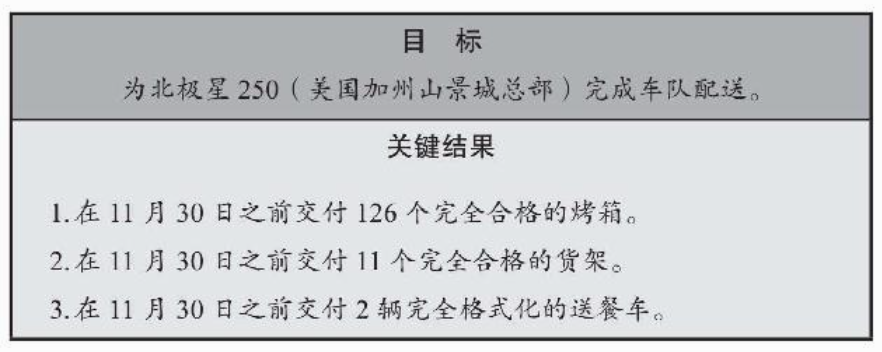
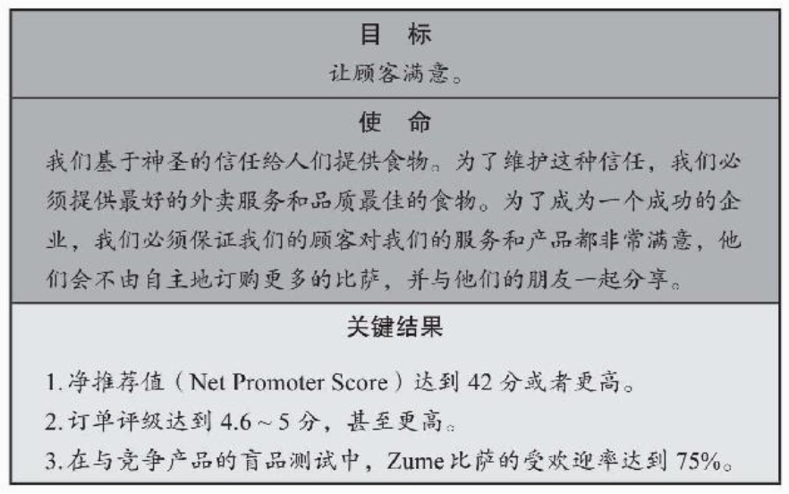

# 0203. 每天烘焙得更好一点：Zume 比萨的故事

正如我们所看到的那样，OKR 和 CFR 是两种能够用于提高工作绩效和工作效率的管理方法。除此之外，它们还有更微妙、更深层、更频繁的影响，比如提高管理者的修养，或者给默默奉献的员工们一个展现自我的机会。在通往卓越这条漫长且艰辛的路上，正是由于他们的奉献，才有了组织日复一日的进步与成长。当领导者能够成为更好的沟通者和激励者时，企业的普通员工更容易成长为自律而严谨的思考者。当对话和反馈高效且富有价值时，结构化目标设置更有助于指导员工如何在资源有限的条件下进行工作，即便最初他们是十分抗拒的——对小型企业来说，这更是一门非常重要的课程。

Zume 比萨的故事形象生动地说明了这些内在变化。这是一个关于初创企业如何通过使用 OKR 和 CFR 管理方法，再加上一些机器人，一步步成为行业巨头的故事。

长久以来，接近 100 亿美元的美国比萨外卖市场被三个主要的全国连锁店控制着：达美乐、必胜客和棒约翰。这些比萨品牌并不能使人们的生活变得更加美好，但是它们却具有品牌优势和巨大的规模经济优势。2016 年春天，当 Zume 比萨在硅谷一个偏僻的混凝土仓库中开业时，曾受到大多数人的质疑。「机器人手工比萨」被嘲笑为又一个「左海岸噱头」（Left Coast gimmick）[1]。成功并非那么容易，通往成功的路遍布荆棘。

两年过去了，Zume 通过制造具有价格优势的世界一流比萨斩断了那些荆棘。公司通过把机械性的工作交给机器去做，解放员工的生产力进行创造性工作，产生了更多的价值。节省下来的人力成本则会用来购买更高质量的原材料：非转基因面粉、有机番茄、源产地为本地的新鲜蔬菜和健康的熏肉。这样做的结果就是在你下订单 5 分钟后就送到你手中的美味热比萨。

当互联网或手机订单发送到 Zume 比萨的传送带时，机器人便开始进行和面、造型、撒酱汁等一系列制作程序，然后将比萨安全地送入 800 度的烤箱中。随着机器人工艺的日渐成熟，公司开始计划将整个流程自动化，从添加奶酪和定制配料，到将半熟比萨装进 Zume 高科技卡车，实现真正的在途烹饪。（未来，这些卡车极有可能会采用无人驾驶技术。）

仅仅进入市场 3 个月的时间，Zume 就已经成功占有当地比萨市场 10% 的份额。2018 年，它开始打破旧金山湾区的比萨垄断。照这个速度下去，它很快就将席卷西海岸，进而风靡全美。到 2019 年时，Zume 的创始人希望 Zume 能够走出过国门，走向世界。联合创始人亚历克斯·加登（Alex Garden）在初次使用 OKR 管理方法时还是 Zynga 游戏公司的总裁，他说：「我们将成为食品界的亚马逊。」

Zume 联合创始人茱莉亚·柯林斯（Julia Collins）和亚历克斯·加登与他们的「在途比萨烹饪」卡车

《圣经》中大卫战胜歌利亚的故事告诉我们，时间和机会才是「王道」。如果公司在运作上不专业或者员工没有明确的工作方向，公司将没有任何利润可言。Zume 的领导者将会告诉你，OKR 是如何以他们预想不到的方式帮助这个年轻公司逐步茁壮成长的。

以下是茱莉亚·柯林斯、亚历克斯·加登及其他人关于这个故事的讲述。

茱莉亚·柯林斯：最开始，Zume 比萨所有的事情都由我和亚历克斯两个人决定，无论你问亚历克斯和我什么问题，我们都会给出一致的答案。因为相处的时间太久了，任何事情都能做到心有灵犀，我们一直合作得很愉快。当我们的首席技术官加入董事会后，我们变成了「三块奶酪」，但工作仍然运转良好。可是当我们把帕马森干酪加入意大利干酪、罗马干酪和波萝伏洛干酪当中后，事情就变得不那么简单了。当 Zume 的人数增加到 7 个人时，你要是问我们今天的主要任务是什么，那么好吧，你可能会得到 8 个不同的答案。

最开始我们使用的是一个叫作「液体计划」（Liquid Planner）的项目管理软件，它用的是一种「瀑布式」的计算机软件开发方法。在我们建造厨房的过程中，这种方法真的给了我们非常大的帮助。首先，你需要浇筑混凝土，等它变干后，涂上环氧树脂，等它也变干后，将它覆盖并把移动式冰箱安装进去。对于一个线性过程而言，这是个很好的方法。

但是，到 2016 年 6 月的时候，我们已经准备将产品投放市场了，这时候我们发现，Zume 的操作流程并没有那么简单。我们招了 16 名全职雇员，再加上后厨的 36 名小时工和「飞行员」（这是我们不可或缺的比萨送餐员）。于是我们冒着风险进行大规模开发，包括增加集成型机器人、开发软件、创建菜单等。基于「瀑布式」的开发进行得并不顺畅，有太多事情需要同步进行，有太多程序需要交叉作业，我们知道我们必须保持机动性。为了最后冲刺的成功，我们的工程师每天早上都会登录 JIRA 管理软件进行跟踪查看，但无论是 JIRA 还是「液体计划」，都无法回答我们：「到底什么对我们来说才是最重要的？」这是一个最重要的问题。

Zume 最大的财富就是我们这支极有天赋和创造力的团队。当我们的员工来到自己的岗位时，能够立即全身心投入他们认为最重要的事情当中去。他们的想法通常都很棒，然而总是无法同步。于是我们较早地在全流程业务中采用了 OKR 管理方法，大约在第一份比萨送出后的 3 个星期之后就开始了，因为我们想要每个人都知道我们的头等大事是什么。一开始，为了保证关键结果的完成，亚历克斯和我设定了一个百分百由上而下的标准，为 Zume 制定了最初的两个 OKR 目标。未来，当生存不再是问题的时候，我们会适当放宽这一标准。

正在工作中的 Zume 比萨机器人

## 01. 设定能够实现的目标

亚历克斯·加登：OKR 所显示出来的价值是毋庸置疑的，特别是如何把整个组织的努力都团结到领导者的真正意图上，并让所有员工都为此做出自己的贡献。但对像 Zume 这样的年轻公司来说，一个相当重要的「隐性」价值被忽略了。不管是对公司的高级管理人员，还是普通的管理人员来说，OKR 都是超级棒的培训工具，它教给你在各种资源受限的情况下如何管理你的公司。

突破企业的能力边界固然很重要，但也不要忽视边界也是实实在在存在的。每个人都面临着资源的约束——时间、金钱、人员，并且通常情况下组织越大越无序。在我担任微软 Xbox Live 游戏平台总经理期间，我有幸和一些具有远见卓识的管理者一起工作。但是，我也发现领导意愿和组织真实能力常常「错位」，为此，我们经常很痛苦。而且，我还发现绝大多数「怎样做」和「是什么」的问题都留给了我和其他分部的一些基层员工。我们的任务就是为一个超出执行能力的任务提供一个不切实际的框架。如果我们从一开始就能有一个很好的目标设定程序，想必团队中的每个人都无须如此苦恼了吧！

传统的学院派商业模式认为，领导者的角色会随着职位的提高而愈加抽象。因为你的中层管理者会帮你处理更多的日常问题，从而使你更加有精力去关注全局。也许在那个慢节奏的时代，这确实很奏效。但是，据我的经验，如果高层管理者不能像信仰宗教那样对目标抱有坚定执行的信念，OKR 是不会奏效的。而改变宗教信仰是一项既艰辛又吃力不讨好的工作。你的员工可能会不喜欢你锐意创新的精神，因为这需要占用一年时间来落实。但我觉得它是值得的。

## 02. 更严肃的纪律

茱莉亚：如果我们探讨 OKR 的内在价值，作为联席首席执行官，我们首先学到的就是纪律。

亚历克斯：OKR 指导我们如何对可以实现的目标进行全方位的思考，并且把同样的观点灌输给我们的执行团队和他们的项目团队。在职业生涯的早期，作为一名普通员工，你的工作数量和质量都在不断升级。然后有一天，你突然被提拔成了经理。我们假设你做得很好，并且不断高升，管理越来越多的员工。这时候，你不再需要承担大量的日常工作，而是需要为你做出的决策负责。但是却没有人告诉你规则已经变了。因此，即便当你撞上南墙，你仍然在想，我需要更加努力工作，只有这样才能够让我继续站在这个位置上。

你应该做的事情是摆脱这种直觉，停下来，排除一切杂念。闭上眼睛去看看你眼前都有什么，然后为你和你的团队选出与组织需求相匹配的最佳方向。OKR 管理方法最巧妙的一点就是它使「反思」程序化了。每个季度，至少保证有一次为员工提供一个安静的地方，让他们思考该如何决策才能与公司的利益保持一致，于是员工学会了站在宏观的角度思考问题，学会如何更加直接而具体地执行目标。因为你不可能写一篇 90 页的关于 OKR 的论文去指导他们，你必须选择 3 到 5 件事并为他们制定明确的衡量标准。这样，当那一天到来时，有人对你说：「好了，你是经理了。」而你早就已经学会了如何像一个经理那样思考，这真是太棒了！

大部分初创企业的领导者都不会关注结构化的目标设定，他们有各种各样的理由：我们并不需要这个，我们已经发展得很迅速了，我们只需要想办法解决问题就好，等等。确实，他们通常是能够想出解决办法的。但是我认为他们错失了在公司规模扩大之前为公司培养优秀管理者的良机。如果企业不在一开始就养成这些思维习惯，企业的扩张规模往往会超过管理团队的能力，这就会导致两种结果：公司倒闭，或者管理团队被取代。这两种结果都是很可悲的。更好的方法是从一开始就培养员工的管理意识，即便他的部门只有一个人。

因此，OKR 管理方法可以锻造你的员工，可以帮助你塑造更加强大的管理者，帮助他们避免犯低级错误，同时，也把大公司的严格和有序植入小公司当中。当我们在 Zume 实行 OKR 的时候，最直接的收益就是流程本身。提升绩效最简单的方法就是强制人们对业务进行深刻、透彻和关联性的思考，这对绩效的提升具有很好的促进作用。

## 03. 更积极地参与

亚历克斯：OKR 让目标变得更加清晰，不会含糊不清。执行 OKR 的时候，一些人可能会说：「这不是我想要做的，我要放弃了。」但是另一些人可能会说：「我很受鼓舞，因为我终于知道我们在做什么了。」无论哪种反应都会存在。对于留在那儿的人，将来就是积极参与公司管理的骨干分子。每个人都有自己的任务和使命，只有整个团队团结一心，组织才能良好运行。

茱莉亚：随着人们对 OKR 的流程越来越熟悉，自然就会加强协作。在 2016 年第三季度，亚历克斯和我设定了公司的最高 OKR，然后部门负责人将我们设定的一些关键结果转化为每个部门的目标，我们只需将这些目标和关键结果逐级传达给员工就好。到了第四季度，当亚历克斯和我准备设定公司顶层目标时，我们的团队却已经开始站在公司的角度考虑整体目标了，这真的很棒。他们扮演了一个更具创造力的角色，OKR 被执行得越来越好。我们的目标仍然有很大的挑战性，但是员工却觉得它们已经变得越来越近在咫尺了。

Zume 称自己的关键技术为「在途烹饪」。这颠覆了行业传统，最大限度地使顾客满意。在第四季度，公司的顶层目标之一就是部署我们的「大家伙们」——26 英尺（约8米）的卡车和 56 台烤箱，并与复杂的物流和订单预测系统相连接。它们能够在你下单后 5 分钟内通过「算法」帮助我们完成比萨的制作，并通过我们的卡车将比萨运送到你家门口——而且还是热气腾腾的哦！维巴夫·戈埃尔是我们的产品经理，他目前正根据OKR系统来指挥、协调并开始执行我们「在途烹饪」车队的第一项任务，这个「在途烹饪车」是完全密封的。我们知道当维巴夫实现他的第三个关键结果时，就意味着我们的目标实现了。

每个企业都有一些坚持自己观点并擅长表达的人。如果他们在第一次发表观点时没有得到认可，他们很乐意再说一遍。但是还有一些默默无闻的员工，他们的心声却很难被听到甚至常常被忽略。OKR 框架给了每个部门「平等发声」的机会和权利。谁也不需要选择默默接受——事实上，就没有那个选项。你的目标就是让他们每一个人都出现在大屏幕上，像其他人那样发表观点并获得支持。

此外，我还要补充一点，那就是一个真正优秀的公司是可以做到兼容并蓄的。它能够挖掘出不同观点，并找到一种方式引导并引爆它们。这就是我们鼓励「人人贡献智慧」的原因。

亚历克斯：在将 OKR 普及到每个员工之前，我们先在管理层试行了两个完整的季度。我们的首要任务是构建企业文化。在这个过程中，我们发现很奇怪的一点是，最积极的参与者往往就是最初最持怀疑态度的那些人。

约瑟夫·铃木（市场主管）：我认为 OKR 就像一个减肥计划——只要按照「说明书」去做，你就能实现让身材苗条的梦想。OKR 又像是个记账簿，只不过是多了一个「管理项」而已。不过说真的，OKR 的效果完全超乎我的想象，当我进行每两周一次的「签到」时，它会促使我花几分钟的时间去思考我都做了哪些事情，以及接下来我要如何做才能使我的目标与公司这个季度的需求相匹配。

在企业的初创阶段，你可能会迷失在战术细节中——特别是我所在的部门，被扣着那么多的「帽子」。这是很危险的，这就像你在波涛汹涌的海洋里游泳时，很容易就找不到岸的方向。但是 OKR 的思维模式能够帮助我重新找到航向：我朝什么方向努力才能够按计划行事？OKR 的实施绝不是为了撰写一份报告，也不是一场运动，更不是竞赛，而是让我们思考更宏观、更有战略意义的事情。

## 04. 更高的透明度

茱莉亚：从一开始，整个 OKR 流程就迫使我们进行明确分工。举个例子来说，当一个球飞到两个球员之间时，必须有一个人去接住它，否则球就会坠落；如果两个人同时扑向它，又会导致两个人撞向对方。最开始，市场营销部和产品部就是我们的两个「球员」，可是 Zume 的收益目标这个「球」该由谁来接呢？

两个部门的领导都已经与我们在一起共事一个多月了，然而他们不仅对 OKR 是陌生的，对 Zume 同样陌生，甚至连 Zume 自己也并不完全了解自己。当亚历克斯和我看到他们的困惑时，我们就将收益目标拆分为两个子目标：新增收入和重复收入。第一个目标由市场营销部承担，第二个目标则由产品部承担。于是两个部门领导便从自己的目标着手设定 OKR。那是一次非常重要的谈话，从本质上讲，它不仅仅让两个部门共同支持了公司整体的目标，更让我们加强了沟通，提高了目标的透明度。当某样东西没有被清晰地勾勒出来时，它往往是一闪而过转瞬即逝的，你一定要把握住机遇，千万不要错过它。

## 05. 更团结的队伍

亚历克斯：在 8 个月的时间里，我们推出的是一家食品公司、一家物流公司、一家机器人公司，同时也是一家制造公司——而这一切都是从零开始的。我们以 OKR 作为教学工具进行思维培训，培养一种「关心文化」。它会教给你如何换位思考，让你知道你所做的工作是如何对周围的人产生影响，而你又是如何受到他们影响的。

茱莉亚：我们的团队是非常多元化的。亚伦·布特库斯是我们的大厨，他曾提出在纽约经营餐馆的创意。迈克·贝索尼是我们的车队经理，他曾经在电影工厂上班。此外，我们还有一位产品大咖和一位软件工程师。团队中的每个人都来自不同的地方，说着不同的语言。但 OKR 是我们的共同语言，是我们可以进行良好沟通的桥梁。每周一，领导团队的 7 位成员都会进行一次午餐会，并且每隔一周也会就 OKR 的相关问题进行探讨。你可以经常听到人们在讨论：「谁拿下了那个顾客？」「你打算怎么实现你的关键目标？」每个人都知道他们想要表达的是什么。

即使是世界上最美味的比萨，如果送到顾客手中已经变凉，顾客也会感到十分愤怒。让客人满意是迈克和亚伦共同的目标。迈克可能会说：「我已经达到了一个关键结果，扩大了我们的配送范围，但现在看起来是有点冒险。」这里的风险在于，我们的制作团队可能会因订餐范围的扩大而延迟交付。因此，我们需要针对「延迟交付」对我们的配送范围和收入的影响进行一次跨部门会谈。当然，这同样也与我们的市场部主管约瑟夫·铃木相关，他的 OKR 是增加收入。

为了提高客户满意度，迈克可能会对产品部主管大叫：「我的天！你能不能快点，究竟什么时候能把它完成？我都等了多久了！」如果他换一种说法，「我的关键结果已经有风险了」，可能会显得更幽默，富有创造性，而且少了一些控诉感。这种冲突会经常发生，在很多企业里也都很普遍。自从我们公司进行了全面调整后，各个团队都完全认同关键结果的设定需要彼此之间的相互依赖。在我们公司中，没有对错之分，大家都是为了解决问题。猜猜看，这会导致什么样的结果？两个团队的主管开始联合起来，并设法从亚历克斯和我这里获取更多的资源。

亚伦·布特库斯（高级厨师）：如果我正在研发一种新的季节性比萨，我不会马上去做。市场部至少需要提前一周知道产品信息，需要拍照，需要作图并进行设计。因为推出一款新产品直接影响着每个部门——产品经理的网页设计，技术团队和他们的手机应用程序。OKR 让我始终没有偏离轨道，保证我及时把每个人都在等待的「菜谱」准备好。于是，我把「产品上市时间」设定成一个关键结果，这样我就有更大的视野，能更清晰地看到我们的全局业务。

这绝对是一个进行团队建设的绝佳过程。它会时刻提醒你，你是这个团队的一分子。你很容易被你自己手头的事情缠住，特别是当你在厨房工作的时候。但是 OKR 会让人们意识到：太棒了，我不是在孤军奋战，我们是一个团队，我们可以相互扶持，解决所有的问题和困难。

## 06. 更优质的对话

亚历克斯：每两周，Zume 的员工需要选择一个人与之进行一对一谈话，谈话的时间为一个小时，谈话的对象根据自己的意愿来选择（茱莉亚和我彼此交谈）。这真是个「神圣」的时刻，你不能迟到，也不能将其取消。对话只有一条规则：不能聊工作。聊天内容围绕着你未来两三年想要达成的个人心愿进行，还有，你要说明如何把它们分解成两周的计划。我喜欢以三个问题开启这场对话：什么事情让你感到高兴？什么事情会耗费你的精力？你的理想职业是什么样的？

然后，我就会说：「我想和你谈谈我所期望的是什么。首先，坚持讲实话。其次，坚持做正确的事。当你能够满足我们的期望后，我们将百分之百无条件地支持你的梦想。我以个人的名义向你保证，你一定能够在未来三年实现你的个人目标和职业规划。」于是，这场谈话便自然而然地开始了。

人们可能会将这看作一种利他主义，但实际上这是让企业与员工建立联系的最有效的方法——同时，可以防止员工产生困惑，并帮他们看清楚周围的阻碍。领导可能会说：「这个目标看起来对你非常重要，但是你在过去的两周却没有取得很大的进展。你觉得这是为什么呢？」这看上去可能有点「反常」，但是这种非工作性质的一对一接触式谈话和讨论，恰恰能够帮助员工获得持续性绩效反馈。从员工对个人目标的谈论中，你可以收获很多，你最终会明白是什么力量在推动或阻碍他们的职业发展。

当你完成一场与员工的深入对话后，你会感知到何时需要拨出一些时间给你的员工，让他们为自己充电。比如，在组织全面完成了季度目标后，你可能需要在下一个季度拨出一些时间给员工去实现他们的个人发展目标。你可以拿出 5% 到 15%，甚至 20% 的时间给你的员工去做他自己的事情。这听起来好像是一笔巨大的开支，但它却可以为公司带来未来两三个季度的高效执行力。

## 07. 更开放的文化

茱莉亚：文化是让个人与组织保持一致的通用语言，确保人们所谈论的事情在同一个频道上，并且对这件事的讨论是有价值的。除此以外，文化可以为组织决策建立起一个共同的框架。在文化缺失的组织中，人们常常会对如何复制和提升组织的核心职责感到困惑。

此外，文化还有更高层面的作用：价值观对话。我们想成为什么样的组织？我们希望员工如何感知他们的工作和我们的产品？我们怎样影响世界？

亚历克斯：当我们初次相识时，茱莉亚在电话里跟我说，Zume 的基本原则，也就是我们的使命，就两件事。这给我留下了深刻的印象，于是我做了一张巨大的海报贴在厨房的墙上。我们要让每一个位员工知道我们的使命：

第一，基于神圣的信任为人们提供食品服务；第二，每位美国公民都有权利享用到美味、实惠而又健康的食物。

这是由我们的使命直接衍生出的 OKR：

茱莉亚：许多日常决策都是受公司使命支配的。比如，在比萨里多加点盐或者糖来调味，可能比去数公里外寻找最新鲜的西红柿来调味要容易得多。但是，千里之堤溃于蚁穴，一旦这些看似微不足道，实则暗礁潜藏的妥协悄悄混入企业里，就会使企业文化受到侵蚀，最终导致大厦将倾、独木难支的局面。

每一位新入职的员工都要进行使命和价值观的培训才可以正式上岗。亚历克斯和我非常清楚我们对员工的期望。无论作为一个组织还是个人，我们都非常明确地要求每一位员工首先成为一名具有高度责任感的人。我们有一种「最佳想法说了算」的企业文化，每个人都可以随意召唤任何人，包括首席执行官。

亚历克斯：首席执行官是整个公司为「最佳想法」提供服务的最佳人选。当员工在公开的讨论中质疑我们时，我们总是会停下来思考一下这个人说的话是否有价值。我们努力做到这一点，致力于为员工创造一个言论自由、兼容并蓄的工作环境。

## 08. 更卓越的领导者

茱莉亚：我曾有幸跟几位出色的领导共事过，他们风格迥异，但却有几个共同的特质：冷静、清醒和专注。你只需跟他们在一起坐 20 分钟，就可以发现他们的思路是如此的清晰。他们非常清楚需要做什么事情，以及应当从哪里入手。当你为机器人比萨募资并进行厨房建设时，会发现很多事情需要灵活变通，有时甚至会让你产生一丝慌乱之感。但是，当你对公司的目标了如指掌时，你就真正能够做到临危不惧、镇定自若了。正是 OKR 管理方法帮助我成了一个专注而能够时刻保持头脑清醒的领导者。无论发生了多么疯狂的事情，我都有信心让它回归正确的轨道。

[1] 左海岸指在政治上倾向于左派、选民支持民主党的美国西海岸地区。——编者注

