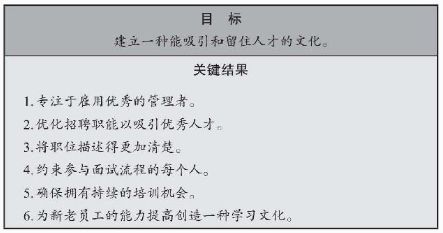

# 0205. 文化改变：Lumeris的故事

当一个组织没有准备好完全开放和承担起责任时，在实施 OKR 前需要先进行文化建设工作。正如吉姆·柯林斯在《从优秀到卓越》中所说：「首先你需要为组织找到合适的人，淘汰掉那些不适合的人，然后让合适的人处在合适的位置上。」只有当这一切准备就绪时，才可以发动机器并开足马力。

不久前，一家以价值观为导向的医疗机构领导人站在了发展的十字路口。Lumeris 公司的总部在美国密苏里州圣路易斯，它是一家提供技术和解决方案的公司，主要为医疗健康机构提供软件、服务和专业技能，其客户涵盖大学的医院系统和传统的保险公司。这家公司从 2006 年开始和圣路易斯地区的 200 个医师合作，通过当地一家由联邦管理的保险公司 Essence 来为密苏里州的 6.5 万名老人提供医疗保险优先计划。

通过挖掘大量的病人数据，Lumeris 帮助合作机构将大量疾病护理的传统收费服务变成一个医疗保健系统，这个系统可以促进疾病预防，减少不必要的检测和住院治疗。在这个基于价值观的模式中，初级护理医师将会为病人的终生健康负责。它的目标是在节约稀缺医疗资源和金钱的同时，提高病人的生活质量。Lumeris 公司已经验证了这些目标是如何协同作用而产生积极效果的。

Lumeris 公司首席执行官迈克·朗（Mike Long）指出：「挑战性的目标是使国家的医疗卫生供应链合理化，在其他行业，商业成功的前提是成本、质量、服务和可选择性的公开透明。但在一个医疗卫生体系中，这些都不起作用，因为它是完全不透明的。医生不知道采取哪些服务对病人更有利，也不知道这些服务的成本是多少。所以，你如何让这些医生对财务结果负责？」这是一个需要持续变革的挑战，Lumeris 通过实施 OKR，正在引领这个行业的变革。

由于高度依赖数据的透明度，Lumeris 公司非常适合采用安迪·格鲁夫所提倡的目标设定系统。公司前任首席人力资源官安德鲁·科尔认为，企业需要根据外界的变化来不断调整自己的模式，他还提道：「如果无法解决文化障碍，变革的‘抗体’就会被释放出来，组织就会拒绝被植入 OKR 系统。」作为一个经验丰富的组织变革架构师，安德鲁是确保 OKR 系统成功植入组织的合适人选。

以下是安德鲁关于这个过程的讲述。

安德鲁·科尔：我刚来 Lumeris 时，他们名义上采用 OKR 已经有 3 个季度了，我还听说他们的员工参与度非常不错。但进行深入分析后，我发现他们对 OKR 的应用是非常浅显的。上季度末，有一个人力资源管理专员就像杰克罗素犬一样紧跟在经理后面跑来跑去，希望在董事会会议前拿到最新的数据。员工们进入一个软件平台，灵活地调整了指标，还开心地说：「噢耶，我完成了！」他们随意选择一个日期，表示自己完成了目标。虽然这在 PPT 上看起来很棒，但并不是真实的。

很少有员工能真正理解 OKR 背后的商业原理。我们正在失去高层领导的认可，因为大部分员工并没有承担起让组织变得更好的责任。当我检查员工们的目标时，发现它们没有和实际工作挂钩。我找经理们询问原因：「为什么这种现象出现在你们的 OKR 中？」大多数情况下，他们不知道如何将目标和他们想要达成的工作成果建立联系，工作中有很多「作秀」的成分。

当我对一个组织进行改革时，我首先会去理解这个组织当前的运作模式。但在两个季度后，我仍不确定 OKR 系统能否被保留下来。在一个闭门的董事会会议上，我问约翰·杜尔：「如果我觉得 OKR 不适合我们，我们要不要终止它？」他毫不犹豫地说：「当然可以。」那时，我一下子找到了问题的根本原因，大家都把 OKR 视为消极被动的工作方法。在 Lumeris，每个人都在问：「OKR 对我有什么好处？」但公司里并没有人解决这个根本问题。尽管 OKR 系统旨在改善目标设定，加强协作与沟通，但人们却一点都不信任它。除非我们改变环境，否则它不可能成功。

变革不会一蹴而就，高管团队引进 OKR 是为了协助整合两个互不兼容的内部文化。Essence 这家由圣路易斯医师团队组成的医疗卫生保险公司是保守的；而 Lumeris 却极力去寻找下一个科技和数据领域的「风口」，是冒险型的。Essence 在一个高度竞争的行业中培养了独特的自营模式，Lumeris 正在努力学习这种模式，并把模式分享给外部的伙伴。

当市场对我们服务的需求量增加时，这两种公司文化的差异却开始让我们的发展变缓。2015 年 5 月，也是我来到这里的 11 周后，我们在 Lumeris 宣布了全面重组。我知道 OKR 最终会成为连接每个人目标的最佳工具，只是还需要时间去实现。没有文化的融合，世界上再好的经营战略也不会成功。

## 01. 人力资源变革

人们更关注你做了什么，而不是你说了什么。Lumeris 公司的核心价值观是尊重所有权、承担责任、对工作热情和忠于团队，但是，公司里有一些守旧、专制的资深领导者，他们并不遵循这些价值观。如果他们不离开公司，什么变革措施都不会有效果。当然，我们需要确保他们离开时得到应有的尊严和尊重，唯有如此，变革才会产生积极效果。

在每次关于公司文化的会议上，我们都告诉员工：「你们有这个权利——不，是义务——督促高层管理团队为了让公司文化变得更好而承担更多的责任。如果我们没有做好，你们可以和我们约个时间交流，或者发个邮件，或者直接走到我们面前告诉我们差距在哪儿。」

我们总共花了 3 个月时间，才让大家逐步接受我们的号召。我们的首席执行官迈克·朗在一次午餐上反问说：「为什么大家都不想在一个不愿承担责任的环境下工作？」这是一个重要的转折点，从那之后，大家才开始接受我们的理念。但公司文化的改变都是从微小之处开始的，也需要员工有亲身体会。比如，需要持续沟通，这样才能让员工相信合作、共担责任和透明的做事风格将会被奖励，还要不断告诉他们不要害怕新的公司文化。

人力资源管理可以对企业的成功经营给以强有力的支持，它也是集中体现文化变革的地方。文化是一种筛选机制，它决定企业招聘什么样的人，选拔秉持什么价值观的员工。以前，Lumeris 将中层管理人员主要分为 A 类和 B 类，当然，也有一些 C 类管理者，这些人基本上都是因为公司使用了错误的招聘和面试标准雇用进来的，当时，公司没有任何包括 OKR 在内的辅助工具以帮助纠正这些错误。

时间是变革的敌人。在不到 18 个月的时间里，我们替换了公司中 85% 的人力资源管理人员。在资深的领导者和核心专业人员到位后，我们就开始解决更加困难的问题：加强中层管理人员的能力。从开始变革到实现稳定状态，大约花费了3年时间。但当这个过程完成时，新的公司文化就建立起来了。

## 02. OKR的「复活」

2015 年末，我要求我的人力资源团队仔细分析公司早先实施 OKR 时所遇到的问题。如果打算再尝试一次，我们需要重新培训公司中的每个人。如果这次没有成功，我们不会再有第三次机会了。

2016 年 4 月，我们重新发布了一个平台，开始了为期 60 天的试点计划，这次试点计划主要覆盖了运营部门的 100 名员工。公司负责运营和物流的高级副总裁也带着疑惑加入了该计划，但随着训练的不断强化和软件功能的不断改善，这位副总裁成了该计划的热衷者。在不到两周的时间里，他给试点小组成员发送了大量的邮件，主题包括：你们为什么以那种方式制定目标；目标的衡量标准是什么；我没有得到高质量的 OKR，目前的 OKR 并没有反映顾客的需求。由于这位副总裁的积极参与，他的员工们不断开始重新思考自己的工作：老板正在密切关注，我最好还是更努力点。

赢得公司员工们对 OKR 的认可绝不是轻松和一蹴而就的事，尤其保持工作的透明度有时会令人感到「可怕」，公开而坦然承认自己的错误可能会令人感到恐惧，所以我们不得不采取一些新的引导方式启发大家，如引导员工们回忆幼儿园时期的教育方式，让大家思考公开与坦诚的作用。这有点像你的第一次「蛙潜」，当你潜到 35 英尺（约10.7米）以下时，你的肾上腺素将会激增，你会被吓到不知所措，但是当重新回到水面上时，你会变得兴奋不已，也开始明白下次在水下该怎么做了。

「蛙潜」和深入 OKR 系统的感觉的确很相似。一旦你和你的直接下属们进行了诚实而深入的双向沟通，你就会明白他们的行为动机。你能够感受到他们渴望连接更多的信息和更多的资源，你也能够听到他们希望自己所做的事情被认可。通过透明的「目标和关键结果」这一扇开放的窗口，每个人都可以知道其他人的缺点和不足。对于管理者而言，OKR 系统另外一个特别的好处是可以帮助他们招聘到能够弥补自身不足的人才。员工们不再像以前那样遇到挫折就变得手足无措，他们开始意识到，只要付出最大努力，即使失败了也没有什么丢脸的，总之，OKR 系统能够帮助员工们更加理智地对待自己的失败。

好的变化开始了，之前反对 OKR 的声音渐渐消失了。我们开始听到这样一些积极的评论：「我之前总爱跟 OKR 唱反调，现在我知道它能帮助我更好地工作了。」现在，试点小组中有 98% 的员工变成了 OKR 平台的活跃用户，72% 的员工设定了至少一个和公司目标紧密联系的工作目标，并且有 92% 的员工更加明白上司对自己的期望是什么。

## 03. 透明度是「毋庸置疑」的

2016 年春季，阿特·格拉斯哥进入公司董事会，担任董事会主席和首席运营官，我开始和他一起工作。我们达成了默契：除非我们一直推行下去，否则 OKR 将没有任何意义。阿特主动担任了我们的项目监督人和目标制定指导者，他总是在全体员工大会上强调 OKR 的重要性：「我们将采用 OKR 来管理公司，同时我们也将用它来评价领导者。」（这是一种软硬兼施的策略。）阿特在这场变革运动中起到了非常重要的作用，他为「毋庸置疑的透明度」设定了基调，也让我在推动变革的过程中不再孤单。

2016 年的第三个季度，当我们把 OKR 向 Lumeris 公司全部 800 名员工推广时，我们开发了导师培训计划。在 5 周的时间里，重组后的人力资源部门发挥了重要作用，员工们加班加点地工作，和超过 250 位经理进行了单独的沟通。我们为经理们提供了开放的房间，以便他们遇到任何问题都可以随时找我们单独聊天。这些谈话是加深了解 OKR 的重要契机，因为这些谈话有助于增强员工的参与感，激励他们很好地完成预期目标。

与其说目标设定是一门科学，不如说它是一门艺术。我们不仅指导员工如何细化目标，如何衡量关键结果，我们还通过目标设定来塑造企业文化。我们会引导员工对以下问题进行深入思考：

为什么透明度非常重要？为什么你想让其他部门的同事知道你的目标？为什么我们现在做的工作很重要？

什么是真正的责任感？「尊重型问责」（对于别人的失败）和「脆弱型问责」（对于我们自己的失败）的差异是什么？

OKR 如何帮助经理借助他人完成工作？（在一个高速成长的公司，这是快速扩张的一个重要因素。）我们如何吸引其他团队将我们的目标作为优先级目标，并且帮助我们完成目标？

什么时候是增加或者减少团队工作量的合适时间？什么时候将目标转移至其他的团队成员？什么时候重新设定目标让其更加清晰？什么时候完全改变目标？在培养团队自信心的时候，时机非常重要。

这里没有解决以上问题的具体指导手册。处理这些问题的智慧蕴藏在管理者的头脑中，这些管理者善于与他们的员工建立有效的连接，善于描绘成功的景象，并准确把握宣布胜利的时机。

我们在训练计划上的投资得到了回报。2016 年的第三季度，也就是所有员工第一次尝试使用 OKR 系统时，75% 的员工至少创造了一个 OKR。越来越多的人理解了 OKR 系统的重要性，他们正走在正确的路上。现在，Lumeris 里主动辞职的员工也越来越少，我们不仅招聘到了合适的新人，并且能够留下老员工，让他们一起为公司的繁荣而努力工作。

## 04. 「推销」未完成的目标

阿特来到公司后不久，他就为 Lumeris 的领导团队举行了一场为期一天的业务评估会议，如今，这成了公司的每月工作例会。当我们把公司最高级别的 OKR 投在屏幕上时，大家可以清楚地看到每一位领导者的目标完成情况。由于阿特不喜欢黄色，所以根据完成情况，每个 OKR 指标要么被标注成绿色，要么被标注成红色，其中绿色表示目标处于正常进展中，而红色则表示目标落后于预定的计划。这里没有模棱两可的钟形曲线，也没有任何地方可以隐藏问题。

评估会一般持续 3 个小时，会议期间，12 个高级主管轮流发言。高级主管们很少讨论那些处于正常进展中的目标，而主要讨论处于风险中的目标，这些目标大大落后于既定的计划。主管们投票决定哪些处于风险中的 OKR 对于公司最为重要，然后开始进行头脑风暴，讨论如何让这些目标回到正轨上来。在跨部门协作精神的鼓舞下，每个高级主管都需要主动帮助同事完成目标。正如阿特所说：「我们在一起是为了相互帮助，我们应当同心协力。」据我所知，「推销」未完成的目标是 OKR 的运用中一个独一无二的环节，并且非常值得推广。

今天，变革后的 Lumeris 非常重视员工之间的相互依赖，也更加鼓励内部的相互协调。「OKR 能让你从整体业务的视角来关注自己的工作，而不是仅仅将眼光盯在自己的工作上。」负责美国市场的高级副总裁杰夫·史密斯说，「我们的区域负责人不再单打独斗，而是相互协作。我们正从英雄式文化转向团队式文化。」史密斯惊喜地发现，运营和交付团队将他们的目标直接和公司的销售目标联系在了一起。史密斯说：「在过去，你经常听到这样的声音——我是负责交付的，你是负责销售的，我们各自做好自己的工作就行了。而现在不同了，我们召集更多的人来完成同一个目标。我们常常听到‘我在这里，让我来帮助你吧’。我从来没想到 OKR 会有这样好的效果。」

首先，Lumeris 需要培养正确的文化，让 OKR 站稳脚跟。然后，公司需要用 OKR 来巩固和深耕这种新的文化，以便赢得员工对新文化的信任。这场变革永无终点。

Lumeris 公司的领导者：后面，苏珊·亚当斯（左）、首席运营官阿特·格拉斯哥（右）；前面，汤姆·黑斯廷斯（左）、首席执行官迈克·朗（右），2017 年

通过各种指标来看，2017 年对于 Lumeris 来说是成功的一年，它成了价值观驱动的医疗机构的市场领导者。「市场开始发生变化了。」阿特·格拉斯哥告诉我，「我第一次感觉到我们的销售计划变得更加可实现，我或许需要提出一些更大的目标了。」

在写作本书时，Lumeris 已经和客户、供应商及 18 个州的健康系统建立了合作关系，这将会影响 100 万人的生活，发展潜力巨大。如果公司所探索的「密苏里」模式能够在全美被广泛采用，每年将会节省 8000 亿美元的医疗支出。更重要的是，它还将大大改善人们的生活水平。

对于今天的 Lumeris 而言，OKR 已经成为公司文化的一部分。安德鲁·科尔可能会说：「一旦人们经历过成功的变革，他们就再也无法拒绝变革带来的益处了，他们会继续推动变革不断进行下去。」