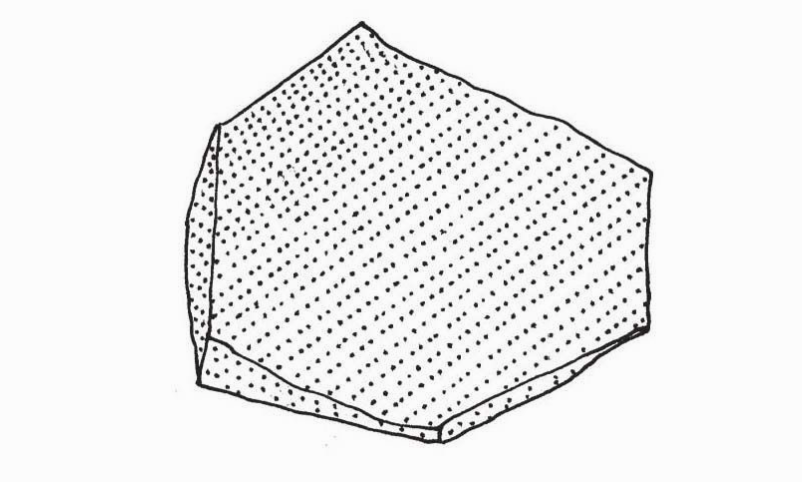
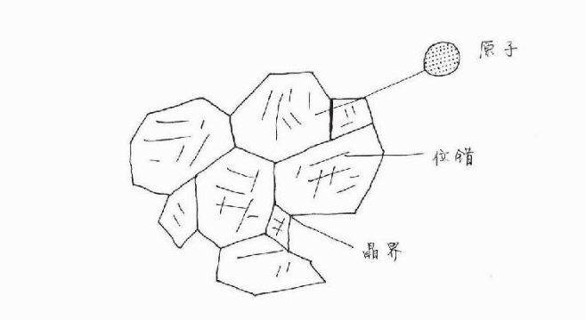
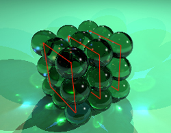
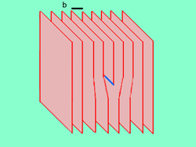
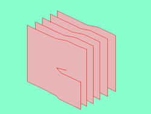

# 0101. 不屈不挠的钢（STEEL）

我从来没在酒吧厕所签过保密条款，因此当我发现布莱恩只是叫我签字，没有其他意图时，不禁松了一口气。一小时前我才认识布莱恩。这家叫作希汉斯的酒吧位于都柏林市郊的邓莱里，离我当时的工作地点不远。布莱恩六十多岁，脸色红润，拄着拐杖，一条腿不良于行。他穿着潇洒的西装，稀薄的灰发带着一点金色，丝卡牌香烟抽个不停。布莱恩发现我是科学家后，立刻猜到我应该会对他 20 世纪 70 年代在伦敦的经历感兴趣。

他在伦敦销售英特尔 4004 芯片，正好赶上当时的计算机热潮。他以每箱一英镑的价格进了一万两千箱芯片，再以十倍价格小批卖给相关产业。我跟他说我在都柏林大学学院机械工程系研究合金，一直滔滔不绝的他难得地沉默下来，陷入沉思。我便趁机去了洗手间。

保密条款就写在一张纸上，这张纸显然是刚从他的笔记本上撕下来的。内容很短，主要是说他会跟我描述他的发明，但我必须保密，而他会付我一爱尔兰镑。我请他再多告诉我一点，但他戏谑地闭上嘴巴，做了拉拉链的动作。我不大晓得我们为什么要在厕所谈这件事。隔着他，我看见其他顾客进进出出。我心想是不是该大声呼救。布莱恩摸了摸外套，从口袋里掏出一支圆珠笔，又从牛仔裤口袋掏出一张皱巴巴的钞票。他是认真的。

我在满是涂鸦的厕所隔间墙上签了保密条款。布莱恩也签了字，然后把钞票给我，那张纸就成了有效力的正式文件了。

回座之后我们继续喝酒，布莱恩开始解释他发明的电动磨刀机。他说他的发明会掀起剃刀革命，因为所有人从此只需要买一次刀片。数十亿美元的产业将瞬间化为乌有，而他会一夕暴富，地球矿藏的消耗也将减少。「怎么样？」他问，然后骄傲地灌了一大口啤酒。

我狐疑地望着布莱恩。科学家都会遇到这种事，被某人抓着大谈自己惊天动地的大发明。再说，剃刀于我是一个敏感话题。我觉得被刺了一下，浑身不对劲，想起了背上那一道长长的伤疤，还有我在汉默斯密地铁站的遭遇。但我还是示意布莱恩继续讲下去……

## 1.1 晚熟的科技

直到 20 世纪，科学家才对钢有深入的了解，这实在很怪，因为锻铁这门技术已经代代相传了数千年。即使在 19 世纪，人类对天文、物理和化学已经有了惊人的理解，工业革命所仰赖的铸铁和炼钢还是全凭经验，靠的是直觉、仔细观察和大量的运气。（布莱恩会不会正是这样的幸运儿，碰巧发明了磨刀的划时代新方法？我发现我并不想否认这种可能性。）

在石器时代，金属非常罕见，因此备受珍惜。铜和金是当时仅有的金属来源，因为地壳上只有这两种金属是自然存在的（其他都必须从矿石中提炼），只是数量不算多。地壳上也有铁，但绝大部分来自天上的陨石。

关于从天而降的金属，没有人比家住波斯尼亚北部的拉伊奇（Radivoke Lajic）体会更深了。

2007 年到 2008 年，他家就至少五次遭陨石击中。在统计学上来说，发生这种事的概率实在微乎其微，拉伊奇说外星人锁定了他家，听起来还蛮有道理的。他在 2008 年发表这个看法，结果他家又遭陨石击中一次。科学家调查后证实是陨石没错，并开始研究他家附近的磁场，希望找出这非比寻常的高频率背后的原因。

拉伊奇展示 2007 年以来击中他家的五块陨石

少了金、铜和陨石铁，我们石器时代的老祖先就只能用燧石、木头和兽骨制作工具。使用过这些材料的人都晓得，用它们做成的工具用途相当有限。木头一敲不是碎了、裂了，就是断成两截，石头和兽骨也不例外。金属跟这些材料根本上就不相同，金属可以锻造——加热后会流动且有可塑性。不仅如此，金属还越敲越强韧，光靠打铁就能使刀刃更硬，而且只要把金属放入火中加热，就能反转整个过程，让金属变软。

一万年前最先发现这一点的人类，终于找到一种硬如岩石又像塑料般可以随意塑形，还能无限重复使用的材质。换句话说，他们找到了最适合制作工具的材料，尤其适合制作斧头、凿子和刀之类的切割用器具。

我们的老祖先一定觉得金属这种软硬自如的能力非常神奇。我很快发现，布莱恩也有同样的感受。他说他没有什么物理和化学知识，全凭反复尝试错误设计出他的发明，但终究成功了。他希望我能帮他测量经他的机器操作后，刀刃锐利度的前后差异，因为拿得出这种证据，他才有本钱跟剃须刀公司好好谈生意。

我告诉布莱恩，用他的机器磨出来的刀刃可能要经过几项测试，剃须刀公司才可能认真考虑他的想法。金属是由金属晶体组成的，每片刀刃平均含有几十亿个晶体，晶体里的原子都按特定方式堆积，形状接近完美的立体晶格。金属键把原子固定在位置上，使得晶体变得强韧，而剃须刀的刀刃变钝，是因为它在反复撞击毛发后，晶体的结构改变，金属键被打断或晶体发生了滑移，致使平滑的锋刃上出现小凹洞。

金属晶体示意图，剃须刀内的晶体便类似如此，其中的成排小点代表原子

如果要照布莱恩的想法，用电动设备磨利刀刃，就得反转前述整个过程。换句话说，原子必须重新归位，回复成原来的结构。布莱恩想让业者对他的构想认真考虑，不仅需要证明他的发明能重建晶体结构，还必须在原子层面上提出解释，说明为什么这样做可行。

摩擦会生热，而不管是以电动或其他方法加热，通常效果都跟他所宣称的相反——热会让金属变软而非变硬。我这么跟布莱恩说，布莱恩说他晓得，但坚称他的电动磨刀机不会加热刀刃。

金属由晶体组成，这个想法可能很怪。因为提到晶体，我们通常会想到透明的多面体矿石，例如钻石或翡翠等。金属的晶体特质从表面看不到，因为金属不透明，而且晶体构造通常小到必须用显微镜才看得见。使用电子显微镜观察金属晶体，感觉就像看到铺得毫无章法的地砖，晶体内则是驳杂的线条，称为「位错」。

位错是金属晶体内部的瑕疵，表示原子偏离了原本完美的构造，是不该存在的原子断裂。位错听起来很糟，其实大有用处。金属之所以能成为制作工具、切割器和刀刃的好材料，就是因为位错，因为它能让金属改变形状。

在这张简图中我只画了几个位错，方便读者想象。一般金属内的位错数量惊人，而且会重叠交错

你不必用到锤子就能感受位错的力量。当你拗回形针时，就是把金属晶体弄弯，要是晶体不弯，回形针就会像木棍一样碎裂折断。金属的可塑性来自「位错」在晶体内的移动。位错移动会带着微量的这种物质，以超音速从晶体的一侧移向另一侧。

换句话说，当你拗弯回形针时，里面有将近 100，000，000，000，000 个位错以每秒数千米的速度移动。虽然每个位错只移动一小块晶体（相当于一个原子面），但已经足以让晶体成为超级可塑性的物质，而非易碎的岩石了。

金属的熔点代表晶体内金属键的强度，也代表「位错」容不容易移动。铅的熔点不高，因此位错移动容易，使得铅非常柔软。铜的熔点较高，因此也较坚硬。加热会让位错移动，重新排列组合，结果之一就是让金属变软。

对史前人类来说，发现金属是划时代的一刻，但金属数量不多的基本问题仍没有解决。其中一个解决方法，是等天上掉下更多陨石来，但这么做需要很有耐心。每年约有几公斤的陨石掉落地球，但大多数都落入了海中。

后来有人发现了一件事，这个发现不仅终结了石器时代，更开启一扇大门，让人类获得了一样似乎永不匮竭的物质：他们发现有一种绿色石头，只要放进热焰里再覆以火红的灰烬，就会变成发亮的金属。我们现在知道这种绿色石头是孔雀石，而发亮的金属当然就是铜。对我们的老祖先来说，这肯定是最神奇的发现，遍布四周的不再是毫无生气的岩石，而是拥有内在生命的神秘物质。

我们的老祖先只能对孔雀石等少数几种岩石施展这种魔法，因为要有效地把石头转变成金属，不仅得先认出正确的岩石，还要仔细控制它的化学状态。但就算某些石头无论加热到多高温度都还是顽石，丝毫没有转变，我们的老祖先肯定还是觉得这些石头藏有神奇的奥秘。他们猜得没错。加热法适用于提炼许多矿物，只是那是几千年后的事了，在人类了解其中的化学原理，知道如何控制岩石和气体在火焰中进行的化学反应之后，熔融法才真正有了新的突破。

---

位错概念扩展（来自维基百科）：

位错（英语：dislocation），在材料科学中，指晶体材料的一种内部微观缺陷，即原子的局部不规则排列（晶体学缺陷）。

从几何角度看，位错属于一种线缺陷，可视为晶体中已滑移部分与未滑移部分的分界线，其存在对材料的物理性能，尤其是力学性能，具有极大的影响。「位错」这一概念最早由意大利数学家和物理学家维托·伏尔特拉于 1905 年提出。

图1：一个刃位错（b = 伯格斯矢量）

理想位错主要有两种形式：刃位错（edge dislocation）和 螺旋位错（screw dislocation）。混合位错（mixed dislocation）兼有前面两者的特征。

数学上，位错属于一种拓扑缺陷，有时称为「孤立子」或「孤子」。这一理论可以解释实际晶体中位错的行为：可以在晶体中移动位置，但自身的种类和特征在移动中保持不变；方向（伯格斯矢量）相反的两个位错移动到同一点，则会双双消失，或称「湮灭」，若没有与其他位错发生作用或移到晶体表面，那么任何单个位错都不会自行「消失」（即伯格斯矢量始终保持守恒）。

位错的几何概念。

图2：简单立方（simple cubic）晶体原子排列和 {100} 晶面示意图

刃位错和螺位错是主要的两种位错类型。然而实际晶体中存在的位错往往是混合型位错，即兼具刃型和螺型位错的特征。

晶体材料由规则排列的原子构成，一般把这些原子抽象成一个个体积可忽略的点，把它们排列成的有序微观结构称为空间点阵。逐层堆垛的原子构成一系列点阵平面的，称为晶面（可以将晶体中原子的排列情况想像成把橙子规则地装进箱子里的样子）。具体的排列情况如图 2 所示。在无位错的晶体（完整晶体）中，晶面（图 2 中的红色平行四边形）以等间距规则地排列。

刃位错：

图3：一个刃位错附近的晶面排列情况，图中黑线代表伯格斯矢量方向，蓝线为位错线

图4：刃位错附近的原子排列情况，沿平行于位错线方向观察

若一个晶面在晶体内部突然终止于某一条线处，则称这种不规则排列为一个刃位错。如图 3 和图 4 所示，刃位错附近的原子面会发生朝位错线方向的扭曲以致错位。

刃位错可由两个量唯一地确定：第一个是位错线，即多余半原子面终结的那一条直线；第二个是伯格斯矢量（Burgers vector，简称伯氏矢量或柏氏矢量），它描述了位错导致的原子面扭曲的大小和方向。对刃位错而言，其伯氏矢量方向垂直于位错线的方向。

螺旋位错：

如图 5 所示，将规则排列的晶面想象成一叠间距固定的纸片，若将这叠纸片剪开（但不完全剪断），然后将剪开的部分其中一侧上移半层，另一侧下移半层，形成一个类似于楼梯拐角处的排列结构，则此时在「剪开线」终结处（这里已形成一条垂直纸面的位错线）附近的原子面将发生畸变，这种原子不规则排列结构称为一个螺旋位错。

图5：一个螺旋位错附近的晶面排列情况

可以看出，螺旋位错的伯氏矢量平行于其位错线方向。

如前所述，刃位错的伯氏矢量垂直于位错线的方向，螺位错的伯氏矢量平行于其位错线方向。但实际材料中位错的伯氏矢量往往既非平行又非垂直于位错线方向，这些位错兼具了刃位错和螺旋位错的特征，称为混合位错。

## 1.2 没有金属铜，就没有金字塔

大约从公元前 5000 年起，我们的老祖先便不断尝试错误，精进炼铜技术。铜制器具不仅促成了人类科技的突飞猛进，还催生了其他技术，以及城市和第一波人类文明的出现。埃及金字塔就是铜制器具大量应用的结果。建造金字塔用的岩石都是从矿场挖出来，再用铜凿子一块块削成固定大小。据估计，古埃及人挖掘了大约一万吨铜矿，制造出三十万把铜凿子。这是空前的成就。

少了金属工具，就算召集再多奴隶也盖不出金字塔。尤其铜凿子因为硬度不够，并不适合凿切岩石，拿来敲打石灰石很快就会变钝，这使得这项成就更显得了不起。专家估计，铜凿子每敲几下就得重新磨利才能继续使用。铜不适合做剃须刀也是同样的道理。

金也是硬度较低的金属，因此戒指很少用纯金制作，否则很快就会刮坏。但只要加入百分之几的其他金属（例如银或铜）来形成合金，就会改变金的颜色：银会让金变白，铜会让金变红，不仅如此，形成的合金还会比纯金硬，而且硬上许多。金属只要掺入少量其他物质就会改变性质，这是研究金属的乐趣所在。

以金银合金为例，你可能好奇银原子到哪里去了。答案是，银原子就嵌在金块的晶格里，占去一个金原子的位置。正是因为银原子的取而代之，金子才会变硬。

金银合金的原子结构图，银原子取代了晶体内的部分金原子

合金通常比纯金属坚硬，原因很简单：外来原子的大小和化学性质，都跟原本的金属原子不同。因此嵌入后会扰动原本金属晶体的物理和电子结构，产生一个关键后果——让位错更难移动。位错更难移动，晶体形状就更难改变，金属也就更坚硬。因此，制造合金就成为防止「位错」移动的一门技艺。

在自然界中，其他晶体里也会发生原子取代。纯氧化铝晶体是透明的，但只要其中含有铁原子就会变成蓝色，也就成为俗称的蓝宝石。同理，纯氧化铝晶体包含了铬原子也会变色，成为红宝石。

从黄铜时代、青铜时代到铁器时代，在文明不断发展中，合金也越来越坚硬。黄铜很软，属于天然矿产，而且容易熔冶。青铜比黄铜坚硬许多，是铜的合金，含有少量的锡，偶尔还包括砷。因此，如果手上有黄铜又知道方法，只需要费一点功夫就能做出强度和硬度都比黄铜高十倍的武器和剃刀。唯一的麻烦是锡和砷非常稀有。青铜时代的人开发了许多精心找出的贸易路线，从康瓦尔和阿富汗等地运送锡矿到中东各文明的中心，就是为了这个目的。

## 1.3 钢是谜样物质

我告诉布莱恩，现代剃刀也是合金制成的，而且是一种非常特别的合金，我们的祖先花了几千年还是不了解它——它就是钢。钢是加了碳的铁，比青铜还硬，而且成分一点也不稀有。几乎每块岩石都含铁，而炭更是生火的燃料。我们的祖先不知道钢是合金，更不知道以木炭形式出现的碳，不只是加热和锻造铁的燃料，还能嵌入铁晶体里。

炭在加热黄铜时不会产生这种现象，加热锡和青铜时也不会，只有对铁会如此。我们的祖先一定觉得这种现象非常神秘，我们也是在学会了量子力学后，才明白背后的道理。钢里的碳原子并未取代晶格内的铁原子，而是挤在铁原子之间，把晶体拉长。

还有一个麻烦：要是铁里掺了太多碳，例如比例达到百分之四而非百分之一，形成的钢就会极为易碎，根本无法用来制作工具和武器。这会是很大的麻烦，因为火里的含碳量通常不低，铁加热太久甚至液化后，晶体内就会掺入大量的碳，形成易碎的合金。高碳钢制成的刀剑在战斗中很容易折断。

一直到 20 世纪，人类在彻底掌握合金形成的原理后，才明白为什么有些炼钢法行得通，有些不行。过去的人只能靠着尝试错误，找出成功的炼钢法，然后代代相传，而且这些方法往往是行内机密。但这些不外传的方法实在太过复杂，因此就算遭到窃取，成功复制的概率也非常低。某些地区的冶金技术非常闻名，可以制造出高质量的钢，当地文明也因而发达。

## 1.4 钢铁是珍贵的军事力量

1961 年，牛津大学的里士满（Ian Richmond）教授发现了一处古罗马坑洞，这坑洞大约是公元 89 年时挖掘的，里头埋了 763，840 根两英寸长的小钉子（1 英寸约合 2.54 厘米）、85，128 根中钉子、25，088 根大钉子和 1344 根 16 英寸长的超大钉子。所有的钉子都由铁和钢制成的，而不是纯金，大多数人应该都对此蛮失望的，但里士满教授并不会，他一心追问：古罗马军团为什么要掩埋 7 吨的钢和铁？

古罗马军团当时在苏格兰一处名叫英赫图梯（Inchtuthil）的地方，驻扎在阿古利可拉将军建筑的前进碉堡里。英赫图梯位于古罗马帝国的边界，军团的任务是捍卫边疆，不让他们视为蛮夷的凯尔特人进犯。

这支军团在当地驻扎了 6 年才撤离，同时遗弃了碉堡。撤退前他们想方设法不留下任何有利于敌人的东西，因此销毁了所有粮食和饮水容器，还放火把碉堡夷为平地。但他们还不满意，因为碉堡灰烬中有铁钉残留，铁钉太过珍贵，不能让凯尔特人挖走。古罗马就是靠着铁和钢打造了灌溉渠道、船只与刀剑，从而建立了帝国。把铁钉留给敌人，等于奉送对方武器，因此他们在南撤之前挖了一个大坑，把铁钉都埋起来。除了武器和盔甲，他们可能还带走了一些小铁器，包括代表古罗马文明巅峰的「诺瓦齐力」（novacili），也就是剃刀。靠着诺瓦齐力和手握剃刀的理发师，这群古罗马军人得以仪容整齐、不带胡髭地班师回朝，不跟赶走他们的蛮族混为一谈。

炼钢有如谜团难以把握，许多传奇因之而起，而不列颠在古罗马军团撤退后的统一及复兴，更与其中一则永恒传奇脱不了关系，那就是亚瑟王的王者之剑。据传那把剑具有魔力，谁拥有它就能统治不列颠。由于当时的刀剑经常折断，让武士在战场上因手无寸铁而无法自卫，所以不难理解一把高品质的钢剑为何能成为文明战胜野蛮的象征。因此，炼钢过程当然高度仪式化，而这也解释了古人为何觉得钢铁具有魔力。

这情况在日本最为明显。铸造武士刀不仅需要数星期的时间，而且是一种虔诚的仪式。天丛云剑是日本名剑，武尊倭建命靠着它呼风唤雨，击败敌人。虽然故事中掺杂了许多幻想故事与仪式，但某些刀剑能比其他武器更硬、更利十倍，却不是神话而是事实。15 世纪时，日本武士制作的钢刃已经独步全球，而且称霸世界五百多年，直到 20 世纪冶金科学大幅跃进才被超越。

## 1.5 武士刀完成不可能的任务

武士刀使用的特殊钢材称为玉钢，是由太平洋火山铁砂制成的。这些铁砂的主要成分为磁铁矿，是制作指南针的材料。炼造玉钢的土炉称为「吹炉」，宽、高各 1.2 米，长 3.6 米。首先在吹炉里「点火」，让黏土变硬，成为陶瓷，接着再仔细铺上数层铁砂和黑炭，让它们在吹炉里焖烧。整个过程大约费时一周，需要四到五人轮流照看，并用风箱把空气灌入炉内，确保炉火温度够高。最后工匠会把瓷炉敲碎，从灰烬和残余的铁砂及炭屑中取出玉钢。这些钢料的颜色晦暗，非常粗糙，但特点是含碳量的范围很广，有些很低，有些很高。

日本武士工匠的创新之处在于有能力分辨高碳钢和低碳钢，前者硬而易碎，后者软而强韧。工匠完全凭借外观、触感和撞击时的声音来判断两者。一旦分类完成，他们就用低碳钢制作刀身，让刀非常强韧，甚至有弹性，在打斗中不会轻易折断。至于刀锋则使用高碳钢来制造，它虽然易碎但非常坚硬，因此可以磨得极为锐利。工匠用锐利的高碳钢包覆强韧的低碳钢，以此完成了许多人眼中不可能完成的任务，制作出的武士刀，经得起与其他刀剑对砍、耐得住和盔甲碰撞，且常保锋利，能轻松斩人首级。这种武士刀是两全其美的最佳武器。

人类直到工业革命，才有能力制造出比武士刀更强且更硬的钢料。这一回轮到欧洲国家开始进行更大、更夸张的工程，例如建造铁路、桥梁和船舰，而他们使用的材料是铸铁，因为铸铁可以大量制造，并可以使用模具铸形。只可惜铸铁在某些状况下非常容易破裂。由于工程越来越宏大，使得破裂意外越来越常发生。

最严重的一次意外发生在苏格兰。1879 年 12 月 28 日晚上，全球最长的铁道桥——泰河桥突然被冬季强风吹垮，致使载有 75 名乘客的客运火车坠入泰河，所有人均不幸罹难。这场灾难证实了许多人先前的疑虑：铸铁不适合兴建桥梁。现在不仅需要做出和武士刀一样强韧的钢材，而且必须能大量制造。

## 1.6 贝塞麦法掀起工业革命

英国科学促进会在某日开会时，一位名叫贝塞麦（Henry Bessemer）的工程师起身发言，说他做到了前述的要求。这位来自谢菲尔德郡的工程师宣称，他可以制造钢水，而且方法不像制作日本武士刀那么复杂。一场革命就此蓄势待发。

贝塞麦法非常简单，简直天才到了极点。他把空气灌入熔铁，让空气中的氧和铁里的碳发生化学反应形成二氧化碳，以此把碳带走。这种方法需要有化学知识才能想得到，这使得炼钢头一次成为科学事业。此外，氧和碳的化学反应非常剧烈，会释出大量热能，让炉内温度升高，使钢保持滚烫并呈现液态。这套方法直截了当又可以工业量产，正是我们想要的答案。

贝塞麦法只有一个问题，就是它不管用，至少试过的人都这么说。气愤的钢铁制造商很快开始嚷着退钱，他们向贝塞麦买下使用权，投下大笔资金购买设备，结果血本无归。

贝塞麦毫无办法。他其实也搞不清楚他的方法为何有时管用，有时无效。不过他还是继续尝试，并且在英国冶金家马希特（Robert Forester Mushet）的协助下努力改良他的方法。贝塞麦的原始步骤是移除碳到残留量正确为止，也就是剩下大约百分之一的碳。但这个做法很危险，因为每家炼钢厂购买的铁矿来源不同。因此，马希特建议先移除全部的碳，然后再把百分之一的碳掺回。这方法管用了，而且可以再现。

贝塞麦试着推销他的新方法，然而钢铁制造商这回完全不理他，以为这又是骗局一场。他们坚称不可能用铁水炼钢，宣称贝塞麦是大骗子。贝塞麦最后别无选择，只好自己开设炼钢厂。几年后，贝塞麦钢铁公司制造出的钢铁比竞争对手便宜许多，产量更是惊人，逼得对手只好向他购买使用权。从此贝塞麦富甲一方，机器时代也自此正式到来。

布莱恩会是贝塞麦第二吗？他会不会碰巧发现了一个可以运用磁场或电场重组刀锋晶体结构的方法，虽然他不知其所以然，但却非常管用呢？

毕竟我们听过太多嘲笑先知，结果却自取其辱的故事。许多人都笑说，比空气重的机器怎么可能在天上飞，但我们现在都搭飞机到处跑。电视、手机和计算机的构想也都曾遭人奚落。

## 1.7 不再夜夜磨刀

20 世纪之前，钢刃和手术刀都非常昂贵，必须手工制作，而且要用最高级的钢材，因为只有如此才能把刀磨得够锋利，轻松刮净胡子而不会勾到胡根。只要曾用过钝掉的剃须刀，一定知道即使只是微微勾到胡根，就会造成多大的痛楚。钢接触到空气和水会锈蚀，因此用水清洁刀锋会让锐利的尖端锈掉，使刀刃变钝。几千年来，刮胡子的仪式都是从「磨刀」开始，先拿着剃刀在皮革上来回磨动。你可能觉得皮革那么软，不可能把刀磨利。没错，真正把刀磨利的是沾在皮革上的细石粉。传统上是用名为「铁丹」的氧化铁矿物，但现在比较常用钻石粉。把钢制刀刃在皮革上来回磨动时，刀锋会和极硬的钻石粉接触，使得少量金属被磨掉，让刀锋重现锋利。

然而，1903 年有一个人改变了这一切。他的名字叫吉列（King Camp Gillette），是美国商人。吉列决定采用贝塞麦法制造的廉价工业用钢来制作抛弃式刀刃，好让每个男人都能轻松刮胡子。他的想法是，只要剃须刀够便宜，钝了直接扔掉，就再也不必磨刀了。

1903 年，吉列卖出了 51 把剃须刀和 168 枚刀片，隔年变为 90，884 把剃须刀和 123，648 枚刀片。到了 1915 年，他的公司已经在美国、加拿大、英格兰、法国和德国设厂，售出的刀片超过七千万枚。一旦男人不再需要到理发馆刮胡子，抛弃式刀片就成了家家浴室必备的物品，直到现在依然如此。

尽管目前有许多人发起各项运动，鼓吹食品制造回归根本，却从来没有人呼吁我们，重新用黄铜剪刀理发或用钝掉的刀片刮胡子。

## 1.8 误打误撞不锈钢

吉列的生意算盘打得很好，原因很多。最明显的一个就是，即使刀片没有因为刮胡子而变钝，也会由于生锈而很快失去锋利，让他永远有生意可做。但这个故事还有一个转折，其中包含了一个简单到极点的创新，非得靠意外才能发现。

1913 年，欧洲列强忙着整军经武面对第一次世界大战，布雷尔利（Harry Brearley）受雇钻研合金，以便改良枪管。他在英国雪菲德郡一间冶金实验室工作，把不同的元素掺入钢里来模铸枪管，再用机械测试硬度。布雷尔利知道钢是碳和铁的合金，也晓得还有许多元素也能加进铁里，用来加强或减弱铁的性质，但没有人知道原因为何。于是他开始尝试，把铁熔解后加入各种成分，以观察效果。比方说他某一天用铝来试验，隔天就用镍，以此类推。

布雷尔利毫无进展。新铸的枪管如果不够硬，他就扔到角落。他的灵光乍现发生在一个月后。那天他经过实验室，发现那堆生锈的枪管里有东西在闪闪发亮。他没有置之不理，反而打消去酒吧的念头，找出那根没生锈的枪管，立刻明白了它的重要性。他手上拿的是世界上第一块不锈钢。

布雷尔利掺入的两种成分是碳和铬，因为比例刚好，意外创造出非常特别的晶体结构，让碳原子和铬原子同时嵌入铁晶体内。铬没有让铁变硬，所以他把掺铬的枪管扔了，但没想到铬产生的效用更有趣。

钢接触到空气和水时，通常会在表面发生化学反应，形成氧化铁，也就是俗称铁锈的红色矿物质。铁锈剥落后，新的钢面又会受空气和水侵蚀，使得生锈成为钢铁的痼疾，因此铁桥和车子才要上漆防锈。

但掺了铬就不同了。铬很像某些特别有礼貌的客人，氧气还没碰到主人铁原子，铬就抢着先跟它反应形成氧化铬。氧化铬是透明坚硬的矿物质，对铁的附着力极强。换句话说，它不会剥落，从外表又看不见，有如一道隐形的化学保护膜把钢铁完全包住。除此之外，我们现在还知道这层膜会自我修复，也就是即使不锈钢的表面磨到了，使保护膜遭到破坏，它也会自行复原。

布雷尔利开始制作全世界第一把不锈钢刀，但立刻遇到困难。含铬的钢不够坚硬，无法磨利，很快就被戏称为「什么都不能切的刀」。毕竟布雷尔利一开始舍弃了它，没拿它来做枪管，就是因为它不够硬。但含铬的钢虽然硬度不足，却让它因此具备别的长处，只不过这长处到很后来才有人发掘，那就是它可以扳成复杂的形状。这让它成为英国雕塑史上最具影响力的作品，几乎遍布所有家庭：那就是厨房的水槽。

不锈钢水槽既强韧又闪亮，而且似乎丢什么给它都无妨。在这个但求以迅速方便的方法来去除废弃物和脏污的年代，不管丢入的是油脂、漂白水还是强酸，不锈钢真的百毒不侵。它已经把陶瓷水槽赶出厨房，而只要我们点头，它也乐于取代浴室里的陶瓷马桶。只不过我们对这种新材质还不够信任，仍不敢把最私密的废弃物交给它。

不锈钢是现代世界的缩影。它的外表干净明亮，感觉坚不可摧却又非常亲民，才出现短短一百年，就已经成为我们最熟悉的金属。毕竟我们每天都会把它放到嘴里：布雷尔利最后用不锈钢做成餐具。氧化铬在铁的表面形成的透明保护膜，让舌头永远碰不到铁，唾液无法跟金属反应，使得汤匙尝起来没有味道，于是人类从此再也不会受到餐具味道的干扰。不锈钢经常出现在建筑和艺术里，原因是它光亮的表面似乎永不褪色。英国雕塑家安尼施·卡普尔（Anish Kapoor）在芝加哥千禧公园的作品「云门」就是绝佳的例子。不锈钢反映了我们对现代生活的感受：利落明快，并且能对抗肮脏、污秽与混乱。不锈钢反映出，我们如它一般强韧不屈。

冶金家为了解决不锈钢刀具的硬度问题，误打误撞解决了剃刀生锈的毛病，创造出有史以来最锋利的刀刃，进而改变了无数人的面容与肌肤。只是刮胡子成为在家也能做的事情后，街头混混也意外地多了一种新武器，就是便宜耐用的刀片，而且非常锋利，能够一口气划破皮革、羊毛、棉布和皮肤。关于这点我比谁都要清楚……

我一边想着这些，一边跟布莱恩谈论他新发明的不锈钢刀片磨刀法。既然坚硬强韧、尖锐锋利、无惧水和空气侵蚀的不锈钢，也是从几千年的尝试错误中创造出来的，那么某个没有科学背景的家伙，无意间发现磨利刀片的新方法也就似乎不无可能了。微观下的物质世界如此复杂和巨大，我们只探索了其中一小部分。

那天晚上离开酒吧时，布莱恩和我握手道别，说他会再跟我联络。在昏黄的钠光路灯下，他一拐一拐走在街上，忽然转身醉醺醺地大吼：「不锈钢大神万岁！」我想布莱恩指的是希腊神祇赫菲斯托斯。他掌管金属、火与火山，形象是工房里的铁匠。赫菲斯托斯身体残缺畸形，原因可能是砷中毒，因为当时的铁匠熔炼青铜时，会接触到大量的砷，所以常有这个毛病，而且除了跛脚还会罹患皮肤癌。我回头望着布莱恩摇摇晃晃地走在街上，想起他的拐杖和红脸，不禁怀疑他到底是谁。
