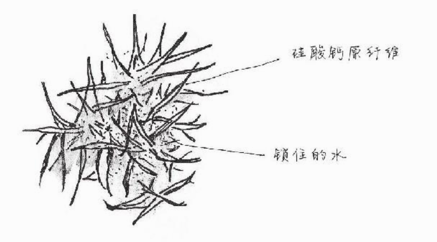
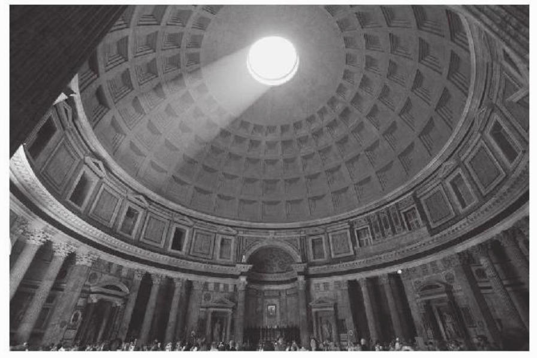
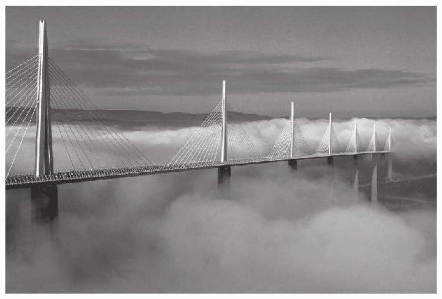
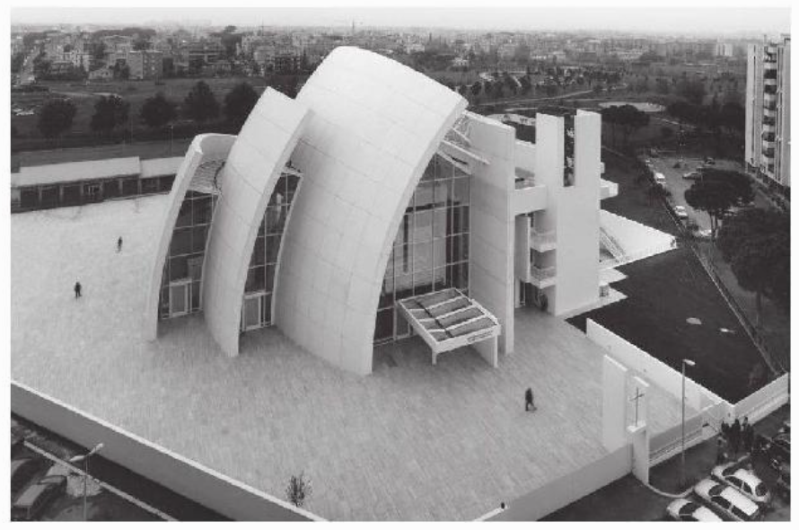

# 0301. 作为基础的混凝土（CONCRETE）

2009 年春季，有一天我出门到超市买面包，经过街角时突然发现伦敦南华克大楼不见了。这栋 20 世纪 70 年代的经典办公大楼整个被夷为平地， 21 层楼的摩天建筑完全消失不见。

我绞尽脑汁回想自己上次见到它是什么时候。应该是上周出门那次吧？那时一样是去买面包。我突然有点担心，是我老了，还是现在拆房子的效率超高？无论如何，我的自信心都受到了打击，觉得自己没那么厉害了。我一向喜欢南华克大楼，那个年代有自动门可是新潮得很。如今它消失了，在街上留了一个洞，也在我生命里开了一个口子，伤口比我想的还要大。一切感觉都不一样了。

我走到围着那一大块空地的鲜艳围篱边，上头贴着一张告示，宣布这里即将兴建欧洲第一高楼「碎片大厦」，同时附上一张尖塔形玻璃摩天大楼的照片，应该就是即将从南华克大楼的废墟中兴起、俯瞰伦敦桥车站的新建筑吧。底下的说明更预言，这栋摩天大楼将成为未来数十年伦敦的新地标。

我又气又怕。万一这根玻璃大阳具变成恐怖分子的目标怎么办？要是它跟纽约世贸双塔一样遇袭倒塌，害死我和我的老婆、孩子呢？我上谷歌地图去看，发现这栋 330 米高的大楼就算塌下来也不会砸到我家，让我松了口气。充其量它有可能砸到附近的莎士比亚酒吧，不过我很少去那里。然而，倒塌产生的烟尘可能让人窒息而死。我嘴里一边嘀咕，一边怀着世界末日就要来了的心情到超市去买面包。

接下来几年，我常在家门口看着这栋摩天大楼缓缓升起。它让我见到许多令人震撼的景象与工程奇迹，不过更让我对混凝土了解得无比透彻。

## 3.1 混凝土要多久才会干

他们首先在地上挖一个大洞。这里说的「大」可是非常大。我每周执行面包采购任务时都会绕到围篱边，从观察窗盯着巨大的机器不停地掘土，越挖越深，仿佛在采矿似的。但他们掘出来的是黏土，是泰晤士河数十万年来留下的淤泥。这些黏土曾经用来制砖、兴建房子和仓库，伦敦就是靠这些淤泥做成的一砖一瓦盖起来的。不过，碎片大厦不会用黏土盖。

某天，等黏土都清走了，工程人员灌了七百辆车次的混凝土到大洞里，好让地基能支撑住摩天大楼，防止这 72 层大楼和里面的两万人陷进淤泥中。工程人员用一层层的混凝土填满那个大洞，盖好一个个地下楼层，直到大洞消失，留下混凝土砌成的地底殿堂为止。混凝土缓缓干涸，地基盖得又好又快，速度惊人。非得如此不可，因为基于经费考量，工程人员在地基完成前就已经开始兴建地上物了。

「你觉得混凝土要多久才干？」旁边一个出来遛狗的男士问我。我们一起站在围篱的观察窗边往工地看。「谁知道？」我撒了谎。

我撒谎是因为不想多聊，结果也如我所愿。撒这种谎是习惯，我生长在伦敦，总需要客气地婉拒陌生人的攀谈。何况我不晓得要是劈头就纠正他，跟他说「混凝土永远不会干，因为水是混凝土的一部分」，他和他的狗会有什么反应。

混凝土凝固时会和水作用，引发连锁化学反应，在混凝土内部形成复杂的微结构，因此就算里头锁住了许多水分，混凝土的外表不仅看起来干燥，而且实际上还能防水。

混凝土凝固是相当精巧的化学反应，其中的活性成分为磨碎的岩石，但不是所有石块都管用。想自制混凝土，岩石必须含有碳酸钙，而碳酸钙是石灰石的主要成分。石灰石是生物体层层埋在地底，经过数百万年地壳运动的高温高压融合而成的物质。此外，制造混凝土还需要含硅酸盐的岩石。硅酸盐是硅氧化合物，地壳将近 90％ 由硅酸盐组成，因此某些黏土应该可用。但不能直接把这些成分磨碎混合后再加水，除非你要的是烂泥巴。为了制造会和水反应的关键成分，必须先断开碳酸钙和硅酸盐的化学键。

要做到这一点没那么容易。碳酸钙和硅酸盐的化学键非常稳定，所以岩石很难溶解于水中，也不大会和其他物质发生反应，因此才能挺过风吹雨打屹立数百万年。关键在加热，而且是高达 1450℃ 的高温。森林大火或燃烧木炭至火焰呈红色或黄色，温度也只有 600℃ 到 800℃，远不及这个高温。1450℃ 的火焰是亮白色，微微泛蓝，但没有半点红色或黄色，亮度会让人看了很不舒服，甚至非常刺眼。

岩石在这样的高温下会开始分裂重组，产生一群名为硅酸钙家族的物质。称为家族是因为不同的硅酸钙含有程度不等的杂质，会影响化学反应的结果。制造混凝土需要富含铝和铁的矿石作为点石成金的材料，但比例必须正确，降温后才会形成颜色如月球表面的灰白粉末，用手去摸会感觉很像灰烬，有丝绸的滑顺感，仿佛倒退回到岩石的前身，但很快你的手就会觉得干痒，如同遭细针戳刺。这材料非常特别，却有个无趣的名字，就叫水泥。

水泥粉末只要加水就会迅速把水吸收，然后颜色变深，但不会像其他加了水的岩石粉末般变成烂泥，而是产生一连串化学反应变成凝胶。凝胶是半固体状的流质，小孩爱吃的果冻就是凝胶，大多数牙膏也是。凝胶受制于内在构造，无法像液体一样随意流动。果冻胶化是因为明胶，水泥胶化则是因为水合硅酸钙原纤维。钙和硅酸分子溶解后，会形成极似有机分子的晶体结构（见下图），并且不断生长，化学反应也持续进行，使得水泥内部的凝胶不断改变。

凝固中的水泥内部的硅酸钙原纤维增生图

增生的原纤维相遇后会彼此交错，形成键结锁住更多水分，直到水泥从凝胶变为坚硬的固体为止。这些原纤维不仅彼此键结，还会抓住岩石与石块。水泥就这样成了混凝土。

工人会用水泥黏合砖块盖房子，或接合石头兴建纪念碑，不过都只涂抹在砖块或石头之间当黏合剂，用量很少。唯有混合充当砖头的碎石，变成了混凝土，水泥才能充分发挥它成为建材的潜能。

## 3.2 加水多少是关键

任何化学反应都一样，只要成分比例不对，结果就是一团糟。混凝土中如果加水过多，水泥里头就没有足够的硅酸钙能和水反应，水分就会残留在结构体内，使得混凝土强度减弱。但是加水太少又会让部分水泥无法和水反应，同样会削弱混凝土的强度。混凝土出问题通常是人为疏失的结果，但有时可能不会实时发现，所以常常到建筑完成多年，建筑商早就拍屁股走人后才发生巨灾。

2010 年海地强震损失惨重，问题就出在房屋兴建不当和混凝土质量欠佳。据估计，当时有二十五万间房屋倒塌，三十多万人死亡，上百万人无家可归。更糟糕的是海地并非特例，全球各地都有这种混凝土不定时炸弹。

追查人为疏失有时很难，因为混凝土从外表看来一切都好。美国肯尼迪机场的主任工程师曾在进行例行查核时，发现中午前送来的混凝土凝固后强度很够，中午过后不久送来的混凝土却弱了许多。他不晓得这是怎么回事，追查了所有可能原因也找不到答案，直到他跟着水泥车到机场才恍然大悟。他发现水泥车司机在中午时通常会休息吃饭，然后用水管为混凝土加水，因为司机以为加水能让混凝土维持液态更久。

碎片大厦的工人在挖土兴建地基和支承架构时，发现了现代混凝土的前身，也就是罗马混凝土。旧南华克大楼旁有一家我常去的炸鱼薯条店，工人拆除店面时挖到了古罗马浴池遗迹，那些混凝土就是在那里发现的。古罗马人很幸运，不用亲自实验把不同比例的岩石粉末加温至白热，因为拿坡里附近一个叫作波佐利（Pozzuoli）的地方就有现成的水泥。

波佐利臭气熏天，真的很臭。这个意大利地名来自拉丁文 putere，意思就是发臭，气味是从附近火山砂传来的硫黄味。往好处想，这一带数百万年来接收了大量的岩浆、火山灰与浮石。火山灰来自火山口喷发的过热硅酸岩，过程很可能跟现代水泥的制程类似。古罗马人只需要忍受臭味，把数百万年来堆积的火山岩粉末挖走就好。

这种天然水泥和现代的波特兰水泥略有不同，需要添加石灰才能凝固。然而古罗马人一旦搞清楚这一点，并掺入石头增加强度，他们就成为人类史上第一个拥有混凝土这个独一无二建材的民族。

碎片大厦工程人员发现的古罗马浴池遗迹

砖造建筑的组合特性是它受欢迎的原因。砖是砖造建筑的基本单位，刻意做成手掌大小，以利单人作业。混凝土和砖非常不同，它起初为液体。这表示混凝土建筑可以用浇注法做出连续体结构，从地基到屋顶一气呵成，没有任何接点。

混凝土工程师的绝招是：你要地基，我们就灌地基给你；你要柱子，我们就灌柱子；要楼面就灌楼面。你要两倍尺寸？没问题；想要弧面？当然可以。只要开得了模，混凝土什么结构都做得出来。混凝土的威力清晰可见，造访过建筑工地的人都会爱上它。

我一周又一周，都会从碎片大厦工地的观察窗往里看，看得心荡神驰。我看见大楼从地基缓缓兴起，由蚂蚁般的工人一点一滴浇注而成。岩石和石块粉末送到工地，只是加水就成了石块。这不只是工程技术，更是一种哲学、一种圆满。这个圆从地幔经由造山运动生成岩石和石块开始，再由人类接手，把石头和岩石挖掘出来，按照人类的设计转变成人造的地景，变成高楼大厦，让我们在其中居住和工作，成就这一个循环。

混凝土的问世，让建筑师的想象力得以尽情驰骋。古罗马人发明混凝土后，立刻明白可以用它来奠立帝国的根基。他们可以在任何地方兴建港口，因为混凝土在水下也能凝固。他们还可以兴建沟渠和桥梁，而这些基础建设又能把混凝土运送到任何有需要的地方，不必仰赖当地的石头和黏土。因此，混凝土很适合打造帝国。不过，古罗马最宏伟的混凝土工程就在首都，也就是罗马万神殿的穹顶（下图）。它完工两千年来始终屹立不倒，至今仍是世界上最大的无钢筋混凝土圆顶建筑。

万神殿没有因为罗马帝国衰亡而颓圮，但混凝土却销声匿迹了。古罗马停止制造混凝土后，这个世界有一千多年不曾出现混凝土建筑。这项材料技术亡佚的原因至今成谜，可能因为制造混凝土是专门技术，需要技术发达的帝国才能支持，或者因为它没有结合某种技能或工艺，例如打铁、石刻或木工，以至于没有代代流传，也可能是因为罗马混凝土虽然好用，却有个致命的缺陷，而古罗马人虽然晓得，却无法解决。

有两种方法让材料断裂。首先是「塑性断裂」，例如把口香糖拉断就是这样。材料受拉扯后会产生晶格重排而导致延展，使得中间越来越细，最后一分为二。绝大多数金属都可以用这种方法弄断，但因为必须移动许多位错，所以要非常费力才能做到，这也是金属的强度和韧度都高的原因。另一个断裂法是「脆性断裂」，玻璃和茶杯破裂就是如此。这些材料无法借由流动抵消拉扯的力道，只要有一处脆弱就会破坏整体，使得材料断开或碎裂。混凝土碎裂即属此类，这让古罗马人伤透了脑筋。

古罗马人始终未能解决这个问题，只好限制混凝土的用途，只用在受压缩而非受拉扯的结构体，例如柱子、圆顶或地基上，在这些地方的混凝土全都被结构的重量挤压着。在受到挤压的情形下，混凝土就算有裂隙也依然强固。造访有两千年历史的万神殿，你会发现穹顶多年来已经出现不少裂痕，可能是地震或下沉所导致，但这些裂隙不会危害结构，因为整个穹顶都受到挤压。然而，古罗马人尝试用水泥兴建横梁或悬垂楼面时，由于这些结构必须承受弯曲应力，他们势必发现就算出现再小的裂痕也会造成崩塌。当裂痕两侧的建材受自身和建筑的重量拉开，就绝对无力回天。因此，想让混凝土发挥最大功效，像我们现在用它来兴建墙壁、楼面、桥梁、隧道和水坝这样，就势必要解决这个问题。然而，解决方法直到欧洲工业革命兴起时才出现，而且来自非常出人意料的地方。

## 3.3 园艺家发明钢筋混凝土

巴黎园艺家莫尼耶（Joseph Monier）喜欢自己制作花盆。1867 年时，花盆都是陶瓦做的，非常脆弱易碎，而且造价昂贵，尤其不适合栽种在温室成长迅速的热带植物。混凝土似乎是更好的选择。它比陶土更容易制作大型花盆，又因为不需要放入窑中烧制，所以也便宜得多。但混凝土的韧度还是不够，因此莫尼耶制作的混凝土花盆还是跟陶瓦花盆一样容易龟裂。

莫尼耶想到一个方法，就是在混凝土里放入钢圈。他不可能知道水泥和钢材的键结极强，因为钢很可能就像放进醋里的油，完全不跟混凝土混合。结果不然，混凝土里的硅酸钙原纤维不仅会吸附石头，也会吸附金属。

混凝土基本上是拟石材，以石头制成，外观、成分和性质也近似石头。但钢筋混凝土就不同了。它跟所有天然材料都不一样。混凝土得到钢筋的加强后，就算受到弯曲应力，也会由混凝土内的钢筋吸收，不会产生大裂缝。钢筋和混凝土合二为一，把原本用途有限的混凝土变成世界上用途最广的建材。

还有一件事莫尼耶当时也不晓得，不过却是强化混凝土的制胜关键。材料不是静态的，会因环境而变化，尤其受温度影响更大。大多数材料都会热胀冷缩，建筑、道路到桥梁，无不因日夜温差而胀缩，仿佛它们会呼吸一样。道路和桥梁的裂隙多半源自于此，如果设计时不将此纳入考量，累积的压力可能会让结构崩塌。任何工程师在推测莫尼耶的尝试结果时，都会认为水泥和钢差异太大，胀缩幅度非常不同，应该会导致结构解体，而且这样的花盆摆在冬冷夏热的花园里应该会碎裂。或许正是因为如此，才会没有工程师愿意尝试，反倒让园艺家来做了。

不过说来巧合，钢和混凝土的膨胀系数几乎完全相同，也就是两者的胀缩率几乎相等。这是个小小的奇迹，而莫尼耶不是唯一的发现者。一位名叫威尔金森（William Wilkinson）的英国人，也凑巧发现了这个神奇组合。钢筋混凝土的时代从此到来。

只要造访全球许多发展中国家，就会发现数以百万计的穷人住在用泥巴、木材或金属波浪板搭成的棚屋里。这些房子禁不起风吹雨打，而且日晒时非常炎热，下雨又会漏水或坍塌，时常遭暴风吹垮、洪水冲走，或被警察或当权者的推土机铲平。想建造一个能抵挡强风暴雨和权势者的家，建材不只要坚固，还得防火、防风和防水，更要便宜到人人都盖得起。

## 3.4 施工迅速且便宜的建材

钢筋混凝土就是这样的建材。每吨一百英镑的价格绝对是世界上最便宜的建筑材料，加上非常适合机械化工法，使得建筑成本还能再往下压。一个人只要有混凝土搅拌机，几周内就能独力完成地基、墙壁、楼面和屋顶。由于结构单一完整，完成的房子能轻松抵挡风吹雨打一百年。地基可防止水分渗透以及昆虫或白蚁的侵蚀，墙壁能抗倒塌和支撑玻璃窗，而且建筑几乎无须维修。瓷砖不会剥落，因为根本不用贴瓷砖，屋顶跟房子一体成形，藤蔓、植物和青草都可以生长于其上，替建筑物调节温度。除了万神殿穹顶之类的圆顶建筑，就只有钢筋混凝土可以支撑屋顶花园。对于发明钢筋混凝土的园艺家来说，这或许是最好的赞美。

碎片大厦越盖越高，我发现我再也不用隔着观察窗才看得到它了。但我的视野反而变得更糟，因为现在所有的工程都在最顶端进行，要从我家的屋顶才能看得清楚。于是我很快就养成习惯，每天早晨都会到屋顶上一边享受咖啡，一边观察碎片大厦的进度。我开始用粉笔在我家的烟囱上记录它的高度变化。只见那楼层越来越高！根据我的计算，建筑工人速度最快时，几乎每几天就会盖好一层楼。

工人能做到这一点，靠的是不断浇注混凝土。水泥车把混凝土运到工地，然后灌入建筑最顶端的板模里。板模依据楼层的大小和形状搭成，里面先架好钢筋作为水泥大楼的骨架。楼面浇注完成后，就卸除板模往上搬，预备浇注下一层楼面，如此不断重复，碎片大厦也越来越高，据我估算，成长速度为每天三米。

最神奇的是，我觉得这个循环似乎能永远继续下去，只要把板模往上搬，然后再浇注混凝土就成了，感觉就像小树新生的枝丫一样。不过，这个循环目前是有极限的。迪拜哈里法塔的高度几乎是碎片大厦的三倍，工程人员发现，要用机器把混凝土垂直打到工地顶端，是很棘手的问题。

不过，这个方法还是非常天才的。这种机械化的建筑方法让混凝土成为极现代的建材，可以通过浇注和浇灌，迅速盖起庞大的建筑。过去的巨型建筑都需要几十年才能盖完，例如欧洲的石造教堂或中国的万里长城，而欧洲第一高楼碎片大厦的主结构只花了不到六个月就完成了。混凝土让人更敢想象与尝试，也使得土木工程师的梦想得以实现。美国胡佛水坝、法国米约高架桥和俗称「意大利面条路口」的英国格瑞夫里山立体交叉桥，都是钢筋混凝土的杰作。

法国的米约高架桥由钢筋混凝土制成，是世界上最美的桥梁之一

有一天，碎片大厦不再长高了，几天后外层板模也消失了，只剩下 72 楼的混凝土尖塔兀自耸立，灰暗、粗糙，和新生儿一样布满皱纹。工程再度从底端开始，让伦敦最新的水泥尖塔默默迎风摇摆，仿佛无所事事地俯瞰底下的人类如蚂蚁般在它脚边走动。但它其实没闲着。混凝土里的含水硅酸钙原纤维正不断增长交错，键结钢筋与石块让尖塔变得更稳固。虽然混凝土遇水后 24 小时内就会变得够硬，但这人造岩石的内部构造还需要好几年的发展，潜能才会完全发挥。在我下笔的此刻，碎片大厦里的混凝土主结构还在变硬、变强，只是隐而不显。

等到这栋尖塔的混凝土大厦完全硬固后，将每天承载两万人的重量，以及他们的数千件桌椅、家具、计算机和几吨重的用水，日以继夜永不休止，然而建筑结构却不会有任何明显的变形，楼面依然稳固坚实。它能任劳任怨支撑几千年，让尖塔里的使用者完全不受风吹雨打。当然，前提是有人妥善养护。

因为钢筋混凝土虽然声誉卓著，但确实需要养护。事实上，它的弱点正好是它的长处，也就是混凝土的内在结构。

一般说来，钢筋混凝土内的钢筋暴露在风雨中是会锈蚀的，但混凝土内的碱性成分会在钢筋外表形成一层氢氧化铁成为保护膜。不过，随着时间拉长，建筑磨损、剥蚀和长年热胀冷缩，会让混凝土出现小裂痕。这些裂痕会让水分渗入，而水分一旦结冻就会膨胀，导致裂痕加深。这种磨损和侵蚀是所有石造建筑的宿命，也是山的宿命，也就是风化侵蚀的原因。为了防止石材或混凝土结构受到损害，这种建筑物每 50 年就得养护一次。

不过，混凝土还可能遇到一个更严重的威胁，就是大量的水渗入混凝土，开始侵蚀钢筋，导致铁锈在混凝土内部扩散，造成更多裂隙，破坏整个钢筋结构。盐水更容易造成这种伤害，因为它会破坏氢氧化铁形成的保护膜，让钢筋大量锈蚀。寒冷地区会以撒盐清除积雪和结冰，所以当地的混凝土桥梁和道路经常接触到盐，特别容易受到这种长期破坏。伦敦汉默斯密（Hammersmith）高架道路的混凝土最近也发现类似的锈蚀。

全世界有半数建筑是混凝土结构，这使得养护成了大工程，而且越来越重要。更糟的是，许多混凝土建筑都位于我们根本不想经常造访的地方，例如连接瑞典和丹麦的松德海峡大桥或核电厂内部。遇到这种情形，混凝土最好能自养护和自愈合。这种混凝土现在有了，虽然还在起步阶段，但已经证实有效。

自愈合混凝土来自科学家的发现。他们研究生活在极端环境下的生物，结果发现了一种细菌，它们生活在火山活动形成的强碱湖泊底层。这些湖泊的酸碱值为 9 到 11，这个碱度会灼伤人类皮肤，因此不难想见科学家之前一直认为这些硫黄湖里不会有生物。然而详细调查发现，生物的适应力远高于我们的想象，如嗜碱细菌便能生活在这类环境中。科学家发现，其中一种名为巴氏芽孢杆菌（B.pasteurii）的细菌会分泌方解石，而方解石正是混凝土的成分之一。科学家还发现这种杆菌非常顽强，能在岩石里蛰伏数十年。

自愈合混凝土就含有这种杆菌，并掺入杆菌会吃的某种淀粉。这些杆菌平常处于蛰伏状态，被含水硅酸钙原纤维包围。但当混凝土出现裂隙时，这些杆菌就会重获自由，遇到水便会醒来，开始寻找食物。它们吃掉混凝土里的淀粉后就会生长与繁殖，并分泌方解石。方解石是碳酸钙的一种，和混凝土键结后会形成矿物构造，把裂隙填满，使裂隙不再扩大。

这个方法可能属于听起来不错，不过实际上行不通的那一类。但没想到真的管用。研究显示，龟裂的混凝土经由这种杆菌「处理」之后，强度可以恢复九成。目前科学家正在开发这种自愈合混凝土，希望用在实际的工程结构上。

另一种含有生物成分的混凝土叫作透水混凝土。这种混凝土非常多孔，天然细菌可以占据其中。这些细孔还能让水穿透，因此不太需要排水系统，而混凝土内的细菌还能分解油污和其他污染物，因此有净水功能。

现在还有一种混凝土布料，叫作水泥帆布。这种材料可以卷成一筒，只要加水就能固定成你想要的形状。虽然水泥帆布非常适合雕塑，但它最大的用途可能是救灾。只要空投几捆水泥帆布到灾区搭建临时住所，几天之内就能形成一座防雨、防风和防晒的临时城市，让救灾工作得以进行。

可以塑形的水泥帆布

## 3.5 必得隐形，不能示人

不过，碎片大厦接下来发生的事，对混凝土来说可就没那么光彩了。工程人员缓缓但持续地用钢架和玻璃包住大厦外层，遮住所有混凝土表面。他们的用意很明显：混凝土是丢脸的东西，没资格面对这个世界和在大厦中活动的人。

大多数民众也都这么认为。所有人都觉得混凝土适合兴建快速道路、桥梁或水力发电厂，不过城市里却不该出现混凝土建筑。伦敦 20 世纪 60 年代以混凝土兴建的南岸中心曾被视为自由的象征，这情况在现今是难以想象的。20 世纪 60 年代是混凝土意气风发的时代。建筑师用它大幅改造市中心，以构筑现代文明。但混凝土的现代感却逐渐消逝，世人开始认为它根本不是未来材质。也许是一下子出现太多质量低劣的混凝土多层停车场，或者是太多人曾在画满涂鸦的地下道遇到抢劫或攻击，也可能是许多家庭觉得住在钢筋混凝土高楼里感觉不到人的温度。总之，现代人对混凝土的观感是：必要、廉价、有用、灰暗、沉闷、脏污和没人味，但最多的感觉还是丑陋。

然而，问题出在廉价的设计。设计廉价，再好的建材也回天乏术。钢可以用在出色的建筑方案里，也可以用在差劲的都市规划中；砖和木材也不例外，可是只有混凝土成了「丑陋」的代名词。水泥并非天生缺乏美感，只要看看悉尼歌剧院的经典贝壳屋顶和伦敦巴比肯艺术中心的内部，就能明白混凝土的能耐。

事实上，没有混凝土，世界上许多最伟大、最特殊的建筑根本盖不出来。20 世纪 60 年代如此，现在依然。现代人无法接受的是它的外观，因此目前通常都会把它隐藏起来。混凝土仍然是地基和主结构，只是无法坦然示人。

许多新式混凝土应运而生，希望改变世人的刻板印象。最新的发明是会自洁净的混凝土，方法是掺入二氧化钛粒子。这些粒子虽然涂抹在表面，但由于粒子极小而且透明，所以外观与一般混凝土建筑完全一样。不过，二氧化钛粒子吸收了阳光中的紫外线后，就会产生自由基离子，能够分解沾上它们的有机污垢，让污垢由风或雨水带走。罗马千禧教堂就是用这种自洁净混凝土兴建的。

罗马千禧教堂

其实，二氧化钛不只能清洁混凝土，还可以充当触媒转换器，减少空气中的氮氧化物，而这些氮氧化物是由车辆排放出来的。不少研究证实了这项功效，也使得都市里的建筑与道路在未来可以扮演更积极的角色：跟植物一样来净化空气。

现在碎片大厦已经完工，混凝土都已隐身不见，藏匿在市民更能接受的建材底下，但仍然掩盖不了一个丑陋的秘密，这个秘密关于我们，也关于碎片大厦。那就是混凝土依然是我们社会的根底，也是城市、道路、桥梁和发电厂的基石，占了所有建筑的半数左右。但我们希望它和骨骼一样藏在里面，若显露出来只会让人感到不适。或许这并非混凝土的永久宿命，只是人类对它的狂热第二度消退而已。第一波狂热始于古罗马，后来莫名消退。新的混凝土更加精巧，或许能再次扭转我们的观感，点燃第三波狂热。这些「智慧型」混凝土掺了细菌，能盖出会呼吸的活建筑，彻底改写我们跟这种基础建材的关系。