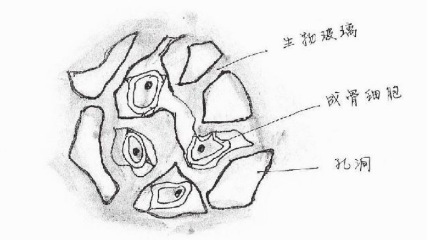

# 1001. 长生不死的植入物（IMPLANT）

20 世纪 70 年代有一个美国电视剧叫作《无敌金刚》，故事设定男主角航天员奥斯丁发生严重车祸，由于伤势过重，医生决定尝试还在实验阶段的手术，重建奥斯丁的肢体与感官能力。然而，手术不仅是重建，还彻底改造了他，让他变得「更好、更快、更强」。

## 10.1 变得更强的方法

电视剧对复杂的手术及植入体内的仿生装置没有多着墨，只强调奥斯丁改造后的超能力，例如跑得飞快、跳得奇高和能感觉到远方发生的危险等。我哥哥和我都很爱这部电视剧，而且深信不疑。因此那次我从攀爬架上摔下来跌断了腿，被送到医院，心里其实是怀着几分好奇与期待的。我和三个哥哥挤在我们家那辆紫色的标致 504 上，四人一起尖声高唱：「我们能改造他，让他更好、更快、更强……」

我一被送到急诊中心，医生就迅速且专业地做出了检查与诊断。医生说我的脚的确断了，但骨骼有自愈功能，会修复创伤。我大失所望，觉得医院故意搪塞推托。他们为什么不肯改造我？我问了母亲，她说即使像骨骼这么硬的组织也有自我修复的能力。

医生说骨骼中央是柔软的内里，外头包着一层硬壳，跟树有点像。在肉眼无法见到的微观层次上，骨骼内里是网状多孔组织，让骨内细胞可以自由活动，不停分解和重塑骨骼。因此骨骼和肌肉一样，会因为使用程度而增强或变弱，依人体各种活动（如跑步或跳跃，但最主要是承受人体重量）带来的压力而增长。医生告诉我，航天员有一个很大的危险，就是外太空的无重力状态会让他们的身体不再承受这种压力，造成骨骼失去强度。他们问我最近是不是上过太空，还觉得这个笑话很好笑。我狠狠瞪了他们一眼。

虽然骨骼会不断重塑，修复断腿仍然必须把断骨完美接合在一起。医生跟我说这代表我得接受治疗，让腿固定不动几个月。这套疗法源远流长，古埃及人和古希腊人都曾用过，一点也不高科技，就是用硬固的绷带把腿缠住而已。

古埃及人用亚麻和制作木乃伊的技术来固定断腿，古希腊人用布料、树皮、石蜡和蜂蜜来处理，但我用的却是熟石膏，这是来自 19 世纪土耳其人的发明。熟石膏是石膏脱水而成的陶土，跟水泥一样掺水后会硬化。但熟石膏非常易碎，无法单独使用，用个几天就会碎裂。不过只要加上绷带，绷带的棉质纤维会强化石膏，阻止裂隙蔓延，熟石膏就会强韧许多，可以包扎断腿长达数周。比起古埃及和古希腊的做法，上石膏最大的好处是我不必在床上躺三个月，等腿自我修复。石膏模够硬够坚固，能承受人的体重和使用拐杖走路时的撞击，同时让腿顺利康复。石膏绷带发明之前，断腿往往会让人一辈子不良于行。

我还记得石膏涂到缠着绷带的腿上的那个时刻，混合着热与瘙痒，感觉很怪。热是石膏掺水后的反应，痒则是因为柔软的绷带开始慢慢变硬。我突然感觉腿的中段瘙痒难耐，我很想抓，却只能拼命克制，简直难受极了。接下来几个月，瘙痒会不时发生，而且往往在三更半夜，我完全束手无策。我妈说这就是接受无敌金刚大改造的代价。我反驳说我根本没有被改造，虽然我很想，但医生只是让我的身体自行复原。我不会变得更好、更快、更强，还是和之前一样，跟快和强壮完全沾不上边。我妈叫我闭嘴，我想也是。

后来我又受过几次重伤，住过几次院，虽然没让全身骨头都各断一次，至少也努力过了。我断过肋骨和手指，还曾砸破脑袋。我撞碎过玻璃，胃黏膜破了大洞，还曾遭遇刺伤。但每一回我的身体都自己痊愈了，虽然得靠医疗体系监督与帮忙。从小到大，我只有两次需要医生「重建」和改造。一次是很久以前，但这问题一直不时困扰着我。

## 10.2 解决牙疼烦恼

起初只是嘴里有一颗牙微微不舒服，几天后这颗牙却变得更酸、更痛，喝热水时尤其难受。后来我有一天吃三明治，吃着吃着突然听见可怕的碎裂声，直让我头皮发麻。很不幸，我嘴巴里的毛病更严重了，而且一阵猛烈的刺痛有如闪电，从口腔顶部直蹿脑门。我用舌头小心翼翼地试探发痛的部位，发现原本光滑的牙齿变得凹凸起伏，把我吓坏了。我觉得我的牙齿好像碎了一半，后来发现果真如此。我没办法再吃喝任何东西，因为神经从断牙处露了出来，一碰到就痛得厉害，像针刺一样，所以对任何入口的东西都非常敏感。我的嘴巴仿佛变成了禁飞区，我脑中一片空白，只想赶快止痛。

古埃及人和古希腊人都解决不了这个问题。我们的老祖先必须与蛀牙共存。他们老是牙疼，痛得太厉害就只得把牙齿拔掉。如果不是找铁匠用钳子硬拔，就是运气好一点由老练的医生帮忙。医学发达后，开始有麻醉剂可以舒缓疼痛，例如鸦片酊等。

1840 年，有人发明了一种银、锡、汞的合金，称为「汞齐」，成为人类蛀牙史上的转折点。原始状态的汞齐因为含有水银，在室温时是液体。但只要掺入其他成分，汞齐里的汞、银和锡就会发生反应，形成新的结晶，非常坚硬耐磨。这种神奇材料可以在液态时注入牙齿蛀孔中，等它硬化。而且它硬化后会稍微膨胀，使填充材料「咬住」蛀孔，和牙齿完全密合。汞齐制成的填充材料远优于铅或锡制成的填充物。后两种金属虽然都有人用过，但质地太软无法耐久，而且要以液体形态灌入蛀孔，都得加热到熔点，但这又会烫到令人无法忍受。

这种廉价又无须拔牙的龋齿治疗法问世 150 年后，我接受了人生中第一次补牙。那块补牙现在还在，我用舌头还能感觉到它光滑的表面。它让我从身心俱创的小男孩再度变回了活泼调皮的捣蛋鬼。我后来又补了八次牙，前四次用汞齐，后四次用复合树脂。复合树脂由硅石粉末和强韧的透明塑料混合而成，坚硬耐磨，而且颜色比汞齐更接近牙齿的原色。和汞齐一样，复合树脂也是在液态时灌入蛀孔，但灌入后需要用紫外线照射，启动树脂内的化学反应，让树脂瞬间硬化。除了补牙之外，现代人还可以选择拔掉蛀牙换成瓷牙或氧化锆牙。这两种材质通常比复合树脂更耐磨，颜色也更像牙齿。要不是这些生物医用材料，我现在可能没剩几颗牙了。

## 10.3 用钛固定韧带

我体内还有另一种生物医用材料，一直扶持我到现在，是我 1999 年在美国新墨西哥州工作时植入的。那天我在室内足球场踢球，球在我脚下而我正打算迅速转身，突然听见膝盖「啪」的一声，随即剧烈扭痛。我只是扭动膝盖，没有被撞到，韧带竟然就断了，简直不可思议。但事情真的就这样发生了。我扭断了右膝的一条韧带，叫前十字韧带。

韧带是人体的橡皮筋。肌肉、韧带和联结肌肉与骨骼的肌腱，这三样东西负责联结关节，让人体可以自由动作。骨骼之间由韧带联结，韧带有黏弹性，亦即它能瞬间拉长和弹回，但只要拉长不动一段时间就会变长。这就是运动员常做伸展运动的原因，他们希望拉长韧带，让关节更有弹性。韧带虽然对关节如此重要，却没有血液补给，因此只要断裂就几乎无法复原。所以为了让我的膝盖恢复正常运作，就得更换韧带。

这类手术有几种做法，而我的主治医生选择用我的大腿后肌来重建我的前十字韧带。但为了让新的韧带固定在膝盖上，就必须使用螺丝把新的韧带牢牢拴住，让我未来能再踢足球或去滑雪。

人体对置入体内的物质非常敏感，绝大多数都会发生排斥，而钛是少数能被接受的材质。并且钛还会产生骨整合，跟骨骼紧密键结，对于连接大腿后肌和骨骼非常有用，形成的密合不会因为时间久了而弱化或松弛。十多年过去了，我膝盖里的钛螺丝依然牢固，而且由于钛很强韧，惰性又高（只有极少数金属不会跟人体起反应，连不锈钢都无法抵挡人体内的化学考验），因此应该还是完好如初。多亏了强韧的氧化钛表面涂层，这些螺丝可以用一辈子，而我当然希望它们能够如此。钛还能耐受高温，因此我将来死亡火化后，还能看得出模样的可能就剩这些螺丝了。我希望当它们重现天日时，我的家人能心怀感念，因为少了它们，我就不能做许多我爱做的事情了，像是跑步、陪孩子踢足球、爬山，等等。钛螺丝和外科医生让我的身体恢复矫健，为此我由衷感谢。

当然，我离死亡还久得很，我还想维持健康活力五十年，因此将来一定还有不少地方需要重建。目前的科技发展让我对此充满希望，因为尽管我们还离「无敌金刚零零九」的世界很远，但过去四十年来，人类已经在这一方面取得了长足的进步。

下面照片里的男人是我外公，他过世时是 98 岁。长寿的他直到辞世前都精神矍铄且良于行，只是得靠拐杖。不是所有人都有他这样的福气。但就算勇健如我外公，身体也有许多毛病，而且体形缩水了不少。人是永远注定会衰老，还是未来可能凭借人体重建的方式抵挡各种老化症状？生物医用材料实验室研发的最新科技能不能为我们带来希望，让我到了 98 岁高龄依然能走路、跑步甚至滑雪，健康活力就跟现在 43 岁的我一模一样？

就活动力而言，人体最先耗尽的不是肌肉也不是韧带（算我倒霉），而是关节内面。膝关节和髋关节尤其如此，因为这两个部位的运动特别复杂，需要承受极大的重量。但手肘、肩膀和手指的关节也会磨损。关节的磨损和撕裂会造成慢性骨关节炎，让人长期疼痛。另一种关节炎叫类风湿性关节炎，是人体免疫系统攻击关节所致，也会产生同样的症状。

但无论是关节自行毁损，还是出车祸或剧烈运动造成关节损伤，只要臀部、膝盖、手肘或任何部位的关节耗损殆尽，再多休息与静养也回天乏术。关节内面和骨骼不同，无法自行修复，因为它们根本不是由骨骼构成的。

## 10.4 关节置换不麻烦

髋关节置换手术已经问世一段时间了。最早出现在 1891 年，使用的是象牙材料，现在主要使用钛和瓷。人工髋关节非常成功，因为髋部的活动方式相对单纯，属于杵臼运动，让双腿可以旋转摆动（不过绝大多数动作都不自然，学过瑜伽的人就知道我在讲什么）。过去出现的迪斯科舞，就是专门展现髋部灵活性的舞蹈，跳得好再加上服装新潮，你就是一个很「hip」的家伙，意思不是很屁股，而是很炫。

我们还在子宫里时，臀部就成形了。大腿骨顶端会生成圆球状的股骨头，跟骨盆的髋臼完全嵌合，之后两根骨头会以同样的速度生长，以确保关节变大了依然密合。不过，这些骨骼的表面非常粗糙（所有骨骼都一样），因此人体会长出一层叫作软骨的外围组织，衬在两根骨头的接合处。软骨比骨骼软，但比肌肉硬，能在骨骼之间形成平滑的界面，并吸收冲击力。之后关节再由韧带、肌腱和肌肉加以固定，限制关节的动作，防止人体跑动、跳跃和跳扭扭舞（没错！）时，股骨头脱离髋臼。所谓的关节炎其实就是软骨受损，而软骨一旦受损就不可能复原。

因此，髋关节置换手术就是把大腿骨顶端的股骨头锯掉，换成钛做的股骨头，再把按照钛股骨头尺寸制作的髋臼钉入骨盆，最后垫上高密度聚乙烯当成软骨。这套人工关节能让腿部活动完全恢复，并且能使用数十年，只有当聚乙烯磨耗了才需要更换。最新款的人工髋关节密合度更高，甚至不需要聚乙烯来当缓冲，但是否更耐用还言之过早，因为金属（更新款则使用陶瓷）直接接触可能会产生其他的磨损问题。不过，髋关节置换目前已经成为很普通的手术，让数百万的老年人重拾了活动力。

膝关节置换手术的原理相同，只是关节活动机制比较复杂，膝关节不是杵臼关节，它同时需要扭转又能弯曲。下回在咖啡馆无所事事望着窗外发呆时，不妨留意一般人怎么走路：首先是膝盖超过身体，定在下一步要踩的位置上方，再让小腿和脚甩到定位。脚着地后，脚掌必须调整角度或扭动或倾斜以贴合地面，这些都需要膝盖以复杂的方式调整动作来配合。跑步对膝盖的压力更大，因为在执行上述动作的同时，还得不断承受冲击。只要试着走路不弯膝盖，就会明白膝关节对活动力有多重要。

## 10.5 人体组织可再造

虽然如果必要，我一定会选择动手术恢复活力，但想到十年或二十年后，我必须换掉自己的膝关节和髋关节，我还是怕怕的。不过，十年对医学和材料科学来说是很长的时间，现在也有科学家在努力研究，或许我终有一天可以让受损的软骨重新生长，而不用更换关节。

软骨是复杂的活体组织，它的内骨架和凝胶一样由纤维组成，主要成分是胶原蛋白。胶原蛋白是明胶的分子亲戚，也是人体内最普遍的蛋白质，能让肌肤和其他组织维持紧实弹性，因此除皱乳霜才会经常强调含有胶原蛋白。但和凝胶不同，胶原蛋白的骨架里有活细胞，负责制造和维持骨架。

这些细胞称为软骨胚细胞。目前科学家可以从病人的自体干细胞培育出软骨胚细胞，但把软骨胚细胞直接注入关节并不会让软骨复原，因为这些细胞无法在原生地之外存活，也就是无法脱离胶原蛋白的骨架，一离开就会死亡。这就像直接把伦敦人送上月球以延续人类生命一样。少了基础建设，送再多人去也是枉然。

因此，我们需要在关节内仿照胶原蛋白的结构，建造一个临时骨架，再把软骨胚细胞放入这些「支架」内，让它们成长以及分裂增生，给它们时间和空间重建栖地，进而让软骨重新生长。这套「支架法」的优点在于软骨胚细胞会自行吞食掉支架，也可以事先设定，让支架在软骨胚细胞重建栖地之后，自动溶解，只在膝盖和髋部留下软骨。

用支架重建软骨组织听起来有点像天方夜谭，其实已经是确证的做法，于 20 世纪 60 年代由亨奇（Larry Hench）教授率先尝试。当时一位陆军上校问他能不能找到方法，帮助越战退伍伤兵再生骨骼，免于截肢的命运。「我们救得了性命，却救不了四肢。我们需要发明身体不会排斥的材质。」亨奇和其他科学家多方寻找与骨骼更相配的材质，结果找到一种名为羟磷灰石的矿物。人体内就有这种矿物质，而且它能强力附着于骨骼上。亨奇等人实验了许多组态，发现羟磷灰石在玻璃状态时，性质尤其特殊。这个生物活性玻璃有许多小孔，也就是拥有许多微小通道，称为成骨细胞的骨细胞喜欢住在这些通道里，并于制造骨骼时分解周围的生物玻璃，就像把玻璃吞食了一样。

生物玻璃支架和在支架内生长的成骨细胞

这套组织工程非常成功，目前主要用于合成植骨及重建颅骨和颧骨，不过尚未用于支撑性质的骨骼，因为这类骨骼必须承受人体重量，重建时间极长，而支架无法长时间承受巨大的压力。目前的做法是在实验室重建这类大型骨骼，因为支架不仅能存在于人体，在实验室里也行。细胞必须在生物反应器里培养，而反应器除了模拟人体内的温度与湿度，还提供养分。这项技术的成功也开启了新的可能，未来可望制造出能完全替代人体组织的植入物。目前这个领域已经跨出了第一步，在实验室成功培植出了人体气管。

这项计划的起因是一位气管出了问题的病人。由于他的气管出现癌细胞，必须切除。如果不置换气管，病人就得终生倚靠呼吸器生活。科学家首先以医院常用的 X 光电脑断层扫描来扫描病人。计算机断层扫描通常用来寻找大脑和其他器官里的肿瘤，但这项计划用它来替病人的气管建立 3D 影像，之后把影像输送到 3D 打印机。

3D 打印机是一种全新的制造技术，可以使用数字信息制造出完整的物品。它的原理跟一般打印机类似，只不过打印头射出的不是墨点，而是材料微粒，一次射出一层，逐层把物品制造出来。这项技术目前不仅能打印杯子和瓶罐之类的简单物品，还能打印带有可动部位的复杂物品，例如轴承和马达。可以使用这项技术的材料现在有一百种，包括金属、玻璃和塑料。赛法利恩（Alexander Seifalian）教授的研究团队先做出可适应病人干细胞的支架材料，再把这个特殊材料放入 3D 打印机做出病人气管的精确复制品。

成人干细胞的功能为更新组织，而人体每一种细胞都有相应的干细胞负责生成细胞。生成造骨细胞的干细胞称为间质干细胞。赛法利恩教授的研究团队做出支架后，把病人骨髓内取出的间质干细胞植入支架，再放入生物反应器中。随后干细胞转变成数种不同的细胞，开始建造软骨和其他结构，形成一个自我维持的活体细胞环境，并溶解细胞周围的支架，最后会留下一个全新的气管。

这项技术的一大优点在于植入物完全由病人自己的细胞制成，一旦植入就自然成为身体的一部分，病人完全不需要服用副作用强烈的免疫抑制剂来防止身体排斥植入物。免疫抑制剂会压制免疫系统以保护植入物，使得病人可能受到寄生虫的攻击和各种感染。然而，人工气管若要正常作用，身体必须输血给它，而目前还不清楚人体是否能建立足够的供血管道。此外，人工气管内的细胞生态必须维持稳定，气管才不会变形，病人才能正常呼吸。而消毒是另一个问题。支架使用的聚合物非常脆弱，无法承受传统的高温消毒。虽然有这些难题，研究人员还是于 2011 年 7 月 7 日完成了人类历史上首次的病人自体干细胞培植气管移植。

这项技术的成功加速了新一代支架材料的研发。人工气管必须能吸气、呼气，并得到血液供应才能维持长久，但它还不是人体内的调节器官。科学家接下来的挑战是培养肝、肾甚至心脏。目前人体的这些主要器官一旦衰竭，就必须靠器官移植才能恢复健康。但器官移植得仰赖捐赠，而且必须匹配，移植后还得终生服药以防器官排斥。不过由于器官移植通常是病人重拾健康与独立的唯一希望，使得捐赠的器官往往供不应求。

赛法利恩教授研究团队研发的气管支架，在移植前先植入了干细胞

器官长期短缺造成了三个后果：首先，肝或肾坏死的病人需要长期照护，不仅费用庞大，还会让他们无法自主生活。其次，许多患者往往等不到合适的心脏就过世了。最后，器官黑市交易越来越猖獗，更多穷人（尤其是发展中国家的穷人）被迫出售器官。不少调查都证实确有此事。最新一份来自美国密歇根州立大学的报告，记载了 33 个孟加拉人出售肾脏却没拿到钱，还因为手术赔上了身体健康。通常这些穷人会搭机前往器官接受者所在的国家，在私人医院摘除器官，然后立刻进行移植。据称，一枚肾脏的平均价格是 1200 美元。

除非找到方法取代器官移植，否则这些问题永远无法解决。生物材料支架组织工程是眼下最具前景的替代方案，但显然还有许多难关要克服。这些主要器官结构复杂，往往具有多种细胞，互相协调执行器官功能。以肝和肾为例，人工肝肾不仅要有血液供应，还必须联结大动脉。人工心脏需求最急迫，因为人体只有一颗心脏，失去作用的话，人一定会死。目前已有数种人工心脏面世，但使用者最长只存活了一年。

3D 打印应该会在人工器官制造技术上扮演重要角色。目前 3D 打印已经广泛用于制造植牙，并于 2012 年为一位 83 岁的老妇人制作了一副人工下颚。虽然这副颚骨由钛制成，不过打印支架材料再植入细胞，让细胞长成病人自己的骨骼，很快就会变为可能。

人体主要器官的重建步骤似乎都到位了，等我到了 98 岁时，或许换了一颗新的心脏、几个人工器官和新关节，让我依然健康有活力，看来也不是不可能的事。但我能像奥斯丁一样，变得「更好、更快、更强」吗？

使用 3D 打印制造的人工下颚

## 10.6 无法克服老化

现在还很难说，但答案可能是否定的。因为老化不是由于细胞老了，而是因为制造细胞的系统退化了。老化就像以讹传讹，下一代细胞无法重建上一代遗传下来的结构，使得错误和瑕疵有机可乘。我的肌肤老化不是因为肌肤细胞 43 岁了，完全不是。成人干细胞会一直生成新的细胞取代旧的细胞。肌肤老化是因为肌肤结构会出现错误和瑕疵，传递给下一代细胞，使皮肤开始出现斑点、皱纹并变薄。这些劣化会代代延续下去。

心血管系统也是一样。英国有将近三分之一的人死于循环系统疾病，是最主要的死因。换句话说，我很可能死于心脏病或中风。心血管系统包含心脏、肺、动脉和静脉，它让身体得以运作，而心脏病和中风基本上就是心血管系统衰竭。虽然外科医生已经很懂得修补心血管系统，让出错的部位重新运作，甚至借助器官（或植入物）移植来更换部分系统，依然改变不了心血管系统非常操劳的事实。98 岁的心血管系统就算修好了，也还是 98 岁的，只会越来越常出状况，但置换整个血管系统在短期内还是不可能的任务。

总之，虽然培养与置换人体组织和器官越来越有成效，不同器官和数千个身体运作所需的系统间互动，还是会不断产生瑕疵，降低组织和器官的表现。换句话说，我们还是会变老。

合成植入物是大胆的创举，能解决人体组织或器官过早耗竭的问题，但它无法解决死亡的问题（如果我们认为死是问题的话），而只能改善生活。科学家目前已经开发出机械义肢来取代手术切除的四肢。这些电子机械装置能接收大脑向四肢发出的脉冲并转译成握紧或抬脚等信号，让义肢进行动作。同样的技术也用来帮助颈部以下瘫痪的人，让他们能操控机械义肢，获得一定程度的独立自主。这些技术虽然是为了残障或瘫痪人士设计的，不过也可以用来帮助因为老化而失去活动力的长者。

这类技术提供了一种不同于组织工程的未来：一个生物神经机械的世界。在这个世界里，我们的身体活动将越来越仰赖合成电子元件，我们跟世界的实体联结也是如此。这就是「无敌金刚零零九」所想象的技术，让奥斯丁变得「更好、更快、更强」。电视剧说这项技术需要六百万美元，换算成现在的美金是三千五百万元。虽然金额是虚构的，却点出了长生科技的致命伤──价格惊人。想维持健壮到 100 岁得花上一大笔钱。谁愿意付这么多钱？这会成为奢侈品吗？只有富人到了 98 岁还可以打网球，其他人只能坐轮椅吗？还是这项技术只会让我们的退休年龄延后，要一直工作到八九十岁？我比较喜欢第二种未来。但若费用真的是三千五百万美元左右，那我们大多数人就算工作再多年也负担不起。

我很可能会活到 98 岁。到时我到底是会身高缩水一半，跟我外公一样得靠拐杖才能慢慢前进，还是能跟孙子玩网球和足球，不仅得看尖端生物材料研究的进展，也得看药物的价钱消长。但我衷心希望我和哥哥多年前齐声高唱的那句歌词「我们能改造他，让他更好、更快、更强」会成真。我想长生不死我应该还应付得来。