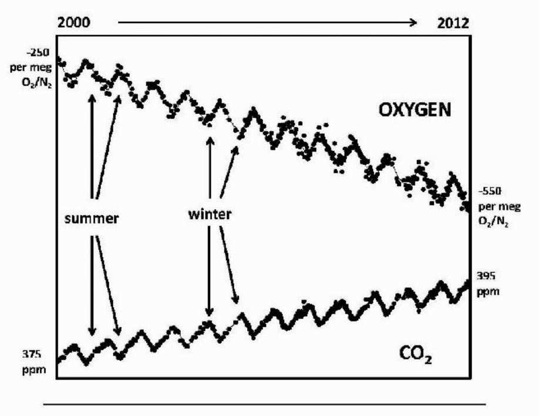

# 0101. 生命之火——氧

一支蜡烛可以燃烧四个小时、五个小时、六个小时……那么它变成了什么？说来这样的变化也是相当奇妙，产物居然是——所有生活在这个星球表面的植物生长所赖以生存的物质。

——迈克尔·法拉第

我下一次呼吸的那口气或许就待在你的肺里。好好给我存着，我还指着它活下去呢。

——贾罗德·金茨（Jarod Kintz，美国作家）

方便的话，请你先吸一口气……不过反正你也得这么做，因为在过去的 24 小时里，你已经呼吸了大概 3 万次了。在你刚出生时，呼吸这项活动就已经自动开始了，每分钟大概 40 次。现如今，你已经能够用语言来描述这个过程，不过还是会不假思索地呼吸，只是频率降到了初生时的一半。这是一项本能——即使在睡眠中你也在呼吸，如果呼吸停止的时间太久，人就会死亡。

好吧，现在是时候好好思量一下呼吸这件事儿了，请留心一下你是如何收紧膈膜并放松胸腔肌肉的。仅仅这么一个动作消耗的能量大约相当于一个人静息时基础代谢能量的 3％，只是为了把体积相当于一个葡萄柚大小的空气吸到肺里，在此过程中，数以万亿计的空气分子就像群鱼入网一样被捕获了。不过，如此巨量的空气分子中，人类所依赖的氧气只占其中的一小部分。平均下来，一位成年人每天需要消耗大约两磅氧气（0.9千克，大约600L），而单独的一次呼吸完全可以确保延续你接下来几分钟的生命。而且，呼吸也是联结你与地球本身以及这个星球上其他生物的神奇纽带，我们将在后面慢慢聊。

有些人因为需要长时间屏住呼吸，经常会通过呼吸较为纯净的氧气提高自身的氧气储备量。2010 年，在瑞士的圣加仑，一位 28 岁的自由潜水员彼特·克拉特（Peter Colat）在一个水箱中待了长达 19 分 21 秒，成为新晋的憋气世界冠军。而就在下水前不久，克拉特吸了几分钟的纯氧，不过这种使血液高度富集氧气的方法只能获得部分竞争优势，因为一旦血红蛋白所携带的氧已经饱和，便很难再将气态的氧气传输到血液中去了。对于克拉特而言，这么做更大的优势是冲洗出肺中的浊气，在他的嘴和鼻子都不能呼吸时，腾空的胸腔便成了一个临时的氧气瓶。

不过，肺并不只是氧气进入血液的唯一通道，你还有很小一部分「呼吸」是通过眼睛完成的。这些氧气粒子极为重要，位于眼球透明的表面的细胞能够直接从大气中吸收它们，用于补偿眼球血管载氧量的不足，你皮肤表面的很多细胞也在做着同样的事情。而波士顿儿童医院的研究者们最近还发现了一种更为直接的血液供氧方式。

有一个小女孩没能及时接上心肺呼吸机，于是遭受了致命的脑损伤，心脏病专家约翰·科尔目睹这一切后，便开始寻求一种绕过肺部而将氧气直接注射到血液中的治疗方法。为了避免在这个过程中产生气泡而形成致命的栓塞，科尔和他的团队利用声波将纯氧和油脂搅成细腻的白色浮沫。这一方法将气体包裹在柔软而富有弹性的微胶囊中，从而可以在与红血球细胞接触时使其载氧；将这种浮沫注射到实验兔体中时，它们可以停止呼吸 15 分钟或更久，并不会感到明显不适。「这是一种短期氧气替代法，」科尔在 2012 年对《每日科学》（Science Daily）的采访者如此说道，「一种能够在关键的几分钟内安全地将氧气注射到病人体内以维持生理机能的方法。」如果这一方法能够完美地应用于人体，它将可能被装备到急救室，当然也可用于憋气大赛。

不过对于我们大多数人而言，呼吸是我们与空气中的氧气之间最基本的联系，而且这个动作如此普遍并连延不断，以致我们浑然不觉——直到我们不能呼吸时才想起此事。到那时，呼吸也明显变得更为珍贵，并成为生命本身的象征。我们会将具有特殊含义的话顺着最后的呼吸一起说出，甚至还会珍藏呼吸本身。

亨利·福特（Henry Ford）在他家里将一支充满气体的玻璃试管保存了很多年，据说其中装的是他过世的朋友兼共同发明人托马斯·爱迪生（Thomas Edison）最后一次呼出的气体。根据密歇根州迪尔伯恩市亨利·福特博物馆的资料，在爱迪生临终的床边摆放了好几个这样的敞口试管——试管中的空气与房间里的空气是相通的。爱迪生的儿子查理记录此事时提到：「尽管他被人铭记的最主要成就是在电学领域，但他真正喜欢的却是化学。有这些试管在他临终时陪伴左右并不奇怪，而且具有象征意义。」爱迪生逝世以后，查理将这些试管密封，并将其中一支作为纪念品赠给了福特。

但为什么你要呼吸呢？为什么你这么极度地需要这些看不见的氧气颗粒呢？它们从何处产生，在你体内又做了些什么，离开之后又去了哪里？在你的世界里，空间看似什么也没有，你根本看不到氧气，尽管它们已经在你周围醒目地留下很多存在的证据，从沙沙作响的叶子与猛烈摇晃的船帆到生锈金属与点点烛光。仅仅一两个世纪以前，很多著名的科学家甚至还怀疑过它们的存在。

## 1.1 关键的发现

氧原子几乎潜伏在你日常生活的每一个地方。它们不仅是你呼吸的物质，很大程度上也是构成你身体的物质。科学家们常常会将人类描述为「碳基生命」，但严格按数字来看却不是这样的。

你的体重有大约 60％ 是由水构成，具体数字取决于你的身材、年龄和健康状况；而水分子中 8/9 的重量属于其中那硕大的氧原子。所以说，氧构成了你湿重的大部分，一个 150 磅（68千克）的成年人含有大概 95 磅（43千克）的氧。作为对比，同样的成年人所含的碳大约仅为 35 磅（15.9千克），如果采用原子比例，那么碳原子的总数相对于氧原子的比例约为 1：2。

身体里脱除水分剩下的那部分「干」物质中，氧原子也和其他的一些元素交织在一起，在肌腱的蛋白纤维、肥皂泡状的细胞膜以及螺旋的 DNA 中都存在。在人体动脉的血糖以及乳汁的乳糖中，氧原子贡献了略高于一半的重量；同时它们还与多数矿物元素共同构成了人体骨骼。如果你体内的氧原子全部消失，你仍然还是可见的，尽管存在不了太久——剩下的元素构成的团雾会随着一股清风飘散得无影无踪。

但这不是你呼吸的原因。你通过喝水吸收了多数水基的氧原子，又通过进食补充了大量碳基的氧原子。呼吸则是件完全不同的事情。这个过程的目标不仅仅是获取氧原子，而是获取由两个氧原子结合在一起具有反应活性的氧气分子。而且不同于喝水或进食，你需要一直持续吸入氧气，因为除了肺部的肺泡，你无法在体内安全地储存氧气。

尽管你可以提纯氧气并将其压缩到体内某个空间存储，但你一定不想这么做。让它们随意留在体内，细胞会受到损伤，而且氧气在浓度过高时是有毒的。你需要在可控的范围内吸入它们，然后立即高效地使用它们，再从身边原子的海洋中吸入新的氧气。

科学家们是如何发现我们与空气间的这种原子级关系的呢？这是一个跨越数世纪的故事，遭遇了无数死胡同，积累了无数新发现才取得的结果。这里篇幅有限故不能深入讲述这漫长的故事，但可以简要说说 18 世纪的一些关键发现，至少可以回顾一下获取这些知识有多艰难。当然，有很多研究者都在那个智慧与文化大爆发的时代对此做出了贡献，但特别要说的是其中三名科学家的工作，展示他们通过相对简单却很巧妙的实验所取得的成果。

进入 18 世纪之前，我们需要先了解两个概念——它们都是 17 世纪的遗产，一个引人误入歧途，另一个则颇有先见之明。前者是德国炼金术师约翰·贝歇尔（Johann Becher）提出的一个假说，即燃烧仅仅是因为释放了一种被称为「燃素」的神秘物质。后者是英国科学家罗伯特·波义耳（Robert Boyle）的研究，他提出空气并非一种纯净元素而是各种气体的混合物。他在《对空气中隐藏事实的求证》（Suspicions about the Hidden Realities of Air）一书中写道：「我时常怀疑在空气中或许还有更多潜在的特性或能量……因为它不是像很多人想象的那样只是简单又纯净的物质，而是混合物……（并且）可能这世上几乎没多少比它更复杂的非均质体了。」

在 18 世纪 70 年代早期，瑞典化学家卡尔·舍勒（Carl Scheele）对氧化汞粉末进行加热并认为由此得到的「火气」在大气中也是存在的，但他没有立即发表这一结论。数年之后，英国化学家约瑟夫·普利斯特里（Joseph Priestley）做了同样的实验并给逸出的气体起名为「脱燃素气」。他在舍勒之前发表了这一发现，并证明在密封的玻璃罐中，这种气体既可以让火焰持续燃烧，也可以让小鼠呼吸。法国化学家安托万·拉瓦锡（Antoine Lavoisier）了解到舍勒与普利斯特里的实验之后，重复了类似的实验，随后称这一发现至少有一部分是他发现的。

不过这几位都不是真正首次在实验中制出氧气的人——炼金术士们早已在一个世纪前制出了氧气，虽然他们并没有完全理解这是一种什么气体。但是，舍勒认识到这种至关重要的气体是空气中的特定成分；普利斯特里论证了它与呼吸和燃烧间的关系；而拉瓦锡给了它一个我们现在正在使用的学名。因为将这种气体与溶液中的氮和硫结合可以产生硝酸和硫酸，因此拉瓦锡将这种气体称之为「oxygène」（源于希腊语，意为「制酸剂」）。拉瓦锡还和其他化学家一起推翻了燃素说。通过对封闭容器中的锡进行加热，他证明金属在此过程中增重而非减重，并且氧化之后的金属所增加的质量与容器打开时进入其中的空气质量相等。

这几位科学家在各自的生涯里，都热衷于声明自己的权利，而他们的传记中也充满了戏剧性的细节。他们极力争夺，都声称是自己发现了氧气，并且都在后来的岁月里遭遇了巨大不幸。舍勒于 1786 年逝世，享年仅 43 岁，可能是因为在实验室摄入了太多的汞、砷和铅。普利斯特里由于持信仰自由的观点并支持美国及法国革命被英国驱逐出境，流亡至宾夕法尼亚时，他又承受了丧妻和幼子夭折之痛，并且在被欧洲科学界孤立的同时又因煽动暴乱而被指控。而拉瓦锡，作为国王最憎恶的税务官之一，在法国大革命期间被送上了断头台。对于此次行刑，数学家约瑟夫-路易斯·拉格朗日（Joseph-Louis Lagrange）写下了那句名言：「他们可以转眼之间就砍下他的头颅，但百年里全法国再也长不出这样的一颗头了！」

这些科学家们的发现引领了后来在原子层面的研究，但如果没有高科技设备或科学的训练，原子不可见的特点会致使氧气与火之间的关系很难被认知。就像普利斯特里和贝歇尔那样，燃烧物总重的增加是很容易被忽略的，因为浮力与逸散的废气掩盖了这一点。燃烧 1 加仑（6磅，2.7千克）汽油，可以向大气中扩散 19 磅（8.6千克）吸热性气体二氧化碳；而据美国能源信息管理局估算，仅美国的机动车在 2012 年就排放了 15 亿吨 CO2。这种认知上的局限可能会让我们很难注意到身边环境的变化，而且在探索空气的原子性质时会把我们引入歧途。

两个半世纪以前，在观察了「火气」罐中可轻松呼吸的小鼠之后，普利斯特里自己也试了试这种气体。「我的肺感觉不出与一般空气的区别；不过随后我似乎感觉我的胸腔变得轻松舒适了。谁能说这种纯净空气哪天不会成为一种奢侈的时尚产品？」谁能真的预想到，21 世纪，为了通过插在鼻子里的那根塑料管吸取氧气，时髦的现代人每分钟要花上一美元？

最初只是在东京、北京等饱受重度污染困扰的城市出现的「氧吧」，从 20 世纪 90 年代开始，在全世界的其他城市流行起来，并且现在还催生了便携式家用制氧机的新市场。支持者们认为这些氧气有消除体内毒素、强化免疫系统、治疗宿醉以及其他一些神奇的医学功效。不过这其中大部分都没有实验数据支持。在接受 WebMD（美国最大的医疗服务网站）采访时，巴尔的摩梅西医学中心的乔治·波伊尔解释道：「如果你的肺是健康的，而且也没有呼吸困难，那就说明体内的氧气完全够用。」同时他还说，「对于大部分人而言，（使用制氧机）没什么危害，但也绝对没有科学意义上的好处。」

无论你是在氧吧里买氧气还是吸免费的空气，问题还是那一个：究竟为什么你要呼吸？早期的研究者认为呼吸仅仅是为了降低「体温」，肺无非就是空调而已。而事实的真相埋藏在你身体细胞的深处，在那里，燃烧与呼吸间的区别也将被清楚地揭示。

## 1.2 氧的人体之旅

教科书上常常都会列出一个基本公式：「食物与氧气反应生成二氧化碳和水。」试图以此简化从你肺里进进出出的这两种气体之间的联系。「生命之火」这种隐喻很形象，仿佛从原子层面上，将生命的运作方式与真正的火相提并论非常恰当。很多科学家都抱有这样的看法，有时是为了向非专业人士简化概念，有时类似的解释反而会致使他们在事业早期误入歧途。比如，近期《科学》上发表了一篇有关分子生理学的文章，介绍了血糖是如何在氧气的作用下「燃烧」的；大学教授们也经常在课堂上讲到，我们吸入氧气，将其和糖类燃料一起送到细胞这座「熔炉」中焚烧，呼出二氧化碳这种废气。

这种形象的比喻引人入胜，然而却是错误的。近距离观察研究对象就可以了解，为什么火不能完美地解释你使用氧气的过程。

火在很多方面跟生物很相像，两者都会产生二氧化碳以及——说来也有些奇怪——水蒸气。虽然液态水可以浇灭火焰或淹死人，但燃烧时烟雾中的气态水或人体呼吸中存在的气态水却对其来源没有这样的影响。火焰和生命还有一点相像的是，一旦没有了氧气，两者都会因此而终结。蜡烛产生的光和热来自于石蜡分子中化学键的断裂，而你皮肤的温度则与食物中各种分子间化学键的断裂紧密相关。不过，尽管燃烧与呼吸的基本公式如此接近，但是二者的作用过程却有着明显差异。

在蜡烛的火焰中，周边环境里的氧气直接攻击熔融状态的蜡，把电子从一堆灼热的富碳粒子和电离气体组成的燃料分子中撕扯出来。当气态火焰温度、密度、电离达到一定程度的时候，就被称作「等离子态」，例如温度高达 6000 华氏度（3300摄氏度）氧炔焊的焊接端，该术语也常常用来表示太阳这个炽热球体。等离子态是物质的第四种形态，对固液气这三种我们已经熟知的状态而言，也是一种动态补充，而且很可能是宇宙中物质最主要的可见形式，因为恒星就是由等离子体构成的。

在地球上，火焰并没有那么凶猛，只是将碳基燃料分解成与它们的原始状态类似的简单颗粒而已。举个例子，用于制造石蜡的石油，是由捕光性藻类利用二氧化碳与水合成的；当蜡烛燃烧时，其中的碳原子与氢原子分别和氧原子结合成二氧化碳与水，扩散到大气中。这些原料转化为生物组织时需要吸收太阳能，燃烧时又释放了出来，而且过程飞快，以致蜡烛火焰最热部分的温度可达 2500 华氏度（1400摄氏度）。

然而，当氧气处在细胞这个可控的范围内时，它便不再是一头怒气冲天的狮子，而更像一只训练有素、嗷嗷待哺的家猫。举例来说，当蜡烛火焰中的高温石蜡开始分解时，氧气猛扑到火焰上，转眼间碳原子和氢原子已经落入了它的魔爪。而当富含碳元素的食物在体内发生氧化时，虽然产生的是相同的废物（CO2和H2O），却是经过两个步骤。

当你吸入空气时，氧气不会像从蜡烛里那样捕获碳原子，因为在细胞内部这个相对温和的环境下，氧气转而去专一地捕获氢原子。想想你有多幸运，细胞呼吸产生能量的速度很慢，释放的速度足以保持你的体温而又不会把你灼伤。

要想象这个过程如何开展，可以借用阿尔伯特·爱因斯坦的「思维实验」技术，当你再一次呼吸时，让想象力随着氧气分子滑落到你的喉咙，并进入你的肺。你刚刚吸入的空气中大约有 3/4 的氮气，除了让你的肺保持膨胀以外，它们对你没有任何作用。你的目标是空气中那由氧气分子构成的 21％，但你只能通过在混合物中仔细搜寻来获取，就像从一堆糖豆里用勺子挑出那些颜色你喜欢的那样。

随着你的胸腔扩大且空气被压缩进去，这些气体通过头发丝一般细的支气管挤压到数以亿计的肺泡中，这些泡沫一样的肺泡形成了肺内部粉红色的海绵状结构。它们的表面具有吸附性，全部表面积加起来接近 750 平方英尺（70平方米），几乎相当于单打网球场面积的 1/3。在那里，大多数空气分子被挤进肺泡之间的狭窄空间，那里的毛细血管将它们聚集起来。微观尺度上来看，你的血液就像满是挤满半透明深红色斑点的液体，当肺部搏动时，它们只花不到一秒钟便挤进肺泡中。这些红血球细胞像一辆辆快速移动的车辆，它们可以载着氧气穿过数百英里的血管抵达你身体的任何地方。

与此同时，刚刚在细胞中产生的二氧化碳从血液中逸出并进入到肺泡中。在整个过程中，大部分新吸入的氧气只是简单地又从肺里面被吹了出来。尽管看起来有些浪费，但这种低效却也有好处。残余的氧气可以在口对口人工呼吸中对无意识的人发挥作用，而不会让他们因为二氧化碳窒息而死。

1 品脱（0.47升）的血液大约可以携带 0.2 品脱（0.094升）的氧气，几乎足以维持人体一分钟的静息状态。不过在这个从肺到细胞然后又返回的旅程里，氧气的含量逐渐下降。当静脉血将气体重新送回肺泡时，跟肺部中的空气相比，其氧气含量几乎可以忽略，而这种不平衡可以驱动更多氧气扩散到血液中。

如果说氧气分子是有目标的话，那么当它们进入你的身体时，最首要的目标就是在你的体内分解。但是如果你想陪着氧气分子一起到你的细胞中走完它的人体之旅，你只能把自己变成一种形而上学的东西。你也不得不这么做，因为很显然，你不可能变成不可压缩的原子后还是你自己，就像一栋由砖盖成的大楼缩减为一块砖后不可能仍然是这栋楼。把原子范围的尺度放大到适应你的尺度同样不适用，因为在这样的奇幻世界里，你周围每样事物的运动速度都会快得离奇。原子只有人体的百亿分之一那么大，所以，氧原子从心脏到双手的旅程就相当于人类尺度下的数百万英里那么远。手臂肱动脉的血液在一秒钟内就可以走完这个旅程，如果放到宏观尺度，原子的运动速度需要超过光速才可能完成同样的事情，而爱因斯坦关于相对论的研究早已说明这不可能发生。

即使忽略这些因缩小和放大带来的逻辑问题，原子领域也比我们熟悉的常规世界要奇怪得多。原子变化很快，并且电子云的外边界不稳定，以至于被观察对象的原子表面并不清晰。这个难以想象的微型世界，不像我们熟悉的宏观尺度——既没有空气可供呼吸，也没有声音可以欣赏，可见光也无法照亮我们要观察的对象。

尽管如此，通过这个思维实验，你还是可以去想象你的所见所感：将一个皮肤细胞放大一百亿倍，将会成为一座三百英尺（90米）高并充满生机的小山，这样你就能更容易地看到氧气在里面是如何发生变化的。在这样的规模下，组成细胞的原子就如同沙粒一般大小，而此时你的身体躺下来的时候则占据巨大的空间，头在纽约，腰身横跨太平洋，而脚却位于澳大利亚。

你现在需要强行钻过一层柔韧的油膜才能进入到这座「细胞山」中。山体内很潮湿——我们暂且接受这个设定，假设你在充满多糖物质的细胞里还能呼吸。山体内的场景看起来极富工业特征，结构蛋白质构成的线缆有手臂那么粗，延伸到四面八方，支撑着细胞外形。

旁边不远处就是你要参观的目的地——一个圆柱形气泡状的物体，差不多有拖拉机车斗那么大。这是线粒体，一座活的能量车间，食物就是它的燃料。你的每一个细胞中可能含有的线粒体数量从几十个到上千个，并且它们形态各异，可能像豆荚也可能像面条。正是在这些线粒体中，你所呼吸的氧气来到了它们命运的终点。

细胞中的酶以及线粒体的核将食物的分子粉碎，形成一堆由大量电子、氢离子以及二氧化碳构成的大杂烩。线粒体核周围是一层软膜，其中嵌有一系列蛋白质，电子便由它们吸收，有一些还会在电子通过时发生抽动、弯曲或者翻滚。正是由于这些分子机器的运转，化学能得以储存，并为肌肉和代谢提供动力。有的时候，这个过程也会帮助身体产生热量。

最后，每一个完成能量转移的电子都完成了最后一跃，从而为后续赶来的电子腾出空间。而这里，就是你对含氧空气有所需求的精确地点。

利用这些跳跃的电子，氧气从粉碎后的食物分子中拴住了氢离子。在这个食物与空气参与的转变过程中，进食与呼吸这两个过程得到的不同成分完成重组，并产生 H2O 分子，也就是人体中代谢生成的水分。在过去几天中，在吸入的氧气的协助下，你的静脉中有 1/10 的液体是通过这种方式生成的。因此，空气和水之间的关联比炼金术师们想象的还要紧密，因为它们可以互相展现对方原子的重组。

这，便是你呼吸的原因。你利用空气启动了细胞这台微型机器，又花上一点时间收拾了那些潮湿的废弃物，并通过呼气、流汗等各种方式将它们排到周围环境中。通过这种方式，你将火焰中的碳、氢氧化反应分割成了两个独立过程，从而也显示出「生命之火」这种比喻并不那么恰如其分，更贴切的说法应该是，你每一次吸气，空气都成为了你身体的一部分。

## 1.3 地球的「呼吸」

你每天置身其中并吸入肺部的空气，在不同的时刻和不同的季节都会有变化，其变化幅度超出你的想象。这只是拉尔夫·基林（Ralph Keeling）的众多发现之一，这位斯克里普斯海洋研究所（Scripps Institution of Oceanography）的科学家测试大气的方式和警察用酒精测试仪对司机进行呼吸检测的方式如出一辙。

基林从事氧气含量测量的工作已逾二十年，这些空气样品从夏威夷、南极洲以及其他很多地区收集，并被密封在小瓶中送到他位于加利福尼亚州拉荷亚（La Jolla）的实验室。如同从呼吸中能检测出微量酒精一样，大气中组分的微小变化就可以证明很多问题，比如人类、植被及浮游生物对地球的影响。

森林，我们经常会说它们是「地球之肺」，因为它们制造了我们所需的氧气，但这个比喻在某些方面并不恰当。肺并不会制造氧气，与此相反，它是消耗氧气的器官；并且基林的研究证明，你所呼吸的氧气中只有一半来源于陆生植物，剩下那部分是由海洋中的藻类以及蓝藻（又叫蓝绿藻，蓝细菌）贡献的，此外还有很少的一部分来源于上层大气中水蒸气的分解，太阳以及遥远恒星辐射的放射线为此过程提供了能量。

不过，结合了基林已故父亲——查理·大卫·基林于 1958 年在夏威夷莫纳罗亚天文台（Mauna Loa Observatory）发布的二氧化碳分析结果来看，长期的氧气记录数据却与医学呼吸检测仪的读数显示出近乎于诡异的相似性。氧气浓度的年度上升波动恰恰伴随着 CO2 的循环式下降，这些数据共同打开了一扇神奇的窗户，揭示了地球同植物间的原子级关联。

基林最初研究大气时，曾以为不同地区间的差异会比较明显。让他感到惊奇的是，在排除森林与城市影响的偏远地区，采用同种方法收集到的空气样品几乎没有差异。直至今日，大气混匀的程度和速度还是超出科学家的想象，夏威夷与加州拉荷亚市斯克里普斯码头的 CO2 平均浓度非常相似。

除此之外，同样值得关注的是，大气记录中还出现了很多类型的节奏性波动。每个白天，二氧化碳的浓度都会缓慢下降，到了晚上又会恢复，而更大规模的季节性波动则是由夏季的波谷与冬季的波峰构成。当拉尔夫·基林继承遗志开始测量氧气浓度时，他得到了类似的曲线，但趋势正好相反。通过这些数据，可以看到，伴随着地球的自转和公转，地球的大气对无数植物和微生物的呼吸做着回应。

促成这一脉动的「起搏器」是太阳。黎明时分，加利福尼亚苏醒过来，拉荷亚的草坪和棕榈树便开始向空气中释放氧气，并从空气中吸取二氧化碳；此时此刻，太平洋海面上漂浮的浮游生物也在做着同样的事情。地球的自转还在继续，直到夜幕降临之时，氧气的生产过程被迫终止，但细胞里那些生产 CO2 的小工厂却还在持续运转，因为它们不需要太阳能。从而促使当地的二氧化碳水平重新恢复，而氧气水平相应下降。

类似的过程也体现在因季节更迭引起的大气变化中。春天，万物复苏，芽生叶长，O2 浓度迅速提升，而 CO2 有所减少。到了这一年的晚些时日，光合作用变缓，同时枯叶腐烂释放出二氧化碳，于是跟春季相反的变化趋势便发生了。基林的图表揭示了一种锯齿效应，相比于观看，如果你是在倾听这种波动，它听起来好比是长跑运动员的喘息。可见氧气的曲线大概就是：「在春天里努力地呼出，在冬天里深深地吸入。」然后周而复始。

莫纳罗亚火山周边的空气中氧气和二氧化碳浓度在 2000 年到 2012 年之间的季节性周期变化与趋势。氧气浓度整体呈下降趋势，主要是因为化石燃料的燃烧和开荒造成的山火与腐烂。感谢斯克里普斯氧气研究项目提供的数据。

这里要再一次提起，「地球之肺」的比喻是不太恰当的——不光是说这些「肺」会呼出氧气，而且它们的这一进程还不同步。当一个半球呼气时，另一个半球正在吸气，如果哪位运动员胸腔中那两片肺叶也是如此工作，恐怕会招致不少关注。

基林的记录还清楚地显示出我们人类对大气的影响，不过多数是破坏性的。2013 年的早些时日，温室气体二氧化碳的平均浓度达到了 400ppm（ppm表示百万分率），相比 20 世纪 50 年代时约 312ppm 的平均值有所增长。引起这一变化的主要原因是化石能源的燃烧，以及砍伐森林引起的腐烂与烧山。不同于光合作用，就跟人类的肺一样，这些现代社会里的人工「肺」消耗的是 O2，释放的是 CO2，而且这样的行为一直保持着相当大的规模。

当二氧化碳的长期观察记录稳步增长之时，全球平均气温也在同步上升，而氧气的含量却在下降。根据斯克里普斯的 O2 项目网页显示，拉荷亚的氧气浓度自 1992 年至 2009 年，已经下降了 0.03 个百分点。拉尔夫·基林在接受《圣地亚哥联合论坛报》（San Diego Union-Tribune）的采访时曾说，这是全球性的「燃烧信号」。

在全球变暖的危机以外，我们现在是否需要担忧氧气被耗尽呢？基林的观点是没有必要。在另一次接受《联合论坛报》采访时，他解释道，空气中的氧气含量是很充足的，微小幅度的损耗并非什么危机。然而，「氧气的变化趋势帮助我们理解，是什么控制了 CO2 的增长」。斯克里普斯 O2 项目的报告中提到，自工业革命起，大约有一万亿吨的氧气因燃烧化石能源被消耗，但相对于大气中海量的氧气储备而言，也只是总量的 0.1％ 而已。这个比例对人类的健康影响微乎其微，而在没有不良因素影响的大城市，季节性的氧气水平变化常常可以达到 10％ 或更高的比例。

地球上氧气的储备如此丰沛，以至于全世界所有的植物及浮游生物的年度产出几乎不能对其构成影响。空气中飘浮着 1000 万亿吨的氧气，大约相当于它们两千年的产出总和。在更为寒冷黑暗的季节以及夜晚时，光合作用不再进行，生命仍然可以找到那些很久以前就产生的氧气而得以生存。

要想从个人的水平理解这一巨大的概念，你或许可以四处走走，接触那些正在维持你生存的氧气制造者。森林研究员大卫·诺瓦克（David Nowak）和他团队出版的《树木栽培与城市林业》（Arboriculture & Urban Forestry）一书讲道，平均 1 英亩（4047平方米）树林一年生产的氧气足够 8 个人维持生息，当然精确的换算关系还取决于树种、树龄以及树木生长的环境等。全美国的城市树木每年可以生产出 6700 万吨氧气，足够维持 2/3 的美国人生存了。相关报告的城市名单显示，全美氧气生产量的桂冠由郁郁葱葱的佐治亚州城市亚特兰大摘得，这里的树木每年所产生的 9.5 万吨氧气几乎可供此处所有居民呼吸。纽约市与华盛顿特区分别摘得榜眼与探花，每年分别生产 6.1 万吨和 3.4 万吨氧气。新泽西州的费里霍尔德（Freehold）排名垫底，每年的产量只有区区 1100 吨。

在城市中种树有很多美好的理由，冬暖夏凉也好、美化环境也好，却没有以生产氧气为目的。即使在寸草不生的沙漠里，你也都能轻松地找到充足而又完美的氧气用于呼吸，对于新泽西的费里霍尔德也一样。而且不管你身在何处，即使在冬季，本地的树木已经落叶或休眠之时，你仍然可以获得足够的氧气。大多数你吸入的氧气分子来自于远方，并且拥有很长的历史，你下一次呼吸的氧气中，也只有很少一部分是在过去一年内生成的。

尽管你或许会很容易展开联想，植物是为了我们的利益才生产了氧气，但事实上，你吸入的氧气，不过是这些光能收集者为自己准备盛宴时不小心撒出来的面包屑而已。植物也和你一样拥有线粒体，它们生产的氧气大多被自己消耗了。无论森林还是海洋所生产的氧气，其实都只是泄漏物，而且大部分在逸出后很快就被锈蚀、腐烂和燃烧等过程消耗了。如果死去的植物、动物和微生物不是在腐烂或焚烧前就大量被土壤和海洋沉积物掩埋，那么大气中的氧气含量最终会降到接近于零的水平，所有人都会窒息。你的另一个氧气来源或许可以通过从海水中拉起一张细眼渔网而找到，如果捕获物接近于棕黄色，那么你可能收集到了硅藻。在显微镜下，它们看上去就像是一块块包裹着玻璃外壳的金色果冻，看上去有的像雪花，有的像针头，有的则像是精心设计的轮毂罩。其他一些可以发生光合作用的浮游生物，通常具有奶油状白垩外壳或是像一串绿色的孔雀石珠子。海带则类似植物的近亲，其外形可以像是绿色的膜，或是一张棕色的软质橡胶垫，又或是起皱的莴苣。拉尔夫·基林测算，每年北半球海洋生物通过光合作用产生的氧气接近 300 亿吨，南半球还要多出一半。

如果你穿过大气来到高空，或许氧气短缺会成为问题。重力作用使得气体分子在低海拔的位置聚集，在海平面上，每平方英寸的气压大约是 15 磅（1标准大气压＝14.696磅/英寸2＝101.325千帕）。这个压力不会让你感到不适，因为在你的体内到处都分布着空气，内部压力与外部压力刚好匹配。这种感受更像是在游泳池中漂浮，而不是在头和肩膀上顶了一只重达 3/4 吨的水球。如果不是坐飞机或是在高山上行进时耳朵有些不适，我们大多数人甚至都不会注意到这股始终存在的压力。

根据 altitude.org 提供的在线气压计，在一座海拔 1 英里（1.6千米）的山峰上，你仍然可以获取相当于海拔零点处 83％ 的氧气；然而当你爬到 1.5 英里（2.4千米）左右时，空气变得更稀薄，氧气浓度也降到了 75％ 以下，高原反应便可能成为实际麻烦了。人们有时会在高空飞行的航班中感到头痛，很多时候就是因为舱内低压导致的轻微缺氧，这种情况与身处海拔 1.5 英里高的山上类似。

有些人群的祖先在高海拔地区生活了数百年，由此可能形成基因突变，从而使他们更能适应缺氧状态。多数西藏人都比其他人群的呼吸速度更快，并且每一次呼吸可以吸入更多的空气，这便是因为基因遗传让他们能更好地适应氧气短缺的情况。安第斯人的血液中存在大量的变异红血球，具备从空气中提取更多的氧气的能力。

肉眼观察空气压力。左图：一只塑料瓶在秘鲁安第斯山脉海拔 15500 英尺（4724米）的高度上封紧瓶盖，这里每一次呼吸中的空气分子都只有在海平面呼吸时的一半。右图：同一只瓶子未经启封带到接近海平面高度的利马，更稠密的空气分子产生的压力将瓶子挤压变形。照片由科特·施塔格拍摄。

但是即便是这些拥有特殊基因的人群，长期在世界最高峰生存也是不可能的。很简单，我们与那些具备光合作用的生物之间存在着原子级的关系，而这个关系不能太过遥远。

## 1.4 人与植物间的氧交换

严谨的研究证明，我们呼吸是为了从空气中获取氧气，并将其转化为水，因而这种对氧气的需求多多少少将我们和植物串联了起来。但是，这就一定是植物与人类之间的重要关联吗？为了追踪更多细节，我们需要更多地关注氧原子而非氧气分子。

想象一下你和身边一盆植物之间的原子级关系。如果你和你的植物在一间明亮的房间里一起生活几个小时，你便可以玩一个「在不同分子形式中获取特定氧原子」的游戏了。为了进行这个异想天开的思维游戏，你不能使用你呼出的 CO2，因为植物会将它转变为自己的一部分，从而使得要想重新收回你呼出 CO2 时所释放的氧原子，最主要的手段便只能是吃掉这棵植物。

相反，如果你吸入一个由这棵植物释放出的氧气分子，你的细胞会将其转变为代谢水。这时，氧原子就从氧气分子中分离了出来，并「变相」成了 H2O，或许通过你的呼吸逃逸出来，并以水蒸气的形式随着空气飘到了植物旁边。如果这个水分子进入到叶片中，它会被光合作用分解，氧原子获得自由，再次参与构成一个新的氧气分子，其中那颗随着水汽被你呼出去的氧原子，又重新回到了你体内。

在舍勒、普利斯特里和拉瓦锡之后的很多科学家继续进行研究，得益于这些发现，你的想象力可以插上知识的翅膀，去跟踪植物的这个交换过程直至细胞层面。帮助植物将水转变成氧气的细胞器是叶绿体，从大小和形状上看，它都很像线粒体，但内部挤满了多层的膜，就像是千层饼。当阳光照射到叶子上时，那些固定在叶绿体膜上的翡翠色分子也会受到一部分阳光的刺激。这些被阳光照射的叶绿素，反过来又会对其他分子机器发射电子，并帮助推动糖的合成，之后这些糖将形成树液、茎、花和种子。

但此处还有一个问题——叶绿体在「发射」后还必须重新「装弹」。在叶片中，水分子是最方便的电子来源，而叶绿素则非常擅长从水分子中获取电子并释放氧原子。游离的氧原子于是重新组合成气体分子，可以被邻近的线粒体直接消耗，也可以逸散到空气中，或许最终就会造访你的肺。

阳光在地球表面的投射范围巨大，因此每一天都可以激发大量光合作用。如果水分子能再大一些，你或许都能听到它们像鞭炮一样爆裂的声音，因为靠太阳能生活的植物会将它们打碎，并将这些分子「弹片」喷射到空气和海洋中。在这一混乱过程中生成的氧气面临许多可能的命运，但无论是融入了锈斑中、闪电中，还是你指尖的细胞中，它们最后都会以毁灭告终。

但是如果氧气分子也有意识的话，它们一定会很乐意迈开步伐去做这些事。在一个充满生命的星球上，任何一个分子的消亡都是不可避免的，在历史长河中也是无关紧要的。根据理论推测，按目前全球氧气的生产速率，大约需要几百万年就可以将海洋里的每一个水分子分解一遍，而在汉斯·莫尔（Hans Mohr）和彼得·朔普费尔（Peter Schopfer）合著的《植物生理学》（Plant Physiology）中他们曾测算，自 4 亿年前陆生植物进化出森林以来，它们的光合作用就相当于将所有地表水分解了 60 遍。

从地质学的角度来讲，你所使用的大多数水和氧气都是比较年轻的，它们的年龄普遍只有几个世纪或数千年，而非数百万年。因此，尽管我们和恐龙呼吸同样的空气、喝同样的水的想法很酷，但在很大程度上这并非事实。

另一方面，构成这些氧气与水的原子的历史就要悠久多了，它们不仅将你跟大气、海洋和地球上的其他生物相联系——你的原子还可以连接到更远的空间与更久的时间。

## 1.5 你的氧诞生于远古的恒星爆炸

如果你可以检测舌尖上分泌的一个单个水分子，或许你能发现宇宙两个不同历史阶段留存下的遗迹。138 亿年前，在宇宙大爆炸发生后不久，属于你的那些氢原子就在亚原子颗粒的云团中凝聚出来了。但氧原子还完全没有出现，因为氧原子需要在恒星中形成，而此时第一颗恒星都还没「出生」。你体内的那些氧原子比氢原子要年轻几百万岁，甚至几十亿岁。

当原始的氢原子聚集成团簇，并变得足够庞大、密度足够高、温度足够热，足以引发核聚变反应——第一代恒星就被点燃了。太阳核心的温度高达数千万度，其能量也是来自类似的反应。在那团无比灿烂的等离子体中，电子脱离原子核的束缚，失去电子的原子核直接轰击了其他没有电子云保护的原子核。如此猛烈的撞击使得带正电荷的质子克服了相互之间的斥力，用更强大的核力（强作用力）把它们结合在了一起。新形成的结合体是氦原子（Helium）的原子核，一个以希腊太阳神赫利俄斯（Helios）命名的元素。太阳能够在 9300 万英里（1.5亿千米）以外促成地球上全部的光合作用，能够让你躺在沙滩上晒日光浴，靠的都是核聚变产生的巨大能量。

然而，你体内的氧原子诞生于更大的恒星中，这样的恒星可以使氢原子聚变成更重的元素。在水分子中，氢原子依附于占绝大部分质量的氧原子，但形成氧元素的核子曾经与更轻盈也更古老的氢原子是完全相同的。当超巨星逐渐衰老并死亡时，新形成的氧原子就像花粉一样，从这朵明亮的火焰之花上飘落，飘散到了太空中。对夜空的观察好比是在游览一座花园，组成生命的各种元素在花园中渐渐成熟，而你的身体就是恒星花园收获的果实组成的复合体。纵观整个历史，人们常会说太阳为父大地为母，或许反映着传统性别角色的主流观点。但从原子层面上说，更精确的阐述应该是，地球和太阳都是我们的兄弟姐妹，因为形成它们的恒星残骸，其成分和我们体内的元素一模一样。从某种意义上讲，地球确实是我们的代孕母亲，因为我们的身体起源于它，但我们如今能够存在，根本上还是因为那些已经死去很久的恒星生母，愿你呼吸的下一口新鲜空气是献给它们的追忆。

## 1.6 氧在空间和时间里的循环

从太空中看，地球就如同一颗淡蓝色的珠子——这一形象是美国航空航天局（NASA）太空计划做出的最重要的贡献之一（指 NASA 拍摄了第一张地球太空照片）。尽管这颗行星上原子数量非常庞大，但终究还是有限的。如果看一看云层掠过地球表面的卫星视频，你会发现，那些拽着云层划过弧形地平线的风，或许片刻就会出现在相反方向的地平线上：这很形象地印证了那句老话「What goes around comes around」的字面意思（这句英文谚语的含义为：种什么因，得什么果）。

当从很远的距离观察时，天空就好像是一层极薄的薄膜，其中的大多数分子都被挤在仅有 10 英里（16千米）厚的薄层中，而地球的直径却有将近 8000 英里（1.27万千米）。在海拔零点处 1 立方码（0.76立方米）的空间里，含有数以兆亿计的原子，但仅仅在一层雾状的「皮肤」以外，便是太阳系中的相对真空，在这里如果你要尝试呼吸的话——当然不会成功——你的肺每次只能吸入可怜的几粒原子。当你将来再看到从太空拍摄的地球照片时，最好试着说服自己，那些无处不在且不断喷出污染物的烟囱，并不会将有害物散播到空气中，而这宝贵的空气正供养着你和你的爱人。

基林和他的同事史蒂芬·谢茨（Stephen Shertz）揭示，植物和各类浮游生物产生的氧气，会在两个月内遍布半个地球，而遍布整个地球也只需一年多一点的时间。大气中氧气与二氧化碳的平衡与生物活动之间的敏感性表明，这种循环并非只是短暂趋势，而是这个星球上所有生物在原子层面上一直都在践行的传统。

我第一次被这种思路打动时，还是在 20 世纪 60 年代初，当时我本该做家庭作业，实际上却是在看一本漫画。我已经记不起那个故事的标题和主要内容了，但其中一幅图却一直萦绕在脑海中。图中有一位满头华发的发明家，屈身坐在工作台旁，文字旁白的大致意思是：「你现在呼吸的一部分空气分子，也是列奥纳多·达·芬奇曾呼吸过的。」

当时我还是个孩子，很难完全理解那篇故事的立意，甚至不知道为什么列奥纳多会是主角。难道是因为他比我们大多数人呼吸更多空气吗？不过很多年以后，当我知道列奥纳多是众多历史人物（包括尤里乌斯·恺撒、耶稣、莎士比亚和希特勒）中唯一一个经常阐述呼吸循环的人时，我才感受到了这个观点的迷人之处。从网络上对这个话题的点击数来看，很多人也跟我有一样的感受。

你必须谨慎挑选一些事实和数据才能得出一个结果，然而多数数据来源报告都显示，你每一次的呼吸中，有 1 到 15 个原子是提出问题的那个人（达·芬奇）曾经呼吸过的。为了继续这个研究，首先一个必要的数据就是大气的总质量，也就是由凯文·特伦伯斯（Kevin Trenberth）和莱斯利·史密斯（Lesley Smith）在 2005 年估算的 5000 万亿吨，他们两位都在位于科罗拉多州波德（Boulder）的国家大气研究中心工作。这也就意味着一共有大约 10^44（这个数字大到难以想象）个原子存在于空气中，其中 1/5 是氧原子。

如果再考虑与海洋之间的气体交换、肺部的平均体积以及人类的平均呼吸频率等，你每次的呼吸也就很可能接近 1 到 15 个「列奥纳多原子」这一范围，从而得出同样的基本结论：同一个世界，同一个大气。不过要想让你的计算结果更加精确，你还需要挑选更合适的气体才行。

举例来说，1 到 15 的估算结果并不适用于氧气，因为这种气体不够稳定，不会在空气中存在这么久。细胞、森林大火、闪电以及太空辐射迟早都会将其撕碎，并转化为水或其他化合物。在一部拥挤的电梯里，你不得不和你的同伴共享一部分氧气分子，你的肺不会将吸入的氧气用尽，剩余的那部分会在人与人之间继续传递。但是放大到行星尺度，你和列奥纳多或更久远的历史人物共享氧气分子的概率接近于零。你所呼吸的大多数氧气都还不会如此长寿。而尽管氮气更为充足，也更为稳定，不过也会通过食物链完成循环，然后再回到大气中。

更有助于用来解释空气循环的气体应该是不会被生物体产生或消耗的。美国天文学家哈罗·沙普利（Harlow Shapley）采用氩气作为计算对象，这也是被广为采用的选择。

氩气在大气中广泛存在，尽管它只在总量中占了不到 1％。比例小其实也不坏，呼吸高浓度的氩气可不是什么好主意。氩气比大多数气体密度更大，所以一旦吸入，再将其从肺部呼出也会更困难些。工业事故中氩气导致的窒息比有毒气体如氯气造成的死亡还要常见。不过 1％ 的比例不值得过于担忧，而对于沙普利的思维实验来说，这一点却使氩气成为便捷的示踪气体，从而得出高度精确的估算结果，也就是每一次呼吸中，大约有 15 个氩原子是曾经被某人如列奥纳多呼吸过的。

在他 1967 年发表的《呼吸过去与未来》（Breathing the Future and the Past）一文中，生动描述了每次呼吸中的氩原子，我忍不住要在此处引用：

我们不妨叫它「X呼吸」。它迅速蔓延。其中的氩气，清晨时分刚刚呼出，黄昏时分却已飘散到四邻。一周过去，它已经遍布整个国家；一个月过去，它已占领风可到达的所有角落。到年底时……（它）将会在这个星球上所有自由的空气中均匀分布。而此刻，你也将会再次呼吸到同一个原子……

重新呼吸到那些曾被呼吸过的氩原子，无论来自于你自己还是其他人，都有着别致的暗示作用。这些氩原子，用一种空气式的结合，将我们的过去和未来紧紧相连……这是一个气体银行，你向其贡献了很多氩原子，我们也都会从中再提取，地球上每一个婴儿出生后的第一次呼吸中，都包含着你一年前曾经呼吸过的氩原子。而这也是一个残酷的事实，因为你也向每个垂死之人的最后一次呼吸贡献了部分氩原子。

早些年间的每一位圣人和每一位罪人，每一位普通人和每一头野兽，都将氩原子投入到这所公用的气体银行中……这里的氩原子来自于最后一次晚餐的谈话，来自于雅尔塔会议的辩论，也来自于那些经典诗人的朗诵……我们接下来的呼吸，也许就来自于历史上甚至史前的鼻息、叹息、咆哮、尖叫、欢呼，或是祷告。

沙普利不是诗人，也不是神秘论者，他的学院精神是无可挑剔的。他在普林斯顿大学修读天文学，并协助建立了国家科学基金，担任过哈佛天文台的负责人，计算出了银河系的尺度。不过我并未因为他散文雄辩的表达感到惊讶，也未曾因为其中散发出的哲理和灵性感到一丝震惊。强烈的情绪暗流往往会在科学揭示的事实和数据之中悄然流露，同样如果科学发现真正伟大时，它们也会释放深刻的见解和情感。

即使亨利·福特这样的聪明人也没有意识到，他其实没有必要用试管去俘获爱迪生最后一次气息的原子。你可以在任何时候收集样品——顺便也可以收集恺撒、耶稣、莎士比亚、希特勒和列奥纳多最后一次呼吸的样品——甚至其中也有少部分是你出生时第一次啼哭时呼出的空气。

在这充满原子的蓝色星球上，呼吸这事做起来实在太简单了。方便的话，先吸一口气吧。