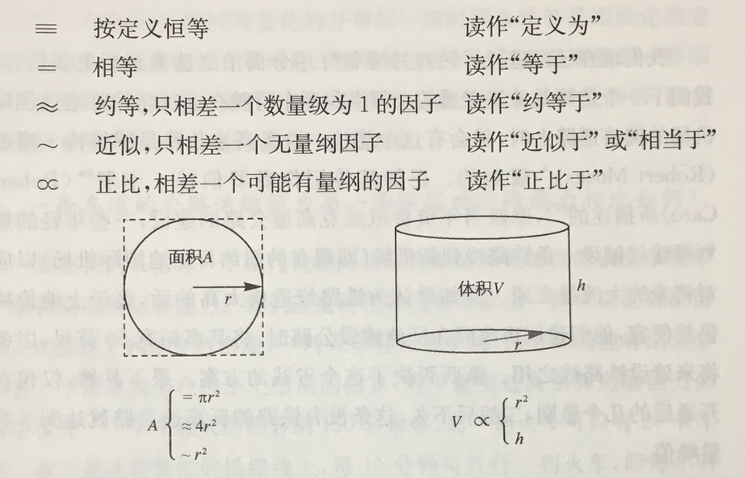
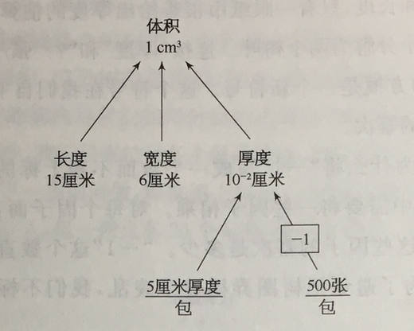
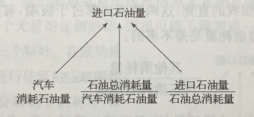
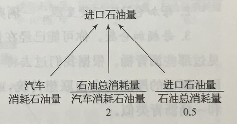
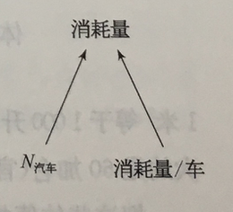
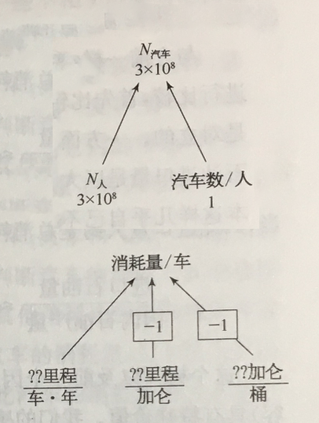
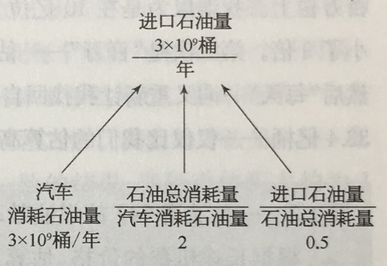
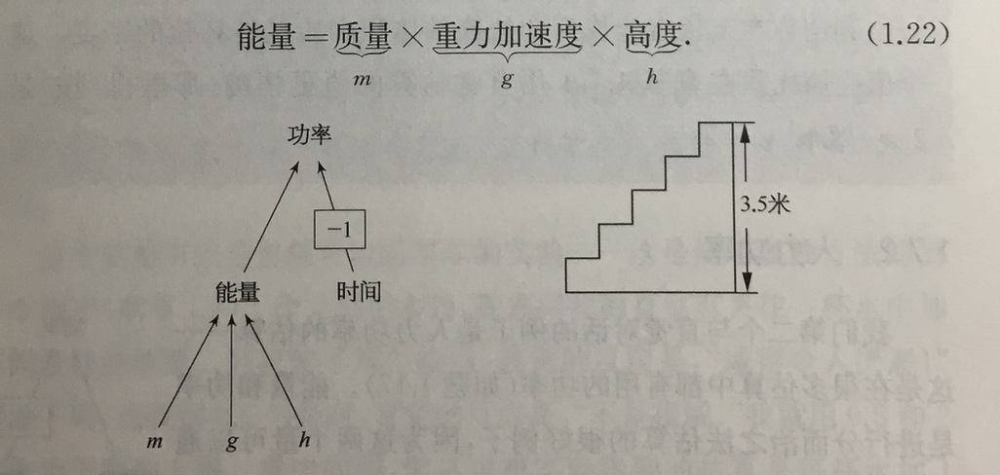
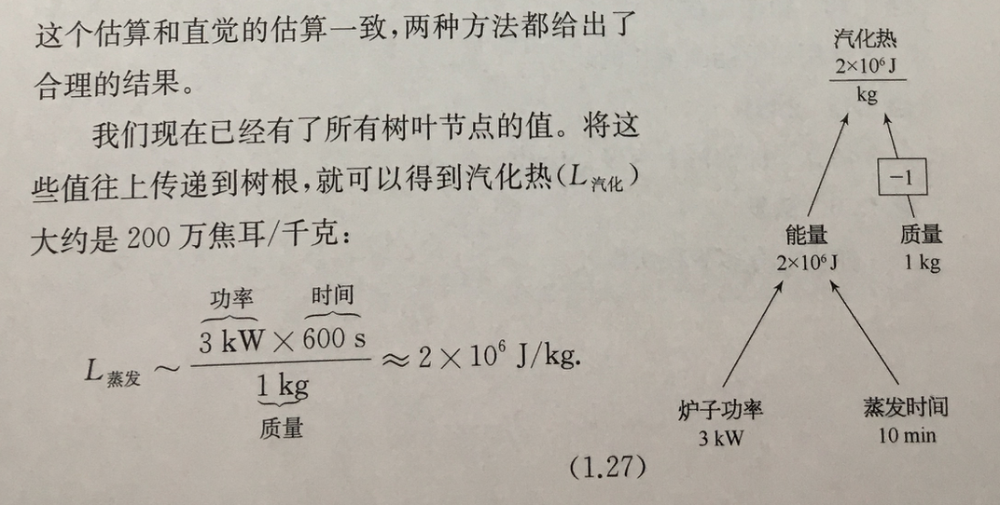

Part I Organizing complexity

We cannot find much insight staring at a mess. We need to organize it. As an everyday example, when I look at my kitchen after a dinner party, I feel overwhelmed. It's late, I'm tired, and I dread that I will not get enough sleep. If I clean up in that scattered state of mind, I pick up a spoon here and a pot there, making little progress. However, when I remember that a large problem can be broken into smaller ones, calm and efficiency return.

I begin at one corner of the kitchen, clear its mess, and move to neighboring areas until the project is done. I divide and conquer (Chapter 1).

Once the dishes are clean, I resist the temptation to dump them into one big box. I separate pots from the silverware and, within the silverware, the forks from the spoons. These groupings, or abstractions (Chapter 2), make the kitchen easy to understand and use.

In problem solving, we organize complexity by using divide-and-conquer reasoning and by making abstractions. In Part I, you'll learn how.

## 0101. Divide and conquer

As imperial rulers knew, you need not conquer all your enemies at once.

Instead, conquer them one at a time. Break hard problems into manageable pieces. This process embodies our first reasoning tool: Divide and conquer!

### 1.1 Warming up

To show how to use divide-and-conquer reasoning, we'll apply it to increasingly complex problems that illustrate its essential features. So we start with an everyday estimate.

What is, roughly, the volume of a dollar bill?

Volumes are hard to estimate. However, we should still make a quick guess.

Even an inaccurate guess will help us practice courage and, when we compare the guess with a more accurate estimate, will help us calibrate our internal measuring rods. To urge me on, I often imagine a mugger who holds a knife at my ribs, demanding,「Your guess or your life!」Then I judge it likely that the volume of a dollar bill lies between 0.1 and 10 cubic centimeters.

This range is wide, spanning a factor of 100. In contrast, the dollar bill's width probably lies between 10 and 20 centimeters — a range of only a factor of 2. The volume range is wider than the width range because we have no equivalent of a ruler for volume; thus, volumes are less familiar than lengths. Fortunately, the volume of the dollar bill is the product of lengths.

```
volume = width × height × thickness. (1.1)
```

The harder volume estimate becomes three easier length estimates — the benefit of divide-and-conquer reasoning.

The width looks like 6 inches, which is roughly 15 centimeters. The height looks like 2 or 3 inches, which is roughly 6 centimeters.

But before estimating the thickness, let's talk about unit systems.

Is it better to use metric or US customary units (such as inches, feet, and miles)?

Your estimates will be more accurate if you use the units most familiar to you. Raised in the United States, I judge lengths more accurately in inches, feet, and miles than in centimeters, meters, or kilometers. However, for calculations requiring multiplication or division — most calculations — I convert the customary units to metric (and often convert back to customary units at the end). But you may be fortunate enough to think in metric. Then you can estimate and calculate in a single unit system.

The third piece of the divide-and-conquer estimate, the thickness, is difficult to judge. A dollar bill is thin — paper thin.

But how thin is「paper thin」?

This thickness is too small to grasp and judge easily. However, a stack of several hundred bills would be graspable. Not having that much cash lying around, I'll use paper. A ream of paper, which has 500 sheets, is roughly 5 centimeters thick. Thus, one sheet of paper is roughly 0.01 centimeters thick. With this estimate for the thickness, the volume is approximately 1 cubic centimeter:

Although a more accurate calculation could adjust for the fiber composition of a dollar bill compared to ordinary paper and might consider the roughness of the paper, these details obscure the main result: A dollar bill is 1 cubic centimeter pounded paper thin.

To check this estimate, I folded a dollar bill until my finger strength gave out, getting a roughly cubical packet with sides of approximately 1 centimeter — making a volume of approximately 1 cubic centimeter!

In the preceding analysis, you may have noticed the = and ≈ symbols and their slightly different use. Throughout this book, our goal is insight over accuracy. So we'll use several kinds of equality symbols to describe the accuracy of a relation and what it omits. Here is a table of the equality symbols, in descending order of completeness and often increasing order of usefulness.

As examples of the kinds of equality, for the circle below, 𝐴 = 𝜋𝑟2, and 𝐴 ≈ 4𝑟2, and 𝐴 ∼ 𝑟2. For the cylinder, 𝑉 ∼ ℎ𝑟2 — which implies 𝑉 ∝ 𝑟2 and 𝑉 ∝ ℎ. In the 𝑉 ∝ ℎ form, the factor hidden in the ∝ symbol has dimensions of length squared.

Problem 1.1 Weight of a box of books

How heavy is a small moving-box filled with books?

Problem 1.2 Mass of air in your bedroom

Estimate the mass of air in your bedroom.

Problem 1.3 Suitcase of bills

In the movies, and perhaps in reality, cocaine and elections are bought with a suitcase of `$`100 bills. Estimate the dollar value in such a suitcase.

Problem 1.4 Gold or bills?

As a bank robber sitting in the vault planning your getaway, do you fill your suitcase with gold bars or `$`100 bills? Assume first that how much you can carry is a fixed weight. Then redo your analysis assuming that how much you can carry is a fixed volume.

### 1.2 Rails versus roads

We are now warmed up and ready to use divide-and-conquer reasoning for more substantial estimates. Our next estimate, concerning traffic, comes to mind whenever I drive the congested roads to JFK Airport in New York City. The route goes on the Van Wyck Expressway, which was planned by Robert Moses. As Moses's biographer Robert Caro describes [6, pp. 904ff], when Moses was in charge of building the expressway, the traffic planners recommended that, in order to handle the expected large volume of traffic, the road include a train line to the then-new airport. Alternatively, if building the train track would be too expensive, they recommended that the city, when acquiring the land for the road, still take an extra 50 feet of width and reserve it as a median strip for a train line one day. Moses also rejected the cheaper proposal. Alas, only weeks after its opening, not long after World War Two, the rail-free highway had reached peak capacity.

Let's use our divide-and-conquer tool to compare, for rush-hour commut-ing, the carrying capacities of rail and road. The capacity is the rate at which passengers are transported; it is passengers per time. First we'll estimate the capacity of one lane of highway. We can use the 2-second-following rule taught in many driving courses. You are taught to leave 2 seconds of travel time between you and the car in front. When drivers follow this rule, a single lane of highway carries one car every 2 seconds. To find the carrying capacity, we also need the occupancy of each car. Even at rush hour, at least in the United States, each car carries roughly one person. (Taxis often have two people including the driver, but only one person is being transported to the destination.) Thus, the capacity is one person every 2 seconds. As an hourly rate, the capacity is 1800 people per hour: 

The diagonal strike-through lines help us to spot which units cancel and to check that we end up with just the units that we want (people per hour).

This rate, 1800 people per hour, is approximate, because the 2-second following rule is not a law of nature. The average gap might be 4 seconds late at night, 1 second during the day, and may vary from day to day or from highway to highway. But a 2-second gap is a reasonable compromise estimate. Replacing the complex distribution of following times with one time is an application of lumping — the tool discussed in Chapter 6. Organizing complexity almost always reduces detail. If we studied all highways at all times of day, the data, were we so unfortunate as to obtain them, would bury any insight.

How does the capacity of a single lane of highway compare with the capacity of a train line?

For the other half of the comparison, we'll estimate the rush-hour capacity of a train line in an advanced train system, say the French or German system.

As when we estimated the volume of a dollar bill (Section 1.1), we divide the estimate into manageable pieces: how often a train runs on the track, how many cars are in each train, and how many passengers are in each car. Here are my armchair estimates for these quantities, kept slightly conservative to avoid overestimating the train-line's capacity. A single train car, when full at rush hour, may carry 150 people. A rush-hour train may consist of 20 cars.

And, on a busy train route, a train may run every 10 minutes or six times per hour. Therefore, the train line's capacity is 18 000 people per hour: 

This capacity is ten times the capacity of a single fast-flowing highway lane.

And this estimate is probably on the low side; Robert Caro [6, p. 901] gives an estimate of 40 000 to 50 000 people per hour. Using our lower rate, one train track in each direction could replace two highways even if each highway had five lanes in each direction.

### 1.3 Tree representations

Our estimates for the volume of a dollar bill (Section 1.1) and for the rail and highway capacities (Section 1.2) used the same method: dividing hard problems into smaller ones. However, the structure of the analysis is buried within the sentences, paragraphs, and pages. The sequential presentation hides the structure. Because the structure is hierarchical — big problems split, or branch, into smaller problems — its most compact representation is a tree. A tree representation shows us the analysis in one glance.

Here is the tree representation for the capacity capacity of a train line. Unlike the biological variety, our trees stand on their head. Their roots, the goals, sit at the top of the tree. Their leaves, the small problems into which we have subdivided the goal, sit at the bottom. The orientation matches the way that we divide and conquer, filling the page downward as we subdivide.

In making this first tree, we haven't estimated capacity the quantities themselves. We have only identified the quantities. The question marks remind us of our next step: to include estimates for the three leaves. These estimates were 150 people 150 people 20 cars per car, 20 cars per train, and 6 trains per hour (giving the tree in the margin).

Then we multiplied the leaf values to propagate the estimates upward from the leaves toward the root. The result was 18 000 people per hour.

The completed tree shows us the entire estimate in one glance.

This train-capacity tree had the simplest possible structure with only two layers (the root layer and, as the second layer, the three leaves). The next level of complexity is a three-layer tree, which will represent our estimate for the volume of a dollar bill. It started as a two-layer tree with three leaves.

Then it grew, because, unlike the width and height, the thickness was difficult to estimate just by looking at a dollar bill. Therefore, we divided that leaf into two easier leaves.

The result is the tree in the margin. The thickness leaf, which is the thickness per sheet, has split into (1) the thickness per ream and (2) the number of sheets per ream. The boxed −1 on the line connecting the thickness to the number of sheets per ream is a new and useful notation. The −1 tells us the exponent to apply to that leaf value when we propagate it upward to the root.

Here is why I write the −1 as a full-sized number rather than a small superscript. Most of our estimates require multiplying several factors. The only question for each factor is,「With what exponent does this factor enter?」The number −1 directly answers this「What exponent?」question. (To avoid cluttering the tree, we don't indicate the most-frequent exponent of 1.) This new subtree then represents the following equation for the thickness of one sheet:

(1.5)

The −1 exponent allows, at the cost of a slight complication in the tree notation, the leaf to represent the number of sheets per ream rather than a less-familiar fraction, the number of reams per sheet.

Now we include our estimates for the leaf values. The width is 15 centimeters. The height is 6 centimeters. The thickness of a ream of paper is 5 centimeters. And a ream contains 500 sheets of paper. The result is the following tree.

Now we propagate the values to the root. The two bottommost leaves combine to tell us that the thickness of one sheet is 10$^−2$ centimeters. This thickness completes the tree's second layer. In the second layer, the three nodes tell us that the volume of a dollar bill — the root — is 1 cubic centimeter.

With practice, you can read in this final tree all the steps of the analysis. The three nodes in the second layer show how the difficult volume estimate was subdivided into three easier estimates. That the width and height remained leaves indicates that these two estimates felt reliable enough. In contrast, the two branches sprouting from the thickness indicate that the thickness was still hard to estimate, so we divided that estimate into two more-familiar quantities.

The tree encapsulates many paragraphs of analysis in a compact form, one that our minds can absorb in a single glance. Organizing complexity helps us build insight.

Problem 1.5 Tree for the suitcase of bills

Make a tree diagram for your estimate in Problem 1.3. Do it in three steps: (1) Draw the tree without any leaf estimates, (2) estimate the leaf values, and (3) propagate the leaf values upward to the root.

### 1.4 Demand-side estimates

Our analysis of the carrying capacity of highways and railways (Section 1.2) is an example of a frequent application of estimation in the social world — estimating the size of a market. The highway–railway comparison proceeded by estimating the transportation supply. In other problems, a more feasi-ble analysis is based on the complementary idea of estimating the demand.

Here is an example.

How much oil does the United States import (in barrels per year)?

The volume rate is enormous and therefore hard to picture. Divide-and-conquer reasoning will tame the complexity. Just keep subdividing until the quantities are no longer daunting.

Here, subdivide the demand — the consumption. We consume oil in so many ways; estimating the consumption in each pathway would take a long time without producing much insight. Instead, let's estimate the largest consumption — likely to be cars — then adjust for other uses and for overall consumption versus imports.

Here is the corresponding tree. The first factor, the most difficult of the three to estimate, will require us to sprout branches and make a subtree. The second and third factors might be possible to estimate without subdividing.

Now we must decide how to continue.

Should we keep subdividing until we've built the entire tree and only then estimate the leaves, or should we try to estimate these leaves and then subdivide what we cannot estimate?

It depends on one's own psychology. I feel anxious in the uncharted waters of a new estimate. Sprouting new branches before making any leaf estimates increases my anxiety. The tree might never stop sprouting branches and leaves, and I'll never estimate them all. Thus, I prefer to harvest my progress right away by estimating the leaves before sprouting new branches.

You should experiment to learn your psychology. You are your best problem-solving tool, and it is helpful to know your tools.

Because of my psychology, I'll first estimate a leaf quantity: 

```
all usage/car usage. (1.7)
```

But don't do this estimate directly. It is more intuitive — that is, easier for our gut — to estimate first the ratio of car usage to other (noncar) usage. The ability to make such comparisons between disjoint sets, at least for physical objects, is hard wired in our brains and independent of the ability to count. Not least, it is not limited to humans. The female lions studied by Karen McComb and her colleagues [35] would judge the relative size of their troop and a group of lions intruding on their territory. The females would approach the intruders only when they outnumbered the intruders by a large-enough ratio, roughly a factor of 2.

Other uses for oil include noncar modes of transport (trucks, trains, and planes), heating and cooling, and hydrocarbon-rich products such as fer-tilizer, plastics, and pesticides. In judging the relative importance of other uses compared to car usage, two arguments compete: (1) Other uses are so many and so significant, so they are much more important than car usage; and (2) cars are so ubiquitous and such an inefficient mode of transport, so car usage is much larger than other uses. To my gut, both arguments feel comparably plausible. My gut is telling me that the two categories have comparable usages:

```
other usage / car usage ≈ 1. (1.8)
```

Based on this estimate, all usage (the sum of car and other usage) is roughly double the car usage:

```
all usage / car usage ≈ 2. (1.9)
```

This estimate is the first leaf. It implicitly assumes that the gasoline fraction in a barrel of oil is high enough to feed the cars. Fortunately, if this assumption were wrong, we would get warning. For if the fraction were too low, we would build our transportation infrastructure around other means of transport — such as trains powered by electricity generated by burning the nongasoline fraction in oil barrels. In this probably less-polluted world, we would estimate how much oil was used by trains.

Returning to our actual world, let's estimate the second leaf: 

```
imports / all usage. (1.10)
```

This adjustment factor accounts for the fact that only a portion of the oil consumed is imported.

What does your gut tell you for this fraction?

Again, don't estimate this fraction directly. Instead, to make a comparison between disjoint sets, first compare (net) imports with domestic production.

In estimating this ratio, two arguments compete. On the one hand, the US media report extensively on oil production in other countries, which suggests that oil imports are large. On the other hand, there is also extensive coverage of US production and frequent comparison with countries such as Japan that have almost no domestic oil. My resulting gut feeling is that the categories are comparable and therefore that imports are roughly one-half of all usage:

(1.11)

This leaf, as well as the other adjustment factor, are dimensionless numbers.

Such numbers, the main topic of Chapter 5, have special value. Our percep-tual system is skilled at estimating dimensionless ratios. Therefore, a leaf node that is a dimensionless ratio probably does not need to be subdivided.

The tree now has three leaves. Having plausible estimates for two of them should give us courage to subdivide the remaining leaf, the total car usage, into easier estimates. That leaf will sprout its own branches and become an internal node.

How should we subdivide the car usage?

A reasonable subdivision is into the number of cars 𝑁cars and car usage the per-car usage. Both quantities are easier to estimate than the root. The number of cars is related to the US population — a familiar number if you live in the United States. The per-car usage is easier to estimate than is the total usage of all US cars. Our gut can more accurately judge human-scale quantities, such as the per-car usage, than it can judge vast numbers like the total usage of all US cars.

For the same reason, let's not estimate the number of cars directly. Instead, subdivide this leaf into two leaves: 

1 the number of people, and

2 the number of cars per person.

The first leaf is familiar, at least to residents of the United States: 𝑁people ≈ 3×108.

The second leaf, cars per person, is a human-sized quantity. In the United States, car ownership is widespread. Many adults own more than one car, and a cynic would say that even babies seem to own cars. Therefore, a rough and simple estimate might be one car per person — far easier to picture than the total number of cars! Then 𝑁cars ≈ 3×108.

The per-car usage can be subdivided into three easier factors (leaves). Here are my estimates.

1 How many miles per car year? Used cars with 10 000 miles per year are considered low use but are not rare. Thus, for a typical year of car year driving, let's take a slightly longer distance: say, 20 000 miles or 30 000 kilometers.

2 How many miles per gallon? A typical car fuel efficiency is 30 miles per US gallon. In metric units, it is about 100 kilometers per 8 liters.

3 How many gallons per barrel? You might have seen barrels of asphalt along the side of the highway during road construction. Following our free-association tradition of equating the thickness of a sheet of paper and of a dollar bill, perhaps barrels of oil are like barrels of asphalt.

Their volume can be computed by divide-and-conquer reasoning. Just approximate the cylinder as a rectangular prism, estimate its three dimensions, and multiply: 

(1.12)

A cubic meter is 1000 liters or, using the conversion of 4 US gallons per liter, roughly 250 gallons. Therefore, 0.25 cubic meters is roughly 60 gallons. (The official volume of a barrel of oil is not too different at 42 gallons.) Multiplying these estimates, and not forgetting the effect of the two −1 exponents, we get approximately 10 barrels per car per year (also written as barrels per car year):

(1.13)

In doing this calculation, first evaluate the units. The gallons and miles cancel, leaving barrels per year. Then evaluate the numbers. The 30 × 60 in the denominator is roughly 2000. The 2 × 104 from the numerator divided by the 2000 from the denominator produces the 10.

This estimate is a subtree in the tree representing total car usage. The car usage then becomes 3 billion barrels per year: 3×108 cars × 10 barrels = 3×109 barrels.

(1.14)

This estimate is itself a subtree in the tree representing oil imports. Because the two adjustment factors contribute a factor of 2 × 0.5, which is just 1, the oil imports are also 3 billion barrels per year.

Here is the full tree, which includes the subtree for the total car usage of oil:

Problem 1.6 Using metric units

As practice with metric units (if you grew up in a nonmetric land) or to make the results more familiar (if you grew up in a metric land), redo the calculation using the metric values for the volume of a barrel, the distance a car is driven per year, and the fuel consumption of a typical car.

How close is our estimate to official values?

For the US oil imports, the US Department of Energy reports 9.163 million barrels per day (for 2010). When I first saw this value, my heart sank twice.

The first shock was the 9 in the 9 million. I assumed that it was the number of billions, and wondered how the estimate of 3 billion barrels could be a factor of 3 too small. The second shock was the「million」 — how could the estimate be more than a factor of 100 too large? Then the「per day」

reassured me. As a yearly rate, 9.163 million barrels per day is 3.34 billion barrels per year — only 10 percent higher than our estimate. Divide and conquer triumphs!

Problem 1.7 Fuel efficiency of a 747

Based on the cost of a long-distance plane ticket, estimate the following quantities: (a) the fuel efficiency of a 747, in passenger miles per gallon or passenger kilometers per liter; and (b) the volume of its fuel tank. Check your estimates against the technical data for a 747.

### 1.5 Multiple estimates for the same quantity 

After making an estimate, it is natural to wonder about how much confidence to place in it. Perhaps we made an embarrassingly large mistake. The best way to know is to estimate the same quantity using another method.

As an everyday example, let's observe how we add a list of numbers.

```
12
15
+18
(1.15)
```

We often add the numbers first from top to bottom. For 12 + 15 + 18, we calculate,「12 plus 15 is 27; 27 plus 18 is 45.」To check the result, we add the numbers in the reverse order, from bottom to top:「18 plus 15 is 33; 33 plus 12 is 45.」The two totals agree, so each is probably correct: The calculations are unlikely to contain an error of exactly the same amount. This kind of redundancy catches errors.

In contrast, mindless redundancy offers little protection. If we check the calculation by adding the numbers from top to bottom again, we usually repeat any mistakes. Similarly, rereading written drafts usually means overlooking the same spelling, grammar, or logic faults. Instead, stuff the draft in a drawer for a week, then look at it; or ask a colleague or friend — in both cases, use fresh eyes.

Reliability, in short, comes from intelligent redundancy.

This principle helps you make reliable estimates. First, use several methods to estimate the same quantity. Second, make the methods as different from one another as possible — for example, by using unrelated background knowledge. This approach to reliability is another example of divide-and-conquer reasoning: The hard problem of making a reliable estimate becomes several simpler subproblems, one per estimation method.

You saw an example in Section 1.1, where we estimated the volume of a dollar bill. The first method used divide-and-conquer reasoning based on the width, height, and thickness of the bill. The check was a comparison with a folded-up dollar bill. Both methods agreed on a volume of approximately 1 cubic centimeter — giving us confidence in the estimate.

For another example of using multiple methods, return to the estimate of the volume of an oil barrel (Section 1.4). We used a roadside asphalt barrel as a proxy for an oil barrel and estimated the volume of the roadside barrel. The result, 60 gallons, seemed plausible, but maybe oil barrels have a completely different size. One way to catch that kind of error is to use a different method for estimating the volume. For example, we might start with the cost of a barrel of oil — about `$`100 in 2013 — and the cost of a gallon of gasoline — about `$`2.50 before taxes, or 1/40th of the cost of a barrel. If the markup on gasoline is not significant, then a barrel is roughly 40 gallons. Even with a markup, we can still say that a barrel is at least 40 gallons.

Because our two estimates, 60 gallons and > 40 gallons, roughly agree, our confidence in both increases. If they had contradicted each other, one or both would be wrong, and we would look for the mistaken assumption, for the incorrect arithmetic, or for a third method.

### 1.6 Talking to your gut

As you have seen in the preceding examples, divide-and-con-quer estimates require reasonable estimates for the leaf quantities. To decide what is reasonable, you have to talk to your gut — what you will learn in this section. Talking to your gut feels strange at first, especially because science and engineering are considered cerebral subjects. Let's therefore discuss how to hold the conversation. The example will be an estimate of the US population based on its area and population density. The divide-and-conquer tree has two leaves. (In Section 6.3.1, you'll see a qualitatively different method, where the two leaves will be the number of US states and the population of a typical state.) 

The area is the width times the height, so the area leaf itself splits into two leaves. Estimating the width and height requires only a short dialogue with the gut, at least if you live in the United States. Its width is a 6-hour plane flight at 500 miles per hour, so about 3000 miles; and the height is, as a rough estimate, two-thirds of the width, or 2000 miles. Therefore, the area is 6 million square miles:

```
3000 miles × 2000 miles = 6×106 miles2. (1.16)
```

In metric units, it is about 16 million square kilometers.

Estimating the population density requires talking to your gut. If you are like me you have little conscious knowledge of the population density. Your gut might know, but you cannot ask it directly. The gut is connected to the right brain, which doesn't have language. Although the right brain knows a lot about the world, it cannot answer with a value, only with a feeling.

To draw on its knowledge, ask it indirectly. Pick a particular population density — say, 100 people per square mile — and ask the gut for its opinion:

「O, my intuitive, insightful, introverted right brain: What do you think of 100 people per square mile for the population density?」A response, a gut feeling, will come back. Keep lowering the candidate value until the gut feeling becomes,「No, that value feels way too low.」

Here is the dialogue between my left brain (LB) and right brain (RB).

LB: What do you think of 100 people per square mile?

RB: That feels okay based on my experience growing up in the United States.

LB: I can probably support that feeling quantitatively. A square mile with 100

people means each person occupies a square whose side is 1/10th of a mile or 160 meters. Expressed in this form, does the population density feel okay?

RB: Yes, the large open spaces in the western states probably compensate for the denser regions near the coasts.

LB: Now I will lower the estimate by factors of 3 or 10 until you object strongly that the estimate feels too low. [A factor of 3 is roughly one-half of a factor of 10, because 3 × 3 ≈ 10. A factor of 3 is the next-smallest factor by which to move when a factor of 10 is too large a jump.] In that vein, what about an average population density of 10 people per square mile?

RB: I feel uneasy. The estimate feels a bit low.

LB: I understand where you are coming from. That value may moderately overestimate the population density of farmland, but it probably greatly underestimates the population density in the cities. Because you are uneasy, let's move more slowly until you object strongly. How about 3 people per square mile?

RB: If the true value were lower than that, I'd feel fairly surprised.

LB: So, for the low end, I'll stop at 3 people per square mile. Now let's navigate to the upper end. You said that 100 people per square mile felt plausible. How do you feel about 300 people per square mile?

RB: I feel quite uneasy. That estimate feels quite high.

LB: I hear you. Your response reminds me that New Jersey and the Netherlands, both very densely populated, are at 1000 people per square mile, although I couldn't swear to this value. I cannot imagine packing the whole United States to a density comparable to New Jersey's. Therefore, let's stop here: Our upper endpoint is 300 people per square mile.

How do you make your best guess based on these two endpoints?

A plausible guess is to use their arithmetic mean, which is roughly 150 people per square mile. However, the right method is the geometric mean: 

```
best guess = √(lower endpoint × upper endpoint) (1.17)
```

The geometric mean is the midpoint of the lower and upper bounds — but on a ratio or logarithmic scale, which is the scale built into our mental hardware. (For more about how we perceive quantity, see The Number Sense [9].) The geometric mean is the correct mean when combining quantities produced by our mental hardware.

Here, the geometric mean is 30 people per square mile: a factor of 10 removed from either endpoint. Using that population density:

(1.18)

The actual population is roughly 3×108. The estimate based almost entirely on gut reasoning is within a factor of 1.5 of the actual population — a pleasantly surprising accuracy.

Problem 1.8 More gut estimates

By asking your gut to help you estimate the lower and upper endpoints, estimate (a) the height of a nearby tall tree that you can see, (b) the mass of a car, and (c) the number of water drops in a bathtub.

### 1.7 Physical estimates

Your gut understands not only the social world but also the physical world.

If you trust its feelings, you can tap this vast reservoir of knowledge. For practice, we'll estimate the salinity of seawater (Section 1.7.1), human power output (Section 1.7.2), and the heat of vaporization of water (Section 1.7.3).

#### 1.7.1 Salinity of seawater

To estimate the salinity of seawater, which will later help you estimate the conductivity of seawater (Problem 8.10), do not ask your gut directly:「How do you feel about, say, 200 millimolar?」Although that kind of question worked for estimating population density (Section 1.6), here, unless you are a chemist, the answer will be:「I have no clue. What is a millimolar anyway? I have almost no experience of that unit.」Instead, offer your gut concrete data — for example, from a home experiment: adding salt to a cup of water until the mixture tastes as salty as the ocean.

This experiment can be a thought or a real experiment — another example of using multiple methods (Section 1.5). As a thought experiment, I ask my gut about various amounts of salt in a cup of water. When I propose adding 2 teaspoons, it responds,「Disgustingly salty!」At the lower end, when I propose adding 0.5 teaspoons, it responds,「Not very salty.」I'll use 0.5 and 2 teaspoons as the lower and upper endpoints of the range. Their midpoint, the estimate from the thought experiment, is 1 teaspoon per cup.

I tested this prediction at the kitchen sink. With 1 teaspoon (5 milliliters) of salt, the cup of water indeed had the sharp, metallic taste of seawater that I have gulped after being knocked over by large waves. A cup of water is roughly one-fourth of a liter or 250 cubic centimeters. By mass, the resulting salt concentration is the following product: 

The density of 2 grams per cubic centimeter comes from my gut feeling that salt is a light rock, so it should be somewhat denser than water at 1 gram per cubic centimeter, but not too much denser. (For an alternative method, more accurate but more elaborate, try Problem 1.10.) Then doing the arithmetic gives a 4 percent salt-to-water ratio (by mass).

The actual salinity of the Earth's oceans is about 3.5 percent — very close to the estimate of 4 percent. The estimate is close despite the large number of assumptions and approximations — the errors have mostly canceled. Its accuracy should give you courage to perform home experiments whenever you need data for divide-and-conquer estimates.

Problem 1.9 Density of water

Estimate the density of water by asking your gut to estimate the mass of water in a cup measure (roughly one-quarter of a liter).

Problem 1.10 Density of salt

Estimate the density of salt using the volume and mass of a typical salt container that you find in a grocery store. This value should be more accurate than my gut estimate in Section 1.7.1 (which was 2 grams per cubic centimeter).

#### 1.7.2 Human power output

Our second example of talking to your gut is an estimate of human power output — a power that is useful in many estimates (for example, Problem 1.17). Energies and powers are good candidates for divide-and-conquer estimates, because they are connected by the subdivision shown in the following equation and represented in the tree in the margin:

```
power = energy / time (1.20)
```

In particular, let's estimate the power that a trained athlete can generate for an extended time (not just during a few-seconds-long, high-power burst). As a proxy for that power, I'll use my own burst power output with two adjustment factors:

Maintaining a power is harder than producing a quick burst. Therefore, the first adjustment factor, my steady power divided by my burst power, is somewhat smaller than 1 — maybe 1/2 or 1/3. In contrast, an athlete's power output will be higher than mine, perhaps by a factor of 2 or 3: Even though I am sometimes known as the street-fighting mathematician [33], I am no athlete. Then the two adjustment factors roughly cancel, so my burst power should be comparable to an athlete's steady power.

To estimate my burst power, I performed a home experiment of running up a flight of stairs as quickly as possible. Determining the power output requires estimating an energy and a time:

(1.21)

The energy, which is the change in my gravitational potential energy, itself subdivides into three factors: 

In the academic building at my university, a building with high ceilings and staircases, I bounded up a staircase three stairs at a time. The staircase was about 12 feet or 3.5 meters high. Therefore, my mechanical energy output was roughly 2000 joules: 

```
𝐸 ∼ 65 kg × 10 m s−2 × 3.5 m ∼ 2000 J. (1.23)
```

(The units are fine: 1 J = 1 kg m2 s−2.)

The remaining leaf is the time: how long the climb took me. I made it in 6 seconds. In contrast, several students made it in 3.9 seconds — the power of youth! My mechanical power output was about 2000 joules per 6 seconds, or about 300 watts. (To check whether the estimate is reasonable, try Problem 1.12, where you estimate the typical human basal metabolism.) This burst power output should be close to the sustained power output of a trained athlete. And it is. As an example, in the Alpe d'Huez climb in the 1989 Tour de France, the winner — Greg LeMond, a world-class athlete — put out 394 watts (over a 42.5-minute period). The cyclist Lance Armstrong, during the time-trial stage during the Tour de France in 2004, generated even more: 495 watts (roughly 7 watts per kilogram). However, he publicly admitted to blood doping to enhance performance. Indeed, because of widespread doping, many cycling power outputs of the 1990s and 2000s are suspect; 400 watts stands as a legitimate world-class sustained power output.

Problem 1.11 Energy in a 9-volt battery

Estimate the energy in a 9-volt battery. Is it enough to launch the battery into orbit?

Problem 1.12 Basal metabolism

Based on our daily caloric consumption, estimate the human basal metabolism.

Problem 1.13 Energy measured in person flights of stairs How many flights of stairs can you climb using the energy in a stick (100 grams) of butter?

#### 1.7.3 Heat of vaporization of water

Our final physical estimate concerns the most important liquid on Earth.

What is the heat of vaporization of water?

Because water covers so much of the Earth and is such an important part of the atmosphere (clouds!), its heat of vaporization strongly affects our climate — whether through rainfall (Section 3.4.3) or air temperatures.

Heat of vaporization is defined as a ratio:

(1.24)

where the amount of substance can be measured in moles, by volume, or (most commonly) by mass. The definition provides the structure of the tree and of the estimate based on divide-and-conquer reasoning.

For the mass of the substance, choose an amount of water that is easy to imagine — ideally, an amount familiar from everyday life. Then your gut can help you make estimates. Because I often boil a few cups of water at a time, and each cup is few hundred milliliters, I'll imagine 1 liter or 1 kilogram of water.

The other leaf, the required energy, requires more thought. There is a common confusion about this energy that is worth discussing.

Is it the energy required to bring the water to a boil?

No: The energy has nothing to do with the energy required to bring the water to a boil! That energy is related to water's specific heat 𝑐p. The heat of vaporization depends on the energy needed to evaporate — boil away — the water, once it is boiling. (You compare these energies in Problem 5.61.) 

Energy subdivides into power times time (as when we estimated human power output in Section 1.7.2). Here, the power could be the power output of one burner; the time is the time to boil away the liter of water. To estimate these leaves, let's hold a gut conference.

For the time, my dialogue is as follows.

LB: How does 1 minute sound as a lower bound?

RB: Way too short — you've left boiling water on the stove unattended for longer without its boiling away!

LB: How about 3 minutes?

RB: That's on the low side. Maybe that's the lower bound.

LB: Okay. For the upper bound, how about 100 minutes?

RB: That time feels way too long. Haven't we boiled away pots of water in far less time?

LB: What about 30 minutes?

RB: That's long, but I wouldn't be shocked, only fairly surprised, if it took that long. It feels like the upper bound.

My range is therefore 3…30 minutes. Its midpoint — the geometric mean of the endpoints — is about 10 minutes or 600 seconds.

For variety, let's directly estimate the burner power, without estimating lower and upper bounds.

LB: How does 100 watts feel?

RB: Way too low: That's a lightbulb! If a lightbulb could boil away water so quickly, our energy troubles would be solved.

LB (feeling chastened): How about 1000 watts (1 kilowatt)?

RB: That's a bit low. A small appliance, such as a clothes iron, is already 1 kilowatt.

LB (raising the guess more slowly): What about 3 kilowatts?

RB: That burner power feels plausible.

Let's check this power estimate by subdividing power into two factors, voltage and current:

```
power = voltage × current (1.25)
```

An electric stove requires a line voltage of 220 volts, even in the United States where most other appliances require only 110 volts. A standard fuse is about 15 amperes, which gives us an idea of a large current. If a burner corresponds to a standard fuse, a burner supplies roughly 3 kilowatts: 

```
220 V × 15 A ≈ 3000 W (1.26)
```

This estimate agrees with the gut estimate, so both methods gain plausibility — which should give you confidence to use both methods for your own estimates. As a check, I looked at the circuit breaker connected to my range, and it is rated for 50 amperes. The range has four burners and an oven, so 15 amperes for one burner (at least, for the large burner) is plausible.

We now have values for all the leaf nodes. Propagating the values toward the root gives the heat of vaporization (𝐿vap) as roughly 2 megajoules per kilogram:

(1.27)

The true value is about 2.2×106 joules per kilogram. This value is one of the highest heats of vaporization of any liquid. As water evaporates, it carries away significant amounts of energy, making it an excellent coolant (Problem 1.17).

### 1.8 Summary and further problems

The main lesson that you should take away is courage: No problem is too difficult. We just use divide-and-conquer reasoning to dissolve difficult problems into smaller pieces. (For extensive practice, see the varied examples in the Guesstimation books [47 and 48].) This tool is a universal solvent for problems social and scientific.

Problem 1.14 Per-capita land area

Estimate the land area per person for the world, for your home country, and for your home state or province.

Problem 1.15 Mass of the Earth

Estimate the mass of the Earth. Then look it up (p. xvii) to check your estimate.

Problem 1.16 Billion

How long would it take to count to a billion (109)?

Problem 1.17 Sweating

Estimate how much water you need to drink to replace water lost to evaporation, if you ride a bicycle vigorously for 1 hour. Represent your estimate as a divide-and-conquer tree. Hint: Humans are only about 25 percent efficient in generating mechanical work.

Problem 1.18 Pencil line

How long a line can you write with a pencil?

Problem 1.19 Pine needles

Estimate the number of needles on a pine tree.

Problem 1.20 Hairs

How many hairs are on your head?

第一篇 组织复杂性

当面对一团乱麻时，你不可能发现很多线索。你需要将其重新组织。举常见的例子来说，如果这是你的书桌，或者是晚宴后的厨房，你可能从一个角落开始清理，然后移到下一个区域。你所应用的正是分而治之法（第 1 章）。

进而，在你书桌的每一个区域，你很可能并不是将所有的文件材料随意地放在一个文件夹中，你会按照不同的主题将它们归档。在你的厨房，你会将银器和瓷器分开摆放。在银器类中，你又会将叉和勺分开。在进行这些高级分类时，你应用的正是抽象化的分析工具（第 2 章）。

利用这两种工具，我们就能组织并把握复杂性。

## 0101. 分而治之法

正如帝国的统治者们深谙的道理，不必一下子征服所有的敌人，而是应该逐一征服他们，你可以将一个难题分解为一些小的、可以处理的问题。这个过程体现了我们的第一个分析工具：分而治之法！

1『又见「分解」能力的重要性，自从听了郑烨的「任务分解」板块后，对此点感触实在太多。能讲「东西」分解成颗粒度很细的都是大牛，做单元测试要分解、重构要分解、软件设计要分解、OKR 要分解，等等。』

### 1.1 热身

我们将通过一系列复杂程度逐渐增加的问题来说明如何使用这个工具。从日常生活中的估算开始吧。

➤ 一元纸币的体积近似是多少？

体积是难以估算的，但是，我们仍然应该作一快速的估算。即使一个不太精确的估算，也将帮助我们建立进行实践的勇气。并且，将我们的估算与更精确的估算比较将帮助我们校准我们内部的测量基准。为了逼自己，我常常想像有一个抢劫犯拿着一把刀顶着我的肋部，要求道，「快给出你的估算，不然要你的命！」于是我就判断一元纸币的体积很可能在 0.1 和 10 厘米<sup>3</sup>之间。

这个估算范围有点宽，最大、最小估值相差达到 100 倍。作为对比元纸币的宽度大概在 10 到 20 厘米之间 —— 这只有 2 倍的差别！体积的估算范围要大于宽度的估算范围，因为我们并没有一把类似的可以直接量体积的「尺」，所以相对长度而言，我们对体积的估算较为陌生。幸运的是，纸币的体积是三个长度的乘积：

```
体积=长度宽度×厚度
```

难以估算的体积变成了相对容易的对三个长度的估算 —— 这就是分而治之法的好处。前两个长度的估算不难。长度看上去在 6 英寸或 15 厘米左右，宽度看上去大概 2 到 3 英寸，或大概 6 厘米。在继续对第三个尺度估算之前，我们先来讨论单位的问题。

➤ 用英制好还是用公制好？

在估算的时候使用对你来说更为直观的单位，你的估算结果将更为准确。因为从小在美国长大，我判断长度更多的是用英寸、英尺、英里而不是用厘米、米、公里。但在需要用到乘除法计算的时候 一一 大多数计算会用到乘除法 —— 我会将英制转换为公制（最后常常会再转换到英制）。但你可能幸运地只需用公制来思考，因而可以只在一种单位制中进行估计和计算。分而治之法的第三个量 一一 厚度，是难以判断的。一张纸币是很薄的，只有一张纸那么薄。

➤ 但是「一张纸的厚度」究竟是多少呢？

这个厚度太小了，很难有直观的把握，不容易判断。但是一叠几百张纸币的厚度就容易把握了。手头没有那么多纸币，我就用纸代替。一包纸，有 500 张，大约有 5 厘米厚。于是，一张纸的厚度大概是 0.01 厘米有了对厚度的估算，纸币的体积近似为 1 厘米<sup>3</sup>：


尽管更加细致的计算甚至可以考虑到纸币和普通纸张的纸质不同，也可以考虑纸张的平整度等，但这些细节反而会使主要结果变得模糊：一元纸币其实就是将 1 厘米的东西砸平后的样子。为了验证刚才的估算，我用尽手指的力气将一元纸币折叠成大约 1 厘米见方的立方体，因此得到其体积近似为 1 厘米。分而治之法得到的结果是相当精确的。

在前面的分析中，你可能注意到了符号「=」和「≈」，以及这两个符号使用上的细微差异。本书从头至尾关注的是洞察力，而不是精确度。为此目的，我们将使用好几个等价符号，来描述某种关系成立的精确度和忽略的部分。下面按描写完整性减少（通常也是适用性增加）的顺序给出这些符号。



作为这些符号的例子，对于圆，有 A=xr2 和 A≈4r2（面积近似为外切正方形的面积）以及 A~r2。对圆柱体，有 V~hr2,  —— 这隐含了 V∞h 和 V∞r2。在 V∞h 的形式中，隐藏在符号 ∞ 中的因子具有长度平方的量纲。

题 1.1 一箱书的重量。一个可移动的小箱子装满书后有多重？

题 1.2 卧室里的空气质量。估算你卧室里的空气质量。

题 1.3 钱箱。在电影或现实生活中，可卡因和选票常常用一箱子 100 元钞票来购买。估算这样一箱钱的价值。

题 1.4 金条还是纸币？如果你是一个大盗，正在银行地下金库准备逃跑，你是将你的箱子装满金条还是装满 100 元的纸币？假定你能携带的最大重量是固定的。接着再假定你能携带的最大体积是固定的，重做以上分析。

### 1.2 铁路与公路

我们现在已经进行了热身并准备好用分而治之法去进行更多估算。我们下一个估算是关于交通的。每当我开车行驶在去往纽约肯尼迪国际机场的拥挤道路上时，就会有这个想法。这条高速公路是罗伯特·摩西（Robert Moses）规划的。正如其传记作者罗伯特·卡罗（Robert Caro）所描述的，摩西当年负责范威克高速公路的建设，一些年轻的规划师建议铺设一条铁路线到新机场（即现在的组约肯尼迪国际机场）以应对将来的大流量交通。但如果认为铁路线造价太高的话，鉴于土地价格仍然便宜，他们建议市政府在征地建设公路时，将其多拓宽 50 英尺，以备将来建设铁路线之用。摩西否决了这个省钱的方案。果不其然，仅仅在开通后的几个星期，二战后不久，这条没有铁路的新高速公路就达到了容量峰值。

让我们利用分而治之法来比较高峰时段铁路和公路的运输能力。运输能力指运输乘客的效率（单位时间可输送的乘客）。

首先我们来估算高速公路上一条车道的运输能力。我们可以使用在许多驾驶课程上所教并在驾照考试中被验证的规则：2 秒跟随规则。这个规则推荐我们每辆车和前车之间留 2 秒的行驶时间。如果驾驶员都遵守这个规则，那么高速公路上每条车道每 2 秒通过一辆车。至少在美国，每辆车大约输送 1 名乘客，因此运输能力是每 2 秒输送 1 人。按小时算运输能力为每小时 1800 人：


斜线使我们看清单位的相消并可验证最后出现的是我们所需要的单位（这里是人/小时)。

这里，1800 人/小时的运输能力是近似值，因为 2 秒跟随规则并不是法定规则。晚上的平均间隔可能是 4 秒，白天可能是 1 秒，并且可能每天都有变化，每条高速公路都会有所不同。但是 2 秒间隔是一个合理的折中估算。将复杂的、随时间变化的分布用一段时间来代替是团块化的应用，这个工具将在第 6 章讨论。整理复杂性的过程总是要扔掉一些细节。如果我们将高速公路在任意时间的所有数据都拿来研究的话，就会淹没所有的洞察，幸亏我们拿不到这些数据。

➤ 一条车道的公路运输能カ与一条铁路的运输能力相比如何？

现在我们来估算一下现代化铁路系统比如法国或德国的铁路系统中一条铁路线的运输能力。我们还是将估算过程分解为一些可以处理的部分：铁路线上列车开行密度，一列火车有几节车厢，每节车厢能容纳多少乘客。

下面是我坐在椅子上给出的估算，为了避免过高估算运输能力而有所保守。一节车厢大约能容纳 150 名乘客，而一列火车可以有 20 节车厢。在一条比较繁忙的铁路线上，每 10 分钟可开行一列火车，即每小时开行 6 趟列车。因此，一条铁路线的运输能力是每小时 18000 人。


### 1.3 树图

我们对纸币体积的估算（章节 1.1）和对铁路与高速公路运输能力的分析（章节 1.2）用的是同一种方法：将一个难题分解为几个小问题。但是，整个分析的结构被淹没在字里行间。按部就班的叙述隐藏了结构。因为结构是有层次的 一一 大问题分解或肢解为一些小问题 一一 最紧湊的表示就是树图表示。树图可以让整个分析一目了然。

以下是铁路运输能力的树图。与生物学中的树不同，我们的树是倒立的。树根，即目标，位于树的最顶端；树叶，即分解得到的小问题，位于树的底部。这样的取向与我们如何分而治之问题的过程相符在第一幅图中，我们没有估计各个量的数值，而只是确认了有哪些相关量。这提示我们下一步如何做，即在图上标出三个树叶的估算值。这些估算值为毎车厢 150 人，每一列火车 20 个车厢，每小时开行 6 列火车。


然后将这些树叶的值相乘，结果就由树叶向上传递到树根。结果为 18000人/小时。完整的树图让我们一眼就看清了整个分析。这个列车运输能力的树图具有最简单的结构，只有两个层次（即树根层和第二层即三个树叶）。进一步的复杂性就需要具有三个层次的树图了，如对纸币体积的估算。先从下面具有三个树叶的两层树图出发。


然后，因为下面的原因，树图开始继续生长。


不像宽度和长度，只看一眼纸币很难给出厚度的估算。因此，我们将这个树叶进一步分解为两个树叶。连接「厚度」和「??张/包」的有向直线上标有「-1」的方框是一个新符号。这个符号在我们自下而上计算时表示相应树叶值的幂次。

这里给出为什么将「-1」写成一个数而不是上标的原因。在大多数估算的情形中需要将一些因子相乘。对每个因子而言，唯一的问题是：在计算时这些因子的幂次是多少。「-1」这个数直接给出了关于幂次的疑问。（为了避免把树图弄得过于凌乱，我们不标注最常见的幂次 1）

这个新的子树图代表下列计算一张纸厚度的方程：


-1 次幂的引入，虽然使树图变得有点复杂，但使得树叶可以表示「每包的纸张数」，而不是「每张纸的包数」这样不够直观的数。现在将对树叶的估算值代入。长度为 15 厘米，宽度为 6 厘米。一包纸的厚度为 5 厘米，一包有 500 张纸。结果给出下面的树图。


最后，我们将树叶的值传递到树根。第三层的两个树叶给出一张纸的厚度为 10^(-2) 厘米。这个值填补了之前厚度的空缺。第二层的三个节点则告诉我们纸币的体积 —— 即树根的节点 —— 为 1 厘米^3。



通过练习，你可以从最后的树图看出分析的所有步骤。例如，第二层的三个节点表示将对体积的估算分解为对三个较容易的量的估算。长度和宽度保留为树叶意味着对这两个量的估算已经足够精确。相反，从厚度分又的两个分支意味着厚度难以估算，因此将其分解为两个更熟悉的量来进行估算。树图可以将许多分析文字压缩成紧凑的形式某种我们一眼就能看清整个思路的形式。整理复杂性的过程帮助我们构建洞察力。

题 1.5 一箱钱的树图。

画出你对题 1.3 估算的树图。分三步来做：1) 画出没有树叶值的树图；2) 估算树叶值；3) 自下而上将树叶值传递到树根。

### 1.4 需求估算

我们对高速公路和铁路运输能力的分析（章节1.2）是现实社会中运用估算的一个常见例子 —— 即估算市场的规模。公路铁路的比较是这一例子的延续。在其他问题上，一个更实用的分析方法则建立在需求估算的概念基础之上。

➤ 美国进口的石油是多少（按每年桶数计算）?

这个体量相当巨大，因此难以刻画。而分而治之法将使复杂性变得简单。只要将难题不断分解，问题总能分解到不再复杂的地步。现在，我们来分解需求 一一 即消耗量。我们在太多的方面需要消耗石油；对每一种消耗石油的途径去估算不仅要花很长的时间，而且也不会得到太多的洞见。反之，我们来估算一下最大的消耗 —— 很可能就是汽车；然后再评估其他用途的消耗，以及总的消耗与进口之比。

以下为相应的树图。第一个因子是三个因子中最难估算的量，我们需要再生长出分支得到子树图。第二个和第三个因子不需要进一步分解就可给出估算结果。下面我们来看看怎么做。



➤ 我们是应该将整个树图都构建完毕后再来估算每个树叶的值呢，还是应该先来估算一个树叶的值，当无法估算时再将其进一步分解？

这取决于每个人的思维习惯。在进行新的估算时如果看到的都是未知量，我会感到忧虑。而在对一个树叶估算之前就长出新的分支会加重我的忧虑。这样似乎树图会永无止境不停地分叉下去，因而永远无法给出估算结果。因此，我更喜欢在生长出新的分支之前给出那些树叶的估算值，以及时得到每一步的结果。你应该通过实践来了解自己的习惯。你自己就是你解决问题最好的工具，熟悉你的工具是很有帮助的。

由于我的习惯，我会首先估算下面这个树叶的值：

```
石油总消耗量/汽车消耗石油量
```

但不是直接来估算这个值。从直觉上来说，更容易、更直观的做法是首先估算汽车消耗石油量和其他消耗量的比。对一些不相交的集合之间进行比较的能力已经固化在我们大脑中了，至少对具体的事物来说是这样，这与计数的能力无关。并且，也不局限于人类。卡伦·麦库姆（Karen Mccomb）和她的同事所研究的母狮们在外来狮群入侵它们的领地时，会判断自身数量和人侵狮群的多寡。只有当它们在数量上大大超过入侵者时，它们才会去攻击入侵者，这个比例大约是 2。

石油的其他消耗主要是非汽车运输（如卡车、火车和飞机），取暖和制冷，以及汽油产品如化肥、塑料和农药等。在判断汽车的消耗与其他消耗的相对比重时，有两种互相对立的说法：1）其他消耗比汽车消耗要多得多和重要得多，因此其他消耗量要大大超过汽车的消耗量；2）汽车已经无处不在，汽车的运输效率又是如此低下，因此汽车的消耗量要大大超过其他消耗量。

按照我的直觉，这两种说法都过于极端，有失偏颇。我的直觉告诉我，这两类消耗量是差不多的。基于这个估算，石油总消耗量（汽车和其他消耗之和）差不多是汽车消耗量的两倍。

这个估算是第一个树叶。这里隐含了一个假定，即一桶原油中汽油的含量足够高以用于汽车消耗。幸好，如果这个假定是错的，我们会得到警告。如果汽油含量太低的话，我们就会去建设其他基础运输体系 一一 如电力火车，其中电力可以通过燃烧原油中非汽油部分来产生。这很可能是污染较少的方式，据此我们就可以来估算火车会消耗多少原油。

回到我们的现实世界，先来估算第二个树叶的值。

```
进口石油量/石油总消耗量
```

这一项是考虑到这样的事实：在所有消耗的石油中只有一部分是进口的。

➤ 你的直觉告诉你，这个比例是多少？

与之前一样，不要直接估算这个比例。而是对彼此没有重叠的集合进行比较，首先比较进口量和国内产量。在估算这个比例时，两种理由也是对立的。一方面，美国的媒体广泛报道了其他国家的石油生产，这说明石油进口量是巨大的。另一方面，美国产品也是铺天盖地并且常常和日本这样几乎自己不产油的国家比较。我的直觉是这两大类基本上旗鼓相当，因此进口量大约是总消耗量的一半。

这个树叶以及前一个因子都是无量纲数。这类数（第 5 章的主要内容）具有特殊价值。我们的感觉系统擅长估算无量纲比例。因此，如果个树叶节点是一个无量纲比例的话，那很可能不需要进一步往下分解了。



树图现在有三个树叶。在成功地对其中两个树叶进行估算后应该能给我们一些勇气去分解剩下的树叶，汽车的石油总消耗量。这个树叶将会生长出自己的枝叶而变成中间节点。

➤ 我们应该如何分解汽车的石油消耗量？

一个合理的分解是将其分解为汽车的数量 N 和单车消耗量。这两个量都更容易估算。汽车数量和美国的人口相关 一一 如果你生活在美国，那么对这个数字是熟悉的。单车消耗的石油量比美国所有汽车的消耗总量要容易估算。我们的直觉会更准确地判断那些和人本身尺度相关的量，比如单车的消耗量，而不是数字巨大的那些量，比如总消耗量。



出于同样的理由，我们不是直接估算汽车的总数，而是将这个树叶再分解为两个树叶：1）人口数；2）每人拥有的汽车数。

第一个树叶是熟悉的，至少对美国人是这样：

```
N（人口）≈3×10^8
```

第二个树叶，每个人拥有的汽车数，是一个和「人本身尺度」相关的量。在美国，汽车是很普遍的，一个夸张的说法是甚至婴儿都拥有汽车，许多成年人拥有不止一辆车。一个粗略、简单的估算可以是每人一辆车。因此：

```
N（汽车）≈3×10^8
```

单车消耗可以进一步分解为三个更容易估计的因子（树叶）。下面是我对这些因子的估算。



1、每辆车的年里程数。对于旧车来说，没有特殊情况的话每年 10000 英里是相当少的。因此，稍微多一点，比如 20000 英里/年或 30000 公里/年，这是一个相当合理的估算。（最后计算选的 20000）

2、每加仑可行驶里程。一辆典型的汽车燃油效率是 30 英里/加仑。

3、每桶加仑数。你可能已经在修建高速公路时见过那些沥青桶。根据我们过去将一张纸的厚度等同于纸币的厚度的自由联想传统，或许一桶石油也和一桶沥青类似。

桶的体积可以利用分而治之法来计算。将圆柱体近似为长方体，估算三个维度的大小，然后相乘：


1 立方米等于 100 升，或者按每加仑等于 4 升来算，大约 250 加仑。因此，0.25 立方米大约是 60 加仑（官方数据每桶原油是 42 加仑，因此我们的估算是合理的）。把这些估值相乘，别忘了两个「-1」的幂次，我们得到每车每年大约消耗 10 桶。

在计算的时候，首先考虑单位。加仑和英里消去，然后计算数值。分母中的 30×60 大约为 2000。分子的 2×10^4 除以 2000 就得到结果 10。这个估算是汽车总石油消耗树图的一个子图。于是汽车消耗石油量就是每年 30 亿桶。



这个估算本身又是进口石油量树图的一个子图。因为另两个因子贡献值为 2×0.5, 正好是 1，所以每年进口石油量也是 30 亿桶。这里给出完整的树图，包括了各个子图。


题 1.6 使用公制。作为公制的练习（如果你是在非公制国家长大的）或者为使结果更熟悉（如果你是在公制国家长大的），对桶的体积，一年行驶距离以及一辆典型汽车的燃油效率使用公制单位重新进行估算。

➤ 每年 30 亿桶的估算结果有多精确？

对于美国的石油进口，美国能源部的报告是每天 916.3 万桶（2010 年数据）。我第一次看到这个数据的时候，心沉了两次。第一次是看到「9」位于百万位上。我误以为是在 10 亿位上，还奇怪为什么 30 亿桶的估算结果会小了 3 倍。第二次是「百万」估算的结果怎么可能大了 100 倍以上呢？然后「每天」一词又重新让我找回自信。按年来算，每天 916.3 万桶就是每年 33.4 亿桶 一一 仅仅比我们的估算高了 10%。分而治之法再次取得胜利。

题 1.7 一架波音 747 的燃油效率。根据长途机票的价格，估算下列量的值：a）波音 747 的燃油效率；b）油箱体积。

和波音 747 的技术参数对比来验证你的估算结果。

1 英里≈1.61 千米。 —— 译者注

1 加仑≈3.79 升。 —— 译者注

### 1.5 对同一个量用多种方法进行估算

完成一个估算之后，很自然的我们想要知道估算的可靠性。或许我们犯了一个令人汗颜的大错。想知道估算是否正确的最好方式是用不同的方法对同一个量再估算一次。一个日常经验的例子，可以说明这个原则，来看看我们是如何对一组数字做加法的。

我们通常是从上往下加。对于 12+15+18，我们这样计算，「12 加 15 等于 27；27 加 18 等于 45。」为了验证这个结果，我们可以颠倒顺序，从下往上来加：「18 加 15 等于 33；33 加 12 等于 45。」两个结果完全一致，所以很可能是正确的。多次计算不太可能出现数字完全相同的错误。这种重复抓住了错误。

然而，盲目的重复几乎没有作用。如果我们通过从上到下再加一遍的方式来检验计算结果，我们常常会重复所有的错误。类似，重读一遍写好的文稿常常会忽略同样的拼写、语法或逻辑错误。反之，把文稿塞抽屉放一个星期，然后再看；或者请同事或朋友帮忙这两种情况，用的都是全新的眼睛。简言之，可靠性来自聪明的重复。

这个原则帮助你做可靠的估算。首先，用几个不同的方法估算同一个量。其次，使用彼此差异尽可能大的方法 —— 例如，利用背景知识没有关联的方法。这一达到可靠性的方法是分而治之法的另一个例子：进行可靠的估算这一难题变成了几个简单的子问题，而每个估算方法就是一个子问题。

1『可靠性来自聪明的重复，上面的信息做一张金句卡。』

你已经在章节 1.1 看到了例子，即估算纸币的体积。使用的第一个方法是基于纸币的长度，宽度和厚度的分而治之法。检验的方法是：和一张折叠的纸币进行比较。两种方法得到一致的结果，即纸币体积大约为 1 立方厘米这给了我们进行估算的自信。

使用多种方法的另一个例子，可以回到对油桶体积的估算（章节1.4)。我们用路边的沥青桶来代替原油桶，然后估算了沥青桶的体积。60 加仑的结果似乎还不错，但可能原油桶的大小是完全不同的。改进这类错误的一个方式是用不同的方法来估算体积。例如，我们可以从一桶原油的价格出发：2013 年约 100 美元，而一加仑汽油的价格税前约 2.5 美元，即一桶原油价格的 1/40。如果认为汽油的利润是不重要的，则一桶原油差不多 40 加仑。即使考虑到利润，我们仍然可以说，一桶原油至少是 40 加仑。由于这两种估算 —— 60 加仑和 40 加仑以上 一一 基本一致，我们对这两种方法的自信也就增加了。如果两种结果互相矛盾，那么或者其中一个或者两种方法都是错的，我们需要找出错误的假设，错误的计算，或者需要去寻找第三种方法。

### 1.6 与直觉对话

正如你在前面的例子中看到的，分而治之法需要合理地估算树叶的值。为了确定什么是合理的，你就需要与你的直觉对话 —— 这是你在这节将要学到的。一开始对于利用直觉你会觉得奇怪，尤其是因为科学与工程被认为是理性的学科。

让我们来讨论如何进行这样的对话。例子是根据面积和人口密度来估算美国的人口。分而治之法的树图有两个树叶。（在章节 6.3.1，你会看到一个性质不同的方法，其中两个树叶是美国的州数和典型州的人口。）

面积是宽度乘高度，所以面积这个树叶又分裂成两个树叶。估算宽度和高度只需要和你的直觉有个简短对话即可，至少对生活在美国的人是这样。宽度为时速 500 英里的飞机 6 小时航程，即大约 3000 英里；如果粗略地估算，高度为宽度的三分之二，即 2000 英里。因此，面积约为 600 万英里<sup>2</sup>，用公制的话，这大约是 1600 万公里<sup>2</sup>。

估算人口密度需要与你的直觉对话。如果你和我一样，对人口密度几乎没有感觉。你的直觉可能知道，但你不能直接问你的直觉。直觉与右脑相关联，不过右脑不管语言。尽管右脑对这个世界知道很多，但无法对其用一个数值来表示，只能用感觉来表示。想要从右脑的知识库里得到什么，只能间接地问。

取一个特别的人口密度 一一 比如说 100 人/平方英里；然后询问直觉对此的观点:「哦，我那直觉敏锐的、洞察一切的、不爱说话的右脑，你如何看待 100 人/平方英里的人口密度？」直觉将会给你一个回应。继续减少可能值直到直觉告诉你，「不对，这个值感觉太低了。」

下面是我的左脑（LB）和右脑（RB) 之间的对话。

LB：你如何看待 100 人/平方英里的人口密度？

RB：感觉差不多（基于我在美国长大的经验）。

LB：知道这点很好。现在我将我的估算值降低一个 3 或 10 的因子直到你认为太低而强烈反对。（因子 3 差不多是因子 10 的一半，因为 3x3≈10。当因子 10 的跳跃过大时，因子 3 是次小的因子。) 按照这个说法 10 人/平方英里的人口密度会如何？

RB：我感觉很不对。这个估算太低了。

LB：我理解你是怎么来的。那个值对乡村的人ロ密度是有点估算过高，但对于城市人ロ密度就大大低估了。因为你感觉不对了, 我们就变动得慢一点，直到你强烈反对。那么 3 人/平方英里怎么样？

RB：我感觉非常不对。如果真实数据低于这个值，我会相当惊讶。

LB：谢谢。对于下限，我停留在 3 人/平方英里。现在我往上限走。你说 100 人/平方英里是很可能的。那么 300 人/平方英里怎么样？

RB：我感觉非常不对。这个估算似乎太高了。

LB：我知道你的意思了。你的回应提醒了我，新泽西和荷兰的人口密度都达到了非常密集的 1000 人/平方英里，尽管我无法保证这个值是对的。我无法想象整个美国的人口密度都达到新泽西那样的程度。因此，我将停留在这个值。我的上限是 300 人/平方英里。

➤ 你如何在上下限的基础上得到最佳猜测？

一个貌似合理的猜测是采用算术平均值，大约是 150 人/英里。但是，最好的方法是取几何平均：

```
最佳猜测=根号（下限值×上限值）
```

几何平均是下限和上限之间的中点 —— 但这是按比例尺度或对数尺度来说的，这是我们意识中固有的尺度。（想了解更多，见参考文献 [9]。）当我们整合一些由固有意识产生的数量时，几何方式是一种正确的方式。这样，几何平均是 30 人/平方英里：与上下限都相差一个 10 倍的因子。用这个人口密度计算，美国人口大约是 2 亿人。

实际人口大约是 3×10<sup>8</sup>。几乎完全根据直觉的估算结果与实际人口值只相差 1.5 倍。考虑到我们在面积和人口密度估算上的不确定性，这样的精度是相当令人惊奇的。

题 1.8 更多基于直觉的估算。利用你的直觉给出上限和下限，从而估算：a）你所能看到的附近一棵很高的树的高度；b）汽车的重量；c）浴缸里的水共有多少滴。

可能的话，将你的估算结果与实际结果或更精确的结果比较。

### 1.7 物理估算

你的直觉不仅能理解人文社会，也能理解物理世界。如果你相信直觉，你就能够发掘这个巨大的知识宝库。作为练习，我们来估算海水的含盐量（章节1.7.1），人力输出功率（章节1.7.2) 以及水的汽化热（章节1.7.3)。

#### 1.7.1 海水的含盐量

为了估算海水的含盐量，这以后将帮助你来估算海水的导电率（题 8.10），不要直接问你的直觉：「你觉得，比如 200 毫摩尔/升怎么样？」尽管这种问法在估算人口密度时很有效（章节1.6），但在这儿，除非你是个化学家，不然你得到的回答将是：「我没有任何头绪。究竟什么是 1 毫摩尔/ 升？对这个单位我没有任何经验。」反之，给你的直觉一些具体数据 —— 比如，做个家庭实验，往一杯水中加盐，直到盐水混合物尝起来和海水一样咸。

这个实验可以是思想实验或实际的实验 —— 这是使用多种方法的另一个例子（章节1.5)。作为思想实验，我来问我的直觉有关往一杯水中加不同量盐的情况。当我加了两勺盐后，直觉的反应是，「成得令人厌恶！」考虑下限，当我加 0.5 勺盐时，直觉的反应是，「不是很咸。」我就用 0.5 和 2 勺作为下限和上限。其中间值，即从思想实验得到的估算是每杯水加 1 勺盐。

我在厨房检验了这个预测。1 勺盐（5毫升）加入的话，这杯水的确具有刺激的海水味道，这与我在海里被大浪打到后吞下的海水味道一样，一杯水大约是 1/4 升或 250 厘米。按质量算，含盐量的计算结果就是下列量的乘积。

2 克/立方厘米的密度来自我的直觉，因为盐是一种轻岩石，应该比水的密度，即 1 克厘米稍大，但也不会大太多。（另一种方法，更为精确也复杂得多，尝试题 1.10。）

完成算术运算给出的结果是大约盐-水质量比是 1:25（4%）。

地球上的海洋实际含盐量大约是 3.5% —— 非常接近估算值。尽管用了大量的假设和近似，但估算结果是合理的 一一 误差大都互相抵消了。这个合理性应该会鼓励你去做一些家庭实验来获得在进行分而治之法估算时需要的数据。

题 1.9 水的密度。用你的直觉通过估算一杯水（通常1/4升）的质量来估算水的密度。

题 1.10 盐的密度。利用你在杂货店能找到的盐罐的体积和质量估算盐的密度。这个值应该比我在章节 1.7.1用直觉估算的值更精确（那里得到的是 2 克/厘米）。

#### 1.7.2 人力功率

我们第二个与直觉对话的例子是人力功率的估算 —— 这是在很多估算中都有用的功率（如题1.17)。能量和功率是进行分而治之法估算的很好例子，因为这两个量可以通过下面的方程联系起来并用相应的树图表示：

```
功=能量/时间
```

特别地，让我们来估算一个训练有素的运动员在持续的一段时间内可以产生多大功率（不是那种在几秒钟内产生的、爆发的高功率）。作为替代，我将考虑我自己的爆发功率及两个因子：


维持一个功率比产生同样大小短时间的爆发功率更难。因此，第一个因子，我的稳定功率除以我的爆发功率，应该是一个小于 1 的数，也许是 1/2 或 1/3。反之，一个运动员的稳定功率要比我大得多，可能大个 2 或 3 倍的因子。这两个因子差不多互相抵消，所以我的爆发功率应该可以和一个运动员的稳定功率相比拟。

为了估算我的爆发功率，我做一个家庭实验：尽可能快地爬楼。估计功率需要对能量和时间进行估计：

```
功率=能量/时间
```

其中能量即为我的引力势能的变化，可以进一步分解为三个因子：



我所在大学的学术大楼是一个天花板很高有楼梯的建筑，我一次跳三个阶。楼梯总高 12 英尺，或说约 3.5 米。因此，我的能量输出大约是 2000 焦耳：

```
E~65kg×10m/s2×3.5m~2000
```

量纲检查：1 J=1 kgm2/s2

剩下的树叶是时间：爬楼需要多长时间？我花了 6 秒。作为对比，几个学生只花了 3.9 秒 —— 这是年轻的力量！我的机械输出功率大约是每 6 秒 2000 焦耳，或大约 300 瓦。（为了验证这个估算是否合理，尝试题 1.12，你可以估算典型的人的基础代谢。）

这个爆发功率应该接近于一个训练有素的运动员可维持的稳定功率。实际上也是如此。举例来说，1989 年环法自行车大赛的阿尔卑一都埃（Alpe d'huez）赛段冠军得主 —— 菜蒙德（Greg Lemond），一个世界级运动员 —— 的功率达到 394 瓦（持续42.5分钟），而自行车运动员阿姆斯特朗（Lance Armstrong）在 2004 年环法自行车赛的准备阶段，功率值更高 495 瓦。但是他公开承认采用了自血回输以增强体力（他因此被剥夺了奖牌）。的确，由于自血回输的广泛采用，在 20 世纪 90 年代和 21 世纪 00 年代期间的许多自行车运动员的功率值是值得怀疑的，400 瓦代表了合理的世界级运动员的可持续输出功率值。

题 1.11 9 伏电池的能量。估算一个 9 伏电池的能量。这个能量是否足以将这个电池发射到绕地轨道？

题 1.12 基础代谢。根据我们的日常热量消耗，估算人的基础代谢题。

1.13 爬楼的能量测量。利用一块奶油中的能量，你能爬多少级楼梯？

#### 1.7.3 水的汽化热

我们最后一个物理估算有关地球上最重要的液体。

➤ 什么是水的汽化热？

因为水覆盖了地球表面如此多的部分，也因为水是大气中如此重要的一部分（云！），水的汽化热强烈地影响了我们的气候 —— 不论是通过降雨（章节3.4.3) 还是通过气温。汽化热定义为下列量的比：

```
蒸发这些物质所需的能量/物质的量
```

其中物质的量可以用摩尔、体积或者（最普通的）质量来衡量。这个定义给出了树图的结构和基于分而治之法的估算。关于物质的量，选择你容易想象的一定量的水 —— 理想的、日常生活中熟悉的量。然后你的直觉能够帮助你进行估算。因为我经常是一次烧几杯水，一杯水大概是几分之一升，我将考虑 1 升或 1 千克的水。另一个树叶，即所需的能量，需要更多的思考。这里有个通常会混淆的有关这个能量的概念是值得讨论的。

➤ 这是将水烧开所需要的能量吗？

错！这与将水烧开所需的能量无关。那个能量与水的比热 cp 有关。而汽化取决于一旦水烧开后，把水蒸干所需的能量。能量进一步分解为功率乘以时间（与我们在章节 1.7.2 讨论人力功率类似）。这里的功率可以是炉子的输出功率，时间是将 1 升水烧干的时间。

为了估算这些树叶，让我们来开一个直觉会议。关于时间，我的对话是这样的。

LB：1 分钟作为下限听起来觉得怎么样？

RB：太短了 一一 你这是把水烧开就扔炉子上不管了

LB：3 分钟怎么样？

RB：这可能是属于短的。也许这就是下限。

LB：好的。那么对于上限，100 分钟怎么样？

RB：太长了。谁会把茶放炉子上煮差不多 2 小时呢？

LB：30 分钟怎么样？

RB：有点长，不过我不会感到震惊，真是那么长时间的话只是有点惊讶。这感觉像是一个合理的上限。

我的范围因此是 3~30 分钟。中点两个端点的几何平均 一一 大约是 10 分钟或 600 秒。关于功率，我们来直接估算，不必考虑上限下限了。

LB：100 瓦感觉怎么样？

RB：太低了。这只是一个灯泡的功率！如果一个灯泡就能这么快烧开水，那我们的能源问题早就解决了。

LB：（感到需要修正了）1000 瓦怎么样？

RB：有点低。一个小电器，如电熨斗，就有 1 千瓦了。

LB：（猜测值上升慢一点）3 千瓦怎么样？

RB：这个炉子的功率感觉差不多。

我们来估算下这个功率，将其分解成电压和电流：

```
功率=电压×电流
```

电炉需要的电压是 220 伏，但在美国大部分电器是 110 伏的。标准的保险丝是 15 安培，这给我们一个大电流的概念，所以一个电炉的功率大约是 3 千瓦：

```
220V×15A ≈ 3000W
```

这个估算和直觉的估算一致，两种方法都给出了合理的结果。我们现在已经有了所有树叶节点的值。将这些值往上传递到树根，就可以得到汽化热（L汽化) 大约是 200 万焦耳/千克：



实际值大约是 2.2×10^6 焦耳/千克。这是所有液体中汽化热值最高的几种之一。当水蒸发时，会带走显著的能量，这使得水成为极佳的制冷剂。（题1.17)。

### 1.8 小结和进一步的问题

本章的主旨是：没有什么问题是真正的难题。罗马帝国和大英帝国之所以能延续统治是让被征服的民族互相对立。分而治之法将难题分解为一些小问题。（更多例子，见参考文献 [10] 和 [11]）这个工具是对社会问题和科学问题都适用的普适方法。

题 1.14 人均土地面积。估算全世界和你所在国家的人均土地面积。

题 1.15 地球的质量。估算地球的质量。然后査找资料来验证你的估算。

题 1.16 10 亿。从 1 数到 10 亿（10^9）需要多长时间？

题 1.17 出汗。估算当你用力骑车 1 个小时后需要喝多少水来弥补因为蒸发而失去的水分。提示：人做机械功的效率只有 25%。

题 1.18 铅笔画线。你用铅笔能画多长的线？

题 1.19 松针。估算一棵松树上有多少松针？

题 1.20 头发。你头上有多少根头发？