## 0201. Abstraction

2.1 Energy from burning hydrocarbons

2.2 Coin-flip game

2.3 Purpose of abstraction

2.4 Analogies

2.5 Summary and further problems

Divide-and-conquer reasoning, the tool introduced in Chapter 1, is powerful, but it is not enough by itself to organize the complexity of the world.

Try, for example, to manage the millions of files on a computer — even my laptop says that it has almost 3 million files. Without any organization, with all the files in one monster directory or folder, you could never find information that you need. However, simply using divide and conquer by dividing the files into groups — the first 100 files by date, the second 100 files by date, and so on — does not disperse the chaos. A better solution is to organize the millions of files into a hierarchy: as a tree of folders and subfolders. The elements in this hierarchy get names — for example,「photos of the children」or「files for typesetting this book」 — and these names guide us to the needed information.

Naming — or, more technically, abstraction — is our other tool for organizing complexity. A name or an abstraction gets its power from its reusability.

Without reusable ideas, the world would become unmanageably complicated. We might ask,「Could you, without tipping it over, move the wooden board glued to four thick sticks toward the large white plastic circle?」instead of,「Could you slide the chair toward the table?」The abstractions

「chair,」「slide,」and「table」compactly represent complex ideas and physical structures. (And even the complex question itself uses abstractions.) 

Similarly, without good abstractions we could hardly calculate, and modern science and technology would be impossible. As an illustration, imagine the pain of the following calculation:

XXVII × XXXVI, (2.1)

which is 27×36 in Roman numerals. The problem is not that the notation is unfamiliar, but rather that it is not based on abstractions useful for calculation. Not least, it does not lend itself to divide-and-conquer reasoning; for example, even though V (5) is a part of XXVII, V×XXXVI has no obvious answer. In contrast, our modern number system, based on the abstractions of place value and zero, makes the whole multiplication simple. Notations are abstractions, and good abstractions amplify our intelligence. In this chapter, we will practice making abstractions, discuss their high-level purpose, and continue to practice.

### 2.1 Energy from burning hydrocarbons

Our understanding of the world is built on layers of abstractions. Consider the idea of a fluid. At the bottom of the abstraction hierarchy are the actors of particle physics: quarks and electrons. Quarks combine to build protons and neutrons. Protons, neutrons, and electrons combine to build atoms. Atoms combine to build molecules. And large collections of molecules act, under many conditions, like a fluid.

The idea of a fluid is a new unit of thought. It helps us understand diverse phenomena, without our having to calculate or even know how quarks and electrons interact to produce fluid behavior. As one consequence, we can describe the behavior of air and water using the same equations (the quarks Navier–Stokes equations of fluid mechanics); we need only to use different values for the density and viscosity. Then atmospheric cyclones and water vortices, although they result from widely differing sets of quarks and electrons and their interactions, can be understood as the same phenomenon.

A similarly powerful abstraction is a chemical bond. We'll use this abstraction to estimate a quantity essential to our bodies and to modern society: the energy released by burning chains made of hydrogen and carbon atoms (hydrocarbons). A hydrocarbon can be abstracted as a chain of CH2 units: 

Burning a CH2 unit requires oxygen (O2) and releases carbon dioxide (CO2), water, and energy:

CH2 + 32O2 ⟶ CO2 + H2O + energy. (2.2)

For a hydrocarbon with eight carbons — such as octane, a prime component of motor fuel — simply multiply this reaction by 8: 

(CH2)8 + 12 O2 ⟶ 8 CO2 + 8 H2O + lots of energy. (2.3)

(The two additional hydrogens at the left and right ends of octane are not worth worrying about.)

How much energy is released by burning one CH2 unit?

To make this estimate, use the table of bond bond energies. It gives the energy required to break (not make) a chemical bond — for example, between carbon and hydrogen. However, there is no unique carbon–hydrogen (C–H) bond. 

The carbon–hydrogen bonds in methane are different from the carbon–hydrogen bonds in ethane. To make a reusable idea, we neglect those differences — placing them below our abstraction barrier — and make an abstraction called the carbon–hydrogen bond. So the table, already in its first column, is built on an abstraction.

The second gives the bond energy in kilocalories per mole of bonds. A kilocalorie is roughly 4000 joules, and a mole is Avogadro's number (6×1023) of bonds. The third column gives the energy in the SI units used by most of the world, kilojoules per mole. The final column gives the energy in electron volts (eV) per bond. An electron volt is 1.6×10−19 joules.

An electron volt is suited for measuring atomic energies, because most bond energies have an easy-to-grasp value of a few electron volts. I wish most of the world used this unit!

Let's tabulate the energies in the combustion of one hydrocarbon unit.

The left side of the reaction has two carbon–hydrogen bonds, 1.5 oxygen–oxygen double bonds, and one carbon–carbon bond (connecting the carbon atom in the CH2 unit to the carbon atom in a neighboring unit). The total, 460 kilocalories or 1925 kilojoules per mole, is the energy required to break the bonds. It is an energy input, so it reduces the net combustion energy.

The right side has two carbon–oxygen double bonds bond energy and two oxygen–hydrogen bonds. The total for the right side, 606 kilocalories or 2535 kilojoules per mole, is the energy released in forming these bonds. It is the energy produced, so it increases the net combustion energy.

The net result is, per mole of CH2, an energy release of 606 minus 460 kilocalories, or approximately 145 kilocalories (610 kilojoules). Equivalently, it is also about 6 electron volts per CH2 unit — about 1.5 chemical bonds' worth of energy. The combustion energy is also useful as an energy per mass rather than per mole. A mole of CH2 units weighs 14 grams. Therefore, 145 kilocalories per mole is roughly 10 kilocalories or 40 kilojoules per gram. This energy density is worth memorizing because it gives the energy released by burning oil and gasoline or by metabolizing fat (even though fat is not a pure hydrocarbon).

The preceding table, adapted from Oxford University's「Virtual Chemistry」site, gives actual combustion energies for plant and animal fuel sources (with pure hydrogen included for fun). The penultimate entry, stearic acid, is a large component of animal fat; animals store energy in a substance with an energy density comparable to the energy density in gasoline — roughly 10 kilocalories or 40 kilojoules per gram. Plants, on the other hand, store energy in starch, which is a chain of glucose units; glucose has an energy density of only roughly 4 kilocalories per gram. This value, the energy density of food carbohydrates (sugars and starches), is also worth memorizing.

It is significantly lower than the energy density of fats: Eating fat fills us up much faster than eating starch does.

How can we explain the different plant and animal energy-storage densities?

Plants do not need to move, so the extra weight required by using lower-density energy storage is not so important. The benefit of the simpler glucose metabolic pathway outweighs the drawback of the extra weight. For animals, however, the large benefit of lower weight outweighs the metabolic complexity of burning fats.

Problem 2.1 Estimating the energy density of common foods

In American schools, the traditional lunch is the peanut-butter-and-jelly sandwich.

Estimate the energy density in peanut butter and in jelly (or jam).

Problem 2.2 Peanut butter as fuel

If you could convert all the combustion energy in one tablespoon (15 grams) of peanut butter into mechanical work, how many flights of stairs could you climb?

Problem 2.3 Growth of grass

How fast does grass grow? Is the rate limited by rainfall or by sunlight?

### 2.2 Coin-flip game

The abstractions of atoms, bonds, and bond energies have been made for us by the development of science. But we often have to make new abstractions.

To develop this skill, we'll analyze a coin game where two players take turns flipping a (fair) coin; whoever first tosses heads wins.

What is the probability that the first player wins?

First get a feel for the game by playing it. Here is one round: TH. The first player missed the chance to win by tossing tails (T); but the second player tossed heads (H) and won.

Playing many games might reveal a pattern to us or suggest how to compute the probability. However, playing many games by flipping a real coin becomes tedious. Instead, a computer can simulate the games, substituting pseudorandom numbers for a real coin. Here are several runs produced by a computer program. Each line begins with 1 or 2 to indicate which player won the game; the rest of the line shows the coin tosses. In these ten iterations, each player won five times. A reasonable conjecture is that each player has an equal chance to win. However, this conjecture, based on only ten games, cannot be believed too strongly.

Let's try 100 games. Now even counting the wins becomes tedious. My computer counted for me: 68 wins for player 1, and 32 wins for player 2.

The probability of player 1's winning now seems closer to 2/3 than to 1/2.

To find the exact value, let's diagram the game as a tree reflecting the alternative endings of the game. Each layer represents one flip. The game ends at a leaf, when one player has tossed heads. The shaded leaves show the first player's wins — for example, after H, TTH, or TTTTH. The probabilities of these winning ways are 1/2 (for H), 1/8 (for TTH), and 1/32 (for TTTTH). The sum of all these winning probabilities is the probability of the first player's winning: 

(2.5)

To sum this infinite series without resorting to formulas, make an abstraction: Notice that the tree contains, one level down, a near copy of itself. (In this problem, the abstraction gets reused within the same problem. In computer science, such a structure is called recursive.) For if the first player tosses tails, the second player starts the game in the position of the first player, with the same probability of winning.

To benefit from this equivalence, let's name the reusable idea, namely the probability of the first player's winning, and call it 𝑝. The second player wins the game with probability 𝑝/2: The factor of 1/2 is the probability that the first player tosses tails; the factor of 𝑝 is the probability that the second player wins, given that the first player blew his chance by tossing tails on the first toss.

Because either the first or the second player wins, the two winning probabilities add to 1:

(2.6)

The solution is 𝑝 = 2/3, as suggested by the 100-game simulation. The benefit of the abstraction solution, compared to calculating the infinite probability sum explicitly, is insight. In the abstraction solution, the answer has to be what it is. It leaves almost nothing to remember. An amusing illustration of the same benefit comes from the problem of the fly that zooms back and forth between two approaching trains.

If the fly starts when the trains are 60 miles apart, each train travels at 20 miles per hour, and the fly travels at 30 miles per hour, how far does the fly travel, in total, before meeting its maker when the trains collide? (Apologies that physics problems are often so violent.)

Right after hearing the problem, John von Neumann, inventor of game theory and the modern computer, gave the correct distance.「That was quick,」

said a colleague.「Everyone else tries to sum the infinite series.」「What's wrong with that?」said von Neumann.「That's how I did it.」In Problem 2.7, you get to work out the infinite-series and the insightful solutions.

Problem 2.4 Summing a geometric series using abstraction 

Use abstraction to find the sum of the infinite geometric series 

1 + 𝑟 + 𝑟2 + 𝑟3 + ⋯. (2.7)

Problem 2.5 Using the geometric-series sum

Use Problem 2.4 to check that the probability of the first player's winning is 2/3: 

𝑝 = 1/2 + 1/8 + 1/32 + ⋯ = 2/3. (2.8)

Problem 2.6 Nested square roots

Evaluate these infinite mixes of arithmetic and square roots: 

(2.9)

(2.10)

Problem 2.7 Two trains and a fly

Find the insightful and the infinite-series solution to the problem of the fly and the approaching trains (Section 2.2). Check that they give the same answer for the distance that the fly travels!

Problem 2.8 Resistive ladder

In the following infinite ladder of 1-ohm resistors, what is the resistance between points A and B? This measurement is indicated by the ohmmeter connected between these points.

### 2.3 Purpose of abstraction

The coin game (Section 2.2), like the geometric series (Problem 2.4) or the resistive ladder (Problem 2.8), contained a copy of itself. Noticing this reuse greatly simplified the analysis. Abstraction has a second benefit: giving us a high-level view of a problem or situation. Abstractions then show us structural similarities between seemingly disparate situations.

As an example, let's revisit the geometric mean, introduced in Section 1.6 to make gut estimates. The geometric mean of two nonnegative quantities 𝑎 and 𝑏 is defined as:

geometric mean ≡ √𝑎𝑏 . (2.11)

This mean is called the geometric mean because it has a pleasing geometric construction. Divide the diameter of a circle into two lengths, 𝑎 and 𝑏, and inscribe a right triangle whose hypotenuse is the diameter. The triangle's altitude is the geometric mean of 𝑎 and 𝑏.

This mean reappears in surprising places, including the beach. When you stand at the shore and look at the horizon, you are seeing a geometric mean. The distance to the horizon is the geometric mean of two important lengths in the problem (Problem 2.9).

For me, its most surprising appearance was in the「Programming and Problem-Solving Seminar」course taught by Donald Knuth [40] (who also created TEX, the typesetting system for this book). The course, taught as a series of two-week problems, helped first-year PhD students transition from undergraduate homework problems to PhD research problems. A homework problem requires perhaps 1 hour. A research problem requires, say, 1000 hours: roughly a year of work, allowing for other projects. (A few problems stapled together become a PhD.) In the course, each 2-week module required about 30 hours — approximately the geometric mean of the two endpoints. The modules were just the right length to help us cross the bridge from homework to research.

Problem 2.9 Horizon distance

How far is the horizon when you are standing at the shore? Hint: It's farther for an adult than for a child.

Problem 2.10 Distance to a ship

Standing at the shore, you see a ship (drawn to scale) with a 10-meter mast sail into the distance and disappear from view. How far away was it when it disappeared?

As further evidence that the geometric mean is a useful abstraction, the idea appears even when there is no geometric construction to produce it, such as in making gut estimates. We used this method in Section 1.6 to estimate the population density and then the population of the United States. Let's practice by estimating the oil imports of the United States in barrels per year — without the divide-and-conquer reasoning of Section 1.4.

The method requires that the gut supply a lower and an upper bound. My gut reports back that it would feel fairly surprised if the imports were less than 10 million barrels per year. On the upper end, my gut would be fairly surprised if the imports were higher than 1 trillion barrels per year — a barrel is a lot of oil, and a trillion is a large number!

You might wonder how your gut too can come up with such large numbers and how you can have any confidence in them. Admittedly, I have practiced a lot. But you can practice too. The key is the practice effectively. First, have the courage to guess even when you feel anxious about it (I feel this anxiety still, so I practice this courage often). Second, compare your guess to values in which you can place more confidence — for example, to your own more careful estimates or to official values. The comparison helps calibrate your gut (your right brain) to these large magnitudes. You will find a growing and justified confidence in your judgment of magnitude.

My best guess for the amount is the geometric mean of the lower and upper estimates:

(2.12)

The result is roughly 3 billion barrels per year — close to the our estimate using divide and conquer and close to the true value. In contrast, the arithmetic mean would have produced an estimate of 500 billion barrels per year, which is far too high.

Problem 2.11 Arithmetic-mean–geometric-mean inequality 

Use the geometric construction for the geometric mean to show that the arithmetic mean of 𝑎 and 𝑏 (assumed to be nonnegative) is always greater than or equal to their geometric mean. When are the means equal?

Problem 2.12 Weighted geometric mean

A generalization of the arithmetic mean of 𝑎 and 𝑏 as (𝑎 + 𝑏)/2 is to give 𝑎 and 𝑏 unequal weights. What is the analogous generalization for a geometric mean?

(The weighted geometric mean shows up in Problem 6.29 when you estimate the contact time of a ball bouncing from a table.) 

### 2.4 Analogies

Because abstractions are so useful, it is helpful to have methods for making them. One way is to construct an analogy between two systems. Each common feature leads to an abstraction; each abstraction connects our knowledge in one system to our knowledge in the other system. One piece of knowledge does double duty. Like a mental lever, analogy and, more generally, abstraction are intelligence amplifiers.

#### 2.4.1 Electrical–mechanical analogies

An illustration with many abstractions on which we can practice is the analogy between a spring–mass system and an inductor–capacitor (𝐿𝐶) circuit.

(2.13)

In the circuit, the voltage source — the 𝑉in on its left side — supplies a current that flows through the inductor (a wire wrapped around an iron rod) and capacitor (two metal plates separated by air). As current flows through the capacitor, it alters the charge on the capacitor. This「charge」is confusingly named, because the net charge on the capacitor remains zero. Instead,「charge」means that the two plates of the capacitor hold opposite charges, 𝑄 and −𝑄, with 𝑄 ≠ 0. The current changes 𝑄. The charges on the two plates create an electric field, which produces the output voltage 𝑉out equal to 𝑄/𝐶 (where 𝐶 is the capacitance).

For most of us, the circuit is less familiar than the spring–mass system.

However, by building an analogy between the systems, we transfer our understanding of the mechanical to the electrical system.

In the mechanical system, the fundamental variable is the mass's displacement 𝑥. In the electrical system, it is the charge 𝑄 on the capacitor. These variables are analogous so their derivatives should also be analogous: Velocity (𝑣), the derivative of position, should be analogous to current (𝐼), the derivative of charge.

Let's build more analogy bridges. The derivative of velocity, which is the second derivative of position, is acceleration (𝑎). Therefore, the derivative of current (𝑑𝐼/𝑑𝑡) is the analog of acceleration. This analogy will be useful shortly when we find the circuit's oscillation frequency.

These variables describe the state of the systems and how that state changes: They are the kinematics. But without the causes of the motion — the dynamics — the systems remain lifeless. In the mechanical system, dynamics results from force, which produces acceleration: 

𝑎 = 𝐹/𝑚. (2.14)

Acceleration is analogous to change in current 𝑑𝐼/𝑑𝑡, which is produced by applying a voltage to the inductor. For an inductor, the governing relation (analogous to Ohm's law for a resistor) is:

(2.15)

where 𝐿 is the inductance, and 𝑉 is the voltage across the inductor. Based on the common structure of the two relations, force 𝐹 and voltage 𝑉 must be analogous. Indeed, they both measure effort: Force tries to accelerate the mass, and voltage tries to change the inductor current. Similarly, mass and inductance are analogous: Both measure resistance to the corresponding effort. Large masses are hard to accelerate, and large-𝐿 inductors resist changes to their current. (A mass and an inductor, in another similarity, both represent kinetic energy: a mass through its motion, and an inductor through the kinetic energy of the electrons making its magnetic field.) 

Turning from the mass–inductor analogy, let's look at the spring–capacitor analogy. These components represent the potential energy in the system: in the spring through the energy in its compression or expansion, and in the capacitor through the electrostatic potential energy due to its charge.

Force tries to stretch the spring but meets a resistance 𝑘: The stiffer the spring (the larger its 𝑘), the harder it is to stretch.

(2.16)

Analogously, voltage tries to charge the capacitor but meets a resistance 1/𝐶: The larger the value of 1/𝐶, the smaller the resulting charge.

(2.17)

Based on the common structure of the relations for 𝑥 and 𝑄, spring constant 𝑘 must be analogous to inverse capacitance 1/𝐶. Here are all our analogies.

From this table, we can read off our key result. Start with the natural (angular) frequency 𝜔 of a spring–mass system: 𝜔 = 𝑘/𝑚. Then apply the analogies. Mass 𝑚 is analogous to inductance 𝐿. Spring constant 𝑘 is analogous to inverse capacitance 1/𝐶. Therefore, 𝜔 for the 𝐿𝐶 circuit is 1/ 𝐿𝐶 : 

(2.18)

Because of the analogy bridges, one formula, the natural frequency of a spring–mass system, does double duty. More generally, whatever we learn about one system helps us understand the other system. Because of the analogies, each piece of knowledge does double duty.

#### 2.4.2 Energy density in the gravitational field 

With the electrical–mechanical analogy as practice, let's try a less familiar analogy: between the electric and the gravitational field. In particular, we'll connect the energy densities (energy per volume) in the corresponding fields. An electric field 𝐸 represents an energy density of 𝜖0𝐸2/2, where 𝜖0 is the permittivity of free space appearing in the electrostatic force between two charges 𝑞1 and 𝑞2:

𝐹 = 𝑞1𝑞2/4𝜋𝜖0𝑟2. (2.19)

Because electrostatic and gravitational forces are both inverse-square forces (the force is proportional to 1/𝑟2), the energy densities should be analogous.

Not least, there should be a gravitational energy density. But how is it related to the gravitational field?

To answer that question, our first step is to find the gravitational analog of the electric field. Rather than thinking of the electric field only as something electric, focus on the common idea of a field. In that sense, the electric field is the object that, when multiplied by the charge, gives the force: 

force = charge × field. (2.20)

We use words rather than the normal symbols, such as 𝐸 for field or 𝑞 for charge, because the symbols might bind our thinking to particular cases and prevent us from climbing the abstraction ladder.

This verbal form prompts us to ask: What is gravitational charge? In electrostatics, charge is the source of the field. In gravitation, the source of the field is mass. Therefore, gravitational charge is mass. Because field is force per charge, the gravitational field strength is an acceleration: 

gravitational field = force/charge = force/mass = acceleration. (2.21)

Indeed, at the surface of the Earth, the field strength is 𝑔, also called the acceleration due to gravity.

The definition of gravitational field is the first half of the puzzle (we are using divide-and-conquer reasoning again). For the second half, we'll use the field to compute the energy density. To do so, let's revisit the route from electric field to electrostatic energy density: 

𝐸 → 12𝜖0𝐸2. (2.22)

With 𝑔 as the gravitational field, the analogous route is 

𝑔 → 12 × something × 𝑔2, (2.23)

where the「something」represents our ignorance of what to do about 𝜖0.

What is the gravitational equivalent of 𝜖0 ?

To find its equivalent, compare the simplest case in both worlds: the field of a point charge. A point electric charge 𝑞 produces a field:

𝐸 = 1/4𝜋𝜖0·𝑞/𝑟2. (2.24)

A point gravitational charge 𝑚 (a point mass) produces a gravitational field (an acceleration)

𝑔 = 𝐺𝑚/𝑟2, (2.25)

where 𝐺 is Newton's constant.

The gravitational field has a similar structure to the electric field. Both are inverse-square forces, as expected. Both are proportional to the charge.

The difference is the constant of proportionality. For the electric field, it is 1/4𝜋𝜖0. For the gravitational field, it is simply 𝐺. Therefore, 𝐺 is analogous to 1/4𝜋𝜖0; equivalently, 𝜖0 is analogous to 1/4𝜋𝐺.

Then the gravitational energy density becomes:

1/2×1/4𝜋𝐺×𝑔2 = 𝑔2/8𝜋𝐺. (2.26)

We will use this analogy in Section 9.3.3 when we transfer our hard-won knowledge of electromagnetic radiation to understand the even more subtle physics of gravitational radiation.

Problem 2.13 Gravitational energy of the Sun

What is the energy in the gravitational field of the Sun? (Just consider the field outside the Sun.)

Problem 2.14 Pendulum period including buoyancy

The period of a pendulum in vacuum is (for small amplitudes) 𝑇 = 2𝜋 𝑙/𝑔 , where 𝑙 is the bob length and 𝑔 is the gravitational field strength. Now imagine the pendulum swinging in a fluid (say, air). By replacing 𝑔 with a modified value, include the effect of buoyancy in the formula for the pendulum period.

Problem 2.15 Comparing field energies

Find the ratio of electrical to gravitational field energies in the fields produced by a proton.

#### 2.4.3 Parallel combination

Analogies not only reuse work, they help us rewrite expressions in compact, insightful forms. An example is the idea of parallel combination. It appears in the analysis of the infinite resistive ladder of Problem 2.8.

To find the resistance 𝑅 across the ladder (in other words, what the ohmmeter measures between the nodes A and B), you represent the entire ladder as a single resistor 𝑅. Then the whole ladder is 1 ohm in series with the parallel combination of 1 ohm and 𝑅:

The next step in finding 𝑅 usually invokes the parallel-resistance formula: that the resistance of 𝑅1 and 𝑅2 in parallel is:

𝑅1𝑅2/𝑅1+𝑅2 (2.28)

For our resistive ladder, the parallel combination of 1 ohm with the ladder is 1 ohm × 𝑅/(1 ohm + 𝑅). Placing this combination in series with 1 ohm gives a resistance

(2.29)

This recursive construction reproduces the ladder, only one unit longer. We therefore get an equation for 𝑅:

(2.30)

The (positive) solution is 𝑅 = (1 + 5)/2 ohms. The numerical part is the golden ratio 𝜙 (approximately 1.618). Thus, the ladder, when built with 1-ohm resistors, offers a resistance of 𝜙 ohms.

Although the solution is correct, it skips over a reusable idea: the parallel combination. To facilitate its reuse, let's name the idea with a notation: 

𝑅1 || 𝑅2. (2.31)

This notation is self-documenting, as long as you recognize the symbol || to mean「parallel,」a recognition promoted by the parallel bars. A good notation should help thinking, not hinder it by requiring us to remember how the notation works. With this notation, the equation for the ladder resistance 𝑅 is:

(2.32)

(the parallel-combination operator has higher priority than — is computed before — the addition). This expression more plainly reflects the structure of the system, and our reasoning about it, than does the version:

(2.33)

The ∥ notation organizes the complexity.

Once you name an idea, you find it everywhere. As a child, after my family bought a Volvo, I saw Volvos on every street. Similarly, we'll now look at examples of parallel combination far beyond the original appearance of the idea in circuits. For example, it gives the spring constant of two connected springs (Problem 2.16):

(2.34)

Problem 2.16 Springs as capacitors

Using the analogy between springs and capacitors (discussed in Section 2.4.1), explain why springs in series combine using the parallel combination of their spring constants.

Another surprising example is the following spring–mass system with two masses:

The natural frequency 𝜔, expressed without our ∥ abstraction, is:

𝜔 = 𝑘(𝑚 + 𝑀)/𝑚𝑀 (2.35)

This form looks complicated until we use the ∥ abstraction: 

𝜔 = 𝑘 / 𝑚 || 𝑀 (2.36)

Now the frequency makes more sense. The two masses act like their parallel combination 𝑚 || 𝑀:

The replacement mass 𝑚 ∥ 𝑀 is so useful that it has a special name: the reduced mass. Our abstraction organizes complexity by turning a three-component system (a spring and two masses) into a simpler two-component system.

In the spirit of notation that promotes insight, use lowercase (「small」) 𝑚 for the mass that is probably smaller, and uppercase (「big」) 𝑀 for the mass that is probably larger. Then write 𝑚 ∥ 𝑀 rather than 𝑀 ∥ 𝑚. These two forms produce the same result, but the 𝑚 ∥ 𝑀 order minimizes surprise: The parallel combination of 𝑚 and 𝑀 is smaller than either mass (Problem 2.17), so it is closer to 𝑚, the smaller mass, than to 𝑀. Writing 𝑚 ∥ 𝑀, rather than 𝑀 ∥ 𝑚, places the most salient information first.

Problem 2.17 Using the resistance analogy

By using the analogy with parallel resistances, explain why 𝑚 ∥ 𝑀 is smaller than 𝑚 and 𝑀.

Why do the two masses combine like resistors in parallel?

The answer lies in the analogy between mass and resistance. Resistance appears in Ohm's law:

voltage = resistance × current. (2.37)

Voltage is an effort. Current, which results from the effort, is a flow. Therefore, the more general form — one step higher on the abstraction ladder — is 

effort = resistance × flow. (2.38)

In this form, Newton's second law,

force = mass × acceleration, (2.39)

identifies force as the effort, mass as the resistance, and acceleration as the flow.

Because the spring can wiggle either mass, just as current can flow through either of two parallel resistors, the spring feels a resistance equal to the parallel combination of the resistances — namely, 𝑚 || 𝑀.

Problem 2.18 Three springs connected

What is the effective spring constant of three springs connected in a line, with spring constants 2, 3, and 6 newtons per meter, respectively?

#### 2.4.4 Impedance as a higher-level abstraction 

Resistance, in the electrical sense, has appeared several times, and it underlies a higher-level abstraction: impedance. Impedance extends the idea of electrical resistance to capacitors and inductors. Capacitors and inductors, along with resistors, are the three linear circuit elements: In these elements, the connection between current and voltage is described by a linear equation: For resistors, it is a linear algebraic relation (Ohm's law); for capacitors or inductors, it is a linear differential equation.

Why should we extend the idea of resistance?

Resistors are easy to handle. When a circuit contains only resistors, we can immediately and completely describe how it behaves. In particular, we can write the voltage at any point in the circuit as a linear combination of the voltages at the source nodes. If only we could do the same when the circuit contains capacitors and inductors.

We can! Start with Ohm's law,

current = voltage / resistance, (2.40)

and look at it in the higher-level and expanded form:

flow = 1 / resistance × effort. (2.41)

For a capacitor, flow will still be current. But we'll need to find the capacitive analog of effort. This analogy will turn out slightly different from the electrical–mechanical analogy between capacitance and spring constant (Section 2.4.1), because now we are making an analogy between capacitors and resistors (and, eventually, inductors). For a capacitor, 

charge = capacitance × voltage. (2.42)

To turn charge into current, we differentiate both sides to get:

current = capacitance × 𝑑(voltage)/𝑑𝑡 (2.43)

To make the analogy quantitative, let's apply to the capacitor the simIplest voltage whose form is not altered by differentiation: 

(2.44)

where 𝑉 is the input voltage, 𝑉0 is the amplitude, 𝜔 is the angular frequency, and 𝑗 is the imaginary unit −1. The voltage 𝑉 is a complex number; but the implicit understanding is that the actual voltage is the real part of this complex number. By finding how the current 𝐼 (the flow) depends on 𝑉 (the effort), we will extend the idea of resistance to a capacitor.

With this exponential form, how can we represent the more familiar oscillating voltages 𝑉1 cos 𝜔𝑡 or 𝑉1 sin 𝜔𝑡 , where 𝑉1 is a real voltage?

Start with Euler's relation:

(2.45)

To make 𝑉1 cos 𝜔𝑡, set 𝑉0 = 𝑉1 in 𝑉 = 𝑉0 𝑒𝑗𝜔𝑡. Then 𝑉 = 𝑉1(cos 𝜔𝑡 + 𝑗 sin 𝜔𝑡).

(2.46)

and the real part of 𝑉 is just 𝑉1 cos 𝜔𝑡.

Making 𝑉1 sin 𝜔𝑡 is more tricky. Choosing 𝑉0 = 𝑗𝑉1 almost works: 

𝑉 = 𝑗𝑉1(cos 𝜔𝑡 + 𝑗 sin 𝜔𝑡) = 𝑉1(𝑗 cos 𝜔𝑡 − sin 𝜔𝑡). (2.47)

The real part is −𝑉1 sin 𝜔𝑡, which is correct except for the minus sign. Thus, the correct amplitude is 𝑉0 = −𝑗𝑉1. In summary, our exponential form can compactly represent the more familiar sine and cosine signals.

With this exponential form, differentiation is simpler than with sines or cosines. Differentiating 𝑉 with respect to time just brings down a factor of 𝑗𝜔, but otherwise leaves the 𝑉0 𝑒𝑗𝜔𝑡 alone:

(2.48)

With this changing voltage, the capacitor equation, 

current = capacitance × 𝑑(voltage)

(2.49)

becomes

current = capacitance × 𝑗𝜔 × voltage. (2.50)

Let's compare this form to its analog for a resistor (Ohm's law): 

current = 1 / resistance × voltage. (2.51)

Matching up the pieces, we find that a capacitor offers a resistance 

𝑍𝐶 = 1 / 𝑗𝜔𝐶. (2.52)

This more general resistance, which depends on the frequency, is called impedance and denoted 𝑍. (In the analogy of Section 2.4.1 between capacitors and springs, we found that capacitor offered a resistance to being charged of 1/𝐶. Impedance, the result of an analogy between capacitors and resistors, contains 1/𝐶 as well, but also contains the frequency in the 1/𝑗𝜔 factor.) Using impedance, we can describe what happens to any sinusoidal signal in a circuit containing capacitors. Our thinking is aided by the compact notation — the capacitive impedance 𝑍𝐶 (or even 𝑅𝐶). The notation hides the details of the capacitor differential equation and allows us to transfer our intuition about resistance and flow to a broader class of circuits.

The simplest circuit with resistors and capacitors is the so-called low-pass 𝑅𝐶 circuit. Not only is it the simplest interesting circuit, it will also be, thanks to further analogies, a model for heat flow. Let's apply the impedance analogy to this circuit.

To help us make and use abstractions, let's imagine defocusing our eyes. Under blurry vision, the capacitor looks like a resistor that just happens to have a funny resistance 𝑅𝐶 = 1/𝑗𝜔𝐶. Now the entire circuit looks just like a pure-resistance circuit. Indeed, it is the simplest such circuit, a voltage divider. Its behavior is described by one number: the gain, which is the ratio of output to input voltage 𝑉out/𝑉in.

In the 𝑅𝐶 circuit, thought of as a voltage divider, 

(2.53)

Because 𝑅𝐶 = 1/𝑗𝜔𝐶, the gain becomes

(2.54)

After clearing the fractions by multiplying by 𝑗𝜔𝐶 in the numerator and denominator, the gain simplifies to

(2.55)

Why is the circuit called a low-pass circuit?

At high frequencies (𝜔 → ∞), the 𝑗𝜔𝑅𝐶 term in the denominator makes the gain zero. At low frequencies (𝜔 → 0), the 𝑗𝜔𝑅𝐶 term disappears and the gain is 1. High-frequency signals are attenuated by the circuit; low-frequency signals pass through mostly unchanged. This abstract, high-level description of the circuit helps us understand the circuit without our getting buried in equations. Soon we will transfer our understanding of this circuit to thermal systems.

The gain contains the circuit parameters as the product 𝑅𝐶. In the denominator of the gain, 𝑗𝜔𝑅𝐶 is added to 1; therefore, 𝑗𝜔𝑅𝐶, like 1, must have no dimensions. Because 𝑗 is dimensionless (is a pure number), 𝜔𝑅𝐶 must be itself dimensionless. Therefore, the product 𝑅𝐶 has dimensions of time.

This product is the circuit's time constant — usually denoted 𝜏.

The time constant has two physical interpretations. To construct them, we imagine charging the capacitor using a constant input voltage 𝑉0; eventually (after an infinite time), the capacitor charges up to the input voltage (𝑉out = 𝑉0) and holds a charge 𝑄 = 𝐶𝑉0. Then, at 𝑡 = 0, we make the input voltage zero by connecting the input to ground.

The capacitor discharges through the resistor, and its voltage decays exponentially:

After one time constant 𝜏, the capacitor voltage falls by a factor of 𝑒 toward its final value — here, from 𝑉0 to 𝑉0/𝑒. The 1/𝑒 time is our first interpretation of the time constant. Furthermore, if the capacitor voltage had decayed at its initial rate (just after 𝑡 = 0), it would have reached zero voltage after one time constant 𝜏 — the second interpretation of the time constant.

The time-constant abstraction hides — abstracts away — the details that produced it: here, electrical resistance and capacitance. Nonelectrical systems can also have a time constant but produce it by a different mechanism.

Our high-level understanding of time constants, because it is not limited to electrical systems, will help us transfer our understanding of the electrical low-pass filter to nonelectrical systems. In particular, we are now ready to understand heat flow in thermal systems.

Problem 2.19 Impedance of an inductor

An inductor has the voltage–current relation:

(2.56)

where 𝐿 is the inductance. Find an inductor's frequency-dependent impedance 𝑍𝐿. After finding this impedance, you can analyze any linear circuit as if it were composed only of resistors.

#### 2.4.5 Thermal systems

The 𝑅𝐶 circuit is a model for thermal systems — which are not obviously connected to circuits. In a thermal system, temperature difference, the analog of voltage difference, produces a current of energy. Energy current, in less fancy words, is heat flow. Furthermore, the current is proportional to the temperature difference — just as electric current is proportional to voltage difference. In both systems, flow is proportional to effort. Therefore, heat flow can be understood by using circuit analogies.

As an example, I often prepare a cup of tea but forget to drink it while it is hot. Like a discharging capacitor, the tea slowly cools toward room temperature and become undrinkable. Heat flows out through the mug. Its walls tea provide a thermal resistance; by analogy to an 𝑅𝐶 circuit, let's denote the thermal resistance 𝑅t. The heat is stored in the water and mug, which form a heat reservoir. This reservoir, of heat rather than of charge, provides the thermal capacitance, which we denote 𝐶t. (Thus, the mug participates in the thermal resistance and capacitance.) Resistance and capacitance are transferable ideas.

The product 𝑅t𝐶t is, by analogy to the 𝑅𝐶 circuit, the thermal time constant 𝜏. To estimate 𝜏 with a home experiment (the method we used in Section 1.7), heat up a mug of tea; as it cools, sketch the temperature gap between the tea and room temperature. In my extensive experience of tea neglect, an enjoyably hot cup of tea becomes lukewarm in half an hour. To quantify these temperatures, enjoyably warm may be 130 ∘F (≈ 55 C), room temperature is 70 ∘F (≈ 20 C), and lukewarm may be 85 ∘F (≈ 30 C).

Based on the preceding data, what is the approximate thermal time constant of the mug of tea?

In one thermal time constant, the temperature gap falls by a factor of 𝑒 (just as the voltage gap falls by a factor of 𝑒 in one electrical time constant). For my mug of tea, the temperature gap between the tea and the room started at 60 F:

In the half hour while the tea cooled in the microwave, the temperature gap fell to 15 F:

(2.58)

Therefore, the temperature gap decreased by a factor of 4 in half an hour. Falling by the canonical factor of 𝑒 (roughly 2.72) would require less time: perhaps 0.3 hours (roughly 20 minutes) instead of 0.5 hours. A more precise calculation would be to divide 0.5 hours by ln 4, which gives 0.36 hours.

However, there is little point doing this part of the calculation so precisely when the input data are far less precise. Therefore, let's estimate the thermal time constant 𝜏 as roughly 0.3 hours.

Using this estimate, we can understand what happens to the tea mug when, as it often does, it spends a lonely few days in the microwave, subject to the daily variations in room temperature. This analysis will become our model for the daily temperature variations in a house.

How does a teacup with 𝜏 ≈ 0.3 hours respond to daily temperature variations?

First, set up the circuit analogy. The output signal is still the tea's temperature. The input signal is the (sinusoidally) varying room temperature. However, the ground signal, which is our reference temperature, cannot also be the room temperature. Instead, we need a constant reference temperature. The simplest choice is the average room temperature 𝑇avg. (After we have transferred this analysis to the temperature variation in houses, we'll see that the conclusion is the same even with a different reference temperature.) The gain connects the amplitudes of the output and input signals: 

(2.59)

The input signal (room temperature) varies with a frequency 𝑓 of 1 cycle per day. Then the dimensionless parameter 𝜔𝜏 in the gain is roughly 0.1.

Here is that calculation:

(2.60)

The system is driven by a low-frequency signal: 𝜔 is not large enough to make 𝜔𝜏 comparable to 1. As the gain expression reminds us, the mug of tea is a low-pass filter for temperature variations. It transmits this low-frequency input temperature signal almost unchanged to the output — to the tea temperature. Therefore, the inside (tea) temperature almost exactly follows the outside (room) temperature.

The opposite extreme is a house. Compared to the mug, a house has a much higher mass and therefore thermal capacitance. The resulting time constant 𝜏 = 𝑅t𝐶t is probably much longer for a house than for the mug. As an example, when I taught in sunny Cape Town, where houses are often unheated even in winter, the mildly insulated house where I stayed had a thermal time constant of approximately 0.5 days.

For this house the dimensionless parameter 𝜔𝜏 is much larger than it was for the tea mug. Here is the corresponding calculation.

(2.61)

What consequence does 𝜔𝜏 ≈ 3 have for the indoor temperature?

In the Cape Town winter, the outside temperature varied daily between 45 ∘F and 75 ∘F; let's also assume that it varied approximately sinusoidally.

This 30 ∘F peak-to-peak variation, after passing through the house low-pass filter, shrinks by a factor of approximately 3. Here is how to find that factor by estimating the magnitude of the gain.

(2.62)

(It is slightly confusing that the outside temperature is the input signal, and the inside temperature is the output signal!) Now plug in 𝜔𝜏 ≈ 3 to get:

(2.63)

In general, when 𝜔𝜏 ≫ 1, the magnitude of the gain is approximately 1/𝜔𝜏. Therefore, the outside peak-to-peak variation of 30 ∘F becomes a smaller inside peak-to-peak variation of 10 ∘F. Here is a block diagram showing this effect of the house low-pass filter.

(2.64)

Our comfort depends not only on the temperature variation (I like a fairly steady temperature), but also on the average temperature.

What is the average temperature indoors?

It turns out that the average temperature indoors is equal to the average temperature outdoors! To see why, let's think carefully about the reference temperature (our thermal analog of ground). Before, in the analysis of the forgotten tea mug, our reference temperature was the average indoor temperature. Because we are now trying to determine this value, let's instead use a known convenient reference temperature — for example, the cool 10 ∘C, which makes for round numbers in Celsius or Fahrenheit (50 F).

The input signal (the outside temperature) varied in winter between 45 F and 75 F. Therefore, it has two pieces: (1) our usual varying signal with the 30 ∘F peak-to-peak variation, and (2) a steady signal of 10 F.

(2.65)

The steady signal is the difference between the average outside temperature of 60 F and the reference signal of 50 F.

Let's handle each piece in turn — we are using divide-and-conquer reasoning again. We just analyzed the varying piece: It passes through the house low-pass filter and, with 𝜔𝜏 ≈ 3, it shrinks significantly in amplitude. In contrast, the nonvarying part, which is the average outside temperature, has zero frequency by definition. Therefore, its dimensionless parameter 𝜔𝜏 is exactly 0. This signal passes through the house low-pass filter with a gain of 1. As a result, the average output signal (the inside temperature) is also 60 ∘F: the same steady 10 F signal measured relative to the reference temperature of 50 F.

The 10 ∘F peak-to-peak inside-temperature amplitude is a variation around 60 ∘F. Therefore, the inside temperature varies between 55 F and 65 F (13 ∘C to 18 ∘C). Indoors, when I am not often running or otherwise generating much heat, I feel comfortable at 68 ∘F (20 ∘C). So, as this circuit model of heat flow predicts, I wore a sweater day and night in the Cape Town house. (For more on using 𝑅𝐶 circuit analogies for building design, see the「Design masterclass」article by Doug King [30].) 

Problem 2.20 When is the house coldest?

Based on the general form for the gain, 1/(1+𝑗𝜔𝜏), when in the day will the Cape Town house be the coldest, assuming that the outside is coldest at midnight?

### 2.5 Summary and further problems

Geometric means, impedances, low-pass filters — these ideas are all abstractions. An abstraction connects seemingly random details into a higher-level structure that allows us to transfer knowledge and insights. By building abstractions, we amplify our intelligence.

Indeed, each of our reasoning tools is an abstraction or reusable idea. In Chapter 1, for example, we learned how to split hard problems into tractable ones, and we named this process divide-and-conquer reasoning. Don't stop with this one process. Whenever you reuse an idea, identify the transferable process, and name it: Make an abstraction. With a name, you will recognize and reuse it.

Problem 2.21 From circles to spheres

In this problem, you first find the area of a circle from its circumference and then use analogous reasoning to find the volume of a sphere.

a. Divide a circle of radius 𝑟 into pie wedges. Then snip and unroll the circle: 

(2.66)

Use the unrolled picture and the knowledge that the circle's circumference is 2𝜋𝑟 to show that its area is 𝜋𝑟2.

b. Now extend the argument to a sphere of radius 𝑟: Find its volume given that its surface area is 4𝜋𝑟2. (This method was invented by the ancient Greeks.) 2014-09-02 10:51:35 UTC / rev 78ca0ee9dfae

Problem 2.22 Gain of an LRC circuit

Use the impedance of an inductor (Problem 2.19) to find the gain of the classic 𝐿𝑅𝐶 circuit. In this configuration, in which the output voltage measured across the resistor, is the circuit a low-pass filter, a high-pass filter, or a band-pass filter?

Problem 2.23 Continued fraction

Evaluate the continued fraction

(2.67)

Compare this problem with Problem 2.8.

Problem 2.24 Exponent tower

Evaluate:

(2.68)

Here, 𝑎𝑏𝑐 means 𝑎(𝑏𝑐).

Problem 2.25 Coaxial cable termination

In physics and electronics laboratories around the world, the favorite way to connect equipment and transmit signals is with coaxial cable. The standard coaxial cable, RG-58/U, has a capacitance per length of 100 picofarads per meter and an inductance per length of 0.29 microhenries per meter. It can be modeled as a long inductor–capacitor ladder:

What resistance 𝑅 placed at the end (in parallel with the last capacitor) makes the cable look like an infinitely long 𝐿𝐶 cable?

Problem 2.26 UNIX and Linux

Using Mike Gancarz's The UNIX Philosophy [17] and Linux and the Unix Philosophy [18], find examples of abstraction in the design and philosophy of the UNIX and Linux operating systems.

## 0201. 抽象

第 1 章介绍的分而治之法是很有力的，但仅靠这个方法还不足以组织我们这个世界的复杂性。比如，试试整理计算机的数百万个文件 —— 即使是我的手提电脑，据说至少也有 300 万个文件。如果不做任何整理把所有文件放在一个魔鬼目录或文件夹里，你可能永远都无法找到你想要的信息。然而，简单应用分而治之法，即将文件分组（按照日期将前 100 个文件分为一组，然后是其后 100 个文件等等）并不能解决混乱。一个较好的方法是将这几百万个文件分层次管理：像一棵目录和子目录的树样。在这个分层结构里，每部分都有名字，比如说，「孩子照片」或者「本书的文稿」，这些名字给了我们所需要的信息。

名称 一一 或者更技术点说，抽象，是我们整理复杂性的第二个也是最后一个工具。名称或抽象的威力来自可重复性。如果没有可重复性，这个世界将复杂得无从把握。没有抽象，我们就无法生活。我们可能会这么问，「能否请你把那个黏着四条粗木棍的木板移到大的、白的、塑料圆盘这边来，不要弄翻了？」而不是说，「能否请你把椅子移到桌子这边来？」这些名称「椅子」、「移动」和「桌子」简明扼要地表示了这些复杂的概念和物理结构。

类似地，没有好的抽象，我们几乎无法计算，现代科学和技术也是不可能的。作为一个例子，想象一下进行下列计算的痛苦：

```
XXⅦ×XXXⅥ
```

这是用罗马数字表示的 27×36。问题不仅仅在于记号是不熟悉的，还在于这不是一种可用于计算的抽象。不仅如此，这种方式也不利于使用分而治之法；比如说，尽管 V (5) 是 XXⅦ (27) 的一部分，但 VxXXXⅥ 却没有显然的答案。与此相反，现代计数系统基于数位和零的抽象，使得乘法运算变得简单。

记号是一种抽象，好的抽象可以增强我们的智能。这也是为什么我们每一个思维工具都是一种抽象或者说可重复的概念。比如在第 1 章，我们学会了如何将一个难题分解成一些可以处理的小问题，我们将这个过程称为分而治之法。不要就止步于这一个过程每当你重复使用一个概念时，确定一个可移植的过程，并给它一个名称时，即在进行抽象。有了一个名称，你就能更快地看清和使用相应的方法。在本章，我们将练习抽象，讨论抽象的高级目标，然后进一步实践。

### 2.1 燃烧碳氢化合物释放的能量

我们对世界的理解是建立在分层次的抽象基础上的。考虑流体的概念。在抽象的最底层是粒子物理的主角：夸克和电子。夸克的组合构成质子和中子。质子、中子和电子的组合构成原子。原子的组合构成分子，大量分子的集合，在定条件下的行为就是流体。流体的概念是一个新的思想，这个思想可以帮助我们在计算之前，甚至在知道夸克和电子是如何通过相互作用产生流体效应之前，就能理解各种现象。

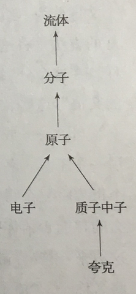

一个类似的有力的抽象是化学键。我们将利用这个抽象来估算对人体和现代社会来说很关键的一个量：燃烧氢和碳原子（碳氢化合物）释放的能量。碳氢化合物可以抽象为不断重复的 CH2 单元的链：


燃烧一个 CH2 单元需要氧（O2) 并释放二氧化碳（CO2），水和能量：

```
CH2+3/2O2 → CO2+H20+能量
```

对于 8 个碳原子的碳氢化合物 一一 比如辛烷，这是发动机燃料的主要成分 一一 只要将上述反应乘以 8：

```
(CH2)8 +12O2→8CO2+8H12O+很多能量
```

燃烧一个 CH2 单元能释放出多少能量？为了进行这个估算，利用结合能表。这个能量是打破（不是形成）一个化学键需要的能量。这个表的第一列已经用到了抽象。例如，不存在唯一的碳氢（CH）结合能：甲烷的碳氢键和乙烷的碳氢键是不同的。但为了这个概念的可重复性，我们忽略了这个差别 —— 我们将其置于抽象的门槛之下 —— 将其抽象为碳氢键。

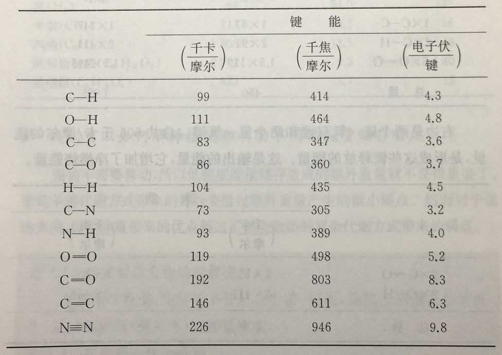

「千卡/摩尔」这一列给出了用千卡表示的每摩尔碳氢键的结合能。1 千卡大约是 4000 焦耳，1 摩尔的键数为阿伏伽德罗常数（≈6×10^23) 。 「电子伏/化学键」这一列给出用电子伏表示的每个键的结合能。1 电子伏为 1.6×10^(-19) 焦耳。这个单位适合衡量原子的能量，因为大部分的结合能都在易于处理的几个电子伏范围内。

我们用下图来表示燃烧一个碳氢单元的能量。


反应的左边是一个碳-碳键，两个碳-氢键，1.5 个氧-氧双键。（碳-碳键是将 CH2 单元中的碳与相邻单元中碳東缚在一起的键）。共计  460 千卡/摩尔，就是打破这些键所需的能量。这是输入的能量，它减少了净燃烧能量。


右边是两个碳-氧双键和两个氢-氧键。总共 606 千卡/摩尔的能量，是形成这些键释放的能量。这是输出的能量，它增加了净燃烧能量：


释放的净能量为（606-460) 千卡，即大约每摩尔 CH2 释放 150 千卡。或说，大约每个 CH2 单元释放 6 个电子伏 —— 大约是 1.5 个化学键的能量。用单位质量的能量而不是用单位摩尔来表示燃烧所释放的能量也是很有用的。1 摩尔 CH2 单元重 14 克。因此，150 千卡/摩尔大约是 10 千卡/克或 40 千焦耳/克。这个能量密度值得记住，因为这给出了燃烧油脂和汽油或吃下脂肪后释放的能量（尽管脂肪不是纯的碳氢化合物）。

下表给出了植物和动物燃料的燃烧能（将纯碳氢化合物包括在内是为引起兴趣）。饱和脂肪酸是动物脂肪的主要成分；动物的能量储存在可以和汽油的能量密度相比拟的物质中 一一 大约是 10 千卡/克。另一方面，植物将能量储存在淀粉中，这是葡萄糖单元构成的链；葡萄糖的能量密度只有大约 4 千卡/克。食物中碳水化合物（糖和淀粉）的能量密度值也值得记住。这明显低于脂肪的能量密度：对提供我们能量来说，食用脂肪比食用淀粉要快得多。


➤ 我们可以如何解释植物和动物不同的能量储存密度？

植物不需要移动，所以低密度能量储存造成的额外重量就不是很重要了。葡萄单糖代谢方式带来的好处要胜过额外重量产生的微小弱点。然而对于动物来说，较小体重带来的优点超过了燃烧脂肪的复杂代谢方式带来的弱点。

题 2.1 估算普通食物的能量密度。在美国学校里，传统的午餐是花生酱、奶油、果酱三明治。估算花生、奶油和果酱（或果冻）的能量密度。

题 2.2 花生奶油作为燃料。假设你的身体可以将一勺（约15克）花生奶油的燃烧能全部转化为机械能，你可以爬多少级楼梯？

题 2.3 草的生长速度。草的生长速度有多快？这个速率是受水的限制（典型的降水量）还是阳光的限制（典型的太阳光通量）?

### 2.2 扔硬币游戏

科学的发展给了我们原子、化学键和结合能等抽象概念。但是，我们常常会面对一些问题，需要进行新的抽象。我们将通过分析扔硬币游戏来发展这个技巧。在这个游戏中，两个游戏者轮流扔一个硬币，先扔出正面者获胜。

➤ 第一个游戏者获胜的概率有多大？

首先通过做游戏来获得一些感觉。第一轮游戏的结果是：

```
TH
```

第一个游戏者扔出的是反面（T），因此没能获胜，第二个游戏者扔出的是正面（H），因而获胜。

游戏重复很多次后会给我们揭示一些图像或给我们一些如何计算概率的建议。然而，将一枚真实的硬币反复扔很多次会乏味至极。电脑可以模拟这个游戏，用伪随机数来代替硬币。下面是电脑程序产生的几轮游戏结果。每一行开头都用 1 或 2 表示是哪个游戏者贏。数字后面是扔硬币的结果：

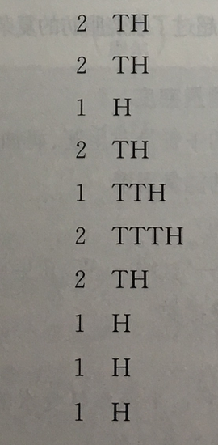

在这 10 轮游戏中，每个游戏者都贏了 5 次。一个合理的假设是每个游戏者都有相同赢得游戏的机会。但是，这个假设只是基于 10 次游戏，不可能有太高的可信度。让我们尝试 100 次。现在甚至只是数贏的次数就让人很乏味了。我让电脑来计数：结果第一个游戏者赢了 68 次，第二个游戏者赢了 32 次。第一个游戏者贏的概率接近 2/3，而不是 1/2。

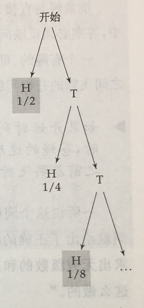

为了得到准确的值，我们用树图来表示游戏交替出现的结果。每一层表示扔一次硬币。当有一个游戏者扔出正面，游戏就在一个树叶结束。有阴影的树叶表示第一个游戏者赢 一一 比如是 H，TTH，或 TTTTH。这些获胜的概率是 1/2(H)，1/8(TTH）及 1/32(TTTTE）。

所有这些获胜概率的和就是第一个游戏者获胜的概率：

```
1/2+1/8+1/32+……
```

为了不用公式求出这个无穷级数的和，我们来进行一个抽象：注意到在每层向下时，树图都包含一个自身的拷贝。（在这个问题中，抽象在同样的问题中不断被使用。在计算机科学中，这种结构称为循环。）因为如果第一个游戏者扔出的是反面，则第二个游戏者是以获胜概率为 p 的第一个游戏者的位置开始游戏。

为了从这个比较中得到好处，让我们给这个可重复的概念一个名称，即第一个游戏者获胜的概率，记为 p。则第二个游戏者的获胜概率为 p/2：因子 1/2 是第一个游戏者扔出反面的概率，因子 p 是第二个游戏者获胜的概率（第一个游戏者在第一次扔出的是反面而失去机会的情况下。）

因为不是第一个游戏者获胜，就是第二个游戏者获胜，两个概率之和等于 1:


其解为 p=2/3，正是 100 次游戏模拟的结果。抽象解与直接求无穷多个概率和相比的好处在于洞察。在抽象解中，答案必须反映问题的本质。几乎不会有任何多余的东西。

一个有趣的、可以说明同样问题的例子来自在两列相向而行的列车之间飞舞的苍蝇问题。如果开始时列车相隔 60 英里，列车的速度都是 20 英里/小时，苍蝇的速度是 30 英里/小时，苍蝇在两列火车相撞而惨死之前总共飞行多少距离？（抱歉物理问题经常是如此暴力。）

听说这个问题，冯·诺依曼，博弈论和现代计算机的开创者，立刻就给出了正确的距离。一个同事说，「太快了」。「所有人都在试图求出无穷级数的和。」「那么做有什么问题？」冯·诺依曼说道，「我就是这么做的。」

在题 2.7，你可以求出无穷级数，或通过洞察力求解。

题 2.4 利用抽象方法求出几何级数的和。利用抽象方法求出无穷几何级数的和：

```
1+r+r^2+r^3+……
```

题 2.5 利用几何级数的和。利用题 2.4 验证第一个游戏者获胜的概率为 2/3，与我们用抽象方法得到的一致。

```
p=1/2+1/8+1/32+……
```

题 2.6 嵌套的平方根。求出下列算术和平方根的无穷混合的值：


题 2.7 两列火车与一只苍蝇。对于苍蝇和逼近的列车问题（章节 2.2），直接求无穷级数，或通过洞察力求解。验证两种方法的结果一致！

题 2.8 电阻网络。在下列 1 欧姆电阻的网络中，A，B 两点之间的电阻是多少？这个测量是通过连接两点的欧姆表得到的。


### 2.3 抽象的目的

像几何级数（题 2.4）或电阻网络（题 2.8）一样，扔硬币游戏（章节 2.2）包含了自身的复制。注意到这种重复会极大地简化分析。抽象还有第二个好处：能使我们站在更高的位置来看待一个问题或情形。抽象让我们看到表面上毫无关系的事物之间的相似结构。举例来说，让我们来重新审视一下在章节 1.6 中进行直觉估算时介绍的几何平均。两个非负数 a 和 b 的几何平均定义为：

```
几何平均=√(a·b)
```

之所以称为几何平均是因为其具有这样一种赏心悦目的几何结构。将个圆的直径分为两段，a 和 b，然后作一个直角三角形，其斜边为圆的直径。则三角形的高为两个长度 a 和 b 的几何平均。几何平均会在令人惊讶的地方不断出现，包括海边。当你站在海边眺望远处时，你看到的就是几何平均。题 2.9 中，到地平线的距离就是两个重要长度的几何平均。

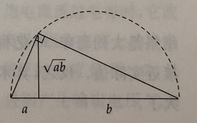

对我来说，最令人惊奇的是其出现在高德纳（Donald Knuth)（排版系统 TeX 的作者）教的课程「编程与问题解决研讨班」上。这个课程通过一系列的「两周问题」的讲授，来帮助一年级博士生从本科生的作业问题过渡到博土生的研究问题。一个回家作业也许需要 1 小时。一个研究课题需要，比如说 1000 小时：大约是一年的工作，同时可以做一些其他的课题。（几个课题合并起来变成一个博士。）在这个课程中，每一个两周模块需要大约 30 小时 一一 近似是这两个极端情况的几何平均。这些模块正是帮助我们从作业跨越到研究的桥梁的正确长度。

题 2.9 到地平线的距离。当你站在海边时，离地平线有多远？提示：成人看到的距离要比儿童看到的更远。

题 2.10 到一艘船的距离。站在海边，你正好能看到船上的 10 米桅杆。这艘船有多远？

更多的证据表明几何平均是一个有用的抽象，甚至当并没有一个几何构造来产生这个平均时仍会出现这个概念，比如在进行直觉估算的时候。我们曾经在章节 1.6 用这个方法估算过人口密度及美国人口。

让我们再来练习下估算美国进口的石油 一一 每年多少桶 一一 不使用章节 1.4 中的分而治之法。这个方法要求直觉给出一个下限和一个上限。我的直觉告诉我，如果进口石油少于每年一千万桶会令人相当惊奇。至于上限，如果进口量大于每年一万亿桶则会让我直觉感到震惊 一一 一桶油已经很多了，一万亿是一个巨大的数。

我对这个量的最佳猜测是上限和下限的几何平均：

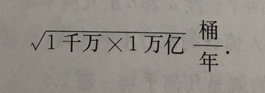

结果是大约每年 30 亿桶 一一 与我们用分而治之法的估算很接近，并接近实际值。反之，算术平均将给出每年 5000 亿桶的估算，这就太大了。

题 2.11 算术平均 —— 几何平均不等式。利用几何平均的几何图示证明，a 和 b（假定非负）的算术平均总是大于或等于其几何平均。什么时候这两个平均相等？

题 2.12 带权重的几何平均。a 和 b 算术平均 (a+b)/2 的一个推广是给 a 和 b 加上不同的权重。什么是几何平均的类似推广？（在题 6.29，你估算小球从桌上掉到地上的接触时间时就会出现带权重的几何平均。）

### 2.4 类比

因为抽象如此有用，所以如果有一个进行抽象的方法将会很有帮助。一种途径是在两个体系之间构建类比。每个共同的特征都导致一种抽象；每个抽象都将一个体系的知识和其他体系的知识联系起来。一个知识的片段有了双重的作用。就像一个心灵杠杆，类比，或者更一般地说抽象是智慧的放大器。

#### 2.4.1 电学和力学类比

一个包含很多抽象、可以让我们练习的例子是弹簧-质点体系和电感-电容（LC）电路之间的类比。


在电路中，电源一一左边的 Vin 提供了流过电感（导线绕在铁棒上）和电容（两个被空气隔开的金属片）的电流。当电流流过电容时，它改变了电容器上的电荷。「电荷」这个词可能有点误导，因为电容上的净电荷为零。「电荷」意味着电容器的两个极板携带相反的电荷 Q 和 -Q，且 Q≠0。电流改变电荷 Q。这些电荷产生电场，进而产生输出电压 Vout。

```
Vout=Q/C
```

其中 C 是电容。


对于我们，电路不如弹簧-质点体系熟悉。然而，通过构建两个体系之间的类比，我们可以将对力学体系的理解用于对电路体系的理解。对力学体系，基本的变量是质点的位移 x。而在电学体系中，则是电容上的电荷 Q。这些变量是类似的，因此其导数也是类似的：速度（u）是位置的导数，应当类比于电流（I），即电荷的导数。

我们来构建更多的类比桥梁。速度的导数，即位置的二阶导数，是加速度（a）。因此，电流的导数（dI/dt）是与加速度类似的量。我们很快就会发现，这个类比在寻找电路振荡频率时很有用。这些变量描写了体系的状态及状态如何变化：这称为运动学。没有造成运动的原因 —— 即动力学一一则体系是静止的。对力学体系，动力学来自力，力产生加速度。

```
a=F/m
```

加速度类似电流的变化 dI/dt，给电感加上电压就会产生这种变化。对于电感，其服从的关系是（类似于电阻的欧姆定律）：

```
dI/dt=V/L
```

其中 L 是电感系数，V 是加在电感上的电压。根据两个关系的相似结构，力 F 和电压 V 应该是相似的。的确，这两个量都描写运动效果。类似地，质量和电感系数是相似的：它们都描写对运动效果的抵抗。质量和电感系数在另一方面也是相似的，都描写动能：质量通过自身的运动，而电感通过产生磁场的电子动能。

从质量-电感的类比，我们来看看弹簧-电容的类比。这些器件都代表了体系的势能：对于弹簧，通过压缩和膨胀而蕴含能量，对于电容，通过电容器上的电荷产生静电能。力拉伸弹簧时会有「阻力」k:

```
x=F/k
```

类似地，电压给电容充电，但也会有一个「阻力」1/C：

```
Q=V/(1/C)
```

根据 x 和 Q 关系之间的相似结构，弹性系数 k 一定和电容的倒数 1/C 类似。下面的表格是我们所有的类比：

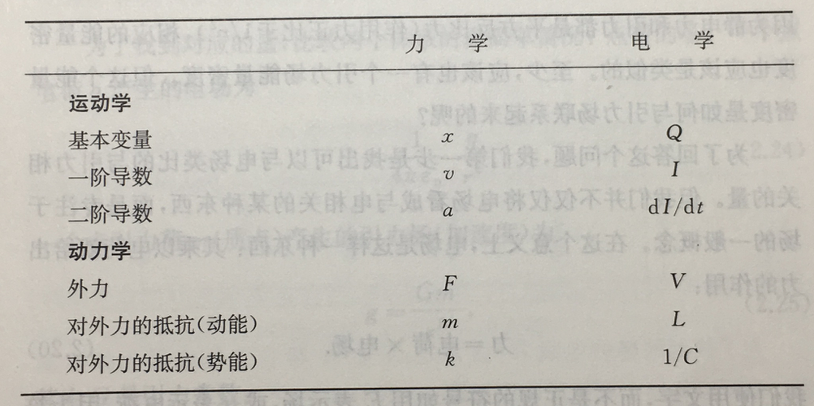

从这个表中可以看到关键结果。从弹簧质点体系的本征（角）频率 w 出发：

```
w=√(k/m)
```

然后来应用这个类比。质量 m 与电感系数 L 类似，弹性系数 k与电容倒数 1/C 类似。因此 LC 电路的本征频率为：

```
w=√(1/C/L)=1/√(LC)
```

因为类比的桥梁，一个公式，如弹簧-质点体系的本征频率，就有了双重的用途。更一般地，不论我们从一个体系中学到什么，都可以帮助我们来理解另一个体系。因为类比，每个理解都有了双重的作用。

#### 2.4.2 引力场中的能量密度

有了电学-力学之间类比的实践，我们来尝试下不太熟悉的类比：电场和引力场之间的类比。特别地，我们会将两个场的能量密度（单位体积的能量）联系起来。电场 E 具有能量密度 (εE^2)/2，其中 ε 是真空介电常数，其也出现在两个电荷 q1 和 q2 之间的静电力公式中

```
F=q1q2/(4πεr^2)
```

因为静电力和引力都是平方反比力（作用力正比于 1/r^2），相应的能量密度也应该是类似的。至少，应该也有一个引力场能量密度。但这个能量密度是如何与引力场联系起来的呢？

为了回答这个问题，我们第一步是找出可以与电场类比的与引力相关的量。但我们并不仅仅将电场看成与电相关的某种东西，而是专注于场的一般概念。在这个意义上，电场是这样一种东西：其乘以电荷就给出力的作用：

```
力=电荷×电场
```

我们使用文字，而不是正规的符号如用 E 表示场，或 q 表示电荷，因为符号会将我们的思维限制在具体的事物上，不利于我们攀登抽象之梯。使用文字将帮助我们进行类比。这一文字的形式促使我们思考：什么是引力荷？在静电学中，电荷是电场的源。在引力场中，场源是质量。因此，引力荷就是质量；进一步可见，引力场就是加速度：

```
引力场=力/引力荷=力/质量=加速度
```

的确，在地球表面，引力场强度是 g，也称为重力加速度。引力场的定义是前半个难题（我们又在运用分而治之法）。对于后半个难题，我们将用场来计算能量密度。为了这个目的，我们先重温下从电场到静电能量密度的过程：

```
E→1/2·(εE^2)
```

因为 g 是引力场，类似的有：

```
g→1/2 x某个量×g^2
```

这里，「某个量」代表我们忽略的与 ε 类似的量。

➤ 什么是 ε 的引力对应量？

为了找到对应的量，比较两个体系的最简单情况：点荷的场。一个点电荷 q 产生的电场为：

```
E=(1/4πε)·q/r^2
```

一个点引力荷 m（质点）产生的引力场（加速度）为：

```
g=Gm/r^2
```

其中 G 是引力常数。引力场具有与电场相似的结构：都是平方反比力，这正是所预料的；都正比于荷。差别在于比例系数。对于电场，比例系数为 1/4πε，对于引力场，就是简单的 G。因此，G 类似于 1/4πε；等价地，ε 类似于 1/4πG。于是，引力场能量密度就是：

```
(1/2)·(1/4πG)·g^2
```

在章节 9.3.3，当我们需要将来之不易的电磁辐射知识用于理解更复杂难懂的引力辐射时，会再次使用这个类比。

题 2.13 太阳的引力能。太阳总的引力能是多少？将太阳之外所有空间的都加起来。

题 2.14 考虑浮力的单摆周期。真空中的单摆周期（对于小振幅）是 T=2π√(l/g)，其中 l 是摆长，g 是引力场强度。现在假定单摆在流体（比如说，空气）中摆动。用个修正值来代替 g，将浮力效应包括在单摆周期的公式中。

题 2.15 比较场的能量。找出质子产生的电场和引力场的能量之比。

#### 2.4.3 并联组合

类比不仅一次次地解决问题，同时也帮助我们将表达式改写成紧凑和富有洞察力的形式。这在下面题 2.8 的无限电阻网络的分析中可以看到。


为了找到网格的电阻 R（换言之，节点 A 和 B 之间电阻表的测量值），你可以将整个网格的电阻值用一个单一电阻 R 表示。则整个网格的电阻就等于一个 1 欧姆电阻串联一对并联的 1 欧姆和 R。


下一步通常要用到并联电阻公式得到 R。R1 和 R2 并联后的电阻为：

```
R1R2/(R1+R2)
```

对于我们的电阻网格，忽略欧姆这个单位，与 1 欧姆并联的结果是 R/(1+R)。将这个组合与 1 欧姆串联，得到电阻：

```
1+R/(1+R)
```

因此我们得到关于 R 的方程：

```
R=1+R/(1+R)
```

（正值）解为R=(1+√5)/2，这就是黄金分割比例 Φ（约1.618）。因此，用 1 欧姆电阻构建的电阻网格，其电阻值为 φ 欧姆。

尽管这个解是正确的，但忽略了一个可重复应用的概念：并联组合为了促进这个概念的重复应用，我们用下面的记号表示这个概念：

```
R1 || R2
```

这个记号是自明的，只要认识到记号「||」（由两个平行棒而来的记号）表示平行。好的记号可以帮助思考，而不是让记忆记号的用途这个过程来阻碍思考。利用这个记号，网格电阻 R 的方程变成：

```
R=1+1 || R
```

（并联组合的计算要优先于 —— 即先计算 —— 加法。）这个方程更清楚地反映了体系的结构，对它的分析，也要优于对方程：

```
R=1+R/(1+R)
```

的分析。记号「||」组织了复杂性。

一旦对概念命名，就会发现到处都出现这个概念。小时候家里买了辆沃尔沃，结果我发现街上到处是沃尔沃。类似地，我们现在来看一个与最初产生这个概念的电路相差很远的并联组合例子。比如说，两个连接的弹簧的弹性常数（题 2.16）：


题 2.16 作为电容器的弹簧。利用弹簧和电容器之间的类比（章节 2.4.1），解释为什么串联的弹簧可以用并联组合公式来计算弹性常数。另一个令人惊讶的例子是两个质点的弹簧质点体系。

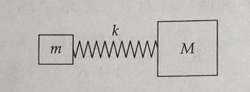

本征频率 w 不用记号「||」的话可以表示为：

```
w=k(m+M)/mM
```

这个形式看上去有点复杂，但如果用了「||」这个抽象记号则变成：

```
w=k/(m||M)
```

这样频率变得更有意义。两个质点的行为像它们的并联组合 m||M：

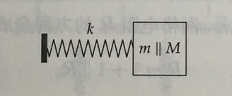

质量 m‖M 非常有用，还因此有一个特殊的名字：约化质量。我们组织复杂性的抽象方法将一个三体系统（一个弹簧和两个质点）转换成了一个较为简单的两体系统。在能够提升洞察力的符号精神下，用小写字母 m 表示较小的质量，用大写字母 M 表示较大的质量。然后写成 m||M 而不是 M||m。这两种形式得到的是相同的结果，但 m||M 的顺序会把对此的惊讶降到最低：m 和 M 的并联组合比其中每一个质量都小（题 2.17），因而相对于 M 更接近于较小的质量 m。写成 m||M 而不是 M||m，是将最重要的信息放在第一。

题 2.17 利用阻抗的相似性。利用与并联电阻的相似性，解释为何 m||M 要小于 m 和 M。

➤ 为什么上面的两个质点类似于并联的两个电阻？

答案在于质量和电阻的相似性。电阻出现在欧姆定律中：

```
电压=电阻×电流
```

电压是「外力」。电流在「外力」作用下产生。因此，最一般的形式 —— 在抽象之梯上再上一步一一就是：

```
外力=阻抗×流
```

用这种形式，牛顿第二定律变为：

```
力=质量×加速度
```

就可以将力看成「外力」，质量看成一种阻抗，而加速度就是一种流。因为弹簧可以使每一个质点振动，就像电流可以流过两个并联电阻的每一个一样，弹簧感受到的「阻力」就等于并联组合的「阻力」 —— 即 m||M。

题 2.18 三个弹簧的连接。三个弹簧串联后的有效弹性常数是多少？这三个弹簧的弹性常数分别是 2，3，6（牛顿/米）。

#### 2.4.4 作为高级抽象的阻抗

电学中的电阻已经出现过很多次了，其中隐含了一个高级的抽象：阻抗。阻抗把电阻的概念推广到了电容器和电感器。电容器、电感器以及电阻是三个线性电路元件 —— 对于这些元件，电流和电压之间的关系是用线性方程描述的；对于电阻，是代数方程（欧姆定律）；对电容或电感，则是微分方程。

➤ 为什么我们需要推广电阻的概念？

电阻是容易处理的。如果一个电路包含电阻，那么你立刻就能完整地描述电路的性质。比如说，你可以写出电路中任意一点的电压，这是电源节点的线性组合。但如果电路中包含电容器和电感器，我们还能做到吗？当然能！从欧姆定律出发，

```
电流=电压/电阻
```

可以站在更高的层次来看这个方程，并写成：

```
流=(1/阻抗)·外力
```

现在我们需要提升「外力」的观念，不仅仅限于电压。否则我们无法将阻抗的概念推广到电容器，相应的方程为：

```
电荷=电容×电压
```

但电荷不太像是一种流。至少对电容器而言，电压也不是一种「外力」：一个理想的电容器储存其电荷并永久维持相应的电压 —— 没有任何外力。通过两边微分可以解决这个问题，并得到：

```
电流=电容xd(电压)/dt
```

电流是一种流；电压改变像是一种外力。做了这样一个类比后，电容就类似于电阻的倒数。

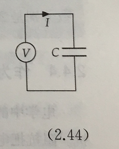

为了让类比定量，我们给电容器加一个最简单的电压，其形式不因微分而改变：

```
V=V0·e^(jwt)
```

其中 V 是输入电压，V0 为振幅，w 为角频率，j 为虚数单位 √-1。电压 V 是复数；但实际电压理解为这个复数的实部。找出电流 I（即流）和 V（外力）的关系，我们就把阻抗的概念推广到了电容器。

➤ 如果用这个指数形式，我们如何表示更熟悉的振荡电压 V1coswt 或 V1sinwt 呢？其中 V1 为实数电压。

从欧拉关系出发：

```
e^(jwt)=coswt+j·sinwt
```

为了得到 V1coswt，在 V=V0·e^(jwt) 中令 V0=V1。则：

```
V=V1(coswt+j·sinwt)
```

因此 V 的实部就是 V1coswt。想得到 V1sinwt 需要一点技巧。令V0=jV1 就可以了：

```
V=jV1(coswt+jsinwt)=V1(jcoswt-sinwt)
```

实部为 -V1sinwt，除去负号就是我们想要的。正确的振幅应取 V0=-jV1。

总结一下，所用的指数形式可以简洁地表示我们更熟悉的正弦和余弦信号。用指数形式，微分要比正弦和余弦简单。V 对时间的微商只是多个因子 jw，但保持 V0·e^(jwt) 不变：

利用这个变化的电压，电容方程：

```
电流=电容xd(电压)/dt
```

变成：

```
电流=电容×jw×电压
```

将此与电阻方程（欧姆定律）比较：

```
电流=电压/电阻
```

综合上述结果，我们得到电容器的阻抗：

```
Zc=1/jwC
```

这个更一般的阻抗与频率有关，称为容抗，用 Zc 表示。利用这个阻抗，我们可以描写一个包含电容器的电路中任何正弦信号的情况。这样一个紧湊的符号 —— 即容抗 Zc（或甚至 Rc）帮助了我们的思考。这个符号隐藏了电容器微分方程的细节，使得我们可以将电阻和电流的直观概念推广到更一般的电路。

最简单的包含电阻和电容的电路是所谓的低通 RC 电路。不仅因为这是最简单的有趣电路，作进一步的类比，这也将是热流的模型。让我们将阻抗的类比用于这个电路。

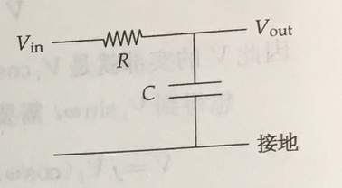

为了帮助我进行抽象，我假设将眼睛散焦。在模糊的视力下，电容器看起来就像是一个电阻并且具有有趣的阻值 Rc=1/jwC。现在整个电路看上去就像一个纯电阻电路。的确，这是最简单的这类电路，即分压电路。其行为可以用一个数来描写，即增益。这是输出电压与输入电压之比 Vout/Vin。

对于 RC 电路，如果将其看成分压电路，则：

```
增益=容抗/总阻抗=Rc/(R+Rc)
```

因为 Rc=1/jwC，因此增益变成：

```
增益=(1/jwC)/(R+1/jwC)
```

分子、分母同乘因子 jwC 后，增益简化为：

```
增益=1/(1+jwRC)
```

➤ 为什么这个电路叫作低通电路？

在高频（w→∞），分母中的项 jwRC 使增益趋于零。在低频（w→0），项 jwRC 消失使增益趋于 1。即高频信号被电路抑制，而低频信号可以几乎不受影响地通过。这样一种抽象方式，即电路的高级描写方式使得我们得以理解电路，而不至于被淹没在方程之中。在研究了时间常数这个概念后，我们将把对这个电路的理解推广到热学系统。

增益包含的电路参数以 RC 乘积的形式出现。在增益的分母中，jwRC 和 1 相加；因此，jwRC 和 1 一样都没有量纲。因为 j 没有量纲（是个纯数）, wRC 必须是无量纲的。因此，乘积 RC 具有时间的量纲。这乘积是电路的时间常数 —— 通常用来 τ 表示。

时间常数有两个物理解释。为了给出这些解释，假设我们用常数 V0 的输入电压对电容器充电，最后（经过无限长时间），电容器被充到输入电压（Vout=V0），并具有电荷 Q=CV0。然后，在 t=0，通过将输入端接地使输入电压变为零。


电容器就开始通过电阻放电，其电压按指数衰减，如下图所示。经过一个时间常数 τ 之后，电压与初始值相比下降了因子 e —— 即从 V0 下降到 V0/e。这个 1/e 倍是我们关于时间常数的第一个解释。并且，如果电容器电压按初始时刻（即紧接着 t=0）的速率衰减，则经过一个时间常数 τ 之后，电压将下降到零 —— 这是时间常数的第二个解释。


时间常数的抽象隐藏了或者说抽象掉了产生它的细节：在这儿就是电阻和电容。其他的非电路系统同样可以有一个时间常数，但产生的机制是不同的。因为并没有限制于电路系统，关于时间常数的深层次理解可以帮助我们将对低通滤波电路的理解推广到非电路系统，尤其是我们可以用来理解热学系统中的热流。

题 2.19 电感的感抗。一个电感具有如下的电压-电流关系：

```
V=L·dI/dt
```

其中 L 是电感。求电感的感抗（依赖于频率）。然后，就可以分析任何线性电路，并将其看成只包含电阻的电路。

### 2.4 类比

#### 2.4.5 热学系统

RC 电路可以作为热学系统模型 —— 尽管热学系统并不是明显地和电路有关。在热学系统中，是温差（与电压类似的量）导致了能流。能量流用不太时髦的词来说，就是热流。并且，热流正比于温差一一正如电流正比于电压一样。在这两个系统中，流都正比于驱动力。因此，热流可以用电路的类比来理解，特别地，可以用低通滤波电路来理解。


举例来说，我常常会泡一杯茶，但由于比较烫而忘了喝。像电容放电样，茶会慢慢冷却到室温而没法再喝。热量通过杯子流失了。杯壁起到了热阻抗的作用；与 RC 电路类比，将热阻抗用 Rt 表示。

热量储存在水和杯子里，水和杯子起到了热库的作用。是这个热库而不是电荷库提供了热量的储存，我们将其表示为 Ct（这样，杯子起到了热阻抗和热容器的作用。）阻抗和容器是可转换的概念。与 RC 电路类似，乘积 RtCt 是热学时间常数 τ。为了估算 τ，我们可以进行一个家庭实验（这个方法我们曾在章节 1.7 用过）。

先加热一杯茶当它冷却时，画出茶温和室温之间的温度变化。以我丰富的饮茶经验，杯可享用的热茶冷却半小时就变成温茶。为了量化这些温度，可享用的热茶温度约在华氏 130 F (55℃），室温在华氏 70 F (≈20℃），温茶约在华氏 85 F (30℃）。

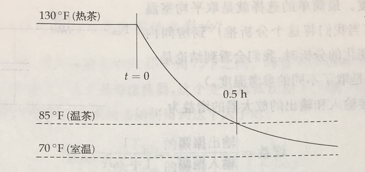

➤ 根据这些数据，这杯茶的热学时间常数大约是多少呢？

经过一个热学时间常数后，温度下降的因子为 e（正如经过一个电学时间常数后，电压下降的因子为 e 一样）。对于我这杯茶，茶温和室温之间一开始的温差是华氏 60 °F：

```
可享用的茶温-室温=60 °F
```

经过半小时，如果茶在微波炉中冷却，温差下降到华氏 15 °F 度：

```
温热的茶温-室温=15 °F 
```

因此，在半小时内温差下降了 4 倍。如果下降一个典型的因子 e（约 2.72）倍则将只需要较短的时间：或许是 0.3 小时（约 20 分钟）而不是 0.5 小时。更精确的计算是用 ln4 来除 0.5 小时，这给出 0.36 小时。然而，在输入数据如此不精确的情况下，没有什么必要去做如此精确的计算。因此，我们可以粗略地估算热学时间常数 τ 约为 0.3 小时。

利用这个估算，我们就能理解经常发生的一杯茶在微波炉中孤独地待了几天所发生的情况，这当然取決于每天室温的变化。这个分析将成为我们分析房间里一天温度变化的模型。

➤ 杯茶是如何随着一天的温度变化而变化的，如果 τ=0.3 小时？

首先，建立电路的类比。输出仍然是茶温，输入则是变化的室温。然而，接地端，则是我们的参考温度，不能也是室温。我们需要一个恒定的参考温度。最简单的选择就是取平均室温「T平均」。（当我们将这个分析推广到房间内的温度变化的分析时，我们会看到结论是一样的，只是取了不同的参考温度。）

连接输入和输出的放大器的增益为：

```
增益=输出振幅/输入振幅=1/(1+jwτ)
```

输入（室温）按照每天 1 个周期的频率 f 变化。因此，增益表达式中无量纲参数 wτ 约为 0.1：


这个系统由一个低频信号驱动：w 没足够大到使得 wτ 接近于 1。这个增益表达式提醒我们，茶杯对于温度变化来说是个低通滤波器。它将这个低频输入温度几乎没有改变地传输到了输出 —— 茶温。因此，内部（茶）温几乎完全和外部（室）温一样。

另一个极端情况是房子。与茶杯比较，房子具有大得多的质量，因而具有更大的热容量。相应地，房子的热学时间常数 τ=RtCt，也要比茶杯的长得多。对一个希腊式房子的研究给出结果 τ≈86 小时，大约 4 天。这些房子一定具有很好的绝热效果！当年我在开普敦教书的时候，那里阳光明媚，甚至在冬天房子都没有暖气，我住的房子隔热不是很好，热学时间常数大约只有 0.5 天。

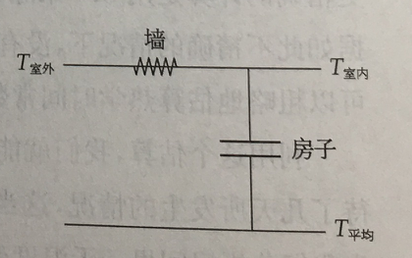

对于开普敦的房子，无量纲常数 wτ 比茶杯的相应常数要大得多：


➤ wτ≈3 对室内温度会有什么影响？

在冬天，室外温度在华氏 45 F 到 75 F 之间。峰谷到峰顶有华氏 30 F 的变化，经过房子这个低通滤波器，这个变化就被压缩了大概 3 倍。下面通过估算增益的大小来给出如何得到这个因子的。


一般地，当 wτ 远大于 1，增益的大小近似为 1/wτ。因此，室外温度峰谷-峰顶的华氏 30 F 变化就变成室内温度的华氏 10 F 的变化：


➤ 室内平均温度是多少？

可以得到室内平均温度等于室外平均温度！为了知道原因，我们来仔细考虑参考温度（即接地的热学类比）。之前，在分析遗忘的茶杯时，我们的参考温度是室内平均温度。因为我们现在试图要确定这个值，就让我们使用已知的、方便的参考温度一一比如，较冷的 10℃，这是以摄氏或华氏（50F）取整后的值。

输入（室外温度）冬天在华氏 45 F 到华氏 75 F 之间变化。因此，可以将其分为两部分：1）通常的峰谷-峰顶之间华氏 30 F 的变化；2）稳定的华氏 10 F 的变化。


稳定的部分是室外平均温度华氏 60 F 与参考温度华氏 50 F 之差。

我们分别来处理每一部分一一这里我们再次使用了分而治之法。我们只需分析变化的部分：输入信号通过房子这一低通滤波器后，由于 wτ≈3，振幅会有一个显著的压缩。与此相反，不变的部分，即室外平均温度，按照定义频率为 0。因此，相应的无量纲参数 wτ 严格为 0。

当这一信号通过房子这个低通滤波器时增益为 1。因此，平均的输出信号（即室内平均温度）也是华氏 60 F：相对参考温度华氏 50 F 的稳恒部分，华氏 10 F 是相同的。

室内温度的华氏 10 F 峰谷-峰顶变化是围绕华氏 60 F 变化的。因此，室内温度的变化范围是华氏 55 F 到华氏 65 F。在室内，当我并不常跑步，或者说不产生太多热量时，我觉得 68 F（20℃）的温度让我感到舒适。正如这个热流的电路模型预言的，当我住在那个房子里的时候，日夜都只需要穿一件毛衣。（关于更多 RC 类比在建筑中的应用，见参考文献 [13]。）

题 2.20 什么时间房间里最冷？根据增益的一般表达式，1/(1+jwτ)，开普敦的房子在一天中什么时间是最冷的？假定室外是半夜最冷。

### 2.5 小结及进一步的问题

几何平均，阻抗，低通滤波器 —— 这些概念都是抽象的。抽象可以把表面上看起来杂乱无章的细节变成一个有机的高级结构，通过这个结构，可以让我们得到超出其来源的知识和洞察力。通过构建抽象，我们放大了我们的智慧。

题 2.21 从圆到球。在这个问题中，首先从圆的周长得到面积，然后用类似的分析得到球的体积。a）将半径为 r 的圆分解成楔形的饼图。然后将其拆开。


利用拆开的图形和已知的圆周长为 2πr 来证明圆面积为 πr^2。

b）将讨论推广到半径为 r 的球：由已知的球表面积为 4πr^2 推出球的体积。（这个方法是古希腊人发明的。）

题 2.22 LRC 电路的增益。利用在题 2.19 中得到的电感的感抗来求典型 LRC 电路的增益。在这个结构中，输出电压是在电阻两段测量的，这是一个低通滤波器，高通滤波器还是个波段滤波器？


题 2.23 连分数。计算连分数：


将此题与题 2.8 比较。题 2.24 指数塔

计算：

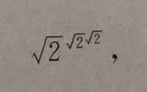

其中，a^bc 定义为 a^(bc)。

题 2.25 同轴电缆。世界各地的物理和电子实验室里，连接设备和信号传输的最好方式是使用同轴电缆。标准的同轴电缆，RG-58/U，其单位长度的电容为100 皮法/米，单位长度电感为 0.29 微亨/米。可以看成是一个很长的电感-电容网络：


将多大的电阻 R 放在末端（与最后的电容并联）能使电缆看起来像无限长的 LC 电缆？题 2.26 UNIX 和 LINUX。迈克·甘卡兹（Mike Gancarz）的《UNIX 哲学》（The UNIX Philosophy），或《Linux 和 UNIX 哲学》（Linux and the Unix Philosophy），在这些（密切相关的）操作系统的设计和哲学中找出抽象的例子。