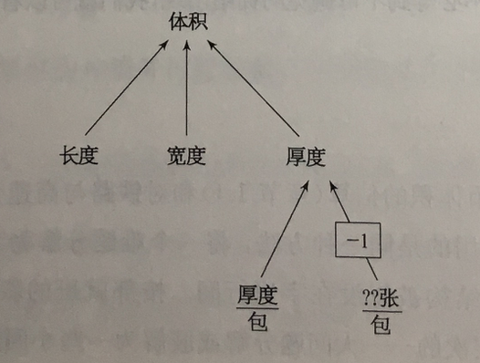
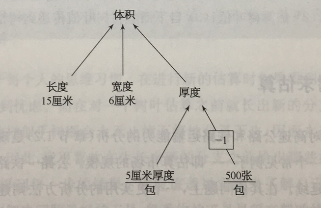

第一篇 组织复杂性

当面对一团乱麻时，你不可能发现很多线索。你需要将其重新组织。举常见的例子来说，如果这是你的书桌，或者是晚宴后的厨房，你可能从一个角落开始清理，然后移到下一个区域。你所应用的正是分而治之法（第 1 章）。

进而，在你书桌的每一个区域，你很可能并不是将所有的文件材料随意地放在一个文件夹中，你会按照不同的主题将它们归档。在你的厨房，你会将银器和瓷器分开摆放。在银器类中，你又会将叉和勺分开。在进行这些高级分类时，你应用的正是抽象化的分析工具（第 2 章）。

利用这两种工具，我们就能组织并把握复杂性。

## 0101. 分而治之法

正如帝国的统治者们深谙的道理，不必一下子征服所有的敌人，而是应该逐一征服他们，你可以将一个难题分解为一些小的、可以处理的问题。这个过程体现了我们的第一个分析工具：分而治之法！

1『又见「分解」能力的重要性，自从听了郑烨的「任务分解」板块后，对此点感触实在太多。能讲「东西」分解成颗粒度很细的都是大牛，做单元测试要分解、重构要分解、软件设计要分解、OKR 要分解，等等。』

### 1.1 热身

我们将通过一系列复杂程度逐渐增加的问题来说明如何使用这个工具。从日常生活中的估算开始吧。

➤ 一元纸币的体积近似是多少？

体积是难以估算的，但是，我们仍然应该作一快速的估算。即使一个不太精确的估算，也将帮助我们建立进行实践的勇气。并且，将我们的估算与更精确的估算比较将帮助我们校准我们内部的测量基准。为了逼自己，我常常想像有一个抢劫犯拿着一把刀顶着我的肋部，要求道，「快给出你的估算，不然要你的命！」于是我就判断一元纸币的体积很可能在 0.1 和 10 厘米<sup>3</sup>之间。

这个估算范围有点宽，最大、最小估值相差达到 100 倍。作为对比元纸币的宽度大概在 10 到 20 厘米之间 —— 这只有 2 倍的差别！体积的估算范围要大于宽度的估算范围，因为我们并没有一把类似的可以直接量体积的「尺」，所以相对长度而言，我们对体积的估算较为陌生。幸运的是，纸币的体积是三个长度的乘积：

```
体积=长度宽度×厚度
```

难以估算的体积变成了相对容易的对三个长度的估算 —— 这就是分而治之法的好处。前两个长度的估算不难。长度看上去在 6 英寸或 15 厘米左右，宽度看上去大概 2 到 3 英寸，或大概 6 厘米。在继续对第三个尺度估算之前，我们先来讨论单位的问题。

➤ 用英制好还是用公制好？

在估算的时候使用对你来说更为直观的单位，你的估算结果将更为准确。因为从小在美国长大，我判断长度更多的是用英寸、英尺、英里而不是用厘米、米、公里。但在需要用到乘除法计算的时候 一一 大多数计算会用到乘除法 —— 我会将英制转换为公制（最后常常会再转换到英制）。但你可能幸运地只需用公制来思考，因而可以只在一种单位制中进行估计和计算。分而治之法的第三个量 一一 厚度，是难以判断的。一张纸币是很薄的，只有一张纸那么薄。

➤ 但是「一张纸的厚度」究竟是多少呢？

这个厚度太小了，很难有直观的把握，不容易判断。但是一叠几百张纸币的厚度就容易把握了。手头没有那么多纸币，我就用纸代替。一包纸，有 500 张，大约有 5 厘米厚。于是，一张纸的厚度大概是 0.01 厘米有了对厚度的估算，纸币的体积近似为 1 厘米<sup>3</sup>：


尽管更加细致的计算甚至可以考虑到纸币和普通纸张的纸质不同，也可以考虑纸张的平整度等，但这些细节反而会使主要结果变得模糊：一元纸币其实就是将 1 厘米的东西砸平后的样子。为了验证刚才的估算，我用尽手指的力气将一元纸币折叠成大约 1 厘米见方的立方体，因此得到其体积近似为 1 厘米。分而治之法得到的结果是相当精确的。

在前面的分析中，你可能注意到了符号「=」和「≈」，以及这两个符号使用上的细微差异。本书从头至尾关注的是洞察力，而不是精确度。为此目的，我们将使用好几个等价符号，来描述某种关系成立的精确度和忽略的部分。下面按描写完整性减少（通常也是适用性增加）的顺序给出这些符号。


作为这些符号的例子，对于圆，有 A=xr2 和 A≈4r2（面积近似为外切正方形的面积）以及 A~r2。对圆柱体，有 V~hr2,  —— 这隐含了 V∞h 和 V∞r2。在 V∞h 的形式中，隐藏在符号 ∞ 中的因子具有长度平方的量纲。

题 1.1 一箱书的重量。一个可移动的小箱子装满书后有多重？

题 1.2 卧室里的空气质量。估算你卧室里的空气质量。

题 1.3 钱箱。在电影或现实生活中，可卡因和选票常常用一箱子 100 元钞票来购买。估算这样一箱钱的价值。

题 1.4 金条还是纸币？如果你是一个大盗，正在银行地下金库准备逃跑，你是将你的箱子装满金条还是装满 100 元的纸币？假定你能携带的最大重量是固定的。接着再假定你能携带的最大体积是固定的，重做以上分析。

### 1.2 铁路与公路

我们现在已经进行了热身并准备好用分而治之法去进行更多估算。我们下一个估算是关于交通的。每当我开车行驶在去往纽约肯尼迪国际机场的拥挤道路上时，就会有这个想法。这条高速公路是罗伯特·摩西（Robert Moses）规划的。正如其传记作者罗伯特·卡罗（Robert Caro）所描述的，摩西当年负责范威克高速公路的建设，一些年轻的规划师建议铺设一条铁路线到新机场（即现在的组约肯尼迪国际机场）以应对将来的大流量交通。但如果认为铁路线造价太高的话，鉴于土地价格仍然便宜，他们建议市政府在征地建设公路时，将其多拓宽 50 英尺，以备将来建设铁路线之用。摩西否决了这个省钱的方案。果不其然，仅仅在开通后的几个星期，二战后不久，这条没有铁路的新高速公路就达到了容量峰值。

让我们利用分而治之法来比较高峰时段铁路和公路的运输能力。运输能力指运输乘客的效率（单位时间可输送的乘客）。

首先我们来估算高速公路上一条车道的运输能力。我们可以使用在许多驾驶课程上所教并在驾照考试中被验证的规则：2 秒跟随规则。这个规则推荐我们每辆车和前车之间留 2 秒的行驶时间。如果驾驶员都遵守这个规则，那么高速公路上每条车道每 2 秒通过一辆车。至少在美国，每辆车大约输送 1 名乘客，因此运输能力是每 2 秒输送 1 人。按小时算运输能力为每小时 1800 人：


斜线使我们看清单位的相消并可验证最后出现的是我们所需要的单位（这里是人/小时)。

这里，1800 人/小时的运输能力是近似值，因为 2 秒跟随规则并不是法定规则。晚上的平均间隔可能是 4 秒，白天可能是 1 秒，并且可能每天都有变化，每条高速公路都会有所不同。但是 2 秒间隔是一个合理的折中估算。将复杂的、随时间变化的分布用一段时间来代替是团块化的应用，这个工具将在第 6 章讨论。整理复杂性的过程总是要扔掉一些细节。如果我们将高速公路在任意时间的所有数据都拿来研究的话，就会淹没所有的洞察，幸亏我们拿不到这些数据。

➤ 一条车道的公路运输能カ与一条铁路的运输能力相比如何？

现在我们来估算一下现代化铁路系统比如法国或德国的铁路系统中一条铁路线的运输能力。我们还是将估算过程分解为一些可以处理的部分：铁路线上列车开行密度，一列火车有几节车厢，每节车厢能容纳多少乘客。

下面是我坐在椅子上给出的估算，为了避免过高估算运输能力而有所保守。一节车厢大约能容纳 150 名乘客，而一列火车可以有 20 节车厢。在一条比较繁忙的铁路线上，每 10 分钟可开行一列火车，即每小时开行 6 趟列车。因此，一条铁路线的运输能力是每小时 18000 人。


### 1.3 树图

我们对纸币体积的估算（章节 1.1）和对铁路与高速公路运输能力的分析（章节 1.2）用的是同一种方法：将一个难题分解为几个小问题。但是，整个分析的结构被淹没在字里行间。按部就班的叙述隐藏了结构。因为结构是有层次的 一一 大问题分解或肢解为一些小问题 一一 最紧湊的表示就是树图表示。树图可以让整个分析一目了然。

以下是铁路运输能力的树图。与生物学中的树不同，我们的树是倒立的。树根，即目标，位于树的最顶端；树叶，即分解得到的小问题，位于树的底部。这样的取向与我们如何分而治之问题的过程相符在第一幅图中，我们没有估计各个量的数值，而只是确认了有哪些相关量。这提示我们下一步如何做，即在图上标出三个树叶的估算值。这些估算值为毎车厢 150 人，每一列火车 20 个车厢，每小时开行 6 列火车。


然后将这些树叶的值相乘，结果就由树叶向上传递到树根。结果为 18000人/小时。完整的树图让我们一眼就看清了整个分析。这个列车运输能力的树图具有最简单的结构，只有两个层次（即树根层和第二层即三个树叶）。进一步的复杂性就需要具有三个层次的树图了，如对纸币体积的估算。先从下面具有三个树叶的两层树图出发。


然后，因为下面的原因，树图开始继续生长。



不像宽度和长度，只看一眼纸币很难给出厚度的估算。因此，我们将这个树叶进一步分解为两个树叶。连接「厚度」和「??张/包」的有向直线上标有「-1」的方框是一个新符号。这个符号在我们自下而上计算时表示相应树叶值的幂次。

这里给出为什么将「-1」写成一个数而不是上标的原因。在大多数估算的情形中需要将一些因子相乘。对每个因子而言，唯一的问题是：在计算时这些因子的幂次是多少。「-1」这个数直接给出了关于幂次的疑问。（为了避免把树图弄得过于凌乱，我们不标注最常见的幂次 1）

这个新的子树图代表下列计算一张纸厚度的方程：


-1 次幂的引入，虽然使树图变得有点复杂，但使得树叶可以表示「每包的纸张数」，而不是「每张纸的包数」这样不够直观的数。现在将对树叶的估算值代入。长度为 15 厘米，宽度为 6 厘米。一包纸的厚度为 5 厘米，一包有 500 张纸。结果给出下面的树图。



最后，我们将树叶的值传递到树根。第三层的两个树叶给出一张纸的厚度为 10^(-2) 厘米。这个值填补了之前厚度的空缺。第二层的三个节点则告诉我们纸币的体积 —— 即树根的节点 —— 为 1 厘米^3。


通过练习，你可以从最后的树图看出分析的所有步骤。例如，第二层的三个节点表示将对体积的估算分解为对三个较容易的量的估算。长度和宽度保留为树叶意味着对这两个量的估算已经足够精确。相反，从厚度分又的两个分支意味着厚度难以估算，因此将其分解为两个更熟悉的量来进行估算。树图可以将许多分析文字压缩成紧凑的形式某种我们一眼就能看清整个思路的形式。整理复杂性的过程帮助我们构建洞察力。

题 1.5 一箱钱的树图。

画出你对题 1.3 估算的树图。分三步来做：1) 画出没有树叶值的树图；2) 估算树叶值；3) 自下而上将树叶值传递到树根。