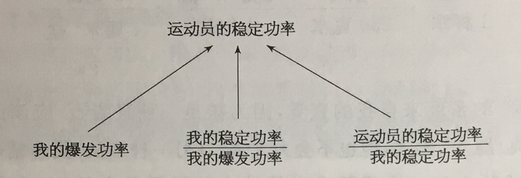

## 0101. 分而治之法

正如帝国的统治者们深谙的道理，不必一下子征服所有的敌人，而是应该逐一征服他们，你可以将一个难题分解为一些小的、可以处理的问题。这个过程体现了我们的第一个分析工具：分而治之法！

### 1.6 与直觉对话

正如你在前面的例子中看到的，分而治之法需要合理地估算树叶的值。为了确定什么是合理的，你就需要与你的直觉对话 —— 这是你在这节将要学到的。一开始对于利用直觉你会觉得奇怪，尤其是因为科学与工程被认为是理性的学科。

让我们来讨论如何进行这样的对话。例子是根据面积和人口密度来估算美国的人口。分而治之法的树图有两个树叶。（在章节 6.3.1，你会看到一个性质不同的方法，其中两个树叶是美国的州数和典型州的人口。）

面积是宽度乘高度，所以面积这个树叶又分裂成两个树叶。估算宽度和高度只需要和你的直觉有个简短对话即可，至少对生活在美国的人是这样。宽度为时速 500 英里的飞机 6 小时航程，即大约 3000 英里；如果粗略地估算，高度为宽度的三分之二，即 2000 英里。因此，面积约为 600 万英里<sup>2</sup>，用公制的话，这大约是 1600 万公里<sup>2</sup>。

估算人口密度需要与你的直觉对话。如果你和我一样，对人口密度几乎没有感觉。你的直觉可能知道，但你不能直接问你的直觉。直觉与右脑相关联，不过右脑不管语言。尽管右脑对这个世界知道很多，但无法对其用一个数值来表示，只能用感觉来表示。想要从右脑的知识库里得到什么，只能间接地问。

取一个特别的人口密度 一一 比如说 100 人/平方英里；然后询问直觉对此的观点:「哦，我那直觉敏锐的、洞察一切的、不爱说话的右脑，你如何看待 100 人/平方英里的人口密度？」直觉将会给你一个回应。继续减少可能值直到直觉告诉你，「不对，这个值感觉太低了。」

下面是我的左脑（LB）和右脑（RB) 之间的对话。

LB：你如何看待 100 人/平方英里的人口密度？

RB：感觉差不多（基于我在美国长大的经验）。

LB：知道这点很好。现在我将我的估算值降低一个 3 或 10 的因子直到你认为太低而强烈反对。（因子 3 差不多是因子 10 的一半，因为 3x3≈10。当因子 10 的跳跃过大时，因子 3 是次小的因子。) 按照这个说法 10 人/平方英里的人口密度会如何？

RB：我感觉很不对。这个估算太低了。

LB：我理解你是怎么来的。那个值对乡村的人ロ密度是有点估算过高，但对于城市人ロ密度就大大低估了。因为你感觉不对了, 我们就变动得慢一点，直到你强烈反对。那么 3 人/平方英里怎么样？

RB：我感觉非常不对。如果真实数据低于这个值，我会相当惊讶。

LB：谢谢。对于下限，我停留在 3 人/平方英里。现在我往上限走。你说 100 人/平方英里是很可能的。那么 300 人/平方英里怎么样？

RB：我感觉非常不对。这个估算似乎太高了。

LB：我知道你的意思了。你的回应提醒了我，新泽西和荷兰的人口密度都达到了非常密集的 1000 人/平方英里，尽管我无法保证这个值是对的。我无法想象整个美国的人口密度都达到新泽西那样的程度。因此，我将停留在这个值。我的上限是 300 人/平方英里。

➤ 你如何在上下限的基础上得到最佳猜测？

一个貌似合理的猜测是采用算术平均值，大约是 150 人/英里。但是，最好的方法是取几何平均：

```
最佳猜测=根号（下限值×上限值）
```

几何平均是下限和上限之间的中点 —— 但这是按比例尺度或对数尺度来说的，这是我们意识中固有的尺度。（想了解更多，见参考文献 [9]。）当我们整合一些由固有意识产生的数量时，几何方式是一种正确的方式。这样，几何平均是 30 人/平方英里：与上下限都相差一个 10 倍的因子。用这个人口密度计算，美国人口大约是 2 亿人。

实际人口大约是 3×10<sup>8</sup>。几乎完全根据直觉的估算结果与实际人口值只相差 1.5 倍。考虑到我们在面积和人口密度估算上的不确定性，这样的精度是相当令人惊奇的。

题 1.8 更多基于直觉的估算。利用你的直觉给出上限和下限，从而估算：a）你所能看到的附近一棵很高的树的高度；b）汽车的重量；c）浴缸里的水共有多少滴。

可能的话，将你的估算结果与实际结果或更精确的结果比较。

### 1.7 物理估算

你的直觉不仅能理解人文社会，也能理解物理世界。如果你相信直觉，你就能够发掘这个巨大的知识宝库。作为练习，我们来估算海水的含盐量（章节1.7.1），人力输出功率（章节1.7.2) 以及水的汽化热（章节1.7.3)。

#### 1.7.1 海水的含盐量

为了估算海水的含盐量，这以后将帮助你来估算海水的导电率（题 8.10），不要直接问你的直觉：「你觉得，比如 200 毫摩尔/升怎么样？」尽管这种问法在估算人口密度时很有效（章节1.6），但在这儿，除非你是个化学家，不然你得到的回答将是：「我没有任何头绪。究竟什么是 1 毫摩尔/ 升？对这个单位我没有任何经验。」反之，给你的直觉一些具体数据 —— 比如，做个家庭实验，往一杯水中加盐，直到盐水混合物尝起来和海水一样咸。

这个实验可以是思想实验或实际的实验 —— 这是使用多种方法的另一个例子（章节1.5)。作为思想实验，我来问我的直觉有关往一杯水中加不同量盐的情况。当我加了两勺盐后，直觉的反应是，「成得令人厌恶！」考虑下限，当我加 0.5 勺盐时，直觉的反应是，「不是很咸。」我就用 0.5 和 2 勺作为下限和上限。其中间值，即从思想实验得到的估算是每杯水加 1 勺盐。

我在厨房检验了这个预测。1 勺盐（5毫升）加入的话，这杯水的确具有刺激的海水味道，这与我在海里被大浪打到后吞下的海水味道一样，一杯水大约是 1/4 升或 250 厘米。按质量算，含盐量的计算结果就是下列量的乘积。

2 克/立方厘米的密度来自我的直觉，因为盐是一种轻岩石，应该比水的密度，即 1 克厘米稍大，但也不会大太多。（另一种方法，更为精确也复杂得多，尝试题 1.10。）

完成算术运算给出的结果是大约盐-水质量比是 1:25（4%）。

地球上的海洋实际含盐量大约是 3.5% —— 非常接近估算值。尽管用了大量的假设和近似，但估算结果是合理的 一一 误差大都互相抵消了。这个合理性应该会鼓励你去做一些家庭实验来获得在进行分而治之法估算时需要的数据。

题 1.9 水的密度。用你的直觉通过估算一杯水（通常1/4升）的质量来估算水的密度。

题 1.10 盐的密度。利用你在杂货店能找到的盐罐的体积和质量估算盐的密度。这个值应该比我在章节 1.7.1用直觉估算的值更精确（那里得到的是 2 克/厘米）。

#### 1.7.2 人力功率

我们第二个与直觉对话的例子是人力功率的估算 —— 这是在很多估算中都有用的功率（如题1.17)。能量和功率是进行分而治之法估算的很好例子，因为这两个量可以通过下面的方程联系起来并用相应的树图表示：

```
功=能量/时间
```

特别地，让我们来估算一个训练有素的运动员在持续的一段时间内可以产生多大功率（不是那种在几秒钟内产生的、爆发的高功率）。作为替代，我将考虑我自己的爆发功率及两个因子：



维持一个功率比产生同样大小短时间的爆发功率更难。因此，第一个因子，我的稳定功率除以我的爆发功率，应该是一个小于 1 的数，也许是 1/2 或 1/3。反之，一个运动员的稳定功率要比我大得多，可能大个 2 或 3 倍的因子。这两个因子差不多互相抵消，所以我的爆发功率应该可以和一个运动员的稳定功率相比拟。

为了估算我的爆发功率，我做一个家庭实验：尽可能快地爬楼。估计功率需要对能量和时间进行估计：

```
功率=能量/时间
```

其中能量即为我的引力势能的变化，可以进一步分解为三个因子：


我所在大学的学术大楼是一个天花板很高有楼梯的建筑，我一次跳三个阶。楼梯总高 12 英尺，或说约 3.5 米。因此，我的能量输出大约是 2000 焦耳：

```
E~65kg×10m/s2×3.5m~2000
```

量纲检查：1 J=1 kgm2/s2

剩下的树叶是时间：爬楼需要多长时间？我花了 6 秒。作为对比，几个学生只花了 3.9 秒 —— 这是年轻的力量！我的机械输出功率大约是每 6 秒 2000 焦耳，或大约 300 瓦。（为了验证这个估算是否合理，尝试题 1.12，你可以估算典型的人的基础代谢。）

这个爆发功率应该接近于一个训练有素的运动员可维持的稳定功率。实际上也是如此。举例来说，1989 年环法自行车大赛的阿尔卑一都埃（Alpe d'huez）赛段冠军得主 —— 菜蒙德（Greg Lemond），一个世界级运动员 —— 的功率达到 394 瓦（持续42.5分钟），而自行车运动员阿姆斯特朗（Lance Armstrong）在 2004 年环法自行车赛的准备阶段，功率值更高 495 瓦。但是他公开承认采用了自血回输以增强体力（他因此被剥夺了奖牌）。的确，由于自血回输的广泛采用，在 20 世纪 90 年代和 21 世纪 00 年代期间的许多自行车运动员的功率值是值得怀疑的，400 瓦代表了合理的世界级运动员的可持续输出功率值。

题 1.11 9 伏电池的能量。估算一个 9 伏电池的能量。这个能量是否足以将这个电池发射到绕地轨道？

题 1.12 基础代谢。根据我们的日常热量消耗，估算人的基础代谢题。

1.13 爬楼的能量测量。利用一块奶油中的能量，你能爬多少级楼梯？

#### 1.7.3 水的汽化热

我们最后一个物理估算有关地球上最重要的液体。

➤ 什么是水的汽化热？

因为水覆盖了地球表面如此多的部分，也因为水是大气中如此重要的一部分（云！），水的汽化热强烈地影响了我们的气候 —— 不论是通过降雨（章节3.4.3) 还是通过气温。汽化热定义为下列量的比：

```
蒸发这些物质所需的能量/物质的量
```

其中物质的量可以用摩尔、体积或者（最普通的）质量来衡量。这个定义给出了树图的结构和基于分而治之法的估算。关于物质的量，选择你容易想象的一定量的水 —— 理想的、日常生活中熟悉的量。然后你的直觉能够帮助你进行估算。因为我经常是一次烧几杯水，一杯水大概是几分之一升，我将考虑 1 升或 1 千克的水。另一个树叶，即所需的能量，需要更多的思考。这里有个通常会混淆的有关这个能量的概念是值得讨论的。

➤ 这是将水烧开所需要的能量吗？

错！这与将水烧开所需的能量无关。那个能量与水的比热 cp 有关。而汽化取决于一旦水烧开后，把水蒸干所需的能量。能量进一步分解为功率乘以时间（与我们在章节 1.7.2 讨论人力功率类似）。这里的功率可以是炉子的输出功率，时间是将 1 升水烧干的时间。

为了估算这些树叶，让我们来开一个直觉会议。关于时间，我的对话是这样的。

LB：1 分钟作为下限听起来觉得怎么样？

RB：太短了 一一 你这是把水烧开就扔炉子上不管了

LB：3 分钟怎么样？

RB：这可能是属于短的。也许这就是下限。

LB：好的。那么对于上限，100 分钟怎么样？

RB：太长了。谁会把茶放炉子上煮差不多 2 小时呢？

LB：30 分钟怎么样？

RB：有点长，不过我不会感到震惊，真是那么长时间的话只是有点惊讶。这感觉像是一个合理的上限。

我的范围因此是 3~30 分钟。中点两个端点的几何平均 一一 大约是 10 分钟或 600 秒。关于功率，我们来直接估算，不必考虑上限下限了。

LB：100 瓦感觉怎么样？

RB：太低了。这只是一个灯泡的功率！如果一个灯泡就能这么快烧开水，那我们的能源问题早就解决了。

LB：（感到需要修正了）1000 瓦怎么样？

RB：有点低。一个小电器，如电熨斗，就有 1 千瓦了。

LB：（猜测值上升慢一点）3 千瓦怎么样？

RB：这个炉子的功率感觉差不多。

我们来估算下这个功率，将其分解成电压和电流：

```
功率=电压×电流
```

电炉需要的电压是 220 伏，但在美国大部分电器是 110 伏的。标准的保险丝是 15 安培，这给我们一个大电流的概念，所以一个电炉的功率大约是 3 千瓦：

```
220V×15A ≈ 3000W
```

这个估算和直觉的估算一致，两种方法都给出了合理的结果。我们现在已经有了所有树叶节点的值。将这些值往上传递到树根，就可以得到汽化热（L汽化) 大约是 200 万焦耳/千克：


实际值大约是 2.2×10^6 焦耳/千克。这是所有液体中汽化热值最高的几种之一。当水蒸发时，会带走显著的能量，这使得水成为极佳的制冷剂。（题1.17)。

### 1.8 小结和进一步的问题

本章的主旨是：没有什么问题是真正的难题。罗马帝国和大英帝国之所以能延续统治是让被征服的民族互相对立。分而治之法将难题分解为一些小问题。（更多例子，见参考文献 [10] 和 [11]）这个工具是对社会问题和科学问题都适用的普适方法。

题 1.14 人均土地面积。估算全世界和你所在国家的人均土地面积。

题 1.15 地球的质量。估算地球的质量。然后査找资料来验证你的估算。

题 1.16 10 亿。从 1 数到 10 亿（10^9）需要多长时间？

题 1.17 出汗。估算当你用力骑车 1 个小时后需要喝多少水来弥补因为蒸发而失去的水分。提示：人做机械功的效率只有 25%。

题 1.18 铅笔画线。你用铅笔能画多长的线？

题 1.19 松针。估算一棵松树上有多少松针？

题 1.20 头发。你头上有多少根头发？