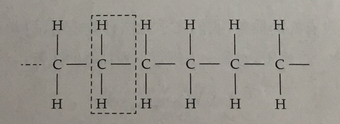
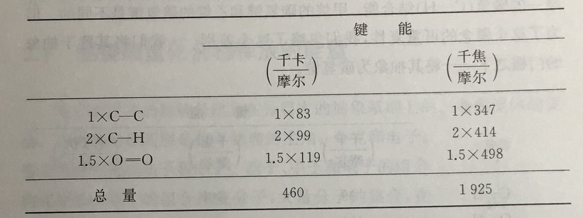
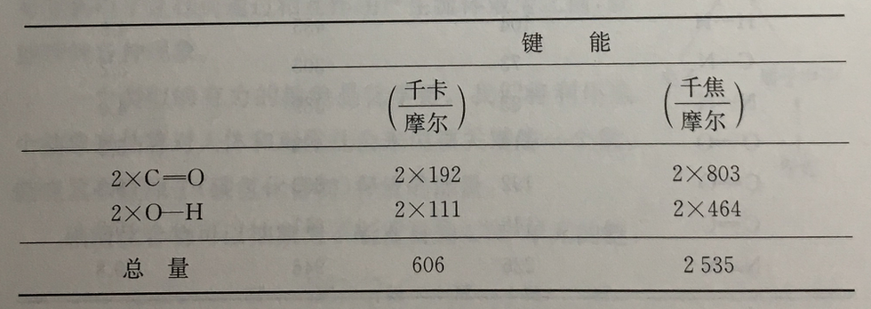
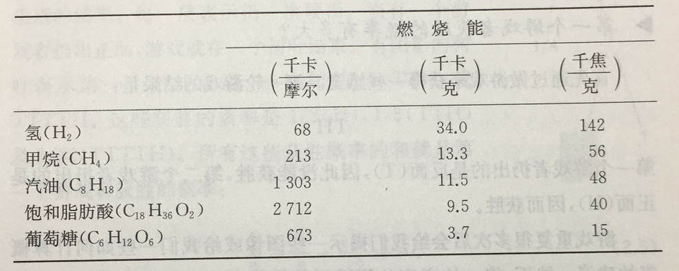

## 0201. 抽象

第 1 章介绍的分而治之法是很有力的，但仅靠这个方法还不足以组织我们这个世界的复杂性。比如，试试整理计算机的数百万个文件 —— 即使是我的手提电脑，据说至少也有 300 万个文件。如果不做任何整理把所有文件放在一个魔鬼目录或文件夹里，你可能永远都无法找到你想要的信息。然而，简单应用分而治之法，即将文件分组（按照日期将前 100 个文件分为一组，然后是其后 100 个文件等等）并不能解决混乱。一个较好的方法是将这几百万个文件分层次管理：像一棵目录和子目录的树样。在这个分层结构里，每部分都有名字，比如说，「孩子照片」或者「本书的文稿」，这些名字给了我们所需要的信息。

名称 一一 或者更技术点说，抽象，是我们整理复杂性的第二个也是最后一个工具。名称或抽象的威力来自可重复性。如果没有可重复性，这个世界将复杂得无从把握。没有抽象，我们就无法生活。我们可能会这么问，「能否请你把那个黏着四条粗木棍的木板移到大的、白的、塑料圆盘这边来，不要弄翻了？」而不是说，「能否请你把椅子移到桌子这边来？」这些名称「椅子」、「移动」和「桌子」简明扼要地表示了这些复杂的概念和物理结构。

类似地，没有好的抽象，我们几乎无法计算，现代科学和技术也是不可能的。作为一个例子，想象一下进行下列计算的痛苦：

```
XXⅦ×XXXⅥ
```

这是用罗马数字表示的 27×36。问题不仅仅在于记号是不熟悉的，还在于这不是一种可用于计算的抽象。不仅如此，这种方式也不利于使用分而治之法；比如说，尽管 V (5) 是 XXⅦ (27) 的一部分，但 VxXXXⅥ 却没有显然的答案。与此相反，现代计数系统基于数位和零的抽象，使得乘法运算变得简单。

记号是一种抽象，好的抽象可以增强我们的智能。这也是为什么我们每一个思维工具都是一种抽象或者说可重复的概念。比如在第 1 章，我们学会了如何将一个难题分解成一些可以处理的小问题，我们将这个过程称为分而治之法。不要就止步于这一个过程每当你重复使用一个概念时，确定一个可移植的过程，并给它一个名称时，即在进行抽象。有了一个名称，你就能更快地看清和使用相应的方法。在本章，我们将练习抽象，讨论抽象的高级目标，然后进一步实践。

### 2.1 燃烧碳氢化合物释放的能量

我们对世界的理解是建立在分层次的抽象基础上的。考虑流体的概念。在抽象的最底层是粒子物理的主角：夸克和电子。夸克的组合构成质子和中子。质子、中子和电子的组合构成原子。原子的组合构成分子，大量分子的集合，在定条件下的行为就是流体。流体的概念是一个新的思想，这个思想可以帮助我们在计算之前，甚至在知道夸克和电子是如何通过相互作用产生流体效应之前，就能理解各种现象。


一个类似的有力的抽象是化学键。我们将利用这个抽象来估算对人体和现代社会来说很关键的一个量：燃烧氢和碳原子（碳氢化合物）释放的能量。碳氢化合物可以抽象为不断重复的 CH2 单元的链：



燃烧一个 CH2 单元需要氧（O2) 并释放二氧化碳（CO2），水和能量：

```
CH2+3/2O2 → CO2+H20+能量
```

对于 8 个碳原子的碳氢化合物 一一 比如辛烷，这是发动机燃料的主要成分 一一 只要将上述反应乘以 8：

```
(CH2)8 +12O2→8CO2+8H12O+很多能量
```

燃烧一个 CH2 单元能释放出多少能量？为了进行这个估算，利用结合能表。这个能量是打破（不是形成）一个化学键需要的能量。这个表的第一列已经用到了抽象。例如，不存在唯一的碳氢（CH）结合能：甲烷的碳氢键和乙烷的碳氢键是不同的。但为了这个概念的可重复性，我们忽略了这个差别 —— 我们将其置于抽象的门槛之下 —— 将其抽象为碳氢键。


「千卡/摩尔」这一列给出了用千卡表示的每摩尔碳氢键的结合能。1 千卡大约是 4000 焦耳，1 摩尔的键数为阿伏伽德罗常数（≈6×10^23) 。 「电子伏/化学键」这一列给出用电子伏表示的每个键的结合能。1 电子伏为 1.6×10^(-19) 焦耳。这个单位适合衡量原子的能量，因为大部分的结合能都在易于处理的几个电子伏范围内。

我们用下图来表示燃烧一个碳氢单元的能量。


反应的左边是一个碳-碳键，两个碳-氢键，1.5 个氧-氧双键。（碳-碳键是将 CH2 单元中的碳与相邻单元中碳東缚在一起的键）。共计  460 千卡/摩尔，就是打破这些键所需的能量。这是输入的能量，它减少了净燃烧能量。



右边是两个碳-氧双键和两个氢-氧键。总共 606 千卡/摩尔的能量，是形成这些键释放的能量。这是输出的能量，它增加了净燃烧能量：



释放的净能量为（606-460) 千卡，即大约每摩尔 CH2 释放 150 千卡。或说，大约每个 CH2 单元释放 6 个电子伏 —— 大约是 1.5 个化学键的能量。用单位质量的能量而不是用单位摩尔来表示燃烧所释放的能量也是很有用的。1 摩尔 CH2 单元重 14 克。因此，150 千卡/摩尔大约是 10 千卡/克或 40 千焦耳/克。这个能量密度值得记住，因为这给出了燃烧油脂和汽油或吃下脂肪后释放的能量（尽管脂肪不是纯的碳氢化合物）。

下表给出了植物和动物燃料的燃烧能（将纯碳氢化合物包括在内是为引起兴趣）。饱和脂肪酸是动物脂肪的主要成分；动物的能量储存在可以和汽油的能量密度相比拟的物质中 一一 大约是 10 千卡/克。另一方面，植物将能量储存在淀粉中，这是葡萄糖单元构成的链；葡萄糖的能量密度只有大约 4 千卡/克。食物中碳水化合物（糖和淀粉）的能量密度值也值得记住。这明显低于脂肪的能量密度：对提供我们能量来说，食用脂肪比食用淀粉要快得多。



➤ 我们可以如何解释植物和动物不同的能量储存密度？

植物不需要移动，所以低密度能量储存造成的额外重量就不是很重要了。葡萄单糖代谢方式带来的好处要胜过额外重量产生的微小弱点。然而对于动物来说，较小体重带来的优点超过了燃烧脂肪的复杂代谢方式带来的弱点。

题 2.1 估算普通食物的能量密度。在美国学校里，传统的午餐是花生酱、奶油、果酱三明治。估算花生、奶油和果酱（或果冻）的能量密度。

题 2.2 花生奶油作为燃料。假设你的身体可以将一勺（约15克）花生奶油的燃烧能全部转化为机械能，你可以爬多少级楼梯？

题 2.3 草的生长速度。草的生长速度有多快？这个速率是受水的限制（典型的降水量）还是阳光的限制（典型的太阳光通量）?