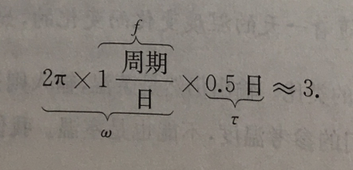
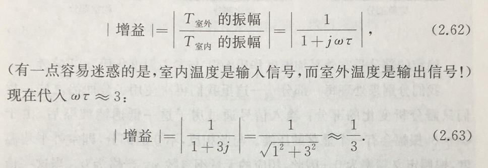
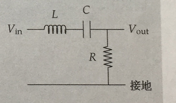
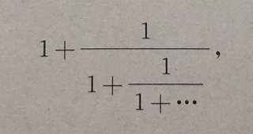

## 0204. 抽象

### 2.4 类比

#### 2.4.5 热学系统

RC 电路可以作为热学系统模型 —— 尽管热学系统并不是明显地和电路有关。在热学系统中，是温差（与电压类似的量）导致了能流。能量流用不太时髦的词来说，就是热流。并且，热流正比于温差一一正如电流正比于电压一样。在这两个系统中，流都正比于驱动力。因此，热流可以用电路的类比来理解，特别地，可以用低通滤波电路来理解。


举例来说，我常常会泡一杯茶，但由于比较烫而忘了喝。像电容放电样，茶会慢慢冷却到室温而没法再喝。热量通过杯子流失了。杯壁起到了热阻抗的作用；与 RC 电路类比，将热阻抗用 Rt 表示。

热量储存在水和杯子里，水和杯子起到了热库的作用。是这个热库而不是电荷库提供了热量的储存，我们将其表示为 Ct（这样，杯子起到了热阻抗和热容器的作用。）阻抗和容器是可转换的概念。与 RC 电路类似，乘积 RtCt 是热学时间常数 τ。为了估算 τ，我们可以进行一个家庭实验（这个方法我们曾在章节 1.7 用过）。

先加热一杯茶当它冷却时，画出茶温和室温之间的温度变化。以我丰富的饮茶经验，杯可享用的热茶冷却半小时就变成温茶。为了量化这些温度，可享用的热茶温度约在华氏 130 F (55℃），室温在华氏 70 F (≈20℃），温茶约在华氏 85 F (30℃）。


➤ 根据这些数据，这杯茶的热学时间常数大约是多少呢？

经过一个热学时间常数后，温度下降的因子为 e（正如经过一个电学时间常数后，电压下降的因子为 e 一样）。对于我这杯茶，茶温和室温之间一开始的温差是华氏 60 °F：

```
可享用的茶温-室温=60 °F
```

经过半小时，如果茶在微波炉中冷却，温差下降到华氏 15 °F 度：

```
温热的茶温-室温=15 °F 
```

因此，在半小时内温差下降了 4 倍。如果下降一个典型的因子 e（约 2.72）倍则将只需要较短的时间：或许是 0.3 小时（约 20 分钟）而不是 0.5 小时。更精确的计算是用 ln4 来除 0.5 小时，这给出 0.36 小时。然而，在输入数据如此不精确的情况下，没有什么必要去做如此精确的计算。因此，我们可以粗略地估算热学时间常数 τ 约为 0.3 小时。

利用这个估算，我们就能理解经常发生的一杯茶在微波炉中孤独地待了几天所发生的情况，这当然取決于每天室温的变化。这个分析将成为我们分析房间里一天温度变化的模型。

➤ 杯茶是如何随着一天的温度变化而变化的，如果 τ=0.3 小时？

首先，建立电路的类比。输出仍然是茶温，输入则是变化的室温。然而，接地端，则是我们的参考温度，不能也是室温。我们需要一个恒定的参考温度。最简单的选择就是取平均室温「T平均」。（当我们将这个分析推广到房间内的温度变化的分析时，我们会看到结论是一样的，只是取了不同的参考温度。）

连接输入和输出的放大器的增益为：

```
增益=输出振幅/输入振幅=1/(1+jwτ)
```

输入（室温）按照每天 1 个周期的频率 f 变化。因此，增益表达式中无量纲参数 wτ 约为 0.1：


这个系统由一个低频信号驱动：w 没足够大到使得 wτ 接近于 1。这个增益表达式提醒我们，茶杯对于温度变化来说是个低通滤波器。它将这个低频输入温度几乎没有改变地传输到了输出 —— 茶温。因此，内部（茶）温几乎完全和外部（室）温一样。

另一个极端情况是房子。与茶杯比较，房子具有大得多的质量，因而具有更大的热容量。相应地，房子的热学时间常数 τ=RtCt，也要比茶杯的长得多。对一个希腊式房子的研究给出结果 τ≈86 小时，大约 4 天。这些房子一定具有很好的绝热效果！当年我在开普敦教书的时候，那里阳光明媚，甚至在冬天房子都没有暖气，我住的房子隔热不是很好，热学时间常数大约只有 0.5 天。


对于开普敦的房子，无量纲常数 wτ 比茶杯的相应常数要大得多：



➤ wτ≈3 对室内温度会有什么影响？

在冬天，室外温度在华氏 45 F 到 75 F 之间。峰谷到峰顶有华氏 30 F 的变化，经过房子这个低通滤波器，这个变化就被压缩了大概 3 倍。下面通过估算增益的大小来给出如何得到这个因子的。



一般地，当 wτ 远大于 1，增益的大小近似为 1/wτ。因此，室外温度峰谷-峰顶的华氏 30 F 变化就变成室内温度的华氏 10 F 的变化：


➤ 室内平均温度是多少？

可以得到室内平均温度等于室外平均温度！为了知道原因，我们来仔细考虑参考温度（即接地的热学类比）。之前，在分析遗忘的茶杯时，我们的参考温度是室内平均温度。因为我们现在试图要确定这个值，就让我们使用已知的、方便的参考温度一一比如，较冷的 10℃，这是以摄氏或华氏（50F）取整后的值。

输入（室外温度）冬天在华氏 45 F 到华氏 75 F 之间变化。因此，可以将其分为两部分：1）通常的峰谷-峰顶之间华氏 30 F 的变化；2）稳定的华氏 10 F 的变化。


稳定的部分是室外平均温度华氏 60 F 与参考温度华氏 50 F 之差。

我们分别来处理每一部分一一这里我们再次使用了分而治之法。我们只需分析变化的部分：输入信号通过房子这一低通滤波器后，由于 wτ≈3，振幅会有一个显著的压缩。与此相反，不变的部分，即室外平均温度，按照定义频率为 0。因此，相应的无量纲参数 wτ 严格为 0。

当这一信号通过房子这个低通滤波器时增益为 1。因此，平均的输出信号（即室内平均温度）也是华氏 60 F：相对参考温度华氏 50 F 的稳恒部分，华氏 10 F 是相同的。

室内温度的华氏 10 F 峰谷-峰顶变化是围绕华氏 60 F 变化的。因此，室内温度的变化范围是华氏 55 F 到华氏 65 F。在室内，当我并不常跑步，或者说不产生太多热量时，我觉得 68 F（20℃）的温度让我感到舒适。正如这个热流的电路模型预言的，当我住在那个房子里的时候，日夜都只需要穿一件毛衣。（关于更多 RC 类比在建筑中的应用，见参考文献 [13]。）

题 2.20 什么时间房间里最冷？根据增益的一般表达式，1/(1+jwτ)，开普敦的房子在一天中什么时间是最冷的？假定室外是半夜最冷。

### 2.5 小结及进一步的问题

几何平均，阻抗，低通滤波器 —— 这些概念都是抽象的。抽象可以把表面上看起来杂乱无章的细节变成一个有机的高级结构，通过这个结构，可以让我们得到超出其来源的知识和洞察力。通过构建抽象，我们放大了我们的智慧。

题 2.21 从圆到球。在这个问题中，首先从圆的周长得到面积，然后用类似的分析得到球的体积。a）将半径为 r 的圆分解成楔形的饼图。然后将其拆开。


利用拆开的图形和已知的圆周长为 2πr 来证明圆面积为 πr^2。

b）将讨论推广到半径为 r 的球：由已知的球表面积为 4πr^2 推出球的体积。（这个方法是古希腊人发明的。）

题 2.22 LRC 电路的增益。利用在题 2.19 中得到的电感的感抗来求典型 LRC 电路的增益。在这个结构中，输出电压是在电阻两段测量的，这是一个低通滤波器，高通滤波器还是个波段滤波器？



题 2.23 连分数。计算连分数：



将此题与题 2.8 比较。题 2.24 指数塔

计算：


其中，a^bc 定义为 a^(bc)。

题 2.25 同轴电缆。世界各地的物理和电子实验室里，连接设备和信号传输的最好方式是使用同轴电缆。标准的同轴电缆，RG-58/U，其单位长度的电容为100 皮法/米，单位长度电感为 0.29 微亨/米。可以看成是一个很长的电感-电容网络：


将多大的电阻 R 放在末端（与最后的电容并联）能使电缆看起来像无限长的 LC 电缆？题 2.26 UNIX 和 LINUX。迈克·甘卡兹（Mike Gancarz）的《UNIX 哲学》（The UNIX Philosophy），或《Linux 和 UNIX 哲学》（Linux and the Unix Philosophy），在这些（密切相关的）操作系统的设计和哲学中找出抽象的例子。
