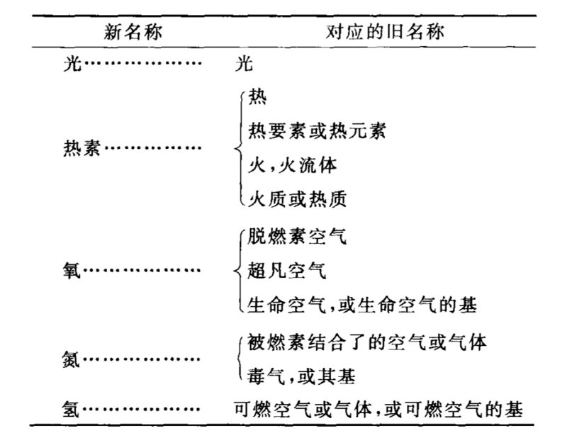
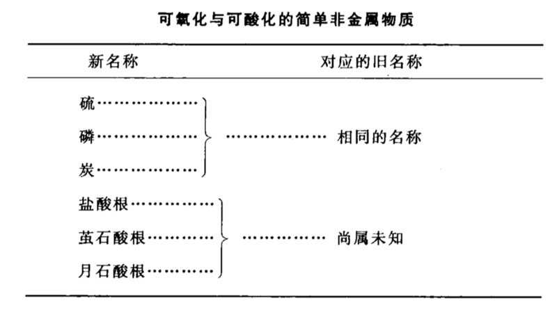
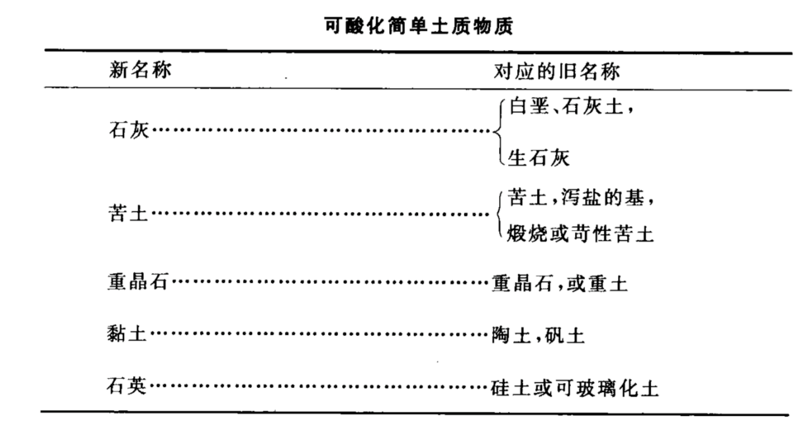

## 第二部分导言 —— 论酸与成盐基的化合，论中性盐的形成

第二部分主要由中性盐命名表组成的。对于这些命名表，我只增加了一般的解释，其目的是指出获得不同种类已知酸的最简单过程。

—— 拉瓦锡

### 导言

假若我严格实施了我最初制订的撰写本书的计划，那么在构成这一部分的各种表格及相应的观察结果中，我就只会涉及几种已知酸的简略定义和对一些方法的概略说明，用这些方法，只要对这些酸与各种成盐基的化合所产生的中性盐加以命名或枚举，就可以得到它们。

但是我后来发现，增补类似的表，把成为酸和氧化物的组成部分的一切简单物质，以及这些元素各种可能的化合物都包括进来，会极大地增加本书的效用而不致增加很多篇幅。这些增补包括在这一部分的前十二节及附加于这些节的表中，多少算是对第一部分前十五章的概括。其余各表各节则包括所有的含盐化合物。

十分明显的是，在本书的这一部分之中，我较多地借用了德·莫维先生在《物质次序全书》（EncyclopedieparordredesMatieres）第一卷中已经发表了东西。我没能发现更好的信息来源，当考虑到查阅外文书籍的困难时尤为如此。我这样承认，是为了避免麻烦，免得在我的以下部分中引用德·莫维先生的著作。

### 简单物质表

属于整个自然界的简单物质，这些简单物质可以看做是物体的元素。

备注：

氧化镁（化学式：MgO）也称苦土，是镁的氧化物，一种离子化合物；常温下为白色固体；氧化镁以方镁石的形式存在于自然界中。 氧化镁可由煅烧碱式碳酸镁（英语：Dypingite）（碳酸镁类）或氢氧化镁制得；煅烧温度在 400-900℃ 制成轻质氧化镁，在 900℃ 以上制成重质氧化镁。 也可用二氧化碳当氧化剂制造。

重晶石（英文：Barite 或 Baryte），主要成分为硫酸钡（BaSO4），颜色从白色至透明，同时也是钡的主要来源之一。而在重晶石矿物群（英语：baryte group）主要由重金石、天青石、硫酸铅矿以及重晶石和天青石的固溶体组成。

石灰是生石灰的俗称，主要成分是氧化钙（CaO）。把生石灰和水混合产生化学反应，就会产生出熟石灰（消石灰，学名氢氧化钙（Ca(OH)2）。熟石灰在一升水中溶解 1.56  克，它的饱和溶液称为石灰水，呈碱性，与二氧化碳产生化学反应后，就会产生碳酸钙（石灰石，CaCO3），碳酸钙加热后进行热分解反应，又形成氧化钙（CaO）和二氧化碳（CO2）。