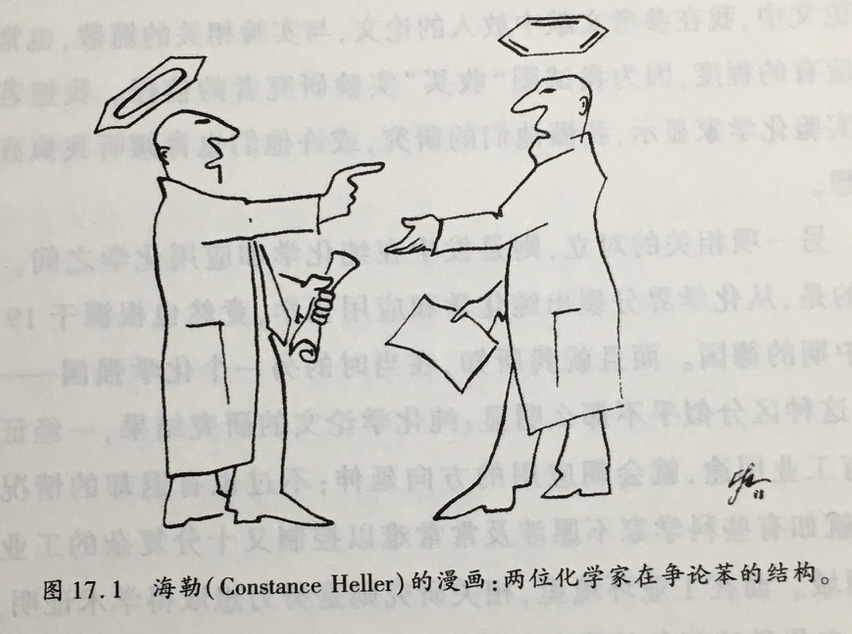

## 0207. 斗争

在化学论文的表象底下，有不得不作的心智斗争。这是无可避免的，因为科学就是凭借论证才得以存在。「论证」有几种意义，可以把它当成简单的推理过程，是对事实的陈述；或意味着不同意先前的观点，并提出相反的见解。我要声明这两种意义对科学都是不可或缺的，它们代表冷静的逻辑推理和狂热的坚信；尽管论证两方对模型、理论和测量的叙述，会有一方是正确的，而另一方是不对的。

我觉得科学创造力根植于人性内在的不安，而这个人知道自己是正确的，而且必须为坚信的事物，提出令他人满意的证明，并发表在科学期刊上。

然而，一篇语气平和的优良科学论文，可能藏有作者强烈的情绪暗流、修辞策略以及对本领的宣扬。但是尖声大叫地说服大家「我是对的，你们全错了」的欲望，无疑与维系学者风范的既有礼法相互冲突。所以，要在何处取得平衡，就见仁见智了。

在实验和理论之间，还存在另一种无声的对话。在化学领域里，实验化学家与理论化学家之间既爱又恨的暖昧关系，并不稀奇；它就像文学领域里「作家」和「评论家」的关系，或者在经济学的领域里也有相似的关系。这种特殊关系的处理方式，很容易被人拿来当成讽刺漫画的题材实验化学家认为理论化学家不切实际，好像在筑空中楼阁，但是他们却需要理论化学家提供的理解架构；理论化学家也许并不信任实验化学家，却希望人家愿意从事他们需要的关键测量。但是，如果理论科学家完全不与实际的事物接触，将立足于何处呢？

有个可笑的现象是：在偶尔会有「延伸理论讨论」的实验论文中，你会发现作者刻意经营「理论与实验共舞」的情绪。在这些讨论里，有部分是真正对理解的追求，但另一部分则企图利用广为学者接受的化约主义，来加深同行的印象（以夸大的方式为较数学化的结果欢呼）。对此我可没有言过其实。另一方面，在我自己的理论论文中，我在参考文献中放入的论文，与实验相关的篇数，也常超出应有的程度，因为我试图「收买」实验研究者的信任。我想若是向实验化学家显示，我懂他们的研究，或许他们也肯倾听我疯狂的奇想。

另一项相关的对立，则是发生在纯化学和应用化学之间。有趣的是，从化学界分裂出纯化学和应用化学，竟然也根源于 19 世纪中期的德国。而且就我所知，在当时的另一个化学强国 —— 英国，这种区分似乎不那么明显：纯化学论文的研究结果，一经证明具有工业用途，就会朝应用的方向延伸；不过也有退却的情况发生，就如有些科学家不愿涉及常常难以控制又十分复杂的工业触媒领域。而在工业环境里，相关研究则是努力想取得学术证明。

在化学这门与经济密切相关的科学之中，最重要且无声的挣扎，也许要算公布或保密的决定了。这和化学文献中见到的那种挣扎不同，因为一旦决定要发表研究结果，就要尽可能使内容正确。并且你的研究结果愈有趣，竞争对手就愈可能会去检验它。还有可以确定的是，他们一定会兴高采烈地把你的错误公之于世。

不过，要是你有什么具备商业价值的结果，应下的重要决定是：要不要延后发表，以建立你的专利地位，或者根本就不发表。请回想第 10 章提过的，关于多马克发现磺胺类药物的杰出故事，当时的多马克正替德国法本企业集团工作。他在 1935 年发表论文，公布早在三年前就合成出来的化合物 一一 第一种合成的磺胺剂（对胺基苯磺酰胺）。而且，多马克是在获得专利权后一个月，才发表这篇论文的。