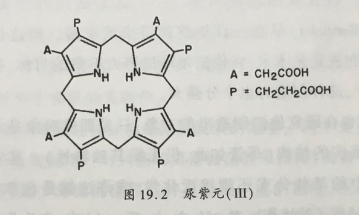

第三部 制造分子

## 0301. 创造与发现

大体来说，科学家在描述他们从事的工作时，会把它形容成「发现」，艺术家则以「创造」来描述。「揭开自然的奥秘」这句陈年老调，就像强力胶般固着在我们心里。但是我认为用「发现」这个词只能有效描述科学家从事的部分活动，而且也只是化学家一小部分的工作而已。不过，「发现」这个意象之所以被迅速接受，自有其历史、心理和社会的原因。我们必须把这些提出来谈谈。

### 1.1 历史和心理因素

现代科学在欧洲的崛起，恰巧和地理上的探险勘查同时发生，人们开始航向遥远的对岸，去探测未知的土地；甚至到了 20 世纪，还有一位叫阿蒙森（Roald Amundsen）的人，首次扬帆横渡西北航路，绕了半圈地球抵达南极。长途的探索旅程、新画出的地图，以及第一眼看见皇家陵墓中耀眼的金质器皿，对「发现」这个词汇来说，都是深具说服力的意象。难怪科学家会接受以「发现」描述他们在实验室的研究活动。而实验室的研究工作，有某些性质与想象中的冒险共通吗？

这里有一段诗，代表了当时一般人的想法，它是了不起的英国化学家戴维（Humphry Davy）写的：

噢，至为壮丽高贵的自然啊！

我难道未曾以不朽的先人所奉献的爱来崇拜你吗？

敬墓你那亲眼可见的创造，探求你那隐藏的神秘道路，就如同诗人、哲学家、智者一般？

偷窥、揭露和穿透这些男性的隐喻，是 19 世纪对于科学特有的描述方式，因为它们恰好符合了「发现」的概念。

### 1.2 社会和教育因素

我相信那些科学家出身的科学哲学家，大致都来自物理学和数学的领域，不过杰出的哲学家波拉尼（Michael Polanyi）是例外，他是深具洞见的物理化学家，所以专业哲学家的养成教育也可能偏重在物理、数学领域；因此，逻辑在哲学中扮演重要的角色，是可以理解的。而科学哲学家专业领域里流行的推理思考方式，也无疑会经由他们拓展到所有科学领域 一一 不过，我认为这样并不切实际。

### 1.3 哲学因素

法国理性主义者（rationalist）的传统，以及最先系统化的天文学和物理学，都在科学的核心上遗留了化约主义的哲学，而这我在第 4 章中就反对过了。然而，化约主义哲学却正符合「发现」一词，也就是深人挖掘以发现真理的特质。

话说回来，化约主义只是理解的一部分而已；我们生来并不只会把事物解构、拆散和分析，我们还能建造出新的事物。而且，主动创造所面临的考验，要比被动理解更严苛；或许「考验」用在这里并不恰当，因为建立和创造本来就与化约主义者的分析方式迥然不同。关于这点，我要说：在科学中更重要的，其实是先进的建设模式。物理学家费曼一度在黑板上写道：「要是我无法创造出某种事物，就表示我并不了解它。」

歌德在 1809 年出版的一本独特的小说《亲和力》中，提出了有关化学键理论的隐喻，而且还在分析法仍居科学的中心地位之际，就有先见之明地赞颂化学合成，并编造出一段艾都尔和夏绿蒂之间的对话：

「亲和力只有在导致「离异」时，才显得有趣。」

「难道这个在我们今日社会里经常听到且令人悲伤的字眼，也发生在自然科学领域吗？」

「的确，」艾都尔回答道，「甚至把化学家称为促使物与另一物离异的艺术家，对他们而言，还是一种恭维呢。」

「但如今已不再如此，」夏绿蒂说道，「现在，合成才是好事。因为使事物结合是更伟大的艺术和功劳，能够把任何一个主题统合的艺术家，将会受到普遍欢迎。」

奇怪的是，化学家竟然会接受用「发现」这词来说明研究过程。化学是分子（一百年以前，人们称它为「物质」或「化合物」）及其结构变化的科学。的确，某些分子原本就存在那儿，只等着我们去认识它们的静态性质，例如含有什么原子，这些原子如何连接，分子的形状如何，有哪些美妙的色彩；还有分子在动力学上的特性，像是分子内部的运动和它们的活性。这些分子有些是属于大地的，如简单的水和复杂的孔雀石；有些是属于生命体的，如结构甚为简单的胆固醇和较为复杂的血红素。因此，「发现」这个字显然适用于这些分子的研究上。

但是，还有更多我们在实验室里制造出来的化学分子。想来我们人类的产量还真是惊人——目前登记已知而且对其特性做过详细研究的化合物，就已超过千万种。竟然合成出一千万种以前地球上不存在的化合物呢！它们的合成确实依循基本的规则，而且若甲化学家未能在某日制造出某种分子，或许几天或几十年后，乙化学家就合成出来了。化学家会挑选他们想制造的分子和不同的制造方式。这种情形与艺术家的情况有几分雷同：艺术家受到颜料与画布的物理性质约束，并受训练所熏陶，从而创造出新的作品。

在化学领域中，有时我们显然是以「发现的方式」在处理事物。比如，阐明已知天然分子的结构或动力学时，通常仍须涉及人造的分子。我曾听过优秀的英国化学家巴特斯比（Alan Battersby）的精彩演讲，谈的是尿紫元（III）（uroporphyrinogen-lII，缩写商品名为 uro'en-lII）的生物合成。这乍看之下并不是极富魅力的分子，但却是植物用来制造叶绿素的前驱物，而叶绿素又是所有光合作用的活性基础；此外，在所有细胞中进行电子传递的细胞色素（cytochrome）都要用到尿紫元（lII）的一种衍生物；还有，血红素中含铁的重要氧分子载体，也是衍生自这种小的盘状分子。

图 19.2 画的尿紫元（lII），是由四个吡咯（pyrrole）环构成，它们相互结成一个更大的环。请注意每个环中 A 和 P 的记号，这两个字母分别代表乙酰基（CH2COOH）和丙酰基（CH2CH2COOH）。你从大约十点钟方向的位置顺时针沿环走，就会发现它们的顺序都相同，只有最后一组是倒反的，所以这些记号读起来应该是 A-P，A-P，A-P 和 P-A。

这个天然分子是怎样组合的，很显然就是一项关于「发现」的问题。其实这四个吡咯环是借助酵素连接成链，然后才形成环。但是起初合成时把最后一个环给「放反」了（也就是原先该环上的 A、P 标记顺序和其他的环都相同，都是 A-P）。后来是经由一个奇妙的反应程序，才使最后一个环翻转到正确位置。

这个不可思议但真实的故事，是由巴特斯比和他的工作同仁利用一系列「合成」的分子推论出来的。他们设计的分子可用来模拟生命系统中某些重要的分子，每个合成的「假想中间产物」也会受到和生理环境类似的环境影响。如此，研究人员就可从中探索出系列天然的反应过程；也就是说，利用人为制造出来的产物，学习大自然如何建造出使生命运作的分子。

「分子合成使化学十分接近艺术，因为我们创造出日后可供自已（或他人）研究或鉴赏的对象。」这是法国化学家伯特洛（Marcellin Berthelot）早在一百年前就道出的见解。而这也正是作家、作曲家和视觉艺术家，在他们领域里努力不解的目标，我相信在化学领域中，这种创造力也十分强大。

数学家也在研究他们创造出的对象，只是那些对象是心智的概念，而不是真实的结构（尽管如此，仍无损其独特性）。其实在这方面，工程学中的某些分支还颇接近化学，或许这就是在李维（Primo Lei）的小说《猴子的忧伤》（The Money' s Wrench）中，身为化学家的叙事者，会对主角法森（Bussone）这位建筑师感到惺惺相惜的原因吧。

工程师比灵顿（David Billington）曾对工程学的特质，做了清楚的分析：

虽然科学和工程学都用到物理实验和数学公式这两项技巧，但是学生很快就会发觉，若把这些技巧应用在这两种不同的学域上，会显得十分不同。工程学的分析是去观察和试验桥梁、汽车及其他人造物品的实际运作情况；科学的分析则依赖在实验室里对自然现象进行严密控制的实验和观察，并且获得解释该现象的普适性数学理论。因此，工程上对事物的研究是为了改变它们，而科学上则是为了解释它们。

2『科学和工程的区别，做一张术语卡片。』——已完成

可惜，美中不足的是，比灵顿也掉进了「把科学当成发现」的陷阱中。

理论和假说的建立也是创造的行为，甚至比物质的合成更具创造性；因为我们必须经由想象，在脑海中浮现一个模型，使它能符合经常不按脾理出脾的观察结果。尽管如此，它还是有迹可循的，那就是建立的模型必须和先前获得的可靠知识一致，而以往的知识会提供我们「该做些什么」的暗示，而且我们也可了解相关问题已解答了多少。不过真正重要的还是，我们要寻求的是前所未有的解释，也就是两个世界的关联性。

其实如下的叙述往往就是提供线索的隐喻：「两个交互作用的系统，嗯…让我们用一对共振的简谐振荡器来模拟，或者…...一个穿透障碍的问题。」外面的世界或许只呈现中度的混乱，但是我们不了解的部分却呈现出惊人的混乱，因此我们会想了解这其中蕴藏的模式。人类很聪明，是「混沌的鉴察家」，所以我们能发现并且创造出这样的模式。机敏的读者瑞彼（Mary Reppy）对此下了睿智的评论：

我认为，问题中实际存在的复杂性使问题显得有趣，但这真实的复杂性又要够简单（经由近似法）或够小，才能进行模拟，而这两者之间存在着一种平衡。已经被完全了解（或化约）的问题很乏味，但是过于复杂的问题却会令人受挫。

如果有更多科学哲学家受过化学训练，我确信我们眼前会呈现出迥然不同的科学样貌。

艺术全都是创造吗？我不这么认为。我在这里提出维瓦思（Eliseo Vivas）的研究，他的一本散文集的名称，就跟本章的章名样，都叫「创造与发现」。他主张艺术里有许多的创作是融合了发现的过程。维瓦思在一篇诗评里论道，诗人并不能做出如《创世记》描述的「起初，神创造天地」那样的神迹。诗人做的反而比较像第二经节里报道的事情：在诗人到来以前，地球对我们而言，无所谓形体且虚空混沌，海面上一片黑暗。诗人把光明从黑暗中分离出来，带给我们一个有秩序的世界。若不经由他们，我们无法得见这一切......诗透露了诗人经由创造的行为而领悟的事物。

维瓦思接着又说：

我想象具有创造力的心灵，就是去发现生存价值的心灵…从人类文明立场来看，心灵能创造出新的价值，而这些新价值原先并不存在于具有创造力的心灵，或是人类的文明之中。但诗人的心灵，却能借着把它们从现世提升到诗里的方式，来发现新的价值；再由读者把诗及其中的新价值观，带到各地广为流传。

诗人穆尔（Richard Moore）则写道：

艺术家最好向所有未知的力量祈祷，并且用各种仪式来表达他的愿望，但愿自己千万不要创造出任何事物，只要为所有对艺术有兴趣的人，寻找待发现的事物即可。他定不要去创造事物，只要去发现便是。

我很同意维瓦思和穆尔的见解。我认为艺术大体上是去发现存在于我们周遭的深奥真理，尽管它们经常与科学尝试去了解的那套问题重叠，但它更经常触及那套问题以外的事物。艺术立志要发现探索和阐明我们共通、不断改变而且不可化约的内在世界，也就是「去建构更完美的生活，肉眼无法看见的城市，以及属于我们自己的星宿」。